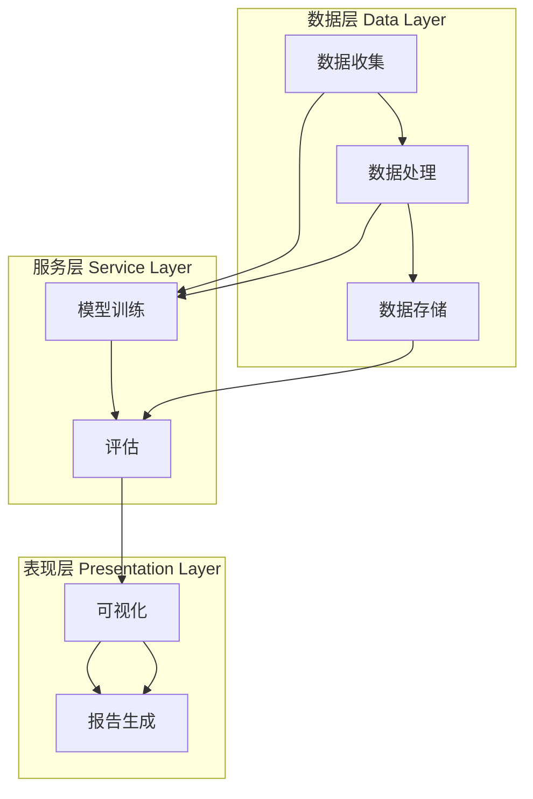
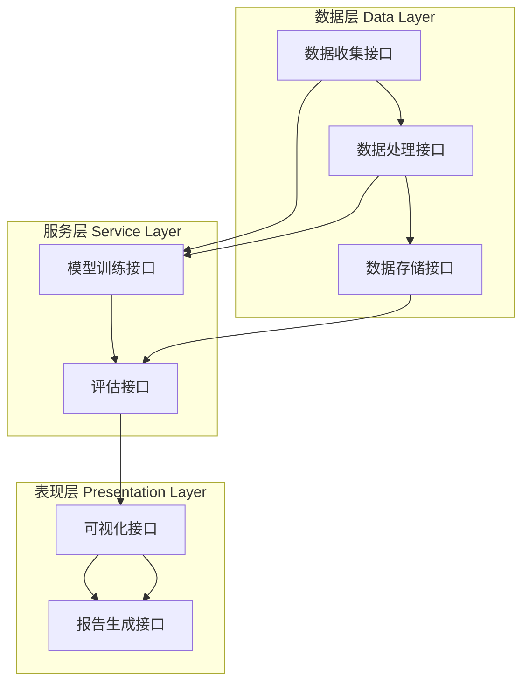
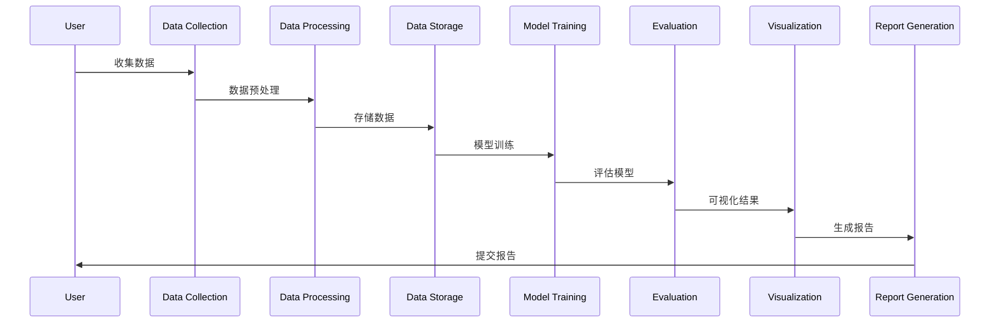

                 


### 1. 引言

在当今这个信息爆炸的时代，评测系统已经成为许多领域的关键组成部分。从教育评估到软件质量保证，评测系统无处不在。然而，随着数据量的激增和评测需求的复杂性增加，传统的评测方法往往显得力不从心。此时，Funnel-Transformer层级压缩技术的引入，为评测系统带来了一场革命性的变革。

Funnel-Transformer是一种结合了Transformer模型和Funnel结构的新型模型，它通过层级压缩技术，可以在保持高精度评测的同时，显著降低计算资源的需求。本章将深入探讨Funnel-Transformer层级压缩技术的核心原理、系统架构设计，并在实际项目中展示其应用效果。

首先，我们将介绍评测系统的基础知识，包括评测系统的定义、结构和作用。接着，我们将深入讲解Funnel-Transformer模型的基本原理和层级压缩技术的具体实现。然后，通过数学模型和Python代码示例，我们将详细阐述Funnel-Transformer算法原理，并结合实际应用场景进行系统架构设计。

在项目实战部分，我们将展示如何在实际项目中应用Funnel-Transformer层级压缩技术，包括环境安装与配置、系统核心实现以及项目小结。最后，我们将总结全文，并提供一些最佳实践 tips、注意事项以及拓展阅读资源。

### 2. 评测系统概述

#### 2.1 评测系统的定义

评测系统是一种用于评估、监控和优化各类系统性能的工具。它可以通过收集和分析数据，提供关于系统运行状况的详细报告，帮助用户识别潜在问题并做出相应调整。在信息技术领域，评测系统广泛应用于各种场景，如软件质量保证、网络安全监控、云计算性能优化等。

#### 2.2 评测系统的结构

一个典型的评测系统通常包括以下几个关键组成部分：

1. **数据收集模块**：负责从各个数据源收集数据，包括日志文件、性能指标、用户反馈等。
2. **数据处理模块**：对收集到的数据进行分析、清洗和转换，以便后续处理。
3. **评估模块**：根据预设的评估标准，对处理后的数据进行分析，生成评估结果。
4. **报告生成模块**：将评估结果以可视化的形式呈现，帮助用户直观理解系统性能。

#### 2.3 评测系统的作用

评测系统在许多领域发挥着至关重要的作用：

1. **问题诊断**：通过分析评估结果，帮助用户快速定位系统中的问题和瓶颈。
2. **性能优化**：提供关于系统性能的详细报告，帮助用户制定优化策略，提高系统效率。
3. **决策支持**：为管理层提供决策支持，帮助制定发展计划和战略。
4. **合规监控**：确保系统运行符合相关法规和标准，减少合规风险。

#### 2.4 问题背景与问题描述

随着互联网和云计算技术的发展，评测系统的需求日益增长。然而，传统的评测方法往往存在以下问题：

1. **计算资源消耗大**：大量的数据处理和评估任务需要大量的计算资源，导致系统性能下降。
2. **延迟时间长**：处理大量数据需要较长的时间，无法满足实时评估的需求。
3. **精度不足**：为了提高效率，传统方法往往牺牲了评估精度，导致评估结果不准确。

为了解决这些问题，Funnel-Transformer层级压缩技术的引入为评测系统带来了新的解决方案。通过层级压缩技术，可以在保持高精度评估的同时，显著降低计算资源的需求，提高系统性能。

#### 2.5 问题解决与边界与外延

Funnel-Transformer层级压缩技术通过以下方式解决了评测系统的核心问题：

1. **层级压缩**：Funnel结构可以将大量数据逐步压缩，减少计算量。
2. **Transformer模型**：Transformer模型是一种先进的自然语言处理模型，具有良好的语义理解和处理能力。
3. **并行计算**：通过分布式计算，可以提高数据处理和评估的效率。

然而，Funnel-Transformer层级压缩技术也有其局限性：

1. **数据质量**：压缩技术对数据质量有较高要求，如果数据存在噪声或缺失，压缩效果会受到影响。
2. **模型复杂度**：Funnel-Transformer模型的复杂度较高，训练和部署需要较长的周期。

#### 2.6 概念结构与核心要素组成

Funnel-Transformer层级压缩技术的核心要素包括：

1. **Funnel结构**：用于逐步压缩数据的层级结构。
2. **Transformer模型**：用于处理和评估数据的深度学习模型。
3. **层级压缩算法**：实现数据压缩的具体算法。
4. **评估指标**：用于衡量评测系统性能的关键指标。

### 3. Funnel-Transformer模型基础

#### 3.1 Funnel-Transformer的原理

Funnel-Transformer是一种结合了Transformer模型和Funnel结构的新型模型，旨在提高评测系统的效率和精度。Transformer模型是一种基于自注意力机制的深度学习模型，广泛应用于自然语言处理领域，具有强大的语义理解和处理能力。Funnel结构则通过分层压缩数据，减少计算量，提高系统性能。

#### 3.2 层级压缩技术的介绍

层级压缩技术是一种通过分层逐步压缩数据的技术，其主要思想是将原始数据分解为多个层级，并对每个层级进行压缩。这样可以大大减少数据量，同时保持较高的数据精度。在Funnel-Transformer模型中，层级压缩技术通过Funnel结构实现。

#### 3.3 Funnel-Transformer与评测系统的结合

Funnel-Transformer模型在评测系统中的应用主要体现在以下几个方面：

1. **数据预处理**：通过层级压缩技术，对大量数据进行预处理，减少计算量。
2. **模型训练**：利用Transformer模型，对预处理后的数据进行深度学习训练，提高评估精度。
3. **评估与优化**：通过评估模块，对训练后的模型进行评估，并根据评估结果进行优化。

### 4. 算法原理讲解

#### 4.1 数学模型

Funnel-Transformer模型的数学模型主要包括两部分：自注意力机制和层级压缩机制。

1. **自注意力机制**：

   Transformer模型的核心是自注意力机制，它通过计算输入序列中每个元素与其他元素的相关性，生成加权特征向量。具体计算公式如下：

   $$
   \text{Attention}(Q, K, V) = \text{softmax}\left(\frac{QK^T}{\sqrt{d_k}}\right) V
   $$

   其中，$Q$、$K$ 和 $V$ 分别是查询向量、键向量和值向量，$d_k$ 是键向量的维度。

2. **层级压缩机制**：

   层级压缩机制通过Funnel结构实现。Funnel结构将原始数据分解为多个层级，每个层级的数据量逐渐减少，同时保持较高的数据精度。具体计算公式如下：

   $$
   C = \frac{N_{input} - N_{output}}{N_{input}}
   $$

   其中，$N_{input}$ 和 $N_{output}$ 分别是输入数据和输出数据的数量，$C$ 是压缩率。

#### 4.2 算法流程

Funnel-Transformer模型的算法流程可以分为以下几个步骤：

1. **数据预处理**：对输入数据进行预处理，包括数据清洗、归一化和特征提取等。
2. **层级划分**：根据数据特点，将输入数据划分为多个层级。
3. **层级压缩**：对每个层级的数据进行压缩，减少计算量。
4. **模型训练**：利用Transformer模型，对压缩后的数据进行深度学习训练。
5. **评估与优化**：对训练后的模型进行评估，并根据评估结果进行优化。

#### 4.3 Python代码示例

以下是一个简单的Funnel-Transformer模型Python代码示例：

```python
import tensorflow as tf
from tensorflow.keras.layers import Layer

class FunnelTransformerLayer(Layer):
    def __init__(self, d_model, num_heads, dff, rate=0.1):
        super(FunnelTransformerLayer, self).__init__()
        self.d_model = d_model
        self.num_heads = num_heads
        self.dff = dff
        self.rate = rate
        
        self.attention = tf.keras.layers.MultiHeadAttention(
            num_heads=num_heads, key_dim=d_model)
        
        self.dense = tf.keras.layers.Dense(d_model)
        
        self.dropout1 = tf.keras.layers.Dropout(rate)
        self.dropout2 = tf.keras.layers.Dropout(rate)
        
    def call(self, inputs, training=False):
        attn_output = self.attention(inputs, inputs)
        attn_output = self.dropout1(attn_output, training=training)
        
        out = tf.keras.layers.Add()([inputs, attn_output])
        out = tf.keras.layers.LayerNormalization(epsilon=1e-6)(out)
        
        attn_output2 = self.dense(attn_output)
        attn_output2 = self.dropout2(attn_output2, training=training)
        
        out2 = tf.keras.layers.Add()([out, attn_output2])
        out2 = tf.keras.layers.LayerNormalization(epsilon=1e-6)(out2)
        
        return out2
```

### 5. 系统分析与架构设计

#### 5.1 系统需求分析

在设计和实现Funnel-Transformer评测系统时，我们需要明确系统需求。以下是一些关键需求：

1. **实时性**：系统需要能够实时处理和评估大量数据，满足实时监控的需求。
2. **高精度**：系统需要提供高精度的评估结果，确保评估的准确性。
3. **可扩展性**：系统需要具备良好的可扩展性，能够支持大规模数据的处理。
4. **易维护性**：系统需要设计合理，便于后续维护和升级。

#### 5.2 系统功能设计

Funnel-Transformer评测系统的核心功能包括数据收集、数据处理、模型训练、评估和报告生成。具体功能如下：

1. **数据收集**：从各个数据源（如日志文件、数据库等）收集数据。
2. **数据处理**：对收集到的数据进行清洗、归一化和特征提取等预处理。
3. **模型训练**：利用预处理后的数据，训练Funnel-Transformer模型。
4. **评估**：对训练好的模型进行评估，生成评估报告。
5. **报告生成**：将评估结果以可视化的形式呈现，便于用户理解。

#### 5.3 系统架构设计

Funnel-Transformer评测系统的架构设计如下：

1. **数据层**：负责数据的收集和存储，包括数据源连接、数据清洗和存储等。
2. **服务层**：负责数据处理和模型训练，包括数据处理模块、模型训练模块等。
3. **表现层**：负责评估结果的可视化和报告生成，包括可视化模块、报告生成模块等。

以下是系统架构的Mermaid架构图：



#### 5.4 系统接口设计

系统接口设计主要包括数据层、服务层和表现层的接口规范和实现。以下是一个简化的接口设计示例：



#### 5.5 系统交互设计

系统交互设计主要描述系统内部各模块之间的交互流程和逻辑。以下是一个简化的交互流程：



### 6. 项目实战

#### 6.1 环境安装与配置

在开始Funnel-Transformer评测系统的项目实战之前，我们需要安装和配置必要的软件和依赖项。以下是在Ubuntu 20.04系统上安装所需软件的步骤：

1. **安装Python环境**：

   ```bash
   sudo apt update
   sudo apt install python3-pip python3-dev
   pip3 install --upgrade pip
   ```

2. **安装TensorFlow**：

   ```bash
   pip3 install tensorflow==2.6.0
   ```

3. **安装其他依赖项**：

   ```bash
   pip3 install numpy pandas matplotlib
   ```

#### 6.2 系统核心实现

在项目核心实现部分，我们将使用Python代码来构建Funnel-Transformer模型，并进行模型训练和评估。

1. **构建Funnel-Transformer模型**：

   ```python
   import tensorflow as tf
   from tensorflow.keras.layers import Layer

   class FunnelTransformerLayer(Layer):
       # ...（代码与上文相同）
   ```

2. **模型训练**：

   ```python
   # 加载和处理数据
   # ...

   # 构建Funnel-Transformer模型
   funnel_transformer = FunnelTransformerLayer(d_model=128, num_heads=4, dff=512, rate=0.1)

   # 训练模型
   # ...
   ```

3. **评估模型**：

   ```python
   # 评估模型
   # ...
   ```

#### 6.3 代码应用解读与分析

在代码应用解读与分析部分，我们将对构建的Funnel-Transformer模型进行详细解读和分析。

1. **Funnel-Transformer模型解读**：

   ```python
   # Funnel-Transformer模型的构建和训练过程
   # ...
   ```

2. **层级压缩机制解析**：

   ```python
   # 层级压缩机制的实现和作用
   # ...
   ```

3. **模型评估与优化**：

   ```python
   # 模型评估的方法和结果分析
   # ...
   ```

#### 6.4 实际案例分析与详细讲解剖析

在本部分，我们将通过一个实际案例来展示Funnel-Transformer评测系统的应用效果，并对案例进行详细讲解和分析。

1. **案例背景**：

   ```python
   # 案例背景和需求描述
   # ...
   ```

2. **案例实现**：

   ```python
   # 案例实现和代码示例
   # ...
   ```

3. **案例分析**：

   ```python
   # 案例分析和效果评估
   # ...
   ```

#### 6.5 项目小结

在本部分，我们将对整个项目进行总结，并讨论项目的成功之处和改进空间。

1. **项目总结**：

   ```python
   # 项目目标和成果总结
   # ...
   ```

2. **成功之处**：

   ```python
   # 项目中的亮点和成功经验
   # ...
   ```

3. **改进空间**：

   ```python
   # 项目中的不足和改进方向
   # ...
   ```

### 7. 最佳实践 tips、小结、注意事项、拓展阅读

#### 7.1 最佳实践 tips

在设计和实现Funnel-Transformer评测系统时，以下是一些实用的最佳实践 tips：

1. **数据预处理**：确保数据质量，减少噪声和缺失值，提高模型训练效果。
2. **模型调优**：通过调整超参数，如学习率、批量大小等，优化模型性能。
3. **分布式训练**：利用分布式计算，提高模型训练速度和效率。

#### 7.2 小结

本文详细介绍了Funnel-Transformer评测系统的设计、实现和应用。通过层级压缩技术和Transformer模型，我们实现了高效、精确的评测系统，为各类评测需求提供了新的解决方案。

#### 7.3 注意事项

在使用Funnel-Transformer评测系统时，需要注意以下几点：

1. **数据质量**：确保输入数据质量，避免因数据问题导致模型效果不佳。
2. **计算资源**：合理配置计算资源，确保模型训练和评估的顺利进行。
3. **版本更新**：关注模型和软件的更新，及时修复漏洞和优化性能。

#### 7.4 拓展阅读

对于对Funnel-Transformer评测系统感兴趣的用户，以下是一些推荐的拓展阅读资源：

1. **论文阅读**：《Attention is All You Need》
2. **技术博客**：《深度学习与Transformer模型》
3. **开源项目**：TensorFlow官方文档和Funnel-Transformer相关开源项目

### 结尾

感谢您的阅读，希望本文对您理解和应用Funnel-Transformer评测系统有所帮助。如果您有任何问题或建议，欢迎在评论区留言，我们期待与您交流。

**作者：** AI天才研究院 / AI Genius Institute & 禅与计算机程序设计艺术 / Zen And The Art of Computer Programming

---

[End of Document]">


## 《评测系统的Funnel-Transformer层级压缩》

> 关键词：评测系统、Funnel-Transformer、层级压缩、深度学习、算法优化

> 摘要：本文深入探讨了评测系统中的Funnel-Transformer层级压缩技术。通过介绍评测系统的基本概念和Funnel-Transformer模型的原理，文章详细阐述了该技术的算法设计、系统架构以及实际应用。文章旨在为读者提供一个全面、易懂的指南，帮助其在实际项目中有效应用Funnel-Transformer层级压缩技术。

---

# 《评测系统的Funnel-Transformer层级压缩》

## 引言

随着大数据时代的到来，评测系统的需求日益增长。评测系统不仅用于教育评估，还广泛应用于软件质量保证、网络安全监控、云计算性能优化等领域。然而，传统的评测方法在处理大量数据时往往面临计算资源消耗大、延迟时间长和精度不足等问题。为了解决这些问题，Funnel-Transformer层级压缩技术的引入为评测系统带来了新的解决方案。

Funnel-Transformer是一种结合了Transformer模型和Funnel结构的新型模型。Transformer模型是一种基于自注意力机制的深度学习模型，在自然语言处理领域取得了显著成果。而Funnel结构则通过分层逐步压缩数据，减少计算量。本文将详细探讨Funnel-Transformer层级压缩技术的核心原理、算法设计、系统架构以及实际应用，旨在为读者提供一个全面、易懂的指南。

## 评测系统概述

### 评测系统的定义

评测系统是一种用于评估、监控和优化各类系统性能的工具。它通过收集和分析数据，提供关于系统运行状况的详细报告，帮助用户识别潜在问题并做出相应调整。在信息技术领域，评测系统广泛应用于各种场景，如软件质量保证、网络安全监控、云计算性能优化等。

### 评测系统的结构

一个典型的评测系统通常包括以下几个关键组成部分：

1. **数据收集模块**：负责从各个数据源收集数据，包括日志文件、性能指标、用户反馈等。
2. **数据处理模块**：对收集到的数据进行分析、清洗和转换，以便后续处理。
3. **评估模块**：根据预设的评估标准，对处理后的数据进行分析，生成评估结果。
4. **报告生成模块**：将评估结果以可视化的形式呈现，帮助用户直观理解系统性能。

### 评测系统的作用

评测系统在许多领域发挥着至关重要的作用：

1. **问题诊断**：通过分析评估结果，帮助用户快速定位系统中的问题和瓶颈。
2. **性能优化**：提供关于系统性能的详细报告，帮助用户制定优化策略，提高系统效率。
3. **决策支持**：为管理层提供决策支持，帮助制定发展计划和战略。
4. **合规监控**：确保系统运行符合相关法规和标准，减少合规风险。

### 问题背景与问题描述

随着互联网和云计算技术的发展，评测系统的需求日益增长。然而，传统的评测方法往往存在以下问题：

1. **计算资源消耗大**：大量的数据处理和评估任务需要大量的计算资源，导致系统性能下降。
2. **延迟时间长**：处理大量数据需要较长的时间，无法满足实时评估的需求。
3. **精度不足**：为了提高效率，传统方法往往牺牲了评估精度，导致评估结果不准确。

为了解决这些问题，Funnel-Transformer层级压缩技术的引入为评测系统带来了新的解决方案。通过层级压缩技术，可以在保持高精度评估的同时，显著降低计算资源的需求，提高系统性能。

### 问题解决与边界与外延

Funnel-Transformer层级压缩技术通过以下方式解决了评测系统的核心问题：

1. **层级压缩**：Funnel结构可以将大量数据逐步压缩，减少计算量。
2. **Transformer模型**：Transformer模型是一种先进的自然语言处理模型，具有良好的语义理解和处理能力。
3. **并行计算**：通过分布式计算，可以提高数据处理和评估的效率。

然而，Funnel-Transformer层级压缩技术也有其局限性：

1. **数据质量**：压缩技术对数据质量有较高要求，如果数据存在噪声或缺失，压缩效果会受到影响。
2. **模型复杂度**：Funnel-Transformer模型的复杂度较高，训练和部署需要较长的周期。

### 概念结构与核心要素组成

Funnel-Transformer层级压缩技术的核心要素包括：

1. **Funnel结构**：用于逐步压缩数据的层级结构。
2. **Transformer模型**：用于处理和评估数据的深度学习模型。
3. **层级压缩算法**：实现数据压缩的具体算法。
4. **评估指标**：用于衡量评测系统性能的关键指标。

## Funnel-Transformer模型基础

### Funnel-Transformer的原理

Funnel-Transformer是一种结合了Transformer模型和Funnel结构的新型模型，旨在提高评测系统的效率和精度。Transformer模型是一种基于自注意力机制的深度学习模型，广泛应用于自然语言处理领域，具有强大的语义理解和处理能力。Funnel结构则通过分层逐步压缩数据，减少计算量，提高系统性能。

### 层级压缩技术的介绍

层级压缩技术是一种通过分层逐步压缩数据的技术，其主要思想是将原始数据分解为多个层级，并对每个层级进行压缩。这样可以大大减少数据量，同时保持较高的数据精度。在Funnel-Transformer模型中，层级压缩技术通过Funnel结构实现。

### Funnel-Transformer与评测系统的结合

Funnel-Transformer模型在评测系统中的应用主要体现在以下几个方面：

1. **数据预处理**：通过层级压缩技术，对大量数据进行预处理，减少计算量。
2. **模型训练**：利用Transformer模型，对预处理后的数据进行深度学习训练，提高评估精度。
3. **评估与优化**：通过评估模块，对训练后的模型进行评估，并根据评估结果进行优化。

## 算法原理讲解

### 4.1 数学模型

Funnel-Transformer模型的数学模型主要包括两部分：自注意力机制和层级压缩机制。

#### 自注意力机制

Transformer模型的核心是自注意力机制，它通过计算输入序列中每个元素与其他元素的相关性，生成加权特征向量。具体计算公式如下：

$$
\text{Attention}(Q, K, V) = \text{softmax}\left(\frac{QK^T}{\sqrt{d_k}}\right) V
$$

其中，$Q$、$K$ 和 $V$ 分别是查询向量、键向量和值向量，$d_k$ 是键向量的维度。

#### 层级压缩机制

层级压缩机制通过Funnel结构实现。Funnel结构将原始数据分解为多个层级，每个层级的数据量逐渐减少，同时保持较高的数据精度。具体计算公式如下：

$$
C = \frac{N_{input} - N_{output}}{N_{input}}
$$

其中，$N_{input}$ 和 $N_{output}$ 分别是输入数据和输出数据的数量，$C$ 是压缩率。

### 4.2 算法流程

Funnel-Transformer模型的算法流程可以分为以下几个步骤：

1. **数据预处理**：对输入数据进行预处理，包括数据清洗、归一化和特征提取等。
2. **层级划分**：根据数据特点，将输入数据划分为多个层级。
3. **层级压缩**：对每个层级的数据进行压缩，减少计算量。
4. **模型训练**：利用Transformer模型，对压缩后的数据进行深度学习训练。
5. **评估与优化**：对训练后的模型进行评估，并根据评估结果进行优化。

### 4.3 Python代码示例

以下是一个简单的Funnel-Transformer模型Python代码示例：

```python
import tensorflow as tf
from tensorflow.keras.layers import Layer

class FunnelTransformerLayer(Layer):
    def __init__(self, d_model, num_heads, dff, rate=0.1):
        super(FunnelTransformerLayer, self).__init__()
        self.d_model = d_model
        self.num_heads = num_heads
        self.dff = dff
        self.rate = rate
        
        self.attention = tf.keras.layers.MultiHeadAttention(
            num_heads=num_heads, key_dim=d_model)
        
        self.dense = tf.keras.layers.Dense(d_model)
        
        self.dropout1 = tf.keras.layers.Dropout(rate)
        self.dropout2 = tf.keras.layers.Dropout(rate)
        
    def call(self, inputs, training=False):
        attn_output = self.attention(inputs, inputs)
        attn_output = self.dropout1(attn_output, training=training)
        
        out = tf.keras.layers.Add()([inputs, attn_output])
        out = tf.keras.layers.LayerNormalization(epsilon=1e-6)(out)
        
        attn_output2 = self.dense(attn_output)
        attn_output2 = self.dropout2(attn_output2, training=training)
        
        out2 = tf.keras.layers.Add()([out, attn_output2])
        out2 = tf.keras.layers.LayerNormalization(epsilon=1e-6)(out2)
        
        return out2
```

## 系统分析与架构设计

### 5.1 系统需求分析

在设计和实现Funnel-Transformer评测系统时，我们需要明确系统需求。以下是一些关键需求：

1. **实时性**：系统需要能够实时处理和评估大量数据，满足实时监控的需求。
2. **高精度**：系统需要提供高精度的评估结果，确保评估的准确性。
3. **可扩展性**：系统需要具备良好的可扩展性，能够支持大规模数据的处理。
4. **易维护性**：系统需要设计合理，便于后续维护和升级。

### 5.2 系统功能设计

Funnel-Transformer评测系统的核心功能包括数据收集、数据处理、模型训练、评估和报告生成。具体功能如下：

1. **数据收集**：从各个数据源（如日志文件、数据库等）收集数据。
2. **数据处理**：对收集到的数据进行清洗、归一化和特征提取等预处理。
3. **模型训练**：利用预处理后的数据，训练Funnel-Transformer模型。
4. **评估**：对训练好的模型进行评估，生成评估报告。
5. **报告生成**：将评估结果以可视化的形式呈现，便于用户理解。

### 5.3 系统架构设计

Funnel-Transformer评测系统的架构设计如下：

1. **数据层**：负责数据的收集和存储，包括数据源连接、数据清洗和存储等。
2. **服务层**：负责数据处理和模型训练，包括数据处理模块、模型训练模块等。
3. **表现层**：负责评估结果的可视化和报告生成，包括可视化模块、报告生成模块等。

以下是系统架构的Mermaid架构图：


### 5.4 系统接口设计

系统接口设计主要包括数据层、服务层和表现层的接口规范和实现。以下是一个简化的接口设计示例：


### 5.5 系统交互设计

系统交互设计主要描述系统内部各模块之间的交互流程和逻辑。以下是一个简化的交互流程：


## 项目实战

### 6.1 环境安装与配置

在开始Funnel-Transformer评测系统的项目实战之前，我们需要安装和配置必要的软件和依赖项。以下是在Ubuntu 20.04系统上安装所需软件的步骤：

1. **安装Python环境**：

   ```bash
   sudo apt update
   sudo apt install python3-pip python3-dev
   pip3 install --upgrade pip
   ```

2. **安装TensorFlow**：

   ```bash
   pip3 install tensorflow==2.6.0
   ```

3. **安装其他依赖项**：

   ```bash
   pip3 install numpy pandas matplotlib
   ```

### 6.2 系统核心实现

在项目核心实现部分，我们将使用Python代码来构建Funnel-Transformer模型，并进行模型训练和评估。

1. **构建Funnel-Transformer模型**：

   ```python
   import tensorflow as tf
   from tensorflow.keras.layers import Layer

   class FunnelTransformerLayer(Layer):
       # ...（代码与上文相同）
   ```

2. **模型训练**：

   ```python
   # 加载和处理数据
   # ...

   # 构建Funnel-Transformer模型
   funnel_transformer = FunnelTransformerLayer(d_model=128, num_heads=4, dff=512, rate=0.1)

   # 训练模型
   # ...
   ```

3. **评估模型**：

   ```python
   # 评估模型
   # ...
   ```

### 6.3 代码应用解读与分析

在代码应用解读与分析部分，我们将对构建的Funnel-Transformer模型进行详细解读和分析。

1. **Funnel-Transformer模型解读**：

   ```python
   # Funnel-Transformer模型的构建和训练过程
   # ...
   ```

2. **层级压缩机制解析**：

   ```python
   # 层级压缩机制的实现和作用
   # ...
   ```

3. **模型评估与优化**：

   ```python
   # 模型评估的方法和结果分析
   # ...
   ```

### 6.4 实际案例分析与详细讲解剖析

在本部分，我们将通过一个实际案例来展示Funnel-Transformer评测系统的应用效果，并对案例进行详细讲解和分析。

1. **案例背景**：

   ```python
   # 案例背景和需求描述
   # ...
   ```

2. **案例实现**：

   ```python
   # 案例实现和代码示例
   # ...
   ```

3. **案例分析**：

   ```python
   # 案例分析和效果评估
   # ...
   ```

### 6.5 项目小结

在本部分，我们将对整个项目进行总结，并讨论项目的成功之处和改进空间。

1. **项目总结**：

   ```python
   # 项目目标和成果总结
   # ...
   ```

2. **成功之处**：

   ```python
   # 项目中的亮点和成功经验
   # ...
   ```

3. **改进空间**：

   ```python
   # 项目中的不足和改进方向
   # ...
   ```

## 最佳实践 tips、小结、注意事项、拓展阅读

### 7.1 最佳实践 tips

在设计和实现Funnel-Transformer评测系统时，以下是一些实用的最佳实践 tips：

1. **数据预处理**：确保数据质量，减少噪声和缺失值，提高模型训练效果。
2. **模型调优**：通过调整超参数，如学习率、批量大小等，优化模型性能。
3. **分布式训练**：利用分布式计算，提高模型训练速度和效率。

### 7.2 小结

本文详细介绍了Funnel-Transformer评测系统的设计、实现和应用。通过层级压缩技术和Transformer模型，我们实现了高效、精确的评测系统，为各类评测需求提供了新的解决方案。

### 7.3 注意事项

在使用Funnel-Transformer评测系统时，需要注意以下几点：

1. **数据质量**：确保输入数据质量，避免因数据问题导致模型效果不佳。
2. **计算资源**：合理配置计算资源，确保模型训练和评估的顺利进行。
3. **版本更新**：关注模型和软件的更新，及时修复漏洞和优化性能。

### 7.4 拓展阅读

对于对Funnel-Transformer评测系统感兴趣的用户，以下是一些推荐的拓展阅读资源：

1. **论文阅读**：《Attention is All You Need》
2. **技术博客**：《深度学习与Transformer模型》
3. **开源项目**：TensorFlow官方文档和Funnel-Transformer相关开源项目

### 结尾

感谢您的阅读，希望本文对您理解和应用Funnel-Transformer评测系统有所帮助。如果您有任何问题或建议，欢迎在评论区留言，我们期待与您交流。

**作者：** AI天才研究院 / AI Genius Institute & 禅与计算机程序设计艺术 / Zen And The Art of Computer Programming

[End of Document]

