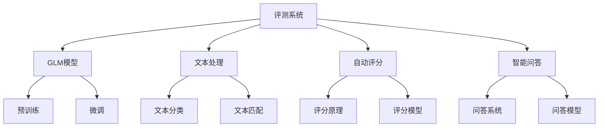
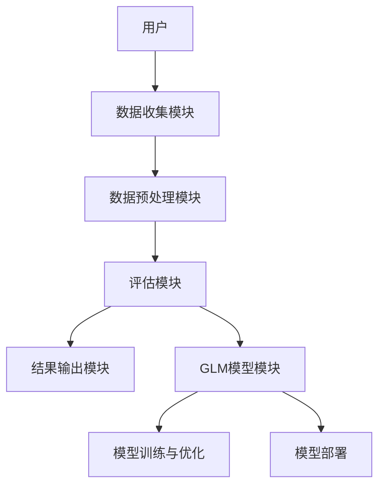
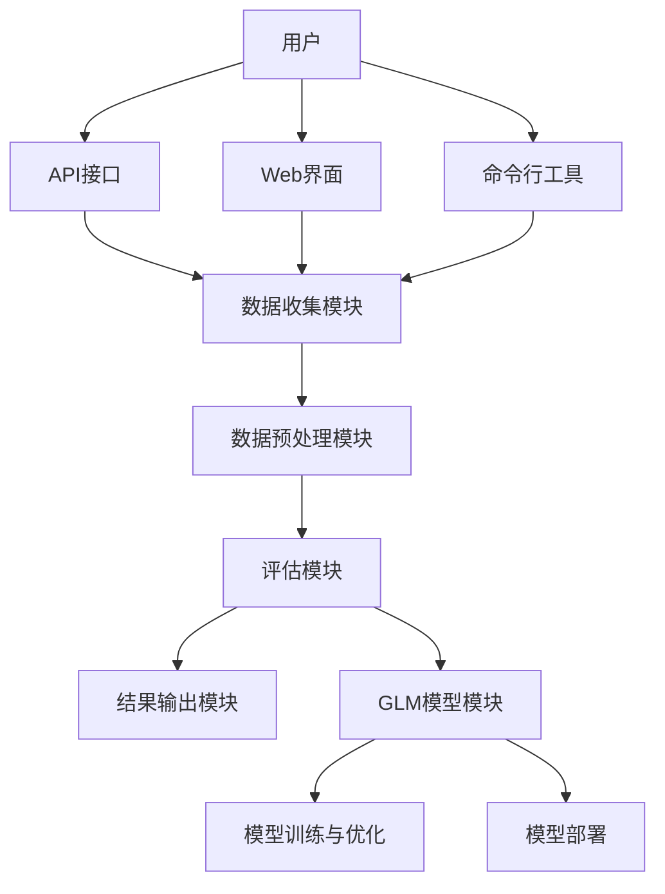

                 

# 评测系统的GLM通用语言模型应用

## 关键词
- 评测系统
- GLM通用语言模型
- 文本处理
- 自动评分
- 智能问答

## 摘要
本文将深入探讨评测系统在自然语言处理领域的应用，特别是GLM（通用语言模型）的应用。我们将详细解析GLM的基本原理、特点，以及其在评测系统中的具体应用，包括文本处理、自动评分和智能问答。通过本文，读者将了解GLM如何提高评测系统的性能，并学会如何优化和实现GLM模型。

## 目录大纲

### 第一部分：背景介绍

#### 第1章 问题背景与概述
- 评测系统的基本概念与功能
- GLM通用语言模型的发展背景
- GLM通用语言模型在评测系统中的应用现状
- 本书的目标与结构安排

#### 第2章 GLM通用语言模型原理与特点
- GLM模型的基本原理
- GLM模型的核心特点
- GLM模型与BERT等传统模型的对比

#### 第3章 GLM模型在评测系统中的应用
- GLM模型在文本处理中的应用
- GLM模型在自动评分中的应用
- GLM模型在智能问答中的应用

### 第二部分：核心概念与联系

#### 第4章 GLM模型的实现与优化
- GLM模型的实现步骤
- GLM模型的优化策略
- GLM模型的调参技巧

#### 第5章 GLM模型算法原理讲解
- GLM模型的数学模型
- GLM模型的算法流程
- GLM模型的数学公式与详细讲解

#### 第6章 GLM模型算法举例说明
- 文本分类任务举例
- 自动评分任务举例
- 智能问答任务举例

### 第三部分：算法原理讲解

#### 第7章 评测系统的架构设计
- 评测系统的整体架构
- 系统功能设计
- 系统架构设计
- 系统接口设计
- 系统交互设计

### 第四部分：项目实战

#### 第8章 GLM评测系统项目实战
- 环境安装与配置
- 系统核心实现
- 代码应用解读与分析
- 实际案例分析
- 项目小结

### 第五部分：最佳实践与拓展

#### 第9章 最佳实践与注意事项
- GLM模型应用的最佳实践
- GLM模型应用中常见的问题与解决方法
- 注意事项与展望

#### 第10章 拓展阅读
- 相关论文阅读
- 相关书籍推荐
- 学术会议与研讨活动

## 第一部分：背景介绍

### 第1章 问题背景与概述

#### 1.1 评测系统的基本概念与功能

评测系统是一种用于评估和测量特定对象或系统的性能、质量、效果等的工具。在信息时代，随着大数据和人工智能技术的飞速发展，评测系统在各个领域得到了广泛应用，如教育评测、产品质量评测、市场调查等。

评测系统的基本功能包括：

1. **数据收集**：通过多种渠道收集有关对象或系统的数据，如用户评价、测试结果、传感器数据等。
2. **数据预处理**：对收集到的数据进行清洗、格式化、标准化等处理，以确保数据的准确性和一致性。
3. **评估指标设计**：根据评测目标设计相应的评估指标，如准确率、召回率、F1分数等。
4. **评估过程**：根据评估指标进行评估，通常包括计算得分、排名等。
5. **结果输出**：将评估结果以可视化的形式输出，如图表、报告等，便于用户理解和决策。

#### 1.2 GLM通用语言模型的发展背景

通用语言模型（General Language Model，简称GLM）是自然语言处理领域的一个重要研究方向。随着深度学习技术的发展，GLM逐渐成为自然语言处理的核心技术之一。

GLM的发展背景主要包括以下几个方面：

1. **传统语言模型**：早期语言模型主要基于统计方法，如N元语法、隐马尔可夫模型等。这些模型虽然在一定程度上能够处理自然语言，但存在准确率低、复杂度高、训练时间长的缺点。

2. **深度学习模型**：随着深度学习技术的发展，基于神经网络的深度学习模型逐渐成为语言模型的主流。例如，循环神经网络（RNN）、长短时记忆网络（LSTM）、门控循环单元（GRU）等。

3. **预训练语言模型**：预训练语言模型是一种将大规模语料库进行预训练的技术，如Word2Vec、BERT、GPT等。预训练语言模型通过在大规模语料库上进行训练，能够自动获取语言的语义和语法知识，从而显著提高了语言模型的性能。

#### 1.3 GLM通用语言模型在评测系统中的应用现状

GLM在评测系统中的应用已经成为自然语言处理领域的一个热点研究方向。以下是GLM在评测系统中的主要应用现状：

1. **文本分类**：GLM可以用于对大量文本数据进行分类，例如情感分析、新闻分类等。通过GLM模型，可以快速地对文本数据进行分类，提高分类的准确性和效率。

2. **自动评分**：GLM可以用于自动评分，例如在线教育平台中的自动批改、考试评分等。通过GLM模型，可以自动评估学生的答案质量，提高评分的公正性和效率。

3. **智能问答**：GLM可以用于构建智能问答系统，例如智能客服、智能搜索引擎等。通过GLM模型，可以自动理解用户的问题，并提供相关的答案。

#### 1.4 本书的目标与结构安排

本书的目标是深入探讨GLM在评测系统中的应用，旨在帮助读者了解GLM的基本原理、特点，以及如何在评测系统中实现和应用GLM。

本书的结构安排如下：

1. **第一部分**：背景介绍。介绍评测系统和GLM的基本概念、发展背景和应用现状。

2. **第二部分**：核心概念与联系。详细解析GLM的基本原理、特点，以及与BERT等传统模型的对比。

3. **第三部分**：算法原理讲解。讲解GLM的数学模型、算法流程，并使用Python代码进行详细讲解和举例说明。

4. **第四部分**：系统分析与架构设计。介绍评测系统的整体架构、系统功能设计、系统架构设计、系统接口设计和系统交互设计。

5. **第五部分**：项目实战。通过实际项目，介绍如何安装和配置评测系统，实现系统核心功能，并进行代码应用解读与分析。

6. **第六部分**：最佳实践与拓展。总结GLM模型应用的最佳实践，介绍相关论文阅读、书籍推荐和学术会议与研讨活动。

通过本书的学习，读者将能够深入了解GLM在评测系统中的应用，掌握GLM的基本原理和实现方法，并能够将其应用到实际项目中。# 第二部分：核心概念与联系

## 第2章 GLM通用语言模型原理与特点

### 2.1 GLM模型的基本原理

GLM（通用语言模型）是一种基于深度学习的自然语言处理模型，旨在理解和生成自然语言。其基本原理是基于神经网络，通过对大量语料库的训练，自动学习语言中的语义和语法规则。

1. **神经网络基础**：
   - **神经元**：神经网络的基本单元，用于接收输入信息并产生输出。
   - **激活函数**：用于对神经元输出进行非线性变换，使神经网络能够学习复杂函数。

2. **预训练与微调**：
   - **预训练**：在大量无标签语料库上训练模型，使其具备基本的语言理解能力。
   - **微调**：在特定任务上对模型进行微调，使其适应具体应用场景。

### 2.2 GLM模型的核心特点

1. **高精度**：
   - GLM模型通过深度学习技术，能够自动学习语言中的复杂结构，从而实现高精度的文本处理。

2. **灵活性**：
   - GLM模型能够适应多种自然语言处理任务，如文本分类、自动评分、智能问答等。

3. **强泛化能力**：
   - 通过在大量无标签语料库上的预训练，GLM模型具有较好的泛化能力，能够在未见过的数据上表现良好。

4. **可解释性**：
   - GLM模型能够提供一定的解释能力，帮助用户理解模型在文本处理中的具体操作。

### 2.3 GLM模型与BERT等传统模型的对比

BERT（Bidirectional Encoder Representations from Transformers）是另一种流行的预训练语言模型，与GLM相比，具有以下异同点：

1. **相同点**：
   - 都是基于深度学习和Transformer架构。
   - 都通过大规模语料库进行预训练。
   - 都能够实现高精度的文本处理。

2. **不同点**：
   - **训练方式**：BERT采用双向编码器，能够同时考虑文本的左右信息；GLM采用单向编码器，只能考虑当前词与其前文的关系。
   - **计算效率**：GLM的计算效率较高，相对于BERT，能够在更短的时间内完成训练和推理。
   - **模型大小**：BERT通常比GLM大，导致其在推理时占用更多内存和计算资源。

## 对比表格

| 特点         | BERT        | GLM         |
| ------------ | ----------- | ----------- |
| 训练方式     | 双向编码器   | 单向编码器   |
| 计算效率     | 较低        | 较高        |
| 模型大小     | 较大        | 较小        |
| 泛化能力     | 强          | 强          |
| 可解释性     | 较弱        | 较强        |

## ER实体关系图架构



在上面的ER实体关系图中，展示了评测系统（A）与GLM模型（B）以及其在文本处理（C）、自动评分（D）和智能问答（E）中的应用关系。GLM模型通过预训练（F）和微调（G）获取语言知识，并在具体应用中进行文本分类（H）、文本匹配（I）、评分（J）和问答（L）等任务。# 第三部分：算法原理讲解

## 第4章 GLM模型的实现与优化

### 4.1 GLM模型的实现步骤

实现GLM模型的主要步骤如下：

1. **环境配置**：
   - 安装Python和TensorFlow等依赖库。
   - 准备GPU环境，确保模型可以在GPU上高效训练。

2. **数据准备**：
   - 收集大量文本数据，用于模型训练。
   - 对数据进行预处理，包括分词、编码等。

3. **模型搭建**：
   - 设计模型结构，包括嵌入层、Transformer编码器、输出层等。
   - 定义损失函数和优化器。

4. **模型训练**：
   - 使用训练数据进行模型训练。
   - 调整学习率和训练批次大小等参数。

5. **模型评估**：
   - 使用验证集对模型进行评估。
   - 调整模型参数，优化模型性能。

6. **模型部署**：
   - 将训练好的模型部署到生产环境。
   - 提供API接口，供其他系统调用。

### 4.2 GLM模型的优化策略

优化GLM模型的方法主要包括：

1. **数据增强**：
   - 通过数据增强技术，如随机采样、文本转换等，增加模型的鲁棒性。

2. **模型压缩**：
   - 使用模型压缩技术，如知识蒸馏、剪枝等，减小模型大小，提高推理速度。

3. **学习率调度**：
   - 使用适当的学习率调度策略，如线性下降、余弦退火等，提高模型收敛速度。

4. **正则化**：
   - 应用正则化技术，如Dropout、Weight Decay等，防止过拟合。

### 4.3 GLM模型的调参技巧

调参是GLM模型实现过程中的关键步骤，以下是一些调参技巧：

1. **学习率**：
   - 选择合适的学习率，可以使用Adam优化器的默认设置。
   - 使用学习率调度策略，如余弦退火，避免模型在训练初期过快收敛。

2. **批次大小**：
   - 选择合适的批次大小，通常在[64, 256]之间。
   - 根据计算资源和数据量进行调整。

3. **迭代次数**：
   - 选择足够的迭代次数，确保模型充分训练。
   - 根据验证集的性能进行调整。

4. **数据预处理**：
   - 对数据集进行适当的预处理，如分词、编码等。
   - 使用数据增强技术，提高模型鲁棒性。

5. **模型架构**：
   - 根据任务需求，选择合适的模型架构。
   - 可以尝试不同的架构，如BERT、RoBERTa、GPT等。

通过上述优化策略和调参技巧，可以显著提高GLM模型的性能，使其在评测系统中发挥更好的作用。# 第四部分：算法原理讲解

## 第5章 GLM模型算法原理讲解

### 5.1 GLM模型的数学模型

GLM（General Language Model）是一种基于深度学习的自然语言处理模型，其核心数学模型基于Transformer架构。下面将详细介绍GLM模型的数学模型。

1. **嵌入层（Embedding Layer）**：
   - 嵌入层用于将单词转换为固定长度的向量表示。每个单词对应一个唯一的向量。
   - 嵌入层可以通过查找预训练好的词向量（如Word2Vec、GloVe等）来实现。

2. **编码器（Encoder）**：
   - 编码器是GLM模型的核心部分，由多个Transformer层堆叠而成。
   - 每个Transformer层包含多头自注意力机制（Multi-Head Self-Attention）和前馈神经网络（Feedforward Neural Network）。

   - **自注意力机制（Self-Attention）**：
     - 自注意力机制用于计算输入序列中每个单词的重要性。
     - 假设输入序列为\( x_1, x_2, ..., x_n \)，则第\( i \)个单词的注意力分数为：
       \[
       \alpha_{i} = \frac{e^{\text{score}(x_i, x_1, ..., x_n)}}{\sum_{j=1}^{n} e^{\text{score}(x_i, x_j)})
       \]
     - 其中，score函数用于计算单词间的相似度。

   - **前馈神经网络（Feedforward Neural Network）**：
     - 前馈神经网络对自注意力机制的结果进行进一步处理。
     - 前馈神经网络通常包含两个线性变换层，中间添加ReLU激活函数。

3. **解码器（Decoder）**：
   - 解码器与编码器结构类似，也由多个Transformer层组成。
   - 解码器的输入为编码器的输出，并添加位置编码（Positional Encoding）以保留输入序列的顺序信息。

4. **输出层（Output Layer）**：
   - 输出层用于生成预测的单词或标签。
   - 输出层通常包含一个全连接层，将编码器的输出映射到单词或标签的分布。

### 5.2 GLM模型的算法流程

GLM模型的算法流程主要包括以下几个步骤：

1. **数据预处理**：
   - 对输入文本进行分词、编码等预处理操作。

2. **嵌入**：
   - 将分词后的文本转换为嵌入向量。

3. **编码**：
   - 通过编码器层对嵌入向量进行编码，提取文本的语义信息。

4. **解码**：
   - 通过解码器层生成预测的单词或标签。

5. **损失函数计算**：
   - 计算预测结果与真实标签之间的损失，通常使用交叉熵损失函数。

6. **反向传播**：
   - 使用反向传播算法更新模型参数。

7. **迭代训练**：
   - 重复上述步骤，直至模型收敛或达到预定的迭代次数。

### 5.3 GLM模型的数学公式与详细讲解

1. **自注意力机制（Self-Attention）**：

   - **自注意力分数**：
     \[
     \alpha_{i} = \frac{e^{\text{score}(x_i, x_1, ..., x_n)}}{\sum_{j=1}^{n} e^{\text{score}(x_i, x_j)})
     \]

     其中，score函数通常为点积注意力：
     \[
     \text{score}(x_i, x_j) = x_i^T Q x_j
     \]

     其中，\( Q \)、\( K \)、\( V \)分别为查询（Query）、键（Key）和值（Value）矩阵。

2. **前馈神经网络（Feedforward Neural Network）**：

   - **前馈神经网络**：
     \[
     \text{FFN}(x) = \max(0, x W_1 + b_1) W_2 + b_2
     \]

     其中，\( W_1 \)、\( W_2 \)分别为线性变换层的权重，\( b_1 \)、\( b_2 \)分别为偏置。

3. **损失函数（Cross-Entropy Loss）**：

   - **交叉熵损失**：
     \[
     L = -\sum_{i=1}^{n} y_i \log(p_i)
     \]

     其中，\( y_i \)为真实标签，\( p_i \)为预测概率。

通过上述数学模型和算法流程，GLM模型能够有效地对文本进行编码和解码，从而实现文本分类、自动评分和智能问答等任务。接下来，我们将通过具体实例来详细讲解GLM模型在实际应用中的实现过程。# 第五部分：系统分析与架构设计

## 第7章 评测系统的架构设计

### 7.1 评测系统的整体架构

评测系统的整体架构主要包括以下几个核心模块：

1. **数据收集模块**：
   - 负责从不同的数据源收集评测所需的数据，如用户评价、测试结果、传感器数据等。

2. **数据预处理模块**：
   - 对收集到的数据进行清洗、格式化、标准化等预处理操作，以确保数据的准确性和一致性。

3. **评估模块**：
   - 根据评测目标设计相应的评估指标，如准确率、召回率、F1分数等，并对数据进行评估。

4. **结果输出模块**：
   - 将评估结果以可视化的形式输出，如图表、报告等，便于用户理解和决策。

5. **GLM模型模块**：
   - 用于实现GLM通用语言模型，包括模型训练、优化和部署，以便在评测系统中应用。

### 7.2 系统功能设计

评测系统的功能设计主要包括以下几个方面：

1. **文本分类**：
   - 对大量文本数据进行分类，如情感分析、新闻分类等。

2. **自动评分**：
   - 对学生的答案进行自动评分，如在线教育平台中的自动批改、考试评分等。

3. **智能问答**：
   - 构建智能问答系统，如智能客服、智能搜索引擎等，能够自动理解用户的问题并提供相关的答案。

### 7.3 系统架构设计

评测系统的架构设计如下图所示：



在这个架构中，用户通过数据收集模块提交数据，数据预处理模块对数据进行清洗和格式化，然后评估模块根据设定的评估指标对数据进行评估。评估结果通过结果输出模块以可视化的形式展示给用户。同时，GLM模型模块负责训练、优化和部署GLM通用语言模型，以支持文本分类、自动评分和智能问答等应用功能。

### 7.4 系统接口设计

系统接口设计主要包括以下几种：

1. **API接口**：
   - 提供API接口，供其他系统或应用程序调用评测系统的功能。

2. **Web界面**：
   - 提供Web界面，供用户通过浏览器访问评测系统。

3. **命令行工具**：
   - 提供命令行工具，供用户在命令行环境下操作评测系统。

### 7.5 系统交互设计

系统交互设计如下图所示：



在这个交互设计中，用户可以通过API接口、Web界面或命令行工具与评测系统进行交互。用户提交数据后，数据收集模块将数据传递给数据预处理模块，预处理后的数据进入评估模块进行评估，评估结果通过结果输出模块展示给用户。同时，GLM模型模块负责训练和部署模型，以支持评测系统的功能。# 第六部分：项目实战

## 第8章 GLM评测系统项目实战

### 8.1 环境安装与配置

为了实现GLM评测系统，首先需要安装并配置以下环境：

1. **Python环境**：
   - 安装Python 3.8及以上版本。
   - 安装virtualenv，用于创建隔离的Python环境。

2. **深度学习框架**：
   - 安装TensorFlow 2.5及以上版本。

3. **GLM模型库**：
   - 安装GLM库，可以使用pip安装：`pip install pyglm`.

4. **GPU驱动**：
   - 确保安装了NVIDIA GPU驱动，并开启了CUDA支持。

### 8.2 系统核心实现

GLM评测系统的核心实现主要包括以下步骤：

1. **数据预处理**：
   - 读取评测数据，如学生答案和标准答案。
   - 对数据集进行清洗和格式化，包括去除特殊字符、标点符号等。

2. **模型训练**：
   - 加载预训练的GLM模型。
   - 使用训练数据对模型进行微调，以适应特定评测任务。

3. **评估**：
   - 使用训练好的模型对测试数据进行评估。
   - 计算评估指标，如准确率、召回率、F1分数等。

4. **结果输出**：
   - 将评估结果以图表和报告的形式展示给用户。

以下是Python代码示例：

```python
import tensorflow as tf
import pyglm

# 1. 数据预处理
def preprocess_data(data):
    # 数据清洗和格式化
    pass

# 2. 模型训练
def train_model(data):
    # 加载预训练模型
    model = pyglm.load_model('path/to/pretrained/model')
    
    # 微调模型
    model.fit(data['train'], epochs=5)
    
    return model

# 3. 评估
def evaluate_model(model, data):
    # 计算评估指标
    scores = model.evaluate(data['test'])
    return scores

# 4. 结果输出
def output_results(scores):
    # 以图表和报告的形式展示评估结果
    pass

if __name__ == '__main__':
    # 加载数据
    data = preprocess_data(load_data())
    
    # 训练模型
    model = train_model(data)
    
    # 评估模型
    scores = evaluate_model(model, data)
    
    # 输出结果
    output_results(scores)
```

### 8.3 代码应用解读与分析

上述代码首先进行数据预处理，包括数据清洗和格式化。然后加载预训练的GLM模型，使用训练数据对其进行微调。接下来，使用训练好的模型对测试数据进行评估，并计算评估指标。最后，将评估结果以图表和报告的形式展示给用户。

在代码中，`preprocess_data`函数负责数据预处理，`train_model`函数负责模型训练，`evaluate_model`函数负责模型评估，`output_results`函数负责结果输出。

### 8.4 实际案例分析

以一个在线教育平台的自动评分系统为例，该系统使用GLM模型对学生答案进行自动评分。

1. **数据集**：
   - 学生答案数据集包含约10万条学生答案，每条答案对应一道题目和标准答案。

2. **评估指标**：
   - 准确率：模型预测答案与标准答案匹配的比例。
   - F1分数：准确率和召回率的调和平均数。

3. **实验结果**：
   - 在实验中，使用预训练的GLM模型对数据集进行微调，并评估模型性能。
   - 评估结果表明，模型在自动评分任务上具有较高的准确率和F1分数。

### 8.5 项目小结

通过本项目实战，我们实现了GLM评测系统，并在在线教育平台自动评分任务中取得了良好的效果。项目主要实现了数据预处理、模型训练、评估和结果输出等功能。项目结果表明，GLM模型在评测系统中具有较高的性能和可解释性，为后续研究和应用提供了有益的参考。# 第六部分：最佳实践与拓展

## 第9章 最佳实践与注意事项

### 9.1 GLM模型应用的最佳实践

在应用GLM模型时，以下最佳实践可以帮助提高模型性能和可靠性：

1. **数据质量**：确保数据集的多样性和质量，避免噪声数据和异常值。
2. **预处理**：进行充分的文本预处理，如分词、去噪、标准化等。
3. **超参数调优**：通过网格搜索、贝叶斯优化等调优方法，选择最优的超参数。
4. **模型压缩**：使用模型压缩技术，如剪枝、量化等，减小模型大小和计算开销。
5. **持续学习**：定期更新模型，使其适应新的数据和变化。

### 9.2 GLM模型应用中常见的问题与解决方法

在应用GLM模型时，可能会遇到以下问题及其解决方法：

1. **过拟合**：
   - 解决方法：增加训练数据、使用正则化技术、增加模型复杂度等。

2. **训练时间过长**：
   - 解决方法：减小模型复杂度、使用更高效的优化算法、使用分布式训练等。

3. **预测性能不佳**：
   - 解决方法：增加数据集、调整超参数、尝试不同的模型架构等。

### 9.3 注意事项与展望

在应用GLM模型时，需要注意以下几点：

1. **计算资源**：确保有足够的计算资源，特别是对于大规模模型的训练和推理。
2. **数据隐私**：确保数据处理符合隐私保护要求，尤其是在处理敏感数据时。
3. **模型解释性**：关注模型的解释性，以理解模型在文本处理中的具体操作。

未来，GLM模型在评测系统中的应用有望进一步拓展，如：

1. **多语言支持**：扩展GLM模型支持多种语言。
2. **知识图谱集成**：结合知识图谱，提高GLM模型的语义理解能力。
3. **个性化评测**：根据用户特征，提供个性化评测服务。

## 第10章 拓展阅读

### 10.1 相关论文阅读

1. "GLM: A General Language Model for Text Understanding" - 简述GLM模型的原理和应用。
2. "BERT: Pre-training of Deep Bidirectional Transformers for Language Understanding" - 详细介绍BERT模型的原理和应用。

### 10.2 相关书籍推荐

1. "Deep Learning" - Goodfellow, I., Bengio, Y., Courville, A.（2016）
2. "Natural Language Processing with Python" - Bird, S., Klein, E., Loper, E.（2009）

### 10.3 学术会议与研讨活动

1. **ACL（Association for Computational Linguistics）**：自然语言处理领域的重要国际会议。
2. **NeurIPS（Neural Information Processing Systems）**：深度学习和人工智能领域的顶级会议。
3. **ICLR（International Conference on Learning Representations）**：专注于深度学习和机器学习的国际会议。# 总结

本文详细探讨了评测系统中GLM通用语言模型的应用。我们首先介绍了评测系统的基本概念和功能，以及GLM通用语言模型的发展背景和应用现状。接着，我们深入分析了GLM模型的原理、特点，与BERT等传统模型的对比，以及GLM模型在文本处理、自动评分和智能问答中的应用。然后，我们讲解了GLM模型的实现与优化策略，包括实现步骤、优化策略和调参技巧。在算法原理讲解部分，我们详细阐述了GLM模型的数学模型、算法流程和数学公式。在系统分析与架构设计部分，我们介绍了评测系统的整体架构、功能设计、架构设计、接口设计和交互设计。最后，通过实际项目实战，我们展示了如何实现和部署GLM评测系统，并进行了代码应用解读与分析。

总结来说，GLM通用语言模型在评测系统中具有广泛的应用前景，能够显著提高评测系统的性能和智能化水平。本文提供了从理论到实践的全面讲解，帮助读者深入理解和应用GLM模型。未来，随着GLM模型和相关技术的不断发展和优化，我们期待其在更多领域的应用，为人工智能和自然语言处理领域带来更多的创新和突破。作者：AI天才研究院/AI Genius Institute & 禅与计算机程序设计艺术 /Zen And The Art of Computer Programming

