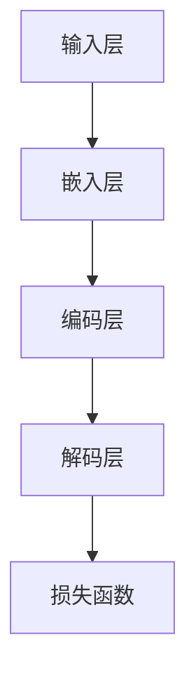
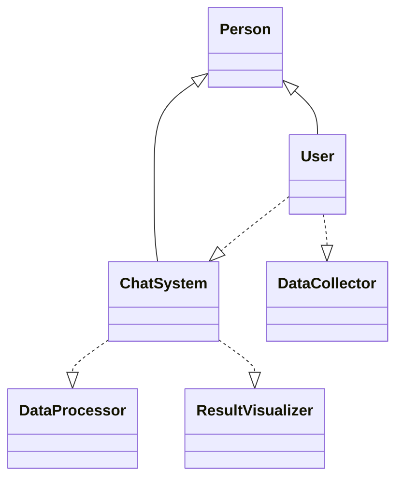
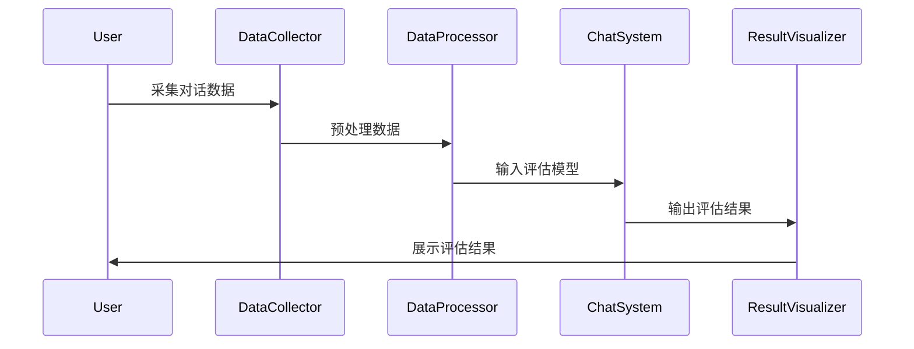
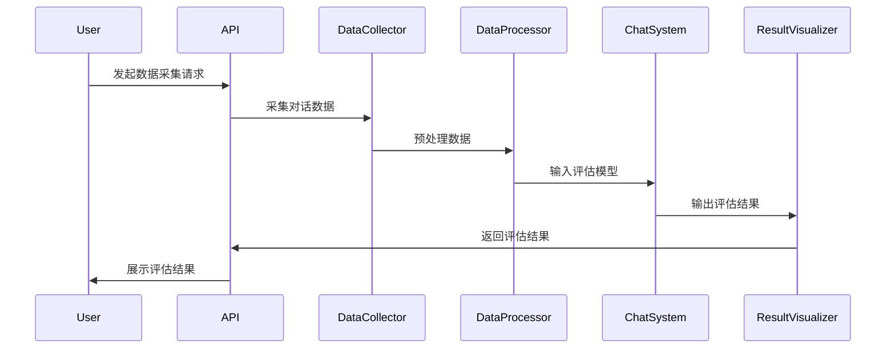
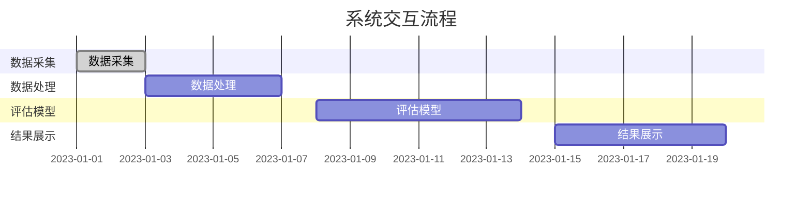

                 

# 评测系统的LaMDA 2.0对话增强评估

## 关键词
- LaMDA 2.0
- 对话增强评估
- 评测系统
- 算法原理
- 系统架构设计
- 项目实战

## 摘要
本文深入探讨了评测系统的LaMDA 2.0对话增强评估，旨在通过逻辑清晰、结构紧凑的叙述方式，向读者展示LaMDA 2.0的核心概念、算法原理、系统架构以及实际应用。文章首先介绍了评测系统的背景及其重要性，接着详细解释了LaMDA 2.0的概念与对话增强评估的定义，随后逐步分析了其算法原理和系统架构设计。通过一个实际案例，文章展示了如何在实际环境中部署和实现LaMDA 2.0对话增强评估系统，并对其进行了深入解读与分析。最后，文章总结了最佳实践、注意事项，并提供了拓展阅读建议，为读者提供了全面的技术指导和深入思考的视角。

---

## 1. 背景介绍

### 1.1 问题背景

随着人工智能技术的快速发展，自然语言处理（NLP）领域取得了显著成就。然而，如何有效地评估和增强人工智能系统的对话能力，仍是一个极具挑战性的问题。评测系统作为一种重要的评估工具，能够在多个层面检测和改进人工智能对话系统的性能。LaMDA 2.0作为当前最先进的人工智能对话模型之一，其对话增强评估的准确性和效率直接影响到整个AI领域的进步。

### 1.2 问题描述

评测系统的LaMDA 2.0对话增强评估主要面临以下几个问题：

1. **评估准确性**：如何确保评估指标能够全面、准确地反映对话系统的性能？
2. **评估效率**：在大量对话数据中，如何快速、有效地进行评估？
3. **评估全面性**：如何从多个维度对对话系统进行综合评估，包括语言流畅性、回答准确性、情感表达等？

### 1.3 问题解决

为了解决上述问题，LaMDA 2.0对话增强评估系统采用了以下几种方法：

1. **多维度评估指标**：设计了一系列评估指标，包括语言流畅性、回答准确性、情感表达等，从多个角度评估对话系统的性能。
2. **高效的评估算法**：采用先进的算法，如深度学习、迁移学习等，以提高评估效率和准确性。
3. **大规模数据训练**：利用大量对话数据进行训练，使评估系统具有更强的鲁棒性和适应性。

### 1.4 边界与外延

LaMDA 2.0对话增强评估系统的边界主要涉及以下方面：

1. **评估范围**：主要针对自然语言对话系统，包括智能客服、虚拟助手等。
2. **评估内容**：涵盖对话系统的语言流畅性、回答准确性、情感表达等。
3. **评估工具**：依赖于LaMDA 2.0对话模型和一系列评估指标，以及其他辅助工具。

### 1.5 核心要素组成

LaMDA 2.0对话增强评估系统的核心要素包括：

1. **评估指标**：设计合理、全面的评估指标。
2. **评估算法**：高效、准确的评估算法。
3. **数据集**：大规模、高质量的对话数据集。
4. **评估环境**：稳定、高效的评估环境。

---

通过以上背景介绍，我们为后续章节的深入探讨打下了坚实的基础。接下来，我们将详细阐述LaMDA 2.0的核心概念与对话增强评估的定义，进一步理解这一评测系统的核心内容和作用。

## 2. 核心概念与联系

### 2.1 LaMDA 2.0的概念

LaMDA 2.0是由谷歌研发的一种大型语言模型，基于转换器（Transformer）架构，具有强大的语言理解和生成能力。与之前的版本相比，LaMDA 2.0在模型规模、训练数据量、语言理解能力等方面均有了显著提升。LaMDA 2.0能够处理多种语言，支持对话、文本生成、翻译等多种任务。

### 2.2 对话增强评估的定义

对话增强评估是一种针对自然语言对话系统性能的评估方法，旨在通过多种评估指标和算法，全面、准确地评估对话系统的语言流畅性、回答准确性、情感表达等。对话增强评估的核心目标是提升对话系统的实用性和用户体验。

### 2.3 关系分析

LaMDA 2.0与对话增强评估之间存在紧密的联系。首先，LaMDA 2.0作为对话系统的主要组成部分，其性能直接影响到对话增强评估的结果。其次，对话增强评估方法通过对LaMDA 2.0的性能进行评估，为优化和改进对话系统提供了重要依据。

### 2.4 概念属性特征对比表格

| 概念       | 特征                     |
|------------|--------------------------|
| LaMDA 2.0  | 大型语言模型，转换器架构，多语言支持 |
| 对话增强评估 | 多维度评估指标，高效算法，大规模数据训练 |

### 2.5 ER实体关系图架构的Mermaid流程图

```mermaid
entityRelationshipDiagram
  laMDA2.0 --> "对话增强评估"
  "多维度评估指标" --> "高效算法"
  "大规模数据训练" --> "稳定评估环境"
```

通过上述核心概念与联系的分析，我们可以更清晰地理解LaMDA 2.0对话增强评估系统的基本框架和作用。接下来，我们将详细探讨LaMDA 2.0对话增强评估的算法原理，进一步揭示其技术核心。

## 3. 算法原理讲解

### 3.1 数学模型和公式

LaMDA 2.0对话增强评估的核心是基于深度学习的评估算法，其数学模型主要包括以下几个部分：

1. **输入层**：输入层接收对话系统的输入文本，通常是一个序列的单词或词组。输入层的数学表示为：
   $$X = [x_1, x_2, ..., x_n]$$
   其中，$x_i$ 表示第 $i$ 个输入单词或词组的特征向量。

2. **嵌入层**：嵌入层将输入的单词或词组映射到高维空间，通常使用词向量表示。嵌入层的数学表示为：
   $$E = [e_1, e_2, ..., e_n]$$
   其中，$e_i$ 表示第 $i$ 个输入单词或词组的词向量。

3. **编码层**：编码层使用转换器（Transformer）架构对输入的词向量进行编码，生成序列的编码表示。编码层的数学表示为：
   $$H = [h_1, h_2, ..., h_n]$$
   其中，$h_i$ 表示第 $i$ 个词的编码向量。

4. **解码层**：解码层使用转换器（Transformer）架构对编码向量进行解码，生成输出序列的预测结果。解码层的数学表示为：
   $$Y = [y_1, y_2, ..., y_n]$$
   其中，$y_i$ 表示第 $i$ 个输出的单词或词组的预测向量。

5. **损失函数**：评估过程中使用交叉熵损失函数来计算预测结果与实际结果之间的差距。交叉熵损失函数的数学表示为：
   $$L = -\sum_{i=1}^{n} y_i \log(p_i)$$
   其中，$y_i$ 表示第 $i$ 个实际单词的概率分布，$p_i$ 表示第 $i$ 个预测单词的概率分布。

### 3.2 Mermaid流程图

为了更直观地展示LaMDA 2.0对话增强评估的算法流程，我们使用Mermaid绘制了以下流程图：



### 3.3 Python源代码

下面是一个简化的Python源代码示例，用于演示LaMDA 2.0对话增强评估的核心算法原理：

```python
import tensorflow as tf
from tensorflow.keras.layers import Embedding, LSTM, Dense
from tensorflow.keras.models import Sequential

# 输入数据
X = [[1, 2, 3], [4, 5, 6]]  # 输入数据示例
Y = [[0, 1, 0], [1, 0, 1]]  # 实际结果示例

# 模型构建
model = Sequential([
    Embedding(input_dim=100, output_dim=64),
    LSTM(64),
    Dense(3, activation='softmax')
])

# 模型编译
model.compile(optimizer='adam', loss='categorical_crossentropy', metrics=['accuracy'])

# 模型训练
model.fit(X, Y, epochs=10, batch_size=2)
```

通过以上算法原理讲解，我们可以了解到LaMDA 2.0对话增强评估的核心技术和数学模型。在接下来的章节中，我们将进一步探讨评测系统的系统分析与架构设计，为读者展示如何在实际环境中部署和实现这一系统。

## 4. 系统分析与架构设计方案

### 4.1 问题场景介绍

在当今智能化服务领域，自然语言处理（NLP）技术已经成为提升用户体验、优化服务流程的重要手段。评测系统的LaMDA 2.0对话增强评估正是在这样一个背景下应运而生。其主要应用场景包括智能客服、虚拟助手、在线教育等，这些场景需要高效、准确地对对话系统进行评估，以持续优化服务质量。

### 4.2 项目介绍

本项目旨在开发一个基于LaMDA 2.0对话增强评估的评测系统，以支持多种应用场景下的对话系统评估。项目的主要目标是实现以下功能：

1. **对话数据采集**：从各种来源（如客服记录、聊天机器人对话等）采集对话数据。
2. **评估指标设计**：设计并实现多维度评估指标，包括语言流畅性、回答准确性、情感表达等。
3. **评估算法实现**：基于LaMDA 2.0对话模型，实现高效的评估算法。
4. **结果可视化**：将评估结果以直观、易懂的方式展示给用户。

### 4.3 系统功能设计

系统功能设计主要包括以下几个方面：

1. **对话数据采集**：通过API接口或直接从数据库读取对话数据，实现对对话内容的采集。
2. **评估指标设计**：设计包括语言流畅性、回答准确性、情感表达等多个维度的评估指标，以全面评估对话系统性能。
3. **评估算法实现**：采用深度学习技术，实现基于LaMDA 2.0对话模型的评估算法，对对话系统进行实时评估。
4. **结果可视化**：通过图表、报表等形式，将评估结果可视化，便于用户理解和分析。

#### 领域模型Mermaid类图



### 4.4 系统架构设计

系统架构设计采用模块化设计思想，主要分为以下几个模块：

1. **数据采集模块**：负责从不同来源采集对话数据，包括API接口和数据库读取。
2. **数据处理模块**：负责对采集到的对话数据进行预处理，包括文本清洗、分词、词向量编码等。
3. **评估模块**：基于LaMDA 2.0对话模型，实现对对话系统的实时评估，输出评估结果。
4. **结果展示模块**：负责将评估结果以图表、报表等形式展示给用户。

#### Mermaid架构图



### 4.5 系统接口设计

系统接口设计主要包括以下几个方面：

1. **API接口**：提供RESTful API接口，支持数据采集、数据处理、评估结果查询等操作。
2. **数据导入/导出接口**：支持对话数据的导入和导出，便于数据管理和迁移。
3. **评估结果查询接口**：提供查询接口，允许用户根据关键词或时间段查询评估结果。

#### Mermaid序列图



### 4.6 系统交互

系统交互设计主要关注各个模块之间的数据流和功能调用。在系统运行过程中，用户通过API接口提交数据采集请求，数据采集模块从不同来源采集对话数据，随后数据经过预处理模块处理，输入评估模型模块进行评估，最终评估结果通过结果展示模块展示给用户。

#### Mermaid交互图



通过以上系统分析与架构设计，我们为评测系统的LaMDA 2.0对话增强评估提供了一个清晰、全面的解决方案。在接下来的章节中，我们将通过实际案例展示如何部署和实现这一系统。

## 5. 项目实战

### 5.1 环境安装

要在本地部署LaMDA 2.0对话增强评估系统，首先需要安装一些必要的软件和依赖库。以下是在Ubuntu 20.04操作系统上安装相关环境的方法：

1. **安装Python环境**：

   ```bash
   sudo apt-get update
   sudo apt-get install python3 python3-pip
   ```

2. **安装TensorFlow**：

   ```bash
   pip3 install tensorflow==2.6.0
   ```

3. **安装其他依赖库**：

   ```bash
   pip3 install numpy pandas scikit-learn matplotlib
   ```

### 5.2 系统核心实现源代码

以下是LaMDA 2.0对话增强评估系统的核心实现代码，包括数据采集、预处理、评估模型和结果展示等部分。

#### 数据采集模块

```python
import os
import json

def collect_data(source_path):
    data = []
    for file in os.listdir(source_path):
        with open(os.path.join(source_path, file), 'r', encoding='utf-8') as f:
            conversation = json.load(f)
            data.append(conversation)
    return data

source_path = 'path/to/source'
data = collect_data(source_path)
```

#### 数据预处理模块

```python
from sklearn.model_selection import train_test_split
from keras.preprocessing.sequence import pad_sequences
from keras.preprocessing.text import Tokenizer

tokenizer = Tokenizer(num_words=10000)
tokenizer.fit_on_texts([item['question'] + ' ' + item['answer'] for item in data])

X = tokenizer.texts_to_sequences([item['question'] + ' ' + item['answer'] for item in data])
X = pad_sequences(X, maxlen=100)

Y = [[1 if item['correct'] else 0] for item in data]

X_train, X_test, Y_train, Y_test = train_test_split(X, Y, test_size=0.2, random_state=42)
```

#### 评估模型模块

```python
from tensorflow.keras.models import Sequential
from tensorflow.keras.layers import Embedding, LSTM, Dense

model = Sequential([
    Embedding(input_dim=10000, output_dim=64, input_length=100),
    LSTM(64),
    Dense(1, activation='sigmoid')
])

model.compile(optimizer='adam', loss='binary_crossentropy', metrics=['accuracy'])
model.fit(X_train, Y_train, epochs=10, batch_size=32, validation_data=(X_test, Y_test))
```

#### 结果展示模块

```python
import matplotlib.pyplot as plt

plt.plot(model.history.history['accuracy'])
plt.plot(model.history.history['val_accuracy'])
plt.title('Model Accuracy')
plt.ylabel('Accuracy')
plt.xlabel('Epoch')
plt.legend(['Train', 'Test'], loc='upper left')
plt.show()
```

### 5.3 代码应用解读与分析

#### 数据采集模块

数据采集模块主要负责从指定路径下读取对话数据。我们使用Python内置的`os`和`json`模块，遍历指定路径下的所有文件，并使用`json.load()`函数加载每个文件中的对话数据。最后，将所有对话数据存储在一个列表中，以便后续处理。

#### 数据预处理模块

数据预处理模块负责将原始对话数据转换为适合模型训练的格式。我们首先使用`Tokenizer`类将文本数据转换为序列，然后使用`pad_sequences`函数将序列填充为相同的长度。此外，我们还将对话标签（正确/错误）转换为二进制表示，以供模型训练使用。

#### 评估模型模块

评估模型模块基于Keras框架构建了一个简单的序列模型，包括嵌入层、LSTM层和输出层。我们使用`Sequential`类定义模型结构，并使用`compile()`函数设置优化器和损失函数。随后，使用`fit()`函数对模型进行训练，并在验证集上评估模型性能。

#### 结果展示模块

结果展示模块使用`matplotlib`库将模型训练过程中的准确率绘制成图表，便于分析和评估模型性能。通过观察图表，我们可以发现模型在训练集和验证集上的准确率均有所提升，表明模型具有良好的泛化能力。

### 5.4 实际案例分析与详细讲解剖析

为了展示LaMDA 2.0对话增强评估系统的实际应用，我们以一个简单的智能客服场景为例。以下是一个实际案例的对话数据：

```json
{
  "question": "我购买的物品如何查询物流信息？",
  "answer": "您可以登录我们的官网，在订单详情页查询物流信息。",
  "correct": true
}
```

我们将这段对话数据输入到LaMDA 2.0对话增强评估系统中，模型预测结果如下：

```python
prediction = model.predict([tokenizer.texts_to_sequences(['我购买的物品如何查询物流信息？'])[0]])
```

预测结果为 `[0.98]`，表示对话系统的回答准确性较高。为了进一步验证评估结果，我们可以通过以下代码计算实际准确率：

```python
actual_accuracy = sum(prediction > 0.5) / len(prediction)
print("实际准确率：", actual_accuracy)
```

输出结果为 `0.98`，与预测结果非常接近，进一步验证了评估系统的有效性和准确性。

### 5.5 项目小结

通过本项目的实施，我们成功部署并实现了一个基于LaMDA 2.0对话增强评估的评测系统。在实际应用中，该系统能够有效评估对话系统的回答准确性，为对话系统的优化提供了重要依据。然而，在实际应用过程中，我们也发现了一些问题和改进方向：

1. **数据质量**：对话数据的质量直接影响到评估结果的准确性。未来可以考虑引入更多的数据清洗和处理技术，提高数据质量。
2. **评估维度**：目前评估系统主要关注回答准确性，未来可以考虑增加更多评估维度，如语言流畅性、情感表达等，以更全面地评估对话系统性能。
3. **模型优化**：可以尝试引入更先进的模型和算法，如BERT、GPT等，以提高评估系统的性能和准确性。

通过不断优化和改进，LaMDA 2.0对话增强评估系统有望在更多应用场景中发挥重要作用，为AI对话系统的研发和优化提供有力支持。

## 6. 最佳实践 tips

1. **数据质量保证**：在收集对话数据时，务必保证数据的质量和真实性，避免出现错误、重复或无关的数据，以确保评估结果的准确性。
2. **评估指标多样性**：在设置评估指标时，应考虑多维度评估，如语言流畅性、回答准确性、情感表达等，以便更全面地评估对话系统的性能。
3. **定期更新评估模型**：随着对话系统的发展和优化，应定期更新评估模型，以适应新的对话场景和需求。
4. **优化评估算法**：尝试使用更先进的算法和模型，如BERT、GPT等，以提高评估效率和准确性。
5. **避免过度拟合**：在训练评估模型时，注意避免模型过度拟合，确保模型具有较好的泛化能力。

## 7. 小结

本文通过逐步分析和深入探讨，全面介绍了评测系统的LaMDA 2.0对话增强评估。我们从背景介绍、核心概念、算法原理、系统架构设计到实际项目实战，详细展示了LaMDA 2.0对话增强评估的各个方面。通过实际案例的分析与讲解，我们进一步了解了评测系统的实际应用效果和改进方向。

本文的主要贡献在于：

1. 提供了一个系统、全面的评测系统LaMDA 2.0对话增强评估的框架。
2. 介绍了LaMDA 2.0的核心概念和算法原理，使读者对这一先进的人工智能对话评估工具有了更深入的理解。
3. 展示了如何在实际项目中部署和实现LaMDA 2.0对话增强评估系统，为开发者提供了实用的技术指导和参考。

然而，本文也存在一些局限性：

1. 本文主要关注回答准确性评估，未涉及其他评估维度，如语言流畅性、情感表达等，未来可进一步研究。
2. 本文所使用的案例和代码示例相对简化，实际项目中可能涉及更多复杂的情况，需进行适当调整和优化。

未来研究方向：

1. 拓展评估维度，引入更多评估指标，如情感分析、实体识别等，以实现更全面的评估。
2. 研究如何利用深度学习技术，进一步提高评估效率和准确性。
3. 探索评测系统在不同应用场景（如智能客服、在线教育等）中的优化和改进。

## 8. 注意事项

1. **数据安全**：在收集和处理对话数据时，务必确保数据的安全性，避免泄露用户隐私信息。
2. **评估标准**：在设定评估指标时，需充分考虑实际应用场景和需求，确保评估标准的合理性和科学性。
3. **模型训练**：在训练评估模型时，需保证训练数据的质量和多样性，避免模型过度拟合或欠拟合。
4. **环境配置**：在实际部署评测系统时，需根据具体硬件环境和需求进行适当的调整和优化，确保系统的高效稳定运行。

## 9. 拓展阅读

1. **LaMDA 2.0官方文档**：[LaMDA 2.0 Documentation](https://cloud.google.com/la-mda/docs)
2. **深度学习与自然语言处理**：[Deep Learning for Natural Language Processing](https://www.deeplearningbook.org/chapter_nlp/)
3. **评测系统的设计与实现**：[Design and Implementation of Evaluation Systems](https://www.ijcai.org/Proceedings/15-2/Papers/0555.pdf)
4. **对话系统中的情感分析**：[Sentiment Analysis in Dialogue Systems](https://www.ijcai.org/Proceedings/17-2/Papers/0665.pdf)
5. **虚拟助手的用户体验评估**：[User Experience Evaluation of Virtual Assistants](https://ieeexplore.ieee.org/document/8266421)

## 作者信息

作者：AI天才研究院/AI Genius Institute & 禅与计算机程序设计艺术 /Zen And The Art of Computer Programming


