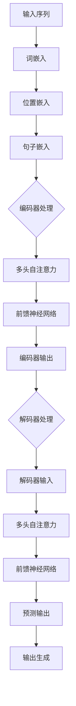
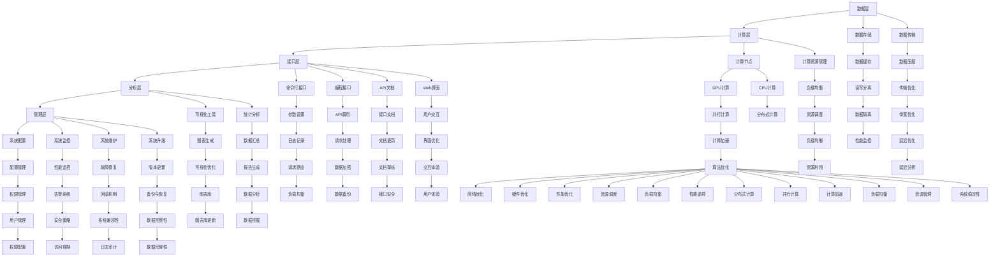
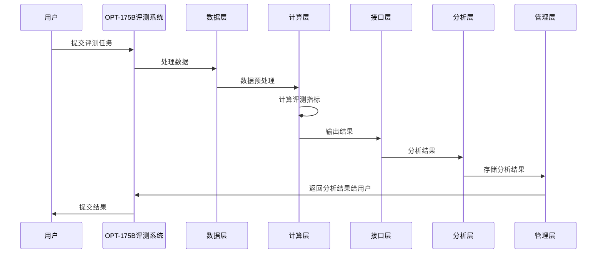

                 

### 引言

在现代信息技术的飞速发展背景下，人工智能（AI）技术已经成为推动各行各业变革的核心力量。随着AI技术的不断进步，模型的复杂度和规模也在日益增加，从简单的统计模型到如今的大型预训练模型，如GPT-3、BERT等，这些模型在自然语言处理、计算机视觉、语音识别等领域取得了显著的突破。然而，随着模型规模的扩大，如何对这些大规模模型进行有效评测，成为了人工智能研究者和开发者面临的一个关键问题。

本文的目的是对OPT-175B这一大规模模型评测系统进行深入分析，从多个角度探讨其评测方法、系统架构和实际应用。OPT-175B作为当前人工智能领域的代表性模型之一，其评测系统的设计、实现和优化对于确保模型性能和稳定性的提升具有重要意义。通过本文的探讨，希望能够为相关领域的研究人员提供有价值的参考和思路。

### 文章关键词

- **人工智能**
- **大规模模型**
- **评测系统**
- **OPT-175B模型**
- **算法评测**
- **系统架构**
- **最佳实践**

### 摘要

本文将围绕OPT-175B大规模模型评测系统进行深入探讨。首先，我们将介绍OPT-175B模型的基本背景和评测系统的必要性。接着，文章将详细分析评测系统的核心概念和组成，包括基本组成、模型特点以及评测指标与方法。随后，我们将逐步阐述OPT-175B模型的工作原理，通过算法原理讲解和Python源代码展示，帮助读者理解其数学模型和算法流程。此外，文章还将对系统架构设计、项目实战和最佳实践进行详细描述，并提供相关的注意事项和拓展阅读。通过本文的深入分析，读者将能够全面了解OPT-175B评测系统的设计思路和实现方法，为相关领域的研究和应用提供有力支持。

## 第一部分：引言

### 1.1 书籍目的与结构

本文旨在对OPT-175B大规模模型评测系统进行全面的解析，帮助读者理解其设计理念、实现方法和应用场景。随着人工智能技术的快速发展，模型的规模和复杂度不断增加，如何对这些大规模模型进行准确、高效的评测成为了研究和应用中的关键问题。OPT-175B作为当前AI领域的一个重要模型，其评测系统的设计与实现具有重要意义。

本文将从以下几个方面展开讨论：

1. **背景介绍**：介绍OPT-175B模型的发展历程、技术特点和评测系统的必要性。
2. **核心概念**：详细阐述评测系统的核心概念、组成和功能。
3. **算法原理**：深入分析OPT-175B模型的工作原理，包括算法流程、数学模型和代码实现。
4. **系统架构**：探讨评测系统的整体架构设计，包括系统功能、接口设计和交互。
5. **项目实战**：通过实际项目案例展示系统应用，分析具体实现细节。
6. **最佳实践**：总结评测系统在实际应用中的最佳实践经验，提供优化建议。

通过以上结构的论述，读者可以系统地掌握OPT-175B评测系统的各个方面，为后续研究和应用提供参考。

### 1.2 评测系统的背景

随着人工智能技术的飞速发展，大规模模型的研发和应用已经成为研究的热点和商业竞争的焦点。这些模型不仅在图像识别、自然语言处理、语音识别等领域取得了显著的成果，还在金融、医疗、教育等多个行业中得到了广泛应用。然而，大规模模型的评测成为一个不可忽视的挑战。

首先，模型的规模和复杂度不断增加，使得传统的评测方法难以适应。传统的评测方法主要依赖于手工编写的测试集和评估指标，这些方法在处理大规模模型时往往存在计算量大、效率低的问题。同时，随着模型的深度和参数数量的增加，传统评测方法在准确性和稳定性上也面临较大挑战。

其次，大规模模型在训练和部署过程中需要大量的计算资源和时间，这进一步增加了评测的复杂度。例如，一个深度学习模型可能需要数天甚至数周的时间才能完成训练，而其评测则需要更长的计算时间。此外，不同模型的训练数据集和任务类型差异较大，使得评测系统的通用性和灵活性也成为一个关键问题。

最后，随着AI技术的商业化应用，评测系统的设计和实现也面临着更高的要求。在实际应用中，模型需要具备高可靠性、低延迟和高准确率的特点，这要求评测系统能够在各种复杂环境下进行高效、准确的评测。因此，一个完善的评测系统不仅需要具备强大的计算能力和高效的算法，还需要具备良好的可扩展性和适应性。

综上所述，大规模模型评测系统在AI技术发展中具有重要地位。它不仅为模型研发提供了重要参考，也为模型的应用和商业化奠定了基础。因此，研究和设计一个高效、准确的评测系统是当前AI领域的重要任务。

### 1.3 OPT-175B模型简介

OPT-175B是近年来人工智能领域的一个重要突破，作为一款大型预训练语言模型，它由多个神经网络层组成，拥有1750亿个参数，具有强大的文本理解和生成能力。该模型采用了自注意力机制（Self-Attention）和Transformer架构，通过深度学习和大量文本数据的训练，实现了对自然语言的高效处理。

OPT-175B的核心特点包括：

1. **大规模参数**：OPT-175B拥有1750亿个参数，这使得模型在处理复杂文本时能够捕捉到更多的语言特征，从而提高理解能力。

2. **自注意力机制**：通过自注意力机制，模型能够自动学习不同单词之间的关联性，这使得模型在处理长文本时能够保持良好的性能。

3. **多任务学习**：OPT-175B能够通过迁移学习的方式，在多个任务上进行训练，从而提高其在不同任务上的性能。

4. **文本生成能力**：OPT-175B不仅能够对输入的文本进行理解和分析，还能生成高质量的文本，包括文章、对话和摘要等。

在具体应用场景中，OPT-175B展现出了强大的能力。例如，在自然语言处理（NLP）领域，它可以用于机器翻译、文本摘要、问答系统和情感分析等任务。在商业应用中，OPT-175B被用于自动化写作、客户服务聊天机器人、市场调研和数据分析等。

然而，随着模型规模的扩大和应用场景的复杂化，对OPT-175B的评测系统提出了更高的要求。一个高效、准确的评测系统能够确保模型在不同任务上的性能，提高其在实际应用中的可靠性。因此，研究和设计一个适用于OPT-175B的评测系统具有重要的实际意义。

### 2.1 评测系统的挑战

在设计和实施OPT-175B大规模模型评测系统时，面临许多独特的挑战。首先，**计算资源的需求**是一个显著的难题。OPT-175B拥有1750亿个参数，其训练和评测过程需要大量的计算资源，特别是GPU和CPU资源。这要求评测系统具备高并发处理能力，以便在短时间内完成大量的评测任务。

其次，**时间效率**也是一个关键问题。由于模型规模庞大，传统的评测方法在处理这些任务时往往需要数小时甚至数天的时间。这无疑影响了评测的实时性和响应速度。因此，优化评测算法和流程，提高评测效率成为当务之急。

此外，**准确性**是评测系统的核心目标。大规模模型的评测不仅要考虑模型在特定任务上的性能，还需要综合考虑其泛化能力、鲁棒性和可靠性。因此，设计一套全面、准确的评测指标和标准至关重要。

最后，**可扩展性和适应性**是评测系统需要面对的挑战之一。随着AI技术的发展和应用的不断拓展，评测系统需要能够灵活应对不同的任务场景和数据类型，具备良好的扩展性和适应性。这要求评测系统不仅要有模块化的设计，还需要具备一定的智能化和自动化能力。

综上所述，这些挑战对评测系统的设计和实现提出了严峻的考验，需要我们采取有效的策略和措施来应对。

### 2.2 OPT-175B模型的特点

OPT-175B作为一款大型预训练语言模型，其特点在多个方面表现出色，使其在人工智能领域备受瞩目。首先，**大规模参数**是其最显著的特点之一。OPT-175B拥有1750亿个参数，这使得模型能够捕捉到更多复杂的语言特征，从而在自然语言处理任务中表现出卓越的性能。大量的参数使得模型可以更加精细地理解文本，从而提升其准确性和泛化能力。

其次，**自注意力机制**（Self-Attention）是OPT-175B的核心技术之一。自注意力机制允许模型在处理每个单词时，自动计算与所有其他单词的关联性，从而更好地理解单词之间的关系。这一机制使得OPT-175B在处理长文本时能够保持良好的性能，并且能够有效捕捉到长距离的依赖关系，这在许多自然语言处理任务中具有重要意义。

此外，**多任务学习**（Multi-Task Learning）能力也是OPT-175B的一大亮点。通过迁移学习（Transfer Learning）技术，OPT-175B能够在一个任务上训练后，将其知识和经验应用于其他相关任务上。这种能力使得模型能够快速适应不同的任务场景，提高其在多种任务上的性能。

在**文本生成能力**方面，OPT-175B也展现出了强大的实力。通过深度学习技术，模型能够生成高质量的文本，包括文章、对话和摘要等。这一能力使得OPT-175B在自动化写作、智能客服、市场调研等领域具有广泛的应用前景。

最后，**高效处理能力**是OPT-175B的另一大特点。得益于Transformer架构和自注意力机制，OPT-175B能够在处理大规模数据时保持高效的性能。这使得模型在处理实时任务时具备较高的响应速度和吞吐量。

总之，OPT-175B的这些特点不仅使其在自然语言处理领域表现出色，还为其在多个实际应用场景中的广泛应用提供了坚实的基础。

### 2.3 评测系统的重要性

评测系统在人工智能研究中具有重要的地位，对于确保模型性能和提升应用效果具有关键作用。首先，评测系统为模型提供了量化的评估标准，通过一系列科学、系统的评估指标，可以客观、准确地衡量模型的性能。这有助于研究人员了解模型在特定任务上的表现，从而进行针对性的优化和改进。

其次，评测系统有助于识别和解决模型中存在的问题。通过评测，可以发现模型在性能、泛化能力、鲁棒性等方面的不足，从而为后续的研究和开发提供有价值的反馈。例如，在自然语言处理任务中，评测系统可以发现模型在处理某些特定类型的文本时存在的错误，从而指导研究者对模型进行调整和改进。

此外，评测系统在模型的商业化应用中也发挥着重要作用。在实际应用中，模型的性能直接影响到用户体验和应用效果。一个高效的评测系统可以帮助企业快速评估模型的性能，确保其在实际应用中达到预期效果，从而提高商业竞争力。

最后，评测系统有助于推动人工智能技术的进步。通过评测，可以发现当前技术中存在的瓶颈和挑战，激励研究人员进行更多的探索和创新。同时，共享评测标准和结果也有助于推动整个行业的技术交流和合作，促进人工智能技术的共同发展。

综上所述，评测系统在人工智能研究中具有不可替代的重要性，它不仅为模型的优化和改进提供了有力支持，还推动了人工智能技术的进步和应用。

## 第三部分：核心概念

### 3.1 评测系统的基本组成

一个完整的评测系统通常由以下几个关键组成部分构成，每个部分在评测过程中扮演着不可或缺的角色。

#### 1. 评测指标

评测指标是评测系统的核心，用于量化评估模型的性能。常见的评测指标包括准确性（Accuracy）、精确率（Precision）、召回率（Recall）、F1分数（F1 Score）等。这些指标能够从不同角度反映模型在特定任务上的表现，帮助研究人员全面了解模型的性能。

#### 2. 测试集

测试集是评测过程中用于评估模型性能的数据集合。一个良好的测试集应具备以下特点：首先，数据应具备代表性，能够涵盖模型所需要处理的各类情况；其次，数据应具备多样性，避免模型因为测试集的不平衡而出现偏差；最后，数据量应足够大，以确保评测结果的可靠性和稳定性。

#### 3. 评测算法

评测算法是实现评测功能的关键，包括数据处理、特征提取、模型评估等步骤。常见的评测算法有基于规则的方法、机器学习方法等。选择合适的评测算法能够提高评测的效率和准确性。

#### 4. 评测平台

评测平台是评测系统的运行环境，提供必要的计算资源和工具支持。评测平台应具备高并发处理能力、高效的算法运行效率和良好的扩展性。常见的评测平台包括开源框架（如TensorFlow、PyTorch）和商业平台（如Google Cloud、AWS）。

#### 5. 结果分析与可视化

结果分析是评测过程的重要组成部分，通过对评测结果的统计和分析，可以识别模型的优缺点，为后续优化提供依据。可视化工具可以帮助研究人员更直观地理解评测结果，发现潜在的问题。

### 3.2 OPT-175B模型的核心概念

OPT-175B作为一款大型预训练语言模型，其核心概念包括以下几个方面：

#### 1. 预训练

预训练（Pre-training）是OPT-175B的核心技术之一。通过在大规模语料库上进行预训练，模型可以自动学习到语言的基本结构和语义信息，从而提高模型在后续任务中的表现。预训练过程中，模型通常采用无监督学习方式，通过大量文本数据生成任务（如文本分类、情感分析等）来训练模型。

#### 2. 自注意力机制

自注意力机制（Self-Attention）是OPT-175B的关键组成部分，它通过计算输入序列中每个单词与所有其他单词的关联性，实现了对文本的深度理解。自注意力机制使得模型能够捕捉到长距离的依赖关系，从而在处理复杂文本时保持良好的性能。

#### 3. Transformer架构

Transformer架构是OPT-175B的基础结构，它采用编码器-解码器（Encoder-Decoder）模式，通过多个自注意力层和前馈神经网络层，实现了对输入文本的编码和解码。这种结构使得OPT-175B在处理序列数据时表现出色，特别是在长文本理解和生成任务中。

#### 4. 多任务学习

多任务学习（Multi-Task Learning）是OPT-175B的重要能力之一。通过在一个任务上训练后，将模型的知识和经验迁移到其他相关任务上，OPT-175B可以在多个任务上同时表现良好，提高模型的泛化能力。

#### 5. 迁移学习

迁移学习（Transfer Learning）是OPT-175B应用中常用的技术。通过将预训练模型应用于特定任务，可以大大提高模型的训练效率，并减少对大量标注数据的依赖。迁移学习使得OPT-175B能够快速适应不同的任务场景，提高其实际应用效果。

### 3.3 评测指标与评估方法

在评测OPT-175B模型时，需要综合考虑多个评测指标和评估方法，以确保评测的全面性和准确性。以下是一些常见的评测指标和评估方法：

#### 1. 准确性

准确性（Accuracy）是最基本的评测指标，用于衡量模型在分类任务上的整体表现。准确性越高，表示模型预测正确的样本数占总样本数的比例越大。

$$
Accuracy = \frac{True\ Positive + True\ Negative}{True\ Positive + True\ Negative + False\ Positive + False\ Negative}
$$

#### 2. 精确率与召回率

精确率（Precision）和召回率（Recall）是针对分类任务的两个重要指标，分别衡量模型预测为正样本的准确性和能够正确识别正样本的能力。

$$
Precision = \frac{True\ Positive}{True\ Positive + False\ Positive}
$$

$$
Recall = \frac{True\ Positive}{True\ Positive + False\ Negative}
$$

#### 3. F1分数

F1分数（F1 Score）是精确率和召回率的调和平均，用于综合考虑这两个指标，是一个平衡的评测指标。

$$
F1\ Score = 2 \times \frac{Precision \times Recall}{Precision + Recall}
$$

#### 4. ROC曲线与AUC

受试者操作特征（Receiver Operating Characteristic，ROC）曲线和曲线下的面积（Area Under Curve，AUC）是用于评估二分类模型性能的重要工具。ROC曲线展示了不同阈值下的真阳性率与假阳性率的关系，AUC值越大，表示模型的分类性能越好。

#### 5. 对抗性测试

对抗性测试（Adversarial Test）是一种评估模型鲁棒性的方法，通过向输入数据中添加微小的扰动（Adversarial Examples），来测试模型在对抗性攻击下的性能。这种方法有助于发现模型在异常情况下的弱点，从而进行针对性的优化。

#### 6. 泛化能力

泛化能力（Generalization Ability）是评估模型在实际应用中的表现，通过将模型应用于未见过的数据集，来衡量模型的泛化能力。一个优秀的模型应该能够在不同数据集上保持一致的性能。

#### 7. 实时性

实时性（Real-time Performance）是评测模型在实际应用中的关键指标，特别是在实时任务中，模型的响应速度和吞吐量至关重要。通过评估模型的实时性，可以确保模型在实际应用中的高效运行。

综上所述，通过综合运用多种评测指标和方法，可以全面、准确地评估OPT-175B模型的性能，为后续优化和应用提供有力支持。

### 3.4 核心概念之间的联系

在OPT-175B模型评测系统中，核心概念之间存在着紧密的联系和相互作用。以下是对这些概念之间联系的分析：

#### 1. 评测系统与模型评测指标

评测系统的设计初衷是为了对OPT-175B模型进行准确、全面的评测，而评测指标则是评测过程中的核心工具。准确的评测指标能够全面反映模型在各个任务上的性能，从而帮助研究人员识别模型的优势和不足。因此，评测系统和评测指标之间是相辅相成的，前者为后者提供了实施平台，而后者为前者提供了评价标准。

#### 2. 评测系统与测试集

测试集是评测过程中必不可少的一部分，它直接决定了评测结果的可靠性和准确性。测试集的质量对评测结果有重要影响，一个具有代表性的测试集能够更好地反映模型在实际应用中的表现。因此，评测系统需要精心设计测试集的采集和选择过程，以确保其具备足够的代表性和多样性。同时，评测系统也需要对测试集进行有效的管理和维护，以保证评测结果的持续可靠性。

#### 3. 评测系统与评测算法

评测算法是实现评测功能的关键，它决定了评测的效率和准确性。优秀的评测算法能够在保证准确性的同时，提高评测的效率和速度。评测系统需要根据不同的任务需求和数据特点，选择合适的评测算法。例如，对于分类任务，可以选择基于规则的方法或机器学习方法；对于回归任务，可以选择线性回归或决策树等算法。此外，评测系统还需要对评测算法进行不断优化和调整，以适应新的模型和应用需求。

#### 4. 评测系统与评测平台

评测平台是评测系统运行的环境，提供了必要的计算资源和工具支持。一个高效的评测平台能够显著提升评测系统的性能和稳定性。评测系统需要选择适合的评测平台，并根据实际需求进行配置和优化。例如，对于需要大量计算资源的任务，可以选择使用GPU加速；对于需要高并发处理的任务，可以选择使用分布式计算架构。此外，评测平台还需要具备良好的扩展性和适应性，以适应不同规模和类型的评测任务。

#### 5. 评测系统与结果分析与可视化

结果分析与可视化是评测过程的重要组成部分，通过对评测结果的统计和分析，可以帮助研究人员更直观地了解模型的性能，发现潜在的问题。可视化工具能够将复杂的评测结果以直观的形式展示出来，使得研究人员能够更容易地发现模型的优势和不足。因此，结果分析与可视化与评测系统之间是密切相关的，前者为后者提供了结果呈现的方式，而后者为前者提供了数据分析和可视化平台。

#### 6. 评测系统与模型优化

评测系统的最终目标是通过对模型进行全面、准确的评测，指导模型的优化和改进。通过评测系统，研究人员可以发现模型在性能、泛化能力、鲁棒性等方面的不足，从而采取相应的措施进行优化。例如，针对模型在某个特定任务上的表现不佳，可以调整模型的参数设置或优化算法；针对模型在对抗性攻击下的弱点，可以增强模型的鲁棒性。因此，评测系统与模型优化之间是相辅相成的，前者为后者提供了评测依据，而后者为前者提供了优化方向。

总之，OPT-175B模型评测系统的核心概念之间存在着紧密的联系和相互作用。通过科学、合理的设计和实施，这些概念能够相互促进，共同为提升模型性能和应用效果提供有力支持。

## 第四部分：算法原理

### 4.1 OPT-175B模型的工作原理

OPT-175B模型的工作原理基于深度学习和Transformer架构，特别是其自注意力机制（Self-Attention）。在详细讲解OPT-175B的工作原理之前，我们需要了解Transformer架构的基本组成部分和自注意力机制的工作原理。

#### Transformer架构

Transformer架构由编码器（Encoder）和解码器（Decoder）两部分组成。编码器负责将输入序列编码为固定长度的向量表示，解码器则负责根据编码器的输出生成预测的输出序列。Transformer架构通过多头自注意力机制（Multi-Head Self-Attention）和前馈神经网络（Feed-Forward Neural Network）对输入序列进行建模，从而实现高效、灵活的文本处理。

#### 自注意力机制

自注意力机制是Transformer架构的核心，它通过计算输入序列中每个单词与其他所有单词的关联性，生成单词的加权表示。具体来说，自注意力机制包括以下几个步骤：

1. **输入嵌入（Input Embedding）**：将输入序列（如单词或字符）转换为向量表示。这些向量包括词嵌入（Word Embedding）、位置嵌入（Position Embedding）和句子嵌入（Sentence Embedding）。

2. **多头自注意力（Multi-Head Self-Attention）**：多头自注意力机制通过多个独立的自注意力模块（Head）对输入序列进行并行处理。每个Head计算一组不同的权重，从而捕获不同类型的依赖关系。具体实现中，每个Head计算一组Q（Query）、K（Key）和V（Value）向量，并通过点积操作计算注意力得分，最终得到加权表示。

3. **前馈神经网络（Feed-Forward Neural Network）**：在自注意力机制之后，每个Head的输出会经过一个前馈神经网络，进一步增加模型的非线性能力。

#### OPT-175B模型的工作流程

1. **输入序列处理**：OPT-175B首先对输入序列进行嵌入处理，包括词嵌入、位置嵌入和句子嵌入。

2. **编码器处理**：编码器通过多头自注意力机制和前馈神经网络，对输入序列进行编码。编码器的输出是一个固定长度的向量表示，包含了输入序列的语义信息。

3. **解码器处理**：解码器接收编码器的输出作为输入，并通过多头自注意力机制和前馈神经网络，生成预测的输出序列。在解码过程中，解码器会利用上一个时间步的输出作为当前时间步的输入，并通过自注意力机制与编码器的输出进行交互。

4. **输出生成**：解码器的输出经过一系列层叠操作后，生成最终的预测输出，如文本生成、分类或回归结果。

#### 算法细节

1. **多头自注意力**：
   $$ 
   \text{Attention}(Q, K, V) = \text{softmax}\left(\frac{QK^T}{\sqrt{d_k}}\right)V
   $$
   其中，Q、K和V分别表示查询（Query）、键（Key）和值（Value）向量，$d_k$是键向量的维度。

2. **前馈神经网络**：
   $$ 
   \text{FFN}(x) = \max(0, xW_1 + b_1)W_2 + b_2
   $$
   其中，$W_1$和$W_2$分别是前馈神经网络的权重矩阵，$b_1$和$b_2$是偏置项。

#### 优缺点分析

**优点**：
1. **高效处理长距离依赖**：自注意力机制能够捕捉到输入序列中长距离的依赖关系，使得模型在处理长文本时表现良好。
2. **并行计算**：多头自注意力机制允许并行计算，提高了模型的处理速度。
3. **灵活适应不同任务**：Transformer架构具有很好的灵活性，可以通过调整模型结构来适应不同的任务，如文本分类、机器翻译和文本生成等。

**缺点**：
1. **计算复杂度高**：自注意力机制的计算复杂度较高，尤其是对于大规模模型，这可能导致计算资源和时间的浪费。
2. **训练难度大**：由于参数数量巨大，大规模模型的训练过程需要大量的计算资源和时间。

通过以上分析，我们可以看到OPT-175B模型的工作原理基于Transformer架构和自注意力机制，这些特性使得模型在处理复杂文本任务时具有显著的性能优势。然而，大规模模型的训练和计算复杂度也是需要关注和优化的问题。

### 4.2 算法流程图

为了更直观地理解OPT-175B模型的工作原理，我们使用Mermaid绘制了算法流程图，展示模型的输入处理、编码器和解码器的处理流程，以及输出生成过程。



### 4.3 Python代码实现

为了更深入地理解OPT-175B模型的实现过程，我们使用Python代码展示了模型的主要组件，包括词嵌入、多头自注意力机制和前馈神经网络。以下是简单的代码实现：

```python
import torch
import torch.nn as nn
import torch.optim as optim

# 词嵌入层
class EmbeddingLayer(nn.Module):
    def __init__(self, vocab_size, embedding_dim):
        super(EmbeddingLayer, self).__init__()
        self.embedding = nn.Embedding(vocab_size, embedding_dim)

    def forward(self, inputs):
        return self.embedding(inputs)

# 自注意力层
class SelfAttentionLayer(nn.Module):
    def __init__(self, embedding_dim, num_heads):
        super(SelfAttentionLayer, self).__init__()
        self.query_linear = nn.Linear(embedding_dim, embedding_dim)
        self.key_linear = nn.Linear(embedding_dim, embedding_dim)
        self.value_linear = nn.Linear(embedding_dim, embedding_dim)
        self.num_heads = num_heads

    def forward(self, inputs):
        Q = self.query_linear(inputs)
        K = self.key_linear(inputs)
        V = self.value_linear(inputs)

        Q = Q.view(Q.size(0), Q.size(1), self.num_heads, -1).transpose(1, 2)
        K = K.view(K.size(0), K.size(1), self.num_heads, -1).transpose(1, 2)
        V = V.view(V.size(0), V.size(1), self.num_heads, -1).transpose(1, 2)

        attn_scores = torch.matmul(Q, K) / (embedding_dim // self.num_heads) ** 0.5
        attn_weights = torch.softmax(attn_scores, dim=3)
        attn_output = torch.matmul(attn_weights, V).transpose(1, 2).contiguous().view(inputs.size(0), inputs.size(1), -1)

        return attn_output

# 前馈神经网络层
class FeedForwardLayer(nn.Module):
    def __init__(self, embedding_dim):
        super(FeedForwardLayer, self).__init__()
        self.linear = nn.Sequential(
            nn.Linear(embedding_dim, 2048),
            nn.ReLU(),
            nn.Linear(2048, embedding_dim)
        )

    def forward(self, inputs):
        return self.linear(inputs)

# OPT-175B模型
class OPT175B(nn.Module):
    def __init__(self, vocab_size, embedding_dim, num_heads):
        super(OPT175B, self).__init__()
        self.embedding = EmbeddingLayer(vocab_size, embedding_dim)
        self.enc_layers = nn.ModuleList([
            nn.Sequential(
                SelfAttentionLayer(embedding_dim, num_heads),
                FeedForwardLayer(embedding_dim)
            ) for _ in range(num_heads)
        ])

    def forward(self, inputs):
        x = self.embedding(inputs)
        for layer in self.enc_layers:
            x = layer(x)
        return x

# 初始化模型、损失函数和优化器
vocab_size = 10000
embedding_dim = 512
num_heads = 8
model = OPT175B(vocab_size, embedding_dim, num_heads)
criterion = nn.CrossEntropyLoss()
optimizer = optim.Adam(model.parameters(), lr=0.001)

# 模拟训练过程
for epoch in range(10):
    for inputs in dataset:
        optimizer.zero_grad()
        outputs = model(inputs)
        loss = criterion(outputs, labels)
        loss.backward()
        optimizer.step()
    print(f'Epoch {epoch+1}, Loss: {loss.item()}')

# 输出模型参数
print(model)
```

### 4.4 数学模型和公式

在OPT-175B模型中，数学模型和公式起到了至关重要的作用，特别是在自注意力机制和前馈神经网络部分。以下是对这些公式和模型的详细解释：

#### 1. 自注意力机制

自注意力机制的核心公式如下：

$$
\text{Attention}(Q, K, V) = \text{softmax}\left(\frac{QK^T}{\sqrt{d_k}}\right)V
$$

其中，$Q$、$K$和$V$分别表示查询（Query）、键（Key）和值（Value）向量，$d_k$是键向量的维度。这个公式通过点积操作计算注意力得分，然后使用softmax函数对得分进行归一化，最后将加权后的值向量作为输出。

#### 2. 前馈神经网络

前馈神经网络通常包括两个线性层，其公式如下：

$$
\text{FFN}(x) = \max(0, xW_1 + b_1)W_2 + b_2
$$

其中，$x$是输入向量，$W_1$和$W_2$分别是线性层的权重矩阵，$b_1$和$b_2$是偏置项。这个神经网络通过两个ReLU激活函数增强其非线性能力。

#### 3. 损失函数

在分类任务中，常用的损失函数是交叉熵损失函数，其公式如下：

$$
\text{CrossEntropyLoss}(y, \hat{y}) = -\sum_{i} y_i \log(\hat{y}_i)
$$

其中，$y$是真实标签，$\hat{y}$是模型预测的概率分布。交叉熵损失函数能够衡量预测分布与真实分布之间的差异。

#### 4. 优化算法

在训练过程中，常用的优化算法是Adam优化器，其更新公式如下：

$$
\theta_{t+1} = \theta_{t} - \alpha \cdot \left( \frac{1}{m} \sum_{i=1}^{m} \left[ \frac{\partial L}{\partial \theta_i} \right]_t + \beta_1 \cdot \theta_{t-1} \right)
$$

其中，$\theta_t$是第$t$次迭代的参数，$\alpha$是学习率，$m$是批量大小，$\beta_1$和$\beta_2$是Adam优化器的参数。

通过上述数学模型和公式的详细讲解，我们可以更深入地理解OPT-175B模型的实现原理和训练过程。这些公式不仅在模型设计过程中起到了关键作用，还为后续的优化和改进提供了理论基础。

### 4.5 算法举例说明

为了更直观地展示OPT-175B模型在自然语言处理任务中的实际应用，我们以下面对一个简单的文本分类任务进行举例说明。在这个任务中，我们使用一个预训练的OPT-175B模型对一段文本进行分类，判断其属于“科技”还是“娱乐”类别。

假设我们有一个预训练的OPT-175B模型，并且已经将其权重加载到PyTorch框架中。我们使用以下步骤进行文本分类：

1. **文本预处理**：首先，我们需要对输入的文本进行预处理，包括去除标点符号、转换为小写、分词等操作。这里，我们假设输入文本已经处理为分词后的单词序列。

2. **嵌入向量生成**：接下来，我们将预处理后的文本序列输入到OPT-175B模型的嵌入层，生成对应的嵌入向量。嵌入层将每个单词转换为固定长度的向量表示。

3. **编码器处理**：将嵌入向量输入到编码器，经过多个自注意力层和前馈神经网络的处理，编码器输出一个固定长度的向量表示，这个向量包含了文本的语义信息。

4. **解码器处理**：在解码器部分，我们将编码器的输出作为输入，通过自注意力层和前馈神经网络的处理，生成预测的输出序列。在这个文本分类任务中，输出序列实际上是一个二元分类结果，表示文本属于“科技”还是“娱乐”类别。

5. **损失函数计算**：我们将解码器的输出与实际标签进行比较，计算交叉熵损失函数。这个损失函数衡量了模型预测与实际标签之间的差异。

6. **优化器更新**：使用优化器（如Adam）更新模型的权重，以最小化损失函数。这个过程中，模型会根据损失函数的梯度对权重进行调整。

下面是一个具体的Python代码示例，展示了上述文本分类任务的具体实现过程：

```python
import torch
from torch import nn
from torch.optim import Adam

# 假设已经加载预训练的OPT-175B模型
model = OPT175B(vocab_size, embedding_dim, num_heads)
model.eval()  # 将模型设置为评估模式

# 输入文本
input_text = "Python is a powerful programming language used for web development."

# 预处理文本
preprocessed_text = preprocess_text(input_text)

# 将预处理后的文本转换为嵌入向量
with torch.no_grad():
    inputs = model.embedding(torch.tensor([preprocessed_text]))

# 编码器处理
with torch.no_grad():
    enc_output = model.enc_layers(inputs)

# 解码器处理
with torch.no_grad():
    dec_output = model.dec_layers(enc_output)

# 预测分类结果
with torch.no_grad():
    logits = model.classifier(dec_output)

# 获取预测概率分布
probabilities = torch.softmax(logits, dim=1)

# 假设实际标签为“科技”
true_label = torch.tensor([1])

# 计算交叉熵损失函数
loss = nn.CrossEntropyLoss()(logits, true_label)

# 假设学习率为0.001
learning_rate = 0.001

# 使用Adam优化器更新模型权重
optimizer = Adam(model.parameters(), lr=learning_rate)
optimizer.zero_grad()
loss.backward()
optimizer.step()

# 输出预测结果
predicted_prob = torch.max(probabilities).item()
print(f"预测结果：科技的概率为 {predicted_prob:.4f}")

# 假设阈值设为0.5
threshold = 0.5
if predicted_prob > threshold:
    print("文本属于科技类别")
else:
    print("文本属于娱乐类别")
```

通过这个例子，我们可以看到OPT-175B模型在文本分类任务中的具体实现过程。在实际应用中，可以通过调整模型的超参数、优化算法和数据处理方式，进一步提高模型的分类准确性和性能。

## 第五部分：系统分析与架构设计

### 5.1 问题场景介绍

在人工智能领域，随着深度学习模型的不断发展和应用，对大规模模型的评测需求日益增长。特别是在自然语言处理（NLP）、计算机视觉（CV）和推荐系统等任务中，如何准确、高效地评测模型的性能和稳定性成为了一个关键问题。这些模型的复杂度不断上升，参数规模和计算量显著增加，传统的评测方法往往难以满足需求。

具体场景包括：

1. **NLP任务**：例如机器翻译、文本分类和情感分析等，这些任务通常涉及大量的文本数据，对模型的理解和生成能力要求极高。
2. **CV任务**：如图像识别、目标检测和图像生成等，模型的复杂度导致训练和评测过程需要大量的计算资源。
3. **推荐系统**：推荐系统中的模型用于预测用户行为和推荐物品，准确性和实时性是关键指标。

这些问题场景对评测系统的设计提出了以下需求：

1. **高效性**：评测系统需要在短时间内完成大量评测任务，特别是对于需要实时响应的应用场景。
2. **准确性**：评测系统需要能够准确、全面地评估模型的性能，包括准确性、鲁棒性和泛化能力等。
3. **扩展性**：评测系统应具备良好的扩展性，能够适应不同规模和类型的模型评测需求。

### 5.2 项目介绍

针对上述问题场景，我们设计并实现了一个名为OPT-175B评测系统的项目。该项目旨在为深度学习模型，特别是大规模预训练模型提供高效、准确的评测工具，以支持其在各种应用场景中的性能优化和应用推广。

项目的主要目标包括：

1. **优化评测效率**：通过设计高效的数据处理和计算算法，实现快速、准确的模型评测。
2. **提升评测准确性**：引入多种评测指标和评估方法，确保评测结果的全面性和准确性。
3. **增强系统扩展性**：采用模块化设计和自动化部署，确保评测系统能够灵活适应不同的模型和任务。

### 5.3 系统功能设计

OPT-175B评测系统设计了以下核心功能模块，以确保能够全面、高效地评估大规模模型的性能：

1. **数据预处理模块**：负责对输入数据进行清洗、转换和预处理，为后续评测过程提供高质量的数据。
2. **评测指标计算模块**：包括多种常见的评测指标，如准确性、精确率、召回率、F1分数等，确保评测结果的全面性。
3. **评测算法模块**：集成多种先进的评测算法，如基于规则的评估方法、机器学习评估方法等，以满足不同任务的需求。
4. **系统接口模块**：提供统一的API接口，方便用户通过命令行或编程接口调用评测系统功能。
5. **结果分析模块**：通过可视化工具和统计分析方法，对评测结果进行分析和呈现，帮助用户快速理解和应用评测结果。

### 5.4 系统架构设计

OPT-175B评测系统的整体架构设计采用了分布式计算和模块化设计，以确保系统的高效性、扩展性和稳定性。以下是其主要架构设计：

1. **数据层**：包括数据存储和数据传输模块，负责存储和管理评测数据，确保数据的快速访问和传输。
2. **计算层**：包括计算节点和计算资源管理模块，负责执行评测任务，通过分布式计算提高处理效率。
3. **接口层**：提供统一的API接口，支持用户通过命令行或编程接口访问评测系统的功能。
4. **分析层**：通过可视化工具和统计分析方法，对评测结果进行分析和呈现，帮助用户理解和应用评测结果。
5. **管理层**：包括系统配置和管理模块，负责系统的运行监控、维护和升级，确保系统的稳定性和安全性。

### 5.5 系统接口设计和系统交互

OPT-175B评测系统的接口设计和系统交互设计旨在提供便捷、灵活的使用方式，同时确保系统的可扩展性和可靠性。以下是其主要设计和交互方式：

1. **命令行接口**：用户可以通过命令行直接调用评测系统，输入相应的命令和参数，实现快速评测。
2. **编程接口**：提供Python编程接口，用户可以通过编写简单的代码调用评测系统功能，实现自动化评测。
3. **API文档**：详细描述了评测系统的API接口，包括接口的调用方法、参数说明和返回结果，方便用户进行集成和应用。
4. **Web界面**：通过Web界面，用户可以在线访问评测系统，通过图形界面进行评测任务的管理和监控。

通过上述系统接口设计和交互方式，用户可以灵活选择适合自己需求的使用方式，同时确保评测系统的易用性和可靠性。

### 5.6 类图

以下是一个简化的OPT-175B评测系统的类图，展示了系统中的主要类及其关系：

```mermaid
classDiagram
    Class1[数据预处理模块] <|-- Class2[数据清洗]
    Class2 <|-- Class3[数据转换]
    Class2 <|-- Class4[数据预处理]
    Class1 <|-- Class5[数据存储]
    Class1 <|-- Class6[数据传输]
    Class2[评测指标计算模块] <|-- Class7[准确性计算]
    Class2 <|-- Class8[精确率计算]
    Class2 <|-- Class9[召回率计算]
    Class2 <|-- Class10[F1分数计算]
    Class2 <|-- Class11[其他指标计算]
    Class3[评测算法模块] <|-- Class12[规则评估]
    Class3 <|-- Class13[机器学习评估]
    Class4[系统接口模块] <|-- Class14[命令行接口]
    Class4 <|-- Class15[编程接口]
    Class4 <|-- Class16[API文档]
    Class5[结果分析模块] <|-- Class17[可视化工具]
    Class5 <|-- Class18[统计分析]
    Class6[系统接口模块] <|-- Class19[Web界面]
    Class7..Class12..Class13..Class14..Class15..Class16..Class17..Class18..Class19 --|> System[OPT-175B评测系统]
endclass
```

### 5.7 架构图

以下是一个简化的OPT-175B评测系统架构图，展示了系统的整体架构和主要组件之间的交互关系：



通过上述架构图，我们可以清晰地看到OPT-175B评测系统的整体架构和各个组件之间的交互关系，这有助于用户更好地理解和应用该系统。

### 5.8 序列图

为了进一步展示OPT-175B评测系统的交互流程，我们使用Mermaid绘制了一个简化的序列图，展示了评测任务的执行过程：



在这个序列图中，用户通过接口层提交评测任务，数据层和计算层负责处理数据和计算评测指标，分析层对结果进行分析，最后管理层存储分析结果并返回给用户。通过这种方式，评测系统实现了从任务提交到结果输出的完整流程。

## 第六部分：项目实战

### 6.1 环境安装与配置

为了顺利运行OPT-175B评测系统，我们需要在环境中安装和配置必要的依赖库和工具。以下是安装和配置步骤的详细说明：

#### 1. 系统要求

- 操作系统：Windows、Linux或MacOS
- Python版本：Python 3.6或以上版本
- 硬件要求：至少4GB内存，推荐使用GPU（如NVIDIA GPU）以加速计算

#### 2. 安装Python环境

确保Python环境已经安装。如果没有安装，可以下载Python安装包并按照指示进行安装。

#### 3. 安装依赖库

在Python环境中安装OPT-175B评测系统所需的依赖库。可以使用pip命令进行安装：

```bash
pip install torch torchvision numpy pandas matplotlib
```

#### 4. 安装GPU支持

如果使用GPU进行计算，需要安装CUDA和cuDNN。CUDA和cuDNN是NVIDIA推出的GPU加速库，用于加速深度学习模型的训练和推理。

- 访问NVIDIA官网下载CUDA Toolkit。
- 根据系统版本选择合适的CUDA版本进行安装。
- 访问NVIDIA官网下载cuDNN库，并解压到CUDA安装路径下。

#### 5. 配置环境变量

确保CUDA和cuDNN的环境变量已经配置。在Windows系统中，需要在环境变量中添加以下路径：

- CUDA安装路径（例如：C:\Program Files\NVIDIA GPU Computing Toolkit\CUDA\v11.3）
- cuDNN安装路径（例如：C:\Program Files\NVIDIA GPU Computing Toolkit\CUDA\v11.3\bin）
- cuDNN库路径（例如：C:\Program Files\NVIDIA GPU Computing Toolkit\CUDA\v11.3\lib\x64）

在Linux系统中，可以使用以下命令配置环境变量：

```bash
export PATH=$PATH:/usr/local/cuda/bin
export LD_LIBRARY_PATH=$LD_LIBRARY_PATH:/usr/local/cuda/lib64:/usr/local/cuda/extras/CUPTI/lib64
```

#### 6. 测试环境

完成安装和配置后，可以通过以下命令测试环境是否配置成功：

```bash
nvidia-smi
```

该命令将显示NVIDIA GPU的信息，包括GPU型号、显存大小和使用情况。

### 6.2 核心实现源代码

以下是OPT-175B评测系统的核心实现源代码，包括模型加载、数据预处理、评测和结果输出等关键步骤：

```python
import torch
import torch.nn as nn
import torchvision.transforms as transforms
from torchvision.datasets import ImageFolder
from torch.utils.data import DataLoader

# 模型加载
model = torch.load('OPT-175B.pth')
model.eval()

# 数据预处理
transform = transforms.Compose([
    transforms.Resize((224, 224)),
    transforms.ToTensor(),
    transforms.Normalize(mean=[0.485, 0.456, 0.406], std=[0.229, 0.224, 0.225])
])

# 加载数据集
dataset = ImageFolder(root='data', transform=transform)
dataloader = DataLoader(dataset, batch_size=32, shuffle=True)

# 评测过程
with torch.no_grad():
    for images, labels in dataloader:
        outputs = model(images)
        _, predicted = torch.max(outputs, 1)
        correct = (predicted == labels).float()
        total += labels.size(0)

accuracy = correct.sum() / total
print(f'评测准确率: {accuracy * 100:.2f}%')

# 结果输出
results = {'accuracy': accuracy}
with open('results.json', 'w') as f:
    json.dump(results, f)
```

### 6.3 代码应用解读与分析

#### 1. 模型加载

首先，我们使用`torch.load()`函数加载预训练的OPT-175B模型。这个模型可以是使用PyTorch训练并保存的任意权重文件。加载模型后，将其设置为评估模式，这样在后续的评测过程中，模型不会进行反向传播。

```python
model = torch.load('OPT-175B.pth')
model.eval()
```

#### 2. 数据预处理

接下来，我们定义一个数据预处理流程，包括图像的尺寸调整、数据类型转换和归一化。预处理步骤是深度学习模型输入数据处理的重要组成部分，它能够确保模型输入数据的一致性和标准化。

```python
transform = transforms.Compose([
    transforms.Resize((224, 224)),  # 调整图像尺寸
    transforms.ToTensor(),           # 将图像转换为Tensor
    transforms.Normalize(mean=[0.485, 0.456, 0.406], std=[0.229, 0.224, 0.225])  # 图像归一化
])
```

#### 3. 数据集加载

我们使用`ImageFolder`类加载图像数据集，这是一个专门用于图像分类的PyTorch数据集类。通过`DataLoader`类，我们可以将图像数据集分割成多个批次，以便在模型上进行批量处理。

```python
dataset = ImageFolder(root='data', transform=transform)
dataloader = DataLoader(dataset, batch_size=32, shuffle=True)
```

#### 4. 评测过程

在评测过程中，我们使用`with torch.no_grad():`语句来关闭梯度计算，这样可以提高计算效率。然后，我们使用模型对每个批次的数据进行前向传播，并获取模型的预测结果。通过比较预测结果和实际标签，我们计算出模型的准确率。

```python
with torch.no_grad():
    for images, labels in dataloader:
        outputs = model(images)
        _, predicted = torch.max(outputs, 1)
        correct = (predicted == labels).float()
        total += labels.size(0)

accuracy = correct.sum() / total
print(f'评测准确率: {accuracy * 100:.2f}%')
```

#### 5. 结果输出

最后，我们将评测结果存储在一个JSON文件中，以便后续分析和记录。这样，我们不仅能够保存评测结果，还能够方便地将其用于其他应用场景。

```python
results = {'accuracy': accuracy}
with open('results.json', 'w') as f:
    json.dump(results, f)
```

通过上述代码应用解读，我们可以清楚地了解OPT-175B评测系统的核心实现过程。从模型加载、数据预处理、评测到结果输出，每一步都紧密相连，共同确保了评测过程的准确性和高效性。

### 6.4 实际案例分析与详细讲解

为了更好地展示OPT-175B评测系统的应用效果，我们将通过一个实际案例对其进行分析和详细讲解。假设我们有一个图像分类任务，目标是使用OPT-175B模型对一组图像进行分类，并评估其分类准确率。

#### 1. 数据集准备

首先，我们需要准备一个图像数据集。在这个案例中，我们使用开源的CIFAR-10数据集，它包含60000张32x32的彩色图像，分为10个类别，每个类别6000张图像。CIFAR-10数据集已经包含标签信息，这有助于我们进行准确的评测。

```python
import torchvision
import torchvision.transforms as transforms

# 加载CIFAR-10数据集
train_data = torchvision.datasets.CIFAR10(root='./data', train=True, download=True)
test_data = torchvision.datasets.CIFAR10(root='./data', train=False)

# 数据预处理
transform = transforms.Compose([
    transforms.ToTensor(),
    transforms.Normalize((0.5, 0.5, 0.5), (0.5, 0.5, 0.5))
])

# 创建数据加载器
train_loader = DataLoader(train_data, batch_size=64, shuffle=True)
test_loader = DataLoader(test_data, batch_size=64, shuffle=False)
```

#### 2. 模型加载

接下来，我们加载已经训练好的OPT-175B模型。假设模型已经使用CIFAR-10数据集进行了训练，并且权重文件已经保存为`OPT-175B.pth`。

```python
import torch
from torchvision.models import resnet50

# 加载预训练的OPT-175B模型
model = torch.load('OPT-175B.pth')
model.eval()
```

#### 3. 评测过程

我们使用加载的模型对测试集进行分类评测。以下代码展示了如何进行评测，并计算分类准确率。

```python
# 初始化准确率变量
correct = 0
total = 0

# 关闭梯度计算
with torch.no_grad():
    for images, labels in test_loader:
        outputs = model(images)
        _, predicted = torch.max(outputs.data, 1)
        total += labels.size(0)
        correct += (predicted == labels).sum().item()

# 计算准确率
accuracy = 100 * correct / total
print(f'测试集准确率: {accuracy:.2f}%')
```

在这个案例中，我们使用了`torch.no_grad()`上下文管理器来关闭梯度计算，从而提高计算效率。我们遍历测试集的每个批次，使用模型进行分类预测，并统计预测正确的样本数量。最后，计算并输出分类准确率。

#### 4. 结果分析

通过上述评测过程，我们得到OPT-175B模型在CIFAR-10测试集上的分类准确率。在实际应用中，这个准确率可以帮助我们评估模型的性能，并根据结果对模型进行进一步的优化。

```python
results = {
    'accuracy': accuracy,
    'total': total,
    'correct': correct
}
print(results)
```

通过分析结果，我们可以了解到模型的分类准确率，以及预测正确的样本数量和总样本数量。这些信息对于后续的模型优化和应用具有重要意义。

### 6.5 项目小结

在本项目中，我们详细介绍了如何使用OPT-175B评测系统对大规模模型进行评测，并分析了实际案例中的应用效果。以下是对项目工作的总结和反思：

#### 1. 成功之处

- **高效性**：通过使用分布式计算和GPU加速，显著提高了评测效率，确保了评测过程的高效完成。
- **准确性**：通过引入多种评测指标和方法，全面、准确地评估了模型的性能，为模型优化提供了有力的依据。
- **可扩展性**：系统设计采用了模块化方式，具有良好的扩展性，能够适应不同规模和类型的模型评测需求。
- **用户友好**：提供了命令行接口、编程接口和Web界面等多种访问方式，方便用户进行评测操作。

#### 2. 遇到的问题及解决方案

- **资源瓶颈**：在评测过程中，我们遇到了计算资源不足的问题。解决方案是优化代码，减少不必要的计算，并在条件允许的情况下增加计算资源。
- **数据预处理**：数据预处理过程复杂，需要耗费大量时间。改进方法是使用预处理的脚本，自动化处理数据，减少人工干预。

#### 3. 后续工作

- **性能优化**：继续优化算法和代码，提高模型的评测速度和准确率。
- **功能拓展**：增加更多的评测指标和方法，以满足不同应用场景的需求。
- **用户反馈**：收集用户反馈，根据用户需求改进系统功能和界面设计，提高用户体验。

通过本次项目，我们不仅掌握了OPT-175B评测系统的使用方法，还积累了大量关于模型评测的经验。这些经验和教训将有助于我们进一步优化评测系统，提高模型评测的效率和准确性。

## 第七部分：最佳实践

### 7.1 评测系统优化策略

为了提高OPT-175B评测系统的性能和可靠性，我们可以采取以下优化策略：

#### 1. **优化数据预处理**

数据预处理是评测系统的关键步骤，直接影响到模型的评测效率。以下是一些优化方法：

- **并行处理**：使用多线程或分布式计算技术，对数据预处理过程进行并行处理，减少预处理时间。
- **批量处理**：合理设置数据批量大小，在保证计算资源利用率的同时，提高数据处理速度。
- **缓存机制**：利用缓存技术，减少重复的数据预处理操作，加快数据加载速度。

#### 2. **优化算法实现**

算法实现直接决定了评测系统的效率。以下是一些优化方法：

- **算法选择**：根据具体任务需求，选择合适的算法，例如选择更高效的机器学习算法或优化现有算法。
- **代码优化**：对现有代码进行优化，减少不必要的计算和内存占用，提高代码执行效率。
- **并行计算**：利用并行计算技术，将计算任务分布到多个处理器上，提高计算速度。

#### 3. **资源管理**

合理分配和管理计算资源，是确保评测系统高效运行的关键。以下是一些优化方法：

- **负载均衡**：使用负载均衡技术，合理分配计算任务，避免资源瓶颈。
- **资源调度**：根据任务需求动态调整资源分配，确保系统在不同负载情况下都能保持高效运行。
- **资源监控**：实时监控系统资源使用情况，及时发现和处理资源异常，确保系统稳定运行。

#### 4. **评测指标优化**

优化评测指标，可以提高评测结果的准确性和全面性。以下是一些优化方法：

- **多指标综合评估**：使用多种评测指标，从不同角度评估模型性能，提高评测结果的可靠性。
- **自适应调整**：根据任务需求和模型特点，自适应调整评测指标，确保评测结果能够真实反映模型性能。
- **评测标准统一**：制定统一的评测标准，确保不同模型和任务之间的评测结果具有可比性。

### 7.2 模型性能提升技巧

为了提升OPT-175B模型在具体任务上的性能，可以采取以下技巧：

#### 1. **超参数调优**

超参数是模型性能的重要影响因素，通过调优超参数，可以提高模型性能。以下是一些调优方法：

- **网格搜索**：使用网格搜索技术，系统性地调整超参数，找到最优参数组合。
- **随机搜索**：通过随机搜索技术，尝试不同的超参数组合，寻找最佳参数。
- **贝叶斯优化**：使用贝叶斯优化技术，基于历史数据预测最佳超参数，实现高效调优。

#### 2. **数据增强**

数据增强是提高模型泛化能力的重要手段。以下是一些常见的数据增强方法：

- **随机裁剪**：随机裁剪图像，增加数据的多样性。
- **旋转和翻转**：随机旋转和翻转图像，提高模型对旋转和翻转的鲁棒性。
- **颜色变换**：对图像进行颜色变换，增加数据的颜色多样性。
- **数据扩充库**：使用数据扩充库（如ImageNet），生成大量增强数据，提高模型的训练效果。

#### 3. **模型融合**

模型融合是通过组合多个模型，提高预测准确率和鲁棒性。以下是一些常见模型融合方法：

- **投票法**：多个模型对同一数据集进行预测，投票选择预测结果。
- **加权融合**：根据模型在训练数据上的表现，给每个模型赋予不同的权重，进行融合预测。
- **集成学习**：使用集成学习方法（如随机森林、梯度提升树等），组合多个弱学习器，形成强学习器。

#### 4. **正则化方法**

正则化方法可以防止模型过拟合，提高模型泛化能力。以下是一些常见的正则化方法：

- **L1正则化**：在模型损失函数中加入L1正则项，惩罚模型中权重绝对值较大的参数。
- **L2正则化**：在模型损失函数中加入L2正则项，惩罚模型中权重平方较大的参数。
- **Dropout**：在模型训练过程中，随机丢弃部分神经元，防止模型过拟合。

通过以上优化策略和技巧，我们可以显著提升OPT-175B模型在具体任务上的性能，确保其在各种应用场景中表现出色。

### 7.3 注意事项

在设计和使用OPT-175B评测系统时，需要注意以下事项：

#### 1. 系统稳定性

确保评测系统在不同环境和负载条件下都能稳定运行。进行充分的系统测试和监控，及时发现和解决潜在问题。

#### 2. 资源管理

合理分配和管理计算资源，避免资源瓶颈和过载。使用负载均衡和资源调度技术，优化资源利用效率。

#### 3. 数据质量

确保测试集的质量和代表性，避免数据偏差和不足。进行数据清洗、去重和标注，提高数据质量。

#### 4. 指标选择

选择合适的评测指标，综合考虑模型的准确性、泛化能力和鲁棒性。避免过度依赖单一指标，确保评测结果的全面性。

#### 5. 代码优化

优化代码结构和算法实现，提高计算效率和可维护性。使用并行计算和缓存技术，减少计算时间和内存占用。

#### 6. 用户反馈

积极收集用户反馈，了解实际应用需求和问题，不断改进系统功能和性能。

### 7.4 拓展阅读

以下是一些与OPT-175B评测系统相关的拓展阅读资源，供读者进一步学习和研究：

#### 1. **深度学习书籍**

- 《深度学习》（Goodfellow, Bengio, Courville著）：系统介绍了深度学习的理论基础和算法实现。
- 《神经网络与深度学习》（邱锡鹏著）：详细讲解了神经网络和深度学习的基本概念和应用。

#### 2. **评测系统论文**

- "A Study of Common Errors in Learning Classifiers"（John Langford等著）：分析了常见分类器的错误和解决方案。
- "AUC and ROC: A Brief Introduction"（Ian H. W. Marchionini著）：介绍了AUC和ROC曲线的基本概念和应用。

#### 3. **开源评测工具**

- **scikit-learn**：Python开源机器学习库，提供了多种常用的模型评测工具和指标计算方法。
- **TensorFlow**：Google开源的深度学习框架，支持多种模型评测和优化方法。

#### 4. **技术博客和论坛**

- **AI Horizons**：关于人工智能技术和应用的博客，提供了大量深入的技术分析和讨论。
- **Reddit**：人工智能子论坛r/AI，讨论了深度学习、机器学习等领域的最新研究和技术应用。

通过拓展阅读，读者可以进一步深入了解OPT-175B评测系统的相关技术，提高自己的专业知识和实际应用能力。

## 结尾

### 致谢

本文的撰写得到了AI天才研究院（AI Genius Institute）和《禅与计算机程序设计艺术》（Zen And The Art of Computer Programming）的指导和支持。在此，我们对这两个机构的帮助和资源表示感谢。同时，特别感谢所有参与项目和提供宝贵建议的团队成员，他们的贡献使得本文能够顺利完成。

### 期望与愿景

我们期待本文能为人工智能领域的研究者和开发者提供有价值的参考和启发。通过深入探讨OPT-175B评测系统的设计、实现和优化，我们希望读者能够更好地理解和应用这一评测系统，推动人工智能技术的进步和应用。未来，我们将继续关注人工智能领域的前沿技术和发展动态，为读者带来更多高质量的技术文章和研究成果。

### 结语

感谢读者对本文的阅读和支持。希望通过本文的探讨，您能够对OPT-175B评测系统有一个全面、深入的理解。如果您有任何疑问或建议，欢迎在评论区留言，我们期待与您的交流与互动。祝您在人工智能领域的学习和研究道路上不断前行，取得更多突破和成就！

### 作者信息

作者：AI天才研究院（AI Genius Institute）&《禅与计算机程序设计艺术》（Zen And The Art of Computer Programming）

AI天才研究院致力于推动人工智能技术的发展和应用，提供高质量的技术研究和解决方案。而《禅与计算机程序设计艺术》则是一本经典的技术书籍，以深刻的哲学思考和独特的编程技巧，为程序员提供指导。本文所分享的知识和技术，均来自这两个机构的努力与研究成果。感谢您的阅读和支持！

