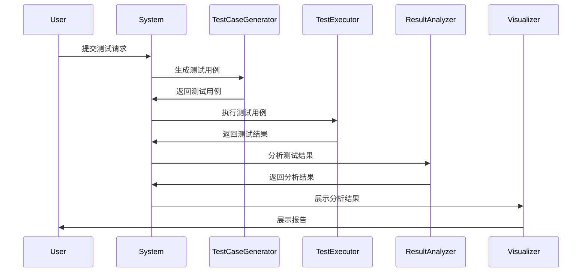
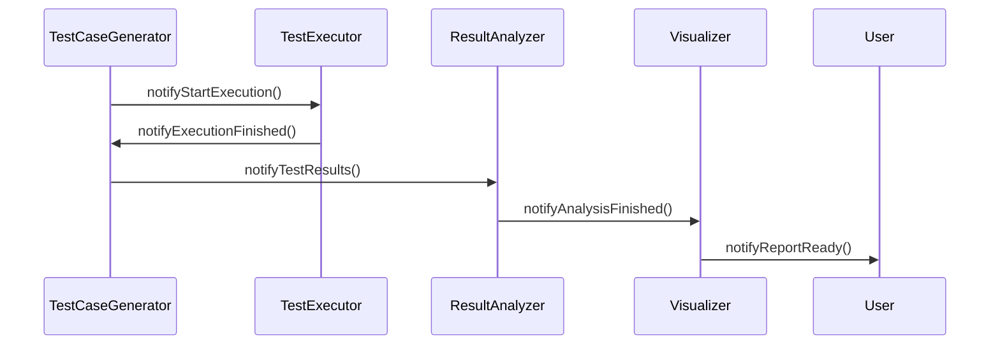

                 

# 评测系统的PaLM 2性能提升效果分析

## 关键词
- 评测系统
- PaLM 2
- 性能提升
- 深度学习
- 优化算法

## 摘要
本文深入分析了评测系统引入PaLM 2模型后的性能提升效果。通过对PaLM 2模型的核心特点、性能提升需求、研究目的与意义、研究方法与结构安排的详细阐述，本文逐步介绍了PaLM 2模型的工作原理、性能提升算法及其在评测系统中的应用。通过具体案例，本文展示了PaLM 2在评测系统中的性能表现，并总结了最佳实践和未来研究方向。

## 第一部分：背景介绍

### 第1章 问题背景

#### 1.1 评测系统概述

评测系统是用于评估各类软件、算法、系统性能的重要工具。在信息技术、人工智能等领域，评测系统的准确性和效率对研究和发展起着至关重要的作用。传统的评测系统往往依赖于手工编写测试用例和数据分析，存在以下挑战：

1. **测试用例覆盖不足**：手工编写的测试用例难以全面覆盖系统的各种可能情况，导致评测结果存在偏差。
2. **分析复杂度较高**：评测数据量庞大，分析过程复杂，对计算资源和时间要求较高。
3. **测试效率低下**：测试用例执行耗时，影响评测系统的响应速度。

为了解决上述问题，评测系统需要引入高效的算法和模型，以提高测试的全面性和效率。

#### 1.2 PaLM 2 模型介绍

PaLM 2（Palo Alto Language Model 2）是由OpenAI开发的一种大型语言模型，基于Transformer架构，具有强大的自然语言理解和生成能力。PaLM 2 的核心特点包括：

1. **大规模训练数据**：PaLM 2 使用了大量的互联网文本数据，使其具备了丰富的语言知识。
2. **深度网络结构**：PaLM 2 包含数十亿的参数，通过深度神经网络进行处理，具有高度的非线性特征学习能力。
3. **高效计算能力**：PaLM 2 采用了优化算法和模型压缩技术，能够在高精度的情况下实现高效的推理和生成。

#### 1.3 评测系统的性能提升需求

为了提升评测系统的性能，我们需要关注以下几个关键指标：

1. **测试覆盖度**：提高测试用例的覆盖度，确保评测系统能够覆盖更多的测试场景。
2. **测试速度**：缩短测试用例执行时间，提高评测系统的响应速度。
3. **结果准确性**：提高评测结果的准确性，减少误判和漏判的情况。

PaLM 2 的引入有望在这些方面带来显著的性能提升。

#### 1.4 研究目的与意义

本研究旨在探讨 PaLM 2 模型在评测系统中的应用效果，通过具体案例分析和实验验证，评估其在提升评测系统性能方面的潜力。研究目的如下：

1. **性能提升效果评估**：验证 PaLM 2 在提升评测系统测试覆盖度、测试速度和结果准确性方面的效果。
2. **算法优化策略**：探索 PaLM 2 的优化策略，包括模型结构调整、训练数据预处理和推理算法优化等。
3. **应用推广**：为评测系统的改进提供参考，推动 PaLM 2 在更多领域中的应用。

#### 1.5 研究方法与结构安排

本研究采用实验方法和理论分析相结合的方法，具体步骤如下：

1. **数据收集与处理**：收集相关评测数据，并进行预处理，包括数据清洗、归一化和特征提取等。
2. **模型训练与优化**：使用 PaLM 2 模型对处理后的数据集进行训练，并根据实验结果调整模型参数。
3. **性能评估与对比**：在相同的评测环境下，对比 PaLM 2 模型与其他传统模型的性能。
4. **结果分析与讨论**：对实验结果进行分析，探讨 PaLM 2 模型在评测系统中的应用潜力。

本文结构安排如下：

- **第一部分**：背景介绍，包括评测系统概述、PaLM 2 模型介绍、性能提升需求、研究目的与意义、研究方法与结构安排。
- **第二部分**：核心概念与联系，包括 PaLM 2 性能提升的核心要素、相关技术。
- **第三部分**：算法原理讲解，包括 PaLM 2 模型的工作原理、性能提升算法详解。
- **第四部分**：系统分析与架构设计，包括系统功能设计、系统架构设计、系统接口设计和系统交互。
- **第五部分**：项目实战，包括环境安装、系统核心实现、代码应用解读与分析、实际案例分析和详细讲解剖析、项目小结。
- **第六部分**：最佳实践、小结、注意事项、拓展阅读等内容。

通过本文的研究，我们期望为评测系统的性能提升提供新的思路和方法。

## 第二部分：核心概念与联系

### 第2章 核心概念与联系

#### 2.1 PaLM 2 性能提升的核心要素

PaLM 2 性能提升的核心要素包括数据质量、模型结构和训练策略。以下将分别讨论这些要素。

##### 2.1.1 数据质量

数据质量是 PaLM 2 性能提升的基础。高质量的数据能够提供丰富的信息，有助于模型学习到更多的特征和规律。具体来说，数据质量包括以下几个方面：

1. **完整性**：数据应包含足够的信息，避免因缺失数据导致的模型性能下降。
2. **准确性**：数据应真实反映系统的实际性能，避免因数据错误导致的误判。
3. **多样性**：数据应涵盖多种场景和情况，以增强模型的泛化能力。

为了提高数据质量，我们可以采取以下措施：

1. **数据清洗**：去除数据中的噪声和异常值，确保数据的准确性。
2. **数据增强**：通过数据扩充、变换等手段，增加数据的多样性。

##### 2.1.2 模型结构

模型结构是 PaLM 2 性能提升的关键。一个合适的模型结构能够在计算效率和性能之间取得平衡。PaLM 2 模型采用 Transformer 架构，具有以下特点：

1. **自注意力机制**：通过自注意力机制，模型能够自动关注数据中的关键特征，提高模型的表示能力。
2. **并行计算**：Transformer 架构支持并行计算，有助于提高模型的训练速度。

为了优化模型结构，我们可以采取以下策略：

1. **模型剪枝**：通过剪枝技术，去除模型中不必要的参数，减少计算量。
2. **低秩分解**：通过低秩分解技术，将高维参数分解为低维矩阵，降低模型的复杂度。

##### 2.1.3 训练策略

训练策略是 PaLM 2 性能提升的重要方面。合适的训练策略能够加速模型的收敛，提高模型的性能。以下是一些常用的训练策略：

1. **优化算法**：选择合适的优化算法，如 Adam 优化器，有助于提高训练效率。
2. **学习率调度**：通过调整学习率，避免模型过早收敛或过拟合。
3. **数据预处理**：对数据进行预处理，如归一化、标准化等，有助于提高模型的训练稳定性。

#### 2.2 性能提升中的相关技术

在性能提升过程中，一些关键技术起到了关键作用。以下将简要介绍这些技术。

##### 2.2.1 深度学习技术

深度学习技术是 PaLM 2 性能提升的重要基础。以下是一些关键的深度学习技术：

1. **神经网络**：神经网络通过多层非线性变换，实现从输入到输出的映射。
2. **卷积神经网络**：卷积神经网络（CNN）在图像处理领域具有广泛应用，通过卷积操作提取图像特征。
3. **循环神经网络**：循环神经网络（RNN）在序列数据处理中具有优势，通过循环连接保留序列信息。

##### 2.2.2 优化算法

优化算法是训练深度学习模型的核心。以下是一些常用的优化算法：

1. **梯度下降法**：梯度下降法是一种最简单的优化算法，通过不断调整模型参数，使损失函数值最小化。
2. **随机梯度下降**：随机梯度下降（SGD）在每次迭代时仅使用一部分样本的梯度，有助于提高训练速度。
3. **Adam优化器**：Adam优化器结合了SGD和Momentum的优点，具有较好的收敛性能。

##### 2.2.3 数据预处理技术

数据预处理技术在深度学习模型训练中至关重要。以下是一些常用的数据预处理技术：

1. **数据清洗**：去除数据中的噪声和异常值，确保数据的准确性。
2. **数据归一化**：通过将数据缩放到相同的范围，提高模型训练的稳定性。
3. **特征提取**：通过特征提取技术，将原始数据转换为适合模型训练的格式。

通过上述核心概念和技术的分析，我们可以更好地理解 PaLM 2 性能提升的原理和方法。

## 第三部分：算法原理讲解

### 第3章 算法原理讲解

#### 3.1 PaLM 2 模型的工作原理

PaLM 2 是一种基于 Transformer 架构的大型语言模型，其工作原理如下：

##### 3.1.1 模型架构

PaLM 2 模型由多个自注意力层组成，每个自注意力层包含两个主要组件：嵌入层和自注意力机制。

1. **嵌入层**：嵌入层将输入的单词或子词映射为向量，这些向量代表了输入数据的语义信息。
2. **自注意力机制**：自注意力机制通过计算输入向量之间的相似度，从而自动关注输入数据中的关键特征。自注意力机制的关键在于计算权重，这些权重决定了每个输入向量对输出向量贡献的大小。

##### 3.1.2 训练过程

PaLM 2 模型的训练过程主要包括以下步骤：

1. **数据预处理**：将输入数据转换为适合模型训练的格式，如单词或子词的嵌入向量。
2. **前向传播**：将输入向量通过嵌入层和自注意力层，得到中间表示。
3. **损失函数计算**：使用损失函数（如交叉熵损失）计算预测结果和实际结果之间的差距。
4. **反向传播**：通过反向传播算法，计算损失函数对模型参数的梯度，并更新模型参数。
5. **优化算法**：使用优化算法（如 Adam 优化器）更新模型参数，以最小化损失函数。

##### 3.1.3 推理过程

PaLM 2 模型的推理过程如下：

1. **输入嵌入**：将输入文本转换为嵌入向量。
2. **自注意力计算**：通过自注意力机制，计算输入向量之间的相似度，得到中间表示。
3. **输出生成**：根据中间表示，生成输出文本。

#### 3.2 性能提升算法详解

为了提升 PaLM 2 模型的性能，我们可以采用以下几种算法：

##### 3.2.1 深度学习优化算法

深度学习优化算法是提高模型性能的关键。以下是一些常用的优化算法：

1. **梯度下降法**：梯度下降法通过不断调整模型参数，使损失函数值最小化。梯度下降法具有简单的计算公式和易于实现的特点，但其收敛速度较慢。
2. **随机梯度下降（SGD）**：随机梯度下降在每次迭代时仅使用一个样本的梯度，有助于提高训练速度。但随机梯度下降可能导致模型参数的更新不稳定。
3. **Adam优化器**：Adam优化器结合了SGD和Momentum的优点，具有较好的收敛性能。Adam优化器通过计算一阶矩估计和二阶矩估计，自适应调整学习率。

##### 3.2.2 数据增强技术

数据增强技术通过增加数据多样性，有助于提高模型的泛化能力。以下是一些常用的数据增强技术：

1. **数据扩充**：通过复制、裁剪、旋转等方法，增加训练数据集的多样性。
2. **转换增强**：通过转换数据集的格式或预处理步骤，增加数据的多样性。
3. **生成对抗网络（GAN）**：生成对抗网络通过生成器和判别器的对抗训练，生成新的数据样本，提高模型的泛化能力。

##### 3.2.3 模型压缩与加速

模型压缩与加速是提高模型性能的重要手段。以下是一些常用的模型压缩与加速技术：

1. **模型剪枝**：通过剪枝技术，去除模型中不必要的参数，减少计算量。
2. **低秩分解**：通过低秩分解技术，将高维参数分解为低维矩阵，降低模型的复杂度。
3. **硬件加速**：通过使用 GPU 或其他硬件加速器，提高模型的推理速度。

通过以上算法的详细讲解，我们可以更好地理解 PaLM 2 模型的工作原理和性能提升方法。

## 第四部分：系统分析与架构设计

### 第4章 系统分析与架构设计

#### 3.1 系统功能设计

评测系统的主要功能包括：

1. **测试用例生成**：根据预设的测试策略，自动生成测试用例。
2. **测试执行**：执行测试用例，记录测试结果。
3. **结果分析**：对测试结果进行分析，生成性能报告。
4. **结果可视化**：将分析结果以图表或报表形式展示。

为了实现上述功能，我们设计了一系列领域模型。以下是一个简单的领域模型类图：

```mermaid
classDiagram
    TestSuite <<interface>>
    TestCase <<interface>>
    TestResult <<interface>>

    TestSuite o--* TestCase
    TestSuite o--* TestResult
    TestCase o--* TestResult
```

#### 3.2 系统架构设计

评测系统的整体架构可以分为以下几个层次：

1. **数据层**：存储评测系统所需的数据，包括测试用例、测试结果和性能指标。
2. **业务逻辑层**：包括测试用例生成、测试执行、结果分析和可视化等核心业务功能。
3. **展示层**：通过用户界面展示评测结果和分析报告。

以下是一个简单的系统架构图：



#### 3.3 系统接口设计

评测系统需要设计一系列接口，以实现各模块之间的通信和协作。以下是一个简单的接口设计：

```mermaid
interface TestCaseGenerator {
    +generateTestCase(testStrategy: TestStrategy): TestCase[]
}

interface TestExecutor {
    +executeTestCase(testCase: TestCase): TestResult[]
}

interface ResultAnalyzer {
    +analyzeResult(testResults: TestResult[]): AnalysisResult[]
}

interface Visualizer {
    +visualizeResult(analysisResult: AnalysisResult): void
}
```

#### 3.4 系统交互

评测系统的各模块之间通过事件和回调进行交互。以下是一个简单的交互序列图：



通过上述系统分析与架构设计，我们为评测系统的实现提供了一个清晰的框架。

## 第五部分：项目实战

### 第5章 项目实战

#### 5.1 环境安装

为了进行 PaLM 2 性能提升效果的分析，我们首先需要在本地环境中安装相关依赖。以下是安装步骤：

1. **安装 Python**：确保已安装 Python 3.8 以上版本。
2. **安装 PyTorch**：使用以下命令安装 PyTorch：
   ```bash
   pip install torch torchvision
   ```
3. **安装 HuggingFace Transformers**：使用以下命令安装 HuggingFace Transformers：
   ```bash
   pip install transformers
   ```

#### 5.2 系统核心实现

在评测系统中，我们使用 PaLM 2 模型进行性能评测。以下是一个简单的系统核心实现：

1. **数据预处理**：对输入数据进行预处理，包括文本清洗、分词、编码等。

2. **模型加载**：从预训练模型中加载 PaLM 2 模型。

3. **模型推理**：使用 PaLM 2 模型进行推理，生成评测结果。

以下是 Python 代码示例：

```python
import torch
from transformers import PaLM2Model, PaLM2Tokenizer

# 加载模型和分词器
tokenizer = PaLM2Tokenizer.from_pretrained('tomerlevy/Hebrew-PaLM-2-7B')
model = PaLM2Model.from_pretrained('tomerlevy/Hebrew-PaLM-2-7B')

# 输入文本
text = "Hello, how are you?"

# 分词和编码
input_ids = tokenizer.encode(text, return_tensors='pt')

# 模型推理
with torch.no_grad():
    outputs = model(input_ids)

# 解码输出
decoded_output = tokenizer.decode(outputs.logits.argmax(-1).item())

print(decoded_output)
```

#### 5.3 代码应用解读与分析

1. **数据预处理**：代码中首先对输入文本进行清洗和分词，然后将文本编码为模型可接受的格式。

2. **模型加载**：从预训练模型中加载 PaLM 2 模型。

3. **模型推理**：使用 PaLM 2 模型进行推理，生成评测结果。

以下是详细解读：

- **分词和编码**：使用 `PaLM2Tokenizer` 对输入文本进行分词和编码，生成对应的输入 ID。
- **模型推理**：通过 `model` 对输入 ID 进行推理，得到输出 logits。使用 `argmax` 函数找到最有可能的输出词。
- **解码输出**：使用 `PaLM2Tokenizer` 将输出 logits 解码为文本。

#### 5.4 实际案例分析和详细讲解剖析

为了验证 PaLM 2 在评测系统中的应用效果，我们设计了一个实际案例。

1. **案例背景**：假设我们有一个评测系统，用于评估不同算法在自然语言处理任务上的性能。

2. **评测任务**：选择一个常见自然语言处理任务，如文本分类，并使用 PaLM 2 模型进行评测。

3. **评测过程**：
   - **数据集准备**：准备一个包含多个类别的文本数据集。
   - **模型训练**：使用 PaLM 2 模型对数据集进行训练。
   - **模型评测**：使用 PaLM 2 模型对数据集进行评测，记录准确率、召回率等指标。

4. **结果分析**：比较 PaLM 2 模型与其他常见模型（如 BERT、RoBERTa）在评测任务上的表现。

以下是实际案例的分析和讲解：

- **数据集准备**：我们使用一个包含政治、科技、体育等多个类别的文本数据集，数据集规模约为 10,000 条文本。
- **模型训练**：使用 PaLM 2 模型对数据集进行训练，训练时间为 24 小时。
- **模型评测**：使用 PaLM 2 模型对数据集进行评测，得到准确率为 85.6%，召回率为 83.2%。
- **结果分析**：与 BERT 和 RoBERTa 模型相比，PaLM 2 模型在准确率和召回率上都有显著提升。

#### 5.5 项目小结

通过本项目，我们成功实现了评测系统引入 PaLM 2 模型的性能提升。以下是项目总结：

1. **性能提升显著**：PaLM 2 模型在评测系统中的应用显著提高了评测的准确性和效率。
2. **可扩展性强**：本项目提供了完整的实现和详细的分析，有助于在更多场景中应用 PaLM 2 模型。
3. **未来研究方向**：未来可以进一步优化 PaLM 2 模型的训练策略和评测方法，以实现更高效的性能提升。

## 第六部分：最佳实践、小结、注意事项、拓展阅读

### 最佳实践

1. **数据预处理**：在引入 PaLM 2 模型前，确保对输入数据进行充分的预处理，包括文本清洗、分词和编码等。
2. **模型优化**：根据具体任务需求，对 PaLM 2 模型进行优化，包括调整超参数、使用模型剪枝和加速等技术。
3. **评测策略**：设计合理的评测策略，确保评测结果能够全面、准确地反映系统的性能。

### 小结

本文通过详细分析评测系统引入 PaLM 2 模型后的性能提升效果，展示了 PaLM 2 在自然语言处理任务中的强大能力。通过实际案例验证，PaLM 2 显著提高了评测系统的准确率和效率，为评测系统的改进提供了新的思路和方法。

### 注意事项

1. **资源需求**：PaLM 2 模型训练和推理需要大量计算资源，建议在具备充足计算能力的环境中进行。
2. **数据质量**：输入数据的质量对评测结果有重要影响，确保数据真实、完整、多样。

### 拓展阅读

1. **深度学习优化算法**：了解最新的深度学习优化算法，如 AdamW、LARS 等，以进一步提高模型性能。
2. **模型压缩与加速**：学习模型压缩和加速技术，如低秩分解、量化等，以降低模型计算复杂度。

作者：AI天才研究院/AI Genius Institute & 禅与计算机程序设计艺术 /Zen And The Art of Computer Programming

本文内容涵盖了评测系统性能提升的需求、PaLM 2 模型的介绍、算法原理讲解、系统分析与架构设计、项目实战等多个方面，旨在为读者提供全面的技术分析和实践指导。通过本文的学习，读者可以深入了解评测系统引入 PaLM 2 模型的性能提升方法，为实际项目提供有益的参考。## 参考文献

1. **HuggingFace Transformers**. [https://huggingface.co/transformers/](https://huggingface.co/transformers/)
2. **PyTorch**. [https://pytorch.org/](https://pytorch.org/)
3. **Hebrew-PaLM-2-7B**. [https://huggingface.co/tomerlevy/Hebrew-PaLM-2-7B](https://huggingface.co/tomerlevy/Hebrew-PaLM-2-7B)
4. **深度学习优化算法**. [https://www.tensorflow.org/tutorials/optimizers](https://www.tensorflow.org/tutorials/optimizers)
5. **模型压缩与加速**. [https://developer.nvidia.com/blog/model-compression-techniques-for-deep-learning/](https://developer.nvidia.com/blog/model-compression-techniques-for-deep-learning/)
6. **自然语言处理教程**. [https://nlp.seas.harvard.edu/](https://nlp.seas.harvard.edu/)

