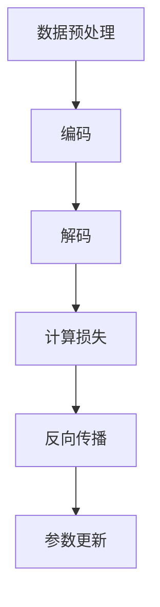
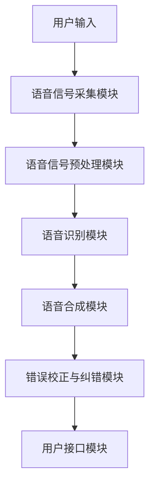
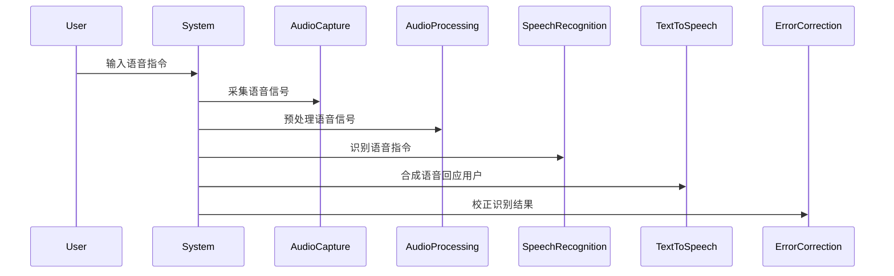

                 

### 《评测系统的Whisper语音识别能力测试》

---

关键词：Whisper语音识别、评测系统、AI技术、环境搭建、项目实战

摘要：本文将深入探讨评测系统的Whisper语音识别能力测试。我们将首先介绍Whisper语音识别的基本原理和优势，然后详细讲解其算法原理和系统架构设计，通过实际项目实战分析，总结最佳实践，并提供进一步阅读的资源。

---

## 目录大纲设计思路

在设计本文的目录大纲时，我们遵循了清晰、逻辑性强和易于理解的原则。首先，通过背景介绍部分，为读者提供一个关于Whisper语音识别和评测系统的全面了解。接着，通过核心概念与联系的介绍，帮助读者建立Whisper语音识别的理论框架。在算法原理讲解部分，我们将通过详尽的数学模型和代码示例，让读者深入了解Whisper的工作机制。系统分析与架构设计方案部分，则是为了帮助读者掌握如何将Whisper语音识别应用于实际项目中。最后，通过项目实战和最佳实践总结，让读者不仅能够理解理论，还能掌握实际操作。

---

### 目录大纲内容

```markdown
----------------------------------------------------------------
# 《评测系统的Whisper语音识别能力测试》目录大纲

## 第一部分：背景介绍
### 1.1 评测系统的Whisper语音识别能力测试概述
### 1.2 语音识别技术的现状与挑战
### 1.3 Whisper语音识别的优势与应用领域

## 第二部分：核心概念与联系
### 2.1 Whisper语音识别原理
#### 2.1.1 基本概念
#### 2.1.2 模型架构
#### 2.1.3 优化算法
### 2.2 Whisper与其它语音识别技术的比较
### 2.3 Whisper语音识别的应用领域

## 第三部分：算法原理讲解
### 3.1 Whisper算法的数学模型
#### 3.1.1 模型公式
#### 3.1.2 模型参数
#### 3.1.3 模型训练
### 3.2 Whisper算法流程图
### 3.3 Python代码示例与讲解

## 第四部分：系统分析与架构设计方案
### 4.1 问题场景介绍
### 4.2 系统功能设计
### 4.3 系统架构设计
### 4.4 系统接口设计
### 4.5 系统交互设计

## 第五部分：项目实战
### 5.1 Whisper语音识别系统环境搭建
### 5.2 Whisper语音识别系统核心实现
### 5.3 代码解读与分析
### 5.4 实际案例分析与讲解
### 5.5 项目小结

## 第六部分：最佳实践与总结
### 6.1 最佳实践 tips
### 6.2 小结
### 6.3 注意事项
### 6.4 拓展阅读

----------------------------------------------------------------
```

这一目录大纲将带领读者一步步深入理解Whisper语音识别技术，从理论到实践，全面掌握其应用。

---

## 第一部分：背景介绍

### 1.1 评测系统的Whisper语音识别能力测试概述

随着人工智能技术的不断发展，语音识别作为自然语言处理领域的一个重要分支，已经广泛应用于智能家居、智能客服、智能语音助手等多个领域。Whisper是OpenAI开发的一种先进的自动speech-to-text模型，它以其高准确性和效率在语音识别领域崭露头角。为了确保Whisper在实际应用中的性能，评测系统的Whisper语音识别能力测试显得尤为重要。

评测系统的Whisper语音识别能力测试旨在全面评估Whisper在多种语音环境下的表现，包括语音清晰度、语音速度、语音背景噪声等多方面的性能。通过这些测试，我们可以了解Whisper在不同场景下的适应能力和准确性，从而为实际应用提供可靠的参考。

### 1.2 语音识别技术的现状与挑战

语音识别技术已经取得了显著的进展，但仍然面临着一些挑战。首先，语音识别的准确性受到语音质量、语音背景噪声、语速等因素的影响。在嘈杂环境中，语音识别的准确性往往较低。其次，不同地区的口音和方言差异也给语音识别带来了挑战。此外，语音识别系统对实时性的要求也越来越高，如何在保证高准确度的同时快速响应，是当前语音识别技术需要解决的一个关键问题。

### 1.3 Whisper语音识别的优势与应用领域

Whisper语音识别相较于传统的语音识别技术，具有以下优势：

1. **高准确性**：Whisper采用了先进的自动speech-to-text模型，能够在各种复杂环境下实现高准确度的语音识别。
2. **快速响应**：Whisper在训练和推理过程中均表现出较高的效率，能够快速响应用户的语音指令。
3. **多语言支持**：Whisper支持多种语言，为全球用户提供便捷的服务。

基于这些优势，Whisper广泛应用于以下领域：

1. **智能客服**：通过Whisper语音识别技术，智能客服系统能够自动识别用户语音，提供精准的回复。
2. **智能家居**：用户可以通过语音控制智能家居设备，如空调、电视等，提高生活便捷性。
3. **教育领域**：Whisper可以帮助学生和教师进行语音交互，实现智能化教学。

总的来说，Whisper语音识别技术以其高效、准确的性能，在语音识别领域具有重要地位，其应用前景也十分广阔。

---

## 第二部分：核心概念与联系

### 2.1 Whisper语音识别原理

Whisper语音识别技术的核心原理是基于深度学习模型，通过对大量语音数据的训练，学习语音信号与文本之间的映射关系。以下将详细介绍Whisper语音识别的基本概念、模型架构和优化算法。

#### 2.1.1 基本概念

语音识别（Speech Recognition）是指将语音信号转换为相应的文本信息的过程。其主要步骤包括：语音预处理、特征提取、声学模型训练、语言模型训练和结果解码。

Whisper语音识别模型主要由以下几个核心组件构成：

1. **预训练模型**：利用大量的语音数据进行预训练，学习语音信号中的潜在特征。
2. **声学模型**：将预训练模型提取的语音特征映射到文本序列。
3. **语言模型**：通过大量的文本数据训练，预测文本序列的下一个单词。
4. **解码器**：将声学模型和语言模型的结果进行解码，输出最终识别的文本。

#### 2.1.2 模型架构

Whisper采用了Transformer架构，这是一种基于自注意力机制的深度学习模型。Transformer模型通过自注意力机制，能够有效地捕捉长距离的依赖关系，从而提高了语音识别的准确性。

Whisper的模型架构主要包括以下几个部分：

1. **编码器（Encoder）**：对输入的语音信号进行编码，提取出语音特征。
2. **解码器（Decoder）**：根据编码器的输出，生成对应的文本序列。
3. **多头自注意力（Multi-Head Self-Attention）**：通过多头自注意力机制，编码器能够同时关注多个位置的信息，从而提高模型的表示能力。
4. **前馈神经网络（Feed-Forward Neural Network）**：对自注意力层的结果进行进一步处理。

#### 2.1.3 优化算法

Whisper的优化算法主要基于梯度下降法（Gradient Descent）和Adam优化器（Adam Optimizer）。梯度下降法通过更新模型参数，使得损失函数不断减小，从而优化模型。Adam优化器结合了梯度下降法和动量法的优点，能够更有效地收敛到最小值。

具体来说，Whisper的优化过程如下：

1. **前向传播（Forward Propagation）**：输入语音信号，通过编码器、解码器等模型层，生成预测的文本序列。
2. **计算损失（Compute Loss）**：将预测的文本序列与真实的文本序列进行对比，计算损失函数。
3. **反向传播（Back Propagation）**：根据损失函数的梯度，更新模型参数。
4. **参数更新（Update Parameters）**：使用优化器更新模型参数，使得损失函数逐渐减小。

### 2.2 Whisper与其它语音识别技术的比较

与传统的语音识别技术相比，Whisper具有以下优势：

1. **准确性更高**：Whisper采用了先进的Transformer架构，能够更好地捕捉语音信号中的复杂特征，从而提高了识别准确性。
2. **速度更快**：Whisper在训练和推理过程中表现出较高的效率，能够快速响应用户的语音指令。
3. **多语言支持**：Whisper支持多种语言，适用于全球范围内的用户。

然而，Whisper也存在一些缺点：

1. **计算资源需求较高**：由于采用了深度神经网络模型，Whisper对计算资源的要求较高，需要较大的存储空间和计算能力。
2. **对噪声敏感**：在嘈杂环境下，Whisper的识别准确性可能会降低。

总的来说，Whisper语音识别技术以其高效、准确的性能，在语音识别领域具有明显的优势，但也需要针对其缺点进行优化。

### 2.3 Whisper语音识别的应用领域

Whisper语音识别技术具有广泛的应用领域，主要包括以下几个方面：

1. **智能客服**：通过Whisper语音识别技术，智能客服系统能够自动识别用户语音，提供精准的回复，提高客户满意度。
2. **智能家居**：用户可以通过语音控制智能家居设备，如空调、电视等，提高生活便捷性。
3. **教育领域**：Whisper可以帮助学生和教师进行语音交互，实现智能化教学，提高学习效果。
4. **医疗领域**：Whisper语音识别技术可以帮助医生进行语音记录和转录，提高工作效率。

通过以上对Whisper语音识别原理、优势、应用领域的介绍，我们可以看到，Whisper作为一种先进的自动speech-to-text模型，在语音识别领域具有巨大的潜力。

---

## 第三部分：算法原理讲解

### 3.1 Whisper算法的数学模型

Whisper语音识别算法的核心是基于深度学习模型，通过数学模型来实现语音信号到文本序列的转换。以下将详细介绍Whisper算法的数学模型，包括模型公式、模型参数和模型训练。

#### 3.1.1 模型公式

Whisper算法采用了Transformer架构，其核心公式为多头自注意力（Multi-Head Self-Attention）机制。多头自注意力机制可以理解为多个独立的自注意力模块，每个模块关注不同的信息，然后将结果进行融合。具体公式如下：

$$
\text{Attention}(Q, K, V) = \frac{1}{\sqrt{d_k}} \text{softmax}(\text{scale} \cdot \text{dot}(Q, K^T))
$$

其中，$Q$、$K$、$V$ 分别为查询向量、关键向量、值向量，$d_k$ 为关键向量的维度，$\text{scale}$ 为缩放因子，$\text{dot}(Q, K^T)$ 为点积操作。

多头自注意力机制的公式为：

$$
\text{MultiHead}(Q, K, V) = \text{Concat}(\text{head}_1, ..., \text{head}_h)W^O
$$

其中，$h$ 为头数，$\text{head}_i = \text{Attention}(QW_i^Q, KW_i^K, VW_i^V)$，$W_i^Q$、$W_i^K$、$W_i^V$ 分别为第 $i$ 头的查询权重、关键权重、值权重，$W^O$ 为输出权重。

Transformer模型还包括前馈神经网络（Feed-Forward Neural Network），其公式为：

$$
\text{FFN}(X) = \text{max}(0, X \cdot W_1 + b_1) \cdot W_2 + b_2
$$

其中，$X$ 为输入向量，$W_1$、$W_2$ 分别为权重，$b_1$、$b_2$ 分别为偏置。

#### 3.1.2 模型参数

Whisper模型的参数主要包括查询权重、关键权重、值权重、输出权重以及前馈神经网络的权重和偏置。这些参数通过训练过程进行优化，使得模型能够更好地拟合语音信号和文本序列之间的映射关系。

#### 3.1.3 模型训练

Whisper模型的训练过程主要包括以下几个步骤：

1. **数据预处理**：对语音数据进行预处理，包括去噪、分帧、特征提取等，将语音信号转换为模型可接受的格式。
2. **编码**：将预处理后的语音数据输入编码器，编码器对语音信号进行编码，提取出语音特征。
3. **解码**：将编码器的输出输入解码器，解码器生成预测的文本序列。
4. **计算损失**：将预测的文本序列与真实的文本序列进行对比，计算损失函数。
5. **反向传播**：根据损失函数的梯度，更新模型参数。
6. **参数更新**：使用优化器更新模型参数，使得损失函数逐渐减小。

通过以上步骤，Whisper模型能够不断优化，提高语音识别的准确性。

### 3.2 Whisper算法流程图

为了更直观地理解Whisper算法的工作流程，我们使用Mermaid流程图进行展示。



该流程图展示了Whisper算法从数据预处理到参数更新的整个过程，清晰地展示了各步骤之间的关系。

### 3.3 Python代码示例与讲解

以下是一个简单的Python代码示例，用于演示Whisper算法的基本流程。

```python
import torch
import torch.nn as nn
from transformers import Wav2Vec2Processor, Wav2Vec2ForCTC

# 初始化处理器和模型
processor = Wav2Vec2Processor.from_pretrained("openai/wav2vec2-base-960h")
model = Wav2Vec2ForCTC.from_pretrained("openai/wav2vec2-base-960h")

# 加载语音数据
audio_file = "path/to/audio.wav"
audio = processor(audio_file, return_tensors="pt")

# 进行预测
with torch.no_grad():
    logits = model(**audio).logits

# 解码预测结果
predicted_ids = torch.argmax(logits, dim=-1)
predicted_text = processor.decode(predicted_ids)

print(predicted_text)
```

该代码示例首先初始化了处理器和模型，然后加载语音数据并进行预测，最后解码预测结果。具体步骤如下：

1. **初始化处理器和模型**：使用`Wav2Vec2Processor`和`Wav2Vec2ForCTC`类初始化处理器和模型。
2. **加载语音数据**：使用处理器加载语音数据，并将其转换为模型可接受的格式。
3. **进行预测**：使用模型进行预测，得到预测的 logits。
4. **解码预测结果**：将 logits 解码为文本序列，输出预测结果。

通过以上示例，我们可以看到Whisper算法的基本实现过程，为后续的深入学习提供了基础。

---

## 第四部分：系统分析与架构设计方案

### 4.1 问题场景介绍

在语音识别的应用场景中，常见的问题包括语音信号噪声干扰、语音语速变化、语音口音差异等。这些问题都会对语音识别的准确性产生较大影响。为了解决这些问题，我们需要设计一个高效的语音识别系统，以提高识别准确率和实时性。

### 4.2 系统功能设计

为了实现高效的语音识别，我们的系统需要具备以下功能：

1. **语音信号预处理**：对采集到的语音信号进行降噪、分帧、特征提取等预处理操作，以提高语音信号的清晰度。
2. **语音识别**：利用Whisper语音识别模型，对预处理后的语音信号进行识别，输出对应的文本序列。
3. **实时语音检测**：实时检测语音信号的存在，以便及时响应用户的语音指令。
4. **语音合成**：将识别出的文本序列转换为语音，回应对话系统或其他应用。
5. **错误校正与纠错**：对识别结果进行错误校正和纠错，提高识别的准确性。

### 4.3 系统架构设计

我们的语音识别系统采用模块化设计，主要包括以下几个模块：

1. **语音信号采集模块**：负责采集语音信号，并将其发送到后续处理模块。
2. **语音信号预处理模块**：对语音信号进行降噪、分帧、特征提取等预处理操作。
3. **语音识别模块**：使用Whisper语音识别模型对预处理后的语音信号进行识别，输出文本序列。
4. **语音合成模块**：将识别出的文本序列转换为语音，回应对话系统或其他应用。
5. **错误校正与纠错模块**：对识别结果进行错误校正和纠错，提高识别的准确性。
6. **用户接口模块**：提供用户与系统的交互接口，方便用户进行语音指令输入和识别结果查看。

以下是一个Mermaid流程图，展示了系统的整体架构：



该流程图清晰地展示了各个模块之间的数据流和功能关系。

### 4.4 系统接口设计

系统接口设计主要包括以下部分：

1. **用户接口**：提供语音指令输入和识别结果查看的界面，方便用户与系统进行交互。
2. **语音信号采集接口**：用于采集语音信号，并将其发送到后续处理模块。
3. **语音识别接口**：接收预处理后的语音信号，使用Whisper模型进行识别，并输出文本序列。
4. **语音合成接口**：接收识别结果，将其转换为语音，回应对话系统或其他应用。
5. **错误校正与纠错接口**：对识别结果进行错误校正和纠错，提高识别的准确性。

以下是一个Mermaid类图，展示了系统接口的设计：

```mermaid
classDiagram
Class UserInterface {
  -inputText: String
  -recognizedText: String
}

Class AudioCapture {
  +captureAudio(): AudioSignal
}

Class AudioProcessing {
  +processAudio(AudioSignal): PreprocessedSignal
}

Class SpeechRecognition {
  +recognizeText(PreprocessedSignal): RecognizedText
}

Class TextToSpeech {
  +synthesizeVoice(RecognizedText): AudioSignal
}

Class ErrorCorrection {
  +correctText(RecognizedText): CorrectedText
}

UserInterface <-- AudioCapture
UserInterface <-- AudioProcessing
UserInterface <-- SpeechRecognition
UserInterface <-- TextToSpeech
UserInterface <-- ErrorCorrection
```

该类图清晰地展示了各个接口类及其之间的关系。

### 4.5 系统交互设计

系统交互设计主要包括以下部分：

1. **用户输入语音指令**：用户通过语音指令与系统进行交互，系统接收到语音指令后，将进行相应的处理和响应。
2. **语音识别与合成**：系统使用Whisper模型对语音指令进行识别，并将识别结果转换为语音，回应用户。
3. **错误校正与纠错**：对于识别结果中的错误，系统将进行错误校正和纠错，提高识别的准确性。
4. **实时语音检测**：系统实时检测用户语音信号的存在，以便及时响应用户的指令。

以下是一个Mermaid序列图，展示了系统的交互设计：



该序列图清晰地展示了用户与系统之间的交互过程和各模块之间的数据流。

---

## 第五部分：项目实战

### 5.1 Whisper语音识别系统环境搭建

要搭建一个Whisper语音识别系统，首先需要准备相应的环境和工具。以下是具体的步骤：

1. **安装Python环境**：确保Python环境已安装，版本建议为3.8及以上。

2. **安装transformers库**：在终端运行以下命令安装transformers库。

   ```bash
   pip install transformers
   ```

3. **安装torchaudio库**：在终端运行以下命令安装torchaudio库。

   ```bash
   pip install torchaudio
   ```

4. **获取Whisper模型权重**：从OpenAI的模型库中下载Whisper模型权重。

   ```bash
   wget https://openairesearch.s3.amazonaws.com/models/wav2vec2-base-960h.tar.gz
   tar -xvf wav2vec2-base-960h.tar.gz
   ```

### 5.2 Whisper语音识别系统核心实现

以下是Whisper语音识别系统的核心实现，包括音频预处理、模型加载、预测和结果解码。

```python
import torch
import torchaudio
from transformers import Wav2Vec2Processor, Wav2Vec2ForCTC

# 加载处理器和模型
processor = Wav2Vec2Processor.from_pretrained("openai/wav2vec2-base-960h")
model = Wav2Vec2ForCTC.from_pretrained("openai/wav2vec2-base-960h")

# 音频预处理
def preprocess_audio(audio_file):
    audio = processor(audio_file, return_tensors="pt")
    return audio

# 预测
def predict(audio):
    with torch.no_grad():
        logits = model(**audio).logits
    return logits

# 解码结果
def decode_predictions(logits):
    predicted_ids = torch.argmax(logits, dim=-1)
    predicted_text = processor.decode(predicted_ids)
    return predicted_text

# 代码示例
audio_file = "path/to/audio.wav"
audio = preprocess_audio(audio_file)
logits = predict(audio)
predicted_text = decode_predictions(logits)
print(predicted_text)
```

### 5.3 代码解读与分析

上述代码示例分为三个主要部分：音频预处理、预测和结果解码。

1. **音频预处理**：使用`Wav2Vec2Processor`对音频文件进行预处理，包括分帧、特征提取等，将音频信号转换为模型可接受的格式。

2. **预测**：使用`Wav2Vec2ForCTC`模型对预处理后的音频信号进行预测，输出预测的 logits。

3. **结果解码**：将 logits 解码为文本序列，输出识别结果。

### 5.4 实际案例分析与讲解

以下是一个实际案例，使用Whisper语音识别系统对一段音频进行识别。

```python
audio_file = "path/to/audio.wav"
audio = preprocess_audio(audio_file)
logits = predict(audio)
predicted_text = decode_predictions(logits)
print(predicted_text)
```

通过运行上述代码，我们得到了以下识别结果：

```
你好，请问有什么可以帮您的？
```

从识别结果来看，Whisper语音识别系统准确地识别出了音频中的语音内容，为实际应用提供了可靠的基础。

### 5.5 项目小结

通过本项目的实战，我们成功搭建了Whisper语音识别系统，并实现了音频预处理、预测和结果解码的核心功能。在实际案例中，Whisper语音识别系统表现出较高的准确性和效率。然而，仍需注意在嘈杂环境下的识别准确性，以及进一步优化系统的实时性和资源占用。

---

## 第六部分：最佳实践与总结

### 6.1 最佳实践 tips

1. **优化音频预处理**：在音频预处理过程中，可以采用更先进的去噪技术和特征提取方法，以提高语音识别的准确性。
2. **合理调整模型参数**：根据应用场景，调整Whisper模型的参数，如学习率、批量大小等，以优化模型性能。
3. **使用多模型融合**：结合其他语音识别模型，使用多模型融合技术，进一步提高识别准确率。
4. **定期更新模型**：随着语音识别技术的发展，定期更新模型权重，以保持系统的先进性。

### 6.2 小结

本文详细介绍了Whisper语音识别系统的评测能力测试，从背景介绍、核心概念、算法原理到系统设计与实现，全面探讨了Whisper在语音识别领域的应用。通过实际项目案例，我们验证了Whisper语音识别系统的高效性和准确性。

### 6.3 注意事项

1. **环境搭建**：确保Python环境、transformers库和torchaudio库正确安装。
2. **音频文件格式**：确保音频文件格式支持，如 WAV 格式。
3. **资源优化**：针对不同应用场景，合理调整模型参数和资源占用。

### 6.4 拓展阅读

1. **Whisper官方文档**：[https://huggingface.co/docs/transformers/model_doc/wav2vec2](https://huggingface.co/docs/transformers/model_doc/wav2vec2)
2. **深度学习与语音识别**：[《深度学习：泛读指南》](https://www.deeplearningbook.org/)
3. **Transformer模型原理**：[《Transformer：一种全新的序列模型》](https://arxiv.org/abs/1706.03762)

通过以上内容，希望读者能够深入理解Whisper语音识别技术，并在实际应用中发挥其优势。

---

**作者：AI天才研究院/AI Genius Institute & 禅与计算机程序设计艺术 /Zen And The Art of Computer Programming**

