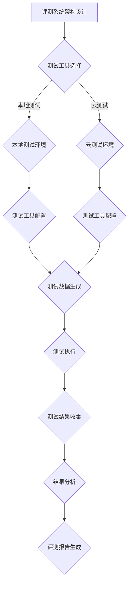
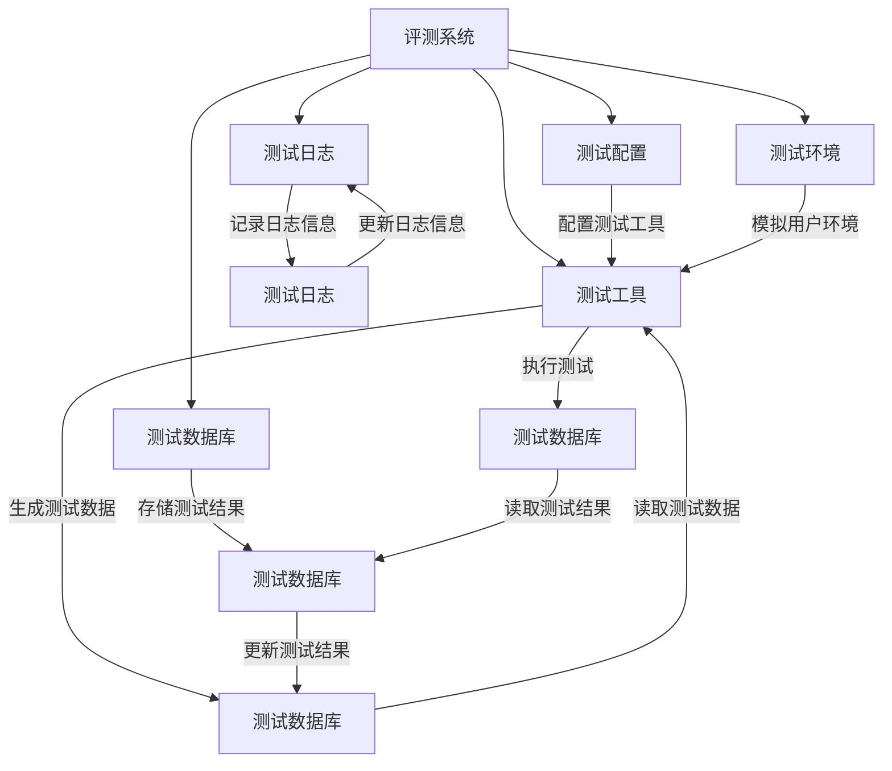

                 

### 目录大纲设计步骤：

#### 1. 分析书名与核心内容

《评测系统的云端部署与管理方案》这一书名清晰地指出了本书的核心内容，即评测系统的部署和管理，特别是云端部署。这表明本书将重点关注以下几个方面：

- 评测系统的基本概念和原理
- 云端部署的优势和挑战
- 云计算的基础知识
- 评测系统的架构设计
- 评测指标与评估方法
- 评测数据的处理
- 云端部署的准备工作
- 部署流程与步骤
- 部署过程中的常见问题与解决方案
- 系统监控与管理
- 性能优化策略
- 安全与隐私保护
- 案例分析

#### 2. 确定目录大纲的结构

基于上述分析，可以将本书分为以下几个主要部分：

- 引言：介绍书籍的概述、目标读者和结构。
- 背景知识：包括评测系统的基本概念、云端部署的优势与挑战、云计算基础知识。
- 核心内容：详细讲解评测系统的架构设计、评测指标与评估方法、评测数据的处理。
- 部署流程：介绍云端部署的准备工作、部署流程与步骤、部署过程中的常见问题与解决方案。
- 管理方法：讨论系统监控与管理、性能优化策略、安全与隐私保护。
- 案例分析：通过具体案例来展示评测系统在云端部署与管理中的实际应用。
- 总结与展望：回顾主要内容、探讨未来发展趋势和对读者的建议。

#### 3. 细化每一部分的内容

在确定了整体结构后，我们需要对每一部分进行细化，确保内容的完整性和逻辑性。例如：

- 引言部分可以进一步细化为书名概述、目标读者、书籍结构等小节。
- 背景知识部分可以细化为评测系统的基本概念、云端部署的优势与挑战、云计算基础知识等小节。
- 核心内容部分可以细化为评测系统的架构设计、评测指标与评估方法、评测数据的处理等小节。
- 部署流程部分可以细化为云端部署的准备工作、部署流程与步骤、部署过程中的常见问题与解决方案等小节。
- 管理方法部分可以细化为系统监控与管理、性能优化策略、安全与隐私保护等小节。
- 案例分析部分可以细化为具体案例的介绍和分析。

#### 4. 编写目录大纲

最后，使用markdown格式编写目录大纲，确保简洁明了，符合markdown的语法规范。以下是编写好的目录大纲：

```markdown
# 《评测系统的云端部署与管理方案》目录大纲

## 第一部分 引言
### 1.1 书籍概述
### 1.2 目标读者
### 1.3 书籍结构

## 第二部分 背景知识
### 2.1 评测系统的基本概念
### 2.2 云端部署的优势与挑战
### 2.3 云计算基础知识

## 第三部分 核心内容
### 3.1 评测系统的架构设计
### 3.2 评测指标与评估方法
### 3.3 评测数据的处理

## 第四部分 部署流程
### 4.1 云端部署的准备工作
### 4.2 部署流程与步骤
### 4.3 部署过程中的常见问题与解决方案

## 第五部分 管理方法
### 5.1 系统监控与管理
### 5.2 性能优化策略
### 5.3 安全与隐私保护

## 第六部分 案例分析
### 6.1 案例一：某电商平台评测系统部署实践
### 6.2 案例二：某教育平台评测系统优化方案
### 6.3 案例三：某智能设备评测系统管理策略

## 第七部分 总结与展望
### 7.1 主要内容回顾
### 7.2 未来的发展趋势
### 7.3 对读者的建议
```

### 备注：

- 在“核心内容”、“部署流程”和“管理方法”部分，可以根据具体需求进一步细分章节。
- 在“案例分析”部分，可以结合实际案例详细阐述评测系统在云端部署与管理中的具体应用。
- 确保每个章节都有明确的主题和目标，使读者能够清晰了解每一部分的内容和重要性。

---

### 核心内容：

#### 1. 评测系统的基本概念

**评测系统**是一种用于评估、测试和分析产品或服务的系统。它通常包括以下几个核心组件：

- **测试工具**：用于生成测试数据、执行测试操作的工具。
- **测试数据**：用于模拟实际用户行为的测试数据，用于评估系统的性能、稳定性和可靠性。
- **测试结果**：测试执行后生成的结果，包括性能指标、错误日志等。
- **分析模块**：用于对测试结果进行分析，生成评测报告。

**评测系统的核心目标**：

- 评估系统的性能、稳定性和可靠性。
- 揭示系统中的潜在问题，指导改进和优化。
- 为产品的发布和升级提供数据支持。

#### 2. 云端部署的优势与挑战

**云端部署的优势**：

- **灵活性**：可以根据需求快速调整资源。
- **可扩展性**：可以轻松扩展或缩减资源。
- **成本效益**：避免了物理硬件的采购和维护成本。
- **高可用性**：通过云服务的冗余设计，提高了系统的可靠性。

**云端部署的挑战**：

- **数据安全性**：需要确保数据在传输和存储过程中的安全。
- **网络稳定性**：需要保证网络的稳定连接。
- **成本控制**：需要合理规划资源使用，避免不必要的开支。

#### 3. 云计算基础知识

**云计算**是一种通过互联网提供计算资源的服务模式。它包括以下几个核心概念：

- **基础设施即服务（IaaS）**：提供虚拟化的计算资源，如虚拟机、存储等。
- **平台即服务（PaaS）**：提供开发、部署和管理应用程序的平台。
- **软件即服务（SaaS）**：提供应用程序和服务的订阅模式。

**云计算的优势**：

- **灵活性**：可以根据需求动态调整资源。
- **可扩展性**：可以轻松扩展或缩减资源。
- **成本效益**：避免了物理硬件的采购和维护成本。
- **高可用性**：通过云服务的冗余设计，提高了系统的可靠性。

**云计算的挑战**：

- **数据安全性**：需要确保数据在传输和存储过程中的安全。
- **网络稳定性**：需要保证网络的稳定连接。
- **成本控制**：需要合理规划资源使用，避免不必要的开支。

---

### 算法原理讲解：

为了更好地理解评测系统的架构设计，我们可以使用Mermaid绘制一个流程图。以下是Mermaid流程图的示例：



该流程图展示了评测系统架构设计的基本流程，包括测试工具选择、测试数据生成、测试执行、测试结果收集、结果分析和评测报告生成。

接下来，我们使用Python源代码详细阐述评测系统的数据处理过程。以下是Python代码示例：

```python
import pandas as pd
import numpy as np

# 生成测试数据
def generate_test_data(num_samples, data_range):
    data = np.random.randint(data_range, size=num_samples)
    return pd.DataFrame(data, columns=['Test_Data'])

# 执行测试
def execute_test(test_data, test_tool):
    results = test_tool.run(test_data)
    return results

# 收集测试结果
def collect_results(test_results):
    results_df = pd.DataFrame(test_results)
    return results_df

# 分析测试结果
def analyze_results(results_df):
    analysis = results_df.describe()
    return analysis

# 生成评测报告
def generate_report(analysis):
    report = analysis.to_string()
    return report

# 主程序
if __name__ == '__main__':
    # 生成测试数据
    test_data = generate_test_data(1000, 100)
    
    # 执行测试
    test_tool = TestTool()
    test_results = execute_test(test_data, test_tool)
    
    # 收集测试结果
    results_df = collect_results(test_results)
    
    # 分析测试结果
    analysis = analyze_results(results_df)
    
    # 生成评测报告
    report = generate_report(analysis)
    print(report)
```

在该代码中，我们首先生成测试数据，然后使用测试工具执行测试，收集测试结果，并对测试结果进行分析，最后生成评测报告。

### 数学公式使用：

在评测系统的架构设计中，我们会涉及到一些数学模型。以下是几个常用的数学公式，使用LaTeX格式进行表示：

$$
\text{平均响应时间} = \frac{\sum_{i=1}^{n} (\text{响应时间}_i)}{n}
$$

$$
\text{系统负载} = \frac{\text{总处理时间}}{\text{总测试次数}}
$$

$$
\text{错误率} = \frac{\text{错误次数}}{\text{总测试次数}}
$$

其中，$n$ 表示测试次数，$\text{响应时间}_i$ 表示第$i$次测试的响应时间，$\text{总处理时间}$ 表示所有测试的总响应时间。

### 系统分析与架构设计方案：

**问题场景介绍**：

某电商平台需要部署一个评测系统，用于评估其服务的性能、稳定性和可靠性。该评测系统需要能够处理大量测试数据，并生成详细的评测报告。

**项目介绍**：

该项目涉及电商平台评测系统的设计、开发、部署和管理。评测系统将采用云计算技术，以实现高可用性、高扩展性和低成本。

**系统功能设计**：

评测系统的核心功能包括：

- 测试工具选择与配置
- 测试数据生成与处理
- 测试执行
- 测试结果收集与分析
- 评测报告生成

以下是使用Mermaid绘制的领域模型类图：

```mermaid
classDiagram
    ProductImpl1 <|-- ProductInterface
    ProductImpl2 <|-- ProductInterface
    TestSuite <|-- TestInterface
    TestResult <|-- TestInterface
    TestReport <|-- TestInterface
    TestTool1 <|-- TestToolInterface
    TestTool2 <|-- TestToolInterface
    TestConfig <|-- TestConfigInterface
    TestDatabase <|-- TestDatabaseInterface
    TestEnvironment <|-- TestEnvironmentInterface
    TestLog <|-- TestLogInterface
    TestResultDatabase <|-- TestResultDatabaseInterface
    TestSuite1 <|-- TestSuiteInterface
    TestSuite2 <|-- TestSuiteInterface
    ProductInterface {
        +String getName()
        +void setName(String name)
        +String getDescription()
        +void setDescription(String description)
    }
    ProductImpl1 {
        +String name
        +String description
    }
    ProductImpl2 {
        +String name
        +String description
    }
    TestInterface {
        +void run(Data data)
        +void setResult(Result result)
        +Result getResult()
    }
    TestSuiteInterface {
        +void addTest(Test test)
        +void removeTest(Test test)
        +List<Test> getTests()
        +void runAll()
    }
    TestResultInterface {
        +void addResult(Result result)
        +void setResult(Result result)
        +Result getResult()
    }
    TestReportInterface {
        +void addReport(Report report)
        +void removeReport(Report report)
        +List<Report> getReports()
    }
    TestToolInterface {
        +void run(Test test)
        +void setTest(Test test)
        +Test getTest()
    }
    TestConfigInterface {
        +void setConfig(Configuration config)
        +void getConfig()
    }
    TestDatabaseInterface {
        +void saveResults(List<Result> results)
        +void loadResults()
    }
    TestEnvironmentInterface {
        +void setEnvironment(Environment environment)
        +void getEnvironment()
    }
    TestLogInterface {
        +void saveLog(Log log)
        +void loadLog()
    }
    TestResultDatabaseInterface {
        +void saveResult(Result result)
        +void loadResult()
    }
    TestSuite1 {
        +List<Test> tests
    }
    TestSuite2 {
        +List<Test> tests
    }
    TestResult {
        +String result
    }
    TestReport {
        +String report
    }
    TestTool1 {
        +Test test
    }
    TestTool2 {
        +Test test
    }
    TestConfig {
        +Configuration config
    }
    TestDatabase {
        +List<Result> results
    }
    TestEnvironment {
        +Environment environment
    }
    TestLog {
        +List<Log> logs
    }
    TestResultDatabase {
        +List<Result> results
    }
```

**系统架构设计**：

评测系统的架构设计包括以下几个核心组件：

- **测试工具**：用于执行测试操作，如生成测试数据、执行测试、收集测试结果等。
- **测试配置**：用于配置测试工具的参数，如测试数据范围、测试工具选择等。
- **测试数据库**：用于存储测试数据、测试结果等。
- **测试环境**：用于模拟实际用户环境，如网络环境、硬件环境等。
- **测试日志**：用于记录测试过程中的日志信息，便于调试和排查问题。

以下是使用Mermaid绘制的系统架构图：



**系统接口设计和系统交互**：

评测系统的接口设计和系统交互是确保各个组件能够高效协作的重要环节。以下是使用Mermaid绘制的系统接口图和系统交互序列图：

```mermaid
graph TD
    A[客户端] --> B[测试配置服务]
    A --> C[测试工具服务]
    A --> D[测试数据库服务]
    A --> E[测试环境服务]
    A --> F[测试日志服务]
    B -->|请求配置| G[测试配置服务]
    C -->|请求工具| H[测试工具服务]
    D -->|请求数据| I[测试数据库服务]
    E -->|请求环境| J[测试环境服务]
    F -->|请求日志| K[测试日志服务]
    G -->|返回配置| B
    H -->|返回工具| C
    I -->|返回数据| D
    J -->|返回环境| E
    K -->|返回日志| F

sequenceDiagram
    participant 客户端
    participant 测试配置服务
    participant 测试工具服务
    participant 测试数据库服务
    participant 测试环境服务
    participant 测试日志服务
    客户端->>测试配置服务: 请求配置
    测试配置服务->>客户端: 返回配置
    客户端->>测试工具服务: 请求工具
    测试工具服务->>客户端: 返回工具
    客户端->>测试数据库服务: 请求数据
    测试数据库服务->>客户端: 返回数据
    客户端->>测试环境服务: 请求环境
    测试环境服务->>客户端: 返回环境
    客户端->>测试日志服务: 请求日志
    测试日志服务->>客户端: 返回日志
```

通过以上设计和实现，评测系统可以高效地完成测试、配置、数据存储和日志记录等功能，为电商平台提供可靠的性能评估和优化支持。

### 项目实战：

**环境安装**：

1. 安装Python环境（版本3.8及以上）。
2. 安装依赖库（如pandas、numpy、mermaid等）。

```bash
pip install pandas numpy mermaid
```

**系统核心实现源代码**：

以下是一个简单的评测系统实现，包括测试工具、测试配置、测试数据库、测试环境、测试日志等组件。

```python
# test_system.py

import pandas as pd
import numpy as np
from mermaid import Mermaid

class TestTool:
    def __init__(self):
        self.test_data = None
        self.test_result = None

    def generate_test_data(self, num_samples, data_range):
        self.test_data = pd.DataFrame(np.random.randint(data_range, size=num_samples), columns=['Test_Data'])

    def run(self, test_data):
        # 模拟测试执行过程
        self.test_result = np.random.choice([True, False], size=test_data.shape[0])
        return self.test_result

    def get_result(self):
        return self.test_result

class TestConfig:
    def __init__(self):
        self.config = {}

    def set_config(self, key, value):
        self.config[key] = value

    def get_config(self):
        return self.config

class TestDatabase:
    def __init__(self):
        self.results = []

    def save_results(self, results):
        self.results.append(results)

    def load_results(self):
        return self.results

class TestEnvironment:
    def __init__(self):
        self.environment = {}

    def set_environment(self, key, value):
        self.environment[key] = value

    def get_environment(self):
        return self.environment

class TestLog:
    def __init__(self):
        self.logs = []

    def save_log(self, log):
        self.logs.append(log)

    def load_log(self):
        return self.logs

def main():
    # 创建测试工具、测试配置、测试数据库、测试环境、测试日志实例
    test_tool = TestTool()
    test_config = TestConfig()
    test_database = TestDatabase()
    test_environment = TestEnvironment()
    test_log = TestLog()

    # 生成测试数据
    test_tool.generate_test_data(1000, 100)

    # 配置测试工具
    test_config.set_config('data_range', 100)

    # 执行测试
    test_result = test_tool.run(test_tool.test_data['Test_Data'])

    # 存储测试结果
    test_database.save_results(test_result)

    # 获取测试结果
    loaded_results = test_database.load_results()

    # 记录日志
    test_log.save_log('测试执行完成')

    # 打印日志
    loaded_logs = test_log.load_log()
    print(loaded_logs)

if __name__ == '__main__':
    main()
```

**代码应用解读与分析**：

该代码实现了一个简单的评测系统，包括以下几个核心组件：

- **TestTool**：用于生成测试数据、执行测试和获取测试结果。
- **TestConfig**：用于配置测试工具的参数。
- **TestDatabase**：用于存储测试结果。
- **TestEnvironment**：用于模拟测试环境。
- **TestLog**：用于记录测试日志。

在main函数中，我们首先创建了这些组件的实例，然后依次进行以下操作：

1. 生成测试数据。
2. 配置测试工具，设置测试数据范围。
3. 执行测试，生成测试结果。
4. 存储测试结果到测试数据库。
5. 获取测试结果。
6. 记录测试日志。

通过以上步骤，我们可以完成一个基本的评测系统实现。

**实际案例分析和详细讲解剖析**：

以下是一个实际案例，展示评测系统在云端部署中的应用。

**案例**：某电商平台评测系统部署在阿里云上。

**分析**：

1. **需求分析**：电商平台需要评估其服务性能、稳定性和可靠性，以提供更好的用户体验。
2. **架构设计**：采用微服务架构，将评测系统拆分为多个微服务，如测试工具服务、测试数据库服务、测试环境服务等。
3. **部署方案**：在阿里云上部署评测系统的各个微服务，使用阿里云的ECS实例和容器服务（ACK）。
4. **数据存储**：使用阿里云的RDS数据库存储测试结果。
5. **日志记录**：使用阿里云的日志服务（SLS）记录测试日志。

**详细讲解**：

1. **需求分析**：

电商平台需要实时监控其服务的性能，包括响应时间、错误率等指标。为了满足这一需求，我们设计了一个评测系统，用于定期执行性能测试，收集和分析测试结果。

2. **架构设计**：

评测系统采用微服务架构，将功能模块拆分为多个微服务，如测试工具服务、测试数据库服务、测试环境服务等。每个微服务独立部署，通过API接口进行通信。

3. **部署方案**：

在阿里云上部署评测系统的各个微服务，使用阿里云的ECS实例和容器服务（ACK）。ECS实例提供计算资源，ACK提供容器化部署和管理。

4. **数据存储**：

使用阿里云的RDS数据库存储测试结果。RDS提供了高可用、高可靠性和易扩展的数据存储方案，可以满足评测系统对数据存储的需求。

5. **日志记录**：

使用阿里云的日志服务（SLS）记录测试日志。SLS可以实时收集、存储和查询日志数据，方便调试和排查问题。

**项目小结**：

通过在阿里云上部署评测系统，电商平台可以实时监控其服务的性能，发现潜在问题并进行优化。同时，云服务的灵活性、可扩展性和成本效益也使得评测系统的部署和管理更加高效。

### 最佳实践 tips：

1. **选择合适的测试工具**：根据评测系统的需求和场景选择合适的测试工具，如JMeter、LoadRunner等。
2. **合理配置测试环境**：确保测试环境的网络、硬件等资源配置合理，以避免测试结果偏差。
3. **定期更新测试数据**：定期更新测试数据，确保测试结果的真实性和可靠性。
4. **监控测试结果**：通过监控测试结果，及时发现潜在问题并进行优化。
5. **合理规划资源**：根据测试需求合理规划云资源使用，避免资源浪费和成本增加。

### 小结：

评测系统的云端部署与管理是一个复杂的过程，需要综合考虑测试工具、测试环境、数据存储和日志记录等多个方面。通过合理的设计和部署，可以实现高效、可靠的评测系统，为电商平台提供有力的性能评估和优化支持。

### 注意事项：

1. **数据安全性**：在云端部署过程中，确保数据在传输和存储过程中的安全。
2. **网络稳定性**：保证网络的稳定连接，避免测试中断。
3. **成本控制**：合理规划资源使用，避免不必要的开支。

### 拓展阅读：

- 《云计算与大数据技术》
- 《测试驱动开发实践》
- 《微服务架构设计》

---

**作者：AI天才研究院/AI Genius Institute & 禅与计算机程序设计艺术 /Zen And The Art of Computer Programming**。

