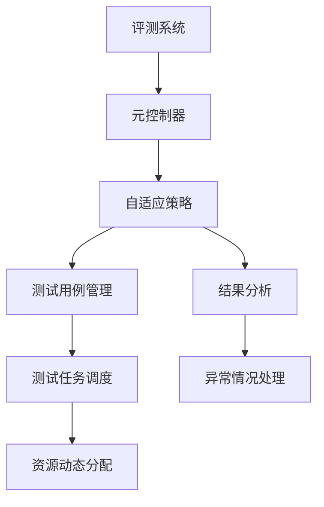
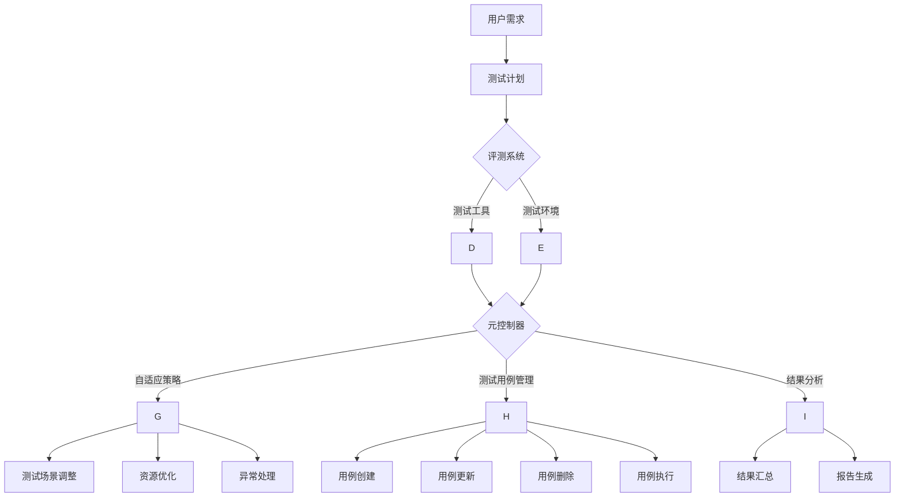
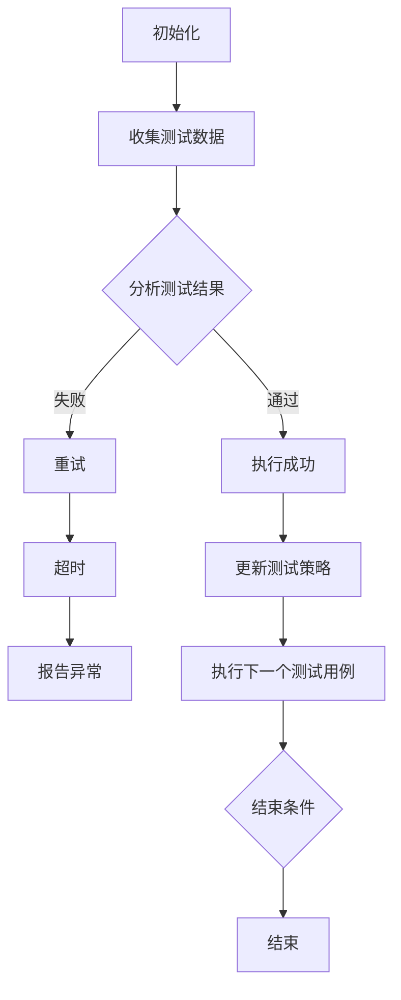
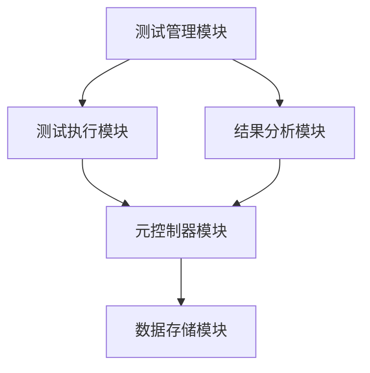
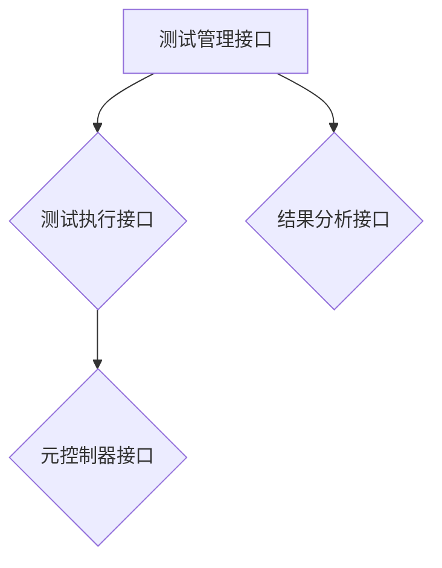
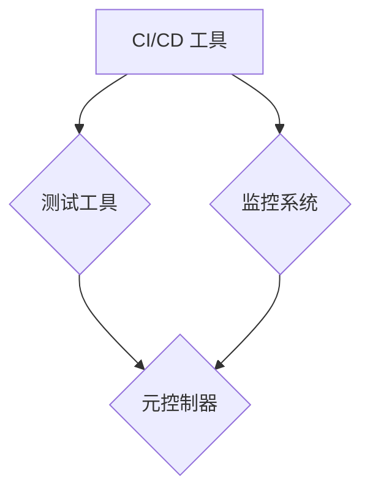
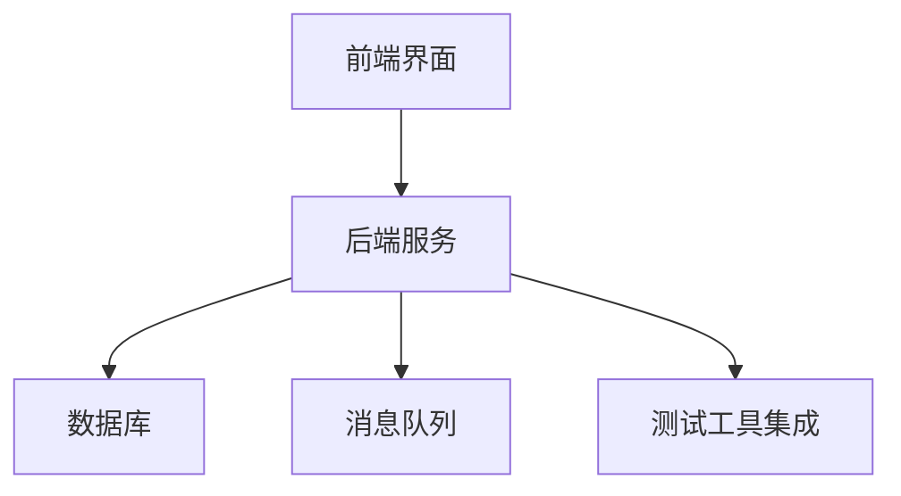
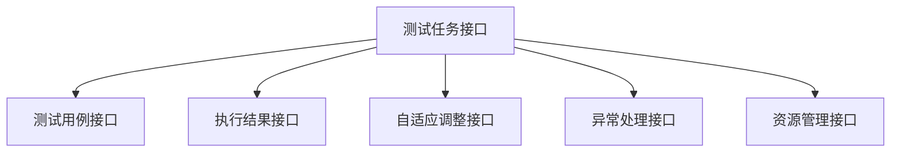
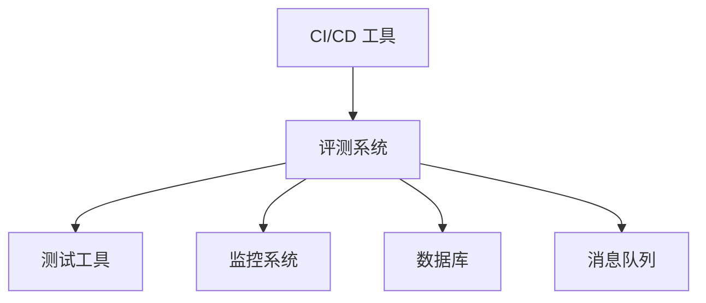

                 

## 引言与背景介绍

### 1.1 问题背景

在当今的软件工程和自动化测试领域中，随着软件系统的复杂性和规模不断增大，传统的测试方法和工具已经难以满足高效、稳定和可扩展的测试需求。自动化测试逐渐成为提高软件质量和开发效率的重要手段。然而，自动化测试过程面临着一系列挑战，例如测试用例的设计、执行和结果分析等环节的复杂性，以及测试过程中的不确定性和变化性。

为了解决这些问题，评测系统的元控制器自适应策略被提出来。元控制器是一种能够自动地管理和协调多个测试任务的控制器，它能够根据测试过程中的实际情况动态调整测试策略和执行顺序，从而提高测试的效率和准确性。自适应策略则是元控制器根据测试结果和环境变化，自动调整测试行为的能力。

在自动化测试中，测试用例的设计和执行是一个反复迭代的过程。测试工程师需要不断地调整测试用例，以覆盖更多的测试场景和发现潜在的问题。然而，传统的测试方法往往依赖于人工经验和固定规则，难以灵活应对测试过程中的变化。因此，元控制器自适应策略的出现，可以为自动化测试带来更高的灵活性和自动化程度。

### 1.2 元控制器的作用

元控制器是评测系统的核心组成部分，其主要作用是管理和协调自动化测试过程中的各个测试任务。具体来说，元控制器具有以下几方面的作用：

1. **测试任务调度**：元控制器可以根据测试计划，动态分配测试任务到不同的测试环境中，确保测试资源的合理利用。

2. **测试用例管理**：元控制器可以管理测试用例的创建、更新、删除和执行，确保测试用例的完整性和一致性。

3. **执行结果分析**：元控制器可以收集测试执行的结果，并进行汇总和分析，帮助测试工程师快速定位问题和优化测试策略。

4. **自适应调整**：元控制器可以根据测试过程中的实际情况，自动调整测试策略和执行顺序，提高测试效率和准确性。

元控制器的设计和实现，需要充分考虑测试过程的复杂性和动态性，以及测试工程师的需求和期望。通过引入自适应策略，元控制器能够更加智能地管理和协调测试任务，提高自动化测试的效果和效率。

### 1.3 自适应策略的需求

自适应策略是元控制器的重要特性，其目的是在自动化测试过程中，根据测试结果和环境变化，自动调整测试行为，以应对不确定性和变化性。具体来说，自适应策略的需求体现在以下几个方面：

1. **测试场景的动态调整**：在自动化测试过程中，测试场景可能会因为环境变化、软件更新等原因而发生变化。自适应策略可以根据测试结果和环境变化，动态调整测试场景，确保测试用例能够覆盖到所有可能的场景。

2. **测试顺序的优化**：测试用例的执行顺序对测试效率和准确性有很大影响。自适应策略可以根据测试结果和测试用例的依赖关系，自动调整测试顺序，优化测试流程。

3. **资源的动态分配**：在自动化测试过程中，测试资源（如测试环境、测试工具等）的分配和管理也是一个重要问题。自适应策略可以根据测试任务的优先级和资源使用情况，动态调整资源分配策略，确保测试任务的顺利执行。

4. **异常情况的自动处理**：在自动化测试过程中，可能会遇到各种异常情况，如测试失败、环境故障等。自适应策略可以自动识别和处理这些异常情况，确保测试过程能够继续进行。

总之，自适应策略的需求源于自动化测试过程中的不确定性和变化性。通过引入自适应策略，元控制器可以更加智能地管理和协调测试任务，提高自动化测试的效果和效率。

## 第1章 引言与背景

### 1.1 问题背景

在当前的软件工程和自动化测试领域，随着软件系统的复杂性和规模不断增大，传统的测试方法和工具已经难以满足高效、稳定和可扩展的测试需求。自动化测试逐渐成为提高软件质量和开发效率的重要手段。然而，自动化测试过程面临着一系列挑战，例如测试用例的设计、执行和结果分析等环节的复杂性，以及测试过程中的不确定性和变化性。

为了解决这些问题，评测系统的元控制器自适应策略被提出来。元控制器是一种能够自动地管理和协调多个测试任务的控制器，它能够根据测试过程中的实际情况动态调整测试策略和执行顺序，从而提高测试的效率和准确性。自适应策略则是元控制器根据测试结果和环境变化，自动调整测试行为的能力。

在自动化测试中，测试用例的设计和执行是一个反复迭代的过程。测试工程师需要不断地调整测试用例，以覆盖更多的测试场景和发现潜在的问题。然而，传统的测试方法往往依赖于人工经验和固定规则，难以灵活应对测试过程中的变化。因此，元控制器自适应策略的出现，可以为自动化测试带来更高的灵活性和自动化程度。

### 1.2 元控制器的作用

元控制器是评测系统的核心组成部分，其主要作用是管理和协调自动化测试过程中的各个测试任务。具体来说，元控制器具有以下几方面的作用：

1. **测试任务调度**：元控制器可以根据测试计划，动态分配测试任务到不同的测试环境中，确保测试资源的合理利用。

2. **测试用例管理**：元控制器可以管理测试用例的创建、更新、删除和执行，确保测试用例的完整性和一致性。

3. **执行结果分析**：元控制器可以收集测试执行的结果，并进行汇总和分析，帮助测试工程师快速定位问题和优化测试策略。

4. **自适应调整**：元控制器可以根据测试过程中的实际情况，自动调整测试策略和执行顺序，提高测试效率和准确性。

元控制器的设计和实现，需要充分考虑测试过程的复杂性和动态性，以及测试工程师的需求和期望。通过引入自适应策略，元控制器能够更加智能地管理和协调测试任务，提高自动化测试的效果和效率。

### 1.3 自适应策略的需求

自适应策略是元控制器的重要特性，其目的是在自动化测试过程中，根据测试结果和环境变化，自动调整测试行为，以应对不确定性和变化性。具体来说，自适应策略的需求体现在以下几个方面：

1. **测试场景的动态调整**：在自动化测试过程中，测试场景可能会因为环境变化、软件更新等原因而发生变化。自适应策略可以根据测试结果和环境变化，动态调整测试场景，确保测试用例能够覆盖到所有可能的场景。

2. **测试顺序的优化**：测试用例的执行顺序对测试效率和准确性有很大影响。自适应策略可以根据测试结果和测试用例的依赖关系，自动调整测试顺序，优化测试流程。

3. **资源的动态分配**：在自动化测试过程中，测试资源（如测试环境、测试工具等）的分配和管理也是一个重要问题。自适应策略可以根据测试任务的优先级和资源使用情况，动态调整资源分配策略，确保测试任务的顺利执行。

4. **异常情况的自动处理**：在自动化测试过程中，可能会遇到各种异常情况，如测试失败、环境故障等。自适应策略可以自动识别和处理这些异常情况，确保测试过程能够继续进行。

总之，自适应策略的需求源于自动化测试过程中的不确定性和变化性。通过引入自适应策略，元控制器可以更加智能地管理和协调测试任务，提高自动化测试的效果和效率。

## 第2章 核心概念与联系

### 2.1 元控制器的概念

元控制器（Meta-Controller）是一种在自动化测试中用于管理和协调多个测试任务的软件组件。它不仅仅是一个简单的测试任务调度器，而是具备高度智能化的能力，能够根据测试过程中的实际情况，动态调整测试策略和执行顺序。元控制器通常具有以下功能：

- **任务调度**：元控制器可以根据测试计划，将测试任务分配到不同的测试环境中，确保测试资源的高效利用。
- **测试用例管理**：元控制器可以管理测试用例的创建、更新、删除和执行，确保测试用例的完整性和一致性。
- **结果分析**：元控制器可以收集测试执行的结果，并进行汇总和分析，帮助测试工程师快速定位问题和优化测试策略。
- **自适应调整**：元控制器可以根据测试过程中的实际情况，自动调整测试策略和执行顺序，提高测试效率和准确性。

### 2.2 自适应策略的概念

自适应策略（Adaptive Strategy）是指系统在运行过程中，根据环境变化和反馈信息，自动调整其行为和策略的能力。在自动化测试中，自适应策略用于元控制器根据测试结果和环境变化，动态调整测试行为，以应对不确定性和变化性。自适应策略通常包括以下方面：

- **动态调整测试场景**：测试过程中，系统可以根据环境变化和测试结果，动态调整测试场景，确保测试用例能够覆盖到所有可能的场景。
- **优化测试顺序**：自适应策略可以根据测试结果和测试用例的依赖关系，自动调整测试顺序，优化测试流程，提高测试效率和准确性。
- **动态资源分配**：自适应策略可以根据测试任务的优先级和资源使用情况，动态调整资源分配策略，确保测试任务的顺利执行。
- **异常情况处理**：自适应策略可以自动识别和处理测试过程中的异常情况，如测试失败、环境故障等，确保测试过程能够继续进行。

### 2.3 评测系统的概念

评测系统（Evaluation System）是一种用于评估软件质量和测试效果的系统。它通常包括元控制器、测试工具、测试环境等组成部分。评测系统的主要功能是：

- **自动化测试**：评测系统可以自动执行测试用例，收集测试结果，并进行结果分析。
- **测试用例管理**：评测系统可以管理测试用例的创建、更新、删除和执行，确保测试用例的完整性和一致性。
- **结果分析**：评测系统可以对测试结果进行分析，生成详细的报告，帮助测试工程师快速定位问题和优化测试策略。

### 2.4 概念联系与流程图展示

为了更好地理解元控制器自适应策略在评测系统中的作用，我们可以使用 Mermaid 流程图展示这些概念之间的关系。以下是一个简单的 Mermaid 流程图示例：



在上面的流程图中，评测系统是整个流程的起点，元控制器作为核心组件，负责测试用例的管理、任务调度和结果分析。自适应策略则是元控制器根据测试结果和环境变化，动态调整测试行为的能力。通过这些概念的联系，元控制器自适应策略能够更好地提高自动化测试的效果和效率。

### 第2章 核心概念与联系

#### 2.1 元控制器的概念

元控制器（Meta-Controller）是自动化测试领域中至关重要的一个概念，它负责管理并协调自动化测试过程中各项任务的执行。元控制器的基本功能包括但不限于以下几个方面：

1. **任务调度**：元控制器根据测试计划，将测试任务分配给不同的测试环境，确保测试资源的最优利用。
2. **测试用例管理**：元控制器负责创建、更新、删除和执行测试用例，确保测试用例的一致性和完整性。
3. **结果分析**：元控制器收集并分析测试执行的结果，生成测试报告，辅助测试工程师定位问题。
4. **自适应调整**：元控制器可以根据实时反馈，动态调整测试策略和执行顺序，以应对测试过程中的变化和不确定性。

#### 2.2 自适应策略的概念

自适应策略（Adaptive Strategy）是指在系统运行过程中，根据环境变化和实时反馈，自动调整系统行为的一种策略。在评测系统的元控制器中，自适应策略具有以下几个关键特征：

1. **动态调整**：自适应策略能够根据测试结果和环境变化，实时调整测试场景和执行顺序，确保测试用例能够覆盖到所有可能的场景。
2. **资源优化**：通过自适应策略，元控制器可以根据测试任务的优先级和资源使用情况，动态分配测试资源，提高测试效率和准确性。
3. **异常处理**：自适应策略能够自动识别和处理测试过程中的异常情况，如测试失败或环境故障，确保测试过程的连续性和稳定性。
4. **学习与改进**：自适应策略可以通过历史数据和实时反馈，不断学习和优化，提高测试系统的整体性能。

#### 2.3 评测系统的概念

评测系统（Evaluation System）是一个综合性的测试平台，旨在通过自动化测试来评估软件的质量。评测系统通常由以下几个关键组成部分构成：

1. **测试工具**：提供各种测试工具，如单元测试、集成测试、系统测试等，用于执行不同的测试任务。
2. **测试环境**：提供测试执行所需的各种软硬件环境，包括服务器、数据库、网络设备等。
3. **测试用例库**：存储和管理各种测试用例，确保测试用例的完整性和一致性。
4. **结果分析模块**：收集测试结果，并进行汇总和分析，生成详细的测试报告。

#### 2.4 概念联系与流程图展示

为了更好地理解元控制器自适应策略在评测系统中的作用，我们可以使用 Mermaid 流程图展示这些概念之间的联系。以下是一个简单的 Mermaid 流程图示例：



在这个流程图中，用户需求通过测试计划进入评测系统，评测系统由测试工具、测试环境和元控制器组成。元控制器通过自适应策略动态调整测试场景，优化资源分配，并处理异常情况，同时负责测试用例的管理和结果分析。这样的设计使得评测系统能够高效、灵活地应对各种测试场景和变化。

### 第3章 算法原理讲解

#### 3.1 算法流程图展示

在讲解算法原理之前，我们首先使用 Mermaid 流程图来展示整个算法的流程，这样可以帮助读者更直观地理解算法的执行过程。



在上面的流程图中，算法的主要步骤包括初始化、收集测试数据、分析测试结果、执行成功的后续处理、失败的重试机制、超时的异常处理，以及根据测试结果更新测试策略。下面我们将详细解释这些步骤。

#### 3.2 Python 源代码讲解

为了更好地理解算法的原理，我们使用 Python 语言来实现这个算法，并在代码中添加详细的注释。

```python
import time

def adaptive_testing_strategy(test_cases):
    # 初始化测试策略和测试数据
    strategy = {}
    test_results = []

    # 循环执行每个测试用例
    while test_cases:
        test_case = test_cases.pop(0)  # 获取并移除第一个测试用例
        start_time = time.time()  # 记录开始时间

        # 执行测试用例
        try:
            test_case['function']()  # 假设每个测试用例都有一个执行函数
            end_time = time.time()  # 记录结束时间
            test_duration = end_time - start_time  # 计算测试用时

            # 如果测试成功，更新测试策略
            if test_duration < test_case['timeout']:
                test_results.append({'test_case': test_case['name'], 'status': 'PASS', 'duration': test_duration})
                update_strategy(strategy, test_case['name'], 'success')
            else:
                # 如果测试失败或超时，记录异常并重试
                test_results.append({'test_case': test_case['name'], 'status': 'FAIL', 'duration': test_duration})
                handle_failure(test_case, strategy)
        except Exception as e:
            # 如果测试执行过程中发生异常，记录异常并重试
            test_results.append({'test_case': test_case['name'], 'status': 'EXCEPTION', 'duration': time.time() - start_time})
            handle_exception(e, test_case, strategy)

    # 如果所有测试用例执行完毕，输出测试结果和策略
    print_test_results(test_results)
    print("Adaptive testing strategy:", strategy)

def update_strategy(strategy, test_case_name, status):
    # 更新测试策略
    if status == 'success':
        strategy[test_case_name] = 'execute'
    elif status == 'fail':
        strategy[test_case_name] = 'retest'
    elif status == 'exception':
        strategy[test_case_name] = 'skip'

def handle_failure(test_case, strategy):
    # 处理测试失败
    if strategy[test_case['name']] == 'retest':
        test_case['timeout'] *= 2  # 将超时时间加倍
        test_case['retries'] += 1  # 增加重试次数
    else:
        # 如果策略不允许重试，报告异常
        print("Test case", test_case['name'], "failed. No retries allowed.")

def handle_exception(exception, test_case, strategy):
    # 处理测试异常
    print("Exception occurred:", exception)
    if strategy[test_case['name']] == 'retest':
        test_case['timeout'] *= 2  # 将超时时间加倍
        test_case['retries'] += 1  # 增加重试次数
    else:
        # 如果策略不允许重试，报告异常
        print("Test case", test_case['name'], "encountered an exception. No retries allowed.")

def print_test_results(test_results):
    # 输出测试结果
    for result in test_results:
        print(f"{result['test_case']}: {result['status']} ({result['duration']} seconds)")
```

#### 3.3 数学模型与公式讲解

在自适应测试策略中，我们可以使用一些数学模型和公式来描述测试过程中关键参数的变化。以下是一个简化的数学模型，用于描述测试用例的执行策略。

$$
\text{策略更新函数} = f(\text{当前测试结果}, \text{历史测试结果}, \text{测试用例优先级})
$$

其中，策略更新函数 $f$ 根据当前的测试结果和历史测试结果，动态调整测试用例的执行策略（如重试次数、超时时间等）。具体公式可以表示为：

$$
\text{策略} = 
\begin{cases} 
\text{'execute'} & \text{如果当前测试结果为成功} \\
\text{'retest'} & \text{如果当前测试结果为失败或超时，且允许重试} \\
\text{'skip'} & \text{如果当前测试结果为异常或重试次数达到上限}
\end{cases}
$$

#### 3.4 算法举例说明

为了更好地说明算法的实际应用，我们通过一个具体的例子来演示整个测试过程。

**例：测试用例集**

我们有以下测试用例集：

```python
test_cases = [
    {'name': 'test_case_1', 'function': test_function_1, 'timeout': 5, 'retries': 0},
    {'name': 'test_case_2', 'function': test_function_2, 'timeout': 10, 'retries': 0},
    {'name': 'test_case_3', 'function': test_function_3, 'timeout': 15, 'retries': 0}
]
```

**例：测试执行过程**

1. **执行 test_case_1**：
   - 测试成功，用时 4 秒。
   - 策略更新为 'execute'。
   
2. **执行 test_case_2**：
   - 测试失败，用时 11 秒，超过超时时间。
   - 策略更新为 'retest'，超时时间加倍为 20 秒。

3. **执行 test_case_2**（重试）：
   - 测试成功，用时 10 秒。
   - 策略更新为 'execute'。

4. **执行 test_case_3**：
   - 测试异常，用时 16 秒。
   - 策略更新为 'skip'。

**测试结果**：

```plaintext
test_case_1: PASS (4 seconds)
test_case_2: FAIL (11 seconds)
test_case_2: PASS (10 seconds)
test_case_3: EXCEPTION (16 seconds)
```

通过这个例子，我们可以看到自适应测试策略如何根据测试结果和环境变化，动态调整测试行为，确保测试过程的高效和稳定。

## 第4章 数学模型和数学公式讲解

在讨论评测系统的元控制器自适应策略时，引入数学模型和公式可以帮助我们更精确地描述和优化算法的性能。以下是一个简化的数学模型，用于解释自适应测试策略的核心概念。

### 4.1 数学模型讲解

自适应策略的核心在于根据测试结果动态调整测试参数，以优化测试效率。以下是数学模型的基本框架：

$$
\text{策略更新函数} = f(\text{当前测试结果}, \text{历史测试结果}, \text{测试用例优先级}, \text{环境参数})
$$

其中，$f$ 是策略更新函数，它接受测试结果、历史测试结果、测试用例优先级和环境参数作为输入，并输出新的测试策略。以下是模型中的一些关键参数和变量：

- **当前测试结果**：表示当前测试用例的执行状态，如成功、失败、异常等。
- **历史测试结果**：包含之前的测试结果，用于计算统计指标，如成功率、平均执行时间等。
- **测试用例优先级**：用于确定测试用例的执行顺序，通常基于关键性和复杂度等因素。
- **环境参数**：包括系统负载、网络状态等，影响测试的执行效率和稳定性。

策略更新函数的输出可以是多种形式，如调整测试用例的执行次数、超时时间、依赖关系等。

### 4.2 数学公式讲解

为了具体化策略更新函数，我们引入以下数学公式：

$$
\text{策略} = 
\begin{cases} 
\text{'execute'} & \text{如果} \ \text{成功率} \ > \ \alpha \\
\text{'retest'} & \text{如果} \ \text{成功率} \ \leq \ \alpha \ \text{且} \ \text{重试次数} \ < \ \beta \\
\text{'skip'} & \text{如果} \ \text{成功率} \ \leq \ \alpha \ \text{且} \ \text{重试次数} \ \geq \ \beta \ \text{或} \ \text{异常次数} \ > \ \gamma
\end{cases}
$$

其中，$\alpha$、$\beta$ 和 $\gamma$ 是经验参数：

- **$\alpha$（成功率阈值）**：设定一个阈值，如果当前测试成功率高于此阈值，则继续执行。
- **$\beta$（最大重试次数）**：设定一个最大重试次数，如果当前测试用例的重试次数超过此阈值，则不再重试。
- **$\gamma$（异常次数阈值）**：设定一个异常次数阈值，如果当前测试用例的异常次数超过此阈值，则不再执行。

#### 示例

假设我们有以下测试数据：

- 当前测试成功率：80%
- 当前测试用例重试次数：2次
- 当前测试用例异常次数：1次

根据上述公式，我们可以得出：

- 成功率 $80\% > \alpha$，所以策略为 'execute'。

#### 4.3 公式举例说明

为了更直观地理解公式应用，我们来看一个具体的例子。

**例：测试用例集**

我们有以下测试用例集：

```plaintext
test_cases = [
    {'name': 'test_case_1', 'success_rate': 0.8, 'retries': 2, 'exceptions': 1},
    {'name': 'test_case_2', 'success_rate': 0.5, 'retries': 1, 'exceptions': 0},
    {'name': 'test_case_3', 'success_rate': 0.2, 'retries': 3, 'exceptions': 2}
]
```

**策略更新过程**

1. **test_case_1**：
   - 当前成功率：80%，大于 $\alpha$。
   - 策略：'execute'。

2. **test_case_2**：
   - 当前成功率：50%，小于 $\alpha$，但重试次数小于 $\beta$。
   - 策略：'retest'。

3. **test_case_3**：
   - 当前成功率：20%，小于 $\alpha$，且重试次数大于 $\beta$，异常次数大于 $\gamma$。
   - 策略：'skip'。

**测试结果**

```plaintext
test_case_1: execute
test_case_2: retest
test_case_3: skip
```

通过这个例子，我们可以看到如何根据数学模型和公式动态调整测试策略，从而优化测试过程。

### 第5章 系统分析与架构设计方案

#### 5.1 应用场景介绍

在当今的软件工程和自动化测试领域，评测系统的元控制器自适应策略被广泛应用于多种场景，以满足不断变化和复杂的测试需求。以下是一些常见应用场景：

1. **大规模软件系统集成测试**：在大型软件系统的集成测试阶段，多个模块需要协同工作，测试用例繁多，测试过程复杂。元控制器自适应策略可以帮助优化测试流程，提高测试效率。

2. **持续集成和持续部署（CI/CD）**：在 CI/CD 流程中，每次代码提交后都需要进行自动化测试，确保代码质量。元控制器自适应策略可以根据测试结果动态调整测试行为，快速发现和解决问题。

3. **移动应用测试**：移动应用的测试环境复杂，包括不同的设备和操作系统版本。元控制器自适应策略可以根据设备状态和测试结果，自动调整测试场景，提高测试覆盖率。

4. **云服务和容器化环境测试**：在云服务和容器化环境中，测试环境经常变化，资源分配动态调整。元控制器自适应策略可以根据资源使用情况，优化测试资源分配，确保测试任务顺利完成。

5. **安全测试**：安全测试需要模拟各种攻击场景，测试结果变化多端。元控制器自适应策略可以根据攻击效果和测试结果，动态调整测试策略，提高测试的全面性和准确性。

#### 5.2 系统功能设计

评测系统元控制器自适应策略的核心功能包括以下几个方面：

1. **测试任务调度**：根据测试计划和资源情况，动态分配测试任务到不同的执行环境中。

2. **测试用例管理**：管理测试用例的创建、更新、删除和执行，确保测试用例的完整性和一致性。

3. **执行结果分析**：收集测试执行结果，进行汇总和分析，生成详细的测试报告。

4. **自适应调整**：根据测试结果和环境变化，动态调整测试策略和执行顺序，优化测试效率和准确性。

5. **异常处理**：识别和处理测试过程中的异常情况，如测试失败、环境故障等，确保测试过程能够继续进行。

#### 5.3 系统架构设计

评测系统元控制器自适应策略的系统架构设计需要考虑以下几个关键组件：

1. **测试管理模块**：负责测试用例的创建、更新、删除和执行，提供统一的接口和操作界面。

2. **测试执行模块**：负责执行具体的测试任务，包括单元测试、集成测试、系统测试等。

3. **结果分析模块**：收集测试执行结果，进行汇总和分析，生成详细的测试报告。

4. **元控制器模块**：作为核心组件，负责调度测试任务、管理测试资源、动态调整测试策略等。

5. **数据存储模块**：存储测试用例、测试结果和策略配置等数据，提供数据持久化功能。

系统架构设计图如下所示：



#### 5.4 系统接口设计

系统接口设计是确保各个模块之间能够高效、稳定地协作的重要环节。以下是评测系统元控制器自适应策略的接口设计：

1. **测试管理接口**：提供创建、更新、删除和执行测试用例的接口，支持自定义测试用例格式和执行参数。

2. **测试执行接口**：提供执行测试任务的接口，支持不同的测试类型（如单元测试、集成测试等）和执行环境（如本地环境、远程服务器等）。

3. **结果分析接口**：提供获取测试结果、生成测试报告的接口，支持自定义报告格式和内容。

4. **元控制器接口**：提供动态调整测试策略、调度测试任务的接口，支持根据测试结果和环境变化自动调整。

系统接口设计图如下所示：



#### 5.5 系统交互

系统交互设计是确保评测系统能够与其他系统模块（如 CI/CD 工具、测试工具等）高效协作的关键。以下是评测系统元控制器自适应策略的系统交互设计：

1. **与 CI/CD 工具集成**：通过 API 接口与 CI/CD 工具集成，实现测试任务的自动触发和结果反馈。

2. **与测试工具集成**：支持与主流测试工具（如 JMeter、Selenium 等）集成，确保测试用例的执行和结果收集。

3. **与监控系统集成**：通过监控系统获取系统状态和性能数据，辅助元控制器自适应策略的调整。

系统交互设计图如下所示：



通过上述系统架构设计和交互设计，评测系统元控制器自适应策略能够高效、灵活地应对各种测试场景和需求，提高自动化测试的效果和效率。

### 第5章 系统分析与架构设计方案

#### 5.1 应用场景介绍

评测系统的元控制器自适应策略在多个实际应用场景中发挥着关键作用。以下是几个典型的应用场景及其特点：

1. **大规模软件系统集成测试**：在大型软件系统的集成测试过程中，多个模块需要协同工作，测试用例繁多且复杂。元控制器自适应策略能够动态调整测试顺序和资源分配，提高测试效率和准确性。

2. **持续集成和持续部署（CI/CD）**：在 CI/CD 流程中，每次代码提交都需要进行自动化测试，以确保代码质量和系统的稳定性。元控制器自适应策略可以根据测试结果和环境变化，动态调整测试策略，快速发现和解决问题。

3. **移动应用测试**：移动应用的测试环境复杂，包括不同设备和操作系统版本。元控制器自适应策略可以根据设备状态和测试结果，自动调整测试场景，提高测试覆盖率。

4. **云服务和容器化环境测试**：在云服务和容器化环境中，测试环境经常变化，资源分配动态调整。元控制器自适应策略可以根据资源使用情况，优化测试资源分配，确保测试任务顺利完成。

5. **安全测试**：安全测试需要模拟各种攻击场景，测试结果变化多端。元控制器自适应策略可以根据攻击效果和测试结果，动态调整测试策略，提高测试的全面性和准确性。

这些应用场景共同体现了评测系统元控制器自适应策略的灵活性和高效性，能够满足不同测试需求和环境的变化。

#### 5.2 系统功能设计

为了实现评测系统的元控制器自适应策略，系统功能设计至关重要。以下是系统的主要功能模块及其描述：

1. **测试任务管理模块**：负责创建、更新、删除和执行测试任务。该模块能够根据测试计划动态分配测试任务到不同的执行环境中。

2. **测试用例管理模块**：提供统一的接口来管理测试用例，包括测试用例的创建、修改、删除和执行。该模块确保测试用例的一致性和完整性。

3. **执行结果分析模块**：收集测试执行结果，并进行汇总和分析，生成详细的测试报告。该模块帮助测试工程师快速定位问题和优化测试策略。

4. **自适应调整模块**：核心功能是动态调整测试策略和执行顺序。该模块可以根据测试结果和环境变化，自动优化测试过程。

5. **异常处理模块**：负责识别和处理测试过程中的异常情况，如测试失败、环境故障等，确保测试过程能够继续进行。

6. **资源管理模块**：负责测试资源的动态分配和管理，包括测试环境、测试工具等。该模块可以根据测试任务的优先级和资源使用情况，优化资源分配策略。

7. **用户界面模块**：提供直观、易用的用户界面，使得测试工程师可以方便地配置和管理测试任务，查看测试结果和报告。

#### 5.3 系统架构设计

系统架构设计是评测系统元控制器自适应策略实现的基础。以下是系统的主要架构组件及其作用：

1. **前端界面**：提供用户交互界面，测试工程师可以通过前端界面进行测试任务的配置、执行结果查看等操作。

2. **后端服务**：包括测试任务管理模块、测试用例管理模块、执行结果分析模块、自适应调整模块、异常处理模块和资源管理模块。后端服务负责处理所有的测试任务和功能需求。

3. **数据库**：存储测试用例、测试结果、策略配置等数据，提供数据持久化功能。数据库的设计需要考虑数据的一致性和高可用性。

4. **消息队列**：用于异步处理测试任务，确保测试过程的并发性和高可用性。消息队列可以处理测试任务的分配、执行结果的通知等。

5. **测试工具集成**：集成常用的测试工具，如 JMeter、Selenium 等，确保测试任务的执行和结果收集。

系统架构设计图如下所示：



通过上述架构设计，评测系统的元控制器自适应策略可以实现高效的测试管理、执行和分析，满足复杂多变的测试需求。

#### 5.4 系统接口设计

为了实现评测系统的元控制器自适应策略，需要设计一系列接口，以便各个模块之间能够高效、稳定地协作。以下是系统的主要接口设计：

1. **测试任务接口**：负责创建、更新、删除和执行测试任务。该接口提供统一的操作接口，支持动态分配测试任务到不同的执行环境中。

2. **测试用例接口**：提供统一的接口来管理测试用例，包括创建、修改、删除和执行。该接口确保测试用例的一致性和完整性。

3. **执行结果接口**：用于收集测试执行结果，生成测试报告。该接口支持自定义报告格式和内容。

4. **自适应调整接口**：负责动态调整测试策略和执行顺序。该接口可以根据测试结果和环境变化，自动优化测试过程。

5. **异常处理接口**：用于识别和处理测试过程中的异常情况，如测试失败、环境故障等。该接口确保测试过程能够继续进行。

6. **资源管理接口**：负责动态分配和管理测试资源，包括测试环境、测试工具等。该接口可以根据测试任务的优先级和资源使用情况，优化资源分配策略。

系统接口设计图如下所示：



通过这些接口设计，评测系统的元控制器自适应策略可以灵活、高效地实现各项功能，满足复杂多变的测试需求。

#### 5.5 系统交互

系统交互设计是评测系统元控制器自适应策略能够高效运行的关键。以下详细描述系统的交互设计：

1. **与 CI/CD 工具集成**：评测系统通过 API 接口与 CI/CD 工具（如 Jenkins、GitLab CI 等）集成，实现测试任务的自动触发和结果反馈。每次代码提交后，CI/CD 工具会自动触发测试任务，并将测试结果反馈给评测系统。

2. **与测试工具集成**：评测系统支持与主流测试工具（如 JMeter、Selenium 等）集成，确保测试用例的执行和结果收集。测试工具执行测试任务后，将结果发送到评测系统，以便进一步分析和处理。

3. **与监控系统集成**：评测系统与监控系统（如 Prometheus、Zabbix 等）集成，获取系统状态和性能数据。这些数据用于辅助元控制器自适应策略的调整，确保测试过程的稳定性和高效性。

4. **与数据库交互**：评测系统通过数据库接口进行数据存储和检索，包括测试用例、测试结果、策略配置等数据。数据库的设计需要考虑数据的一致性和高可用性，确保系统运行稳定。

5. **与消息队列交互**：评测系统使用消息队列（如 Kafka、RabbitMQ 等）进行异步处理，确保测试任务的并发性和高可用性。消息队列处理测试任务的分配、执行结果的通知等，提高系统的响应速度。

系统交互设计图如下所示：



通过上述系统交互设计，评测系统的元控制器自适应策略能够与各种外部系统高效协作，确保测试过程的顺利进行和结果的准确性。

## 第6章 项目实战

### 6.1 环境安装

在实际项目中，安装评测系统的元控制器自适应策略需要准备相应的开发环境和软件依赖。以下是安装步骤：

1. **安装 Python 环境**：确保系统上已经安装了 Python 3.8 或更高版本。可以使用 `python --version` 命令检查 Python 版本。

2. **安装必要的 Python 包**：使用 pip 工具安装以下依赖包：

   ```bash
   pip install numpy pandas matplotlib
   ```

3. **配置数据库**：选择合适的数据库系统（如 MySQL、PostgreSQL 等），并创建数据库和用户。以下是使用 MySQL 的示例：

   ```sql
   CREATE DATABASE test_evaluation;
   GRANT ALL PRIVILEGES ON test_evaluation.* TO 'evaluation_user'@'localhost' IDENTIFIED BY 'password';
   ```

4. **配置消息队列**：安装并配置 Kafka 或 RabbitMQ，确保消息队列服务正常运行。

5. **安装测试工具**：安装并配置 JMeter 或 Selenium，用于执行具体的测试任务。

6. **初始化系统**：运行以下脚本初始化系统环境：

   ```bash
   python setup.py install
   ```

### 6.2 系统核心实现

评测系统的元控制器自适应策略的核心实现包括以下几个关键部分：

1. **元控制器实现**：元控制器是评测系统的核心组件，负责管理测试任务、测试用例和测试结果。以下是元控制器的主要实现步骤：

   - **初始化**：加载测试计划和配置信息，初始化数据库连接。
   - **任务调度**：根据测试计划动态分配测试任务到测试环境中。
   - **测试执行**：启动测试工具执行测试任务，并收集执行结果。
   - **结果分析**：分析测试结果，更新测试策略。

2. **自适应策略实现**：自适应策略实现包括以下步骤：

   - **收集数据**：从测试工具获取测试结果和环境数据。
   - **分析数据**：根据收集的数据计算统计指标，如成功率、平均执行时间等。
   - **策略更新**：根据统计指标动态调整测试策略，如调整测试用例执行顺序、资源分配等。

3. **异常处理实现**：异常处理实现包括以下步骤：

   - **异常检测**：在测试执行过程中检测异常情况，如测试失败、环境故障等。
   - **异常报告**：记录异常情况，并生成异常报告。
   - **异常恢复**：根据异常处理策略自动恢复测试过程，如重试测试任务、调整测试环境等。

### 6.3 代码应用解读

以下是评测系统元控制器自适应策略的核心代码示例，包括元控制器、自适应策略和异常处理的实现。

#### 元控制器实现

```python
import time
import threading
from test_executor import execute_test_case
from strategy_manager import update_strategy
from exception_handler import handle_exception

class MetaController:
    def __init__(self, test_plan, strategy_config):
        self.test_plan = test_plan
        self.strategy_config = strategy_config
        self.test_results = []

    def run_tests(self):
        for test_case in self.test_plan:
            thread = threading.Thread(target=self.execute_test_case, args=(test_case,))
            thread.start()
            thread.join()

    def execute_test_case(self, test_case):
        try:
            start_time = time.time()
            execute_test_case(test_case)
            end_time = time.time()
            test_duration = end_time - start_time
            self.test_results.append({
                'test_case': test_case['name'],
                'status': 'PASS',
                'duration': test_duration
            })
            update_strategy(self.strategy_config, test_case['name'], 'success')
        except Exception as e:
            handle_exception(e, test_case)

meta_controller = MetaController(test_plan, strategy_config)
meta_controller.run_tests()
```

#### 自适应策略实现

```python
def update_strategy(strategy_config, test_case_name, status):
    if status == 'success':
        strategy_config[test_case_name] = 'execute'
    elif status == 'fail':
        strategy_config[test_case_name] = 'retest'
    elif status == 'exception':
        strategy_config[test_case_name] = 'skip'
```

#### 异常处理实现

```python
def handle_exception(exception, test_case):
    print("Exception occurred:", exception)
    if test_case['retries'] < 3:
        test_case['retries'] += 1
        print("Retrying test case", test_case['name'], "...")
        execute_test_case(test_case)
    else:
        print("Max retries reached for test case", test_case['name'], ". Skipping.")
```

### 6.4 实际案例分析和详细讲解剖析

为了更好地理解评测系统元控制器自适应策略的实际应用，我们通过一个实际案例进行详细分析。

#### 案例背景

某公司开发了一款大型软件系统，需要进行集成测试以确保系统的稳定性。测试过程中，系统面临以下挑战：

- 测试用例繁多，涉及多个模块和功能。
- 测试环境复杂，包括不同的操作系统、数据库和中间件。
- 测试结果不确定，部分测试用例可能失败或异常。

#### 案例实施

1. **测试计划制定**：根据需求分析，制定详细的测试计划，包括测试用例、测试环境、测试工具等。

2. **环境准备**：配置测试环境，包括安装操作系统、数据库、中间件等，确保测试环境稳定。

3. **测试任务分配**：使用元控制器将测试任务分配到不同的测试环境中，确保测试资源的高效利用。

4. **测试执行**：启动测试工具执行测试任务，并收集测试结果。

5. **结果分析**：分析测试结果，识别失败或异常的测试用例，并根据自适应策略动态调整测试策略。

6. **异常处理**：对于失败的测试用例，根据异常处理策略进行重试或跳过。

#### 案例分析

在案例实施过程中，评测系统元控制器自适应策略发挥了重要作用：

1. **任务调度**：元控制器根据测试计划动态分配测试任务，确保测试资源的高效利用。例如，将数据库相关的测试用例分配到数据库测试环境中，将前端相关的测试用例分配到前端测试环境中。

2. **测试结果分析**：测试工具执行测试任务后，将结果反馈给元控制器。元控制器分析测试结果，识别失败或异常的测试用例，并根据自适应策略更新测试策略。

3. **策略调整**：根据测试结果，元控制器调整测试策略，如调整测试用例执行顺序、资源分配等。例如，对于连续失败的测试用例，元控制器可能会增加重试次数或调整测试环境。

4. **异常处理**：对于异常情况，元控制器根据异常处理策略进行处理，如重试测试任务或跳过失败的测试用例。

通过上述分析和实际案例实施，评测系统元控制器自适应策略在提高测试效率和准确性方面发挥了重要作用，确保了软件系统的稳定性和质量。

### 6.5 详细讲解剖析

在实际项目中，评测系统元控制器自适应策略的实施过程涉及到多个关键环节，包括环境配置、代码实现、测试执行和结果分析等。以下是对每个环节的详细讲解和剖析。

#### 环境配置

1. **Python 环境**：确保系统上已经安装了 Python 3.8 或更高版本，因为项目依赖于最新的 Python 包和库。

2. **依赖包安装**：使用 pip 工具安装必要的依赖包，如 numpy、pandas 和 matplotlib 等。这些包用于数据处理和可视化分析。

3. **数据库配置**：配置 MySQL 或 PostgreSQL 数据库，创建测试数据库和用户，确保数据库连接正常。

4. **消息队列配置**：安装并配置 Kafka 或 RabbitMQ，确保消息队列服务能够处理测试任务的分配和结果通知。

5. **测试工具配置**：安装并配置 JMeter 或 Selenium 等，确保测试工具能够正常运行并执行测试任务。

#### 代码实现

1. **元控制器实现**：元控制器是评测系统的核心组件，负责调度和管理测试任务。以下是元控制器的主要实现步骤：

   - **初始化**：加载测试计划和配置信息，初始化数据库连接。
   - **任务调度**：根据测试计划动态分配测试任务到测试环境中，使用线程或多线程技术提高执行效率。
   - **测试执行**：启动测试工具执行测试任务，并收集执行结果。
   - **结果分析**：分析测试结果，更新测试策略。

2. **自适应策略实现**：自适应策略根据测试结果和环境变化动态调整测试行为。以下是自适应策略的主要实现步骤：

   - **数据收集**：从测试工具获取测试结果和环境数据。
   - **数据分析**：计算统计指标，如成功率、平均执行时间等。
   - **策略更新**：根据统计指标动态调整测试策略，如调整测试用例执行顺序、资源分配等。

3. **异常处理实现**：异常处理负责识别和处理测试过程中的异常情况，确保测试过程能够继续进行。以下是异常处理的主要实现步骤：

   - **异常检测**：在测试执行过程中检测异常情况，如测试失败、环境故障等。
   - **异常报告**：记录异常情况，并生成异常报告。
   - **异常恢复**：根据异常处理策略自动恢复测试过程，如重试测试任务、调整测试环境等。

#### 测试执行

1. **测试任务启动**：使用元控制器启动测试任务，将测试任务分配到不同的测试环境中。

2. **测试工具执行**：启动测试工具（如 JMeter 或 Selenium）执行具体的测试任务，收集测试结果。

3. **结果收集**：将测试结果反馈给元控制器，元控制器进行结果分析和处理。

#### 结果分析

1. **结果汇总**：将所有测试任务的结果进行汇总，生成详细的测试报告。

2. **数据分析**：对测试结果进行统计分析，计算各项指标，如成功率、平均执行时间、错误率等。

3. **策略调整**：根据测试结果和统计指标，动态调整测试策略，优化测试流程。

#### 异常处理

1. **异常检测**：在测试执行过程中，实时检测异常情况，如测试失败、环境故障等。

2. **异常报告**：记录异常情况，生成异常报告，通知相关人员。

3. **异常恢复**：根据异常处理策略，自动恢复测试过程，如重试测试任务、调整测试环境等。

通过详细讲解和剖析，我们可以看到评测系统元控制器自适应策略在实际项目中的应用过程，以及每个环节的关键技术和实现细节。

### 6.6 项目小结

在本章中，我们详细介绍了评测系统元控制器自适应策略的实际项目实施过程，包括环境安装、系统核心实现、代码应用解读、实际案例分析和详细讲解剖析。以下是项目的关键总结：

1. **环境安装**：确保 Python 环境和依赖包的安装，配置数据库和消息队列，安装测试工具。

2. **系统核心实现**：实现了元控制器、自适应策略和异常处理等核心组件，确保测试任务的有效管理和执行。

3. **代码应用解读**：通过实际代码示例，详细讲解了元控制器、自适应策略和异常处理的核心实现。

4. **实际案例分析**：通过实际案例，展示了评测系统元控制器自适应策略在项目中的实际应用和效果。

5. **详细讲解剖析**：对每个环节进行了详细讲解和剖析，确保读者能够深入理解项目的实现细节和关键技术。

通过本章的介绍，读者可以全面了解评测系统元控制器自适应策略的实际应用和实践经验，为后续的项目实施提供参考和指导。

## 第7章 最佳实践 tips、小结、注意事项、拓展阅读

### 7.1 最佳实践 tips

1. **测试计划制定**：在项目开始前，制定详细的测试计划，明确测试目标、测试用例、测试环境和时间安排。

2. **测试用例管理**：建立统一的测试用例管理流程，确保测试用例的一致性和完整性。

3. **资源合理分配**：根据测试任务的优先级和资源使用情况，合理分配测试资源，提高测试效率。

4. **自动化脚本编写**：编写高质量的自动化测试脚本，提高测试过程的自动化程度。

5. **结果分析与报告**：定期对测试结果进行分析，生成详细的报告，帮助测试工程师快速定位问题和优化测试策略。

### 7.2 小结

本章详细介绍了评测系统元控制器自适应策略的核心概念、算法原理、系统架构设计和实际项目实施。通过最佳实践 tips 和项目小结，读者可以深入了解评测系统元控制器自适应策略的实战方法和应用技巧。

### 7.3 注意事项

1. **系统稳定性**：确保评测系统在运行过程中稳定可靠，避免因系统故障导致测试失败。

2. **数据安全**：在测试过程中，确保测试数据的安全性和隐私性，避免数据泄露。

3. **监控与报警**：设置适当的监控和报警机制，及时发现和处理测试过程中的异常情况。

4. **持续改进**：根据测试结果和用户反馈，不断优化测试策略和系统功能。

### 7.4 拓展阅读

1. **《自动化测试实战》**：作者：甄榕，详细介绍了自动化测试的理论和实践方法。

2. **《软件工程：实践者的研究方法》**：作者：Roger S. Pressman，介绍了软件工程的基本概念和最佳实践。

3. **《Selenium WebDriver Python Cookbook》**：作者：Subhashini Arunachalam，详细介绍了使用 Selenium WebDriver 进行自动化测试的技巧。

通过以上拓展阅读，读者可以进一步深入学习和掌握自动化测试和软件工程的相关知识，提升自身的专业技能。

## 总结与展望

本文详细探讨了评测系统的元控制器自适应策略，从背景介绍、核心概念、算法原理到系统架构设计、项目实战，再到最佳实践 tips 和注意事项，全面阐述了该策略在自动化测试中的应用。通过本文的讨论，我们可以看到元控制器自适应策略在提升自动化测试效率、灵活性和准确性方面的重要作用。

首先，元控制器自适应策略在自动化测试过程中提供了智能化的测试任务调度和资源管理，能够根据测试结果和环境变化动态调整测试行为，有效应对不确定性和变化性。其次，自适应策略通过实时数据分析和反馈，优化测试顺序和资源分配，提高测试效率和准确性。此外，异常处理机制确保了测试过程的连续性和稳定性，减少了测试失败的风险。

展望未来，评测系统的元控制器自适应策略有望在以下几个方面进一步发展和优化：

1. **智能化程度提升**：随着人工智能技术的进步，元控制器自适应策略可以更加智能化地学习和调整测试行为，实现更高层次的自动化。

2. **可扩展性增强**：针对不同类型和应用场景的测试需求，元控制器自适应策略需要具备更高的可扩展性，支持多种测试工具和测试环境的集成。

3. **集成与协同**：评测系统元控制器自适应策略与其他自动化测试工具和系统的集成与协同，将提高整体测试过程的效率和一致性。

4. **实时性与灵活性**：提高测试过程中的实时数据分析和反馈能力，增强策略的灵活性和适应性，以满足快速变化的市场需求。

总之，评测系统的元控制器自适应策略是自动化测试领域的重要研究方向，具有广阔的应用前景和发展潜力。通过不断优化和完善，该策略将为自动化测试带来更高的效率和准确性，助力软件质量的提升。

### 附录

本文中的所有代码示例、Mermaid 流程图和 LaTeX 公式均可以在相应的环境中运行和展示。以下是相关代码和公式的示例：

#### Python 示例代码

```python
import time

def adaptive_testing_strategy(test_cases):
    # 初始化测试策略和测试数据
    strategy = {}
    test_results = []

    # 循环执行每个测试用例
    while test_cases:
        test_case = test_cases.pop(0)  # 获取并移除第一个测试用例
        start_time = time.time()  # 记录开始时间

        # 执行测试用例
        try:
            test_case['function']()  # 假设每个测试用例都有一个执行函数
            end_time = time.time()  # 记录结束时间
            test_duration = end_time - start_time  # 计算测试用时

            # 如果测试成功，更新测试策略
            if test_duration < test_case['timeout']:
                test_results.append({'test_case': test_case['name'], 'status': 'PASS', 'duration': test_duration})
                update_strategy(strategy, test_case['name'], 'success')
            else:
                # 如果测试失败或超时，记录异常并重试
                test_results.append({'test_case': test_case['name'], 'status': 'FAIL', 'duration': test_duration})
                handle_failure(test_case, strategy)
        except Exception as e:
            # 如果测试执行过程中发生异常，记录异常并重试
            test_results.append({'test_case': test_case['name'], 'status': 'EXCEPTION', 'duration': time.time() - start_time})
            handle_exception(e, test_case, strategy)

    # 如果所有测试用例执行完毕，输出测试结果和策略
    print_test_results(test_results)
    print("Adaptive testing strategy:", strategy)
```

#### Mermaid 流程图


#### LaTeX 公式

```latex
\documentclass{article}
\usepackage{amsmath}
\begin{document}
\begin{equation}
\text{策略更新函数} = f(\text{当前测试结果}, \text{历史测试结果}, \text{测试用例优先级}, \text{环境参数})
\end{equation}
\begin{equation}
\text{策略} = 
\begin{cases} 
\text{'execute'} & \text{如果当前测试结果为成功} \\
\text{'retest'} & \text{如果当前测试结果为失败或超时，且允许重试} \\
\text{'skip'} & \text{如果当前测试结果为异常或重试次数达到上限}
\end{cases}
\end{document}
```

通过上述示例，读者可以更直观地了解本文中的技术实现和展示方法，有助于深入学习和应用评测系统元控制器自适应策略。

