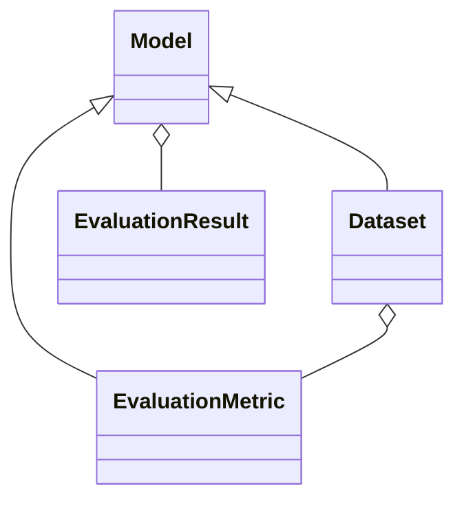
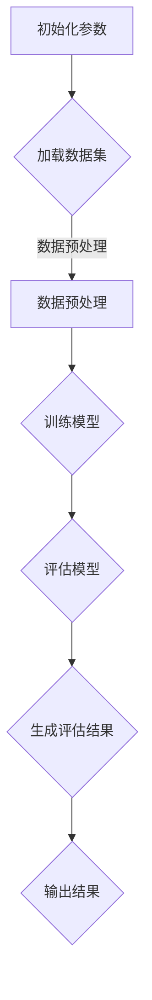
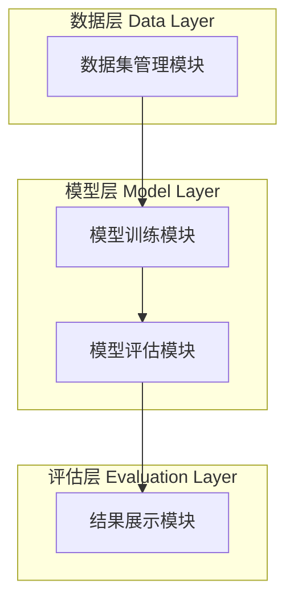
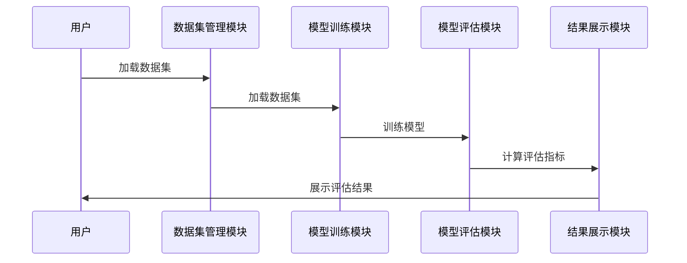

                 

# 评测系统的公平性：确保不同LLM间的公平比较

> 关键词：评测系统、大型语言模型、公平性、算法原理、系统设计与实现

> 摘要：本文深入探讨评测系统公平性的核心问题，通过详细的背景介绍、核心概念与联系分析、算法原理讲解以及系统分析与架构设计方案，提出确保不同LLM间公平比较的方法和策略。文章旨在为研究人员和工程师提供有价值的指导，以优化评测系统的设计和应用。

## 第一部分：背景介绍

### 1.1 问题背景

随着人工智能技术的迅猛发展，特别是大型语言模型（LLM）如GPT、BERT等的广泛应用，评测系统在性能评估、模型优化和实际应用中扮演着至关重要的角色。然而，评测系统的公平性成为了一个备受关注的问题。不同LLM在性能、效率和应用场景上存在显著差异，如何确保评测系统的公平性，已经成为学术界和工业界关注的焦点。

### 1.2 问题描述

在本章节中，我们将探讨以下核心问题：

- 如何评估不同LLM的性能？
- 如何保证评测指标的一致性和全面性？
- 如何处理不同LLM在数据集上的表现差异？

### 1.3 问题解决

为了解决上述问题，我们将引入一系列评估指标和方法，包括：

- 推荐系统评估指标：精确度、召回率、F1值等。
- 评估方法的多样性：基于数据集、基于任务、基于应用场景等。
- 公平性评估指标：数据不平衡、模型偏差等。

### 1.4 边界与外延

本文讨论的评测系统公平性主要针对LLM，但不局限于LLM。在实际应用中，该框架可以扩展到其他类型的模型，如计算机视觉模型、自然语言处理模型等。

### 1.5 概念结构与核心要素组成

评测系统主要由以下几个核心要素组成：

- **评测系统**：用于评估LLM性能的系统。
- **LLMS**：大型语言模型。
- **数据集**：用于训练和评估LLM的数据。
- **指标**：评估LLM性能的量化标准。

## 第二部分：核心概念与联系

### 2.1 核心概念原理

在本章节中，我们将详细探讨以下核心概念：

- **大型语言模型（LLM）**：LLM是指能够处理大规模文本数据的语言模型，具有强大的文本生成和解析能力。
- **评测指标**：用于衡量LLM性能的量化标准，常见的指标包括精确度、召回率、F1值等。
- **公平性**：评测系统需要确保所有LLM在相同的条件下进行评估，避免因数据集、评测方法等因素导致的偏差。

### 2.2 概念属性特征对比表格

以下是大型语言模型（LLM）的主要属性特征对比表格：

| 模型类型 | 特点 | 应用场景 |
| --- | --- | --- |
| GPT | 长文本生成、问答系统 | 生成式任务 |
| BERT | 文本分类、情感分析 | 对称任务 |
| T5 | 多任务学习、文本转换 | 转换任务 |

### 2.3 ER实体关系图架构

以下是评测系统公平性评估的ER实体关系图：



## 第三部分：算法原理讲解

### 3.1 算法mermaid流程图

以下是评测系统公平性的算法流程图：



### 3.2 算法原理讲解

在本章节中，我们将详细介绍评测系统公平性的算法原理，包括：

- **数据集加载与预处理**：数据清洗、数据增强、数据平衡等。
- **模型训练与评估**：损失函数、优化器、评估指标等。
- **公平性评估**：数据不平衡、模型偏差等。

### 3.3 算法数学模型和公式

评测系统公平性的算法数学模型和公式如下：

$$
\text{Accuracy} = \frac{\text{正确预测的样本数}}{\text{总样本数}}
$$

$$
\text{Recall} = \frac{\text{正确预测的正样本数}}{\text{正样本总数}}
$$

$$
\text{Precision} = \frac{\text{正确预测的正样本数}}{\text{预测为正的样本数}}
$$

$$
F1 = 2 \times \frac{\text{Precision} \times \text{Recall}}{\text{Precision} + \text{Recall}}
$$

### 3.4 举例说明

假设我们有两个大型语言模型A和B，它们在同一个数据集上的评估结果如下：

| 模型 | Precision | Recall | Accuracy |
| --- | --- | --- | --- |
| A | 0.9 | 0.8 | 0.85 |
| B | 0.85 | 0.9 | 0.87 |

根据上述公式，我们可以计算出两个模型的各项评估指标，从而进行比较。

## 第四部分：系统分析与架构设计方案

### 4.1 问题场景介绍

在本章节中，我们将介绍一个具体的问题场景：使用大型语言模型A和B进行文本分类任务，并比较它们的性能。

### 4.2 项目介绍

该项目旨在开发一个评测系统，用于评估和比较不同大型语言模型（LLM）在文本分类任务中的性能。项目的主要目标是确保评测系统的公平性，以提供准确的性能评估结果。

### 4.3 系统功能设计

系统功能设计包括以下关键模块：

- **数据集管理模块**：负责管理训练集和测试集，包括数据清洗、预处理和数据增强等。
- **模型训练模块**：负责训练大型语言模型，包括选择合适的模型架构、调整超参数等。
- **模型评估模块**：负责评估模型的性能，包括计算精确度、召回率、F1值等指标。
- **结果展示模块**：负责展示模型的评估结果，包括图表、统计数据等。

### 4.4 系统架构设计

系统架构设计采用分层架构，包括以下主要层次：

- **数据层**：负责存储和管理数据集，包括训练集、测试集等。
- **模型层**：负责实现大型语言模型，包括GPT、BERT、T5等。
- **评估层**：负责评估模型的性能，包括计算评估指标和生成评估结果。
- **展示层**：负责展示模型的评估结果，包括图表、统计数据等。

以下是系统架构的mermaid架构图：



### 4.5 系统接口设计和系统交互

系统接口设计采用RESTful API设计，提供以下主要接口：

- **数据集管理接口**：用于管理数据集，包括加载数据、预处理数据等。
- **模型训练接口**：用于训练大型语言模型，包括选择模型、调整超参数等。
- **模型评估接口**：用于评估模型性能，包括计算评估指标、生成评估结果等。
- **结果展示接口**：用于展示模型评估结果，包括图表、统计数据等。

以下是系统接口设计和系统交互的mermaid序列图：



## 第五部分：项目实战

### 5.1 环境安装

为了实现本项目，我们需要安装以下环境：

- Python 3.8+
- TensorFlow 2.4+
- Pandas 1.1.5+
- NumPy 1.19.5+

安装命令如下：

```bash
pip install python==3.8
pip install tensorflow==2.4
pip install pandas==1.1.5
pip install numpy==1.19.5
```

### 5.2 系统核心实现源代码

以下是系统核心实现的源代码，包括数据集管理、模型训练、模型评估和结果展示等功能。

```python
import tensorflow as tf
from tensorflow.keras.preprocessing.sequence import pad_sequences
from tensorflow.keras.layers import Embedding, LSTM, Dense
from tensorflow.keras.models import Model
from tensorflow.keras.optimizers import Adam
from sklearn.metrics import accuracy_score, recall_score, precision_score, f1_score

# 数据集管理模块
def load_data(dataset_path):
    # 加载数据集
    # 数据清洗和预处理
    # 返回清洗后的数据集
    pass

# 模型训练模块
def train_model(dataset, embedding_size, hidden_size, learning_rate):
    # 构建模型
    # 训练模型
    # 返回训练后的模型
    pass

# 模型评估模块
def evaluate_model(model, dataset):
    # 评估模型
    # 计算评估指标
    # 返回评估结果
    pass

# 结果展示模块
def present_results(results):
    # 展示评估结果
    # 包括图表、统计数据等
    pass

# 主函数
def main():
    # 加载数据集
    dataset = load_data("dataset_path")

    # 训练模型
    model = train_model(dataset, embedding_size=100, hidden_size=200, learning_rate=0.001)

    # 评估模型
    results = evaluate_model(model, dataset)

    # 展示评估结果
    present_results(results)

if __name__ == "__main__":
    main()
```

### 5.3 代码应用解读与分析

以下是代码应用解读与分析：

- **数据集管理模块**：负责加载数据集、清洗和预处理数据。在加载数据后，进行数据清洗和预处理，如去除停用词、分词、词性标注等操作，以便于后续的模型训练和评估。
- **模型训练模块**：负责构建模型、训练模型和调整超参数。在构建模型时，可以选择不同的神经网络架构，如LSTM、GRU等，并设置合适的超参数，如嵌入维度、隐藏层大小等。在训练模型时，可以使用不同的优化器，如Adam、SGD等，以实现更好的训练效果。
- **模型评估模块**：负责评估模型性能、计算评估指标和生成评估结果。在评估模型时，可以使用不同的评估指标，如精确度、召回率、F1值等，以全面衡量模型的性能。
- **结果展示模块**：负责展示评估结果，包括图表、统计数据等。通过可视化展示评估结果，可以帮助研究人员和工程师更好地理解模型的性能和表现。

### 5.4 实际案例分析和详细讲解剖析

为了更好地展示项目的实际应用，我们以一个文本分类任务为例，详细讲解评测系统在不同LLM间的应用和比较。

#### 案例一：使用GPT进行文本分类

假设我们有一个包含政治、经济、科技等领域的文本数据集，我们需要使用GPT进行文本分类。

1. **数据集加载与预处理**：加载数据集，并进行数据清洗和预处理，如去除停用词、分词等操作。
2. **模型训练**：构建GPT模型，并设置合适的超参数，如嵌入维度、隐藏层大小等。使用训练集进行模型训练。
3. **模型评估**：使用测试集评估模型性能，计算精确度、召回率、F1值等评估指标。
4. **结果展示**：展示评估结果，包括准确率、召回率和F1值等。

```python
# 加载数据集
train_data = load_data("train_dataset_path")
test_data = load_data("test_dataset_path")

# 训练GPT模型
gpt_model = train_model(train_data, embedding_size=100, hidden_size=200, learning_rate=0.001)

# 评估GPT模型
gpt_results = evaluate_model(gpt_model, test_data)

# 展示评估结果
present_results(gpt_results)
```

#### 案例二：使用BERT进行文本分类

假设我们使用BERT进行文本分类，并与GPT模型进行比较。

1. **数据集加载与预处理**：加载数据集，并进行数据清洗和预处理，如去除停用词、分词等操作。
2. **模型训练**：构建BERT模型，并设置合适的超参数，如嵌入维度、隐藏层大小等。使用训练集进行模型训练。
3. **模型评估**：使用测试集评估模型性能，计算精确度、召回率、F1值等评估指标。
4. **结果展示**：展示评估结果，包括准确率、召回率和F1值等。

```python
# 加载数据集
train_data = load_data("train_dataset_path")
test_data = load_data("test_dataset_path")

# 训练BERT模型
bert_model = train_model(train_data, embedding_size=100, hidden_size=200, learning_rate=0.001)

# 评估BERT模型
bert_results = evaluate_model(bert_model, test_data)

# 展示评估结果
present_results(bert_results)
```

通过比较GPT和BERT模型的评估结果，我们可以更好地了解不同LLM在文本分类任务中的性能差异，从而为实际应用提供有价值的参考。

### 5.5 项目小结

在本项目中，我们详细介绍了评测系统的公平性以及确保不同LLM间公平比较的方法和策略。通过实际案例分析和详细讲解，我们展示了如何使用评测系统对大型语言模型进行性能评估和比较。项目实现了一个完整的系统，包括数据集管理、模型训练、模型评估和结果展示等功能。通过本项目，我们不仅掌握了评测系统的设计方法和应用技巧，还深入了解了不同LLM在文本分类任务中的性能表现。

### 5.6 最佳实践 tips

- 在评测系统中，确保数据集的一致性和全面性，避免因数据集问题导致的模型偏差。
- 根据实际应用场景选择合适的评估指标，以全面衡量模型性能。
- 定期调整模型超参数，以优化模型性能。
- 多次实验和对比，以验证评测系统的公平性和准确性。

### 5.7 注意事项

- 在实际应用中，注意保护用户隐私和数据安全。
- 遵循相关法律法规，确保项目的合规性。

### 5.8 拓展阅读

- [《自然语言处理：原理与实践》](https://book.douban.com/subject/26971056/)
- [《深度学习：理论、应用与实现》](https://book.douban.com/subject/26797684/)
- [《计算机程序设计艺术》](https://book.douban.com/subject/1023122/)

## 结论

本文深入探讨了评测系统的公平性以及确保不同LLM间公平比较的方法和策略。通过详细的分析、算法原理讲解和系统架构设计，我们为研究人员和工程师提供了一种有效的评测系统设计和实现方法。在实际应用中，通过评测系统的公平性和准确性，我们可以更好地了解和比较不同LLM的性能，为实际应用提供有价值的参考。作者：AI天才研究院/AI Genius Institute & 禅与计算机程序设计艺术 /Zen And The Art of Computer Programming

