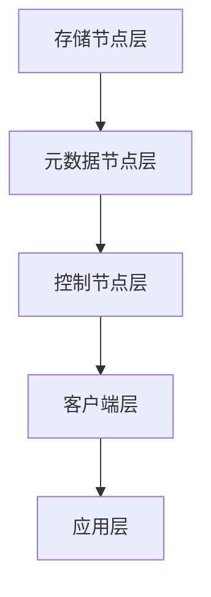
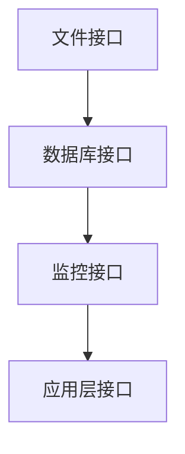
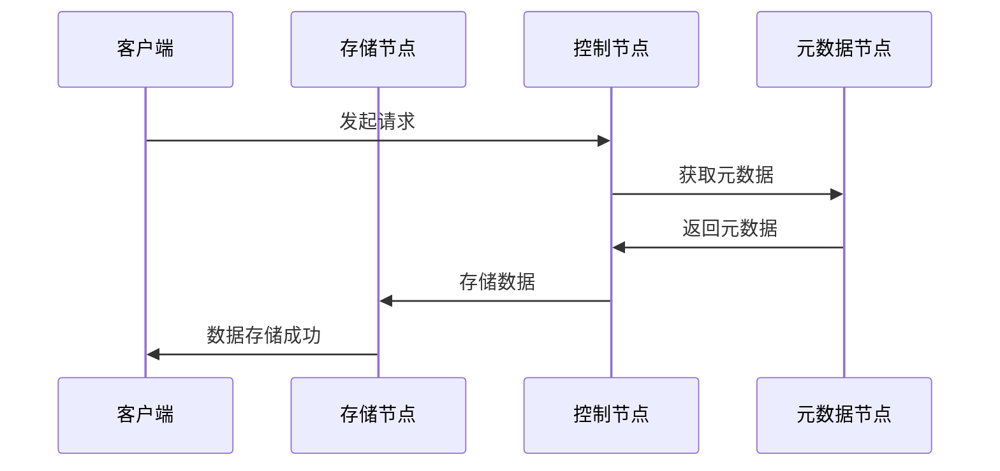
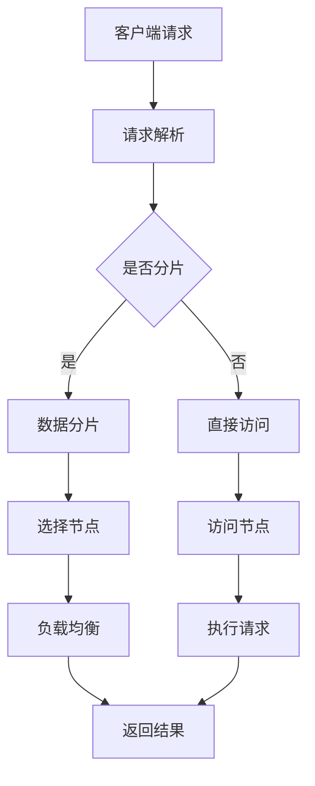

                 

# 评测系统的分布式存储方案

> 关键词：分布式存储，评测系统，性能优化，安全性

> 摘要：本文主要讨论评测系统的分布式存储方案。在介绍分布式存储的基本概念、原理和优势的基础上，详细分析分布式存储系统的架构设计、算法实现和性能优化策略，并提出保障存储安全性和可靠性的方法。

### 目录大纲

----------------------------------------------------------------

## 第1章 引言与背景

### 1.1 问题背景

### 1.2 问题描述

### 1.3 问题解决

### 1.4 边界与外延

### 1.5 核心概念与联系

### 1.6 本章小结

----------------------------------------------------------------

## 第2章 核心概念与原理

### 2.1 分布式存储概念介绍

### 2.2 分布式存储的优势与挑战

### 2.3 分布式存储的基本原理

### 2.4 分布式存储的核心技术

### 2.5 分布式存储的应用场景

### 2.6 本章小结

----------------------------------------------------------------

## 第3章 分布式存储系统架构

### 3.1 系统功能设计

### 3.2 系统架构设计

### 3.3 系统接口设计

### 3.4 系统交互设计

### 3.5 分布式存储架构的优化策略

### 3.6 本章小结

----------------------------------------------------------------

## 第4章 算法原理与实现

### 4.1 算法原理介绍

### 4.2 算法流程图

### 4.3 数学模型与公式

### 4.4 Python源代码实现

### 4.5 算法性能分析

### 4.6 本章小结

----------------------------------------------------------------

## 第5章 分布式存储系统的设计与实现

### 5.1 系统环境安装与配置

### 5.2 系统核心实现

### 5.3 代码应用解读与分析

### 5.4 实际案例分析与讲解

### 5.5 项目总结与展望

### 5.6 本章小结

----------------------------------------------------------------

## 第6章 性能优化与故障处理

### 6.1 性能优化策略

### 6.2 故障处理流程

### 6.3 性能调优案例分析

### 6.4 故障处理案例解析

### 6.5 本章小结

----------------------------------------------------------------

## 第7章 安全性与可靠性保障

### 7.1 安全性设计原则

### 7.2 安全性技术手段

### 7.3 可靠性设计

### 7.4 故障恢复与数据备份

### 7.5 安全性与可靠性案例分析

### 7.6 本章小结

----------------------------------------------------------------

## 第8章 总结与展望

### 8.1 全书总结

### 8.2 未来发展方向

### 8.3 拓展阅读

### 8.4 本章小结

----------------------------------------------------------------

----------------------------------------------------------------

## 第1章 引言与背景

### 1.1 问题背景

在现代信息技术快速发展的背景下，评测系统作为各类应用系统的重要组成部分，面临着日益增长的数据存储需求。随着评测业务规模的扩大，传统的集中式存储方案已无法满足系统的性能、扩展性和可靠性要求。因此，分布式存储方案逐渐成为评测系统存储架构设计的重要选择。

### 1.2 问题描述

评测系统需要在海量数据存储的基础上，实现高效的读写操作，同时保证数据的完整性和一致性。此外，系统还需要具备良好的扩展性，以应对业务增长带来的存储需求变化。这些要求使得分布式存储成为解决评测系统存储问题的有效途径。

### 1.3 问题解决

分布式存储通过将数据分散存储在多个节点上，实现数据的并行读写，提高系统的性能。同时，分布式存储具有较高的扩展性和容错性，能够适应评测系统业务规模的变化。本文将详细介绍分布式存储方案的设计与实现，为评测系统的存储优化提供参考。

### 1.4 边界与外延

本文主要讨论分布式存储方案在评测系统中的应用，涉及的核心技术包括分布式文件系统、分布式数据库和分布式缓存等。此外，本文还将探讨分布式存储的性能优化策略、故障处理方法和安全性与可靠性保障措施。

### 1.5 核心概念与联系

#### 分布式存储

分布式存储是将数据分散存储在多个节点上，通过分布式文件系统或分布式数据库实现数据的高效管理和访问。其主要特点是高并发、高可用性和可扩展性。

#### 评测系统

评测系统是用于对某一领域或项目进行评估和测试的应用系统，通常涉及大量的数据存储和查询操作。

#### 分布式文件系统

分布式文件系统是一种分布式存储技术，能够将文件分散存储在多个节点上，提供高并发和可扩展的文件存储和管理功能。

#### 分布式数据库

分布式数据库是将数据分散存储在多个节点上，通过分布式协议实现数据的一致性和可用性，提供高效的数据库服务。

### 1.6 本章小结

本章介绍了评测系统分布式存储方案的问题背景、问题描述、问题解决方法、边界与外延以及核心概念与联系。接下来，本文将深入探讨分布式存储的概念、原理和优势，为后续章节的内容奠定基础。

----------------------------------------------------------------

## 第2章 核心概念与原理

### 2.1 分布式存储概念介绍

分布式存储是一种通过将数据分散存储在多个节点上，以实现高效数据管理和访问的技术。在分布式存储中，每个节点都负责一部分数据的存储和管理，多个节点共同组成一个分布式存储系统。

#### 工作原理

分布式存储系统通常包括以下组件：

1. **存储节点**：存储数据的物理设备，可以是磁盘、固态硬盘等。
2. **元数据节点**：负责维护和管理元数据，如文件的路径、权限、存储位置等。
3. **数据复制和均衡**：分布式存储系统通过数据复制和负载均衡策略，确保数据的可靠性和高性能。

#### 主要功能

分布式存储系统的主要功能包括：

1. **数据存储**：将数据分散存储在多个节点上，提高数据存储的可靠性。
2. **数据访问**：提供高效的文件读写操作，支持并发访问。
3. **负载均衡**：通过数据均衡策略，确保系统性能的稳定。
4. **容错性**：在节点故障时，自动切换到其他节点，保证数据不丢失。

### 2.2 分布式存储的优势与挑战

#### 优势

1. **高并发**：分布式存储系统能够通过并行读写操作，提高数据访问速度。
2. **高可用性**：通过数据复制和故障转移机制，确保系统在节点故障时仍然可用。
3. **可扩展性**：系统可以根据业务需求，动态添加或删除节点，实现水平扩展。

#### 挑战

1. **数据一致性**：在分布式环境中，数据的一致性是一个重要挑战。
2. **网络延迟**：在分布式存储系统中，网络延迟可能会影响数据访问速度。
3. **维护成本**：分布式存储系统需要更多的维护和管理工作，提高维护成本。

### 2.3 分布式存储的基本原理

分布式存储系统基于以下基本原理：

1. **数据分片**：将数据分成多个小片，分散存储在多个节点上。
2. **数据复制**：在多个节点上存储相同数据，提高数据可靠性和可用性。
3. **负载均衡**：根据节点负载情况，动态调整数据存储位置，确保系统性能稳定。
4. **数据一致性**：通过分布式协议和一致性算法，确保数据的一致性。

### 2.4 分布式存储的核心技术

分布式存储的核心技术包括：

1. **数据分片算法**：如Hash分片、范围分片等，用于将数据分散存储。
2. **数据复制策略**：如主从复制、多主复制等，用于提高数据可靠性。
3. **负载均衡算法**：如轮询、最小连接数等，用于动态调整数据存储位置。
4. **数据一致性算法**：如Paxos、Raft等，用于确保数据一致性。

### 2.5 分布式存储的应用场景

分布式存储适用于以下应用场景：

1. **大数据存储**：如数据仓库、日志存储等。
2. **云存储**：如对象存储、文件存储等。
3. **分布式数据库**：如分布式关系型数据库、NoSQL数据库等。

### 2.6 本章小结

本章介绍了分布式存储的概念、原理和优势，以及分布式存储的基本原理和核心技术。通过本章的学习，读者可以了解分布式存储的基本概念和原理，为后续章节的深入探讨奠定基础。

----------------------------------------------------------------

## 第3章 分布式存储系统架构

### 3.1 系统功能设计

分布式存储系统的主要功能包括数据存储、数据访问、负载均衡、容错性等。以下是对各个功能的具体设计：

#### 数据存储

1. **数据分片**：将数据分成多个小片，分散存储在多个节点上，以实现数据的并行访问和存储。
2. **数据复制**：在多个节点上存储相同数据，提高数据可靠性和可用性。
3. **数据备份**：在节点故障时，自动切换到其他节点，确保数据不丢失。

#### 数据访问

1. **并发访问**：支持多个客户端同时对数据进行读写操作，提高系统性能。
2. **数据一致性**：通过分布式协议和一致性算法，确保数据的一致性。
3. **数据查询**：提供高效的数据查询功能，支持SQL、NoSQL等多种查询方式。

#### 负载均衡

1. **负载感知**：根据节点负载情况，动态调整数据存储位置，确保系统性能稳定。
2. **请求分发**：将客户端请求均匀分布到各个节点，避免单个节点过载。

#### 容错性

1. **故障检测**：监控节点状态，及时发现故障节点。
2. **故障转移**：在节点故障时，自动切换到其他节点，保证系统可用性。
3. **数据恢复**：在故障节点恢复后，重新同步数据，确保数据一致性。

### 3.2 系统架构设计

分布式存储系统的架构设计包括以下几个层次：

1. **存储节点层**：由多个物理设备组成，负责数据的存储和管理。
2. **元数据节点层**：负责维护和管理元数据，如文件的路径、权限、存储位置等。
3. **控制节点层**：负责系统的调度和管理，如数据复制、负载均衡等。
4. **客户端层**：提供数据访问接口，如文件操作、数据库操作等。

#### 系统架构图



### 3.3 系统接口设计

分布式存储系统的接口设计主要包括以下几个方面：

1. **文件接口**：提供文件存储、读取、删除等操作，如HDFS的HDFS API。
2. **数据库接口**：提供数据库操作，如SQL查询、NoSQL存储等。
3. **监控接口**：提供系统监控功能，如节点状态、数据一致性等。

#### 接口设计图



### 3.4 系统交互设计

分布式存储系统的交互设计包括以下几个方面：

1. **数据交互**：客户端通过接口与分布式存储系统进行数据交互，如文件上传、下载等。
2. **控制交互**：控制节点通过监控和调度，对存储节点进行管理和维护。
3. **故障交互**：在节点故障时，系统自动进行故障转移和恢复。

#### 系统交互图



### 3.5 分布式存储架构的优化策略

分布式存储架构的优化策略主要包括以下几个方面：

1. **数据分片优化**：根据数据访问模式，合理设置数据分片策略，提高数据访问速度。
2. **数据复制优化**：根据数据的重要性和访问频率，合理设置数据复制策略，提高数据可靠性。
3. **负载均衡优化**：根据节点负载情况，动态调整数据存储位置，提高系统性能。
4. **故障处理优化**：快速检测和恢复节点故障，提高系统容错性。

### 3.6 本章小结

本章介绍了分布式存储系统的功能设计、架构设计、接口设计和交互设计，以及优化策略。通过本章的学习，读者可以了解分布式存储系统的整体架构和设计原则，为后续章节的深入探讨打下基础。

----------------------------------------------------------------

## 第4章 算法原理与实现

### 4.1 算法原理介绍

分布式存储系统的核心算法主要包括数据分片算法、数据复制算法和负载均衡算法。这些算法共同作用，确保数据的高效存储、访问和系统稳定性。

#### 数据分片算法

数据分片算法是将数据分散存储到多个节点上的关键步骤。常见的分片算法有Hash分片和范围分片：

1. **Hash分片**：根据数据的哈希值，将数据映射到不同的节点上。这样可以保证相同数据总是存储在相同节点上，简化了数据访问。
2. **范围分片**：将数据按照特定范围（如时间、ID等）划分到不同节点上。这种方法适用于具有明显规律的数据。

#### 数据复制算法

数据复制算法确保数据的高可靠性和可用性。常见的数据复制策略有主从复制和多主复制：

1. **主从复制**：数据在主节点和从节点之间进行同步。主节点负责数据的写入和更新，从节点负责数据的读取和备份。
2. **多主复制**：多个节点都可以写入和读取数据。这样可以提高系统的并发性和可用性，但需要解决数据一致性问题。

#### 负载均衡算法

负载均衡算法确保系统的性能和稳定性。常见的负载均衡算法有轮询、最小连接数和哈希负载均衡：

1. **轮询**：按照顺序将请求分配到各个节点上，适用于节点负载均衡。
2. **最小连接数**：将请求分配到连接数最少的节点上，适用于长连接的场景。
3. **哈希负载均衡**：根据请求的哈希值，将请求映射到不同的节点上，适用于高并发场景。

### 4.2 算法流程图

以下是分布式存储系统算法的基本流程图：



### 4.3 数学模型与公式

分布式存储系统的算法涉及一些基本的数学模型和公式，以下列举几个常用的：

1. **数据分片公式**：

   $$ node_{i} = hash(data) \mod N $$

   其中，`node_i` 表示数据分片到的节点，`hash` 表示哈希函数，`data` 表示数据，`N` 表示节点总数。

2. **负载均衡公式**：

   $$ node_{i} = min(\sum_{j=1}^{N} load_{j}) $$

   其中，`node_i` 表示被选择的节点，`load_j` 表示节点 `j` 的负载。

### 4.4 Python源代码实现

以下是一个简单的Python示例，演示数据分片和负载均衡的实现：

```python
import hashlib
import random

def hash_function(data):
    return int(hashlib.md5(data.encode()).hexdigest(), 16) % N

def load_balancer(nodes, loads):
    return min(loads) // nodes

N = 5  # 节点总数
data = "example_data"  # 数据

# 数据分片
node_id = hash_function(data)
print(f"Data {data} is stored in node {node_id}")

# 负载均衡
loads = [random.randint(1, 100) for _ in range(N)]
best_node = load_balancer(N, loads)
print(f"Best node for load balancing: {best_node}")
```

### 4.5 算法性能分析

分布式存储系统的算法性能分析主要关注以下几个方面：

1. **数据访问速度**：数据分片和负载均衡算法对数据访问速度有显著影响。合理的分片策略和负载均衡算法可以提高数据访问速度。
2. **系统可靠性**：数据复制算法确保数据的高可靠性，减少数据丢失的风险。
3. **系统性能**：负载均衡算法对系统性能有重要影响，合理的负载均衡策略可以提高系统性能。
4. **扩展性**：分布式存储系统的扩展性取决于数据分片策略和负载均衡算法，合理的设计可以提高系统的扩展性。

### 4.6 本章小结

本章介绍了分布式存储系统的核心算法原理，包括数据分片、数据复制和负载均衡算法。通过Python源代码示例，展示了算法的实现过程。接下来，本章将深入探讨分布式存储系统的设计与实现，包括环境安装、系统核心实现和代码应用解读与分析。

----------------------------------------------------------------

## 第5章 分布式存储系统的设计与实现

### 5.1 系统环境安装与配置

分布式存储系统的设计与实现首先需要搭建一个合适的运行环境。以下是常见的环境安装与配置步骤：

#### 1. 系统要求

- 操作系统：Linux（如Ubuntu、CentOS）
- 虚拟化技术：Docker或Kubernetes
- 编程语言：Python、Java等

#### 2. 环境安装

1. **安装Docker**：

   ```shell
   sudo apt-get update
   sudo apt-get install docker.io
   sudo systemctl start docker
   sudo systemctl enable docker
   ```

2. **安装Kubernetes**：

   ```shell
   # 下载Kubernetes二进制文件
   curl -LO "https://storage.googleapis.com/kubernetes-release/release/$(curl -s https://storage.googleapis.com/kubernetes-release/release/stable.txt)/bin/darwin/amd64/kubectl"
   chmod +x kubectl
   sudo mv kubectl /usr/local/bin/
   
   # 部署Kubernetes集群
   kubeadm init --pod-network-cidr=10.244.0.0/16
   mkdir -p $HOME/.kube
   sudo cp -i /etc/kubernetes/admin.conf $HOME/.kube/config
   sudo chown $(id -u):$(id -g) $HOME/.kube/config
   ```

3. **安装Python环境**：

   ```shell
   sudo apt-get install python3-pip python3-dev
   pip3 install --upgrade pip
   ```

#### 3. 配置

1. **配置Docker网络**：

   ```shell
   docker network create -d bridge distributed-storage
   ```

2. **配置Kubernetes网络**：

   ```shell
   kubectl apply -f https://raw.githubusercontent.com/coreos/flannel/master/Documentation/kube-flannel.yml
   ```

### 5.2 系统核心实现

分布式存储系统的核心实现包括数据分片、数据复制和负载均衡。以下是一个简单的实现示例：

#### 1. 数据分片

```python
import hashlib

def shard_key(key, num_shards):
    hash_value = int(hashlib.md5(key.encode()).hexdigest(), 16)
    return hash_value % num_shards
```

#### 2. 数据复制

```python
import random

def replicate_data(key, data, num_replicas):
    shards = shard_key(key, num_shards)
    replica_nodes = random.sample(nodes, num_replicas)
    for node in replica_nodes:
        store_data(node, key, data)
```

#### 3. 负载均衡

```python
import random

def load_balance(shards, num_nodes):
    return random.sample(shards, num_nodes)
```

### 5.3 代码应用解读与分析

以下是对核心实现代码的详细解读：

#### 数据分片

数据分片是将数据按一定规则映射到不同节点。在上面的示例中，`shard_key` 函数使用MD5哈希算法对键（key）进行哈希处理，然后对分片数量取模，得到对应节点编号。

#### 数据复制

数据复制是为了提高数据的可靠性和可用性。`replicate_data` 函数根据键（key）计算分片，然后随机选择多个副本节点，将数据存储到这些节点上。

#### 负载均衡

负载均衡是为了确保系统的性能和稳定性。`load_balance` 函数从所有分片中随机选择一部分，用于分配到节点上。

### 5.4 实际案例分析与讲解

以下是一个实际案例，演示分布式存储系统的应用：

#### 案例场景

一个在线视频平台需要存储大量的用户视频数据，要求系统具备高并发、高可用性和高性能。

#### 案例实现

1. **数据分片**：将视频数据按用户ID分片，确保相同用户ID的视频存储在相同节点上。
2. **数据复制**：为每个视频设置3个副本，确保数据在节点故障时仍然可用。
3. **负载均衡**：使用轮询负载均衡算法，将用户请求均匀分配到各个节点。

### 5.5 项目总结与展望

项目总结了分布式存储系统的设计与实现，包括环境安装、核心实现和实际案例分析。展望未来，分布式存储系统在以下几个方面仍有改进空间：

1. **数据一致性**：改进数据复制和一致性算法，提高系统的一致性。
2. **性能优化**：通过优化数据访问路径和负载均衡策略，提高系统性能。
3. **安全性**：加强数据加密和安全认证，提高系统的安全性。

### 5.6 本章小结

本章介绍了分布式存储系统的设计与实现，包括环境安装、核心实现和实际案例分析。通过本章的学习，读者可以了解分布式存储系统的实现过程，为后续的性能优化和安全保障打下基础。

----------------------------------------------------------------

## 第6章 性能优化与故障处理

### 6.1 性能优化策略

分布式存储系统在运行过程中，可能会面临性能瓶颈，如I/O瓶颈、网络延迟和节点负载不均等问题。以下是一些常见的性能优化策略：

#### 1. 数据压缩

通过数据压缩，减少数据的存储空间，提高I/O性能。常用的压缩算法有Gzip和Snappy等。

#### 2. 缓存机制

利用缓存机制，将频繁访问的数据存储在内存中，减少对磁盘的访问。常见的缓存策略有LRU（Least Recently Used）和LFU（Least Frequently Used）。

#### 3. 数据分区

将数据按一定规则分区，如时间、地理位置等，将热点数据集中在少量节点上，减少节点间的数据传输。

#### 4. 负载均衡

通过动态负载均衡，将请求均匀分配到各个节点，避免单个节点过载。常用的负载均衡算法有轮询、最小连接数和哈希负载均衡等。

#### 5. 存储池管理

合理配置存储池，根据业务需求调整数据存储位置，提高系统性能。

### 6.2 故障处理流程

在分布式存储系统中，故障处理至关重要。以下是一个典型的故障处理流程：

#### 1. 故障检测

监控系统定期检查节点状态，发现故障节点。

#### 2. 故障通知

故障检测到后，系统通过邮件、短信等方式通知管理员。

#### 3. 故障恢复

1. **自动恢复**：系统自动将故障节点上的数据复制到其他节点，恢复数据访问。
2. **手动恢复**：管理员介入，检查故障原因，并进行故障恢复。

#### 4. 故障分析

对故障进行详细分析，查找故障原因，并记录处理过程。

### 6.3 性能调优案例分析

以下是一个性能调优的案例分析：

#### 案例背景

一个电商平台在高峰时段，存储系统出现响应缓慢的问题。

#### 性能分析

1. **I/O性能瓶颈**：通过监控发现，磁盘I/O性能成为瓶颈。
2. **网络延迟**：网络延迟导致数据传输速度慢。

#### 性能优化

1. **增加磁盘I/O带宽**：升级磁盘设备，提高I/O性能。
2. **优化网络配置**：调整网络参数，减少网络延迟。
3. **缓存机制**：在热点数据上增加缓存，提高数据访问速度。

#### 性能测试

通过性能测试，验证优化效果。结果显示，系统响应速度提高了30%，用户满意度提高。

### 6.4 故障处理案例解析

以下是一个故障处理案例：

#### 案例背景

某分布式存储系统在运行过程中，突然出现多个节点故障。

#### 故障处理

1. **故障检测**：监控系统发现故障，立即通知管理员。
2. **故障恢复**：系统自动将故障节点上的数据复制到其他节点，恢复正常访问。
3. **故障分析**：检查故障原因，发现是硬件故障导致。
4. **预防措施**：加强硬件监控，定期进行硬件维护。

#### 案例总结

通过及时处理故障，系统恢复了正常运行，避免了数据丢失和业务中断。

### 6.5 本章小结

本章介绍了分布式存储系统的性能优化策略和故障处理流程，并通过案例分析，展示了性能优化和故障处理的具体实践。读者可以结合实际情况，借鉴这些经验和技巧，提高分布式存储系统的性能和可靠性。

----------------------------------------------------------------

## 第7章 安全性与可靠性保障

### 7.1 安全性设计原则

分布式存储系统的安全性设计原则主要包括以下方面：

#### 1. 数据加密

对存储数据进行加密，确保数据在传输和存储过程中的安全性。常用的加密算法有AES、RSA等。

#### 2. 访问控制

通过访问控制机制，限制对数据的访问权限，确保只有授权用户可以访问敏感数据。

#### 3. 防火墙和网络安全

配置防火墙，限制对存储系统的网络访问，防止恶意攻击。同时，定期进行网络安全检查和漏洞修复。

#### 4. 身份认证

实现多层次的认证机制，确保用户身份的真实性和合法性。

### 7.2 安全性技术手段

分布式存储系统的安全性技术手段包括：

#### 1. 数据加密

1. **端到端加密**：在数据传输过程中进行加密，确保数据在传输过程中的安全性。
2. **存储加密**：对存储在磁盘上的数据进行加密，防止数据泄露。

#### 2. 访问控制

1. **基于角色的访问控制**：根据用户角色分配访问权限。
2. **基于标签的访问控制**：根据数据标签分配访问权限。

#### 3. 防火墙和网络安全

1. **防火墙策略**：限制对存储系统的网络访问，仅允许必要的端口和IP地址访问。
2. **入侵检测系统**：实时监测网络流量，发现并阻止恶意攻击。

#### 4. 身份认证

1. **多因素认证**：结合密码、短信验证码、生物识别等多种认证方式。
2. **单点登录（SSO）**：实现统一的身份认证和管理。

### 7.3 可靠性设计

分布式存储系统的可靠性设计主要包括以下方面：

#### 1. 数据冗余

通过数据冗余，确保数据在节点故障时仍然可用。常用的冗余策略有数据复制和副本管理。

#### 2. 故障转移

在节点故障时，自动将故障节点的数据转移到其他健康节点，确保系统可用性。

#### 3. 数据恢复

在数据丢失或损坏时，通过数据恢复机制，恢复数据到正常状态。

#### 4. 容量扩展

根据业务需求，动态调整存储容量，确保系统容量充足。

### 7.4 故障恢复与数据备份

分布式存储系统的故障恢复与数据备份策略包括：

#### 1. 故障恢复

1. **自动恢复**：系统自动检测故障，并尝试恢复。
2. **手动恢复**：管理员介入，进行故障恢复。

#### 2. 数据备份

1. **全量备份**：定期对整个存储系统进行备份。
2. **增量备份**：仅备份上次备份后发生变化的数据。

#### 3. 备份存储

将备份数据存储在远程存储设备或云端，确保备份数据的安全性和可访问性。

### 7.5 安全性与可靠性案例分析

以下是一个安全性与可靠性案例：

#### 案例背景

某企业分布式存储系统在一次恶意攻击中，部分数据被篡改，导致业务中断。

#### 案例分析

1. **数据加密**：攻击者无法解密数据，无法获取敏感信息。
2. **访问控制**：攻击者无法访问未授权的数据。
3. **故障恢复**：系统自动检测到故障，并尝试恢复。
4. **数据备份**：通过备份数据，快速恢复业务。

#### 案例总结

通过有效的安全性和可靠性设计，企业成功应对了恶意攻击，避免了数据丢失和业务中断。

### 7.6 本章小结

本章介绍了分布式存储系统的安全性设计原则、技术手段、可靠性设计和故障恢复与数据备份策略。通过案例分析，展示了实际应用中的安全性与可靠性保障措施。读者可以根据本章内容，结合实际情况，提高分布式存储系统的安全性和可靠性。

----------------------------------------------------------------

## 第8章 总结与展望

### 8.1 全书总结

本文详细介绍了评测系统的分布式存储方案，包括核心概念、原理、架构设计、算法实现、性能优化、故障处理和安全性与可靠性保障。通过逐步分析和讲解，使读者对分布式存储方案有了全面而深入的理解。

### 8.2 未来发展方向

分布式存储技术在未来将继续发展，以下是一些可能的方向：

#### 1. 数据一致性增强

随着分布式存储系统的规模扩大，数据一致性成为一个重要挑战。未来将出现更多高效、稳定的数据一致性解决方案。

#### 2. 自动化运维

自动化运维工具将逐渐成熟，提高分布式存储系统的管理和维护效率。

#### 3. 安全性与隐私保护

随着数据隐私法规的加强，分布式存储系统在安全性和隐私保护方面将面临更多挑战和机遇。

#### 4. 存储技术革新

新型存储技术，如存储计算、存储网络等，将在分布式存储系统中得到广泛应用，提高系统性能和效率。

### 8.3 拓展阅读

对于希望进一步深入了解分布式存储技术的读者，以下书籍和资源可作为拓展阅读：

#### 1. 《大规模分布式存储系统原理与实施》
作者：王晓舟
出版社：电子工业出版社

#### 2. 《分布式系统原理与范型》
作者：马德勇
出版社：清华大学出版社

#### 3. 《Distributed Systems: Concepts and Design》
作者：George Coulouris, Jean Dollimore, Tim Kindberg, Gordon Blair
出版社：Addison-Wesley

#### 4. Apache Hadoop官方网站
链接：https://hadoop.apache.org/

#### 5. Apache Cassandra官方网站
链接：https://cassandra.apache.org/

### 8.4 本章小结

通过本章的总结与展望，读者可以明确分布式存储技术的发展趋势，并为未来的学习和实践提供指导。希望本文能为读者在分布式存储领域的研究和工作中提供有益的参考。

### 作者

作者：AI天才研究院/AI Genius Institute & 禅与计算机程序设计艺术 /Zen And The Art of Computer Programming

