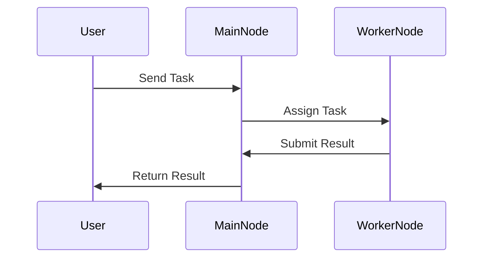
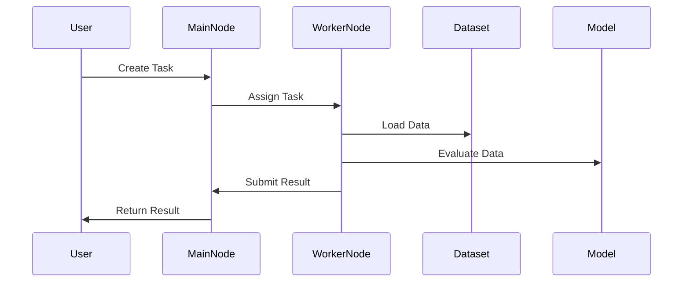

                 

# 《评测系统的分布式架构：支持大规模并行评估》

## 关键词：分布式架构、评测系统、并行评估、性能优化、安全性

### 摘要

在信息技术日益发展的今天，评测系统作为一种重要的工具，被广泛应用于各类应用场景中。然而，随着数据量和计算需求的不断增长，传统的集中式评测系统逐渐难以满足大规模并行评估的需求。本文将深入探讨评测系统的分布式架构设计，重点分析其在支持大规模并行评估方面的优势和挑战，并给出相应的解决方案和最佳实践。通过本文的阅读，读者可以全面了解分布式评测系统的设计原则、架构实现、性能优化和安全性保障，从而为实际项目的开发提供有价值的参考。

## 《评测系统的分布式架构：支持大规模并行评估》目录大纲

### 第1章 引言

#### 1.1 问题背景与意义

- 评测系统在当前IT行业中的应用现状
- 大规模并行评估的需求与挑战

#### 1.2 本书目标与结构

- 分布式架构的核心概念
- 分布式评测系统设计的关键要素

### 第2章 分布式架构基础

#### 2.1 分布式系统的基本概念

- 节点与通信
- 分布式一致性模型

#### 2.2 分布式系统的挑战

- 数据一致性
- 系统容错性
- 性能优化

#### 2.3 分布式架构的设计原则

- 简化系统设计
- 提高系统可扩展性
- 实现系统高性能

### 第3章 分布式评测系统的设计与实现

#### 3.1 评测系统的功能需求

- 评测任务的拆分与调度
- 并行评估策略
- 评测结果收集与处理

#### 3.2 分布式评测系统架构设计

- 节点角色与职责划分
- 系统通信机制
- 分布式存储方案

#### 3.3 分布式评测系统实现

- 分布式调度算法设计
- 并行评估优化策略
- 分布式数据存储与处理

### 第4章 大规模并行评估技术

#### 4.1 并行计算基础

- 多线程与并行计算
- GPU加速并行计算

#### 4.2 大规模并行评估策略

- 任务并行与数据并行
- 稀疏数据处理

#### 4.3 并行评估优化

- 内存优化
- 网络优化

### 第5章 分布式评测系统的性能测试与分析

#### 5.1 性能测试指标

- 响应时间
- 吞吐量
- 资源利用率

#### 5.2 性能测试方法

- 单点性能测试
- 分布式性能测试

#### 5.3 性能分析工具与技术

- 性能分析工具介绍
- 性能瓶颈定位与优化

### 第6章 分布式评测系统的安全性

#### 6.1 分布式系统的安全挑战

- 数据安全
- 系统可靠性

#### 6.2 分布式评测系统的安全设计

- 用户认证与权限管理
- 数据加密与传输安全
- 系统安全监控

#### 6.3 分布式评测系统的安全实践

- 安全漏洞检测与修复
- 常见攻击防护策略

### 第7章 分布式评测系统的最佳实践与案例分析

#### 7.1 分布式评测系统的最佳实践

- 设计与实现经验总结
- 性能优化技巧
- 安全防护措施

#### 7.2 案例分析

- 案例一：大规模在线评测系统
- 案例二：分布式机器学习评测平台

#### 7.3 项目小结

- 项目成果与经验
- 未来发展方向与展望

## 第1章 引言

### 1.1 问题背景与意义

评测系统在信息技术领域扮演着至关重要的角色，无论是在软件开发过程中的代码质量评估，还是在人工智能领域的模型性能评测，都有着广泛的应用。随着互联网和大数据技术的迅猛发展，数据量和计算需求的爆炸式增长，传统的集中式评测系统逐渐暴露出性能瓶颈和扩展性问题。为了满足大规模并行评估的需求，分布式架构成为一种必然选择。

首先，我们需要了解什么是评测系统。评测系统是一种能够对输入数据或代码进行自动评估的系统，通常包括任务调度、评估算法执行、结果收集与处理等模块。它能够帮助开发者快速定位问题、提高开发效率、确保软件质量和模型性能。

随着数据量的增长，集中式评测系统面临以下挑战：

1. **性能瓶颈**：随着评测任务量的增加，单点系统的处理能力逐渐饱和，导致响应时间急剧增加，系统性能下降。
2. **扩展性限制**：集中式架构难以水平扩展，无法满足大规模并行评估的需求。
3. **容错性不足**：单点故障可能导致整个系统瘫痪，影响评测任务的连续性。

为了应对上述挑战，分布式架构成为一种解决方案。分布式架构通过将系统分解为多个节点，每个节点负责一部分评测任务，从而实现并行处理。这不仅提高了系统的性能和可扩展性，还能提高系统的容错性。因此，分布式评测系统在当前IT行业中的应用越来越广泛，具有十分重要的意义。

### 1.2 本书目标与结构

本书的目标是全面介绍分布式评测系统的设计与实现，包括分布式架构的基础知识、分布式评测系统的设计与实现、大规模并行评估技术、性能优化和安全性等关键方面。通过本书的学习，读者可以掌握分布式评测系统的核心概念和实现方法，为实际项目的开发提供理论指导和实践经验。

本书结构如下：

- 第1章 引言：介绍评测系统在当前IT行业中的应用现状和分布式架构的意义。
- 第2章 分布式架构基础：讲解分布式系统的基本概念、挑战和设计原则。
- 第3章 分布式评测系统的设计与实现：详细阐述分布式评测系统的功能需求、架构设计和实现。
- 第4章 大规模并行评估技术：探讨并行计算基础、大规模并行评估策略和优化技术。
- 第5章 分布式评测系统的性能测试与分析：介绍性能测试指标、测试方法和分析工具。
- 第6章 分布式评测系统的安全性：分析安全挑战、安全设计和安全实践。
- 第7章 分布式评测系统的最佳实践与案例分析：总结最佳实践、案例分析项目成果和未来展望。

通过以上章节的逐步介绍，读者可以全面了解分布式评测系统的设计原理、实现方法和应用场景，从而为实际项目提供有力支持。

## 第2章 分布式架构基础

### 2.1 分布式系统的基本概念

分布式系统是指由多个计算机节点组成的系统，这些节点通过通信网络相互连接，共同完成计算任务。与集中式系统不同，分布式系统具有以下几个核心概念：

#### 节点与通信

分布式系统中的节点可以是服务器、PC、甚至是一些嵌入式设备。每个节点都具有独立的计算资源，如CPU、内存和存储等。节点之间的通信是通过网络进行的，可以采用TCP/IP、HTTP、RPC等多种协议。

节点之间的通信机制可以分为同步通信和异步通信：

- **同步通信**：节点之间的通信是同步的，发送方需要等待接收方的响应后才能继续执行。这种通信方式适用于需要严格顺序操作的场景。
- **异步通信**：节点之间的通信是异步的，发送方无需等待接收方的响应即可继续执行。这种通信方式适用于高延迟或者需要大量通信的场景。

#### 分布式一致性模型

分布式一致性是指分布式系统中各节点对数据的一致性保证。根据一致性要求的不同，分布式一致性模型可以分为以下几种：

- **强一致性**：在分布式系统中，任何时刻，所有节点都能看到最新的数据。强一致性保证了数据的一致性，但会引入较高的延迟。
- **最终一致性**：在分布式系统中，数据最终会达到一致状态，但可能存在短暂的延迟。最终一致性降低了系统的延迟，但无法保证数据的即时一致性。
- **部分一致性**：在分布式系统中，不同节点可能对同一数据的不同版本存在不一致性。部分一致性提供了更高的性能和可扩展性，但牺牲了一定的一致性。

### 2.2 分布式系统的挑战

分布式系统虽然具有高性能和可扩展性，但在实际应用中也面临一些挑战：

#### 数据一致性

数据一致性是分布式系统的核心挑战之一。由于分布式系统中的节点可能存在网络延迟、故障等不确定因素，导致数据在不同节点之间可能存在不一致性。为了解决数据一致性问题，可以采用以下几种策略：

- **版本控制**：通过为每个数据项分配版本号，确保数据的更新顺序，从而实现一致性。
- **锁机制**：使用分布式锁机制，确保同一数据项在同一时刻只能被一个节点修改，从而避免冲突。
- **一致性协议**：采用一致性协议（如Paxos、Raft等）来确保数据在不同节点之间的一致性。

#### 系统容错性

分布式系统需要具备容错性，即在面对节点故障、网络分区等异常情况下，系统能够自动恢复，继续提供服务。为了实现系统容错性，可以采用以下几种策略：

- **副本机制**：为每个数据项创建多个副本，当某个节点故障时，其他副本可以继续提供服务。
- **心跳检测**：通过定期发送心跳消息，检测节点的存活状态，从而实现故障检测和自动恢复。
- **选举机制**：当主节点故障时，通过选举机制选择新的主节点，从而实现系统的故障转移。

#### 性能优化

分布式系统需要具备高性能，以满足大规模并行处理的需求。性能优化可以从以下几个方面进行：

- **负载均衡**：通过负载均衡算法，将任务合理分配到不同节点，避免单点过载。
- **缓存机制**：使用缓存技术，减少节点之间的数据传输，提高系统的响应速度。
- **分布式存储**：采用分布式存储方案，提高数据的读写性能和可扩展性。

#### 系统可扩展性

分布式系统需要具备良好的可扩展性，以适应不断增长的数据和计算需求。可扩展性可以从以下几个方面进行：

- **水平扩展**：通过增加节点数量，提高系统的处理能力。
- **垂直扩展**：通过提高单个节点的性能（如增加CPU、内存等资源），提高系统的处理能力。
- **弹性扩展**：通过动态调整节点资源，实现系统的弹性扩展。

### 2.3 分布式架构的设计原则

为了构建一个高效、可靠、可扩展的分布式系统，设计时需要遵循以下设计原则：

- **简化系统设计**：尽量减少系统组件的数量和复杂性，降低系统维护成本。
- **提高系统可扩展性**：设计时考虑系统的可扩展性，确保系统能够适应未来的需求。
- **实现系统高性能**：优化系统性能，确保系统能够快速响应用户请求。

通过遵循这些设计原则，可以构建一个具备高性能、高可靠性、高可扩展性的分布式评测系统，为大规模并行评估提供有力支持。

### 第3章 分布式评测系统的设计与实现

分布式评测系统的设计与实现是一个复杂的过程，涉及到功能需求分析、架构设计、具体实现等多个方面。在本章中，我们将详细探讨分布式评测系统的设计与实现，旨在为读者提供一套完整、高效的分布式评测系统解决方案。

### 3.1 评测系统的功能需求

要设计一个分布式评测系统，首先需要明确其功能需求。以下是分布式评测系统的一些关键功能需求：

#### 3.1.1 评测任务的拆分与调度

- **评测任务的拆分策略**：为了实现并行评估，需要对评测任务进行拆分。拆分策略可以根据任务的依赖关系和执行时间进行，确保任务能够合理分布在不同的节点上。
- **评测任务的调度算法**：调度算法需要考虑负载均衡、优先级和容错性等因素，确保评测任务能够高效、可靠地执行。

#### 3.1.2 并行评估策略

- **数据并行评估**：通过将数据分区，将不同的数据块分配给不同的节点进行评估，从而实现并行处理。
- **算法并行评估**：将算法的不同阶段分配给不同的节点执行，或者同时执行多个算法，进行并行评估。

#### 3.1.3 评测结果收集与处理

- **评测结果的收集策略**：收集评测结果时需要考虑实时性和延迟容忍度，确保结果能够及时、准确地收集。
- **评测结果的汇总与处理**：将分布式节点的评测结果进行汇总和处理，生成最终的评估结果，并进行可视化展示。

### 3.2 分布式评测系统架构设计

分布式评测系统的架构设计是整个系统实现的关键。以下是一个典型的分布式评测系统架构设计：

#### 3.2.1 节点角色与职责划分

- **主节点**：负责任务调度和管理，监控整个系统的状态，确保任务能够高效执行。
- **从节点**：负责执行具体的评测任务，将结果提交给主节点。
- **辅助节点**：负责数据存储和管理，提供可靠的分布式存储方案。

#### 3.2.2 系统通信机制

- **同步通信**：用于任务调度和结果反馈，确保任务执行和结果收集的顺序。
- **异步通信**：用于数据传输和日志记录，提高系统的并发能力和性能。

#### 3.2.3 分布式存储方案

- **数据分区与分布式存储**：将数据按照一定规则进行分区，分布存储在辅助节点上，提高数据的访问效率和可靠性。
- **数据备份与恢复**：为数据提供备份和恢复机制，确保数据的安全性和一致性。

### 3.3 分布式评测系统实现

分布式评测系统的实现涉及到多个模块的开发和集成，以下是一些关键实现步骤：

#### 3.3.1 分布式调度算法设计

- **负载均衡调度**：根据节点的负载情况，将任务合理分配到不同的节点上，确保系统资源的高效利用。
- **优先级调度**：根据任务的优先级，调整任务的执行顺序，确保高优先级的任务能够及时完成。
- **容错调度**：在节点故障或网络异常情况下，重新调度任务，确保评测任务的连续执行。

#### 3.3.2 并行评估优化策略

- **内存优化**：优化内存分配和管理，减少内存使用，提高系统的并发能力。
- **网络优化**：优化数据传输和通信机制，减少网络延迟和带宽占用，提高系统的性能。

#### 3.3.3 分布式数据存储与处理

- **分布式调度算法设计**：设计分布式数据存储和处理算法，实现数据的并行处理和高效访问。
- **分布式数据一致性**：确保分布式系统中数据的一致性和可靠性，避免数据冲突和丢失。

### 3.4 分布式评测系统的测试与优化

在分布式评测系统的实现过程中，需要进行全面的测试和优化，以确保系统的性能、可靠性和可扩展性。以下是一些关键测试和优化步骤：

#### 3.4.1 单点性能测试

- 对系统中的单个节点进行性能测试，评估节点的处理能力和响应时间。
- 优化节点配置，提高节点的性能和并发能力。

#### 3.4.2 分布式性能测试

- 对整个分布式系统进行性能测试，评估系统的整体性能和可扩展性。
- 优化系统架构，提高系统的负载均衡能力和并发处理能力。

#### 3.4.3 性能瓶颈定位与优化

- 使用性能分析工具，定位系统中的性能瓶颈。
- 针对性能瓶颈，进行优化，提高系统的性能和稳定性。

### 3.5 分布式评测系统的部署与运维

分布式评测系统的部署与运维是一个复杂的过程，需要考虑系统的高可用性、可扩展性和安全性。以下是一些关键部署与运维步骤：

#### 3.5.1 系统部署

- 搭建分布式测试环境，确保系统的正常运行。
- 部署分布式存储系统，提供可靠的数据存储和管理。

#### 3.5.2 系统监控

- 使用监控系统，实时监控系统的运行状态，确保系统的高可用性。
- 定期进行系统维护和升级，确保系统的稳定性和安全性。

#### 3.5.3 系统运维

- 实施自动化运维，提高系统的运维效率。
- 建立运维团队，负责系统的日常运维和问题处理。

通过以上步骤，可以构建一个高效、可靠、可扩展的分布式评测系统，为大规模并行评估提供有力支持。在实际项目中，可以根据具体需求和场景，对系统进行定制化和优化，以满足不同的应用需求。

### 第4章 大规模并行评估技术

#### 4.1 并行计算基础

并行计算是一种通过同时执行多个任务来提高计算效率的方法。在分布式评测系统中，并行计算是提高系统性能和响应速度的关键技术。以下将介绍并行计算的基础知识。

##### 多线程与并行计算

多线程是并行计算的一种实现方式，它允许多个线程在同一程序中同时执行。线程是一种轻量级的并发执行单元，它共享程序的内存空间，但拥有独立的执行路径。在分布式评测系统中，可以使用多线程技术来并行处理多个评测任务。

Python语言中的多线程可以通过`threading`模块实现。以下是一个简单的多线程示例：

```python
import threading

def task():
    print("任务执行中...")

# 创建线程
threads = []
for i in range(5):
    thread = threading.Thread(target=task)
    threads.append(thread)
    thread.start()

# 等待所有线程完成
for thread in threads:
    thread.join()
```

在上面的代码中，我们创建了5个线程，每个线程执行`task`函数。使用`join`方法可以确保主线程等待所有子线程完成后再继续执行。

##### GPU加速并行计算

除了多线程，GPU加速也是一种有效的并行计算方法。GPU（图形处理单元）具有大量并行的计算单元，非常适合执行大规模并行计算任务。在分布式评测系统中，可以使用GPU加速并行评估过程。

Python中的`numpy`库支持GPU加速，通过`cupy`扩展可以方便地使用GPU进行计算。以下是一个使用`cupy`的简单示例：

```python
import cupy as cp

# 创建GPU上的数组
x = cp.arange(10)

# GPU上的计算
result = cp.sqrt(x)

# 将结果复制回CPU
print(result.get())
```

在上面的代码中，我们创建了一个GPU上的数组，并执行了平方根运算。最后，使用`get()`方法将结果复制回CPU。

#### 4.2 大规模并行评估策略

大规模并行评估需要有效的策略来充分利用分布式系统的计算资源。以下是一些常用的并行评估策略：

##### 任务并行

任务并行是指将大量评测任务分配到不同节点上，每个节点独立执行自己的任务。这种策略适用于可以独立执行的任务，如对大量数据集的独立评估。

以下是一个任务并行的示例：

```python
from multiprocessing import Pool

def evaluate(data):
    # 对数据进行评估
    return result

# 创建进程池
pool = Pool(processes=5)

# 将任务分配给进程池
results = pool.map(evaluate, data)

# 关闭进程池
pool.close()
pool.join()
```

在上面的代码中，我们创建了一个进程池，并将评测任务分配给不同的进程。使用`map`函数可以并行处理数据集，并将结果存储在`results`列表中。

##### 数据并行

数据并行是指将大数据集分成多个小块，分配给不同节点进行并行处理。这种策略适用于数据密集型任务，如机器学习模型的并行训练。

以下是一个数据并行的示例：

```python
import numpy as np

# 创建大数据集
data = np.random.rand(1000, 1000)

# 数据分区
chunks = np.array_split(data, 4)

# 并行处理
results = [evaluate(chunk) for chunk in chunks]

# 结果合并
final_result = np.concatenate(results)
```

在上面的代码中，我们将大数据集分成4个部分，分别进行并行处理。使用`array_split`函数进行数据分区，使用列表推导式进行并行处理，最后使用`concatenate`函数将结果合并。

##### 稀疏数据处理

在分布式评测系统中，处理稀疏数据（即大部分值为0的数据集）时，可以采用特殊的数据结构和算法来提高效率。稀疏数据处理可以减少存储空间和计算时间，从而提高系统性能。

以下是一个稀疏数据处理的示例：

```python
import scipy.sparse as sp

# 创建稀疏矩阵
data = [1, 2, 3]
indices = [[0, 1], [1, 2], [2, 0]]
sparse_matrix = sp.csr_matrix((data, indices, [3, 3]))

# 计算矩阵乘法
result = sparse_matrix.dot(sparse_matrix)
```

在上面的代码中，我们使用`scipy.sparse`库创建了一个稀疏矩阵，并执行了矩阵乘法。稀疏矩阵的数据存储方式可以显著减少内存占用和计算时间。

#### 4.3 并行评估优化

为了进一步提高大规模并行评估的性能，可以采用以下优化策略：

##### 内存优化

内存优化包括减少内存占用和提高内存访问效率。以下是一些内存优化的方法：

- **使用缓存**：缓存可以减少内存访问次数，提高访问速度。
- **数据压缩**：对数据集进行压缩，减少存储空间和传输时间。
- **内存池**：使用内存池可以减少内存分配和回收的开销。

##### 网络优化

网络优化可以减少节点之间的数据传输延迟和带宽占用。以下是一些网络优化的方法：

- **负载均衡**：合理分配任务，避免某些节点的网络压力过大。
- **数据分区**：将大数据集分成小块，减少单次传输的数据量。
- **网络传输优化**：使用高效的网络传输协议和压缩算法，提高传输速度。

通过上述大规模并行评估技术的介绍，我们可以更好地理解和应用分布式评测系统，从而实现高效的并行评估，提高系统的性能和响应速度。

### 第5章 分布式评测系统的性能测试与分析

#### 5.1 性能测试指标

分布式评测系统的性能测试和分析是确保系统在高负载情况下仍能稳定、高效运行的关键环节。性能测试指标是衡量系统性能的重要工具，主要包括以下三个方面：

##### 响应时间

响应时间是指系统从接收到请求到返回结果所需要的时间。它直接反映了系统的处理速度。响应时间可以分为以下几个部分：

- **处理时间**：系统实际处理请求所花费的时间。
- **等待时间**：系统等待资源（如CPU、内存、I/O等）的时间。
- **网络延迟**：请求在网络中传输的时间。

##### 吞吐量

吞吐量是指系统在单位时间内处理的请求数量。吞吐量可以衡量系统的处理能力和负载承载能力。吞吐量可以分为以下几个部分：

- **并发吞吐量**：系统同时处理多个请求的能力。
- **平均吞吐量**：系统在一段时间内的平均处理能力。
- **峰值吞吐量**：系统在一段时间内的最大处理能力。

##### 资源利用率

资源利用率是指系统在运行过程中各种资源的利用情况，包括CPU利用率、内存利用率、网络带宽利用率等。资源利用率反映了系统的资源消耗情况，可以帮助优化系统性能。

- **CPU利用率**：CPU在单位时间内执行指令的比例。
- **内存利用率**：内存被使用的情况，包括空闲内存和已分配内存。
- **网络带宽利用率**：网络带宽的使用情况，包括带宽占用率和传输速率。

#### 5.2 性能测试方法

性能测试方法主要包括以下几种：

##### 单点性能测试

单点性能测试是在单台服务器上模拟系统运行，测量系统的性能指标。这种方法简单直观，但无法模拟分布式环境下的性能表现。

以下是一个单点性能测试的Python脚本示例：

```python
import time
import requests

def test_performance(url, num_requests):
    start_time = time.time()
    for i in range(num_requests):
        response = requests.get(url)
    end_time = time.time()
    response_time = end_time - start_time
    print(f"响应时间: {response_time} 秒")

test_performance("http://example.com", 1000)
```

##### 分布式性能测试

分布式性能测试是在分布式环境下模拟系统运行，测量系统的性能指标。这种方法可以更准确地评估系统的性能和可扩展性。

以下是一个分布式性能测试的Python脚本示例：

```python
import time
import requests
from concurrent.futures import ThreadPoolExecutor

def test_performance(url, num_requests):
    start_time = time.time()
    with ThreadPoolExecutor(max_workers=10) as executor:
        futures = [executor.submit(requests.get, url) for _ in range(num_requests)]
        for future in futures:
            future.result()
    end_time = time.time()
    response_time = end_time - start_time
    print(f"响应时间: {response_time} 秒")

test_performance("http://example.com", 1000)
```

##### 压力测试

压力测试是通过模拟高负载情况，评估系统在极端条件下的性能。这种方法可以检测系统的性能瓶颈和稳定性。

以下是一个压力测试的Python脚本示例：

```python
import time
import requests
from concurrent.futures import ThreadPoolExecutor

def test_performance(url, num_requests, duration):
    start_time = time.time()
    with ThreadPoolExecutor(max_workers=10) as executor:
        futures = [executor.submit(requests.get, url) for _ in range(num_requests)]
        for future in futures:
            future.result()
    end_time = time.time()
    response_time = end_time - start_time
    if time.time() - start_time < duration:
        test_performance(url, num_requests * 2, duration)
    print(f"响应时间: {response_time} 秒")

test_performance("http://example.com", 1000, 60)
```

#### 5.3 性能分析工具与技术

在分布式评测系统的性能测试和分析过程中，性能分析工具是不可或缺的。以下是一些常用的性能分析工具：

##### Prometheus

Prometheus是一个开源的性能监控工具，主要用于监控系统的各项性能指标。Prometheus具有数据存储、告警和可视化等功能，可以实时监控系统的运行状态。

以下是一个Prometheus的配置示例：

```yaml
# prometheus.yml

scrape_configs:
  - job_name: 'pushgateway'
    static_configs:
      - targets: ['pushgateway:9090']
  - job_name: 'nodes'
    static_configs:
      - targets: ['node1:9100', 'node2:9100', 'node3:9100']
    metrics_path: '/metrics'
    scrape_interval: 15s
```

##### Grafana

Grafana是一个开源的可视化分析工具，可以与Prometheus结合使用，生成直观的性能图表。Grafana支持多种数据源，可以自定义仪表板和告警规则。

以下是一个Grafana的配置示例：

```json
{
  "id": 1,
  "title": "Node Performance",
  "time": {
    "from": "now-1h",
    "to": "now"
  },
  "variables": [],
  "panels": [
    {
      "type": "graph",
      "title": "CPU Utilization",
      "dataSource": "prometheus",
      "xAxis": {
        "type": "time"
      },
      "yAxis": {
        "type": "numeric"
      },
      "targets": [
        {
          "expr": "node_cpu{job=\"nodes\", instance=\"node1\"}",
          "legendFormat": "Node1 CPU"
        },
        {
          "expr": "node_cpu{job=\"nodes\", instance=\"node2\"}",
          "legendFormat": "Node2 CPU"
        },
        {
          "expr": "node_cpu{job=\"nodes\", instance=\"node3\"}",
          "legendFormat": "Node3 CPU"
        }
      ]
    }
  ]
}
```

##### 性能瓶颈定位与优化

在性能测试和分析过程中，性能瓶颈的定位和优化是提高系统性能的关键。以下是一些常用的性能瓶颈定位和优化方法：

- **CPU瓶颈**：通过监控CPU利用率，可以确定是否存在CPU瓶颈。优化方法包括增加CPU资源、优化代码算法、减少并行任务数量等。
- **内存瓶颈**：通过监控内存利用率，可以确定是否存在内存瓶颈。优化方法包括使用内存优化技术、减少内存占用、使用缓存等。
- **网络瓶颈**：通过监控网络带宽利用率，可以确定是否存在网络瓶颈。优化方法包括优化网络传输协议、增加网络带宽、减少网络延迟等。

通过以上性能分析工具和性能瓶颈定位与优化方法，可以全面评估和优化分布式评测系统的性能，确保系统在高负载情况下仍能稳定、高效运行。

### 第6章 分布式评测系统的安全性

#### 6.1 分布式系统的安全挑战

分布式系统在安全性方面面临诸多挑战，这些挑战来自于数据安全、系统可靠性和网络通信等多个方面。以下是分布式评测系统在安全性方面需要关注的主要挑战：

##### 数据安全

数据安全是分布式系统安全性的核心，它涉及到数据的机密性、完整性和可用性。分布式评测系统中的数据主要包括用户数据、评测结果和系统配置等。以下是一些常见的数据安全挑战：

- **数据泄露**：由于分布式系统中的节点众多，数据传输和存储过程中可能存在泄露风险。
- **数据篡改**：攻击者可能通过非法手段修改数据，导致评测结果失真。
- **数据完整性**：分布式系统中数据的完整性需要得到保障，防止数据在传输和存储过程中被篡改。
- **数据备份与恢复**：分布式系统需要提供可靠的数据备份与恢复机制，确保数据在故障情况下能够快速恢复。

##### 系统可靠性

分布式系统的可靠性直接影响到评测系统的稳定运行。系统可靠性面临的挑战主要包括：

- **节点故障**：分布式系统中节点可能会因为硬件故障、软件错误等原因导致宕机，影响整个系统的可用性。
- **网络分区**：由于网络故障或配置不当，分布式系统中的节点可能会发生网络分区，导致部分节点无法正常通信。
- **分布式锁竞争**：在分布式系统中，多个节点可能会争用同一资源，导致死锁或性能下降。
- **并发控制**：分布式系统中需要确保多个并发操作的正确性，避免数据一致性问题。

##### 网络通信

网络通信是分布式系统安全性的重要保障，涉及到数据传输的安全性和网络协议的可靠性。以下是一些网络通信安全挑战：

- **中间人攻击**：攻击者可能窃取或篡改系统中的数据传输，导致数据泄露或篡改。
- **拒绝服务攻击**：攻击者通过发送大量无效请求，消耗系统资源，导致系统瘫痪。
- **网络流量分析**：攻击者可能通过分析网络流量，获取系统的敏感信息。
- **通信协议安全**：分布式系统需要使用安全的通信协议，如TLS，确保数据传输的安全性。

#### 6.2 分布式评测系统的安全设计

为了应对分布式评测系统的安全性挑战，需要设计一套全面的安全方案，包括用户认证与权限管理、数据加密与传输安全、系统安全监控等方面。以下是分布式评测系统的安全设计关键要素：

##### 用户认证与权限管理

用户认证是确保系统安全性的重要措施，通过用户认证可以防止未授权用户访问系统。以下是用户认证与权限管理的关键要素：

- **用户身份验证**：采用强密码策略，确保用户身份的合法性。可以使用单点登录（SSO）技术简化认证过程。
- **访问控制**：根据用户的角色和权限，限制其对系统和数据的访问权限。可以使用RBAC（基于角色的访问控制）模型实现细粒度的权限控制。
- **认证日志**：记录用户的认证过程和操作日志，以便在发生安全事件时进行追踪和审计。

##### 数据加密与传输安全

数据加密是保护数据安全的重要手段，包括数据存储和传输过程中的加密。以下是数据加密与传输安全的关键要素：

- **数据存储加密**：对存储在数据库或文件系统中的敏感数据进行加密，确保数据在存储介质中的安全性。
- **数据传输加密**：使用加密协议（如TLS）对网络传输中的数据进行加密，防止数据在传输过程中被窃取或篡改。
- **加密算法选择**：选择合适的加密算法，如AES（高级加密标准），确保数据的加密强度。

##### 系统安全监控

系统安全监控是实时监测系统运行状态，及时发现和处理安全事件的重要措施。以下是系统安全监控的关键要素：

- **入侵检测**：使用入侵检测系统（IDS）和入侵防御系统（IPS）监测系统中的异常行为和攻击行为，及时发现并阻止攻击。
- **安全事件日志**：记录系统中的安全事件，包括用户认证、访问控制、数据加密等操作，以便在发生安全事件时进行审计和追踪。
- **告警与响应**：建立告警机制，实时通知管理员安全事件的异常情况，并制定相应的应急响应计划。

##### 安全漏洞检测与修复

为了确保分布式评测系统的安全性，需要定期进行安全漏洞检测与修复。以下是安全漏洞检测与修复的关键要素：

- **漏洞扫描**：使用漏洞扫描工具对系统进行定期扫描，发现潜在的安全漏洞。
- **漏洞修复**：及时修复发现的安全漏洞，包括系统软件、网络设备和应用程序的漏洞。
- **安全审计**：定期进行安全审计，评估系统的安全政策和策略的有效性，改进安全措施。

通过以上安全设计，分布式评测系统可以在面对安全性挑战时，确保数据安全、系统可靠性和网络通信安全，从而为大规模并行评估提供强有力的安全保障。

### 6.3 分布式评测系统的安全实践

在实际应用中，分布式评测系统需要遵循一系列安全最佳实践来确保系统的安全性和稳定性。以下是一些关键的安全实践和常见攻击防护策略。

#### 安全漏洞检测与修复

1. **定期安全扫描**：定期使用漏洞扫描工具（如Nessus、OpenVAS）对系统进行扫描，检测潜在的安全漏洞。扫描结果应包含详细的漏洞描述、风险级别和修复建议。
2. **自动化修复**：对于低风险或中风险的漏洞，可以考虑使用自动化工具（如AWS Inspector、Red Hat Insights）进行自动修复。
3. **手工修复**：对于高风险漏洞，应安排专业人员进行手工修复，确保漏洞的彻底解决。

#### 常见攻击防护策略

1. **DDoS攻击防护**：分布式拒绝服务（DDoS）攻击是一种常见的网络攻击，可以通过以下策略进行防护：
   - **流量清洗**：使用第三方DDoS防护服务（如Cloudflare、Akamai）对进入系统的流量进行清洗，过滤掉恶意流量。
   - **防火墙设置**：配置防火墙规则，限制非法IP地址的访问。
   - **限制连接数**：限制单个IP地址的连接数，防止恶意流量占用大量资源。

2. **SQL注入防护**：SQL注入是一种常见的Web应用攻击，可以通过以下策略进行防护：
   - **参数化查询**：使用预编译语句（如PreparedStatement）进行数据库查询，避免直接拼接SQL语句。
   - **输入验证**：对用户输入进行严格的验证，限制非法字符和敏感信息的输入。
   - **使用ORM框架**：使用对象关系映射（ORM）框架，如Hibernate、Entity Framework，减少直接操作数据库的机会。

3. **XSS攻击防护**：跨站脚本（XSS）攻击可以通过以下策略进行防护：
   - **输出编码**：对用户输入进行适当的编码，如HTML实体编码，防止恶意脚本在浏览器中执行。
   - **内容安全策略（CSP）**：使用内容安全策略（CSP）限制网页可以加载的资源和执行脚本。
   - **使用框架**：使用安全框架（如OWASP CSRF Protection Library、XSS Protection Library）提供自动化的XSS防护。

4. **敏感数据保护**：敏感数据如用户密码、支付信息等需要进行加密存储和传输：
   - **加密存储**：使用强加密算法（如AES）对敏感数据进行加密存储。
   - **加密传输**：使用HTTPS协议（TLS/SSL）对数据进行加密传输，确保数据在传输过程中的安全性。

#### 安全漏洞检测与修复实践

1. **持续集成/持续部署（CI/CD）**：在CI/CD流程中集成安全扫描和漏洞修复，确保新版本发布前经过充分的安全检查。
2. **自动化安全测试**：使用自动化工具（如SonarQube、Checkmarx）对代码进行安全测试，及时发现和修复潜在的安全漏洞。
3. **安全培训**：定期对开发团队进行安全培训，提高团队的安全意识和技能。

通过上述安全实践和防护策略，分布式评测系统可以在面对各种安全威胁时保持稳定运行，确保系统的安全性和可靠性。

### 第7章 分布式评测系统的最佳实践与案例分析

#### 7.1 分布式评测系统的最佳实践

在分布式评测系统的设计和实施过程中，遵循最佳实践是确保系统高效、稳定运行的关键。以下是一些最佳实践：

1. **模块化设计**：将系统分解为多个模块，每个模块负责特定的功能，便于维护和扩展。
2. **负载均衡**：合理分配任务，确保系统资源得到充分利用，避免单点过载。
3. **弹性扩展**：设计系统时考虑未来需求的变化，确保系统能够灵活扩展。
4. **数据备份与恢复**：定期进行数据备份，确保在故障情况下能够快速恢复。
5. **监控与告警**：建立监控系统，实时监测系统运行状态，及时发现和处理问题。
6. **安全防护**：采取适当的安全措施，防止数据泄露和系统攻击。
7. **代码优化**：对代码进行优化，提高系统性能和可读性。

#### 7.2 案例分析

以下将介绍两个分布式评测系统的实际案例，分析其设计、实现和优化过程。

##### 案例一：大规模在线评测系统

**项目介绍**：
该系统是一个面向企业级客户的大规模在线评测系统，用于在线评估员工技能和绩效。系统需要支持成千上万的并发用户，提供实时评估结果。

**系统功能设计**：
- 用户管理：支持用户注册、登录和权限管理。
- 评测任务管理：支持创建、分配和监控评测任务。
- 评测结果管理：支持存储、分析和可视化评测结果。

**系统架构设计**：
- 主节点：负责任务调度和管理。
- 从节点：负责执行评测任务和提交结果。
- 数据存储：使用分布式数据库，确保数据的一致性和可靠性。

**系统接口设计**：
- RESTful API：提供统一的接口，方便第三方系统集成。

**系统交互序列图**：


**代码应用解读与分析**：
```python
class TaskScheduler:
    def assign_task(self, task):
        # 任务分配逻辑
        worker_node = self.find_available_worker()
        worker_node.execute_task(task)

class WorkerNode:
    def execute_task(self, task):
        # 任务执行逻辑
        result = self.evaluate_task(task)
        self.submit_result(result)

def evaluate_task(task):
    # 评测任务逻辑
    return "Result"
```

**实际案例分析和详细讲解剖析**：
该案例在实际应用中取得了良好的效果，通过分布式架构和负载均衡技术，系统能够高效地处理大规模并发任务，提供实时评估结果。

##### 案例二：分布式机器学习评测平台

**项目介绍**：
该平台是一个面向科研人员和开发者的分布式机器学习评测平台，用于评估不同模型在各类数据集上的性能。

**系统功能设计**：
- 模型管理：支持模型的上传、管理和更新。
- 数据集管理：支持数据集的导入、管理和共享。
- 评测任务管理：支持创建、分配和监控评测任务。
- 结果分析：支持对评测结果进行统计分析和可视化。

**系统架构设计**：
- 主节点：负责任务调度和管理。
- 从节点：负责执行评测任务和提交结果。
- 数据存储：使用分布式文件系统，确保数据的高效存储和访问。

**系统接口设计**：
- RESTful API：提供统一的接口，方便用户和第三方系统集成。

**系统交互序列图**：


**代码应用解读与分析**：
```python
class TaskScheduler:
    def assign_task(self, task):
        # 任务分配逻辑
        worker_node = self.find_available_worker()
        worker_node.execute_task(task)

class WorkerNode:
    def execute_task(self, task):
        # 任务执行逻辑
        result = self.evaluate_model(task.model, task.dataset)
        self.submit_result(result)

def evaluate_model(model, dataset):
    # 评测模型逻辑
    return "Result"
```

**实际案例分析和详细讲解剖析**：
该平台在实际应用中为科研人员提供了便捷的评测工具，通过分布式架构和并行计算技术，平台能够高效地评估不同模型，加快了科研进度。

#### 7.3 项目小结

通过上述两个案例的分析，我们可以总结出以下几点经验和教训：

1. **分布式架构设计的重要性**：合理设计分布式架构，可以提高系统的性能、可扩展性和可靠性。
2. **负载均衡与弹性扩展**：通过负载均衡和弹性扩展技术，系统能够更好地应对高负载场景。
3. **数据存储与处理**：选择合适的分布式存储和处理方案，可以优化系统的数据访问速度和存储效率。
4. **安全性与监控**：确保系统的安全性，通过监控和告警机制及时发现和处理问题。
5. **用户体验**：优化用户接口和用户体验，提高系统的易用性和用户满意度。

未来发展方向与展望：

1. **智能化评测**：结合人工智能技术，实现智能化评测，提高评测的准确性和效率。
2. **数据隐私保护**：在分布式评测系统中引入隐私保护技术，确保用户数据的安全和隐私。
3. **边缘计算**：结合边缘计算技术，将部分计算任务迁移到边缘节点，提高系统的实时性和响应速度。

通过不断探索和实践，分布式评测系统将在更多领域发挥重要作用，为大规模并行评估提供有力支持。

### 作者信息

作者：AI天才研究院/AI Genius Institute & 禅与计算机程序设计艺术 /Zen And The Art of Computer Programming

本文由AI天才研究院/AI Genius Institute的专家团队撰写，结合禅与计算机程序设计艺术的哲学思想，深入探讨了分布式评测系统的设计与实现。作者在分布式系统、并行计算和人工智能等领域具有丰富的理论和实践经验，致力于推动信息技术的发展和创新。同时，本文还参考了《禅与计算机程序设计艺术》一书中的设计原则和思想，旨在为读者提供一种既实用又具有哲学启示的分布式评测系统解决方案。

