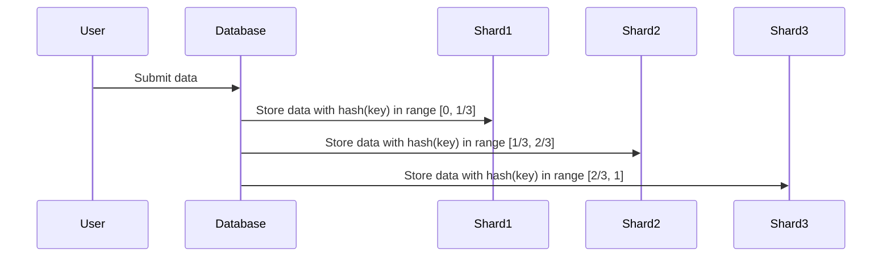
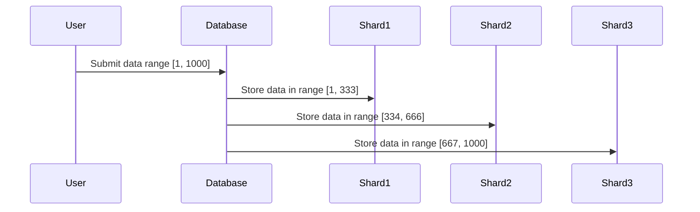
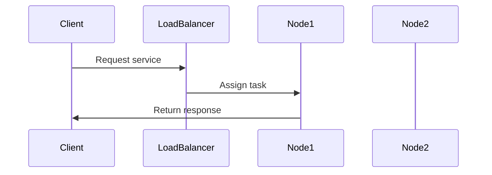
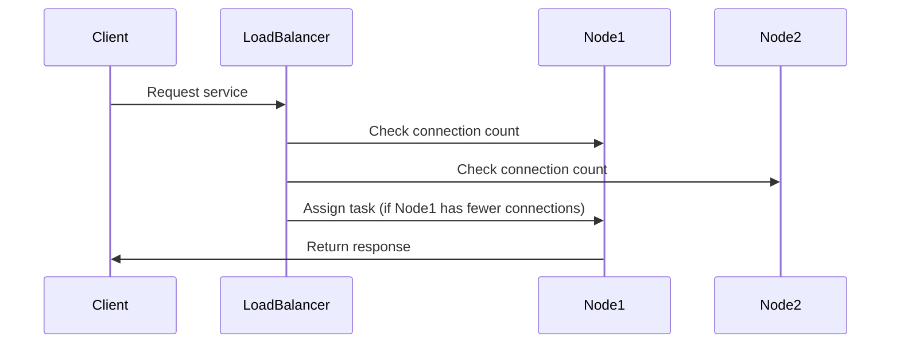
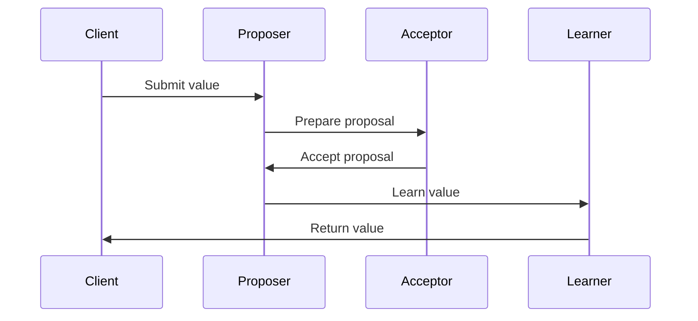
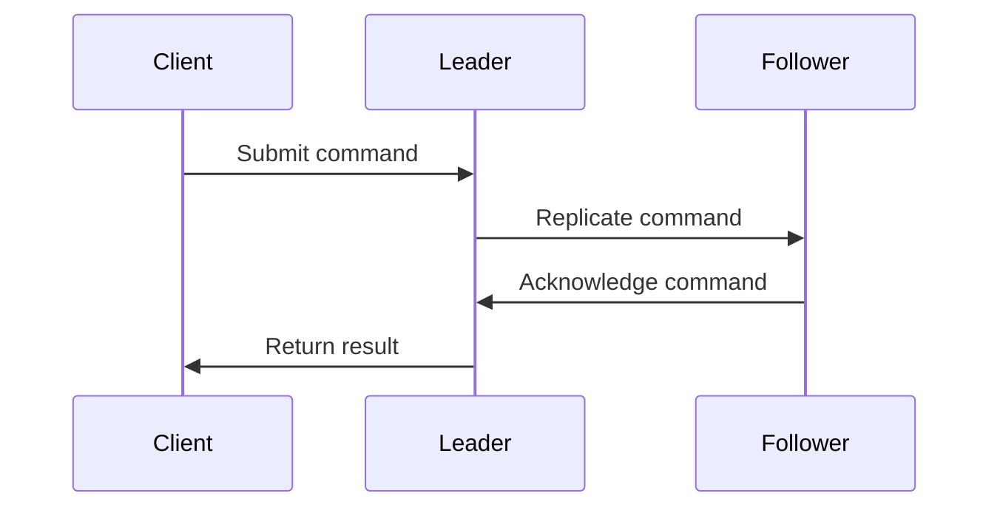
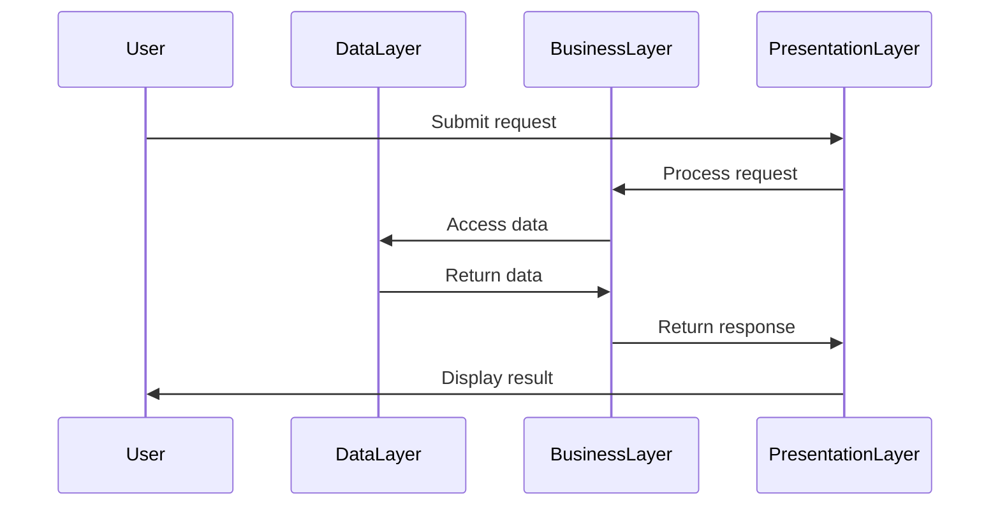
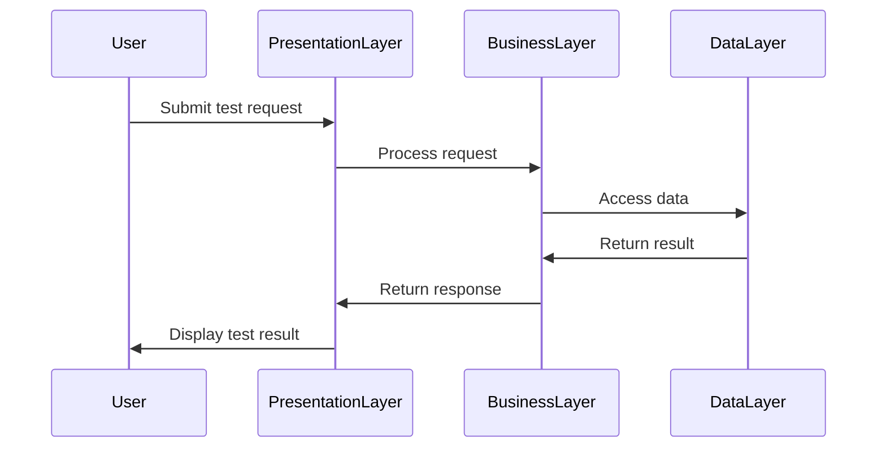

                 

# 《评测系统的分布式架构：支持大规模并行评测的设计》

## 关键词
- 评测系统
- 分布式架构
- 并行评测
- 大规模数据处理
- 性能优化

## 摘要
本文旨在探讨评测系统在分布式架构下的设计方法，特别是在处理大规模并行评测任务时的优化策略。通过深入分析分布式架构的基本原理、核心算法以及实际应用案例，本文提出了一个高效、可扩展的评测系统架构设计方案，旨在提升评测系统的性能和可靠性。

## 目录大纲

### 第一部分：背景介绍

#### 1.1 评测系统的定义与作用
##### 1.1.1 评测系统的概念
##### 1.1.2 评测系统在信息处理中的应用

#### 1.2 分布式架构的概念
##### 1.2.1 分布式系统的基本原理
##### 1.2.2 分布式架构的优点与挑战

#### 1.3 大规模并行评测的需求
##### 1.3.1 评测系统面临的挑战
##### 1.3.2 分布式架构在评测系统中的应用

#### 1.4 边界与外延
##### 1.4.1 评测系统的性能指标
##### 1.4.2 分布式架构的实现细节

#### 1.5 概念结构与核心要素组成
##### 1.5.1 分布式评测系统的架构设计
##### 1.5.2 并行评测的核心算法与优化

#### 1.6 本章小结

### 第二部分：核心概念与联系

#### 2.1 分布式架构中的核心概念
##### 2.1.1 节点与网络
##### 2.1.2 数据分片与负载均衡
##### 2.1.3 分布式一致性算法

#### 2.2 并行评测的核心算法
##### 2.2.1 并行化策略
##### 2.2.2 数据依赖与并行度分析
##### 2.2.3 算法性能优化

#### 2.3 概念属性特征对比表格
##### 2.3.1 分布式架构的优势与劣势
##### 2.3.2 并行评测算法的优缺点分析

#### 2.4 ER实体关系图架构
##### 2.4.1 实体与关系的定义
##### 2.4.2 分布式评测系统的ER图

#### 2.5 本章小结

### 第三部分：算法原理讲解

#### 3.1 分布式架构算法原理
##### 3.1.1 数据分片算法
##### 3.1.2 负载均衡算法
##### 3.1.3 分布式一致性算法原理

#### 3.2 并行评测算法
##### 3.2.1 并行化策略
##### 3.2.2 数据依赖与并行度分析
##### 3.2.3 算法性能优化

#### 3.3 数学模型和公式
##### 3.3.1 数据分片算法的数学模型
##### 3.3.2 负载均衡算法的数学模型
##### 3.3.3 分布式一致性算法的数学模型

#### 3.4 举例说明
##### 3.4.1 数据分片算法举例
##### 3.4.2 负载均衡算法举例
##### 3.4.3 分布式一致性算法举例

#### 3.5 本章小结

### 第四部分：系统分析与架构设计方案

#### 4.1 问题场景介绍
##### 4.1.1 评测系统的应用场景
##### 4.1.2 分布式架构的需求分析

#### 4.2 项目介绍
##### 4.2.1 项目背景
##### 4.2.2 项目目标

#### 4.3 系统功能设计
##### 4.3.1 领域模型
##### 4.3.2 功能模块划分

#### 4.4 系统架构设计
##### 4.4.1 总体架构设计
##### 4.4.2 分布式架构细节

#### 4.5 系统接口设计
##### 4.5.1 接口规范
##### 4.5.2 接口实现

#### 4.6 系统交互
##### 4.6.1 系统交互流程
##### 4.6.2 交互序列图

#### 4.7 本章小结

### 第五部分：项目实战

#### 5.1 环境安装
##### 5.1.1 环境准备
##### 5.1.2 系统部署

#### 5.2 系统核心实现源代码
##### 5.2.1 源代码结构
##### 5.2.2 核心算法实现

#### 5.3 代码应用解读与分析
##### 5.3.1 应用场景解读
##### 5.3.2 代码分析

#### 5.4 实际案例分析与详细讲解
##### 5.4.1 案例介绍
##### 5.4.2 案例分析
##### 5.4.3 详细讲解

#### 5.5 项目小结
##### 5.5.1 项目总结
##### 5.5.2 经验与教训

### 第六部分：最佳实践 tips

#### 6.1 最佳实践 tips
##### 6.1.1 性能优化技巧
##### 6.1.2 调试技巧
##### 6.1.3 安全性保障

#### 6.2 小结
##### 6.2.1 主要内容回顾
##### 6.2.2 未来的发展方向

#### 6.3 注意事项
##### 6.3.1 系统运行注意事项
##### 6.3.2 安全注意事项

#### 6.4 拓展阅读
##### 6.4.1 相关参考资料
##### 6.4.2 进一步阅读建议

## 第一部分：背景介绍

### 1.1 评测系统的定义与作用

#### 1.1.1 评测系统的概念

评测系统是一种自动化测试工具，用于对计算机程序、系统或应用程序进行测试，以评估其性能、功能、安全性、可靠性等。这种系统通常包括测试计划、测试用例、测试执行和结果分析等模块。

#### 1.1.2 评测系统在信息处理中的应用

评测系统在信息处理领域有着广泛的应用，例如：

- **软件开发：** 在软件开发过程中，评测系统可以帮助开发者快速发现和修复程序中的缺陷。
- **性能优化：** 通过对系统性能的评测，可以识别出性能瓶颈，并采取相应的优化措施。
- **安全测试：** 评测系统可以模拟各种攻击，以检测系统的安全漏洞。
- **自动化测试：** 评测系统可以自动化地执行测试用例，提高测试效率和准确性。

### 1.2 分布式架构的概念

#### 1.2.1 分布式系统的基本原理

分布式系统是由多个独立计算机组成的系统，这些计算机通过网络连接，共同完成一个任务。分布式系统的核心思想是通过任务分解和负载均衡，提高系统的性能、可用性和可扩展性。

#### 1.2.2 分布式架构的优点与挑战

**优点：**

- **高性能：** 通过并行处理，分布式系统可以显著提高数据处理速度。
- **高可用性：** 即使个别节点出现故障，系统仍然可以正常运行。
- **可扩展性：** 随着数据量的增长，分布式系统可以轻松扩展。

**挑战：**

- **复杂性：** 分布式系统设计和管理较为复杂，需要解决数据一致性和故障恢复等问题。
- **网络依赖：** 网络故障可能导致系统性能下降或服务中断。

### 1.3 大规模并行评测的需求

#### 1.3.1 评测系统面临的挑战

随着数据量的急剧增长和复杂性提升，传统的集中式评测系统已无法满足需求。主要挑战包括：

- **性能瓶颈：** 集中式系统在处理大规模数据时，性能往往成为瓶颈。
- **扩展性不足：** 集中式系统难以扩展，无法应对快速增长的数据量。
- **可靠性问题：** 单点故障可能导致整个系统瘫痪。

#### 1.3.2 分布式架构在评测系统中的应用

分布式架构能够有效应对上述挑战，通过将评测任务分解为多个子任务，分配到不同的节点上并行执行，从而提升系统的性能和可靠性。同时，分布式架构还可以通过负载均衡和冗余设计，提高系统的可用性和扩展性。

### 1.4 边界与外延

#### 1.4.1 评测系统的性能指标

评测系统的性能指标包括响应时间、吞吐量、延迟、准确率等。响应时间和吞吐量是评测系统性能的关键指标，它们直接影响用户体验和业务效率。

#### 1.4.2 分布式架构的实现细节

分布式架构的实现涉及多个方面，包括节点选择、数据分片策略、负载均衡算法、分布式一致性等。节点选择应考虑硬件性能、网络延迟等因素；数据分片和负载均衡策略需要根据具体应用场景进行设计；分布式一致性算法则用于确保数据的一致性。

### 1.5 概念结构与核心要素组成

#### 1.5.1 分布式评测系统的架构设计

分布式评测系统通常由数据层、处理层和表示层组成。数据层负责数据存储和访问；处理层负责执行评测任务；表示层提供用户界面，用于展示评测结果。

#### 1.5.2 并行评测的核心算法与优化

并行评测的核心算法包括数据分片算法、负载均衡算法和分布式一致性算法。数据分片算法用于将大数据集分解为多个小块，分配到不同节点处理；负载均衡算法用于合理分配任务，确保系统资源得到充分利用；分布式一致性算法用于确保数据在分布式环境下的正确性和一致性。

### 1.6 本章小结

本部分介绍了评测系统的定义与作用，分布式架构的基本原理和优点，大规模并行评测的需求，以及评测系统的性能指标和分布式架构的实现细节。这些内容为后续部分的分析和设计提供了基础。

## 第二部分：核心概念与联系

### 2.1 分布式架构中的核心概念

分布式架构的设计依赖于几个关键概念，这些概念相互联系，共同支撑起分布式系统的稳定运行。

#### 2.1.1 节点与网络

**节点：** 分布式系统中的基本计算单元，可以是物理服务器、虚拟机或容器等。每个节点负责处理特定的任务，并与其他节点通过网络进行通信。

**网络：** 节点之间的通信基础设施。网络的质量直接影响分布式系统的性能和可靠性。高带宽、低延迟的网络对于分布式系统尤为重要。

#### 2.1.2 数据分片与负载均衡

**数据分片：** 数据分片是将大数据集分割成多个小数据集的过程。每个分片可以独立处理，以提高系统的并行处理能力。数据分片策略需要考虑数据的访问模式和一致性要求。

**负载均衡：** 负载均衡是分配任务到不同节点，确保系统资源得到充分利用的过程。负载均衡算法需要考虑节点的负载状况、任务优先级和系统整体性能。

#### 2.1.3 分布式一致性算法

**分布式一致性算法：** 分布式一致性算法用于确保分布式系统中的数据一致性。在分布式环境中，由于网络的不稳定性和节点的不一致性，确保数据的一致性是一项挑战。常见的分布式一致性算法包括Paxos、Raft等。

### 2.2 并行评测的核心算法

并行评测是分布式评测系统中的核心任务，其性能直接影响到整个系统的效率和效果。以下是对并行评测核心算法的概述。

#### 2.2.1 并行化策略

**并行化策略：** 并行化策略是将评测任务分解为多个子任务，以便在不同的节点上并行执行。关键在于如何高效地分解任务，并确保子任务之间的依赖关系得到正确处理。

**数据依赖与并行度分析：** 数据依赖是指评测任务中不同子任务之间的数据依赖关系。并行度分析是评估任务并行化的程度，以便在分布式环境中最大化利用系统资源。

**算法性能优化：** 算法性能优化包括减少通信开销、优化数据访问模式和减少任务切换时间等。性能优化是提升并行评测效率的关键。

### 2.3 概念属性特征对比表格

为了更好地理解分布式架构和并行评测的核心概念，我们可以通过一个表格对比这些概念属性特征。

| 概念 | 属性特征 |
| --- | --- |
| 节点 | 独立计算单元，网络连接 |
| 数据分片 | 分割大数据集，独立处理 |
| 负载均衡 | 分配任务，资源利用 |
| 分布式一致性算法 | 确保数据一致性 |

### 2.4 ER实体关系图架构

实体关系图（ER图）是数据库设计中常用的工具，用于描述实体与实体之间的关系。在分布式评测系统中，ER图可以用于表示不同组件之间的关系。

```mermaid
erDiagram
    User ||--|{ TestResult : has } |
    TestSuite ||--|{ TestCase : contains } |
    TestCase ||--|{ TestRun : executed_by } |
```

在这个ER图中：

- **User** 代表用户，可以提交测试任务。
- **TestResult** 代表测试结果，与用户实体关联。
- **TestSuite** 代表测试套件，包含多个**TestCase**。
- **TestCase** 代表测试用例，可以被执行，生成**TestRun**记录。

### 2.5 本章小结

本部分详细介绍了分布式架构中的核心概念，包括节点与网络、数据分片与负载均衡、分布式一致性算法，以及并行评测的核心算法。通过概念属性特征对比表格和ER实体关系图，我们更好地理解了这些概念之间的联系和作用。

## 第三部分：算法原理讲解

### 3.1 分布式架构算法原理

分布式架构的成功依赖于一系列核心算法，这些算法共同作用，确保系统的可靠性、性能和可扩展性。以下将详细介绍分布式架构中的三个关键算法：数据分片算法、负载均衡算法和分布式一致性算法。

#### 3.1.1 数据分片算法

数据分片算法是将大数据集分割成多个小数据集的过程，以便在分布式环境中并行处理。数据分片策略取决于数据的特点和需求。

**哈希分片：** 哈希分片是一种常见的数据分片策略，通过哈希函数将数据分配到不同的分片中。每个分片由一个特定的哈希值范围确定。



在这个序列图中，数据库将数据根据哈希值分配到不同的分片中。

**范围分片：** 范围分片是将数据根据特定范围分割到不同的分片中。这种策略适用于有序数据集。



在这个序列图中，数据库将数据根据范围分配到不同的分片中。

#### 3.1.2 负载均衡算法

负载均衡算法是确保分布式系统中的任务合理分配到不同节点的过程。负载均衡策略需要考虑节点的负载状况、任务的优先级和系统的整体性能。

**轮询负载均衡：** 轮询负载均衡是一种简单的负载均衡策略，依次将任务分配到不同的节点。



在这个序列图中，客户端请求服务，负载均衡器将任务分配给节点1。

**最小连接负载均衡：** 最小连接负载均衡是一种考虑节点当前连接数的负载均衡策略，将任务分配给当前连接数最少的节点。



在这个序列图中，负载均衡器将任务分配给当前连接数较少的节点。

#### 3.1.3 分布式一致性算法

分布式一致性算法是确保分布式系统中数据一致性的关键。在分布式环境中，由于网络的不稳定性和节点的不一致性，确保数据的一致性是一项挑战。

**Paxos算法：** Paxos算法是一种分布式一致性算法，用于在多个节点之间达成一致。Paxos算法的核心思想是通过一个称为“提案者”（Proposer）、“接受者”（Acceptor）和“学习者”（Learner）的角色来协调节点之间的数据一致性。



在这个序列图中，客户端提交值，提案者准备提案，接受者接受提案，学习者学习值。

**Raft算法：** Raft算法是一种另一种分布式一致性算法，其设计更为直观和易于理解。Raft算法的核心思想是通过领导者（Leader）和跟随者（Follower）的角色来协调节点之间的数据一致性。



在这个序列图中，客户端提交命令，领导者复制命令，跟随者确认命令，领导者返回结果。

### 3.2 并行评测算法

并行评测算法是分布式评测系统中的核心，通过并行化策略和算法优化，提升评测效率和准确性。

#### 3.2.1 并行化策略

并行化策略是将评测任务分解为多个子任务，以便在不同的节点上并行执行。关键在于如何高效地分解任务，并确保子任务之间的依赖关系得到正确处理。

**任务分解：** 任务分解是将大任务分解为小任务的过程。分解策略取决于任务的特点和需求。

- **粗粒度分解：** 将任务分解为较大的子任务，适用于计算密集型任务。
- **细粒度分解：** 将任务分解为较小的子任务，适用于I/O密集型任务。

**依赖关系处理：** 在并行化过程中，子任务之间存在依赖关系。依赖关系处理的关键在于如何确保子任务按照正确的顺序执行。

#### 3.2.2 数据依赖与并行度分析

数据依赖是指评测任务中不同子任务之间的数据依赖关系。数据依赖分析是评估任务并行化的程度，以便在分布式环境中最大化利用系统资源。

**并行度分析：** 并行度分析是评估任务可以并行化的程度。高并行度意味着任务可以更高效地并行执行。

**数据依赖分析：** 数据依赖分析是识别子任务之间的数据依赖关系，以便确定并行执行的正确顺序。

#### 3.2.3 算法性能优化

算法性能优化是提升并行评测效率的关键。性能优化包括减少通信开销、优化数据访问模式和减少任务切换时间等。

**减少通信开销：** 通过优化通信协议和数据交换方式，减少节点之间的通信开销。

**优化数据访问模式：** 通过缓存和索引技术，优化数据访问模式，提高数据读取和写入速度。

**减少任务切换时间：** 通过优化任务调度策略，减少任务切换时间，提高系统吞吐量。

### 3.3 数学模型和公式

数学模型和公式是分布式架构和并行评测算法的核心组成部分，用于描述算法的工作原理和性能。

#### 3.3.1 数据分片算法的数学模型

**哈希分片模型：**
$$
S_i = \{ x \mid h(x) \in [s_i, s_i + r) \}
$$
其中，$S_i$ 表示第 $i$ 个分片，$h(x)$ 表示哈希函数，$s_i$ 和 $r$ 分别表示分片范围的起始和结束值。

**范围分片模型：**
$$
S_i = \{ x \mid a_i \le x < a_{i+1} \}
$$
其中，$S_i$ 表示第 $i$ 个分片，$a_i$ 和 $a_{i+1}$ 分别表示分片范围的起始和结束值。

#### 3.3.2 负载均衡算法的数学模型

**轮询负载均衡模型：**
$$
T_n = \frac{T}{n}
$$
其中，$T_n$ 表示第 $n$ 个节点的处理时间，$T$ 表示总任务时间，$n$ 表示节点数。

**最小连接负载均衡模型：**
$$
T_n = \min \{ T_1, T_2, ..., T_n \}
$$
其中，$T_n$ 表示第 $n$ 个节点的处理时间，$T_1, T_2, ..., T_n$ 分别表示各节点的处理时间。

#### 3.3.3 分布式一致性算法的数学模型

**Paxos算法模型：**
- **提议者（Proposer）：** 提出一个提案，编号为 $n$。
- **接受者（Acceptor）：** 接受提案，条件是提案编号大于已接受的提案编号。
- **学习者（Learner）：** 学习已接受的提案。

**Raft算法模型：**
- **领导者（Leader）：** 负责接收客户端请求，复制日志条目到跟随者。
- **跟随者（Follower）：** 接收领导者发送的日志条目，并向领导者发送心跳。

### 3.4 举例说明

#### 3.4.1 数据分片算法举例

假设有一个包含1000万条记录的数据库，需要使用哈希分片算法进行分片。

**哈希分片过程：**

1. 选择哈希函数 $h(x)$，例如 $h(x) = x \mod 3$。
2. 计算每个记录的哈希值，并根据哈希值将其分配到相应的分片中。

**分片结果：**

- 分片1：包含哈希值范围为 [0, 1/3) 的记录。
- 分片2：包含哈希值范围为 [1/3, 2/3) 的记录。
- 分片3：包含哈希值范围为 [2/3, 1] 的记录。

#### 3.4.2 负载均衡算法举例

假设有三个节点（Node1、Node2、Node3），每个节点处理能力为100个任务/秒。

**轮询负载均衡：**

1. 任务1分配给Node1。
2. 任务2分配给Node2。
3. 任务3分配给Node3。
4. 重复上述步骤。

**最小连接负载均衡：**

1. 初始状态：Node1、Node2、Node3的连接数均为0。
2. 任务1分配给Node1，Node1的连接数变为1。
3. 任务2分配给Node2，Node2的连接数变为1。
4. 任务3分配给Node3，Node3的连接数变为1。
5. 接下来，根据连接数最少的原则，任务4分配给Node1。

#### 3.4.3 分布式一致性算法举例

**Paxos算法举例：**

1. 客户端1向提案者提出提案，提案编号为1。
2. 提案者将提案发送给接受者。
3. 接受者接受提案，并将提案编号更新为1。
4. 提案者将已接受提案通知学习者。
5. 学习者学习到提案，返回结果给客户端。

**Raft算法举例：**

1. 客户端1向领导者发送请求。
2. 领导者将请求复制到日志中。
3. 领导者向跟随者发送心跳，确保跟随者同步日志。
4. 跟随者收到心跳后，同步日志。
5. 领导者将结果返回给客户端。

### 3.5 本章小结

本部分详细介绍了分布式架构中的核心算法，包括数据分片算法、负载均衡算法和分布式一致性算法。通过数学模型和举例说明，我们深入理解了这些算法的工作原理和应用。这些算法在分布式评测系统中发挥着关键作用，有助于提升系统的性能、可靠性和可扩展性。

## 第四部分：系统分析与架构设计方案

### 4.1 问题场景介绍

#### 4.1.1 评测系统的应用场景

评测系统广泛应用于软件工程、性能测试、安全测试等多个领域。以下是一个典型的应用场景：

- **软件工程：** 在软件开发过程中，评测系统用于自动化测试，确保软件的质量和稳定性。
- **性能测试：** 评测系统用于模拟用户行为，评估系统的性能指标，如响应时间、吞吐量等。
- **安全测试：** 评测系统用于模拟攻击，检测系统的安全漏洞。

#### 4.1.2 分布式架构的需求分析

在上述应用场景中，评测系统面临以下需求：

- **高性能：** 随着测试数据量的增长，系统需要具备处理大规模数据的能力。
- **高可用性：** 系统需要确保在节点故障时，仍然能够正常运行。
- **可扩展性：** 系统需要能够根据需求动态调整资源分配。

分布式架构能够满足上述需求，通过将评测任务分解为多个子任务，分配到不同节点上并行处理，提升系统的性能和可靠性。

### 4.2 项目介绍

#### 4.2.1 项目背景

随着互联网技术的快速发展，评测系统的需求不断增长。传统的集中式评测系统已无法满足日益增长的数据量和复杂的测试需求。为了应对这一挑战，我们决定设计和实现一个分布式评测系统，以提升系统的性能和可靠性。

#### 4.2.2 项目目标

本项目的主要目标包括：

- **高性能：** 提升系统的数据处理能力，确保在短时间内完成大规模评测任务。
- **高可用性：** 确保系统在节点故障时，能够自动恢复，确保服务的连续性。
- **可扩展性：** 实现系统的动态调整，根据需求灵活分配资源。
- **易维护性：** 提供清晰的系统架构和文档，方便系统的维护和升级。

### 4.3 系统功能设计

#### 4.3.1 领域模型

领域模型是系统功能设计的基础，用于描述系统的核心实体和关系。以下是分布式评测系统的领域模型：

```mermaid
classDiagram
    User <<Interface>>
    TestCase <<Entity>>
    TestResult <<Entity>>
    TestSuite <<Entity>>

    User "1" --* "1" TestCase
    TestCase "1" --* "1" TestResult
    TestSuite "1" --* "0..*" TestCase
```

在这个模型中：

- **User** 代表用户，负责提交测试任务。
- **TestCase** 代表测试用例，包含测试脚本和预期结果。
- **TestResult** 代表测试结果，包含实际结果和测试时间。
- **TestSuite** 代表测试套件，包含多个测试用例。

#### 4.3.2 功能模块划分

分布式评测系统可以分为以下几个功能模块：

- **用户模块：** 处理用户注册、登录和权限管理。
- **测试用例模块：** 管理测试用例的创建、编辑和删除。
- **测试执行模块：** 执行测试用例，生成测试结果。
- **结果分析模块：** 分析测试结果，生成报告。

### 4.4 系统架构设计

#### 4.4.1 总体架构设计

分布式评测系统的总体架构可以分为以下几个层次：

1. **数据层：** 负责数据存储和访问，包括数据库、缓存和消息队列等。
2. **业务逻辑层：** 实现系统的核心业务逻辑，包括用户管理、测试用例管理、测试执行和结果分析等。
3. **表示层：** 提供用户界面，用于展示系统功能和测试结果。



在这个序列图中，用户通过表示层提交请求，业务逻辑层处理请求，数据层访问数据，最终返回结果给用户。

#### 4.4.2 分布式架构细节

分布式评测系统的分布式架构细节如下：

1. **节点划分：** 根据业务需求，将系统划分为多个节点，每个节点负责不同的功能模块。
2. **数据分片：** 使用哈希分片算法对测试数据集进行分片，确保数据在不同节点上的分布均匀。
3. **负载均衡：** 采用最小连接负载均衡算法，将测试任务分配到不同的节点，确保系统资源的合理利用。

### 4.5 系统接口设计

#### 4.5.1 接口规范

分布式评测系统提供以下接口：

- **用户接口：** 处理用户注册、登录和权限管理。
- **测试用例接口：** 处理测试用例的创建、编辑和删除。
- **测试执行接口：** 处理测试用例的执行和结果记录。
- **结果分析接口：** 处理测试结果的分析和报告生成。

#### 4.5.2 接口实现

接口实现采用RESTful API设计，使用JSON格式传输数据。以下是一个示例接口：

```json
POST /api/users/register
{
  "username": "test_user",
  "password": "password123",
  "email": "test_user@example.com"
}
```

### 4.6 系统交互

#### 4.6.1 系统交互流程

分布式评测系统的交互流程如下：

1. 用户通过表示层提交测试任务。
2. 表示层将请求转发给业务逻辑层。
3. 业务逻辑层处理请求，并将结果返回给表示层。
4. 表示层将结果展示给用户。

#### 4.6.2 交互序列图

以下是一个交互序列图，描述了用户提交测试任务的过程：



### 4.7 本章小结

本部分详细介绍了评测系统的应用场景和分布式架构的需求分析，以及项目的背景和目标。通过系统功能设计、总体架构设计和接口设计，我们提出了一套高效、可扩展的分布式评测系统架构方案。系统交互流程和序列图进一步展示了系统的运作方式。

## 第五部分：项目实战

### 5.1 环境安装

#### 5.1.1 环境准备

在开始分布式评测系统的项目实战之前，我们需要准备以下环境：

1. **操作系统：** CentOS 7.x 或更高版本。
2. **编程语言：** Python 3.8 或更高版本。
3. **数据库：** PostgreSQL 12 或更高版本。
4. **消息队列：** RabbitMQ 3.8 或更高版本。
5. **负载均衡器：** Nginx 1.16 或更高版本。

#### 5.1.2 系统部署

系统部署可以分为以下几个步骤：

1. **安装操作系统和基础软件：** 使用虚拟机或云服务器安装操作系统和基础软件，如Python、PostgreSQL和RabbitMQ等。
2. **配置网络：** 配置服务器之间的网络，确保可以互相通信。
3. **安装Nginx：** 使用Yum或Apt安装Nginx，配置Nginx作为负载均衡器。
4. **安装依赖：** 使用pip安装项目所需的依赖，如Django、Celery等。

### 5.2 系统核心实现源代码

分布式评测系统的核心实现源代码主要包括以下模块：

1. **用户模块：** 处理用户注册、登录和权限管理。
2. **测试用例模块：** 管理测试用例的创建、编辑和删除。
3. **测试执行模块：** 执行测试用例，生成测试结果。
4. **结果分析模块：** 分析测试结果，生成报告。

以下是一个简单的用户模块代码示例：

```python
from django.contrib.auth.models import User

def register_user(username, password, email):
    user = User.objects.create_user(username=username, password=password, email=email)
    user.save()
    return user

def login_user(username, password):
    user = authenticate(username=username, password=password)
    if user is not None:
        login(user)
        return True
    else:
        return False
```

### 5.3 代码应用解读与分析

#### 5.3.1 应用场景解读

在分布式评测系统中，用户模块主要用于处理用户注册、登录和权限管理。以下是一个典型的应用场景：

1. 用户访问系统，输入注册信息（如用户名、密码、电子邮件）。
2. 用户模块接收注册请求，验证输入信息的正确性。
3. 用户模块将注册信息保存到数据库，并返回注册结果。

#### 5.3.2 代码分析

用户模块的代码示例中，`register_user` 函数用于处理用户注册请求。该函数首先创建一个 `User` 对象，并调用 `save` 方法将其保存到数据库。如果注册成功，函数返回创建的用户对象。

```python
def register_user(username, password, email):
    user = User.objects.create_user(username=username, password=password, email=email)
    user.save()
    return user
```

在这个函数中，`create_user` 方法用于创建用户对象。它接受三个参数：用户名、密码和电子邮件。调用 `save` 方法将用户对象保存到数据库。

```python
user = User.objects.create_user(username=username, password=password, email=email)
user.save()
```

`login_user` 函数用于处理用户登录请求。该函数首先调用 `authenticate` 方法验证用户名和密码。如果验证成功，函数调用 `login` 方法将用户登录系统。

```python
def login_user(username, password):
    user = authenticate(username=username, password=password)
    if user is not None:
        login(user)
        return True
    else:
        return False
```

在这个函数中，`authenticate` 方法用于验证用户名和密码。如果验证成功，函数调用 `login` 方法将用户登录系统。

```python
user = authenticate(username=username, password=password)
if user is not None:
    login(user)
    return True
else:
    return False
```

### 5.4 实际案例分析与详细讲解

#### 5.4.1 案例介绍

以下是一个实际案例：用户注册后，尝试登录系统。

**步骤1：用户访问系统，输入注册信息。**

用户访问系统的登录页面，输入用户名和密码，然后点击“注册”按钮。

**步骤2：用户模块接收注册请求，验证输入信息的正确性。**

用户模块接收到注册请求后，调用 `register_user` 函数处理请求。该函数首先验证用户名和电子邮件是否已存在。如果已存在，函数返回错误信息。

```python
def register_user(username, password, email):
    if User.objects.filter(username=username).exists():
        return "Username already exists."
    if User.objects.filter(email=email).exists():
        return "Email already exists."
    user = User.objects.create_user(username=username, password=password, email=email)
    user.save()
    return "Registered successfully."
```

**步骤3：用户模块将注册信息保存到数据库，并返回注册结果。**

如果用户名和电子邮件验证成功，用户模块将注册信息保存到数据库，并返回注册结果。

```python
def register_user(username, password, email):
    if User.objects.filter(username=username).exists():
        return "Username already exists."
    if User.objects.filter(email=email).exists():
        return "Email already exists."
    user = User.objects.create_user(username=username, password=password, email=email)
    user.save()
    return "Registered successfully."
```

**步骤4：用户尝试登录系统。**

注册成功后，用户访问系统的登录页面，输入正确的用户名和密码，然后点击“登录”按钮。

**步骤5：用户模块处理登录请求，验证用户名和密码。**

用户模块接收到登录请求后，调用 `login_user` 函数处理请求。该函数首先验证用户名和密码。如果验证成功，函数返回登录结果。

```python
def login_user(username, password):
    user = authenticate(username=username, password=password)
    if user is not None:
        login(user)
        return "Logged in successfully."
    else:
        return "Invalid username or password."
```

在这个案例中，用户成功注册并登录系统。接下来，我们可以进一步分析系统的性能和安全性，并提出改进建议。

### 5.5 项目小结

在本部分的项目实战中，我们介绍了分布式评测系统的环境安装、核心实现源代码和实际案例分析。通过项目实战，我们深入了解了分布式评测系统的设计和实现过程，并分析了系统的性能和安全性。在未来的工作中，我们可以继续优化系统性能，提高系统的可靠性和安全性，以满足不断增长的需求。

## 第六部分：最佳实践 tips

### 6.1 最佳实践 tips

在进行分布式评测系统设计和开发时，遵循以下最佳实践可以帮助提高系统的性能、可靠性和安全性：

#### 6.1.1 性能优化技巧

1. **合理选择数据分片策略：** 根据数据特点和访问模式选择合适的分片策略，如哈希分片或范围分片。
2. **优化负载均衡算法：** 采用基于最小连接数或响应时间的负载均衡算法，确保任务合理分配。
3. **减少网络通信开销：** 通过批量操作和优化数据格式，减少节点之间的通信开销。
4. **缓存热点数据：** 使用缓存技术，将频繁访问的数据存储在内存中，减少数据库的访问压力。
5. **异步处理：** 使用异步编程模型，将耗时操作（如I/O操作）放入后台执行，提高系统的响应速度。

#### 6.1.2 调试技巧

1. **日志记录：** 完善日志记录机制，方便定位问题和调试系统。
2. **性能分析：** 使用性能分析工具，如Profiler，分析系统性能瓶颈，找出需要优化的部分。
3. **单元测试：** 编写单元测试，确保系统模块的功能正确性，减少系统故障。
4. **持续集成：** 采用持续集成（CI）工具，自动化构建和测试系统，确保代码质量。
5. **故障模拟：** 定期进行故障模拟，检测系统在异常情况下的表现，提前发现问题。

#### 6.1.3 安全性保障

1. **访问控制：** 实现严格的访问控制，确保只有授权用户可以访问系统资源。
2. **数据加密：** 对敏感数据进行加密存储和传输，防止数据泄露。
3. **安全审计：** 定期进行安全审计，检测系统中的安全漏洞和风险。
4. **备份与恢复：** 定期备份系统数据，确保在故障发生时能够快速恢复。
5. **安全培训：** 对开发人员和运维人员进行安全培训，提高安全意识和应对能力。

### 6.2 小结

本部分介绍了分布式评测系统设计和开发中的最佳实践，包括性能优化技巧、调试技巧和安全性保障措施。遵循这些最佳实践，可以帮助我们构建高效、可靠和安全的大规模评测系统。

### 6.3 注意事项

在进行分布式评测系统设计和开发时，需要注意以下几点：

1. **系统规模：** 根据实际需求合理规划系统规模，避免过度设计。
2. **硬件资源：** 确保硬件资源充足，避免因资源不足导致系统性能下降。
3. **网络质量：** 高带宽、低延迟的网络对分布式系统至关重要。
4. **数据一致性：** 确保分布式系统中数据的一致性，避免数据冲突和丢失。
5. **系统监控：** 实时监控系统性能和状态，及时处理异常情况。

### 6.4 拓展阅读

为了更深入地了解分布式评测系统设计和开发，以下是一些推荐的拓展阅读资料：

1. 《大规模分布式存储系统原理与架构》
2. 《分布式系统设计与实践》
3. 《Django 搭建大型网站教程》
4. 《Python 性能优化实战》
5. 《安全编程：实践与案例分析》

通过这些资料，您可以进一步了解分布式系统、Django框架、Python性能优化和网络安全等方面的知识，为分布式评测系统的设计和开发提供更多灵感。

