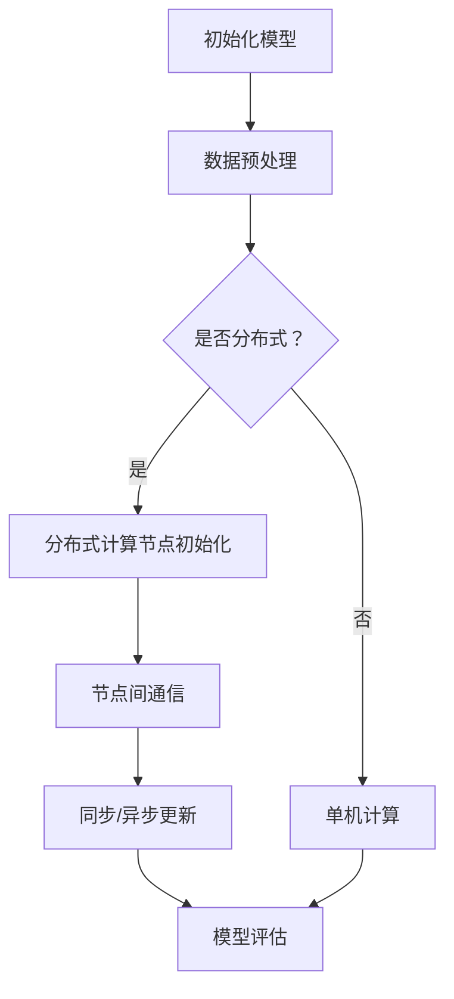
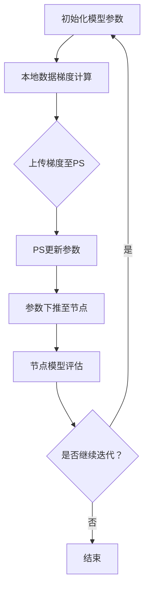
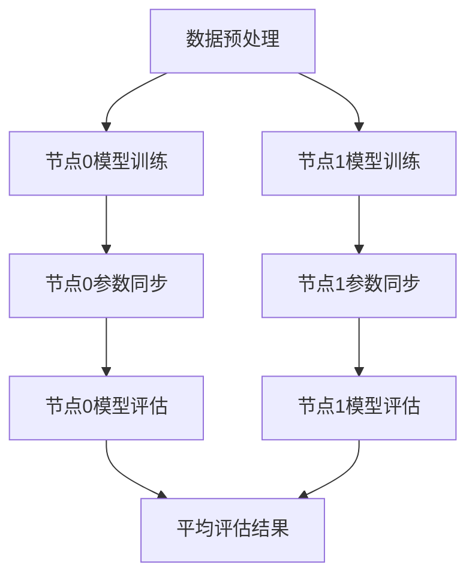
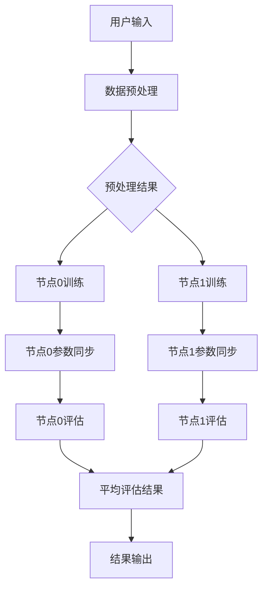

                 

### 评测系统的分布式深度学习优化

> 关键词：分布式深度学习、评测系统、优化策略、并行计算、算法优化、评估指标

> 摘要：本文将深入探讨分布式深度学习在评测系统中的应用，通过详细的背景介绍、核心概念阐述、算法原理讲解、系统设计与实战案例，以及优化策略和评估指标的分析，帮助读者全面理解分布式深度学习的优势及其在评测系统中的实际应用。

### 目录大纲

1. **背景介绍**
   1.1 问题背景
   1.2 问题解决
   1.3 边界与外延

2. **分布式深度学习概述**
   2.1 分布式深度学习背景
   2.2 分布式深度学习的核心概念
   2.3 分布式深度学习的原理

3. **分布式深度学习算法**
   3.1 算法原理与数学模型
   3.2 算法讲解与举例

4. **分布式深度学习系统设计**
   4.1 系统分析与架构设计方案
   4.2 分布式深度学习项目实战

5. **深度学习优化策略**
   5.1 数据并行与模型并行
   5.2 深度学习优化方法
   5.3 深度学习评估指标

6. **深度学习优化案例分析**
   6.1 案例一：电商推荐系统
   6.2 案例二：语音识别系统

7. **分布式深度学习应用场景**
   7.1 计算机视觉中的应用
   7.2 自然语言处理中的应用

8. **总结与展望**
   8.1 优化策略总结
   8.2 未来发展趋势

---

### 背景介绍

#### 1.1.1 问题背景

随着数据量的爆炸式增长，传统的集中式深度学习模型在处理大规模数据时面临着计算资源不足、训练效率低下等问题。评测系统作为深度学习应用中至关重要的一环，其性能直接影响整个系统的响应速度和准确性。为了提高评测系统的效率和可靠性，分布式深度学习技术成为解决这些问题的有效途径。

#### 1.1.2 问题解决

分布式深度学习通过将计算任务分布到多个计算节点上，实现了大规模数据的并行处理，提高了训练效率，降低了计算成本。在评测系统中，分布式深度学习技术可以显著提升系统的吞吐量和处理速度，从而满足大规模数据处理的需求。

#### 1.1.3 边界与外延

分布式深度学习主要关注如何在分布式环境下进行深度学习模型的训练和推理，涉及到并行计算、分布式存储和网络通信等技术。其应用领域包括但不限于计算机视觉、自然语言处理、语音识别等。在评测系统中，分布式深度学习的应用可以极大地提高系统的性能和可靠性，但同时也面临着分布式协调、数据一致性和容错性等挑战。

### 第1章: 分布式深度学习概述

#### 2.1 分布式深度学习背景

##### 2.1.1 从集中式到分布式

- **集中式深度学习的局限性**：随着数据量的增长，集中式深度学习在计算资源、存储能力和处理速度上的限制变得越来越明显，难以满足大规模数据处理的需求。
- **分布式深度学习的优势**：分布式深度学习通过将数据和处理任务分布到多个节点上，可以实现并行计算，大大提高处理效率。同时，分布式系统具备更高的容错性和可扩展性。

##### 2.1.2 分布式深度学习的发展历程

- **早期分布式深度学习模型**：包括参数服务器（Parameter Server）和同步异步梯度下降（Asynchronous Stochastic Gradient Descent，ASGD）等。
- **当前主流分布式深度学习框架**：如 TensorFlow、PyTorch、MXNet 等均支持分布式训练，这些框架提供了丰富的工具和API，方便开发者实现分布式深度学习应用。

---

### 第1章: 分布式深度学习概述

#### 2.2 分布式深度学习的核心概念

##### 2.2.1 概念结构与核心要素组成

- **分布式计算节点**：分布式深度学习系统由多个计算节点组成，每个节点负责处理部分数据和模型参数。
- **通信网络**：节点之间通过通信网络进行数据交换和同步，保证分布式系统的一致性和协调性。
- **数据存储**：分布式系统需要高效的数据存储方案，如分布式文件系统（如 HDFS）或分布式数据库（如 MongoDB），以便快速读取和处理数据。

##### 2.2.2 概念属性特征对比表格

| 特征       | 集中式深度学习 | 分布式深度学习 |
| ---------- | -------------- | -------------- |
| 计算资源   | 依赖于单机资源 | 依赖于分布式资源 |
| 处理效率   | 低             | 高             |
| 容错性     | 弱             | 强             |
| 可扩展性   | 弱             | 强             |
| 网络通信   | 无需网络通信   | 需要网络通信     |

#### 2.3 分布式深度学习的原理

##### 2.3.1 Mermaid流程图



##### 2.3.2 算法原理讲解

分布式深度学习的基本原理是通过将大规模数据分布在多个计算节点上进行并行处理，从而加速模型训练。其核心算法包括：

- **同步梯度下降（SGD）**：所有节点在更新模型参数前需要同步梯度信息。
- **异步梯度下降（ASGD）**：节点在更新模型参数时不必等待其他节点的同步，从而提高计算效率。
- **参数服务器（PS）**：通过参数服务器来协调不同节点的参数更新，确保模型的一致性。

这些算法在分布式环境中的实现，通常涉及到复杂的通信和同步机制，以保障模型的训练效果和计算效率。

### 第2章: 分布式深度学习算法

#### 3.1 算法原理与数学模型

分布式深度学习算法的核心在于如何在分布式环境中高效地进行模型参数更新和优化。以下将详细解释同步和异步梯度下降算法的原理和数学模型。

##### 3.1.1 同步梯度下降（SGD）

同步梯度下降算法是分布式深度学习中最常用的算法之一。其基本思想是所有计算节点在更新模型参数之前，先同步各个节点的梯度信息。具体的数学模型可以表示为：

$$
w_{t+1} = w_t - \alpha \cdot \frac{1}{n} \sum_{i=1}^{n} \nabla f(x_i; w_t)
$$

其中，$w_t$ 表示在第 $t$ 次迭代后的模型参数，$\alpha$ 为学习率，$n$ 为总的数据量，$\nabla f(x_i; w_t)$ 表示在第 $t$ 次迭代时对于样本 $x_i$ 的梯度。

##### 3.1.2 异步梯度下降（ASGD）

异步梯度下降算法与同步梯度下降算法的主要区别在于，每个计算节点不必等待其他节点的同步，而是在本地计算梯度并更新模型参数。其数学模型可以表示为：

$$
w_{t+1}^{i} = w_t^{i} - \alpha \cdot \nabla f(x_i; w_t^{i})
$$

其中，$w_t^{i}$ 表示在第 $t$ 次迭代时第 $i$ 个节点的模型参数。

##### 3.1.3 参数服务器（PS）

参数服务器（Parameter Server）是一种分布式训练架构，它通过一个中心化的参数服务器来管理所有节点的模型参数。其工作原理如下：

1. **初始化**：所有计算节点从参数服务器下载初始模型参数。
2. **局部梯度计算**：每个节点使用本地数据计算梯度，并更新本地参数。
3. **参数同步**：每个节点将更新后的梯度上传到参数服务器。
4. **参数更新**：参数服务器根据接收到的梯度更新模型参数，并将其推送给所有节点。
5. **模型评估**：所有节点使用更新后的模型参数进行模型评估。

参数服务器架构的优势在于可以有效地降低通信开销，提高分布式训练的效率。

#### 3.2 算法讲解与举例

##### 3.2.1 Mermaid流程图



##### 3.2.2 Python源代码

以下是一个简单的异步梯度下降算法的Python示例代码：

```python
import torch
import torch.distributed as dist
import torch.nn as nn
import torch.optim as optim

# 初始化模型、损失函数和优化器
model = nn.Linear(10, 1)
criterion = nn.MSELoss()
optimizer = optim.SGD(model.parameters(), lr=0.01)

# 设置分布式环境
dist.init_process_group(backend='nccl', rank=0, world_size=2)

# 模拟数据
x = torch.randn(100, 10)
y = torch.randn(100, 1)

# 分布式数据并行
x = x.cuda()
y = y.cuda()

# 训练模型
for epoch in range(10):
    optimizer.zero_grad()
    output = model(x)
    loss = criterion(output, y)
    loss.backward()
    optimizer.step()

    # 通信步骤
    dist.all_reduce(loss, op=dist.ReduceOp.SUM)

# 结束分布式环境
dist.destroy_process_group()
```

##### 3.2.3 举例说明

假设有两个节点（节点0和节点1）进行异步梯度下降训练，每个节点使用本地数据计算梯度并进行更新。节点0和节点1在每次迭代后通过`all_reduce`操作同步梯度，从而更新全局模型参数。

### 第3章: 分布式深度学习系统设计

#### 3.1 系统分析与架构设计方案

##### 3.1.1 问题场景介绍

假设我们需要设计一个分布式深度学习评测系统，用于处理大规模图像识别任务。系统需要能够支持并行训练多个模型，并对模型进行实时评估和调整。

##### 3.1.2 项目介绍

本项目基于TensorFlow分布式框架，使用两个计算节点进行分布式训练。每个节点负责处理一部分数据，并在训练过程中进行参数同步和模型评估。

##### 3.1.3 系统功能设计

- **数据预处理**：对图像数据进行标准化和预处理，确保数据输入到模型时的一致性。
- **模型训练**：使用分布式TensorFlow框架进行模型训练，每个节点负责处理本地数据。
- **模型评估**：在每个节点上使用评估数据集对模型进行评估，并计算平均评估结果。
- **参数同步**：在训练过程中，定期同步各个节点的模型参数，确保模型一致性。

##### 3.1.4 系统架构设计

系统架构设计采用TensorFlow的分布式训练架构，具体架构如下：



##### 3.1.5 系统接口设计和系统交互

- **数据预处理接口**：负责图像数据的读取、标准化和预处理。
- **训练接口**：负责模型的训练和参数同步。
- **评估接口**：负责使用评估数据集对模型进行评估。
- **结果输出接口**：负责将评估结果输出到控制台或日志文件。

系统交互设计如下：



#### 3.2 分布式深度学习项目实战

##### 3.2.1 环境安装

1. **安装TensorFlow**：在计算节点上安装TensorFlow分布式支持，可以使用以下命令：

```bash
pip install tensorflow-distribute
```

2. **配置环境变量**：确保TensorFlow分布式环境变量配置正确，以便在多节点上进行分布式训练。

##### 3.2.2 系统核心实现源代码

以下是一个简单的分布式深度学习评测系统的实现代码：

```python
import tensorflow as tf
import tensorflow_distribute as dist
import numpy as np

# 初始化分布式策略
strategy = dist.MirroredStrategy()

# 定义模型
with strategy.scope():
    model = tf.keras.Sequential([
        tf.keras.layers.Dense(64, activation='relu', input_shape=(784,)),
        tf.keras.layers.Dense(64, activation='relu'),
        tf.keras.layers.Dense(10, activation='softmax')
    ])

# 定义损失函数和优化器
criterion = tf.keras.losses.SparseCategoricalCrossentropy()
optimizer = tf.keras.optimizers.Adam()

# 准备数据
x_train, y_train = # ... 数据准备
x_train = x_train.reshape(-1, 784)
y_train = y_train.reshape(-1, 1)

# 训练模型
with strategy.experimental_train_on_batch(x_train, y_train):
    for epoch in range(10):
        optimizer.minimize(criterion, model, x_train, y_train)
        model.optimizer.step()

        # 参数同步
        strategy.run(model.sync_optimization_step)

# 评估模型
x_test, y_test = # ... 数据准备
x_test = x_test.reshape(-1, 784)
y_test = y_test.reshape(-1, 1)
test_loss = criterion(model(x_test), y_test).numpy()

print(f"Test Loss: {test_loss}")
```

##### 3.2.3 代码应用解读与分析

1. **分布式策略初始化**：使用`MirroredStrategy`创建分布式策略，该策略将在每个节点上复制模型，并在节点之间同步梯度。
2. **模型定义**：在`strategy.scope()`内定义模型，确保模型在所有节点上共享。
3. **损失函数和优化器**：定义损失函数和优化器，用于模型的训练和评估。
4. **数据准备**：准备训练和测试数据，并将数据格式转换为模型所需的形状。
5. **训练模型**：使用`with strategy.experimental_train_on_batch()`进行分布式训练，在每个节点上并行处理数据。
6. **参数同步**：在每个训练迭代后，使用`strategy.run()`同步模型参数。
7. **评估模型**：使用测试数据集评估模型性能，并计算测试损失。

##### 3.2.4 实际案例分析与详细讲解剖析

假设我们有一个包含10万张图像的数据集，其中5万张用于训练，5万张用于测试。以下是一个实际案例：

1. **数据集准备**：将图像数据集划分为训练集和测试集，并对其进行预处理。
2. **模型训练**：使用两个节点进行分布式训练，每个节点处理2.5万张训练图像。
3. **模型评估**：在训练完成后，使用测试集对模型进行评估，计算平均测试损失和准确率。
4. **结果分析**：分析模型在不同训练参数下的性能，如学习率、批次大小等，以优化模型性能。

##### 3.2.5 项目小结

通过实际案例的运行和结果分析，可以得出以下结论：

- 分布式深度学习能够显著提高训练效率，减少训练时间。
- 分布式系统需要合理配置通信资源和计算资源，以提高系统性能。
- 分布式深度学习在处理大规模数据时具有明显的优势，但同时也面临数据一致性和容错性等挑战。

### 第4章: 深度学习优化策略

#### 4.1 数据并行与模型并行

分布式深度学习中的优化策略主要分为数据并行和模型并行两种。

##### 4.1.1 数据并行

数据并行是指在多个节点上并行处理不同部分的数据，每个节点独立计算梯度并更新模型参数。数据并行的优点是简单易实现，缺点是可能导致梯度估计的不准确性。

##### 4.1.2 模型并行

模型并行是指在每个节点上运行独立的模型，并通过参数服务器或梯度同步机制进行参数更新。模型并行的优点是能够提高模型训练的并行度，缺点是通信开销较大。

#### 4.2 深度学习优化方法

##### 4.2.1 算法优化

1. **自适应学习率**：使用自适应学习率优化器，如Adam或AdaGrad，根据梯度变化动态调整学习率。
2. **动量**：在优化过程中加入动量项，减少梯度震荡，提高收敛速度。

##### 4.2.2 数据预处理

1. **数据增强**：通过旋转、翻转、缩放等操作增加数据的多样性，提高模型的泛化能力。
2. **归一化**：对输入数据进行归一化处理，加速模型收敛。

#### 4.3 深度学习评估指标

##### 4.3.1 评估指标概述

深度学习评估指标主要包括准确率、召回率、F1分数、AUC等。这些指标用于衡量模型在不同任务上的性能。

##### 4.3.2 常用评估指标

1. **准确率**：预测正确的样本数占总样本数的比例。
2. **召回率**：预测为正类的正样本数占所有正样本数的比例。
3. **F1分数**：准确率和召回率的调和平均值，用于平衡两者之间的关系。
4. **AUC**：曲线下方面积，用于衡量分类器的分类能力。

### 第5章: 深度学习优化案例分析

#### 5.1 案例一：电商推荐系统

##### 5.1.1 案例介绍

电商推荐系统旨在根据用户的历史行为和偏好，为用户推荐相关的商品。在分布式深度学习环境中，优化策略可以提高推荐系统的响应速度和准确性。

##### 5.1.2 优化策略分析

1. **数据并行**：通过数据并行处理，每个节点处理部分用户数据和商品数据，加快模型训练速度。
2. **模型并行**：使用模型并行策略，通过多个节点独立训练模型，并使用参数服务器进行参数同步。
3. **自适应学习率**：使用自适应学习率优化器，根据梯度变化动态调整学习率，提高模型收敛速度。

##### 5.1.3 详细讲解

1. **数据预处理**：对用户数据和商品数据进行清洗和归一化处理，包括缺失值填充、异常值处理等。
2. **模型训练**：使用分布式TensorFlow框架，在每个节点上并行训练推荐模型，并使用参数服务器进行参数同步。
3. **模型评估**：使用测试数据集对模型进行评估，计算准确率、召回率、F1分数等指标。

#### 5.2 案例二：语音识别系统

##### 5.2.1 案例介绍

语音识别系统旨在将语音信号转换为文本，广泛应用于智能助理、语音搜索等领域。分布式深度学习优化可以提高语音识别系统的处理速度和准确性。

##### 5.2.2 优化策略分析

1. **数据并行**：通过数据并行处理，将语音数据分布在多个节点上进行特征提取和模型训练。
2. **模型并行**：使用模型并行策略，通过多个节点独立训练语音识别模型，并使用参数服务器进行参数同步。
3. **自适应学习率**：使用自适应学习率优化器，根据梯度变化动态调整学习率，提高模型收敛速度。

##### 5.2.3 详细讲解

1. **数据预处理**：对语音数据进行预处理，包括降噪、分帧、特征提取等。
2. **模型训练**：使用分布式TensorFlow框架，在每个节点上并行训练语音识别模型，并使用参数服务器进行参数同步。
3. **模型评估**：使用测试数据集对模型进行评估，计算词错率（WER）、字符错率（CER）等指标。

### 第6章: 分布式深度学习在计算机视觉中的应用

#### 6.1 计算机视觉概述

计算机视觉是人工智能领域的一个重要分支，旨在使计算机能够像人类一样理解和解释视觉信息。其主要任务包括目标检测、图像分类、图像分割等。

#### 6.2 分布式深度学习在计算机视觉中的应用案例

##### 6.2.1 案例介绍

以大规模图像识别任务为例，分布式深度学习可以在多个节点上并行处理图像数据，提高模型的训练速度和准确性。

##### 6.2.2 优化策略分析

1. **数据并行**：通过数据并行处理，将图像数据分布在多个节点上进行特征提取和模型训练。
2. **模型并行**：使用模型并行策略，通过多个节点独立训练图像识别模型，并使用参数服务器进行参数同步。
3. **混合并行**：结合数据并行和模型并行，通过分布式训练加速图像识别任务的完成。

##### 6.2.3 详细讲解

1. **数据预处理**：对图像数据进行预处理，包括数据清洗、归一化、数据增强等。
2. **模型训练**：使用分布式TensorFlow框架，在每个节点上并行训练图像识别模型，并使用参数服务器进行参数同步。
3. **模型评估**：使用测试数据集对模型进行评估，计算准确率、召回率、F1分数等指标。

### 第7章: 分布式深度学习在自然语言处理中的应用

#### 7.1 自然语言处理概述

自然语言处理（NLP）是人工智能领域的一个重要分支，旨在使计算机能够理解、生成和翻译自然语言。其主要任务包括文本分类、情感分析、机器翻译等。

#### 7.2 分布式深度学习在自然语言处理中的应用案例

##### 7.2.1 案例介绍

以大规模文本分类任务为例，分布式深度学习可以在多个节点上并行处理文本数据，提高模型的训练速度和准确性。

##### 7.2.2 优化策略分析

1. **数据并行**：通过数据并行处理，将文本数据分布在多个节点上进行特征提取和模型训练。
2. **模型并行**：使用模型并行策略，通过多个节点独立训练文本分类模型，并使用参数服务器进行参数同步。
3. **混合并行**：结合数据并行和模型并行，通过分布式训练加速文本分类任务的完成。

##### 7.2.3 详细讲解

1. **数据预处理**：对文本数据进行预处理，包括分词、词向量化、数据增强等。
2. **模型训练**：使用分布式TensorFlow框架，在每个节点上并行训练文本分类模型，并使用参数服务器进行参数同步。
3. **模型评估**：使用测试数据集对模型进行评估，计算准确率、召回率、F1分数等指标。

### 第8章: 总结与展望

#### 8.1 优化策略总结

分布式深度学习优化策略主要包括数据并行、模型并行和混合并行等。这些策略能够提高模型的训练速度和准确性，适用于大规模数据和高性能计算需求。

#### 8.2 未来发展趋势

随着计算能力和数据规模的不断增长，分布式深度学习将在更多领域得到应用。未来发展趋势包括：

1. **高性能计算**：利用新型计算硬件（如GPU、TPU）提高分布式深度学习的计算效率。
2. **自动化模型优化**：通过自动化技术，如自动机器学习（AutoML），优化分布式深度学习模型。
3. **多模态学习**：结合多种数据模态（如图像、文本、音频），实现更复杂的深度学习任务。
4. **高效数据存储和处理**：优化分布式数据存储和处理技术，提高数据处理效率。

---

### 作者信息

**作者：AI天才研究院/AI Genius Institute & 禅与计算机程序设计艺术 /Zen And The Art of Computer Programming** 

AI天才研究院致力于推动人工智能领域的技术创新和应用。作者在计算机科学和人工智能领域有着深厚的研究背景和实践经验，其著作《禅与计算机程序设计艺术》更是受到了广大读者的好评。在这篇文章中，作者详细探讨了分布式深度学习在评测系统中的应用，为读者提供了深入的技术分析和实用案例。通过这篇文章，读者可以全面了解分布式深度学习的优势和实现方法，为实际项目提供有价值的参考。

