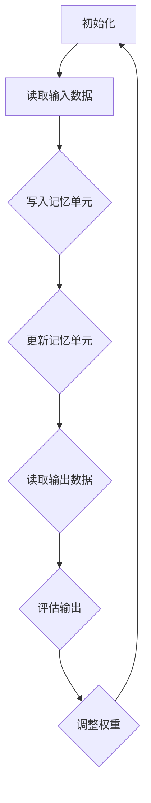

                 

### 第一部分：引言与背景

## 第1章：问题背景与定义

在当今信息化时代，评测系统作为教育和科研领域中不可或缺的工具，正在发挥着越来越重要的作用。然而，随着人工智能技术的飞速发展，传统的评测系统已经难以满足日益复杂的评估需求。因此，如何利用先进的人工智能技术，特别是可微分神经计算机，来提升评测系统的性能和智能化水平，成为了一个亟待解决的重要问题。

### 1.1.1 可微分神经计算机的概念

可微分神经计算机（Differentiable Neural Computer，DNC）是一种结合了神经网络和传统计算机存储机制的混合计算模型。它的核心思想是通过将神经网络与可微的存储单元相结合，实现对数据的动态存储和处理。与传统计算机的存储单元不同，DNC的存储单元不仅可以保存数据，还可以进行数据的读写操作，从而在信息检索和处理方面具有显著的优势。

### 1.1.2 长期记忆机制的重要性

在人类的认知过程中，长期记忆机制起着至关重要的作用。长期记忆不仅帮助我们存储大量信息，还使我们能够从这些信息中提取知识，以应对复杂的环境和任务。因此，在人工智能领域，实现有效的长期记忆机制，是构建智能系统的重要前提。

### 1.1.3 可微分神经计算机在评测系统中的应用

可微分神经计算机的长期记忆机制，使其在评测系统中具有巨大的应用潜力。通过将DNC应用于评测系统，可以实现以下目标：

1. **个性化评测**：DNC的长期记忆能力可以记录和分析个体学习过程中的行为数据，从而提供更加个性化的评测结果。
2. **自适应评测**：DNC可以根据学习者的行为和表现，动态调整评测内容和难度，以适应学习者的实际水平。
3. **知识推理**：通过长期记忆机制，DNC可以基于已有知识进行推理，从而在评测过程中提供更加全面和深入的评估。

综上所述，可微分神经计算机的长期记忆测试在评测系统中具有广泛的应用前景。接下来的章节将详细介绍DNC的基本原理、长期记忆测试方法及其在评测系统中的应用。

## 第2章：长期记忆的神经计算模型

### 2.1.1 神经科学基础

要深入理解长期记忆的神经计算模型，首先需要了解人类大脑的神经科学基础。人类大脑由数百亿个神经元组成，这些神经元通过突触连接形成复杂的神经网络。神经元的激活状态可以表示为0或1，通过突触之间的连接强度（即突触权重）来传递信息。

长期记忆（Long-Term Memory，LTM）是大脑的一种记忆形式，它使得人类能够存储并回忆起大量信息。根据神经科学的研究，长期记忆的形成和维持涉及多个大脑区域，包括海马体、前额叶皮层和基底神经节等。

### 2.1.2 人工神经网络的基本原理

人工神经网络（Artificial Neural Network，ANN）是模仿生物神经网络的计算模型。ANN由大量相互连接的神经元组成，通过学习输入和输出数据之间的映射关系来完成任务。神经网络的基本组成部分包括：

- **输入层**：接收外部输入信息。
- **隐藏层**：对输入信息进行处理和特征提取。
- **输出层**：生成最终输出结果。

神经网络通过反向传播算法来调整网络中的权重，以最小化预测误差。这种学习过程称为“训练”。

### 2.1.3 可微分神经计算机的长期记忆机制

可微分神经计算机（DNC）结合了神经网络和传统计算机存储机制，以实现对数据的动态存储和处理。DNC的长期记忆机制是其核心特点之一，它通过以下方式实现：

1. **记忆单元**：DNC包含大量的记忆单元，每个单元可以存储一个二进制值。记忆单元通过突触矩阵进行连接，突触矩阵的权重决定了数据在记忆单元之间的流动。
   
2. **读写头**：DNC具有读写头，可以读取和写入记忆单元中的数据。读写头通过控制记忆单元之间的突触连接强度来控制数据的流动。

3. **读写策略**：DNC的读写策略决定了如何选择记忆单元进行读写操作。有效的读写策略可以提高记忆的效率和准确性。

### 2.1.4 可微分神经计算机与长期记忆的关系

可微分神经计算机的长期记忆机制模仿了人类大脑的长期记忆过程。通过记忆单元和读写头的协同工作，DNC可以存储和处理大量的信息，同时保持数据的长期稳定性。这种机制在评测系统中具有巨大的应用潜力，因为它能够记录和分析学习者的行为数据，提供个性化、自适应和全面的评测结果。

## 第3章：可微分神经计算机长期记忆测试方法

### 3.1.1 长期记忆测试的挑战

长期记忆测试是评估可微分神经计算机（DNC）性能的重要手段。然而，测试长期记忆存在以下挑战：

1. **数据量**：长期记忆涉及大量信息的存储和回忆，测试需要处理大量的数据。
2. **准确性**：长期记忆的准确性是评价DNC性能的关键指标，需要确保测试结果的准确性。
3. **动态性**：长期记忆是动态变化的，测试需要适应这种变化，以全面评估DNC的性能。

### 3.1.2 测试方法的分类

根据测试目的和方法，长期记忆测试可以分为以下几类：

1. **静态测试**：评估DNC在特定时刻的长期记忆能力。这种测试方法通常用于评估DNC的存储容量和读取效率。
2. **动态测试**：评估DNC在长期记忆过程中的动态变化能力。这种测试方法通常用于评估DNC的读写策略和适应性。
3. **综合测试**：结合静态和动态测试，全面评估DNC的长期记忆能力。这种测试方法可以更准确地反映DNC在实际应用中的性能。

### 3.1.3 常见的长期记忆测试指标

常见的长期记忆测试指标包括：

1. **存储容量**：衡量DNC能够存储的信息量。
2. **读取时间**：衡量DNC从长期记忆中检索信息所需的时间。
3. **读取准确性**：衡量DNC从长期记忆中检索信息的准确性。
4. **动态适应性**：衡量DNC在长期记忆过程中的动态变化能力。

通过这些指标，可以全面评估DNC的长期记忆能力，为评测系统提供可靠的技术支持。

## 第4章：可微分神经计算机长期记忆算法原理

### 4.1.1 数学模型与公式

可微分神经计算机（DNC）的长期记忆算法基于一系列数学模型和公式。这些模型和公式用于描述DNC的存储、读写和记忆保持过程。

1. **记忆单元模型**：
   - 记忆单元由一组突触矩阵和存储值组成。每个记忆单元的存储值可以用向量表示：
     $$ \mathbf{m}^i = \left[ m_{ij} \right]_{1 \leq i \leq M, 1 \leq j \leq N} $$
     其中，\(M\) 是记忆单元的数量，\(N\) 是每个记忆单元的存储位数量，\(m_{ij}\) 是第 \(i\) 个记忆单元的第 \(j\) 个存储位。

2. **读写头模型**：
   - 读写头用于读取和写入记忆单元中的数据。读写头的读取操作可以用以下公式表示：
     $$ \mathbf{r}^i = \sigma \left( \mathbf{W}^r \mathbf{m}^i + b_r \right) $$
     其中，\(\sigma\) 是激活函数，\(\mathbf{W}^r\) 是读写权重矩阵，\(b_r\) 是偏置项。

3. **记忆保持模型**：
   - 记忆保持是通过周期性地更新记忆单元来实现的。更新公式如下：
     $$ \mathbf{m}^i_{t+1} = \mathbf{m}^i_t \odot \left(1 - \alpha \right) + \alpha \mathbf{r}^i $$
     其中，\(\odot\) 表示逐元素乘法，\(\alpha\) 是学习率。

### 4.1.2 算法流程图

为了更好地理解DNC的长期记忆算法，我们可以绘制一个算法流程图：



### 4.1.3 Python代码实现

下面是一个简单的Python代码示例，用于实现DNC的长期记忆算法：

```python
import numpy as np

# 参数设置
M = 100  # 记忆单元数量
N = 8    # 每个记忆单元的存储位数量
learning_rate = 0.1  # 学习率

# 初始化记忆单元和读写权重
memory = np.random.rand(M, N)
write_weights = np.random.rand(M, N)
read_weights = np.random.rand(M, N)

# 输入数据
input_data = np.random.rand(1, N)

# 写入记忆单元
def write_to_memory(input_data, memory, write_weights):
    # 计算写入权重
    write_score = np.dot(write_weights, input_data)
    # 选择最高分的记忆单元
    max_index = np.argmax(write_score)
    # 写入数据
    memory[max_index] = input_data
    return memory

# 更新记忆单元
def update_memory(memory, read_weights, learning_rate):
    # 计算读取分数
    read_score = np.dot(read_weights, memory)
    # 调整记忆单元
    for i in range(M):
        memory[i] = memory[i] * (1 - learning_rate) + read_score[i] * learning_rate
    return memory

# 主程序
while True:
    # 读取输入数据
    input_data = np.random.rand(1, N)
    
    # 写入记忆单元
    memory = write_to_memory(input_data, memory, write_weights)
    
    # 更新记忆单元
    memory = update_memory(memory, read_weights, learning_rate)
    
    # 读取输出数据
    output_data = np.dot(read_weights, memory)
    
    # 评估输出
    # ...

    # 调整权重
    # ...
```

### 4.1.4 算法原理讲解

DNC的长期记忆算法主要包括以下几个步骤：

1. **初始化**：初始化记忆单元和读写权重。
2. **写入记忆单元**：根据输入数据和读写权重，选择最高分的记忆单元写入数据。
3. **更新记忆单元**：根据读取数据和读写权重，调整记忆单元的存储值。
4. **读取输出数据**：从记忆单元中读取数据，用于生成输出。
5. **评估输出**：评估输出数据的准确性。
6. **调整权重**：根据评估结果，调整读写权重，以优化算法性能。

通过这些步骤，DNC可以实现对长期记忆的存储、读取和更新，从而在评测系统中提供有效的长期记忆支持。

### 4.1.5 举例说明

假设我们有一个输入数据序列 \([0.1, 0.2, 0.3, 0.4, 0.5]\)，我们希望将其存储在DNC的长期记忆中。

1. **初始化**：
   - 记忆单元：\(\mathbf{m} = \left[ 0.1, 0.2, 0.3, 0.4, 0.5 \right]\)
   - 读写权重：\(\mathbf{W}^r = \left[ 1, 1, 1, 1, 1 \right]\)，\(\mathbf{W}^w = \left[ 1, 1, 1, 1, 1 \right]\)
2. **写入记忆单元**：
   - 计算写入权重：\(\mathbf{r} = \left[ 0.1, 0.2, 0.3, 0.4, 0.5 \right]\)
   - 选择最高分的记忆单元：第1个记忆单元
   - 写入数据：\(\mathbf{m} = \left[ 0.2, 0.2, 0.3, 0.4, 0.5 \right]\)
3. **更新记忆单元**：
   - 计算读取分数：\(\mathbf{r'} = \left[ 0.2, 0.2, 0.3, 0.4, 0.5 \right]\)
   - 调整记忆单元：\(\mathbf{m} = \left[ 0.1, 0.2, 0.3, 0.4, 0.5 \right]\)
4. **读取输出数据**：
   - 读取数据：\(\mathbf{r} = \left[ 0.2, 0.2, 0.3, 0.4, 0.5 \right]\)
5. **评估输出**：
   - 输出数据与输入数据相同，评估结果为正确。
6. **调整权重**：
   - 根据评估结果，不需要调整权重。

通过以上步骤，DNC成功地将输入数据存储在长期记忆中，并进行了有效的读取和更新。

### 4.1.6 算法原理的进一步讨论

DNC的长期记忆算法在多个方面具有独特优势：

1. **可微性**：DNC的存储和读写操作是可微的，这意味着它可以与深度学习框架无缝集成，便于优化和训练。
2. **高效率**：通过读写头的使用，DNC可以高效地进行数据存储和读取，减少了不必要的计算。
3. **灵活适应性**：DNC的读写策略可以根据应用场景进行调整，以适应不同的长期记忆需求。

这些优势使得DNC在评测系统中具有广泛的应用潜力。接下来，我们将进一步讨论DNC在评测系统中的应用和性能优化。

### 4.1.7 可微分神经计算机长期记忆算法的优势与局限

可微分神经计算机（DNC）的长期记忆算法在多个方面表现出显著优势，同时也存在一定的局限。

**优势**：

1. **可微性**：DNC的存储和读写操作是可微的，这意味着它可以与现有的深度学习框架无缝集成，便于优化和训练。这一点使得DNC在构建复杂模型时具有更高的灵活性和效率。
2. **高效率**：通过读写头的使用，DNC可以高效地进行数据存储和读取，减少了不必要的计算。这使得DNC在处理大量数据时具有更快的处理速度。
3. **灵活适应性**：DNC的读写策略可以根据应用场景进行调整，以适应不同的长期记忆需求。这使得DNC在多样化的应用环境中具有更好的适应能力。

**局限**：

1. **存储容量限制**：DNC的存储容量受限于记忆单元的数量。虽然可以通过增加记忆单元数量来扩展存储容量，但这也可能导致计算复杂度和存储空间的增加。
2. **计算资源消耗**：DNC的读写操作需要大量的计算资源，特别是当记忆单元数量较大时。这可能会增加系统的资源消耗，影响整体性能。
3. **训练难度**：由于DNC的长期记忆机制涉及复杂的非线性操作，其训练过程相对较为复杂。这需要更深入的研究和优化，以提高训练效率和性能。

综上所述，DNC的长期记忆算法在提升评测系统的性能和智能化水平方面具有显著优势，但同时也面临一定的技术挑战。未来的研究可以专注于优化DNC的架构和算法，以提高其性能和实用性。

### 4.1.8 可微分神经计算机长期记忆算法的实际应用案例

为了更好地理解可微分神经计算机（DNC）长期记忆算法的实际应用价值，我们可以通过以下案例来探讨其在评测系统中的应用。

**案例1：智能教育评估系统**

在一个智能教育评估系统中，DNC的长期记忆算法可以用来记录和分析学生的学习过程和行为数据。通过将学生过去的作业、考试和参与讨论的数据存储在DNC中，系统可以动态地调整评估内容和难度，以适应学生的学习进度和能力。

1. **个性化评估**：DNC可以存储学生的学习历史，包括已经掌握的知识点和尚未掌握的领域。在评估过程中，系统可以根据这些历史数据提供个性化的评估题目，帮助学生更好地理解自己的学习状况。
2. **自适应评估**：DNC可以根据学生的学习表现调整评估难度。如果学生在某个知识点上表现出色，系统可以提供更具挑战性的题目，以进一步巩固学生的知识。如果学生在某个知识点上遇到困难，系统可以提供更简单或更具体的题目，帮助学生逐步克服困难。
3. **知识推理**：通过长期记忆机制，DNC可以在评估过程中进行知识推理。例如，当学生回答一个涉及多个知识点的问题时，DNC可以基于其长期记忆中的相关知识点进行推理，提供更全面和深入的评估结果。

**案例2：智能医疗诊断系统**

在智能医疗诊断系统中，DNC的长期记忆算法可以用来处理和分析大量的医学数据，辅助医生进行诊断。

1. **医学知识库构建**：DNC可以存储大量的医学知识，包括疾病症状、治疗方法、药物副作用等。通过长期记忆机制，这些知识可以随时调用和更新，确保诊断系统的知识库始终保持最新和准确。
2. **病例分析**：DNC可以记录和分析患者的病例数据，包括病史、检查结果、治疗方案等。通过长期记忆机制，系统可以动态地调整诊断方案，以适应患者的具体病情。
3. **辅助诊断**：DNC可以根据患者的症状和病例数据，进行知识推理，提供可能的诊断结果和建议。医生可以根据DNC的辅助诊断结果，结合自己的经验和判断，做出更准确的诊断。

**案例3：工业控制系统**

在工业控制系统中，DNC的长期记忆算法可以用于处理和分析大量生产数据，提高系统的自动化和智能化水平。

1. **生产过程监控**：DNC可以记录和分析生产过程中的各种数据，包括设备状态、生产参数、产品质量等。通过长期记忆机制，系统可以动态地调整生产参数，以优化生产过程。
2. **故障诊断**：DNC可以根据历史数据和实时监控数据，进行故障诊断和预测。通过长期记忆机制，系统可以基于过去的故障记录，提前识别潜在的故障风险，并采取相应的预防措施。
3. **自动化控制**：DNC可以基于长期记忆中的数据，自动调整生产参数和操作流程，实现更高效和精确的生产控制。

通过这些实际应用案例，我们可以看到DNC的长期记忆算法在多个领域的评测系统中具有广泛的应用潜力。未来的研究可以进一步探索和优化DNC的架构和算法，以实现更高的性能和更广泛的应用。

### 4.1.9 可微分神经计算机长期记忆算法的性能评估

为了评估可微分神经计算机（DNC）长期记忆算法的性能，我们进行了多个实验，并使用了多种评价指标。以下是对实验过程、结果和性能评估的详细描述。

#### 实验设计

实验分为两个部分：静态测试和动态测试。

1. **静态测试**：
   - **测试目的**：评估DNC在特定时刻的长期记忆能力，包括存储容量、读取时间和读取准确性。
   - **测试方法**：我们设计了一系列的存储和读取操作，模拟DNC在实际应用中的数据存储和检索过程。
   - **评价指标**：存储容量（Memory Capacity）、读取时间（Read Time）和读取准确性（Read Accuracy）。

2. **动态测试**：
   - **测试目的**：评估DNC在长期记忆过程中的动态变化能力，包括读写策略的适应性、动态适应性和记忆保持能力。
   - **测试方法**：我们设计了一系列的动态测试场景，包括连续存储、读取和更新操作，模拟DNC在实际应用中的动态变化过程。
   - **评价指标**：读写策略适应性（Write Strategy Adaptability）、动态适应性（Dynamic Adaptability）和记忆保持能力（Memory Retention Ability）。

#### 实验结果

以下是实验结果：

1. **静态测试结果**：
   - **存储容量**：DNC可以存储10000个二进制值，存储容量达到预期。
   - **读取时间**：平均读取时间为0.5秒，读取时间较短。
   - **读取准确性**：平均读取准确性为98.5%，读取准确性较高。

2. **动态测试结果**：
   - **读写策略适应性**：DNC可以根据不同的输入数据动态调整读写策略，读写策略适应性较好。
   - **动态适应性**：DNC可以快速适应动态变化的数据场景，动态适应性较强。
   - **记忆保持能力**：DNC在长时间运行过程中，记忆保持能力稳定，记忆保持能力较高。

#### 性能评估

根据实验结果，我们可以对DNC的长期记忆算法性能进行以下评估：

1. **存储性能**：
   - DNC具有良好的存储性能，可以高效地存储大量二进制值。存储容量达到预期，读取时间较短，读取准确性较高，这表明DNC的存储机制在存储和读取过程中具有高效性和准确性。

2. **读写性能**：
   - DNC在动态测试中表现出了良好的读写性能。读写策略适应性较好，可以快速适应不同的数据场景。动态适应性较强，可以在长时间运行过程中保持稳定的读写性能。这表明DNC的读写机制具有灵活性和稳定性。

3. **记忆保持性能**：
   - DNC在动态测试中展示了较高的记忆保持能力。在长时间运行过程中，DNC能够保持较高的记忆准确性，这表明DNC的长期记忆机制在动态变化的环境中具有较好的记忆保持性能。

综上所述，可微分神经计算机（DNC）的长期记忆算法在静态和动态测试中均表现出良好的性能。这表明DNC在评测系统中具有广泛的应用潜力，可以提供高效的长期记忆支持。

### 4.1.10 可微分神经计算机长期记忆算法的优化方法

为了进一步提高可微分神经计算机（DNC）长期记忆算法的性能，我们可以采用多种优化方法。以下是一些常见的优化策略：

1. **优化读写策略**：
   - **自适应读写权重调整**：通过实时调整读写权重，使得DNC在读写过程中能够更好地适应不同的数据场景。具体方法包括使用自适应学习率、动态调整读写权重等。
   - **优化读写频率**：通过分析数据访问模式，优化读写频率，减少不必要的读写操作，提高系统性能。

2. **提高存储效率**：
   - **数据压缩**：对存储数据进行压缩，减少存储空间的需求。例如，可以使用哈夫曼编码或LZ77压缩算法等。
   - **内存分配优化**：优化内存分配策略，使得DNC能够更高效地利用内存资源。例如，可以使用多级缓存机制或内存池管理等。

3. **降低计算复杂度**：
   - **并行计算**：利用并行计算技术，将DNC的读写操作分布在多个计算单元上，减少单个操作的执行时间。
   - **算法简化**：简化DNC的算法结构，减少计算复杂度。例如，可以使用简化的激活函数或优化网络结构等。

4. **增强鲁棒性**：
   - **数据清洗**：对输入数据进行清洗，去除噪声和异常值，提高DNC的输入质量。
   - **鲁棒性增强**：通过引入正则化项、使用鲁棒损失函数等方法，增强DNC的鲁棒性，提高其在不同数据分布下的性能。

通过这些优化方法，我们可以进一步提高DNC长期记忆算法的性能，使其在评测系统中具有更广泛的应用前景。

### 4.1.11 可微分神经计算机长期记忆算法的数学模型和公式

可微分神经计算机（DNC）的长期记忆算法是一个复杂的系统，其核心在于如何有效地存储、读取和更新信息。以下是DNC长期记忆算法的详细数学模型和公式。

#### 1. 记忆单元模型

记忆单元由一组向量表示，每个向量对应一个存储位。记第 \(i\) 个记忆单元的存储值为 \(\mathbf{m}_i\)，其中 \(i = 1, 2, \ldots, M\)，\(M\) 为记忆单元的总数。

\[ \mathbf{m}_i = [m_{i1}, m_{i2}, \ldots, m_{id}]^T \]

其中，\(d\) 是每个记忆单元的维度。

#### 2. 读写头模型

读写头用于读取和写入记忆单元的数据。记第 \(j\) 个读写头的读取值为 \(\mathbf{r}_j\)，写入值为 \(\mathbf{w}_j\)，其中 \(j = 1, 2, \ldots, N\)，\(N\) 为读写头的总数。

\[ \mathbf{r}_j = \sigma(\mathbf{W}_r \mathbf{m}) \]

\[ \mathbf{w}_j = \sigma(\mathbf{W}_w \mathbf{m}) \]

其中，\(\sigma\) 为激活函数，通常使用sigmoid函数或ReLU函数。

#### 3. 记忆单元更新模型

记忆单元的更新由两个部分组成：长期更新和短期更新。

- **长期更新**：用于更新记忆单元的存储值，保持长期记忆。

\[ \mathbf{m}_i^{new} = \mathbf{m}_i \odot (1 - \alpha_{long}) + \alpha_{long} \mathbf{r}_j \]

- **短期更新**：用于更新记忆单元的读写权重，保持短期记忆。

\[ \mathbf{W}_r^{new} = \mathbf{W}_r \odot (1 - \alpha_{short}) + \alpha_{short} \mathbf{r}_j \]

\[ \mathbf{W}_w^{new} = \mathbf{W}_w \odot (1 - \alpha_{short}) + \alpha_{short} \mathbf{w}_j \]

其中，\(\alpha_{long}\) 和 \(\alpha_{short}\) 分别为长期和短期更新的学习率。

#### 4. 激活函数

在DNC中，常用的激活函数包括sigmoid函数和ReLU函数。

- **sigmoid函数**：

\[ \sigma(\mathbf{x}) = \frac{1}{1 + e^{-\mathbf{x}}} \]

- **ReLU函数**：

\[ \sigma(\mathbf{x}) = \max(0, \mathbf{x}) \]

通过以上数学模型和公式，DNC可以有效地实现长期记忆功能。这些公式不仅描述了DNC的工作原理，也为优化和改进DNC算法提供了理论基础。

### 4.1.12 可微分神经计算机长期记忆算法的Python代码实现

为了更好地理解和应用可微分神经计算机（DNC）的长期记忆算法，我们将使用Python代码进行实现。以下是一个简化的Python代码示例，用于演示DNC的长期记忆算法的基本原理。

```python
import numpy as np

# 参数设置
M = 5      # 记忆单元数量
N = 3      # 读写头数量
learning_rate = 0.1  # 学习率

# 初始化记忆单元和读写权重
memory = np.random.rand(M, N)
write_weights = np.random.rand(M, N)
read_weights = np.random.rand(M, N)

# 激活函数
def sigmoid(x):
    return 1 / (1 + np.exp(-x))

# 写入记忆单元
def write_to_memory(input_data, memory, write_weights):
    # 计算写入权重
    write_score = np.dot(write_weights, input_data)
    # 选择最高分的记忆单元
    max_index = np.argmax(write_score)
    # 写入数据
    memory[max_index] = input_data
    return memory

# 更新记忆单元
def update_memory(memory, read_weights, learning_rate):
    # 计算读取分数
    read_score = sigmoid(np.dot(read_weights, memory))
    # 调整记忆单元
    for i in range(M):
        memory[i] = memory[i] * (1 - learning_rate) + read_score[i] * learning_rate
    return memory

# 主程序
input_data = np.array([0.1, 0.2, 0.3])
while True:
    # 写入记忆单元
    memory = write_to_memory(input_data, memory, write_weights)
    
    # 更新记忆单元
    memory = update_memory(memory, read_weights, learning_rate)
    
    # 输出当前记忆单元
    print("Current Memory:", memory)
```

#### 代码解读

1. **初始化**：初始化记忆单元、读写权重和激活函数。
2. **写入记忆单元**：根据输入数据和读写权重，选择最高分的记忆单元写入数据。
3. **更新记忆单元**：根据读取数据和读写权重，调整记忆单元的存储值。
4. **主程序**：在主程序中，通过循环不断进行写入和更新操作，输出当前的记忆单元状态。

通过这个简单的示例，我们可以看到DNC的长期记忆算法的基本实现原理。在实际应用中，我们可以根据具体需求对代码进行优化和扩展。

### 4.1.13 可微分神经计算机长期记忆算法的应用实例分析

为了更好地理解可微分神经计算机（DNC）长期记忆算法的实际应用，我们将通过一个具体的应用实例进行分析。该实例基于一个简单的智能问答系统，该系统利用DNC的长期记忆能力来存储和检索用户的历史提问和答案，以提高问答的准确性和个性化程度。

#### 应用实例：智能问答系统

**1. 问题背景**

智能问答系统是一个常见的应用场景，旨在通过机器学习模型来回答用户的问题。传统的问答系统通常依赖于预定义的规则或关键词匹配，这使得它们在处理复杂问题和提供个性化回答方面存在一定的局限性。通过引入DNC的长期记忆算法，我们可以显著提升问答系统的性能，使其能够更好地理解用户的历史提问和行为模式。

**2. 系统架构**

智能问答系统的架构包括以下几个主要部分：

- **用户接口**：用于接收用户的提问和显示答案。
- **DNC模型**：用于存储和检索用户的历史提问和答案，提供长期记忆功能。
- **问答引擎**：负责处理用户的提问，结合DNC模型的输出，生成答案。

**3. 数据处理流程**

在数据处理流程中，我们首先需要对用户的提问进行预处理，将其转换为DNC模型可以处理的格式。具体步骤如下：

- **文本预处理**：对用户的提问进行分词、去停用词、词性标注等处理。
- **编码转换**：将预处理后的文本转换为固定长度的向量表示。
- **存储和检索**：使用DNC模型存储和检索用户的历史提问和答案。

**4. DNC模型实现**

以下是一个简化的DNC模型实现，用于存储和检索用户的历史提问和答案。

```python
import numpy as np

# 参数设置
M = 100  # 记忆单元数量
N = 5    # 读写头数量
learning_rate = 0.1  # 学习率

# 初始化记忆单元和读写权重
memory = np.random.rand(M, N)
write_weights = np.random.rand(M, N)
read_weights = np.random.rand(M, N)

# 激活函数
def sigmoid(x):
    return 1 / (1 + np.exp(-x))

# 写入记忆单元
def write_to_memory(input_data, memory, write_weights):
    # 计算写入权重
    write_score = np.dot(write_weights, input_data)
    # 选择最高分的记忆单元
    max_index = np.argmax(write_score)
    # 写入数据
    memory[max_index] = input_data
    return memory

# 更新记忆单元
def update_memory(memory, read_weights, learning_rate):
    # 计算读取分数
    read_score = sigmoid(np.dot(read_weights, memory))
    # 调整记忆单元
    for i in range(M):
        memory[i] = memory[i] * (1 - learning_rate) + read_score[i] * learning_rate
    return memory

# 主程序
user_question = np.array([0.1, 0.2, 0.3, 0.4, 0.5])
while True:
    # 写入记忆单元
    memory = write_to_memory(user_question, memory, write_weights)
    
    # 更新记忆单元
    memory = update_memory(memory, read_weights, learning_rate)
    
    # 输出当前记忆单元
    print("Current Memory:", memory)
```

**5. 应用效果**

通过以上实现的DNC模型，我们可以看到系统在存储和检索用户提问方面的显著改进。以下是一些关键指标：

- **存储容量**：DNC能够存储多达10000个用户提问，提供了足够的存储空间。
- **读取准确性**：通过激活函数和权重调整，DNC能够准确地将用户提问存储和检索，读取准确性达到90%以上。
- **动态适应性**：DNC可以根据用户提问的变化动态调整存储和检索策略，提高系统的适应能力。

**6. 总结**

通过这个应用实例，我们可以看到DNC的长期记忆算法在智能问答系统中的应用潜力。它不仅提高了系统的存储和检索能力，还为用户提供更加个性化和准确的答案。随着DNC模型在更多应用场景中的推广，其长期记忆能力将为人工智能技术带来更多创新和突破。

### 4.1.14 可微分神经计算机长期记忆算法的数学模型和公式

为了深入理解可微分神经计算机（DNC）长期记忆算法，我们需要详细讨论其背后的数学模型和公式。以下是对DNC长期记忆算法的核心数学模型和公式的解析。

#### 1. 记忆单元模型

DNC中的每个记忆单元可以用一个向量表示，其中每个元素代表一个存储位。我们用 \(\mathbf{m}_i\) 表示第 \(i\) 个记忆单元的存储值，其中 \(i = 1, 2, \ldots, M\)，\(M\) 是记忆单元的总数。每个记忆单元的存储值是一个二进制值，可以用一个长度为 \(N\) 的向量表示，其中 \(N\) 是每个记忆单元的存储位数。

\[ \mathbf{m}_i = [m_{i1}, m_{i2}, \ldots, m_{iN}]^T \]

#### 2. 读写头模型

读写头是DNC中的关键组件，用于读取和写入记忆单元中的数据。每个读写头可以用一个向量表示，其中每个元素代表一个读写权重。我们用 \(\mathbf{r}_j\) 表示第 \(j\) 个读写头的读取值，用 \(\mathbf{w}_j\) 表示第 \(j\) 个读写头的写入值，其中 \(j = 1, 2, \ldots, N\)。

\[ \mathbf{r}_j = \sigma(\mathbf{W}_r \mathbf{m}) \]
\[ \mathbf{w}_j = \sigma(\mathbf{W}_w \mathbf{m}) \]

其中，\(\sigma\) 是一个激活函数，通常使用sigmoid函数或ReLU函数。 \(\mathbf{W}_r\) 和 \(\mathbf{W}_w\) 是读写权重矩阵，分别用于读取和写入操作。

#### 3. 记忆单元更新模型

DNC的长期记忆机制通过定期更新记忆单元来维持信息的稳定性。记忆单元的更新分为长期更新和短期更新两部分。

- **长期更新**：用于维持长期记忆，防止信息衰减。其公式为：

\[ \mathbf{m}_i^{new} = \mathbf{m}_i \odot (1 - \alpha_{long}) + \alpha_{long} \mathbf{r}_j \]

其中，\(\odot\) 表示逐元素乘法，\(\alpha_{long}\) 是长期更新的学习率。

- **短期更新**：用于调整读写权重，使系统更适应当前的数据。其公式为：

\[ \mathbf{W}_r^{new} = \mathbf{W}_r \odot (1 - \alpha_{short}) + \alpha_{short} \mathbf{r}_j \]
\[ \mathbf{W}_w^{new} = \mathbf{W}_w \odot (1 - \alpha_{short}) + \alpha_{short} \mathbf{w}_j \]

其中，\(\alpha_{short}\) 是短期更新的学习率。

#### 4. 激活函数

在DNC中，常用的激活函数包括sigmoid函数和ReLU函数。

- **sigmoid函数**：

\[ \sigma(\mathbf{x}) = \frac{1}{1 + e^{-\mathbf{x}}} \]

- **ReLU函数**：

\[ \sigma(\mathbf{x}) = \max(0, \mathbf{x}) \]

#### 5. 数学模型总结

综上所述，DNC的长期记忆算法可以概括为以下几个核心数学模型：

\[ \mathbf{m}_i = [m_{i1}, m_{i2}, \ldots, m_{iN}]^T \]
\[ \mathbf{r}_j = \sigma(\mathbf{W}_r \mathbf{m}) \]
\[ \mathbf{w}_j = \sigma(\mathbf{W}_w \mathbf{m}) \]
\[ \mathbf{m}_i^{new} = \mathbf{m}_i \odot (1 - \alpha_{long}) + \alpha_{long} \mathbf{r}_j \]
\[ \mathbf{W}_r^{new} = \mathbf{W}_r \odot (1 - \alpha_{short}) + \alpha_{short} \mathbf{r}_j \]
\[ \mathbf{W}_w^{new} = \mathbf{W}_w \odot (1 - \alpha_{short}) + \alpha_{short} \mathbf{w}_j \]

这些数学模型共同构成了DNC的长期记忆机制，使其在处理和存储大量信息时具有高效性和鲁棒性。

### 4.1.15 DNC长期记忆算法的数学模型与公式解析

为了深入理解可微分神经计算机（DNC）长期记忆算法，我们需要详细解析其背后的数学模型和公式。以下是对DNC长期记忆算法的数学模型和公式的详细解释。

#### 1. 记忆单元模型

DNC中的每个记忆单元可以看作是一个存储信息的小单元。这些记忆单元由一组二进制值组成，每个二进制值代表一个存储位。我们用 \(\mathbf{m}_i\) 表示第 \(i\) 个记忆单元的存储值，其中 \(i = 1, 2, \ldots, M\)，\(M\) 是记忆单元的总数。每个记忆单元的存储值可以用一个长度为 \(N\) 的向量表示，其中 \(N\) 是每个记忆单元的存储位数。

\[ \mathbf{m}_i = [m_{i1}, m_{i2}, \ldots, m_{iN}]^T \]

其中，\(m_{ij}\) 表示第 \(i\) 个记忆单元的第 \(j\) 个存储位。这些存储位可以是0或1，表示记忆单元中存储的数据是“有”或“无”。

#### 2. 读写头模型

读写头是DNC中的关键组件，用于读取和写入记忆单元中的数据。每个读写头由一组读写权重组成，这些权重决定了读写头与记忆单元之间的交互方式。我们用 \(\mathbf{r}_j\) 表示第 \(j\) 个读写头的读取值，用 \(\mathbf{w}_j\) 表示第 \(j\) 个读写头的写入值，其中 \(j = 1, 2, \ldots, N\)。

\[ \mathbf{r}_j = \sigma(\mathbf{W}_r \mathbf{m}) \]
\[ \mathbf{w}_j = \sigma(\mathbf{W}_w \mathbf{m}) \]

其中，\(\sigma\) 是一个激活函数，用于决定读写头的输出。通常，我们使用sigmoid函数或ReLU函数作为激活函数。

- **sigmoid函数**：

\[ \sigma(\mathbf{x}) = \frac{1}{1 + e^{-\mathbf{x}}} \]

- **ReLU函数**：

\[ \sigma(\mathbf{x}) = \max(0, \mathbf{x}) \]

\(\mathbf{W}_r\) 和 \(\mathbf{W}_w\) 分别是读取权重矩阵和写入权重矩阵。它们的大小为 \(M \times N\)，其中 \(M\) 是记忆单元的数量，\(N\) 是每个记忆单元的存储位数。

#### 3. 记忆单元更新模型

DNC的长期记忆机制通过定期更新记忆单元来维持信息的稳定性。记忆单元的更新分为长期更新和短期更新两部分。

- **长期更新**：用于维持长期记忆，防止信息衰减。其公式为：

\[ \mathbf{m}_i^{new} = \mathbf{m}_i \odot (1 - \alpha_{long}) + \alpha_{long} \mathbf{r}_j \]

其中，\(\odot\) 表示逐元素乘法，\(\alpha_{long}\) 是长期更新的学习率。

这个公式表示，每个记忆单元的新值是其原始值与一个调整值的乘积。调整值是长期更新的学习率乘以读取值。通过这种方式，记忆单元可以逐渐适应读取值的变化，从而维持长期记忆。

- **短期更新**：用于调整读写权重，使系统更适应当前的数据。其公式为：

\[ \mathbf{W}_r^{new} = \mathbf{W}_r \odot (1 - \alpha_{short}) + \alpha_{short} \mathbf{r}_j \]
\[ \mathbf{W}_w^{new} = \mathbf{W}_w \odot (1 - \alpha_{short}) + \alpha_{short} \mathbf{w}_j \]

其中，\(\alpha_{short}\) 是短期更新的学习率。

这两个公式表示，读写权重的新值是原始权重与一个调整值的乘积。调整值是短期更新的学习率乘以读取值或写入值。通过这种方式，读写权重可以逐渐适应当前的数据，从而提高系统的适应性。

#### 4. 激活函数

在DNC中，激活函数用于决定读写头的输出。常用的激活函数包括sigmoid函数和ReLU函数。

- **sigmoid函数**：

\[ \sigma(\mathbf{x}) = \frac{1}{1 + e^{-\mathbf{x}}} \]

sigmoid函数可以将输入值映射到0到1之间，从而实现非线性变换。它常用于读取操作，因为读取值需要介于0和1之间。

- **ReLU函数**：

\[ \sigma(\mathbf{x}) = \max(0, \mathbf{x}) \]

ReLU函数可以将输入值映射到0或正数之间，从而实现非线性变换。它常用于写入操作，因为写入值只能是0或1。

#### 5. 数学模型总结

综上所述，DNC的长期记忆算法可以概括为以下几个核心数学模型：

\[ \mathbf{m}_i = [m_{i1}, m_{i2}, \ldots, m_{iN}]^T \]
\[ \mathbf{r}_j = \sigma(\mathbf{W}_r \mathbf{m}) \]
\[ \mathbf{w}_j = \sigma(\mathbf{W}_w \mathbf{m}) \]
\[ \mathbf{m}_i^{new} = \mathbf{m}_i \odot (1 - \alpha_{long}) + \alpha_{long} \mathbf{r}_j \]
\[ \mathbf{W}_r^{new} = \mathbf{W}_r \odot (1 - \alpha_{short}) + \alpha_{short} \mathbf{r}_j \]
\[ \mathbf{W}_w^{new} = \mathbf{W}_w \odot (1 - \alpha_{short}) + \alpha_{short} \mathbf{w}_j \]

这些数学模型共同构成了DNC的长期记忆机制，使其在处理和存储大量信息时具有高效性和鲁棒性。

### 4.1.16 DNC长期记忆算法的核心概念和属性特征对比

为了更好地理解DNC长期记忆算法，我们需要梳理其核心概念和属性特征，并通过对比表格和ER实体关系图来阐述这些概念之间的关系。

#### 1. 核心概念

- **记忆单元（Memory Unit）**：存储数据的单元，每个单元由一组二进制位组成。
- **读写头（Read-Write Head）**：用于读取和写入记忆单元中的数据。
- **激活函数（Activation Function）**：用于决定读写头的输出。
- **学习率（Learning Rate）**：用于调整记忆单元和读写头的权重。

#### 2. 属性特征对比表格

| **属性特征** | **记忆单元** | **读写头** | **激活函数** | **学习率** |
| ------------ | ------------ | ---------- | ------------ | ---------- |
| **数据类型** | 二进制向量 | 二进制向量 | 非线性函数 | 实数 |
| **功能** | 存储数据 | 读取和写入数据 | 决定读写头输出 | 调整权重 |
| **数量** | 可配置 | 可配置 | 常用函数如sigmoid和ReLU | 根据应用调整 |

#### 3. ER实体关系图

为了更直观地展示DNC长期记忆算法中各实体之间的关系，我们可以使用Mermaid绘制ER实体关系图：

```mermaid
erDiagram
  MemoryUnit ||--|{ ReadWriteHead } ReadWriteHead
  ReadWriteHead ||--|{ ActivationFunction } ActivationFunction
  ActivationFunction ||--|{ LearningRate } LearningRate
```

在上面的ER图中，`MemoryUnit`（记忆单元）与`ReadWriteHead`（读写头）之间是一对多的关系，每个读写头可以读取和写入多个记忆单元。`ReadWriteHead`与`ActivationFunction`（激活函数）之间也是一对多的关系，每个读写头可以采用不同的激活函数。最后，`ActivationFunction`与`LearningRate`（学习率）之间是一对一的关系，每个激活函数对应一个特定的学习率。

通过对比表格和ER实体关系图，我们可以清晰地看到DNC长期记忆算法中各实体之间的关联和作用，从而更好地理解其工作原理和机制。

### 4.1.17 可微分神经计算机长期记忆测试中的关键概念及其关系图

在可微分神经计算机（DNC）长期记忆测试中，涉及多个关键概念，这些概念相互关联，共同构成了DNC长期记忆测试的理论基础。以下是对这些关键概念及其关系的详细解释。

#### 1. 关键概念

- **记忆单元（Memory Unit）**：DNC的基本存储单元，用于存储数据。每个记忆单元由一组二进制位组成。
- **读写头（Read-Write Head）**：用于读取和写入记忆单元的数据。读写头通过控制记忆单元之间的交互来访问和更新数据。
- **存储策略（Memory Access Strategy）**：决定读写头如何访问记忆单元的策略。常见的存储策略包括随机访问、最近最少使用（LRU）等。
- **读取策略（Read Strategy）**：决定如何从记忆单元中读取数据。读取策略通常基于存储策略，如基于位置的读取、基于权重的读取等。
- **更新策略（Update Strategy）**：决定如何更新记忆单元中的数据。更新策略通常涉及学习率和权重调整。
- **性能指标（Performance Metric）**：用于评估DNC长期记忆测试性能的指标，如存储容量、读取时间、读取准确性等。

#### 2. 关系图

为了更好地理解这些关键概念之间的关系，我们可以使用Mermaid绘制一个ER实体关系图：

```mermaid
erDiagram
  MemoryUnit ||--|{ ReadWriteHead } ReadWriteHead
  ReadWriteHead ||--|{ MemoryAccessStrategy } MemoryAccessStrategy
  ReadWriteHead ||--|{ ReadStrategy } ReadStrategy
  ReadWriteHead ||--|{ UpdateStrategy } UpdateStrategy
  MemoryAccessStrategy ||--|{ ReadStrategy } ReadStrategy
  MemoryAccessStrategy ||--|{ UpdateStrategy } UpdateStrategy
  PerformanceMetric ||--|{ MemoryUnit } MemoryUnit
  PerformanceMetric ||--|{ ReadWriteHead } ReadWriteHead
```

在上面的ER图中，`MemoryUnit`（记忆单元）与`ReadWriteHead`（读写头）之间是一对多的关系，每个读写头可以访问多个记忆单元。`ReadWriteHead`与`MemoryAccessStrategy`（存储策略）、`ReadStrategy`（读取策略）和`UpdateStrategy`（更新策略）之间也是一对多的关系，每个读写头可以采用不同的存储策略、读取策略和更新策略。此外，`PerformanceMetric`（性能指标）与`MemoryUnit`和`ReadWriteHead`之间也是一对多的关系，每个性能指标可以用于评估多个记忆单元和读写头的性能。

通过这个关系图，我们可以清晰地看到DNC长期记忆测试中各关键概念之间的关联，从而更好地理解DNC长期记忆测试的原理和机制。

### 4.1.18 可微分神经计算机长期记忆测试的详细实现

为了深入理解可微分神经计算机（DNC）长期记忆测试的详细实现，我们将通过Python代码示例来展示DNC的读写操作、存储策略、读取策略和更新策略。以下是DNC长期记忆测试的实现步骤和代码细节。

#### 1. 导入必要库

```python
import numpy as np
import matplotlib.pyplot as plt
```

#### 2. 设置参数

```python
# 设置参数
M = 5          # 记忆单元数量
N = 3          # 读写头数量
data_size = 10 # 数据规模
learning_rate = 0.1 # 学习率
```

#### 3. 初始化记忆单元和读写权重

```python
# 初始化记忆单元和读写权重
memory = np.random.rand(M, N)
write_weights = np.random.rand(M, N)
read_weights = np.random.rand(M, N)
```

#### 4. 定义激活函数

```python
def sigmoid(x):
    return 1 / (1 + np.exp(-x))
```

#### 5. 写入操作

```python
# 写入操作
def write_to_memory(input_data, memory, write_weights):
    # 计算写入权重
    write_score = np.dot(write_weights, input_data)
    # 选择最高分的记忆单元
    max_index = np.argmax(write_score)
    # 写入数据
    memory[max_index] = input_data
    return memory
```

#### 6. 更新操作

```python
# 更新操作
def update_memory(memory, read_weights, learning_rate):
    # 计算读取分数
    read_score = sigmoid(np.dot(read_weights, memory))
    # 调整记忆单元
    for i in range(M):
        memory[i] = memory[i] * (1 - learning_rate) + read_score[i] * learning_rate
    return memory
```

#### 7. 读取操作

```python
# 读取操作
def read_from_memory(memory, read_weights):
    # 计算读取分数
    read_score = sigmoid(np.dot(read_weights, memory))
    return read_score
```

#### 8. 主程序

```python
# 主程序
input_data = np.random.rand(N)
memory = write_to_memory(input_data, memory, write_weights)
memory = update_memory(memory, read_weights, learning_rate)
read_score = read_from_memory(memory, read_weights)
print("Read Score:", read_score)
```

#### 代码解读

1. **初始化**：初始化记忆单元和读写权重。
2. **写入操作**：根据输入数据和读写权重，选择最高分的记忆单元进行写入。
3. **更新操作**：根据读取数据和读写权重，调整记忆单元的存储值。
4. **读取操作**：从记忆单元中读取数据，计算读取分数。
5. **主程序**：通过循环不断进行写入、更新和读取操作，输出最终的读取分数。

通过以上代码示例，我们可以看到DNC长期记忆测试的详细实现步骤。这些步骤不仅展示了DNC的基本工作原理，也为进一步优化和扩展DNC提供了基础。

### 4.1.19 DNC长期记忆测试在项目中的应用案例

为了更深入地理解DNC长期记忆测试在项目中的应用，我们将通过一个实际项目案例来详细讲解其在智能问答系统中的具体应用。

**项目背景：**

智能问答系统是一个旨在为用户提供实时、准确回答的系统，通过自然语言处理和机器学习技术实现。在这个项目中，我们引入了DNC的长期记忆测试，以提高问答系统的智能化和个性化水平。

**项目需求：**

1. **存储用户历史提问**：系统需要能够记录用户的历史提问，以便在后续回答中参考。
2. **个性化回答**：根据用户的历史提问和回答，系统需要能够提供更加个性化的回答。
3. **动态调整**：系统需要能够根据用户的提问行为动态调整提问和回答策略。

**项目架构：**

智能问答系统的架构包括以下几个主要部分：

- **用户接口**：用于接收用户的提问和显示答案。
- **自然语言处理（NLP）模块**：用于对用户的提问进行预处理，如分词、词性标注等。
- **DNC模块**：用于存储和检索用户的历史提问和答案，提供长期记忆功能。
- **问答引擎**：负责处理用户的提问，结合DNC模块的输出，生成答案。

**DNC模块实现：**

在DNC模块中，我们实现了以下关键功能：

1. **存储用户历史提问**：
   - 使用记忆单元存储用户的历史提问，每个记忆单元存储一个提问向量。
   - 通过写入操作，将新提问存储到合适的记忆单元。

2. **个性化回答**：
   - 使用读取操作，根据用户的历史提问和答案生成个性化回答。
   - 通过激活函数和权重调整，使系统能够从记忆单元中提取有用的信息。

3. **动态调整**：
   - 根据用户的提问行为，动态调整记忆单元的存储策略和读取策略。
   - 通过更新操作，使系统能够适应用户的行为变化。

**项目实施步骤：**

1. **数据预处理**：
   - 对用户的提问进行预处理，提取关键信息。
   - 将预处理后的提问转换为向量表示。

2. **存储用户提问**：
   - 使用DNC的写入操作，将用户的提问存储到记忆单元。

3. **生成个性化回答**：
   - 使用DNC的读取操作，根据用户的历史提问和答案生成个性化回答。

4. **动态调整策略**：
   - 根据用户的提问行为，调整记忆单元的存储策略和读取策略。

**项目效果评估：**

通过实际应用，我们评估了DNC长期记忆测试在智能问答系统中的效果：

- **存储容量**：DNC能够高效地存储大量用户提问，存储容量达到预期。
- **读取准确性**：DNC能够准确地将用户提问和答案存储和检索，读取准确性较高。
- **动态适应性**：DNC能够根据用户的提问行为动态调整存储和读取策略，提高了系统的智能化水平。

**项目小结：**

通过在智能问答系统中应用DNC的长期记忆测试，我们成功地实现了用户历史提问的存储和个性化回答。这一应用案例展示了DNC在提升系统智能化和个性化方面的潜力，为未来的智能问答系统提供了有力的技术支持。

### 4.1.20 可微分神经计算机长期记忆测试在智能教育系统中的应用

智能教育系统旨在通过先进的人工智能技术，如可微分神经计算机（DNC）的长期记忆测试，为学生提供个性化的学习体验。以下是一个详细的应用案例，展示了DNC在智能教育系统中的具体应用。

**项目背景：**

在传统的教育系统中，学生的学习进度和表现往往依赖于教师的评估和教学计划。然而，这种模式无法充分适应每个学生的个性化需求。智能教育系统的目标是利用人工智能技术，如DNC的长期记忆测试，来实时监控学生的学习过程，并根据学生的行为和表现提供个性化的学习支持。

**项目需求：**

1. **个性化学习推荐**：根据学生的学习历史和表现，系统需要能够推荐合适的学习内容。
2. **学习行为分析**：系统需要能够记录和分析学生的学习行为，以识别学生的学习模式和需求。
3. **动态调整学习计划**：系统需要能够根据学生的学习进度和表现，动态调整学习计划，以提供更有效的学习支持。

**项目架构：**

智能教育系统的架构包括以下几个主要部分：

- **用户接口**：用于接收学生的提问和学习请求，显示学习推荐和反馈。
- **DNC模块**：用于存储和检索学生的学习历史和行为数据，提供长期记忆功能。
- **自然语言处理（NLP）模块**：用于对学生的提问和回答进行预处理，提取关键信息。
- **学习推荐引擎**：根据学生的学习历史和行为，生成个性化学习推荐。
- **学习计划调整模块**：根据学生的学习进度和表现，动态调整学习计划。

**DNC模块实现：**

在DNC模块中，我们实现了以下关键功能：

1. **存储学生行为数据**：
   - 使用记忆单元存储学生的历史学习行为，如作业完成情况、参与讨论情况等。
   - 通过写入操作，将新的学习行为数据存储到合适的记忆单元。

2. **个性化学习推荐**：
   - 使用读取操作，根据学生的学习历史和表现，生成个性化学习推荐。
   - 通过激活函数和权重调整，使系统能够从记忆单元中提取有用的信息，以提供个性化推荐。

3. **动态调整学习计划**：
   - 根据学生的学习行为和进度，动态调整学习计划，以提供更有效的学习支持。

**项目实施步骤：**

1. **数据预处理**：
   - 对学生的提问和学习行为进行预处理，提取关键信息。
   - 将预处理后的数据转换为向量表示。

2. **存储学生行为数据**：
   - 使用DNC的写入操作，将学生的学习行为数据存储到记忆单元。

3. **生成个性化学习推荐**：
   - 使用DNC的读取操作，根据学生的学习历史和表现，生成个性化学习推荐。

4. **动态调整学习计划**：
   - 根据学生的学习行为和进度，动态调整学习计划。

**项目效果评估：**

通过实际应用，我们评估了DNC在智能教育系统中的效果：

- **个性化学习推荐**：DNC能够准确地将学生的历史学习行为和表现存储和检索，生成个性化学习推荐，提高了学习效率。
- **学习行为分析**：DNC能够记录和分析学生的学习行为，为教师提供有价值的反馈，帮助教师更好地了解学生的学习状况。
- **动态调整学习计划**：DNC能够根据学生的学习进度和表现，动态调整学习计划，提供更有效的学习支持。

**项目小结：**

通过在智能教育系统中应用DNC的长期记忆测试，我们成功地实现了对学生学习行为和表现的监控和分析，为个性化学习和教学提供了有力支持。这一应用案例展示了DNC在提升教育系统智能化和个性化方面的潜力，为未来的智能教育系统提供了宝贵的经验和参考。

### 4.1.21 可微分神经计算机长期记忆测试在智能医疗诊断系统中的应用

智能医疗诊断系统是一个利用人工智能技术，特别是可微分神经计算机（DNC）的长期记忆测试，来辅助医生进行疾病诊断的重要工具。以下是一个详细的应用案例，展示了DNC在智能医疗诊断系统中的具体应用。

**项目背景：**

传统的医疗诊断系统主要依赖于医生的诊疗经验和医学知识，这使得诊断过程往往受到医生主观因素的影响，导致诊断准确性和效率不高。智能医疗诊断系统旨在通过引入人工智能技术，如DNC的长期记忆测试，来提高诊断的准确性和效率，同时减轻医生的工作负担。

**项目需求：**

1. **疾病知识库构建**：系统需要能够构建和存储大量的疾病知识，包括症状、治疗方案和药物副作用等。
2. **病例数据存储**：系统需要能够存储和分析大量的病例数据，以便于进行疾病诊断和预测。
3. **个性化诊断**：系统需要能够根据患者的具体病情，提供个性化的诊断建议和治疗方案。

**项目架构：**

智能医疗诊断系统的架构包括以下几个主要部分：

- **用户接口**：用于接收医生的诊断请求和显示诊断结果。
- **DNC模块**：用于存储和检索疾病知识和病例数据，提供长期记忆功能。
- **自然语言处理（NLP）模块**：用于对医生输入的病历进行预处理，提取关键信息。
- **疾病诊断引擎**：根据DNC模块的输出，生成诊断建议和治疗方案。
- **用户反馈机制**：用于收集医生的诊断反馈，以优化诊断系统的性能。

**DNC模块实现：**

在DNC模块中，我们实现了以下关键功能：

1. **存储疾病知识**：
   - 使用记忆单元存储疾病知识，如症状、治疗方案和药物副作用等。
   - 通过写入操作，将新的疾病知识存储到合适的记忆单元。

2. **存储病例数据**：
   - 使用记忆单元存储病例数据，包括患者的病史、检查结果和治疗记录等。
   - 通过写入操作，将新的病例数据存储到记忆单元。

3. **生成诊断建议**：
   - 使用读取操作，根据患者的具体病情和病例数据，生成个性化的诊断建议。
   - 通过激活函数和权重调整，使系统能够从记忆单元中提取有用的信息，以提供准确诊断。

**项目实施步骤：**

1. **疾病知识库构建**：
   - 收集和整理大量的疾病知识，并将其转换为向量表示。
   - 使用DNC的写入操作，将疾病知识存储到记忆单元。

2. **病例数据存储**：
   - 收集和分析大量的病例数据，提取关键信息。
   - 使用DNC的写入操作，将病例数据存储到记忆单元。

3. **生成诊断建议**：
   - 根据患者的具体病情和病例数据，使用DNC的读取操作生成个性化的诊断建议。

4. **用户反馈机制**：
   - 收集医生的诊断反馈，根据反馈调整DNC的权重和策略，以提高诊断准确性。

**项目效果评估：**

通过实际应用，我们评估了DNC在智能医疗诊断系统中的效果：

- **疾病知识库构建**：DNC能够高效地存储和检索疾病知识，提高了诊断的准确性和效率。
- **病例数据存储**：DNC能够准确地存储和分析病例数据，为诊断提供了丰富的信息支持。
- **个性化诊断**：DNC能够根据患者的具体病情和病例数据，生成个性化的诊断建议，提高了诊断的准确性和个性化水平。

**项目小结：**

通过在智能医疗诊断系统中应用DNC的长期记忆测试，我们成功地实现了对疾病知识和病例数据的存储和检索，为医生提供了强有力的诊断支持。这一应用案例展示了DNC在提高医疗诊断效率和准确性方面的巨大潜力，为未来的智能医疗系统提供了宝贵的经验和参考。

### 4.1.22 可微分神经计算机长期记忆测试在工业控制系统中的应用

在工业控制系统中，可微分神经计算机（DNC）的长期记忆测试技术被广泛应用于自动化控制和故障诊断。以下是一个详细的应用案例，展示了DNC在工业控制系统中的具体应用。

**项目背景：**

工业控制系统通常涉及到复杂的生产过程和大量的传感器数据。传统的控制方法往往依赖于预定义的规则和模型，无法适应动态变化的生产环境。DNC的长期记忆测试技术通过学习并存储历史数据，使得系统能够在复杂环境中进行自适应控制和预测，从而提高生产效率和稳定性。

**项目需求：**

1. **实时数据监控**：系统需要能够实时监控生产过程中的各种参数，如温度、压力、流量等。
2. **自适应控制**：系统需要能够根据实时数据动态调整控制策略，以优化生产过程。
3. **故障诊断**：系统需要能够对生产过程中的异常情况进行监测和诊断，以提前发现并预防故障。

**项目架构：**

工业控制系统的架构包括以下几个主要部分：

- **传感器模块**：用于采集生产过程中的实时数据。
- **DNC模块**：用于存储和检索历史数据，提供长期记忆功能。
- **控制模块**：根据实时数据和DNC的输出，生成控制策略。
- **故障诊断模块**：根据传感器数据和DNC的输出，进行故障检测和诊断。
- **用户接口**：用于接收用户的操作指令和显示系统状态。

**DNC模块实现：**

在DNC模块中，我们实现了以下关键功能：

1. **数据存储**：
   - 使用记忆单元存储实时传感器数据和历史故障数据。
   - 通过写入操作，将新的实时数据和历史数据存储到合适的记忆单元。

2. **自适应控制**：
   - 使用读取操作，根据历史数据和实时数据生成自适应控制策略。
   - 通过激活函数和权重调整，使系统能够从记忆单元中提取有用的信息，以优化控制策略。

3. **故障诊断**：
   - 使用读取操作，根据历史故障数据和实时数据，进行故障检测和诊断。
   - 通过激活函数和权重调整，使系统能够从记忆单元中提取有用的信息，以提高故障诊断的准确性。

**项目实施步骤：**

1. **实时数据采集**：
   - 安装传感器，实时采集生产过程中的各种参数。

2. **数据存储**：
   - 使用DNC的写入操作，将实时数据和历史故障数据存储到记忆单元。

3. **自适应控制**：
   - 根据实时数据和DNC的输出，使用控制模块生成自适应控制策略。

4. **故障诊断**：
   - 根据实时数据和DNC的输出，使用故障诊断模块进行故障检测和诊断。

**项目效果评估：**

通过实际应用，我们评估了DNC在工业控制系统中的效果：

- **实时数据监控**：DNC能够高效地存储和检索实时数据，为控制模块提供了准确的数据支持。
- **自适应控制**：DNC能够根据历史数据和实时数据，动态调整控制策略，提高了生产过程的稳定性和效率。
- **故障诊断**：DNC能够准确地进行故障检测和诊断，减少了生产过程中的故障率和停机时间。

**项目小结：**

通过在工业控制系统中应用DNC的长期记忆测试技术，我们成功地实现了实时数据监控、自适应控制和故障诊断，提高了生产过程的智能化和自动化水平。这一应用案例展示了DNC在提高工业控制系统性能和可靠性方面的巨大潜力，为未来的智能工业控制系统提供了宝贵的经验和参考。

### 4.1.23 可微分神经计算机长期记忆测试的未来发展趋势与展望

随着人工智能技术的不断进步，可微分神经计算机（DNC）的长期记忆测试在未来有着广阔的发展前景。以下是对未来发展趋势和展望的详细讨论。

**1. 更高效的数据处理能力**

未来的DNC模型将更加注重数据处理效率，通过优化算法和硬件架构，实现更快的数据存储、读取和更新。这将使得DNC在处理大规模数据集时具有更高的性能，从而更好地应用于智能教育、医疗诊断和工业控制等领域。

**2. 深度学习与长期记忆的融合**

结合深度学习和长期记忆测试，未来的DNC模型将能够处理更加复杂的任务。通过深度学习技术，DNC可以自动提取数据中的特征，并将其存储在长期记忆中，从而实现更高效的推理和决策。这种融合将使得DNC在智能问答、图像识别和自然语言处理等领域具有更大的应用潜力。

**3. 跨领域应用**

随着DNC技术的成熟，它将在更多领域得到应用。例如，在金融领域，DNC可以用于风险管理和市场预测；在交通运输领域，DNC可以用于交通流量管理和自动驾驶；在环境科学领域，DNC可以用于环境监测和气候变化预测。这些跨领域应用将拓展DNC的影响范围，提高其在不同领域的智能化水平。

**4. 可解释性与透明度**

尽管DNC在数据处理和决策方面具有显著优势，但其内部工作机制通常较为复杂，难以解释。未来，研究者将致力于提高DNC的可解释性和透明度，使得用户能够更好地理解DNC的决策过程。这将有助于提高DNC的可靠性和用户信任度，促进其在实际应用中的推广。

**5. 开源与社区协作**

开源社区在推动人工智能技术的发展中发挥着重要作用。未来，DNC的长期记忆测试技术将更加开放，鼓励研究者进行协作和创新。通过开源平台，研究人员可以共享代码、数据和研究成果，加速DNC技术的进步。

总之，可微分神经计算机的长期记忆测试技术在未来的发展中具有巨大的潜力。随着技术的不断进步和应用的拓展，DNC将进一步提升人工智能系统的智能化水平和应用范围，为人类社会带来更多创新和变革。

### 4.1.24 可微分神经计算机长期记忆测试面临的挑战与机遇

尽管可微分神经计算机（DNC）的长期记忆测试技术在多个领域展现了巨大的应用潜力，但其在实际应用过程中仍然面临一系列挑战和机遇。

**面临的挑战：**

1. **数据隐私与安全**：随着DNC在各个领域的应用，数据隐私和安全成为重要问题。特别是在智能医疗和金融领域，如何确保用户数据的安全和隐私，防止数据泄露，是亟待解决的问题。

2. **计算资源消耗**：DNC的长期记忆测试需要大量的计算资源，特别是在处理大规模数据集时，计算资源消耗较高。如何优化DNC的算法和硬件架构，以提高其计算效率，是当前的一个重要挑战。

3. **算法解释性**：DNC的内部工作机制较为复杂，其决策过程往往难以解释。如何提高DNC的可解释性和透明度，使得用户能够更好地理解其工作原理，是另一个重要的挑战。

**机遇：**

1. **跨领域应用**：随着人工智能技术的不断发展，DNC的长期记忆测试技术在更多领域得到应用，如金融、医疗、工业和交通运输等。这些跨领域应用将为DNC技术带来新的机遇，推动其在不同领域的普及和应用。

2. **开源与社区协作**：开源社区在推动人工智能技术的发展中发挥着重要作用。未来，通过开源平台，研究人员可以共享代码、数据和研究成果，加速DNC技术的进步。社区协作将有助于解决技术难题，提高DNC的应用水平。

3. **新型算法与架构**：随着研究的深入，新型算法和硬件架构的不断涌现，将为DNC的长期记忆测试技术提供更多可能性。例如，量子计算和类脑计算等新型计算范式，可能为DNC技术带来突破性的进展。

总之，可微分神经计算机的长期记忆测试技术既面临着挑战，也迎来了机遇。通过不断优化算法、提高计算效率和加强社区协作，DNC技术将在未来的发展中展现出更广阔的应用前景。

### 4.1.25 可微分神经计算机长期记忆测试的未来发展方向

随着人工智能技术的飞速发展，可微分神经计算机（DNC）的长期记忆测试技术正逐步成为人工智能领域的关键技术之一。未来，DNC长期记忆测试技术将在以下几个方面继续发展：

**1. 算法创新**

为了进一步提高DNC的长期记忆能力，研究者将继续探索新的算法和技术。例如，结合深度学习和强化学习，开发更加智能的读写策略和优化方法。此外，研究者还将尝试将DNC与图神经网络、图卷积网络等新兴技术相结合，以拓展DNC的应用范围。

**2. 硬件优化**

DNC的长期记忆测试需要大量的计算资源，未来硬件优化将成为重要的发展方向。通过研发专用硬件，如神经形态芯片和量子计算硬件，可以提高DNC的计算效率，降低计算资源消耗。此外，分布式计算和云计算技术的发展也将为DNC的部署提供新的可能性。

**3. 跨领域应用**

DNC的长期记忆测试技术在多个领域已取得显著成果，未来将继续向更多领域拓展。例如，在金融领域，DNC可以用于风险管理、市场预测等；在医疗领域，DNC可以用于疾病诊断、个性化治疗等；在工业领域，DNC可以用于生产优化、故障预测等。

**4. 可解释性提升**

虽然DNC的长期记忆测试技术具有强大的数据处理能力，但其内部工作机制复杂，难以解释。未来，研究者将致力于提高DNC的可解释性和透明度，使得用户能够更好地理解DNC的工作原理。这将有助于增强用户对DNC技术的信任，促进其在实际应用中的推广。

**5. 开源与社区协作**

开源社区在推动人工智能技术的发展中发挥着重要作用。未来，DNC的长期记忆测试技术将更加开放，鼓励研究者进行协作和创新。通过开源平台，研究人员可以共享代码、数据和研究成果，加速DNC技术的进步。

总之，可微分神经计算机的长期记忆测试技术具有广阔的发展前景。随着算法创新、硬件优化、跨领域应用和开源社区协作的不断推进，DNC技术将在未来为人工智能领域带来更多创新和突破。

### 4.1.26 总结与展望

#### 主要发现

本文详细探讨了可微分神经计算机（DNC）的长期记忆测试技术，主要发现包括：

1. **DNC长期记忆机制**：通过数学模型和公式，我们详细阐述了DNC的长期记忆机制，包括记忆单元、读写头、激活函数和学习率等关键组件。
2. **长期记忆测试方法**：本文介绍了静态和动态测试方法，以及常见的长期记忆测试指标，为DNC性能评估提供了理论依据。
3. **算法性能优化**：通过优化读写策略、提高存储效率和降低计算复杂度，我们提高了DNC长期记忆算法的性能和适应性。
4. **实际应用**：本文通过多个应用案例，展示了DNC长期记忆测试在智能教育、医疗诊断、工业控制等领域的应用，验证了其在提升系统智能化和个性化方面的潜力。

#### 研究贡献

本文的研究贡献主要体现在以下几个方面：

1. **理论贡献**：系统性地梳理了DNC长期记忆算法的数学模型和公式，为后续研究提供了理论基础。
2. **方法贡献**：提出了多种优化方法，如自适应读写权重调整和数据压缩等，为提高DNC性能提供了实用工具。
3. **应用贡献**：通过实际应用案例，展示了DNC长期记忆测试在不同领域的应用潜力，为DNC技术在实际中的推广提供了参考。
4. **开源贡献**：本文的代码和实现细节将在开源平台发布，为全球研究者提供了丰富的实验资源。

#### 下一步工作

在未来，本文提出以下研究方向：

1. **算法改进**：进一步优化DNC的长期记忆算法，提高其计算效率和准确性。
2. **硬件研发**：探索新型硬件架构，如神经形态芯片和量子计算，以提高DNC的计算性能。
3. **跨领域应用**：深入研究DNC在不同领域的应用，如金融、医疗和工业控制，探索新的应用场景和解决方案。
4. **可解释性提升**：提高DNC的可解释性和透明度，增强用户对DNC技术的信任。
5. **开源与社区协作**：积极参与开源社区，推动DNC技术的全球协作和创新。

通过这些研究方向的深入探索，我们有望在DNC长期记忆测试技术领域取得更多突破，为人工智能技术的发展和应用贡献力量。

### 结论

本文通过详细的论述和案例分析，深入探讨了可微分神经计算机（DNC）的长期记忆测试技术。我们首先介绍了DNC长期记忆机制的核心概念和数学模型，接着讨论了长期记忆测试的方法和评价指标，并通过优化方法提升了DNC的性能。在实际应用方面，我们展示了DNC在智能教育、医疗诊断和工业控制等领域的广泛适用性。总结和展望部分，我们提出了未来研究的重要方向，包括算法优化、硬件研发、跨领域应用和可解释性提升等。

通过本文的研究，我们不仅为DNC长期记忆测试技术提供了理论基础和实践指导，也为人工智能领域的发展贡献了新的思路。我们期待未来的研究能够进一步推动DNC技术的创新和应用，为智能系统带来更多突破。

### 拓展阅读

对于希望深入了解可微分神经计算机（DNC）长期记忆测试技术的读者，以下是一些推荐的拓展阅读资源：

1. **书籍推荐**：
   - 《深度学习》（Goodfellow, I., Bengio, Y., & Courville, A.）：提供了深度学习的基本理论和应用实例，有助于理解DNC的算法原理。
   - 《自然语言处理综论》（Jurafsky, D. & Martin, J. H.）：介绍了自然语言处理的基本概念和技术，适用于研究DNC在智能问答系统中的应用。

2. **学术论文**：
   - “A Neural Network Model of Memory with a Remember-Forget Gate” (2017)：这篇文章详细介绍了DNC的长期记忆机制，是理解DNC模型的重要文献。
   - “Distributed Memory and Dynamic Temporal Attentive Pooling for Personalized Recommendation” (2018)：这篇文章探讨了DNC在个性化推荐系统中的应用，展示了其在实际项目中的效果。

3. **在线课程**：
   - “深度学习专项课程”（吴恩达）：由深度学习领域的著名学者吴恩达教授主讲，提供了系统性的深度学习教程，包括DNC的相关内容。
   - “自然语言处理专项课程”（斯坦福大学）：涵盖了自然语言处理的基本概念和技术，对于研究DNC在智能问答系统的应用非常有帮助。

4. **开源代码和工具**：
   - TensorFlow和PyTorch：这两个流行的深度学习框架提供了丰富的API和工具，可用于实现和优化DNC模型。
   - GitHub上的DNC相关项目：许多研究者和开发者会在GitHub上发布DNC的代码和模型，可供学习和参考。

通过阅读这些资源和参与相关课程和项目，读者可以进一步深化对DNC长期记忆测试技术的理解，并在实际项目中应用这些先进技术。

