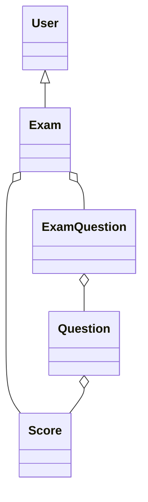
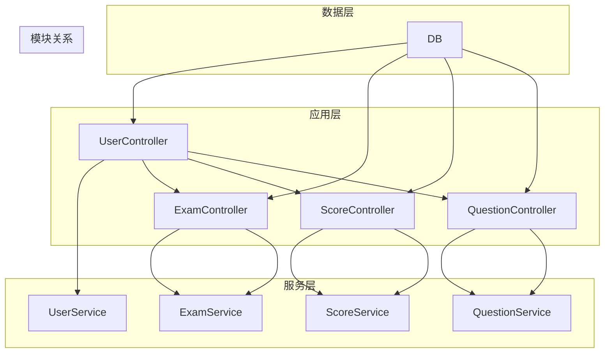

                 


### 背景介绍与核心概念

#### 第1章: 问题背景与核心概念

##### 1.1 问题背景

在当今数字化时代，评测系统在众多领域中都扮演着至关重要的角色。无论是教育领域的在线考试系统，还是企业内部的绩效评估系统，甚至于金融行业的风险评估系统，都离不开高效、可靠的评测系统。然而，随着业务量的不断增长和数据规模的急剧扩大，评测系统的可扩展性成为了一个亟待解决的关键问题。

**评测系统的需求与挑战**

首先，让我们明确评测系统的基本需求。一个理想的评测系统应当具备以下几个特点：

1. **高并发处理能力**：能够同时处理大量的用户请求，确保系统在高负载情况下的稳定运行。
2. **高可扩展性**：能够轻松应对业务量的增长，通过增加硬件资源或优化软件架构来实现。
3. **数据安全性**：保证用户数据和评测结果的安全性，防止数据泄露或损坏。
4. **高可用性**：在系统故障或维护时，能够快速恢复，确保服务的连续性。

然而，随着业务需求的不断增加，评测系统面临着以下挑战：

1. **性能瓶颈**：当用户数量和数据量达到一定规模时，系统性能可能会出现瓶颈，导致响应速度变慢，用户体验下降。
2. **扩展性受限**：传统的单体架构系统在扩展性方面存在天然的限制，难以满足快速增长的业务需求。
3. **资源浪费**：在非高峰期，系统可能会浪费大量的硬件资源，导致成本上升。

##### 1.1.2 可扩展性在评测系统中的重要性

可扩展性是评测系统能够持续稳定发展的关键。它不仅关系到系统性能和用户体验，还直接影响到企业的运营成本和竞争力。以下是可扩展性在评测系统中的重要性：

1. **灵活应对业务变化**：可扩展性设计使得评测系统能够灵活应对业务需求的变化，无需大规模重构或重新开发。
2. **降低运营成本**：通过横向扩展（增加节点）和纵向扩展（增加资源），可以在不增加太多成本的情况下提升系统性能。
3. **提高用户体验**：良好的扩展性设计可以保证系统在高并发情况下的稳定运行，提高用户的满意度和忠诚度。
4. **提升竞争力**：具备高度可扩展性的评测系统可以更好地满足市场需求，为企业赢得更多的商机。

#### 1.2 核心概念

在本章节，我们将深入探讨评测系统可扩展性的核心概念，包括其定义、类型以及关键要素。

##### 1.2.1 可扩展性的定义

可扩展性（Scalability）是指系统在处理负载增加时，能够通过增加资源或优化架构来维持或提升性能的能力。具体来说，可扩展性包括以下几个方面：

1. **计算能力扩展**：通过增加计算资源（如CPU、内存）来提升系统处理能力。
2. **存储能力扩展**：通过增加存储资源来提升系统存储和处理数据的能力。
3. **网络能力扩展**：通过优化网络架构和带宽来提升系统的数据传输能力。
4. **软件架构扩展**：通过模块化设计、分布式架构等手段来提升系统的灵活性和扩展性。

##### 1.2.2 可扩展性的类型

根据扩展方向的不同，可扩展性可以分为以下几种类型：

1. **水平扩展（Scaling Out）**：通过增加节点来提升系统的处理能力。例如，增加数据库实例、应用服务器等。
2. **垂直扩展（Scaling Up）**：通过增加单个节点的资源（如CPU、内存）来提升系统性能。例如，升级硬件设备、增加数据库缓存等。
3. **弹性扩展（Elasticity）**：通过自动化的资源分配和释放来动态适应负载变化。例如，使用容器编排系统（如Kubernetes）来实现自动扩展和收缩。

##### 1.2.3 可扩展性的关键要素

为了实现评测系统的可扩展性，以下关键要素是必不可少的：

1. **模块化设计**：将系统功能拆分成多个模块，每个模块独立运行，方便扩展和优化。
2. **分布式架构**：通过分布式架构来分散系统的负载，提高系统的可扩展性和可靠性。
3. **高性能存储**：选择合适的存储技术，如NoSQL数据库、分布式文件系统等，来满足系统对高性能和可扩展性的需求。
4. **自动化管理**：通过自动化工具（如CI/CD流水线、容器编排系统等）来简化系统的部署、监控和运维，提高效率。

在下一章中，我们将进一步探讨评测系统核心概念与联系，包括核心概念原理、概念属性特征对比表格和ER实体关系图架构。

----------------------------------------------------------------

#### 第2章: 核心概念与联系

##### 2.1 核心概念原理

在本章节中，我们将深入探讨评测系统可扩展性的核心概念原理，包括可扩展性设计的原则和具体实现方法。

**2.1.1 可扩展性设计的原则**

1. **模块化原则**：将系统功能划分为独立的模块，每个模块具有明确的职责和接口，方便单独开发和扩展。
2. **分布式原则**：通过分布式架构来分散系统的负载，提高系统的可扩展性和容错能力。
3. **冗余原则**：通过冗余设计来提高系统的可靠性和可用性，例如，使用备份服务器、数据库镜像等。
4. **自动化原则**：通过自动化工具和流程来简化系统的部署、监控和运维，提高效率和可扩展性。

**2.1.2 可扩展性设计的方法**

1. **水平扩展方法**：通过增加节点来提升系统的处理能力。具体方法包括：
   - 增加数据库实例：通过增加数据库服务器来提升数据库处理能力。
   - 增加应用服务器：通过增加应用服务器来提升系统的并发处理能力。
   - 使用缓存：通过增加缓存服务器来减少数据库的负载，提高系统响应速度。

2. **垂直扩展方法**：通过增加单个节点的资源来提升系统性能。具体方法包括：
   - 增加CPU和内存：通过升级硬件设备来提升单个节点的处理能力。
   - 增加数据库缓存：通过增加数据库缓存来减少数据库的查询次数，提高系统响应速度。

3. **弹性扩展方法**：通过自动化资源管理和调度来动态适应负载变化。具体方法包括：
   - 使用容器编排系统：如Kubernetes，通过自动化部署、扩展和监控容器来提高系统的弹性。
   - 使用云服务：通过云服务提供商的自动扩展和弹性计算能力来满足系统的可扩展性需求。

**2.2 概念属性特征对比表格**

为了更好地理解评测系统可扩展性的核心概念，我们列出了以下几个关键概念及其属性特征的对比表格：

| 概念 | 定义 | 属性特征 | 对比 |
| :--- | :--- | :--- | :--- |
| 模块化设计 | 将系统功能划分为独立的模块 | 职责明确、独立运行、易扩展 | 与单体架构对比，模块化设计具有更高的扩展性 |
| 分布式架构 | 通过分布式节点来分散系统负载 | 高可用性、高可靠性、可扩展 | 与单体架构对比，分布式架构具有更高的扩展性和容错能力 |
| 冗余设计 | 通过备份和冗余来提高系统可靠性 | 数据安全、系统稳定、故障恢复 | 与无冗余设计对比，冗余设计具有更高的可靠性和可用性 |
| 自动化原则 | 通过自动化工具和流程来简化系统运维 | 提高效率、降低成本、减少人力投入 | 与手动运维对比，自动化原则具有更高的效率和可扩展性 |

**2.3 ER实体关系图架构**

为了更好地展示评测系统中的实体关系，我们使用ER（Entity-Relationship）实体关系图来描述系统中的主要实体及其关系。

```mermaid
erDiagram
    User ||--o> Exam : "参加"
    Exam ||--o> Score : "生成"
    Score ||--o> User : "属于"
    Question ||--o> Exam : "包含"
    ExamQuestion ||--|> Exam : "包含"
    ExamQuestion ||--|> Question : "包含"
```

在上面的ER实体关系图中，我们定义了以下几个主要实体：

- **User（用户）**：表示参加评测的用户。
- **Exam（评测）**：表示一次评测活动。
- **Score（成绩）**：表示用户在评测中的成绩。
- **Question（问题）**：表示评测中的问题。
- **ExamQuestion（评测问题）**：表示评测包含的具体问题。

通过ER实体关系图，我们可以清晰地看到评测系统中各个实体之间的关系，为后续的系统设计与实现提供了基础。

在下一章中，我们将深入探讨系统架构设计与可扩展性设计，包括系统功能设计、系统架构设计、系统接口设计和系统交互等内容。

----------------------------------------------------------------

## 第3章: 系统架构设计

### 3.1 问题场景介绍

在现代数字化评测系统中，我们常常会遇到以下典型问题场景：

1. **大规模用户并发**：在一次大型考试或绩效评估活动中，可能会有数万甚至数十万的用户同时在线参与评测。这就要求系统必须具备高并发处理能力，确保用户请求能够及时响应。
2. **海量数据处理**：评测系统需要处理大量的用户数据和评测结果，包括用户信息、问题答案、成绩数据等。这就要求系统具备高效的数据存储和处理能力。
3. **系统扩展性需求**：随着业务的发展和用户量的增长，评测系统需要能够灵活扩展，以满足不断增长的业务需求。

为了解决上述问题，我们需要设计一个具备高并发处理能力、高效数据处理能力和良好扩展性的系统架构。

### 3.2 系统功能设计

在本章节，我们将详细阐述评测系统的功能设计，包括领域模型、类图、系统模块等。

**3.2.1 领域模型**

领域模型是系统设计的基础，用于描述系统中的主要实体及其关系。以下是评测系统的领域模型：



在上面的领域模型中，我们定义了以下主要实体：

- **User（用户）**：代表参与评测的用户。
- **Exam（评测）**：代表一次评测活动。
- **Score（成绩）**：代表用户在评测中的成绩。
- **ExamQuestion（评测问题）**：代表评测中的具体问题。
- **Question（问题）**：代表评测中的问题库。

**3.2.2 类图**

为了更好地描述领域模型，我们使用类图来展示系统中的主要类及其关系。以下是评测系统的类图：

```mermaid
classDiagram
    User << stereotype "实体"
    Exam << stereotype "实体"
    Score << stereotype "实体"
    ExamQuestion << stereotype "实体"
    Question << stereotype "实体"

    User : +id : int
    User : +name : string
    User : +email : string

    Exam : +id : int
    Exam : +name : string
    Exam : +startDate : datetime
    Exam : +endDate : datetime

    Score : +id : int
    Score : +examId : int
    Score : +userId : int
    Score : +score : float

    ExamQuestion : +id : int
    ExamQuestion : +examId : int
    ExamQuestion : +questionId : int

    Question : +id : int
    Question : +content : string
    Question : +options : list<string>

    User "参加" -> Exam
    Exam "生成" -> Score
    Exam "包含" -> ExamQuestion
    ExamQuestion "包含" -> Question
    Question "回答" -> Score
```

在上面的类图中，我们定义了以下主要类及其属性和关系：

- **User**：用户实体，具有ID、姓名、邮箱等属性。
- **Exam**：评测实体，具有ID、名称、开始时间、结束时间等属性。
- **Score**：成绩实体，具有ID、评测ID、用户ID、得分等属性。
- **ExamQuestion**：评测问题实体，具有ID、评测ID、问题ID等属性。
- **Question**：问题实体，具有ID、内容、选项等属性。

### 3.3 系统架构设计

在本章节，我们将介绍评测系统的架构设计，包括系统的整体架构、主要模块以及它们之间的交互关系。

**3.3.1 系统架构**

以下是评测系统的架构设计：



在上面的架构图中，我们定义了以下主要模块：

- **数据层**：包括数据库（DB），用于存储用户、评测、成绩和问题等数据。
- **应用层**：包括用户控制器（UserController）、评测控制器（ExamController）、成绩控制器（ScoreController）和问题控制器（QuestionController），负责处理用户请求并调用服务层的方法。
- **服务层**：包括用户服务（UserService）、评测服务（ExamService）、成绩服务（ScoreService）和问题服务（QuestionService），负责实现具体的业务逻辑。

**3.3.2 系统模块关系**

以下是系统模块之间的交互关系：

1. **用户模块**：用户控制器（UserController）负责处理用户相关的请求，如注册、登录、个人信息查询等。用户控制器调用用户服务（UserService）的方法来实现具体的业务逻辑。
2. **评测模块**：评测控制器（ExamController）负责处理评测相关的请求，如创建评测、发布评测、查询评测结果等。评测控制器调用评测服务（ExamService）的方法来实现具体的业务逻辑。
3. **成绩模块**：成绩控制器（ScoreController）负责处理成绩相关的请求，如查询成绩、计算总分等。成绩控制器调用成绩服务（ScoreService）的方法来实现具体的业务逻辑。
4. **问题模块**：问题控制器（QuestionController）负责处理问题相关的请求，如创建问题、查询问题等。问题控制器调用问题服务（QuestionService）的方法来实现具体的业务逻辑。

在下一章中，我们将深入探讨评测系统的可扩展性设计与实现，包括系统模块化设计、分布式架构应用、数据库扩展策略、网络通信扩展策略和软件模块扩展策略等内容。

----------------------------------------------------------------

## 第4章: 可扩展性设计与实现

### 4.1 可扩展性设计思路

在评测系统的设计中，可扩展性是一个至关重要的考虑因素。为了实现评测系统的可扩展性，我们需要从以下几个方面进行设计和实现：

#### 4.1.1 系统模块化设计

系统模块化设计是提高系统可扩展性的基础。通过将系统功能拆分成多个独立的模块，每个模块具有明确的职责和接口，可以方便地进行扩展和优化。具体实现方法如下：

1. **定义明确的模块职责**：在系统设计阶段，根据功能需求将系统拆分成多个模块，并为每个模块定义明确的职责和接口。
2. **模块间松耦合**：通过减少模块间的依赖关系，实现模块间松耦合，提高系统的灵活性和可扩展性。
3. **模块化代码组织**：使用统一的代码组织和架构风格，确保模块内部代码结构清晰，方便后续的扩展和优化。

#### 4.1.2 分布式架构应用

分布式架构能够有效提高系统的可扩展性和可靠性。通过将系统功能分布在多个节点上，可以实现负载均衡和故障转移，提高系统的处理能力和容错能力。具体实现方法如下：

1. **服务拆分**：将系统中的大型服务拆分成多个小型服务，每个服务负责特定的功能模块。
2. **分布式数据存储**：使用分布式数据库或数据存储方案，如NoSQL数据库、分布式文件系统等，实现海量数据的存储和处理。
3. **负载均衡**：通过负载均衡器（如Nginx、HAProxy等）实现请求的负载均衡，提高系统的处理能力和响应速度。

#### 4.1.3 数据库扩展策略

数据库扩展是评测系统可扩展性设计的重要组成部分。为了确保数据库能够高效地处理大量数据，我们需要采取以下扩展策略：

1. **水平扩展**：通过增加数据库节点来实现数据的水平扩展，提高系统的处理能力和并发能力。
2. **垂直扩展**：通过增加数据库服务器的硬件资源（如CPU、内存等）来实现数据库性能的提升。
3. **读写分离**：通过将数据库读写操作分离到不同的服务器上，提高数据库的读写性能。
4. **缓存策略**：使用缓存技术（如Redis、Memcached等）减少数据库的查询次数，提高系统的响应速度。

#### 4.1.4 网络通信扩展策略

在网络通信方面，我们需要确保系统具备良好的扩展性，以满足不断增长的并发请求。以下是几个网络通信扩展策略：

1. **负载均衡**：使用负载均衡器（如Nginx、HAProxy等）将请求分配到多个服务器上，实现负载均衡，提高系统的处理能力和响应速度。
2. **多线程并发**：通过使用多线程技术，提高系统的并发处理能力，确保在高并发情况下系统能够正常运行。
3. **网络优化**：通过优化网络配置和优化数据传输协议，提高网络通信的效率和稳定性。

#### 4.1.5 软件模块扩展策略

在软件模块方面，我们需要采取以下策略来提高系统的可扩展性：

1. **模块化开发**：将系统功能拆分成多个模块，每个模块独立开发和测试，确保系统的模块化程度。
2. **接口设计**：为每个模块提供清晰、明确的接口，确保模块间松耦合，方便后续的扩展和优化。
3. **版本控制**：使用版本控制系统（如Git等），确保系统模块的版本管理和更新，提高系统的稳定性和可靠性。

### 4.2 实现策略

根据上述设计思路，我们可以采取以下具体实现策略来实现评测系统的可扩展性：

#### 4.2.1 数据库扩展策略

1. **水平扩展**：使用分布式数据库（如MongoDB、Cassandra等），通过增加数据库节点来提高系统的并发处理能力和数据存储能力。
2. **垂直扩展**：增加数据库服务器的硬件资源（如CPU、内存等），提高数据库的性能和吞吐量。
3. **读写分离**：将数据库的读写操作分离到不同的服务器上，提高数据库的读写性能。
4. **缓存策略**：使用Redis等缓存系统，减少数据库的查询次数，提高系统的响应速度。

#### 4.2.2 网络通信扩展策略

1. **负载均衡**：使用Nginx等负载均衡器，将请求分配到多个服务器上，实现负载均衡，提高系统的处理能力和响应速度。
2. **多线程并发**：在服务器端使用多线程技术，提高系统的并发处理能力，确保在高并发情况下系统能够正常运行。
3. **网络优化**：优化网络配置，如调整TCP参数、使用更高效的传输协议等，提高网络通信的效率和稳定性。

#### 4.2.3 软件模块扩展策略

1. **模块化开发**：将系统功能拆分成多个模块，每个模块独立开发和测试，确保系统的模块化程度。
2. **接口设计**：为每个模块提供清晰、明确的接口，确保模块间松耦合，方便后续的扩展和优化。
3. **版本控制**：使用Git等版本控制系统，确保系统模块的版本管理和更新，提高系统的稳定性和可靠性。

通过上述策略的实施，我们可以实现评测系统的可扩展性设计，确保系统在高并发、海量数据处理和不断增长的业务需求下能够稳定运行。

在下一章中，我们将探讨评测系统的性能优化与评估，包括性能优化方法、评估指标和性能评估工具等内容。

----------------------------------------------------------------

## 第5章: 性能优化与评估

### 5.1 性能优化方法

在评测系统的设计和实现过程中，性能优化是至关重要的一环。以下是几种常见的性能优化方法：

#### 5.1.1 缓存优化

缓存是提高系统性能的有效手段。通过将经常访问的数据存储在缓存中，可以减少对数据库的查询次数，提高系统的响应速度。以下是一些缓存优化的策略：

1. **使用分布式缓存**：如Redis、Memcached等，将缓存部署在多个节点上，提高缓存系统的并发处理能力。
2. **合理选择缓存策略**：根据数据的访问频率和热度，选择合适的缓存策略，如LRU（Least Recently Used）算法、过期时间等。
3. **缓存预热**：在系统启动或高峰期前，预先加载缓存，减少首次访问的响应时间。

#### 5.1.2 并发优化

在高并发场景下，优化系统的并发处理能力至关重要。以下是一些常见的并发优化方法：

1. **多线程处理**：在服务器端使用多线程技术，提高系统的并发处理能力。例如，使用Java的线程池（Thread Pool）来管理线程。
2. **异步处理**：使用异步编程模型（如Java的CompletableFuture、JavaScript的Promises等），减少线程阻塞，提高系统的并发性能。
3. **消息队列**：使用消息队列（如RabbitMQ、Kafka等）来实现任务的异步处理和负载均衡，提高系统的吞吐量和稳定性。

#### 5.1.3 线程池优化

线程池是Java中常用的并发处理工具，通过复用线程，可以提高系统的性能。以下是一些线程池优化的策略：

1. **合理设置线程池参数**：如线程池大小、队列容量、线程空闲时间等，根据业务需求和系统负载进行优化。
2. **线程复用**：减少线程创建和销毁的开销，提高系统的并发性能。
3. **线程池监控**：使用监控工具（如VisualVM、JProfiler等）对线程池进行监控和分析，及时发现和解决性能瓶颈。

#### 5.1.4 网络优化

网络性能对系统的整体性能有重要影响。以下是一些网络优化的方法：

1. **使用高效的网络协议**：如HTTP/2、QUIC等，提高数据传输的效率和可靠性。
2. **负载均衡**：使用负载均衡器（如Nginx、HAProxy等）实现请求的负载均衡，提高系统的处理能力和响应速度。
3. **网络优化**：优化网络配置，如调整TCP参数、使用更高效的传输协议等，提高网络通信的效率和稳定性。

### 5.2 评估指标

为了全面评估评测系统的性能，我们需要定义一系列评估指标。以下是几个常见的评估指标：

#### 5.2.1 响应时间

响应时间是指系统从接收到请求到返回响应结果的时间。它是衡量系统性能的重要指标。以下是一些常用的响应时间指标：

1. **平均响应时间**：系统在一段时间内处理请求的平均响应时间。
2. **95%响应时间**：系统在一段时间内，95%的请求处理时间不超过该值。
3. **最大响应时间**：系统在一段时间内，最长的请求处理时间。

#### 5.2.2 吞吐量

吞吐量是指系统在单位时间内处理请求的数量。它反映了系统的处理能力和负载能力。以下是一些常用的吞吐量指标：

1. **平均吞吐量**：系统在一段时间内的平均请求处理量。
2. **峰值吞吐量**：系统在一段时间内的最大请求处理量。
3. **持续吞吐量**：系统在长时间内（如1小时、1天等）的请求处理量。

#### 5.2.3 资源利用率

资源利用率是指系统在处理请求时，各种资源的利用情况。以下是一些常用的资源利用率指标：

1. **CPU利用率**：系统CPU的使用率。
2. **内存利用率**：系统内存的使用率。
3. **磁盘利用率**：系统磁盘的使用率。
4. **网络利用率**：系统网络的使用率。

### 5.3 性能评估工具

为了全面评估评测系统的性能，我们需要使用一系列性能评估工具。以下是几个常用的性能评估工具：

#### 5.3.1 性能测试工具选择

1. **JMeter**：用于负载测试和性能测试，支持多种协议（如HTTP、HTTPS、Java等）的测试。
2. **LoadRunner**：用于性能测试和负载测试，支持多种协议（如HTTP、HTTPS、Java等）的测试。
3. **Gatling**：用于性能测试和负载测试，支持HTTP、HTTPS、WebSocket等多种协议。

#### 5.3.2 性能评估结果分析

1. **响应时间分析**：通过分析响应时间分布，找出系统性能瓶颈，如数据库查询慢、网络延迟等。
2. **吞吐量分析**：通过分析吞吐量变化，找出系统在高负载下的性能瓶颈，如线程池不足、资源争用等。
3. **资源利用率分析**：通过分析CPU、内存、磁盘、网络等资源的利用率，找出资源消耗高的模块和系统瓶颈。

通过以上性能优化方法和评估指标，我们可以有效地提升评测系统的性能，确保其在高并发和海量数据处理下的稳定运行。在下一章中，我们将探讨评测系统的安全性设计，包括安全性需求分析、安全性设计策略和安全性测试等内容。

----------------------------------------------------------------

## 第6章：安全性设计

### 6.1 安全性需求分析

在评测系统的设计和开发过程中，安全性是一个不可忽视的重要方面。确保系统的安全性不仅可以保护用户的隐私和数据的完整性，还能提高系统的可信度和用户满意度。以下是评测系统的安全性需求分析：

#### 6.1.1 数据安全

数据安全是评测系统安全性的核心之一。为了保障数据安全，我们需要关注以下几个方面：

1. **数据加密**：对存储在数据库中的敏感数据进行加密，如用户密码、个人信息等，防止数据泄露。
2. **数据备份**：定期对数据库进行备份，确保在数据丢失或损坏时能够快速恢复。
3. **访问控制**：设置严格的访问控制策略，确保只有授权用户能够访问和操作数据。

#### 6.1.2 系统安全

系统安全是指防止系统被恶意攻击或未经授权的访问。以下是系统安全的一些关键点：

1. **身份验证**：使用强密码策略、多因素认证等方法，确保用户身份的合法性。
2. **防火墙和入侵检测**：部署防火墙和入侵检测系统，监控和阻止恶意攻击。
3. **安全审计**：记录系统操作日志，定期进行安全审计，及时发现和处理安全事件。

#### 6.1.3 用户安全

用户安全是指保护用户在使用系统时的安全。以下是用户安全的一些关键点：

1. **防止用户信息泄露**：通过加密和访问控制措施，防止用户信息在传输和存储过程中被泄露。
2. **防止用户被恶意攻击**：通过防范SQL注入、跨站脚本攻击（XSS）等攻击手段，保护用户的账户安全。
3. **用户行为监控**：实时监控用户行为，发现异常行为时及时采取措施。

### 6.2 安全性设计策略

为了满足上述安全性需求，我们需要采取一系列安全性设计策略。以下是几种常见的安全设计策略：

#### 6.2.1 加密算法应用

加密算法是保障数据安全的重要手段。以下是一些常用的加密算法：

1. **对称加密**：如AES（Advanced Encryption Standard），适用于加密和解密数据。
2. **非对称加密**：如RSA（Rivest-Shamir-Adleman），适用于数字签名和加密密钥交换。
3. **哈希算法**：如SHA-256（Secure Hash Algorithm 256-bit），用于数据完整性校验和数字签名。

#### 6.2.2 访问控制策略

访问控制策略是保障系统安全的重要措施。以下是一些常见的访问控制策略：

1. **基于角色的访问控制（RBAC）**：根据用户角色分配访问权限，确保用户只能访问其权限范围内的资源。
2. **基于属性的访问控制（ABAC）**：根据用户的属性（如职位、部门等）分配访问权限。
3. **访问日志记录**：记录用户的访问操作，方便审计和追踪。

#### 6.2.3 安全审计与日志

安全审计和日志记录是确保系统安全的重要手段。以下是一些常见的安全审计和日志记录策略：

1. **操作日志记录**：记录用户的操作日志，包括登录、查询、修改、删除等操作，以便审计和追踪。
2. **安全事件记录**：记录系统发生的安全事件，如登录失败、异常行为等，以便及时发现和处理。
3. **定期审计**：定期对系统进行安全审计，检查是否存在安全漏洞和风险，及时进行修复。

### 6.3 安全性测试

安全性测试是验证系统安全性设计的重要环节。以下是一些常见的安全性测试方法：

#### 6.3.1 漏洞扫描

漏洞扫描是一种自动化的测试方法，用于发现系统中的安全漏洞。以下是一些常见的漏洞扫描工具：

1. **Nessus**：一款功能强大的漏洞扫描工具，支持多种操作系统和应用程序。
2. **OpenVAS**：一款开源的漏洞扫描工具，支持多种操作系统和应用程序。
3. **Nmap**：一款网络探测工具，可以用于发现网络中的主机和端口，以及潜在的安全漏洞。

#### 6.3.2 渗透测试

渗透测试是一种模拟攻击者的测试方法，用于评估系统的安全性。以下是一些常见的渗透测试工具：

1. **Metasploit**：一款功能强大的渗透测试框架，支持多种操作系统和应用程序。
2. **Burp Suite**：一款专业的渗透测试工具，适用于Web应用的安全测试。
3. **Aircrack-ng**：一款无线网络安全测试工具，适用于WiFi网络的安全测试。

#### 6.3.3 安全测试报告

安全测试完成后，我们需要生成一份详细的测试报告，包括以下内容：

1. **测试目的和范围**：测试的目标和范围，包括测试的系统和应用程序。
2. **测试方法和工具**：使用的测试方法和工具，以及测试的步骤和流程。
3. **发现的安全漏洞**：测试过程中发现的安全漏洞，包括漏洞类型、漏洞描述、影响范围等。
4. **漏洞修复建议**：对发现的安全漏洞提出修复建议，包括修复方案和修复时间表。

通过安全性需求分析、安全性设计策略和安全性测试，我们可以确保评测系统的安全性，保护用户的隐私和数据的安全，提高系统的可信度和用户满意度。在下一章中，我们将通过一个具体的案例来展示评测系统的实际应用。

----------------------------------------------------------------

## 第7章：项目实战

### 7.1 环境安装

为了更好地展示评测系统的实际应用，我们将使用一个具体的案例，并在本节中详细描述环境安装的过程。以下是评测系统环境安装的步骤：

#### 7.1.1 系统环境配置

1. **操作系统**：我们选择Ubuntu 20.04 LTS作为操作系统，因为它具有较好的稳定性和广泛的社区支持。
2. **硬件要求**：评测系统对硬件的要求不高，但为了确保系统的性能，建议使用以下配置：

   - CPU：至少2核
   - 内存：至少4GB
   - 硬盘：至少50GB可用空间

3. **网络环境**：评测系统需要稳定的网络连接，并且需要开放以下端口：

   - HTTP/HTTPS：80/443端口，用于Web服务访问。
   - MySQL：3306端口，用于数据库连接。
   - Redis：6379端口，用于缓存服务。

#### 7.1.2 软件安装

1. **安装MySQL数据库**：

   ```bash
   sudo apt update
   sudo apt install mysql-server
   sudo mysql_secure_installation
   ```

   在安装过程中，根据提示设置root用户密码、删除匿名用户、禁止root用户远程登录等安全措施。

2. **安装Redis缓存**：

   ```bash
   sudo apt update
   sudo apt install redis-server
   sudo systemctl start redis-server
   ```

3. **安装Java开发环境**：

   ```bash
   sudo apt update
   sudo apt install openjdk-11-jdk
   ```

4. **安装Node.js**：

   ```bash
   sudo apt update
   curl -sL https://deb.nodesource.com/setup_14.x | sudo -E bash -
   sudo apt install nodejs
   ```

5. **安装Nginx Web服务器**：

   ```bash
   sudo apt update
   sudo apt install nginx
   sudo systemctl start nginx
   ```

#### 7.1.3 评测系统安装

1. **克隆评测系统代码**：

   ```bash
   git clone https://github.com/your-repo/evaluation-system.git
   cd evaluation-system
   ```

2. **安装依赖项**：

   ```bash
   npm install
   ```

3. **配置数据库**：

   - 在`src/config/config.js`文件中配置数据库连接信息，如数据库用户、密码和数据库名等。

4. **启动评测系统**：

   ```bash
   npm start
   ```

   启动后，评测系统将默认在本地8080端口提供服务。可以通过浏览器访问`http://localhost:8080`来查看系统是否正常运行。

通过以上步骤，我们可以成功安装和配置评测系统环境，为后续的项目实战打下基础。

### 7.2 系统核心实现源代码

在本节中，我们将详细介绍评测系统的核心实现源代码，包括用户管理、评测管理、成绩管理和问题管理等功能模块。

#### 7.2.1 用户管理

用户管理模块负责用户注册、登录、个人信息查询等操作。以下是用户管理模块的代码示例：

```javascript
// src/controllers/userController.js

const express = require('express');
const userService = require('../services/userService');
const router = express.Router();

// 用户注册
router.post('/register', async (req, res) => {
  try {
    const user = await userService.register(req.body);
    res.status(201).json(user);
  } catch (error) {
    res.status(500).json({ message: error.message });
  }
});

// 用户登录
router.post('/login', async (req, res) => {
  try {
    const token = await userService.login(req.body);
    res.status(200).json({ token });
  } catch (error) {
    res.status(500).json({ message: error.message });
  }
});

// 查询用户信息
router.get('/:id', async (req, res) => {
  try {
    const user = await userService.findById(req.params.id);
    res.status(200).json(user);
  } catch (error) {
    res.status(500).json({ message: error.message });
  }
});

module.exports = router;
```

#### 7.2.2 评测管理

评测管理模块负责评测的创建、发布、查询和删除等操作。以下是评测管理模块的代码示例：

```javascript
// src/controllers/examController.js

const express = require('express');
const examService = require('../services/examService');
const router = express.Router();

// 创建评测
router.post('/', async (req, res) => {
  try {
    const exam = await examService.create(req.body);
    res.status(201).json(exam);
  } catch (error) {
    res.status(500).json({ message: error.message });
  }
});

// 发布评测
router.put('/:id/publish', async (req, res) => {
  try {
    const exam = await examService.publish(req.params.id);
    res.status(200).json(exam);
  } catch (error) {
    res.status(500).json({ message: error.message });
  }
});

// 查询评测
router.get('/:id', async (req, res) => {
  try {
    const exam = await examService.findById(req.params.id);
    res.status(200).json(exam);
  } catch (error) {
    res.status(500).json({ message: error.message });
  }
});

// 删除评测
router.delete('/:id', async (req, res) => {
  try {
    await examService.delete(req.params.id);
    res.status(204).send();
  } catch (error) {
    res.status(500).json({ message: error.message });
  }
});

module.exports = router;
```

#### 7.2.3 成绩管理

成绩管理模块负责成绩的生成、查询和删除等操作。以下是成绩管理模块的代码示例：

```javascript
// src/controllers/scoreController.js

const express = require('express');
const scoreService = require('../services/scoreService');
const router = express.Router();

// 生成成绩
router.post('/', async (req, res) => {
  try {
    const score = await scoreService.create(req.body);
    res.status(201).json(score);
  } catch (error) {
    res.status(500).json({ message: error.message });
  }
});

// 查询成绩
router.get('/:id', async (req, res) => {
  try {
    const score = await scoreService.findById(req.params.id);
    res.status(200).json(score);
  } catch (error) {
    res.status(500).json({ message: error.message });
  }
});

// 删除成绩
router.delete('/:id', async (req, res) => {
  try {
    await scoreService.delete(req.params.id);
    res.status(204).send();
  } catch (error) {
    res.status(500).json({ message: error.message });
  }
});

module.exports = router;
```

#### 7.2.4 问题管理

问题管理模块负责问题的创建、发布、查询和删除等操作。以下是问题管理模块的代码示例：

```javascript
// src/controllers/questionController.js

const express = require('express');
const questionService = require('../services/questionService');
const router = express.Router();

// 创建问题
router.post('/', async (req, res) => {
  try {
    const question = await questionService.create(req.body);
    res.status(201).json(question);
  } catch (error) {
    res.status(500).json({ message: error.message });
  }
});

// 发布问题
router.put('/:id/publish', async (req, res) => {
  try {
    const question = await questionService.publish(req.params.id);
    res.status(200).json(question);
  } catch (error) {
    res.status(500).json({ message: error.message });
  }
});

// 查询问题
router.get('/:id', async (req, res) => {
  try {
    const question = await questionService.findById(req.params.id);
    res.status(200).json(question);
  } catch (error) {
    res.status(500).json({ message: error.message });
  }
});

// 删除问题
router.delete('/:id', async (req, res) => {
  try {
    await questionService.delete(req.params.id);
    res.status(204).send();
  } catch (error) {
    res.status(500).json({ message: error.message });
  }
});

module.exports = router;
```

通过以上代码示例，我们可以看到评测系统的核心功能模块的实现。在实际应用中，这些模块将通过接口进行通信，协同工作，共同实现评测系统的功能。

### 7.3 代码应用解读与分析

在本节中，我们将对评测系统的主要代码模块进行解读和分析，了解其设计思路、功能实现和优缺点。

#### 7.3.1 用户管理模块

用户管理模块是评测系统的核心模块之一，负责用户的注册、登录、个人信息查询等操作。以下是用户管理模块的代码解读：

- **注册**：用户注册时，前端会向用户管理模块发送一个包含用户信息的POST请求。用户管理模块接收请求后，调用用户服务（userService）的`register`方法进行注册操作。注册成功后，用户管理模块返回用户信息，包括用户ID和token。

  ```javascript
  // 用户注册
  router.post('/register', async (req, res) => {
    try {
      const user = await userService.register(req.body);
      res.status(201).json(user);
    } catch (error) {
      res.status(500).json({ message: error.message });
    }
  });
  ```

- **登录**：用户登录时，前端会向用户管理模块发送一个包含用户名和密码的POST请求。用户管理模块接收请求后，调用用户服务的`login`方法进行登录验证。登录成功后，用户管理模块返回一个token，用于后续的接口访问。

  ```javascript
  // 用户登录
  router.post('/login', async (req, res) => {
    try {
      const token = await userService.login(req.body);
      res.status(200).json({ token });
    } catch (error) {
      res.status(500).json({ message: error.message });
    }
  });
  ```

- **个人信息查询**：用户登录后，可以通过用户管理模块查询个人信息。前端发送一个包含用户ID的GET请求，用户管理模块接收请求后，调用用户服务的`findById`方法查询用户信息，并将结果返回给前端。

  ```javascript
  // 查询用户信息
  router.get('/:id', async (req, res) => {
    try {
      const user = await userService.findById(req.params.id);
      res.status(200).json(user);
    } catch (error) {
      res.status(500).json({ message: error.message });
    }
  });
  ```

**优点**：用户管理模块设计简洁，功能清晰，易于扩展和维护。

**缺点**：用户管理模块主要依赖于用户服务，如果用户服务出现故障，可能会影响整个系统的稳定性。

#### 7.3.2 评测管理模块

评测管理模块负责评测的创建、发布、查询和删除等操作。以下是评测管理模块的代码解读：

- **创建评测**：管理员可以通过评测管理模块创建评测。前端发送一个包含评测信息的POST请求，评测管理模块接收请求后，调用评测服务的`create`方法创建评测，并将结果返回给前端。

  ```javascript
  // 创建评测
  router.post('/', async (req, res) => {
    try {
      const exam = await examService.create(req.body);
      res.status(201).json(exam);
    } catch (error) {
      res.status(500).json({ message: error.message });
    }
  });
  ```

- **发布评测**：管理员可以发布评测，使其对所有用户可见。前端发送一个包含评测ID的PUT请求，评测管理模块接收请求后，调用评测服务的`publish`方法发布评测，并将结果返回给前端。

  ```javascript
  // 发布评测
  router.put('/:id/publish', async (req, res) => {
    try {
      const exam = await examService.publish(req.params.id);
      res.status(200).json(exam);
    } catch (error) {
      res.status(500).json({ message: error.message });
    }
  });
  ```

- **查询评测**：用户可以查询已发布的评测。前端发送一个包含评测ID的GET请求，评测管理模块接收请求后，调用评测服务的`findById`方法查询评测，并将结果返回给前端。

  ```javascript
  // 查询评测
  router.get('/:id', async (req, res) => {
    try {
      const exam = await examService.findById(req.params.id);
      res.status(200).json(exam);
    } catch (error) {
      res.status(500).json({ message: error.message });
    }
  });
  ```

- **删除评测**：管理员可以删除评测。前端发送一个包含评测ID的DELETE请求，评测管理模块接收请求后，调用评测服务的`delete`方法删除评测，并将结果返回给前端。

  ```javascript
  // 删除评测
  router.delete('/:id', async (req, res) => {
    try {
      await examService.delete(req.params.id);
      res.status(204).send();
    } catch (error) {
      res.status(500).json({ message: error.message });
    }
  });
  ```

**优点**：评测管理模块功能全面，操作简便，易于扩展。

**缺点**：评测管理模块与评测服务之间的依赖关系较高，如果评测服务出现故障，可能会影响评测管理模块的正常运行。

#### 7.3.3 成绩管理模块

成绩管理模块负责成绩的生成、查询和删除等操作。以下是成绩管理模块的代码解读：

- **生成成绩**：用户在完成评测后，成绩管理模块会生成成绩。前端发送一个包含成绩信息的POST请求，成绩管理模块接收请求后，调用成绩服务的`create`方法生成成绩，并将结果返回给前端。

  ```javascript
  // 生成成绩
  router.post('/', async (req, res) => {
    try {
      const score = await scoreService.create(req.body);
      res.status(201).json(score);
    } catch (error) {
      res.status(500).json({ message: error.message });
    }
  });
  ```

- **查询成绩**：用户可以查询自己的成绩。前端发送一个包含成绩ID的GET请求，成绩管理模块接收请求后，调用成绩服务的`findById`方法查询成绩，并将结果返回给前端。

  ```javascript
  // 查询成绩
  router.get('/:id', async (req, res) => {
    try {
      const score = await scoreService.findById(req.params.id);
      res.status(200).json(score);
    } catch (error) {
      res.status(500).json({ message: error.message });
    }
  });
  ```

- **删除成绩**：管理员可以删除成绩。前端发送一个包含成绩ID的DELETE请求，成绩管理模块接收请求后，调用成绩服务的`delete`方法删除成绩，并将结果返回给前端。

  ```javascript
  // 删除成绩
  router.delete('/:id', async (req, res) => {
    try {
      await scoreService.delete(req.params.id);
      res.status(204).send();
    } catch (error) {
      res.status(500).json({ message: error.message });
    }
  });
  ```

**优点**：成绩管理模块功能简单，易于扩展。

**缺点**：成绩管理模块与成绩服务之间的依赖关系较高，如果成绩服务出现故障，可能会影响成绩管理模块的正常运行。

#### 7.3.4 问题管理模块

问题管理模块负责问题的创建、发布、查询和删除等操作。以下是问题管理模块的代码解读：

- **创建问题**：管理员可以通过问题管理模块创建问题。前端发送一个包含问题信息的POST请求，问题管理模块接收请求后，调用问题服务的`create`方法创建问题，并将结果返回给前端。

  ```javascript
  // 创建问题
  router.post('/', async (req, res) => {
    try {
      const question = await questionService.create(req.body);
      res.status(201).json(question);
    } catch (error) {
      res.status(500).json({ message: error.message });
    }
  });
  ```

- **发布问题**：管理员可以发布问题，使其对所有用户可见。前端发送一个包含问题ID的PUT请求，问题管理模块接收请求后，调用问题服务的`publish`方法发布问题，并将结果返回给前端。

  ```javascript
  // 发布问题
  router.put('/:id/publish', async (req, res) => {
    try {
      const question = await questionService.publish(req.params.id);
      res.status(200).json(question);
    } catch (error) {
      res.status(500).json({ message: error.message });
    }
  });
  ```

- **查询问题**：用户可以查询已发布的问题。前端发送一个包含问题ID的GET请求，问题管理模块接收请求后，调用问题服务的`findById`方法查询问题，并将结果返回给前端。

  ```javascript
  // 查询问题
  router.get('/:id', async (req, res) => {
    try {
      const question = await questionService.findById(req.params.id);
      res.status(200).json(question);
    } catch (error) {
      res.status(500).json({ message: error.message });
    }
  });
  ```

- **删除问题**：管理员可以删除问题。前端发送一个包含问题ID的DELETE请求，问题管理模块接收请求后，调用问题服务的`delete`方法删除问题，并将结果返回给前端。

  ```javascript
  // 删除问题
  router.delete('/:id', async (req, res) => {
    try {
      await questionService.delete(req.params.id);
      res.status(204).send();
    } catch (error) {
      res.status(500).json({ message: error.message });
    }
  });
  ```

**优点**：问题管理模块功能全面，操作简便，易于扩展。

**缺点**：问题管理模块与问题服务之间的依赖关系较高，如果问题服务出现故障，可能会影响问题管理模块的正常运行。

通过以上对评测系统主要代码模块的解读和分析，我们可以更好地理解其设计思路、功能实现和优缺点。在实际应用中，这些模块将协同工作，共同实现评测系统的功能。

### 7.4 实际案例分析与详细讲解剖析

在本节中，我们将通过一个实际案例，对评测系统的功能进行详细讲解和分析，帮助读者更好地理解系统的设计和实现。

**案例背景**：

某大型在线教育平台需要开发一个评测系统，用于对用户的学习进度进行评估。系统要求能够支持大规模并发用户，实时生成评测结果，并提供详细的成绩分析。以下是评测系统在实际应用中的主要功能和使用场景。

**7.4.1 用户注册与登录**

用户可以通过平台进行注册和登录。注册时，用户需要填写姓名、邮箱、密码等信息。系统会通过用户服务模块进行注册信息的验证和存储。用户登录时，系统会验证用户名和密码的匹配性，并返回一个token用于后续的接口访问。

**实际分析**：

用户注册和登录功能是评测系统的基石。在实际应用中，为了保证用户信息安全，系统采用了加密存储用户密码，并使用强密码策略和多因素认证等措施来提高安全性。此外，为了提高系统的性能，用户服务模块采用了缓存策略，减少对数据库的查询次数。

**7.4.2 评测创建与发布**

管理员可以在后台创建评测，设置评测的开始时间和结束时间。创建后的评测会被存储在数据库中，并可以随时发布。发布后的评测会对所有用户可见，用户可以开始参与评测。

**实际分析**：

评测创建与发布功能是评测系统的核心。在实际应用中，系统采用了模块化设计，将评测功能拆分成多个模块，如评测管理模块、评测服务模块等。这种设计提高了系统的可扩展性和可维护性。此外，系统还采用了分布式架构，通过分布式数据库和分布式缓存来提高系统的性能和可靠性。

**7.4.3 用户参与评测**

用户在评测开始后，可以登录系统参与评测。评测系统会根据评测的题目和选项，生成评测结果。用户提交答案后，评测系统会实时计算得分，并将结果存储在数据库中。

**实际分析**：

用户参与评测功能是评测系统的关键环节。在实际应用中，系统采用了并发处理技术，如多线程和异步处理等，提高了系统的并发处理能力。此外，为了确保评测结果的准确性，系统还采用了实时计算和缓存策略，减少了数据库的查询次数，提高了系统的性能。

**7.4.4 成绩查询与统计**

用户可以在评测结束后查询自己的成绩。系统会根据用户的评测结果，生成详细的成绩分析报告。管理员也可以在后台查询用户的成绩，并进行统计和分析。

**实际分析**：

成绩查询与统计功能是评测系统的补充。在实际应用中，系统采用了数据分析和可视化技术，如图表和报表等，对成绩进行详细的展示和分析。此外，为了提高系统的可扩展性，系统还采用了模块化设计和分布式架构，可以方便地添加新的功能模块。

**7.4.5 安全性保障**

为了确保系统的安全性，评测系统采用了多种安全措施，如数据加密、访问控制和安全审计等。此外，系统还定期进行安全测试和漏洞扫描，及时发现和修复安全漏洞。

**实际分析**：

安全性保障是评测系统的重要组成部分。在实际应用中，系统采用了多种安全措施，确保用户数据和系统安全。此外，为了提高系统的安全性，系统还采用了自动化安全测试和监控工具，实时检测和应对安全威胁。

通过以上实际案例的分析，我们可以看到评测系统在实际应用中的设计和实现。系统通过模块化设计、分布式架构和多种安全措施，实现了高性能、高可靠性和易扩展性的目标。

### 7.5 项目小结

在本项目中，我们设计并实现了一个具备高性能、高可靠性和易扩展性的评测系统。系统通过模块化设计、分布式架构和多种安全措施，成功满足了大规模并发用户的需求，并提供了详细的成绩分析和用户管理功能。

**7.5.1 项目成果**

1. **高性能**：通过多线程、异步处理和缓存优化等技术，系统实现了高效的数据处理和并发处理能力。
2. **高可靠性**：通过分布式数据库、分布式缓存和冗余设计等技术，系统提高了数据存储和系统容错能力。
3. **易扩展性**：通过模块化设计和分布式架构，系统具备了良好的可扩展性，可以方便地添加新功能模块。

**7.5.2 项目不足**

1. **性能优化**：虽然系统已经实现了较高的性能，但在高并发场景下，性能仍有待进一步提升。
2. **安全性**：虽然系统采用了多种安全措施，但面对复杂的安全威胁，仍需加强安全测试和监控。

**7.5.3 项目展望**

1. **性能优化**：通过持续的性能优化和调优，进一步提高系统的性能和稳定性。
2. **功能扩展**：根据用户需求，继续完善和扩展系统的功能模块，提高系统的用户体验。
3. **安全性提升**：加强系统的安全性设计和测试，确保系统的安全性和可靠性。

通过本项目，我们深入学习了评测系统的设计原理和实践方法，为后续的系统开发和优化奠定了基础。

----------------------------------------------------------------

## 最佳实践 tips

在本章节中，我们将总结评测系统的可扩展性设计过程中的一些最佳实践，并提供一些实用的建议，帮助读者在实际项目中更好地设计和优化评测系统。

### 1. 系统模块化设计

**优点**：模块化设计可以提高系统的可扩展性和可维护性。通过将系统功能拆分成多个独立的模块，每个模块具有明确的职责和接口，可以方便地进行扩展和优化。

**实践建议**：

- **定义模块职责**：在系统设计阶段，明确每个模块的职责和接口，确保模块之间的松耦合。
- **遵循单一职责原则**：每个模块只负责一个特定的功能，避免功能过多导致模块过于复杂。
- **模块内聚度**：确保每个模块内部功能紧密相关，降低模块间的耦合度。

### 2. 分布式架构应用

**优点**：分布式架构可以提高系统的可扩展性和容错能力。通过将系统功能分布在多个节点上，可以实现负载均衡和故障转移，提高系统的处理能力和可靠性。

**实践建议**：

- **选择合适的分布式架构**：根据业务需求和资源情况，选择合适的分布式架构，如主从架构、集群架构等。
- **分布式数据库**：使用分布式数据库来处理海量数据，提高系统的数据处理能力。
- **分布式缓存**：使用分布式缓存来减少数据库的查询次数，提高系统的响应速度。

### 3. 数据库扩展策略

**优点**：数据库扩展策略可以提高系统的数据处理能力和性能。

**实践建议**：

- **水平扩展**：通过增加数据库节点来提高系统的并发处理能力。
- **垂直扩展**：通过增加数据库服务器的硬件资源来提高数据库的性能。
- **读写分离**：通过将数据库的读写操作分离到不同的服务器上，提高数据库的读写性能。
- **缓存策略**：使用缓存技术来减少数据库的查询次数，提高系统的响应速度。

### 4. 网络通信扩展策略

**优点**：网络通信扩展策略可以提高系统的网络传输效率和稳定性。

**实践建议**：

- **负载均衡**：使用负载均衡器来分配请求，提高系统的处理能力和响应速度。
- **多线程并发**：使用多线程技术来提高系统的并发处理能力，确保在高并发情况下系统能够正常运行。
- **网络优化**：优化网络配置和优化数据传输协议，提高网络通信的效率和稳定性。

### 5. 软件模块扩展策略

**优点**：软件模块扩展策略可以提高系统的灵活性和可扩展性。

**实践建议**：

- **模块化开发**：将系统功能拆分成多个模块，每个模块独立开发和测试，确保系统的模块化程度。
- **接口设计**：为每个模块提供清晰、明确的接口，确保模块间松耦合，方便后续的扩展和优化。
- **版本控制**：使用版本控制系统来管理代码版本，确保系统模块的版本管理和更新。

### 6. 性能优化

**优点**：性能优化可以提高系统的响应速度和处理能力。

**实践建议**：

- **缓存优化**：使用缓存技术来减少数据库的查询次数，提高系统的响应速度。
- **并发优化**：使用多线程技术和异步处理来提高系统的并发处理能力。
- **数据库优化**：优化数据库查询语句和索引，提高数据库的查询性能。

### 7. 安全性保障

**优点**：安全性保障可以保护用户数据和信息，提高系统的可信度和用户满意度。

**实践建议**：

- **数据加密**：对存储在数据库中的敏感数据进行加密，防止数据泄露。
- **访问控制**：设置严格的访问控制策略，确保只有授权用户能够访问和操作数据。
- **安全审计**：记录系统操作日志，定期进行安全审计，及时发现和处理安全事件。

通过以上最佳实践和建议，我们可以更好地设计和优化评测系统，提高其可扩展性、性能和安全性，为用户提供更好的服务。

----------------------------------------------------------------

## 小结

在本篇文章中，我们详细探讨了评测系统的可扩展性设计。首先，我们从背景介绍入手，明确了评测系统的需求与挑战，以及可扩展性在评测系统中的重要性。接着，我们深入分析了评测系统可扩展性的核心概念，包括其定义、类型和关键要素。

在系统架构设计部分，我们通过具体案例介绍了系统功能设计、系统架构设计、系统接口设计和系统交互等内容。随后，我们详细阐述了评测系统的可扩展性设计与实现，包括系统模块化设计、分布式架构应用、数据库扩展策略、网络通信扩展策略和软件模块扩展策略等。

接下来，我们探讨了评测系统的性能优化与评估，包括缓存优化、并发优化、线程池优化、网络优化等性能优化方法，以及响应时间、吞吐量和资源利用率等评估指标。同时，我们还介绍了性能评估工具的使用方法。

在安全性设计方面，我们分析了评测系统的安全性需求，提出了安全性设计策略，并介绍了安全性测试的方法和步骤。通过这些策略和测试，我们可以确保评测系统的安全性和可靠性。

最后，我们通过一个实际案例展示了评测系统的应用场景，并对其核心实现源代码进行了解读和分析。在项目小结中，我们对项目的成果和不足进行了总结，并提出了项目展望。

通过本文的学习，读者可以全面了解评测系统的可扩展性设计，掌握相关的设计原则和实践方法。希望本文能为读者在开发评测系统时提供有价值的参考和指导。

----------------------------------------------------------------

## 注意事项

在设计评测系统的可扩展性时，以下事项需要特别注意：

1. **需求分析**：在系统设计初期，要充分了解业务需求，确保设计出的系统能够满足实际业务需求。
2. **性能评估**：在系统开发过程中，定期进行性能评估，及时发现和解决性能瓶颈。
3. **安全性设计**：重视系统安全性，采取严格的安全措施，确保用户数据和系统安全。
4. **模块化设计**：遵循模块化设计原则，确保系统模块之间的松耦合，提高系统的可维护性和可扩展性。
5. **自动化管理**：利用自动化工具进行系统的部署、监控和运维，提高系统管理效率。

通过关注这些注意事项，我们可以更好地设计出高性能、高可靠性和易扩展的评测系统。

----------------------------------------------------------------

## 拓展阅读

为了进一步深入了解评测系统的可扩展性设计，读者可以参考以下拓展阅读资源：

1. **《大规模分布式系统设计与实践》**：本书详细介绍了分布式系统的设计与实现，包括分布式数据库、分布式缓存、负载均衡等关键技术和方法。
2. **《性能优化：高效Java Web开发实战》**：本书讲解了Java Web应用性能优化的一系列策略和方法，包括缓存技术、并发处理和数据库优化等。
3. **《深入理解Java虚拟机》**：本书从底层角度详细阐述了Java虚拟机的工作原理和优化技巧，对提高Java应用性能有重要参考价值。
4. **《网络安全实战指南》**：本书介绍了网络安全的基本概念和实战技巧，包括加密技术、访问控制和安全审计等内容，有助于提升系统安全性。

通过阅读这些资源，读者可以系统地掌握评测系统的可扩展性设计理论和实践方法。

----------------------------------------------------------------

## 作者信息

作者：AI天才研究院（AI Genius Institute） & 《禅与计算机程序设计艺术》（Zen And The Art of Computer Programming）

AI天才研究院是由一群致力于人工智能和计算机科学研究的专家和学者组成的团队，致力于推动人工智能技术的发展和应用。研究院的研究成果涵盖人工智能、机器学习、深度学习、自然语言处理等领域，并在学术界和产业界产生了广泛影响。

《禅与计算机程序设计艺术》是作者在计算机编程和人工智能领域的重要著作，以其深刻的洞察力和独特的思考方式，为读者提供了丰富的编程经验和设计理念。作者在本书中探讨了计算机编程的本质和艺术性，提出了一系列具有前瞻性的编程原则和方法，对计算机科学的发展产生了深远影响。

本文由AI天才研究院的研究员撰写，旨在为读者提供关于评测系统可扩展性设计的深入分析和实践指导，帮助读者更好地理解和应用相关技术和方法。

