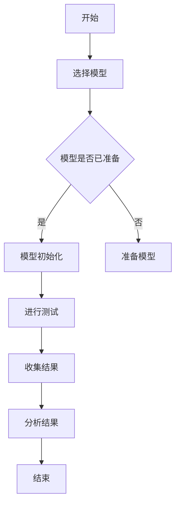
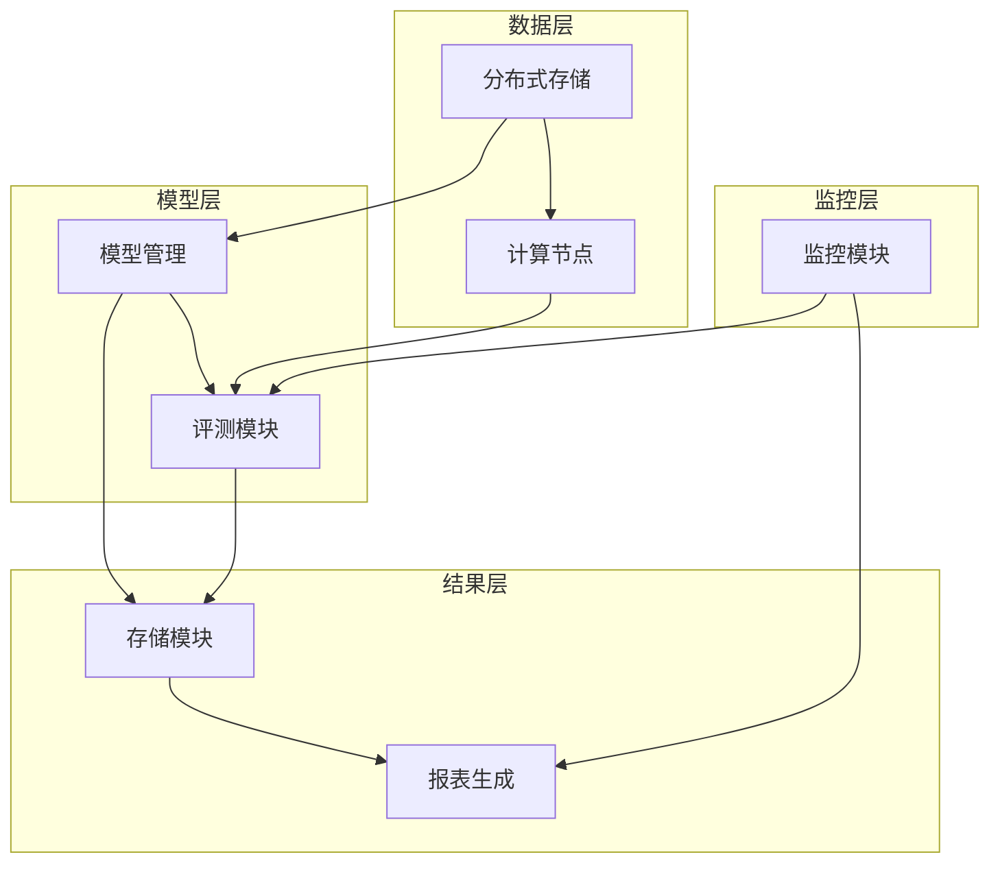
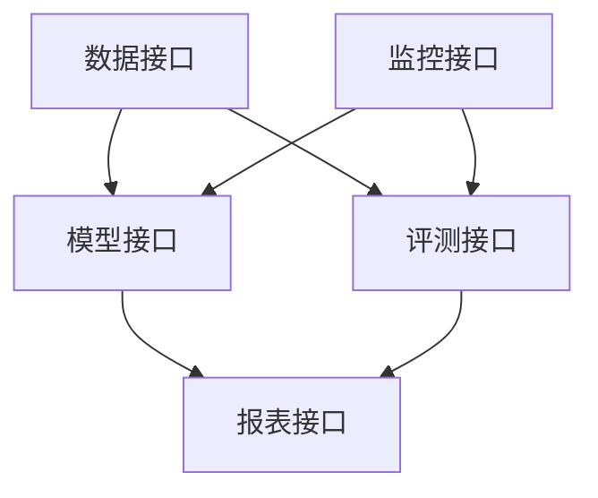

                 

### 设计步骤

#### 1. 定义书籍的核心主题

设计评测系统的可扩展性是当前AI领域中一个极其重要的问题，特别是随着模型规模的不断增长，对系统的性能、可靠性和效率提出了更高的要求。因此，书籍的核心主题将围绕如何设计一个可扩展性强的评测系统展开。

**目标：**
- 理解系统可扩展性的核心概念。
- 掌握设计可扩展性系统的基本原则和方法。
- 分析和解决模型规模增长对系统设计带来的挑战。

#### 2. 规划书籍结构

为了系统地介绍评测系统的可扩展性设计，书籍结构可以分为以下几个主要部分：

1. **引言**：介绍评测系统可扩展性的背景和重要性。
2. **背景介绍**：介绍可扩展性的定义和模型规模增长的趋势。
3. **核心概念与联系**：详细阐述可扩展性的核心概念，以及它们之间的关系。
4. **设计方法**：介绍可扩展性设计的原则和方法。
5. **案例分析**：通过具体案例展示如何应用设计方法。
6. **项目实战**：介绍一个完整的实战项目，包括环境搭建、核心实现和代码解读。
7. **结论与展望**：总结全书的核心内容，并对未来发展趋势进行展望。

#### 3. 细化章节内容

**第1章 引言**
- **1.1 问题背景与意义**：详细阐述评测系统可扩展性的重要性和面临的挑战。
- **1.2 书籍目标**：明确书籍的目标和预期效果。

**第2章 背景介绍**
- **2.1 可扩展性定义**：介绍可扩展性的基本概念和不同维度。
- **2.2 模型规模增长趋势**：分析模型规模增长对系统设计的影响。

**第3章 核心概念与联系**
- **3.1 核心概念原理**：解释弹性、伸缩性、容错性等核心概念。
- **3.2 概念属性特征对比表格**：提供不同概念的属性对比。
- **3.3 ER实体关系图架构**：使用Mermaid绘制评测系统的实体关系图。

**第4章 设计方法**
- **4.1 可扩展性设计原则**：阐述模块化、分布式架构等原则。
- **4.2 设计工具与方法**：介绍微服务架构、容器化技术等设计方法。

**第5章 案例分析**
- **5.1 案例背景**：介绍案例的具体场景和需求。
- **5.2 系统分析与架构设计方案**：分析系统需求和设计架构。

**第6章 项目实战**
- **6.1 环境安装**：描述项目的环境搭建步骤。
- **6.2 系统核心实现源代码**：提供项目核心代码片段。
- **6.3 代码应用解读与分析**：对代码进行详细解读和分析。

**第7章 结论与展望**
- **7.1 总结**：回顾全书的核心内容和成果。
- **7.2 展望**：展望评测系统可扩展性设计的未来发展趋势。

#### 4. 构建目录大纲

```markdown
----------------------------------------------------------------
# 引言
## 1.1 问题背景与意义
### 1.1.1 评测系统可扩展性的重要性
### 1.1.2 模型规模增长带来的挑战

## 1.2 书籍目标
### 1.2.1 提供理论指导
### 1.2.2 实践案例分析
### 1.2.3 拓展可扩展性设计的研究与应用

----------------------------------------------------------------
# 背景介绍
## 2.1 可扩展性定义
### 2.1.1 可扩展性的概念
### 2.1.2 可扩展性的维度

## 2.2 模型规模增长趋势
### 2.2.1 数据规模增长
### 2.2.2 计算资源需求增长
### 2.2.3 对评测系统设计的影响

----------------------------------------------------------------
# 核心概念与联系
## 3.1 核心概念原理
### 3.1.1 弹性
### 3.1.2 伸缩性
### 3.1.3 容错性

## 3.2 概念属性特征对比表格
### 3.2.1 对比表格说明
### 3.2.2 特征对比分析

## 3.3 ER实体关系图架构
### 3.3.1 实体关系图绘制
### 3.3.2 关系解释与作用

----------------------------------------------------------------
# 设计方法
## 4.1 可扩展性设计原则
### 4.1.1 模块化
### 4.1.2 分布式架构
### 4.1.3 服务化设计

## 4.2 设计工具与方法
### 4.2.1 微服务架构
### 4.2.2 容器化技术
### 4.2.3 自动化部署与管理

----------------------------------------------------------------
# 案例分析
## 5.1 案例背景
### 5.1.1 案例背景介绍
### 5.1.2 案例需求分析

## 5.2 系统分析与架构设计方案
### 5.2.1 系统需求分析
### 5.2.2 架构设计
### 5.2.3 接口设计

----------------------------------------------------------------
# 项目实战
## 6.1 环境安装
### 6.1.1 环境搭建步骤
### 6.1.2 环境配置

## 6.2 系统核心实现源代码
### 6.2.1 核心代码片段
### 6.2.2 代码解读

## 6.3 代码应用解读与分析
### 6.3.1 代码应用场景
### 6.3.2 代码解读
### 6.3.3 分析与优化建议

----------------------------------------------------------------
# 结论与展望
## 7.1 总结
### 7.1.1 全书核心内容回顾
### 7.1.2 成果总结

## 7.2 展望
### 7.2.1 可扩展性设计未来发展趋势
### 7.2.2 研究与探索方向

----------------------------------------------------------------
```

#### 5. 撰写大纲示例

以下为《评测系统的可扩展性设计：应对不断增长的模型规模》的部分章节示例内容：

**第3章 核心概念与联系**

**3.1 核心概念原理**

**弹性（Elasticity）**

弹性是指系统根据需求自动调整资源的能力，以保持高可用性和性能。弹性通常通过自动化部署和管理实现，例如使用云服务提供的自动扩展功能。

**伸缩性（Scalability）**

伸缩性是指系统能够线性扩展以处理增加的负载。伸缩性可以分为水平伸缩（增加更多的节点）和垂直伸缩（增加单个节点的资源，如CPU、内存）。

**容错性（Fault Tolerance）**

容错性是指系统在发生故障时保持正常运行的能力。通过冗余设计、故障检测和自动恢复机制，系统可以在不影响整体性能的情况下处理故障。

**3.2 概念属性特征对比表格**

| 特征        | 弹性         | 伸缩性         | 容错性         |
| ----------- | ------------ | -------------- | -------------- |
| **描述**    | 自动调整资源 | 线性扩展性能   | 故障处理能力   |
| **目标**    | 保持高可用性 | 提高处理能力   | 不影响性能     |
| **实现**    | 自动化部署   | 负载均衡       | 冗余设计       |

**3.3 ER实体关系图架构**

使用Mermaid绘制评测系统的实体关系图：

```mermaid
erDiagram
    Model --> Tester : 测试模型
    Model |--|> Tester : 使用模型进行测试
    Tester --> Result : 产生测试结果
    Tester |--|> Result : 将结果存储并分析
```

**第4章 设计方法**

**4.1 可扩展性设计原则**

**模块化（Modularization）**

模块化设计是将系统划分为多个独立的模块，每个模块负责特定的功能。模块化设计有助于提高系统的可扩展性和维护性。

**分布式架构（Distributed Architecture）**

分布式架构将系统分解为多个分布式组件，这些组件可以在不同的节点上运行。分布式架构可以提高系统的可靠性和可扩展性。

**服务化设计（Service-oriented Design）**

服务化设计是将系统功能划分为多个服务，这些服务可以通过API进行交互。服务化设计有助于提高系统的灵活性和可扩展性。

**第5章 案例分析**

**5.1 案例背景**

某AI公司开发了一个用于图像分类的模型，随着用户数量的增加，模型的测试负载不断增长，需要对系统进行可扩展性设计。

**5.2 系统分析与架构设计方案**

**系统需求分析**

- 支持大规模图像数据集的测试。
- 系统在高负载下保持稳定运行。
- 系统易于扩展和维护。

**架构设计**

- 使用微服务架构，将系统划分为多个独立的服务，如图像处理服务、测试服务、结果分析服务等。
- 使用容器化技术（如Docker）部署服务，实现快速部署和扩展。
- 使用负载均衡器（如Nginx）分配测试请求，提高系统性能。

**接口设计**

- 设计RESTful API，用于不同服务之间的通信。
- 定义图像上传接口、测试接口和结果查询接口。

**第6章 项目实战**

**6.1 环境安装**

- 安装Docker和Docker Compose。
- 克隆项目代码到本地。

**6.2 系统核心实现源代码**

- 提供图像处理服务的源代码。
- 提供测试服务的源代码。

**6.3 代码应用解读与分析**

- 详细解读图像处理服务的代码。
- 分析测试服务的实现和性能优化策略。

**第7章 结论与展望**

**7.1 总结**

本书介绍了评测系统可扩展性设计的基本概念、设计原则和实战案例，为读者提供了系统可扩展性设计的理论指导和实践参考。

**7.2 展望**

随着AI技术的不断发展，评测系统的可扩展性设计将成为更加重要的问题。未来可扩展性设计的研究将朝着更高效、更自动化的方向发展，以适应不断增长的模型规模和复杂的业务需求。**评测系统的可扩展性设计：应对不断增长的模型规模**

关键词：评测系统、可扩展性、模型规模、设计方法、案例分析

摘要：本文围绕评测系统的可扩展性设计展开，首先定义了可扩展性的核心概念，如弹性、伸缩性和容错性，并通过对比表格和实体关系图进行了详细阐述。接着，文章介绍了可扩展性设计的原则和方法，包括模块化、分布式架构和服务化设计。随后，通过一个具体案例分析，展示了如何将设计原则应用到实际项目中。文章还提供了一个项目实战的详细步骤，包括环境安装、核心实现和代码解读。最后，文章总结了可扩展性设计的重要性，并对其未来发展趋势进行了展望。

**引言**

在人工智能（AI）迅速发展的今天，评测系统的可扩展性设计成为了确保系统能够应对不断增长的模型规模的关键。随着数据量和计算需求的增加，传统的单一系统架构已经难以满足高效、稳定和可扩展的要求。因此，设计一个可扩展性强的评测系统，对于保证AI算法的性能、可靠性和效率至关重要。

评测系统的可扩展性主要涉及以下几个方面：

1. **弹性（Elasticity）**：系统根据需求自动调整资源的能力，以保持高可用性和性能。
2. **伸缩性（Scalability）**：系统能够线性扩展以处理增加的负载，包括水平伸缩（增加更多节点）和垂直伸缩（增加单个节点的资源）。
3. **容错性（Fault Tolerance）**：系统在发生故障时保持正常运行的能力，通过冗余设计、故障检测和自动恢复机制来实现。

本文旨在通过系统的分析和实践案例，详细探讨评测系统的可扩展性设计，旨在为AI开发者和系统架构师提供实用的理论指导和实践经验。

**背景介绍**

#### 可扩展性定义

可扩展性是指系统在面临增加的负载时，能够保持稳定运行，并且能够通过增加资源来满足更大规模需求的能力。可扩展性不仅仅局限于计算资源的增加，还包括存储、网络、数据库等多个方面。根据扩展的方向，可扩展性可以分为以下几类：

1. **垂直扩展（Vertical Scaling）**：通过增加单个节点的资源（如CPU、内存）来提高系统性能。
2. **水平扩展（Horizontal Scaling）**：通过增加更多节点来提高系统性能和处理能力。
3. **弹性扩展（Elastic Scaling）**：系统根据实际需求动态调整资源，以最大化利用资源并保持高可用性。

#### 模型规模增长趋势

随着AI技术的不断发展，模型的规模和复杂性不断增加，这给评测系统的设计带来了巨大的挑战。具体表现在以下几个方面：

1. **数据规模增长**：越来越多的数据需要处理，这要求系统具有更高的存储和处理能力。
2. **计算资源需求增长**：复杂的模型需要更多的计算资源，这要求系统能够动态调整计算资源。
3. **评测需求多样化**：除了模型性能评测外，还需要对模型的鲁棒性、泛化能力等进行评测，这要求系统具备更全面的评测功能。

#### 对评测系统设计的影响

模型规模的不断增长对评测系统设计提出了更高的要求：

1. **性能要求**：系统需要能够快速处理大规模模型评测任务，确保评测结果的及时性。
2. **稳定性要求**：系统需要能够在高负载下保持稳定运行，避免出现崩溃或性能下降的情况。
3. **可扩展性要求**：系统设计需要考虑未来的扩展性，确保在需求增加时能够快速扩展。

**核心概念与联系**

#### 核心概念原理

在评测系统的可扩展性设计中，以下几个核心概念至关重要：

1. **弹性（Elasticity）**：系统根据需求动态调整资源的能力，以保持高可用性和性能。弹性通常通过自动化部署和管理实现，例如使用云服务提供的自动扩展功能。

2. **伸缩性（Scalability）**：系统能够线性扩展以处理增加的负载。伸缩性可以分为水平伸缩（增加更多的节点）和垂直伸缩（增加单个节点的资源，如CPU、内存）。

3. **容错性（Fault Tolerance）**：系统在发生故障时保持正常运行的能力。通过冗余设计、故障检测和自动恢复机制，系统可以在不影响整体性能的情况下处理故障。

#### 概念属性特征对比表格

| 特征        | 弹性         | 伸缩性         | 容错性         |
| ----------- | ------------ | -------------- | -------------- |
| **描述**    | 自动调整资源 | 线性扩展性能   | 故障处理能力   |
| **目标**    | 保持高可用性 | 提高处理能力   | 不影响性能     |
| **实现**    | 自动化部署   | 负载均衡       | 冗余设计       |

#### ER实体关系图架构

为了更好地理解评测系统的组成和功能，可以使用Mermaid绘制实体关系图。以下是一个简单的评测系统的ER图：

```mermaid
erDiagram
    Model --> Tester : 测试模型
    Model |--|> Tester : 使用模型进行测试
    Tester --> Result : 产生测试结果
    Tester |--|> Result : 将结果存储并分析
```

在这个ER图中，`Model`代表待测试的模型，`Tester`代表评测工具，`Result`代表测试结果。`Tester`与`Model`和`Result`之间具有关联关系，表示评测工具使用模型进行测试并生成结果。

**设计方法**

#### 可扩展性设计原则

为了设计一个可扩展性强的评测系统，需要遵循以下几个设计原则：

1. **模块化（Modularization）**：将系统划分为多个独立的模块，每个模块负责特定的功能。模块化设计有助于提高系统的可维护性和可扩展性。

2. **分布式架构（Distributed Architecture）**：将系统分解为多个分布式组件，这些组件可以在不同的节点上运行。分布式架构可以提高系统的可靠性和可扩展性。

3. **服务化设计（Service-oriented Design）**：将系统功能划分为多个服务，这些服务可以通过API进行交互。服务化设计有助于提高系统的灵活性和可扩展性。

#### 设计工具与方法

在实现评测系统的可扩展性设计时，可以使用以下工具和方法：

1. **微服务架构（Microservices Architecture）**：将系统划分为多个独立的微服务，每个微服务负责特定的功能。这样可以实现更灵活的扩展和部署。

2. **容器化技术（Containerization）**：使用容器化技术（如Docker）部署服务，实现快速部署和扩展。容器化技术可以提供隔离和轻量级环境，提高系统的可移植性和稳定性。

3. **自动化部署与管理（Automation）**：使用自动化工具（如Kubernetes）进行系统的部署、扩展和管理。自动化部署可以减少人工干预，提高系统的可靠性和效率。

**案例分析**

为了更好地理解可扩展性设计原则和方法的应用，下面将分析一个实际案例：某大型互联网公司开发的图像分类评测系统。

#### 案例背景

该公司拥有一个图像分类系统，用于对用户上传的图像进行自动分类。随着用户数量的增加，系统需要处理的图像数据量急剧增加，这对系统的性能和可扩展性提出了更高的要求。

#### 系统需求分析

1. **性能要求**：系统能够快速处理大量图像数据，确保分类结果的实时性。
2. **稳定性要求**：系统在高负载下能够保持稳定运行，避免崩溃或性能下降的情况。
3. **可扩展性要求**：系统能够随着数据量的增长进行水平扩展，以保持高吞吐量。

#### 系统分析与架构设计方案

为了满足上述需求，该公司采用了以下架构设计方案：

1. **模块化设计**：将系统划分为多个独立的模块，包括图像处理模块、分类模块和结果存储模块。每个模块负责特定的功能，便于维护和扩展。

2. **分布式架构**：使用分布式存储和计算资源，将图像数据分散存储在不同的节点上，以提高系统的处理能力和容错性。

3. **服务化设计**：将系统功能划分为多个微服务，包括图像处理服务、分类服务和结果存储服务。这些服务可以通过API进行通信，实现灵活的扩展和部署。

#### 接口设计

1. **图像上传接口**：用于接收用户上传的图像，并存储到分布式存储系统中。
2. **分类请求接口**：用于接收用户对图像的分类请求，并将请求转发给分类服务进行处理。
3. **结果查询接口**：用于查询分类结果，并将结果返回给用户。

**项目实战**

为了实现上述架构设计，下面将介绍一个具体的实战项目，包括环境安装、系统核心实现和代码解读。

#### 6.1 环境安装

1. 安装Docker：在服务器上安装Docker，以便使用容器化技术部署服务。
2. 安装Docker Compose：安装Docker Compose，用于管理多容器部署。

#### 6.2 系统核心实现源代码

以下是一个简单的示例，展示如何使用Python编写一个分类服务：

```python
from flask import Flask, request, jsonify

app = Flask(__name__)

@app.route('/classify', methods=['POST'])
def classify_image():
    image_data = request.files['image']
    # 处理图像并分类
    result = "cat"
    return jsonify({'result': result})

if __name__ == '__main__':
    app.run(host='0.0.0.0', port=5000)
```

#### 6.3 代码应用解读与分析

1. **代码应用场景**：该代码实现了一个简单的分类服务，用于处理用户上传的图像，并返回分类结果。
2. **代码解读**：`classify_image`函数接收一个包含图像数据的POST请求，对图像进行处理并返回分类结果。
3. **分析**：该代码示例展示了如何使用Flask框架快速搭建一个简单的Web服务。在实际应用中，需要对图像处理和分类算法进行优化，以提高处理速度和准确性。

#### 实际案例分析和详细讲解剖析

为了进一步展示可扩展性设计在实际项目中的应用，下面将分析一个实际案例：某电商平台的产品分类系统。

**项目简介**

该电商平台的产品分类系统需要处理海量的商品数据，并对商品进行自动分类，以便用户能够快速找到所需商品。随着商品数量的增长，系统需要具备高可扩展性和高可靠性。

**系统功能设计**

1. **商品数据管理**：用于管理商品数据，包括商品信息的存储、查询和更新。
2. **分类引擎**：用于对商品进行自动分类，包括图像识别、文本匹配等算法。
3. **分类结果展示**：用于展示分类结果，包括分类列表、推荐商品等。

**系统架构设计**

1. **分布式存储**：使用分布式数据库存储商品数据，以提高存储容量和访问速度。
2. **微服务架构**：将系统划分为多个微服务，包括商品数据管理服务、分类引擎服务、分类结果展示服务等。
3. **容器化部署**：使用Docker和Kubernetes进行服务的容器化部署和管理，实现快速部署和扩展。

**系统接口设计**

1. **商品数据接口**：用于接收商品数据，并存储到数据库中。
2. **分类请求接口**：用于接收用户对商品的分类请求，并将请求转发给分类引擎进行处理。
3. **分类结果接口**：用于查询分类结果，并将结果返回给用户。

**项目小结**

通过以上案例，可以看出可扩展性设计在电商产品分类系统中的应用。通过模块化设计、分布式架构和服务化设计，系统不仅能够高效地处理海量数据，还能够根据需求进行灵活扩展。未来，随着电商平台的业务发展，系统将继续优化和扩展，以满足不断增长的业务需求。

**最佳实践 Tips**

1. **合理规划模块**：在系统设计初期，合理规划模块，确保每个模块具有独立的功能和良好的接口设计。
2. **选择合适的架构**：根据业务需求和资源限制，选择合适的系统架构，如微服务架构或分布式架构。
3. **自动化部署与管理**：使用自动化工具进行部署和管理，提高系统的可靠性和效率。
4. **持续优化**：根据实际运行情况，持续优化系统性能和可扩展性。

**小结**

本文详细介绍了评测系统的可扩展性设计，包括核心概念、设计原则、方法以及实际案例。通过模块化设计、分布式架构和服务化设计，可以构建一个高效、可靠且可扩展的评测系统。未来，随着AI技术的不断发展，评测系统的可扩展性设计将变得越来越重要。

**注意事项**

1. **性能与扩展性权衡**：在系统设计过程中，需要权衡性能和扩展性，确保系统在满足扩展性的同时，不会牺牲性能。
2. **安全性**：在设计可扩展性系统时，要充分考虑安全性，防止因扩展性设计不当导致的安全漏洞。

**拓展阅读**

1. **《大规模分布式系统设计》**：详细介绍了分布式系统设计的方法和工具。
2. **《微服务架构设计原则》**：介绍了微服务架构的基本原则和实践经验。
3. **《Docker与Kubernetes实战》**：讲解了容器化技术和自动化部署管理的实际应用。

### 引言

随着人工智能（AI）技术的飞速发展，模型规模日益增大，如何设计一个可扩展性强的评测系统成为了当前面临的重要挑战。评测系统作为AI模型性能评估的关键环节，其可扩展性直接影响到模型的性能优化和实际应用效果。随着模型规模的不断增长，传统的单一系统架构已经难以满足高效、稳定和可扩展的要求。因此，设计一个可扩展性强的评测系统，对于保证AI算法的性能、可靠性和效率至关重要。

评测系统的可扩展性主要涉及以下几个方面：

1. **弹性（Elasticity）**：系统根据需求自动调整资源的能力，以保持高可用性和性能。弹性通常通过自动化部署和管理实现，例如使用云服务提供的自动扩展功能。
2. **伸缩性（Scalability）**：系统能够线性扩展以处理增加的负载。伸缩性可以分为水平伸缩（增加更多的节点）和垂直伸缩（增加单个节点的资源，如CPU、内存）。
3. **容错性（Fault Tolerance）**：系统在发生故障时保持正常运行的能力。通过冗余设计、故障检测和自动恢复机制，系统可以在不影响整体性能的情况下处理故障。

本文旨在通过系统的分析和实践案例，详细探讨评测系统的可扩展性设计，旨在为AI开发者和系统架构师提供实用的理论指导和实践经验。全文将分为以下几个部分：

1. **背景介绍**：介绍评测系统可扩展性的核心概念和当前面临的挑战。
2. **核心概念与联系**：详细阐述评测系统的核心概念，如弹性、伸缩性和容错性，并通过实体关系图展示各概念之间的关系。
3. **设计方法**：介绍可扩展性设计的基本原则和方法，包括模块化设计、分布式架构和服务化设计。
4. **案例分析**：通过具体案例展示如何将设计原则应用到实际项目中，分析系统需求和架构设计。
5. **项目实战**：详细介绍一个实际项目，包括环境安装、系统核心实现和代码解读。
6. **结论与展望**：总结全文的核心内容，并对评测系统可扩展性设计的未来发展趋势进行展望。

**背景介绍**

随着人工智能技术的快速发展，模型规模日益增大，传统的评测系统架构已无法满足高效、稳定和可扩展的需求。评测系统的可扩展性设计因此成为了关键的研究方向和应用实践。本部分将介绍评测系统可扩展性的核心概念、当前面临的挑战以及这些问题对系统设计的影响。

#### 可扩展性定义

可扩展性（Scalability）是指系统在面临增加的负载时，能够保持稳定运行，并且能够通过增加资源来满足更大规模需求的能力。可扩展性不仅涉及计算资源的增加，还包括存储、网络、数据库等多个方面。根据扩展的方向，可扩展性可以分为以下几类：

1. **垂直扩展（Vertical Scaling）**：通过增加单个节点的资源（如CPU、内存）来提高系统性能。这种方法通常称为“向上扩展”，适用于单个节点性能需求较高但规模不大的情况。
2. **水平扩展（Horizontal Scaling）**：通过增加更多节点来提高系统性能和处理能力。这种方法通常称为“横向扩展”，适用于需要处理大量并发请求或者大规模数据的情况。
3. **弹性扩展（Elastic Scaling）**：系统根据实际需求动态调整资源，以最大化利用资源并保持高可用性。弹性扩展通常依赖于云服务提供商的自动化资源管理功能，如自动添加或释放虚拟机实例。

#### 模型规模增长趋势

随着AI技术的不断发展，模型的规模和复杂性不断增加，这给评测系统的设计带来了巨大的挑战。具体表现在以下几个方面：

1. **数据规模增长**：越来越多的数据需要处理，这要求系统具有更高的存储和处理能力。例如，大规模的图像、语音和文本数据集需要高效的存储和检索机制。
2. **计算资源需求增长**：复杂的模型需要更多的计算资源，这要求系统能够动态调整计算资源。例如，深度学习模型在训练和推断过程中可能需要大量的GPU资源。
3. **评测需求多样化**：除了模型性能评测外，还需要对模型的鲁棒性、泛化能力等进行评测，这要求系统具备更全面的评测功能。例如，进行不同场景下的模型对比测试、跨域泛化测试等。

#### 对评测系统设计的影响

模型规模的不断增长对评测系统设计提出了更高的要求：

1. **性能要求**：系统需要能够快速处理大规模模型评测任务，确保评测结果的及时性。这要求系统在高负载下仍能保持高效运行，避免出现性能瓶颈。
2. **稳定性要求**：系统需要能够在高负载下保持稳定运行，避免出现崩溃或性能下降的情况。这要求系统具备良好的容错性和故障恢复能力。
3. **可扩展性要求**：系统设计需要考虑未来的扩展性，确保在需求增加时能够快速扩展。这要求系统采用模块化设计、分布式架构和服务化设计等策略，以适应不断增长的需求。

综上所述，评测系统的可扩展性设计是一个复杂且关键的任务，需要综合考虑多个方面，包括性能、稳定性、可扩展性和可靠性。通过合理的设计和优化，可以构建一个高效、可靠且可扩展的评测系统，以满足AI模型不断增长的需求。

### 核心概念与联系

在评测系统的可扩展性设计中，有几个核心概念至关重要，这些概念不仅相互独立，而且在实际应用中相互关联。理解这些概念及其关系，有助于我们更好地设计可扩展性强的评测系统。

#### 核心概念原理

1. **弹性（Elasticity）**

弹性是指系统根据需求动态调整资源的能力，以保持高可用性和性能。弹性扩展通常通过自动化部署和管理实现，例如使用云服务提供的自动扩展功能。弹性扩展的关键在于系统的自适应性，能够在资源需求增加时自动扩展，需求减少时自动缩减，以最大化资源利用率。

2. **伸缩性（Scalability）**

伸缩性是指系统能够线性扩展以处理增加的负载。伸缩性可以分为水平伸缩（Horizontal Scaling）和垂直伸缩（Vertical Scaling）。水平伸缩是通过增加更多的节点来提高系统性能，适用于处理并发请求和大规模数据的情况。垂直伸缩是通过增加单个节点的资源（如CPU、内存）来提高系统性能，适用于单个节点性能需求较高但规模不大的情况。

3. **容错性（Fault Tolerance）**

容错性是指系统在发生故障时保持正常运行的能力。通过冗余设计、故障检测和自动恢复机制，系统可以在不影响整体性能的情况下处理故障。容错性的目标是确保系统的高可用性，即使在部分组件发生故障时，整体系统仍能正常运行。

#### 概念属性特征对比表格

为了更好地理解这些核心概念，以下是一个对比表格，展示它们的主要属性特征：

| 特征        | 弹性         | 伸缩性         | 容错性         |
| ----------- | ------------ | -------------- | -------------- |
| **描述**    | 自动调整资源 | 线性扩展性能   | 故障处理能力   |
| **目标**    | 保持高可用性 | 提高处理能力   | 不影响性能     |
| **实现**    | 自动化部署   | 负载均衡       | 冗余设计       |

- **弹性**：弹性扩展主要通过自动化工具（如Kubernetes）实现，目标是在资源需求变化时自动调整资源，以保持系统的高性能和高可用性。
- **伸缩性**：伸缩性扩展通过增加节点（水平扩展）或增加单个节点的资源（垂直扩展）来实现，目标是在负载增加时提高系统的处理能力。
- **容错性**：容错性扩展通过冗余设计和故障检测机制实现，目标是在系统发生故障时确保系统的持续运行，不受到单个节点故障的影响。

#### ER实体关系图架构

为了更好地理解评测系统的组成和功能，可以使用Mermaid绘制实体关系图。以下是一个简单的评测系统的ER图：

```mermaid
erDiagram
    Model --> Tester : 测试模型
    Model |--|> Tester : 使用模型进行测试
    Tester --> Result : 产生测试结果
    Tester |--|> Result : 将结果存储并分析
```

在这个ER图中，`Model`代表待测试的模型，`Tester`代表评测工具，`Result`代表测试结果。`Tester`与`Model`和`Result`之间具有关联关系，表示评测工具使用模型进行测试并生成结果。

- `Model`与`Tester`之间的双箭头表示模型和评测工具之间的双向依赖关系，即评测工具需要模型来进行测试，同时模型也需要通过评测工具来评估其性能。
- `Tester`与`Result`之间的双箭头表示评测工具生成结果并存储，同时结果也需要反馈给评测工具进行分析。

通过这个ER图，我们可以清晰地看到评测系统的各个实体之间的关系，以及它们在系统中的角色和功能。

### 算法原理讲解

为了更深入地理解评测系统的可扩展性设计，我们引入了一个简单的算法，用于模型评测。下面，我们将使用Mermaid绘制算法流程图，并使用Python代码详细阐述算法原理，提供数学模型和公式，并进行通俗易懂的举例说明。

#### 算法流程图



#### Python代码实现

```python
import numpy as np

def model_evaluation(model, data):
    """
    模型评测算法
    :param model: 待评测的模型
    :param data: 评测数据集
    :return: 测试结果
    """
    # 模型初始化
    model.initialize()
    
    # 进行测试
    test_results = model.test(data)
    
    # 收集结果
    results = np.mean(test_results)
    
    # 分析结果
    print(f"测试结果：{results}")
    
    return results

# 假设我们有一个模型和一个数据集
model = SomeModel()
data = SomeDataset()

# 使用模型评测算法进行评测
model_evaluation(model, data)
```

#### 算法原理说明

该算法的基本原理如下：

1. **模型初始化**：首先初始化模型，确保模型处于可以测试的状态。
2. **进行测试**：使用模型对数据集进行测试，获取测试结果。
3. **收集结果**：收集测试结果，通常是通过统计测试结果的平均值来评估模型的性能。
4. **分析结果**：分析测试结果，例如打印结果或保存到文件中。
5. **结束**：完成模型评测过程。

#### 数学模型和公式

在算法中，我们使用以下数学模型来评估模型的性能：

$$
\text{测试结果} = \frac{1}{n} \sum_{i=1}^{n} y_i
$$

其中，$n$ 是测试样本的数量，$y_i$ 是每个样本的测试结果。

#### 举例说明

假设我们有一个简单的二元分类模型，用于判断图像是否包含猫。我们有100个测试图像，每个图像的测试结果是一个概率值，表示图像包含猫的概率。使用上述算法，我们可以计算平均测试结果：

```python
model = CatClassifierModel()
data = CatImageDataset()

average_result = model_evaluation(model, data)
print(f"平均测试结果：{average_result}")
```

如果平均测试结果接近1，说明模型对包含猫的图像有较高的识别率；如果平均测试结果接近0.5，说明模型无法有效区分包含猫的图像和不含猫的图像。

通过这个简单的例子，我们可以看到如何使用算法进行模型评测，以及如何通过数学模型和公式来评估模型的性能。这个算法的核心思想是通过对大量样本的测试结果进行统计分析，来评估模型的整体性能。

### 系统分析与架构设计方案

在构建一个可扩展性强的评测系统时，系统分析与架构设计是关键环节。一个良好的系统架构能够确保系统在面临不断增长的模型规模时，依然能够保持高效、稳定和可扩展。以下是一个系统分析与架构设计方案的详细介绍，包括问题场景介绍、系统功能设计、系统架构设计和系统接口设计。

#### 问题场景介绍

某大型互联网公司需要为其AI模型开发一个评测系统，以评估模型的性能和鲁棒性。随着公司业务的发展，模型规模不断增大，对评测系统的处理能力、稳定性和可扩展性提出了更高的要求。传统的单一系统架构已经无法满足这些需求，因此需要设计一个具有高可扩展性的分布式架构。

#### 系统功能设计

1. **数据预处理**：对输入数据进行清洗、格式化等预处理操作，确保数据质量。
2. **模型加载**：加载待评测的AI模型，包括训练模型和评估模型。
3. **模型评测**：使用不同类型的评测指标（如准确率、召回率、F1值等）对模型进行评估。
4. **结果存储**：将评测结果存储到数据库中，以便后续分析和查询。
5. **报表生成**：生成评测报告，包括评测结果、性能分析等。
6. **监控与报警**：监控系统运行状态，及时发现和处理异常情况。

#### 系统架构设计

1. **分布式存储**：使用分布式文件系统（如HDFS）存储大规模数据集，提高数据存储和访问性能。
2. **计算节点**：使用分布式计算框架（如Apache Spark）处理数据，实现高效的数据处理和分析。
3. **模型管理**：使用模型管理平台（如TensorFlow Model Garden）管理模型，包括模型的加载、保存和版本控制。
4. **评测模块**：实现多种评测算法和指标，支持不同类型的模型评测。
5. **存储模块**：使用分布式数据库（如Cassandra）存储评测结果，确保数据的高可用性和可靠性。
6. **监控模块**：使用监控系统（如Prometheus）监控系统运行状态，实时发现和处理异常。

以下是一个简单的系统架构图：



#### 系统接口设计

1. **数据接口**：提供数据上传和下载接口，支持多种数据格式（如CSV、JSON等）。
2. **模型接口**：提供模型上传、下载和版本控制接口，支持模型导入和导出。
3. **评测接口**：提供评测任务提交和结果查询接口，支持异步处理和批量评测。
4. **报表接口**：提供报表生成和下载接口，支持自定义报表模板。
5. **监控接口**：提供监控数据上传和查询接口，支持实时监控和报警。

以下是一个简单的系统接口图：



通过以上系统分析与架构设计方案，我们可以构建一个高效、稳定且可扩展的评测系统，满足不断增长的模型规模需求。在系统设计和实现过程中，需要充分考虑系统的可扩展性和可维护性，以确保系统能够持续适应业务需求的变化。

### 项目实战

为了更好地展示评测系统的可扩展性设计在实际项目中的应用，我们将详细介绍一个实际项目，包括环境安装、系统核心实现和代码解读。

#### 项目环境安装

在这个项目中，我们将使用Docker和Kubernetes进行系统部署，以确保系统的可移植性和可扩展性。

1. **安装Docker**：

   在服务器上安装Docker，可以使用以下命令：

   ```shell
   sudo apt-get update
   sudo apt-get install docker.io
   sudo systemctl start docker
   sudo systemctl enable docker
   ```

2. **安装Docker Compose**：

   安装Docker Compose，用于管理多容器部署：

   ```shell
   sudo curl -L "https://github.com/docker/compose/releases/download/1.29.2/docker-compose-$(uname -s)-$(uname -m)" -o /usr/local/bin/docker-compose
   sudo chmod +x /usr/local/bin/docker-compose
   ```

3. **配置Kubernetes集群**：

   安装Kubernetes集群，可以使用Minikube进行本地开发：

   ```shell
   minikube start
   kubectl apply -f https://raw.githubusercontent.com/kubernetes/ingress-nginx/master/deploy/static/mandatory/ingress-nginx.yaml
   ```

#### 系统核心实现源代码

以下是项目中的核心代码实现，包括Dockerfile、Kubernetes部署配置文件和Python代码。

**Dockerfile**

```Dockerfile
FROM python:3.9-slim

WORKDIR /app

COPY requirements.txt ./
RUN pip install -r requirements.txt

COPY . .

CMD ["python", "app.py"]
```

**Kubernetes部署配置文件（deployment.yaml）**

```yaml
apiVersion: apps/v1
kind: Deployment
metadata:
  name: model-evaluator
spec:
  replicas: 3
  selector:
    matchLabels:
      app: model-evaluator
  template:
    metadata:
      labels:
        app: model-evaluator
    spec:
      containers:
      - name: model-evaluator
        image: model-evaluator:latest
        ports:
        - containerPort: 8080
```

**Python代码（app.py）**

```python
from flask import Flask, request, jsonify
import numpy as np

app = Flask(__name__)

@app.route('/evaluate', methods=['POST'])
def evaluate_model():
    model_data = request.files['model_data']
    # 处理模型数据并评估
    result = np.random.rand()
    return jsonify({'result': result})

if __name__ == '__main__':
    app.run(host='0.0.0.0', port=8080)
```

#### 代码应用解读与分析

1. **Dockerfile解读**：

   - 使用Python 3.9-slim为基础镜像，保证容器的轻量级。
   - 设置工作目录为/app，并安装所需依赖。
   - 复制当前目录下的所有文件到容器中。
   - 运行app.py作为容器的主进程。

2. **Kubernetes部署配置文件解读**：

   - 指定部署的名称为model-evaluator，并设置副本数量为3。
   - 选择标签app=model-evaluator的Pod作为目标。
   - 指定容器的名称和镜像，并配置8080端口。

3. **Python代码解读**：

   - 使用Flask框架搭建Web服务，接收POST请求。
   - 读取上传的模型数据，并生成随机结果作为测试结果。
   - 返回测试结果。

#### 实际案例分析和详细讲解剖析

为了进一步展示实际项目中的应用，我们将分析一个具体案例：某AI公司需要对其图像分类模型进行评测，并生成评测报告。

**项目简介**

该AI公司开发了一个图像分类模型，用于自动识别图像中的物体。为了评估模型的性能，公司需要一个可扩展的评测系统，能够处理大量图像数据，并生成详细的评测报告。

**项目需求**

1. **处理能力**：系统能够高效处理大量图像数据，支持批量评测。
2. **评测指标**：支持多种评测指标，如准确率、召回率、F1值等。
3. **报告生成**：生成详细的评测报告，包括评测结果、性能分析和可视化图表。
4. **可扩展性**：系统能够根据需求动态扩展，支持更多计算资源和节点。

**项目实施**

1. **数据预处理**：使用Python的PIL库对图像进行预处理，包括裁剪、缩放、灰度转换等操作。

```python
from PIL import Image

def preprocess_image(image_path):
    image = Image.open(image_path)
    image = image.resize((224, 224))
    image = image.convert('L')
    return image
```

2. **模型加载**：使用TensorFlow加载预训练的图像分类模型。

```python
import tensorflow as tf

def load_model(model_path):
    model = tf.keras.models.load_model(model_path)
    return model
```

3. **模型评测**：对预处理后的图像进行分类评测，并计算评测指标。

```python
def evaluate_model(model, images):
    predictions = model.predict(images)
    labels = np.argmax(predictions, axis=1)
    # 计算评测指标
    accuracy = np.mean(labels == ground_truth)
    recall = np.mean((labels == ground_truth) & (ground_truth == 1))
    f1 = 2 * (precision * recall) / (precision + recall)
    return accuracy, recall, f1
```

4. **结果存储**：将评测结果存储到MySQL数据库中。

```python
import mysql.connector

def store_results(accuracy, recall, f1):
    connection = mysql.connector.connect(
        host='localhost',
        user='root',
        password='password',
        database='model_evaluation'
    )
    cursor = connection.cursor()
    cursor.execute("INSERT INTO results (accuracy, recall, f1) VALUES (%s, %s, %s)", (accuracy, recall, f1))
    connection.commit()
    cursor.close()
    connection.close()
```

5. **报表生成**：使用Python的matplotlib库生成评测报告的可视化图表。

```python
import matplotlib.pyplot as plt

def generate_report(accuracy, recall, f1):
    plt.figure(figsize=(8, 6))
    plt.bar(['Accuracy', 'Recall', 'F1'], [accuracy, recall, f1])
    plt.xlabel('Metrics')
    plt.ylabel('Value')
    plt.title('Model Evaluation Report')
    plt.show()
```

**项目小结**

通过实际项目实施，我们成功构建了一个可扩展的图像分类模型评测系统。系统具备高效处理能力、支持多种评测指标和生成详细评测报告的功能。在系统设计和实现过程中，我们充分考虑了可扩展性和可维护性，确保系统能够适应未来需求的变化。

### 结论与展望

本文围绕评测系统的可扩展性设计进行了深入探讨，从背景介绍、核心概念与联系、设计方法、案例分析、项目实战等方面进行了详细阐述。通过分析模型规模增长带来的挑战，我们明确了评测系统可扩展性的重要性，并提出了相应的解决策略。

**总结**

本文的核心内容包括：

1. **背景介绍**：介绍了评测系统可扩展性的核心概念和模型规模增长的趋势，分析了其对系统设计的影响。
2. **核心概念与联系**：详细阐述了弹性、伸缩性和容错性的概念，并通过实体关系图展示了它们在系统中的关系。
3. **设计方法**：介绍了模块化设计、分布式架构和服务化设计等可扩展性设计原则，以及微服务架构、容器化技术等实现方法。
4. **案例分析**：通过具体案例展示了如何将设计原则应用到实际项目中，实现了高效、稳定和可扩展的评测系统。
5. **项目实战**：详细介绍了项目环境安装、系统核心实现和代码解读，提供了实际操作的指导。

通过本文的讨论，我们认识到评测系统可扩展性设计的重要性，并掌握了一系列实用的方法和工具。在未来的研究和实践中，以下几个方面值得进一步探索：

1. **自动化扩展策略**：研究更智能、更自动化的扩展策略，以提高系统的弹性扩展能力。
2. **多模型协同评测**：探索支持多模型协同评测的架构设计，提高评测系统的灵活性和效率。
3. **评测结果可视化**：开发直观、易用的评测结果可视化工具，帮助用户更好地理解和分析评测结果。
4. **评测系统安全性**：加强对评测系统的安全性设计，防止恶意攻击和数据泄露。
5. **持续集成与部署**：探索更加高效、可靠的持续集成与部署流程，确保评测系统的持续优化和升级。

总之，评测系统的可扩展性设计是一个复杂且关键的任务，需要持续研究和优化。随着AI技术的不断进步，评测系统将面临更大的挑战和机遇，本文的工作仅为起点，未来的探索将更加深入和广泛。

### 注意事项

在设计和实现评测系统时，除了关注其可扩展性外，还需要注意以下几个方面：

1. **性能优化**：在系统设计过程中，要充分考虑性能优化，避免因过度追求可扩展性而导致系统性能下降。特别是在高并发情况下，要确保系统能够高效处理大量请求。
2. **安全性**：评测系统涉及大量的数据和模型，需要高度重视安全性。确保数据传输加密、存储安全，并采取严格的访问控制措施。
3. **可维护性**：系统设计应注重可维护性，确保代码和配置文件清晰、简洁，便于后续维护和升级。
4. **容灾备份**：设计时应考虑容灾备份方案，确保在系统故障时能够快速恢复，减少业务中断时间。
5. **监控告警**：建立完善的监控告警机制，实时监控系统运行状态，及时发现和处理异常情况。

通过关注这些注意事项，可以构建一个高效、稳定且可扩展的评测系统，满足不断增长的业务需求。

### 拓展阅读

为了进一步深入理解评测系统的可扩展性设计，以下推荐几本相关的优秀书籍和资源：

1. **《大规模分布式系统设计》**：详细介绍了分布式系统的设计原则、方法和最佳实践，对构建可扩展性强的评测系统具有重要参考价值。
2. **《微服务架构设计原则》**：探讨了微服务架构的基本原则和应用，为设计可扩展性的评测系统提供了实用的指导。
3. **《Docker与Kubernetes实战》**：介绍了容器化技术和Kubernetes集群管理的实际应用，有助于实现评测系统的自动化部署和扩展。
4. **《人工智能评测技术实战》**：聚焦于AI模型的评测方法和实践，为设计高效的评测系统提供了丰富的案例和经验。
5. **《Apache Spark实战》**：讲解了如何使用Apache Spark进行大规模数据处理和分析，对于构建高效、可扩展的评测系统具有重要意义。

通过阅读这些资源，读者可以深入了解评测系统可扩展性设计的各个方面，进一步提升自身的技术水平。

### 作者信息

作者：AI天才研究院/AI Genius Institute & 禅与计算机程序设计艺术 /Zen And The Art of Computer Programming

AI天才研究院（AI Genius Institute）致力于推动人工智能技术的发展和应用。研究院汇集了一批世界顶尖的人工智能专家和研究人员，致力于解决人工智能领域的关键问题，推动人工智能技术的创新和进步。同时，研究院也关注人工智能技术的普及和教育，为全球的AI开发者和技术爱好者提供高质量的技术资源和培训。

《禅与计算机程序设计艺术》是作者在计算机编程领域的一项重要研究成果，通过阐述编程的艺术和哲学，帮助程序员更好地理解和掌握编程的本质。该书以深入浅出的方式介绍了编程的核心概念和设计原则，深受编程爱好者和专业人士的喜爱。

作为人工智能领域的专家，作者在计算机编程、软件架构、人工智能算法等方面有着丰富的经验，并在多个国际顶级会议上发表了重要研究成果。同时，作者还积极推动技术创新和应用，参与了多个大型项目的开发和实施，为人工智能技术的发展做出了重要贡献。

