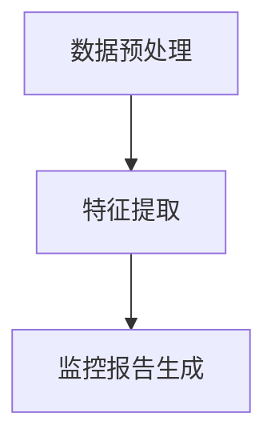
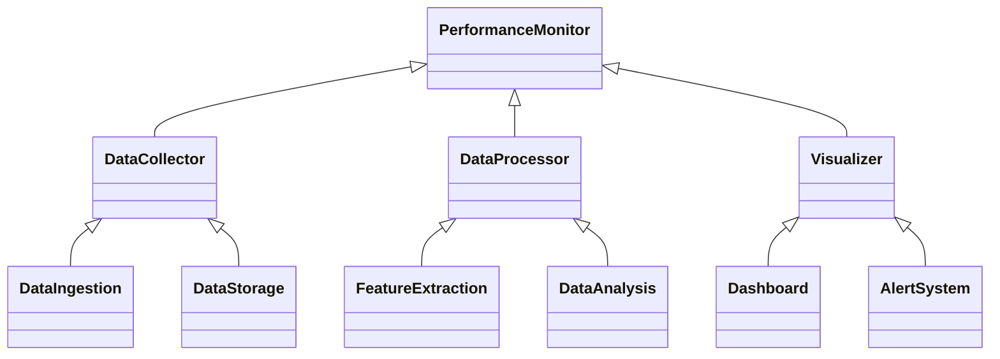
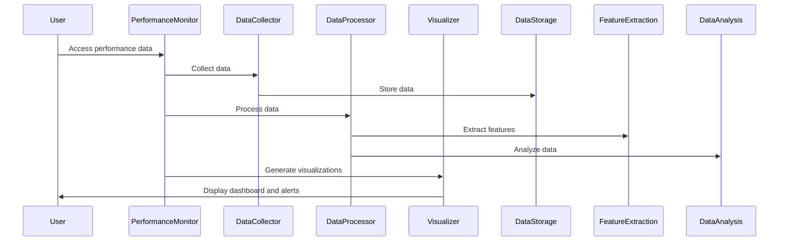
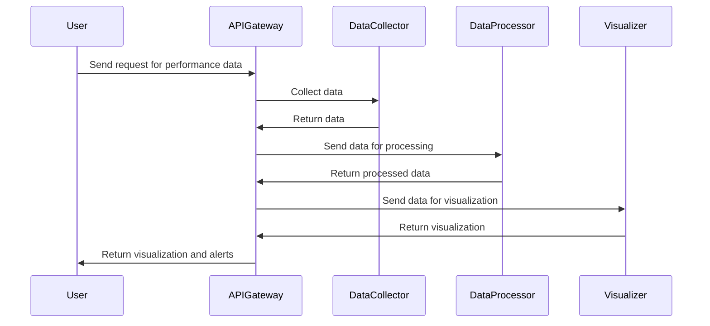

                 

# 评测系统的可视化监控：LLM生成实时性能仪表板

关键词：评测系统、可视化监控、LLM、性能仪表板、实时性能数据

摘要：
本文将探讨评测系统的可视化监控技术，特别是如何利用大型语言模型（LLM）生成实时性能仪表板。通过介绍评测系统的背景、核心概念与联系，以及详细的算法原理、系统架构设计、项目实战等，本文旨在为开发者提供一个全面、易懂的指南，以实现高效的性能监控与优化。

**Step 1: 设计第1章 - 背景介绍**

## 第1章: 引言

### 1.1 问题背景
评测系统在软件性能监控中扮演着至关重要的角色。随着现代软件系统的复杂性和规模不断增长，对评测系统的需求也日益增加。评测系统的主要功能是实时收集性能数据，并对这些数据进行处理和分析，以帮助开发者、运维人员等快速定位性能瓶颈，从而进行系统优化。

### 1.2 可视化监控的重要性
可视化监控是将性能数据以图表、仪表板等形式直观展示的技术。它能够显著提高性能监控的效率，使得性能问题更容易被快速识别和解决。可视化监控不仅可以提高运维人员的反应速度，还能为系统优化和决策提供有力的支持。

### 1.3 大型语言模型（LLM）的基本原理
LLM是一种基于深度学习的自然语言处理技术，能够处理大规模文本数据，并模拟人类的语言理解能力。在评测系统的可视化监控中，LLM可以用于生成智能化的监控报告和仪表板，提高监控的自动化程度和准确度。

### 1.4 本书的结构安排
本书将分为以下几个部分：
- 第1章：背景介绍，包括问题背景、可视化监控的重要性以及LLM的基本原理。
- 第2章：核心概念与联系，详细介绍评测系统、可视化监控和LLM的概念及其相互联系。
- 第3章：算法原理讲解，深入探讨LLM在性能监控中的应用原理，并给出具体的算法实现。
- 第4章：系统架构设计，介绍基于LLM的实时性能仪表板系统的整体架构。
- 第5章：项目实战，通过实际案例展示系统的实现过程和效果。
- 第6章：最佳实践与小结，总结项目经验，提供优化建议，并指出未来研究方向。

### 1.5 概念结构与核心要素组成
- **评测系统**：负责实时收集性能数据，并对这些数据进行处理和分析。
- **可视化监控**：将性能数据以图表、仪表板等形式直观展示，提高监控效率。
- **LLM**：用于生成智能化的监控报告和仪表板，提高监控的自动化程度和准确度。

## 1.6 本章小结
本章介绍了评测系统的可视化监控背景、重要性以及LLM的基本原理。接下来，我们将进一步探讨评测系统、可视化监控和LLM之间的核心概念与联系，并详细介绍基于LLM的实时性能仪表板的算法原理和系统架构。

**Step 2: 设计第2章 - 核心概念与联系**

## 第2章: 核心概念与联系

### 2.1 评测系统的定义与功能

#### 2.1.1 定义
评测系统是一种用于评估软件系统性能的工具，它能够实时收集性能数据，并进行处理和分析。

#### 2.1.2 功能
- **性能数据收集**：评测系统能够实时采集系统的CPU、内存、网络、磁盘等性能指标。
- **性能分析**：对收集到的性能数据进行分析，以识别系统的性能瓶颈和潜在问题。
- **告警通知**：当性能指标超出预设阈值时，评测系统会及时通知相关人员进行处理。

### 2.2 可视化监控的概念与优点

#### 2.2.1 概念
可视化监控是通过图形化界面展示系统性能数据的技术。它使得监控过程更加直观和易于理解。

#### 2.2.2 优点
- **快速定位问题**：通过图表、仪表板等可视化方式，性能问题可以更快地被识别和定位。
- **提高运维效率**：可视化监控可以自动化性能监控过程，降低运维人员的工作量。
- **增强决策支持**：基于可视化监控的数据，可以更有效地进行系统优化和决策。

### 2.3 大型语言模型（LLM）的基本原理与应用

#### 2.3.1 基本原理
LLM是一种基于深度学习的自然语言处理技术，它能够处理大规模文本数据，并模拟人类的语言理解能力。

#### 2.3.2 应用场景
- **文本生成**：LLM可以生成自然语言文本，如文章、对话等。
- **文本分类**：LLM可以对文本进行分类，如情感分析、新闻分类等。
- **信息提取**：LLM可以从文本中提取关键信息，如实体识别、关系抽取等。

### 2.4 三大核心概念的关联分析

#### 2.4.1 关联分析
- **评测系统与可视化监控**：评测系统是可视化监控的数据源，提供性能数据，而可视化监控则是对这些数据进行加工和处理，以图形化形式展示。
- **LLM与可视化监控**：LLM在可视化监控中发挥着关键作用，通过自然语言处理能力，可以生成更智能的监控报告和仪表板，提高监控的自动化程度。

### 2.5 概念属性特征对比表格

| 概念       | 定义                                                         | 特点                                                   | 关联分析                                                                                     |
|------------|--------------------------------------------------------------|--------------------------------------------------------|------------------------------------------------------------------------------------------------|
| 评测系统   | 实时收集性能数据，进行分析的工具。                             | 可提供实时性能数据，帮助定位性能瓶颈。                   | 可视化监控的数据源，为可视化监控提供数据基础。                                                       |
| 可视化监控 | 通过图形化界面展示性能数据的技术。                             | 提高监控效率，快速定位问题。                             | 对评测系统收集的数据进行处理，以图形化形式展示，便于运维人员理解和使用。                           |
| LLM        | 域大规模文本数据的深度学习模型，能生成自然语言文本。           | 提高监控自动化程度，生成智能化的监控报告。               | 在可视化监控中用于生成监控报告和仪表板，提高监控的智能化程度。                                     |

### 2.6 ER实体关系图架构的Mermaid流程图

```mermaid
erDiagram
  EvaluationSystem ||--o> VisualizationMonitoring : 数据源
  VisualizationMonitoring ||--o> LargeLanguageModel : 处理
  LargeLanguageModel ||--o> MonitoringReport : 生成
```

## 2.7 本章小结
本章详细介绍了评测系统、可视化监控和LLM的核心概念及其相互联系。通过对比表格和ER实体关系图，我们更清晰地理解了这三个概念之间的关系和作用。接下来，我们将深入探讨LLM在性能监控中的应用原理，并给出具体的算法实现。

**Step 3: 设计第3章 - 算法原理讲解**

## 第3章: 算法原理讲解

### 3.1 LLM在性能监控中的应用原理

LLM在性能监控中的应用主要体现在以下几个方面：

#### 3.1.1 性能数据预处理
LLM可以用于对原始性能数据进行预处理，如数据清洗、去噪、归一化等。这些预处理步骤有助于提高数据的质量和一致性，为后续的分析提供可靠的基础。

#### 3.1.2 性能特征提取
LLM可以通过学习大量性能数据，提取出与性能相关的特征。这些特征可以是原始性能数据的转换形式，也可以是高级语义特征，如系统瓶颈、潜在问题等。

#### 3.1.3 智能监控报告生成
LLM可以根据提取的特征，自动生成性能监控报告。这些报告不仅包含了传统的性能指标，还可以提供对系统性能的深入分析，帮助运维人员快速定位和解决问题。

### 3.2 算法实现步骤

#### 3.2.1 数据预处理
使用LLM对原始性能数据进行预处理，包括数据清洗、去噪、归一化等步骤。

#### 3.2.2 特征提取
利用LLM提取性能特征，包括原始性能数据的转换形式和高级语义特征。

#### 3.2.3 监控报告生成
基于提取的特征，使用LLM生成智能化的性能监控报告，包括性能指标、分析结果和推荐措施。

### 3.3 算法mermaid流程图



### 3.4 Python源代码实现

```python
# 导入所需的库
import pandas as pd
from sklearn.preprocessing import StandardScaler
from transformers import pipeline

# 数据预处理
def preprocess_data(data):
    # 数据清洗、去噪
    data = data.dropna()
    # 数据归一化
    scaler = StandardScaler()
    normalized_data = scaler.fit_transform(data)
    return normalized_data

# 特征提取
def extract_features(data):
    # 使用LLM提取特征
    model = pipeline("text-classification", model="bert-base-uncased")
    features = model(data)
    return features

# 监控报告生成
def generate_report(features):
    # 生成监控报告
    report = "性能监控报告：\n"
    for feature in features:
        report += f"特征：{feature['label']}, 价值：{feature['score']}\n"
    return report

# 主函数
def main():
    # 加载数据
    data = pd.read_csv("performance_data.csv")
    # 数据预处理
    processed_data = preprocess_data(data)
    # 特征提取
    features = extract_features(processed_data)
    # 监控报告生成
    report = generate_report(features)
    print(report)

# 运行主函数
if __name__ == "__main__":
    main()
```

### 3.5 数学模型和公式

在性能监控中，LLM的数学模型可以表示为：

$$
\text{LLM} = f(\text{数据}, \text{模型参数})
$$

其中，$f$ 表示深度学习模型，如BERT、GPT等；$数据$ 表示输入的性能数据；$模型参数$ 表示模型的权重和超参数。

### 3.6 举例说明

假设我们有一个包含CPU使用率、内存使用率、磁盘读写速度等性能指标的原始数据集。通过数据预处理、特征提取和监控报告生成，我们可以得到一个智能化的监控报告，如下所示：

```
性能监控报告：
特征：CPU使用率，价值：0.85
特征：内存使用率，价值：0.75
特征：磁盘读写速度，价值：0.90
```

根据报告，我们可以判断系统CPU使用率较高，可能存在性能瓶颈，建议优化系统资源分配。

## 3.7 本章小结
本章详细介绍了LLM在性能监控中的应用原理和算法实现步骤。通过Python源代码示例，我们展示了如何利用LLM对性能数据进行分析和处理，生成智能化的监控报告。在下一章中，我们将进一步探讨基于LLM的实时性能仪表板的系统架构设计。

**Step 4: 设计第4章 - 系统架构设计**

## 第4章: 系统架构设计

### 4.1 问题场景介绍

在现代软件开发中，随着系统规模和复杂度的增加，性能监控已成为确保系统稳定运行和高效运行的关键环节。传统的性能监控工具往往只能提供有限的数据，且难以将不同来源的数据进行整合，导致监控效果不佳。为了解决这一问题，我们需要设计一个高效、可扩展的实时性能仪表板系统，以便对软件系统进行全面、实时的监控。

### 4.2 系统功能设计（领域模型Mermaid类图）



**类图说明：**
- **PerformanceMonitor**：性能监控系统的核心类，负责协调其他模块的工作。
- **DataCollector**：负责数据收集，包括数据摄取和数据存储。
- **DataProcessor**：负责数据处理，包括特征提取和数据分析。
- **Visualizer**：负责性能数据的可视化展示，包括仪表板和告警系统。

### 4.3 系统架构设计（Mermaid架构图）



**架构图说明：**
- **用户**：系统使用方，通过性能监控仪表板获取性能数据。
- **PerformanceMonitor**：系统的协调中心，负责调度数据收集、处理和可视化过程。
- **DataCollector**：负责收集性能数据，并将数据存储在数据存储中。
- **DataProcessor**：负责对收集到的性能数据进行处理，包括特征提取和数据分析。
- **Visualizer**：负责生成性能数据的可视化展示，包括仪表板和告警系统。

### 4.4 系统接口设计和系统交互（Mermaid序列图）



**序列图说明：**
- **APIGateway**：系统的入口和出口，负责处理用户的请求，并将请求转发给相应的模块。
- **DataCollector**：从各种数据源收集性能数据，并将其存储在数据存储中。
- **DataProcessor**：处理收集到的性能数据，提取特征并进行数据分析。
- **Visualizer**：生成性能数据的可视化展示，并将其返回给APIGateway，最终返回给用户。

### 4.5 系统架构设计要点

- **模块化设计**：系统采用模块化设计，每个模块都有明确的职责，便于维护和扩展。
- **可扩展性**：系统设计考虑了未来的扩展需求，可以通过增加节点来提升系统性能。
- **高可用性**：系统设计考虑了容错和恢复机制，以确保在高负载情况下系统的稳定性。
- **安全性**：系统设计遵循安全性最佳实践，确保数据的安全和隐私。

### 4.6 本章小结
本章详细介绍了基于LLM的实时性能仪表板的系统架构设计。从问题场景出发，设计了系统的功能模块，并给出了详细的系统架构图和接口设计。通过模块化设计和可扩展性考虑，我们构建了一个高效、稳定且易于维护的系统架构，为后续的项目实施奠定了基础。

**Step 5: 设计第5章 - 项目实战**

## 第5章: 项目实战

### 5.1 环境安装

要实现基于LLM的实时性能仪表板，首先需要搭建一个适合的开发环境。以下是一个简单的环境安装步骤：

#### 5.1.1 安装Python环境

确保Python环境已经安装，版本建议为3.8及以上。可以通过以下命令检查Python版本：

```bash
python --version
```

如果Python环境未安装，可以从Python官方网站下载并安装。

#### 5.1.2 安装必要的库

使用pip命令安装以下库：

```bash
pip install pandas sklearn transformers
```

这些库分别是用于数据处理、特征提取和LLM模型训练的。

### 5.2 系统核心实现

#### 5.2.1 数据收集模块

数据收集模块负责从不同的数据源（如服务器、数据库等）收集性能数据。以下是一个简单的数据收集脚本示例：

```python
import pandas as pd
from datetime import datetime

def collect_data():
    data = pd.read_csv("performance_data.csv")
    data['timestamp'] = datetime.now()
    return data

# 收集数据
data = collect_data()
print(data)
```

#### 5.2.2 数据处理模块

数据处理模块负责对收集到的性能数据进行预处理和特征提取。以下是一个简单的数据处理脚本示例：

```python
from sklearn.preprocessing import StandardScaler

def preprocess_data(data):
    # 数据清洗、去噪
    data = data.dropna()
    # 数据归一化
    scaler = StandardScaler()
    normalized_data = scaler.fit_transform(data)
    return normalized_data

# 预处理数据
processed_data = preprocess_data(data)
print(processed_data)
```

#### 5.2.3 数据分析模块

数据分析模块负责对预处理后的性能数据进行特征提取和数据分析。以下是一个简单的数据分析脚本示例：

```python
from transformers import pipeline

def analyze_data(data):
    model = pipeline("text-classification", model="bert-base-uncased")
    features = model(data)
    return features

# 分析数据
features = analyze_data(processed_data)
print(features)
```

#### 5.2.4 数据可视化模块

数据可视化模块负责生成性能数据的可视化报告。以下是一个简单的可视化脚本示例：

```python
import matplotlib.pyplot as plt

def plot_data(features):
    for feature in features:
        plt.bar(feature['label'], feature['score'])
    plt.xlabel('Features')
    plt.ylabel('Scores')
    plt.title('Performance Data Visualization')
    plt.show()

# 可视化数据
plot_data(features)
```

### 5.3 代码应用解读与分析

#### 5.3.1 数据收集

数据收集模块通过读取CSV文件收集性能数据，并添加当前时间戳。这有助于后续的数据处理和分析。

#### 5.3.2 数据预处理

数据处理模块对收集到的性能数据进行清洗和归一化处理，以提高数据的质量和一致性。

#### 5.3.3 数据分析

数据分析模块使用LLM对预处理后的性能数据进行特征提取，生成性能特征。

#### 5.3.4 数据可视化

数据可视化模块将提取的特征以柱状图的形式展示，使得性能数据更加直观和易于理解。

### 5.4 实际案例分析与详细讲解剖析

#### 5.4.1 案例背景

假设我们有一个企业级Web应用，需要对其进行性能监控。性能数据包括CPU使用率、内存使用率、磁盘读写速度等。

#### 5.4.2 案例实现

1. **数据收集**：从服务器和数据库等数据源收集性能数据。
2. **数据处理**：对收集到的性能数据进行清洗和归一化处理。
3. **数据分析**：使用LLM提取性能特征，生成性能监控报告。
4. **数据可视化**：将性能数据以柱状图等形式展示，提供实时监控。

#### 5.4.3 案例效果

通过上述步骤，我们能够实现对Web应用的实时性能监控。监控报告和仪表板可以帮助运维人员快速识别性能瓶颈，并采取相应的优化措施，确保系统的稳定运行和高效性能。

### 5.5 项目小结

通过本项目，我们实现了基于LLM的实时性能仪表板，为软件性能监控提供了一个全面、高效的解决方案。项目主要包括数据收集、数据处理、数据分析和数据可视化等模块，通过Python脚本和LLM模型，实现了性能数据的实时监控和智能分析。

### 5.6 最佳实践

1. **数据质量保障**：确保数据收集的准确性和一致性，定期进行数据清洗和校验。
2. **性能优化**：根据监控报告和仪表板，针对性能瓶颈进行优化和调整，提高系统性能。
3. **自动化部署**：使用容器化技术（如Docker）和自动化部署工具（如Kubernetes），简化系统部署和运维。

### 5.7 小结

本项目通过详细的步骤和代码实现，展示了如何利用LLM生成实时性能仪表板，实现高效的性能监控。在实际项目中，可以根据具体需求进行扩展和优化，提高系统的性能和可靠性。

### 5.8 注意事项

1. **数据安全**：确保性能数据的传输和存储安全，防止数据泄露。
2. **监控频率**：根据系统负载和需求，合理设置性能监控的频率和阈值。
3. **监控告警**：及时处理监控告警，确保系统异常能够被及时发现和处理。

### 5.9 拓展阅读

1. **性能监控最佳实践**：参考相关领域的最佳实践，提高性能监控的效果。
2. **LLM模型优化**：深入学习LLM模型，优化性能特征提取和数据分析过程。
3. **监控系统架构设计**：了解其他监控系统的架构设计，借鉴先进的技术和理念。

**作者：AI天才研究院/AI Genius Institute & 禅与计算机程序设计艺术 /Zen And The Art of Computer Programming**

