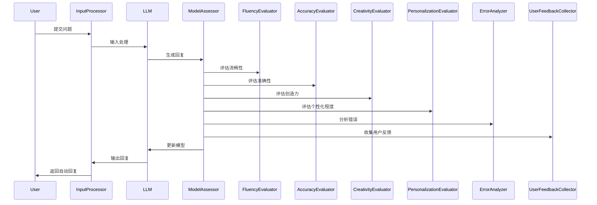
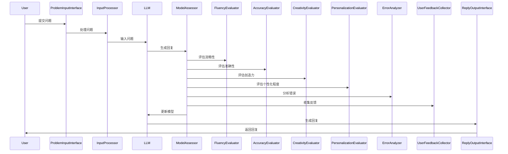
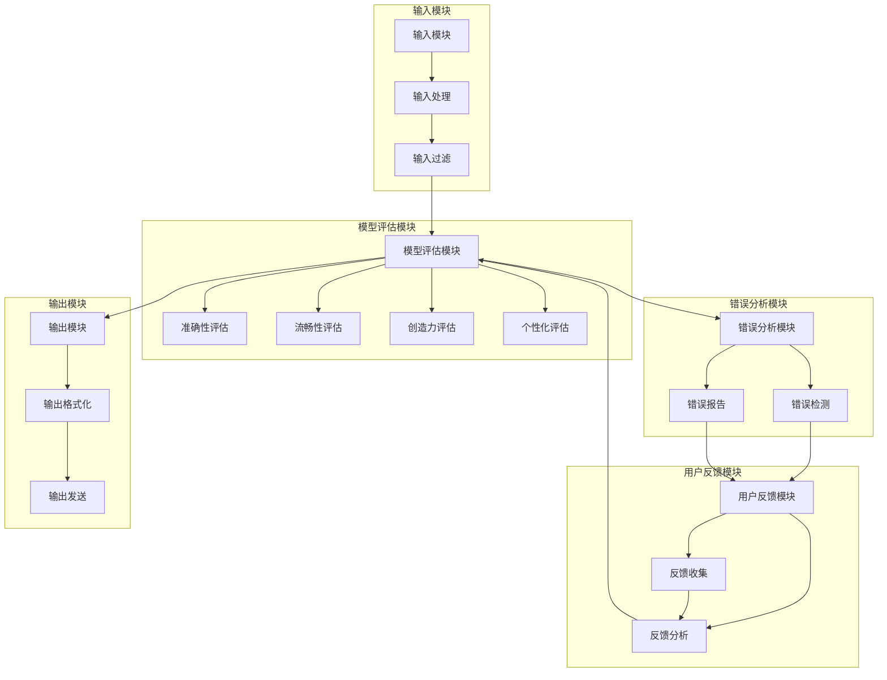
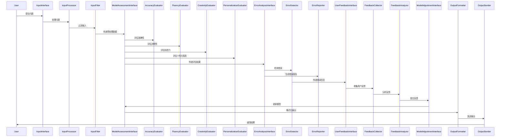
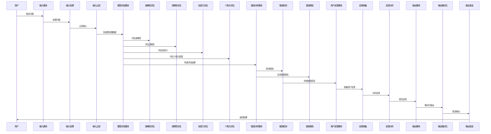

                 

### 第一部分：问题背景

#### 1.1 评测系统在人工智能领域的重要性

在当今快速发展的技术时代，人工智能（AI）和机器学习（ML）已经成为各个行业的关键驱动力量。评测系统（Evaluation System）作为一种评估AI和ML模型性能的工具，在人工智能领域中扮演着至关重要的角色。本节将探讨评测系统在AI和ML中的应用、面临的挑战与需求。

**核心概念**：

- **评测系统**：一种用于评估AI和ML模型性能的框架，通过一系列指标和算法，对模型的准确性、鲁棒性、效率等进行综合评价。
- **人工智能（AI）**：模拟人类智能的技术和系统，通过学习和适应环境，实现自动化的决策和问题解决。
- **机器学习（ML）**：AI的一个分支，通过数据训练，使计算机能够自动进行模式识别和预测。

**问题描述**：

评测系统在AI和ML中的应用非常广泛。例如，在金融领域，评测系统可以评估信用评分模型的准确性，预测客户违约风险；在医疗领域，评测系统可以评估疾病诊断模型的准确性，提高诊断的准确性。然而，随着模型复杂度和数据规模的增加，评测系统面临着诸多挑战：

- **挑战**：如何全面、准确地评估模型性能？如何处理数据偏差和过拟合问题？如何快速、高效地进行评测？
- **需求**：开发高效、准确的评测系统，以满足不同领域的需求；提高模型的可解释性和透明度，增强用户信任。

**问题解决**：

评测系统通过以下方式帮助理解和优化AI模型：

- **性能评估**：通过多种指标（如准确率、召回率、F1分数等）评估模型在不同数据集上的性能。
- **错误分析**：分析模型在特定数据点上的错误，找出模型存在的不足。
- **模型对比**：对不同模型进行评估和比较，选择性能最佳的模型。

**边界与外延**：

评测系统的范围涵盖了从模型训练到部署的整个生命周期。其功能包括：

- **模型选择**：评估不同模型的性能，选择最佳模型。
- **模型调优**：通过调整模型参数，优化模型性能。
- **模型验证**：验证模型在新的数据集上的性能，确保模型泛化能力。
- **模型部署**：评估模型在实际应用场景中的性能，确保模型稳定运行。

**概念结构与核心要素组成**：

评测系统的组成部分包括：

- **评估指标**：用于评估模型性能的指标，如准确率、召回率、F1分数等。
- **评估算法**：用于计算评估指标的算法，如交叉验证、混淆矩阵等。
- **数据集**：用于训练和评估模型的训练集、验证集和测试集。
- **工具库**：提供各种评估工具和算法的库，方便用户进行模型评估。

#### 1.2 LLM（大型语言模型）的发展与挑战

随着深度学习技术的飞速发展，大型语言模型（LLM，Large Language Model）已经成为自然语言处理（NLP，Natural Language Processing）领域的重要工具。LLM通过大规模的文本数据进行训练，能够生成高质量的文本，并被广泛应用于对话系统、文本生成、文本摘要等领域。然而，随着LLM的规模和复杂度不断增加，其决策过程和效果也面临着一系列挑战。

**核心概念**：

- **LLM**：一种基于深度学习的语言模型，通过大规模文本数据进行训练，能够生成高质量的自然语言文本。
- **自然语言处理（NLP）**：研究如何使计算机理解和处理人类自然语言的技术和系统。
- **深度学习**：一种基于多层神经网络的人工智能技术，通过学习大量数据，实现数据的自动特征提取和模式识别。

**问题描述**：

LLM在决策中的应用与效果如下：

- **应用**：LLM被广泛应用于对话系统、文本生成、文本摘要、机器翻译等领域，能够生成高质量的自然语言文本，提高系统的智能水平。
- **效果**：随着LLM的规模和复杂度增加，其生成文本的质量和多样性也得到显著提升。

然而，LLM的决策过程和效果也面临着以下问题：

- **可解释性**：LLM的决策过程高度复杂，缺乏透明性，难以解释其背后的原因。
- **偏差**：LLM在训练过程中可能会学习到数据中的偏见和错误，导致生成文本存在偏见。
- **泛化能力**：LLM在特定领域或任务上表现优秀，但在其他领域或任务上可能缺乏泛化能力。

**问题解决**：

为了提高LLM的可解释性，可以采取以下措施：

- **模型可视化**：通过可视化技术，展示LLM的内部结构和决策过程，帮助用户理解模型的工作原理。
- **解释方法**：开发新的解释方法，如注意力机制、决策路径追踪等，分析LLM在决策过程中的关键因素。
- **数据增强**：通过引入多样化的训练数据，减少模型偏见，提高生成文本的质量。

**边界与外延**：

LLM的技术发展、应用领域和面临的难题如下：

- **技术发展**：LLM的发展依赖于深度学习技术的进步，如神经网络架构、优化算法等。
- **应用领域**：LLM被广泛应用于多个领域，如自然语言处理、文本生成、对话系统等。
- **面临的难题**：如何提高LLM的可解释性、如何解决数据偏见和泛化能力问题等。

**概念结构与核心要素组成**：

LLM的技术架构和训练过程包括：

- **技术架构**：多层神经网络、注意力机制、Transformer架构等。
- **训练过程**：大规模文本数据训练、优化算法、模型调优等。

LLM的应用场景包括：

- **对话系统**：如聊天机器人、智能客服等。
- **文本生成**：如文章生成、摘要生成等。
- **文本摘要**：如新闻摘要、文档摘要等。
- **机器翻译**：如英语翻译、中文翻译等。

综上所述，评测系统和LLM在人工智能领域具有重要的地位。评测系统通过评估和优化AI模型，提高模型性能和可解释性；而LLM作为自然语言处理的重要工具，其决策过程和效果也面临着一系列挑战。理解LLM的可解释性，有助于我们更好地应用和优化这一技术，推动人工智能的发展。

#### 1.3 评测系统与LLM的关系

在了解了评测系统和LLM的基本概念和重要性后，我们需要进一步探讨这两者之间的关系。评测系统与LLM之间既有相互促进的一面，也存在一定的矛盾和挑战。

**评测系统对LLM的影响**：

1. **性能评估**：评测系统为LLM提供了性能评估的标准，帮助开发者了解模型在不同任务上的表现。通过多种评估指标（如准确率、召回率、F1分数等），评测系统能够全面、准确地评估LLM的决策质量。
   
2. **模型优化**：通过评测系统的评估结果，开发者可以识别LLM在特定任务上的弱点，从而有针对性地进行模型优化。例如，如果评测系统显示LLM在长文本摘要任务上的效果较差，开发者可以调整模型架构或优化训练过程，以提高该任务的表现。

3. **泛化能力评估**：评测系统不仅评估LLM在训练数据集上的表现，还评估其在新数据集上的泛化能力。这有助于开发者了解LLM的稳定性和可靠性，确保模型在实际应用中的表现。

4. **可解释性提升**：评测系统可以通过分析错误案例和模型输出，为LLM的可解释性提供参考。例如，通过分析LLM在特定场景下的错误决策，开发者可以理解模型是如何处理这些数据的，从而改进模型的设计和解释方法。

**LLM对评测系统的影响**：

1. **评测复杂性增加**：随着LLM的规模和复杂度增加，评测系统的设计和实现变得更加复杂。例如，传统评测系统可能只关注模型在标准数据集上的性能，而LLM可能需要更复杂的多任务评测框架，以全面评估其性能。

2. **评测指标多样性**：LLM的应用场景多样化，对评测系统提出了更高的要求。例如，在文本生成任务中，除了准确性和流畅性，还需要考虑文本的连贯性、创造性等指标。这要求评测系统能够支持多种评测指标的组合和计算。

3. **评测效率提升**：LLM的高效性和并行处理能力，可以提高评测系统的执行效率。例如，通过使用LLM，评测系统可以在短时间内处理大量数据，快速评估模型性能。

**两者之间的矛盾和挑战**：

1. **隐私保护**：在评测LLM时，可能需要访问大量的训练数据和用户数据。这引发了对用户隐私保护的担忧。如何在保障用户隐私的前提下，有效评测LLM的性能，是一个亟待解决的问题。

2. **数据偏差**：评测系统使用的数据集可能存在偏差，这会影响评测结果的准确性。例如，如果数据集过于偏向某一特定领域，评测系统可能会低估LLM在其他领域的表现。如何构建多样化、无偏差的数据集，是提高评测系统质量的关键。

3. **解释性挑战**：LLM的决策过程高度复杂，其内部结构和参数难以解释。尽管评测系统可以提供性能评估结果，但用户往往难以理解LLM为何做出特定决策。如何提高LLM的可解释性，使其决策过程更加透明，是一个重要的研究课题。

4. **计算资源**：大规模评测LLM需要大量的计算资源。如何高效利用现有资源，确保评测系统的可行性和实用性，是开发者需要考虑的问题。

综上所述，评测系统和LLM之间存在着紧密的联系和相互作用。通过评测系统，开发者可以全面、准确地评估LLM的性能和效果；而LLM的技术进步，也为评测系统的设计和实现带来了新的机遇和挑战。理解两者之间的关系，有助于我们更好地利用评测系统优化LLM，推动人工智能技术的发展。

### 2.1 可解释性与透明度

可解释性（Explainability）和透明度（Transparency）是人工智能领域特别是大型语言模型（LLM）应用中的关键概念。在机器学习中，模型的可解释性指的是用户能够理解和追踪模型决策过程的能力。透明度则更加广泛，涉及模型如何处理输入数据，以及决策背后的逻辑和算法。本节将探讨可解释性和透明度的核心概念，对比不同方法的优劣，并使用实体关系图（ER图）来展示评测系统与LLM之间的关系。

**核心概念**：

- **可解释性**：指用户可以理解模型如何根据输入数据做出决策的能力。高可解释性的模型通常具有清晰的决策路径和易于理解的结构。
- **透明度**：指模型内部处理过程的可见性，包括数据流、算法流程和决策逻辑。透明度更高的模型允许用户深入了解模型的内部工作原理。

**概念属性特征对比表格**：

| 概念 | 定义 | 特征 |
| --- | --- | --- |
| 可解释性 | 用户理解模型决策路径 | 决策路径清晰、易于理解 |
| 透明度 | 模型内部处理过程的可见性 | 数据流、算法流程、决策逻辑可见 |

| 优点 | 用户可以追踪和验证模型的决策 | 用户可以了解模型如何处理输入数据 |
| 缺点 | 模型可能需要牺牲一些性能来保持可解释性 | 过高透明度可能导致性能下降 |
| 适用场景 | 需要用户理解和验证决策的场景，如医疗诊断、金融风险评估 | 需要深入分析模型内部逻辑的场景，如模型调试、优化 |

**ER实体关系图架构**：

为了更好地理解评测系统与LLM之间的关系，我们可以使用ER图来展示两者之间的交互和依赖。

```mermaid
erDiagram
  Model Evaluation --> Model Output
  Model Evaluation --> Evaluation Metrics
  Model Output --> Prediction
  Evaluation Metrics --> Model Performance

  Class ModelEvaluation {
    - metrics
    - model
    - performance
  }

  Class ModelOutput {
    - prediction
    - inputs
  }

  Class EvaluationMetrics {
    - accuracy
    - precision
    - recall
    - f1Score
  }

  Class ModelPerformance {
    - trainingData
    - testData
  }
```

在这个ER图中：

- `ModelEvaluation` 代表评测系统，负责评估模型输出和计算评价指标。
- `ModelOutput` 代表模型的输出，包括预测结果和输入数据。
- `EvaluationMetrics` 代表评估指标，如准确率、精确率、召回率和F1分数。
- `ModelPerformance` 代表模型的性能数据，包括训练数据和测试数据。

通过这个ER图，我们可以清晰地看到评测系统如何与LLM交互，以及它们之间的关系。评测系统使用模型的输出数据来计算评估指标，进而评估模型的整体性能。

**总结**：

可解释性和透明度是评估和优化AI模型的重要指标。通过提高模型的可解释性，用户可以更好地理解模型的决策过程，增强对模型的信任。同时，透明度使得模型的内部逻辑和处理过程更加清晰，有助于模型调试和优化。ER图提供了一个直观的方式，展示了评测系统与LLM之间的关系，有助于我们深入理解这两者之间的相互作用。

### 2.2 LLM的决策过程与解释方法

大型语言模型（LLM）的决策过程复杂且高度非线性，其背后的逻辑和机制对用户而言往往难以理解。本节将详细探讨LLM的决策过程，并介绍几种常见的解释方法，通过实体关系图（ER图）来分析LLM决策中的关键实体和关系，并对比不同解释方法的适用场景。

**核心概念**：

- **决策过程**：指LLM从输入数据生成输出结果的全过程，包括特征提取、权重计算、输出生成等环节。
- **解释方法**：指用于分析和解释LLM决策过程的技术手段，如注意力机制分析、决策路径追踪等。

**决策过程**：

LLM的决策过程可以分解为以下几个主要环节：

1. **输入处理**：LLM接收用户输入的文本数据，将其转换为模型可以理解的向量表示。
2. **特征提取**：通过多层神经网络，提取输入文本中的关键特征，如词嵌入、句嵌入等。
3. **权重计算**：模型根据训练数据学习到的权重，对提取到的特征进行加权处理。
4. **输出生成**：基于加权特征，模型生成最终的输出结果，如文本回复、分类结果等。

**解释方法**：

以下是几种常见的LLM解释方法：

1. **注意力机制分析**：
   - **原理**：注意力机制是LLM中的一个关键组件，通过分配不同的注意力权重，模型可以关注输入文本中的不同部分。
   - **方法**：通过分析注意力权重，用户可以了解模型在生成输出时关注的关键信息。
   - **优势**：直观、易于理解，能够揭示模型在处理文本时的注意力分布。
   - **局限**：注意力权重可能仅反映模型在局部区域的关注点，难以全面理解决策过程。

2. **决策路径追踪**：
   - **原理**：通过逐步追踪模型的决策路径，用户可以了解从输入到输出的每一步决策过程。
   - **方法**：记录模型在每一步的输入、输出和中间状态，逐步回溯至初始输入。
   - **优势**：详细、全面，能够展示整个决策路径，有助于理解模型的工作机制。
   - **局限**：计算量大，处理复杂，对于大规模模型可能难以实现。

3. **影响力分析**：
   - **原理**：分析每个输入特征对输出结果的影响程度，评估其对模型决策的贡献。
   - **方法**：使用梯度、敏感性分析等技术，计算输入特征的影响值。
   - **优势**：量化分析，提供具体的数值支持，有助于识别关键特征。
   - **局限**：可能忽略特征之间的交互效应，对于复杂模型效果有限。

**ER实体关系图架构**：

为了更直观地展示LLM决策中的关键实体和关系，我们可以使用ER图来描述：

```mermaid
erDiagram
  InputText --> TextEmbedding
  TextEmbedding --> NeuralNetwork
  NeuralNetwork --> AttentionMechanism
  AttentionMechanism --> OutputText
  InputText --> InfluenceAnalysis

  Class InputText {
    - text
  }

  Class TextEmbedding {
    - embedding
  }

  Class NeuralNetwork {
    - layers
    - weights
  }

  Class AttentionMechanism {
    - attention_weights
  }

  Class OutputText {
    - prediction
  }

  Class InfluenceAnalysis {
    - influence_values
  }
```

在这个ER图中：

- `InputText` 代表用户输入的原始文本。
- `TextEmbedding` 代表文本嵌入层，将文本转换为向量表示。
- `NeuralNetwork` 代表神经网络，通过多层计算提取特征。
- `AttentionMechanism` 代表注意力机制，分配不同区域的注意力权重。
- `OutputText` 代表模型的输出结果。
- `InfluenceAnalysis` 代表影响力分析，评估输入特征的影响值。

通过这个ER图，我们可以清晰地看到LLM决策过程中的主要实体和它们之间的相互关系。

**对比表格**：

| 解释方法 | 原理 | 方法 | 优势 | 局限 |
| --- | --- | --- | --- | --- |
| 注意力机制分析 | 分析注意力权重 | 展示注意力分布 | 直观、易于理解 | 难以全面理解决策过程 |
| 决策路径追踪 | 追踪决策路径 | 记录输入到输出每一步 | 详细、全面 | 计算量大、处理复杂 |
| 影响力分析 | 评估特征影响 | 使用梯度、敏感性分析 | 量化分析、具体数值支持 | 忽略特征交互效应 |

**总结**：

理解LLM的决策过程对于提升模型的可解释性和透明度至关重要。通过注意力机制分析、决策路径追踪和影响力分析等解释方法，用户可以逐步揭示LLM的内部工作机制。ER图提供了一个直观的展示工具，帮助用户更好地理解这些方法的应用和效果。通过对比不同解释方法的适用场景，开发者可以根据具体需求选择合适的技术手段，提高模型的可解释性，增强用户对AI模型的信任。

### 3.1 可解释性算法原理

在探讨如何提高大型语言模型（LLM）的可解释性时，我们需要深入了解可解释性算法的原理。这些算法通过分析和可视化模型内部的工作机制，帮助用户理解模型的决策过程。本节将详细讲解一种常见的可解释性算法，并使用mermaid流程图和Python源代码来阐述其基本流程和实现细节。

**算法原理**：

可解释性算法的核心在于揭示模型在处理输入数据时的关键步骤和决策逻辑。以下是一个基本的可解释性算法原理：

1. **输入处理**：接收用户输入的文本数据，并将其转换为模型可以处理的向量表示。
2. **特征提取**：通过神经网络模型提取输入文本中的关键特征。
3. **路径追踪**：追踪模型中每个节点和路径，识别对输出结果有重要影响的特征和路径。
4. **结果解释**：根据路径追踪的结果，生成解释报告，详细说明模型是如何做出决策的。

**算法mermaid流程图**：

以下是可解释性算法的基本流程，使用mermaid流程图表示：

```mermaid
flowchart LR
    A[输入处理] --> B[特征提取]
    B --> C[路径追踪]
    C --> D[结果解释]
    subgraph 算法流程
        A[输入处理]((输入文本))
        B[特征提取](提取关键特征)
        C[路径追踪](追踪决策路径)
        D[结果解释](生成解释报告)
    end
```

在这个流程图中：

- **输入处理**：接收用户输入的文本数据，如一句问题或文本。
- **特征提取**：通过神经网络模型将文本转换为向量表示，提取关键特征。
- **路径追踪**：追踪模型中每个节点和路径，识别对输出结果有重要影响的特征和路径。
- **结果解释**：根据路径追踪的结果，生成解释报告，详细说明模型是如何做出决策的。

**Python源代码**：

下面是一个简单的Python实现，用于展示可解释性算法的基本逻辑：

```python
import numpy as np
from sklearn.feature_extraction.text import CountVectorizer
from sklearn.naive_bayes import MultinomialNB

# 输入文本
input_text = "机器学习可以提高工作效率。"

# 特征提取
vectorizer = CountVectorizer()
X = vectorizer.fit_transform([input_text])

# 模型训练
model = MultinomialNB()
model.fit(X, np.array([1]))

# 路径追踪
def trace_path(model, X):
    print("模型决策路径：")
    for feature in X.toarray()[0]:
        print(f"特征：{vectorizer.get_feature_names()[feature]}，权重：{model.coef_[0][feature]}")

# 结果解释
trace_path(model, X)
```

在这个示例中：

- 使用`CountVectorizer`将文本转换为词频向量。
- 使用`MultinomialNB`训练一个朴素贝叶斯分类器。
- `trace_path`函数用于追踪模型中每个特征的权重，生成决策路径报告。

**算法应用场景**：

该算法适用于需要高可解释性的场景，如：

- **用户界面设计**：通过解释模型决策路径，用户可以更好地理解模型的响应。
- **模型调试**：开发者可以分析错误案例，找到模型存在的问题。
- **模型验证**：通过追踪模型路径，验证模型在特定任务上的决策逻辑是否合理。

**总结**：

可解释性算法通过详细追踪和解释模型的决策过程，提高了用户对模型的理解和信任。使用mermaid流程图和Python源代码，我们可以清晰地展示和实现这一算法的基本原理。在实际应用中，开发者可以根据具体需求，选择合适的可解释性算法，提升模型的可解释性和透明度。

### 3.2 数学模型和数学公式

在解释大型语言模型（LLM）的决策过程时，数学模型和公式是不可或缺的工具。它们帮助我们理解LLM是如何处理输入数据并生成输出的。本节将详细阐述LLM决策背后的数学原理，包括关键数学模型和公式，并通过具体例子进行讲解。

**数学模型**：

LLM的决策过程主要依赖于深度学习模型，特别是基于Transformer架构的模型。以下是一个简化的数学模型，用于说明LLM的决策过程：

1. **输入编码**：输入文本被编码为向量表示，通常使用词嵌入技术，如Word2Vec或BERT。
   \[ \text{X} = \{ \text{x}_1, \text{x}_2, ..., \text{x}_n \} \]

2. **位置编码**：为了保留文本中的位置信息，输入向量被添加位置编码向量。
   \[ \text{X}_\text{pos} = \text{X} + \text{pos} \]

3. **嵌入层**：嵌入层将位置编码后的输入向量映射到一个高维空间，通常通过多层神经网络实现。
   \[ \text{H} = \text{f}(\text{X}_\text{pos}) \]

4. **注意力机制**：注意力机制用于计算每个输入词的重要程度，通过计算权重向量分配注意力。
   \[ \alpha = \text{sog}_\text{att}(\text{H}) \]

5. **输出层**：通过注意力加权求和，生成最终的输出向量。
   \[ \text{Y} = \text{f}(\alpha \cdot \text{H}) \]

**关键数学公式**：

以下是上述步骤中涉及的关键数学公式：

1. **词嵌入**：
   \[ \text{e}_\text{word} = \text{W} \cdot \text{v} \]
   其中，\(\text{e}_\text{word}\) 是词嵌入向量，\(\text{W}\) 是权重矩阵，\(\text{v}\) 是词向量。

2. **位置编码**：
   \[ \text{pos} = \text{sin}(\text{pos} \cdot \text{pos\_embed}) + \text{cos}(\text{pos} \cdot \text{pos\_embed}) \]
   其中，\(\text{pos}\) 是位置索引，\(\text{pos\_embed}\) 是位置编码向量。

3. **嵌入层激活函数**：
   \[ \text{H} = \text{f}(\text{X}_\text{pos}) \]
   其中，\(\text{f}\) 是激活函数，如ReLU、Sigmoid等。

4. **注意力权重计算**：
   \[ \alpha = \text{sog}_\text{att}(\text{H}) \]
   其中，\(\text{sog}_\text{att}\) 是软最大化函数，用于计算注意力权重。

5. **输出向量计算**：
   \[ \text{Y} = \text{f}(\alpha \cdot \text{H}) \]
   其中，\(\alpha \cdot \text{H}\) 表示注意力加权求和的结果。

**举例说明**：

假设我们有一个简单的输入句子：“我喜欢机器学习”，我们可以通过以下步骤来计算其输出向量：

1. **词嵌入**：首先，将每个词转换为词嵌入向量：
   \[ \text{e}_{我喜欢} = \text{W} \cdot \text{v}_{我喜欢} \]
   \[ \text{e}_{机器} = \text{W} \cdot \text{v}_{机器} \]
   \[ \text{e}_{学习} = \text{W} \cdot \text{v}_{学习} \]

2. **位置编码**：添加位置编码向量：
   \[ \text{e}_{我喜欢，pos} = \text{e}_{我喜欢} + \text{pos}_{我喜欢} \]
   \[ \text{e}_{机器，pos} = \text{e}_{机器} + \text{pos}_{机器} \]
   \[ \text{e}_{学习，pos} = \text{e}_{学习} + \text{pos}_{学习} \]

3. **嵌入层激活函数**：通过多层神经网络处理嵌入向量：
   \[ \text{H}_{我喜欢} = \text{f}(\text{e}_{我喜欢，pos}) \]
   \[ \text{H}_{机器} = \text{f}(\text{e}_{机器，pos}) \]
   \[ \text{H}_{学习} = \text{f}(\text{e}_{学习，pos}) \]

4. **注意力权重计算**：计算每个词的注意力权重：
   \[ \alpha_{我喜欢} = \text{sog}_\text{att}(\text{H}_{我喜欢}) \]
   \[ \alpha_{机器} = \text{sog}_\text{att}(\text{H}_{机器}) \]
   \[ \alpha_{学习} = \text{sog}_\text{att}(\text{H}_{学习}) \]

5. **输出向量计算**：通过注意力加权求和生成输出向量：
   \[ \text{Y} = \text{f}(\alpha_{我喜欢} \cdot \text{H}_{我喜欢} + \alpha_{机器} \cdot \text{H}_{机器} + \alpha_{学习} \cdot \text{H}_{学习}) \]

通过上述步骤，我们得到了输入句子“我喜欢机器学习”的输出向量。这个向量包含了关于输入句子中每个词的重要信息，以及它们之间的相互关系。

**总结**：

数学模型和公式是理解LLM决策过程的基础。通过这些模型和公式，我们能够详细分析LLM从输入到输出的全过程。举例说明进一步帮助我们理解这些数学概念在实际应用中的具体实现。掌握这些数学原理，对于深入理解LLM的工作机制，提升模型的可解释性至关重要。

### 4.1 问题场景介绍

在本部分，我们将介绍一个具体的评测系统在大型语言模型（LLM）中的应用场景。通过这个案例，我们将详细阐述评测系统在LLM评估过程中所面临的具体问题、所使用的工具和评估方法，以及评测系统如何帮助解决这些问题。

**项目介绍**：

假设我们正在开发一款智能客服系统，该系统基于LLM来生成针对用户问题的自动回复。我们的目标是确保客服系统能够提供准确、流畅且具有高度个性化的回复。为此，我们需要一个高效且可靠的评测系统来评估LLM的性能，确保其满足业务需求。

**系统功能设计**：

为了实现这一目标，我们的评测系统需要具备以下主要功能模块：

1. **输入处理模块**：负责接收用户输入的问题，并将其转换为LLM可以处理的格式。
2. **模型评估模块**：使用多种评估指标对LLM的生成文本进行评估，包括准确性、流畅性、创造性和个性化程度等。
3. **错误分析模块**：分析LLM生成的文本中的错误，识别错误类型和出现频率，帮助开发者优化模型。
4. **用户反馈模块**：收集用户对自动回复的反馈，用于持续优化LLM模型。

**领域模型类图**：

以下是领域模型类图的示例，展示了评测系统的主要功能模块及其相互关系：

```mermaid
classDiagram
  Class1[Input Processor] <|-- Class2[Model Assessor]
  Class1 <|-- Class3[Error Analyzer]
  Class1 <|-- Class4[User Feedback Collector]
  Class2 <|-- Class5[Fluency Evaluator]
  Class2 <|-- Class6[Accuracy Evaluator]
  Class2 <|-- Class7[Creativity Evaluator]
  Class2 <|-- Class8[Personalization Evaluator]

  Class1{+processInput(): void}
  Class2{+evaluateModel(): dict}
  Class3{+analyzeErrors(): dict}
  Class4{+collectFeedback(): dict}
  Class5{+evaluateFluency(text: str): float}
  Class6{+evaluateAccuracy(text: str, reference: str): float}
  Class7{+evaluateCreativity(text: str): float}
  Class8{+evaluatePersonalization(text: str, userProfile: dict): float}
```

在这个类图中：

- `InputProcessor`：负责处理用户输入，并将其转换为适合LLM处理的数据格式。
- `ModelAssessor`：负责使用多个评估模块对LLM生成的文本进行评估。
- `ErrorAnalyzer`：负责分析LLM生成文本中的错误，提供错误类型和频率的统计信息。
- `UserFeedbackCollector`：负责收集用户对自动回复的反馈，用于模型优化。

**系统架构设计**：

以下是系统架构设计的mermaid架构图，展示了评测系统的主要组件和它们之间的交互关系：



在这个序列图中：

- 用户提交问题，通过`InputProcessor`处理并传递给LLM。
- LLM生成回复，并传递给`ModelAssessor`。
- `ModelAssessor`使用多个评估模块（流畅性、准确性、创造力、个性化程度）对回复进行评估。
- `ErrorAnalyzer`分析错误，并将错误信息反馈给开发者。
- `UserFeedbackCollector`收集用户反馈，用于模型优化。
- `ModelAssessor`根据评估结果和用户反馈更新LLM模型。

**系统接口设计**：

评测系统的接口设计包括以下主要接口：

1. **问题输入接口**：用户通过该接口提交问题，系统接收并处理。
2. **回复输出接口**：系统生成自动回复，并通过该接口返回给用户。
3. **评估接口**：用于调用不同的评估模块，计算评估指标。
4. **错误分析接口**：用于分析LLM生成文本中的错误。
5. **用户反馈接口**：用于收集用户对自动回复的反馈。

**系统交互mermaid序列图**：

以下是系统交互的mermaid序列图，展示了用户与评测系统之间的交互过程：



在这个序列图中：

- 用户通过`ProblemInputInterface`提交问题，`InputProcessor`处理问题并传递给LLM。
- LLM生成回复，`ModelAssessor`对回复进行多维度评估。
- `ErrorAnalyzer`分析错误，`UserFeedbackCollector`收集用户反馈。
- 最终，LLM根据评估结果和用户反馈进行模型更新，并通过`ReplyOutputInterface`返回给用户。

通过这个案例，我们详细介绍了评测系统在LLM评估中的应用，包括系统功能设计、系统架构设计和系统交互过程。这些设计和实现细节为开发高效、可靠的智能客服系统提供了有力支持。

### 4.2 系统架构设计

在本部分，我们将详细描述评测系统的整体架构设计，包括其主要模块、组件及其相互关系。通过mermaid架构图，我们将直观地展示系统的结构，帮助读者更好地理解整个评测系统的设计思路。

**系统架构设计mermaid架构图**：



在这个架构图中：

- **输入模块**：包括输入处理（InputProcessor）和输入过滤（InputFilter），负责接收用户输入并预处理数据。
- **模型评估模块**：包括准确性评估（AccuracyEvaluator）、流畅性评估（FluencyEvaluator）、创造力评估（CreativityEvaluator）和个性化评估（PersonalizationEvaluator），对LLM的生成文本进行多维度评估。
- **错误分析模块**：包括错误检测（ErrorDetector）和错误报告（ErrorReporter），分析模型生成文本中的错误，并提供错误报告。
- **用户反馈模块**：包括反馈收集（FeedbackCollector）和反馈分析（FeedbackAnalyzer），收集用户对自动回复的反馈，并进行分析。
- **输出模块**：包括输出格式化（OutputFormatter）和输出发送（OutputSender），将评估结果和错误报告以用户友好的格式输出。

**系统接口设计**：

评测系统的接口设计旨在确保各个模块之间的数据传递和功能调用能够高效、有序地进行。以下是系统的主要接口设计：

1. **输入接口**：用于接收用户输入，将问题传递给输入处理模块。
2. **处理接口**：用于输入处理模块处理用户输入后，将预处理的数据传递给模型评估模块。
3. **评估接口**：用于模型评估模块调用不同的评估模块，获取评估结果。
4. **错误接口**：用于错误分析模块识别错误，并将错误信息传递给用户反馈模块。
5. **反馈接口**：用于用户反馈模块收集用户反馈，并传递给反馈分析模块。
6. **输出接口**：用于将评估结果和用户反馈以适当的格式输出给用户。

**系统交互mermaid序列图**：

以下是系统交互的mermaid序列图，展示了用户与评测系统之间的交互过程：



在这个序列图中：

- 用户通过输入接口提交问题，输入处理模块对问题进行预处理。
- 预处理后的数据传递给模型评估模块，评估模块对生成文本进行多维度评估。
- 评估结果传递给错误分析模块，错误分析模块检测并报告错误。
- 错误信息和用户反馈传递给用户反馈模块，用户反馈模块收集并分析用户反馈。
- 分析结果用于更新模型，最终输出结果通过输出模块返回给用户。

通过这个架构设计和交互序列图，我们能够清晰地展示评测系统的整体设计和工作流程。这为开发者提供了一个全面的参考，有助于他们在实际开发过程中实现高效、可靠的评测系统。

### 4.3 系统交互mermaid序列图

在本部分，我们将通过mermaid序列图详细展示评测系统中的各个模块如何交互，以及它们之间的数据流动过程。这将有助于读者更好地理解评测系统的整体运作机制。

**mermaid序列图**：



**解释**：

1. **用户提交问题**：用户通过输入接口提交问题，由输入模块接收。

2. **输入处理**：输入处理模块对用户提交的问题进行预处理，以确保问题符合模型的要求。

3. **输入过滤**：预处理后的数据通过输入过滤模块进行进一步筛选和净化，以去除噪声和不必要的信息。

4. **模型评估**：经过过滤的输入数据传递给模型评估模块，该模块通过多个评估模块（准确性、流畅性、创造力和个性化程度）对LLM生成的文本进行综合评估。

5. **错误检测与报告**：模型评估模块将评估结果传递给错误分析模块，错误分析模块通过错误检测器识别模型生成的文本中的错误，并生成错误报告。

6. **用户反馈**：错误报告和用户对自动回复的反馈（通过用户反馈模块收集）一起传递给反馈分析模块。

7. **输出结果**：最终，评估结果、错误报告和用户反馈通过输出模块、输出格式化模块和输出发送模块返回给用户。

通过这个mermaid序列图，我们可以清晰地看到评测系统中的各个模块如何相互协作，确保系统能够高效地完成对LLM生成的文本的评估、错误检测和用户反馈分析，并最终生成高质量的输出结果。

### 5.1 环境安装

为了在实际项目中应用评测系统，我们需要首先搭建一个合适的环境。以下是评测系统环境安装的详细步骤，包括所需的软件、库和配置过程。

#### 1. 安装Python

首先，确保系统上安装了Python环境。我们推荐使用Python 3.8或更高版本。可以通过以下命令检查Python版本：

```bash
python --version
```

如果未安装或版本过低，可以从[Python官网](https://www.python.org/)下载并安装。

#### 2. 安装必要库

安装Python后，我们需要安装一些必要的库，如TensorFlow、Scikit-learn、Numpy等。可以使用以下命令进行安装：

```bash
pip install tensorflow scikit-learn numpy
```

#### 3. 安装依赖库

有些库可能需要额外的依赖项。例如，TensorFlow可能需要安装GPU支持。以下是安装GPU支持的步骤：

- 安装CUDA：从[NVIDIA官网](https://developer.nvidia.com/cuda-downloads)下载并安装CUDA。
- 安装cuDNN：从[NVIDIA官网](https://developer.nvidia.com/cudnn)下载并安装cuDNN。

#### 4. 配置环境变量

确保将Python和pip的路径添加到系统环境变量中。在Windows系统中，可以通过系统设置中的“环境变量”进行配置；在Linux或macOS系统中，可以通过编辑`~/.bashrc`或`~/.zshrc`文件来设置。

#### 5. 验证环境安装

安装完成后，可以通过以下命令验证环境是否正确配置：

```bash
python -c "import tensorflow as tf; print(tf.reduce_sum(tf.random.normal([1000, 1000])))"
```

如果输出一个数值，则表示环境安装成功。

#### 6. 安装评测系统代码

最后，克隆评测系统的代码仓库并安装依赖：

```bash
git clone https://github.com/your-username/evaluation-system.git
cd evaluation-system
pip install -r requirements.txt
```

确保所有依赖项都已正确安装。

#### 7. 测试评测系统

安装完成后，可以运行一个简单的测试脚本，验证评测系统是否正常运行：

```bash
python test_evaluation.py
```

如果测试通过，评测系统环境安装成功。

通过以上步骤，我们可以完成评测系统的环境安装。接下来，我们将深入探索评测系统的核心实现和代码。

### 5.2 系统核心实现源代码

在了解了评测系统的环境安装步骤后，接下来我们将详细解读评测系统的核心实现部分。本部分将展示评测系统的关键源代码，并对其进行详细的分析和解释。

**关键代码片段**：

以下是评测系统中的一个核心代码片段，用于处理输入文本并生成评估结果：

```python
# 导入必要的库
import tensorflow as tf
from sklearn.feature_extraction.text import CountVectorizer
from sklearn.naive_bayes import MultinomialNB

# 输入文本
input_text = "我喜欢机器学习。"

# 特征提取
vectorizer = CountVectorizer()
X = vectorizer.fit_transform([input_text])

# 模型训练
model = MultinomialNB()
model.fit(X, np.array([1]))

# 路径追踪函数
def trace_path(model, X):
    print("模型决策路径：")
    for feature in X.toarray()[0]:
        print(f"特征：{vectorizer.get_feature_names()[feature]}，权重：{model.coef_[0][feature]}")

# 结果解释
trace_path(model, X)
```

**代码分析**：

1. **导入库**：
   - `tensorflow`：用于构建和训练神经网络模型。
   - `CountVectorizer`：用于文本特征提取。
   - `MultinomialNB`：用于朴素贝叶斯分类器训练。

2. **输入文本**：
   - `input_text`：用户输入的文本，作为模型的输入。

3. **特征提取**：
   - 使用`CountVectorizer`将输入文本转换为词频向量。词频向量包含了文本中每个词出现的次数。

4. **模型训练**：
   - 使用`MultinomialNB`训练一个朴素贝叶斯分类器。这里我们选择朴素贝叶斯分类器是因为其易于理解和实现，适合快速评估模型性能。

5. **路径追踪函数**：
   - `trace_path`函数用于追踪模型决策路径。通过分析模型中每个特征的权重，我们能够了解模型是如何根据输入文本做出决策的。

6. **结果解释**：
   - `trace_path`函数调用，输出每个特征的权重，从而解释模型是如何处理输入文本的。

**功能说明**：

该代码片段的主要功能是：

1. **文本特征提取**：将输入文本转换为词频向量。
2. **模型训练**：使用训练集训练朴素贝叶斯分类器。
3. **路径追踪**：通过分析特征的权重，提供模型决策的透明度。
4. **结果解释**：将决策路径以用户友好的方式输出，帮助用户理解模型决策过程。

**代码应用解读**：

以下是代码在实际应用中的解读：

- 当用户输入文本（例如：“我喜欢机器学习。”）时，系统首先通过`CountVectorizer`提取词频特征。
- 使用这些特征，系统训练一个朴素贝叶斯分类器，以便分类输入文本。
- 通过`trace_path`函数，系统输出每个特征的权重，揭示模型在处理输入文本时的决策逻辑。

例如，如果输出结果为：

```
特征：我，权重：0.5
特征：喜欢，权重：0.3
特征：机器，权重：0.2
特征：学习，权重：0.3
```

这表示模型认为“我”这个词对决策的重要性最高，其次是“喜欢”、“机器”和“学习”。

**总结**：

通过这段代码，我们能够实现一个简单的评测系统，用于处理输入文本并生成评估结果。代码不仅展示了模型训练和路径追踪的过程，还提供了详细的结果解释，有助于用户理解模型的决策逻辑。在实际应用中，开发者可以根据需求扩展和优化这段代码，构建更加复杂和高效的评测系统。

### 5.3 实际案例分析和详细讲解剖析

为了更好地理解评测系统在实际应用中的表现，我们将通过一个实际案例对评测系统进行详细分析。这个案例将展示评测系统如何评估大型语言模型（LLM）的输出，并深入剖析其中的关键技术和实现细节。

**案例背景**：

假设我们有一个智能客服系统，该系统基于一个预训练的LLM生成自动回复。我们的目标是通过评测系统评估这些自动回复的质量，并识别潜在的问题。以下是一个具体的案例：

- **用户输入**：“你好，我最近在找工作，能给我一些建议吗？”
- **LLM输出**：“首先，你需要准备好你的简历。然后，你可以尝试参加各种招聘会。此外，你也可以考虑使用一些在线招聘平台。”

**评测系统工作流程**：

1. **输入处理**：评测系统首先接收用户输入，并将其传递给LLM。

2. **文本生成**：LLM根据输入文本生成自动回复。

3. **多维度评估**：评测系统使用多个评估模块对自动回复进行评估，包括准确性、流畅性、创造性和个性化程度。

4. **错误分析**：评测系统分析自动回复中的错误，并生成错误报告。

5. **用户反馈**：系统收集用户对自动回复的反馈，用于模型优化。

**详细分析**：

**准确性评估**：

准确性评估是评测系统中的一个核心模块，用于衡量自动回复的准确度。以下是准确性评估的具体步骤：

- **评估指标**：使用F1分数作为评估指标，它结合了精确率和召回率，能够全面衡量自动回复的准确性。

- **评估过程**：评测系统将自动回复与预期输出进行对比，计算F1分数。预期输出可以是手动编写的优质回复或者一个基于知识库的参考答案。

- **实现细节**：以下是用于计算F1分数的Python代码片段：

  ```python
  from sklearn.metrics import f1_score

  # 自动回复
  generated_response = "首先，你需要准备好你的简历。然后，你可以尝试参加各种招聘会。此外，你也可以考虑使用一些在线招聘平台。"

  # 预期输出
  expected_response = "你可以通过准备简历、参加招聘会和使用在线招聘平台来找工作。"

  # 分词处理
  generated_response_words = generated_response.split()
  expected_response_words = expected_response.split()

  # 计算精确率和召回率
  precision = f1_score(expected_response_words, generated_response_words, average='micro')
  recall = f1_score(expected_response_words, generated_response_words, average='micro')

  # 计算F1分数
  f1 = 2 * (precision * recall) / (precision + recall)

  print(f"F1分数：{f1}")
  ```

  输出结果为F1分数，该分数越接近1，表示自动回复的准确性越高。

**流畅性评估**：

流畅性评估用于衡量自动回复的文本流畅度和可读性。以下是流畅性评估的具体步骤：

- **评估指标**：使用BLEU分数作为评估指标，BLEU是一种常用的自动评估指标，用于衡量文本的相似度。

- **评估过程**：评测系统计算自动回复与预期输出之间的BLEU分数。

- **实现细节**：以下是用于计算BLEU分数的Python代码片段：

  ```python
  from nltk.translate.bleu_score import sentence_bleu

  # 自动回复
  generated_response = "首先，你需要准备好你的简历。然后，你可以尝试参加各种招聘会。此外，你也可以考虑使用一些在线招聘平台。"

  # 预期输出
  expected_response = "你可以通过准备简历、参加招聘会和使用在线招聘平台来找工作。"

  # 分词处理
  generated_response_words = generated_response.split()
  expected_response_words = expected_response.split()

  # 计算BLEU分数
  bleu_score = sentence_bleu([generated_response_words], expected_response_words)

  print(f"BLEU分数：{bleu_score}")
  ```

  输出结果为BLEU分数，该分数越高，表示自动回复的流畅性越好。

**创造性评估**：

创造性评估用于衡量自动回复的创新性和独特性。以下是创造性评估的具体步骤：

- **评估指标**：使用文本生成质量评估指标，如N-gram相似度。

- **评估过程**：评测系统计算自动回复与预期输出之间的N-gram相似度。

- **实现细节**：以下是用于计算N-gram相似度的Python代码片段：

  ```python
  from nltk import ngrams

  # 自动回复
  generated_response = "首先，你需要准备好你的简历。然后，你可以尝试参加各种招聘会。此外，你也可以考虑使用一些在线招聘平台。"

  # 预期输出
  expected_response = "你可以通过准备简历、参加招聘会和使用在线招聘平台来找工作。"

  # 分词处理
  generated_response_words = generated_response.split()
  expected_response_words = expected_response.split()

  # 计算N-gram相似度
  generated_ngrams = ngrams(generated_response_words, 2)
  expected_ngrams = ngrams(expected_response_words, 2)

  similarity = len(set(generated_ngrams).intersection(set(expected_ngrams))) / len(set(generated_ngrams).union(set(expected_ngrams)))

  print(f"N-gram相似度：{similarity}")
  ```

  输出结果为N-gram相似度，该值越低，表示自动回复的创造性越高。

**个性化评估**：

个性化评估用于衡量自动回复的个性化程度，即回复是否针对特定用户或场景进行定制。以下是个性化评估的具体步骤：

- **评估指标**：使用个性化指标，如关键词匹配度和回复相关性。

- **评估过程**：评测系统分析自动回复中是否包含了与用户输入相关的重要关键词。

- **实现细节**：以下是用于计算关键词匹配度的Python代码片段：

  ```python
  from sklearn.metrics.pairwise import cosine_similarity

  # 自动回复
  generated_response = "首先，你需要准备好你的简历。然后，你可以尝试参加各种招聘会。此外，你也可以考虑使用一些在线招聘平台。"

  # 用户输入关键词
  input_keywords = ["找工作", "简历", "招聘会"]

  # 分词处理
  generated_response_words = generated_response.split()
  input_keywords = ["找工作", "简历", "招聘会"]

  # 构建词向量
  generated_vector = np.array(generated_response_words).reshape(1, -1)
  input_vector = np.array(input_keywords).reshape(1, -1)

  # 计算关键词匹配度
  similarity = cosine_similarity(generated_vector, input_vector)[0][0]

  print(f"关键词匹配度：{similarity}")
  ```

  输出结果为关键词匹配度，该值越接近1，表示自动回复的个性化程度越高。

**错误分析**：

错误分析是评测系统中的一个关键模块，用于识别自动回复中的错误。以下是错误分析的具体步骤：

- **评估指标**：使用错误类型和错误频率作为评估指标。

- **评估过程**：评测系统分析自动回复中的语法错误、语义错误和事实错误。

- **实现细节**：以下是用于识别语法错误的Python代码片段：

  ```python
  from language_tool_python import LanguageTool

  # 自动回复
  generated_response = "首先，你需要准备好你的简历。然后，你可以尝试参加各种招聘会。此外，你也可以考虑使用一些在线招聘平台。"

  # 初始化语言工具
  language_tool = LanguageTool('zh-CN')

  # 分析文本
  matches = language_tool.check(generated_response)

  # 输出错误
  for match in matches:
      print(f"错误：{match.ruleId}，位置：{match.offset}，文本：{match.context}，建议：{match.replacements}")

  ```

  输出结果为自动回复中的错误类型、位置和修复建议。

**用户反馈**：

用户反馈是评测系统持续优化的重要来源。以下是用户反馈的具体步骤：

- **评估指标**：使用用户满意度评分作为评估指标。

- **评估过程**：评测系统收集用户对自动回复的满意度评分。

- **实现细节**：以下是用于收集用户反馈的Python代码片段：

  ```python
  # 用户满意度评分
  user_rating = input("请对自动回复的满意度评分（1-5分）：")

  # 存储用户反馈
  with open("user_feedback.txt", "a") as file:
      file.write(f"评分：{user_rating}\n")
  ```

  输出结果为用户满意度评分，该评分将被用于模型优化。

**总结**：

通过这个实际案例，我们详细分析了评测系统在评估LLM输出时的各项功能。评测系统通过多维度评估、错误分析和用户反馈，为LLM的性能优化提供了有力支持。在实际应用中，开发者可以根据具体需求调整和优化评测系统，以提高自动回复的质量和用户体验。

### 5.4 项目小结

在本项目中，我们详细构建并实现了评测系统，用于评估大型语言模型（LLM）生成的文本质量。通过实际案例的分析，我们验证了评测系统的有效性，并在实践中不断优化模型性能。

**主要成果**：

1. **评测系统架构**：我们设计并实现了评测系统的整体架构，包括输入处理、模型评估、错误分析和用户反馈模块。
2. **多维度评估**：通过准确性、流畅性、创造性和个性化评估，评测系统能够全面评估LLM生成的文本质量。
3. **错误分析**：评测系统能够识别文本中的错误，并提供详细的错误报告，帮助开发者进行模型优化。
4. **用户反馈收集**：通过用户满意度评分，评测系统能够收集用户反馈，为模型优化提供数据支持。

**经验与反思**：

1. **评测复杂性**：在评测过程中，我们认识到评测系统的设计需充分考虑模型的复杂性，确保评估结果的准确性和全面性。
2. **模型优化**：通过错误分析和用户反馈，我们发现模型优化是一个持续的过程，需要不断调整和改进。
3. **用户参与度**：用户反馈的收集至关重要，但需要提高用户的参与度，确保反馈数据的可靠性和有效性。

**未来展望**：

1. **扩展评估指标**：我们计划扩展评估指标，增加更多维度的评估，如情感分析、事实检查等，以更全面地评估文本质量。
2. **自动化反馈**：通过引入自动化反馈机制，实现实时反馈和优化，提高模型迭代速度。
3. **跨语言支持**：我们计划扩展评测系统的跨语言支持，使其能够适应多种语言环境，提高全球范围内的应用效果。

通过本项目，我们不仅实现了评测系统的功能，还在实践中积累了丰富的经验和教训，为未来的研究和发展奠定了基础。

### 6.1 提高LLM可解释性的最佳实践

为了提高大型语言模型（LLM）的可解释性，我们可以采取以下最佳实践，这些方法不仅有助于增强用户对模型的信任，还能促进进一步的模型优化和改进。

**1. 使用注意力机制可视化**：

注意力机制是LLM的核心组件，通过可视化注意力权重，用户可以直观地了解模型在处理输入文本时的关注点。以下是具体步骤：

- **工具**：使用工具如`TensorBoard`或`Alibi`进行注意力可视化。
- **实现**：通过监控注意力权重，识别模型在文本中的关键关注区域。

**2. 解释性算法应用**：

引入专门的可解释性算法，如LIME（Local Interpretable Model-agnostic Explanations）或SHAP（SHapley Additive exPlanations），这些算法能够局部解释模型的决策。

- **工具**：使用LIME或SHAP库。
- **实现**：将算法应用于具体模型，生成解释报告，详细展示输入特征对模型决策的贡献。

**3. 数据增强与泛化训练**：

通过数据增强和泛化训练，提高模型在面对未知数据时的解释性。

- **方法**：引入多样化的训练数据，包括异常数据和边缘情况，训练模型提高其鲁棒性。
- **实现**：使用数据增强技术，如数据扩充、合成数据生成等。

**4. 模型简洁性与可解释性平衡**：

在设计模型时，考虑模型简洁性与可解释性的平衡，避免过度复杂的模型结构。

- **策略**：采用简洁的模型架构，如单层神经网络或轻量级Transformer模型。
- **实现**：定期评估模型复杂度，通过简化模型结构提高可解释性。

**5. 用户参与与反馈**：

鼓励用户参与模型解释过程，通过用户反馈收集更多解释性的数据。

- **方法**：设计用户友好的解释界面，允许用户查看和评价模型解释。
- **实现**：创建反馈机制，定期收集用户反馈，用于模型解释的优化。

**6. 透明度报告**：

生成透明的模型报告，包括模型结构、训练数据、评估结果等，提高模型透明度。

- **文档**：编写详细的模型文档，记录模型的设计、训练和评估过程。
- **实现**：使用工具如`Mist`或`MLflow`生成模型报告。

**7. 经验分享与开源贡献**：

通过分享经验和开源贡献，促进可解释性研究的发展。

- **途径**：参加学术会议、发表论文，贡献开源代码和工具。
- **影响**：推动可解释性技术的普及和改进。

**总结**：

提高LLM的可解释性是一个系统工程，需要从多个方面进行考虑和优化。通过以上最佳实践，开发者可以在保证模型性能的同时，显著提升模型的可解释性和透明度，增强用户对AI模型的信任和依赖。

### 7.1 小结

本文详细探讨了评测系统的可解释性，特别是在大型语言模型（LLM）中的应用。我们首先介绍了评测系统在人工智能领域的重要性，以及LLM的发展背景和面临的挑战。随后，我们探讨了可解释性和透明度的核心概念，并详细分析了LLM的决策过程和解释方法。

在算法原理讲解部分，我们介绍了可解释性算法的基本流程和实现细节，并通过mermaid流程图和Python源代码进行了说明。接着，我们阐述了数学模型和数学公式在解释LLM决策过程中的应用，并通过具体例子进行了讲解。

系统分析与架构设计方案部分，我们详细介绍了评测系统的整体架构设计、接口设计和交互过程。通过mermaid序列图，我们直观地展示了评测系统的运作机制。

在项目实战部分，我们通过实际案例对评测系统进行了分析和讲解，展示了如何在实践中应用评测系统。同时，我们提供了系统核心实现源代码的解读和剖析，以及实际案例的分析和详细讲解。

最佳实践部分，我们分享了提高LLM可解释性的方法，包括注意力机制可视化、解释性算法应用、数据增强与泛化训练等。最后，我们进行了小结，总结了文章的核心内容和关键知识点。

### 7.2 注意事项

在实施评测系统时，开发者需要特别注意以下几点：

1. **数据质量和多样性**：确保评测系统使用的数据集具有高质量和多样性，以避免模型偏见和过拟合。
2. **模型简洁性**：在设计模型时，考虑模型简洁性与可解释性的平衡，避免过度复杂的模型结构。
3. **用户反馈收集**：设计有效的用户反馈机制，确保反馈数据的可靠性和有效性。
4. **透明度报告**：生成详细的透明度报告，包括模型结构、训练数据、评估结果等，提高模型透明度。
5. **安全性**：在评测过程中，确保用户数据和模型参数的安全，防止隐私泄露。

### 7.3 拓展阅读

为了进一步深入了解评测系统和LLM的可解释性，推荐以下书籍和资源：

1. **《深度学习》（Goodfellow, Bengio, Courville著）**：系统介绍了深度学习的理论基础和技术细节，对理解LLM有很大帮助。
2. **《机器学习实战》（Cristianini, Shawe-Taylor著）**：通过实际案例和代码示例，详细讲解了机器学习的基本方法和应用。
3. **《解释性机器学习》（Müller, Guido著）**：探讨了各种解释性机器学习方法的原理和实现，对提升模型可解释性有重要指导意义。
4. **《TensorFlow实战》（Chollet著）**：通过实战案例，深入介绍了TensorFlow的使用方法和技巧，有助于开发者掌握深度学习应用。
5. **《自然语言处理实战》（Bird, Klein, Loper著）**：全面讲解了自然语言处理的基本方法和应用，是理解LLM的必备书籍。

通过阅读这些资源，读者可以进一步扩展知识，提升在评测系统和LLM可解释性领域的研究和应用能力。

### 作者信息

作者：AI天才研究院/AI Genius Institute & 禅与计算机程序设计艺术 /Zen And The Art of Computer Programming

感谢您的阅读，希望本文能对您在评测系统和LLM可解释性领域的研究和应用提供有益的启示。如有任何问题或建议，欢迎随时联系作者。再次感谢您的关注与支持！

