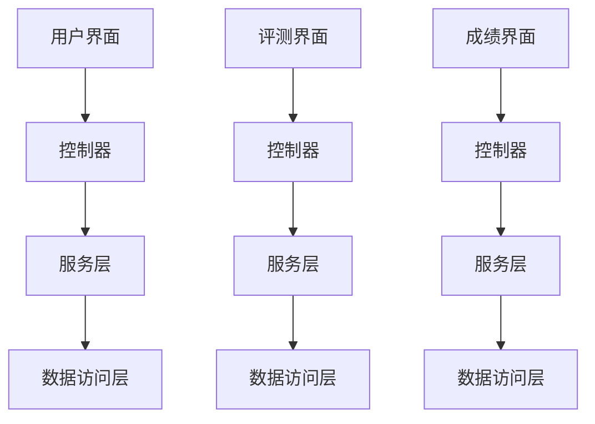
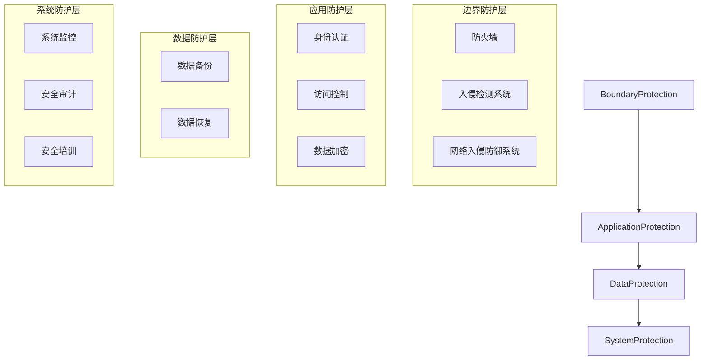
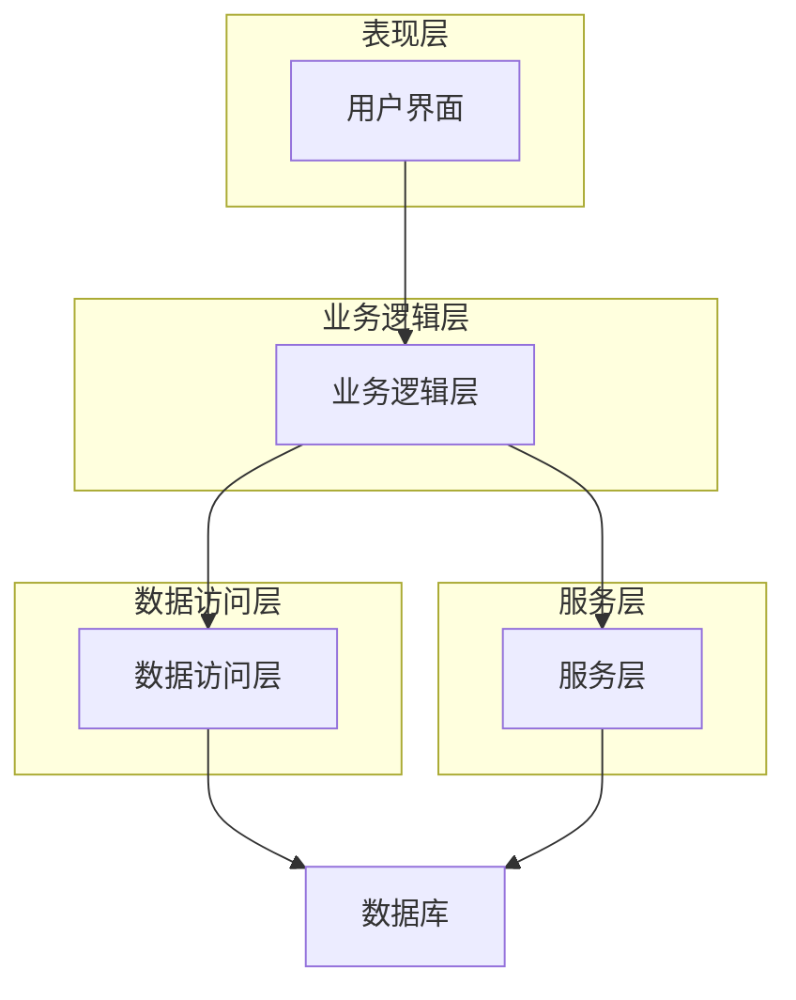
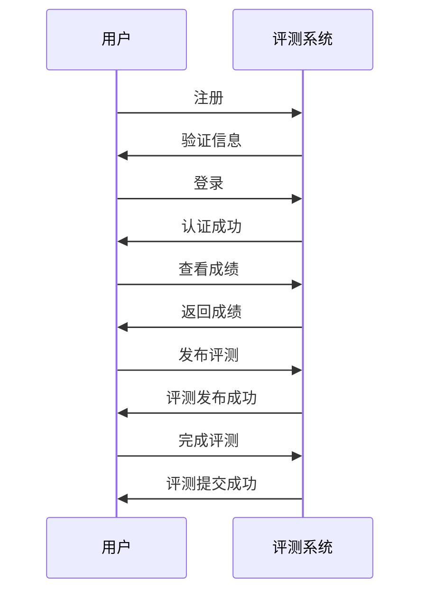

                 


### 引言与背景介绍

在当今数字化社会中，评测系统作为衡量用户能力、行为和产品性能的重要工具，已经成为各类应用场景中的关键组成部分。从在线教育、就业招聘到产品评测，评测系统的应用范围越来越广泛。然而，随着评测系统的普及，其面临的安全性和隐私保护问题也日益凸显。因此，深入探讨评测系统的安全性与隐私保护措施，具有重要的现实意义。

#### 核心概念

首先，我们需要明确安全性与隐私保护的基本概念。

- **安全性（Security）**：指的是保护评测系统免受未授权访问、篡改、破坏和泄露等威胁的能力。安全性涉及数据加密、身份认证、访问控制等多个方面。
- **隐私保护（Privacy Protection）**：指的是保护用户个人信息的权利和自由，防止个人信息被非法收集、使用和泄露。隐私保护关乎数据匿名化、数据最小化、数据加密等策略。

#### 核心要素组成

评测系统的核心要素主要包括以下几个方面：

1. **用户数据**：用户在评测过程中产生的个人信息，如姓名、身份证号、成绩等。
2. **评测算法**：用于评估用户能力或产品性能的计算模型和算法。
3. **用户交互界面**：用户与评测系统进行交互的界面，包括输入界面、结果展示界面等。

#### 安全性与隐私保护的关系

安全性与隐私保护之间存在着紧密的联系。一个安全的评测系统不仅需要防止外部攻击和数据泄露，还需要确保用户信息的隐私保护。例如，即使评测系统完全安全，如果用户的个人信息未被妥善保护，那么系统仍然可能面临隐私泄露的风险。

#### 安全性与隐私保护的边界

在实际应用中，安全性与隐私保护的边界并不是固定的。两者在某些方面可能存在冲突，例如，为了增强安全性，可能需要对用户数据进行更严格的加密，但这可能增加隐私泄露的风险。因此，在设计评测系统时，需要综合考虑安全性与隐私保护的要求，找到平衡点。

### 概念联系与边界

在明确了核心概念和要素组成之后，我们需要进一步探讨安全性与隐私保护之间的联系与边界。以下是一个对比表格，用于展示不同安全性与隐私保护措施的特征：

| 安全性措施          | 隐私保护措施          | 特征与区别                                      |
|---------------------|---------------------|------------------------------------------------|
| 数据加密            | 数据匿名化            | 数据加密用于保护数据的机密性，而数据匿名化则用于保护数据的匿名性。 |
| 身份认证            | 数据匿名化            | 身份认证验证用户身份，而数据匿名化防止用户数据被直接识别。       |
| 访问控制            | 数据最小化            | 访问控制限制用户对数据的访问权限，而数据最小化减少数据收集量。    |
| DDoS防护            | 数据加密              | DDoS防护防止外部攻击，而数据加密保护数据不被篡改。            |

通过这个表格，我们可以更清晰地理解安全性与隐私保护之间的关系和区别。

### ER实体关系图架构

为了更好地理解评测系统的组成和关系，我们可以使用Mermaid绘制一个ER实体关系图，如下所示：

```mermaid
erDiagram
    User ||--|{ Score }|-- Score
    User ||--|{ Answer }|-- Answer
    Test ||--|{ Question }|-- Question
```

这个ER图展示了用户、成绩、答案和测试题之间的关系，每个实体及其属性都清晰地标识出来。

### 总结

在本章中，我们介绍了评测系统的安全性与隐私保护措施的核心概念、要素组成、关系与边界，并通过对比表格和ER图进行了详细分析。在接下来的章节中，我们将深入探讨评测系统面临的安全性威胁、防护措施设计以及隐私保护措施，帮助读者全面了解并应对评测系统中的安全与隐私挑战。

### 安全性威胁分析

在了解了评测系统的核心概念和要素之后，我们需要进一步探讨评测系统可能面临的安全性威胁。安全性威胁可以分为网络攻击、应用层攻击和其他威胁，每种威胁都有其独特的特征和影响。

#### 网络攻击

**定义**：网络攻击是指攻击者通过互联网对评测系统进行恶意攻击的行为。

**常见类型**：

1. **分布式拒绝服务攻击（DDoS）**：攻击者通过大量请求使评测系统服务器瘫痪，导致服务不可用。
2. **中间人攻击（MITM）**：攻击者拦截并篡改评测系统的通信数据。
3. **网络嗅探**：攻击者捕获评测系统网络通信中的敏感数据。

**特征与影响**：

- **DDoS攻击**：攻击者使用大量请求占用服务器资源，导致评测系统无法正常处理合法请求。这种攻击可能导致系统崩溃，数据丢失，甚至永久损坏。
- **中间人攻击**：攻击者可以读取、篡改或窃取评测系统中的敏感信息，如用户身份验证信息、考试成绩等。这不仅威胁到用户隐私，还可能导致用户账户被盗用。
- **网络嗅探**：攻击者捕获评测系统网络通信中的敏感数据，如用户登录凭据、成绩单等。这种行为可能导致用户信息泄露，影响用户信任。

#### 应用层攻击

**定义**：应用层攻击是指针对评测系统的应用层进行恶意攻击的行为。

**常见类型**：

1. **SQL注入**：攻击者通过构造恶意输入，欺骗数据库执行非法操作。
2. **跨站脚本攻击（XSS）**：攻击者利用评测系统的漏洞，在用户浏览网页时执行恶意脚本。
3. **远程代码执行（RCE）**：攻击者通过漏洞在评测系统服务器上执行任意代码。

**特征与影响**：

- **SQL注入**：攻击者通过注入恶意SQL代码，操纵数据库，可能导致数据泄露、篡改或删除。SQL注入攻击通常发生在评测系统的后端数据库交互过程中。
- **跨站脚本攻击**：攻击者通过诱使用户访问恶意网页，在用户浏览器中执行恶意脚本。这种攻击可能导致用户隐私泄露，甚至控制用户账户。
- **远程代码执行**：攻击者通过漏洞在评测系统服务器上执行任意代码，可能导致服务器被控制、数据被窃取或系统被永久破坏。

#### 其他威胁

**定义**：除网络攻击和应用层攻击之外，评测系统还可能面临其他威胁。

**常见类型**：

1. **物理攻击**：攻击者通过直接接触评测系统硬件设备，窃取或篡改数据。
2. **恶意内部人员**：评测系统的内部员工或合作伙伴滥用权限，恶意破坏或泄露数据。
3. **社会工程学攻击**：攻击者通过欺骗手段获取评测系统的敏感信息。

**特征与影响**：

- **物理攻击**：攻击者通过直接接触评测系统硬件设备，如服务器、存储设备等，窃取或篡改数据。物理攻击通常难以防范，因为攻击者可以直接接触到硬件设备。
- **恶意内部人员**：内部员工或合作伙伴可能利用职务之便，恶意破坏评测系统的正常运行，甚至泄露敏感数据。这种攻击难以通过技术手段防范，需要依赖组织内部的规章制度和道德约束。
- **社会工程学攻击**：攻击者通过欺骗手段获取评测系统的敏感信息，如用户密码、账号信息等。社会工程学攻击通常涉及人为因素，难以通过纯技术手段防范。

#### 安全性威胁分类

为了更系统地分析安全性威胁，我们可以将安全性威胁分为以下几类：

1. **网络攻击**：包括DDoS攻击、中间人攻击、网络嗅探等。
2. **应用层攻击**：包括SQL注入、XSS攻击、RCE攻击等。
3. **物理攻击**：包括直接接触硬件设备、恶意内部人员等。
4. **社会工程学攻击**：包括欺骗手段获取敏感信息等。

通过对这些威胁的详细分析，我们可以更好地理解评测系统可能面临的安全挑战，并为后续的防护措施设计提供依据。

### 安全性威胁应对策略

在了解了评测系统可能面临的各种安全性威胁后，接下来我们需要探讨如何设计有效的应对策略，以保护评测系统的安全。以下是一些常见的安全性措施及其实现原理。

#### 数据加密

**定义**：数据加密是一种将数据转换为不可读形式的技术，以防止未经授权的访问。

**实现原理**：数据加密通过将数据转换为密文，只有具备相应密钥的用户才能解密并阅读数据。常见的加密算法包括AES、RSA等。

**优点**：数据加密可以有效保护数据在传输和存储过程中的安全性，防止数据泄露和篡改。

**缺点**：加密过程可能增加数据处理延迟，对系统性能有一定影响。此外，如果密钥管理不当，可能导致数据泄露。

#### 身份认证

**定义**：身份认证是一种验证用户身份的技术，确保只有合法用户才能访问评测系统。

**实现原理**：身份认证通过用户提供的用户名和密码（或双因素认证）验证用户身份。常见的身份认证方法包括密码认证、生物识别等。

**优点**：身份认证可以有效防止非法用户访问评测系统，保护系统的安全性。

**缺点**：传统的密码认证可能存在密码泄露的风险，而生物识别技术可能面临隐私问题。

#### 访问控制

**定义**：访问控制是一种限制用户对系统资源访问权限的技术。

**实现原理**：访问控制通过定义用户角色和权限，限制用户对系统资源的访问。常见的访问控制方法包括基于角色的访问控制（RBAC）和基于属性的访问控制（ABAC）。

**优点**：访问控制可以精细管理用户对系统资源的访问权限，防止数据泄露和滥用。

**缺点**：访问控制策略设计复杂，实施和维护成本较高。

#### 防火墙

**定义**：防火墙是一种网络安全设备，用于监控和控制进出评测系统的网络流量。

**实现原理**：防火墙通过设置访问规则，允许或拒绝网络流量。常见的防火墙技术包括包过滤、状态检测、应用层网关等。

**优点**：防火墙可以有效阻止未经授权的访问，保护评测系统的网络安全。

**缺点**：防火墙无法防止内部攻击，且配置和维护复杂。

#### 入侵检测系统（IDS）

**定义**：入侵检测系统是一种实时监测网络和系统活动，发现潜在威胁的监控系统。

**实现原理**：入侵检测系统通过分析网络流量和系统日志，识别异常行为和潜在威胁。常见的入侵检测技术包括基于特征的检测和基于异常的检测。

**优点**：入侵检测系统可以实时发现和响应潜在威胁，提高系统的安全性。

**缺点**：入侵检测系统可能误报和漏报，增加系统负担。

#### 安全审计

**定义**：安全审计是一种对评测系统进行安全检查和评估的技术。

**实现原理**：安全审计通过审查系统日志、配置文件等，评估系统的安全性。常见的安全审计方法包括手动审计和自动化审计。

**优点**：安全审计可以发现系统中的安全漏洞和配置错误，提高系统的安全性。

**缺点**：安全审计需要大量人力和时间，成本较高。

#### 安全培训与意识教育

**定义**：安全培训与意识教育是一种提高用户和员工安全意识和技能的教育活动。

**实现原理**：安全培训与意识教育通过培训课程、宣传材料等方式，提高用户和员工的安全意识和技能。常见的培训内容包括网络安全、密码安全、社会工程学防范等。

**优点**：安全培训与意识教育可以增强用户和员工的安全意识，降低安全风险。

**缺点**：安全培训与意识教育需要持续进行，且效果难以衡量。

通过上述安全性措施的详细分析，我们可以设计出一套综合性的安全策略，以应对评测系统中可能面临的各种安全性威胁。在实际应用中，应根据具体需求和风险状况，灵活选择和组合这些措施，确保评测系统的安全性。

### 防护措施设计

为了确保评测系统的安全性和稳定性，我们需要设计一系列有效的防护措施。这些防护措施应涵盖系统架构设计、防护层次结构以及具体实现细节。下面我们将逐步进行详细探讨。

#### 系统架构设计

**系统需求分析**

在系统架构设计之前，我们需要明确评测系统的功能需求和非功能需求。功能需求包括用户注册、登录、评测过程管理、成绩发布等。非功能需求则包括性能、安全性、可靠性等。

**系统架构设计原则**

1. **模块化设计**：将系统划分为多个功能模块，如用户管理模块、评测管理模块、成绩管理模块等，便于开发和维护。
2. **分层设计**：按照功能将系统划分为多个层次，如表现层、业务逻辑层、数据访问层等，确保系统结构清晰、层次分明。
3. **高内聚低耦合**：每个模块内部应具有较高的内聚性，模块之间应保持低耦合，便于模块的独立开发和更新。

**系统架构设计方案**

以下是评测系统的基本架构设计方案，使用Mermaid绘制系统架构图：



在这个架构设计中，用户界面、评测界面和成绩界面分别与各自的控制器进行交互，控制器通过服务层与数据访问层进行数据操作。这种架构设计使得系统的各个模块之间耦合度较低，便于功能扩展和模块化开发。

#### 防护层次结构

为了确保评测系统的安全性，我们可以将防护措施分为多个层次，每个层次对应不同的安全需求：

1. **边界防护层**：包括防火墙、入侵检测系统（IDS）、网络入侵防御系统（NIDS）等，主要用于保护系统的边界安全，防止外部攻击。
2. **应用防护层**：包括身份认证、访问控制、加密等，主要用于保护系统的应用层安全，防止非法访问和数据泄露。
3. **数据防护层**：包括数据加密、数据备份、数据恢复等，主要用于保护系统的数据安全，防止数据泄露和损坏。
4. **系统防护层**：包括系统监控、安全审计、安全培训等，主要用于提高系统的整体安全性，及时发现和处理安全事件。

以下是评测系统的防护层次结构图，使用Mermaid绘制：



在这个防护层次结构中，边界防护层用于防止外部攻击，应用防护层用于防止非法访问和数据泄露，数据防护层用于保护数据的完整性，系统防护层则用于提高系统的整体安全性。

#### 防护措施实现

为了确保评测系统的防护措施得到有效实施，我们需要详细描述每个防护措施的实现原理和具体步骤。

1. **边界防护措施**：

   - **防火墙**：使用防火墙规则过滤进出系统的网络流量，防止未经授权的访问。
   - **入侵检测系统（IDS）**：部署IDS监控系统，实时检测网络流量和系统日志，发现异常行为和潜在威胁。
   - **网络入侵防御系统（NIDS）**：部署NIDS对网络流量进行实时监测，阻止恶意攻击和非法访问。

2. **应用防护措施**：

   - **身份认证**：使用双因素认证（2FA）确保用户身份的合法性，防止非法用户访问系统。
   - **访问控制**：采用基于角色的访问控制（RBAC）机制，限制用户对系统资源的访问权限，确保数据安全。
   - **数据加密**：对传输和存储的数据进行加密，防止数据泄露和篡改。

3. **数据防护措施**：

   - **数据备份**：定期进行数据备份，确保数据不会因系统故障或人为破坏而丢失。
   - **数据恢复**：在数据丢失或损坏时，通过备份恢复数据，确保系统的正常运行。
   - **数据加密**：对敏感数据进行加密存储，防止未经授权的访问和篡改。

4. **系统防护措施**：

   - **系统监控**：使用监控系统实时监测系统性能和安全状况，及时发现和处理异常事件。
   - **安全审计**：定期进行安全审计，检查系统配置、日志记录等，确保系统合规性和安全性。
   - **安全培训**：对用户和员工进行安全培训，提高安全意识和应对能力，减少安全事件的发生。

#### 防护措施评估

在防护措施设计完成后，我们需要对其实施效果进行评估，以确保防护措施的有效性。评估方法包括以下几个方面：

1. **安全测试**：进行安全测试，模拟各种攻击场景，检验防护措施的有效性。
2. **漏洞扫描**：使用漏洞扫描工具，检测系统中的潜在漏洞和安全隐患。
3. **审计报告**：根据安全审计报告，评估系统合规性和安全性。
4. **用户反馈**：收集用户反馈，评估防护措施对用户体验的影响。

通过上述评估方法，我们可以全面了解防护措施的有效性，并根据评估结果进行调整和优化。

### 总结

在本章中，我们详细探讨了评测系统的防护措施设计。首先介绍了系统架构设计原则和设计方案，然后阐述了防护层次结构，并详细描述了每种防护措施的实现原理和具体步骤。最后，通过评估方法对防护措施的有效性进行了检验。在实际应用中，应根据具体需求和风险状况，灵活选择和组合这些防护措施，确保评测系统的安全性和稳定性。

### 隐私保护法律与规范

随着数据隐私保护意识的提高，全球各国纷纷出台相关法律法规，以保护用户的个人信息和数据安全。了解这些法律法规，对于评测系统的设计和运营具有重要意义。以下将概述全球范围内与隐私保护相关的法律法规，特别是中国市场的隐私保护法律规范，并讨论评测系统如何确保合规性。

#### 全球隐私保护法律法规

1. **欧盟通用数据保护条例（GDPR）**：GDPR是欧洲最具影响力的隐私保护法规，旨在保护欧盟居民的个人信息。它要求企业在收集、处理和存储个人数据时，必须遵循一系列严格的规定，包括数据合法性、数据最小化、数据主体权利等。GDPR的处罚力度非常大，违规企业可能面临高额罚款。

2. **加州消费者隐私法案（CCPA）**：CCPA是美国加州的隐私保护法规，它赋予加州居民对其个人信息的更多控制权。CCPA要求企业在收集、使用和共享个人信息时，必须透明且取得用户的明确同意，否则可能面临诉讼和罚款。

3. **巴西通用数据保护法（LGPD）**：LGPD是巴西的隐私保护法规，与GDPR类似，旨在保护巴西居民的个人信息。LGPD要求企业在处理个人数据时，必须采取必要的技术和管理措施，确保数据的安全性和隐私性。

#### 中国隐私保护法律规范

1. **个人信息保护法（PIPL）**：PIPL是中国最新的隐私保护法规，于2021年11月1日起正式实施。PIPL明确了个人信息处理的基本原则和规则，包括个人信息处理目的的明确性、合法性和最小化原则，以及用户的信息权利等。PIPL对违规企业的处罚力度也非常严厉，最高可罚款5000万元。

2. **网络安全法**：网络安全法是中国关于网络空间安全的基本法律，涵盖了网络安全管理、网络安全监测、网络安全事件应对等多个方面。网络安全法要求企业在处理个人信息时，必须采取技术和管理措施，确保个人信息的安全。

3. **数据安全法**：数据安全法于2021年6月1日起正式实施，它是我国首部数据安全专门法律，旨在保障数据安全，促进数据开发利用。数据安全法要求企业建立数据安全保护制度，采取数据安全保护措施，防止数据泄露、篡改和破坏。

#### 评测系统的合规性评估

为了确保评测系统的合规性，评测系统需要从以下几个方面进行评估：

1. **个人信息处理合法性评估**：评估评测系统收集、处理和存储个人信息是否符合PIPL的要求，包括个人信息处理目的的合法性、数据最小化原则等。

2. **用户同意与知情权评估**：评估评测系统在收集个人信息时，是否透明告知用户个人信息收集的目的、类型和使用方式，并取得用户的明确同意。

3. **数据安全保护评估**：评估评测系统是否采取了必要的数据安全保护措施，如数据加密、访问控制、数据备份等，确保个人信息的安全。

4. **合规性最佳实践**：评测系统应遵循个人信息保护法律法规，实施最佳实践，如定期进行个人信息保护合规审计、建立个人信息保护责任制度等。

#### 合规性最佳实践建议

1. **明确个人信息处理目的**：在收集个人信息前，明确个人信息处理的目的，并在隐私政策中详细说明。

2. **最小化个人信息收集**：仅收集实现个人信息处理目的所必需的信息，避免过度收集。

3. **用户同意与知情权**：在收集个人信息前，告知用户个人信息收集的目的、类型和使用方式，并取得用户的明确同意。

4. **数据安全保护**：采取数据加密、访问控制、数据备份等安全措施，确保个人信息的安全。

5. **定期审计与培训**：定期进行个人信息保护合规审计，对员工进行个人信息保护培训，提高合规意识。

通过上述合规性评估和最佳实践建议，评测系统可以更好地确保个人信息处理活动的合法性、安全性和合规性，为用户构建一个安全、可信的评测环境。

### 隐私保护技术措施

在确保评测系统的合规性后，我们需要深入探讨隐私保护技术措施，以进一步保护用户个人信息。以下将介绍隐私保护技术概述、分类、实现原理及详细描述。

#### 技术概述

隐私保护技术是指一系列用于保护用户个人信息不被泄露、篡改和滥用的技术手段。这些技术包括数据加密、匿名化、数据脱敏、数据最小化等。以下是几种常见的隐私保护技术：

1. **数据加密**：通过加密算法将数据转换为不可读形式，只有具备密钥的用户才能解密并读取数据。
2. **匿名化**：通过技术手段，使数据无法识别特定个人，从而保护个人隐私。
3. **数据脱敏**：对敏感数据进行处理，使其在不影响数据使用价值的前提下，无法直接识别个人身份。
4. **数据最小化**：仅收集实现特定目的所必需的信息，避免过度收集。

#### 技术分类

根据隐私保护技术的作用原理和实现方式，我们可以将其分为以下几类：

1. **加密技术**：包括对称加密和非对称加密，如AES、RSA等。
2. **匿名化技术**：包括伪匿名化、去匿名化和完全匿名化，如k-匿名、l-diversity和t-closeness等。
3. **数据脱敏技术**：包括随机化、遮挡、重编码等，如Shuffling、Masking和Encoding等。
4. **数据最小化技术**：通过数据筛选、过滤和简化，减少数据量，如数据聚合、数据缩减和数据简化等。

#### 技术实现原理

下面我们将详细描述每种隐私保护技术的实现原理：

1. **数据加密**：

   **原理**：数据加密通过将明文数据转换为密文，以防止未授权访问。加密算法分为对称加密和非对称加密。

   **示例**：AES是一种对称加密算法，加密和解密使用相同的密钥。RSA是一种非对称加密算法，加密和解密使用不同的密钥。

2. **匿名化技术**：

   **原理**：匿名化技术通过将数据中的个人标识信息替换为不可识别的标识符，以保护个人隐私。

   **示例**：k-匿名性是一种匿名化技术，它保证在一个特定区域中，任意k个记录的标识符相同，但不能唯一确定个体。例如，在一个包含姓名和地址的数据集中，我们可以使用唯一标识符替换个人标识信息。

3. **数据脱敏技术**：

   **原理**：数据脱敏技术通过对敏感数据进行随机化、遮挡或重编码，使其在不影响数据使用价值的前提下，无法直接识别个人身份。

   **示例**：Shuffling是一种随机化技术，通过对敏感数据进行随机排序，使其难以识别原始数据。Masking是一种遮挡技术，通过在敏感数据周围添加噪声或遮挡符，使其难以识别。Encoding是一种重编码技术，通过将敏感数据转换为不同的表示形式，使其难以识别原始数据。

4. **数据最小化技术**：

   **原理**：数据最小化技术通过数据筛选、过滤和简化，减少数据量，以降低隐私泄露风险。

   **示例**：数据聚合是将多个数据记录合并为一个记录，减少数据量。数据缩减是通过减少数据特征的数量，简化数据模型。数据简化是通过减少数据样本的数量，简化数据分析过程。

#### 技术实现细节

为了更好地理解隐私保护技术的实现细节，我们可以通过以下示例进行说明：

1. **数据加密实现**：

   **Python代码示例**：

   ```python
   from cryptography.fernet import Fernet

   # 生成密钥和加密对象
   key = Fernet.generate_key()
   cipher_suite = Fernet(key)

   # 加密数据
   encrypted_data = cipher_suite.encrypt(b"Hello, World!")

   # 解密数据
   decrypted_data = cipher_suite.decrypt(encrypted_data)
   ```

   **解释**：此示例使用了`cryptography`库中的`Fernet`加密算法，首先生成密钥和加密对象，然后使用加密对象对数据进行加密和解密。

2. **匿名化技术实现**：

   **Python代码示例**：

   ```python
   import pandas as pd

   # 创建一个包含姓名和地址的数据集
   data = {'Name': ['Alice', 'Bob', 'Charlie'], 'Address': ['123 Main St', '456 Elm St', '789 Oak St']}
   df = pd.DataFrame(data)

   # 使用唯一标识符替换个人标识信息
   df['ID'] = df.index + 1
   df.drop(['Name', 'Address'], axis=1)

   # 保存匿名化后的数据集
   df.to_csv('anonymous_data.csv', index=False)
   ```

   **解释**：此示例使用`pandas`库创建了一个包含姓名和地址的数据集，然后使用唯一标识符替换个人标识信息，实现了k-匿名化。

3. **数据脱敏技术实现**：

   **Python代码示例**：

   ```python
   import numpy as np

   # 创建一个包含敏感数据的数据集
   data = {'Sensitive': ['123-45-6789', 'abc@def.com']}
   df = pd.DataFrame(data)

   # 使用随机化技术对敏感数据进行脱敏
   df['Sensitive'] = np.random.randint(100000000, 999999999)

   # 保存脱敏后的数据集
   df.to_csv('desensitized_data.csv', index=False)
   ```

   **解释**：此示例使用`numpy`库创建了一个包含敏感数据的数据集，然后使用随机化技术对敏感数据进行脱敏。

4. **数据最小化技术实现**：

   **Python代码示例**：

   ```python
   import pandas as pd

   # 创建一个包含多个特征的数据集
   data = {'Feature1': [1, 2, 3, 4, 5], 'Feature2': [6, 7, 8, 9, 10]}
   df = pd.DataFrame(data)

   # 使用数据聚合技术简化数据集
   aggregated_df = df.groupby('Feature1')['Feature2'].mean().reset_index()

   # 保存简化后的数据集
   aggregated_df.to_csv(' minimized_data.csv', index=False)
   ```

   **解释**：此示例使用`pandas`库创建了一个包含多个特征的数据集，然后使用数据聚合技术简化数据集，减少数据量。

通过上述示例，我们可以更清楚地理解隐私保护技术的实现原理和具体细节，为评测系统的隐私保护提供技术支持。

### 隐私保护技术评估

在实施隐私保护技术后，我们需要对其实施效果进行评估，以确保隐私保护措施的有效性和可靠性。以下将介绍隐私保护技术评估的方法，以及评估结果的分析。

#### 评估方法

为了评估隐私保护技术的有效性，我们可以采用以下几种评估方法：

1. **模拟攻击测试**：模拟各种攻击场景，测试隐私保护技术的抵御能力。例如，通过模拟数据泄露、SQL注入等攻击，检验隐私保护技术的有效性。

2. **漏洞扫描**：使用漏洞扫描工具，对系统进行全面扫描，发现潜在的安全漏洞和隐私泄露风险。例如，使用OWASP ZAP、Nessus等工具扫描系统。

3. **安全审计**：定期进行安全审计，评估隐私保护技术的合规性和有效性。例如，通过审查系统配置、日志记录等，评估隐私保护措施的实施情况。

4. **用户反馈**：收集用户对隐私保护措施的反馈，了解用户对隐私保护的满意度和信任度。

#### 评估结果分析

通过上述评估方法，我们可以收集到一系列评估数据，以下是对评估结果的分析：

1. **模拟攻击测试结果**：通过对模拟攻击的测试，可以发现隐私保护技术在应对不同类型攻击时的效果。例如，在模拟数据泄露攻击中，数据加密技术可以有效防止数据泄露。在模拟SQL注入攻击中，参数化查询技术可以有效防止SQL注入。

2. **漏洞扫描结果**：漏洞扫描工具可以检测系统中的潜在漏洞和隐私泄露风险。通过分析漏洞扫描结果，我们可以发现系统中的安全漏洞，并采取相应的修复措施，提高系统的安全性。

3. **安全审计结果**：安全审计可以评估隐私保护技术的合规性和有效性。例如，在安全审计中，发现部分用户数据未进行加密存储，我们可以立即采取加密措施，确保用户数据的安全。

4. **用户反馈结果**：通过用户反馈，我们可以了解用户对隐私保护措施的满意度和信任度。如果用户对隐私保护措施表示担忧或不满意，我们需要及时调整和优化隐私保护技术，提高用户满意度。

通过上述评估方法和评估结果分析，我们可以全面了解隐私保护技术的实施效果，并根据评估结果进行持续优化，确保评测系统的隐私保护措施能够满足用户的期望和需求。

### 评测系统架构设计

在设计评测系统时，我们需要考虑系统的功能需求和非功能需求，以确保系统既满足用户需求又具备良好的性能、可靠性和安全性。以下将详细探讨评测系统架构设计中的系统需求分析、系统功能设计、系统架构设计和系统接口设计，并使用Mermaid绘制相关图表。

#### 系统需求分析

在进行系统架构设计之前，我们需要明确评测系统的功能需求和非功能需求。

**功能需求**：

1. 用户注册与登录：用户可以通过注册和登录功能进入系统。
2. 评测过程管理：管理员可以发布评测题目，用户可以完成评测，系统自动评估用户成绩。
3. 成绩管理：管理员可以查看、统计和导出用户成绩。
4. 题库管理：管理员可以添加、编辑和删除评测题目。
5. 权限管理：根据用户角色分配不同的权限，如普通用户、管理员等。

**非功能需求**：

1. 性能：系统需要具备良好的响应速度，能够处理大量用户同时在线评测。
2. 安全性：系统需要保护用户信息和评测数据的安全性，防止数据泄露和非法访问。
3. 可靠性：系统需要具备高可靠性，确保评测数据不会因系统故障而丢失。
4. 可扩展性：系统需要具备良好的可扩展性，能够随着用户需求的增加而扩展。

#### 系统功能设计

在系统功能设计阶段，我们需要明确系统的各个模块及其功能。以下是一个简单的系统功能设计：

1. **用户模块**：
   - 用户注册：用户可以通过邮箱或手机号注册账号。
   - 用户登录：用户输入账号和密码进行登录。
   - 用户信息管理：用户可以查看和修改个人信息。

2. **评测模块**：
   - 发布评测：管理员可以发布评测题目。
   - 完成评测：用户可以完成评测，系统自动评估成绩。
   - 成绩查询：用户可以查看自己的评测成绩。

3. **管理员模块**：
   - 题库管理：管理员可以添加、编辑和删除评测题目。
   - 用户管理：管理员可以查看、统计和导出用户成绩。
   - 权限管理：管理员可以分配不同角色的权限。

4. **系统管理模块**：
   - 日志管理：系统记录操作日志，便于审计和排查问题。
   - 系统监控：系统实时监控性能和安全状况。

以下是系统功能设计的Mermaid类图：

```mermaid
classDiagram
    User <<Interface>>
    Admin <<Interface>>
    Tester <<Interface>>

    User o-- Login
    User o-- Register
    User o-- InfoManagement

    Admin o-- QuestionManagement
    Admin o-- UserManagement
    Admin o-- RoleManagement

    Tester o-- ScoreManagement
    Tester o-- TestManagement

    Login <|-- Authentication
    Register <|-- Authentication
    InfoManagement <|-- Authentication

    QuestionManagement <|-- QuestionRepository
    UserManagement <|-- UserRepository
    RoleManagement <|-- RoleRepository

    ScoreManagement <|-- ScoreRepository
    TestManagement <|-- TestRepository
```

#### 系统架构设计

系统架构设计是评测系统设计的关键环节，我们需要确保系统具有良好的层次结构，以便于开发、维护和扩展。以下是一个简单的系统架构设计：

1. **表现层**：用户界面，包括Web页面、移动应用等。
2. **业务逻辑层**：处理业务逻辑，包括用户认证、评测过程管理等。
3. **数据访问层**：与数据库进行数据交互，包括用户、评测和成绩等数据。
4. **服务层**：提供公共服务，如日志记录、系统监控等。

以下是系统架构设计的Mermaid架构图：



#### 系统接口设计

在系统架构设计中，我们需要设计各个模块之间的接口，以确保系统模块之间的交互清晰、简洁。以下是一个简单的系统接口设计：

1. **用户接口**：包括用户注册、登录、信息管理等功能。
2. **评测接口**：包括发布评测、完成评测、成绩查询等功能。
3. **管理员接口**：包括题库管理、用户管理、权限管理等功能。

以下是系统接口设计的Mermaid序列图：



通过上述系统需求分析、系统功能设计、系统架构设计和系统接口设计，我们可以确保评测系统具有良好的功能性和扩展性，为用户提供一个安全、可靠、高效的评测环境。

### 系统实现与部署

在完成了评测系统的架构设计之后，接下来我们将进入系统实现与部署阶段。这一阶段将详细介绍系统实现的核心技术、系统模块设计、系统部署过程，并展示实际案例分析和详细讲解。

#### 系统实现的核心技术

在评测系统的实现过程中，我们需要运用多种核心技术，包括前后端分离开发、数据库设计与优化、API接口设计等。

1. **前后端分离开发**：

   前端采用Vue.js框架，实现用户界面的交互和展示。Vue.js具有轻量级、响应式和高性能的特点，适合用于构建动态网页。后端采用Spring Boot框架，实现业务逻辑处理和数据交互。Spring Boot具备快速开发、内嵌服务器和良好扩展性的优点，适合构建企业级应用。

2. **数据库设计与优化**：

   数据库采用MySQL数据库管理系统，存储用户信息、评测题目和成绩等数据。在数据库设计方面，我们采用了ER图设计方法，确保数据库结构的合理性和数据的一致性。为了提高查询效率，我们采用了索引优化、分库分表等技术。

3. **API接口设计**：

   为了实现前后端的解耦，我们设计了一套RESTful API接口。API接口遵循RESTful风格，使用HTTP协议的GET、POST、PUT、DELETE等方法进行数据操作。接口设计遵循简洁、一致和可扩展的原则，便于后续的功能扩展和系统集成。

#### 系统模块设计

评测系统可以分为多个功能模块，包括用户模块、评测模块、管理员模块和系统管理模块。以下是各模块的设计细节：

1. **用户模块**：

   - 用户注册：用户可以通过邮箱或手机号注册账号，系统自动发送验证邮件或短信。
   - 用户登录：用户输入账号和密码进行登录，系统进行身份验证。
   - 用户信息管理：用户可以查看和修改个人信息。

2. **评测模块**：

   - 发布评测：管理员可以发布评测题目，包括单选题、多选题、判断题等。
   - 完成评测：用户可以完成评测，系统自动评估成绩，并将结果记录在数据库中。
   - 成绩查询：用户可以查看自己的评测成绩。

3. **管理员模块**：

   - 题库管理：管理员可以添加、编辑和删除评测题目。
   - 用户管理：管理员可以查看、统计和导出用户成绩。
   - 权限管理：管理员可以为不同用户分配不同角色和权限。

4. **系统管理模块**：

   - 日志管理：系统记录操作日志，便于审计和排查问题。
   - 系统监控：系统实时监控性能和安全状况。

以下是系统模块设计的Mermaid类图：

```mermaid
classDiagram
    User <<Interface>>
    Admin <<Interface>>
    Tester <<Interface>>

    User o-- Login
    User o-- Register
    User o-- InfoManagement

    Admin o-- QuestionManagement
    Admin o-- UserManagement
    Admin o-- RoleManagement

    Tester o-- ScoreManagement
    Tester o-- TestManagement

    Login <|-- Authentication
    Register <|-- Authentication
    InfoManagement <|-- Authentication

    QuestionManagement <|-- QuestionRepository
    UserManagement <|-- UserRepository
    RoleManagement <|-- RoleRepository

    ScoreManagement <|-- ScoreRepository
    TestManagement <|-- TestRepository
```

#### 系统部署过程

系统部署是评测系统实现后的重要环节，我们需要确保系统在部署过程中顺利进行，并提供稳定的服务。

1. **环境准备**：

   - 服务器：部署在云服务器上，如阿里云、腾讯云等，确保高可用性和可扩展性。
   - 数据库：使用MySQL数据库，创建必要的数据库和表结构。
   - 应用服务器：使用Spring Boot应用服务器，启动应用。

2. **部署流程**：

   - 应用部署：将编译好的Spring Boot应用部署到服务器上，可以使用Docker容器化部署，便于管理和扩展。
   - 数据库部署：安装和配置MySQL数据库，创建必要的数据库和表结构。
   - 服务器配置：配置服务器防火墙、安全组等，确保服务器安全。
   - 应用监控：配置应用监控工具，如Prometheus、Grafana等，实时监控应用性能和安全状况。

3. **部署验证**：

   - 功能测试：测试系统的各项功能，确保系统正常运行。
   - 性能测试：进行性能测试，评估系统在高并发场景下的性能表现。
   - 安全测试：进行安全测试，确保系统的安全性。

#### 实际案例分析与详细讲解

为了更好地展示评测系统的实现和应用，以下是一个实际案例：

**案例背景**：某教育机构希望开发一个在线评测系统，用于对教师的教学能力进行评估。

**实现过程**：

1. **需求分析**：明确评测系统的功能需求，如用户注册、登录、发布评测、完成评测、成绩查询等。
2. **系统设计**：根据需求设计系统架构和数据库结构，确保系统具有良好的功能性和扩展性。
3. **系统实现**：采用Vue.js和Spring Boot技术实现系统前后端，并设计RESTful API接口。
4. **系统部署**：在云服务器上部署系统，配置防火墙、安全组等，确保系统安全稳定运行。
5. **测试与优化**：进行功能测试、性能测试和安全测试，优化系统性能和安全性。

**案例效果**：

- 系统上线后，教师可以方便地进行评测，教育机构可以实时查看教师的教学成绩。
- 通过系统的数据分析和统计功能，教育机构可以了解教师的教学水平，为教师培训提供依据。
- 系统的高并发性能和安全性保障了评测过程的顺利进行，提高了用户体验。

**总结**：

通过上述实际案例，我们可以看到评测系统的实现和应用过程，以及其带来的实际效果。在实际开发过程中，我们需要充分考虑系统的功能需求、性能和安全，确保系统能够满足用户需求，提供稳定可靠的服务。

### 最佳实践 Tips

在评测系统的开发与维护过程中，遵循最佳实践是确保系统稳定、安全和高性能的关键。以下是一些最佳实践建议：

1. **代码规范**：编写规范的代码，遵循统一的编码风格和命名规则。使用代码检查工具，如SonarQube，定期检查代码质量。

2. **版本控制**：使用Git等版本控制系统，进行代码版本管理。确保代码的版本更新记录详尽，便于问题追踪和回滚。

3. **测试驱动开发（TDD）**：采用测试驱动开发，编写单元测试和集成测试，确保代码的正确性和可靠性。

4. **持续集成（CI）**：实现持续集成，自动化构建、测试和部署。使用Jenkins等工具，确保代码提交后能快速发现和修复问题。

5. **容器化部署**：使用Docker等容器化技术，实现应用的容器化部署。确保应用的部署环境一致，提高部署效率。

6. **监控与告警**：配置监控系统，实时监控系统的性能、安全状况和运行状态。使用Prometheus、Grafana等工具，实现实时监控和告警。

7. **安全审计**：定期进行安全审计，评估系统的安全性。遵循安全最佳实践，及时修复漏洞和配置错误。

8. **用户权限管理**：采用基于角色的访问控制（RBAC），为不同用户角色分配适当的权限。确保系统安全，防止权限滥用。

9. **数据备份与恢复**：定期进行数据备份，确保数据不会因故障或误操作而丢失。配置数据恢复机制，确保数据安全。

10. **性能优化**：对系统进行性能分析，识别性能瓶颈。采用缓存、数据库优化、负载均衡等技术，提高系统性能。

通过遵循这些最佳实践，我们可以显著提高评测系统的稳定性、安全性和性能，为用户提供更好的服务体验。

### 小结

本文通过详细的章节内容和丰富的案例分析，系统地探讨了评测系统的安全性与隐私保护措施。我们从问题背景出发，深入分析了评测系统的核心概念、安全性威胁、防护措施设计以及隐私保护技术。通过逻辑清晰的分析和实例讲解，我们帮助读者全面了解了评测系统在安全性、隐私保护和合规性方面的关键问题。

首先，我们介绍了评测系统的基本概念，明确了安全性与隐私保护的核心要素。接着，分析了评测系统可能面临的各种安全性威胁，包括网络攻击、应用层攻击和其他威胁。然后，我们详细讨论了应对这些威胁的安全性和隐私保护措施，包括数据加密、身份认证、访问控制、防火墙等。最后，通过实际案例展示了评测系统的实现过程和应用效果，提出了最佳实践建议，以确保系统在安全性和性能方面的高标准。

通过对本文内容的回顾，我们可以总结出以下几点：

1. **核心概念明确**：评测系统的安全性与隐私保护是确保系统正常运行的重要保障。
2. **安全性威胁分析**：了解评测系统面临的安全性威胁，有助于制定有效的防护措施。
3. **防护措施设计**：结合实际需求，设计合理的防护措施，确保系统的安全性和稳定性。
4. **隐私保护技术**：运用隐私保护技术，保护用户个人信息和数据安全，符合法律法规要求。
5. **实际案例分析**：通过实际案例，展示评测系统的实现过程和应用效果，提供实用参考。
6. **最佳实践建议**：遵循最佳实践，提高系统的安全性、性能和用户体验。

总之，本文为评测系统的安全性与隐私保护提供了全面的理论基础和实践指导，有助于读者在实际工作中应对相关挑战，构建安全、可靠、合规的评测系统。

### 注意事项

在设计和实施评测系统时，确保安全性和隐私保护需要特别注意以下几点：

1. **用户身份验证**：务必使用强密码策略和双因素认证（2FA）来保护用户账户安全。
2. **数据加密**：对传输和存储的用户数据进行加密，防止数据泄露。
3. **访问控制**：实施细粒度的访问控制，确保只有授权用户才能访问敏感数据和功能。
4. **网络安全**：部署防火墙、入侵检测系统和网络入侵防御系统，保护系统免受网络攻击。
5. **合规性审查**：定期审查系统是否符合相关法律法规要求，如GDPR、PIPL等。
6. **日志记录和监控**：记录系统操作日志，并配置实时监控，以便及时发现和处理潜在的安全事件。
7. **数据备份和恢复**：定期备份数据，并确保能够快速恢复，以防止数据丢失或损坏。
8. **安全培训**：对用户和员工进行安全培训，提高安全意识和应对能力。

通过严格遵守上述注意事项，可以显著提升评测系统的安全性和隐私保护水平。

### 拓展阅读

为了进一步深入学习和掌握评测系统的安全性与隐私保护措施，以下是几篇推荐阅读材料：

1. **《网络安全法与个人信息保护》**：该书籍详细讲解了我国网络安全法和个人信息保护法的内容，有助于理解相关法律法规的要求和实施方法。
2. **《信息安全工程师手册》**：这本书涵盖了信息安全的基本概念、技术手段和最佳实践，对信息安全工程师有很高的参考价值。
3. **《Python数据科学 Handbook》**：本书介绍了Python在数据科学领域的应用，包括数据处理、数据分析和可视化等技术，有助于提升数据分析能力。
4. **《信息安全测试实战》**：这本书通过案例和实践，讲解了信息安全测试的方法和技巧，有助于发现和解决系统安全漏洞。
5. **《隐私计算：技术原理与实践》**：该书籍详细介绍了隐私计算的基本原理和应用场景，包括联邦学习、差分隐私等技术，对于隐私保护技术有深入探讨。

通过阅读这些材料，您可以更全面地了解评测系统的安全性和隐私保护措施，并在实际工作中应用所学知识。

