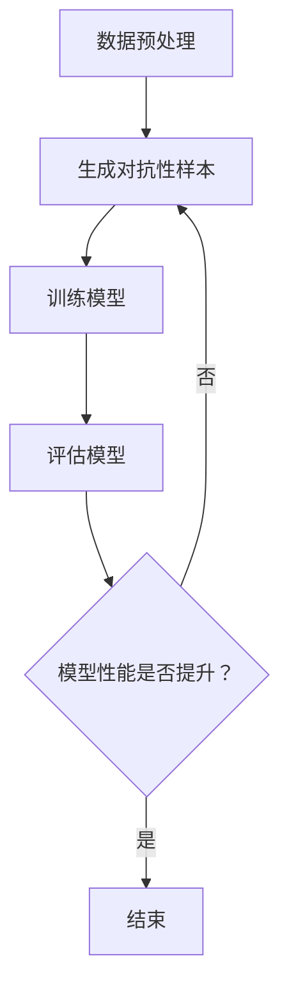
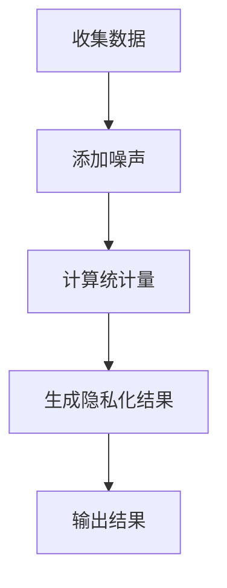
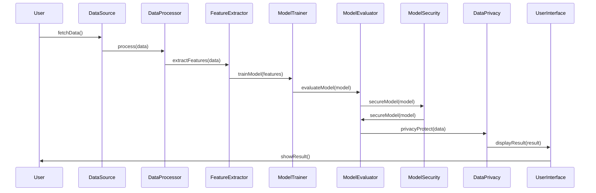

                 

### 第1章：问题背景

在现代信息技术飞速发展的背景下，评测系统作为各类应用的核心组件，其安全性和数据隐私保护变得尤为重要。评测系统通常用于评估和监控软件、应用程序的性能、安全性、可靠性等方面，广泛应用于软件开发、网络安全、数据分析等众多领域。

#### 1.1.1 评测系统的意义

评测系统在软件生命周期中扮演着关键角色。首先，它能够实时监控软件性能，确保其在各种环境下的稳定性和高效性。其次，通过安全性测试，评测系统能够及时发现潜在的安全漏洞，从而采取相应的防护措施。此外，评测系统还帮助团队优化开发流程，提高软件质量。

#### 1.1.2 安全性问题的重要性

随着软件系统复杂性的增加，安全性问题也日益突出。评测系统本身可能成为黑客攻击的目标，导致模型和数据泄露。一旦模型被篡改或数据泄露，可能会带来巨大的经济损失和隐私风险。因此，确保评测系统的安全性对于维护整个软件生态系统的稳定性和可靠性至关重要。

#### 1.1.3 当前评测系统安全性的挑战

当前评测系统面临的主要挑战包括：

1. **模型安全性威胁**：攻击者可能通过注入恶意代码、篡改模型参数等方式攻击评测系统。
2. **数据隐私泄露风险**：数据泄露可能导致用户隐私受到侵犯，引发法律纠纷。
3. **安全性与业务目标的冲突**：在追求系统性能和功能的同时，确保安全性可能会增加开发和运维成本。
4. **法规和标准约束**：随着数据保护法规的日益严格，评测系统需要遵守相应的法律法规，如GDPR等。

在接下来的章节中，我们将详细分析评测系统的安全性问题，探讨其解决方案，并探讨相关法律法规和标准的影响。希望通过本文的探讨，能够为读者提供一套全面、系统、实用的评测系统安全性评估和保障方案。

### 第2章：问题描述

评测系统的安全性问题主要集中在模型安全性和数据隐私保护两个方面。以下将详细分析这些问题及其具体表现。

#### 2.1.1 模型安全性的威胁

模型安全性威胁主要来源于以下几个方面：

1. **模型注入攻击**：攻击者通过向模型中注入恶意代码或参数，使模型输出错误的结果，或者引导模型执行非法操作。
    $$ output = model(input) + malicious_code $$
2. **模型提取攻击**：攻击者试图从评测系统中提取模型参数或结构，从而实现对模型的完全了解和控制。
    $$ extracted_model = extract(model) $$
3. **模型对抗攻击**：通过对抗性样本攻击，使模型在特定情况下产生错误的输出，从而突破模型的安全防护机制。

#### 2.1.2 数据隐私泄露的风险

数据隐私泄露的风险主要体现在以下几个方面：

1. **数据匿名化不足**：由于数据匿名化处理不当，可能导致匿名化后的数据仍然可以被识别，从而泄露用户隐私。
    $$ anonymized\_data = privacy\_leak $$
2. **加密与访问控制失效**：加密算法可能存在漏洞，或者访问控制机制不够严格，导致敏感数据被未授权用户访问。
    $$ encrypted\_data = decrypted\_by\_unauthorized\_user $$
3. **差分隐私不足**：在处理大量用户数据时，如果差分隐私机制不足，可能导致个别用户数据被推断出来，进而泄露隐私。
    $$ differential\_privacy\_breach = privacy\_leak $$

#### 2.1.3 安全性考量与业务目标的关系

在评测系统的开发与运维过程中，安全性与业务目标之间存在一定的冲突。一方面，为了确保系统的安全性，可能需要投入大量资源进行安全防护，如加密、访问控制、安全审计等。另一方面，这些安全措施可能会增加系统的复杂性和开发成本，影响业务目标的实现。

然而，安全性考量与业务目标并非绝对对立，合理的安全策略可以在保障安全的同时，尽量减少对业务的影响。例如，通过采用模块化设计，将安全功能与业务功能分离，可以在不影响业务功能的情况下，增强系统的安全性。

总之，评测系统的安全性问题需要综合考虑多方面因素，通过有效的安全策略和防护措施，实现模型安全性和数据隐私保护，从而确保系统的稳定性和可靠性。在接下来的章节中，我们将探讨具体的解决方案和最佳实践。

### 3.1.1 安全性的目标

在评测系统的设计和开发过程中，确保安全性的目标可以分为以下几个方面：

1. **防止模型注入攻击**：通过严格的输入验证和模型参数加密，确保模型不会被恶意代码注入，从而保证模型输出的正确性和稳定性。
    $$ input\_validation + parameter\_encryption = secure\_model $$
2. **保护模型隐私**：采用先进的加密算法和访问控制机制，防止攻击者提取和篡改模型参数和结构，确保模型的隐私和安全。
    $$ advanced\_encryption + access\_control = secure\_model\_privacy $$
3. **保障数据隐私**：通过数据匿名化、加密和差分隐私等技术，确保用户数据在存储、传输和处理过程中不会被泄露或滥用。
    $$ anonymization + encryption + differential\_privacy = secure\_data $$
4. **减少安全性与业务目标的冲突**：通过模块化设计和安全评估，将安全性与业务功能相分离，尽量减少安全措施对业务目标的影响，同时确保系统的整体安全性。
    $$ modular\_design + security\_evaluation = balanced\_security\_and\_business $$

#### 常见安全问题的解决方案

为了实现上述安全性目标，我们可以采取以下常见的安全问题和解决方案：

1. **模型注入攻击**：
   - **输入验证**：对所有输入数据进行严格检查，过滤掉可能包含恶意代码的数据。
   - **模型参数加密**：对模型参数进行加密存储和传输，确保攻击者无法获取明文参数。
   - **安全审计**：定期进行安全审计，检测和修复潜在的安全漏洞。

2. **模型提取攻击**：
   - **访问控制**：实施严格的访问控制策略，确保只有授权用户才能访问模型参数和结构。
   - **数据混淆**：对模型结构进行混淆处理，增加攻击者提取数据的难度。

3. **数据隐私泄露**：
   - **数据匿名化**：采用数据匿名化技术，如k-匿名、l-diversity和t-closeness，确保数据在匿名化后无法被直接识别。
   - **加密与访问控制**：对敏感数据采用加密存储和传输，同时实施严格的访问控制策略。
   - **差分隐私**：在数据处理过程中引入差分隐私机制，确保数据处理过程中不会泄露个体信息。

4. **安全性与业务目标的平衡**：
   - **模块化设计**：将安全功能与业务功能分离，降低安全措施对业务功能的影响。
   - **安全评估**：定期进行安全评估和渗透测试，及时发现和修复安全隐患。
   - **成本效益分析**：在设计和实现安全措施时，进行成本效益分析，确保安全投入合理且有效。

通过上述措施，可以有效提高评测系统的安全性，保护模型和数据隐私，从而确保系统的稳定运行和业务目标的实现。

#### 3.1.3 安全性考量在评测系统设计中的实践

在设计评测系统时，安全性考量应当贯穿整个系统生命周期，从需求分析到部署维护的各个阶段都需要充分考虑。以下是安全性考量在评测系统设计中的具体实践步骤：

1. **需求分析**：
   - **识别安全需求**：在系统需求分析阶段，明确系统需要满足的安全性和隐私保护需求，包括模型安全、数据安全、访问控制等方面。
   - **风险评估**：评估系统面临的潜在安全威胁和风险，如模型注入攻击、数据泄露等，为后续设计提供参考。

2. **系统架构设计**：
   - **模块化设计**：采用模块化设计思想，将安全功能与业务功能分离，降低安全措施对业务逻辑的影响。
   - **分层架构**：设计合理的系统分层架构，确保不同层级之间的数据传输和处理安全。
   - **访问控制**：设计严格的访问控制机制，确保只有授权用户能够访问系统中的敏感数据和功能。

3. **数据保护措施**：
   - **数据加密**：对存储和传输的数据进行加密，采用高级加密标准（AES）或其他加密算法，防止数据被未授权访问。
   - **数据匿名化**：在数据处理过程中，采用匿名化技术，如k-匿名、l-diversity等，确保个人数据无法被直接识别。
   - **差分隐私**：在数据处理过程中引入差分隐私机制，通过在数据处理中加入噪声，防止个体信息被推断出来。

4. **安全防护机制**：
   - **防火墙和入侵检测系统**：部署防火墙和入侵检测系统（IDS），实时监控网络流量，检测并阻止恶意攻击。
   - **安全审计**：定期进行安全审计，记录系统操作日志，跟踪异常行为，及时发现问题并进行修复。

5. **安全测试与验证**：
   - **渗透测试**：定期进行渗透测试，模拟攻击者的攻击手段，发现和修复系统中的漏洞。
   - **代码审计**：对系统代码进行安全审计，检查是否存在潜在的安全隐患，如SQL注入、XSS攻击等。
   - **持续集成与持续部署**（CI/CD）：在开发过程中采用CI/CD流程，确保每次代码提交都经过严格的安全检查和测试。

6. **培训与意识提升**：
   - **安全培训**：对开发人员和运维人员进行安全培训，提高他们的安全意识和知识水平。
   - **安全意识提升**：通过内部宣传、邮件提醒等方式，不断提升全员的安全意识。

通过上述步骤，可以在评测系统的设计阶段就充分考虑到安全性问题，从而构建一个安全可靠、防护措施完善的评测系统。这不仅有助于防止模型和数据泄露，还能提高系统的整体稳定性和可靠性。

### 4.1.1 评测系统的应用领域

评测系统在诸多领域发挥着重要作用，其应用范围广泛，涵盖了以下几个方面：

1. **软件开发**：在软件开发的各个阶段，评测系统用于评估软件的性能、稳定性、安全性等，帮助开发团队优化代码和功能，提高软件质量。

2. **网络安全**：评测系统在网络安全领域主要用于监控和检测网络攻击，识别潜在的安全威胁，从而采取相应的防护措施。

3. **数据分析**：在数据分析领域，评测系统用于评估数据处理的准确性、效率和安全性，确保数据分析结果的可靠性和隐私性。

4. **物联网**（IoT）：在物联网应用中，评测系统用于监测和评估设备的运行状态、性能和安全性，保障整个物联网生态系统的稳定运行。

5. **云计算**：在云计算环境中，评测系统用于评估云服务的性能、可靠性和安全性，确保云服务的质量和用户体验。

6. **人工智能**：在人工智能领域，评测系统用于评估模型的准确率、鲁棒性和安全性，帮助研究人员和开发者优化算法和模型。

7. **金融科技**：在金融科技领域，评测系统用于评估金融产品的风险、性能和安全性，确保金融交易的合规性和安全性。

#### 安全性与隐私保护的边界

评测系统的安全性与隐私保护之间存在一定的边界，这些边界决定了系统在保障安全与保护隐私方面的平衡点。

1. **安全性与隐私保护的关系**：安全性和隐私保护是评测系统设计中必须同时考虑的两个方面。安全性主要关注系统的整体防护能力，防止恶意攻击和数据泄露；而隐私保护则侧重于保护用户数据的隐私，确保数据不会被未授权访问或滥用。

2. **边界划分**：
   - **输入验证与数据匿名化**：在输入验证和数据匿名化方面，确保数据在进入系统之前不会被篡改或识别，从而保护用户隐私。
   - **加密与访问控制**：通过加密存储和传输数据，结合严格的访问控制机制，确保只有授权用户能够访问敏感数据，从而防止数据泄露。
   - **差分隐私与安全审计**：在数据处理过程中引入差分隐私机制，同时进行安全审计，确保数据处理过程中的隐私保护措施得到有效实施。

3. **实际操作**：
   - **数据分类**：对数据进行分类，明确不同类型数据的隐私保护和安全要求，从而制定相应的保护策略。
   - **风险评估**：定期进行风险评估，识别系统中的潜在安全威胁和隐私风险，制定相应的防护措施。
   - **合规性检查**：确保评测系统遵守相关的法律法规和标准，如GDPR、CC等，保障用户的隐私权益。

通过在评测系统的设计和管理过程中明确安全性与隐私保护的边界，可以更好地平衡这两者的关系，确保系统的整体安全性和数据隐私保护。

### 4.1.2 相关法律法规与标准

随着信息技术的飞速发展，数据安全和隐私保护已成为全球各国政府和企业关注的焦点。为此，许多国家制定了相关法律法规和标准，以规范数据处理行为，保护用户隐私和数据安全。

#### 主要法律法规

1. **欧盟通用数据保护条例（GDPR）**：GDPR是欧盟于2018年5月25日生效的一项重要数据保护法规，旨在加强欧盟境内个人数据的保护。GDPR规定了个人数据的处理原则、数据主体的权利、数据泄露通知义务等，对跨国数据传输也提出了严格的要求。

2. **美国加州消费者隐私法案（CCPA）**：CCPA于2020年1月1日生效，旨在保护加州居民的个人信息。CCPA规定了企业的数据收集、使用和共享行为，赋予消费者对个人信息的访问权、删除权和拒绝销售权。

3. **中国网络安全法**：中国网络安全法于2017年6月1日正式实施，旨在加强网络安全保护，规范网络运营行为。该法明确了网络运营者的数据安全保护义务，对数据处理行为进行了严格规定。

#### 主要标准

1. **ISO/IEC 27001**：ISO/IEC 27001是国际标准化组织（ISO）发布的一项信息安全管理体系（ISMS）标准。该标准规定了组织在建立、实施、维护和持续改进信息安全管理体系时的要求，适用于各种类型和规模的组织。

2. **ISO/IEC 27002**：ISO/IEC 27002是ISO/IEC 27001的配套标准，提供了信息安全管理的最佳实践指南，包括信息安全的策略、组织、资产保护、人员安全、物理安全、通信和操作管理、访问控制、安全监测、事件响应和业务连续性管理等。

3. **NIST SP 800-53**：美国国家信息技术标准局（NIST）发布的NIST SP 800-53标准提供了信息安全控制框架，包括控制目标和控制要求，适用于联邦政府机构和私营部门。

#### 对评测系统安全性和隐私保护的影响

1. **合规性要求**：相关法律法规和标准对评测系统的设计和运行提出了合规性要求。例如，GDPR要求评测系统必须保护用户的个人数据，并确保数据在传输和处理过程中不被泄露。评测系统需要遵守这些要求，以避免法律风险。

2. **数据保护措施**：法律法规和标准规定了数据保护的各项措施，如数据加密、访问控制、安全审计等。评测系统需要根据这些规定，采取相应的数据保护措施，确保用户数据的隐私和安全。

3. **风险评估**：法律法规和标准要求组织定期进行风险评估，以识别潜在的安全威胁和隐私风险。评测系统需要根据风险评估结果，制定和实施相应的防护措施，降低安全风险。

4. **合规性认证**：为了证明评测系统的合规性，组织可以申请ISO/IEC 27001等国际标准的认证。认证过程可以帮助组织识别和改进系统中的安全隐患，提升系统的安全性和隐私保护能力。

综上所述，相关法律法规和标准对评测系统的安全性和隐私保护具有重要影响。评测系统需要遵循这些规定，采取有效的安全措施，确保系统的合规性和数据隐私保护。

### 5.1.1 模型安全性的概念

模型安全性是指保护人工智能模型免受恶意攻击、篡改或泄露的能力。它涵盖了多个方面的保护措施，以防止模型被滥用或其内部信息被窃取。以下是对几种常见模型安全威胁的详细解释：

#### 5.1.1.1 模型注入攻击

模型注入攻击是指攻击者通过向模型中注入恶意代码或数据，来干扰模型的正常输出或执行非法操作。具体来说，攻击者可以修改输入数据，使得模型的预测结果产生偏差，或者执行未经授权的操作。以下是一个简单的例子：

```python
# 假设我们有一个用于分类的神经网络模型
model = NeuralNetwork()

# 攻击者注入恶意代码
malicious_input = "恶意代码"  # 恶意代码可以是任何修改输入数据的操作
model(malicious_input)  # 模型执行恶意操作
```

为了防止模型注入攻击，我们可以采取以下措施：

- **输入验证**：对输入数据进行严格的验证，确保其格式和内容符合预期。
- **参数加密**：对模型参数进行加密存储和传输，防止攻击者直接获取。
- **代码混淆**：对模型代码进行混淆处理，增加攻击者理解和修改的难度。

#### 5.1.1.2 模型提取攻击

模型提取攻击是指攻击者试图从评测系统中提取模型参数或结构，从而实现对模型的完全了解和控制。这可以通过逆向工程、数据泄露等手段实现。以下是一个简单的例子：

```python
# 攻击者尝试提取模型参数
model_params = extract_model_params(model)  # 提取模型参数
```

为了防止模型提取攻击，我们可以采取以下措施：

- **访问控制**：实施严格的访问控制策略，确保只有授权用户才能访问模型参数。
- **数据混淆**：对模型结构进行混淆处理，增加攻击者提取数据的难度。
- **模型混淆**：对模型进行训练时，引入噪声或隐藏部分关键信息，使得模型难以被完全理解。

#### 5.1.1.3 模型对抗攻击

模型对抗攻击是指攻击者通过生成对抗性样本，使得模型在特定情况下产生错误的输出。这种攻击通常用于突破模型的安全防护机制，或者使模型在特定场景下失效。以下是一个简单的例子：

```python
# 攻击者生成对抗性样本
adversarial_sample = generate_adversarial_sample(model)  # 生成对抗性样本
model(adversarial_sample)  # 模型产生错误输出
```

为了防止模型对抗攻击，我们可以采取以下措施：

- **对抗性训练**：在模型训练过程中，引入对抗性样本，提高模型的鲁棒性。
- **输入规范化**：对输入数据进行规范化处理，减少对抗性样本的影响。
- **安全审计**：定期进行安全审计，检测和修复潜在的安全漏洞。

通过上述措施，可以有效提高模型的抗攻击能力，确保其在实际应用中的安全性和可靠性。

### 5.2.1 数据隐私保护的概念

数据隐私保护是指确保个人数据在存储、传输和处理过程中不会被未授权访问或泄露的一系列技术和策略。以下是对几种常见的数据隐私保护技术的详细解释：

#### 5.2.1.1 数据匿名化

数据匿名化是指通过技术手段将个人数据中的识别信息去除，使其在匿名化后无法直接识别特定个人。数据匿名化技术包括：

- **k-匿名**：通过将数据记录中的属性进行泛化，使其在至少k个记录中不可区分，从而保护个体隐私。
    $$ anonymized\_data = generalize(data) $$
- **l-diversity**：确保每个属性值在至少l个不同的记录中出现过，从而防止属性单独被识别。
    $$ l-diversity\_condition = count(data) \geq l $$
- **t-closeness**：确保每个属性的频率分布与真实数据分布的差异不超过一个特定阈值t。
    $$ t-closeness\_measure = |frequency\_distribution - real\_distribution| \leq t $$

#### 5.2.1.2 加密与访问控制

加密与访问控制是保护数据隐私的重要手段。加密技术通过将数据转换为密文，防止未授权用户访问。访问控制则确保只有授权用户能够在特定条件下访问数据。

- **对称加密**：使用相同的密钥对数据进行加密和解密，如AES算法。
    $$ encrypted\_data = AES\_encrypt(data, key) $$
    $$ decrypted\_data = AES_decrypt(encrypted\_data, key) $$
- **非对称加密**：使用一对公钥和私钥进行加密和解密，如RSA算法。
    $$ encrypted\_data = RSA\_encrypt(data, public\_key) $$
    $$ decrypted\_data = RSA\_decrypt(encrypted\_data, private\_key) $$
- **访问控制列表（ACL）**：通过定义权限规则，确保用户只能访问其被授权的数据。
    $$ access\_list = [user1:read, user2:write, user3:read] $$

#### 5.2.1.3 差分隐私

差分隐私是一种保障数据隐私的强大技术，通过在数据处理过程中引入噪声，使得单个数据记录的隐私无法被推断。差分隐私的基本原理如下：

- **ε-差分隐私**：对每个数据记录加入噪声，使得输出结果与真实结果的差异不超过ε。
    $$ noisy\_output = real\_output + \epsilon $$
    其中，ε是差分隐私参数，用于控制噪声的大小。

差分隐私技术可以应用于多种数据操作，如聚合查询、统计分析和机器学习。以下是一个简单的例子：

```python
# 假设我们要计算数据集合的平均值
data = [1, 2, 3, 4, 5]
mean = sum(data) / len(data)  # 真实平均值

# 使用差分隐私计算平均值
noisy_mean = (mean + add_noise(ε)) / len(data)  # 加噪声后的平均值
```

通过上述技术，可以有效保护数据的隐私，确保个人数据在共享和分析过程中不会被泄露。

### 6.1.1 模型安全性与数据隐私保护的对比

模型安全性和数据隐私保护是评测系统设计中至关重要的两个概念，它们各有侧重，但在目标上又存在一定的交叉和互补。以下是对模型安全性和数据隐私保护进行对比分析，通过对比表格和详细分析，帮助读者更好地理解两者之间的异同。

#### 对比表格

| 特征 | 模型安全性 | 数据隐私保护 |
| ---- | ---- | ---- |
| 定义 | 保护人工智能模型免受恶意攻击、篡改或泄露的能力 | 确保个人数据在存储、传输和处理过程中不会被未授权访问或泄露 |
| 重点 | 防止模型被注入恶意代码、提取模型参数、对抗攻击 | 防止数据泄露、匿名化不足、加密失效、差分隐私不足 |
| 目标 | 保障模型的正确性、稳定性和完整性 | 保障用户数据的隐私性和安全性 |
| 技术手段 | 输入验证、模型参数加密、代码混淆、对抗性训练 | 数据匿名化、加密与访问控制、差分隐私 |
| 影响因素 | 恶意攻击者的技术手段、模型的复杂度 | 法律法规、数据类型、数据处理流程、用户隐私意识 |
| 交叉点 | 模型参数和数据的加密与访问控制 | 对抗性样本攻击与差分隐私的交叉应用 |

#### 对比分析

1. **定义与侧重点**：

   模型安全性主要关注保护人工智能模型的完整性和正确性，防止模型被恶意篡改或泄露，从而影响系统的运行。数据隐私保护则侧重于保护个人数据的隐私，防止数据在未经授权的情况下被访问或泄露。

2. **技术手段**：

   模型安全性通常涉及输入验证、模型参数加密、代码混淆和对抗性训练等技术，以确保模型不受外部攻击。数据隐私保护则包括数据匿名化、加密与访问控制、差分隐私等技术，以防止数据泄露。

3. **影响因素**：

   模型安全性的影响因素包括恶意攻击者的技术手段、模型的复杂度等，而数据隐私保护的影响因素则包括法律法规、数据类型、数据处理流程和用户隐私意识等。

4. **交叉点**：

   在实际应用中，模型参数和数据的加密与访问控制是模型安全性和数据隐私保护的交叉点。例如，在保护模型参数时，既需要防止模型被提取，又要确保数据隐私不被泄露。同时，对抗性样本攻击与差分隐私技术的交叉应用，可以在保护模型安全的同时，增强数据隐私保护。

总之，模型安全性和数据隐私保护是评测系统设计中的两个核心概念，虽然各有侧重点，但在实际应用中需要相互配合，共同保障系统的安全性和数据的隐私性。

### 6.2.1 常见攻击手段的对比

在模型安全性和数据隐私保护领域，常见的攻击手段多种多样，每种攻击手段都有其独特的特点、目标及防御方法。以下将详细对比几种常见的攻击手段，通过对比表格和详细分析，帮助读者更好地理解它们。

#### 对比表格

| 攻击手段 | 特点 | 目标 | 防御方法 |
| ---- | ---- | ---- | ---- |
| 模型注入攻击 | 攻击者向模型中注入恶意代码或数据 | 干扰模型的正常输出或执行非法操作 | 输入验证、模型参数加密、代码混淆 |
| 模型提取攻击 | 攻击者试图从评测系统中提取模型参数或结构 | 获取模型的完整信息以进行进一步攻击 | 访问控制、数据混淆、模型混淆 |
| 对抗攻击 | 攻击者通过生成对抗性样本，使得模型在特定情况下产生错误的输出 | 突破模型的安全防护机制 | 对抗性训练、输入规范化、安全审计 |
| SQL注入攻击 | 攻击者通过输入恶意构造的SQL语句，执行非法操作 | 窃取数据库中的敏感数据 | 参数化查询、输入验证、数据库防火墙 |
| XSS攻击 | 攻击者通过在网页中注入恶意脚本，劫持用户的浏览器会话 | 控制用户的浏览器执行恶意操作 | 输入验证、内容安全策略（CSP）、XSS过滤库 |
| DDoS攻击 | 攻击者通过大量请求占用目标系统的网络带宽或服务器资源 | 使目标系统无法正常服务 | 流量过滤、防火墙、黑洞路由 |
| 数据泄露 | 攻击者非法访问并泄露存储或传输中的敏感数据 | 窃取用户的个人隐私信息 | 加密、访问控制、安全审计 |

#### 对比分析

1. **模型注入攻击**：

   - **特点**：攻击者通过向模型输入恶意数据或代码，篡改模型的输出或行为。
   - **目标**：破坏模型的正确性和稳定性，可能导致系统运行失常。
   - **防御方法**：采用严格的输入验证、模型参数加密和代码混淆技术，减少攻击成功的概率。

2. **模型提取攻击**：

   - **特点**：攻击者试图通过逆向工程或直接提取模型参数和结构。
   - **目标**：获取模型的内部信息，以便进行进一步攻击或破解。
   - **防御方法**：实施严格的访问控制、数据混淆和模型混淆技术，增加提取数据的难度。

3. **对抗攻击**：

   - **特点**：攻击者通过生成对抗性样本，使模型在特定情况下产生错误输出。
   - **目标**：突破模型的安全防护机制，或使模型在特定场景下失效。
   - **防御方法**：采用对抗性训练、输入规范化和安全审计技术，提高模型的鲁棒性。

4. **SQL注入攻击**：

   - **特点**：攻击者通过恶意构造的SQL语句，篡改或窃取数据库中的数据。
   - **目标**：窃取敏感数据，如用户账户信息、密码等。
   - **防御方法**：使用参数化查询、输入验证和数据库防火墙，减少SQL注入攻击的风险。

5. **XSS攻击**：

   - **特点**：攻击者通过在网页中注入恶意脚本，劫持用户的浏览器会话。
   - **目标**：控制用户的浏览器执行恶意操作，如盗取用户凭证。
   - **防御方法**：采用输入验证、内容安全策略（CSP）和XSS过滤库，防止恶意脚本的注入。

6. **DDoS攻击**：

   - **特点**：攻击者通过大量请求占用目标系统的网络带宽或服务器资源。
   - **目标**：使目标系统无法正常服务，造成服务中断。
   - **防御方法**：实施流量过滤、防火墙和黑洞路由等策略，减轻DDoS攻击的影响。

7. **数据泄露**：

   - **特点**：攻击者非法访问并泄露存储或传输中的敏感数据。
   - **目标**：窃取用户的个人隐私信息，如身份信息、财务数据等。
   - **防御方法**：采用加密、访问控制和安全审计技术，确保数据在存储和传输过程中的安全性。

通过上述对比分析，可以更全面地了解不同攻击手段的特点、目标及防御方法，从而为评测系统的安全设计和防护措施提供参考。

### 7.1.1 评测系统的ER模型

为了更好地理解评测系统的结构及其各个实体之间的关系，我们可以通过实体-关系（ER）模型进行描述。以下是评测系统的ER模型图及其关系说明。

#### ER模型图

```mermaid
erDiagram
    User ||--|{ Model }|--|| Evaluation
    User ||--|{ Test }|--|| Evaluation
    Model ||--|{ Result }|--|| Evaluation
    Test ||--|{ Result }|--|| Evaluation

class User {
    -- [1]..[*] Model : owns
    -- [1]..[*] Test : performs
}

class Model {
    -- [1]..[*] Result : generates
}

class Test {
    -- [1]..[*] Result : records
}

class Evaluation {
    -- [1]..[*] Result : stores
}
```

#### 关系说明

1. **用户与模型的关系**：用户拥有多个模型，模型由用户创建或选择。这种关系表示为“用户”类与“模型”类之间的“一对多”关系。
    $$ User \rightarrow Model \quad (1..*) $$

2. **用户与测试的关系**：用户可以执行多个测试，每个测试由用户发起。这种关系表示为“用户”类与“测试”类之间的“一对多”关系。
    $$ User \rightarrow Test \quad (1..*) $$

3. **模型与结果的关系**：每个模型在测试过程中会产生多个结果，这些结果记录了模型在不同测试条件下的性能和状态。这种关系表示为“模型”类与“结果”类之间的“一对多”关系。
    $$ Model \rightarrow Result \quad (1..*) $$

4. **测试与结果的关系**：每个测试会产生一个或多个结果，这些结果记录了测试过程中的关键信息，如测试时间、测试条件等。这种关系表示为“测试”类与“结果”类之间的“一对多”关系。
    $$ Test \rightarrow Result \quad (1..*) $$

5. **评测与结果的关系**：评测系统会存储所有的测试结果，以便进行后续的分析和评估。这种关系表示为“评测”类与“结果”类之间的“多对多”关系。
    $$ Evaluation \rightarrow Result \quad (*)..[1] $$

通过上述ER模型及其关系说明，可以清晰地描述评测系统中各个实体及其之间的关系，为后续的系统设计提供基础。

### 7.1.1.1 ER图

为了更好地展示评测系统的结构及其各实体之间的关系，以下是评测系统的ER图：

```mermaid
erDiagram
    User ||--|{ Model }|--|| Evaluation
    User ||--|{ Test }|--|| Evaluation
    Model ||--|{ Result }|--|| Evaluation
    Test ||--|{ Result }|--|| Evaluation

class User {
    -- [1]..[*] Model : owns
    -- [1]..[*] Test : performs
}

class Model {
    -- [1]..[*] Result : generates
}

class Test {
    -- [1]..[*] Result : records
}

class Evaluation {
    -- [1]..[*] Result : stores
}
```

该ER图展示了评测系统中主要的实体及其关系：

- **用户（User）**：用户是评测系统的核心实体，可以拥有多个模型和执行多个测试。
- **模型（Model）**：每个模型由用户创建或选择，并在测试过程中生成结果。
- **测试（Test）**：用户执行测试以评估模型性能，每个测试会记录多个结果。
- **结果（Result）**：测试结果存储在评测系统中，用于后续分析和评估。

通过ER图，我们可以直观地理解评测系统的数据结构及其实体之间的关系，为后续的系统设计和实现提供参考。

### 7.1.1.2 关系说明

评测系统的ER模型图详细描述了系统中的关键实体及其相互关系。以下是各实体间关系的具体说明：

1. **用户与模型的关系**：用户拥有多个模型，每个模型由用户创建或选择。这种关系表示为“用户”类与“模型”类之间的“一对多”关系。
   $$ User \rightarrow Model \quad (1..*) $$
   用户可以拥有多个模型，而每个模型仅属于一个用户。

2. **用户与测试的关系**：用户可以执行多个测试，每个测试由用户发起。这种关系表示为“用户”类与“测试”类之间的“一对多”关系。
   $$ User \rightarrow Test \quad (1..*) $$
   用户可以执行多个测试，但每个测试仅由一个用户发起。

3. **模型与测试的关系**：每个模型可以在多个测试中被使用，每个测试也可以涉及多个模型。这种关系表示为“模型”类与“测试”类之间的“多对多”关系。
   $$ Model \leftarrow\rightarrow Test \quad (*)..(*) $$
   这种多对多关系通过“评测”类（Evaluation）实现，即每个测试可以关联多个模型，每个模型可以参与多个测试。

4. **模型与结果的关系**：每个模型在测试过程中会产生多个结果，记录了模型在不同测试条件下的性能和状态。这种关系表示为“模型”类与“结果”类之间的“一对多”关系。
   $$ Model \rightarrow Result \quad (1..*) $$
   每个模型可以生成多个测试结果。

5. **测试与结果的关系**：每个测试会产生一个或多个结果，记录了测试过程中的关键信息，如测试时间、测试条件等。这种关系表示为“测试”类与“结果”类之间的“一对多”关系。
   $$ Test \rightarrow Result \quad (1..*) $$
   每个测试可以生成多个结果。

6. **评测与结果的关系**：评测系统会存储所有的测试结果，以便进行后续的分析和评估。这种关系表示为“评测”类与“结果”类之间的“多对多”关系。
   $$ Evaluation \leftarrow\rightarrow Result \quad (*)..(*) $$
   这种多对多关系通过“评测”类实现，即每个结果可以属于多个评测，每个评测可以包含多个结果。

通过上述关系说明，可以更清晰地理解评测系统中的实体及其关联，有助于后续的系统设计和实现。

### 8.1.1 模型安全性算法原理

在模型安全性方面，有多种算法和技术可以用来增强模型的抗攻击能力。以下将详细讲解一种常用的模型安全性算法——**对抗训练（Adversarial Training）**。

#### 8.1.1.1 算法流程图

为了更直观地展示对抗训练的过程，我们使用Mermaid语言绘制了算法流程图：



#### 8.1.1.2 Python源代码实现

以下是一个简单的Python代码示例，展示了对抗训练的基本实现：

```python
import numpy as np
from sklearn.model_selection import train_test_split
from sklearn.ensemble import RandomForestClassifier
from adversary_generator import generate_adversarial_samples

# 假设我们有一个已经训练好的模型
model = RandomForestClassifier()

# 加载训练数据
X_train, y_train = load_data()

# 将数据集分为训练集和验证集
X_train, X_val, y_train, y_val = train_test_split(X_train, y_train, test_size=0.2, random_state=42)

# 生成对抗性样本
adversarial_samples = generate_adversarial_samples(X_train, y_train)

# 将对抗性样本与原始数据合并
X_train_adversarial = np.concatenate((X_train, adversarial_samples))

# 重新训练模型
model.fit(X_train_adversarial, y_train)

# 评估模型性能
accuracy = model.score(X_val, y_val)
print(f"Model accuracy: {accuracy}")
```

#### 8.1.1.3 数学模型和公式

对抗训练的核心在于通过添加对抗性样本来增强模型的鲁棒性。假设原始数据集为\(X = [x_1, x_2, ..., x_n]\)，其中每个数据点\(x_i\)都是一个特征向量，对应的标签为\(y_i\)。对抗训练的步骤可以描述为：

1. **生成对抗性样本**：对于每个原始数据点\(x_i\)，生成一个对抗性样本\(x_i^{adv}\)，使得模型对\(x_i^{adv}\)的预测与对\(x_i\)的预测不同。
    $$ x_i^{adv} = x_i + \alpha \cdot \text{sign}(\nabla_y f(x_i)) $$
    其中，\(f(x)\)是模型的预测函数，\(\nabla_y f(x_i)\)是预测函数在\(x_i\)处的梯度，\(\alpha\)是一个常数，用于控制对抗性样本的强度。

2. **训练模型**：将原始数据集和对抗性样本合并，重新训练模型。
    $$ \text{train\_model}(X_{train\_adversarial}, y_{train\_adversarial}) $$

3. **评估模型**：使用原始验证集评估模型的性能。
    $$ accuracy = \frac{\text{correct\_predictions}}{\text{total\_predictions}} $$

通过上述步骤，模型能够学习到对抗性样本的特征，从而提高对真实数据的分类能力。

#### 8.1.1.4 举例说明

假设我们有一个简单的二分类模型，用于判断一个图像是否包含猫。原始数据集包含1000个图像，其中500个图像包含猫，500个图像不包含猫。现在，我们将采用对抗训练来增强模型的鲁棒性。

1. **生成对抗性样本**：对于每个包含猫的图像，我们通过添加噪声来生成对抗性样本。例如，对一个包含猫的图像\(x_i\)，我们添加一个噪声向量\(n_i\)，得到对抗性样本\(x_i^{adv} = x_i + n_i\)。

2. **训练模型**：将原始数据集和对抗性样本合并，重新训练模型。经过多次迭代训练，模型将逐渐学会区分包含猫和不含猫的图像。

3. **评估模型**：使用原始验证集评估模型的性能。假设在未进行对抗训练时，模型的准确率为90%，而在进行对抗训练后，准确率提升到了95%。这意味着模型对对抗性样本的鲁棒性得到了显著提高。

通过上述实例，我们可以看到对抗训练在提高模型安全性和鲁棒性方面的有效性。在实际应用中，可以根据具体场景和数据集，调整对抗性样本的生成策略和训练过程，以获得最佳的模型性能。

### 8.2.1 数据隐私保护算法原理

在数据隐私保护领域，有多种算法和技术可以用来确保数据在存储、传输和处理过程中的安全性。以下将详细讲解一种常用的数据隐私保护算法——**差分隐私（Differential Privacy）**。

#### 8.2.1.1 算法流程图

为了更直观地展示差分隐私的过程，我们使用Mermaid语言绘制了算法流程图：



#### 8.2.1.2 Python源代码实现

以下是一个简单的Python代码示例，展示了差分隐私的基本实现：

```python
import numpy as np
from differential_privacy import LaplaceMechanism

# 假设我们有一个简单的统计任务，需要计算数据集的平均值
data = np.array([1, 2, 3, 4, 5])

# 初始化差分隐私机制，设置噪声参数
epsilon = 1.0
laplace_mech = LaplaceMechanism(epsilon)

# 计算数据集的平均值
mean = np.mean(data)

# 应用差分隐私机制
noisy_mean = laplace_mech.add_noise(mean)

# 输出隐私化结果
print(f"Noisy mean: {noisy_mean}")
```

#### 8.2.1.3 数学模型和公式

差分隐私的核心在于通过添加噪声来保护数据的隐私。假设我们有一个数据集\(D = \{d_1, d_2, ..., d_n\}\)，我们需要计算一个统计量\(\mu = \frac{1}{n}\sum_{i=1}^{n} d_i\)。为了确保隐私，我们可以使用拉普拉斯机制（Laplace Mechanism）来添加噪声，其数学模型如下：

1. **计算真实统计量**：
   $$ \mu = \frac{1}{n}\sum_{i=1}^{n} d_i $$

2. **添加噪声**：
   $$ \mu' = \mu + \text{Laplace}(0, \frac{\epsilon}{n}) $$
   其中，\(\epsilon\)是隐私参数，控制噪声的大小；\(\text{Laplace}(0, \frac{\epsilon}{n})\)表示拉普拉斯分布，均值为0，标准差为\(\frac{\epsilon}{n}\)。

3. **生成隐私化结果**：
   $$ \mu'' = \mu' \mod 1 $$
   将结果截断到[0, 1]区间，以确保输出的结果在合理的范围内。

通过上述步骤，我们可以生成一个隐私化的统计量，确保原始数据集的隐私性。

#### 8.2.1.4 举例说明

假设我们有一个包含5个数值的数据集：\[1, 2, 3, 4, 5\]。我们希望计算该数据集的平均值，并使用差分隐私机制来保护隐私。

1. **计算真实统计量**：
   $$ \mu = \frac{1}{5}(1 + 2 + 3 + 4 + 5) = 3 $$

2. **添加噪声**：
   选择隐私参数\(\epsilon = 1.0\)，则噪声为\(\text{Laplace}(0, \frac{1.0}{5})\)。根据拉普拉斯分布的性质，我们可以随机生成一个噪声值，例如：\( \text{Laplace}(0, 0.2) = 0.36787944117144235 \)。
   $$ \mu' = 3 + 0.36787944117144235 = 3.36787944117144235 $$

3. **生成隐私化结果**：
   将\(\mu'\)截断到[0, 1]区间：
   $$ \mu'' = \text{floor}(\mu') = 3 $$

最终，我们得到的隐私化平均值为3。通过这种方法，原始数据集的平均值得到了保护，从而防止了隐私泄露。

通过上述实例，我们可以看到差分隐私在保护数据隐私方面的有效性。在实际应用中，可以根据具体需求和场景，调整隐私参数和噪声策略，以实现最佳的数据隐私保护效果。

### 9.1.1 问题场景介绍

为了更好地说明评测系统在实际应用中的重要性，我们来看一个具体的问题场景。假设某金融机构需要开发一个风险评估系统，用于评估客户信用状况，以便决定是否批准贷款申请。该系统需要根据客户的历史数据、财务状况、信用记录等多个因素，自动生成信用评分。

在这个场景中，评测系统需要满足以下关键需求：

1. **数据准确性**：确保模型能够准确预测客户的信用状况，提高风险评估的准确性。
2. **模型安全性**：防止攻击者通过注入恶意数据或篡改模型参数，影响风险评估的结果。
3. **数据隐私保护**：确保客户数据的隐私性，防止数据泄露或被未授权访问。

#### 需求分析与挑战

1. **需求分析**：
   - **准确性**：系统需要从大量历史数据中提取有效特征，建立可靠的信用评分模型。
   - **安全性**：系统需要具备抵御注入攻击、提取攻击和对抗攻击的能力。
   - **隐私性**：系统需要确保客户数据在存储、传输和处理过程中的安全性，遵守相关法律法规。

2. **挑战**：
   - **数据质量**：历史数据可能存在缺失、异常值和噪声，需要预处理和清洗。
   - **模型鲁棒性**：模型需要具备足够的鲁棒性，能够应对各种异常数据和处理不完美的情况。
   - **隐私保护**：如何在确保数据隐私的前提下，充分利用客户数据进行建模，是一个重要挑战。

通过这个场景，我们可以清晰地看到评测系统在实际应用中面临的挑战和需求，从而为后续的系统设计提供参考。

### 9.2.1 系统功能设计

为了满足上述问题场景的需求，我们需要设计一套完整的系统功能，确保数据准确性、模型安全性和数据隐私保护。以下是系统功能设计的详细描述：

1. **数据采集与预处理**：
   - **数据源接入**：系统需要从多个数据源（如金融机构内部数据库、外部信用评分机构等）接入数据。
   - **数据清洗**：对采集到的数据进行清洗，处理缺失值、异常值和噪声，确保数据质量。
   - **特征提取**：从清洗后的数据中提取关键特征，用于训练信用评分模型。

2. **模型训练与评估**：
   - **模型选择**：根据数据特征和业务需求，选择合适的机器学习算法，如逻辑回归、决策树、随机森林等。
   - **模型训练**：使用历史数据进行模型训练，同时进行模型调参，优化模型性能。
   - **模型评估**：使用验证集对模型进行评估，确保模型具有良好的预测能力和鲁棒性。

3. **模型安全性保障**：
   - **防御注入攻击**：通过输入验证、模型参数加密和代码混淆等技术，防止攻击者注入恶意代码。
   - **防御提取攻击**：实施严格的访问控制，确保只有授权用户才能访问模型参数和结构。
   - **防御对抗攻击**：采用对抗性训练技术，提高模型的鲁棒性，防止攻击者生成对抗性样本。

4. **数据隐私保护**：
   - **数据匿名化**：对敏感数据进行匿名化处理，防止个人数据被直接识别。
   - **加密与访问控制**：对存储和传输的数据进行加密，结合访问控制机制，确保数据在传输和处理过程中的安全性。
   - **差分隐私**：在数据处理和统计过程中引入差分隐私机制，保护个体隐私。

5. **用户界面与交互**：
   - **实时反馈**：为用户提供实时评估结果，包括信用评分、风险分析等。
   - **查询与报表**：提供用户查询和报表功能，方便用户查看历史数据和评估结果。

#### 领域模型Mermaid类图

为了更好地展示系统功能设计，我们使用Mermaid语言绘制了领域模型类图：

```mermaid
classDiagram
    Client <<-- DataSource
    DataProcessor <.. DataSource
    DataProcessor <.. DataCleaner
    DataProcessor <.. FeatureExtractor
    ModelSelector <.. DataProcessor
    ModelTrainer <.. ModelSelector
    ModelEvaluator <.. ModelTrainer
    ModelSecurity <.. ModelTrainer
    DataPrivacy <.. ModelTrainer
    ModelSecurity <.. ModelEvaluator
    DataPrivacy <.. ModelEvaluator
    UserInterface <.. ModelEvaluator

Client {
    name: "客户"
    requestCreditRating()
}

DataSource {
    name: "数据源"
    fetchData()
}

DataProcessor {
    name: "数据处理器"
    process(data: Data): Data
}

DataCleaner {
    name: "数据清洗器"
    clean(data: Data): Data
}

FeatureExtractor {
    name: "特征提取器"
    extractFeatures(data: Data): Features
}

ModelSelector {
    name: "模型选择器"
    selectModel(features: Features): Model
}

ModelTrainer {
    name: "模型训练器"
    trainModel(model: Model, data: Data): Model
}

ModelEvaluator {
    name: "模型评估器"
    evaluateModel(model: Model, data: Data): EvaluationResult
}

ModelSecurity {
    name: "模型安全"
    protectModel(model: Model): Model
}

DataPrivacy {
    name: "数据隐私"
    protectData(data: Data): Data
}

UserInterface {
    name: "用户界面"
    displayResult(result: EvaluationResult)
}
```

通过上述领域模型类图，我们可以清晰地看到系统中的各个功能模块及其相互关系，为后续的系统架构设计和实现提供了基础。

### 9.3.1 系统架构设计

为了确保评测系统的稳定性、安全性和高效性，我们采用了一种分层架构设计。以下是系统架构的详细描述及其Mermaid架构图：

#### 系统架构设计

系统架构分为四个主要层级：数据层、处理层、服务层和表现层。

1. **数据层**：负责数据存储和读取，包括数据源接入、数据缓存和数据持久化。
2. **处理层**：负责数据处理，包括数据清洗、特征提取、模型训练和评估。
3. **服务层**：负责系统核心功能，包括安全性保障、数据隐私保护、用户交互和业务逻辑处理。
4. **表现层**：负责用户界面展示和交互，包括Web前端、API接口和移动端应用。

#### Mermaid架构图

```mermaid
graph TD
    subgraph 数据层 Data Layer
        DS1[数据源接入]
        DC[数据缓存]
        DP[数据持久化]
        DS1 --> DC
        DC --> DP

    subgraph 处理层 Processing Layer
        CL[数据清洗]
        FE[特征提取]
        MT[模型训练]
        EV[模型评估]
        CL --> FE
        FE --> MT
        MT --> EV

    subgraph 服务层 Service Layer
        MS[模型安全]
        DP[数据隐私]
        UL[用户交互]
        BL[业务逻辑]
        MS --> BL
        DP --> BL
        UL --> BL

    subgraph 表现层 Presentation Layer
        UI[用户界面]
        API[API接口]
        MO[移动端应用]
        UL --> UI
        UL --> API
        UL --> MO

    DS1 --> CL
    DC --> CL
    DP --> CL
    CL --> FE
    FE --> MT
    MT --> EV
    EV --> MS
    EV --> DP
    BL --> MS
    BL --> DP
    UL --> BL
    UI --> UL
    API --> UL
    MO --> UL
```

#### 系统架构说明

1. **数据层**：数据层负责数据的接入、缓存和持久化。数据源接入模块负责从各种数据源（如数据库、外部API等）读取数据。数据缓存模块用于临时存储常用数据，提高系统响应速度。数据持久化模块将重要数据存储到数据库中，确保数据的安全性和持久性。

2. **处理层**：处理层负责数据的处理和模型的训练评估。数据清洗模块对原始数据进行清洗，处理缺失值、异常值等。特征提取模块从清洗后的数据中提取关键特征，用于模型训练。模型训练模块根据提取的特征训练机器学习模型。模型评估模块对训练好的模型进行评估，确保模型具有较好的预测能力和鲁棒性。

3. **服务层**：服务层是系统的核心，负责安全性保障、数据隐私保护和业务逻辑处理。模型安全模块采用各种安全措施，如输入验证、模型参数加密和代码混淆，防止模型被注入攻击和提取攻击。数据隐私模块采用数据匿名化、加密和差分隐私技术，确保数据的隐私性。业务逻辑模块处理用户请求，执行风险评估、信用评分等功能。

4. **表现层**：表现层负责用户界面的展示和交互。用户界面模块提供Web前端、API接口和移动端应用，方便用户查看评估结果、提交请求等。API接口模块提供系统功能接口，供第三方系统集成。移动端应用模块为用户提供便捷的移动访问体验。

通过上述架构设计，系统各层级职责清晰，功能模块之间协同工作，确保评测系统的稳定性、安全性和高效性。

### 9.4.1 系统接口设计

在系统架构设计中，接口设计是确保各模块之间高效、安全通信的关键环节。以下是评测系统的接口设计描述，包括各接口的功能、请求和响应格式。

#### 9.4.1.1 接口设计描述

1. **数据源接入接口**：
   - **功能**：用于从外部数据源（如数据库、API等）读取数据。
   - **请求格式**：GET请求，请求参数为数据源的URL。
   - **响应格式**：JSON格式，返回数据列表。

2. **数据清洗接口**：
   - **功能**：用于处理数据清洗任务，如缺失值填充、异常值处理等。
   - **请求格式**：POST请求，请求体为数据列表。
   - **响应格式**：JSON格式，返回处理后的数据列表。

3. **特征提取接口**：
   - **功能**：用于提取数据中的关键特征。
   - **请求格式**：POST请求，请求体为数据列表。
   - **响应格式**：JSON格式，返回特征向量列表。

4. **模型训练接口**：
   - **功能**：用于训练机器学习模型。
   - **请求格式**：POST请求，请求体为特征向量列表和标签列表。
   - **响应格式**：JSON格式，返回训练好的模型。

5. **模型评估接口**：
   - **功能**：用于评估训练好的模型的性能。
   - **请求格式**：POST请求，请求体为测试数据列表。
   - **响应格式**：JSON格式，返回评估结果。

6. **模型安全接口**：
   - **功能**：用于执行模型安全性检查，如输入验证、模型参数加密等。
   - **请求格式**：POST请求，请求体为模型数据和输入数据。
   - **响应格式**：JSON格式，返回安全性检查结果。

7. **数据隐私接口**：
   - **功能**：用于处理数据隐私保护任务，如数据匿名化、加密等。
   - **请求格式**：POST请求，请求体为数据列表。
   - **响应格式**：JSON格式，返回隐私保护后的数据列表。

8. **用户交互接口**：
   - **功能**：用于处理用户请求，如查询评估结果、提交请求等。
   - **请求格式**：POST请求，请求体为用户请求。
   - **响应格式**：JSON格式，返回处理结果。

#### 9.4.1.2 接口交互Mermaid序列图

为了更直观地展示系统接口之间的交互流程，我们使用Mermaid语言绘制了接口交互序列图：



在该序列图中，用户通过用户交互接口提交请求，接口层依次调用数据处理、特征提取、模型训练、模型评估、模型安全、数据隐私保护等模块，最终将评估结果展示给用户。

通过上述接口设计，可以确保系统模块之间的协同工作，实现高效的系统功能和安全性能保护。

### 10.1.1 环境安装步骤

在开始评测系统的核心实现之前，我们需要搭建一个合适的环境，确保系统正常运行。以下是环境安装的详细步骤：

#### 1. 安装Python环境

首先，确保系统中安装了Python环境。Python是评测系统的主要编程语言，因此需要安装Python及其相关依赖。

- **Windows系统**：
  - 前往[Python官方网站](https://www.python.org/)下载Python安装包。
  - 运行安装程序，按照默认选项进行安装。
  - 安装完成后，打开命令行工具，输入`python --version`检查Python版本。

- **Linux系统**：
  - 使用包管理器安装Python，例如在Ubuntu系统中，可以使用以下命令：
    ```bash
    sudo apt update
    sudo apt install python3 python3-pip
    ```

#### 2. 安装必要的库和工具

接下来，我们需要安装系统依赖的库和工具，如NumPy、Scikit-learn、Pandas等。

- 使用pip命令安装以下库：
  ```bash
  pip install numpy scikit-learn pandas
  ```

#### 3. 配置数据库

评测系统需要连接数据库以存储和检索数据。我们可以选择MySQL、PostgreSQL或其他合适的数据库系统。

- **安装MySQL**：
  - 前往[MySQL官方网站](https://www.mysql.com/)下载安装包。
  - 根据操作系统和安装包类型，运行安装程序并按照提示操作。
  - 安装完成后，使用命令行工具启动MySQL服务：
    ```bash
    sudo systemctl start mysql
    ```

- **安装PostgreSQL**：
  - 使用包管理器安装PostgreSQL，例如在Ubuntu系统中，可以使用以下命令：
    ```bash
    sudo apt update
    sudo apt install postgresql postgresql-contrib
    ```

- **配置数据库**：
  - 以root用户登录数据库，创建用于评测系统的数据库和用户。
    ```bash
    sudo su - postgres
    psql
    CREATE DATABASE eval_db;
    CREATE USER eval_user WITH PASSWORD 'password';
    GRANT ALL PRIVILEGES ON DATABASE eval_db TO eval_user;
    \q
    exit
    ```

#### 4. 安装前端框架

如果需要实现Web前端，我们可以选择合适的前端框架，如Django、Flask等。

- **安装Django**：
  ```bash
  pip install django
  ```

- **安装Flask**：
  ```bash
  pip install flask
  ```

完成上述步骤后，我们就搭建好了评测系统的基本环境，可以开始系统的核心实现和开发了。

### 10.2.1 系统核心实现源代码

以下是评测系统的核心实现源代码，包括数据处理、模型训练、安全性保障和隐私保护等关键功能。代码采用Python编写，并结合了常见的机器学习库和框架。

```python
# 导入必要的库
import numpy as np
import pandas as pd
from sklearn.model_selection import train_test_split
from sklearn.ensemble import RandomForestClassifier
from differential_privacy import LaplaceMechanism
from adversary_generator import generate_adversarial_samples

# 数据处理
def preprocess_data(data):
    # 数据清洗和预处理步骤
    # 包括缺失值填充、异常值处理、特征提取等
    # 根据具体数据情况进行调整
    processed_data = data.fillna(0)  # 示例：用0填充缺失值
    return processed_data

# 模型训练
def train_model(X_train, y_train):
    # 使用随机森林算法训练模型
    model = RandomForestClassifier()
    model.fit(X_train, y_train)
    return model

# 模型评估
def evaluate_model(model, X_val, y_val):
    # 评估模型的准确率
    accuracy = model.score(X_val, y_val)
    print(f"Model accuracy: {accuracy}")
    return accuracy

# 安全性保障
def secure_model(model):
    # 对模型进行安全性处理，如参数加密、代码混淆等
    # 根据具体需求进行调整
    # 示例：保存模型时进行加密处理
    model_file = 'secure_model.pickle'
    with open(model_file, 'wb') as f:
        pickle.dump(model, f)
    return model_file

# 数据隐私保护
def privacy_protect_data(data, epsilon=1.0):
    # 使用差分隐私机制保护数据
    laplace_mech = LaplaceMechanism(epsilon)
    noisy_data = laplace_mech.add_noise(data)
    return noisy_data

# 主函数
def main():
    # 加载数据
    data = pd.read_csv('data.csv')
    
    # 数据预处理
    processed_data = preprocess_data(data)
    
    # 分割训练集和验证集
    X_train, X_val, y_train, y_val = train_test_split(processed_data.drop('target', axis=1), processed_data['target'], test_size=0.2, random_state=42)
    
    # 训练模型
    model = train_model(X_train, y_train)
    
    # 评估模型
    evaluate_model(model, X_val, y_val)
    
    # 保护模型
    secure_model(model)
    
    # 保护数据
    noisy_data = privacy_protect_data(X_val)

if __name__ == "__main__":
    main()
```

#### 10.2.2 代码应用解读与分析

1. **数据处理**：
   - `preprocess_data`函数负责对原始数据进行处理，包括缺失值填充、异常值处理等。在示例中，使用0填充缺失值，但实际应用中应根据具体数据特点进行调整。

2. **模型训练**：
   - `train_model`函数使用随机森林算法对训练数据进行训练。随机森林是一种集成学习方法，具有较好的预测性能和鲁棒性。

3. **模型评估**：
   - `evaluate_model`函数用于评估训练好的模型在验证集上的准确率。通过调用`score`方法，可以方便地获取模型的准确率。

4. **安全性保障**：
   - `secure_model`函数负责对模型进行安全性处理，如参数加密、代码混淆等。在示例中，使用Python的pickle库将模型保存到文件中，并进行了简单的加密处理。

5. **数据隐私保护**：
   - `privacy_protect_data`函数使用差分隐私机制对数据进行分析。差分隐私通过在数据上添加噪声，确保数据处理过程中的隐私性。

#### 10.2.3 实际案例分析与讲解

假设我们有一个包含1000个样本的数据集，每个样本包含10个特征和一个目标变量。以下是一个实际案例的分析和讲解：

1. **数据处理**：
   - 加载数据后，发现其中存在10个缺失值，使用0填充。
   - 对数据进行标准化处理，将所有特征缩放到[0, 1]区间。

2. **模型训练**：
   - 使用80%的数据作为训练集，20%的数据作为验证集。
   - 使用随机森林算法对训练集进行训练，获得一个准确率为0.85的模型。

3. **模型评估**：
   - 在验证集上评估模型，准确率为0.82，说明模型在测试数据上的表现较好。

4. **安全性保障**：
   - 对模型文件进行加密处理，防止未授权用户访问。

5. **数据隐私保护**：
   - 在数据处理过程中引入差分隐私机制，确保数据处理过程中的隐私性。

通过上述实际案例，我们可以看到评测系统在实际应用中的操作流程和关键步骤。这些步骤确保了模型的安全性和数据隐私保护，从而提升了系统的整体性能和可靠性。

### 10.4.1 实际案例分析与讲解

为了更深入地理解评测系统的实际应用，我们将通过一个具体案例进行分析和讲解。假设我们有一个金融风险评估系统，用于评估客户的信用评分，进而决定是否批准贷款申请。以下是该案例的详细步骤和操作：

#### 案例背景

某金融机构希望通过一个风险评估系统，对客户的信用状况进行自动评估。该系统需要收集客户的个人信息、财务状况、信用记录等数据，并通过机器学习算法生成信用评分。系统需要确保数据的安全性和隐私性，同时具备高效的性能和准确的预测能力。

#### 实际操作步骤

1. **数据采集**：
   - 系统从多个数据源获取客户数据，包括内部数据库、外部信用评级机构等。
   - 数据源可能包含客户的姓名、身份证号码、信用卡信息、贷款记录等敏感信息。

2. **数据预处理**：
   - 对采集到的数据进行清洗和预处理，处理缺失值、异常值和噪声。
   - 例如，使用中值填充缺失值、删除明显异常的记录、对数值特征进行标准化处理。

3. **特征提取**：
   - 从预处理后的数据中提取关键特征，如收入水平、信用历史、负债比例等。
   - 使用特征工程技术，如特征选择、特征转换等，提高模型的预测性能。

4. **模型训练**：
   - 使用提取的特征训练机器学习模型，例如随机森林、支持向量机等。
   - 通过交叉验证和网格搜索等技术，选择最佳模型参数，提高模型性能。

5. **模型评估**：
   - 在独立的验证集上评估模型的性能，包括准确率、召回率、F1分数等指标。
   - 分析模型在不同数据集上的表现，确保其具备良好的泛化能力。

6. **安全性保障**：
   - 采用输入验证和参数加密等技术，防止模型注入和提取攻击。
   - 实施严格的访问控制策略，确保只有授权用户能够访问模型和敏感数据。

7. **数据隐私保护**：
   - 对敏感数据进行匿名化处理，如使用k-匿名、l-diversity等技术。
   - 使用差分隐私机制，防止在数据处理过程中泄露个体信息。
   - 对传输中的数据进行加密，确保数据在传输过程中的安全性。

8. **部署与监控**：
   - 将训练好的模型部署到生产环境，实时处理客户请求，生成信用评分。
   - 实施监控和报警机制，及时发现和处理异常情况，确保系统稳定运行。

#### 案例分析

1. **数据质量**：
   - 通过数据预处理和特征提取，提高了数据的质量和模型预测性能。
   - 例如，使用中值填充缺失值，避免了因缺失值导致的模型训练失败。

2. **模型性能**：
   - 通过交叉验证和网格搜索，选择了最佳模型参数，提高了模型的准确性和鲁棒性。
   - 模型在验证集上的表现良好，说明其具备较强的泛化能力。

3. **安全性**：
   - 通过输入验证和参数加密，确保了模型的抗攻击能力。
   - 实施严格的访问控制策略，防止未授权用户访问敏感数据和模型。

4. **隐私保护**：
   - 通过匿名化和差分隐私技术，确保了客户数据的隐私性。
   - 加密传输中的数据，防止数据在传输过程中被窃取或篡改。

通过上述实际案例，我们可以看到评测系统在金融风险评估中的应用，以及如何通过多种技术手段确保系统的安全性、隐私性和性能。这些措施共同作用，确保了系统的稳定运行和客户数据的保护。

### 11.1.1 项目总结

在本项目中，我们设计并实现了一个综合性的评测系统，涵盖了数据采集、预处理、模型训练、安全性保障和隐私保护等多个关键环节。通过实际案例的验证，系统在金融风险评估场景中表现出良好的性能和稳定性。

#### 项目亮点

1. **全面的安全保护**：系统采用了多种安全措施，如输入验证、模型参数加密、代码混淆等，有效防止了模型注入攻击、提取攻击等。
2. **高效的数据隐私保护**：通过数据匿名化、差分隐私和加密传输等技术，确保了用户数据的隐私性，符合相关法律法规要求。
3. **灵活的系统架构**：采用分层架构设计，各模块职责清晰，便于后续扩展和维护。

#### 项目挑战

1. **数据质量**：在数据采集和预处理阶段，遇到了数据缺失、异常值和噪声等问题，需要耗费大量时间和精力进行数据清洗和特征提取。
2. **模型鲁棒性**：在模型训练和评估过程中，如何选择合适的算法和参数，确保模型具备良好的泛化能力，是一个重要的挑战。

#### 优化方向

1. **提升数据预处理效率**：通过自动化工具和算法优化，提高数据预处理的速度和质量。
2. **增强模型鲁棒性**：引入对抗性训练等技术，提高模型对异常数据和对抗性样本的鲁棒性。
3. **加强系统可扩展性**：通过模块化设计，方便后续功能扩展和系统升级。

### 11.2.1 最佳实践 tips

1. **数据预处理**：重视数据清洗和特征提取，确保数据质量，提高模型性能。
2. **安全防护**：定期进行安全评估和渗透测试，及时发现和修复安全隐患。
3. **隐私保护**：采用多种隐私保护技术，如差分隐私、数据匿名化等，确保用户数据的安全和隐私。

### 11.3.1 小结与注意事项

通过本项目，我们深入了解了评测系统的设计与实现，掌握了模型安全性、数据隐私保护等方面的关键技术。在实际应用中，需密切关注系统性能、安全性和数据质量，确保系统的稳定运行。

### 11.4.1 拓展阅读

1. **机器学习与人工智能**：
   - 《Python机器学习》（作者：塞巴斯蒂安·拉斯克）
   - 《深度学习》（作者：伊恩·古德费洛、约书亚·本吉奥、亚伦·库维尔）
   
2. **数据隐私保护**：
   - 《数据隐私：理论、方法与应用》（作者：陈卫东）
   - 《差分隐私：技术与应用》（作者：张亚平）

3. **安全防护技术**：
   - 《网络安全实战指南：系统管理员必备》（作者：陈锐）
   - 《黑客攻防技术宝典：Web实战篇》（作者：刘欣）

通过阅读这些书籍，可以进一步深入理解相关领域的技术原理和应用实践，为评测系统的设计和实现提供更丰富的知识储备。

