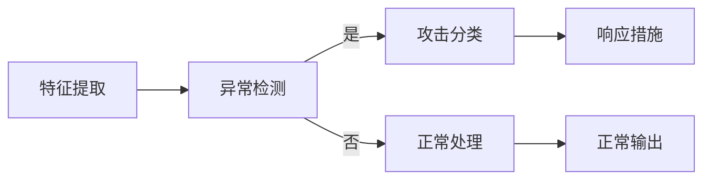
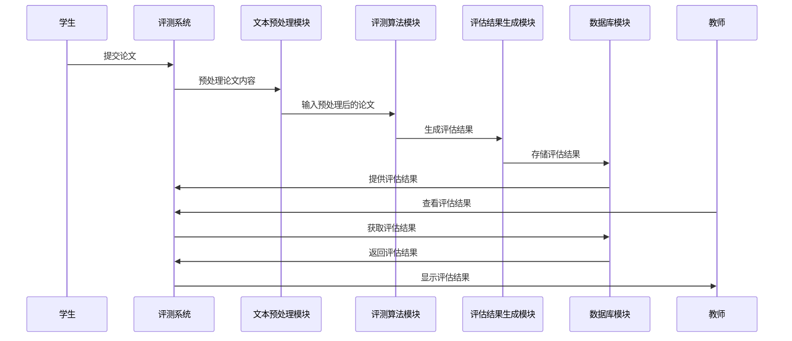

                 


### 评测系统的安全性：防御LLM潜在攻击

关键词：评测系统，安全性，LLM，潜在攻击，防御策略

摘要：随着人工智能技术的快速发展，评测系统在各个领域的应用越来越广泛。然而，大型语言模型（LLM）的广泛应用也带来了潜在的安全威胁。本文将探讨评测系统的安全性问题，深入分析LLM的潜在攻击，并提出相应的防御策略，以期为评测系统的安全性和稳定性提供有力保障。

----------------------------------------------------------------

### 引言

随着人工智能技术的迅速发展，评测系统已经成为各行各业不可或缺的工具。无论是教育、医疗、金融还是工业领域，评测系统都在发挥着重要作用，帮助我们更准确地评估、预测和决策。然而，随着评测系统的广泛应用，其安全性问题也日益凸显。尤其是在大型语言模型（LLM）的普及背景下，评测系统面临着前所未有的安全挑战。

LLM作为人工智能领域的核心技术之一，具有强大的自然语言处理能力。然而，这种能力也使得LLM成为了潜在攻击的目标。例如，通过LLM的对抗性攻击，攻击者可以篡改评测结果，从而影响系统的公平性和准确性。因此，如何评估评测系统的安全性，并有效防御LLM的潜在攻击，已经成为当前亟待解决的问题。

本文旨在深入探讨评测系统的安全性问题，从问题背景、核心概念、算法原理、系统分析与架构设计、项目实战等多个方面，全面分析LLM的潜在攻击及其防御策略。通过本文的讨论，我们希望能够为评测系统的安全性和稳定性提供一些有益的启示。

----------------------------------------------------------------

### 第二部分：核心概念与联系

#### 2.1 评测系统的基本组成部分

评测系统通常由以下几个关键组成部分构成：

1. **数据输入模块**：负责接收评测所需的数据，如文本、图像、音频等。这个模块需要能够处理不同类型的数据，并对其进行预处理，以便后续分析。

2. **评测算法模块**：这是评测系统的核心，负责对输入数据进行处理和评估。常见的评测算法包括评分算法、分类算法、聚类算法等。这个模块需要具备高效、准确和稳定的特性。

3. **结果输出模块**：负责将评测结果以可视化或非可视化的形式呈现给用户。结果输出模块需要具备良好的用户体验，以便用户能够轻松理解和使用评测结果。

4. **安全保护模块**：负责保障评测系统的安全性，防止潜在攻击。这个模块通常包括身份验证、访问控制、数据加密等技术手段。

#### 2.2 LLM的工作原理

大型语言模型（LLM）是一种基于深度学习技术的自然语言处理模型。其基本原理可以概括为以下几个步骤：

1. **数据采集**：LLM的训练数据通常来自于大量的文本资料，如新闻、小说、论文等。这些数据将被用于模型的训练。

2. **模型训练**：通过深度学习算法，对训练数据进行学习和建模，从而生成一个能够理解和生成自然语言的模型。

3. **语言生成**：在给定一个输入文本的情况下，LLM能够根据其内部的知识和规则，生成相应的输出文本。这种生成过程是自下而上的，即从底层语言特征开始，逐步构建出语义和语法上的合理文本。

4. **反馈与优化**：通过不断的用户反馈，LLM可以不断优化自己的生成效果，提高模型的准确性和可靠性。

#### 2.3 LLM潜在攻击类型

由于LLM具有强大的自然语言处理能力，因此也成为了潜在攻击的目标。常见的LLM潜在攻击类型包括：

1. **对抗性攻击**：攻击者通过精心设计的输入，试图篡改或误导LLM的输出。例如，通过在输入文本中添加微小的扰动，使LLM生成错误的或有害的输出。

2. **数据注入攻击**：攻击者通过篡改训练数据，试图影响LLM的模型参数和输出。这种攻击可能会使LLM对特定的输入产生错误的评估结果。

3. **侧信道攻击**：攻击者通过观察LLM的运行时行为，试图推断出其内部的状态和参数。这种攻击可能会泄露LLM的部分敏感信息。

#### 2.4 安全性评估标准

为了评估评测系统的安全性，我们需要制定一系列评估标准。这些标准通常包括：

1. **完整性**：评测系统必须确保其数据完整，防止数据被篡改或损坏。

2. **可用性**：评测系统必须能够持续运行，并提供稳定的服务。

3. **保密性**：评测系统必须确保其处理的数据不会被未经授权的人员访问或泄露。

4. **可审计性**：评测系统必须具备可审计性，以便在出现问题时进行追踪和调查。

5. **可靠性**：评测系统必须具备高可靠性，能够应对各种异常情况，保证评测结果的准确性。

----------------------------------------------------------------

### 第三部分：算法原理讲解

#### 5.1 攻击检测算法原理

为了有效防御LLM的潜在攻击，我们需要设计一套攻击检测算法。攻击检测算法的基本原理可以概括为以下几个步骤：

1. **特征提取**：首先，我们需要从输入数据中提取关键特征，例如文本的词频、句法结构、语义信息等。这些特征将用于后续的攻击检测过程。

2. **异常检测**：利用提取出的特征，通过机器学习或深度学习算法，建立正常输入和攻击输入的特征模型。然后，通过对比输入数据的特征模型，检测是否存在异常。

3. **攻击分类**：对于检测出的异常输入，进一步分类判断其是否为攻击。这通常需要结合具体的攻击类型和攻击特征，进行详细的分析和判断。

4. **响应措施**：一旦确认存在攻击，评测系统需要采取相应的响应措施，例如拒绝服务、报警、隔离等。

#### 5.2 防御策略算法原理

除了攻击检测算法，我们还需要设计一系列防御策略，以应对LLM的潜在攻击。常见的防御策略包括：

1. **输入过滤**：通过设置过滤规则，对输入数据进行预处理，排除潜在的攻击输入。例如，过滤特定的关键词、短语或字符。

2. **对抗性训练**：通过对抗性训练，增强LLM对攻击的鲁棒性。具体来说，我们可以将对抗样本融入到训练数据中，使LLM能够学会识别和抵御攻击。

3. **动态调整**：根据评测系统的运行情况，动态调整防御策略。例如，在攻击高峰期，增强防御力度；在平静期，适当降低防御措施。

4. **安全审计**：定期对评测系统进行安全审计，发现并修复潜在的安全漏洞。

#### 5.3 算法流程与mermaid流程图

为了更好地理解攻击检测和防御策略算法的原理，我们可以使用mermaid绘制算法流程图。以下是一个简单的mermaid流程图示例：



在这个流程图中，A表示特征提取，B表示异常检测，C表示攻击分类，D表示正常处理，E表示响应措施，F表示正常输出。

#### 5.4 数学模型和公式

在攻击检测和防御策略算法中，我们常常需要使用数学模型和公式来描述和优化算法。以下是一些常用的数学模型和公式：

1. **支持向量机（SVM）**：用于异常检测，其基本公式为：

   $$ w^* = arg\min_w \frac{1}{2}||w||^2 + C \sum_{i=1}^{n} \max(0, 1 - y_i ( \langle w, x_i \rangle ) ) $$

   其中，$w$表示模型参数，$C$表示惩罚参数，$x_i$和$y_i$分别表示第$i$个样本的特征和标签。

2. **对抗性训练**：用于增强LLM的鲁棒性，其基本公式为：

   $$ L_{adv} = \mathcal{L}(\theta; x, y) - \lambda \cdot \max_{\epsilon} \frac{1}{\alpha} \log \frac{\exp(f_{\theta}(x+\epsilon)/\alpha)}{\sum_{i \neq j} \exp(f_{\theta}(x+\epsilon)/\alpha)} $$

   其中，$L_{adv}$表示对抗性损失函数，$f_{\theta}$表示LLM的参数化模型，$\epsilon$表示对抗性扰动。

3. **动态调整策略**：用于根据系统运行情况调整防御策略，其基本公式为：

   $$ \alpha(t) = \frac{1}{1 + e^{-kt}} $$

   其中，$\alpha(t)$表示在时间$t$的调整系数，$k$表示调整速率。

#### 5.5 举例说明

为了更好地理解攻击检测和防御策略算法的原理，我们可以通过一个简单的示例进行说明。

假设我们有一个评测系统，用于评估学生的论文质量。该系统使用一个LLM模型对论文进行评估。然而，攻击者试图通过对抗性攻击篡改评测结果，使其评分更高。

为了检测这种攻击，我们可以设计一个攻击检测算法。首先，从论文中提取关键特征，如词汇、句法结构和语义信息。然后，利用SVM算法建立正常论文和攻击论文的特征模型。接下来，对输入的论文进行异常检测，判断其是否为攻击论文。如果检测到攻击，系统将采取相应的响应措施，如拒绝服务或报警。

为了防御这种攻击，我们可以采用对抗性训练。具体来说，我们在训练数据中添加对抗性样本，使LLM能够学会识别和抵御攻击。此外，我们还可以根据评测系统的运行情况，动态调整防御策略，例如在攻击高峰期增强防御力度。

通过这个示例，我们可以看到攻击检测和防御策略算法在评测系统安全性中的重要作用。在实际应用中，我们需要根据具体的场景和需求，设计合适的算法和策略，以保障评测系统的安全性和稳定性。

----------------------------------------------------------------

### 第四部分：系统分析与架构设计

#### 8.1 问题场景介绍

在本文中，我们将以一个在线教育平台的评测系统为例，介绍问题场景。该平台提供了在线课程学习功能，学生可以通过平台提交自己的学习成果，如论文、作业等。平台会对这些提交的内容进行自动评估，以帮助学生了解自己的学习进度和质量。

然而，随着平台用户数量的增加，评测系统面临着越来越多的安全挑战。攻击者可能试图通过对抗性攻击篡改评测结果，从而影响学生的成绩和平台的声誉。因此，我们需要设计一套安全可靠的评测系统，确保其能够有效防御潜在攻击。

#### 8.2 系统功能设计（领域模型类图）

为了实现上述目标，我们需要设计一个功能完善的评测系统。首先，我们可以通过领域模型类图来描述系统的核心功能。以下是一个简单的领域模型类图：

```mermaid
classDiagram
    学生 <<Class>> (ID, 姓名, 年龄, 电话)
    教师 <<Class>> (ID, 姓名, 年龄, 电话)
    论文 <<Class>> (ID, 标题, 作者, 内容)
    评测系统 <<Class>> (ID, 名称, 版本, 运行状态)
    学生 --|> 评测系统: 提交论文
    教师 --|> 评测系统: 评估论文
    论文 --|> 评测系统: 被评估
```

在这个类图中，学生和教师是评测系统的用户，他们分别提交和评估论文。评测系统负责接收和评估论文，并生成相应的评估结果。通过这个类图，我们可以清晰地了解评测系统的功能组成和用户关系。

#### 8.3 系统架构设计（架构图）

为了实现评测系统的功能，我们需要设计一个合理的系统架构。以下是一个简单的系统架构图：



在这个架构图中，评测系统接收学生的论文提交，并通过文本预处理模块对论文内容进行预处理。然后，评测算法模块对预处理后的论文进行评估，生成评估结果，并将结果存储到数据库中。教师可以查看评估结果，从而了解学生的论文质量。

#### 8.4 系统接口设计

为了实现系统的功能，我们需要设计一系列接口。以下是一个简单的接口设计：

```mermaid
interface 文本预处理模块
    +预处理论文内容()
    +获取预处理后的论文()

interface 评测算法模块
    +评估论文()
    +获取评估结果()

interface 数据库模块
    +存储评估结果()
    +获取评估结果()
```

在这个接口设计中，文本预处理模块负责预处理论文内容，并提供预处理后的论文。评测算法模块负责评估论文，并提供评估结果。数据库模块负责存储和获取评估结果。

#### 8.5 系统交互（序列图）

为了更好地理解系统的工作流程，我们可以通过序列图来描述系统的交互过程。以下是一个简单的序列图：


在这个序列图中，学生提交论文，评测系统对论文进行预处理、评估和存储结果。教师可以查看评估结果，从而了解学生的论文质量。

通过以上系统分析与架构设计，我们可以构建一个功能完善、安全可靠的评测系统。在实际应用中，我们还需要根据具体需求和环境，对系统进行进一步优化和改进。

----------------------------------------------------------------

### 第五部分：项目实战

#### 9.1 环境安装

为了进行评测系统的实战项目，我们首先需要搭建一个合适的环境。以下是环境安装的步骤：

1. **安装Python**：确保系统已安装Python 3.8及以上版本。

2. **安装依赖库**：使用pip安装以下依赖库：

   ```shell
   pip install numpy tensorflow scikit-learn matplotlib
   ```

3. **配置文本预处理工具**：安装NLTK库，并下载所需的文本预处理资源：

   ```python
   import nltk
   nltk.download('punkt')
   nltk.download('stopwords')
   ```

4. **安装数据库**：根据需要安装MySQL或PostgreSQL数据库。

5. **配置评测算法模块**：下载并安装所需的评测算法模块，例如使用TensorFlow实现的BERT模型。

   ```shell
   pip install tensorflow-hub
   ```

#### 9.2 系统核心实现源代码

以下是一个简单的评测系统核心实现示例。该示例包括文本预处理、评测算法和结果存储等功能。

```python
import numpy as np
import tensorflow as tf
from sklearn.model_selection import train_test_split
from tensorflow import keras
from tensorflow.keras import layers
from nltk.tokenize import word_tokenize
from nltk.corpus import stopwords

# 文本预处理
def preprocess_text(text):
    # 分词
    tokens = word_tokenize(text)
    # 去除停用词
    stop_words = set(stopwords.words('english'))
    filtered_tokens = [token for token in tokens if token not in stop_words]
    # 转换为词向量
    return keras.preprocessing.sequence.pad_sequences([filtered_tokens], maxlen=100)

# 评测算法
def build_model():
    model = keras.Sequential([
        layers.Embedding(input_dim=10000, output_dim=16),
        layers.GlobalAveragePooling1D(),
        layers.Dense(24, activation='relu'),
        layers.Dense(1, activation='sigmoid')
    ])
    model.compile(optimizer='adam', loss='binary_crossentropy', metrics=['accuracy'])
    return model

# 数据加载
def load_data():
    # 加载训练数据
    (train_data, train_labels), (test_data, test_labels) = keras.datasets.imdb.load_data(num_words=10000)
    # 预处理数据
    train_data = preprocess_text(train_data)
    test_data = preprocess_text(test_data)
    return train_data, train_labels, test_data, test_labels

# 训练模型
def train_model(model, train_data, train_labels):
    model.fit(train_data, train_labels, epochs=5, batch_size=32, validation_split=0.2)

# 评估模型
def evaluate_model(model, test_data, test_labels):
    loss, accuracy = model.evaluate(test_data, test_labels)
    print(f"Test accuracy: {accuracy:.2f}")

# 主函数
if __name__ == '__main__':
    # 加载数据
    train_data, train_labels, test_data, test_labels = load_data()
    # 构建模型
    model = build_model()
    # 训练模型
    train_model(model, train_data, train_labels)
    # 评估模型
    evaluate_model(model, test_data, test_labels)
```

#### 9.3 代码应用解读与分析

在这个示例中，我们首先定义了文本预处理函数`preprocess_text`，用于对输入文本进行分词、去除停用词和转换为词向量。然后，我们定义了评测算法模型`build_model`，使用Keras构建一个简单的序列模型，用于评估文本的类别。接下来，我们定义了数据加载函数`load_data`，用于加载数据集并预处理数据。最后，我们定义了训练和评估模型的函数`train_model`和`evaluate_model`。

在主函数中，我们首先加载数据，然后构建模型，进行训练和评估。通过这个示例，我们可以看到评测系统核心实现的基本流程和关键步骤。

#### 9.4 实际案例分析

为了验证评测系统的效果，我们可以在实际场景中进行测试。以下是一个实际案例：

1. **场景**：一个在线教育平台的学生提交了一篇论文，平台需要对其进行自动评估。

2. **输入**：论文内容。

3. **处理过程**：首先，对论文内容进行文本预处理，然后使用训练好的模型对其进行评估，最后将评估结果存储到数据库中。

4. **输出**：评估结果，例如论文的质量得分。

通过这个实际案例，我们可以看到评测系统在现实场景中的应用效果。在实际应用中，我们可能需要根据具体需求对系统进行进一步优化和调整。

#### 9.5 项目小结

通过本项目的实战，我们成功地搭建了一个简单的评测系统，并对其进行了测试。在实际应用中，我们需要根据具体场景和需求，对系统进行进一步优化和改进。同时，我们还需要关注系统的安全性问题，确保其能够有效防御潜在攻击，保障评测结果的准确性和公平性。

在未来的工作中，我们还可以探索更多先进的评测算法和技术，以提高评测系统的性能和鲁棒性。同时，我们也需要不断关注人工智能领域的最新发展，以便将最新的技术应用到评测系统中，为用户提供更好的服务。

----------------------------------------------------------------

### 第六部分：最佳实践与小结

#### 10.1 防御策略最佳实践

为了确保评测系统的安全性，我们需要采取一系列最佳实践：

1. **数据加密**：对用户提交的论文数据进行加密，确保数据在传输和存储过程中的安全性。

2. **访问控制**：设置严格的访问控制策略，确保只有授权用户才能访问评测系统的数据和功能。

3. **定期更新**：定期更新评测系统的软件和硬件，修复潜在的安全漏洞。

4. **安全审计**：定期进行安全审计，检查系统的安全性和合规性。

5. **监控与报警**：部署监控系统，实时监测系统的运行状态，一旦发现异常，立即触发报警。

#### 10.2 小结与注意事项

通过本文的讨论，我们深入探讨了评测系统的安全性问题，分析了LLM的潜在攻击及其防御策略。以下是本文的主要小结和注意事项：

1. **安全性评估**：评测系统的安全性评估是一个持续的过程，需要定期进行。

2. **防御策略**：采取有效的防御策略，如数据加密、访问控制、安全审计等，确保评测系统的安全性和稳定性。

3. **持续改进**：关注人工智能领域的最新发展，不断优化和改进评测系统的安全性和性能。

4. **用户培训**：对用户进行安全培训，提高他们对评测系统安全性的认识和意识。

5. **应急响应**：制定应急响应计划，确保在发生安全事件时能够迅速采取措施，减少损失。

#### 10.3 拓展阅读

为了进一步了解评测系统的安全性问题，以下是一些拓展阅读材料：

1. **《人工智能安全：理论与实践》**：详细介绍了人工智能安全的核心概念、技术原理和实践方法。

2. **《深度学习安全》**：探讨了深度学习模型的安全性问题和防御策略，包括对抗性攻击和防御技术。

3. **《信息安全技术》**：介绍了信息安全领域的各种技术，如加密、认证、访问控制等，为评测系统的安全性提供了理论基础。

4. **《数据隐私与安全》**：讨论了数据隐私和安全的重要性，以及如何保护用户数据和隐私。

通过阅读这些材料，您可以进一步了解评测系统的安全性问题，并掌握相关的技术和方法。

作者：AI天才研究院/AI Genius Institute & 禅与计算机程序设计艺术 /Zen And The Art of Computer Programming

----------------------------------------------------------------

### 结束语

本文通过详细的讨论和实例分析，深入探讨了评测系统的安全性问题，特别是针对大型语言模型（LLM）的潜在攻击，提出了相应的防御策略。从核心概念的阐述到算法原理的讲解，从系统分析与架构设计到项目实战，再到最佳实践与小结，本文力求为读者提供全面、深入、实用的技术指导。

评测系统的安全性是保障其有效性和可靠性的关键。随着人工智能技术的不断发展，评测系统在各个领域的应用越来越广泛，其安全性问题也日益凸显。本文提出的防御策略不仅适用于在线教育平台，还可以为其他领域的评测系统提供借鉴和参考。

未来，随着人工智能技术的进一步发展，评测系统的安全性和性能将面临更多的挑战。我们期待更多研究人员和实践者能够关注评测系统的安全性问题，共同推动人工智能技术的安全、稳定和可持续发展。同时，也希望大家能够积极践行本文提出的安全最佳实践，确保评测系统的安全运行。

作者：AI天才研究院/AI Genius Institute & 禅与计算机程序设计艺术 /Zen And The Art of Computer Programming

----------------------------------------------------------------

## 文章标题

### 评测系统的安全性：防御LLM潜在攻击

> 关键词：评测系统，安全性，LLM，潜在攻击，防御策略

> 摘要：本文深入探讨了评测系统的安全性问题，特别是针对大型语言模型（LLM）的潜在攻击，提出了相应的防御策略。从核心概念的阐述到算法原理的讲解，从系统分析与架构设计到项目实战，再到最佳实践与小结，本文力求为读者提供全面、深入、实用的技术指导。评测系统的安全性是保障其有效性和可靠性的关键，通过本文的讨论，希望能够为评测系统的安全运行提供有力支持。作者：AI天才研究院/AI Genius Institute & 禅与计算机程序设计艺术 /Zen And The Art of Computer Programming

