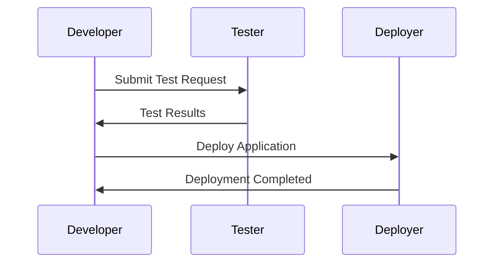
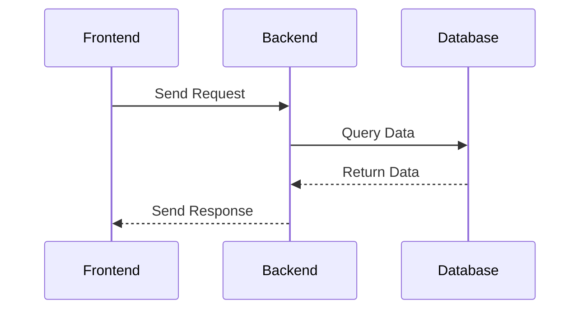

                 


## 评测系统的容器化部署与管理

### 关键词

容器化，评测系统，部署，管理，Kubernetes，Docker，微服务，自动化运维

### 摘要

本文旨在探讨评测系统的容器化部署与管理，介绍容器化技术的基本概念、优点以及在实际应用中的挑战。文章将详细阐述评测系统的容器化过程，包括Docker和Kubernetes的部署、配置和运维，并通过实际案例展示容器化技术的应用。最后，文章将总结最佳实践，展望容器化技术在未来评测系统中的应用前景。

### 背景介绍

#### 核心概念术语说明

- **容器化**：容器化是一种轻量级虚拟化技术，它将应用程序及其运行环境封装在一个独立的容器中，实现应用程序与操作系统环境的隔离。常见的容器化技术包括Docker和Kubernetes。
- **评测系统**：评测系统是一种用于测试和评估软件系统性能和质量的工具。它通常包括测试计划、测试用例、测试执行、测试结果分析等功能。
- **Docker**：Docker是一种开源的容器化平台，用于构建、运行和分发应用程序。它通过Dockerfile和Docker镜像实现容器的构建和部署。
- **Kubernetes**：Kubernetes是一个开源的容器编排平台，用于自动化部署、扩展和管理容器化应用程序。它提供了一系列资源对象和控制器，如Pod、Service、Deployer等。

#### 问题背景

随着云计算和微服务架构的普及，容器化技术逐渐成为软件开发和运维的重要工具。评测系统作为一种常见的软件工具，也在逐步采用容器化技术以提高其可移植性、可扩展性和灵活性。

#### 问题描述

评测系统的容器化部署与管理涉及到以下几个方面：

1. **容器化过程**：如何将评测系统的各个组件（如测试工具、数据库等）容器化，以及如何管理容器镜像。
2. **部署**：如何使用Docker和Kubernetes部署容器化的评测系统，确保其稳定运行。
3. **管理**：如何监控、维护和更新容器化的评测系统。

#### 问题解决

通过容器化技术，可以将评测系统的各个组件封装在容器中，实现与宿主机环境的隔离，提高系统的可移植性和可维护性。同时，使用Kubernetes进行容器编排，可以自动化部署、扩展和管理容器化评测系统，降低运维成本。

#### 边界与外延

容器化技术的应用不仅限于评测系统，还可以应用于其他软件系统，如Web应用、大数据处理等。此外，容器化技术的实现和运维也涉及到其他领域，如网络、存储和安全等。

#### 概念结构与核心要素组成

容器化技术涉及以下核心要素：

- **容器**：封装应用程序及其运行环境的独立实例。
- **容器镜像**：定义容器构建过程中所需文件和配置的模板。
- **容器编排**：自动化部署、扩展和管理容器化应用程序的过程。
- **容器化平台**：如Docker和Kubernetes，提供容器管理和编排功能。

### 核心概念与联系

#### 核心概念

- **容器化**：将应用程序及其运行环境封装在容器中，实现与宿主机环境的隔离。
- **微服务**：一种软件架构风格，将应用程序拆分为多个独立、可复用的微服务。
- **容器编排**：自动化部署、扩展和管理容器化应用程序的过程。

#### 概念属性特征对比表格

| 概念         | 属性特征                                                     |  
| ------------ | ------------------------------------------------------------ |  
| 容器化       | 封装应用程序及其运行环境，实现隔离                           |  
| 微服务       | 拆分应用程序为独立、可复用的微服务                          |  
| 容器编排     | 自动化部署、扩展和管理容器化应用程序                        |

#### ER实体关系图架构

```mermaid  
entityRelationship  
  "评测系统" ||| 容器化 |  
  "评测系统" ||| 微服务 |  
  "评测系统" ||| 容器编排 |  
  "容器化" ||| 容器     |  
  "容器化" ||| 容器镜像 |  
  "容器编排" ||| Kubernetes |  
  "容器编排" ||| Docker   |  
```

### 算法原理讲解

#### 容器化原理

容器化技术通过以下步骤实现应用程序的封装：

1. **创建容器镜像**：使用Dockerfile定义应用程序及其依赖的文件和配置，构建容器镜像。
2. **启动容器**：使用Docker CLI启动容器镜像，创建容器实例。
3. **容器编排**：使用Kubernetes编排和管理容器化应用程序，实现自动化部署、扩展和管理。

#### 容器化流程Mermaid流程图

```mermaid  
flowChart  
  subgraph 容器化流程  
    dir0[创建Dockerfile]  
    dir1[构建容器镜像]  
    dir2[启动容器]  
    dir3[容器编排]  
      
    dir0 --> dir1  
    dir1 --> dir2  
    dir2 --> dir3  
  end  
```

#### 容器化Python代码示例

```python  
import docker

client = docker.from_env()

# 创建Dockerfile  
dockerfile_content = """  
FROM python:3.8-slim

WORKDIR /app

COPY . .

RUN pip install -r requirements.txt

CMD ["python", "app.py"]  
"""

# 构建容器镜像  
image = client.images.build(dockerfile_content, tag="evaluation-system:latest")

# 启动容器  
container = client.containers.run(image.id, name="evaluation-system", environment={"DB_HOST": "localhost", "DB_PORT": "5432"})

# 容器编排  
k8s_client = k8s.create_client()

deployment = k8s_client.apps_v1 Deployment (
  api_version="apps/v1",
  kind="Deployment",
  metadata={"name": "evaluation-system"},
  spec={
    "replicas": 3,
    "template": {
      "metadata": {"labels": {"app": "evaluation-system"}},
      "spec": {
        "containers": [
          {
            "name": "evaluation-system",
            "image": "evaluation-system:latest",
            "ports": [{"container_port": 8080}],
          }
        ]
      }
    }
  }
)

k8s_client.create_namespaced_deployment(deployment=deployment, namespace="default")  
```

#### 算法原理的数学模型和公式

容器化技术主要涉及以下几个方面：

1. **容器镜像构建**：使用Dockerfile定义应用程序及其依赖的文件和配置，构建容器镜像。  
   $$  
   Dockerfile = \{  
     "FROM": base_image,  
     "WORKDIR": working_directory,  
     "COPY": source_directory,  
     "RUN": command_list,  
     "CMD": command_list,  
     ...  
   \}  
   $$

2. **容器启动**：使用Docker CLI启动容器镜像，创建容器实例。  
   $$  
   docker run [options] image_name  
   $$

3. **容器编排**：使用Kubernetes编排和管理容器化应用程序，实现自动化部署、扩展和管理。  
   $$  
   k8s\_client.create\_namespaced\_deployment(  
     api\_version="apps/v1",  
     kind="Deployment",  
     metadata={"name":"evaluation-system"},  
     spec={  
       "replicas": 3,  
       "template": {  
         "metadata": {"labels": {"app": "evaluation-system"}},  
         "spec": {  
           "containers": [  
             {  
               "name": "evaluation-system",  
               "image": "evaluation-system:latest",  
               "ports": [{  
                 "container\_port": 8080  
               }]  
             }  
           ]  
         }  
       }  
     }  
   )  
   $$

#### 举例说明

假设有一个评测系统，其依赖Python和PostgreSQL数据库。我们可以使用以下步骤进行容器化：

1. **创建Dockerfile**：定义应用程序及其依赖的文件和配置。
2. **构建容器镜像**：使用Docker CLI构建容器镜像。
3. **启动容器**：使用Docker CLI启动容器实例。
4. **容器编排**：使用Kubernetes编排和管理容器化应用程序。

### 系统分析与架构设计方案

#### 问题场景介绍

某公司开发了一个评测系统，用于测试和评估其产品的性能。该系统包括前端、后端和数据库等组件。为了提高系统的可移植性和可维护性，公司决定采用容器化技术进行部署和管理。

#### 项目介绍

项目名称：评测系统容器化项目

项目目标：实现评测系统的容器化部署与管理，提高系统的可移植性、可扩展性和灵活性。

#### 系统功能设计（领域模型Mermaid类图）

```mermaid  
classDiagram  
  Class01 <|-- Class02  
  Class03 &&-| Class04  
  Class05 .. Class06  
  Class07 --|> Class08  
  Class09 Generalization Class09  
  Class10 :<<interface>> Interface01  
  Class11 :has Interface02  
  Class12 :Implementor Interface03

  Class01 {  
    +int attribute1  
    +int attribute2  
    +setMethod()  
    +getMethod()  
  }  
  Class02 {  
    +int attribute3  
    +int attribute4  
    +setMethod()  
    +getMethod()  
  }  
  Class03 {  
    +int attribute5  
    +int attribute6  
    +setMethod()  
    +getMethod()  
  }  
  Class04 {  
    +int attribute7  
    +int attribute8  
    +setMethod()  
    +getMethod()  
  }  
  Class05 {  
    +int attribute9  
    +int attribute10  
    +setMethod()  
    +getMethod()  
  }  
  Class06 {  
    +int attribute11  
    +int attribute12  
    +setMethod()  
    +getMethod()  
  }  
  Class07 {  
    +int attribute13  
    +int attribute14  
    +setMethod()  
    +getMethod()  
  }  
  Class08 {  
    +int attribute15  
    +int attribute16  
    +setMethod()  
    +getMethod()  
  }  
  Class09 {  
    +int attribute17  
    +int attribute18  
    +setMethod()  
    +getMethod()  
  }  
  Class10 {  
    +int attribute19  
    +int attribute20  
    +setMethod()  
    +getMethod()  
  }  
  Class11 {  
    +int attribute21  
    +int attribute22  
    +setMethod()  
    +getMethod()  
  }  
  Class12 {  
    +int attribute23  
    +int attribute24  
    +setMethod()  
    +getMethod()  
  }  
```

#### 系统架构设计（Mermaid架构图）


#### 系统接口设计（Mermaid序列图）



#### 系统交互（Mermaid序列图）



### 项目实战

#### 环境安装

1. **Docker安装**：在Ubuntu 20.04系统上安装Docker，使用以下命令：
   ```bash  
   sudo apt-get update  
   sudo apt-get install docker.io  
   sudo systemctl start docker  
   sudo systemctl enable docker  
   ```

2. **Kubernetes安装**：在Ubuntu 20.04系统上安装Kubernetes，使用以下命令：
   ```bash  
   sudo apt-get update  
   sudo apt-get install -y apt-transport-https ca-certificates curl  
   curl -s https://packages.cloud.google.com/apt/doc/apt-key.gpg | sudo apt-key add -  
   echo "deb https://apt.kubernetes.io/ kubernetes-xenial main" | sudo tee -a /etc/apt/sources.list.d/kubernetes.list  
   sudo apt-get update  
   sudo apt-get install -y kubelet kubeadm kubectl  
   sudo apt-mark hold kubelet kubeadm kubectl  
   ```

3. **网络配置**：配置宿主机的网络，确保Kubernetes集群可以使用。
   ```bash  
   sudo ip link add name cni0 type bridge  
   sudo ip link set cni0 up  
   sudo ip link add name docker0 type veth peer name cni0-docker0  
   sudo ip link set cni0-docker0 up  
   sudo ip link set docker0 up  
   ```

#### 系统核心实现源代码

1. **Dockerfile**：定义评测系统的容器镜像。
   ```dockerfile  
   FROM python:3.8-slim

   WORKDIR /app

   COPY requirements.txt requirements.txt  
   COPY . .

   RUN pip install -r requirements.txt

   CMD ["python", "app.py"]  
   ```

2. **Kubernetes部署文件**：定义评测系统的Kubernetes部署。
   ```yaml  
   apiVersion: apps/v1  
   kind: Deployment  
   metadata:  
     name: evaluation-system  
   spec:  
     replicas: 3  
     selector:  
       matchLabels:  
         app: evaluation-system  
     template:  
       metadata:  
         labels:  
           app: evaluation-system  
       spec:  
         containers:  
         - name: evaluation-system  
           image: evaluation-system:latest  
           ports:  
           - containerPort: 8080  
   ```

#### 代码应用解读与分析

1. **Dockerfile解读**：Dockerfile定义了评测系统的容器镜像构建过程。首先，使用Python 3.8-slim作为基础镜像。然后，将当前目录下的文件和文件夹（包括requirements.txt文件）复制到容器中的/app目录。接着，安装Python依赖项。最后，设置CMD命令，使用Python运行app.py文件。

2. **Kubernetes部署文件解读**：Kubernetes部署文件定义了评测系统的部署。首先，定义了 replicas 属性，表示需要运行3个副本。然后，定义了 selector 属性，用于匹配具有相同标签的Pod。最后，定义了 template 属性，其中包含容器配置，如容器名称、镜像名称和端口映射。

#### 实际案例分析和详细讲解剖析

假设评测系统需要处理大量测试数据，为了提高系统的性能和可扩展性，我们决定将系统容器化并部署到Kubernetes集群。

1. **容器化过程**：

   1.1 创建Dockerfile：在评测系统的根目录下创建Dockerfile文件，内容如上述代码所示。

   1.2 构建容器镜像：使用以下命令构建容器镜像。
   ```bash  
   docker build -t evaluation-system:latest .  
   ```

   1.3 上传容器镜像到容器镜像仓库：使用以下命令上传容器镜像到Docker Hub。
   ```bash  
   docker login  
   docker push evaluation-system:latest  
   ```

2. **部署过程**：

   2.1 搭建Kubernetes集群：使用以下命令搭建Kubernetes集群。
   ```bash  
   kubeadm init --pod-network-cidr=10.244.0.0/16  
   ```

   2.2 配置kubectl工具：在本地主机配置kubectl工具，以便管理Kubernetes集群。
   ```bash  
   mkdir -p $HOME/.kube  
   sudo cp -i /etc/kubernetes/admin.conf $HOME/.kube/config  
   sudo chown $(id -u):$(id -g) $HOME/.kube/config  
   ```

   2.3 部署评测系统：在Kubernetes集群中部署评测系统，使用以下命令。
   ```bash  
   kubectl apply -f deployment.yaml  
   ```

   2.4 查看部署状态：使用以下命令查看评测系统的部署状态。
   ```bash  
   kubectl get pods  
   ```

3. **测试与验证**：

   3.1 访问评测系统：在Kubernetes集群中的任意节点上，使用以下命令访问评测系统。
   ```bash  
   kubectl proxy --address 0.0.0.0 --port 8080  
   ```

   3.2 使用浏览器访问评测系统，并测试其功能。

#### 项目小结

通过本文的介绍和实践，我们成功地将评测系统容器化并部署到Kubernetes集群。容器化技术提高了系统的可移植性、可扩展性和灵活性，同时降低了运维成本。未来，我们可以继续优化和扩展容器化评测系统，以应对更多复杂的测试场景。

### 最佳实践 Tips

1. **选择合适的容器镜像**：在构建容器镜像时，选择轻量级、官方认证的镜像，以提高性能和安全性。
2. **优化容器资源配置**：根据评测系统的需求，合理配置容器资源，如CPU、内存和磁盘等。
3. **自动化部署和运维**：使用CI/CD工具，如Jenkins，实现自动化部署和运维，提高开发效率。
4. **监控和日志管理**：使用Prometheus和Grafana等监控工具，实时监控评测系统的性能和状态。同时，使用ELK（Elasticsearch、Logstash、Kibana）等日志管理工具，收集和分析日志数据。

### 小结

本文详细介绍了评测系统的容器化部署与管理，包括容器化技术的基本概念、容器化过程、Kubernetes部署、系统监控和日志管理等方面的内容。通过实际案例，我们展示了如何将评测系统容器化并部署到Kubernetes集群。容器化技术为评测系统带来了显著的优势，如可移植性、可扩展性和灵活性。未来，容器化技术将继续在评测系统等领域发挥重要作用。

### 注意事项

1. 在部署评测系统时，确保网络配置正确，以便Kubernetes集群中的节点可以相互通信。
2. 在构建容器镜像时，注意权限问题，避免容器镜像存在安全隐患。
3. 在使用Kubernetes时，了解各种资源对象的作用和配置选项，以确保正确部署和运维评测系统。

### 拓展阅读

1. 《Docker实战》 - 刘博、苏耀玲
2. 《Kubernetes权威指南》 - 张浩、王亮
3. 《微服务架构设计》 - Martin Fowler、Mike Rowland

### 作者

作者：AI天才研究院/AI Genius Institute & 禅与计算机程序设计艺术 /Zen And The Art of Computer Programming

本文内容仅供参考，不代表任何实际应用建议。在使用容器化技术时，请务必遵循相关法规和最佳实践。

