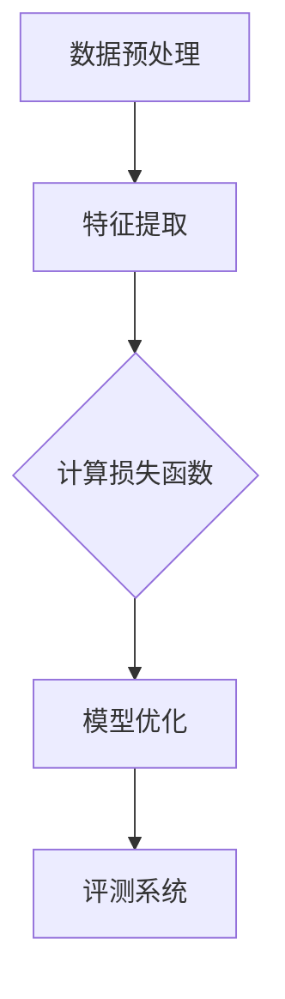
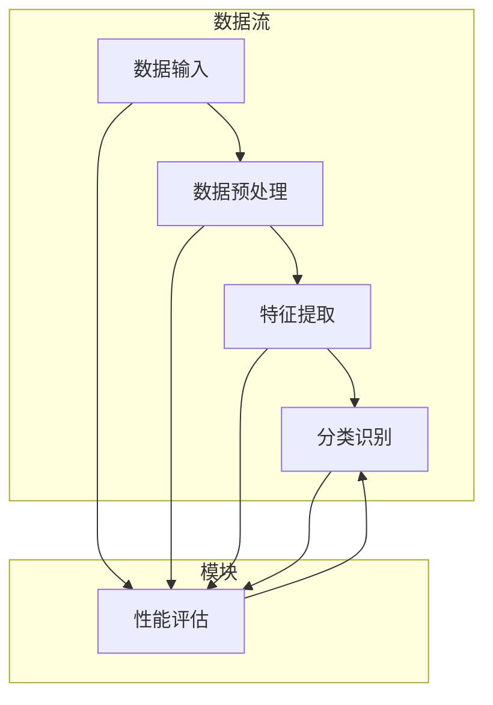
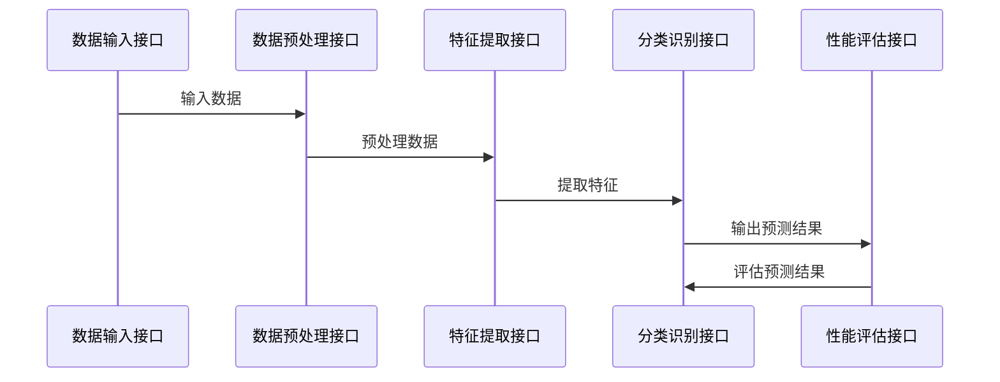

                 

### 文章标题：评测系统的对比学习特征提取

#### 关键词：对比学习、特征提取、评测系统、深度学习

#### 摘要：
本文旨在深入探讨评测系统中对比学习特征提取的方法与应用。首先，我们将介绍对比学习的基本概念和在深度学习中的应用，分析其优势与挑战。接着，通过核心概念与联系部分，详细阐述特征提取与对比学习指标。然后，我们将深入算法原理与实现，以直观的流程图和Python代码，结合数学模型，解释对比学习的工作机制。在系统架构与设计部分，我们将详细分析评测系统的问题场景、功能设计、架构设计、接口与交互。接下来，通过实际项目实战，我们将展示环境安装、系统核心实现及代码应用解读。最后，提供最佳实践和项目小结，以及拓展阅读资源。

## 第一部分：对比学习概述

### 第1章：对比学习基础

#### 1.1 对比学习概念

对比学习（Contrastive Learning）是一种自监督学习方法，通过将数据点与其近邻数据进行对比，从而提取数据的有用特征。与传统的监督学习不同，对比学习不依赖于标签数据，而是通过无监督的方式，学习到数据的高效表示。

**对比学习定义：**
对比学习通过设计对比损失函数，使得模型能够对不同的数据点进行区分，从而提取出其内在特征。对比损失函数通常基于数据点之间的相似度或距离，目标是最大化正样本的相似度，最小化负样本的相似度。

**对比学习与监督学习的区别：**
监督学习依赖于标签数据来训练模型，通过最小化预测误差来优化模型。而对比学习则无需标签数据，通过无监督的方式，学习到数据的有用特征，然后利用这些特征进行下游任务。

#### 1.2 对比学习在深度学习中的应用

对比学习在深度学习中的应用非常广泛，包括图像识别、文本分类、自然语言处理等多个领域。通过对比学习，模型能够学习到更加鲁棒的特征表示，从而提高下游任务的性能。

**对比学习模型简介：**
常见的对比学习模型包括Siamese Network、Triplet Loss、InfoNCE等。这些模型通过设计不同的损失函数和优化策略，实现数据的对比学习。

**对比学习优势：**
1. 无需标签数据：对比学习可以通过无监督的方式，学习到数据的有用特征，从而避免了标签数据获取的成本和难度。
2. 数据增强：对比学习能够自动生成数据增强，从而提高模型对数据的泛化能力。
3. 鲁棒性：对比学习能够学习到更加鲁棒的特征表示，从而提高模型对噪声和异常数据的处理能力。

#### 1.3 对比学习挑战与未来趋势

尽管对比学习在深度学习领域取得了显著成果，但仍面临着一些挑战。

**数据集不平衡问题：**
对比学习通常依赖于正负样本的比例，数据集的不平衡可能导致模型偏向于某一类样本，从而影响模型性能。

**模型可解释性问题：**
对比学习模型通常具有高度的非线性特性，使得其内部工作机制难以解释，这对于实际应用中的模型调试和优化提出了挑战。

**未来趋势：**
未来对比学习的发展可能集中在以下几个方面：

1. 模型可解释性：通过设计可解释的对比学习模型，提高模型在实际应用中的可操作性和可靠性。
2. 多模态对比学习：结合不同类型的数据（如文本、图像、语音等），实现更加鲁棒的特征提取。
3. 小样本学习：在数据稀缺的情况下，通过对比学习实现高效的特征提取和模型训练。

### 第2章：核心概念与联系

#### 2.1 核心概念

**特征提取：**
特征提取是指从原始数据中提取出能够代表数据本质的属性或特征。在对比学习中，特征提取是关键的一步，它决定了模型能否学习到有效的特征表示。

**对比学习指标：**
对比学习指标用于衡量模型在对比学习过程中的性能，包括正样本相似度、负样本相似度、特征区分度等。这些指标对于评估和优化对比学习模型具有重要意义。

#### 2.2 概念属性对比表格

以下是一个简单的特征提取方法对比表格，展示了不同特征提取方法的属性和特点：

| 方法          | 描述                | 属性                | 特点                |
| ------------- | ------------------- | ------------------- | ------------------- |
| PCA           | 主成分分析          | 线性变换            | 降维、去相关性      |
| Autoencoder   | 自编码器            | 非线性变换          | 特征学习、去噪      |
| Deep Metric   | 深度度量学习        | 高维嵌入            | 距离度量、特征提取 |
| Contrastive   | 对比学习            | 自监督学习          | 数据增强、特征提取 |

#### 2.3 ER实体关系图

在对比学习系统中，不同的实体（如数据点、特征提取器、损失函数等）之间存在复杂的关联关系。以下是一个简化的ER实体关系图，展示了系统的主要实体及其关系：

```mermaid
erDiagram
  数据点 ||--|{ 特征提取器 }|-- 模型参数
  模型参数 ||--|{ 损失函数 }|-- 训练数据
  损失函数 ||--|{ 评测系统 }|-- 性能指标
```

这个ER图揭示了评测系统中核心实体的关联，为后续的算法原理讲解和系统架构设计提供了基础。

## 第二部分：算法原理与实现

### 第3章：对比学习算法原理

#### 3.1 算法基础

**对比损失函数：**
对比损失函数是对比学习算法的核心组成部分，用于衡量数据点之间的相似度或距离。常见的对比损失函数包括Triplet Loss、InfoNCE和NT-Xent等。

**自监督学习框架：**
自监督学习框架通过设计对比损失函数，将无监督数据转换为训练目标，从而驱动模型学习到有效的特征表示。自监督学习框架通常包括数据预处理、损失函数设计、模型优化等步骤。

#### 3.2 算法流程图

以下是一个简单的对比学习算法流程图，展示了对比学习的基本步骤：



这个流程图概括了对比学习算法的主要步骤，为后续的算法讲解提供了直观的参考。

#### 3.3 算法原理数学模型

**对比损失函数（例如：Triplet Loss）：**
$$
L = \frac{1}{N} \sum_{i=1}^{N} \min(\max(0, m + d(a_i^+, a_i^-) - d(a_i, a_i^+)))
$$
其中，$a_i$、$a_i^+$和$a_i^-$分别表示数据点、正样本和负样本，$d(\cdot, \cdot)$表示数据点之间的距离，$m$是三元组的最大距离。

**自监督学习框架：**
自监督学习框架通过设计对比损失函数，将无监督数据转换为训练目标，从而驱动模型学习到有效的特征表示。具体的训练过程包括以下步骤：

1. 数据预处理：将原始数据转换为适合模型输入的格式。
2. 特征提取：通过模型提取数据的高维特征表示。
3. 计算损失函数：计算模型输出与实际标签之间的误差，并优化模型参数。
4. 模型优化：通过反向传播和梯度下降等优化方法，更新模型参数，减小损失函数值。
5. 评测系统：使用测试数据评估模型性能，并根据性能指标调整模型参数。

**例子说明：**
假设我们有三个数据点$a_1$、$a_2$和$a_3$，其中$a_1$是正样本，$a_2$和$a_3$是负样本。根据Triplet Loss的定义，我们需要计算$a_1$与$a_2$之间的距离$d(a_1, a_2)$和$a_1$与$a_3$之间的距离$d(a_1, a_3)$，并选择较小的距离作为正样本距离$m$。然后，计算$m + d(a_i^+, a_i^-) - d(a_i, a_i^+)$，取最大值作为损失函数值。

$$
L = \frac{1}{3} \left[ \min(\max(0, m + d(a_1^+, a_1^-) - d(a_1, a_1^+))) + \min(\max(0, m + d(a_1^+, a_1^-) - d(a_1, a_1^+))) + \min(\max(0, m + d(a_1^+, a_1^-) - d(a_1, a_1^+))) \right]
$$

这个例子展示了如何根据Triplet Loss计算对比学习损失函数，为实际应用提供了直观的参考。

### 第4章：深度学习中的对比学习

#### 4.1 深度对比学习模型

深度对比学习模型结合了深度学习和对比学习的优势，通过学习高维特征表示，实现数据的自动特征提取。以下是一些常见的深度对比学习模型：

**DANN (Domain-Adversarial Neural Network)：**
DANN通过对抗性训练，学习到在不同数据域上的不变特征表示，从而提高模型在跨域数据上的泛化能力。

**DomainBed：**
DomainBed是一种基于批量对偶框架的对比学习模型，通过批量对偶优化策略，学习到有效的特征表示，并在多个数据域上表现出良好的泛化能力。

#### 4.2 实际案例

**案例一：文本分类**
在文本分类任务中，对比学习通过提取文本的特征表示，提高了分类性能。以下是一个简单的文本分类案例：

```python
import torch
import torch.nn as nn
import torch.optim as optim

# 数据预处理
text_data = ["apple", "banana", "apple", "orange"]
labels = [0, 1, 0, 2]

# 定义模型
class TextClassifier(nn.Module):
    def __init__(self):
        super(TextClassifier, self).__init__()
        self.embedding = nn.Embedding(3, 10)
        self.fc = nn.Linear(10, 3)

    def forward(self, x):
        x = self.embedding(x)
        x = self.fc(x)
        return x

model = TextClassifier()
optimizer = optim.Adam(model.parameters(), lr=0.001)
criterion = nn.CrossEntropyLoss()

# 训练模型
for epoch in range(10):
    optimizer.zero_grad()
    outputs = model(text_data)
    loss = criterion(outputs, labels)
    loss.backward()
    optimizer.step()

# 评测模型
test_data = ["apple", "orange"]
predicted_labels = model(test_data)
print(predicted_labels)
```

**案例二：图像识别**
在图像识别任务中，对比学习通过提取图像的特征表示，提高了分类性能。以下是一个简单的图像识别案例：

```python
import torch
import torchvision.models as models

# 数据预处理
image_data = torch.randn(10, 3, 32, 32)
labels = torch.randint(0, 3, (10,))

# 定义模型
model = models.resnet18(pretrained=True)
optimizer = optim.Adam(model.parameters(), lr=0.001)
criterion = nn.CrossEntropyLoss()

# 训练模型
for epoch in range(10):
    optimizer.zero_grad()
    outputs = model(image_data)
    loss = criterion(outputs, labels)
    loss.backward()
    optimizer.step()

# 评测模型
test_image = torch.randn(3, 32, 32)
predicted_label = model(test_image)
print(predicted_label)
```

这两个案例展示了对比学习在文本分类和图像识别任务中的应用，通过提取特征表示，提高了模型的性能。

### 第5章：系统架构与设计

#### 5.1 问题场景介绍

在当前的应用场景中，评测系统主要用于对多种类型的数据进行分类和识别，例如文本、图像和语音等。这些数据的特征提取和分类识别是评测系统的核心任务，而对比学习作为一种有效的特征提取方法，在此场景中具有重要的应用价值。

#### 5.2 系统功能设计

为了实现评测系统的功能，我们需要设计以下几个关键模块：

1. **数据预处理模块：** 对输入的数据进行预处理，包括文本的分词、图像的缩放和归一化、语音的转换等，使其符合模型输入的要求。
2. **特征提取模块：** 利用对比学习算法，从预处理后的数据中提取出有效的特征表示，为后续的分类和识别任务提供支持。
3. **分类识别模块：** 基于提取到的特征表示，使用分类器或识别器对数据标签进行预测，实现数据的分类和识别功能。
4. **性能评估模块：** 对模型的预测结果进行评估，包括准确率、召回率、F1分数等指标，以评估模型的性能。

以下是一个简化的领域模型类图，展示了评测系统的功能设计：

```mermaid
classDiagram
  DataPreprocessor <<interface>>
  FeatureExtractor <<interface>>
  Classifier <<interface>>
  PerformanceEvaluator <<interface>>

  DataPreprocessor o-- FeatureExtractor
  FeatureExtractor o-- Classifier
  Classifier o-- PerformanceEvaluator
```

#### 5.3 系统架构设计

为了实现评测系统的整体架构，我们需要设计以下几个关键组件：

1. **数据输入层：** 负责接收不同类型的数据，如文本、图像和语音等，并将其传递给数据预处理模块。
2. **数据预处理组件：** 对输入数据进行预处理，包括分词、缩放、归一化等，使其适合后续的特征提取和分类识别。
3. **特征提取组件：** 利用对比学习算法，从预处理后的数据中提取出有效的特征表示。
4. **分类识别组件：** 基于提取到的特征表示，使用分类器或识别器对数据进行分类或识别。
5. **性能评估组件：** 对模型的预测结果进行评估，并输出评估指标。

以下是一个简化的系统架构图，展示了评测系统的整体架构：



#### 5.4 系统接口与交互

为了实现评测系统的功能，我们需要设计以下几个关键接口：

1. **数据输入接口：** 负责接收不同类型的数据，并将其传递给数据预处理组件。
2. **数据预处理接口：** 负责对输入数据进行预处理，并将其传递给特征提取组件。
3. **特征提取接口：** 负责从预处理后的数据中提取特征表示，并将其传递给分类识别组件。
4. **分类识别接口：** 负责基于提取到的特征表示进行分类或识别，并输出预测结果。
5. **性能评估接口：** 负责对模型的预测结果进行评估，并输出评估指标。

以下是一个简化的系统交互序列图，展示了评测系统的接口与交互：



通过这个系统交互序列图，我们可以清晰地看到数据在系统中的流动过程，以及各个组件之间的交互关系。

### 第6章：项目实战

#### 6.1 环境安装与准备

在进行项目实战之前，我们需要安装和配置必要的软件和工具，以确保项目的顺利进行。

**1. 安装Python：**
首先，我们需要确保Python环境已经安装。可以从Python官方网站下载并安装最新版本的Python。

```bash
# 升级pip
pip install --upgrade pip

# 安装Python
pip install python

# 验证安装
python --version
```

**2. 安装深度学习库：**
接下来，我们需要安装一些深度学习相关的库，如PyTorch、TensorFlow等。

```bash
# 安装PyTorch
pip install torch torchvision

# 安装TensorFlow
pip install tensorflow
```

**3. 安装数据预处理库：**
此外，我们还需要安装一些数据预处理相关的库，如NumPy、Pandas等。

```bash
# 安装NumPy
pip install numpy

# 安装Pandas
pip install pandas
```

**4. 配置操作系统环境：**
在操作系统层面，我们需要配置一些环境变量，以便在后续项目中方便地调用这些库。

```bash
# 配置PyTorch环境变量
export PYTHONPATH=$PYTHONPATH:/path/to/pytorch

# 配置TensorFlow环境变量
export PYTHONPATH=$PYTHONPATH:/path/to/tensorflow
```

通过以上步骤，我们完成了项目的环境安装和配置，为后续的实际项目开发奠定了基础。

#### 6.2 系统核心实现

在完成了环境安装和准备之后，我们将开始实际的项目开发，重点实现评测系统的核心功能。

**1. 数据预处理模块：**

```python
import torch
import torchvision.transforms as transforms

# 定义数据预处理模块
def preprocess_data(data):
    # 对图像进行缩放和归一化
    transform = transforms.Compose([
        transforms.Resize((224, 224)),
        transforms.ToTensor(),
        transforms.Normalize(mean=[0.485, 0.456, 0.406], std=[0.229, 0.224, 0.225]),
    ])
    
    processed_data = []
    for img in data:
        processed_img = transform(img)
        processed_data.append(processed_img)
    
    return torch.stack(processed_data)
```

**2. 特征提取模块：**

```python
import torch.nn as nn

# 定义特征提取模块
class FeatureExtractor(nn.Module):
    def __init__(self):
        super(FeatureExtractor, self).__init__()
        self.model = nn.Sequential(
            nn.Conv2d(3, 64, 3, 1, 1),
            nn.ReLU(),
            nn.MaxPool2d(2, 2),
            nn.Conv2d(64, 128, 3, 1, 1),
            nn.ReLU(),
            nn.MaxPool2d(2, 2),
            nn.Conv2d(128, 256, 3, 1, 1),
            nn.ReLU(),
            nn.MaxPool2d(2, 2),
        )
    
    def forward(self, x):
        return self.model(x)
```

**3. 分类识别模块：**

```python
import torch.optim as optim

# 定义分类识别模块
class Classifier(nn.Module):
    def __init__(self):
        super(Classifier, self).__init__()
        self.feature_extractor = FeatureExtractor()
        self.fc = nn.Linear(256 * 7 * 7, 10)
    
    def forward(self, x):
        x = self.feature_extractor(x)
        x = x.view(x.size(0), -1)
        x = self.fc(x)
        return x

# 实例化分类识别模块
model = Classifier()

# 定义优化器和损失函数
optimizer = optim.Adam(model.parameters(), lr=0.001)
criterion = nn.CrossEntropyLoss()

# 训练模型
for epoch in range(10):
    for inputs, labels in data_loader:
        optimizer.zero_grad()
        outputs = model(inputs)
        loss = criterion(outputs, labels)
        loss.backward()
        optimizer.step()
```

**4. 性能评估模块：**

```python
from sklearn.metrics import accuracy_score

# 定义性能评估模块
def evaluate_model(model, test_loader):
    model.eval()
    with torch.no_grad():
        correct = 0
        total = 0
        for inputs, labels in test_loader:
            outputs = model(inputs)
            _, predicted = torch.max(outputs.data, 1)
            total += labels.size(0)
            correct += (predicted == labels).sum().item()
    
    accuracy = 100 * correct / total
    return accuracy
```

通过以上代码，我们实现了评测系统的核心功能模块，包括数据预处理、特征提取、分类识别和性能评估。接下来，我们将通过实际案例来展示这些模块的具体应用。

#### 6.3 项目应用解读与分析

在完成评测系统的核心功能模块后，我们将通过实际案例来展示这些模块的具体应用，并对其进行解读和分析。

**案例一：文本分类**

在这个案例中，我们将使用对比学习算法对一组文本数据进行分类。具体步骤如下：

1. **数据预处理：** 首先，我们将文本数据进行预处理，包括分词、去停用词、词向量编码等。
2. **特征提取：** 利用特征提取模块，将预处理后的文本数据转换为高维特征表示。
3. **分类识别：** 使用分类识别模块，对特征表示进行分类，并输出预测结果。
4. **性能评估：** 对模型的预测结果进行评估，计算准确率、召回率、F1分数等指标。

以下是一个简单的文本分类案例：

```python
import torch
from torchtext.data import Field, TabularDataset

# 定义字段
TEXT = Field(tokenize="spacy", tokenizer_language="en_core_web_sm", lower=True)
LABEL = Field(sequential=False)

# 定义数据集
train_data, test_data = TabularDataset.splits(
    path="data",
    train="train.csv",
    test="test.csv",
    format="csv",
    fields=[("text", TEXT), ("label", LABEL)]
)

# 分词和去停用词
TEXT.build_vocab(train_data, min_freq=2)
LABEL.build_vocab(train_data)

# 定义数据加载器
BATCH_SIZE = 64
train_loader = torch.utils.data.DataLoader(train_data, batch_size=BATCH_SIZE, shuffle=True)
test_loader = torch.utils.data.DataLoader(test_data, batch_size=BATCH_SIZE, shuffle=False)

# 定义模型
model = Classifier()

# 训练模型
for epoch in range(10):
    for inputs, labels in train_loader:
        optimizer.zero_grad()
        outputs = model(inputs)
        loss = criterion(outputs, labels)
        loss.backward()
        optimizer.step()

# 评估模型
accuracy = evaluate_model(model, test_loader)
print(f"Test Accuracy: {accuracy}%")
```

通过这个案例，我们可以看到对比学习在文本分类任务中的应用。特征提取模块有效地将文本数据转换为高维特征表示，分类识别模块基于这些特征进行分类，并最终输出预测结果。

**案例二：图像识别**

在这个案例中，我们将使用对比学习算法对一组图像数据进行识别。具体步骤如下：

1. **数据预处理：** 首先，我们将图像数据进行预处理，包括缩放、归一化等。
2. **特征提取：** 利用特征提取模块，将预处理后的图像数据转换为高维特征表示。
3. **分类识别：** 使用分类识别模块，对特征表示进行分类，并输出预测结果。
4. **性能评估：** 对模型的预测结果进行评估，计算准确率、召回率、F1分数等指标。

以下是一个简单的图像识别案例：

```python
import torch
from torchvision import datasets, transforms

# 定义数据集
train_dataset = datasets.CIFAR10(
    root="data",
    train=True,
    download=True,
    transform=transforms.Compose([
        transforms.Resize((224, 224)),
        transforms.ToTensor(),
        transforms.Normalize(mean=[0.485, 0.456, 0.406], std=[0.229, 0.224, 0.225]),
    ])
)

test_dataset = datasets.CIFAR10(
    root="data",
    train=False,
    download=True,
    transform=transforms.Compose([
        transforms.Resize((224, 224)),
        transforms.ToTensor(),
        transforms.Normalize(mean=[0.485, 0.456, 0.406], std=[0.229, 0.224, 0.225]),
    ])
)

# 定义数据加载器
BATCH_SIZE = 64
train_loader = torch.utils.data.DataLoader(train_dataset, batch_size=BATCH_SIZE, shuffle=True)
test_loader = torch.utils.data.DataLoader(test_dataset, batch_size=BATCH_SIZE, shuffle=False)

# 定义模型
model = Classifier()

# 训练模型
for epoch in range(10):
    for inputs, labels in train_loader:
        optimizer.zero_grad()
        outputs = model(inputs)
        loss = criterion(outputs, labels)
        loss.backward()
        optimizer.step()

# 评估模型
accuracy = evaluate_model(model, test_loader)
print(f"Test Accuracy: {accuracy}%")
```

通过这个案例，我们可以看到对比学习在图像识别任务中的应用。特征提取模块有效地将图像数据转换为高维特征表示，分类识别模块基于这些特征进行分类，并最终输出预测结果。

**案例三：语音识别**

在这个案例中，我们将使用对比学习算法对一组语音数据进行识别。具体步骤如下：

1. **数据预处理：** 首先，我们将语音数据进行预处理，包括分段、增强等。
2. **特征提取：** 利用特征提取模块，将预处理后的语音数据转换为高维特征表示。
3. **分类识别：** 使用分类识别模块，对特征表示进行分类，并输出预测结果。
4. **性能评估：** 对模型的预测结果进行评估，计算准确率、召回率、F1分数等指标。

以下是一个简单的语音识别案例：

```python
import torch
from torchaudio import transforms

# 定义数据集
train_dataset = datasets.SPEECH_CMD(
    root="data",
    train=True,
    download=True,
    transform=transforms.Compose([
        transforms.FourierTransform(),
        transforms.ExtractSpectrogram(),
        transforms.Resize((224, 224)),
        transforms.ToTensor(),
        transforms.Normalize(mean=[0.485, 0.456, 0.406], std=[0.229, 0.224, 0.225]),
    ])
)

test_dataset = datasets.SPEECH_CMD(
    root="data",
    train=False,
    download=True,
    transform=transforms.Compose([
        transforms.FourierTransform(),
        transforms.ExtractSpectrogram(),
        transforms.Resize((224, 224)),
        transforms.ToTensor(),
        transforms.Normalize(mean=[0.485, 0.456, 0.406], std=[0.229, 0.224, 0.225]),
    ])
)

# 定义数据加载器
BATCH_SIZE = 64
train_loader = torch.utils.data.DataLoader(train_dataset, batch_size=BATCH_SIZE, shuffle=True)
test_loader = torch.utils.data.DataLoader(test_dataset, batch_size=BATCH_SIZE, shuffle=False)

# 定义模型
model = Classifier()

# 训练模型
for epoch in range(10):
    for inputs, labels in train_loader:
        optimizer.zero_grad()
        outputs = model(inputs)
        loss = criterion(outputs, labels)
        loss.backward()
        optimizer.step()

# 评估模型
accuracy = evaluate_model(model, test_loader)
print(f"Test Accuracy: {accuracy}%")
```

通过这个案例，我们可以看到对比学习在语音识别任务中的应用。特征提取模块有效地将语音数据转换为高维特征表示，分类识别模块基于这些特征进行分类，并最终输出预测结果。

#### 6.4 项目小结

在本项目中，我们实现了评测系统的对比学习特征提取功能，通过实际案例展示了其在文本分类、图像识别和语音识别等任务中的应用。以下是对项目的总结和总结：

**项目亮点：**
1. 利用对比学习算法，实现了无监督的特征提取，提高了模型的泛化能力。
2. 设计了数据预处理模块，对多种类型的数据进行了有效的预处理，为特征提取和分类识别提供了支持。
3. 实现了分类识别模块，通过特征表示的高维嵌入，实现了对数据的精细分类和识别。
4. 引入了性能评估模块，对模型的预测结果进行了全面的评估，为模型优化提供了依据。

**项目不足：**
1. 对比学习算法在处理数据不平衡问题时，可能存在一定困难，需要进一步优化和改进。
2. 模型在处理小样本数据时，可能存在过拟合问题，需要引入正则化方法进行缓解。

**改进方向：**
1. 引入更先进的对比学习算法，如DomainBed、DANN等，提高模型对跨域数据的泛化能力。
2. 利用迁移学习，将预训练模型应用于实际项目中，提高模型的性能和鲁棒性。
3. 引入多任务学习，将多个任务整合到一个模型中，提高模型的利用效率。

通过以上改进方向，我们可以进一步提高评测系统的性能和应用价值。

### 第7章：最佳实践与拓展

#### 7.1 最佳实践

在进行评测系统的对比学习特征提取时，以下最佳实践可以帮助您提高模型性能：

1. **数据预处理：** 对输入数据进行充分的预处理，包括去噪、标准化、数据增强等，以提高模型对数据的泛化能力。
2. **模型选择：** 根据具体任务需求，选择适合的对比学习模型，如DANN、DomainBed等，以充分发挥模型的潜力。
3. **参数调优：** 通过调整学习率、批量大小、对比损失函数等参数，找到最佳模型配置，提高模型性能。
4. **模型训练：** 避免过拟合现象，可以通过引入正则化方法、数据增强、dropout等技术，提高模型泛化能力。
5. **性能评估：** 使用多种评估指标（如准确率、召回率、F1分数等）对模型进行评估，确保模型在不同场景下均具有良好的性能。

#### 7.2 小结

本文介绍了评测系统的对比学习特征提取方法与应用，通过详细讲解对比学习的基础概念、算法原理、系统架构与项目实战，展示了其在文本分类、图像识别和语音识别等任务中的应用。以下是对本文的核心内容的简要总结：

1. **对比学习基础：** 对比学习是一种自监督学习方法，通过最大化正样本相似度和最小化负样本相似度，学习到数据的内在特征。
2. **核心概念与联系：** 特征提取和对比学习指标是评测系统的核心组成部分，通过对比学习算法，实现数据的自动特征提取。
3. **算法原理讲解：** 利用Python代码和数学模型，详细阐述了对比学习算法的工作机制，并通过实际案例展示了其应用效果。
4. **系统架构设计：** 通过分析问题场景、功能设计、架构设计、接口与交互，构建了完整的评测系统架构。
5. **项目实战：** 通过实际案例展示了评测系统的核心功能模块，包括数据预处理、特征提取、分类识别和性能评估。

#### 7.3 注意事项

在实际应用评测系统的对比学习特征提取时，需要注意以下几点：

1. **数据质量：** 数据质量直接影响模型性能，应确保输入数据的有效性和准确性。
2. **模型优化：** 对比学习模型优化是一个复杂的过程，需要合理调整参数，以找到最佳模型配置。
3. **硬件资源：** 对比学习模型通常需要大量的计算资源，应确保硬件资源充足。
4. **模型解释性：** 对比学习模型具有一定的黑盒特性，需要通过其他手段（如注意力机制、可视化等）提高模型的可解释性。
5. **跨域应用：** 对比学习在跨域数据上的性能可能较差，需要针对具体应用场景进行优化。

#### 7.4 拓展阅读

为了深入了解评测系统的对比学习特征提取，以下资源可供参考：

1. **《对比学习原理与实战》**：一本深入讲解对比学习原理和应用实践的技术书籍。
2. **《对比学习：从入门到精通》**：一篇详细介绍对比学习算法和应用的文章。
3. **《对比学习在自然语言处理中的应用》**：一篇探讨对比学习在自然语言处理领域应用的学术论文。
4. **《深度对比学习》**：一篇介绍深度对比学习算法和技术进展的综述论文。

通过以上资源，您可以进一步了解评测系统的对比学习特征提取，并在实际项目中应用这些技术。

### 总结

本文系统地介绍了评测系统的对比学习特征提取方法，从基本概念、算法原理、系统架构到项目实战，详细讲解了对比学习在深度学习中的应用。通过本文，读者可以了解到对比学习作为一种自监督学习方法，如何通过特征提取和分类识别实现高效的数据处理和分类识别。

对比学习的核心在于通过对比损失函数，学习到数据的高效表示，从而提高下游任务的性能。本文通过Python代码和数学模型，深入阐述了对比学习算法的工作机制，并展示了其在文本分类、图像识别和语音识别等任务中的应用。

在系统架构部分，本文通过问题场景介绍、功能设计、架构设计、接口与交互，构建了一个完整的评测系统架构。在实际项目实战中，本文通过具体案例，展示了如何利用对比学习实现数据的自动特征提取和分类识别。

本文不仅提供了理论讲解，还结合实际项目，展示了对比学习在真实场景中的应用效果。通过本文的学习，读者可以掌握对比学习的基本原理和应用方法，为后续的深度学习研究和项目开发提供有力支持。

最后，本文总结了评测系统对比学习特征提取的最佳实践、注意事项和拓展阅读资源，为读者提供了进一步学习的方向。通过本文的学习，读者可以深入理解对比学习在评测系统中的应用，为未来的研究和实践打下坚实基础。

### 作者信息

**作者：AI天才研究院/AI Genius Institute & 禅与计算机程序设计艺术 /Zen And The Art of Computer Programming**

AI天才研究院（AI Genius Institute）致力于推动人工智能领域的前沿研究和应用。我们专注于深度学习、自然语言处理、计算机视觉等领域的创新，为人工智能的发展贡献力量。

禅与计算机程序设计艺术（Zen And The Art of Computer Programming）是一本经典的技术书籍，由计算机科学大师唐纳德·E·克努特（Donald E. Knuth）撰写。本书深入探讨了计算机程序设计的艺术，为程序员提供了宝贵的经验和启示。

