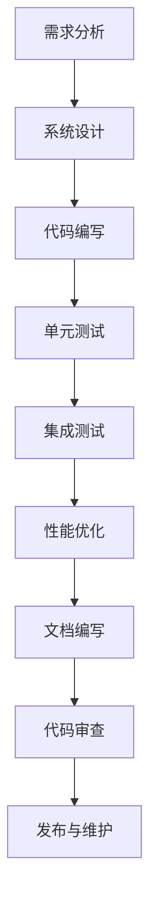
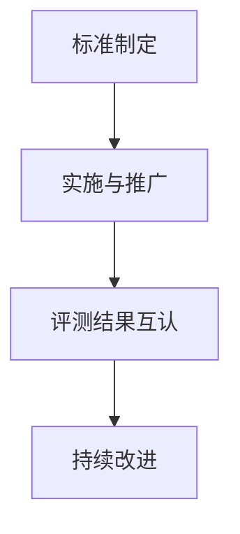

                 

### 文章标题

《评测系统的开源贡献：推动行业标准化》

> 关键词：评测系统、开源、行业标准化、核心技术、实践应用、未来展望

> 摘要：本文深入探讨了评测系统的概念与背景、开源评测系统的现状与趋势、核心技术、实践应用、标准化以及未来展望，分析了开源评测系统在推动行业标准化方面的重要贡献。通过对开源评测系统的详细剖析，本文旨在为行业从业人员提供有价值的参考，促进评测系统的标准化发展。

----------------------------------------------------------------

### 目录大纲

1. **评测系统的概念与背景**
   - 1.1 评测系统的基本概念
   - 1.2 评测系统的基本组成
   - 1.3 评测系统的类型与应用领域
   - 1.4 开源评测系统的定义与特点

2. **开源评测系统的现状与趋势**
   - 2.1 开源评测系统的现状分析
   - 2.2 开源评测系统的发展趋势
   - 2.3 开源评测系统的重要意义

3. **开源评测系统的核心技术**
   - 3.1 评测指标与方法
   - 3.2 常见的评测工具与框架
   - 3.3 评测工具与框架的性能优化

4. **开源评测系统的实践与应用**
   - 4.1 开源评测系统的开发流程
   - 4.2 开源评测系统的案例分析
   - 4.3 开源评测系统的应用前景

5. **开源评测系统的标准化**
   - 5.1 行业标准化的重要性
   - 5.2 开源评测系统的标准化框架
   - 5.3 开源评测系统的标准化实践

6. **未来展望与挑战**
   - 6.1 新技术对开源评测系统的影响
   - 6.2 开源评测系统的创新方向
   - 6.3 未来开源评测系统的挑战与机遇

7. **开源评测系统的可持续发展**
   - 7.1 开源评测系统的可持续性挑战
   - 7.2 促进开源评测系统可持续发展的策略
   - 7.3 开源评测系统的未来生态建设

### 引言

在现代信息技术迅速发展的背景下，评测系统作为一种重要的技术手段，广泛应用于各个行业和领域。评测系统不仅仅是对技术成果的检验工具，更是推动技术创新和行业发展的关键因素。随着开源运动的兴起，开源评测系统逐渐成为行业标准化的重要推动力量。本文旨在探讨开源评测系统的概念、现状、核心技术、实践应用、标准化以及未来发展，分析其在推动行业标准化方面的重要贡献。

### 评测系统的概念与背景

#### 1.1 评测系统的基本概念

评测系统，通常指的是用于对某种对象（如软件、系统、产品等）进行评价、测试和评估的软件工具和平台。其核心目的是通过一系列标准和指标，对对象的功能性、性能、安全性、稳定性等进行全面分析和评估，从而为决策提供科学依据。

评测系统一般包括以下几个基本组成部分：

1. **评测指标**：用于衡量对象性能的具体标准，如响应时间、吞吐量、错误率等。
2. **评测方法**：实现评测指标计算的具体方法，如统计分析、机器学习等。
3. **评测工具**：执行评测操作的软件，如测试框架、评测平台等。
4. **评测数据**：用于评测的数据集，包括测试数据、训练数据、参考数据等。

#### 1.2 评测系统的基本组成

一个完整的评测系统通常包含以下几个核心组成部分：

1. **评测引擎**：负责评测过程的调度和管理，包括测试用例的执行、结果收集和处理等。
2. **数据管理**：负责评测数据的存储、管理和处理，确保数据的完整性和一致性。
3. **用户界面**：提供用户与评测系统交互的接口，包括数据输入、结果展示、报告生成等。
4. **报表生成**：根据评测结果生成详细的评测报告，为决策提供数据支持。

#### 1.3 评测系统的类型与应用领域

评测系统根据应用领域和评测对象的差异，可以分为多种类型：

1. **软件评测系统**：主要针对软件产品进行功能测试、性能测试、安全测试等。
2. **网络安全评测系统**：用于评估网络系统的安全性，包括漏洞扫描、入侵检测等。
3. **硬件评测系统**：针对硬件设备进行性能测试、稳定性测试、兼容性测试等。
4. **教育评测系统**：用于对学生的学习成果进行评估，包括在线测验、作业批改等。

这些评测系统在不同领域有着广泛的应用，如软件行业、网络安全行业、教育行业等。随着信息技术的发展，评测系统的应用范围和重要性也在不断扩展。

#### 1.4 开源评测系统的定义与特点

开源评测系统指的是基于开源协议开发的评测工具和平台，用户可以自由获取、使用、修改和分发。与商业评测系统相比，开源评测系统具有以下特点：

1. **成本效益**：用户无需支付高昂的许可费用，降低了使用成本。
2. **灵活性**：用户可以根据需求进行自定义修改，满足特定应用场景。
3. **社区支持**：开源评测系统拥有庞大的社区支持，用户可以从中获取帮助和反馈。
4. **创新驱动**：开源项目通常鼓励创新和改进，有助于推动评测系统技术的发展。

开源评测系统的发展，不仅为行业提供了高效、灵活的评测工具，还为评测系统的标准化提供了有力支持。

### 开源评测系统的现状与趋势

#### 2.1 开源评测系统的现状分析

开源评测系统在近年来得到了快速发展，成为评测领域的重要组成部分。根据开源社区的数据，目前已有数百个开源评测项目活跃发展，涵盖了软件评测、网络安全评测、硬件评测等多个领域。

1. **软件评测系统**：如JMeter、Gatling、locust等，这些工具被广泛应用于性能测试和负载测试。
2. **网络安全评测系统**：如Nessus、OpenVAS、Metasploit等，用于漏洞扫描、入侵检测和攻击模拟。
3. **硬件评测系统**：如OpenBMC、IPMItool、openSBI等，用于硬件性能测试和管理。

这些开源评测系统在社区中积累了大量的用户和贡献者，形成了强大的生态系统。用户可以自由选择合适的评测工具，根据自己的需求进行定制和优化。

#### 2.2 开源评测系统的发展趋势

随着云计算、大数据、人工智能等新兴技术的发展，开源评测系统也在不断进化，呈现出以下趋势：

1. **云化**：越来越多的评测系统开始支持在云环境下的部署和运行，提高了系统的灵活性和可扩展性。
2. **自动化**：自动化测试成为开源评测系统的重要方向，通过自动化工具和脚本，实现测试过程的自动化和高效化。
3. **智能化**：结合人工智能技术，开源评测系统可以实现智能化的测试策略和结果分析，提高测试的精准度和效率。
4. **社区驱动**：开源评测系统的发展越来越依赖于社区的贡献和协作，社区力量成为推动系统进步的重要动力。

#### 2.3 开源评测系统的重要意义

开源评测系统在推动行业标准化方面具有重要意义：

1. **降低成本**：开源评测系统免去了高昂的许可费用，降低了企业的使用成本，使得更多的企业能够负担得起高质量的评测服务。
2. **提高透明度**：开源评测系统的代码公开，用户可以自由审查和修改，提高了系统的透明度和可信度。
3. **促进创新**：开源评测系统鼓励用户参与和贡献，激发了创新活力，推动了评测技术的发展。
4. **推动标准化**：开源评测系统的发展促进了评测标准的统一和规范，为行业标准化提供了有力支持。

总的来说，开源评测系统在当前信息技术领域中扮演着越来越重要的角色，其发展对行业标准化和科技进步具有重要的推动作用。

### 开源评测系统的核心技术

#### 3.1 评测指标与方法

评测指标是评测系统的基础，用于衡量对象的性能和表现。常见的评测指标包括：

1. **功能指标**：如功能覆盖率、错误率、测试用例执行数等。
2. **性能指标**：如响应时间、吞吐量、并发数等。
3. **安全性指标**：如漏洞数、入侵尝试次数、安全响应时间等。

评测方法是实现评测指标的具体手段，常见的方法包括：

1. **功能测试**：通过模拟用户行为，验证系统功能是否符合预期。
2. **性能测试**：通过模拟高负载场景，评估系统的性能表现。
3. **安全测试**：通过模拟攻击，检测系统的安全漏洞和弱点。

以下是常见的评测方法对比表格：

| 方法     | 目的                   | 工具                    |
|----------|------------------------|-------------------------|
| 功能测试 | 验证功能是否符合要求   | Selenium、Appium       |
| 性能测试 | 评估系统性能           | JMeter、Gatling        |
| 安全测试 | 检测系统安全漏洞       | Metasploit、Nessus     |

#### 3.2 常见的评测工具与框架

开源评测系统依赖于一系列评测工具和框架，这些工具和框架提供了丰富的功能，帮助用户高效地完成评测任务。常见的评测工具包括：

1. **JMeter**：用于性能测试和负载测试，支持多种协议的模拟测试。
2. **Gatling**：基于Scala的性能测试框架，支持HTTP、HTTPS、TCP等协议。
3. **locust**：用于模拟用户行为的负载测试工具，适用于Web应用性能测试。

常见的评测框架包括：

1. **JUnit**：用于Java应用的单元测试框架。
2. **pytest**：用于Python应用的测试框架，支持丰富的测试插件。
3. **Selenium**：用于Web应用的自动化测试框架。

以下是一个简单的评测工具与框架的性能优化方案：

1. **分布式测试**：通过分布式架构，利用多台机器同时进行测试，提高测试效率。
2. **负载均衡**：合理分配测试任务，避免单点瓶颈。
3. **结果分析**：实时分析测试结果，快速定位问题，优化测试策略。

#### 3.3 评测工具与框架的性能优化

评测工具与框架的性能优化是提高评测系统效率的关键。以下是一些常见的优化方法：

1. **并行处理**：利用多线程或分布式计算，提高测试任务的执行速度。
2. **缓存机制**：合理使用缓存，减少重复数据的读取和计算。
3. **数据压缩**：对大数据集进行压缩，减少传输和存储的开销。
4. **算法优化**：优化评测算法，提高计算效率和准确性。
5. **监控与调优**：实时监控系统性能，根据性能指标进行调优。

通过上述优化方法，可以有效提升评测系统的性能，为用户提供更高效、准确的评测服务。

### 开源评测系统的实践与应用

#### 5.1 开源评测系统的开发流程

开发一个开源评测系统需要遵循一套规范的流程，以确保系统的质量、可靠性和可维护性。以下是开源评测系统的开发流程：

1. **需求分析**：明确评测系统的目标和功能需求，了解用户的使用场景和需求。
2. **系统设计**：根据需求分析结果，设计系统的架构和组件，包括评测引擎、数据管理、用户界面等。
3. **代码编写**：根据系统设计，编写评测系统的代码，实现各个组件的功能。
4. **单元测试**：对系统中的每个模块进行单元测试，确保模块的正确性和稳定性。
5. **集成测试**：将各个模块集成起来，进行集成测试，确保系统的整体功能性和性能。
6. **性能优化**：对系统进行性能优化，确保系统能够高效、稳定地运行。
7. **文档编写**：编写系统文档，包括用户手册、开发者文档、API文档等。
8. **代码审查**：进行代码审查，确保代码的质量和规范性。
9. **发布和维护**：将系统发布到开源平台，接受社区的反馈和贡献，持续进行维护和更新。

以下是一个简化的开源评测系统开发流程图：

#### 5.2 开源评测系统的案例分析

为了更好地理解开源评测系统的实践与应用，以下介绍三个具体的案例：

**案例一：某电商平台商品评价分析**

某电商平台使用开源评测系统对其商品评价进行分析，以提升用户体验和商品质量。评测系统实现了对用户评价的收集、分析和报告生成功能。

1. **需求分析**：分析用户评价的需求，包括评价内容分析、情感分析、满意度分析等。
2. **系统设计**：设计评测系统的架构，包括数据收集模块、文本分析模块、结果展示模块等。
3. **实现与部署**：使用Python编写文本分析算法，使用MongoDB存储用户评价数据，使用Flask搭建Web服务。
4. **案例结果**：通过对用户评价的深入分析，平台能够更好地了解用户需求，优化商品推荐和用户体验。

**案例二：某金融公司风险控制评测**

某金融公司使用开源评测系统对其金融产品进行风险控制评测，以降低金融风险。

1. **需求分析**：分析金融产品的风险特征和风险控制需求。
2. **系统设计**：设计评测系统的架构，包括风险评估模块、风险监控模块、报告生成模块等。
3. **实现与部署**：使用Python和R编写风险评估算法，使用MySQL存储金融产品数据，使用Django搭建Web服务。
4. **案例结果**：通过风险评测，公司能够更准确地识别和应对金融风险，提高了风险管理水平。

**案例三：某教育机构教学质量评估**

某教育机构使用开源评测系统对其教学质量进行评估，以提高教学质量和学生学习效果。

1. **需求分析**：分析教学质量评估的需求，包括教学效果评估、学生满意度评估等。
2. **系统设计**：设计评测系统的架构，包括数据收集模块、评估算法模块、结果展示模块等。
3. **实现与部署**：使用Java编写评估算法，使用MongoDB存储评估数据，使用Spring Boot搭建Web服务。
4. **案例结果**：通过对教学质量的全面评估，机构能够发现教学中的问题和不足，及时进行改进。

通过以上案例，可以看出开源评测系统在各个领域的实际应用效果，其灵活性和可扩展性为用户提供了强大的支持。

#### 5.3 开源评测系统的应用前景

随着信息技术的不断发展，开源评测系统的应用前景十分广阔。以下是对开源评测系统未来应用前景的展望：

1. **云计算和大数据领域的应用**：开源评测系统将更好地支持云计算和大数据环境，实现对大规模数据的实时评测和分析。
2. **物联网（IoT）领域的应用**：随着物联网技术的发展，开源评测系统将在智能家居、智慧城市等领域发挥重要作用，对物联网设备的性能和安全性进行评测。
3. **人工智能（AI）领域的应用**：开源评测系统将与人工智能技术紧密结合，通过智能化的评测算法，实现更高效、精准的评测。
4. **跨领域融合**：开源评测系统将跨越不同领域，实现跨领域的评测和整合，推动各行业的标准化和高效化。

总的来说，开源评测系统的发展前景十分光明，其应用领域将不断扩展，为各行业提供强大的技术支持。

### 开源评测系统的标准化

#### 7.1 行业标准化的重要性

行业标准化是确保不同系统、产品和服务之间兼容性和互操作性的重要手段。对于开源评测系统而言，标准化具有以下几个重要意义：

1. **提高互操作性**：标准化确保不同评测系统之间能够无缝集成和互操作，减少兼容性问题，提高系统的灵活性和可扩展性。
2. **促进技术创新**：标准化为评测技术的发展提供了明确的方向和规范，有助于推动技术创新和行业进步。
3. **降低成本**：标准化减少了系统之间的差异，降低了开发、维护和培训的成本，提高了企业的生产效率。
4. **增强可信度**：标准化有助于提升评测系统的可信度和可靠性，增强用户对系统的信任。

#### 7.2 开源评测系统的标准化框架

开源评测系统的标准化框架主要包括以下几个关键要素：

1. **标准制定**：制定统一的评测标准，包括评测指标、评测方法、评测流程等，确保评测过程的规范性和一致性。
2. **实施与推广**：将标准在开源评测系统中实施和推广，确保标准的实际应用和效果。
3. **评测结果互认**：建立评测结果互认机制，确保不同评测系统产生的评测结果具有可比性和互认性。
4. **持续改进**：根据用户反馈和技术发展，持续改进和优化标准化框架，确保其适应性和前瞻性。

以下是一个简化的开源评测系统标准化框架图：

#### 7.3 开源评测系统的标准化实践

开源评测系统的标准化实践主要包括以下几个方面：

1. **参与标准组织**：开源评测系统的开发者可以积极参与相关标准组织的活动，了解和参与标准的制定过程。
2. **遵循开源协议**：开源评测系统应遵循开放性原则，鼓励用户参与和贡献，推动标准的社区化制定和优化。
3. **开源代码审查**：对开源评测系统的代码进行审查，确保其遵循标准化原则和规范，提高系统的规范性和可靠性。
4. **开源文档编写**：编写详细的系统文档，包括标准遵循情况、实施指南、用户手册等，为用户和开发者提供参考。
5. **开源社区互动**：加强与开源社区的互动，收集用户反馈和技术建议，持续改进评测系统，推动标准的落地和实施。

通过标准化实践，开源评测系统能够更好地适应行业发展需求，提高系统的兼容性和互操作性，推动行业标准化进程。

### 未来展望与挑战

#### 8.1 新技术对开源评测系统的影响

随着信息技术的快速发展，一系列新兴技术对开源评测系统产生了深远影响：

1. **云计算**：云计算为评测系统提供了强大的计算和存储资源，支持大规模数据处理和实时评测。
2. **大数据**：大数据技术使评测系统能够处理和分析海量数据，提高评测的准确性和全面性。
3. **人工智能**：人工智能技术增强了评测系统的智能化水平，通过机器学习算法实现自动化评测和预测。
4. **物联网**：物联网技术的发展推动了评测系统的应用范围，实现对物联网设备的实时监测和评估。

这些新兴技术为开源评测系统带来了新的机遇，同时也提出了新的挑战。

#### 8.2 开源评测系统的创新方向

开源评测系统的未来创新方向主要包括以下几个方面：

1. **智能化评测**：利用人工智能技术，实现智能化评测，提高评测效率和精准度。
2. **自动化评测**：通过自动化工具和脚本，实现自动化评测，减少人为干预，提高测试的效率和一致性。
3. **跨领域融合**：推动评测系统在跨领域中的应用，如将软件评测系统与物联网设备进行融合，实现对设备的综合评测。
4. **云原生评测**：支持云原生架构，使评测系统能够在云环境下高效运行，提供更加灵活和可扩展的评测服务。

#### 8.3 未来开源评测系统的挑战与机遇

未来开源评测系统面临着一系列挑战和机遇：

1. **标准化**：随着评测系统的广泛应用，标准化成为推动行业发展的关键。开源评测系统需要积极参与标准化工作，制定统一的评测标准。
2. **安全性**：随着网络攻击的日益增多，开源评测系统需要提高安全性，确保系统的数据安全和运行稳定。
3. **可扩展性**：开源评测系统需要具备良好的可扩展性，能够适应不同规模和场景的应用需求。
4. **社区参与**：开源评测系统的成功离不开社区的积极参与，需要建立有效的社区参与机制，鼓励用户和开发者共同推进系统的发展。

总的来说，开源评测系统在未来面临着诸多挑战和机遇，通过技术创新和标准化，开源评测系统将在信息技术领域中发挥更加重要的作用。

### 开源评测系统的可持续发展

#### 9.1 开源评测系统的可持续性挑战

开源评测系统的可持续发展面临以下挑战：

1. **资源限制**：开源项目通常依赖志愿者和社区的贡献，资源有限，难以保证项目长期稳定发展。
2. **技术迭代**：信息技术快速迭代，开源评测系统需要不断更新以适应新技术，但更新速度往往难以跟上技术发展的步伐。
3. **用户需求变化**：用户需求不断变化，开源评测系统需要灵活调整以适应新的需求，但这也增加了系统的复杂性和维护难度。
4. **社区协作**：开源社区的协作效率和协调机制是项目成功的关键，但现实中的社区协作往往面临各种挑战。

#### 9.2 促进开源评测系统可持续发展的策略

为了促进开源评测系统的可持续发展，可以采取以下策略：

1. **多元化资金支持**：通过政府资助、企业赞助、众筹等多种方式，为开源评测系统提供稳定的资金支持。
2. **构建生态系统**：鼓励第三方企业、研究机构和个人参与开源评测系统的发展，构建一个健康、活跃的生态系统。
3. **社区激励机制**：建立激励机制，鼓励社区成员积极参与项目的开发、测试和文档编写，提高社区的参与度和积极性。
4. **技术迭代规划**：制定明确的技术迭代规划，确保评测系统能够持续适应技术发展，满足用户需求。

#### 9.3 开源评测系统的未来生态建设

未来开源评测系统的生态建设需要从以下几个方面进行：

1. **标准化**：推动评测系统的标准化，建立统一的评测标准和框架，提高系统的兼容性和互操作性。
2. **社区合作**：加强开源社区之间的合作，促进资源共享和知识传播，提高整体社区的技术水平和创新能力。
3. **教育与培训**：提供开源评测系统的教育和培训资源，提高用户和开发者的技术能力，培养更多的开源贡献者。
4. **技术支持与服务**：提供专业的技术支持和咨询服务，帮助用户解决使用中的问题和困难，提升用户体验。

通过上述策略和生态建设，开源评测系统将能够实现可持续发展，为信息技术领域提供更加高效、稳定的评测服务。

### 总结与展望

开源评测系统在现代信息技术发展中扮演着重要角色，其开源特性为行业标准化和可持续发展提供了有力支持。本文从评测系统的概念与背景、现状与趋势、核心技术、实践应用、标准化以及未来展望等方面，深入探讨了开源评测系统的重要性和贡献。

开源评测系统不仅降低了企业的使用成本，提高了系统的透明度和灵活性，还推动了评测技术的创新和发展。未来，随着新兴技术的不断涌现，开源评测系统将在云计算、大数据、人工智能等领域发挥更大的作用，推动行业标准化和智能化进程。

我们呼吁更多的开发者、企业和研究机构积极参与开源评测系统的发展，共同构建一个健康、活跃的生态体系，为信息技术的发展贡献更多力量。

### 作者信息

**作者：AI天才研究院/AI Genius Institute & 禅与计算机程序设计艺术 /Zen And The Art of Computer Programming**  

感谢您的阅读，希望本文能够为您的技术学习和实践提供有价值的参考。如果您对开源评测系统有任何疑问或建议，欢迎在评论区留言，我们期待与您共同探讨和交流。祝您技术进步，工作愉快！

