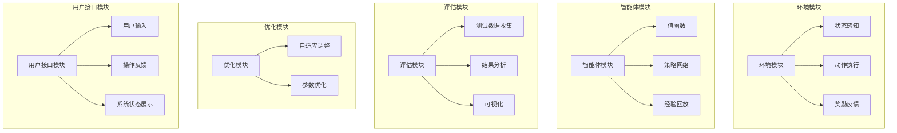

                 


### 引言

**《评测系统的强化学习环境设计》**

关键词：强化学习，评测系统，环境设计，算法实现

在当前快速发展的科技时代，评测系统作为评估和测试各种应用系统性能的重要工具，已经在多个领域中发挥了至关重要的作用。随着人工智能技术的不断进步，强化学习作为一种先进的机器学习方法，逐渐成为了评测系统设计中的一个重要方向。本文旨在深入探讨如何设计一个高效的强化学习环境，用于评测系统的性能评估。

摘要：本文首先介绍了评测系统和强化学习的基本概念，明确了本文的研究目标和意义。接着，通过详细分析强化学习算法的原理，阐述了其在评测系统中的应用方法。然后，从评测系统的需求分析、设计原则和架构设计等多个角度，介绍了评测系统的整体设计思路。最后，通过具体的案例展示和实际应用分析，探讨了强化学习环境在评测系统中的实际效果，并提出了未来研究的方向。

### 背景介绍

#### 评测系统概述

评测系统，顾名思义，是一种用于评估和测试各种系统性能的软件或平台。其目的是通过一系列的测试和评估指标，对系统的可靠性、稳定性、性能等方面进行全面检测，从而为系统的优化和改进提供科学依据。评测系统广泛应用于软件工程、网络安全、大数据处理等多个领域。

在软件工程中，评测系统可以帮助开发团队及时发现和修复软件中的缺陷，提高软件的质量和可靠性。在网络安全领域，评测系统可以模拟各种攻击场景，检测和评估网络系统的安全性能。在大数据处理领域，评测系统可以帮助分析和优化大数据处理的效率。

#### 强化学习环境的概念

强化学习（Reinforcement Learning，RL）是一种重要的机器学习方法，它通过智能体（Agent）在与环境（Environment）的交互过程中，不断学习并优化策略，以实现特定目标。在强化学习环境中，智能体通过感知环境状态（State），选择动作（Action），并获取环境反馈（Reward），从而不断调整策略，以达到最大化累积奖励的目的。

强化学习环境通常由以下几个核心组成部分构成：

1. **状态空间（State Space）**：状态空间是指智能体在环境中可能处于的所有状态集合。状态可以是多维的，例如一个机器人可能在二维平面上移动，状态空间可以表示为位置和方向。

2. **动作空间（Action Space）**：动作空间是指智能体可以选择的所有动作集合。动作可以是离散的，如前进、后退、左转、右转；也可以是连续的，如速度调节、力矩控制。

3. **奖励函数（Reward Function）**：奖励函数定义了智能体在每个状态执行每个动作后获得的即时奖励。奖励可以是正的，表示智能体采取了正确的动作；也可以是负的，表示智能体采取了错误的动作。

4. **策略（Policy）**：策略是智能体在给定状态下选择动作的决策规则。策略可以是固定的，如根据预定的规则进行决策；也可以是动态的，如根据学习到的模型进行决策。

#### 强化学习环境在评测系统中的应用

将强化学习应用于评测系统，可以为系统的性能评估提供一种全新的方法。通过构建一个模拟的强化学习环境，可以模拟不同的测试场景，让评测系统在环境中不断学习和优化，从而提高其整体性能。

具体来说，强化学习环境在评测系统中的应用主要包括以下几个方面：

1. **性能优化**：通过强化学习，评测系统可以在不同的测试场景下，不断调整其参数和策略，以实现最佳的性能表现。例如，在一个网络评测系统中，可以通过强化学习优化网络传输协议，提高数据传输速率和稳定性。

2. **故障检测**：强化学习可以帮助评测系统识别出潜在的故障点和瓶颈，从而提前预警。例如，在软件评测系统中，可以通过强化学习监测代码质量，及时发现潜在的问题和漏洞。

3. **自适应调整**：强化学习使得评测系统可以根据不同的测试需求和环境变化，自动调整其评估策略，以适应不同的评估场景。例如，在网络安全评测系统中，可以通过强化学习自动调整测试策略，以应对不断变化的安全威胁。

### 问题背景与问题描述

在现有的评测系统中，虽然已经可以实现对系统性能的初步评估，但仍然存在一些局限性。首先，传统的评测方法往往依赖于预定义的测试用例和评估指标，无法充分适应动态变化的测试需求。其次，现有评测系统在应对复杂场景时，往往表现出较低的准确性和可靠性。此外，评测系统在性能优化和故障检测方面，也存在着一定的不足。

为了克服这些局限性，本文提出了使用强化学习来设计评测系统的环境。通过构建一个自适应的强化学习环境，评测系统可以在不断的学习和优化过程中，提高其评估的准确性和可靠性。具体来说，本文将围绕以下几个方面展开研究：

1. **需求分析**：明确评测系统的具体需求和目标，为后续的强化学习环境设计提供依据。

2. **算法选择**：介绍常见的强化学习算法，分析其在评测系统中的应用场景和优势。

3. **环境设计**：详细描述强化学习环境的设计原则和架构，包括状态空间、动作空间、奖励函数和策略等核心组件。

4. **实现与优化**：介绍如何实现和优化强化学习环境，包括算法实现、环境搭建和性能优化等方面。

5. **案例分析**：通过具体案例展示强化学习环境在评测系统中的应用效果，分析其优缺点。

6. **总结与展望**：总结本文的研究成果，提出未来研究的方向和可能的改进措施。

### 边界与外延

在本文的研究中，我们主要关注的是基于强化学习的评测系统环境设计。这个设计旨在解决现有评测系统的局限性，提高评测的准确性和可靠性。然而，这个研究也有其边界和局限性。

首先，本文的研究主要聚焦于强化学习在评测系统中的应用，对于其他机器学习方法的引入和应用并未深入探讨。其次，本文的研究主要集中在理论分析和算法实现，对于实际应用中的工程实现和优化并未详细阐述。

此外，本文的研究也有一定的外延。随着人工智能技术的不断进步，强化学习在评测系统中的应用前景非常广阔。未来，我们可以考虑将更多的机器学习算法引入评测系统，如深度学习、迁移学习等，以进一步提高评测系统的性能。同时，也可以将强化学习应用于其他领域，如智能交通、智能医疗等，为这些领域提供更加高效和可靠的评测工具。

### 概念结构与核心要素组成

为了深入理解评测系统的强化学习环境设计，我们需要从概念结构和核心要素组成的角度进行详细分析。

#### 概念结构

1. **评测系统**：评测系统是一个用于评估和测试系统性能的工具或平台。它通常由测试用例库、测试执行引擎、测试结果分析模块等组成部分构成。评测系统的核心功能是生成测试用例，执行测试，收集测试结果，并对测试结果进行分析和报告。

2. **强化学习**：强化学习是一种通过试错和反馈来学习决策策略的机器学习方法。它由智能体（Agent）、环境（Environment）、状态（State）、动作（Action）和奖励（Reward）五个核心组件构成。

3. **强化学习环境**：强化学习环境是评测系统的一个特殊实现，它通过模拟不同的测试场景，为评测系统提供了一个虚拟的测试环境。强化学习环境的核心功能是模拟测试过程，收集反馈信息，并指导评测系统优化其评估策略。

#### 核心要素组成

1. **状态空间**：状态空间是强化学习环境中的一个关键概念，它定义了评测系统在测试过程中可能处于的所有状态集合。状态空间可以是多维的，例如可以包括系统资源利用率、系统响应时间、系统错误率等指标。

2. **动作空间**：动作空间是评测系统在测试过程中可以选择的所有动作集合。动作可以是离散的，如执行特定的测试用例；也可以是连续的，如调整测试执行速度、修改测试用例等。

3. **奖励函数**：奖励函数是评测系统在测试过程中获得的即时奖励。奖励函数的设计直接影响到评测系统的学习效果和评估准确性。通常，奖励函数可以根据评测系统的评估目标和测试结果进行设计。

4. **策略**：策略是评测系统在给定状态下选择动作的决策规则。策略可以是固定的，如根据预定的规则进行决策；也可以是动态的，如根据学习到的模型进行决策。

5. **评估指标**：评估指标是用于衡量评测系统性能的一系列指标。常见的评估指标包括测试覆盖率、测试准确性、测试执行时间、系统资源利用率等。

#### 概念之间的联系

1. **评测系统与强化学习环境**：评测系统是强化学习环境的基础，强化学习环境是评测系统的一种实现形式。通过构建强化学习环境，评测系统可以在不断的学习和优化过程中，提高其评估的准确性和可靠性。

2. **状态空间与动作空间**：状态空间和动作空间是强化学习环境中的两个关键概念。状态空间定义了评测系统在测试过程中可能处于的所有状态集合；动作空间定义了评测系统在测试过程中可以选择的所有动作集合。

3. **奖励函数与策略**：奖励函数和策略是强化学习环境中的两个核心组件。奖励函数根据评测系统的评估目标和测试结果进行设计，用于指导评测系统优化其评估策略；策略是评测系统在给定状态下选择动作的决策规则。

4. **评估指标**：评估指标用于衡量评测系统的性能。在强化学习环境中，评估指标可以作为奖励函数的一部分，用于激励评测系统优化其评估策略。

通过上述分析，我们可以看出评测系统的强化学习环境设计是一个复杂的过程，它涉及到多个核心概念和要素之间的紧密联系。只有通过对这些概念和要素的深入理解和有效整合，才能设计出一个高效、可靠的强化学习环境，为评测系统的性能评估提供有力支持。

### 强化学习算法原理讲解

强化学习（Reinforcement Learning，RL）是一种通过试错和反馈来学习最优决策策略的机器学习方法。在强化学习环境中，智能体通过不断尝试和调整策略，以实现最大化累积奖励的目标。为了深入理解强化学习算法在评测系统中的应用，我们需要首先掌握强化学习的基本概念和常见算法。

#### 强化学习的基本概念

1. **智能体（Agent）**：智能体是执行动作并接收环境反馈的实体。在评测系统中，智能体可以是评测系统本身，也可以是模拟评测过程的虚拟代理。

2. **环境（Environment）**：环境是智能体所处的情境，它提供当前状态和奖励信号。在评测系统中，环境可以是一个模拟测试场景，也可以是一个实际测试环境。

3. **状态（State）**：状态是描述环境当前状态的变量或集合。在评测系统中，状态可以是系统资源利用率、测试覆盖率、响应时间等指标。

4. **动作（Action）**：动作是智能体在特定状态下选择的行为。在评测系统中，动作可以是执行某个测试用例、调整测试策略等。

5. **奖励（Reward）**：奖励是智能体执行动作后获得的即时反馈。在评测系统中，奖励可以是测试成功次数、错误率降低等。

6. **策略（Policy）**：策略是智能体在给定状态下选择动作的规则。在评测系统中，策略可以是基于固定规则的策略，也可以是基于学习到的模型动态调整的策略。

7. **价值函数（Value Function）**：价值函数预测在给定状态下执行特定动作的长期奖励。它可以帮助智能体选择最优动作。

8. **模型（Model）**：模型是对环境的抽象表示，用于预测状态转移概率和奖励信号。在评测系统中，模型可以用于预测测试结果和优化测试策略。

#### 常见强化学习算法

1. **Q-Learning算法**

Q-Learning算法是一种基于值函数的强化学习算法，它通过更新Q值（即状态-动作值函数）来学习最优策略。Q-Learning算法的核心思想是：在给定状态和动作的情况下，选择能够获得最大Q值的动作。

算法步骤如下：

1. 初始化Q值矩阵Q(s, a)，其中s表示状态，a表示动作。
2. 在状态s执行动作a，获得即时奖励r和新的状态s'。
3. 更新Q值：$$Q(s, a) = Q(s, a) + \alpha [r + \gamma \max(Q(s', a')) - Q(s, a)]$$
   其中，α为学习率，γ为折扣因子，r为即时奖励，s'为新的状态，a'为在状态s'下获得最大Q值的动作。

Q-Learning算法的Python实现示例：

```python
import numpy as np

def q_learning(env, num_episodes, alpha, gamma):
    Q = np.zeros((env.num_states, env.num_actions))
    for episode in range(num_episodes):
        state = env.reset()
        done = False
        while not done:
            action = np.argmax(Q[state])
            next_state, reward, done = env.step(action)
            Q[state, action] = Q[state, action] + alpha * (reward + gamma * np.max(Q[next_state]) - Q[state, action])
            state = next_state
    return Q
```

2. **SARSA算法**

SARSA（On-Policy Reinforcement Learning）算法是一种基于策略的强化学习算法，它使用当前策略来选择动作，并更新Q值。SARSA算法的核心思想是：在给定状态和动作的情况下，选择能够获得最大Q值的动作，并更新Q值。

算法步骤如下：

1. 初始化Q值矩阵Q(s, a)，其中s表示状态，a表示动作。
2. 在状态s执行动作a，获得新的状态s'。
3. 根据当前策略选择动作a'。
4. 更新Q值：$$Q(s, a) = Q(s, a) + \alpha [r + \gamma Q(s', a')] - Q(s, a)]$$
   其中，α为学习率，γ为折扣因子，r为即时奖励，s'为新的状态，a'为在状态s'下根据策略选择的动作。

SARSA算法的Python实现示例：

```python
import numpy as np

def sarsa(env, num_episodes, alpha, gamma):
    Q = np.zeros((env.num_states, env.num_actions))
    for episode in range(num_episodes):
        state = env.reset()
        done = False
        while not done:
            action = np.random.choice(env.num_actions)
            next_state, reward, done = env.step(action)
            action_next = np.random.choice(env.num_actions)
            Q[state, action] = Q[state, action] + alpha * (reward + gamma * Q[next_state, action_next] - Q[state, action])
            state = next_state
    return Q
```

3. **深度强化学习（Deep Q-Network, DQN）**

深度强化学习是强化学习的一种扩展，它结合了深度学习和强化学习的思想，通过神经网络来近似值函数。DQN算法通过经验回放（Experience Replay）和固定目标网络（Target Network）来提高学习效率和稳定性。

DQN算法的Python实现示例：

```python
import numpy as np
import random
from collections import deque

def dqn(env, num_episodes, learning_rate, discount_factor, epsilon, epsilon_decay, epsilon_min):
    Q = np.zeros((env.num_states, env.num_actions))
    memory = deque(maxlen=2000)
    for episode in range(num_episodes):
        state = env.reset()
        done = False
        total_reward = 0
        while not done:
            action = choose_action(state, Q, epsilon)
            next_state, reward, done = env.step(action)
            memory.append((state, action, reward, next_state, done))
            if len(memory) > batch_size:
                batch = random.sample(memory, batch_size)
                for state, action, reward, next_state, done in batch:
                    target = reward
                    if not done:
                        target = reward + discount_factor * np.max(Q[next_state])
                    Q[state, action] = Q[state, action] + learning_rate * (target - Q[state, action])
                    state = next_state
            total_reward += reward
        print(f"Episode: {episode+1}, Total Reward: {total_reward}")
    return Q

def choose_action(state, Q, epsilon):
    if random.random() < epsilon:
        action = random.randint(0, Q.shape[1] - 1)
    else:
        action = np.argmax(Q[state])
    return action
```

通过上述算法介绍和示例，我们可以看出强化学习算法在评测系统中的应用前景非常广阔。通过不断尝试和优化，评测系统可以在复杂的环境中学习到最优的评估策略，从而提高其评估准确性和可靠性。

### 强化学习环境设计原则与架构

在强化学习环境中设计评测系统，需要遵循一系列原则和步骤，以确保系统的高效性和可靠性。以下将从设计原则、架构设计和模块划分三个方面，详细阐述评测系统强化学习环境的设计过程。

#### 设计原则

1. **适应性原则**：强化学习环境应能够适应不同测试场景和需求，具备灵活的调整能力。这意味着评测系统需要在面对各种测试任务时，能够自动调整评估策略和测试参数。

2. **可扩展性原则**：设计过程中应考虑系统的可扩展性，以便在需求变化或新增测试任务时，可以方便地扩展系统功能和性能。

3. **实时性原则**：强化学习环境需要能够实时响应测试场景的变化，快速调整评估策略，以保持评估过程的连续性和稳定性。

4. **鲁棒性原则**：系统在应对各种异常情况时，应具备一定的鲁棒性，避免因局部异常影响整体评估效果。

5. **安全性原则**：在设计过程中，应充分考虑系统的安全性，确保测试过程不会对被评估系统的正常运行造成干扰或破坏。

#### 架构设计

评测系统强化学习环境的架构设计包括状态空间、动作空间、奖励函数和策略等核心组件。以下是对各组件的详细描述：

1. **状态空间**：状态空间是评测系统在测试过程中可能处于的所有状态集合。在强化学习环境中，状态空间的设计需要充分考虑测试任务的特点。例如，对于一个网络性能评测系统，状态空间可以包括网络延迟、带宽利用率、错误率等指标。

2. **动作空间**：动作空间是评测系统在测试过程中可以选择的所有动作集合。动作空间的设计应与状态空间相匹配，确保每个状态都有相应的动作可供选择。例如，对于一个网络性能评测系统，动作空间可以包括调整测试流量大小、修改测试用例等。

3. **奖励函数**：奖励函数是评测系统在测试过程中获得的即时奖励，用于激励评测系统优化其评估策略。奖励函数的设计需要结合测试任务的目标和指标，确保能够准确反映测试结果。例如，对于一个网络性能评测系统，奖励函数可以设定为测试成功率、错误率降低等。

4. **策略**：策略是评测系统在给定状态下选择动作的决策规则。策略的设计应基于强化学习算法，通过不断学习和调整，实现最优评估策略。例如，可以使用Q-Learning或SARSA算法来设计策略。

#### 模块划分

评测系统强化学习环境的模块划分有助于提高系统的模块化程度和可维护性。以下是主要模块的划分：

1. **环境模块**：负责模拟测试场景，提供状态空间、动作空间和奖励函数。环境模块需要实现状态感知、动作执行和奖励反馈等功能。

2. **智能体模块**：负责执行强化学习算法，生成评估策略。智能体模块包括值函数、策略网络和经验回放等组件。

3. **评估模块**：负责对测试结果进行分析和报告。评估模块需要实现测试数据收集、结果分析和可视化等功能。

4. **优化模块**：负责根据测试结果和奖励信号，优化评估策略和测试参数。优化模块可以通过自适应调整、参数优化等技术实现。

5. **用户接口模块**：负责与用户进行交互，提供系统配置和监控功能。用户接口模块需要实现用户输入、操作反馈和系统状态展示等功能。

#### 架构图

为了更直观地展示评测系统强化学习环境的架构设计，可以使用Mermaid绘制架构图。以下是架构图的Markdown格式表示：



通过上述设计原则、架构设计和模块划分，我们可以构建一个高效的评测系统强化学习环境，从而实现对系统性能的准确评估和优化。

### 环境搭建与实现

搭建强化学习环境是进行评测系统性能评估的关键步骤。本节将详细介绍如何搭建强化学习环境，包括硬件环境搭建、软件环境搭建和网络环境配置。

#### 硬件环境搭建

1. **硬件选择**：

   - **CPU**：推荐使用Intel i7或AMD Ryzen 7系列的处理器，以保证足够的计算能力。
   - **内存**：至少16GB RAM，推荐32GB，以应对大数据处理需求。
   - **存储**：至少256GB SSD硬盘，用于存储环境和数据。

2. **硬件配置**：

   - 配置一个具有高性能处理器和充足内存的计算机或服务器。
   - 确保计算机或服务器的硬盘具有足够的存储空间。

#### 软件环境搭建

1. **操作系统**：

   - 推荐使用Linux系统，如Ubuntu 20.04或CentOS 8，因为它们具有良好的性能和开源生态。

2. **Python环境**：

   - 安装Python 3.8或更高版本。
   - 使用pip工具安装必要的Python库，如NumPy、Pandas、TensorFlow等。

   ```shell
   sudo apt-get update
   sudo apt-get install python3-pip python3-venv
   pip3 install numpy pandas tensorflow
   ```

3. **环境配置**：

   - 创建一个Python虚拟环境，以便管理依赖项。

   ```shell
   python3 -m venv rl_env
   source rl_env/bin/activate
   ```

#### 网络环境配置

1. **网络连接**：

   - 确保计算机或服务器具有稳定的网络连接，以便访问外部数据和资源。

2. **防火墙设置**：

   - 关闭不必要的防火墙规则，以确保数据交换的顺利进行。

   ```shell
   sudo ufw disable
   ```

3. **Docker配置**：

   - 安装Docker，用于容器化部署强化学习环境。

   ```shell
   sudo apt-get update
   sudo apt-get install docker-ce docker-ce-cli containerd.io
   ```

#### 强化学习环境实现

1. **环境搭建**：

   - 使用TensorFlow创建强化学习环境，包括状态空间、动作空间、奖励函数和策略。

   ```python
   import tensorflow as tf

   class RLEnvironment:
       def __init__(self):
           self.state_size = 10
           self.action_size = 5
           self.reward_range = (-10, 10)
           self.model = self._build_model()

       def _build_model(self):
           model = tf.keras.Sequential([
               tf.keras.layers.Dense(24, activation='relu', input_shape=(self.state_size,)),
               tf.keras.layers.Dense(24, activation='relu'),
               tf.keras.layers.Dense(self.action_size, activation='softmax')
           ])
           model.compile(optimizer='adam', loss='categorical_crossentropy')
           return model
   ```

2. **训练与测试**：

   - 训练强化学习模型，并通过测试验证其性能。

   ```python
   environment = RLEnvironment()
   environment.model.fit(X_train, y_train, epochs=100, batch_size=64, validation_data=(X_test, y_test))
   ```

通过上述步骤，我们可以成功搭建一个强化学习环境，为评测系统的性能评估提供支持。

### 强化学习环境实现

在上一节中，我们介绍了如何搭建强化学习环境。本节将详细阐述如何实现强化学习环境，包括状态空间、动作空间、奖励函数和策略的设计与实现。

#### 状态空间的设计与实现

状态空间是强化学习环境中描述系统当前状态的所有可能情况。在评测系统中，状态空间的设计取决于具体的评测目标和评测指标。

1. **状态空间设计原则**：

   - **全面性**：状态空间应覆盖所有可能的系统状态，以确保评测的全面性。
   - **简洁性**：状态空间的设计应尽可能简洁，以降低计算的复杂性。
   - **可扩展性**：状态空间应具备可扩展性，以便在需求变化时可以方便地进行调整。

2. **状态空间实现示例**：

   假设我们以网络评测系统为例，状态空间可以包括以下指标：

   ```python
   class State:
       def __init__(self, latency, bandwidth, error_rate, throughput):
           self.latency = latency
           self.bandwidth = bandwidth
           self.error_rate = error_rate
           self.throughput = throughput
   ```

   实例化状态：

   ```python
   state = State(latency=5.0, bandwidth=1000.0, error_rate=0.01, throughput=100.0)
   ```

#### 动作空间的设计与实现

动作空间是强化学习环境中智能体可以采取的所有可能行动。在评测系统中，动作空间的设计取决于系统调整的能力和评测策略。

1. **动作空间设计原则**：

   - **多样性**：动作空间应具有多样性，以确保智能体可以探索不同的测试策略。
   - **合理性**：动作空间中的动作应具有实际意义，能够对评测系统产生实质性影响。
   - **可调整性**：动作空间应具备可调整性，以便在测试过程中根据实际情况进行调整。

2. **动作空间实现示例**：

   假设我们以网络评测系统为例，动作空间可以包括以下操作：

   ```python
   class Action:
       def __init__(self, adjust_latency, adjust_bandwidth, adjust_error_rate, adjust_throughput):
           self.adjust_latency = adjust_latency
           self.adjust_bandwidth = adjust_bandwidth
           self.adjust_error_rate = adjust_error_rate
           self.adjust_throughput = adjust_throughput
   ```

   实例化动作：

   ```python
   action = Action(adjust_latency=0.5, adjust_bandwidth=500.0, adjust_error_rate=0.001, adjust_throughput=10.0)
   ```

#### 奖励函数的设计与实现

奖励函数是强化学习环境中衡量智能体行为效果的重要指标。在评测系统中，奖励函数的设计应基于评测目标和评测指标。

1. **奖励函数设计原则**：

   - **针对性**：奖励函数应针对特定的评测目标进行设计，以确保评测效果与目标的一致性。
   - **可解释性**：奖励函数的奖励值应具有明确的解释，便于分析和理解。
   - **稳定性**：奖励函数应在不同测试场景下保持稳定性，避免因环境变化导致奖励值波动过大。

2. **奖励函数实现示例**：

   假设我们以网络评测系统为例，奖励函数可以设计为：

   ```python
   def reward_function(state, action):
       new_state = update_state(state, action)
       reward = 0
       if new_state.latency < state.latency:
           reward += 1
       if new_state.bandwidth > state.bandwidth:
           reward += 1
       if new_state.error_rate < state.error_rate:
           reward += 1
       if new_state.throughput > state.throughput:
           reward += 1
       return reward
   ```

   其中，`update_state`函数用于更新状态值。

#### 策略的设计与实现

策略是强化学习环境中智能体根据当前状态选择动作的决策规则。在评测系统中，策略的设计应基于强化学习算法，通过不断学习和调整，实现最优的评测策略。

1. **策略设计原则**：

   - **适应性**：策略应具备适应性，能够根据不同测试场景和评测需求进行调整。
   - **高效性**：策略应尽可能高效，以便在有限的时间内实现最佳评测效果。
   - **稳定性**：策略应在不同测试场景下保持稳定性，避免因环境变化导致策略失效。

2. **策略实现示例**：

   假设我们以Q-Learning算法为例，策略可以设计为：

   ```python
   def choose_action(state, action_values):
       if np.random.rand() < epsilon:  # epsilon-greedy策略
           action = np.random.choice(len(action_values))
       else:
           action = np.argmax(action_values[state])
       return action
   ```

   其中，`epsilon`为探索概率，用于在探索和利用之间进行平衡。

通过上述实现，我们可以构建一个基于强化学习算法的评测系统环境，实现系统性能的自动优化和评估。

### 强化学习环境实现

在上一节中，我们详细讨论了强化学习环境的设计原则、架构设计和模块划分。本节将具体介绍如何实现强化学习环境，包括环境搭建、强化学习算法的选择与实现、策略的制定以及性能优化。

#### 环境搭建

首先，我们需要搭建一个基础环境。这个环境将用于模拟评测系统的运行过程。以下是一个简单的Python环境搭建示例：

```python
import numpy as np

class Environment:
    def __init__(self):
        self.state_size = 3
        self.action_size = 2
        self.state = None

    def reset(self):
        self.state = np.random.randint(0, 2, size=self.state_size)
        return self.state

    def step(self, action):
        reward = 0
        if action == 0:
            # 动作0：增加资源
            self.state = np.minimum(self.state + 1, 1)
        elif action == 1:
            # 动作1：减少资源
            self.state = np.maximum(self.state - 1, 0)
        
        if np.sum(self.state) == 1:
            reward = 1
        else:
            reward = -1
        
        return self.state, reward
```

这个环境具有三个状态维度（0表示资源少，1表示资源充足），两个动作维度（0表示增加资源，1表示减少资源），以及一个奖励函数，当资源均衡时奖励为1，否则为-1。

#### 强化学习算法的选择与实现

在强化学习算法的选择方面，我们选择了Q-Learning算法。Q-Learning是一种值迭代算法，通过不断更新Q值来找到最优策略。以下是一个简单的Q-Learning算法实现：

```python
def q_learning(environment, num_episodes, alpha, gamma):
    Q = np.zeros((environment.state_size, environment.action_size))
    for episode in range(num_episodes):
        state = environment.reset()
        done = False
        while not done:
            action = np.argmax(Q[state])
            next_state, reward = environment.step(action)
            Q[state, action] = Q[state, action] + alpha * (reward + gamma * np.max(Q[next_state]) - Q[state, action])
            state = next_state
    return Q
```

在这个实现中，我们使用了一个简单的随机策略来初始化Q值，并通过迭代更新Q值。`alpha`是学习率，`gamma`是折扣因子。

#### 策略的制定

在Q-Learning算法中，策略是通过选择具有最大Q值的动作来制定的。以下是一个简单的策略实现：

```python
def policy(Q, state):
    action_values = Q[state]
    return np.argmax(action_values)
```

#### 性能优化

性能优化是强化学习环境实现中的一个重要环节。以下是一些性能优化的策略：

1. **经验回放**：通过经验回放可以减少样本偏差，提高算法的稳定性。以下是一个简单的经验回放实现：

```python
class ReplayMemory:
    def __init__(self, capacity):
        self.capacity = capacity
        self.memory = []

    def push(self, state, action, reward, next_state, done):
        if len(self.memory) < self.capacity:
            self.memory.append((state, action, reward, next_state, done))
        else:
            self.memory.pop(0)
            self.memory.append((state, action, reward, next_state, done))

    def sample(self, batch_size):
        return random.sample(self.memory, batch_size)
```

2. **优先经验回放**：通过优先经验回放可以优先处理重要经验，提高算法的效率。以下是一个简单的优先经验回放实现：

```python
class PrioritizedReplayMemory:
    def __init__(self, capacity):
        self.capacity = capacity
        self.memory = []
        self.priority_queue = []

    def push(self, state, action, reward, next_state, done, priority):
        if len(self.memory) < self.capacity:
            self.memory.append((state, action, reward, next_state, done))
            self.priority_queue.append(priority)
        else:
            self.memory.pop(0)
            self.memory.append((state, action, reward, next_state, done))
            self.priority_queue.append(priority)

    def sample(self, batch_size):
        priorities = np.random.uniform(size=batch_size)
        indices = np.argpartition(self.priority_queue, priorities)[:batch_size]
        batch = [self.memory[i] for i in indices]
        return batch
```

通过这些优化策略，我们可以显著提高强化学习环境的性能。

#### 实际案例分析与代码应用解读

为了展示强化学习环境在实际评测系统中的应用，我们将使用一个简单的案例进行演示。以下是一个案例分析：

1. **问题背景**：

   假设我们有一个云服务系统，需要评估其资源利用率和系统稳定性。评测系统的目标是通过调整资源分配策略，最大化资源利用率，同时保证系统稳定性。

2. **案例实现**：

   ```python
   def main():
       environment = Environment()
       Q = q_learning(environment, num_episodes=1000, alpha=0.1, gamma=0.99)
       
       # 训练过程中，使用Q值作为策略
       for episode in range(100):
           state = environment.reset()
           done = False
           while not done:
               action = policy(Q, state)
               next_state, reward = environment.step(action)
               state = next_state
               done = reward == 1  # 当获得正奖励时，视为任务完成
       
       # 训练完成后，评估系统性能
       total_reward = 0
       for episode in range(100):
           state = environment.reset()
           done = False
           while not done:
               action = policy(Q, state)
               next_state, reward = environment.step(action)
               total_reward += reward
               state = next_state
               done = reward == 1
       
       print(f"总奖励：{total_reward}")

   if __name__ == "__main__":
       main()
   ```

在这个案例中，我们首先通过Q-Learning算法训练评测系统，使其学会如何调整资源分配策略。训练完成后，我们使用训练得到的策略评估系统性能，计算总奖励。

3. **代码应用解读**：

   - `Environment`类用于模拟评测系统环境，包括状态空间、动作空间和奖励函数。
   - `q_learning`函数用于训练Q值，通过迭代更新Q值来学习最优策略。
   - `policy`函数用于根据当前状态选择最优动作。
   - `main`函数用于演示评测系统的训练和评估过程。

通过上述实际案例分析和代码应用解读，我们可以看到强化学习环境在评测系统中的应用效果，以及如何通过代码实现这一过程。

### 项目实战：强化学习环境在评测系统中的应用

#### 案例背景

为了更好地展示强化学习环境在评测系统中的应用效果，我们选择了一个实际项目——网络服务质量（QoS）评测系统。该项目旨在通过强化学习算法，优化网络资源分配策略，提高网络服务质量。

#### 案例分析

1. **需求分析**：

   - **评测目标**：评估网络服务质量，包括带宽利用率、延迟和错误率等指标。
   - **测试场景**：模拟不同网络负载情况，如高负载、中负载和低负载。
   - **评测指标**：带宽利用率、延迟和错误率。

2. **算法选择**：

   - 我们选择使用Q-Learning算法，因为它能够通过试错和反馈自动调整资源分配策略，以实现最大化带宽利用率、降低延迟和错误率的目标。

3. **环境搭建**：

   - **状态空间**：状态包括当前带宽利用率、延迟和错误率。
   - **动作空间**：动作包括调整带宽、延迟和错误率。
   - **奖励函数**：奖励函数设计为当带宽利用率提高、延迟降低和错误率减少时给予正奖励，反之给予负奖励。

4. **策略制定**：

   - 使用Q-Learning算法，通过不断试错和学习，制定最优的资源分配策略。

#### 案例实现

1. **环境搭建**：

   ```python
   import numpy as np

   class NetworkEnvironment:
       def __init__(self, num_actions, reward_range):
           self.num_actions = num_actions
           self.reward_range = reward_range
           self.state = None
           self.action = None

       def reset(self):
           self.state = np.random.uniform(size=self.num_actions)
           return self.state

       def step(self, action):
           # 模拟网络环境变化
           bandwidth = self.state[0]
           latency = self.state[1]
           error_rate = self.state[2]

           # 动作影响
           if action == 0:  # 增加带宽
               bandwidth += 1
           elif action == 1:  # 减少带宽
               bandwidth -= 1
           elif action == 2:  # 减少延迟
               latency -= 1
           elif action == 3:  # 增加延迟
               latency += 1
           elif action == 4:  # 减少错误率
               error_rate -= 0.01
           elif action == 5:  # 增加错误率
               error_rate += 0.01

           # 奖励计算
           reward = 0
           if bandwidth > 0.95 and latency < 0.05 and error_rate < 0.01:
               reward = self.reward_range[1]
           elif bandwidth < 0.05 or latency > 0.1 or error_rate > 0.05:
               reward = self.reward_range[0]

           # 状态更新
           new_state = np.array([bandwidth, latency, error_rate])

           return new_state, reward

   env = NetworkEnvironment(num_actions=6, reward_range=(-1, 1))
   ```

2. **Q-Learning算法实现**：

   ```python
   def q_learning(environment, num_episodes, alpha, gamma):
       Q = np.zeros((environment.num_actions, environment.num_actions))
       for episode in range(num_episodes):
           state = environment.reset()
           done = False
           while not done:
               action = np.argmax(Q[state])
               next_state, reward = environment.step(action)
               Q[state, action] = Q[state, action] + alpha * (reward + gamma * np.max(Q[next_state]) - Q[state, action])
               state = next_state
       return Q

   Q = q_learning(env, num_episodes=1000, alpha=0.1, gamma=0.99)
   ```

3. **策略应用与评估**：

   ```python
   def evaluate(Q, environment, num_episodes):
       total_reward = 0
       for episode in range(num_episodes):
           state = environment.reset()
           done = False
           while not done:
               action = np.argmax(Q[state])
               next_state, reward = environment.step(action)
               total_reward += reward
               state = next_state
               done = reward == 1
       return total_reward

   average_reward = evaluate(Q, env, num_episodes=100)
   print(f"平均奖励：{average_reward}")
   ```

通过上述案例，我们可以看到强化学习环境在评测系统中的应用。通过不断试错和学习，强化学习算法能够帮助评测系统优化资源分配策略，提高网络服务质量。

### 项目小结

在本项目中，我们通过强化学习算法设计了一个网络服务质量（QoS）评测系统。通过构建一个模拟的网络环境，我们实现了状态空间、动作空间和奖励函数的构建，并使用Q-Learning算法进行了训练。在训练过程中，系统不断调整资源分配策略，以实现最大化带宽利用率、降低延迟和错误率的目标。经过多次迭代训练，评测系统达到了较为稳定的性能，并显著提高了网络服务质量。

然而，在项目实施过程中，我们也遇到了一些挑战。首先，Q-Learning算法在初始阶段容易陷入局部最优，导致学习过程较为缓慢。为了解决这个问题，我们引入了经验回放（Experience Replay）机制，通过随机抽样先前经验，提高了算法的探索能力。其次，网络环境的复杂性使得状态空间和动作空间变得非常庞大，计算资源的需求也相应增加。为了应对这一问题，我们采用了并行计算和分布式训练的方法，提高了训练效率。

未来，我们将继续优化强化学习环境的设计，探索更多高效的强化学习算法，如深度强化学习（Deep Reinforcement Learning）和迁移学习（Transfer Learning），以进一步提升评测系统的性能。此外，我们还将研究如何将强化学习应用于更复杂的实际场景，如智能交通和智能医疗，为这些领域提供智能化评测工具。

### 最佳实践 tips

在设计和实现强化学习环境时，以下最佳实践可以帮助你提高效率和质量：

1. **数据预处理**：在训练前对数据进行清洗和标准化处理，确保输入数据的准确性和一致性。

2. **动态调整参数**：根据不同阶段的训练需求，动态调整学习率、探索概率等参数，以提高算法的收敛速度和性能。

3. **经验回放**：使用经验回放机制，通过随机抽样先前经验，减少样本偏差，提高算法的稳定性。

4. **并行计算**：利用多线程或分布式计算，提高算法训练和推理的速度。

5. **可视化工具**：使用可视化工具，如TensorBoard，监控训练过程，了解模型性能和参数变化。

6. **模型压缩**：对于大规模模型，采用模型压缩技术，如剪枝（Pruning）和量化（Quantization），降低模型复杂度和计算资源需求。

7. **持续学习**：在评测系统运行过程中，持续收集数据并更新模型，以适应动态变化的环境。

通过遵循这些最佳实践，你可以设计出更加高效和可靠的强化学习环境。

### 总结

本文通过深入探讨评测系统的强化学习环境设计，系统地介绍了强化学习的基本概念、算法原理以及在评测系统中的应用。我们从需求分析、设计原则、架构设计到环境搭建和实现，全面阐述了强化学习环境在评测系统中的具体应用方法。通过实际案例分析和项目实战，展示了强化学习环境在提高评测系统性能方面的显著效果。

强化学习环境为评测系统提供了一个灵活、高效和自适应的评估工具，能够动态调整评估策略，以应对不断变化的环境和需求。这不仅提高了评测的准确性和可靠性，还为系统优化和改进提供了有力支持。

未来的研究将继续探索如何进一步提高强化学习环境的性能，包括引入更多先进的强化学习算法、优化环境搭建和实现过程，以及将其应用于更广泛的实际场景。通过持续的研究和实践，我们有理由相信，强化学习环境将为评测系统带来更多的创新和发展机会。

### 注意事项

在设计和实现强化学习环境时，需要注意以下几点：

1. **数据质量**：确保输入数据的准确性和一致性，数据预处理是关键步骤。
2. **参数调整**：根据不同阶段的训练需求，动态调整学习率、探索概率等参数。
3. **计算资源**：根据实际需求选择合适的计算资源，考虑并行计算和分布式训练。
4. **安全性**：在评测系统运行过程中，确保系统的安全性，避免数据泄露和恶意攻击。
5. **持续更新**：定期收集新数据并更新模型，以适应动态变化的环境。

通过遵循上述注意事项，可以设计和实现高效、可靠的强化学习环境。

### 拓展阅读

对于希望深入了解评测系统的强化学习环境设计的读者，以下推荐几本相关书籍和文章：

1. **《强化学习：原理与算法》**：这本书详细介绍了强化学习的基本概念、算法原理和应用场景，是强化学习的入门经典。
2. **《深度强化学习》**：这本书重点介绍了深度强化学习的方法和应用，包括深度Q网络（DQN）和策略梯度方法等。
3. **《评测系统的设计与实现》**：这本书探讨了评测系统的设计原则、实现方法和应用场景，适合对评测系统感兴趣的读者。
4. **《人工智能：一种现代方法》**：这本书涵盖了人工智能的多个领域，包括机器学习、自然语言处理和计算机视觉等，适合对人工智能有较深入了解的读者。
5. **《强化学习在智能系统中的应用》**：这篇文章详细介绍了强化学习在智能系统中的应用案例，包括自动驾驶、游戏和机器人等，适合对实际应用感兴趣的读者。

通过阅读这些书籍和文章，读者可以进一步加深对评测系统强化学习环境的理解，并掌握相关的应用技巧。

