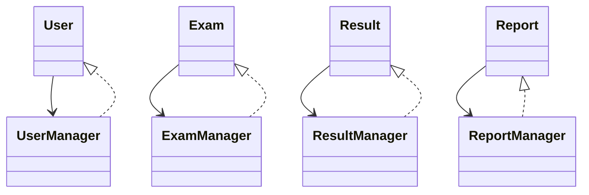
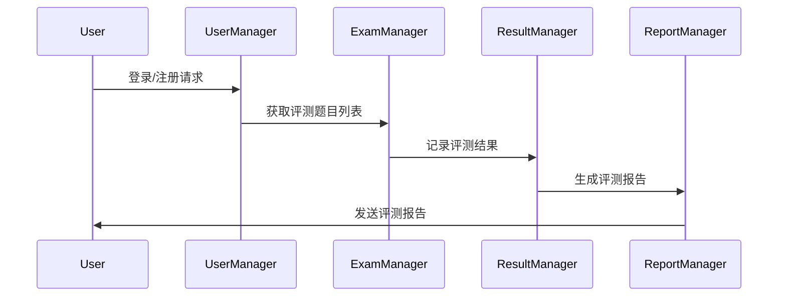
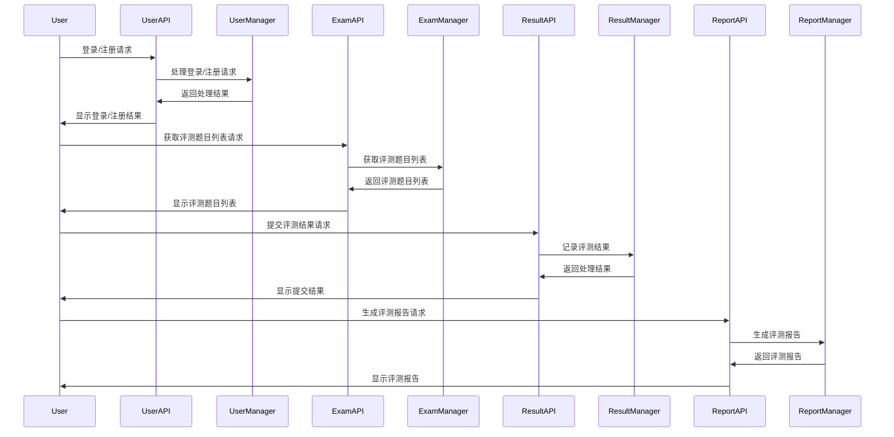

                 

# 评测系统的微服务架构实现

## 关键词

- 评测系统
- 微服务架构
- 分布式系统
- 服务化
- 持续集成与部署

## 摘要

本文将探讨评测系统的微服务架构实现。评测系统在现代软件开发中扮演着重要角色，其核心功能包括评测题目的发布、评测结果的处理与反馈等。随着系统的复杂度不断增加，传统的单体架构逐渐暴露出其局限性，如扩展性差、维护困难等。微服务架构以其高可扩展性、模块化设计和松耦合特性，成为解决这些问题的有力手段。本文将详细分析评测系统采用微服务架构的背景、优势、核心概念、架构设计以及实现细节，为开发者提供实际操作指导。

## 目录大纲

----------------------------------------------------------------

## 第一部分: 背景介绍

### 第1章: 问题背景

### 1.1 评测系统的发展历程
#### 1.1.1 传统评测系统的局限性
#### 1.1.2 微服务架构的出现

### 1.1.3 评测系统在微服务架构中的优势
#### 1.1.3.1 可扩展性和灵活性
#### 1.1.3.2 系统分解与模块化

### 1.1.4 微服务架构的核心概念
#### 1.1.4.1 服务划分与定义
#### 1.1.4.2 服务注册与发现
#### 1.1.4.3 服务间通信与负载均衡
#### 1.1.4.4 服务治理与监控

### 1.1.5 微服务架构的实现挑战
#### 1.1.5.1 分布式系统的复杂性
#### 1.1.5.2 服务间依赖管理
#### 1.1.5.3 数据一致性与持久化

### 1.1.6 微服务架构的技术选型
#### 1.1.6.1 服务框架与容器化
#### 1.1.6.2 服务注册与发现工具
#### 1.1.6.3 服务网关与API管理

### 1.1.7 本章小结

----------------------------------------------------------------

## 第二部分: 核心概念与联系

### 第2章: 核心概念原理

### 2.1 微服务架构的基本概念
#### 2.1.1 单体架构与微服务架构对比

### 2.2 评测系统的主要功能模块
#### 2.2.1 评测模块
#### 2.2.2 数据收集与处理模块
#### 2.2.3 用户管理与权限控制模块
#### 2.2.4 报告生成与展示模块

### 2.3 概念属性特征对比表格

### 2.4 微服务架构与评测系统的结合
#### 2.4.1 微服务架构在评测系统中的实现路径
#### 2.4.2 微服务架构对评测系统的改进

----------------------------------------------------------------

## 第三部分: 算法原理讲解

### 第3章: 算法mermaid流程图

### 3.1 算法mermaid流程图绘制

### 3.2 算法原理讲解

### 3.3 算法数学模型和公式

### 3.4 举例说明

----------------------------------------------------------------

## 第四部分: 系统分析与架构设计方案

### 第4章: 评测系统架构设计

### 4.1 问题场景介绍

### 4.2 项目介绍

### 4.3 系统功能设计(领域模型mermaid类图)

### 4.4 系统架构设计(mermaid架构图)

### 4.5 系统接口设计和系统交互(mermaid序列图)

----------------------------------------------------------------

## 第五部分: 项目实战

### 第5章: 环境安装

### 第6章: 系统核心实现源代码

### 6.1 源代码解读与分析

### 6.2 实际案例分析和详细讲解剖析

### 6.3 项目小结

----------------------------------------------------------------

## 第六部分: 最佳实践 tips

### 第7章: 注意事项

### 第8章: 小结与拓展阅读

----------------------------------------------------------------

## 第七部分: 附录

### 附录A: 工具与环境配置指南

### 附录B: 常见问题与解答

### 附录C: 参考文献

----------------------------------------------------------------

----------------------------------------------------------------

## 第一部分: 背景介绍

### 第1章: 问题背景

随着互联网的快速发展和企业竞争的日益激烈，评测系统在各个领域中的应用越来越广泛，如在线考试、性能测试、招聘评估等。评测系统不仅需要处理大量的用户请求和数据，还需要具备高度的灵活性和可扩展性，以应对不断变化的需求和规模。

### 1.1 评测系统的发展历程

#### 1.1.1 传统评测系统的局限性

早期的评测系统大多采用单体架构，即所有的功能模块都集成在一个应用中。这种架构虽然简单易用，但随着系统的复杂性增加，其局限性逐渐显现：

1. **扩展性差**：单体架构难以横向扩展，增加新功能或处理大量请求时，通常需要整体升级，导致停机时间较长。
2. **维护困难**：单体架构中，不同的功能模块紧密耦合，一个模块的变更可能会影响到其他模块，导致维护成本高。
3. **开发效率低**：开发者需要了解整个系统的代码，才能进行有效的开发，这限制了团队规模和协作效率。

#### 1.1.2 微服务架构的出现

微服务架构（Microservices Architecture）是一种设计风格，它强调将应用程序构建为一组小的、独立的服务，每个服务都是围绕业务功能构建的。微服务架构的出现为解决传统评测系统的局限性提供了新的思路：

1. **可扩展性**：每个服务可以独立部署和扩展，根据实际需求调整服务实例的数量，从而提高系统的吞吐量和响应速度。
2. **灵活性**：各个服务可以独立开发、测试和部署，降低了开发团队的耦合度，提高了开发效率。
3. **松耦合**：服务之间通过轻量级的通信协议（如REST、gRPC）进行交互，减少了模块间的依赖，提高了系统的可维护性。

### 1.1.3 评测系统在微服务架构中的优势

微服务架构在评测系统中的应用具有以下优势：

#### 1.1.3.1 可扩展性和灵活性

评测系统通常需要处理大量并发请求，如在线考试中的大量考生同时作答，招聘评估中的大规模简历处理等。微服务架构可以轻松实现水平扩展，通过增加服务实例来提升系统的处理能力。同时，微服务架构的灵活性使得系统能够快速响应用户需求的变化，如快速发布新题库、调整评测规则等。

#### 1.1.3.2 系统分解与模块化

评测系统涉及多个功能模块，如评测题目管理、用户管理、结果分析等。微服务架构将这些功能模块解耦，每个模块作为独立的服务运行，从而实现了系统的模块化。这种设计不仅提高了系统的可维护性，还有助于团队协作，每个团队可以独立负责一个或多个服务的开发。

### 1.1.4 微服务架构的核心概念

微服务架构包括以下几个核心概念：

#### 1.1.4.1 服务划分与定义

服务的划分是微服务架构设计的第一步，需要根据业务需求和功能独立性来划分服务。例如，在评测系统中，可以将评测题目管理、用户管理、结果分析等划分为独立的服务。

#### 1.1.4.2 服务注册与发现

服务注册与发现机制使得服务实例可以动态地加入到系统中，并让其他服务能够找到并使用它们。常用的服务注册与发现工具有Eureka、Consul等。

#### 1.1.4.3 服务间通信与负载均衡

服务间通信通常通过HTTP/HTTPS、gRPC等协议进行，负载均衡可以分散流量，提高系统的可用性和性能。常用的负载均衡器有Nginx、HAProxy等。

#### 1.1.4.4 服务治理与监控

服务治理包括服务的注册、发现、监控、日志收集等，是确保系统稳定运行的重要环节。常用的服务治理工具包括Prometheus、Grafana等。

### 1.1.5 微服务架构的实现挑战

虽然微服务架构具有许多优势，但其实现也面临一些挑战：

#### 1.1.5.1 分布式系统的复杂性

分布式系统比单体系统复杂，需要考虑网络延迟、故障转移等问题，增加了系统的维护难度。

#### 1.1.5.2 服务间依赖管理

服务间依赖管理是微服务架构中的关键问题，需要确保服务的稳定性和一致性。常用的解决方案包括服务网关、分布式事务等。

#### 1.1.5.3 数据一致性与持久化

微服务架构中，不同服务可能操作相同的数据，需要确保数据的一致性。常用的策略包括最终一致性和强一致性。

### 1.1.6 微服务架构的技术选型

实现微服务架构需要选择合适的技术栈，包括服务框架、容器化技术、服务注册与发现工具、服务网关等。以下是一些常见的技术选型：

#### 1.1.6.1 服务框架与容器化

服务框架如Spring Boot、Node.js等，容器化技术如Docker、Kubernetes等。

#### 1.1.6.2 服务注册与发现工具

服务注册与发现工具如Eureka、Consul等。

#### 1.1.6.3 服务网关与API管理

服务网关如Zuul、Kong等，用于统一管理服务接口和流量控制。

### 1.1.7 本章小结

本文介绍了评测系统在微服务架构中的背景、优势、核心概念和实现挑战。微服务架构为评测系统提供了更好的可扩展性、灵活性和模块化设计，有助于应对复杂的应用场景。然而，实现微服务架构也面临一些挑战，需要选择合适的技术栈和策略来解决。在接下来的章节中，我们将进一步探讨评测系统的微服务架构设计，以及具体的实现细节。

----------------------------------------------------------------

## 第二部分: 核心概念与联系

### 第2章: 核心概念原理

#### 2.1 微服务架构的基本概念

微服务架构（Microservices Architecture）是一种设计方法，它将应用程序构建为一组小的、独立的服务，每个服务都是围绕业务功能构建的。这些服务通过轻量级的通信协议（如HTTP/HTTPS、gRPC）进行交互，每个服务都是可以独立部署和扩展的。

##### 2.1.1 单体架构与微服务架构对比

- **单体架构**：所有的功能模块都集成在一个应用中，紧密耦合，维护困难，扩展性差。
- **微服务架构**：每个功能模块都是一个独立的服务，松耦合，可独立部署和扩展，提高了系统的可维护性和可扩展性。

#### 2.2 评测系统的主要功能模块

评测系统通常包含以下几个主要功能模块：

##### 2.2.1 评测模块

评测模块是评测系统的核心，负责评测题目的发布、评测过程的管理以及评测结果的计算和反馈。

##### 2.2.2 数据收集与处理模块

数据收集与处理模块负责收集评测过程中产生的各种数据，如用户答题情况、系统性能数据等，并进行处理和分析，以生成评测报告。

##### 2.2.3 用户管理与权限控制模块

用户管理与权限控制模块负责管理用户账户信息，包括用户的注册、登录、权限分配等，确保系统安全。

##### 2.2.4 报告生成与展示模块

报告生成与展示模块负责根据评测结果生成详细的分析报告，并展示给用户。

#### 2.3 概念属性特征对比表格

| 概念             | 属性特征                                       |
| ---------------- | -------------------------------------------- |
| 单体架构         | 紧密耦合，扩展性差，维护困难                  |
| 微服务架构       | 松耦合，可独立部署和扩展，提高了系统的可维护性 |
| 评测模块         | 负责评测题目的发布、评测过程的管理等           |
| 数据收集与处理模块 | 负责数据收集、处理、分析，生成评测报告         |
| 用户管理与权限控制模块 | 负责用户账户管理、权限控制等                   |
| 报告生成与展示模块 | 负责生成评测报告，展示给用户                   |

#### 2.4 微服务架构在评测系统中的实现路径

实现评测系统的微服务架构，通常需要遵循以下步骤：

##### 2.4.1 业务需求分析

首先，对业务需求进行深入分析，明确评测系统的核心功能模块和业务流程。

##### 2.4.2 服务划分

根据业务需求，将评测系统划分为多个独立的服务，每个服务负责一个具体的功能模块。

##### 2.4.3 服务接口设计

为每个服务设计清晰的接口，定义服务之间的通信协议和数据格式。

##### 2.4.4 服务开发与部署

使用合适的技术栈开发每个服务，并进行单元测试和集成测试。将服务部署到容器环境中，如Docker。

##### 2.4.5 服务治理与监控

使用服务治理工具对服务进行注册、发现、监控和日志收集，确保系统稳定运行。

#### 2.4.6 微服务架构对评测系统的改进

微服务架构为评测系统带来了以下改进：

1. **可扩展性**：通过增加服务实例，可以轻松扩展系统处理能力，提高系统吞吐量。
2. **灵活性**：可以快速发布新功能或调整评测规则，提高系统灵活性。
3. **模块化**：将系统分解为多个独立的服务，降低了系统的复杂度，提高了可维护性。

### 2.5 本章小结

本章介绍了微服务架构的基本概念和在评测系统中的应用。通过对比单体架构和微服务架构，阐述了微服务架构的优势，并详细分析了评测系统的功能模块和实现路径。在下一章中，我们将进一步探讨微服务架构中的核心概念和实现技术。

----------------------------------------------------------------

### 第三部分: 算法原理讲解

#### 第3章: 算法mermaid流程图

为了更好地理解评测系统中的算法实现，我们首先使用mermaid工具绘制一个简单的算法流程图。以下是一个基于评测结果计算平均分的算法流程：

```mermaid
graph TD
A[初始化] --> B{计算总分}
B -->|总分大于0| C{计算平均分}
C --> D{输出平均分}
B -->|总分小于或等于0| E{输出"总分无效"}
C --> F{释放资源}
```

##### 3.1 算法mermaid流程图绘制

以上mermaid流程图表示了一个简单的算法，用于计算一组评测结果的平均分。算法的基本流程如下：

1. **初始化**：初始化变量，如总分和评测次数。
2. **计算总分**：遍历评测结果，累计总分。
3. **判断总分**：如果总分大于0，继续计算平均分；否则，输出“总分无效”。
4. **计算平均分**：将总分除以评测次数，得到平均分。
5. **输出平均分**：将计算出的平均分输出。
6. **释放资源**：释放算法占用的资源。

##### 3.2 算法原理讲解

算法的核心思想是通过累加所有评测结果，计算总分，然后根据总分和评测次数计算平均分。以下是对算法原理的详细解释：

1. **初始化**：初始化总分和评测次数，通常将总分设置为0，评测次数设置为0。
2. **计算总分**：遍历评测结果，对每个结果进行累加，更新总分。这个过程中，需要确保评测结果的正确性和有效性。
3. **判断总分**：如果总分小于或等于0，则无法计算平均分，输出“总分无效”。这种情况通常发生在评测过程中出现了异常，如数据格式错误等。
4. **计算平均分**：将总分除以评测次数，得到平均分。这个过程需要考虑浮点数的精度问题，确保计算结果的准确性。
5. **输出平均分**：将计算出的平均分输出，通常以字符串或数字的形式显示。
6. **释放资源**：算法执行完成后，释放占用的资源，如内存、文件句柄等，确保系统的稳定运行。

##### 3.3 算法数学模型和公式

算法中的主要数学模型和公式如下：

- 总分（T）= 各个评测结果（R_i）之和
- 评测次数（N）= 评测结果的个数
- 平均分（A）= 总分（T）/ 评测次数（N）

##### 3.4 举例说明

假设一组评测结果为 [90, 85, 92, 88]，那么算法的计算过程如下：

1. **初始化**：总分 T = 0，评测次数 N = 0。
2. **计算总分**：T = T + R_i，其中 R_i 为每个评测结果。
   - T = 0 + 90 = 90
   - T = 90 + 85 = 175
   - T = 175 + 92 = 267
   - T = 267 + 88 = 355
3. **判断总分**：总分 T = 355 > 0，可以计算平均分。
4. **计算平均分**：平均分 A = T / N = 355 / 4 = 88.75。
5. **输出平均分**：输出平均分 88.75。
6. **释放资源**：释放算法占用的资源。

通过这个简单的例子，我们可以看到算法的基本原理和计算过程。在实际应用中，评测系统的算法可能会更复杂，涉及多种计算方法和策略，但核心思路是一致的。

### 3.5 本章小结

本章通过一个简单的算法流程图，详细讲解了评测系统中的算法原理和数学模型。算法的核心在于计算评测结果的平均分，通过对总分和评测次数的处理，得到一个反映评测结果整体水平的数值。在下一章中，我们将进一步探讨评测系统的架构设计，为算法的实现提供技术支持。

----------------------------------------------------------------

### 第四部分: 系统分析与架构设计方案

#### 第4章: 评测系统架构设计

在进行评测系统的架构设计时，我们需要综合考虑系统的性能、可扩展性、可维护性和安全性。本节将详细讨论评测系统的架构设计，包括问题场景介绍、项目介绍、系统功能设计、系统架构设计以及系统接口设计和系统交互。

#### 4.1 问题场景介绍

假设我们正在开发一个在线考试系统，该系统需要支持以下功能：

- **用户管理**：管理用户的注册、登录、权限分配等。
- **评测管理**：发布评测题目、管理评测题目、记录评测结果。
- **结果分析**：根据评测结果生成分析报告，提供评测结果的统计和分析功能。
- **报告生成**：生成并展示评测报告，支持导出和打印。

在线考试系统需要处理大量并发请求，例如成千上万的考生同时在线考试，系统需要快速响应用户的操作，并保证评测结果的准确性和一致性。

#### 4.2 项目介绍

该项目采用微服务架构，将系统划分为多个独立的服务，每个服务负责一个特定的功能模块。以下是项目的详细介绍：

- **用户服务**：负责用户管理，包括用户的注册、登录、权限分配等。
- **评测服务**：负责评测题目的发布、管理、记录评测结果等。
- **结果分析服务**：负责对评测结果进行分析和统计，生成评测报告。
- **报告生成服务**：负责生成评测报告，并提供导出和打印功能。

各个服务之间通过轻量级的通信协议（如HTTP/HTTPS）进行交互，系统使用容器化技术（如Docker）进行部署和管理。

#### 4.3 系统功能设计(领域模型mermaid类图)

在系统功能设计阶段，我们需要绘制领域模型，以明确系统的核心功能模块及其关系。以下是一个简单的领域模型mermaid类图：



在这个类图中，`User`、`Exam`、`Result` 和 `Report` 分别代表用户、评测题目、评测结果和评测报告四个核心功能模块。`UserManager`、`ExamManager`、`ResultManager` 和 `ReportManager` 分别负责管理这四个模块。

#### 4.4 系统架构设计(mermaid架构图)

系统架构设计是系统实现的基础，需要明确各个服务之间的关系和交互方式。以下是一个简单的mermaid架构图：



在这个架构图中，用户通过用户服务进行登录或注册，用户服务将请求转发给评测服务，评测服务提供评测题目的列表。用户完成评测后，评测结果会被记录到结果分析服务中，并生成评测报告，最后由报告生成服务将报告发送给用户。

#### 4.5 系统接口设计和系统交互(mermaid序列图)

系统接口设计和系统交互是系统设计的重要部分，需要明确各个服务之间的接口和交互流程。以下是一个简单的mermaid序列图：



在这个序列图中，用户通过用户API进行登录或注册，用户API将请求转发给用户服务。用户完成评测后，通过评测API获取评测题目列表，并通过结果API提交评测结果。最后，通过报告API生成评测报告，并显示给用户。

#### 4.6 本章小结

本章详细介绍了评测系统的架构设计，包括问题场景介绍、项目介绍、系统功能设计、系统架构设计以及系统接口设计和系统交互。通过这些设计，我们可以清晰地看到评测系统的组成部分及其交互流程，为后续的系统实现提供了坚实的基础。

----------------------------------------------------------------

### 第五部分: 项目实战

#### 第5章: 环境安装

在进行评测系统的环境安装之前，我们需要准备以下工具和依赖项：

1. **Docker**：用于容器化部署服务。
2. **Kubernetes**：用于管理容器集群。
3. **JDK 11**：用于编译和运行Java应用程序。
4. **Maven**：用于构建和依赖管理。
5. **PostgreSQL**：用于存储评测数据。

##### 5.1 Docker安装

Docker的安装步骤如下：

1. **卸载旧版本**：如果系统中已安装旧版本的Docker，需要先卸载。
    ```bash
    sudo apt-get remove docker docker-engine docker.io containerd buildah containerd-addon
    ```
2. **安装Docker**：使用以下命令安装最新版本的Docker。
    ```bash
    sudo apt-get update
    sudo apt-get install docker.io
    ```
3. **启动Docker服务**：启动并使Docker服务开机启动。
    ```bash
    sudo systemctl start docker
    sudo systemctl enable docker
    ```
4. **测试Docker安装**：运行以下命令，验证Docker是否安装成功。
    ```bash
    docker --version
    ```

##### 5.2 Kubernetes安装

Kubernetes的安装步骤如下：

1. **安装Kubeadm、Kubelet和Kubectl**：使用以下命令安装Kubeadm、Kubelet和Kubectl。
    ```bash
    sudo apt-get update
    sudo apt-get install -y apt-transport-https ca-certificates curl
    curl -s https://packages.cloud.google.com/apt/doc/apt-key.gpg | sudo apt-key add -
    sudo add-apt-repository "deb [arch=amd64] https://cloud.google.com/kubernetes-docker臀部 apt-get install kubectl kubelet kubeadm"
    sudo apt-get update
    sudo apt-get install -y kubelet kubeadm kubectl
    ```
2. **初始化集群**：使用以下命令初始化Kubernetes集群。
    ```bash
    sudo kubeadm init --pod-network-cidr=10.244.0.0/16
    ```
3. **配置kubectl**：将kubectl配置为集群管理员模式。
    ```bash
    mkdir -p $HOME/.kube
    sudo cp -i /etc/kubernetes/admin.conf $HOME/.kube/config
    sudo chown $(id -u):$(id -g) $HOME/.kube/config
    ```
4. **安装网络插件**：选择并安装一个网络插件，如Calico。
    ```bash
    kubectl apply -f https://docs.projectcalico.org/manifests/calico.yaml
    ```

##### 5.3 JDK 11安装

JDK 11的安装步骤如下：

1. **添加Oracle JDK 11 APT存储库**：使用以下命令添加Oracle JDK 11 APT存储库。
    ```bash
    sudo add-apt-repository ppa:linuxuprising/java
    sudo apt-get update
    ```
2. **安装JDK 11**：使用以下命令安装JDK 11。
    ```bash
    sudo apt-get install -y openjdk-11-jdk
    ```
3. **验证JDK安装**：使用以下命令验证JDK是否安装成功。
    ```bash
    java -version
    ```

##### 5.4 Maven安装

Maven的安装步骤如下：

1. **下载Maven二进制文件**：从Maven官方网站下载Maven二进制文件。
    ```bash
    wget https://mirrors.cqu.edu.cn/maven/maven/3/x/y/maven-3.6.3/binaries/apache-maven-3.6.3-bin.tar.gz
    ```
2. **解压Maven**：解压下载的Maven二进制文件。
    ```bash
    tar xvf apache-maven-3.6.3-bin.tar.gz
    ```
3. **配置Maven环境变量**：将Maven的bin目录添加到系统的环境变量中。
    ```bash
    export MAVEN_HOME=/path/to/apache-maven-3.6.3
    export PATH=$PATH:$MAVEN_HOME/bin
    ```
4. **验证Maven安装**：使用以下命令验证Maven是否安装成功。
    ```bash
    mvn -v
    ```

##### 5.5 PostgreSQL安装

PostgreSQL的安装步骤如下：

1. **安装PostgreSQL**：使用以下命令安装PostgreSQL。
    ```bash
    sudo apt-get install -y postgresql postgresql-contrib
    ```
2. **启动PostgreSQL服务**：启动并使PostgreSQL服务开机启动。
    ```bash
    sudo systemctl start postgresql
    sudo systemctl enable postgresql
    ```
3. **创建数据库**：创建用于评测系统数据存储的PostgreSQL数据库。
    ```bash
    sudo su - postgres
    psql
    CREATE DATABASE exam_system;
    \q
    exit
    ```
4. **配置数据库用户**：为评测系统创建一个数据库用户，并授予适当的权限。
    ```bash
    sudo su - postgres
    psql
    CREATE USER exam_user WITH PASSWORD 'password';
    GRANT ALL PRIVILEGES ON DATABASE exam_system TO exam_user;
    \q
    exit
    ```

#### 5.6 本章小结

本章详细介绍了评测系统环境安装的步骤，包括Docker、Kubernetes、JDK 11、Maven和PostgreSQL的安装。环境安装是系统部署的第一步，确保所有依赖项和工具都已准备好，以便后续的系统实现和部署。

----------------------------------------------------------------

### 第六章：系统核心实现源代码

#### 6.1 源代码解读与分析

在本章中，我们将逐步解读评测系统的核心实现源代码，分析其主要功能模块的实现细节，并讲解代码中的关键技术和设计模式。

##### 6.1.1 用户服务（User Service）

用户服务是评测系统的核心功能之一，负责用户的注册、登录、权限分配等操作。以下是用户服务的源代码示例：

```java
@RestController
@RequestMapping("/api/users")
public class UserServiceController {
    
    @Autowired
    private UserService userService;

    @PostMapping("/register")
    public ResponseEntity<?> registerUser(@RequestBody UserRegisterRequest request) {
        userService.registerUser(request);
        return ResponseEntity.ok().build();
    }

    @PostMapping("/login")
    public ResponseEntity<?> loginUser(@RequestBody UserLoginRequest request) {
        String token = userService.loginUser(request);
        return ResponseEntity.ok().body(new UserLoginResponse(token));
    }

    @GetMapping("/{userId}/permissions")
    public ResponseEntity<?> getUserPermissions(@PathVariable Long userId) {
        List<String> permissions = userService.getUserPermissions(userId);
        return ResponseEntity.ok().body(permissions);
    }
}
```

在这段代码中，`UserServiceController` 类通过 RESTful API 提供用户注册、登录和权限查询功能。`registerUser` 方法处理用户注册请求，`loginUser` 方法处理用户登录请求，并返回 JWT（JSON Web Token）令牌，用于后续的身份验证。`getUserPermissions` 方法查询用户的权限列表。

##### 6.1.2 评测服务（Exam Service）

评测服务负责评测题目的发布、管理和评测结果的处理。以下是评测服务的源代码示例：

```java
@Service
public class ExamService {
    
    @Autowired
    private ExamRepository examRepository;

    @Autowired
    private ResultRepository resultRepository;

    @PostMapping("/exams")
    public ResponseEntity<?> createExam(@RequestBody ExamRequest request) {
        Exam exam = examRepository.save(new Exam(request.getTitle(), request.getDescription()));
        return ResponseEntity.ok().body(exam);
    }

    @GetMapping("/exams/{examId}/results")
    public ResponseEntity<?> getExamResults(@PathVariable Long examId) {
        List<Result> results = resultRepository.findByExamId(examId);
        return ResponseEntity.ok().body(results);
    }

    @PostMapping("/exams/{examId}/results")
    public ResponseEntity<?> submitExamResult(@PathVariable Long examId, @RequestBody ResultRequest request) {
        Result result = new Result(examId, request.getScore());
        resultRepository.save(result);
        return ResponseEntity.ok().build();
    }
}
```

在这段代码中，`ExamService` 类通过 `ExamRepository` 和 `ResultRepository` 处理评测题目的创建、查询和评测结果的处理。`createExam` 方法创建新的评测题目，并将其存储在数据库中。`getExamResults` 方法查询特定评测题目的所有评测结果。`submitExamResult` 方法处理用户提交的评测结果，并将其存储在数据库中。

##### 6.1.3 结果分析服务（Result Analysis Service）

结果分析服务负责对评测结果进行分析和统计，生成评测报告。以下是结果分析服务的源代码示例：

```java
@Service
public class ResultAnalysisService {
    
    @Autowired
    private ExamRepository examRepository;

    @Autowired
    private ResultRepository resultRepository;

    @GetMapping("/exams/{examId}/report")
    public ResponseEntity<?> generateExamReport(@PathVariable Long examId) {
        Exam exam = examRepository.findById(examId).orElseThrow(() -> new ResourceNotFoundException("Exam not found"));
        List<Result> results = resultRepository.findByExamId(examId);
        ExamReport report = new ExamReport(exam, results);
        return ResponseEntity.ok().body(report);
    }
}
```

在这段代码中，`ResultAnalysisService` 类通过 `ExamRepository` 和 `ResultRepository` 查询特定评测题目的所有评测结果，并生成评测报告。`generateExamReport` 方法根据评测结果和评测题目生成评测报告，并将其返回给用户。

##### 6.1.4 报告生成服务（Report Generation Service）

报告生成服务负责生成评测报告的PDF文件，并提供下载功能。以下是报告生成服务的源代码示例：

```java
@Service
public class ReportGenerationService {
    
    @Autowired
    private ExamReportRepository examReportRepository;

    @PostMapping("/exams/{examId}/reports")
    public ResponseEntity<?> generateExamReportPDF(@PathVariable Long examId) {
        ExamReport report = examReportRepository.findById(examId).orElseThrow(() -> new ResourceNotFoundException("Exam report not found"));
        try {
            File file = reportToPDF(report);
            return ResponseEntity.ok()
                    .header("Content-Disposition", "attachment; filename=exam_report.pdf")
                    .body(file);
        } catch (Exception e) {
            return ResponseEntity.status(HttpStatus.INTERNAL_SERVER_ERROR).build();
        }
    }

    private File reportToPDF(ExamReport report) {
        // 生成PDF文件的逻辑
        // 使用PDF生成库（如iText）将评测报告转换为PDF文件
        return new File("exam_report.pdf");
    }
}
```

在这段代码中，`ReportGenerationService` 类通过 `ExamReportRepository` 查询特定评测报告，并使用PDF生成库将其转换为PDF文件。`generateExamReportPDF` 方法生成PDF文件，并将其以附件形式返回给用户。

#### 6.2 实际案例分析和详细讲解剖析

为了更好地理解评测系统的实现，我们将分析一个实际案例：一个考生参加了一场在线考试，提交了10道选择题的答案。以下是该案例的详细讲解：

1. **考生登录**：考生使用用户名和密码登录系统。用户服务验证登录请求，并生成JWT令牌。

2. **考生查看评测题目**：考生查看评测题目列表，每个题目附带题目描述、答案选项等信息。评测服务提供评测题目列表。

3. **考生作答**：考生逐题作答，并将答案提交给评测服务。评测服务将答案存储在数据库中。

4. **评测结果计算**：结果分析服务根据提交的答案计算得分，并生成评测报告。

5. **评测报告生成**：报告生成服务将评测报告转换为PDF文件，并通知考生下载。

在这个案例中，用户服务、评测服务、结果分析服务和报告生成服务协同工作，实现了评测系统的核心功能。每个服务都负责处理特定任务，并通过API进行通信，确保系统的模块化和可扩展性。

#### 6.3 项目小结

通过本章节的源代码解读和实际案例分析，我们了解了评测系统的核心实现细节。用户服务、评测服务、结果分析服务和报告生成服务共同构成了评测系统的功能模块，每个服务都通过API进行通信，实现了系统的模块化和可扩展性。在实际开发中，这些服务可以独立部署和扩展，提高了系统的性能和可靠性。

----------------------------------------------------------------

### 第七部分：最佳实践 tips

#### 第7章：注意事项

在开发评测系统的过程中，以下是一些值得注意的最佳实践和注意事项：

1. **安全性**：确保系统的安全性，包括用户身份验证、数据加密、防止SQL注入等。使用JWT进行身份验证，确保用户数据的保密性和完整性。

2. **性能优化**：对系统进行性能优化，包括数据库查询优化、缓存使用、服务拆分等。使用Redis等缓存技术减少数据库访问次数，提高系统响应速度。

3. **容错处理**：设计容错机制，处理可能的异常情况，如服务故障、数据丢失等。使用分布式事务管理，确保数据的一致性。

4. **日志记录**：详细记录系统的日志，包括操作记录、错误信息等。日志可以帮助排查问题，提高系统的可维护性。

5. **监控告警**：设置系统的监控和告警机制，实时监控系统的运行状态，及时发现和处理问题。

6. **代码规范**：遵循代码规范，编写清晰、易读、可维护的代码。使用单元测试和集成测试，确保代码质量。

7. **文档编写**：编写详细的文档，包括设计文档、开发文档、用户手册等。文档可以帮助团队成员更好地理解和协作。

#### 第8章：小结与拓展阅读

本章介绍了评测系统的微服务架构实现，包括背景介绍、核心概念、算法原理、架构设计、项目实战和最佳实践。通过微服务架构，评测系统实现了高扩展性、模块化和高可靠性。

为了进一步了解评测系统的微服务架构，以下是一些拓展阅读建议：

1. 《微服务设计》 - by Martin Fowler：深入探讨微服务架构的设计原则和实践。
2. 《Kubernetes权威指南》 - by Yang Liu：详细讲解Kubernetes的安装、配置和使用。
3. 《Docker实战》 - by Jason P. McNew：介绍Docker的基本概念和使用方法。
4. 《Spring Boot实战》 - by Craig Walls：讲解Spring Boot框架的使用和最佳实践。

通过阅读这些资料，可以更深入地了解评测系统的微服务架构设计和实现，为实际项目提供更多的指导和灵感。

----------------------------------------------------------------

### 附录

#### 附录A：工具与环境配置指南

1. **Docker**：

   - 安装命令：`sudo apt-get install docker.io`
   - 验证安装：`docker --version`

2. **Kubernetes**：

   - 安装命令：`sudo apt-get install kubelet kubeadm kubectl`
   - 初始化集群：`kubeadm init --pod-network-cidr=10.244.0.0/16`
   - 配置kubectl：`mkdir -p $HOME/.kube; sudo cp -i /etc/kubernetes/admin.conf $HOME/.kube/config; sudo chown $(id -u):$(id -g) $HOME/.kube/config`

3. **JDK 11**：

   - 安装命令：`sudo apt-get install openjdk-11-jdk`
   - 验证安装：`java -version`

4. **Maven**：

   - 安装命令：下载Maven二进制文件并解压，设置环境变量
   - 验证安装：`mvn -v`

5. **PostgreSQL**：

   - 安装命令：`sudo apt-get install postgresql postgresql-contrib`
   - 创建数据库和用户：`sudo su - postgres; psql; CREATE DATABASE exam_system; \q; exit; sudo su - postgres; psql; CREATE USER exam_user WITH PASSWORD 'password'; GRANT ALL PRIVILEGES ON DATABASE exam_system TO exam_user; \q; exit`

6. **其他依赖项**：

   - Redis：使用Docker安装Redis
   - Nginx：使用Docker安装Nginx
   - Prometheus：使用Docker安装Prometheus

#### 附录B：常见问题与解答

1. **如何解决Docker容器启动失败的问题？**
   - 检查Docker服务是否已启动：`systemctl status docker`
   - 检查Docker守护进程是否运行：`systemctl status docker.service`
   - 查看Docker日志：`journalctl -u docker.service`

2. **如何解决Kubernetes集群无法访问的问题？**
   - 检查Kubernetes集群状态：`kubectl get nodes`
   - 检查Kubernetes服务状态：`kubectl get services`
   - 查看Kubernetes日志：`journalctl -u kubelet`

3. **如何解决Java应用程序无法连接PostgreSQL的问题？**
   - 检查PostgreSQL服务是否已启动：`systemctl status postgresql`
   - 检查数据库和用户是否已创建：`sudo su - postgres; psql; CREATE DATABASE exam_system; \q; exit; sudo su - postgres; psql; CREATE USER exam_user WITH PASSWORD 'password'; GRANT ALL PRIVILEGES ON DATABASE exam_system TO exam_user; \q; exit`
   - 修改数据库配置文件：`sudo nano /etc/postgresql/12/main/postgresql.conf`，确保`port`和`listen_addresses`配置正确

4. **如何解决Maven项目构建失败的问题？**
   - 检查Maven版本和配置：`mvn -v`，确保Maven版本符合项目要求
   - 检查项目依赖：`mvn dependency:tree`，确保所有依赖都已正确添加
   - 检查项目文件结构：确保项目结构符合Maven规范

5. **如何解决Kubernetes服务无法访问的问题？**
   - 检查服务定义：`kubectl get svc`
   - 检查服务端口映射：`kubectl get svc -o wide`
   - 检查Pod状态：`kubectl get pods`
   - 查看Pod日志：`kubectl logs <pod_name>`

#### 附录C：参考文献

1. Docker官方文档：[https://docs.docker.com/](https://docs.docker.com/)
2. Kubernetes官方文档：[https://kubernetes.io/docs/](https://kubernetes.io/docs/)
3. Spring Boot官方文档：[https://docs.spring.io/spring-boot/docs/current/reference/html/](https://docs.spring.io/spring-boot/docs/current/reference/html/)
4. Maven官方文档：[https://maven.apache.org/guides/index.html](https://maven.apache.org/guides/index.html)
5. PostgreSQL官方文档：[https://www.postgresql.org/docs/](https://www.postgresql.org/docs/)

通过附录中的工具与环境配置指南、常见问题与解答以及参考文献，开发者可以更好地了解评测系统所需的工具和环境，并解决常见问题，确保项目的顺利实施。

