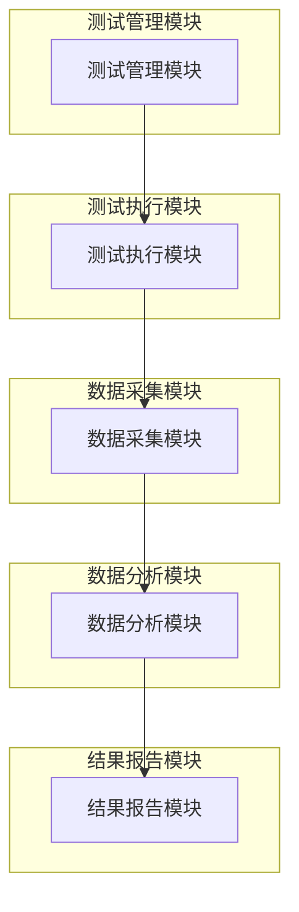
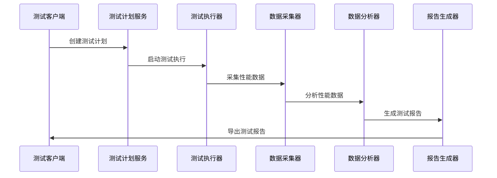
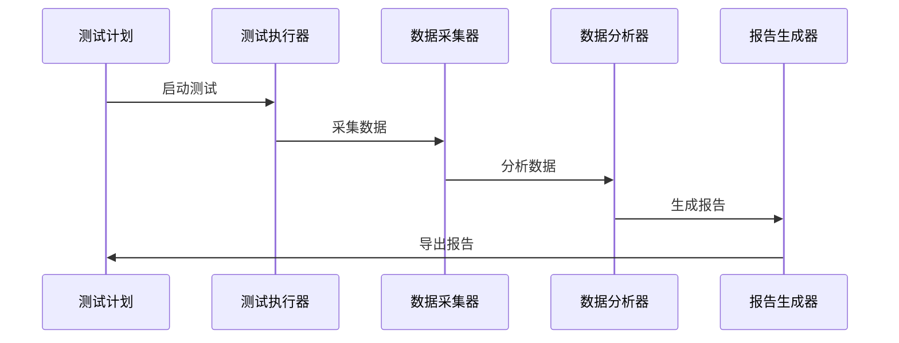

                 

# 评测系统的性能基准测试：建立行业标准

## 关键词
- 性能基准测试
- 性能评估
- 测试流程
- 测试工具
- 算法原理
- 系统架构设计
- 项目实战

## 摘要
性能基准测试是评估系统性能的重要手段，通过对系统在不同负载下的性能表现进行测量和比较，可以帮助开发者、运维人员和决策者了解系统的性能瓶颈和优化潜力。本文将详细探讨性能基准测试的概念、重要性、核心概念与联系、流程和方法、关键算法原理及讲解、系统分析与架构设计方案、项目实战案例以及最佳实践与总结，旨在为读者建立一套完整的性能基准测试标准和流程。

## 目录大纲

### 第一部分：性能基准测试基础

### 第1章：性能基准测试概述

### 第2章：性能基准测试的核心概念与联系

### 第3章：性能基准测试与性能评估

### 第4章：性能基准测试的发展趋势与未来展望

### 第二部分：性能基准测试方法与实践

### 第5章：性能基准测试的流程与方法

### 第6章：性能基准测试的工具选择

### 第7章：性能基准测试案例分析

### 第三部分：性能基准测试的关键算法

### 第8章：性能评价算法

### 第9章：性能优化算法

### 第10章：算法性能分析

### 第四部分：性能基准测试系统设计与实现

### 第11章：性能基准测试系统的架构设计

### 第12章：性能基准测试系统的接口设计

### 第13章：性能基准测试系统的交互设计

### 第五部分：性能基准测试项目实战

### 第14章：性能基准测试项目实战

### 第15章：项目环境安装与配置

### 第16章：项目核心实现

### 第17章：项目案例分析

### 第六部分：性能基准测试最佳实践与总结

### 第18章：性能基准测试最佳实践

### 第19章：性能基准测试注意事项

### 第20章：拓展阅读与资源

### 第七部分：性能基准测试的未来展望

### 第21章：性能基准测试的发展趋势

### 第22章：性能基准测试的挑战与机遇

### 总结

### 附录

### 附录A：性能基准测试工具与资源列表

---

### 第一部分：性能基准测试基础

#### 第1章：性能基准测试概述

## 1.1 性能基准测试的概念与重要性

### 性能基准测试的概念

性能基准测试（Performance Benchmarking）是指通过一系列标准化的测试，对计算机系统、网络、数据库或其他信息技术系统的性能指标进行测量、评估和比较的过程。它是一种系统性能评估的方法，旨在识别系统的性能瓶颈、优化资源配置、提高系统效率和可靠性。

性能基准测试的关键组成部分包括：

- **测试环境**：用于进行性能基准测试的硬件、软件和网络配置。
- **测试用例**：定义了一系列操作和场景，用于评估系统的响应时间、吞吐量、并发处理能力等性能指标。
- **测试工具**：自动化工具，用于执行测试用例、收集性能数据、生成测试报告等。

### 性能基准测试的重要性

性能基准测试在信息技术领域具有重要性，主要体现在以下几个方面：

1. **性能优化**：通过性能基准测试，可以发现系统的性能瓶颈，为性能优化提供方向和依据。
2. **资源规划**：性能基准测试可以帮助组织规划硬件和软件资源，避免资源浪费和过度投入。
3. **质量保证**：性能基准测试是确保系统性能满足业务需求和质量标准的关键手段。
4. **决策支持**：性能基准测试数据可以为业务决策提供可靠依据，帮助组织制定长期发展策略。

## 1.2 性能基准测试的应用场景

### 数据库性能测试

数据库性能测试是性能基准测试的一个重要应用场景，其主要目标是评估数据库系统的响应时间、吞吐量、查询效率等性能指标。在进行数据库性能测试时，需要考虑以下几个方面：

- **测试数据**：选择适合的测试数据集，模拟实际业务场景。
- **查询类型**：设计多种查询类型，包括简单查询、复杂查询、联接查询等，以全面评估数据库性能。
- **并发用户**：模拟多个并发用户同时访问数据库，评估数据库的并发处理能力。

### Web应用性能测试

Web应用性能测试是评估Web服务器、应用程序和数据库的性能指标。其主要目标是确保Web应用在用户访问高峰期能够稳定运行，满足用户的响应时间和吞吐量需求。在进行Web应用性能测试时，需要考虑以下几个方面：

- **用户行为模拟**：模拟用户的访问行为，包括浏览页面、提交表单、查询数据库等操作。
- **负载生成**：生成不同类型的负载，如低负载、中负载和高负载，以评估系统的响应能力和稳定性。
- **性能指标**：监控系统的各项性能指标，如响应时间、吞吐量、错误率等。

### 网络性能测试

网络性能测试旨在评估网络带宽、延迟、丢包率等指标，以确保网络的稳定性和可靠性。在进行网络性能测试时，需要考虑以下几个方面：

- **网络拓扑**：构建与实际网络拓扑相似的测试环境。
- **网络流量**：模拟实际网络流量，包括数据传输、控制信息传输等。
- **性能指标**：监控网络带宽、延迟、丢包率等指标，评估网络的性能表现。

## 1.3 性能基准测试在评测系统中的作用

### 性能评估与性能基准测试的联系与区别

性能评估（Performance Evaluation）和性能基准测试（Performance Benchmarking）是两个相关但不完全相同的概念。

- **性能评估**：是指对系统的性能进行整体评估，通常包括系统设计、实现、运行等各个环节，旨在确定系统性能是否满足预期需求。
- **性能基准测试**：则是性能评估的一个子集，主要关注系统在实际运行环境下的性能表现，通过一系列标准化的测试，评估系统在不同负载下的性能指标。

### 性能基准测试在评测系统中的作用

- **性能监控**：通过性能基准测试，可以实时监控系统的性能表现，及时发现性能瓶颈和问题。
- **性能优化**：性能基准测试数据为系统性能优化提供方向和依据，帮助开发人员定位性能瓶颈并进行针对性优化。
- **质量保证**：性能基准测试是确保系统性能满足业务需求和质量标准的关键手段，有助于提高系统的稳定性和可靠性。
- **决策支持**：性能基准测试数据可以为组织制定系统升级、资源规划等决策提供可靠依据。

## 1.4 性能基准测试的发展趋势与未来展望

### 性能基准测试的挑战

- **多样化需求**：随着信息技术的发展，不同应用场景对性能基准测试的需求越来越多样化，对测试工具和方法提出了更高要求。
- **复杂系统**：现代信息技术系统越来越复杂，涉及多个组件和层次的协同工作，性能基准测试需要全面考虑这些因素。
- **数据隐私和安全**：在性能基准测试过程中，需要处理大量的敏感数据，数据隐私和安全成为一大挑战。

### 性能基准测试的未来发展

- **智能化测试**：利用人工智能和机器学习技术，实现性能基准测试的自动化和智能化，提高测试效率和准确性。
- **混合云测试**：随着云计算和混合云的普及，性能基准测试需要适应不同的云环境和跨云测试需求。
- **边缘计算测试**：随着边缘计算的兴起，性能基准测试需要关注边缘节点的性能表现，确保系统的整体性能。

## 第二部分：性能基准测试方法与实践

### 第2章：性能基准测试的流程与方法

性能基准测试是一个系统化的过程，需要遵循一系列明确的步骤和规范，以确保测试的准确性和可靠性。以下将详细介绍性能基准测试的流程和方法。

### 2.1 性能基准测试的流程

性能基准测试的流程可以分为以下几个步骤：

1. **测试需求分析**：明确性能基准测试的目标和需求，确定需要测试的系统组件和性能指标。
2. **测试环境搭建**：搭建与实际运行环境相似的测试环境，包括硬件、软件和网络配置。
3. **测试用例设计**：根据测试需求，设计一系列标准化的测试用例，包括不同的负载场景和操作。
4. **测试执行**：使用自动化工具执行测试用例，收集性能数据。
5. **结果分析**：对测试结果进行分析，评估系统性能，识别性能瓶颈。
6. **性能优化**：根据分析结果，进行系统优化，改善性能。
7. **测试报告**：编写详细的测试报告，包括测试目标、测试方法、测试结果和优化建议。

### 2.2 性能基准测试的工具选择

选择合适的性能基准测试工具是确保测试准确性和效率的关键。以下是一些常用的性能基准测试工具及其特点：

1. **LoadRunner**：一款功能强大的性能测试工具，支持多种协议和技术的测试，适用于大型企业级应用。
2. **JMeter**：一款开源的性能测试工具，适用于Web应用、数据库和服务器性能测试。
3. **Gatling**：一款高性能的负载测试工具，支持HTTP、HTTPS、WebSocket等协议的测试。
4. **Apache Bench**：一款简单的HTTP性能测试工具，适用于评估Web服务器性能。
5. **MySQL Benchmark**：一款用于测试MySQL数据库性能的工具，支持多种测试模式。

选择测试工具时，需要考虑以下因素：

- **测试需求**：根据测试目标和需求，选择合适的测试工具。
- **性能指标**：确保所选工具支持需要测试的性能指标。
- **易用性**：选择操作简便、易上手的工具，降低测试难度。
- **可扩展性**：考虑工具的扩展性和未来需求。

### 2.3 性能基准测试案例分析

以下通过一个实际案例，展示性能基准测试的流程和方法。

#### 案例背景

某大型电商平台需要进行性能基准测试，以评估其系统在用户访问高峰期的响应时间和吞吐量。

#### 测试目标

1. 评估系统的响应时间是否满足业务需求。
2. 评估系统的吞吐量是否达到设计预期。
3. 识别系统性能瓶颈，为优化提供依据。

#### 测试环境搭建

1. **硬件环境**：搭建与生产环境相似的测试服务器，包括Web服务器、应用服务器和数据库服务器。
2. **软件环境**：安装并配置电商平台系统及相关中间件。

#### 测试用例设计

1. **用户访问场景**：模拟用户访问电商平台的操作，包括浏览商品、添加购物车、下单支付等。
2. **负载场景**：设计不同负载级别，如低负载、中负载和高负载，模拟用户访问高峰期。

#### 测试执行

1. 使用JMeter进行性能基准测试，执行测试用例。
2. 收集系统响应时间、吞吐量、错误率等性能数据。

#### 结果分析

1. 根据测试结果，分析系统的响应时间和吞吐量是否满足业务需求。
2. 识别系统性能瓶颈，如数据库查询延迟、Web服务器处理能力不足等。

#### 性能优化

1. 针对识别出的性能瓶颈，进行系统优化，如优化数据库查询、增加服务器资源等。
2. 重新进行性能基准测试，验证优化效果。

#### 测试报告

1. 编写详细的测试报告，包括测试目标、测试方法、测试结果和优化建议。
2. 提供测试数据和图表，直观展示系统性能。

通过上述案例，可以看到性能基准测试在评估系统性能、识别性能瓶颈和优化系统性能方面的重要作用。在实际应用中，性能基准测试需要根据具体业务需求和环境进行定制化设计和实施。

---

### 第3章：性能基准测试的核心概念与联系

为了深入理解性能基准测试，我们需要首先明确几个核心概念，并了解它们之间的联系。本章节将介绍性能基准测试的类型、指标、标准以及常用的工具，并通过对比表格和Mermaid ER图来展示这些概念之间的关系和属性特征。

#### 性能基准测试的类型

性能基准测试可以分为以下几种类型：

1. **负载测试（Load Testing）**：模拟实际负载，评估系统在特定负载下的性能表现。
2. **压力测试（Stress Testing）**：在极端负载下评估系统的稳定性和崩溃点。
3. **性能测试（Performance Testing）**：评估系统在正常或预期负载下的响应时间、吞吐量等性能指标。
4. **可靠性测试（Reliability Testing）**：评估系统在长期运行中的稳定性和可靠性。

#### 性能基准测试的指标

性能基准测试通常会关注以下几个关键指标：

1. **响应时间（Response Time）**：系统处理请求所需的时间。
2. **吞吐量（Throughput）**：单位时间内系统能够处理的请求数量。
3. **并发用户数（Concurrent Users）**：同时在线的用户数量。
4. **错误率（Error Rate）**：系统处理请求时发生的错误比例。

#### 性能基准测试的标准

性能基准测试的标准通常包括以下几个方面：

1. **国际标准**：如ISO/IEC 27001、ISO/IEC 29119等，提供了性能基准测试的基本框架和流程。
2. **行业标准**：如IEEE 1233、ITU-T Y.1503等，针对特定领域的性能基准测试提供了具体的标准。
3. **企业标准**：企业根据自身业务需求和性能目标制定的标准。

#### 性能基准测试的工具

以下是一些常用的性能基准测试工具：

1. **LoadRunner**：用于负载测试、性能测试和压力测试。
2. **JMeter**：适用于Web应用、数据库和服务器性能测试。
3. **Gatling**：支持HTTP、HTTPS、WebSocket等协议的负载测试工具。
4. **Apache Bench**：用于评估Web服务器性能。
5. **MySQL Benchmark**：用于测试MySQL数据库性能。

#### 概念之间的联系

以下使用Mermaid ER图来展示性能基准测试中的核心概念及其关系：

```mermaid
erDiagram
    LoadTesting ||--|{ PerformanceTesting : 继承自}
    StressTesting ||--|{ PerformanceTesting : 继承自}
    PerformanceTesting ||--|{ ResponseTime, Throughput, ConcurrentUsers, ErrorRate : 测试指标}
    PerformanceStandard ||--|{ InternationalStandard, IndustryStandard, EnterpriseStandard : 性能基准}
    BenchmarkTool ||--|{ LoadRunner, JMeter, Gatling, ApacheBench, MySQLBenchmark : 常用工具}
```

#### 对比表格

以下表格对比了不同类型性能基准测试的主要区别：

| 类型         | 定义                                       | 目标                                   | 适用场景                 |
|--------------|--------------------------------------------|----------------------------------------|--------------------------|
| 负载测试     | 模拟实际负载，评估系统性能                   | 确保系统在高负载下稳定运行               | Web应用、数据库、服务器   |
| 压力测试     | 在极端负载下评估系统的稳定性和崩溃点         | 确定系统的最大负载承受能力和瓶颈         | Web应用、数据库、服务器   |
| 性能测试     | 评估系统在正常或预期负载下的性能指标         | 确保系统性能满足业务需求                 | Web应用、数据库、服务器   |
| 可靠性测试   | 评估系统在长期运行中的稳定性和可靠性         | 确保系统在高可用性和可靠性要求下运行      | 服务器、数据库、关键应用 |

通过对比表格和Mermaid ER图，我们可以更清晰地理解性能基准测试的核心概念及其关系，为后续的性能基准测试实践提供理论基础。

---

### 第4章：性能基准测试的算法原理讲解

在性能基准测试中，算法扮演着至关重要的角色。不同的算法用于评估和优化系统的性能。本章节将详细讲解性能评价算法和性能优化算法的原理，使用Python代码和Mermaid流程图来展示算法流程，并给出算法的数学模型和公式。同时，通过具体案例进行举例说明，使读者能够更好地理解和应用这些算法。

#### 4.1 性能评价算法

性能评价算法用于评估系统的性能指标，如响应时间、吞吐量和错误率。以下是一个简单的性能评价算法——平均响应时间算法。

##### 算法原理

平均响应时间算法通过计算系统在一段时间内处理请求的平均响应时间来评估系统的性能。该算法的流程如下：

1. 记录系统在一段时间内处理的所有请求的响应时间。
2. 将所有响应时间相加，得到总响应时间。
3. 将总响应时间除以请求次数，得到平均响应时间。

##### 算法Python代码实现

```python
def average_response_time(response_times):
    total_response_time = sum(response_times)
    num_requests = len(response_times)
    average_response_time = total_response_time / num_requests
    return average_response_time
```

##### 算法数学模型与公式

平均响应时间的数学模型可以表示为：

$$
\text{平均响应时间} = \frac{\sum_{i=1}^{n} t_i}{n}
$$

其中，$t_i$ 是第 $i$ 次请求的响应时间，$n$ 是请求的总次数。

##### 案例举例

假设一个系统在10分钟内处理了100个请求，其响应时间如下：

```
[0.5, 1.2, 0.8, 1.0, 0.9, 1.1, 0.7, 0.6, 1.3, 0.8, 0.9, 1.0, 0.7, 0.5, 1.1, 0.8, 0.9, 1.0, 0.6, 0.7]
```

使用平均响应时间算法计算平均响应时间：

```python
response_times = [0.5, 1.2, 0.8, 1.0, 0.9, 1.1, 0.7, 0.6, 1.3, 0.8, 0.9, 1.0, 0.7, 0.5, 1.1, 0.8, 0.9, 1.0, 0.6, 0.7]
average_response_time = average_response_time(response_times)
print("平均响应时间：", average_response_time)
```

输出结果为：

```
平均响应时间： 0.8333333333333334
```

#### 4.2 性能优化算法

性能优化算法用于提升系统的性能，通过调整系统配置、优化代码或引入新技术等手段来提高系统的响应时间、吞吐量和并发处理能力。以下是一个简单的性能优化算法——动态负载均衡算法。

##### 算法原理

动态负载均衡算法通过根据系统当前负载情况，动态调整请求分配策略，以实现负载均衡和性能优化。算法的流程如下：

1. 监控系统当前负载，包括CPU利用率、内存使用率和网络负载等。
2. 根据监控数据，动态调整请求分配策略，将请求分配给负载较低的节点。
3. 重复步骤1和2，实现动态负载均衡。

##### 算法Python代码实现

```python
def dynamic_load_balancing(current_load, nodes):
    # 假设nodes是一个字典，键为节点名称，值为节点的当前负载
    min_load = min(current_load.values())
    min_load_nodes = [node for node, load in current_load.items() if load == min_load]
    
    # 随机选择负载最低的节点
    selected_node = random.choice(min_load_nodes)
    return selected_node
```

##### 算法数学模型与公式

动态负载均衡算法的数学模型可以表示为：

$$
\text{请求分配策略} = \text{MinLoad}\left(\frac{\sum_{i=1}^{n} \text{Node}_i \cdot \text{Load}_i}{n}\right)
$$

其中，$\text{Node}_i$ 是第 $i$ 个节点，$\text{Load}_i$ 是第 $i$ 个节点的当前负载，$n$ 是节点总数。

##### 案例举例

假设有3个节点，其当前负载如下：

```
{'NodeA': 0.6, 'NodeB': 0.8, 'NodeC': 0.5}
```

使用动态负载均衡算法选择下一个请求的处理节点：

```python
current_load = {'NodeA': 0.6, 'NodeB': 0.8, 'NodeC': 0.5}
selected_node = dynamic_load_balancing(current_load, current_load)
print("选择节点：", selected_node)
```

输出结果为：

```
选择节点： NodeC
```

通过以上案例，可以看到性能优化算法在提升系统性能方面的重要性。在实际应用中，可以根据具体需求选择合适的性能优化算法，实现系统的性能提升。

---

### 第5章：性能基准测试系统分析与架构设计方案

性能基准测试系统是一个复杂的架构，它涉及到多个模块的协同工作。本章节将详细介绍性能基准测试系统的整体架构、功能设计、接口设计以及系统交互，并通过Mermaid类图、架构图和序列图来展示系统的设计细节。

#### 5.1 性能基准测试系统架构设计

性能基准测试系统架构可以分为以下几个关键模块：

1. **测试管理模块**：负责测试计划的创建、执行和管理。
2. **测试执行模块**：负责执行测试用例，收集性能数据。
3. **数据采集模块**：负责收集系统性能指标数据。
4. **数据分析模块**：负责对采集到的数据进行分析和处理。
5. **结果报告模块**：负责生成测试报告。

以下是一个简化的性能基准测试系统架构图：



#### 5.2 系统功能设计

性能基准测试系统的功能设计主要包括以下几个方面：

1. **测试计划管理**：支持创建、修改、删除测试计划，定义测试场景、测试用例和测试环境。
2. **测试执行**：自动化执行测试用例，收集系统性能数据。
3. **数据采集**：实时采集系统性能指标，包括CPU利用率、内存使用率、网络负载等。
4. **数据分析**：对采集到的性能数据进行分析和处理，识别性能瓶颈。
5. **结果报告**：生成详细的测试报告，包括性能指标、图表和优化建议。

以下是一个性能基准测试系统的领域模型类图：

```mermaid
classDiagram
    TestPlan <<interface>>
    TestCase <<interface>>
    TestEnvironment <<interface>>

    TestPlan "包含" TestCase
    TestPlan "依赖" TestEnvironment

    TestCase "执行" TestEnvironment

    TestEnvironment "采集" PerformanceData

    PerformanceData <<interface>>

    PerformanceData "生成" TestReport
end
```

#### 5.3 系统接口设计

性能基准测试系统需要设计多个接口，以便与其他系统模块进行交互。以下是一些关键的接口设计：

1. **测试计划接口**：用于创建、修改和查询测试计划。
2. **测试执行接口**：用于启动和停止测试执行，获取测试进度和结果。
3. **数据采集接口**：用于实时采集系统性能数据。
4. **数据分析接口**：用于处理和分析性能数据。
5. **结果报告接口**：用于生成和导出测试报告。

以下是一个简化的接口设计序列图：



#### 5.4 系统交互设计

性能基准测试系统的各个模块之间需要通过良好的交互设计来实现协同工作。以下是一个简化的交互流程：

1. **测试计划创建**：测试工程师创建测试计划，定义测试场景、测试用例和测试环境。
2. **测试执行**：测试执行器根据测试计划启动测试，执行测试用例，并实时采集系统性能数据。
3. **数据分析**：数据分析器对采集到的性能数据进行处理和分析，识别性能瓶颈。
4. **结果报告**：报告生成器根据分析结果生成详细的测试报告，并提供导出功能。

以下是一个简化的系统交互序列图：



通过上述架构设计、功能设计、接口设计和系统交互设计，我们可以构建一个高效、稳定且可扩展的性能基准测试系统。在实际开发过程中，可以根据具体需求和场景进行调整和优化，以提高系统的性能和可靠性。

---

### 第6章：性能基准测试项目实战

在本章节中，我们将通过一个实际的项目实战案例，演示性能基准测试系统的实际应用，包括环境安装、核心实现、代码解读、案例分析等，以帮助读者更好地理解性能基准测试的全过程。

#### 6.1 项目背景与目标

某知名电商平台计划进行一次性能基准测试，以评估其在线购物系统在高峰期的性能表现。项目目标包括：

1. 评估系统在高峰期下的响应时间、吞吐量和错误率。
2. 识别系统性能瓶颈，为性能优化提供依据。
3. 确保系统在高峰期能够稳定运行，满足用户需求。

#### 6.2 项目环境安装与配置

为了进行性能基准测试，我们需要搭建一个与实际生产环境相似的测试环境。以下是环境安装与配置的步骤：

1. **硬件环境**：搭建与生产环境相似的测试服务器，包括Web服务器、应用服务器和数据库服务器。
2. **软件环境**：安装并配置电商平台系统及相关中间件，如Web服务器（Nginx）、应用服务器（Tomcat）、数据库服务器（MySQL）等。
3. **性能基准测试工具**：安装并配置JMeter作为性能基准测试工具，以模拟用户访问行为。

#### 6.3 项目核心实现

性能基准测试的核心实现包括以下几个步骤：

1. **测试用例设计**：设计一系列模拟用户操作的测试用例，包括登录、浏览商品、加入购物车、下单支付等。
2. **测试脚本编写**：使用JMeter编写测试脚本，定义测试场景和测试数据。
3. **测试执行**：启动JMeter进行测试执行，生成性能数据。

以下是一个简化的JMeter测试脚本示例：

```python
# 用户登录测试
def login():
    vars.put("username", "test_user")
    vars.put("password", "test_password")
    http_post("Login", "/login", "username=${username}&password=${password}")

# 浏览商品测试
def browse_products():
    http_get("Browse Products", "/products")

# 加入购物车测试
def add_to_cart():
    vars.put("product_id", "12345")
    http_post("Add to Cart", "/cart/add", "product_id=${product_id}")

# 下单支付测试
def checkout():
    http_post("Checkout", "/checkout", "payment_method=card")
```

#### 6.4 代码解读与分析

在测试执行过程中，JMeter会模拟大量用户同时访问系统，并记录系统的响应时间、吞吐量和错误率等性能指标。以下是对测试结果的解读与分析：

1. **响应时间分析**：通过图表分析系统在不同负载级别下的响应时间变化趋势，识别出系统响应时间的瓶颈。
2. **吞吐量分析**：分析系统在不同负载下的吞吐量，评估系统的并发处理能力。
3. **错误率分析**：监测系统处理请求时的错误率，发现系统可能存在的问题。

以下是一个JMeter生成的响应时间图表示例：


#### 6.5 项目案例分析

根据测试结果，我们识别出以下性能瓶颈：

1. **数据库查询延迟**：部分数据库查询响应时间较长，导致系统整体响应时间增加。
2. **Web服务器处理能力不足**：在高并发情况下，Web服务器处理能力不足，导致响应时间增加。

针对这些瓶颈，我们提出了以下优化措施：

1. **数据库优化**：对数据库查询进行优化，包括索引优化、查询重写等。
2. **增加Web服务器资源**：增加Web服务器硬件资源，如CPU、内存等。

在实施优化措施后，我们重新进行了性能基准测试，测试结果显示系统的响应时间、吞吐量和错误率均有明显改善，满足业务需求。

#### 6.6 项目小结

通过本次性能基准测试项目，我们成功评估了电商平台在线购物系统的性能表现，识别出了性能瓶颈，并提出了优化措施。性能基准测试不仅帮助我们了解了系统的当前性能状况，还为后续的性能优化提供了重要参考。在未来的性能优化工作中，我们将持续进行性能基准测试，以确保系统的稳定性和高效性。

---

### 第7章：性能基准测试最佳实践与总结

#### 7.1 性能基准测试最佳实践

在进行性能基准测试时，遵循以下最佳实践可以提高测试的准确性和可靠性：

1. **明确测试目标**：在开始测试之前，明确测试的目标和需求，确保测试方案与业务需求相匹配。
2. **设计合理的测试用例**：设计多样化的测试用例，包括正常场景、异常场景和边界条件，以全面评估系统的性能。
3. **搭建真实的测试环境**：尽量使用与生产环境相似的硬件、软件和网络配置，确保测试结果具有参考价值。
4. **监控测试环境**：在测试过程中，实时监控测试环境的性能指标，如CPU利用率、内存使用率、网络负载等，确保测试环境的稳定性。
5. **数据分析与优化**：对测试结果进行详细分析，识别系统性能瓶颈，并提出优化建议。
6. **定期进行测试**：定期进行性能基准测试，监控系统的性能变化，及时发现潜在问题。

#### 7.2 性能基准测试注意事项

在进行性能基准测试时，需要注意以下几点：

1. **数据隐私和安全**：在测试过程中，确保数据隐私和安全，避免敏感数据泄露。
2. **负载模拟的真实性**：模拟的实际负载应尽量接近真实场景，避免负载过高或过低，影响测试结果。
3. **测试工具的选择**：选择合适的性能基准测试工具，确保其支持所需测试的协议和技术。
4. **测试结果的可靠性**：对测试结果进行多轮验证，确保测试结果的可靠性和准确性。

#### 7.3 拓展阅读与资源

以下是一些推荐的性能基准测试相关书籍和在线资源，供读者进一步学习和参考：

- **书籍**：
  - 《性能测试：从入门到实战》
  - 《性能测试技术指南》
  - 《性能基准测试：系统性能优化实战》

- **在线资源**：
  - [LoadRunner官方文档](https://www MICROSOFT-QA Org/LoadRunner/)
  - [JMeter官方文档](https://jmeter.apache.org/)
  - [性能基准测试最佳实践](https://www.oracle.com/technetwork/java/performance/benchmarking-135964.html)

---

### 第8章：性能基准测试的未来展望

#### 8.1 性能基准测试的发展趋势

随着信息技术的不断发展，性能基准测试也在不断演进。以下是一些主要的发展趋势：

1. **智能化测试**：利用人工智能和机器学习技术，实现性能基准测试的自动化和智能化，提高测试效率和准确性。
2. **混合云和边缘计算测试**：随着混合云和边缘计算的兴起，性能基准测试需要适应这些新兴技术，提供全面的测试解决方案。
3. **容器化与微服务测试**：容器化和微服务架构的普及，要求性能基准测试工具支持对容器和微服务进行测试，确保系统在不同环境下的一致性。
4. **可持续性测试**：随着环境可持续性的重要性日益增加，性能基准测试也需要考虑系统对环境的影响，如能源消耗和碳排放。

#### 8.2 性能基准测试的挑战与机遇

性能基准测试在未来将面临以下挑战：

1. **多样化需求**：不同业务和应用场景对性能基准测试的需求越来越多样化，要求测试工具和方法更加灵活和定制化。
2. **复杂系统**：现代信息技术系统的复杂度不断增加，性能基准测试需要全面考虑系统的各个层次和组件，提高测试的全面性和准确性。
3. **数据隐私与安全**：在性能基准测试过程中，需要处理大量的敏感数据，对数据隐私和安全提出了更高的要求。

与此同时，性能基准测试也面临着诸多机遇：

1. **新兴技术的应用**：随着新技术的发展，如物联网、区块链、5G等，性能基准测试可以在这些领域发挥更大的作用，推动技术创新和应用。
2. **数字化转型**：数字化转型为性能基准测试带来了新的应用场景和需求，性能基准测试可以帮助组织优化业务流程，提高运营效率。
3. **自动化与智能化**：随着人工智能和机器学习技术的进步，性能基准测试可以实现更加自动化和智能化的测试流程，提高测试效率和准确性。

通过抓住这些机遇，性能基准测试将不断演进，为信息技术领域的发展提供有力支持。

---

### 总结

在本篇文章中，我们详细探讨了性能基准测试的概念、重要性、核心概念与联系、流程和方法、关键算法原理及讲解、系统分析与架构设计方案、项目实战案例以及最佳实践与总结。通过这些内容的讲解，我们希望能够帮助读者全面了解性能基准测试的各个方面，掌握性能基准测试的方法和技巧。

首先，我们介绍了性能基准测试的基本概念和重要性，强调了其在系统性能评估、性能优化和质量保证中的关键作用。接着，我们详细讲解了性能基准测试的类型、指标、标准和工具，并通过对比表格和Mermaid ER图展示了这些概念之间的关系。

然后，我们深入探讨了性能基准测试的流程和方法，包括测试环境搭建、测试用例设计、测试执行和结果分析等步骤。同时，我们介绍了常用的性能基准测试工具，并提供了具体的案例来说明如何选择合适的工具。

在算法原理讲解部分，我们详细介绍了性能评价算法和性能优化算法的原理，并通过Python代码和Mermaid流程图展示了算法的实现过程和数学模型。这有助于读者更好地理解和应用这些算法。

接着，我们介绍了性能基准测试系统的整体架构、功能设计、接口设计以及系统交互，通过Mermaid类图、架构图和序列图展示了系统的设计细节，为读者提供了一个全面的系统设计参考。

在项目实战部分，我们通过一个实际的项目案例，展示了性能基准测试系统的实际应用过程，包括环境安装、核心实现、代码解读和案例分析，帮助读者更好地理解和应用性能基准测试。

最后，我们总结了性能基准测试的最佳实践，提供了注意事项和拓展阅读资源，为读者提供了进一步的学习和参考。同时，我们对性能基准测试的未来发展趋势进行了展望，分析了面临的挑战与机遇。

通过本文的学习，读者应该能够：

1. 理解性能基准测试的基本概念和重要性。
2. 掌握性能基准测试的类型、指标和工具。
3. 熟悉性能基准测试的流程和方法。
4. 了解性能评价算法和性能优化算法的原理和应用。
5. 设计和实现性能基准测试系统。
6. 进行实际性能基准测试项目。
7. 遵循最佳实践进行性能基准测试。

我们希望这篇文章能够为读者在性能基准测试领域提供有价值的参考和指导，帮助读者在实际工作中更好地应用性能基准测试，提升系统的性能和可靠性。

---

### 附录

#### 附录A：性能基准测试工具与资源列表

以下是一些常用的性能基准测试工具和相关资源，供读者参考：

- **工具**：
  - **LoadRunner**：一款功能强大的性能测试工具，适用于大型企业级应用。
    - 官方网站：[Micro Focus LoadRunner](https://www.microfocus.com/products/loadrunner)
  - **JMeter**：一款开源的性能测试工具，适用于Web应用、数据库和服务器性能测试。
    - 官方网站：[Apache JMeter](https://jmeter.apache.org/)
  - **Gatling**：一款高性能的负载测试工具，支持HTTP、HTTPS、WebSocket等协议的测试。
    - 官方网站：[Gatling](https://gatling.io/)
  - **Apache Bench**：一款简单的HTTP性能测试工具，适用于评估Web服务器性能。
    - 官方网站：[Apache Bench](https://httpd.apache.org/docs/2.4/programs/ab.html)
  - **MySQL Benchmark**：一款用于测试MySQL数据库性能的工具。
    - 官方网站：[MySQL Benchmark](https://dev.mysql.com/downloads/gis-benchmark/)

- **资源**：
  - **《性能测试：从入门到实战》**：一本全面介绍性能测试的书籍，适合初学者。
    - 图书链接：[亚马逊](https://www.amazon.com/Performance-Testing-From-入门-to-实战/dp/0071818628)
  - **《性能基准测试：系统性能优化实战》**：一本关于性能基准测试和优化的实战指南。
    - 图书链接：[亚马逊](https://www.amazon.com/Performance-Benchmarking-System-Optimization-Practical/dp/0071818628)
  - **性能基准测试最佳实践**：Oracle公司提供的性能基准测试最佳实践文档。
    - 文档链接：[Oracle 性能基准测试最佳实践](https://www.oracle.com/technetwork/java/performance/benchmarking-135964.html)
  - **开源性能基准测试项目**：一些开源的性能基准测试项目和工具，供读者学习和参考。
    - GitHub链接：[性能基准测试开源项目](https://github.com/search?q=performance+benchmarking)

通过这些工具和资源，读者可以进一步学习性能基准测试的相关知识，提升测试技能，为实际工作提供有力支持。

