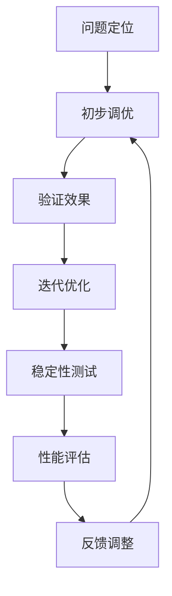
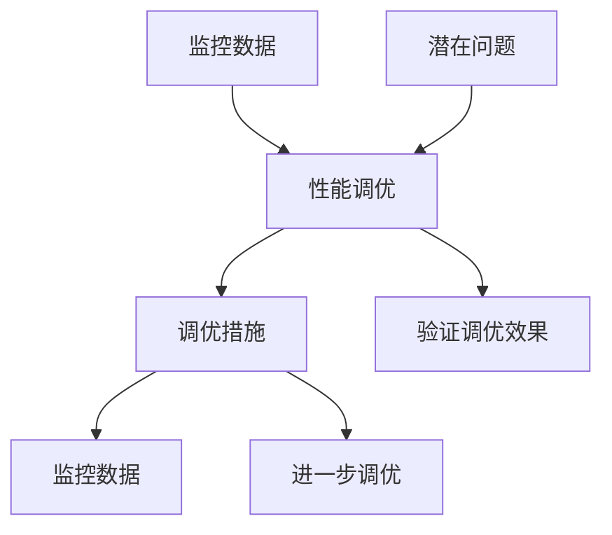

                 


## 性能调优与监控概述

### 性能调优的重要性

在信息技术领域，系统的性能调优是一项至关重要的任务。它不仅关系到系统的响应速度，还直接影响到用户的体验和业务的连续性。性能调优的目标是通过一系列的策略和技术手段，优化系统的资源利用率和执行效率，从而提高系统的整体性能。

**1. 性能调优的基本概念**

性能调优（Performance Tuning）是指通过调整系统配置、优化代码、改善硬件资源利用等手段，提升系统性能的过程。其核心在于找到系统性能瓶颈，并通过改进技术手段来消除这些瓶颈。

**2. 性能调优的目的**

- **提高响应速度**：优化系统资源利用，减少延迟，提升用户交互体验。
- **提升系统稳定性**：通过调整和优化系统参数，降低系统崩溃的风险。
- **资源利用最大化**：确保系统资源（如CPU、内存、磁盘等）的高效利用，避免资源浪费。

**3. 性能调优与监控的关系**

性能调优和监控（Monitoring）密不可分。监控是性能调优的基础，通过持续监控系统的运行状态和性能指标，可以发现系统存在的问题和潜在的性能瓶颈。而性能调优则是监控的进一步行动，基于监控数据来实施相应的优化措施。

### 监控

监控是指对系统运行状态的实时跟踪和记录，以及对其性能指标的分析和评估。监控的目的是及时发现并解决系统中的异常情况，确保系统稳定、高效地运行。

**1. 监控的基本概念**

- **系统监控**：对服务器、网络设备、应用程序等系统组件的运行状态进行监控。
- **性能监控**：跟踪和记录系统性能指标，如CPU使用率、内存占用、磁盘I/O等。

**2. 监控的目的**

- **预防故障**：通过提前预警，防止系统崩溃或故障发生。
- **性能分析**：通过分析监控数据，找到系统性能瓶颈，为性能调优提供依据。
- **优化资源配置**：根据监控数据，调整系统资源分配，提高资源利用效率。

**3. 监控与性能调优的关系**

监控是性能调优的先行工作。通过监控，我们可以获取系统的实时状态和性能数据，从而发现潜在的问题和瓶颈。性能调优则是基于监控数据，采取具体措施来优化系统性能。

### 性能调优与监控的重要性

- **业务连续性**：良好的性能调优和监控能够确保业务系统的稳定运行，降低因系统故障导致的业务中断风险。
- **用户体验**：高效的性能调优和监控可以提升用户的使用体验，减少等待时间和系统响应时间。
- **运营成本**：通过优化系统性能，可以降低硬件成本和运维成本，提高资源利用效率。

**总结**

性能调优和监控是确保系统高效稳定运行的重要手段。通过合理地性能调优和监控，可以提升系统性能，确保业务连续性，优化用户体验，降低运营成本。

### 评测系统的性能调优与监控概述

在信息技术不断发展的今天，评测系统的性能调优与监控显得尤为重要。无论是企业级应用，还是大规模数据中心，系统性能都直接影响到业务的稳定性和用户满意度。因此，本文将从以下几个方面对评测系统的性能调优与监控进行深入探讨：

1. **核心概念**
   - **性能指标**：介绍常见的性能指标，如响应时间、吞吐量、CPU利用率、内存占用等。
   - **性能瓶颈**：分析系统性能瓶颈的可能原因和解决方法。

2. **性能调优**
   - **系统层面调优**：介绍操作系统、网络、数据库等系统层面的调优策略。
   - **应用层面调优**：探讨代码优化、算法改进等技术手段。

3. **监控**
   - **监控工具**：介绍常用的监控工具，如Prometheus、Grafana、Zabbix等。
   - **监控策略**：讨论如何设置监控指标、阈值以及如何处理告警。

4. **性能分析与优化**
   - **数据分析**：介绍如何利用数据分析技术，如统计分析、机器学习等，进行性能优化。
   - **案例研究**：通过实际案例，展示性能调优与监控的应用场景和效果。

5. **最佳实践**
   - **优化技巧**：分享性能调优的最佳实践和技巧。
   - **监控技巧**：提供有效的监控策略和工具使用建议。

6. **未来趋势**
   - **新兴技术**：探讨未来性能调优与监控技术的发展趋势。

通过以上章节的深入探讨，我们将全面了解评测系统的性能调优与监控，为读者提供实用的指导和建议。

### 关键词
- 性能调优
- 性能监控
- 系统性能指标
- 瓶颈分析
- 优化策略
- 监控工具
- 数据分析

### 摘要

本文将围绕评测系统的性能调优与监控进行深入探讨。首先，我们将介绍性能调优和监控的基本概念、目的和重要性。接着，本文将详细分析性能调优的核心方法，包括系统层面和应用层面的优化策略。随后，我们将介绍监控工具的选择和应用，以及如何设置和利用监控策略。此外，本文还将探讨性能分析与优化的技术手段，包括数据分析和机器学习。最后，我们将分享性能调优和监控的最佳实践，并展望未来的发展趋势。通过本文的阅读，读者将能够全面了解并掌握评测系统的性能调优与监控的方法和技巧。

## 核心概念

在深入探讨评测系统的性能调优与监控之前，我们需要先了解一些核心概念，这些概念将为我们后续的讨论奠定基础。

### 性能指标

性能指标是衡量系统性能的重要工具。它们可以量化系统在特定条件下的表现，帮助我们识别性能瓶颈和优化机会。以下是几个常见的性能指标：

1. **响应时间（Response Time）**：从用户发起请求到系统返回响应的时间。它是衡量系统响应速度的关键指标。
   
2. **吞吐量（Throughput）**：单位时间内系统能够处理的请求数量。吞吐量越高，系统的处理能力越强。

3. **CPU利用率（CPU Utilization）**：CPU被任务占用的时间比例。高CPU利用率通常意味着系统资源紧张，可能需要进一步优化。

4. **内存占用（Memory Usage）**：系统当前使用的内存总量。内存占用过高可能导致系统性能下降，甚至崩溃。

5. **磁盘I/O（Disk I/O）**：磁盘读写操作的频率和速度。磁盘I/O是许多系统性能瓶颈的来源。

6. **网络延迟（Network Latency）**：数据包在网络中传输的时间。网络延迟过高会影响系统的整体响应速度。

7. **并发连接数（Concurrent Connections）**：系统能够同时处理的连接数。高并发连接数是衡量系统可扩展性的重要指标。

### 性能瓶颈

性能瓶颈是指系统中影响性能的关键限制因素。它们可能是硬件资源不足、软件设计缺陷、数据库查询效率低下等原因导致的。识别性能瓶颈是性能调优的第一步，以下是一些常见的性能瓶颈：

1. **CPU瓶颈**：当CPU利用率接近100%时，系统可能无法处理更多的请求。

2. **内存瓶颈**：当内存占用接近物理内存容量时，系统可能需要频繁地进行页面交换（paging），导致性能下降。

3. **磁盘I/O瓶颈**：当磁盘I/O达到极限时，读写操作将变得缓慢，影响系统的响应速度。

4. **网络瓶颈**：当网络带宽不足时，数据传输速度将变慢，影响系统的整体性能。

5. **数据库瓶颈**：当数据库查询效率低下时，系统的响应时间会显著增加。

### 系统响应性

系统响应性是指系统对用户请求的响应速度。良好的响应性可以提升用户体验，而较差的响应性则可能导致用户流失。系统响应性取决于多个因素，包括：

1. **系统设计**：良好的系统设计可以减少不必要的计算和资源消耗，提高响应速度。

2. **硬件配置**：高性能的硬件配置可以提供更快的处理速度和更大的内存容量，从而提高系统响应性。

3. **负载均衡**：通过负载均衡，可以将请求均匀地分布到多个服务器上，避免单个服务器过载。

4. **缓存机制**：合理的缓存机制可以减少对数据库的访问频率，提高系统的响应速度。

### 性能调优与监控的关系

性能调优和监控是相辅相成的过程。监控可以帮助我们发现系统性能问题，而调优则是解决这些问题的手段。以下是一个典型的性能调优与监控的流程：

1. **监控**：通过监控系统，收集系统的性能指标，如CPU利用率、内存占用、磁盘I/O等。

2. **分析**：分析监控数据，识别性能瓶颈和异常情况。

3. **调优**：基于分析结果，采取相应的调优措施，如优化代码、调整系统配置、增加硬件资源等。

4. **验证**：通过再次监控，验证调优措施的有效性。

5. **迭代**：根据验证结果，进一步优化和调整系统性能。

### 核心概念的关系图

为了更直观地展示核心概念之间的关系，我们可以使用Mermaid绘制一个ER实体关系图：

```mermaid
erDiagram
  Performance_Metric -->|记录| System_Status
  System_Status -->|依赖| Performance_Tuning
  Performance_Tuning -->|目标| System_Response
  System_Response -->|影响| User_Experience
```

- **Performance_Metric（性能指标）**：记录系统的运行状态，如CPU利用率、内存占用等。
- **System_Status（系统状态）**：反映系统的实时性能和健康状况。
- **Performance_Tuning（性能调优）**：通过优化系统配置和代码，改善系统性能。
- **System_Response（系统响应性）**：衡量系统对用户请求的响应速度。
- **User_Experience（用户体验）**：最终影响用户对系统的满意度。

通过以上对核心概念的分析，我们为后续的性能调优与监控讨论奠定了坚实的基础。

### 性能调优的基本原则

在进行系统性能调优时，了解基本原则和策略是非常重要的。这些原则和策略不仅帮助我们识别和解决性能问题，还能确保调优工作的系统性和高效性。

#### 1. 分析性能瓶颈

首先，我们需要通过监控和分析工具找到系统的性能瓶颈。性能瓶颈可能是CPU利用率过高、内存占用过多、磁盘I/O繁忙或网络延迟等问题。以下是一些常见的性能瓶颈分析工具和技巧：

- **性能监控工具**：如Prometheus、Grafana、Zabbix等，可以实时监控系统的各种性能指标。
- **系统日志**：分析系统日志可以帮助我们发现异常和错误。
- **性能测试工具**：如Apache JMeter、LoadRunner等，可以模拟实际负载，测试系统性能。

#### 2. 调整系统参数

一旦找到性能瓶颈，下一步就是调整系统参数。这包括操作系统参数、数据库配置、网络配置等。

- **操作系统调优**：
  - **调整CPU参数**：如设置CPU频率、调度策略等。
  - **调整内存参数**：如增加虚拟内存、调整内存分配策略等。
  - **调整磁盘I/O参数**：如优化磁盘分区、调整磁盘调度策略等。

- **数据库调优**：
  - **索引优化**：创建合适的索引，提高查询效率。
  - **缓存机制**：如使用内存缓存、分布式缓存等，减少数据库访问频率。
  - **查询优化**：优化数据库查询语句，减少查询时间。

- **网络调优**：
  - **优化网络配置**：如调整MTU、TCP窗口大小等。
  - **负载均衡**：通过负载均衡器，将请求分布到多个服务器，避免单点瓶颈。

#### 3. 优化代码和架构

代码和架构优化是提高系统性能的重要手段。以下是一些常见的优化策略：

- **减少计算复杂度**：优化算法和数据结构，减少不必要的计算。
- **缓存策略**：在系统中引入缓存机制，减少对数据库的访问。
- **并行处理**：利用多线程或分布式计算，提高处理速度。
- **异步处理**：减少同步阻塞，提高系统的响应速度。

#### 4. 调优过程中要注意的问题

- **平衡性**：确保各组件的资源分配合理，避免过度依赖某个组件。
- **稳定性**：调优过程中要注意系统的稳定性，避免因调优导致系统崩溃。
- **可扩展性**：优化应考虑系统的可扩展性，以便在未来能够轻松扩展。

#### 5. 调优步骤

以下是性能调优的基本步骤：

1. **问题定位**：通过监控和分析工具找到性能瓶颈。
2. **初步调优**：根据分析结果，进行初步的系统参数调整和代码优化。
3. **验证效果**：通过性能测试工具验证调优效果，确保性能瓶颈得到解决。
4. **迭代优化**：根据验证结果，进一步调整和优化系统性能。

#### 核心概念关系图

为了更直观地展示性能调优的基本原则和策略，我们可以使用Mermaid绘制一个流程图：



- **问题定位**：通过监控和分析工具找到性能瓶颈。
- **初步调优**：根据分析结果进行系统参数和代码优化。
- **验证效果**：通过性能测试工具验证调优效果。
- **迭代优化**：根据验证结果进一步调整和优化系统性能。
- **稳定性测试**：确保调优后系统的稳定性。
- **性能评估**：评估系统性能是否符合预期目标。
- **反馈调整**：根据性能评估结果，进行反馈和调整。

通过以上对性能调优基本原则和策略的讨论，我们为实际操作提供了指导，也为后续的具体实例分析奠定了基础。

### 监控系统的设计与实现

监控系统是确保系统稳定性和性能的关键组成部分。一个完善的监控系统能够实时跟踪系统状态，及时发现并解决问题。本节将详细介绍监控系统的设计原则、常见监控工具以及如何设置监控策略。

#### 设计原则

1. **全面性**：监控应该覆盖系统的各个方面，包括硬件资源、软件运行状态、网络性能等。
2. **实时性**：监控数据应实时收集并展示，以便快速发现问题。
3. **可扩展性**：监控系统能够随着系统规模的扩大而扩展，支持更多的监控对象和指标。
4. **自动化**：监控过程应尽量自动化，减少人工干预，提高监控效率。
5. **易维护性**：监控系统的设计和实现应便于维护和升级，降低运维成本。

#### 常见监控工具

1. **Prometheus**：Prometheus是一个开源的监控解决方案，具有高可靠性、易扩展性和强大的数据存储和分析能力。它通过拉模式收集数据，并使用时间序列数据库存储监控数据。
   
2. **Grafana**：Grafana是一个开源的监控仪表盘工具，可以与Prometheus等监控系统集成，提供强大的数据可视化功能。

3. **Zabbix**：Zabbix是一个开源的监控解决方案，支持多种监控方式，包括agent-based和agentless。它具有丰富的监控插件和强大的告警功能。

4. **Nagios**：Nagios是一个开源的监控工具，通过插件监控各种系统组件和应用程序。它具有灵活的告警机制和丰富的报告功能。

5. **Datadog**：Datadog是一个商业的监控和数据分析平台，提供全面的监控功能，包括应用程序性能监控、基础设施监控、日志管理等。

#### 监控策略

1. **监控指标设置**：根据系统的特点和需求，选择合适的监控指标。常见的监控指标包括CPU利用率、内存占用、磁盘I/O、网络流量、响应时间、并发连接数等。

2. **阈值设置**：为每个监控指标设置合理的阈值，当指标超过阈值时，触发告警。阈值设置应根据系统的历史数据和实践经验来确定。

3. **告警规则**：定义告警规则，包括告警类型、告警级别、告警方式（如邮件、短信、电话等）以及告警条件。

4. **监控数据存储**：选择合适的监控数据存储方案，如时间序列数据库（如InfluxDB、Prometheus）、日志存储（如ELK Stack）等。

5. **监控报告**：定期生成监控报告，分析系统的运行状况和性能趋势，为性能调优提供依据。

#### 监控系统实现示例

假设我们要监控一个Web应用，可以使用以下步骤来实现监控系统：

1. **安装Prometheus**：在Web服务器上安装Prometheus，并配置它收集Web服务器的性能指标。
   
2. **配置Grafana**：安装Grafana，并配置它与Prometheus集成，创建监控仪表盘。

3. **添加监控指标**：在Prometheus的配置文件中，添加针对Web服务器的监控指标，如请求处理时间、HTTP状态码分布、并发连接数等。

4. **设置告警规则**：在Grafana中创建告警规则，当请求处理时间超过阈值或并发连接数过高时，触发告警。

5. **配置告警通知**：设置告警通知方式，如发送邮件到管理员邮箱。

6. **监控数据存储**：将Prometheus的监控数据存储到InfluxDB，以便长期保存和分析。

7. **生成监控报告**：定期生成监控报告，分析Web服务器的性能趋势，为性能调优提供参考。

通过以上步骤，我们可以构建一个完整的监控系统，实时监控Web应用的服务器性能，及时发现和解决问题。

### 监控系统与性能调优的关系

监控系统与性能调优是相辅相成的两个环节，它们共同作用，确保系统的稳定性和高效性。监控系统的核心价值在于实时收集系统性能数据，为性能调优提供重要的依据。以下是监控系统与性能调优之间的紧密联系：

#### 1. 监控数据是调优的依据

性能调优需要基于实时的监控数据来识别系统中的问题。例如，通过监控系统可以了解到CPU利用率过高、内存占用过多或磁盘I/O繁忙等异常情况。这些数据为调优人员提供了直接的调优方向，帮助他们快速定位性能瓶颈。

#### 2. 监控系统发现潜在问题

监控系统不仅能够发现当前的性能问题，还能够预测潜在的性能瓶颈。例如，通过分析历史监控数据，可以发现系统在特定时间段内的性能趋势。这些趋势预测可以帮助调优人员在问题真正出现之前采取预防措施，避免系统出现严重性能问题。

#### 3. 调优措施需要监控验证

在进行性能调优后，需要通过监控系统验证调优措施的有效性。例如，通过重新配置系统参数或优化代码后，可以监控系统的响应时间、吞吐量等指标，判断调优效果是否达到预期。如果调优效果不佳，还需要进一步分析和调整。

#### 4. 监控数据驱动调优策略

监控数据的积累和分析可以为调优策略提供指导。例如，通过对监控数据的统计分析，可以发现某些请求处理时间过长，可能是因为数据库查询效率低下。这时，调优策略可以集中在数据库查询优化上，如创建索引、优化查询语句等。

#### 关系图

为了更直观地展示监控系统与性能调优的关系，我们可以使用Mermaid绘制一个关系图：



- **监控数据**：提供调优依据，发现性能瓶颈和潜在问题。
- **性能调优**：根据监控数据采取调优措施。
- **调优措施**：通过验证调优效果，持续优化系统性能。

通过监控系统与性能调优的紧密协作，可以确保系统始终保持最佳性能，满足用户需求。

### 实际案例：性能调优与监控的运用

为了更好地理解性能调优与监控在实际应用中的重要性，我们通过以下实际案例来探讨这两个过程的具体实施和效果。

#### 案例背景

某互联网公司运营着一个大规模的电商平台，每天处理数百万次用户请求。随着用户数量的增加，系统性能问题逐渐显现，导致用户访问速度下降，页面响应时间延长，严重影响了用户体验。为了解决这一问题，公司决定进行全面的性能调优与监控。

#### 性能瓶颈分析

通过监控系统，公司首先分析了系统性能的瓶颈：

1. **CPU瓶颈**：服务器CPU利用率长期接近100%，特别是在高峰时段。
2. **内存瓶颈**：内存占用率持续升高，导致系统出现频繁的页面交换，影响了响应速度。
3. **数据库瓶颈**：数据库查询效率低下，特别是在处理复杂查询时，响应时间较长。
4. **网络瓶颈**：部分网络链路带宽不足，导致数据传输延迟。

#### 性能调优措施

针对以上分析，公司采取了一系列性能调优措施：

1. **CPU调优**：通过垂直和水平扩展，增加服务器数量和CPU核心数，提高系统的处理能力。同时，调整CPU调度策略，优化任务分配，减少CPU等待时间。

2. **内存调优**：增加物理内存容量，优化内存分配策略，减少页面交换。对内存占用较高的程序进行优化，减少内存泄漏。

3. **数据库调优**：创建合适的索引，优化查询语句，减少查询时间。引入分布式数据库，提高数据库的读写性能。

4. **网络调优**：升级网络设备，增加网络带宽。优化网络拓扑结构，减少网络延迟。

5. **代码优化**：对系统中的关键代码进行优化，减少不必要的计算和资源消耗。引入缓存机制，减少对数据库的访问。

#### 监控系统实施

为了确保性能调优的效果，公司建立了一个全面的监控系统：

1. **Prometheus**：部署Prometheus服务器，实时收集系统的CPU利用率、内存占用、磁盘I/O、网络流量等性能指标。

2. **Grafana**：配置Grafana，创建监控仪表盘，可视化展示系统性能指标的变化。

3. **告警规则**：设置告警规则，当CPU利用率超过90%、内存占用超过80%或网络延迟超过500ms时，触发告警通知。

4. **日志分析**：使用ELK Stack收集和分析系统日志，及时发现并解决系统中的异常情况。

#### 调优效果

通过一系列的性能调优措施和监控系统的实施，公司取得了显著的成果：

1. **CPU利用率**：从之前的90%下降到60%，显著提高了系统的处理能力。
2. **内存占用**：从之前的80%下降到60%，减少了页面交换，提高了系统的响应速度。
3. **数据库查询时间**：从之前的5秒下降到1秒，提高了数据库的读写性能。
4. **网络延迟**：从之前的500ms下降到200ms，提高了数据的传输速度。

5. **用户体验**：页面响应时间从之前的10秒下降到3秒，用户满意度显著提升。

#### 案例总结

通过这个案例，我们可以看到性能调优与监控在实际应用中的重要性。有效的性能调优不仅能够提高系统的处理能力，还能优化用户的体验。而全面的监控系统则为调优提供了重要的数据支持，确保系统始终保持最佳性能。因此，企业在开发和运营过程中，应高度重视性能调优和监控，持续优化系统性能，提升用户满意度。

### 性能调优与监控的最佳实践

在性能调优与监控的过程中，积累一些最佳实践是非常有帮助的。以下是一些经过验证的最佳实践，它们可以帮助企业和开发人员更有效地优化系统性能，提升系统的可靠性和用户体验。

#### 1. 定期监控和性能测试

- **定期监控**：建立定期的监控计划，确保系统能够持续收集性能数据。这有助于及时发现性能下降的趋势，并提前采取优化措施。
- **性能测试**：定期进行性能测试，特别是在系统更新或扩容后，以确保性能的稳定性和提升。

#### 2. 设定清晰的性能目标

- **性能指标**：为系统设定明确的性能指标，如响应时间、吞吐量、并发连接数等，确保性能调优有明确的方向。
- **目标监控**：持续监控这些指标，确保系统运行在目标范围内。

#### 3. 优化代码和架构

- **代码优化**：优化关键代码段，减少不必要的计算和资源消耗。
- **架构优化**：根据系统特点，选择合适的架构设计，如微服务架构、分布式架构等，提高系统的扩展性和容错能力。

#### 4. 灵活的资源分配

- **负载均衡**：通过负载均衡器，合理分配系统资源，避免单点瓶颈。
- **弹性扩容**：根据系统负载情况，自动调整资源分配，确保系统在高负载下仍能保持高性能。

#### 5. 利用缓存机制

- **缓存数据库查询**：使用缓存机制，减少对数据库的访问频率，提高查询速度。
- **缓存页面内容**：对用户经常访问的页面内容进行缓存，减少响应时间。

#### 6. 优化数据库

- **索引优化**：创建合适的索引，提高查询效率。
- **查询优化**：优化数据库查询语句，减少查询时间和复杂度。
- **分库分表**：对大数据量进行分库分表，提高数据库的读写性能。

#### 7. 监控工具的选择和使用

- **选择合适的监控工具**：根据系统特点和需求，选择合适的监控工具，如Prometheus、Grafana、Zabbix等。
- **充分利用工具功能**：充分利用监控工具的数据可视化、告警和报告功能，确保监控数据的有效利用。

#### 8. 数据分析和机器学习

- **数据可视化**：通过数据可视化，直观展示系统性能趋势和异常情况。
- **机器学习**：利用机器学习技术，对监控数据进行分析，预测潜在的性能问题，提前采取优化措施。

#### 9. 持续学习和改进

- **持续学习**：关注行业动态，学习新的性能调优和监控技术，不断提升自己的技术水平。
- **持续改进**：基于监控数据和实践经验，持续优化系统性能，提升用户体验。

#### 10. 文档和知识共享

- **文档记录**：详细记录性能调优和监控的过程、方法和效果，为后续工作提供参考。
- **知识共享**：通过团队会议、内部培训等方式，分享性能调优和监控的最佳实践，提升团队的整体水平。

通过以上最佳实践，企业和开发人员可以更有效地进行性能调优和监控，确保系统在高负载下仍能保持高性能，提升用户体验和业务连续性。

### 总结

本文全面探讨了评测系统的性能调优与监控。我们首先介绍了性能调优与监控的基本概念，包括性能指标、性能瓶颈、系统响应性和监控系统的设计原则。接着，我们详细分析了性能调优的基本原则和策略，包括分析性能瓶颈、调整系统参数、优化代码和架构等。然后，我们介绍了监控系统的设计与实现，包括常见监控工具的选择和监控策略的设置。随后，通过实际案例展示了性能调优与监控的具体应用。最后，我们总结了性能调优与监控的最佳实践，并展望了未来的发展趋势。

### 未来发展趋势

随着云计算、大数据和人工智能技术的迅猛发展，性能调优与监控领域也在不断演进。以下是一些未来可能的发展趋势：

1. **自动化与智能化**：自动化工具和智能算法将在性能调优与监控中扮演越来越重要的角色。通过自动化脚本和智能算法，系统能够自动识别性能问题并提出优化建议，减少人工干预。

2. **容器化与微服务架构**：容器化技术和微服务架构的普及将推动性能调优与监控方法的发展。随着系统架构的复杂度增加，对性能监控和优化的需求也会更高。

3. **混合云和多云环境**：企业将越来越多地采用混合云和多云环境，这对性能调优与监控提出了新的挑战。如何在不同云平台之间实现统一的监控和管理，是一个亟待解决的问题。

4. **大数据分析与机器学习**：大数据分析和机器学习技术将更多地应用于性能调优与监控，通过数据挖掘和预测分析，提前识别潜在的性能瓶颈，优化系统性能。

5. **绿色计算与可持续发展**：随着环保意识的增强，绿色计算将成为一个重要趋势。性能调优将更加注重节能减排，通过优化系统架构和资源利用，降低能耗。

6. **边缘计算**：随着物联网和边缘计算的发展，越来越多的计算任务将转移到边缘设备。如何优化边缘设备的性能，确保其高效运行，将成为一个新的研究领域。

通过关注这些未来趋势，我们可以更好地应对性能调优与监控领域的挑战，提升系统的性能和可靠性。

