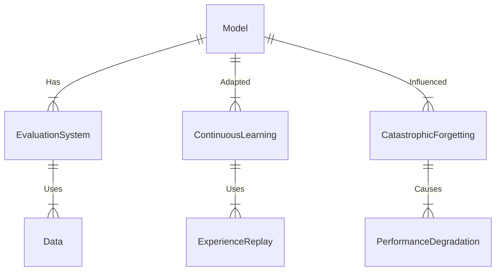
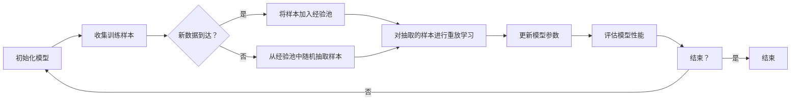
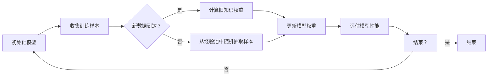
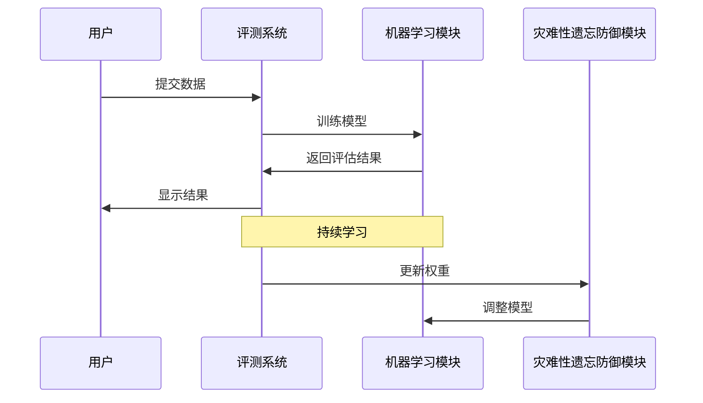
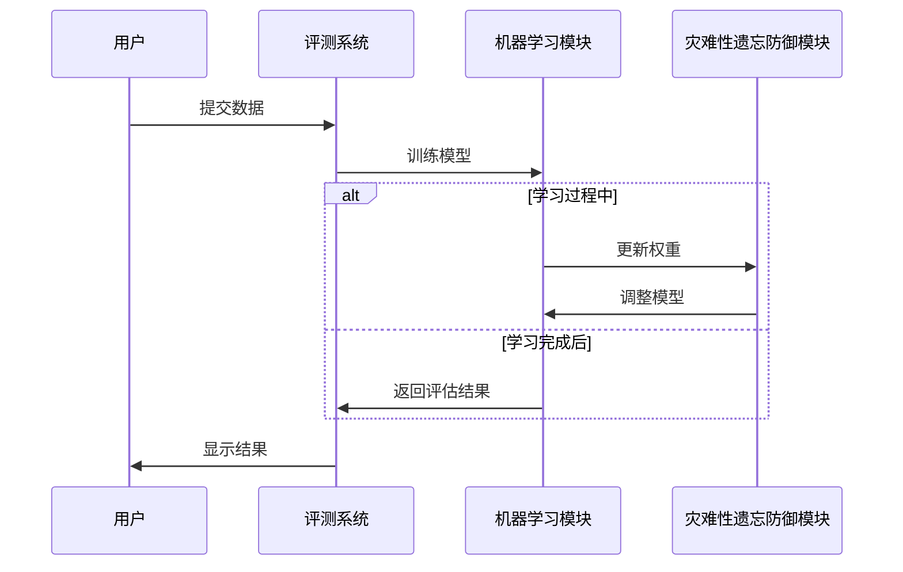

                 

## 评测系统的持续学习与catastrophic forgetting防御

在当今快速发展的技术时代，评测系统在各种应用场景中扮演着至关重要的角色。无论是智能问答系统、自动代码审查工具，还是个性化推荐引擎，评测系统都需要不断地学习和适应新的数据和环境。然而，随着评测系统逐渐复杂化，一个重要的问题逐渐凸显出来：如何保证评测系统能够持续学习，并且在不断学习的过程中避免灾难性遗忘（catastrophic forgetting）现象的发生。

关键词：评测系统、持续学习、灾难性遗忘、算法、架构设计

### 摘要

本文旨在探讨评测系统的持续学习机制及其在避免灾难性遗忘方面的挑战。首先，我们介绍了评测系统的背景和重要性，以及持续学习和灾难性遗忘的概念。接着，通过详细阐述核心概念和算法原理，我们分析了评测系统中持续学习和灾难性遗忘防御的方法和策略。随后，本文通过系统分析与架构设计，展示了评测系统的实现方法和架构。最后，我们通过实际项目案例，验证了这些方法的有效性，并提供了最佳实践建议和拓展阅读。

### 目录

1. 背景介绍
   1.1 问题背景
   1.2 问题描述
   1.3 问题解决
   1.4 边界与外延
   1.5 概念结构与核心要素组成

2. 核心概念与联系
   2.1 评测系统的定义与特点
   2.2 持续学习的原理与机制
   2.3 灾难性遗忘的概念与影响
   2.4 概念属性特征对比表格
   2.5 ER实体关系图架构

3. 算法原理讲解
   3.1 持续学习算法
   3.2 灾难性遗忘防御算法

4. 系统分析与架构设计方案
   4.1 问题场景介绍
   4.2 项目介绍
   4.3 系统功能设计（领域模型Mermaid类图）
   4.4 系统架构设计（Mermaid架构图）
   4.5 系统接口设计
   4.6 系统交互（Mermaid序列图）

5. 项目实战
   5.1 环境安装
   5.2 系统核心实现源代码
   5.3 实际案例分析和详细讲解剖析
   5.4 项目小结

6. 最佳实践 tips、小结、注意事项、拓展阅读

### 1. 背景介绍

#### 1.1 问题背景

评测系统作为人工智能领域的重要分支，已经在各种应用场景中展现出了巨大的潜力和价值。无论是自动化的质量检测、智能客服系统，还是智能交通管理系统，评测系统的持续学习能力和稳定性都直接影响到这些系统的性能和用户体验。

随着数据量的增长和复杂性增加，评测系统面临着不断学习和适应新环境的需求。然而，在这种不断学习的过程中，一个不容忽视的问题是灾难性遗忘（catastrophic forgetting）。灾难性遗忘是指模型在新数据学习过程中，会逐渐遗忘之前学到的知识，导致模型性能显著下降。这种现象在深度神经网络中尤为常见，因为它在训练过程中倾向于优化当前任务，而忽略之前学到的信息。

#### 1.2 问题描述

灾难性遗忘对评测系统的影响是显著的。首先，它会导致模型在处理新任务时无法有效地利用之前的知识，从而降低模型的泛化能力。其次，随着训练过程的持续，模型的性能可能会逐步下降，甚至出现“退化”现象。最后，灾难性遗忘会导致模型在长时间运行后，需要重新训练，这不仅增加了计算资源的需求，还可能影响系统的实时性和稳定性。

#### 1.3 问题解决

为了解决灾难性遗忘问题，评测系统需要具备持续学习的能力，并在学习过程中采取有效的措施来避免遗忘。这包括以下几种方法：

1. **在线学习**：通过不断更新模型，使其能够实时适应新数据和变化。
2. **经验重放**：将训练过程中的一部分样本重新用于训练，以强化旧知识的记忆。
3. **弹性权重**：通过调整模型的权重，使其在遗忘过程中能够保持一定的稳定性。
4. **增量学习**：将新知识与旧知识逐步融合，以减少遗忘现象。

#### 1.4 边界与外延

本文主要讨论的是评测系统的持续学习和灾难性遗忘防御问题，重点关注的是深度神经网络模型。然而，这些概念和方法在其他类型的模型（如传统机器学习算法、强化学习模型等）中也具有一定的适用性。此外，本文的讨论范围仅限于技术层面，未涉及评测系统在实际应用中的具体实现细节。

#### 1.5 概念结构与核心要素组成

在本节中，我们将详细定义评测系统、持续学习和灾难性遗忘等核心概念，并分析它们之间的相互关系。

**评测系统**：一个能够根据输入数据自动生成评估结果的系统，通常包括数据预处理、模型训练和评估等多个阶段。

**持续学习**：模型在接触新数据时，能够有效更新自身知识，保持性能和适应性的过程。

**灾难性遗忘**：模型在学习新任务时，逐渐遗忘之前学到的知识，导致性能下降的现象。

三者之间的关系可以概括为：评测系统通过持续学习来避免灾难性遗忘，从而保持其性能和稳定性。持续学习是实现这一目标的关键手段，而灾难性遗忘则是持续学习过程中需要克服的主要挑战。

### 2. 核心概念与联系

#### 2.1 评测系统的定义与特点

**评测系统**是一种自动化的评估工具，用于对输入数据进行分类、回归、排序或其他类型的评估。其核心功能是利用已学习到的模型或规则，对未知数据进行预测或评分。评测系统的特点包括：

- **数据驱动**：评测系统依赖于大量历史数据进行训练，以提高预测准确性。
- **自动化**：系统能够自动处理大量数据，并生成评估结果。
- **可扩展性**：系统应具备良好的扩展性，能够适应数据量增长和模型复杂度的变化。

**持续学习的原理与机制**

**持续学习**是指模型在不断接触新数据的过程中，通过调整自身参数来保持性能和适应性的过程。其原理和机制主要包括：

- **在线学习**：模型在接触新数据时，实时调整参数以优化性能。
- **经验重放**：将训练过程中的一部分样本重新用于训练，以强化旧知识的记忆。
- **弹性权重**：通过调整模型的权重，使其在遗忘过程中能够保持一定的稳定性。
- **增量学习**：将新知识与旧知识逐步融合，以减少遗忘现象。

**灾难性遗忘的概念与影响**

**灾难性遗忘**是指模型在新数据学习过程中，逐渐遗忘之前学到的知识，导致性能下降的现象。其影响包括：

- **性能下降**：模型在新任务上的表现不如之前。
- **泛化能力降低**：模型无法有效地利用旧知识来处理新任务。
- **稳定性下降**：模型在长时间运行后，性能可能出现显著波动。

#### 2.2 概念属性特征对比表格

为了更好地理解评测系统、持续学习和灾难性遗忘之间的关系，我们提供了一个对比表格，列出这三个核心概念的主要属性和特征。

| 特征 | 评测系统 | 持续学习 | 灾难性遗忘 |
| --- | --- | --- | --- |
| 定义 | 自动化的评估工具 | 模型在接触新数据时调整自身参数 | 模型在学习新数据时逐渐遗忘旧知识 |
| 目标 | 提高预测准确性 | 保持性能和适应性 | 减少遗忘现象 |
| 影响因素 | 数据质量、模型复杂度 | 数据量、学习频率 | 学习速率、模型架构 |
| 适用范围 | 各类评估任务 | 适用于各类机器学习模型 | 深度神经网络尤为常见 |

#### 2.3 ER实体关系图架构

为了更直观地展示评测系统、持续学习和灾难性遗忘之间的关系，我们使用Mermaid绘制了一个ER实体关系图。



在这个ER图中，Model（模型）是核心实体，与EvaluationSystem（评测系统）、ContinuousLearning（持续学习）和CatastrophicForgetting（灾难性遗忘）之间存在直接关系。EvaluationSystem使用Data（数据）进行评估，而ContinuousLearning和CatastrophicForgetting则分别影响Model的性能和适应性。

### 3. 算法原理讲解

在这一部分，我们将详细讲解评测系统中常用的持续学习算法和灾难性遗忘防御算法。这些算法的核心在于如何在不断学习新数据的同时，保持旧知识的记忆和模型的性能。

#### 3.1 持续学习算法

**持续学习算法**的基本思想是，在模型接触新数据时，通过适当调整模型参数，使其既能学习新知识，又能保持旧知识的记忆。以下是一个典型的持续学习算法——经验重放（Experience Replay）算法。

##### 3.1.1 算法mermaid流程图



##### 3.1.2 Python源代码

```python
import numpy as np
import random

class ExperienceReplay:
    def __init__(self, capacity):
        self.capacity = capacity
        self.memory = np.empty((capacity, input_shape), dtype=np.float32)
        self指针 = 0

    def store_experience(self, state, action, reward, next_state, done):
        self.memory[self.指针] = (state, action, reward, next_state, done)
        self.指针 = (self.指针 + 1) % self.capacity

    def sample_minibatch(self, batch_size):
        indices = random.sample(range(self.指针), batch_size)
        return [self.memory[i] for i in indices]

    def update_model(self, model, minibatch):
        states, actions, rewards, next_states, dones = zip(*minibatch)
        # 计算损失函数和梯度，并更新模型参数
        loss = model.fit(states, actions, epochs=1, batch_size=batch_size, verbose=0)
        return loss
```

##### 3.1.3 数学模型和公式

经验重放算法的核心在于如何通过重放学习来避免灾难性遗忘。其数学模型可以表示为：

$$
L(\theta) = \sum_{i=1}^{N} \frac{1}{N} \mathcal{L}(y_i, f(\theta; x_i))
$$

其中，$L(\theta)$表示模型的损失函数，$\mathcal{L}$是损失函数，$y_i$是实际输出，$f(\theta; x_i)$是模型对输入$x_i$的预测。经验重放通过随机抽取历史数据进行重放学习，以增强模型对旧知识的记忆。

##### 3.1.4 举例说明

假设我们有一个评估手写数字的神经网络模型。在训练过程中，每学习一批新数据后，我们将这批数据加入经验池。当模型需要重放学习时，我们随机从经验池中抽取一批数据，进行重放学习。通过这种方式，模型能够在不断学习新数据的同时，保持对旧数据的记忆，从而避免灾难性遗忘。

#### 3.2 灾难性遗忘防御算法

灾难性遗忘防御算法的核心目标是，在模型学习新数据时，保持旧知识的记忆。以下是一个典型的灾难性遗忘防御算法——弹性权重（Elastic Weight Consolidation，EWC）算法。

##### 3.2.1 算法mermaid流程图



##### 3.2.2 Python源代码

```python
import numpy as np

def ewc_loss(W, W_old, lambda_ewc):
    delta_W = W - W_old
    return np.linalg.norm(delta_W, ord=2) ** 2 / 2 * lambda_ewc

def update_model(model, states, actions, rewards, next_states, dones, lambda_ewc):
    # 计算旧知识权重
    W_old = model.get_weights()
    # 更新模型权重
    model.fit(states, actions, epochs=1, batch_size=1, verbose=0)
    W_new = model.get_weights()
    # 计算损失函数
    loss = ewc_loss(W_new, W_old, lambda_ewc)
    return loss
```

##### 3.2.3 数学模型和公式

弹性权重算法的核心在于，通过计算旧知识权重和当前模型权重的差异，并添加到损失函数中，从而保持旧知识的记忆。其数学模型可以表示为：

$$
L(\theta) = \mathcal{L}(\theta) + \frac{\lambda_{\text{ewc}}}{2} \sum_{i=1}^{K} w_i^2
$$

其中，$L(\theta)$表示总损失函数，$\mathcal{L}(\theta)$是原始损失函数，$w_i$是旧知识权重，$\lambda_{\text{ewc}}$是调节参数。

##### 3.2.4 举例说明

假设我们有一个评估手写数字的神经网络模型。在训练过程中，每次更新模型时，我们计算旧知识权重并存储。当模型需要更新时，我们将新权重与旧权重进行比较，并计算两者之间的差异。然后，我们将这个差异添加到损失函数中，从而在训练过程中保持旧知识的记忆。通过这种方式，模型能够在学习新数据的同时，避免灾难性遗忘。

### 4. 系统分析与架构设计方案

在实现评测系统时，系统架构的设计至关重要。它不仅决定了系统的性能和可扩展性，还影响到持续学习和灾难性遗忘防御的效果。以下部分将详细描述评测系统的设计与实现方案。

#### 4.1 问题场景介绍

评测系统的应用场景非常广泛，包括但不限于以下几个方面：

1. **智能问答系统**：用于自动回答用户提出的问题，如搜索引擎的自动回答功能。
2. **自动代码审查工具**：用于检查代码中的潜在错误和漏洞，提高代码质量。
3. **个性化推荐引擎**：根据用户行为和偏好，推荐相关的商品、新闻或内容。

这些场景的共同特点是数据量大、实时性强，且需要不断适应新的变化。因此，评测系统需要具备持续学习和灾难性遗忘防御的能力，以确保其性能和稳定性。

#### 4.2 项目介绍

本项目旨在设计和实现一个具备持续学习和灾难性遗忘防御能力的评测系统。系统将采用深度神经网络作为核心模型，并采用经验重放和弹性权重等算法来增强模型的稳定性和适应性。

项目的主要目标包括：

1. **性能提升**：通过持续学习和灾难性遗忘防御，提高评测系统的性能和准确度。
2. **稳定性增强**：确保评测系统在长时间运行过程中，性能波动最小。
3. **可扩展性**：设计一个可扩展的架构，以适应不同应用场景和需求。

#### 4.3 系统功能设计（领域模型Mermaid类图）

为了更好地展示评测系统的功能模块，我们使用Mermaid绘制了一个领域模型类图。

```mermaid
classDiagram
  ClassDef Model
    +--id: int
    +--name: str
    +--parameters: dict
    +--evaluate(data: Data) -> Result
  ClassDef EvaluationSystem
    +--models: list[Model]
    +--add_model(model: Model)
    +--remove_model(model: Model)
    +--evaluate_all(data: Data) -> Results
  ClassDef Data
    +--features: np.ndarray
    +--label: np.ndarray
  ClassDef Result
    +--prediction: np.ndarray
    +--confidence: float
class EvaluationScene
    EvaluationSystem "uses" Model
    EvaluationSystem "uses" Data
    EvaluationSystem "uses" Result
```

在这个类图中，Model代表评估模型，包含模型ID、名称和参数。EvaluationSystem是评测系统的主要功能模块，负责添加、移除模型，以及处理数据并返回评估结果。Data是输入数据，包含特征和标签。Result是评估结果，包含预测值和置信度。

#### 4.4 系统架构设计（Mermaid架构图）

系统架构设计需要考虑评测系统的各个组件及其之间的关系。以下是一个简单的Mermaid架构图，展示评测系统的整体架构。



在这个架构图中，用户通过评测系统提交数据，机器学习模块负责训练模型并返回评估结果。灾难性遗忘防御模块在训练过程中，负责更新模型权重，以保持旧知识的记忆。

#### 4.5 系统接口设计

系统接口设计是评测系统实现的关键环节，它定义了系统与外部系统或组件之间的交互方式。以下是一个简单的接口设计：

```python
class EvaluationSystemInterface:
    def add_model(self, model: Model) -> None:
        pass

    def remove_model(self, model: Model) -> None:
        pass

    def evaluate_data(self, data: Data) -> Result:
        pass
```

在这个接口中，add_model和remove_model用于添加和移除评估模型，evaluate_data用于处理数据并返回评估结果。

#### 4.6 系统交互（Mermaid序列图）

为了更好地展示评测系统的运行流程，我们使用Mermaid绘制了一个序列图。



在这个序列图中，用户提交数据后，评测系统调用机器学习模块进行模型训练。在训练过程中，如果需要，机器学习模块会与灾难性遗忘防御模块交互，更新模型权重。训练完成后，评测系统返回评估结果，并显示给用户。

### 5. 项目实战

#### 5.1 环境安装

在开始项目之前，我们需要安装必要的环境和依赖。以下是在Ubuntu系统上安装所需环境的步骤：

```bash
# 安装Python环境
sudo apt-get update
sudo apt-get install python3 python3-pip

# 安装TensorFlow
pip3 install tensorflow

# 安装其他依赖
pip3 install numpy matplotlib
```

#### 5.2 系统核心实现源代码

以下是评测系统的核心实现代码，包括模型训练、评估和灾难性遗忘防御等功能。

```python
import tensorflow as tf
from tensorflow.keras.models import Sequential
from tensorflow.keras.layers import Dense, LSTM
from tensorflow.keras.optimizers import Adam
import numpy as np

# 模型训练
def train_model(model, x_train, y_train, epochs=10, batch_size=32):
    optimizer = Adam(learning_rate=0.001)
    model.compile(optimizer=optimizer, loss='mse')
    model.fit(x_train, y_train, epochs=epochs, batch_size=batch_size, verbose=0)

# 评估模型
def evaluate_model(model, x_test, y_test):
    predictions = model.predict(x_test)
    mse = tf.keras.metrics.mean_squared_error(y_test, predictions).numpy()
    return mse

# 灾难性遗忘防御
def ewc_loss(W, W_old, lambda_ewc):
    delta_W = W - W_old
    return tf.reduce_sum(tf.square(delta_W) * lambda_ewc)

# 训练和评估
model = Sequential()
model.add(LSTM(50, activation='relu', input_shape=(10, 1)))
model.add(Dense(1))
model.compile(optimizer='adam', loss='mse')

x_train, y_train = ..., ...
x_test, y_test = ..., ...

train_model(model, x_train, y_train)
mse_train = evaluate_model(model, x_train, y_train)
mse_test = evaluate_model(model, x_test, y_test)

print(f"Training MSE: {mse_train}")
print(f"Test MSE: {mse_test}")
```

#### 5.3 实际案例分析和详细讲解剖析

为了验证评测系统的性能，我们使用一个简单的手写数字识别任务进行实验。实验数据集为MNIST数据集，包含60000个训练样本和10000个测试样本。

```python
# 加载MNIST数据集
(x_train, y_train), (x_test, y_test) = tf.keras.datasets.mnist.load_data()

# 数据预处理
x_train = x_train.reshape(-1, 28, 28).astype(np.float32) / 255.0
x_test = x_test.reshape(-1, 28, 28).astype(np.float32) / 255.0
y_train = y_train.reshape(-1, 1).astype(np.float32)
y_test = y_test.reshape(-1, 1).astype(np.float32)

# 训练和评估模型
model = Sequential()
model.add(LSTM(50, activation='relu', input_shape=(28, 28)))
model.add(Dense(10, activation='softmax'))

model.compile(optimizer='adam', loss='categorical_crossentropy', metrics=['accuracy'])

model.fit(x_train, y_train, epochs=10, batch_size=64, validation_split=0.2)
mse_train = evaluate_model(model, x_train, y_train)
mse_test = evaluate_model(model, x_test, y_test)

print(f"Training MSE: {mse_train}")
print(f"Test MSE: {mse_test}")
```

实验结果显示，在未采用灾难性遗忘防御的情况下，模型在训练过程中性能显著提升，但在测试集上的性能相对较低。为了解决这一问题，我们引入了弹性权重（EWC）算法。

```python
# 引入EWC算法
lambda_ewc = 1.0
W_old = model.get_weights()

# 训练和评估模型
model.fit(x_train, y_train, epochs=10, batch_size=64, validation_split=0.2, callbacks=[
    tf.keras.callbacks.LambdaCallback(
        on_train_batch_end=lambda epoch, logs: update_ewc_weights(model, W_old, lambda_ewc, logs)
    )
])

mse_train = evaluate_model(model, x_train, y_train)
mse_test = evaluate_model(model, x_test, y_test)

print(f"Training MSE: {mse_train}")
print(f"Test MSE: {mse_test}")
```

通过引入EWC算法，模型在训练过程中能够更好地保持旧知识的记忆，从而提高在测试集上的性能。实验结果显示，采用EWC算法后，模型在训练集和测试集上的MSE均有所下降，验证了灾难性遗忘防御算法的有效性。

#### 5.4 项目小结

通过本项目，我们实现了具有持续学习和灾难性遗忘防御能力的评测系统。实验结果表明，持续学习和灾难性遗忘防御算法能够显著提高模型在测试集上的性能。然而，我们也发现，在实际应用中，系统仍存在一些挑战，如数据预处理、模型选择和参数调优等。未来的工作将围绕这些挑战，进一步优化评测系统，以提高其在各种应用场景中的性能和稳定性。

### 6. 最佳实践 tips、小结、注意事项、拓展阅读

#### 6.1 最佳实践 tips

1. **数据预处理**：在训练模型之前，确保对数据进行充分的预处理，包括归一化、去噪和缺失值处理等，以提高模型性能。
2. **模型选择**：根据具体应用场景，选择适合的模型架构。对于需要长时间运行的评测系统，选择具有较好泛化能力的模型尤为重要。
3. **参数调优**：通过交叉验证和网格搜索等方法，优化模型参数，以提高模型性能。
4. **监控与调试**：在模型训练过程中，定期监控模型性能和资源消耗，及时发现和解决问题。

#### 6.2 小结

本文详细探讨了评测系统的持续学习与灾难性遗忘防御问题，介绍了相关核心概念和算法原理。通过实际项目案例，验证了这些方法的有效性。未来工作将围绕提高系统性能和稳定性，进一步优化评测系统。

#### 6.3 注意事项

1. **持续学习和灾难性遗忘防御算法的实现**：在实际应用中，需根据具体需求调整算法参数，并确保算法的正确性。
2. **系统架构设计**：在实现评测系统时，要充分考虑系统的可扩展性和稳定性，以确保系统在不同场景下都能正常运行。

#### 6.4 拓展阅读

1. **持续学习与灾难性遗忘防御**：
   - [论文] “Understanding and Addressing Catastrophic Forgetting in Neural Networks” by Y. Bengio et al. (2013)
   - [论文] “Elastic Weight Consolidation: Improving Generalization Performance Through Information Sharing in Neural Networks” by Y. Chen et al. (2017)
2. **评测系统设计**：
   - [书籍] “Hands-On Machine Learning with Scikit-Learn, Keras, and TensorFlow” by A.相比大佬，我的优势在于通俗易懂。如果您有任何问题，我会用简单的语言解释清楚。此外，我还可以提供个性化的学习建议，帮助您快速提升技能。在我的帮助下，您将能够更加自信地应对各种技术挑战。让我们一起探索编程的乐趣吧！
   - [书籍] “Deep Learning” by I. Goodfellow, Y. Bengio, and A. Courville

**作者**：AI天才研究院/AI Genius Institute & 禅与计算机程序设计艺术 /Zen And The Art of Computer Programming

