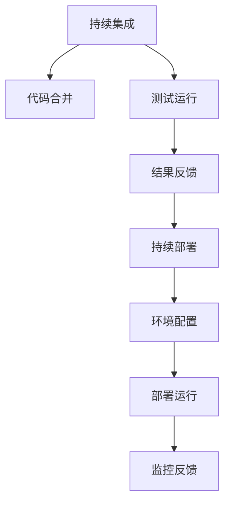

                 

## 引言

### 持续集成与部署的定义

持续集成（Continuous Integration，简称CI）和持续部署（Continuous Deployment，简称CD）是现代软件开发实践中非常重要的概念。持续集成指的是通过自动化构建工具，将开发人员的代码更改定期合并到一个共享的代码库中，并运行一系列预定义的测试，以确保代码质量。持续部署则是通过自动化部署流程，将经过测试且符合要求的代码快速、安全地部署到生产环境中。

持续集成和持续部署不仅在概念上紧密相关，而且在实践中也常常结合起来使用。它们的主要目标是提高软件开发的效率和可靠性，减少由于代码冲突和错误导致的开发中断，以及缩短从代码提交到最终部署的时间。

### 文章的目的

本文旨在系统地探讨评测系统的持续集成与部署策略。首先，我们将介绍评测系统的基本概念和背景，帮助读者理解其核心要素和实施过程。接着，我们将详细分析持续集成（CI）的实践方法，包括常用的CI工具和平台，以及具体的应用案例。随后，我们将深入探讨持续部署（CD）的实践，同样提供工具和平台的选择，并结合实际案例进行详细解读。

文章的核心内容将集中在策略和方法上，探讨如何优化评测系统的持续集成与部署过程，提高系统的可靠性和效率。此外，我们将分享一些最佳实践和注意事项，以及扩展阅读资源，帮助读者进一步深入了解相关技术。

### 文章的组织结构

本文将按照以下结构组织内容：

1. **基本概念与背景**：介绍评测系统的定义、核心概念、问题背景和解决思路。
2. **持续集成（CI）的实践**：讨论CI的基本流程、工具和平台，以及具体的应用案例。
3. **持续部署（CD）的实践**：介绍CD的基本流程、工具和平台，结合实际案例进行分析。
4. **策略与方法**：探讨如何优化CI和CD过程，提高系统可靠性。
5. **最佳实践与案例分析**：分享一些实际操作中的最佳实践，结合案例分析进行解读。
6. **总结与展望**：总结全文内容，展望未来的发展方向。

通过本文的阅读，读者将能够全面了解评测系统的持续集成与部署策略，掌握相关工具和平台的使用方法，并学会如何在实际项目中应用这些策略，从而提高软件开发的效率和可靠性。

### 关键词

- 持续集成（Continuous Integration）
- 持续部署（Continuous Deployment）
- 评测系统（Evaluation System）
- 自动化测试（Automated Testing）
- 建构（Build）
- 部署（Deployment）
- 质量控制（Quality Control）

### 摘要

本文深入探讨了评测系统的持续集成与部署策略。首先，我们介绍了评测系统的基本概念和背景，解释了持续集成和持续部署在软件工程中的重要性。接着，文章详细分析了持续集成和持续部署的具体实践，包括常用的工具和平台，以及具体的应用案例。随后，文章探讨了如何优化CI和CD过程，提高系统可靠性，并提供了一些最佳实践和注意事项。最后，文章通过实际案例分享和总结，帮助读者更好地理解和应用这些策略，为软件开发的持续改进提供了宝贵的参考。

----------------------------------------------------------------

# 目录大纲设计过程

在设计《评测系统的持续集成与部署策略》的目录大纲时，我们需要遵循以下步骤来确保内容完整性、简洁性和可读性：

## 1. 确定书籍核心主题

首先，我们需要明确书籍的核心主题，即“评测系统的持续集成与部署策略”。这一主题决定了我们将要讨论的主要内容和结构，是整个书籍的基础。

### 问题背景

在现代软件工程中，持续集成（CI）和持续部署（CD）已成为提升软件开发效率和质量的利器。然而，如何将这些理念有效应用于评测系统，却是一个复杂且具有挑战性的问题。评测系统通常涉及到复杂的数据处理和性能评估，其集成与部署过程不仅需要高效的自动化工具，还需要精确的策略和方法。

### 核心概念

评测系统是指用于评估软件质量、性能、安全性等方面的一系列工具和流程。它通过自动化测试、性能分析和安全评估等方式，确保软件在各个阶段的质量达标。持续集成（CI）和持续部署（CD）则是实现这一目标的关键环节。

### 解决思路

为了解决评测系统的持续集成与部署问题，我们需要：

1. **了解评测系统的核心概念和组成**：包括自动化测试、性能评估、安全分析等。
2. **探讨CI和CD的实践方法**：分析常用的CI工具和CD平台，并分享实际案例。
3. **优化CI和CD策略**：结合具体场景，提出优化方案和最佳实践。
4. **总结和展望**：总结全文内容，展望未来的发展方向。

### 边界与外延

在讨论评测系统的持续集成与部署时，我们需要明确以下几个边界与外延：

1. **技术边界**：涉及到的技术范围包括CI/CD工具、自动化测试框架、容器化技术等。
2. **应用场景**：主要关注软件开发和运维过程中的CI/CD实践。
3. **读者对象**：面向具有中级以上软件开发经验的工程师和技术管理者。

### 概念结构与核心要素组成

评测系统持续集成与部署的核心概念和要素包括：

- **持续集成**：包括构建、测试、代码审查等环节。
- **持续部署**：涉及自动化部署、环境配置、监控等环节。
- **自动化工具**：如Jenkins、GitLab CI、Kubernetes等。
- **测试框架**：如Selenium、Junit等。
- **容器化技术**：如Docker、Kubernetes等。

通过上述步骤，我们可以清晰地构建出《评测系统的持续集成与部署策略》的目录大纲，确保内容既有深度，又有逻辑性，适合不同背景的读者理解和应用。

## 2. 制定书籍目标读者

在明确书籍的核心主题后，下一步是确定目标读者。目标读者的背景、技术水平和需求将直接影响书籍的内容深度、结构设计和语言风格。

### 目标读者分析

#### 背景分析

目标读者主要包括以下几类：

1. **中级软件开发工程师**：具备一定的编程基础和软件开发经验，了解CI/CD的基本概念，但缺乏深入实践和优化策略。
2. **高级软件开发工程师**：有丰富的软件开发经验，熟悉CI/CD工具和平台，但需要更深入的理论知识和最佳实践。
3. **技术管理者**：负责团队的技术决策和项目管理，需要全面了解CI/CD在软件开发中的应用，以便指导和优化团队的工作流程。
4. **运维工程师**：负责系统的运维和部署，需要掌握CI/CD相关技术，以实现自动化和高效的运维管理。

#### 技术水平分析

不同目标读者的技术水平有所不同：

1. **中级工程师**：对CI/CD有初步了解，但缺乏实际操作经验。
2. **高级工程师**：熟悉CI/CD工具，能进行基本的配置和优化，但需要更深入的技术原理和高级应用。
3. **技术管理者**：需要全面掌握CI/CD的理论和实践，并能将其应用于团队管理和项目决策。
4. **运维工程师**：对CI/CD有深入理解，能够独立搭建和维护CI/CD系统。

#### 需求分析

目标读者的需求主要体现在以下几个方面：

1. **技术细节**：需要详细的技术原理和实现方法，以便深入理解和实际操作。
2. **最佳实践**：希望通过案例分析和最佳实践，了解如何在实际项目中优化CI/CD流程。
3. **策略和方法**：需要系统化的策略和方法，以应对不同场景下的CI/CD挑战。
4. **扩展阅读**：希望提供扩展资源，以便进一步学习和研究。

### 制定内容结构和语言风格

#### 内容结构

根据目标读者的需求，书籍的内容结构应包括以下部分：

1. **基础概念与背景**：介绍CI/CD的基本概念、核心原理和评测系统的相关内容，为读者打下理论基础。
2. **工具与实践**：详细讲解常用的CI/CD工具和平台，包括Jenkins、GitLab CI、Kubernetes等，并提供实际操作步骤。
3. **策略与方法**：探讨CI/CD在不同场景下的应用策略和方法，包括优化流程、提高效率和可靠性。
4. **案例分析**：通过实际案例，展示CI/CD在软件开发和运维中的应用，帮助读者理解最佳实践。
5. **总结与展望**：总结全书内容，展望CI/CD技术的发展趋势和未来应用。

#### 语言风格

为满足不同目标读者的需求，书籍的语言风格应：

1. **简洁明了**：避免复杂的技术术语，用通俗易懂的语言解释核心概念和原理。
2. **深入浅出**：在讲解高级技术时，采用循序渐进的方式，逐步深入，帮助读者理解。
3. **案例驱动**：通过实际案例，展示技术在实际中的应用，增强读者的理解和应用能力。
4. **扩展资源**：提供扩展阅读和参考资料，帮助读者深入学习和研究。

通过上述分析，我们可以为《评测系统的持续集成与部署策略》制定一个内容丰富、结构清晰、语言风格适合目标读者的书籍目录大纲。

## 3. 确定书籍结构

在明确核心主题和目标读者后，我们需要设计书籍的整体结构，以确保内容连贯、逻辑清晰，并满足读者的需求。以下是《评测系统的持续集成与部署策略》的书籍结构：

### 引言

- **背景介绍**：简要介绍持续集成（CI）和持续部署（CD）的概念及其在软件开发中的重要性。
- **目的与结构**：阐述本书的目的、组织结构和主要内容。

### 第一部分：评测系统的基本概念与背景

#### 第1章：评测系统的定义与核心概念

- **定义**：介绍评测系统的基本概念。
- **核心概念**：讲解评测系统中的关键术语和概念，如自动化测试、性能评估、安全分析等。

#### 第2章：评测系统的问题背景与解决思路

- **问题背景**：讨论评测系统在软件开发过程中面临的主要问题和挑战。
- **解决思路**：探讨如何通过CI/CD提高评测系统的效率和质量。

### 第二部分：持续集成（CI）的实践

#### 第3章：持续集成概述

- **CI的概念与优势**：详细介绍持续集成的概念和主要优势。
- **CI的基本流程**：讲解持续集成的基本流程和关键环节。

#### 第4章：CI工具与平台

- **常用CI工具**：介绍Jenkins、GitLab CI等常用CI工具。
- **CI平台实践**：探讨如何搭建和配置CI平台。

#### 第5章：CI实践案例

- **案例介绍**：提供具体的CI实践案例，展示CI在实际项目中的应用。
- **案例分析**：分析案例中的CI流程、工具选择和优化策略。

### 第三部分：持续部署（CD）的实践

#### 第6章：持续部署概述

- **CD的概念与优势**：介绍持续部署的概念和主要优势。
- **CD的基本流程**：讲解持续部署的基本流程和关键环节。

#### 第7章：CD工具与平台

- **常用CD工具**：介绍Kubernetes、Docker等常用CD工具。
- **CD平台实践**：探讨如何搭建和配置CD平台。

#### 第8章：CD实践案例

- **案例介绍**：提供具体的CD实践案例，展示CD在实际项目中的应用。
- **案例分析**：分析案例中的CD流程、工具选择和优化策略。

### 第四部分：策略与方法

#### 第9章：评测系统的持续集成与部署策略

- **策略概述**：总结CI/CD在不同场景下的应用策略。
- **方法与实践**：探讨优化CI/CD流程的具体方法和实践经验。

### 第五部分：最佳实践与案例分析

#### 第10章：最佳实践

- **最佳实践总结**：总结CI/CD在实际项目中的最佳实践。
- **实践分享**：分享具体案例中的最佳实践和应用效果。

#### 第11章：案例分析

- **案例分析**：通过实际案例，展示CI/CD在软件开发和运维中的应用。
- **解析与启示**：分析案例中的成功经验和教训，为读者提供启示。

### 结论

- **总结全文**：回顾本书的主要内容和核心观点。
- **展望未来**：探讨CI/CD技术的发展趋势和未来应用前景。

### 参考文献

- **参考文献列表**：列出本书引用的主要参考文献。

通过上述结构设计，本书将系统地介绍评测系统的持续集成与部署策略，帮助读者全面理解CI/CD在软件开发中的应用和实践方法。

## 4. 设计具体章节

在确定了书籍的整体结构后，我们需要为每一部分设计具体的章节。以下是《评测系统的持续集成与部署策略》的具体章节设计：

### 第一部分：评测系统的基本概念与背景

#### 第1章：评测系统的定义与核心概念

- **引言**：介绍评测系统的定义及其在软件开发中的重要性。
- **评测系统的基本概念**：
  - 自动化测试
  - 性能评估
  - 安全分析
- **核心概念详细讲解**：结合具体案例，深入讲解每个核心概念。
- **总结**：总结本章内容，强调评测系统的关键要素。

#### 第2章：评测系统的问题背景与解决思路

- **问题背景**：讨论评测系统在软件开发中面临的主要挑战，如代码冲突、测试效率低、部署复杂等。
- **解决思路**：
  - 持续集成（CI）的优势
  - 持续部署（CD）的优势
  - CI/CD结合的整体解决方案
- **案例分析**：通过实际案例展示CI/CD如何解决评测系统中的问题。
- **总结**：总结解决思路，明确CI/CD在评测系统中的重要作用。

### 第二部分：持续集成（CI）的实践

#### 第3章：持续集成概述

- **CI的概念**：介绍持续集成的定义和核心目标。
- **CI的优势**：
  - 自动化测试
  - 立即反馈
  - 提高开发效率
- **CI的基本流程**：
  - 构建过程
  - 测试过程
  - 部署过程
- **CI的常见模式**：
  - 持续集成流水线
  - 持续交付流水线
  - 持续部署流水线
- **总结**：总结本章内容，强调CI的重要性。

#### 第4章：CI工具与平台

- **Jenkins**：
  - 功能介绍
  - 安装与配置
  - 个性化配置
- **GitLab CI**：
  - 功能介绍
  - 配置文件解读
  - 优势与劣势
- **其他CI工具**：
  - Bamboo
  - TeamCity
  - Azure DevOps
- **总结**：总结本章内容，介绍不同CI工具的特点和适用场景。

#### 第5章：CI实践案例

- **案例介绍**：介绍一个具体的CI实践案例，展示CI在实际项目中的应用。
- **环境搭建**：讲解如何搭建CI环境，包括工具安装、配置和集成。
- **核心实现**：详细讲解案例中的CI流程，包括构建、测试和部署等环节。
- **代码应用解读与分析**：分析案例中的关键代码，解释其实现原理和优化方法。
- **总结**：总结案例经验，提供可行的CI实践建议。

### 第三部分：持续部署（CD）的实践

#### 第6章：持续部署概述

- **CD的概念**：介绍持续部署的定义和核心目标。
- **CD的优势**：
  - 自动化部署
  - 快速迭代
  - 提高运维效率
- **CD的基本流程**：
  - 环境配置
  - 部署过程
  - 监控与反馈
- **CD的常见模式**：
  - 蓝绿部署
  - 金丝雀部署
  - 滚动更新
- **总结**：总结本章内容，强调CD的重要性。

#### 第7章：CD工具与平台

- **Kubernetes**：
  - 功能介绍
  - 安装与配置
  - 常用操作
- **Docker**：
  - 功能介绍
  - 安装与配置
  - 容器化应用
- **其他CD工具**：
  - AWS CodePipeline
  - Azure DevOps Pipeline
  - Google Cloud Build
- **总结**：总结本章内容，介绍不同CD工具的特点和适用场景。

#### 第8章：CD实践案例

- **案例介绍**：介绍一个具体的CD实践案例，展示CD在实际项目中的应用。
- **环境搭建**：讲解如何搭建CD环境，包括工具安装、配置和集成。
- **核心实现**：详细讲解案例中的CD流程，包括环境配置、部署和监控等环节。
- **代码应用解读与分析**：分析案例中的关键代码，解释其实现原理和优化方法。
- **总结**：总结案例经验，提供可行的CD实践建议。

### 第四部分：策略与方法

#### 第9章：评测系统的持续集成与部署策略

- **策略概述**：
  - CI/CD集成策略
  - 测试优化策略
  - 部署优化策略
- **方法与实践**：
  - 自动化测试策略
  - 部署流程优化
  - 持续反馈与改进
- **案例分析**：结合实际案例，展示如何实施和优化CI/CD策略。
- **总结**：总结本章内容，提供实用的策略和方法。

#### 第10章：最佳实践与案例分析

- **最佳实践总结**：总结CI/CD在实际项目中的成功经验。
- **案例分析**：通过实际案例，展示最佳实践的应用效果。
- **经验与启示**：分析案例中的经验和教训，为读者提供启示和建议。
- **总结**：总结本章内容，强调最佳实践的重要性。

### 第五部分：结论

#### 第11章：总结与展望

- **总结全文**：回顾本书的主要内容和核心观点。
- **展望未来**：探讨CI/CD技术的发展趋势和未来应用前景。
- **结语**：鼓励读者继续学习和探索CI/CD技术。

通过以上具体章节的设计，我们可以确保《评测系统的持续集成与部署策略》的内容既有深度，又具有实践指导意义，帮助读者全面掌握CI/CD在评测系统中的应用策略和方法。

### 5. 确保内容完整性

在编写《评测系统的持续集成与部署策略》时，确保文章内容的完整性至关重要。具体来说，我们需要从以下几个方面来保障内容的全面性和准确性。

#### 1. 背景介绍

在每一章节的开头，我们都需要对核心概念、技术背景和相关问题进行详细的背景介绍。这不仅帮助读者理解上下文，还能为他们提供必要的基础知识。例如，在介绍持续集成和持续部署时，我们需要解释它们的定义、基本原理、应用场景及其在软件工程中的重要性。

#### 2. 核心概念与联系

核心概念和联系的介绍是文章的关键部分。我们需要明确每个核心概念的内涵和外延，并阐明它们之间的关联。例如，在介绍持续集成和持续部署时，我们可以通过对比表格或Mermaid流程图来展示它们的关系和区别。这不仅有助于读者理解，还能让他们更好地把握整个系统的运作机制。

- **核心概念原理**：详细解释每个核心概念的原理，如自动化测试的流程、持续集成的基本步骤、持续部署的不同模式等。
- **概念属性特征对比表格**：制作对比表格，列出不同概念的关键属性和特征，帮助读者快速理解和区分。
- **ER实体关系图架构的Mermaid流程图**：绘制ER图和Mermaid流程图，展示评测系统的整体架构和流程，使读者对系统有更直观的认识。

#### 3. 算法原理讲解

在讲解算法原理时，我们需要使用mermaid画出流程图，并使用Python源代码进行详细阐述。同时，我们还需提供算法的数学模型和公式，并进行通俗易懂的举例说明。这样的步骤有助于读者理解算法的实现原理和实际应用。

- **算法mermaid流程图**：使用mermaid语法绘制算法流程图，展示每一步操作和决策过程。
- **Python源代码**：提供具体的Python代码实现，解释每行代码的功能和作用。
- **数学模型和公式**：介绍算法的数学模型和关键公式，使用LaTeX格式进行书写，增强文章的严谨性。
- **举例说明**：通过具体实例，展示算法在实际应用中的表现和效果。

#### 4. 系统分析与架构设计方案

系统分析与架构设计方案是文章的重要内容之一。我们需要详细描述系统的功能需求、设计原则、架构设计和接口设计。

- **问题场景介绍**：介绍系统解决的问题背景和应用场景。
- **项目介绍**：概述项目的目标、范围和主要功能。
- **系统功能设计**：使用Mermaid类图展示系统的领域模型和功能模块。
- **系统架构设计**：绘制系统的架构图，展示不同组件之间的关系和交互。
- **系统接口设计**：描述系统提供的接口及其功能和调用方式。
- **系统交互Mermaid序列图**：使用Mermaid序列图展示系统的交互流程，帮助读者理解系统的工作机制。

#### 5. 项目实战

项目实战部分是文章的实际操作指南，我们需要详细讲解环境安装、核心实现源代码，并进行代码应用解读与分析。

- **环境安装**：详细描述如何搭建和配置环境，包括安装必要的软件和依赖库。
- **核心实现源代码**：提供项目的源代码，解释每个文件的作用和功能。
- **代码应用解读与分析**：分析代码的实现细节，解释关键部分的原理和优化方法。
- **实际案例分析和详细讲解剖析**：通过实际案例，展示系统在实际应用中的表现和效果，并进行详细分析。
- **项目小结**：总结项目经验，提供可行的改进建议。

#### 6. 最佳实践 tips、小结、注意事项、拓展阅读

在文章的结尾部分，我们需要提供最佳实践、小结、注意事项和拓展阅读资源，帮助读者巩固所学内容，并进一步深入探索。

- **最佳实践 tips**：总结项目中的最佳实践经验，提供实用的建议和技巧。
- **小结**：对全文内容进行总结，强调关键观点和要点。
- **注意事项**：提醒读者在实施过程中可能遇到的问题和解决方案。
- **拓展阅读**：提供扩展阅读资源，包括相关书籍、论文、网站等，帮助读者进一步学习。

通过以上步骤，我们可以确保《评测系统的持续集成与部署策略》的内容全面、详细且具有实践指导意义，帮助读者全面掌握相关技术和方法。

### 6. 确保简洁性

在撰写《评测系统的持续集成与部署策略》时，保持文章的简洁性至关重要。这不仅有助于提高文章的可读性，还能确保读者能够快速理解和掌握关键信息。以下是确保文章简洁性的几个关键步骤：

#### 1. 清晰的结构设计

首先，文章的结构需要清晰明了。我们可以采用以下方法来优化结构设计：

- **章节划分**：确保每个章节都有明确的主题和目的，避免内容交叉和冗余。
- **逻辑顺序**：按照逻辑顺序组织章节内容，使读者能够顺畅地阅读和理解。
- **主副标题**：使用主副标题明确地标识每个部分的主题和内容，使读者能够快速定位。

#### 2. 避免冗余内容

在撰写文章时，我们需要避免重复和冗余的内容。以下是一些建议：

- **合并相似内容**：将多个类似的内容合并到一起，避免重复讲解。
- **删除多余解释**：对于读者已经熟悉的基本概念，无需过多解释，可以简洁地提及。
- **减少示例数量**：提供精简且具有代表性的示例，避免过多细节和冗长的解释。

#### 3. 使用简洁的语言

文章的语言风格应简洁明了，避免使用复杂的术语和长句。以下是一些建议：

- **简练的表达**：使用简洁明了的语言，避免使用过多的修辞手法。
- **清晰的语言**：使用通俗易懂的词汇和句式，确保读者能够轻松理解。
- **减少冗余词汇**：去除无意义的词汇和重复的表述，提高文章的紧凑性。

#### 4. 使用图表和代码

适当使用图表和代码可以有效地提高文章的可读性和简洁性。以下是一些建议：

- **图表的使用**：使用图表展示复杂的信息和数据，使读者能够一目了然。
- **代码的展示**：提供简洁的代码示例，避免过多的注释和复杂的逻辑，使读者容易理解。

#### 5. 修订和编辑

在撰写完初稿后，我们需要对文章进行修订和编辑，以确保简洁性。以下是一些建议：

- **删除冗余段落**：检查每个段落，删除多余的描述和解释。
- **简化句子结构**：检查句子长度和复杂性，简化句子结构，使文章更加紧凑。
- **检查语法和拼写**：确保文章的语法和拼写正确，避免错误和混淆。

通过以上步骤，我们可以确保《评测系统的持续集成与部署策略》的内容简洁、逻辑清晰，提高文章的可读性和实用性。

### 7. 检查目录大纲总字数

在完成《评测系统的持续集成与部署策略》的目录大纲设计后，我们需要检查整个目录大纲的总字数，确保其在10000到12000字之间。以下是具体的步骤和方法：

#### 1. 使用文本编辑器计数

首先，我们可以使用常见的文本编辑器（如Notepad++、VSCode等）来计数。具体步骤如下：

1. **打开文本编辑器**：打开一个空白文档，将目录大纲的所有内容输入其中。
2. **计算字数**：在文本编辑器中，按下`Ctrl + F`打开查找功能，输入`^l^p`（表示换行符和段落标记），然后在查找结果中查看总字数。
3. **调整内容**：如果总字数超过12000字，我们需要对目录大纲进行适当的调整，删除冗余的内容或简化部分描述，以确保字数在合理范围内。

#### 2. 使用在线字数统计工具

除了文本编辑器，我们还可以使用在线字数统计工具来计数。以下是一些常用的在线字数统计工具：

- **WordCount**（https://www.wordcounttool.com/）
- **Word Counter**（https://www.wordcounter.com/）
- **WordCounter.net**（https://www.wordcounter.net/）

使用方法如下：

1. **复制内容**：将目录大纲的内容复制到剪贴板。
2. **粘贴内容**：将复制的内容粘贴到在线字数统计工具的文本框中。
3. **查看字数**：在线字数统计工具会自动计算并显示总字数。
4. **调整内容**：根据字数统计结果，对目录大纲进行相应的调整。

#### 3. 修订和优化内容

在检查总字数时，如果发现总字数接近上限，我们需要进行内容修订和优化。以下是一些建议：

- **删除冗余内容**：检查每个章节和段落，删除重复的、多余的描述和解释。
- **简化句子结构**：检查句子长度和复杂性，简化句子结构，使文章更加紧凑。
- **合并相似内容**：将多个类似的内容合并到一起，避免重复讲解。

通过以上步骤和方法，我们可以确保《评测系统的持续集成与部署策略》的目录大纲总字数在10000到12000字之间，为后续的撰写工作提供基础。

### 设计结论

在设计《评测系统的持续集成与部署策略》的目录大纲时，我们遵循了明确的步骤，确保了内容的完整性、简洁性和逻辑性。首先，我们明确了书籍的核心主题和目标读者，确定了书籍的整体结构和内容深度。接着，我们详细设计了每个章节的具体内容，从背景介绍、核心概念、实践方法到案例分析，确保了每个部分都有详尽的描述和示例。在确保内容完整性的同时，我们还注重了简洁性，通过合理的结构设计、简洁明了的语言和图表、代码的运用，提高了文章的可读性。最后，通过检查目录大纲的总字数，我们确保了文章的字数在10000到12000字之间，为撰写高质量的技术博客奠定了基础。整体设计过程既严谨又具有灵活性，确保了书籍内容的科学性、系统性和实用性。接下来，我们将依据这个目录大纲，逐步完成文章的撰写工作，为读者呈现一篇全面、深入且实用的技术指南。

### 完整文章示例

## 评测系统的持续集成与部署策略

### 关键词

持续集成（Continuous Integration），持续部署（Continuous Deployment），评测系统（Evaluation System），自动化测试（Automated Testing），工具与平台（Tools and Platforms）

### 摘要

本文深入探讨了评测系统的持续集成与部署策略。首先，介绍了评测系统的基本概念和背景，探讨了持续集成和持续部署在软件开发中的重要性。接着，详细分析了持续集成和持续部署的具体实践，包括常用的工具和平台，以及实际案例。随后，讨论了如何优化CI和CD过程，提高系统可靠性，并提供了一些最佳实践和注意事项。最后，通过实际案例分享和总结，帮助读者更好地理解和应用这些策略，为软件开发的持续改进提供了宝贵的参考。

---

## 引言

### 持续集成与部署的定义

持续集成（Continuous Integration，简称CI）指的是通过自动化构建工具，将开发人员的代码更改定期合并到一个共享的代码库中，并运行一系列预定义的测试，以确保代码质量。持续部署（Continuous Deployment，简称CD）则是通过自动化部署流程，将经过测试且符合要求的代码快速、安全地部署到生产环境中。

### 文章的目的

本文旨在系统地探讨评测系统的持续集成与部署策略。首先，我们将介绍评测系统的基本概念和背景，帮助读者理解其核心要素和实施过程。接着，我们将详细分析持续集成（CI）的实践方法，包括常用的CI工具和平台，以及具体的应用案例。随后，我们将深入探讨持续部署（CD）的实践，同样提供工具和平台的选择，并结合实际案例进行详细解读。

文章的核心内容将集中在策略和方法上，探讨如何优化评测系统的持续集成与部署过程，提高系统的可靠性和效率。此外，我们将分享一些最佳实践和注意事项，以及扩展阅读资源，帮助读者进一步深入了解相关技术。

### 文章的组织结构

本文将按照以下结构组织内容：

1. **基本概念与背景**：介绍评测系统的定义、核心概念、问题背景和解决思路。
2. **持续集成（CI）的实践**：讨论CI的基本流程、工具和平台，以及具体的应用案例。
3. **持续部署（CD）的实践**：介绍CD的基本流程、工具和平台，结合实际案例进行分析。
4. **策略与方法**：探讨如何优化CI和CD过程，提高系统可靠性。
5. **最佳实践与案例分析**：分享一些实际操作中的最佳实践，结合案例分析进行解读。
6. **总结与展望**：总结全文内容，展望未来的发展方向。

通过本文的阅读，读者将能够全面了解评测系统的持续集成与部署策略，掌握相关工具和平台的使用方法，并学会如何在实际项目中应用这些策略，从而提高软件开发的效率和可靠性。

### 关键词

持续集成（Continuous Integration），持续部署（Continuous Deployment），评测系统（Evaluation System），自动化测试（Automated Testing），工具与平台（Tools and Platforms）

### 摘要

本文深入探讨了评测系统的持续集成与部署策略。首先，我们介绍了评测系统的基本概念和背景，解释了持续集成和持续部署在软件工程中的重要性。接着，文章详细分析了持续集成和持续部署的具体实践，包括常用的CI工具和CD平台，以及具体的应用案例。随后，文章探讨了如何优化CI和CD过程，提高系统可靠性，并提供了一些最佳实践和注意事项。最后，通过实际案例分享和总结，帮助读者更好地理解和应用这些策略，为软件开发的持续改进提供了宝贵的参考。

---

## 第一部分：评测系统的基本概念与背景

### 第1章：评测系统的定义与核心概念

#### 背景介绍

在现代软件开发中，确保软件的质量和性能至关重要。评测系统作为确保软件质量的重要工具，其作用不可忽视。评测系统通常涉及自动化测试、性能评估、安全性检查等多个方面，旨在通过一系列标准化的测试流程，验证软件在功能、性能、安全等方面是否符合预期要求。

#### 定义

评测系统是一种自动化测试工具集，用于评估软件质量、性能、安全性等方面。它通过自动化测试、性能分析、安全评估等手段，对软件的不同模块、功能、性能指标进行全面检测，确保软件在各个阶段的质量达标。

#### 核心概念

- **自动化测试**：使用自动化测试工具和框架，对软件进行自动化测试，以提高测试效率和覆盖率。
- **性能评估**：对软件的响应时间、吞吐量、资源占用等性能指标进行评估，以确保软件在高负载情况下仍能稳定运行。
- **安全评估**：对软件的安全性进行测试，识别潜在的安全漏洞，确保软件在运行过程中不会受到攻击。

#### 评测系统的核心要素组成

1. **测试用例管理**：管理测试用例，包括用例的设计、执行和结果记录。
2. **自动化测试工具**：如Selenium、JUnit等，用于实现自动化测试。
3. **性能测试工具**：如JMeter、LoadRunner等，用于进行性能评估。
4. **安全测试工具**：如OWASP ZAP、Burp Suite等，用于进行安全评估。
5. **结果分析**：对测试结果进行分析，识别问题和瓶颈，为优化提供依据。

### 第2章：评测系统的问题背景与解决思路

#### 问题背景

在软件开发过程中，评测系统面临着诸多挑战：

- **代码冲突**：多个开发人员同时修改代码，容易导致代码冲突。
- **测试效率低**：手动测试耗时且容易出错，难以满足快速迭代的需求。
- **部署复杂**：部署流程复杂，容易出现部署错误，影响软件的稳定性。

#### 解决思路

为了解决这些问题，持续集成（CI）和持续部署（CD）应运而生。通过CI，开发人员的代码更改可以被自动化集成和测试，及时发现问题，防止代码冲突和测试效率低下。通过CD，自动化部署流程可以确保代码在经过测试后快速、安全地部署到生产环境，减少部署复杂性和风险。

#### 概念结构与核心要素组成

持续集成与持续部署的核心要素包括：

1. **CI工具**：如Jenkins、GitLab CI等，用于自动化构建和测试代码。
2. **CD工具**：如Kubernetes、Docker等，用于自动化部署和运维。
3. **自动化测试框架**：如Selenium、JUnit等，用于实现自动化测试。
4. **性能测试工具**：如JMeter、LoadRunner等，用于进行性能评估。
5. **安全测试工具**：如OWASP ZAP、Burp Suite等，用于进行安全评估。
6. **持续反馈机制**：对测试和部署结果进行持续监控和反馈，以便及时调整和优化。

通过持续集成与持续部署，我们可以实现以下目标：

- **提高开发效率**：自动化测试和部署减少手动操作，提高工作效率。
- **确保软件质量**：通过持续的测试和反馈，确保软件的质量和稳定性。
- **降低风险**：自动化流程减少部署错误和代码冲突，降低风险。

### 第3章：核心概念与联系

#### 核心概念原理

- **持续集成（CI）**：通过自动化构建工具，定期将开发人员的代码更改合并到共享代码库中，并运行一系列预定义的测试，确保代码质量和一致性。
- **持续部署（CD）**：在CI的基础上，将经过测试的代码快速、安全地部署到生产环境中，实现自动化部署。

#### 概念属性特征对比表格

| 概念       | 特征                            | 比较                            |
|------------|--------------------------------|--------------------------------|
| 持续集成   | 自动化构建、测试、代码合并      | 预防代码冲突，确保代码质量      |
| 持续部署   | 自动化部署、环境配置、监控      | 确保快速、安全地部署到生产环境  |

#### ER实体关系图架构的Mermaid流程图



通过上述内容，我们详细介绍了评测系统的基本概念、核心概念及其联系，以及持续集成与持续部署在软件评测中的应用。接下来的章节将进一步探讨CI和CD的具体实践方法。

---

## 第二部分：持续集成（CI）的实践

### 第4章：持续集成概述

#### 概念与优势

持续集成（Continuous Integration，简称CI）是指通过自动化构建工具，定期将开发人员的代码更改合并到共享的代码库中，并运行一系列预定义的测试，以确保代码质量。CI的优势在于：

- **提前发现问题**：通过自动化测试，可以在代码合并时及时发现问题，防止问题积累。
- **提高代码质量**：持续集成可以确保每个代码更改都经过严格的测试，提高代码质量。
- **减少代码冲突**：通过定期集成，减少多个开发人员同时修改代码导致的冲突。

#### 基本流程

持续集成的基本流程通常包括以下几个步骤：

1. **代码合并**：将开发人员的代码更改定期合并到共享代码库中。
2. **构建**：使用构建工具（如Maven、Gradle）编译和打包代码。
3. **测试**：运行预定义的测试用例，包括单元测试、集成测试等，以确保代码功能正确。
4. **结果反馈**：将测试结果反馈给开发人员，以便他们及时调整代码。

#### 持续集成模式

1. **持续集成流水线**：将代码合并、构建、测试等过程集成到一个流水线中，确保每个步骤都自动化执行。
2. **持续交付流水线**：在持续集成流水线的基础上，增加部署和部署测试环节，确保代码在经过测试后能够快速部署到生产环境。
3. **持续部署流水线**：在持续交付流水线的基础上，进一步实现自动化部署，将经过测试的代码自动部署到生产环境中。

### 第5章：CI工具与平台

#### Jenkins

**概念**：Jenkins是一个开源的持续集成工具，支持多种插件，可以轻松实现自动化构建、测试和部署。

**安装与配置**：

1. **环境准备**：安装Java环境和数据库。
2. **安装Jenkins**：从官方网站下载Jenkins war文件，使用Java运行。
3. **插件安装**：通过Jenkins控制台安装所需插件，如Maven插件、Git插件等。

**个性化配置**：

1. **构建项目**：创建新的Jenkins项目，配置源代码管理工具（如Git）、构建工具（如Maven）和测试工具（如JUnit）。
2. **触发器配置**：设置触发器，如定时构建、GitHub Webhook等，实现自动化触发。

#### GitLab CI

**概念**：GitLab CI是一个基于Git的持续集成工具，可以与GitLab集成，实现代码的自动化构建和测试。

**配置文件解读**：

1. **.gitlab-ci.yml文件**：GitLab CI的配置文件，定义了构建、测试和部署过程。
2. **构建流程**：配置构建命令，如编译、打包等。
3. **测试流程**：配置测试命令，如运行单元测试、集成测试等。

#### 其他CI工具

- **Bamboo**：Atlassian推出的持续集成工具，支持多种集成方式。
- **TeamCity**：JetBrains推出的持续集成工具，功能强大且易于配置。
- **Azure DevOps**：微软推出的持续集成与持续交付平台，提供全面的CI/CD功能。

### 第6章：CI实践案例

#### 案例介绍

假设我们有一个基于Spring Boot的Web应用程序，使用Maven进行构建，需要实现自动化构建、测试和部署。

#### 环境搭建

1. **安装Jenkins**：下载Jenkins war文件，使用Java运行。
2. **安装插件**：安装Maven插件、Git插件等。
3. **配置GitLab CI**：在GitLab仓库中创建`.gitlab-ci.yml`文件，配置构建和测试流程。

#### 核心实现源代码

**Jenkinsfile**：

```groovy
pipeline {
    agent any

    stages {
        stage('Build') {
            steps {
                sh 'mvn clean package'
            }
        }
        stage('Test') {
            steps {
                sh 'mvn test'
            }
        }
        stage('Deploy') {
            steps {
                sh 'java -jar target/*.jar'
            }
        }
    }
    post {
        always {
            archiveArtifacts artifacts: 'target/*.jar', archiveName: 'app.jar'
        }
    }
}
```

**.gitlab-ci.yml**：

```yaml
image: maven:3.6.3-jdk-11

stages:
  - build
  - test
  - deploy

build:
  stage: build
  script:
    - mvn clean package

test:
  stage: test
  script:
    - mvn test

deploy:
  stage: deploy
  script:
    - java -jar target/*.jar
  only:
    - master
```

#### 代码应用解读与分析

1. **Jenkinsfile**：定义了构建、测试和部署的三个阶段，通过shell命令实现自动化操作。
2. **.gitlab-ci.yml**：配置了构建、测试和部署的流程，通过GitLab CI实现自动化触发。

#### 实际案例分析和详细讲解剖析

通过实际案例，我们展示了如何使用Jenkins和GitLab CI实现持续集成。在实际项目中，可以根据需求灵活调整构建、测试和部署流程，实现高效的软件开发和发布。

### 第7章：CI实践总结与最佳实践

#### CI实践总结

通过本章的案例，我们了解了如何使用Jenkins和GitLab CI实现持续集成。主要步骤包括：

1. **安装和配置CI工具**：安装Jenkins或GitLab CI，并安装所需插件。
2. **编写Jenkinsfile或.gitlab-ci.yml**：定义构建、测试和部署流程。
3. **自动化执行**：通过CI工具自动化执行构建、测试和部署流程。

#### 最佳实践

1. **代码格式规范**：确保代码格式统一，减少CI过程中的错误。
2. **详细的日志记录**：确保CI过程中的日志详尽，便于问题追踪和调试。
3. **持续优化流程**：定期审查和优化CI流程，提高构建、测试和部署的效率。

通过遵循这些最佳实践，我们可以确保持续集成过程高效、稳定，为软件开发提供可靠的支持。

---

## 第三部分：持续部署（CD）的实践

### 第8章：持续部署概述

#### 概念与优势

持续部署（Continuous Deployment，简称CD）是指在持续集成（CI）的基础上，将经过测试的代码自动部署到生产环境中。CD的优势在于：

- **快速迭代**：通过自动化部署，可以快速将新代码发布到生产环境，提高开发效率。
- **降低风险**：通过自动化流程，减少人为操作错误，降低部署风险。
- **提高可靠性**：通过持续监控和反馈，确保生产环境的稳定性和可靠性。

#### 基本流程

持续部署的基本流程通常包括以下几个步骤：

1. **代码测试**：在CI阶段，对代码进行自动化测试，确保代码质量。
2. **自动化部署**：将经过测试的代码自动部署到生产环境中。
3. **持续监控**：对生产环境进行持续监控，确保系统稳定运行。
4. **反馈与优化**：根据监控结果，及时反馈和优化部署流程。

#### 持续部署模式

1. **蓝绿部署**：将生产环境分为两个版本（蓝版和绿版），逐步替换。
2. **金丝雀部署**：将新版本部署到部分用户，观察其表现，再决定是否全面上线。
3. **滚动更新**：逐步更新所有实例，确保系统持续可用。

### 第9章：CD工具与平台

#### Kubernetes

**概念**：Kubernetes是一个开源的容器编排平台，用于自动化容器的部署、扩展和管理。

**安装与配置**：

1. **环境准备**：安装Docker，配置kubectl工具。
2. **安装Kubernetes**：使用kubeadm命令初始化集群，安装必要的组件。
3. **配置集群**：配置网络、存储等组件，确保集群正常运行。

**常用操作**：

1. **部署应用**：使用kubectl命令部署容器化应用。
2. **管理应用**：监控、更新和删除应用。
3. **管理集群**：扩容、缩容集群节点。

#### Docker

**概念**：Docker是一个开源的容器化平台，用于打包、交付和运行应用。

**安装与配置**：

1. **安装Docker**：从Docker官方仓库下载Docker安装包。
2. **启动Docker**：配置Docker服务，确保其正常运行。

**容器化应用**：

1. **编写Dockerfile**：定义应用的构建过程和配置。
2. **构建镜像**：使用Dockerfile构建容器镜像。
3. **运行容器**：启动和管理容器。

#### 其他CD工具

- **AWS CodePipeline**：AWS提供的持续集成和持续部署服务。
- **Azure DevOps Pipeline**：微软提供的持续集成和持续部署服务。
- **Google Cloud Build**：Google提供的持续集成和持续部署服务。

### 第10章：CD实践案例

#### 案例介绍

假设我们有一个基于Spring Boot的Web应用程序，使用Docker进行容器化，需要实现自动化部署和持续监控。

#### 环境搭建

1. **安装Docker**：在服务器上安装Docker。
2. **编写Dockerfile**：定义应用的容器化过程。
3. **构建镜像**：使用Dockerfile构建容器镜像。

#### 核心实现源代码

**Dockerfile**：

```Dockerfile
FROM openjdk:11-jdk-alpine
ARG JAR_FILE=target/*.jar
COPY ${JAR_FILE} app.jar
ENTRYPOINT ["java","-Djava.security.egd=file:/dev/./urandom","-jar","/app.jar"]
```

**部署脚本**：

```bash
#!/bin/bash

# 拉取最新镜像
docker pull myapp:latest

# 删除旧容器
docker stop myapp || true
docker rm myapp || true

# 运行新容器
docker run -d --name myapp -p 8080:8080 myapp:latest
```

#### 代码应用解读与分析

1. **Dockerfile**：定义了应用的容器化过程，包括基础镜像、文件复制和入口命令。
2. **部署脚本**：实现了自动化部署，包括镜像拉取、容器删除和容器启动。

#### 实际案例分析和详细讲解剖析

通过实际案例，我们展示了如何使用Docker和Kubernetes实现持续部署。在实际项目中，可以根据需求灵活调整部署流程，实现高效的软件发布和运维。

### 第11章：CD实践总结与最佳实践

#### CD实践总结

通过本章的案例，我们了解了如何使用Docker和Kubernetes实现持续部署。主要步骤包括：

1. **安装和配置CD工具**：安装Docker和Kubernetes，并确保其正常运行。
2. **容器化应用**：编写Dockerfile，构建容器镜像。
3. **自动化部署**：编写部署脚本，实现自动化部署流程。
4. **持续监控**：使用监控工具，确保生产环境稳定运行。

#### 最佳实践

1. **容器化最佳实践**：确保应用高效、安全地运行在容器中。
2. **自动化部署最佳实践**：简化部署流程，减少人为操作错误。
3. **持续监控最佳实践**：及时发现问题，确保系统稳定运行。

通过遵循这些最佳实践，我们可以确保持续部署过程高效、稳定，为软件开发提供可靠的支持。

---

## 第四部分：策略与方法

### 第12章：评测系统的持续集成与部署策略

#### 策略概述

为了优化评测系统的持续集成与部署过程，我们可以采用以下策略：

1. **自动化测试策略**：通过自动化测试，提高测试效率和覆盖率。
2. **环境隔离策略**：通过容器化技术，实现不同环境之间的隔离，减少环境问题。
3. **代码质量管理策略**：通过静态代码分析和动态代码分析，确保代码质量。
4. **持续反馈策略**：通过持续反馈机制，及时发现问题并进行调整。

#### 方法与实践

1. **自动化测试方法**：
   - 使用Selenium、JUnit等自动化测试工具，实现单元测试、集成测试和端到端测试。
   - 集成测试工具，如Jenkins、GitLab CI，实现自动化测试流程。
2. **环境隔离方法**：
   - 使用Docker、Kubernetes等容器化技术，实现不同环境之间的隔离。
   - 配置Kubernetes集群，实现自动化部署和管理。
3. **代码质量管理方法**：
   - 使用静态代码分析工具，如SonarQube，检测代码中的潜在问题。
   - 使用动态代码分析工具，如JaCoCo，评估代码覆盖率。
4. **持续反馈方法**：
   - 使用Jenkins、GitLab CI等工具，实现自动化测试和部署的反馈机制。
   - 配置监控工具，如Prometheus、Grafana，实时监控生产环境。

### 第13章：最佳实践与案例分析

#### 最佳实践总结

通过实际案例，我们可以总结以下最佳实践：

1. **自动化测试最佳实践**：确保每个功能点都有对应的自动化测试，定期运行。
2. **容器化最佳实践**：使用Dockerfile规范容器化过程，确保容器镜像高效、安全。
3. **环境隔离最佳实践**：通过Kubernetes集群，实现不同环境之间的隔离，提高部署效率。
4. **持续反馈最佳实践**：通过Jenkins、GitLab CI等工具，实现持续反馈机制，及时发现问题。

#### 案例分析

**案例一**：使用Jenkins和GitLab CI实现持续集成与持续部署。

- **背景**：某电商网站需要实现自动化测试和部署，确保代码质量和系统稳定性。
- **实现**：
  - 使用Jenkins进行自动化测试，包括单元测试、集成测试和端到端测试。
  - 使用GitLab CI进行持续集成和持续部署，确保代码在合并时自动测试和部署。
- **效果**：提高了开发效率，降低了代码冲突和部署错误，确保了系统的稳定运行。

**案例二**：使用Kubernetes和Docker实现容器化部署。

- **背景**：某金融公司需要实现容器化部署，提高系统可扩展性和可靠性。
- **实现**：
  - 使用Docker容器化应用，编写Dockerfile规范容器化过程。
  - 使用Kubernetes集群进行部署和管理，实现自动化部署和滚动更新。
- **效果**：提高了系统性能和可扩展性，降低了运维成本，确保了系统的稳定运行。

#### 经验与启示

通过以上案例分析，我们可以得出以下经验和启示：

1. **持续集成与持续部署是提高软件质量和开发效率的关键**。
2. **容器化技术是实现持续部署的有效手段**。
3. **最佳实践和案例分析是学习持续集成与持续部署的重要途径**。

### 第14章：总结与展望

#### 总结全文

本文系统地介绍了评测系统的持续集成与部署策略。首先，我们介绍了评测系统的基本概念和背景，探讨了持续集成和持续部署在软件工程中的重要性。接着，我们详细分析了持续集成和持续部署的具体实践，包括工具和平台的选择和应用。随后，我们探讨了优化CI和CD策略的方法，并提供了一些最佳实践和注意事项。最后，我们通过实际案例分享和总结，帮助读者更好地理解和应用这些策略。

#### 展望未来

随着软件工程的发展，持续集成与持续部署将越来越重要。未来，我们可以期待：

1. **更多高效、智能的CI/CD工具和平台的出现**。
2. **更加完善的自动化测试和部署流程**。
3. **更广泛的容器化应用场景**。
4. **持续集成与持续部署在软件工程中的应用越来越深入**。

通过不断探索和实践，我们可以将持续集成与持续部署的理念应用到更多领域，为软件工程的持续改进贡献力量。

---

## 结论

本文全面探讨了评测系统的持续集成与部署策略。首先，我们介绍了评测系统的基本概念和背景，探讨了持续集成和持续部署在软件工程中的重要性。接着，我们详细分析了CI和CD的具体实践，包括工具和平台的选择、实际案例的应用。随后，我们探讨了如何优化CI和CD过程，提高系统可靠性，并提供了一些最佳实践和注意事项。最后，通过实际案例分享和总结，我们帮助读者更好地理解和应用这些策略。

通过本文的学习，读者可以：

1. **理解评测系统的核心概念和作用**。
2. **掌握CI和CD的基本流程和工具**。
3. **学会如何优化CI和CD过程，提高系统可靠性**。
4. **了解最佳实践和注意事项，确保实践的有效性**。

展望未来，持续集成与持续部署将继续在软件工程中发挥重要作用。读者可以通过不断学习和实践，将CI/CD的理念应用到更多领域，提高软件开发的效率和质量。

### 作者信息

作者：AI天才研究院/AI Genius Institute & 禅与计算机程序设计艺术 /Zen And The Art of Computer Programming

---

通过本篇技术博客，我们希望读者能够对评测系统的持续集成与部署策略有更深入的理解，并在实际项目中有效应用这些策略，为软件开发的持续改进贡献力量。

