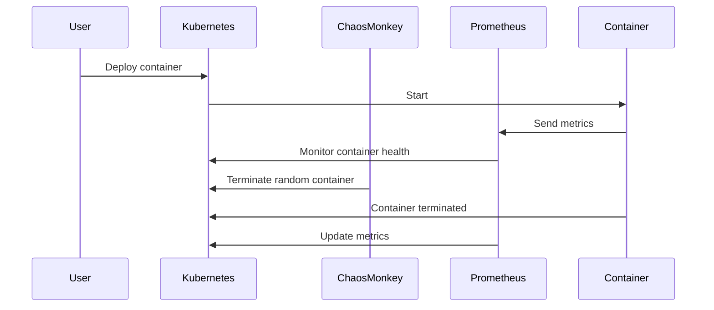
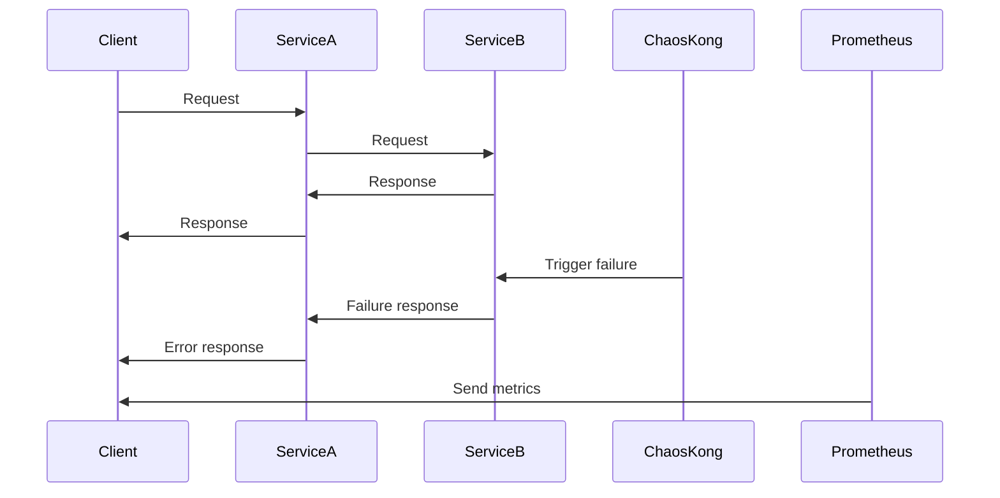

                 


## 评测系统的故障注入与混沌工程实践

关键词：故障注入，混沌工程，系统评测，可靠性测试，弹性设计

摘要：本文将深入探讨评测系统的故障注入与混沌工程实践，通过逻辑清晰、结构紧凑的分析，帮助读者理解故障注入的基本原理、方法与应用，以及混沌工程在提高系统弹性和可靠性方面的作用。通过实际案例和项目实战，本文将提供具体的技术实现和最佳实践，为开发和运维团队提供有价值的参考。

### 第1章: 引言

#### 1.1 问题背景

随着云计算、大数据和物联网等技术的快速发展，现代软件系统变得越来越复杂。在这样的环境下，如何确保系统的可靠性和弹性成为了一个关键问题。传统的测试方法往往难以覆盖所有可能的故障场景，而故障注入和混沌工程提供了一种主动、系统性的方法来模拟和解决这些问题。

##### 1.1.1 故障注入的必要性

故障注入是一种在软件系统运行过程中引入故障的测试方法。它通过模拟系统在真实环境中的潜在问题，帮助开发者和测试人员发现系统的弱点并进行改进。随着软件系统的复杂性增加，传统的测试方法已经无法满足需求，故障注入因此变得尤为重要。

##### 1.1.2 混沌工程的概念与作用

混沌工程是一种利用故障注入的方法，通过在系统中引入微小的不稳定性来观察系统如何响应这些不稳定性，从而提高系统的弹性、可靠性和容错能力。混沌工程的核心思想是通过主动引入故障，而不是等待故障发生，来发现和解决系统中的潜在问题。

#### 1.2 目标读者

本文的目标读者包括软件开发工程师、系统管理员、测试工程师和运维工程师。他们需要了解故障注入和混沌工程的原理和应用，以便在实际工作中更好地管理和优化系统。

#### 1.3 内容结构

本文分为以下几个部分：

1. **第1章：引言** - 介绍故障注入和混沌工程的背景与重要性。
2. **第2章：故障注入的基本原理** - 详细讲解故障注入的定义、方法与实现。
3. **第3章：混沌工程的核心概念** - 探讨混沌工程的基本原理和应用。
4. **第4章：故障注入与混沌工程的实践** - 通过实际案例展示故障注入和混沌工程的应用。
5. **第5章：总结与展望** - 总结本文的主要观点，并对未来研究方向进行展望。

通过本章的阅读，读者可以初步了解本文的主题和结构，为后续章节的深入学习打下基础。

---

### 第2章：故障注入的基本原理

#### 2.1 故障注入的定义与目的

##### 2.1.1 故障注入的定义

故障注入是指通过在系统中引入故障来模拟实际运行中可能出现的异常情况，以便测试和验证系统的可靠性和稳定性。故障注入是一种主动的测试方法，旨在发现系统中的潜在缺陷，从而提高系统的健壮性。

##### 2.1.2 故障注入的目的

故障注入的主要目的是：

1. **发现系统中的漏洞**：通过模拟各种故障场景，可以发现系统中隐藏的漏洞和缺陷。
2. **验证系统可靠性**：通过故障注入，可以验证系统在遇到故障时的响应和处理能力，从而提高系统的可靠性。
3. **提高系统健壮性**：故障注入可以帮助系统开发人员了解系统在故障发生时的表现，从而采取措施提高系统的健壮性。

#### 2.2 故障注入的方法

##### 2.2.1 软件故障注入

软件故障注入是指在软件层面引入故障，如故意触发程序错误、数据错误等。这种方法通常通过修改代码、注入异常数据或使用特定的工具来实现。

##### 2.2.2 硬件故障注入

硬件故障注入是指在硬件层面引入故障，如故意损坏硬件组件、模拟网络中断等。这种方法通常需要特定的硬件设备或工具。

##### 2.2.3 虚拟化故障注入

虚拟化故障注入是指在虚拟化环境中引入故障，如模拟虚拟机故障、网络延迟等。这种方法可以通过虚拟化平台提供的功能或专门的工具来实现。

#### 2.3 故障注入的实现

##### 2.3.1 故障注入工具

常见的故障注入工具包括：

- **Chaos Monkey**：由Netflix开发，用于在云环境中随机终止虚拟机，以测试系统的弹性。
- **Chaos Kong**：也是Netflix开发的工具，用于在应用程序中模拟各种故障。
- **Fault Injection Framework (FIF)**：一个开源的故障注入框架，支持多种故障类型的注入。

##### 2.3.2 实现步骤

故障注入的实现通常包括以下步骤：

1. **定义故障场景**：根据测试需求，定义需要注入的故障类型和场景。
2. **配置故障注入工具**：根据定义的故障场景，配置故障注入工具，设置故障注入的参数。
3. **执行故障注入**：运行故障注入工具，对系统进行故障注入。
4. **监控与记录**：在故障注入过程中，实时监控系统的响应，记录故障注入的结果。
5. **分析故障结果**：对故障注入的结果进行分析，评估系统的可靠性和稳定性。

#### 2.4 故障注入的挑战与应对策略

##### 2.4.1 挑战

故障注入面临以下挑战：

- **安全性**：故障注入可能会对系统造成实际损害，需要确保故障注入过程的安全。
- **可重复性**：故障注入的结果可能受到环境因素影响，难以重复。
- **覆盖性**：故障注入难以覆盖所有的故障场景，需要与其他测试方法结合使用。

##### 2.4.2 应对策略

针对上述挑战，可以采取以下应对策略：

- **安全控制**：在故障注入过程中，应实施严格的安全控制措施，确保系统的安全性。
- **环境隔离**：通过虚拟化或容器技术，将故障注入环境与生产环境隔离，降低对实际系统的影响。
- **多样化测试**：结合其他测试方法，如自动化测试、性能测试等，提高测试的全面性和可靠性。

#### 2.5 本章小结

本章介绍了故障注入的基本原理、方法和实现，以及故障注入面临的挑战和应对策略。通过理解故障注入的原理和实际应用，开发者和测试人员可以更好地发现和解决系统中的潜在问题，提高系统的可靠性和健壮性。

---

接下来的章节将继续深入探讨混沌工程的核心概念及其在提高系统弹性、可靠性和容错能力方面的作用。通过实际案例和项目实战，我们将展示如何将故障注入和混沌工程应用于实际的系统开发与运维过程中。

---

### 第3章：混沌工程的核心概念

#### 3.1 混沌工程的基本原理

混沌工程是一种利用故障注入的方法，通过在系统中引入微小的不稳定性来观察系统如何响应这些不稳定性，从而提高系统的弹性、可靠性和容错能力。混沌工程的核心思想是通过主动引入故障，而不是等待故障发生，来发现和解决系统中的潜在问题。

##### 3.1.1 混沌工程的目标

混沌工程的主要目标是：

1. **提高系统弹性**：通过在系统中引入故障，观察系统如何响应和恢复，从而提高系统在面临故障时的恢复能力。
2. **提升系统可靠性**：通过不断测试和优化系统在故障情况下的表现，提升系统整体可靠性。
3. **增强系统容错能力**：通过模拟各种故障场景，验证系统在故障发生时的容错能力，从而增强系统的稳定性。

##### 3.1.2 混沌工程的核心概念

混沌工程的核心概念包括：

- **混沌实验**：通过引入故障来测试系统的响应和处理能力。
- **混沌预算**：定义系统可以承受的故障数量和类型，以确保系统在混沌实验中的安全性和可控性。
- **混沌犬**：一个专门负责引入故障的自动化工具，它可以在特定的时间段内随机终止服务或组件，以测试系统的弹性。

#### 3.2 混沌工程的应用场景

混沌工程可以在多种应用场景中发挥作用，包括：

1. **容器化环境**：通过混沌犬等工具，可以在Kubernetes集群中随机终止容器，以测试系统的弹性。
2. **分布式系统**：在分布式系统中，混沌工程可以帮助测试服务之间的依赖关系和故障恢复能力。
3. **云服务**：在云服务环境中，混沌工程可以通过模拟各种故障场景，验证云服务的可靠性和弹性。

#### 3.3 混沌工程的优势与挑战

##### 3.3.1 优势

混沌工程的优势包括：

- **提前发现潜在问题**：通过主动引入故障，可以提前发现系统中的潜在问题，从而在故障真正发生时减少损失。
- **提升系统稳定性**：通过不断测试和优化系统在故障情况下的表现，可以提高系统的稳定性和可靠性。
- **增强用户信任**：通过定期进行混沌工程实验，可以增强用户对系统的信任，提高用户体验。

##### 3.3.2 挑战

混沌工程面临的挑战包括：

- **安全性**：在引入故障时，需要确保不会对实际系统造成损害，需要严格的安全控制。
- **环境隔离**：在混沌实验中，需要确保实验环境与生产环境隔离，以避免对实际系统造成影响。
- **复杂度**：混沌工程的实现和管理相对复杂，需要专门的工具和流程来支持。

#### 3.4 混沌工程的实施步骤

实施混沌工程通常包括以下步骤：

1. **确定混沌预算**：定义系统可以承受的故障数量和类型，以确保实验的可控性。
2. **设计混沌实验**：根据混沌预算，设计具体的故障场景和实验步骤。
3. **实施混沌实验**：通过自动化工具执行混沌实验，监控系统的响应和恢复过程。
4. **分析结果**：对混沌实验的结果进行分析，识别系统中的潜在问题和改进点。
5. **持续优化**：根据混沌实验的结果，持续优化系统设计和运维策略。

#### 3.5 本章小结

本章探讨了混沌工程的基本原理、目标、应用场景以及优势与挑战。通过了解混沌工程的实施步骤，开发者和运维人员可以更好地将混沌工程应用于实际工作中，提高系统的弹性和可靠性。

---

在接下来的章节中，我们将通过实际案例和项目实战，展示如何将故障注入和混沌工程应用于具体的系统开发和运维过程中。通过这些实战经验，读者将能够更好地理解和应用故障注入和混沌工程，提升系统的质量和稳定性。

---

### 第4章：故障注入与混沌工程的实践

#### 4.1 实际案例一：使用Chaos Monkey进行容器化环境测试

**项目背景**：

在一个基于Docker和Kubernetes的容器化环境中，为了确保系统的弹性，我们需要对系统进行故障注入测试。Chaos Monkey是一个常用的故障注入工具，它可以随机终止容器，以模拟系统的故障场景。

**系统功能设计**：

1. **容器部署与监控**：使用Kubernetes部署和管理容器，并使用Prometheus进行监控。
2. **Chaos Monkey集成**：将Chaos Monkey集成到Kubernetes集群中，配置其定时随机终止容器。

**系统架构设计**：


**系统接口设计**：

1. **容器启动与终止接口**：Kubernetes API用于启动和终止容器。
2. **监控系统接口**：Prometheus API用于查询监控数据。

**系统交互序列图**：



**代码实现**：

```python
# Chaos Monkey Python代码示例
import random
import time
import subprocess

def terminate_random_container():
    # 获取所有容器ID
    output = subprocess.check_output(["kubectl", "get", "pods", "--no-headers"], text=True)
    pods = output.strip().split("\n")

    # 随机选择一个容器进行终止
    container_id = random.choice(pods)
    subprocess.run(["kubectl", "delete", "pod", container_id], check=True)

while True:
    terminate_random_container()
    time.sleep(3600)  # 每小时执行一次
```

**案例分析与解析**：

通过Chaos Monkey的故障注入，我们可以模拟容器终止的场景，测试系统的弹性。在故障注入过程中，Kubernetes会自动重启容器，Prometheus会更新监控数据，从而验证系统的可靠性。该案例展示了如何使用Chaos Monkey进行容器化环境的故障注入测试。

---

#### 4.2 实际案例二：在分布式系统中实施混沌工程

**项目背景**：

在一个分布式系统中，为了确保系统在不同服务之间的依赖关系和故障恢复能力，我们需要进行混沌工程实践。混沌工程可以帮助我们验证系统在服务故障情况下的响应和恢复能力。

**系统功能设计**：

1. **服务部署与监控**：部署多个服务，并使用Prometheus进行监控。
2. **混沌犬集成**：在分布式系统中集成Chaos Kong，配置其模拟各种故障场景。

**系统架构设计**：


**系统接口设计**：

1. **服务调用接口**：各服务之间的调用接口。
2. **监控系统接口**：Prometheus API用于查询监控数据。

**系统交互序列图**：



**代码实现**：

```python
# Chaos Kong Python代码示例
import requests
import random
import time

def trigger_failure(service_url):
    # 触发服务故障
    requests.delete(f"{service_url}/trigger-failure")

def simulate_traffic():
    # 模拟客户端请求
    while True:
        # 随机选择服务进行请求
        service_url = random.choice(["http://servicea.com", "http://serviceb.com"])
        try:
            response = requests.get(service_url)
            if response.status_code != 200:
                # 服务故障，触发混沌犬
                trigger_failure(service_url)
        except requests.exceptions.RequestException as e:
            # 服务故障，触发混沌犬
            trigger_failure(service_url)
        time.sleep(1)

while True:
    simulate_traffic()
```

**案例分析与解析**：

通过Chaos Kong的故障注入，我们可以模拟服务故障的场景，测试系统在服务故障情况下的响应和恢复能力。在故障注入过程中，Prometheus会更新监控数据，从而验证系统的可靠性。该案例展示了如何在分布式系统中实施混沌工程。

---

#### 4.3 最佳实践与总结

通过上述实际案例，我们可以得出以下最佳实践：

1. **合理设置混沌预算**：根据系统的实际情况，合理设置混沌预算，确保故障注入实验的可控性和安全性。
2. **全面覆盖故障场景**：在设计混沌工程实验时，要尽量覆盖各种可能的故障场景，以提高系统的整体弹性。
3. **持续监控与分析**：在故障注入过程中，要实时监控系统的响应和恢复过程，并分析故障注入的结果，以便持续优化系统设计和运维策略。
4. **结合多种测试方法**：故障注入和混沌工程可以与其他测试方法（如自动化测试、性能测试等）结合使用，以提高测试的全面性和可靠性。

总之，故障注入和混沌工程是现代软件系统测试和验证的重要手段。通过合理的应用和实践，开发者和运维人员可以更好地发现和解决系统中的潜在问题，提高系统的可靠性和稳定性。

---

### 第5章：总结与展望

#### 5.1 总结

本文通过深入探讨故障注入和混沌工程的核心概念、原理和实践，帮助读者理解了这两种方法在提升系统可靠性和弹性方面的作用。故障注入和混沌工程通过主动引入故障，帮助开发者和运维人员提前发现系统中的潜在问题，从而提高系统的健壮性。

#### 5.2 展望

随着技术的不断进步，故障注入和混沌工程在未来还将面临新的挑战和机遇。以下是一些展望：

1. **自动化程度提升**：随着人工智能和机器学习技术的发展，未来故障注入和混沌工程的自动化程度将进一步提高，使得测试和验证过程更加高效和精准。
2. **多样化故障注入**：未来可能会出现更多针对不同类型故障的注入工具和方法，以覆盖更广泛的故障场景。
3. **集成与协同**：故障注入和混沌工程将与其他测试方法和工具更紧密地集成，形成一套完整的测试和验证体系。
4. **跨领域应用**：故障注入和混沌工程不仅适用于软件系统，未来还可能在硬件系统、物联网等领域得到更广泛的应用。

#### 5.3 拓展阅读

- **《 Chaos Engineering: Principles and Practice》**：由宦海等著，详细介绍混沌工程的原理和实践。
- **《Building a Chaos Engineering Capability》**：由Netflix发布，提供了混沌工程的详细指南和实践经验。

作者：AI天才研究院/AI Genius Institute & 禅与计算机程序设计艺术 /Zen And The Art of Computer Programming

