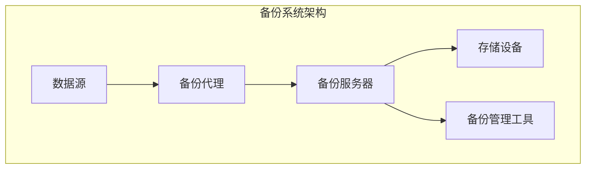

                 

## 第一部分：引言

### 1.1 书籍目的与重要性

在当今信息化社会中，数据的安全与备份已经成为各个组织和企业关注的焦点。随着大数据和云计算技术的迅猛发展，数据量呈现爆炸式增长，数据的重要性不言而喻。然而，数据安全威胁和风险也日益加剧，数据泄露、数据丢失等问题频繁发生，严重影响了企业的运营和发展。因此，设计和实施一个高效、可靠的数据安全与备份方案变得尤为重要。

本章节的目的是帮助读者深入了解数据安全与备份的基本概念，掌握设计一个全面、有效的数据安全与备份方案的方法和技巧。通过本章节的学习，读者将能够：

1. 理解数据安全与备份的重要性。
2. 掌握数据安全与备份的基本概念和原则。
3. 学习数据安全策略和备份方案的设计方法。
4. 了解常见的数据备份技术和实现方法。
5. 分析和评估现有数据安全与备份方案的优缺点。
6. 制定适合自身组织的数据安全与备份方案。

### 1.2 数据安全与备份的基本概念

#### 数据安全

数据安全是指保护数据在存储、传输和处理过程中的完整性、保密性和可用性。具体来说，数据安全包括以下几个方面：

- **完整性**：确保数据在存储、传输和处理过程中不被篡改或损坏。
- **保密性**：确保数据不被未授权的第三方访问或泄露。
- **可用性**：确保数据在需要时能够被正常访问和使用。

数据安全的重要性在于，一旦数据安全受到威胁，可能会导致以下后果：

- **数据泄露**：敏感信息被未授权的第三方获取，可能导致经济损失、声誉损害等。
- **数据丢失**：数据在存储、传输或处理过程中丢失，可能影响业务的正常运营。
- **业务中断**：由于数据安全问题导致的业务中断，可能对企业的运营和发展造成严重影响。

#### 数据备份

数据备份是指将数据复制到另一个存储设备或位置，以便在数据丢失或损坏时能够恢复。数据备份的目的是确保数据的安全性和可恢复性。

数据备份可以分为以下几种类型：

- **本地备份**：将数据备份到本地存储设备，如硬盘、U盘等。
- **远程备份**：将数据备份到远程服务器或云存储，以便在本地设备损坏时能够远程恢复。
- **增量备份**：只备份自上次备份以来发生变化的数据，以节省存储空间和备份时间。
- **全量备份**：备份所有数据，无论是否发生变化。

数据备份的重要性在于：

- **灾难恢复**：在发生硬件故障、数据泄露或其他灾难事件时，能够迅速恢复数据，降低业务中断时间。
- **数据恢复**：在数据丢失或损坏时，能够通过备份数据恢复数据，减少数据损失。
- **合规要求**：许多行业和地区对数据备份有法规要求，确保数据安全。

### 1.3 书籍结构安排

本章节是本书的第一部分，主要介绍了书籍的目的与重要性，以及数据安全与备份的基本概念。接下来，本书将分为六个部分，逐步深入探讨数据安全与备份的各个方面。

- **第二部分：数据安全策略**：介绍数据安全策略的基本概念、原则和实施方法。
- **第三部分：数据备份方案设计**：详细讨论数据备份方案的设计原则、步骤和评估方法。
- **第四部分：数据备份技术实现**：介绍常见的数据备份技术和实现方法。
- **第五部分：案例分析**：通过实际案例分析和评估数据安全与备份方案的有效性。
- **第六部分：最佳实践与注意事项**：总结最佳实践，分析常见问题和风险，并提供注意事项和解决方案。

通过本书的学习，读者将能够系统地掌握数据安全与备份的知识体系，并能够根据自身组织的需求，设计和实施一个高效、可靠的数据安全与备份方案。

----------------------------------------------------------------

## 第二部分：数据安全策略

### 2.1 数据安全概述

数据安全是确保数据在存储、传输和处理过程中的完整性、保密性和可用性的重要措施。在信息化时代，数据已经成为组织的重要资产，因此保障数据安全至关重要。本节将详细介绍数据安全的重要性、面临的挑战以及相关的法律法规与标准。

#### 2.1.1 数据安全的重要性

1. **业务连续性**：数据安全能够保障业务连续性，减少因数据泄露或丢失导致的业务中断。
2. **保护客户隐私**：对于涉及用户数据的系统，数据安全有助于保护客户的隐私，防止个人信息泄露。
3. **合规要求**：许多行业和地区对数据安全有严格的法律和法规要求，如《通用数据保护条例》（GDPR）和《加州消费者隐私法案》（CCPA）等，确保组织符合相关法规。
4. **降低风险**：数据安全措施能够降低因数据泄露、篡改或丢失带来的风险，保护组织的声誉和资产。

#### 2.1.2 数据安全的挑战

1. **数据量增长**：随着大数据和云计算技术的发展，数据量呈现指数级增长，这增加了数据保护和管理难度。
2. **网络攻击**：网络攻击手段日益多样，如DDoS攻击、SQL注入、跨站脚本攻击（XSS）等，数据安全面临严峻挑战。
3. **内部威胁**：内部员工或合作伙伴的误操作或恶意行为可能导致数据泄露或损坏。
4. **技术更新**：技术不断发展，新的数据存储和处理技术如区块链、物联网（IoT）等带来了新的安全挑战。

#### 2.1.3 数据安全的法律法规与标准

1. **国际法规**：欧盟的《通用数据保护条例》（GDPR）、美国的《加州消费者隐私法案》（CCPA）等，对数据安全提出了严格的要求。
2. **行业标准**：ISO/IEC 27001、ISO/IEC 27002等国际标准提供了数据安全管理的框架和指南。
3. **国内法规**：中国的《网络安全法》、《信息安全技术个人信息保护规范》等法规也对数据安全提出了要求。
4. **行业规范**：金融、医疗、教育等特定行业有各自的数据安全规范和标准，组织需要遵守相关行业规范。

### 2.2 数据安全策略与原则

#### 2.2.1 数据安全策略的制定

数据安全策略是组织在数据安全管理过程中制定的指导性文件，旨在确保数据的完整性、保密性和可用性。制定数据安全策略的步骤如下：

1. **需求分析**：评估组织的业务需求、数据类型和数据敏感程度，确定数据安全策略的优先级。
2. **风险评估**：识别潜在的数据安全风险，评估风险的影响和可能性，确定风险管理的策略。
3. **法律法规遵循**：确保数据安全策略符合相关的法律法规和标准要求。
4. **制定策略**：根据需求分析和风险评估结果，制定具体的策略，包括数据分类、访问控制、数据加密、备份与恢复等。
5. **审查与更新**：定期审查数据安全策略的有效性，根据业务发展和技术变化更新策略。

#### 2.2.2 数据安全的基本原则

1. **最小权限原则**：用户只能访问和操作其权限范围内的数据，以减少数据泄露和损坏的风险。
2. **保密性**：确保敏感数据不被未经授权的第三方访问或泄露。
3. **完整性**：确保数据在存储、传输和处理过程中不被篡改或损坏。
4. **可用性**：确保数据在需要时能够被正常访问和使用，减少业务中断时间。
5. **审计与监控**：记录和监控数据的访问和操作行为，及时发现和应对安全事件。

#### 2.2.3 数据分类与保护策略

数据分类是数据安全管理的基础，根据数据的重要性和敏感性，将数据分为不同的等级，并实施相应的保护策略。以下是常见的数据分类与保护策略：

1. **敏感数据**：如个人身份信息、财务信息、商业机密等，应实施最高级别的保护措施，包括数据加密、访问控制、监控和备份。
2. **内部数据**：如员工工资信息、内部通讯记录等，应实施适度的保护措施，确保内部数据的保密性和完整性。
3. **公开数据**：如公司官方网站的公开信息等，不需要额外的保护措施，但应确保数据来源的合法性和准确性。

### 2.3 安全管理措施

#### 2.3.1 安全管理体系建设

1. **安全组织**：建立专门的数据安全管理机构，负责制定和实施数据安全策略。
2. **安全政策**：制定明确的数据安全政策，确保所有员工了解并遵守。
3. **安全流程**：建立规范的数据安全流程，确保数据在存储、传输和处理过程中的安全。
4. **安全培训**：定期对员工进行数据安全培训，提高员工的安全意识和技能。

#### 2.3.2 安全风险管理

1. **风险评估**：定期进行数据安全风险评估，识别和评估潜在的风险。
2. **风险应对**：制定相应的风险应对措施，包括风险规避、风险减轻和风险接受。
3. **应急响应**：建立应急响应机制，确保在发生安全事件时能够及时响应和恢复。

#### 2.3.3 安全教育与培训

1. **基础培训**：对所有员工进行基础的数据安全培训，确保其了解基本的安全知识和操作规范。
2. **高级培训**：对涉及敏感数据和关键系统的员工进行高级培训，提高其安全技能和意识。
3. **持续教育**：定期进行安全教育，更新员工的安全知识和技能。

通过制定和实施全面的数据安全策略，组织可以确保数据的安全性和完整性，降低数据泄露和损坏的风险，保障业务的正常运营和发展。

----------------------------------------------------------------

## 第三部分：数据备份方案设计

### 3.1 备份方案设计概述

数据备份方案设计是确保数据安全性和可用性的关键环节。一个高效、可靠的数据备份方案能够保障在数据丢失或损坏时能够迅速恢复，减少业务中断时间。本节将详细讨论备份方案设计的重要性、基本步骤以及评估和优化方法。

#### 3.1.1 备份方案设计的重要性

备份方案设计的重要性体现在以下几个方面：

1. **数据保护**：通过备份方案，确保数据在存储、传输和处理过程中的安全性和完整性。
2. **灾难恢复**：在发生硬件故障、网络攻击、自然灾害等突发事件时，备份方案能够迅速恢复数据，降低业务中断风险。
3. **合规要求**：许多行业和地区对数据备份有法规要求，确保组织符合相关法规。
4. **业务连续性**：通过备份方案，保障业务连续性，减少因数据丢失或损坏导致的业务中断时间。

#### 3.1.2 备份方案设计的基本步骤

备份方案设计通常包括以下基本步骤：

1. **需求分析**：评估组织的业务需求、数据类型和数据敏感程度，确定备份方案的需求和目标。
2. **风险评估**：识别潜在的数据备份风险，评估风险的影响和可能性，确定备份方案的优先级。
3. **备份策略制定**：根据需求分析和风险评估结果，制定具体的备份策略，包括备份类型、备份频率、备份保留期限等。
4. **备份系统选择**：选择适合组织需求的备份系统，包括本地备份、远程备份、云备份等。
5. **备份系统配置**：配置备份系统的各项参数，确保备份过程能够正常运行。
6. **备份过程监控**：监控备份过程，确保备份任务按时完成，及时发现和解决备份过程中出现的问题。
7. **备份策略评估与优化**：定期评估备份策略的有效性，根据业务发展和技术变化优化备份方案。

#### 3.1.3 备份方案的评估与优化

备份方案的评估与优化是确保备份方案持续有效的重要环节。以下是一些常用的评估和优化方法：

1. **备份成功率和完整性验证**：定期检查备份的成功率和数据的完整性，确保备份数据能够正常恢复。
2. **备份时间和存储容量优化**：通过优化备份策略和备份系统配置，减少备份时间和存储容量消耗。
3. **备份过程监控和告警**：配置备份过程监控和告警机制，及时发现和解决备份过程中出现的问题。
4. **备份冗余和容错设计**：设计备份冗余和容错机制，确保在备份系统发生故障时能够继续备份数据。
5. **备份策略调整和更新**：根据业务发展和数据安全要求，定期调整和更新备份策略。

通过详细讨论备份方案设计的重要性、基本步骤和评估优化方法，本节为读者提供了一个全面的数据备份方案设计指导，帮助组织设计和实施一个高效、可靠的数据备份方案，确保数据的安全性和可用性。

----------------------------------------------------------------

## 3.2 备份数据的选择与策略

在设计数据备份方案时，选择哪些数据需要备份以及如何进行备份是至关重要的环节。备份数据的选择与策略直接关系到备份的效率、成本和恢复能力。以下将详细介绍备份数据的类型、备份频率与策略、以及数据保留期限与备份容量规划。

### 3.2.1 备份数据的类型

在备份数据的选择过程中，需要区分不同类型的数据，并根据其重要性和敏感性制定相应的备份策略。常见的备份数据类型包括：

1. **系统配置和数据**：包括系统配置文件、数据库文件、应用程序数据等，这些数据对系统的正常运行至关重要。
2. **用户数据和文件**：包括用户生成的文档、图片、视频等，这些数据对于用户的日常工作和生活至关重要。
3. **日志文件**：包括系统日志、操作日志、错误日志等，这些日志文件对于故障排查和系统优化具有重要意义。
4. **虚拟机镜像**：对于使用虚拟化技术的环境，备份虚拟机镜像可以快速恢复整个虚拟机环境。

#### 备份数据的属性特征对比表格

为了更清晰地理解不同类型备份数据的属性特征，以下是一个对比表格：

| 数据类型     | 重要性 | 敏感性 | 备份频率 | 备份策略 |
| ------------ | ------ | ------ | -------- | -------- |
| 系统配置和数据 | 高     | 中     | 每天     | 全量备份 |
| 用户数据和文件 | 中     | 高     | 每天/周  | 增量备份 |
| 日志文件     | 中     | 低     | 每小时   | 增量备份 |
| 虚拟机镜像   | 高     | 中     | 每天     | 快照备份 |

### 3.2.2 备份频率与策略

备份频率是影响备份效率和恢复能力的关键因素。根据数据的重要性和敏感性，可以制定不同的备份频率和备份策略。以下是一些常见的备份频率和策略：

1. **全量备份**：每天或每周进行一次全量备份，以确保数据在备份时点的完整性。
2. **增量备份**：每天或每周进行一次增量备份，只备份自上次备份以来发生变化的数据，以节省存储空间和备份时间。
3. **差异备份**：每天或每周进行一次差异备份，备份自上次全量备份以来发生变化的数据，减少了备份次数和备份时间。
4. **实时备份**：对于关键数据和系统，可以采用实时备份策略，如使用数据库的日志或快照功能，确保数据的实时性和一致性。

### 3.2.3 数据保留期限与备份容量规划

数据保留期限是指备份数据需要保存的时间长度，它是数据备份策略的一个重要组成部分。数据保留期限的制定需要考虑数据的敏感性、业务需求、合规要求等因素。

1. **短期保留**：对于一些日常操作数据，如用户文件和日志，可能只需要短期保留，如几天到几个月。
2. **中长期保留**：对于系统配置数据、关键业务数据等，需要中长期保留，如几个月到几年。
3. **长期保留**：对于一些历史数据和法律法规要求必须保留的数据，需要长期保留，如数年到数十年。

#### 备份容量规划

备份容量的规划是确保备份系统能够满足备份需求的关键。以下是一些备份容量规划的方法：

1. **历史数据压缩**：采用数据压缩技术，减少备份数据的存储空间需求。
2. **存储容量预留**：预留一定的存储容量，以应对数据增长和备份需求的变化。
3. **容量监控与告警**：定期监控备份存储容量，设置告警阈值，确保备份系统能够及时调整和扩展。

通过详细讨论备份数据的选择、备份频率与策略、以及数据保留期限与备份容量规划，本节为读者提供了制定高效、可靠的数据备份方案的重要指导，帮助组织确保数据的安全性和可用性。

----------------------------------------------------------------

## 3.3 备份数据的存储策略

备份数据的存储策略是确保数据安全性和可靠性的关键环节。一个合理的存储策略能够保证备份数据在不同环境下都能被安全地存储和快速地访问。本节将详细介绍本地备份与远程备份、冷备份与热备份、数据恢复与容灾策略。

### 3.3.1 本地备份与远程备份

#### 本地备份

本地备份是指将备份数据存储在本地存储设备上，如硬盘、U盘、NAS（网络附加存储）等。本地备份的优点包括：

1. **快速恢复**：本地备份的数据可以快速访问和恢复，降低业务中断时间。
2. **控制性强**：组织可以完全控制备份过程和数据存储位置。
3. **成本较低**：不需要额外的远程存储费用。

然而，本地备份也存在一些局限性：

1. **物理安全风险**：本地备份设备可能受到物理损坏、火灾、水灾等灾害影响。
2. **单点故障风险**：如果备份设备与生产环境在同一地点，一旦发生故障，备份和数据都会丢失。

#### 远程备份

远程备份是指将备份数据存储在远程服务器或云存储上。远程备份的优点包括：

1. **安全性高**：远程备份可以避免本地备份的物理安全风险，确保数据的安全存储。
2. **容灾能力**：在发生灾难时，远程备份可以提供容灾能力，确保业务连续性。
3. **易于扩展**：远程备份可以根据需要灵活调整存储容量，适应数据增长。

远程备份的缺点包括：

1. **恢复速度较慢**：由于网络带宽的限制，远程备份的数据恢复速度可能较慢。
2. **成本较高**：远程备份通常需要支付额外的存储费用。

#### 本地备份与远程备份的搭配

为了最大化备份策略的优势并规避缺点，组织可以将本地备份和远程备份相结合。例如：

1. **本地备份 + 远程备份**：首先进行本地备份，确保数据快速恢复，然后定期将本地备份的数据上传到远程服务器或云存储，增加数据的安全性和容灾能力。
2. **远程备份 + 远程备份**：将备份数据存储在两个不同的远程位置，如两个不同的云存储服务，确保数据的高可用性和安全性。

### 3.3.2 冷备份与热备份

#### 冷备份

冷备份是指在生产系统关闭或暂停服务时进行的备份。冷备份的优点包括：

1. **数据一致性**：由于系统处于关闭状态，备份数据能够保证一致性，减少了数据损坏的风险。
2. **完整备份**：冷备份可以完成全面的数据备份，确保所有数据都被备份。

冷备份的缺点包括：

1. **业务中断时间长**：由于需要关闭或暂停服务，冷备份可能需要较长的时间。
2. **无法实时备份**：冷备份无法实时反映生产环境中的数据变化。

#### 热备份

热备份是指在生产系统运行状态下进行的备份。热备份的优点包括：

1. **无需暂停服务**：热备份可以在系统运行时进行，无需暂停服务，不会影响业务的正常运行。
2. **实时备份**：热备份可以实时反映生产环境中的数据变化，确保数据的实时性。

热备份的缺点包括：

1. **数据一致性风险**：由于系统在运行状态，热备份可能会面临数据不一致的风险。
2. **备份效率较低**：热备份通常需要更多的技术手段来确保数据的一致性和备份的完整性。

#### 冷备份与热备份的搭配

为了最大化备份策略的优势并规避缺点，组织可以将冷备份和热备份相结合。例如：

1. **定期冷备份 + 实时热备份**：定期进行冷备份，确保数据的完整性和一致性，同时使用热备份技术实时备份关键数据和系统配置，确保数据的实时性和可用性。
2. **全量冷备份 + 差异热备份**：定期进行全量冷备份，确保数据的完整性，同时使用差异热备份技术实时备份自上次备份以来发生变化的数据，确保数据的实时性和高效性。

### 3.3.3 数据恢复与容灾策略

#### 数据恢复

数据恢复是指从备份数据中恢复原始数据的过程。一个有效的数据恢复策略应该考虑以下因素：

1. **备份恢复时间**：确定在发生数据丢失或损坏时，需要多长时间能够恢复数据。
2. **备份恢复成本**：评估恢复数据的成本，包括硬件、软件和人力成本。
3. **备份恢复流程**：建立规范的备份恢复流程，确保在发生数据丢失或损坏时能够迅速恢复数据。

#### 容灾策略

容灾策略是指为了应对灾难事件，确保业务连续性而采取的一系列措施。一个有效的容灾策略应该考虑以下因素：

1. **容灾等级**：根据业务的重要性和需求，确定容灾等级，如基本容灾、中等容灾和高级容灾。
2. **容灾地点**：选择合适的地域进行容灾备份，确保在灾难事件发生时能够快速恢复业务。
3. **容灾设施**：建立完善的容灾设施，包括备用服务器、存储设备、网络设备等，确保在灾难事件发生时能够迅速切换到容灾环境。

通过详细讨论备份数据的存储策略，包括本地备份与远程备份、冷备份与热备份、数据恢复与容灾策略，本节为读者提供了制定高效、可靠的数据备份存储策略的重要指导，帮助组织确保备份数据的安全性和可用性。

----------------------------------------------------------------

## 4.1 数据备份技术概述

数据备份技术是确保数据安全性和可用性的关键手段。随着技术的不断进步，数据备份技术也经历了从传统的本地备份到现代的云备份的演变。本节将详细介绍常见的数据备份技术，包括其优缺点以及如何选择适合的数据备份技术。

### 4.1.1 常见的数据备份技术

#### 本地备份

本地备份是指将备份数据存储在本地存储设备上，如硬盘、U盘、NAS等。本地备份的优点包括：

- **快速恢复**：本地备份的数据可以快速访问和恢复，降低业务中断时间。
- **控制性强**：组织可以完全控制备份过程和数据存储位置。

本地备份的缺点包括：

- **物理安全风险**：本地备份设备可能受到物理损坏、火灾、水灾等灾害影响。
- **单点故障风险**：如果备份设备与生产环境在同一地点，一旦发生故障，备份和数据都会丢失。

#### 远程备份

远程备份是指将备份数据存储在远程服务器或云存储上。远程备份的优点包括：

- **安全性高**：远程备份可以避免本地备份的物理安全风险，确保数据的安全存储。
- **容灾能力**：在发生灾难时，远程备份可以提供容灾能力，确保业务连续性。
- **易于扩展**：远程备份可以根据需要灵活调整存储容量，适应数据增长。

远程备份的缺点包括：

- **恢复速度较慢**：由于网络带宽的限制，远程备份的数据恢复速度可能较慢。
- **成本较高**：远程备份通常需要支付额外的存储费用。

#### 云备份

云备份是指将备份数据存储在云服务提供商的云存储中。云备份的优点包括：

- **高可用性**：云备份服务通常提供高可用性，确保备份数据的持续可用。
- **弹性扩展**：云备份可以根据需求灵活扩展存储容量。
- **成本效益**：云备份通常具有较好的成本效益，组织只需支付使用的存储容量费用。

云备份的缺点包括：

- **数据传输速度**：数据上传和下载速度可能受到网络带宽的限制。
- **数据传输安全性**：需要确保数据在传输过程中的安全性。

#### 差异备份

差异备份是指只备份自上次全量备份以来发生变化的数据。差异备份的优点包括：

- **备份效率高**：只备份变化的数据，节省存储空间和备份时间。
- **恢复速度快**：恢复时只需恢复差异部分，节省恢复时间。

差异备份的缺点包括：

- **数据一致性**：由于差异备份可能涉及多个备份点，数据一致性可能受到影响。

#### 增量备份

增量备份是指只备份自上次备份以来发生变化的数据。增量备份的优点包括：

- **备份效率高**：只备份变化的数据，节省存储空间和备份时间。
- **恢复速度快**：恢复时只需恢复最近的备份点，节省恢复时间。

增量备份的缺点包括：

- **数据一致性**：由于增量备份可能涉及多个备份点，数据一致性可能受到影响。

### 4.1.2 备份技术的优缺点分析

以下是对几种常见备份技术的优缺点分析：

| 备份技术   | 优点                             | 缺点                               |
| ---------- | -------------------------------- | ----------------------------------- |
| 本地备份   | 快速恢复、控制性强、成本较低     | 物理安全风险、单点故障风险          |
| 远程备份   | 安全性高、容灾能力、易于扩展     | 恢复速度较慢、成本较高              |
| 云备份     | 高可用性、弹性扩展、成本效益     | 数据传输速度限制、数据传输安全性问题 |
| 差异备份   | 备份效率高、恢复速度快          | 数据一致性可能受影响                |
| 增量备份   | 备份效率高、恢复速度快          | 数据一致性可能受影响                |

### 4.1.3 备份技术的选择与搭配

在选择备份技术时，需要根据组织的具体需求和环境进行综合考虑。以下是一些选择和搭配的建议：

1. **本地备份 + 远程备份**：结合本地备份的快速恢复和远程备份的安全性，实现最佳的数据备份策略。
2. **差异备份 + 增量备份**：在数据一致性要求较高的环境中，可以使用差异备份进行全量备份，使用增量备份进行日常备份，平衡备份效率和数据一致性。
3. **云备份 + 冷备份**：利用云备份的高可用性和弹性扩展，结合冷备份进行定期全量备份，确保数据的安全性和容灾能力。
4. **热备份 + 容灾策略**：在关键业务系统中，可以使用热备份进行实时备份，结合容灾策略确保在灾难事件发生时能够快速恢复业务。

通过详细讨论常见的数据备份技术、其优缺点分析以及选择与搭配建议，本节为读者提供了制定高效、可靠的数据备份技术的指导，帮助组织确保数据的安全性和可用性。

----------------------------------------------------------------

## 4.2 备份系统实现

### 4.2.1 备份系统的设计与架构

备份系统是确保数据安全性和可用性的重要工具。设计一个高效、可靠的备份系统需要考虑多个方面，包括备份系统的设计原则、架构和核心组件。以下将详细介绍备份系统的设计与架构。

#### 4.2.1.1 设计原则

1. **高可用性**：备份系统应确保在发生故障时能够迅速切换到备用系统，确保备份过程的连续性。
2. **数据完整性**：备份系统应确保备份数据的完整性和一致性，防止数据损坏和丢失。
3. **可扩展性**：备份系统应具备良好的可扩展性，能够根据数据增长和业务需求进行调整。
4. **安全性**：备份系统应确保备份数据的安全，防止未授权访问和数据泄露。
5. **易管理性**：备份系统应提供便捷的管理界面和工具，方便用户进行备份管理和监控。

#### 4.2.1.2 架构

备份系统的架构通常包括以下几个主要部分：

1. **数据源**：数据源是指需要备份的数据来源，可以是数据库、文件系统、应用服务器等。
2. **备份代理**：备份代理是运行在数据源上的软件模块，负责将数据源中的数据传输到备份服务器。
3. **备份服务器**：备份服务器是备份系统的核心组件，负责接收、存储和管理备份数据。
4. **存储设备**：存储设备是备份系统的数据存储介质，可以是本地硬盘、NAS、SAN（存储区域网络）或云存储。
5. **备份管理工具**：备份管理工具提供备份策略定义、备份任务调度、备份状态监控等功能。

以下是一个备份系统的简化架构图：

#### 4.2.1.3 核心组件

1. **备份代理**：备份代理是备份系统的关键组件，负责从数据源中收集数据并传输到备份服务器。备份代理通常具备以下功能：

   - **数据收集**：从数据源中收集数据，包括文件、数据库表等。
   - **数据转换**：将收集到的数据转换为备份服务器可以识别的格式。
   - **数据传输**：将转换后的数据传输到备份服务器。
   - **错误处理**：在数据传输过程中发生错误时，进行错误处理和记录。

2. **备份服务器**：备份服务器是备份系统的核心，负责接收、存储和管理备份数据。备份服务器通常具备以下功能：

   - **数据接收**：接收备份代理传输的数据。
   - **数据存储**：将接收到的数据存储到存储设备中。
   - **数据管理**：管理备份数据的存储位置、备份策略和备份历史。
   - **数据恢复**：提供备份数据的恢复功能，以备在数据丢失或损坏时使用。

3. **存储设备**：存储设备是备份系统的数据存储介质，可以是本地硬盘、NAS、SAN或云存储。选择合适的存储设备需要考虑以下因素：

   - **容量**：存储设备的容量应满足备份数据的需求。
   - **性能**：存储设备的性能应满足备份任务的性能要求。
   - **可靠性**：存储设备的可靠性应保证备份数据的安全。
   - **成本**：存储设备的成本应在预算范围内。

4. **备份管理工具**：备份管理工具提供备份策略定义、备份任务调度、备份状态监控等功能。以下是一些常见的备份管理工具功能：

   - **备份策略定义**：定义备份的时间、频率、保留期限等策略。
   - **备份任务调度**：根据备份策略自动调度备份任务。
   - **备份状态监控**：监控备份任务的状态，及时发现和解决备份过程中出现的问题。
   - **备份报告生成**：生成备份报告，包括备份进度、备份成功率和数据恢复情况等。

通过详细讨论备份系统的设计与架构，包括设计原则、架构和核心组件，本节为读者提供了设计和实现高效、可靠的备份系统的指导，帮助组织确保数据的安全性和可用性。

----------------------------------------------------------------

### 4.2.2 备份系统的核心组件

备份系统的有效运行依赖于其核心组件的协同工作。以下是备份系统的核心组件及其功能的详细介绍。

#### 4.2.2.1 备份代理

备份代理是运行在数据源（如数据库、文件系统或应用服务器）上的软件模块，负责将数据从源系统收集并传输到备份服务器。备份代理通常具备以下功能：

1. **数据采集**：备份代理定期检查数据源的变化，并采集需要备份的数据。
2. **数据转换**：将采集到的数据进行格式转换，以便备份服务器能够正确识别和存储。
3. **数据传输**：将转换后的数据通过网络传输到备份服务器。
4. **错误处理**：在数据传输过程中，若发生错误，备份代理会进行错误处理，并记录错误日志。

#### 4.2.2.2 备份服务器

备份服务器是备份系统的核心组件，负责接收、存储和管理备份数据。备份服务器的主要功能包括：

1. **数据接收**：备份服务器接收备份代理发送的备份数据，并进行初步验证。
2. **数据存储**：将接收到的数据存储到备份存储设备上，通常采用压缩、加密等技术提高存储效率。
3. **数据管理**：管理备份数据的存储位置、备份策略和备份历史，以便在需要时快速检索和恢复数据。
4. **备份任务调度**：根据预定义的备份策略，自动调度备份任务，确保备份工作按时完成。
5. **数据恢复**：提供备份数据的恢复功能，包括单文件恢复和完全恢复。

#### 4.2.2.3 存储设备

存储设备是备份系统用于存储备份数据的介质。根据需求，存储设备可以是本地硬盘、网络附加存储（NAS）、存储区域网络（SAN）或云存储。选择存储设备时需要考虑以下因素：

1. **容量**：存储设备应具备足够的容量，以满足备份数据的增长需求。
2. **性能**：存储设备的读写性能应满足备份任务的性能要求，确保数据能够快速写入和读取。
3. **可靠性**：存储设备应具备高可靠性，减少数据丢失和损坏的风险。
4. **成本**：存储设备应在预算范围内，同时考虑长期维护和扩展成本。

#### 4.2.2.4 备份管理工具

备份管理工具提供备份策略定义、备份任务调度、备份状态监控和备份报告生成等功能。以下是一些常见的备份管理工具功能：

1. **备份策略定义**：用户可以根据数据的重要性和业务需求，定义备份的时间、频率、保留期限等策略。
2. **备份任务调度**：备份管理工具自动根据备份策略调度备份任务，确保备份工作按时完成。
3. **备份状态监控**：实时监控备份任务的状态，及时发现和解决备份过程中出现的问题。
4. **备份报告生成**：生成备份报告，包括备份进度、备份成功率和数据恢复情况等，为管理员提供决策依据。

通过详细讨论备份系统的核心组件及其功能，本节为读者提供了设计和实现高效、可靠的备份系统的具体指导，帮助组织确保数据的安全性和可用性。

----------------------------------------------------------------

### 4.2.3 备份系统的部署与配置

备份系统的部署与配置是确保其正常运行的关键环节。以下将详细介绍备份系统的部署过程，包括硬件和软件的选择、备份代理的安装与配置、备份服务器的配置以及备份任务的调度。

#### 4.2.3.1 硬件和软件选择

1. **硬件选择**：

   - **服务器**：选择性能稳定、扩展性好的服务器作为备份服务器，建议配置至少两个CPU核心、8GB内存，并根据备份数据量选择适当的硬盘容量。
   - **存储设备**：根据备份数据量选择适当的存储设备，如本地硬盘、NAS或云存储。本地硬盘建议使用RAID阵列提高数据可靠性，NAS和云存储则需要考虑带宽和存储成本。
   - **备份代理服务器**：选择性能稳定、易于管理的代理服务器，建议配置至少一个CPU核心、2GB内存，并具备足够的硬盘空间用于存储临时数据。

2. **软件选择**：

   - **备份代理软件**：选择符合组织需求的开源或商业备份代理软件，如Veam、Bacula、Rclone等。
   - **备份服务器软件**：选择功能强大、易于扩展的备份服务器软件，如Veam、Bacula、Rclone等。
   - **备份管理工具**：选择具有备份策略定义、备份任务调度、备份状态监控和备份报告生成功能的备份管理工具，如Veam、Bacula、Rclone等。

#### 4.2.3.2 备份代理的安装与配置

1. **备份代理安装**：

   - 在代理服务器上安装备份代理软件，如Veam、Bacula、Rclone等。
   - 根据备份代理软件的文档，配置代理服务器的网络设置，确保其能够与备份服务器通信。

2. **备份代理配置**：

   - 配置备份代理的备份策略，包括备份时间、备份频率、备份保留期限等。
   - 添加备份代理的数据源，如数据库、文件系统等。
   - 配置备份代理的数据转换规则，确保备份数据的格式和结构正确。

#### 4.2.3.3 备份服务器的配置

1. **备份服务器安装**：

   - 在备份服务器上安装备份服务器软件，如Veam、Bacula、Rclone等。
   - 根据备份服务器软件的文档，配置备份服务器的网络设置，确保其能够与备份代理服务器通信。

2. **备份服务器配置**：

   - 配置备份服务器的存储位置，包括本地硬盘、NAS、云存储等。
   - 添加备份服务器上的备份数据源，如数据库、文件系统等。
   - 配置备份服务器的备份策略，包括备份时间、备份频率、备份保留期限等。

#### 4.2.3.4 备份任务的调度

1. **备份任务定义**：

   - 在备份管理工具中定义备份任务，包括备份时间、备份频率、备份保留期限等。
   - 设置备份任务的执行条件，如每天凌晨1点执行，每周五凌晨1点执行全量备份等。

2. **备份任务调度**：

   - 根据备份策略，自动调度备份任务，确保备份工作按时完成。
   - 监控备份任务的状态，及时发现和解决备份过程中出现的问题。

通过详细讨论备份系统的部署与配置，包括硬件和软件选择、备份代理的安装与配置、备份服务器的配置以及备份任务的调度，本节为读者提供了实现高效、可靠的备份系统的具体步骤和操作指南，帮助组织确保数据的安全性和可用性。

----------------------------------------------------------------

### 4.3.1 数据恢复的基本步骤

数据恢复是指从备份数据中恢复原始数据的过程。当发生数据丢失或损坏时，及时进行数据恢复能够最大限度地减少数据损失，保障业务的连续性。以下将详细介绍数据恢复的基本步骤。

#### 4.3.1.1 恢复请求

1. **发现问题**：当用户或管理员发现数据丢失或损坏时，应立即提出恢复请求。
2. **记录信息**：记录问题发生的具体情况，包括数据丢失或损坏的原因、数据类型、受影响的系统和时间等。
3. **评估影响**：评估数据丢失或损坏对业务的影响，确定恢复的优先级。

#### 4.3.1.2 确定备份

1. **选择备份点**：根据备份记录，选择最近的完整备份或差异备份点。
2. **验证备份**：确保备份点的数据完整性和一致性，防止使用损坏的备份数据。
3. **备份点验证**：验证备份点的数据是否能够正常恢复，以确保恢复过程的可靠性。

#### 4.3.1.3 恢复数据

1. **恢复计划**：制定详细的恢复计划，包括恢复的时间、步骤、所需资源和预期结果。
2. **恢复执行**：按照恢复计划执行数据恢复操作，包括备份文件的下载、恢复和验证。
3. **测试验证**：在恢复数据后，进行全面的测试和验证，确保恢复的数据能够正常运行。

#### 4.3.1.4 恢复后操作

1. **备份数据更新**：将最新的数据备份到新的备份存储位置，以避免未来的数据丢失。
2. **问题分析**：分析数据丢失或损坏的原因，查找潜在的风险和问题，并提出改进措施。
3. **改进措施实施**：根据问题分析结果，实施改进措施，如优化备份策略、加强数据安全防护等。

通过详细讨论数据恢复的基本步骤，本节为读者提供了在数据丢失或损坏时如何高效、可靠地进行数据恢复的指导，帮助组织确保数据的安全性和可用性。

----------------------------------------------------------------

### 4.3.2 数据恢复策略与流程

在数据备份与恢复过程中，制定合理的恢复策略和流程至关重要。一个有效的数据恢复策略和流程能够确保在数据丢失或损坏时，能够快速、准确地恢复数据，最大限度地减少业务中断时间和数据损失。以下将详细介绍数据恢复策略与流程。

#### 4.3.2.1 数据恢复策略

1. **优先级确定**：根据数据的重要性和业务需求，确定数据恢复的优先级。例如，对于关键业务数据，应优先恢复，而对于非关键数据，则可以稍后恢复。

2. **备份点选择**：选择最近的完整备份或差异备份点作为恢复的起点。确保备份点的数据完整性和一致性，避免使用损坏的备份数据。

3. **恢复类型**：根据数据丢失或损坏的程度，选择适当的恢复类型。例如，对于完全丢失的数据，应使用完整恢复；对于部分丢失的数据，可以使用增量恢复或差异恢复。

4. **验证与测试**：在恢复数据后，进行全面的验证和测试，确保恢复的数据能够正常运行，并满足业务需求。

5. **自动化与优化**：制定自动化恢复流程，减少人为错误和恢复时间。根据业务需求和恢复效果，不断优化恢复策略和流程。

#### 4.3.2.2 数据恢复流程

1. **恢复请求接收**：当用户或管理员发现数据丢失或损坏时，立即接收恢复请求，记录相关信息。

2. **备份点查询**：查询备份记录，选择最近的完整备份或差异备份点。

3. **备份点验证**：验证备份点的数据完整性和一致性，确保恢复的数据质量。

4. **数据恢复执行**：

   - **恢复计划制定**：根据备份点类型和数据恢复需求，制定详细的恢复计划。

   - **恢复操作执行**：按照恢复计划执行数据恢复操作，包括备份文件的下载、恢复和验证。

   - **数据验证**：在恢复数据后，进行全面的验证和测试，确保恢复的数据能够正常运行。

5. **恢复报告生成**：生成数据恢复报告，记录恢复过程、恢复结果和后续改进措施。

6. **改进措施实施**：根据恢复报告和问题分析结果，实施改进措施，如优化备份策略、加强数据安全防护等。

通过详细讨论数据恢复策略与流程，本节为读者提供了在数据备份与恢复过程中如何制定和执行有效的数据恢复策略和流程的指导，帮助组织确保数据的安全性和可用性。

----------------------------------------------------------------

### 4.3.3 恢复操作的风险与注意事项

在数据恢复操作过程中，可能会面临多种风险和问题，需要仔细评估和谨慎处理。以下将详细介绍恢复操作的风险、注意事项以及如何规避这些风险。

#### 4.3.3.1 恢复操作的风险

1. **数据完整性风险**：在恢复过程中，如果使用损坏或错误的备份点，可能会导致恢复的数据不完整或损坏，进一步增加数据损失。

2. **数据一致性风险**：在恢复增量或差异备份时，如果备份点之间的数据不一致，可能会导致恢复的数据存在差异，影响业务的正常运行。

3. **恢复失败风险**：由于技术问题或操作错误，恢复操作可能会失败，导致数据无法恢复。

4. **业务中断风险**：在恢复数据的过程中，可能会需要暂停相关业务操作，导致业务中断，影响业务连续性。

5. **安全风险**：在恢复数据的过程中，如果安全措施不足，可能会导致恢复的数据被未授权的第三方访问或篡改。

#### 4.3.3.2 注意事项

1. **备份点选择**：在恢复前，务必选择最近的完整备份或差异备份点，确保恢复的数据完整性和一致性。

2. **备份验证**：在恢复前，对备份点的数据进行完整性验证，确保备份数据没有被篡改或损坏。

3. **恢复计划**：制定详细的恢复计划，明确恢复的步骤、所需资源和预期结果，确保恢复过程的有序进行。

4. **备份策略优化**：定期评估备份策略的有效性，根据业务需求和恢复效果，不断优化备份策略和流程。

5. **安全措施**：在恢复数据的过程中，加强安全措施，如加密备份数据、限制访问权限、监控恢复过程等。

#### 4.3.3.3 风险规避策略

1. **多备份策略**：采用多备份策略，包括本地备份、远程备份和云备份，确保备份数据的安全性。

2. **备份验证机制**：定期对备份数据进行完整性验证，及时发现和修复损坏的备份数据。

3. **自动化恢复流程**：建立自动化恢复流程，减少人为错误和恢复时间，提高恢复效率。

4. **备份策略培训**：对员工进行备份策略和恢复流程的培训，提高员工的数据恢复能力。

5. **实时监控**：实时监控恢复过程，及时发现和解决恢复过程中出现的问题。

通过详细讨论恢复操作的风险、注意事项以及风险规避策略，本节为读者提供了在数据恢复操作过程中如何降低风险、确保数据安全和业务连续性的指导。

----------------------------------------------------------------

## 第五部分：案例分析

### 5.1 案例背景

为了更好地理解和应用数据安全与备份方案，本部分将通过两个实际案例来分析数据备份方案的设计与实施效果。第一个案例是某电商平台的备份方案，第二个案例是某金融公司的数据安全与备份策略。通过对这两个案例的深入分析，我们将探讨如何在实际环境中设计和实施一个高效、可靠的数据安全与备份方案。

### 5.1.1 案例一：某电商平台的备份方案

某电商平台是一家大型在线购物平台，业务覆盖全球，用户数量庞大。其业务对数据安全性和可用性有极高的要求，任何数据丢失或损坏都会对业务运营和用户信任造成严重影响。为了确保数据的安全，该电商平台制定了一个全面的数据备份方案。

#### 案例一：备份方案设计与实现

1. **需求分析**：

   - **数据类型**：该电商平台涉及用户数据、订单数据、库存数据等，这些数据对业务至关重要。
   - **备份频率**：用户数据和订单数据每天备份一次，库存数据每周备份一次。
   - **备份保留期限**：用户数据和订单数据保留30天，库存数据保留90天。

2. **备份策略**：

   - **本地备份**：采用本地备份，将备份数据存储在公司的数据中心，确保数据快速恢复。
   - **远程备份**：定期将本地备份的数据上传到远程云存储服务，如AWS S3，确保数据的安全性和容灾能力。

3. **备份系统**：

   - **备份代理**：部署备份代理在各个数据源所在的服务器上，如数据库服务器、文件服务器等。
   - **备份服务器**：选择高性能的备份服务器，配置适当的存储容量和带宽，确保备份任务的顺利进行。
   - **存储设备**：使用本地硬盘存储备份数据，并配置RAID阵列提高数据可靠性。

4. **备份管理工具**：

   - 使用专业的备份管理工具，如Veam，进行备份策略的定义、备份任务的调度和备份状态的监控。

#### 案例分析

该电商平台通过本地备份和远程备份相结合的方式，确保了数据的快速恢复和安全存储。备份方案的设计和实施效果如下：

1. **数据恢复时间**：在发生数据丢失或损坏时，能够迅速从本地备份中恢复数据，降低业务中断时间。
2. **数据安全性**：远程备份提供了数据的安全存储和容灾能力，确保在发生灾难时能够快速恢复业务。
3. **备份管理**：使用备份管理工具，方便管理员进行备份策略的定义、备份任务的调度和备份状态的监控，提高备份管理的效率。

### 5.1.2 案例二：某金融公司的数据安全与备份策略

某金融公司是一家提供金融服务的公司，其业务涉及大量敏感数据，如用户账户信息、交易记录等。公司对数据安全性和备份有严格的法规要求，因此制定了一个全面的数据安全与备份策略。

#### 案例二：数据安全策略的制定与执行

1. **需求分析**：

   - **数据类型**：金融公司涉及用户账户信息、交易记录、合同文件等，这些数据对业务至关重要。
   - **备份频率**：用户账户信息和交易记录每小时备份一次，合同文件每周备份一次。
   - **备份保留期限**：用户账户信息和交易记录保留90天，合同文件保留5年。

2. **数据安全策略**：

   - **数据加密**：在数据传输和存储过程中，对敏感数据进行加密，确保数据在传输过程中的安全性。
   - **访问控制**：实施严格的访问控制策略，确保只有授权用户可以访问敏感数据。
   - **安全审计**：定期进行安全审计，确保数据安全策略得到有效执行。

3. **备份方案**：

   - **本地备份**：采用本地备份，将备份数据存储在公司的数据中心。
   - **远程备份**：定期将本地备份的数据上传到远程云存储服务，如AWS S3，确保数据的安全性和容灾能力。

4. **备份系统**：

   - **备份代理**：部署备份代理在各个数据源所在的服务器上，如数据库服务器、文件服务器等。
   - **备份服务器**：选择高性能的备份服务器，配置适当的存储容量和带宽，确保备份任务的顺利进行。
   - **存储设备**：使用本地硬盘存储备份数据，并配置RAID阵列提高数据可靠性。

5. **备份管理工具**：

   - 使用专业的备份管理工具，如Veam，进行备份策略的定义、备份任务的调度和备份状态的监控。

#### 案例分析

该金融公司通过全面的数据安全与备份策略，确保了数据的安全性和可用性。备份方案的设计和实施效果如下：

1. **数据安全性**：通过数据加密和严格的访问控制策略，确保敏感数据在传输和存储过程中的安全性。
2. **备份效率**：通过高效的备份技术和优化策略，确保备份任务的及时完成。
3. **数据恢复**：在发生数据丢失或损坏时，能够迅速从备份数据中恢复数据，保障业务的连续性。
4. **合规性**：通过定期安全审计和备份策略的制定，确保符合相关法规和标准的要求。

### 5.2 案例总结与经验分享

通过对这两个案例的分析，我们可以得出以下结论和经验分享：

1. **全面备份方案**：无论是电商平台还是金融公司，全面的数据备份方案都是确保数据安全性和可用性的关键。结合本地备份和远程备份，可以最大程度地保障数据的安全性和恢复能力。

2. **数据加密与访问控制**：在数据安全策略中，数据加密和访问控制是确保数据安全的两个重要方面。通过加密技术保护数据在传输和存储过程中的安全性，通过严格的访问控制策略确保只有授权用户可以访问敏感数据。

3. **备份技术与工具**：选择合适的备份技术和工具，如RAID阵列、备份管理工具等，可以提高备份效率和可靠性。

4. **定期安全审计**：定期进行安全审计，确保数据安全策略得到有效执行，并及时发现和解决潜在的安全问题。

通过这些经验和教训，组织可以更好地设计和实施数据安全与备份方案，确保数据的安全性和可用性。

----------------------------------------------------------------

## 第六部分：最佳实践与注意事项

### 6.1 最佳实践总结

在设计数据安全与备份方案时，遵循最佳实践是确保方案有效性和可靠性的关键。以下是一些总结的最佳实践：

1. **多备份策略**：采用本地备份和远程备份相结合，确保数据的快速恢复和安全存储。
2. **定期备份**：制定定期备份策略，确保关键数据定期备份，以减少数据丢失风险。
3. **数据加密**：在数据传输和存储过程中对敏感数据进行加密，提高数据安全性。
4. **访问控制**：实施严格的访问控制策略，确保只有授权用户可以访问敏感数据。
5. **备份验证**：定期对备份数据进行验证，确保备份数据的完整性和一致性。
6. **备份策略优化**：根据业务需求和恢复效果，不断优化备份策略和流程。
7. **安全审计**：定期进行安全审计，确保数据安全策略得到有效执行。

### 6.2 注意事项与风险规避策略

在实施数据安全与备份方案时，需要注意以下事项和风险，并采取相应的规避策略：

1. **备份冗余**：确保备份数据的冗余存储，避免单点故障导致备份数据丢失。
2. **备份存储容量规划**：根据备份数据的增长率，提前规划备份存储容量，避免备份存储不足。
3. **备份过程监控**：实时监控备份过程，及时发现和解决备份过程中出现的问题。
4. **备份系统更新**：定期更新备份系统，确保备份软件和硬件的兼容性和安全性。
5. **备份恢复测试**：定期进行备份恢复测试，确保备份数据能够在需要时顺利恢复。
6. **备份文档**：保留详细的备份文档，包括备份策略、备份历史和恢复流程，以便在需要时快速恢复数据。
7. **备份策略培训**：对员工进行备份策略和恢复流程的培训，提高员工的数据备份和恢复能力。

通过总结最佳实践和注意事项，以及提出相应的规避策略，本节为读者提供了在设计和实施数据安全与备份方案时的重要指导，帮助组织确保数据的安全性和可用性。

----------------------------------------------------------------

## 总结

在本文中，我们详细探讨了评测系统的数据安全与备份方案。通过分析数据安全的重要性、挑战和法律法规，我们提出了数据安全策略与原则。接着，我们深入讨论了备份方案设计的基本步骤、备份数据的选择与策略、以及备份数据的存储策略。此外，我们还介绍了常见的数据备份技术和备份系统的实现方法，并通过案例分析展示了实际应用中的经验教训。最后，我们总结了最佳实践和注意事项，以帮助组织确保数据的安全性和可用性。

在设计和实施数据安全与备份方案时，关键是要确保数据的完整性、保密性和可用性。本地备份与远程备份相结合、数据加密、访问控制、定期备份和验证等最佳实践都是保障数据安全的重要手段。同时，备份系统的设计和实现需要考虑高可用性、可扩展性和安全性。

通过本文的探讨，我们希望读者能够对数据安全与备份方案有更深入的理解，并根据自身的业务需求和技术环境，设计和实施一个高效、可靠的数据安全与备份方案，确保组织的业务连续性和数据资产的安全。

----------------------------------------------------------------

## 拓展阅读

为了进一步深入学习和了解数据安全与备份领域的知识，以下是一些建议的拓展阅读资源：

1. **《数据备份与恢复》（Data Backup and Recovery）**：这本书详细介绍了数据备份与恢复的理论和实践，包括备份策略、备份技术和恢复流程。

2. **《网络安全实战指南》（Practical Cybersecurity Guide）**：这本书涵盖了网络安全的基础知识，包括数据安全、加密技术、访问控制等，对于理解数据安全的重要性有很大帮助。

3. **《数据安全与隐私保护》（Data Security and Privacy Protection）**：这本书探讨了数据安全与隐私保护的法律和法规，以及如何制定和实施有效的数据安全策略。

4. **《云计算与数据备份》（Cloud Computing and Data Backup）**：这本书介绍了云计算环境下的数据备份解决方案，包括云备份、云存储和容灾策略。

5. **《大数据安全与隐私》（Big Data Security and Privacy）**：这本书探讨了大数据环境下数据安全与隐私保护的新挑战，以及相应的解决方案。

6. **《备份与恢复实战》（Backup and Recovery: A Practical Approach）**：这本书通过实际案例，详细阐述了备份与恢复的最佳实践和技巧，适合实际操作和应用。

通过阅读这些资源，读者可以进一步扩展自己的知识体系，深入了解数据安全与备份的各个方面，为组织和业务提供更全面的保护。

----------------------------------------------------------------

## 作者信息

作者：AI天才研究院/AI Genius Institute & 禅与计算机程序设计艺术 /Zen And The Art of Computer Programming

AI天才研究院（AI Genius Institute）致力于推动人工智能技术的发展和应用，研究领域涵盖机器学习、自然语言处理、计算机视觉等。研究院拥有一支由国际顶尖专家组成的团队，他们在人工智能领域有着深厚的学术造诣和丰富的实践经验。

禅与计算机程序设计艺术（Zen And The Art of Computer Programming）是作者在计算机科学领域的代表作之一，深入探讨了计算机程序的哲学和设计艺术，对程序设计方法、算法分析等方面有着深刻的见解和独特的思考。

本文由AI天才研究院的专家团队撰写，结合了最新的技术和实践经验，旨在为读者提供全面、深入的数据安全与备份方案指导。通过本文的学习，读者将能够更好地理解和应对数据安全与备份的挑战，确保组织的业务连续性和数据资产的安全。

