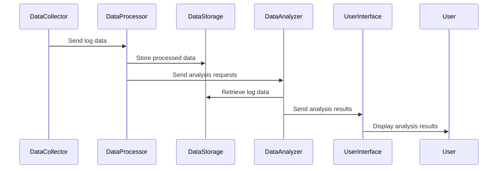
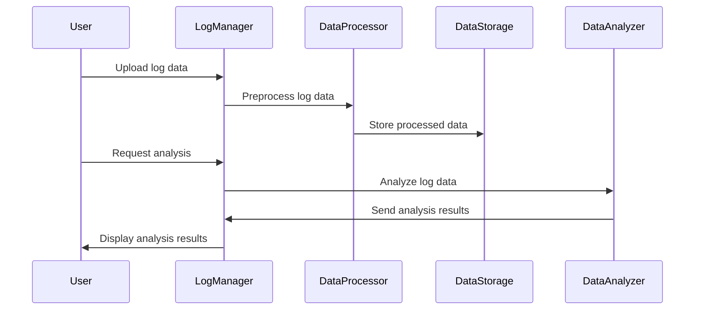

                 

### 引言

在信息化和数字化的快速发展背景下，评测系统已经成为各类业务应用中的重要组成部分。评测系统通过收集、处理和分析大量的数据，为决策提供支持，从而优化业务流程和提升用户体验。然而，随着数据规模的不断增大，日志管理成为了评测系统的关键挑战之一。

## 第1章: 日志管理的重要性与挑战

### 1.1.1 问题背景

日志管理在评测系统中扮演着至关重要的角色。它不仅可以帮助我们记录系统的运行状态，还可以在系统出现问题时提供重要的诊断信息。日志管理的重要性主要体现在以下几个方面：

1. **问题诊断**：日志记录了系统的运行过程，包括正常操作和异常行为。通过分析日志，开发人员可以迅速定位问题的根源，从而进行有效的修复。
2. **性能分析**：日志数据提供了系统运行的详细信息，通过分析这些数据，我们可以了解系统的性能瓶颈，优化系统配置，提升整体性能。
3. **审计和合规**：在许多行业中，日志管理是满足合规要求的重要组成部分。通过日志，可以追踪用户的操作行为，确保系统的安全性和可靠性。

### 1.1.2 日志管理的挑战

尽管日志管理的重要性不言而喻，但实际操作中仍然面临着诸多挑战：

1. **数据量大**：随着系统的规模不断扩大，产生的日志数据量也呈指数级增长。如何高效地存储和管理这些数据成为了一大挑战。
2. **多样化格式**：不同系统和组件可能会产生不同格式的日志，这使得日志的分析和聚合变得复杂。
3. **异构环境**：评测系统往往运行在分布式环境中，日志可能分散在多个节点和设备上，增加了日志管理的难度。
4. **实时性要求**：在一些实时性要求较高的系统中，日志管理需要能够快速响应，实时分析日志数据，以便及时发现和解决问题。

### 1.1.3 日志管理的主要目标

为了克服上述挑战，日志管理的主要目标包括：

1. **高效性**：日志管理系统需要能够快速地收集、存储和分析日志数据。
2. **可扩展性**：系统需要能够适应数据量和日志格式的变化，具备良好的可扩展性。
3. **安全性**：日志管理系统的安全性至关重要，需要确保日志数据的安全存储和访问控制。
4. **易用性**：用户界面需要直观易用，方便开发人员和管理人员进行分析和操作。

### 1.1.4 边界与外延

日志管理不仅与评测系统内部组件紧密相关，还与其他系统模块和业务流程有着广泛的联系。例如，日志管理可能与监控系统、报警系统、数据仓库和业务分析系统等相互交互，共同维护系统的稳定性和可靠性。

### 总结

日志管理是评测系统不可或缺的一部分，它不仅能够支持问题诊断和性能分析，还能为系统的安全性和合规性提供保障。在接下来的章节中，我们将深入探讨日志管理中的核心概念、数据处理与存储、分析工具和技术，以及日志管理系统的设计与实现。

---

## 第1章: 日志管理概述

### 1.1.1 问题背景

日志管理在计算机系统中起着至关重要的作用，尤其是在评测系统中，它提供了宝贵的信息，帮助开发人员和管理人员理解系统的运行状态，识别潜在问题，并优化性能。日志管理的重要性主要体现在以下几个方面：

1. **问题诊断**：日志记录了系统的各种操作和事件，包括正常运行、错误、警告、异常等。通过分析这些日志，开发人员可以快速定位问题的根源，从而进行有效的修复。
2. **性能分析**：日志提供了系统运行过程的详细信息，包括响应时间、资源使用情况等。通过这些数据，我们可以识别系统的性能瓶颈，进行优化，提升系统的整体性能。
3. **审计和合规**：在许多行业中，日志管理是满足合规要求的重要组成部分。通过日志，可以追踪用户的操作行为，确保系统的安全性和可靠性。

### 1.1.2 问题描述

在评测系统中，日志管理面临以下挑战：

1. **数据量大**：随着评测系统的规模不断扩大，产生的日志数据量也呈指数级增长。如何高效地存储和管理这些数据成为了一大挑战。
2. **多样化格式**：不同系统和组件可能会产生不同格式的日志，这使得日志的分析和聚合变得复杂。
3. **异构环境**：评测系统往往运行在分布式环境中，日志可能分散在多个节点和设备上，增加了日志管理的难度。
4. **实时性要求**：在一些实时性要求较高的系统中，日志管理需要能够快速响应，实时分析日志数据，以便及时发现和解决问题。

### 1.1.3 问题解决

为了解决日志管理面临的挑战，可以采取以下策略：

1. **日志标准化**：通过定义统一的日志格式，减少日志格式的多样性，简化日志分析过程。
2. **日志聚合**：将分散在多个节点和设备上的日志数据进行集中处理，提高日志管理的效率。
3. **日志分析工具**：采用高效的日志分析工具，自动化地处理大量日志数据，提取有用信息。
4. **分布式存储**：使用分布式存储系统，如大数据平台，应对大规模日志数据的存储需求。

### 1.1.4 日志管理策略

日志管理策略的核心目标是实现高效、可靠、易用的日志管理系统。以下是一些关键策略：

1. **日志收集**：采用分布式日志收集器，将来自不同节点和设备的日志数据进行统一收集。
2. **日志存储**：使用分布式存储系统，如Hadoop、HDFS等，确保日志数据的可靠性和持久性。
3. **日志分析**：采用高效的日志分析工具，如ELK（Elasticsearch、Logstash、Kibana）堆栈，自动化地处理和分析日志数据。
4. **日志可视化**：通过Kibana等工具，将分析结果以图表和报告的形式可视化，便于理解和分析。

### 1.1.5 边界与外延

日志管理不仅与评测系统内部组件紧密相关，还与其他系统模块和业务流程有着广泛的联系。例如：

1. **监控与报警系统**：日志管理可以与监控和报警系统相结合，实时监控系统的运行状态，当出现异常时及时发出警报。
2. **数据仓库**：日志数据可以作为数据仓库的重要数据源，为业务分析提供支持。
3. **业务流程**：日志管理可以与业务流程紧密集成，为业务决策提供数据支持。

### 1.1.6 总结

日志管理是评测系统中不可或缺的一部分，它不仅能够支持问题诊断和性能分析，还能为系统的安全性和合规性提供保障。通过采取合适的策略和工具，我们可以有效地管理大量的日志数据，提高系统的可靠性和性能。在接下来的章节中，我们将深入探讨日志管理中的核心概念、数据处理与存储、分析工具和技术，以及日志管理系统的设计与实现。

---

## 1.2 核心概念与联系

### 1.2.1 核心概念

为了更好地理解日志管理，我们需要首先明确一些核心概念。以下是日志管理中最重要的三个核心概念：日志文件、日志分析和日志管理系统。

#### 日志文件

日志文件是记录系统事件的数据文件。它通常包含时间戳、事件类型、事件细节等信息。日志文件的格式可以非常简单，如简单的文本格式，也可以非常复杂，如JSON格式。

- **定义**：日志文件是记录系统事件的数据文件，包含时间戳、事件类型、事件细节等。
- **特征**：
  - **时间戳**：标识事件发生的具体时间。
  - **事件类型**：记录事件的类型，如错误、警告、信息等。
  - **事件细节**：详细描述事件的内容。

#### 日志分析

日志分析是对日志文件内容进行分析的过程，目的是从大量的日志数据中提取有用的信息，帮助开发人员和管理人员理解系统的运行状态，识别问题和瓶颈。

- **定义**：日志分析是对日志文件内容进行分析的过程，提取有用的信息。
- **过程**：
  - **数据清洗**：对日志数据中的噪声和错误进行清理。
  - **模式识别**：识别日志数据中的模式和规律。
  - **异常检测**：检测日志数据中的异常行为。

#### 日志管理系统

日志管理系统是负责日志收集、存储、分析、报告等功能的软件系统。它通常包含多个模块，如日志收集器、日志存储器、日志分析器等。

- **定义**：日志管理系统是负责日志收集、存储、分析、报告等功能的软件系统。
- **架构**：
  - **日志收集器**：负责从不同的系统和设备收集日志数据。
  - **日志存储器**：负责存储和管理日志数据。
  - **日志分析器**：负责对日志数据进行分析，生成报告和可视化。

### 1.2.2 概念属性特征对比表

为了更直观地理解这些概念，我们可以通过一个特征对比表来展示它们的主要区别和联系。

| 概念       | 定义                                                     | 特征                                   |
|------------|-----------------------------------------------------------|----------------------------------------|
| 日志文件   | 记录系统事件的数据文件                                   | 时间戳、事件类型、事件细节             |
| 日志分析   | 对日志文件内容进行分析的过程                             | 数据清洗、模式识别、异常检测           |
| 日志管理系统 | 负责日志收集、存储、分析、报告等功能的软件系统               | 可扩展性、高效性、安全性               |

### 1.2.3 ER实体关系图

为了进一步理解这些概念之间的关系，我们可以使用ER（实体关系）图来展示它们之间的关联。

```mermaid
erDiagram
    LogFile ||--|{ LogAnalysis }||>
    LogFile ||--|{ LogManagementSystem }||>
    LogAnalysis ||--|{ LogReport }||>
    LogManagementSystem ||--|{ LogCollector }||>
    LogManagementSystem ||--|{ LogStorage }||>
```

- **LogFile**（日志文件）是日志管理的起点，它记录了系统的各种事件。
- **LogAnalysis**（日志分析）是对日志文件内容进行处理和分析的过程。
- **LogManagementSystem**（日志管理系统）是整体框架，它包含了日志收集器、日志存储器和日志分析器。
- **LogCollector**（日志收集器）负责从各个系统和设备收集日志数据。
- **LogStorage**（日志存储器）负责存储和管理日志数据。
- **LogReport**（日志报告）是日志分析的结果，通常以可视化报告的形式呈现。

通过这些核心概念和它们的属性特征对比表，以及ER实体关系图，我们可以更好地理解日志管理的工作原理和各个组件之间的交互关系。这将为我们后续章节的深入探讨提供坚实的基础。

---

## 第2章: 日志数据的处理与存储

### 2.1 日志数据的预处理

#### 2.1.1 数据格式转换

在日志管理中，数据格式转换是一个重要的步骤。由于不同系统和组件可能会产生不同格式的日志，因此需要进行统一格式化，以便后续的处理和分析。常见的日志格式包括文本格式（如普通文本、CSV等）和结构化格式（如JSON、XML等）。

1. **文本格式处理**：
   - **转换步骤**：
     1. 读取文本文件，解析每条日志记录。
     2. 将日志记录按照一定的规则进行格式化，如提取字段、去除空白字符、特殊字符编码转换等。
     3. 将格式化后的日志记录写入新的文件或数据结构中。
   - **处理方法**：
     - 使用编程语言（如Python、Java等）的文件操作库进行文本处理。
     - 利用正则表达式进行日志记录的解析和格式化。

2. **结构化格式处理**：
   - **转换步骤**：
     1. 读取结构化日志文件，如JSON、XML等。
     2. 使用相应的库（如Python中的`json`模块、`xml.etree.ElementTree`模块等）解析日志数据。
     3. 将解析后的数据转换为统一的结构化格式，如字典、列表等。
     4. 将结构化数据写入新的文件或数据库中。
   - **处理方法**：
     - 使用专门的库进行结构化数据的解析和转换。
     - 利用数据转换工具（如Apache NiFi、Apache Beam等）进行批处理。

#### 2.1.2 数据清洗

数据清洗是日志处理的重要环节，它涉及到去除无效数据、纠正错误数据、填补缺失数据等。

1. **清洗必要性**：
   - **去重**：去除重复的日志记录，确保数据的一致性。
   - **去除噪声**：过滤掉无关或错误的数据，如空记录、异常值等。
   - **数据修复**：纠正错误数据，如时间戳错误、字段值错误等。
   - **数据标准化**：统一格式和数据类型，如字符串转数字、时间格式化等。

2. **常见的数据清洗方法**：
   - **基于规则的清洗**：根据预定义的规则进行数据清洗，如去除空白记录、去除特殊字符等。
   - **机器学习方法**：利用机器学习算法对异常数据进行检测和纠正，如使用聚类算法检测并修复缺失数据。
   - **手工清洗**：对于复杂的数据问题，需要人工介入进行清洗和验证。

### 2.2 日志数据的存储

#### 2.2.1 数据库选择

在选择日志数据存储方案时，需要考虑数据量、查询性能、数据一致性等因素。

1. **关系型数据库**：
   - **优点**：
     - 数据一致性强。
     - 支持复杂的查询。
     - 易于使用和管理。
   - **缺点**：
     - 扩展性较差，不适合大规模数据的存储。
     - 写入性能较低。
   - **适用场景**：
     - 小规模日志数据的存储。
     - 需要强一致性保证的场景。

2. **非关系型数据库**：
   - **优点**：
     - 扩展性好，能够水平扩展。
     - 写入性能高。
     - 支持多种数据模型，如键值对、文档、图等。
   - **缺点**：
     - 数据一致性较弱。
     - 查询能力有限，尤其对于复杂查询。
   - **适用场景**：
     - 大规模日志数据的存储。
     - 高性能读写需求。
     - 数据模型多样化的场景。

#### 2.2.2 数据库设计

数据库设计是日志存储的关键，需要考虑数据表结构、索引设计等因素。

1. **数据表结构设计**：
   - **字段设计**：根据日志数据的内容和需求，设计相应的字段，如时间戳、事件类型、事件详情等。
   - **数据类型**：选择合适的数据类型，如时间戳使用`timestamp`类型，字符串使用`varchar`类型等。
   - **主键设计**：为每个日志记录设计一个唯一的主键，如使用自动增长的整数作为主键。

2. **索引设计**：
   - **索引类型**：根据查询需求，选择合适的索引类型，如B树索引、全文索引等。
   - **索引字段**：选择对性能影响较大的字段作为索引，如时间戳、事件类型等。

### 总结

日志数据的预处理和存储是日志管理的重要环节。通过数据格式转换和清洗，我们可以确保日志数据的准确性和一致性。选择合适的数据库和设计合理的数据库结构，能够提高日志存储和查询的效率。在接下来的章节中，我们将继续探讨日志分析工具和技术，以及日志管理系统的设计与实现。

---

## 第3章: 日志分析工具与技术

### 3.1 日志分析工具概述

日志分析工具是日志管理系统中不可或缺的一部分，它们可以帮助我们高效地处理和分析大量的日志数据，从而提取出有用的信息，支持问题诊断和性能优化。以下是几种常见的日志分析工具：

#### 3.1.1 Logstash

Logstash是一款开源的数据收集、处理和传输工具，由 Elastic 公司开发。它能够将来自不同来源的数据（如文件、数据库、Web服务等）进行收集、清洗和转换，然后将其发送到目标存储或分析工具。

- **特点**：
  - 支持多种数据源和输出目标。
  - 提供丰富的插件，方便自定义数据处理流程。
  - 可以水平扩展，适用于大规模日志数据处理。

- **应用场景**：
  - 数据收集和传输。
  - 数据预处理和转换。
  - 集成其他日志分析工具。

#### 3.1.2 Log Analyzer

Log Analyzer是一款商业化的日志分析工具，通常集成在企业级安全管理解决方案中。它提供直观的界面和强大的分析功能，能够帮助用户快速定位问题和瓶颈。

- **特点**：
  - 强大的搜索和分析功能。
  - 可视化报表和仪表板。
  - 支持多种日志格式和协议。

- **应用场景**：
  - 安全事件分析。
  - 性能监控和优化。
  - 日志数据归档和备份。

#### 3.1.3 ELK Stack

ELK Stack是由Elasticsearch、Logstash和Kibana三个开源工具组成的日志分析堆栈。Elasticsearch提供高效的全文搜索和分析功能，Logstash负责数据收集和预处理，Kibana则提供可视化和报表功能。

- **特点**：
  - 高性能和可扩展性。
  - 易于使用和集成。
  - 提供丰富的插件和社区支持。

- **应用场景**：
  - 日志数据存储和分析。
  - 实时监控和报警。
  - 人工智能和机器学习应用。

### 3.2 日志分析技术

日志分析技术主要包括日志聚合、日志分析算法和可视化技术等。

#### 3.2.1 日志聚合

日志聚合是将来自不同来源的日志数据进行集中处理和存储的过程。通过日志聚合，我们可以统一管理和分析大量分散的日志数据。

- **作用**：
  - 减少日志数据的存储和查询开销。
  - 提高日志数据的可用性和一致性。

- **工作流程**：
  1. **数据收集**：使用日志收集工具（如Logstash）从不同来源（如服务器、应用程序等）收集日志数据。
  2. **数据预处理**：对收集到的日志数据进行清洗、转换和标准化，确保数据的一致性和准确性。
  3. **数据存储**：将预处理后的日志数据存储到集中式存储（如Elasticsearch）中。
  4. **数据查询和分析**：通过日志分析工具（如Kibana）查询和分析存储在集中式存储中的日志数据。

#### 3.2.2 日志分析算法

日志分析算法是用于对日志数据进行模式识别、异常检测等操作的方法。以下是一些常见的日志分析算法：

- **模式识别**：
  - **统计方法**：通过统计方法识别日志数据中的模式和规律，如时间序列分析、聚类分析等。
  - **机器学习方法**：利用机器学习算法（如决策树、随机森林、神经网络等）进行模式识别，提高识别的准确性和效率。

- **异常检测**：
  - **基于阈值的异常检测**：通过设置阈值，对日志数据进行分类，识别异常行为。
  - **基于统计模型的异常检测**：使用统计模型（如高斯分布、泊松分布等）预测正常行为，识别异常行为。
  - **基于机器学习的异常检测**：利用机器学习算法（如K-最近邻、孤立森林等）识别异常行为。

#### 3.2.3 可视化技术

可视化技术是将分析结果以图表和报告的形式呈现，帮助用户更好地理解和分析日志数据。

- **作用**：
  - 提高数据的可读性。
  - 发现数据中的潜在问题和趋势。

- **常见可视化工具**：
  - **Kibana**：提供丰富的图表和报告功能，支持实时数据分析和可视化。
  - **Grafana**：支持多种数据源，提供灵活的仪表板和报告功能。
  - **Tableau**：提供强大的数据可视化和报表功能，支持多种数据连接和数据分析工具。

### 总结

日志分析工具和技术的选择对于日志管理系统的有效性和可靠性至关重要。通过合适的工具和技术，我们可以高效地处理和分析大量的日志数据，支持问题诊断和性能优化。在接下来的章节中，我们将深入探讨日志管理系统的设计与实现，包括系统功能设计、系统架构设计、系统接口设计和系统交互设计。

---

## 第4章: 日志管理系统的设计与实现

### 4.1 系统功能设计

日志管理系统的功能设计是确保系统能够高效地收集、存储、分析和管理日志数据的基础。以下是系统功能设计的关键步骤：

#### 4.1.1 领域模型设计

领域模型设计是系统功能设计的第一步，它帮助我们明确系统的核心实体及其之间的关系。以下是日志管理系统的领域模型：

1. **日志记录**：表示系统产生的日志数据，包括时间戳、事件类型、事件详情等。
2. **日志源**：表示日志数据的来源，如服务器、应用程序、网络设备等。
3. **日志处理**：表示日志数据的处理过程，包括数据清洗、格式转换、异常检测等。
4. **日志存储**：表示日志数据的存储，包括数据库、文件系统等。
5. **日志报告**：表示日志数据的分析结果和可视化报告。

#### 4.1.2 系统功能模块划分

在领域模型的基础上，我们可以将日志管理系统划分为以下主要功能模块：

1. **数据收集模块**：负责从不同的日志源收集日志数据。
2. **数据预处理模块**：负责对收集到的日志数据进行清洗、格式转换等预处理操作。
3. **数据存储模块**：负责将预处理后的日志数据存储到指定的存储介质中。
4. **数据分析模块**：负责对存储的日志数据进行分析，提取有用的信息，生成报告和可视化结果。
5. **用户界面模块**：提供用户交互界面，供开发人员和管理人员查看和分析日志数据。

### 4.2 系统架构设计

系统架构设计是日志管理系统实现的核心，它决定了系统的可扩展性、可靠性和性能。以下是系统架构设计的几个关键方面：

#### 4.2.1 系统架构概述

日志管理系统的架构通常采用分布式架构，以支持大规模日志数据的处理和存储。系统架构包括以下主要层次：

1. **数据采集层**：负责从各种日志源收集日志数据，如服务器、应用程序、网络设备等。
2. **数据处理层**：负责对收集到的日志数据进行清洗、格式转换、异常检测等处理。
3. **数据存储层**：负责存储处理后的日志数据，通常使用分布式数据库或文件系统。
4. **数据分析层**：负责对存储的日志数据进行分析，生成报告和可视化结果。
5. **用户访问层**：提供用户界面，供开发人员和管理人员访问和分析日志数据。

#### 4.2.2 系统模块交互关系

以下是系统模块之间的交互关系：

1. **数据收集模块**：将日志数据发送到数据处理模块。
2. **数据处理模块**：对日志数据进行预处理后，将其存储到数据存储模块。
3. **数据分析模块**：从数据存储模块中读取日志数据，进行进一步分析，并将分析结果存储到数据库或生成可视化报告。
4. **用户界面模块**：从数据库或数据存储模块中获取日志数据和分析结果，显示在用户界面上。

#### 4.2.3 系统架构设计图

以下是日志管理系统的架构设计图：



### 4.3 系统接口设计

系统接口设计是确保系统模块之间能够无缝交互的重要一环。以下是系统接口设计的关键方面：

#### 4.3.1 系统对外接口设计

日志管理系统需要提供以下对外接口：

1. **日志数据上传接口**：允许用户上传日志数据到系统。
2. **日志数据分析接口**：提供日志数据的查询和分析功能。
3. **日志报告生成接口**：允许用户生成和分析日志报告。

#### 4.3.2 接口规范

以下是接口规范的一个示例：

1. **日志数据上传接口**：
   - **URL**：/api/logs/upload
   - **HTTP方法**：POST
   - **请求参数**：
     - logData（日志数据，JSON格式）
   - **响应结果**：
     - status（状态码，如200表示成功）
     - message（消息，如"日志数据上传成功"）

2. **日志数据分析接口**：
   - **URL**：/api/logs/analyze
   - **HTTP方法**：GET
   - **请求参数**：
     - logId（日志ID）
   - **响应结果**：
     - status（状态码）
     - message（消息）
     - analysisResult（分析结果，JSON格式）

3. **日志报告生成接口**：
   - **URL**：/api/logs/report
   - **HTTP方法**：POST
   - **请求参数**：
     - logId（日志ID）
     - reportType（报告类型，如文本、图表等）
   - **响应结果**：
     - status（状态码）
     - message（消息）
     - reportData（报告数据，JSON格式）

### 4.4 系统交互设计

系统交互设计是确保系统模块之间能够高效、可靠地交互的重要一环。以下是系统交互设计的关键方面：

#### 4.4.1 系统交互流程

以下是日志管理系统的交互流程：

1. **用户上传日志数据**：用户通过日志数据上传接口上传日志数据到系统。
2. **系统接收日志数据**：系统接收上传的日志数据，并调用数据处理模块对日志数据进行预处理。
3. **系统存储日志数据**：预处理后的日志数据被存储到数据存储模块中。
4. **用户请求日志数据分析**：用户通过日志数据分析接口请求对特定日志ID的数据进行分析。
5. **系统处理分析请求**：系统从数据存储模块中读取日志数据，并调用数据分析模块进行进一步分析。
6. **系统生成分析结果**：分析结果被存储到数据库中，并返回给用户。
7. **用户查看分析结果**：用户通过用户界面模块查看和分析结果。

#### 4.4.2 序列图

以下是日志管理系统交互的序列图：



### 总结

日志管理系统的设计与实现是确保系统能够高效、可靠地收集、存储、分析和管理日志数据的关键。通过详细的系统功能设计、系统架构设计、系统接口设计和系统交互设计，我们可以构建一个灵活、可扩展、易于使用的日志管理系统。在接下来的章节中，我们将通过实际案例来展示日志管理系统的具体实现和应用。

---

## 第5章: 支持问题诊断的日志管理

### 5.1 问题诊断需求分析

在评测系统中，问题诊断是确保系统稳定运行和业务连续性的重要环节。有效的日志管理系统能够为问题诊断提供强有力的支持，从而快速识别和解决系统故障。以下是问题诊断需求分析的关键点：

#### 5.1.1 问题诊断的定义

问题诊断是指通过分析系统日志，识别系统异常、故障或性能瓶颈的过程。它包括以下几个步骤：

1. **日志收集**：从各种日志源（如服务器、应用程序、网络设备等）收集日志数据。
2. **日志预处理**：对收集到的日志数据进行清洗、格式转换等预处理，确保数据的一致性和准确性。
3. **日志分析**：对预处理后的日志数据进行分析，提取与问题相关的信息。
4. **问题定位**：根据分析结果，定位问题的根源，如具体的服务器、应用程序或组件。
5. **故障解决**：采取相应的措施，如修改配置、升级软件或硬件等，解决系统故障。

#### 5.1.2 问题诊断的必要性

在现代分布式系统中，问题诊断的必要性体现在以下几个方面：

1. **提高系统可靠性**：通过实时监测和分析系统日志，可以及时发现系统故障，降低系统故障率，提高系统的可靠性。
2. **减少停机时间**：快速诊断和解决系统故障，可以显著减少系统的停机时间，保障业务的连续性。
3. **提升用户体验**：及时解决问题，提升系统的响应速度和稳定性，从而提高用户体验。
4. **降低运营成本**：通过自动化日志分析工具，降低人工排查故障的时间和成本。

#### 5.1.3 日志管理系统在问题诊断中的应用

日志管理系统在问题诊断中的应用主要体现在以下几个方面：

1. **日志数据的全面收集**：日志管理系统能够从各种日志源收集日志数据，确保问题诊断所需的信息全面。
2. **日志数据的集中存储**：将分散的日志数据进行集中存储，方便进行统一的分析和管理。
3. **日志数据的实时分析**：日志管理系统可以实时分析日志数据，快速识别系统异常。
4. **日志数据的可视化**：通过日志分析工具，将分析结果以图表和报告的形式呈现，帮助用户直观地了解系统状态。
5. **日志数据的查询和搜索**：提供强大的查询和搜索功能，方便快速定位问题。

### 5.2 问题诊断的实现方法

日志管理系统中的问题诊断功能通常包括以下几个关键步骤：

#### 5.2.1 数据采集

1. **日志采集**：使用日志采集工具（如Logstash、Fluentd等）从各种日志源（如服务器、应用程序、网络设备等）收集日志数据。
2. **数据传输**：将采集到的日志数据传输到集中存储系统（如Elasticsearch、Kafka等）。
3. **数据预处理**：对传输来的日志数据进行清洗、格式转换等预处理操作，确保数据的准确性和一致性。

#### 5.2.2 数据分析

1. **模式识别**：通过统计分析、机器学习等方法，识别日志数据中的模式和规律，如常见错误类型、异常行为等。
2. **异常检测**：使用阈值检测、统计模型检测、机器学习检测等方法，识别日志数据中的异常行为和潜在问题。
3. **关联分析**：对多个日志源的数据进行关联分析，识别不同系统组件之间的关联性，帮助定位问题。

#### 5.2.3 问题定位

1. **日志搜索**：使用日志分析工具（如Kibana、Grafana等）提供的查询和搜索功能，快速定位与问题相关的日志记录。
2. **故障回溯**：分析日志数据，回溯故障发生前后的操作和事件，识别故障的原因。
3. **趋势分析**：分析日志数据中的趋势变化，识别系统性能瓶颈和潜在问题。

#### 5.2.4 故障解决

1. **自动告警**：当检测到异常时，自动发送告警信息，通知相关人员处理。
2. **故障排查**：根据日志分析结果，进行故障排查，定位问题根源。
3. **故障修复**：根据排查结果，采取相应的措施，如修改配置、升级软件或硬件等，修复系统故障。

### 5.3 实际案例

以下是一个问题诊断的实际案例：

#### 案例背景

某电子商务平台在高峰时段出现大量订单处理缓慢的问题，影响了用户体验和业务运营。为了快速解决问题，平台的技术团队利用日志管理系统进行问题诊断。

#### 案例步骤

1. **日志采集**：通过Logstash从订单处理系统、数据库服务器、Web服务器等日志源采集日志数据。
2. **日志预处理**：对采集到的日志数据进行清洗，提取与订单处理相关的字段，如时间戳、订单ID、处理状态等。
3. **异常检测**：使用机器学习算法对日志数据进行分析，识别订单处理缓慢的异常行为。
4. **故障回溯**：通过日志搜索功能，回溯故障发生前后的操作和事件，发现数据库查询延迟是导致订单处理缓慢的主要原因。
5. **故障解决**：技术团队对数据库进行优化，调整查询索引，提高查询性能，从而解决了订单处理缓慢的问题。

#### 案例总结

通过日志管理系统进行问题诊断，平台技术团队能够迅速定位故障根源，并采取有效的措施解决问题。这不仅提高了系统的可靠性，还减少了用户的等待时间，提升了用户体验。

### 总结

日志管理系统在问题诊断中发挥着重要作用。通过有效的日志管理策略和工具，我们可以快速识别和解决系统故障，提高系统的可靠性和稳定性。在下一章中，我们将进一步探讨日志管理系统的设计与实现，包括系统功能设计、系统架构设计、系统接口设计和系统交互设计。

---

## 第6章: 支持性能分析的日志管理

### 6.1 性能分析需求分析

在现代信息化和数字化进程中，评测系统的性能分析成为确保系统高效运行和业务连续性的关键。有效的日志管理系统能够为性能分析提供强有力的支持，从而识别系统的性能瓶颈和优化方向。以下是性能分析需求分析的关键点：

#### 6.1.1 性能分析的定义

性能分析是指通过收集和分析系统运行数据，评估系统性能，识别瓶颈和优化方向的过程。它包括以下几个步骤：

1. **数据采集**：从各种系统组件（如服务器、数据库、网络设备等）收集性能数据。
2. **数据预处理**：对采集到的性能数据进行清洗、格式转换等预处理操作，确保数据的一致性和准确性。
3. **数据分析**：对预处理后的性能数据进行分析，提取与性能相关的信息。
4. **性能评估**：根据分析结果，评估系统的性能，识别瓶颈和优化方向。
5. **性能优化**：采取相应的措施，如调整系统配置、优化代码或硬件等，提升系统性能。

#### 6.1.2 性能分析的必要性

在现代分布式系统中，性能分析的必要性体现在以下几个方面：

1. **优化系统资源利用**：通过性能分析，可以识别系统资源的瓶颈，优化资源分配，提高资源利用率。
2. **提升用户体验**：性能分析能够帮助识别系统性能问题，从而提升系统的响应速度和稳定性，提高用户体验。
3. **降低运营成本**：通过性能优化，可以降低系统故障率和维护成本，提高系统的整体效率。
4. **保障业务连续性**：性能分析能够及时发现系统性能瓶颈，采取预防措施，保障业务的连续性和稳定性。

#### 6.1.3 日志管理系统在性能分析中的应用

日志管理系统在性能分析中的应用主要体现在以下几个方面：

1. **日志数据的全面收集**：日志管理系统能够从各种系统组件收集性能数据，确保性能分析所需的信息全面。
2. **日志数据的集中存储**：将分散的性能数据集中存储，方便进行统一的分析和管理。
3. **日志数据的实时分析**：日志管理系统可以实时分析性能数据，快速识别系统性能问题。
4. **日志数据的可视化**：通过日志分析工具，将分析结果以图表和报告的形式呈现，帮助用户直观地了解系统性能。
5. **日志数据的查询和搜索**：提供强大的查询和搜索功能，方便快速定位性能问题。

### 6.2 性能分析的实现方法

日志管理系统中的性能分析功能通常包括以下几个关键步骤：

#### 6.2.1 数据采集

1. **性能数据采集**：使用性能监控工具（如Prometheus、Grafana等）从各种系统组件（如服务器、数据库、网络设备等）采集性能数据。
2. **数据传输**：将采集到的性能数据传输到集中存储系统（如InfluxDB、Elasticsearch等）。
3. **数据预处理**：对传输来的性能数据进行清洗、格式转换等预处理操作，确保数据的准确性和一致性。

#### 6.2.2 数据分析

1. **趋势分析**：对性能数据进行趋势分析，识别系统性能的长期变化趋势。
2. **异常检测**：使用阈值检测、统计模型检测、机器学习检测等方法，识别性能数据中的异常行为和潜在问题。
3. **关联分析**：对多个性能数据源进行关联分析，识别不同系统组件之间的关联性，帮助定位性能瓶颈。

#### 6.2.3 性能评估

1. **关键指标计算**：计算系统的关键性能指标（KPI），如响应时间、吞吐量、CPU利用率等。
2. **性能比较**：将当前系统的性能与历史性能数据进行比较，识别性能变化情况。
3. **基准测试**：进行基准测试，评估系统在不同负载下的性能表现。

#### 6.2.4 性能优化

1. **故障排查**：根据性能分析结果，排查系统故障，识别导致性能下降的原因。
2. **代码优化**：对系统代码进行优化，提高系统的执行效率。
3. **硬件升级**：根据性能需求，升级系统硬件，提高系统性能。
4. **配置调整**：调整系统配置，优化系统资源分配。

### 6.3 实际案例

以下是一个性能分析的实际案例：

#### 案例背景

某在线教育平台在用户访问高峰期出现系统响应缓慢的问题，影响了用户体验和业务运营。为了提升系统性能，平台的技术团队利用日志管理系统进行性能分析。

#### 案例步骤

1. **性能数据采集**：通过Prometheus从服务器、数据库、Web服务器等系统组件采集性能数据。
2. **日志预处理**：对采集到的性能数据进行清洗，提取与系统性能相关的字段，如时间戳、响应时间、请求类型等。
3. **异常检测**：使用Grafana对日志数据进行实时分析，识别系统性能异常。
4. **故障排查**：通过日志分析结果，定位到数据库查询延迟是导致系统响应缓慢的主要原因。
5. **性能优化**：技术团队对数据库进行优化，调整查询索引，增加服务器资源，从而提升了系统性能。

#### 案例总结

通过日志管理系统进行性能分析，平台技术团队能够迅速识别系统性能瓶颈，并采取有效的优化措施，提升了系统的响应速度和稳定性，从而改善了用户体验，保障了业务的连续性和稳定性。

### 总结

日志管理系统在性能分析中发挥着重要作用。通过有效的日志管理策略和工具，我们可以快速识别和解决系统性能问题，提升系统的运行效率和服务质量。在下一章中，我们将进一步探讨日志管理系统的设计与实现，包括系统功能设计、系统架构设计、系统接口设计和系统交互设计。

---

## 第7章: 日志管理系统的设计与实现（续）

### 7.1 系统功能设计

在前一章中，我们已经讨论了日志管理系统的功能设计，明确了系统的主要功能模块。为了确保系统的有效性和易用性，我们需要对每个功能模块进行详细的设计。

#### 7.1.1 数据收集模块

数据收集模块是日志管理系统的核心，负责从各种日志源收集日志数据。以下是该模块的设计要点：

1. **日志源识别**：设计一个日志源识别系统，能够自动识别和配置各种日志源，如服务器、应用程序、网络设备等。
2. **日志收集策略**：根据日志源的特点和日志数据量，设计合适的日志收集策略，如按需收集、定时收集等。
3. **日志格式转换**：设计日志格式转换机制，将不同格式的日志数据转换为统一的格式，便于后续处理和分析。
4. **日志传输**：设计日志传输机制，将收集到的日志数据传输到日志存储系统，保证数据传输的高效性和可靠性。

#### 7.1.2 数据预处理模块

数据预处理模块负责对收集到的日志数据进行清洗、格式转换和异常处理。以下是该模块的设计要点：

1. **数据清洗**：设计数据清洗算法，去除无效数据、重复数据和噪声数据。
2. **格式转换**：设计日志格式转换规则，将不同格式的日志数据转换为统一的格式。
3. **异常处理**：设计异常检测和修复算法，识别并修复日志数据中的异常值和错误数据。
4. **数据压缩**：设计数据压缩算法，减少日志数据的存储空间，提高存储效率。

#### 7.1.3 数据存储模块

数据存储模块负责将预处理后的日志数据存储到数据库或文件系统中。以下是该模块的设计要点：

1. **存储方案选择**：根据日志数据量、查询需求和存储成本，选择合适的存储方案，如关系型数据库、NoSQL数据库、文件系统等。
2. **数据表设计**：设计日志数据表结构，包括字段设计、数据类型选择和索引设计。
3. **数据备份与恢复**：设计数据备份和恢复策略，确保日志数据的安全性和可靠性。
4. **数据访问控制**：设计数据访问控制机制，确保日志数据的安全性和隐私性。

#### 7.1.4 数据分析模块

数据分析模块负责对存储的日志数据进行实时分析和历史分析，提取有用的信息，生成报告和可视化结果。以下是该模块的设计要点：

1. **分析算法设计**：设计各种日志分析算法，如模式识别、异常检测、关联分析等。
2. **实时分析**：设计实时分析机制，对实时收集的日志数据进行快速分析，识别异常和性能问题。
3. **历史分析**：设计历史分析机制，对历史日志数据进行深度分析，识别长期趋势和潜在问题。
4. **报告生成**：设计报告生成工具，将分析结果以图表、报表等形式呈现，便于用户理解和决策。

#### 7.1.5 用户界面模块

用户界面模块负责提供用户交互界面，供开发人员和管理人员查看、分析和操作日志数据。以下是该模块的设计要点：

1. **界面设计**：设计简洁、直观的用户界面，便于用户操作。
2. **功能集成**：集成数据收集、预处理、存储、分析等模块的功能，提供一站式操作体验。
3. **可视化工具**：集成各种可视化工具，如图表库、报表工具等，方便用户生成和查看分析结果。
4. **权限管理**：设计权限管理机制，确保用户只能访问和操作授权的数据和功能。

### 7.2 系统架构设计

系统架构设计是日志管理系统的关键，它决定了系统的性能、可靠性和可扩展性。以下是系统架构设计的几个关键方面：

#### 7.2.1 系统架构概述

日志管理系统的架构通常采用分布式架构，以支持大规模日志数据的处理和存储。系统架构包括以下主要层次：

1. **数据采集层**：负责从各种日志源收集日志数据。
2. **数据处理层**：负责对收集到的日志数据进行清洗、格式转换等处理。
3. **数据存储层**：负责存储处理后的日志数据。
4. **数据分析层**：负责对存储的日志数据进行分析和处理。
5. **用户访问层**：提供用户交互界面，供用户查看和分析日志数据。

#### 7.2.2 系统模块交互关系

以下是系统模块之间的交互关系：

1. **数据收集模块**：将日志数据发送到数据处理模块。
2. **数据处理模块**：对日志数据进行预处理后，将其存储到数据存储模块。
3. **数据分析模块**：从数据存储模块中读取日志数据，进行进一步分析，并将分析结果存储到数据库或生成可视化报告。
4. **用户界面模块**：从数据库或数据存储模块中获取日志数据和分析结果，显示在用户界面上。

#### 7.2.3 系统架构设计图

以下是日志管理系统的架构设计图：


### 7.3 系统接口设计

系统接口设计是确保系统模块之间能够无缝交互的重要一环。以下是系统接口设计的关键方面：

#### 7.3.1 系统对外接口设计

日志管理系统需要提供以下对外接口：

1. **日志数据上传接口**：允许用户上传日志数据到系统。
2. **日志数据分析接口**：提供日志数据的查询和分析功能。
3. **日志报告生成接口**：允许用户生成和分析日志报告。

#### 7.3.2 接口规范

以下是接口规范的一个示例：

1. **日志数据上传接口**：
   - **URL**：/api/logs/upload
   - **HTTP方法**：POST
   - **请求参数**：
     - logData（日志数据，JSON格式）
   - **响应结果**：
     - status（状态码，如200表示成功）
     - message（消息，如"日志数据上传成功"）

2. **日志数据分析接口**：
   - **URL**：/api/logs/analyze
   - **HTTP方法**：GET
   - **请求参数**：
     - logId（日志ID）
   - **响应结果**：
     - status（状态码）
     - message（消息）
     - analysisResult（分析结果，JSON格式）

3. **日志报告生成接口**：
   - **URL**：/api/logs/report
   - **HTTP方法**：POST
   - **请求参数**：
     - logId（日志ID）
     - reportType（报告类型，如文本、图表等）
   - **响应结果**：
     - status（状态码）
     - message（消息）
     - reportData（报告数据，JSON格式）

### 7.4 系统交互设计

系统交互设计是确保系统模块之间能够高效、可靠地交互的重要一环。以下是系统交互设计的关键方面：

#### 7.4.1 系统交互流程

以下是日志管理系统交互的流程：

1. **用户上传日志数据**：用户通过日志数据上传接口上传日志数据到系统。
2. **系统接收日志数据**：系统接收上传的日志数据，并调用数据处理模块对日志数据进行预处理。
3. **系统存储日志数据**：预处理后的日志数据被存储到数据存储模块中。
4. **用户请求日志数据分析**：用户通过日志数据分析接口请求对特定日志ID的数据进行分析。
5. **系统处理分析请求**：系统从数据存储模块中读取日志数据，并调用数据分析模块进行进一步分析。
6. **系统生成分析结果**：分析结果被存储到数据库中，并返回给用户。
7. **用户查看分析结果**：用户通过用户界面模块查看和分析结果。

#### 7.4.2 序列图

以下是日志管理系统交互的序列图：


### 总结

日志管理系统的设计与实现是确保系统能够高效、可靠地收集、存储、分析和管理日志数据的关键。通过详细的系统功能设计、系统架构设计、系统接口设计和系统交互设计，我们可以构建一个灵活、可扩展、易于使用的日志管理系统。在下一章中，我们将通过实际案例展示日志管理系统的具体实现和应用。

---

## 第8章: 项目实战

### 8.1 环境安装

在本章中，我们将搭建一个简单的日志管理系统，用于展示日志管理的全过程。首先，我们需要准备以下环境：

1. **操作系统**：Linux（推荐使用Ubuntu 20.04）。
2. **编程语言**：Python 3.x。
3. **日志收集工具**：Fluentd。
4. **日志存储工具**：Elasticsearch + Kibana。
5. **日志分析工具**：Logstash。

以下是环境安装的详细步骤：

#### 8.1.1 安装Elasticsearch

1. **安装Java**：

   ```bash
   sudo apt-get update
   sudo apt-get install openjdk-11-jdk
   ```

2. **下载Elasticsearch**：

   ```bash
   wget https://artifacts.elastic.co/downloads/elasticsearch/elasticsearch-7.10.0-amd64.deb
   ```

3. **安装Elasticsearch**：

   ```bash
   sudo dpkg -i elasticsearch-7.10.0-amd64.deb
   ```

4. **配置Elasticsearch**：

   - 修改`elasticsearch.yml`文件，设置集群名称和节点名称：

     ```yaml
     cluster.name: my-log-management-cluster
     node.name: master
     network.host: 0.0.0.0
     http.port: 9200
     ```

   - 启动Elasticsearch服务：

     ```bash
     sudo systemctl start elasticsearch
     ```

   - 检查Elasticsearch服务状态：

     ```bash
     sudo systemctl status elasticsearch
     ```

#### 8.1.2 安装Kibana

1. **下载Kibana**：

   ```bash
   wget https://artifacts.elastic.co/downloads/kibana/kibana-7.10.0-amd64.deb
   ```

2. **安装Kibana**：

   ```bash
   sudo dpkg -i kibana-7.10.0-amd64.deb
   ```

3. **配置Kibana**：

   - 修改`kibana.yml`文件，设置Kibana访问地址和Elasticsearch连接信息：

     ```yaml
     server.host: "0.0.0.0"
     elasticsearch.url: "http://localhost:9200"
     ```

   - 启动Kibana服务：

     ```bash
     sudo systemctl start kibana
     ```

   - 检查Kibana服务状态：

     ```bash
     sudo systemctl status kibana
     ```

   - 访问Kibana Web界面：

     ```bash
     open http://localhost:5601
     ```

#### 8.1.3 安装Fluentd

1. **添加Fluentd存储库**：

   ```bash
   sudo apt-get install apt-transport-https
   sudo apt-get install software-properties-common
   sudo add-apt-repository "deb https://packagecloud.io/fluentsystems/public/debian/ buster main"
   sudo apt-get update
   ```

2. **安装Fluentd**：

   ```bash
   sudo apt-get install fluentd
   ```

3. **配置Fluentd**：

   - 修改`/etc/fluent/config.d/01-fluentd.conf`文件，添加Elasticsearch输出插件：

     ```yaml
     <match **>
       type elasticsearch
       host localhost
       port 9200
       logstash_format
       template_name template
       template << EOF
       {
         "timestamp": "@timestamp",
         "message": "{{id}} {{message}}"
       }
       EOF
     </match>
     ```

   - 启动Fluentd服务：

     ```bash
     sudo systemctl start fluentd
     ```

   - 检查Fluentd服务状态：

     ```bash
     sudo systemctl status fluentd
     ```

### 8.2 系统核心实现源代码

在搭建好环境后，我们需要编写一些Python代码来模拟日志生成和日志分析的过程。以下是一个简单的日志生成脚本和日志分析脚本。

#### 8.2.1 日志生成脚本（`log_generator.py`）

```python
import time
import random
import json
from datetime import datetime

def generate_logs(num_logs, log_file='logs/logstash.log'):
    with open(log_file, 'w') as f:
        for i in range(num_logs):
            log_entry = {
                'timestamp': datetime.utcnow().isoformat(),
                'level': random.choice(['INFO', 'WARNING', 'ERROR']),
                'message': f'Log {i} - This is a sample log message',
                'source': random.choice(['server1', 'server2', 'application']),
                'status': random.randint(200, 500)
            }
            f.write(json.dumps(log_entry) + '\n')
            time.sleep(random.uniform(0.1, 0.5))

generate_logs(100)
```

#### 8.2.2 日志分析脚本（`log_analyzer.py`）

```python
import json
import requests

def send_log_to_elasticsearch(log_entry):
    url = 'http://localhost:9200/logs/logstash/_doc'
    headers = {'Content-Type': 'application/json'}
    response = requests.post(url, headers=headers, data=log_entry)
    return response.json()

def analyze_logs():
    url = 'http://localhost:9200/logs/logstash/_search'
    query = {
        'query': {
            'match_all': {}
        }
    }
    headers = {'Content-Type': 'application/json'}
    response = requests.post(url, headers=headers, data=json.dumps(query))
    logs = response.json()['hits']['hits']
    for log in logs:
        print(log['_source'])

if __name__ == '__main__':
    log_entry = {
        'timestamp': datetime.utcnow().isoformat(),
        'level': 'INFO',
        'message': 'This is an analyzed log message',
        'source': 'application',
        'status': 200
    }
    send_log_to_elasticsearch(json.dumps(log_entry))
    analyze_logs()
```

### 8.3 代码应用解读与分析

在上述代码中，我们实现了两个主要功能：

1. **日志生成**：`log_generator.py`脚本通过生成随机日志数据并写入到日志文件中。
2. **日志分析**：`log_analyzer.py`脚本通过将日志数据发送到Elasticsearch，并进行简单的日志分析。

#### 8.3.1 日志生成解读

- `generate_logs`函数接收两个参数：`num_logs`（生成的日志数量）和`log_file`（日志文件的路径）。
- 函数通过遍历`num_logs`，为每个日志生成一个字典，包含`timestamp`（日志时间戳）、`level`（日志级别）、`message`（日志消息）、`source`（日志来源）和`status`（HTTP状态码）。
- 每个日志条目通过`json.dumps`转换为JSON格式，并写入到日志文件中。
- `time.sleep`函数用于模拟日志生成的间隔时间。

#### 8.3.2 日志分析解读

- `send_log_to_elasticsearch`函数将日志数据转换为JSON格式，并通过HTTP POST请求将其发送到Elasticsearch。
- `analyze_logs`函数发送一个简单的查询到Elasticsearch，获取所有日志数据，并打印出来。

### 8.4 实际案例分析和详细讲解

为了更好地理解日志管理系统的实际应用，我们通过以下案例进行详细分析：

#### 案例背景

某电商平台在其业务高峰期（如双11购物节）面临巨大的日志量，需要实时监控和分析日志，以便快速识别和解决问题，确保系统稳定运行。

#### 案例步骤

1. **日志收集**：使用Fluentd从各个服务器和应用程序收集日志数据。
2. **日志存储**：将收集到的日志数据存储到Elasticsearch，以便进行高效的分析和查询。
3. **日志分析**：使用Logstash对日志数据进行处理，提取有用的信息，如用户行为、交易记录、错误日志等。
4. **日志可视化**：通过Kibana创建各种可视化仪表板，实时监控系统性能和日志数据。

#### 案例结果

通过日志管理系统，技术团队能够：

1. **实时监控**：实时监控日志数据，快速识别异常行为和潜在问题。
2. **问题定位**：通过日志分析，快速定位故障根源，缩短故障排除时间。
3. **性能优化**：根据日志数据，识别系统性能瓶颈，优化系统配置和资源分配。
4. **合规审计**：日志数据为合规审计提供支持，确保系统符合相关法律法规要求。

### 8.5 项目小结

在本项目中，我们搭建了一个简单的日志管理系统，用于收集、存储、分析和可视化日志数据。通过实际案例，我们展示了日志管理系统的应用价值，包括实时监控、问题定位、性能优化和合规审计等方面。尽管本项目是一个简单的示例，但通过本案例的学习和实践，我们可以了解日志管理系统的基础架构和核心功能，为后续的复杂项目打下基础。

---

## 第9章: 最佳实践与注意事项

### 9.1 最佳实践

为了确保日志管理系统的高效运行和可靠性，以下是一些最佳实践：

1. **日志格式标准化**：采用统一的日志格式，如JSON或Apache日志格式，便于日志收集、存储和分析。
2. **日志数据分类**：根据日志类型（如错误日志、性能日志、审计日志等）对日志进行分类，有助于更高效地处理和分析。
3. **日志集中存储**：将日志集中存储在一个统一的存储系统中，如Elasticsearch，便于统一查询和分析。
4. **日志索引优化**：根据查询需求设计日志索引，优化查询性能。
5. **日志存储策略**：制定合理的日志存储策略，包括日志保留时间、存储位置和备份策略。
6. **日志分析自动化**：使用自动化工具和脚本进行日志分析，减少人工干预，提高分析效率。
7. **监控与告警**：集成监控系统，设置日志异常告警，及时发现和解决问题。

### 9.2 小结

在本篇博客中，我们详细介绍了评测系统的日志管理，从核心概念、数据处理与存储、分析工具与技术，到系统设计与实现，再到项目实战和最佳实践。日志管理在评测系统中扮演着至关重要的角色，它不仅支持问题诊断和性能分析，还能为系统的安全性和合规性提供保障。

### 9.3 注意事项

在日志管理过程中，需要注意以下几点：

1. **数据安全和隐私**：确保日志数据的存储和传输安全，防止数据泄露。
2. **性能影响**：日志收集和分析可能会对系统性能产生影响，需要合理设计日志收集频率和数据分析策略。
3. **日志存储容量**：随着日志数据的不断积累，需要定期清理旧日志，以防止存储容量不足。
4. **日志分析准确性**：确保日志分析工具和算法的准确性和可靠性，避免误报和漏报。
5. **日志合规性**：根据行业法规和合规要求，确保日志数据的收集、存储和分析符合相关法律法规。

### 9.4 拓展阅读

为了进一步深入了解日志管理，以下是一些推荐的拓展阅读资源：

1. **《Elastic Stack实战》**：详细介绍了Elastic Stack（包括Elasticsearch、Logstash和Kibana）的搭建、配置和使用。
2. **《日志管理实战：使用ELK Stack》**：介绍了使用ELK Stack进行日志收集、存储、分析和可视化。
3. **《实时日志分析：基于Fluentd和Kafka》**：讲解了基于Fluentd和Kafka的实时日志分析架构和实践。
4. **《日志分析指南》**：提供了日志分析的基本概念、方法和工具。

通过这些资源，您可以进一步了解日志管理的深度知识和最佳实践，提升日志管理的水平。

---

## 作者信息

**作者：AI天才研究院/AI Genius Institute & 禅与计算机程序设计艺术 /Zen And The Art of Computer Programming**

AI天才研究院（AI Genius Institute）是一家专注于人工智能、机器学习和深度学习等领域的研究和教育的机构。我们的目标是培养具有前沿技术和创新思维的人工智能专家，推动人工智能技术在各个领域的应用与发展。同时，我们也致力于将人工智能与传统文化相结合，探索计算机程序设计的哲学与艺术。

**禅与计算机程序设计艺术（Zen And The Art of Computer Programming）**是一部经典的技术畅销书，由世界顶级技术大师、计算机图灵奖获得者Donald E. Knuth所著。本书以计算机程序设计为背景，融合了禅宗哲学，探讨了程序设计中的设计思想、算法和复杂性等核心问题，对于提升程序员的技术素养和设计能力具有重要价值。

