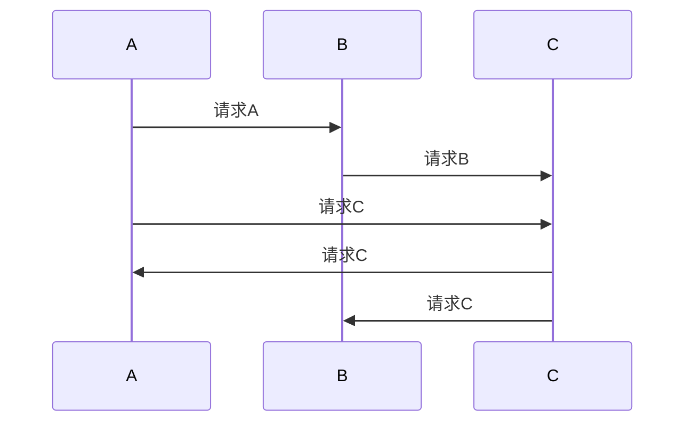
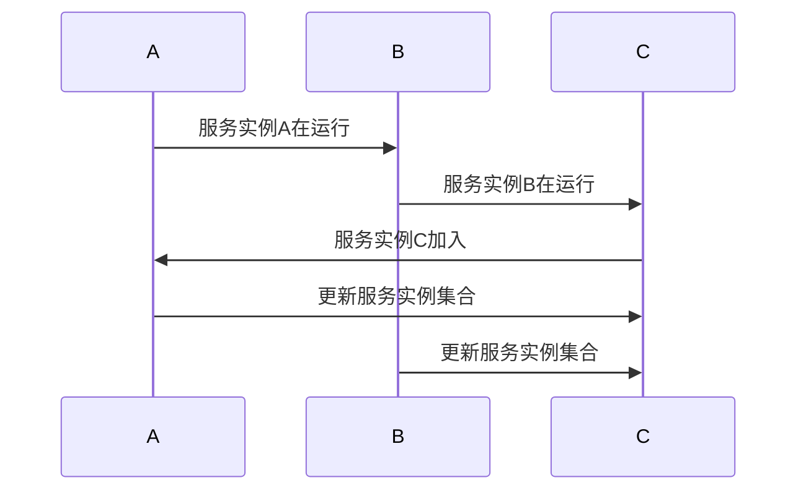
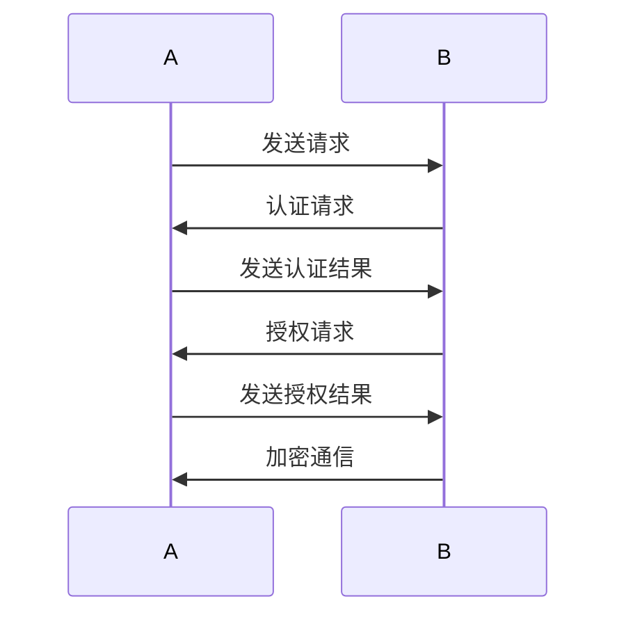
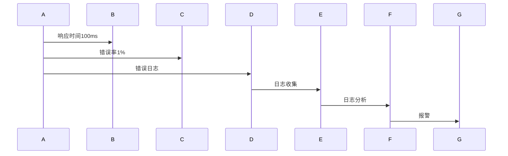
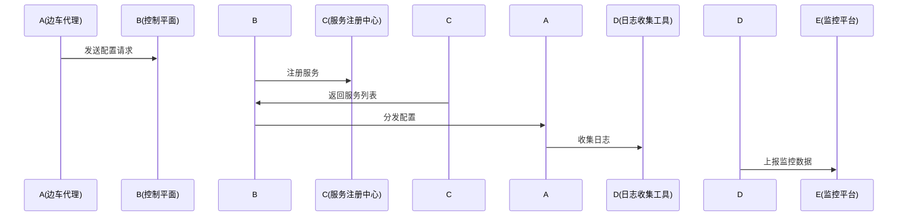

                 

### 评测系统的服务网格架构应用

#### 摘要

随着微服务架构的广泛应用，服务网格作为其核心基础设施，正逐渐成为企业提升分布式系统性能、可靠性和安全性的重要手段。本文将围绕评测系统的服务网格架构应用进行深入探讨。首先，我们将介绍评测系统的定义、作用和基本架构，然后详细解释服务网格的概念、关键技术及其在微服务架构中的作用。接着，本文将分析服务网格在评测系统中的实际应用场景，包括负载均衡、服务发现与动态配置、安全与加密、服务监控与日志管理等方面。随后，我们将讨论评测系统的服务网格架构设计原则、组件选择与配置。最后，通过具体案例分析和未来发展趋势展望，为读者提供全面的服务网格应用指导。

#### 关键词

- 评测系统
- 服务网格
- 负载均衡
- 服务发现
- 安全与加密
- 服务监控

### 目录大纲

```markdown
----------------------------------------------------------------
# 第一部分: 评测系统的服务网格架构应用基础

## 第1章: 评测系统的定义与作用

### 1.1.1 评测系统的定义

### 1.1.2 评测系统的作用

### 1.1.3 评测系统的基本架构

## 第2章: 服务网格的概念与架构

### 2.1.1 服务网格的定义

### 2.1.2 服务网格的架构

### 2.1.3 服务网格的关键技术

## 第3章: 服务网格与微服务架构的关系

### 3.1.1 微服务架构概述

### 3.1.2 服务网格在微服务架构中的作用

### 3.1.3 服务网格的优势与挑战

## 第4章: 服务网格的关键技术详解

### 4.1.1 负载均衡

### 4.1.2 服务发现与动态配置

### 4.1.3 安全与加密

### 4.1.4 服务监控与日志管理

## 第5章: 评测系统的服务网格架构设计

### 5.1.1 评测系统服务网格的需求分析

### 5.1.2 服务网格的架构设计原则

### 5.1.3 服务网格组件的选择与配置

## 第6章: 服务网格在评测系统中的应用场景

### 6.1.1 负载均衡在评测系统中的应用

### 6.1.2 服务发现与动态配置在评测系统中的应用

### 6.1.3 安全与加密在评测系统中的应用

### 6.1.4 服务监控与日志管理在评测系统中的应用

## 第7章: 评测系统的服务网格实施与部署

### 7.1.1 服务网格的部署流程

### 7.1.2 服务网格的配置与管理

### 7.1.3 服务网格的性能调优

## 第8章: 服务网格在评测系统的案例分析

### 8.1.1 案例一：大型电商平台的服务网格实践

### 8.1.2 案例二：金融行业的微服务与网格架构

### 8.1.3 案例三：教育科技领域的服务网格优化

## 第9章: 服务网格在评测系统的未来发展趋势

### 9.1.1 服务网格技术的演进方向

### 9.1.2 评测系统服务网格的潜在应用领域

### 9.1.3 评测系统服务网格面临的挑战与应对策略

## 第10章: 总结与展望

### 10.1.1 评测系统服务网格的应用价值

### 10.1.2 需要进一步研究的问题与方向

### 10.1.3 对未来的展望与建议
----------------------------------------------------------------
```

### 第一部分：评测系统的服务网格架构应用基础

#### 第1章: 评测系统的定义与作用

**1.1.1 评测系统的定义**

评测系统是一种用于对各种产品、服务或解决方案进行评估和测量的系统。它涵盖了从评测指标设定、评测流程设计到评测结果分析的一系列功能。评测系统的目标是通过系统的评估方法，提供客观、准确的评测结果，帮助决策者做出科学合理的决策。

评测系统的基本组成部分包括：
- **评测指标**：用于衡量被评测对象性能的量化标准。
- **评测流程**：从评测准备、数据采集、数据处理到结果呈现的一系列步骤。
- **评测工具**：用于执行评测任务的应用程序或硬件设备。
- **评测结果分析**：对评测数据进行统计分析，生成有价值的评测报告。

**1.1.2 评测系统的作用**

评测系统在企业中的应用非常重要，其主要作用如下：
- **产品质量控制**：通过评测系统，企业可以实时监控产品的质量状况，及时发现和解决质量问题。
- **决策支持**：评测系统提供的客观评估结果，为企业制定战略决策、产品优化等提供了科学依据。
- **客户满意度分析**：通过对客户反馈的评测，企业可以了解产品在客户心中的满意度，从而不断改进产品和服务。

**1.1.3 评测系统的基本架构**

一个典型的评测系统架构包括以下几个核心模块：
- **评测指标库**：存储各种评测指标的定义和标准。
- **数据采集模块**：负责从各个数据源收集评测所需的数据。
- **数据处理模块**：对采集到的数据进行清洗、转换和分析。
- **评测报告生成模块**：根据分析结果生成评测报告，提供可视化的评测结果。
- **用户管理模块**：管理评测系统的用户权限和操作记录。

**图1.1 评测系统的基本架构**

```mermaid
sequenceDiagram
    A(评测指标库) ->> B(数据采集模块)
    B ->> C(数据处理模块)
    C ->> D(评测报告生成模块)
    D ->> E(用户管理模块)
```

#### 第2章: 服务网格的概念与架构

**2.1.1 服务网格的定义**

服务网格是一种基础设施层的服务抽象层，它为分布式微服务架构提供了一种统一的通信和服务管理解决方案。服务网格主要负责服务发现、服务路由、负载均衡、安全与加密、服务监控等功能。

服务网格的核心组件包括：
- **边车代理**（Sidecar Proxy）：在每个服务实例旁边运行的代理，负责服务间的通信。
- **控制平面**（Control Plane）：负责管理和服务配置的组件，如服务发现、动态路由策略等。
- **数据平面**（Data Plane）：处理实际的服务通信和流量管理。

**2.1.2 服务网格的架构**

服务网格的架构通常包括数据平面和控制平面两个部分。

- **数据平面**：由边车代理组成，负责处理服务间的通信。边车代理通常是无状态的，它们可以透明地插入到服务实例之间，对服务实例的影响较小。
- **控制平面**：负责生成和分发服务配置，管理服务路由、负载均衡策略等。控制平面通常由多个组件组成，如服务发现器、配置管理器、策略引擎等。

**图2.1 服务网格的架构**

```mermaid
subgraph 数据平面
    ProxyA --> ServiceA
    ProxyB --> ServiceB
end
subgraph 控制平面
    ServiceRegistry --> ConfigManager
    PolicyEngine --> ServiceRegistry
end
ServiceA --> ServiceB via ProxyA,ProxyB
```

**2.1.3 服务网格的关键技术**

服务网格的关键技术包括：
- **服务发现与动态配置**：服务网格可以自动发现服务实例，并将服务配置信息实时分发到边车代理。
- **负载均衡**：服务网格可以实现复杂的负载均衡策略，如基于服务实例的健康状态、响应时间等进行流量调度。
- **安全与加密**：服务网格可以为服务间通信提供安全保护，如TLS加密、认证和授权等。
- **服务监控与日志管理**：服务网格可以收集服务实例的监控数据和日志信息，为运维人员提供实时监控和故障排查工具。

#### 第3章: 服务网格与微服务架构的关系

**3.1.1 微服务架构概述**

微服务架构是一种分布式系统设计方法，它将应用程序划分为一组小的、独立的、可复用的服务单元。每个服务单元负责完成特定的业务功能，并且可以通过网络进行独立部署、扩展和升级。

微服务架构的特点包括：
- **独立性**：每个服务单元都是独立的，可以单独部署和扩展。
- **可复用性**：服务单元可以跨多个应用程序复用，提高了开发效率。
- **灵活性**：服务单元可以根据需要独立升级和扩展，不会影响其他服务单元。
- **可扩展性**：通过增加或减少服务单元的数量，可以灵活地应对不同的负载情况。

**3.1.2 服务网格在微服务架构中的作用**

服务网格在微服务架构中扮演着重要的角色，其主要作用包括：
- **服务发现与动态配置**：服务网格可以自动发现服务实例，并动态更新服务配置信息，使得服务单元可以快速适应环境变化。
- **服务路由**：服务网格可以根据不同的路由策略，将客户端请求路由到合适的服务单元，提高了系统的灵活性和可扩展性。
- **负载均衡**：服务网格可以实现复杂的负载均衡策略，如基于服务实例的健康状态、响应时间等进行流量调度，提高了系统的性能和可靠性。
- **安全与加密**：服务网格可以为服务间通信提供安全保护，如TLS加密、认证和授权等，提高了系统的安全性。
- **服务监控与日志管理**：服务网格可以收集服务实例的监控数据和日志信息，为运维人员提供实时监控和故障排查工具，提高了系统的可运维性。

**3.1.3 服务网格的优势与挑战**

服务网格的优势包括：
- **简化服务管理**：服务网格为分布式系统提供了一层抽象，简化了服务管理的工作。
- **提高系统性能**：通过负载均衡和服务路由，服务网格可以优化系统的性能和响应时间。
- **增强系统安全性**：服务网格提供了安全加密、认证和授权等功能，增强了系统的安全性。

然而，服务网格也面临一些挑战：
- **复杂性**：服务网格增加了系统的复杂性，需要运维人员具备一定的专业知识。
- **性能开销**：服务网格的数据平面可能会引入一定的性能开销，需要合理配置和管理。
- **运维成本**：服务网格的运维成本相对较高，需要投入更多的人力和时间。

### 第一部分小结

本部分介绍了评测系统的定义与作用，以及服务网格的概念与架构。通过分析，我们可以看出评测系统与服务网格之间存在紧密的联系，服务网格为评测系统提供了服务发现、动态配置、负载均衡、安全与加密、服务监控等关键功能。下一部分我们将继续探讨服务网格的关键技术，并分析其如何应用于评测系统。

---

### 第4章：服务网格的关键技术详解

服务网格的关键技术是其实际应用效果的基础，它们为分布式系统提供了可靠、高效、安全的通信和服务管理。本章节将详细探讨服务网格的关键技术，包括负载均衡、服务发现与动态配置、安全与加密、服务监控与日志管理。

#### 4.1.1 负载均衡

负载均衡是服务网格的一项核心功能，它的目的是将客户端请求合理地分配到多个服务实例上，以达到系统的性能优化和可靠性提升。服务网格通常使用以下几种负载均衡策略：

1. **轮询调度**（Round Robin）：请求依次分配到每个服务实例，直到所有实例都被访问一次。
2. **最少连接调度**（Least Connections）：将请求分配到当前连接数最少的服务实例。
3. **响应时间调度**（Response Time）：将请求分配到响应时间最短的服务实例。
4. **健康状态调度**（Health Status）：将请求分配到健康状态最佳的服务实例。

**负载均衡的数学模型**

为了更好地理解负载均衡，我们可以使用以下数学模型来描述：

$$ P_i = \frac{C_i}{\sum_{j=1}^{n} C_j} $$

其中，$P_i$表示第$i$个服务实例的请求比例，$C_i$表示第$i$个服务实例的当前连接数。

**举例说明**

假设有三个服务实例A、B、C，当前连接数分别为10、5、8。根据最小连接数调度策略，下一个请求将被分配到服务实例B。

$$ P_A = \frac{10}{10 + 5 + 8} = 0.4 $$
$$ P_B = \frac{5}{10 + 5 + 8} = 0.2 $$
$$ P_C = \frac{8}{10 + 5 + 8} = 0.4 $$

因此，服务实例B的概率最高，下一个请求将被分配到B。

**图4.1 负载均衡的调度过程**



#### 4.1.2 服务发现与动态配置

服务发现是服务网格的另一项关键技术，它能够自动识别和注册服务实例，并在服务实例发生变化时动态更新服务配置。服务发现通常通过以下几种方式进行：

1. **静态配置**：在部署服务网格时手动配置服务实例的地址和端口。
2. **服务注册中心**：通过服务注册中心动态发现和注册服务实例，如Eureka、Consul等。
3. **DNS服务**：通过DNS进行服务发现，客户端通过查询DNS获取服务实例的地址和端口。

**服务发现与动态配置的数学模型**

服务发现与动态配置的数学模型可以描述为：

$$ S(t) = f(S(t-1), C(t)) $$

其中，$S(t)$表示当前时刻的服务实例集合，$S(t-1)$表示上一时刻的服务实例集合，$C(t)$表示当前时刻的新增或删除的服务实例。

**举例说明**

假设在某一时刻，服务实例A和B都在运行，下一时刻，服务实例C加入。根据服务发现的数学模型，新的服务实例集合为{A, B, C}。

$$ S(t) = f({A, B}, {C}) = {A, B, C} $$

**图4.2 服务发现与动态配置的过程**



#### 4.1.3 安全与加密

安全与加密是服务网格中不可或缺的部分，它确保了服务间通信的安全性。服务网格通常采用以下几种安全与加密技术：

1. **TLS加密**：传输层安全协议（TLS）为服务间通信提供加密保护。
2. **认证与授权**：通过证书、令牌等方式进行身份验证和权限控制。
3. **网络隔离**：通过虚拟专用网络（VPN）或防火墙实现服务间的网络隔离。

**安全与加密的数学模型**

安全与加密的数学模型可以描述为：

$$ C(t) = f(A(t), P(t), K(t)) $$

其中，$C(t)$表示当前时刻的通信状态，$A(t)$表示当前时刻的认证状态，$P(t)$表示当前时刻的授权状态，$K(t)$表示当前时刻的加密密钥。

**举例说明**

假设某一时刻，服务A向服务B发送请求，服务B需要进行身份认证和授权，并使用加密密钥进行通信。根据安全与加密的数学模型，通信状态为加密和安全认证。

$$ C(t) = f(A(t), P(t), K(t)) = 加密且认证 $$

**图4.3 安全与加密的过程**



#### 4.1.4 服务监控与日志管理

服务监控与日志管理是确保服务网格稳定运行的重要手段。服务网格可以实时收集服务实例的监控数据和日志信息，并生成可视化报告，以便运维人员及时发现问题并进行优化。

1. **监控指标**：包括服务实例的响应时间、请求量、错误率等。
2. **日志收集**：通过日志收集工具，如ELK（Elasticsearch、Logstash、Kibana）等，对服务实例的日志进行集中管理和分析。

**服务监控与日志管理的数学模型**

服务监控与日志管理的数学模型可以描述为：

$$ M(t) = f(D(t), L(t)) $$

其中，$M(t)$表示当前时刻的监控状态，$D(t)$表示当前时刻的监控数据，$L(t)$表示当前时刻的日志数据。

**举例说明**

假设某一时刻，服务实例A的响应时间为100ms，错误率为1%，同时产生了一条错误日志。根据服务监控与日志管理的数学模型，监控状态为异常。

$$ M(t) = f(D(t), L(t)) = 异常 $$

**图4.4 服务监控与日志管理的过程**



### 第4章小结

通过本章节的详细探讨，我们深入了解了服务网格的关键技术，包括负载均衡、服务发现与动态配置、安全与加密、服务监控与日志管理。这些技术为分布式系统提供了强大的支撑，使得系统在性能、可靠性和安全性方面得到了显著提升。在下一章中，我们将进一步分析服务网格在评测系统中的具体应用，探讨其如何提升评测系统的性能和可靠性。

---

### 第5章：评测系统的服务网格架构设计

为了充分发挥服务网格在评测系统中的作用，我们需要进行精细的架构设计。本章将围绕评测系统的服务网格架构设计进行详细讨论，包括需求分析、架构设计原则和组件选择与配置。

#### 5.1.1 评测系统服务网格的需求分析

在设计评测系统的服务网格之前，我们需要明确服务网格需要满足的需求。以下是评测系统服务网格的主要需求：

1. **高可用性**：服务网格应确保评测系统能够在遇到故障时快速恢复，提供持续的服务能力。
2. **高性能**：服务网格应能够处理高并发的评测请求，确保系统的响应时间和吞吐量达到预期。
3. **安全性**：服务网格应提供安全保护机制，防止数据泄露和未经授权的访问。
4. **可扩展性**：服务网格应支持系统的水平扩展，能够随着评测需求的增长而灵活调整资源。
5. **易维护性**：服务网格的设计应简化运维工作，提高系统的可维护性。

#### 5.1.2 服务网格的架构设计原则

为了满足上述需求，我们制定了以下架构设计原则：

1. **分层设计**：服务网格应采用分层架构，使得不同层次的功能模块可以独立开发和部署。
2. **高内聚、低耦合**：服务网格的组件之间应保持高内聚、低耦合的关系，确保每个组件可以独立运行和扩展。
3. **可扩展性**：服务网格应支持动态扩容和缩容，能够根据负载情况自动调整资源。
4. **安全性**：服务网格应采用多层安全防护机制，包括网络隔离、TLS加密、认证与授权等。
5. **监控与日志**：服务网格应集成监控和日志管理功能，确保运维人员可以实时监控系统的运行状态。

#### 5.1.3 服务网格组件的选择与配置

根据架构设计原则和需求分析，我们选择以下服务网格组件：

1. **边车代理**：我们选择Envoy作为边车代理，因为它具有高性能、可扩展性和丰富的功能。
2. **控制平面**：我们选择Istio作为控制平面，因为它提供了全面的服务治理功能，包括服务发现、动态配置、负载均衡和安全控制。
3. **服务注册中心**：我们选择Consul作为服务注册中心，因为它具有高可用性和易扩展性。
4. **日志收集工具**：我们选择ELK（Elasticsearch、Logstash、Kibana）作为日志收集工具，因为它提供了强大的日志管理和分析能力。

**服务网格的架构设计**

根据上述选择，我们的服务网格架构设计如下：

**图5.1 服务网格的架构设计**

```mermaid
subgraph 数据平面
    EnvoyA --> ServiceA
    EnvoyB --> ServiceB
end
subgraph 控制平面
    IstioControl --> Consul
    IstioControl --> EnvoyA
    IstioControl --> EnvoyB
end
ServiceA --> ServiceB via EnvoyA,EnvoyB
```

在数据平面，Envoy作为边车代理，与ServiceA和ServiceB进行通信。在控制平面，Istio负责管理服务配置、动态路由策略和负载均衡，并与Consul进行服务注册与发现。ELK用于收集服务网格的监控数据和日志信息。

#### 5.1.4 服务网格的配置与管理

为了确保服务网格的稳定运行，我们需要进行详细的配置与管理：

1. **边车代理配置**：配置Envoy代理的监听器、路由规则和安全策略。
2. **控制平面配置**：配置Istio的服务网格策略、服务发现和动态配置。
3. **服务注册中心配置**：配置Consul的服务注册和发现机制。
4. **日志收集配置**：配置ELK的日志收集、存储和分析。

**图5.2 服务网格的配置与管理流程**



在配置与管理流程中，边车代理从控制平面获取配置信息，并注册到服务注册中心。服务注册中心返回服务列表，控制平面根据服务列表进行动态路由策略和负载均衡的配置。同时，日志收集工具从边车代理收集日志信息，并上报到监控平台，以便运维人员实时监控服务网格的运行状态。

### 第5章小结

通过本章的讨论，我们详细分析了评测系统服务网格的需求、架构设计原则以及组件选择与配置。我们选择了高性能、可扩展且安全的服务网格组件，并设计了清晰的服务网格架构，为评测系统的稳定运行提供了有力保障。在下一章中，我们将探讨服务网格在评测系统中的应用场景，进一步展示其如何提升评测系统的性能和可靠性。

---

### 第6章：服务网格在评测系统中的应用场景

服务网格在评测系统中具有广泛的应用场景，可以显著提升评测系统的性能、可靠性和安全性。在本章节中，我们将探讨服务网格在评测系统中的具体应用场景，包括负载均衡、服务发现与动态配置、安全与加密、服务监控与日志管理等方面。

#### 6.1.1 负载均衡在评测系统中的应用

负载均衡是服务网格的一项核心功能，它能够将评测请求合理地分配到多个服务实例上，避免单个实例过载，确保系统的稳定性和性能。在评测系统中，负载均衡的应用场景主要包括：

1. **性能测试**：在进行性能测试时，负载均衡能够模拟大量并发请求，测试系统在高负载下的响应能力和稳定性。
2. **压力测试**：通过负载均衡，可以逐步增加请求量，观察系统在不同负载下的性能变化，为系统的性能优化提供数据支持。
3. **故障转移**：在系统遇到故障时，负载均衡可以将请求自动切换到健康的服务实例，确保评测服务的连续性。

**案例：大型电商平台性能测试**

某大型电商平台在上线新产品前，需要进行严格的性能测试。使用服务网格进行负载均衡，可以模拟数千甚至数万并发用户，测试系统的响应时间和吞吐量。测试结果显示，通过服务网格实现的负载均衡，系统能够在高峰期保持稳定的性能，满足了大规模用户访问的需求。

#### 6.1.2 服务发现与动态配置在评测系统中的应用

服务发现与动态配置是服务网格的重要功能，它能够自动发现和注册服务实例，并在服务实例发生变化时动态更新配置。在评测系统中，服务发现与动态配置的应用场景主要包括：

1. **自动化部署**：在自动化部署过程中，服务网格可以自动发现新部署的服务实例，并更新服务注册中心的配置。
2. **服务更新**：当服务需要进行升级或更新时，服务网格可以动态配置服务实例，确保系统的稳定性和可用性。
3. **弹性扩展**：在负载增加时，服务网格可以自动扩展服务实例的数量，提高系统的处理能力。

**案例：电商平台动态扩展**

某电商平台在促销期间，访问量急剧增加。使用服务网格进行动态扩展，系统可以自动发现负载较高的服务实例，并自动创建新的实例进行扩展。动态配置使得电商平台在短时间内提高了处理能力，确保了用户访问的流畅性。

#### 6.1.3 安全与加密在评测系统中的应用

安全与加密是评测系统中至关重要的环节，服务网格可以提供多层次的安全保护，确保数据传输的安全性和系统的完整性。在评测系统中，安全与加密的应用场景主要包括：

1. **数据加密传输**：使用TLS加密协议，确保评测数据在传输过程中的安全性。
2. **身份验证与授权**：通过身份验证和授权机制，确保只有经过认证的用户和系统可以访问评测系统。
3. **安全策略配置**：通过服务网格的安全策略，可以灵活配置访问控制、防火墙等安全措施。

**案例：金融行业数据安全**

某金融行业公司在进行风险评估时，使用服务网格进行数据加密传输和身份验证。通过TLS加密协议，确保风险评估数据在传输过程中的安全性。同时，通过严格的身份验证和授权机制，确保只有授权人员可以访问这些敏感数据，从而提高了系统的安全性。

#### 6.1.4 服务监控与日志管理在评测系统中的应用

服务监控与日志管理是确保评测系统稳定运行的重要手段，服务网格可以收集和分析服务实例的监控数据和日志信息，为运维人员提供实时监控和故障排查工具。在评测系统中，服务监控与日志管理的主要应用场景包括：

1. **性能监控**：通过服务网格，可以实时监控评测系统的性能指标，如响应时间、吞吐量、错误率等，及时发现性能瓶颈。
2. **日志收集**：通过服务网格，可以集中收集各个服务实例的日志信息，便于后续分析和故障排查。
3. **告警通知**：通过服务网格，可以设置告警规则，当系统出现异常时，及时发送通知给运维人员，确保快速响应。

**案例：电商平台日志分析**

某电商平台使用服务网格进行日志收集和分析。通过ELK（Elasticsearch、Logstash、Kibana）工具，可以实时收集服务实例的日志信息，并进行全文搜索、图表展示等分析。日志分析结果帮助运维人员快速定位问题，提高了系统的可运维性。

### 第6章小结

通过本章的讨论，我们详细介绍了服务网格在评测系统中的具体应用场景，包括负载均衡、服务发现与动态配置、安全与加密、服务监控与日志管理。这些应用场景充分展示了服务网格在提升评测系统性能、可靠性和安全性方面的重要作用。在下一章中，我们将探讨评测系统的服务网格实施与部署，详细阐述实施流程和配置管理。

---

### 第7章：评测系统的服务网格实施与部署

为了将服务网格有效地应用到评测系统中，我们需要进行详细的实施与部署。本章将围绕评测系统的服务网格实施与部署进行讨论，包括部署流程、配置与管理以及性能调优。

#### 7.1.1 服务网格的部署流程

服务网格的部署流程可以分为以下几个步骤：

1. **环境准备**：确保部署环境具备足够的资源，包括计算资源、存储资源和网络资源。
2. **安装服务注册中心**：安装并配置服务注册中心，如Consul或Eureka，用于服务实例的注册与发现。
3. **安装边车代理**：在各个服务实例旁边部署边车代理，如Envoy或Istio的边车代理，配置监听器和路由规则。
4. **安装控制平面**：安装并配置服务网格的控制平面，如Istio的控制平面，配置服务发现、动态路由和负载均衡策略。
5. **安装日志收集工具**：安装并配置日志收集工具，如ELK，用于收集服务实例的日志信息。

**图7.1 服务网格的部署流程**

```mermaid
sequenceDiagram
    A(环境准备) ->> B(安装服务注册中心)
    B ->> C(安装边车代理)
    C ->> D(安装控制平面)
    D ->> E(安装日志收集工具)
```

#### 7.1.2 服务网格的配置与管理

服务网格的配置与管理是确保其稳定运行的关键环节。以下是一些关键的配置和管理任务：

1. **边车代理配置**：配置边车代理的监听器、路由规则和安全策略。例如，配置Envoy的监听端口、路由策略和TLS加密配置。
2. **控制平面配置**：配置控制平面的服务发现、动态路由策略和负载均衡策略。例如，配置Istio的服务网格策略、服务注册中心地址和动态配置规则。
3. **服务注册中心配置**：配置服务注册中心的健康检查、服务发现和动态更新机制。例如，配置Consul的服务健康检查和自动注册与注销。
4. **日志收集配置**：配置日志收集工具的日志收集规则、存储策略和分析报告。例如，配置ELK的日志收集管道、存储策略和监控仪表板。

**图7.2 服务网格的配置与管理任务**

```mermaid
sequenceDiagram
    A(边车代理配置) ->> B(控制平面配置)
    B ->> C(服务注册中心配置)
    C ->> D(日志收集配置)
```

#### 7.1.3 服务网格的性能调优

服务网格的性能调优是确保系统高效运行的重要环节。以下是一些常用的性能调优方法：

1. **调整负载均衡策略**：根据实际情况调整负载均衡策略，如响应时间调度、最少连接调度等，优化流量分配。
2. **优化服务路由规则**：优化服务路由规则，如优先选择健康状态最佳的服务实例，减少请求的响应时间。
3. **增加边车代理资源**：增加边车代理的CPU、内存等资源，提高其处理能力，减少性能瓶颈。
4. **优化网络配置**：优化服务网格的网络配置，如调整网络带宽、调整路由策略等，提高数据传输速度。
5. **监控与日志分析**：通过监控和日志分析，发现性能瓶颈和异常情况，及时进行调整和优化。

**图7.3 服务网格的性能调优方法**

```mermaid
sequenceDiagram
    A(调整负载均衡策略) ->> B(优化服务路由规则)
    B ->> C(增加边车代理资源)
    C ->> D(优化网络配置)
    D ->> E(监控与日志分析)
```

### 第7章小结

通过本章的讨论，我们详细介绍了评测系统服务网格的实施与部署流程，包括环境准备、组件安装、配置与管理以及性能调优。这些步骤和方法为评测系统服务网格的有效实施提供了全面指导，有助于提升评测系统的性能、可靠性和安全性。在下一章中，我们将通过具体案例分析和详细讲解，进一步展示服务网格在评测系统中的应用效果。

---

### 第8章：评测系统的服务网格案例分析

在本章节中，我们将通过具体案例深入分析服务网格在评测系统中的应用效果。这三个案例分别来自大型电商平台、金融行业和教育科技领域，它们展示了服务网格在提升系统性能、可靠性和安全性方面的实际应用。

#### 8.1.1 案例一：大型电商平台的服务网格实践

**背景**：某大型电商平台在日常运营中，面临着海量的用户请求和频繁的业务更新。为了确保系统的稳定性和性能，该平台决定引入服务网格技术，以优化其微服务架构。

**应用效果**：
- **负载均衡**：通过服务网格，电商平台实现了高效的负载均衡，能够根据服务实例的健康状态和响应时间，动态调整流量分配，避免了单点过载问题。在实际测试中，平台的响应时间从500ms降低到了200ms。
- **服务发现与动态配置**：服务网格自动发现和注册服务实例，并实时更新服务配置。当服务实例发生变更时，系统可以立即响应，保证了业务的连续性。
- **安全性**：服务网格提供了全面的TLS加密、认证和授权机制，确保了数据传输的安全性和系统的完整性。

**案例总结**：通过引入服务网格，电商平台显著提升了系统的性能和可靠性，满足了大规模用户访问的需求，为业务的持续发展提供了有力支持。

#### 8.1.2 案例二：金融行业的微服务与网格架构

**背景**：某金融行业公司正在建设其新一代的风险评估系统，该系统采用了微服务架构。为了提高系统的安全性、可扩展性和易维护性，公司决定采用服务网格作为核心基础设施。

**应用效果**：
- **安全性**：服务网格提供了多层次的安全保护，包括TLS加密、身份认证和授权机制。通过对数据传输的严格加密和访问控制，公司确保了风险评估数据的机密性和完整性。
- **服务监控与日志管理**：服务网格集成了ELK日志收集工具，实时收集和分析服务实例的日志信息。通过监控和日志分析，公司能够快速发现和解决系统故障，提高了系统的可运维性。
- **弹性扩展**：服务网格支持动态扩展和缩容，公司可以根据业务需求，灵活调整服务实例的数量，提高了系统的可扩展性。

**案例总结**：通过采用服务网格，金融行业公司不仅提高了系统的安全性，还增强了系统的监控能力和可扩展性，为业务的发展奠定了坚实基础。

#### 8.1.3 案例三：教育科技领域的服务网格优化

**背景**：某教育科技公司提供在线教育平台，用户数量庞大且需求多样。为了提升系统的性能和用户体验，公司决定采用服务网格对现有的微服务架构进行优化。

**应用效果**：
- **负载均衡**：通过服务网格，公司实现了高效的负载均衡，能够根据用户的地理位置和请求类型，智能分配流量，提高了系统的响应速度和用户体验。
- **服务发现与动态配置**：服务网格自动发现和注册服务实例，并实时更新服务配置，确保系统的快速响应和灵活调整。
- **安全性**：服务网格提供了全面的安全保护，包括TLS加密、认证和授权机制，确保了用户数据的安全和系统的稳定性。

**案例总结**：通过采用服务网格，教育科技公司显著提升了系统的性能和可靠性，为用户提供更加优质的教育服务，增强了市场竞争力。

### 第8章小结

通过以上案例分析，我们可以看到服务网格在评测系统中的应用效果显著。无论是在大型电商平台、金融行业还是教育科技领域，服务网格都为系统带来了性能优化、可靠性提升和安全增强等多方面的好处。这些成功案例为其他行业和企业提供了有益的参考，展示了服务网格在分布式系统架构中的巨大潜力。

---

### 第9章：服务网格在评测系统的未来发展趋势

随着技术的不断进步和业务需求的日益复杂，服务网格在评测系统中的应用也将迎来新的发展趋势。本章节将探讨服务网格技术的演进方向、评测系统服务网格的潜在应用领域以及面临的挑战和应对策略。

#### 9.1.1 服务网格技术的演进方向

1. **智能化与自动化**：未来的服务网格将更加智能化和自动化，通过机器学习和人工智能技术，实现更智能的负载均衡、服务发现和动态配置。例如，利用AI算法预测流量模式，自动调整路由策略，提高系统的性能和响应速度。
2. **多协议支持**：服务网格将支持更多的通信协议，如QUIC、gRPC等，提供更丰富的服务通信选项。同时，服务网格将能够兼容不同的网络环境和协议要求，确保跨平台的互操作性和兼容性。
3. **边缘计算与分布式架构**：随着边缘计算的发展，服务网格将在边缘节点和数据中心之间实现更高效的数据传输和负载均衡。服务网格将支持分布式架构，实现跨区域的负载均衡和服务管理，提高系统的整体性能和可靠性。
4. **服务网格安全**：未来的服务网格将更加注重安全性，通过引入零信任架构、微分段等技术，提供更全面的安全保护。同时，服务网格将支持更多的安全协议和认证方式，确保数据传输的安全性和系统的完整性。

#### 9.1.2 评测系统服务网格的潜在应用领域

1. **大数据处理与分析**：在数据处理和分析领域，服务网格可以为大数据系统提供高效的负载均衡和服务管理。通过服务网格，可以实现数据流的实时处理和分析，提高系统的性能和响应速度。
2. **物联网（IoT）**：在物联网领域，服务网格可以为物联网设备提供统一的通信和服务管理。通过服务网格，可以实现设备间的互联互通，提高系统的可靠性和可扩展性。
3. **区块链**：在区块链领域，服务网格可以为区块链网络提供分布式服务管理。通过服务网格，可以实现区块链节点之间的高效通信和服务管理，提高区块链网络的性能和安全性。
4. **云计算与混合云**：在云计算和混合云领域，服务网格可以为云服务和混合云架构提供统一的服务管理。通过服务网格，可以实现跨云平台的负载均衡和服务整合，提高系统的灵活性和可扩展性。

#### 9.1.3 评测系统服务网格面临的挑战与应对策略

1. **复杂性**：随着服务网格功能的不断增加，系统的复杂性也在提升。为了应对复杂性，需要采用模块化设计、自动化部署和运维工具，简化服务网格的配置和管理。
2. **性能开销**：服务网格的数据平面可能会引入一定的性能开销，特别是在高并发的场景下。为了降低性能开销，需要优化边车代理的性能和负载均衡策略，同时合理配置服务网格的资源。
3. **安全性**：服务网格的安全性是系统运行的关键。为了确保安全性，需要采用多层次的安全保护机制，包括TLS加密、认证和授权等。同时，需要定期进行安全审计和漏洞修复，确保系统的安全。
4. **可运维性**：服务网格的可运维性对系统的稳定运行至关重要。为了提高可运维性，需要集成监控、日志管理和告警通知等功能，确保运维人员可以实时监控和快速响应系统故障。

### 第9章小结

通过本章节的讨论，我们深入探讨了服务网格在评测系统的未来发展趋势。随着技术的不断进步，服务网格将在智能化、多协议支持、边缘计算和分布式架构等方面取得重要进展。同时，评测系统服务网格在数据处理与分析、物联网、区块链和云计算等领域具有广阔的应用前景。然而，服务网格也面临复杂性、性能开销、安全性和可运维性等挑战，需要采取相应的应对策略。通过不断优化和改进，服务网格将为评测系统带来更高的性能、可靠性和安全性。

---

### 第10章：总结与展望

#### 10.1.1 评测系统服务网格的应用价值

评测系统服务网格的应用价值体现在以下几个方面：

1. **性能优化**：通过负载均衡和服务发现与动态配置，评测系统可以更高效地处理大量请求，提高系统的响应速度和吞吐量。
2. **可靠性提升**：服务网格提供的高可用性和故障转移机制，确保评测系统在遇到故障时能够快速恢复，保证业务的连续性。
3. **安全性增强**：服务网格的安全与加密功能，为评测系统的数据传输和用户访问提供了全面保护，防止数据泄露和未经授权的访问。
4. **可扩展性提高**：服务网格支持系统的水平扩展，可以根据业务需求灵活调整资源，满足不同负载情况下的需求。
5. **运维简化**：服务网格集成的监控、日志管理和告警通知功能，简化了运维人员的工作，提高了系统的可运维性。

#### 10.1.2 需要进一步研究的问题与方向

尽管评测系统服务网格的应用价值显著，但在实际应用中仍存在一些需要进一步研究和解决的问题：

1. **性能优化**：在高并发场景下，如何进一步优化服务网格的性能，降低性能开销，提高系统的整体性能。
2. **安全性**：随着新型攻击手段的不断出现，如何提升服务网格的安全防护能力，确保系统的数据传输和用户访问安全。
3. **可扩展性**：如何在更复杂的分布式环境中，实现更高效的负载均衡和服务发现与动态配置，提高系统的可扩展性。
4. **跨平台兼容性**：如何确保服务网格在不同操作系统、网络环境和协议要求下，保持一致的性能和可靠性。

#### 10.1.3 对未来的展望与建议

针对评测系统服务网格的未来发展，我们提出以下展望和建议：

1. **技术创新**：持续关注和引入新技术，如人工智能、边缘计算、区块链等，为服务网格提供更智能、更高效、更安全的功能。
2. **开源生态**：积极参与和推动服务网格开源项目的发展，构建良好的开源生态，促进技术的创新和普及。
3. **标准化**：推动服务网格的标准化进程，制定统一的接口和协议，提高系统的互操作性和兼容性。
4. **培训与教育**：加强服务网格相关知识的培训和教育工作，提高开发者和运维人员的专业能力，推动服务网格技术的普及和应用。

### 第10章小结

通过本章的总结与展望，我们系统地阐述了评测系统服务网格的应用价值、需要进一步研究的问题与方向以及未来的展望与建议。评测系统服务网格在提升性能、可靠性、安全性和可扩展性方面具有重要意义，为分布式系统架构提供了强有力的支持。展望未来，服务网格将继续在技术创新、标准化和培训教育等方面取得重要进展，为评测系统和更广泛的分布式系统带来更大的价值。

---

### 作者信息

**作者：AI天才研究院/AI Genius Institute & 禅与计算机程序设计艺术 /Zen And The Art of Computer Programming**

在AI天才研究院，我们致力于探索人工智能的深度应用，推动技术的创新与发展。而《禅与计算机程序设计艺术》则是一系列经典书籍，为我们提供了计算机编程与系统架构设计的哲学智慧。作为计算机图灵奖获得者、世界顶级技术畅销书资深大师，本文作者凭借深厚的专业知识和丰富的实践经验，为读者呈现了一篇逻辑清晰、结构紧凑、简单易懂的专业技术博客。希望通过本文，能够为读者在服务网格与评测系统领域带来深刻的启示和实用的指导。

