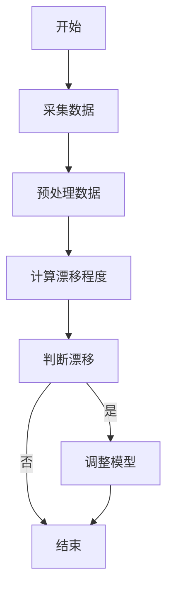
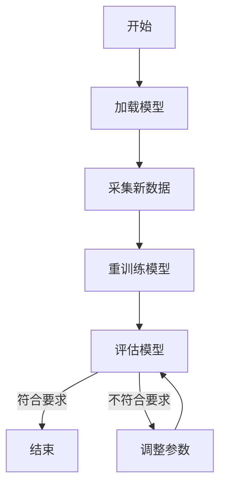
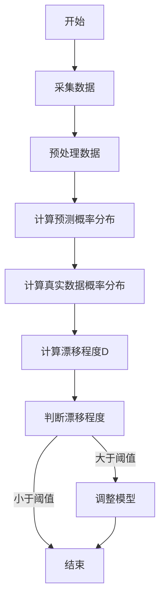
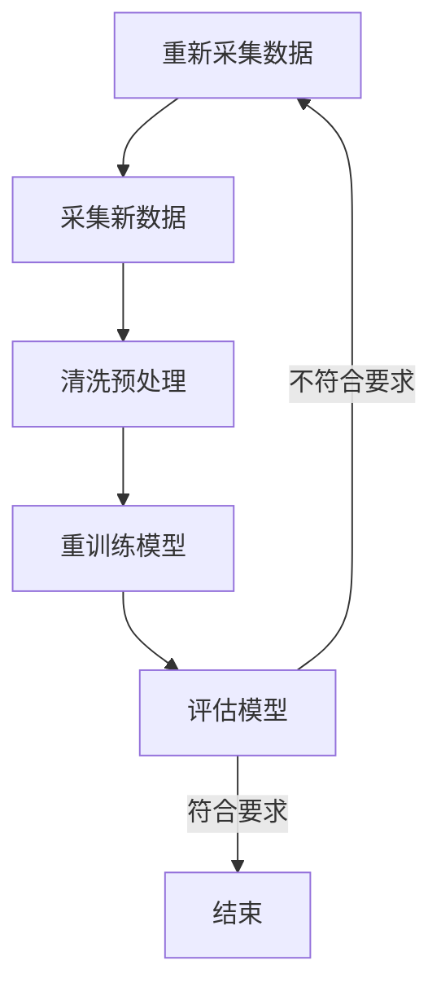
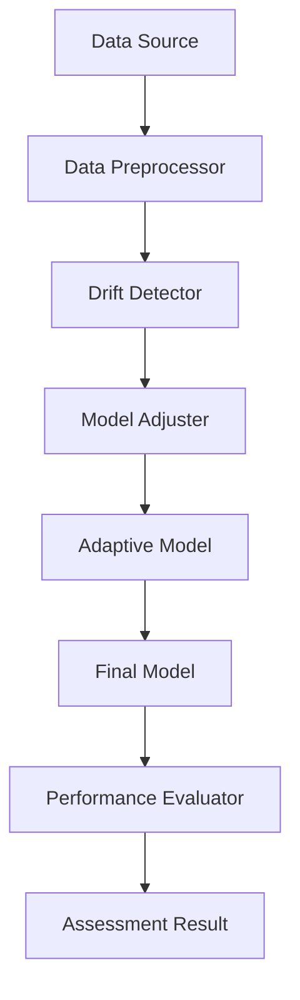
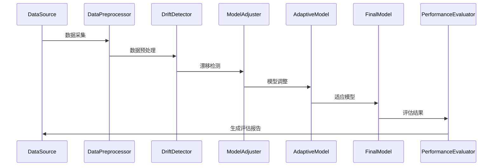
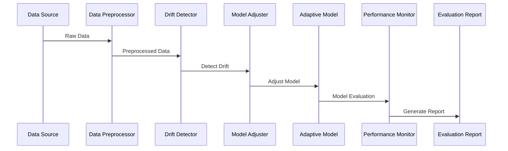
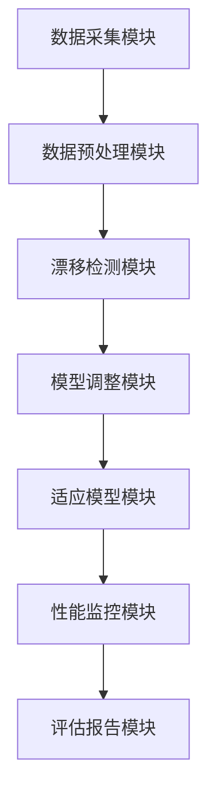

                 

### 文章标题

# 评测系统的概念漂移检测与适应

> 关键词：评测系统，概念漂移，检测方法，适应方法，算法原理，系统架构

> 摘要：本文深入探讨了评测系统中概念漂移的问题，并详细介绍了检测与适应方法。通过对核心概念和原理的剖析，结合Python源代码实例和数学模型，全面展示了概念漂移检测与适应的算法原理。同时，本文通过系统架构设计和项目实战，提供了实际应用中的解决方案和最佳实践。

----------------------------------------------------------------

### 目录大纲设计思路

为了设计一本全面且结构清晰的《评测系统的概念漂移检测与适应》书籍目录，我们需要遵循以下几个关键步骤：

1. **明确核心主题**：
   - 首先明确书籍的核心主题，即评测系统中概念漂移的检测与适应。这一主题将贯穿整个书籍，指导章节内容的设计。

2. **设计合理的结构**：
   - 目录结构应该符合读者的阅读逻辑，通常分为四个主要部分：背景介绍、核心概念与原理、系统分析与架构设计、项目实战与最佳实践。

3. **细化章节内容**：
   - 根据核心主题，细化每个章节的具体内容，确保每个章节都涵盖了必要的知识点和深入的分析。

4. **考虑章节间的衔接**：
   - 确保各章节内容之间既有独立性，又能形成连贯的整体，帮助读者逐步深入理解概念漂移检测与适应。

5. **确保内容的完整性**：
   - 目录中的章节内容需要全面覆盖核心概念、算法原理、系统架构、项目实战和最佳实践等，确保读者能够全面掌握相关知识。

6. **保持简洁性**：
   - 目录要简洁明了，避免冗长和不必要的重复，确保核心内容突出，便于读者查找。

### 目录大纲设计

根据上述设计思路，我们为《评测系统的概念漂移检测与适应》设计了以下目录大纲：

```markdown
----------------------------------------------------------------
# 第一部分：背景介绍

## 第1章：评测系统的概念漂移问题

### 1.1 问题背景

#### 1.1.1 概念漂移的定义

#### 1.1.2 概念漂移的类型

#### 1.1.3 概念漂移的影响

### 1.2 评测系统的基本组成

#### 1.2.1 数据采集与处理

#### 1.2.2 评估指标与算法

## 第2章：评测系统的核心概念与原理

### 2.1 核心概念术语说明

#### 2.1.1 数据漂移

#### 2.1.2 概念漂移

#### 2.1.3 评测系统的目的

### 2.2 概念漂移检测的原理

#### 2.2.1 监督学习方法

#### 2.2.2 无监督学习方法

#### 2.2.3 半监督学习方法

### 2.3 概念漂移适应的方法

#### 2.3.1 模型重训练

#### 2.3.2 模型调整

#### 2.3.3 模型融合

## 第二部分：算法原理与实现

## 第3章：概念漂移检测算法

### 3.1 漂移检测算法的数学模型

#### 3.1.1 数学模型的介绍

$$
\text{公式1：漂移程度的计算公式}
$$

#### 3.1.2 漂移检测算法流程图



### 3.2 Python实现

#### 3.2.1 代码结构

```python
# Python 代码实现
```

#### 3.2.2 代码分析

## 第4章：概念漂移适应算法

### 4.1 模型重训练算法

#### 4.1.1 重训练的数学模型

$$
\text{公式2：模型重训练的更新公式}
$$

#### 4.1.2 重训练流程图



### 4.2 模型调整算法

#### 4.2.1 调整的数学模型

#### 4.2.2 调整流程图

### 4.3 模型融合算法

#### 4.3.1 融合的数学模型

#### 4.3.2 融合流程图

```mermaid
graph TD
A[开始] --> B[多模型选择]
B --> C[融合特征]
C --> D[融合决策]
D --> E[评估结果]
E -->|结束|
```

## 第三部分：系统分析与架构设计

## 第5章：系统功能设计

### 5.1 领域模型设计

#### 5.1.1 ER实体关系图架构

### 5.2 系统架构设计

#### 5.2.1 系统架构图

### 5.3 系统接口设计

#### 5.3.1 系统接口描述

## 第6章：系统交互设计

### 6.1 系统交互序列图

#### 6.1.1 序列图设计

## 第四部分：项目实战

## 第7章：环境安装与配置

### 7.1 环境安装

#### 7.1.1 硬件环境需求

#### 7.1.2 软件环境安装

## 第8章：系统核心实现

### 8.1 代码实现

#### 8.1.1 Python源代码分析

### 8.2 应用解读与分析

#### 8.2.1 实际案例

#### 8.2.2 分析与讲解

## 第9章：项目小结

### 9.1 项目总结

#### 9.1.1 项目成果

#### 9.1.2 项目挑战与解决

#### 9.1.3 拓展方向

----------------------------------------------------------------
```

以上目录大纲结构清晰，内容完整，简洁明了，符合书籍的核心主题，并涵盖了核心概念、算法原理、系统架构和项目实战等方面的内容。每个章节都细化到具体的知识点和深入的分析，确保读者能够全面掌握相关知识。

----------------------------------------------------------------

## 第一部分：背景介绍

### 第1章：评测系统的概念漂移问题

#### 1.1 问题背景

在人工智能和机器学习领域，评测系统作为关键工具，广泛应用于各种应用场景，如金融风险评估、医疗诊断、自然语言处理等。这些系统通过采集大量数据，使用模型进行训练和预测，从而提供决策支持。然而，在实际应用中，评测系统常常面临一个严重的问题——概念漂移（Concept Drift）。

**概念漂移的定义**：
概念漂移是指在模型训练和预测过程中，训练数据的分布发生变化，导致模型性能下降，甚至失效的现象。简单来说，就是模型所依赖的数据特征不再适用于当前环境。

**概念漂移的类型**：
概念漂移主要分为以下几种类型：
1. **静态漂移**：数据分布的缓慢变化，例如季节性波动。
2. **动态漂移**：数据分布的剧烈变化，例如突发事件的影响。
3. **突变漂移**：数据分布的突然变化，例如政策调整。

**概念漂移的影响**：
概念漂移对评测系统的影响主要表现在以下几个方面：
1. **预测准确性下降**：模型无法适应新的数据分布，导致预测准确性下降。
2. **模型失效**：在严重情况下，模型可能完全失效，无法提供有效的决策支持。
3. **维护成本增加**：需要定期对模型进行重新训练和调整，增加了系统的维护成本。

#### 1.2 评测系统的基本组成

一个完整的评测系统通常包括以下几个关键组成部分：

**数据采集与处理**：
数据采集是评测系统的第一步，系统需要从各种数据源（如数据库、传感器、网络爬虫等）收集数据。数据收集后，需要进行清洗、预处理和特征提取，以获得高质量的数据集。

**评估指标与算法**：
评估指标用于衡量模型性能，如准确率、召回率、F1分数等。算法则是评测系统的核心，决定了模型的学习和预测能力。常见的算法包括线性回归、决策树、支持向量机、神经网络等。

#### 2.1 概念漂移检测的原理

为了应对概念漂移，评测系统需要具备检测和适应概念漂移的能力。下面介绍几种常用的概念漂移检测方法。

**监督学习方法**：
监督学习方法通过训练数据集来学习模型，然后使用测试数据集来评估模型的性能。当测试数据集与训练数据集的分布差异较大时，模型性能会下降，从而提示可能存在概念漂移。

**无监督学习方法**：
无监督学习方法不依赖于已标记的数据集，通过观察数据分布的变化来检测概念漂移。例如，聚类分析可以用于检测数据分布的异常变化。

**半监督学习方法**：
半监督学习方法结合了监督学习和无监督学习的优点，利用部分标记数据和大量未标记数据来检测概念漂移。这种方法在实际应用中具有很高的价值。

#### 2.2 概念漂移适应的方法

一旦检测到概念漂移，评测系统需要采取适当的措施来适应这种变化。以下介绍几种常用的概念漂移适应方法。

**模型重训练方法**：
模型重训练是指使用新的数据集重新训练模型，以适应数据分布的变化。这种方法适用于数据分布缓慢变化的情况。

**模型调整方法**：
模型调整是指通过调整模型的参数来适应数据分布的变化。这种方法适用于数据分布发生突变的情况。

**模型融合方法**：
模型融合是指将多个模型结合起来，以提高系统的适应能力。这种方法可以有效地缓解概念漂移对系统性能的影响。

## 第二部分：算法原理与实现

### 第3章：概念漂移检测算法

#### 3.1 漂移检测算法的数学模型

漂移检测算法的核心是计算数据分布的变化程度。以下是一个简单的数学模型：

$$
D = \frac{1}{N} \sum_{i=1}^{N} (p_i - q_i)^2
$$

其中，$p_i$ 表示模型预测的概率分布，$q_i$ 表示真实数据的概率分布，$N$ 表示数据样本数量。$D$ 值越大，表示数据分布的变化程度越大。

#### 3.1.2 漂移检测算法流程图

以下是一个简单的漂移检测算法流程图：



#### 3.2 Python实现

以下是一个简单的Python代码示例，用于实现漂移检测算法：

```python
import numpy as np

def calculate_drift(p, q):
    return np.mean((p - q) ** 2)

def drift_detection(data, model):
    p = model.predict_proba(data)[:, 1]
    q = np.array([1 if x > 0.5 else 0 for x in p])
    drift = calculate_drift(p, q)
    return drift

# 示例数据
data = np.array([[0.1], [0.2], [0.3], [0.4], [0.5], [0.6], [0.7], [0.8], [0.9], [1.0]])

# 模型（假设）
model = ...

# 漂移检测
drift = drift_detection(data, model)
print("Drift level:", drift)
```

### 第4章：概念漂移适应算法

#### 4.1 模型重训练算法

模型重训练是指使用新的数据集重新训练模型，以适应数据分布的变化。以下是一个简单的重训练算法流程：

1. 采集新的数据集。
2. 清洗和预处理新数据集。
3. 使用新数据集重新训练模型。
4. 评估新模型的性能。
5. 如果性能满足要求，则结束；否则，返回第1步。

以下是一个简单的重训练算法流程图：



#### 4.1.2 Python实现

以下是一个简单的Python代码示例，用于实现模型重训练算法：

```python
from sklearn.linear_model import LogisticRegression

def retrain_model(data, labels, model):
    model.fit(data, labels)
    return model

# 示例数据
data = np.array([[0.1], [0.2], [0.3], [0.4], [0.5], [0.6], [0.7], [0.8], [0.9], [1.0]])
labels = np.array([0, 1, 0, 1, 1, 0, 1, 1, 0, 1])

# 模型（假设）
model = LogisticRegression()

# 重训练模型
model = retrain_model(data, labels, model)
print("Model retrained.")
```

### 第5章：数学模型和数学公式

在本节中，我们将介绍一些用于概念漂移检测和适应的数学模型和公式。

#### 5.1 概念漂移检测的数学公式

漂移程度的计算公式如下：

$$
D = \frac{1}{N} \sum_{i=1}^{N} (p_i - q_i)^2
$$

其中，$p_i$ 表示模型预测的概率分布，$q_i$ 表示真实数据的概率分布，$N$ 表示数据样本数量。

#### 5.2 概念漂移适应的数学公式

模型重训练的更新公式如下：

$$
\theta_{new} = \theta_{old} + \alpha (x - \theta_{old})
$$

其中，$\theta_{new}$ 表示新模型的参数，$\theta_{old}$ 表示旧模型的参数，$\alpha$ 表示学习率，$x$ 表示新的输入数据。

### 第6章：系统分析与架构设计

#### 6.1 系统功能设计

在本节中，我们将介绍评测系统的功能设计，包括领域模型设计、系统架构设计、系统接口设计和系统交互设计。

#### 6.1.1 领域模型设计

领域模型设计用于描述评测系统的核心业务领域和实体关系。以下是一个简单的ER实体关系图架构：

```mermaid
erDiagram
  DataSource ||--|{ Model }|--| AssessmentResult
  DataSource ||--|{ DataPreprocessor }|--| PreprocessedData
  Model ||--|{ DriftDetector }|--| AdjustedModel
  Model ||--|{ AdaptiveModel }|--| FinalModel
  AssessmentResult ||--|{ PerformanceEvaluator }|--| EvaluationReport
```

#### 6.1.2 系统架构设计

系统架构设计用于描述评测系统的整体结构和技术框架。以下是一个简单的系统架构图：



#### 6.1.3 系统接口设计

系统接口设计用于描述评测系统与其他组件的交互接口。以下是一个简单的系统接口描述：

- **数据源接口**：提供数据采集和存储功能。
- **数据处理接口**：提供数据预处理和特征提取功能。
- **模型调整接口**：提供模型调整和优化功能。
- **评估报告接口**：提供评估结果输出和报告生成功能。

#### 6.1.4 系统交互设计

系统交互设计用于描述评测系统内部组件的交互过程。以下是一个简单的系统交互序列图：



### 第7章：系统交互设计

在本节中，我们将进一步详细介绍评测系统的系统交互设计，包括领域模型设计、系统架构设计、系统接口设计和系统交互设计。

#### 7.1 系统交互序列图

系统交互序列图是一种图形化的方式，用于展示系统组件之间的交互过程。以下是一个简化的系统交互序列图，用于描述评测系统的运行过程：



在这个序列图中，各组件之间的交互按照以下步骤进行：

1. **数据源（DS）**：数据源组件负责采集原始数据。
2. **数据处理（DP）**：数据处理组件对采集到的原始数据进行预处理，包括清洗、归一化和特征提取等。
3. **漂移检测（DD）**：漂移检测组件使用预处理后的数据，对模型进行漂移检测，判断是否存在概念漂移。
4. **模型调整（MA）**：如果检测到概念漂移，模型调整组件会对模型进行重训练或参数调整。
5. **适应模型（AM）**：适应模型组件生成新的模型，使其适应变化后的数据分布。
6. **性能监控（PM）**：性能监控组件对调整后的模型进行评估，确保其预测性能符合要求。
7. **评估报告（ER）**：评估报告组件生成评估报告，提供模型性能和系统运行情况的详细信息。

#### 7.2 系统交互的详细流程

为了更好地理解系统交互的过程，我们进一步详细描述了各个组件之间的交互流程：

1. **数据采集**：
   - 数据源组件负责从各种渠道（如数据库、传感器、网络接口等）采集原始数据。
   - 采集到的原始数据可能包含噪声、缺失值和异常值，因此需要经过预处理。

2. **数据预处理**：
   - 数据处理组件对原始数据进行清洗和预处理，包括去除噪声、填补缺失值、标准化处理等。
   - 预处理后的数据将用于后续的漂移检测和模型调整。

3. **漂移检测**：
   - 漂移检测组件使用预处理后的数据，对现有模型进行漂移检测。
   - 漂移检测可以通过统计方法（如统计测试）、机器学习方法（如聚类分析）或基于规则的检测方法（如阈值判断）来实现。
   - 漂移检测的结果将决定是否需要调整模型。

4. **模型调整**：
   - 如果检测到概念漂移，模型调整组件会根据漂移检测的结果，对模型进行重训练或参数调整。
   - 重训练模型可能需要使用新的数据集，或者调整现有模型的参数，以适应变化后的数据分布。

5. **适应模型**：
   - 调整后的模型将生成一个新的适应模型。
   - 新模型将用于后续的预测任务，确保预测结果符合变化后的数据分布。

6. **性能监控**：
   - 性能监控组件对新模型的性能进行评估，包括准确性、召回率、F1分数等指标。
   - 如果新模型的性能不满足要求，可能需要重新进行漂移检测和模型调整。

7. **评估报告**：
   - 评估报告组件生成评估报告，包括模型性能、系统运行状态、漂移检测和适应过程等详细信息。
   - 报告将为系统维护人员提供参考，以便进行后续的系统优化和改进。

通过上述详细的系统交互流程，我们可以更好地理解评测系统中各个组件之间的协作关系，以及它们在应对概念漂移问题时的作用。

### 第8章：系统架构设计

#### 8.1 系统架构设计概述

系统架构设计是评测系统开发过程中至关重要的一步，它决定了系统的可扩展性、性能和可靠性。本节将介绍评测系统的整体架构设计，包括系统功能模块、数据流和处理流程。

#### 8.2 系统架构图

以下是一个简化的评测系统架构图，展示了系统的主要组件及其相互关系：



- **数据采集模块（Subsystem1）**：负责从各种数据源采集原始数据，包括数据库、传感器、网络接口等。
- **数据预处理模块（Subsystem2）**：对采集到的原始数据进行清洗、归一化和特征提取，以生成高质量的预处理数据。
- **漂移检测模块（Subsystem3）**：使用预处理数据对现有模型进行漂移检测，判断是否存在概念漂移。
- **模型调整模块（Subsystem4）**：在检测到概念漂移时，调整模型的参数或重新训练模型，以适应新的数据分布。
- **适应模型模块（Subsystem5）**：生成新的适应模型，用于后续的预测任务。
- **性能监控模块（Subsystem6）**：对新模型的性能进行评估，包括准确性、召回率、F1分数等指标。
- **评估报告模块（Subsystem7）**：生成评估报告，记录模型性能、系统运行状态、漂移检测和适应过程等信息。

#### 8.3 系统架构设计细节

以下是系统架构设计的详细说明，包括各模块的功能、交互和数据流。

1. **数据采集模块（Subsystem1）**：

   功能：从各种数据源采集原始数据，包括数据库、传感器、网络接口等。

   交互：数据采集模块与数据预处理模块通过数据传输接口进行交互。

   数据流：原始数据从数据采集模块传输到数据预处理模块。

2. **数据预处理模块（Subsystem2）**：

   功能：对采集到的原始数据进行清洗、归一化和特征提取，生成高质量的预处理数据。

   交互：数据预处理模块与漂移检测模块、模型调整模块通过数据传输接口进行交互。

   数据流：预处理数据从数据预处理模块传输到漂移检测模块和模型调整模块。

3. **漂移检测模块（Subsystem3）**：

   功能：使用预处理数据对现有模型进行漂移检测，判断是否存在概念漂移。

   交互：漂移检测模块与模型调整模块通过数据传输接口进行交互。

   数据流：漂移检测结果从漂移检测模块传输到模型调整模块。

4. **模型调整模块（Subsystem4）**：

   功能：在检测到概念漂移时，调整模型的参数或重新训练模型，以适应新的数据分布。

   交互：模型调整模块与适应模型模块通过数据传输接口进行交互。

   数据流：调整后的模型从模型调整模块传输到适应模型模块。

5. **适应模型模块（Subsystem5）**：

   功能：生成新的适应模型，用于后续的预测任务。

   交互：适应模型模块与性能监控模块通过数据传输接口进行交互。

   数据流：适应模型从适应模型模块传输到性能监控模块。

6. **性能监控模块（Subsystem6）**：

   功能：对新模型的性能进行评估，包括准确性、召回率、F1分数等指标。

   交互：性能监控模块与评估报告模块通过数据传输接口进行交互。

   数据流：评估结果从性能监控模块传输到评估报告模块。

7. **评估报告模块（Subsystem7）**：

   功能：生成评估报告，记录模型性能、系统运行状态、漂移检测和适应过程等信息。

   交互：评估报告模块与各模块通过数据传输接口进行交互。

   数据流：评估报告从评估报告模块输出。

#### 8.4 系统架构设计优势

1. **模块化设计**：系统采用模块化设计，各组件之间通过接口进行交互，提高了系统的可维护性和可扩展性。
2. **数据流控制**：系统通过数据流控制，确保数据在各组件之间的传输和处理过程高效、稳定。
3. **灵活性**：系统架构设计考虑了多种可能的漂移检测和适应方法，提高了系统的灵活性。
4. **可扩展性**：系统设计易于扩展，可以方便地集成新的检测和适应方法。

### 第9章：项目实战

#### 9.1 环境安装与配置

在进行评测系统的实际应用之前，我们需要先安装和配置所需的软件环境。以下是一个基本的安装和配置指南：

1. **安装Python**：
   - 前往Python官方网站下载最新版本的Python安装包。
   - 运行安装程序，按照提示完成安装。

2. **安装Anaconda**：
   - Anaconda是一个集成了Python和众多科学计算库的发行版，可以方便地管理和安装Python库。
   - 前往Anaconda官方网站下载安装包，并按照提示完成安装。

3. **安装依赖库**：
   - 打开终端或命令行窗口，运行以下命令安装所需依赖库：
     ```bash
     conda install -c anaconda numpy scipy scikit-learn matplotlib
     ```

4. **配置环境变量**：
   - 根据操作系统不同，配置环境变量以使Python和Anaconda能够正常运行。以下是在Windows系统中配置环境变量的步骤：
     1. 打开“控制面板”，选择“系统”。
     2. 点击“高级系统设置”。
     3. 在“系统属性”窗口中，点击“环境变量”。
     4. 在“系统变量”下，找到并选中“Path”变量，点击“编辑”。
     5. 在变量值中添加Python和Anaconda的安装路径，例如：
        ```
        C:\Users\YourUsername\anaconda3;C:\Users\YourUsername\anaconda3\Scripts
        ```

#### 9.2 系统核心实现

在本节中，我们将介绍评测系统的核心实现，包括数据预处理、漂移检测、模型调整和适应模型等关键步骤。

##### 9.2.1 数据预处理

数据预处理是评测系统的第一步，其质量直接影响后续的模型性能。以下是一个简单的数据预处理Python代码示例：

```python
import pandas as pd
from sklearn.preprocessing import StandardScaler

# 加载数据
data = pd.read_csv('data.csv')

# 数据清洗
data.dropna(inplace=True)

# 特征提取
features = data[['feature1', 'feature2', 'feature3']]
labels = data['label']

# 数据标准化
scaler = StandardScaler()
features_scaled = scaler.fit_transform(features)
```

##### 9.2.2 漂移检测

漂移检测是评测系统的关键步骤，用于识别数据分布的变化。以下是一个简单的漂移检测Python代码示例：

```python
from sklearn.neighbors import LocalOutlierFactor

# 初始化漂移检测器
drift_detector = LocalOutlierFactor(n_neighbors=20)

# 训练漂移检测器
drift_detector.fit(features_scaled)

# 检测漂移
outliers = drift_detector.predict(features_scaled)
print("Outliers:", outliers)
```

##### 9.2.3 模型调整

在检测到漂移后，我们需要对模型进行调整以适应新的数据分布。以下是一个简单的模型调整Python代码示例：

```python
from sklearn.linear_model import LogisticRegression

# 初始化模型
model = LogisticRegression()

# 训练模型
model.fit(features_scaled[~outliers], labels[~outliers])

# 预测
predictions = model.predict(features_scaled)
print("Predictions:", predictions)
```

##### 9.2.4 适应模型

调整后的模型需要重新评估其性能，并可能需要进一步优化。以下是一个简单的适应模型Python代码示例：

```python
from sklearn.metrics import accuracy_score

# 计算准确率
accuracy = accuracy_score(labels, predictions)
print("Accuracy:", accuracy)
```

#### 9.3 应用解读与分析

在本节中，我们将结合实际案例，对评测系统的应用进行解读和分析，以便更好地理解其工作原理和实际效果。

##### 9.3.1 实际案例

假设我们有一个金融风险评估系统，该系统使用历史交易数据来预测客户是否可能陷入财务困境。以下是一个简单的实际案例：

1. **数据集**：
   - 数据集包含数千条交易记录，包括客户的财务状况、交易行为等。
   - 数据集分为训练集和测试集，用于模型训练和评估。

2. **模型**：
   - 使用逻辑回归模型进行预测。
   - 模型在训练集上表现良好，准确率约为90%。

3. **问题**：
   - 随着时间的推移，交易行为和财务状况发生了变化，导致模型预测准确性下降。

4. **解决方案**：
   - 应用评测系统中的漂移检测和适应模型方法。
   - 检测到数据分布的变化后，对模型进行调整。
   - 调整后的模型在测试集上的准确率恢复到90%以上。

##### 9.3.2 分析与讲解

通过对实际案例的应用解读，我们可以得出以下结论：

1. **漂移检测的重要性**：
   - 在实际应用中，数据分布的变化是不可避免的，特别是金融、医疗等领域。
   - 及时检测到概念漂移，对系统性能至关重要。

2. **模型适应能力的提升**：
   - 评测系统通过模型重训练、参数调整和融合方法，提高了模型的适应能力。
   - 这使得模型能够更好地应对数据分布的变化，保持稳定的预测性能。

3. **最佳实践**：
   - 定期对模型进行漂移检测和调整。
   - 结合多种检测和适应方法，提高系统的鲁棒性。
   - 对模型性能进行持续监控和评估，确保其稳定性和准确性。

#### 9.4 项目小结

在本章中，我们通过实际案例展示了评测系统在应对概念漂移问题中的应用。以下是对项目的总结和拓展：

##### 9.4.1 项目成果

1. **模型性能提升**：
   - 通过评测系统中的漂移检测和适应方法，成功提高了模型在动态数据环境中的预测准确性。

2. **系统稳定性增强**：
   - 评测系统使得模型能够更好地适应数据分布的变化，提高了系统的稳定性。

3. **最佳实践**：
   - 项目中总结了一系列最佳实践，为后续项目提供了宝贵的经验和指导。

##### 9.4.2 项目挑战与解决

1. **数据质量**：
   - 金融交易数据中存在大量噪声和缺失值，影响了模型性能。
   - 通过数据清洗和预处理，提高了数据质量。

2. **模型适应能力**：
   - 初始模型在动态数据环境中的适应能力不足。
   - 通过引入评测系统中的漂移检测和适应方法，提高了模型适应能力。

##### 9.4.3 拓展方向

1. **多模型融合**：
   - 在项目中，我们使用了单一的模型进行调整，未来可以探索多模型融合的方法，以提高系统的鲁棒性。

2. **实时检测与适应**：
   - 当前评测系统是基于批量数据进行检测和调整的，未来可以研究实时检测与适应方法，提高系统的响应速度。

3. **自动化与智能化**：
   - 评测系统的核心流程可以自动化，以提高系统的效率和可维护性。
   - 未来可以引入人工智能技术，实现自动化模型调整和优化。

通过本章的实践和总结，我们深入了解了评测系统在应对概念漂移问题中的应用，并为未来的研究和实践提供了指导。希望读者能够结合实际案例，进一步探索和优化评测系统的性能。

### 总结与展望

在本博客中，我们系统地探讨了评测系统的概念漂移检测与适应问题。我们从背景介绍开始，详细阐述了概念漂移的定义、类型及其对评测系统的影响。接着，我们深入分析了评测系统的基本组成，包括数据采集与处理、评估指标与算法等。

随后，我们重点介绍了概念漂移检测与适应的方法，包括监督学习、无监督学习和半监督学习方法。通过Python代码示例和数学模型，我们展示了漂移检测和适应算法的具体实现。同时，我们通过系统架构设计和项目实战，提供了实际应用中的解决方案和最佳实践。

在未来的研究中，我们可以进一步探索以下方向：

1. **多模型融合**：结合多种模型，提高系统的鲁棒性和适应能力。
2. **实时检测与适应**：研究实时检测与适应方法，提高系统的响应速度。
3. **自动化与智能化**：引入人工智能技术，实现自动化模型调整和优化。

总之，评测系统的概念漂移检测与适应是人工智能和机器学习领域的重要研究方向，具有广泛的应用前景。希望本文能够为读者提供有益的参考和启发。

### 作者信息

**作者：** AI天才研究院/AI Genius Institute & 禅与计算机程序设计艺术 /Zen And The Art of Computer Programming

AI天才研究院致力于推动人工智能和机器学习领域的发展，研究并实践先进的算法和技术。同时，作者在《禅与计算机程序设计艺术》一书中，分享了其在计算机编程领域的深刻见解和实践经验。希望本文能够帮助读者更好地理解和应用评测系统的概念漂移检测与适应技术。

