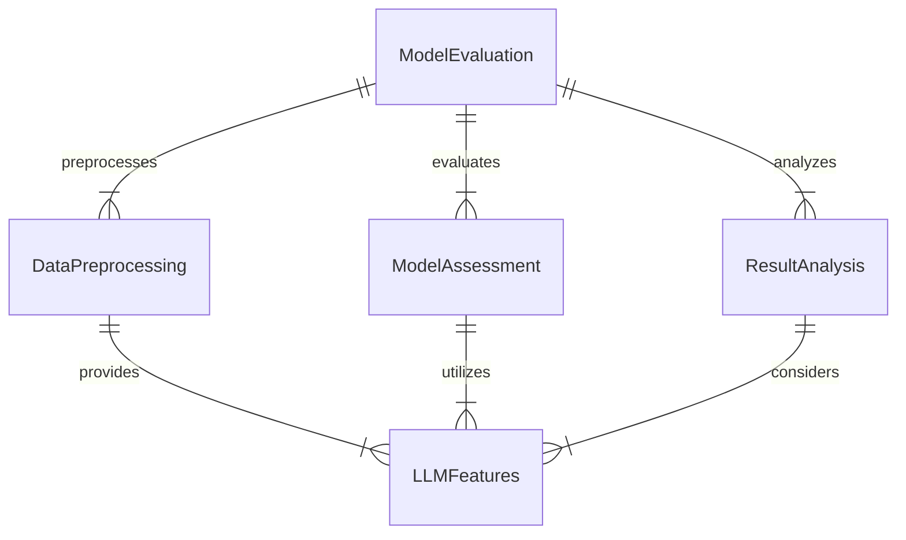

                 

### 文章标题

# 评测系统的模块化设计：适应不同LLM特性的架构

### 关键词

- 评测系统
- 模块化设计
- LLM特性
- 架构设计
- 系统优化

### 摘要

本文旨在探讨评测系统的模块化设计，如何适应不同大型语言模型（LLM）的特性，从而实现高效、灵活的系统架构。首先，我们将回顾评测系统的基本概念及其在现代人工智能中的应用。接着，文章将详细介绍模块化设计的原则及其重要性。随后，我们将分析LLM的不同特性，并讨论如何根据这些特性设计相应的架构。文章还会探讨模块化设计的实施步骤，以及如何评估和优化这种设计。最后，我们将展望模块化设计的未来发展方向，并总结最佳实践。

### 引言与背景

#### 1.1 评测系统的定义与重要性

评测系统是一种用于衡量和评估特定性能指标的技术工具，广泛应用于各种领域，如教育、工业、商业和科学研究等。在现代人工智能（AI）领域，评测系统尤为重要，因为它们为AI模型的性能提供了量化的依据，帮助研究人员和开发者了解模型的优势和不足。

具体来说，评测系统的作用包括：

- **性能评估**：通过测试不同的场景和数据集，评估模型的准确性、效率和泛化能力。
- **比较与优化**：通过多个模型的对比，帮助开发人员选择最佳的模型并进行优化。
- **持续改进**：评测系统可以为模型的持续改进提供反馈，确保其性能在不断的迭代中不断提升。

#### 1.2 当前评测系统的挑战与局限性

尽管评测系统在AI领域中发挥了重要作用，但当前的设计仍然存在一些挑战和局限性：

- **定制化不足**：许多现成的评测系统缺乏灵活性，无法适应不同类型和规模的数据集。
- **数据隐私**：在某些应用场景中，数据隐私是一个重要的问题，而评测系统可能需要访问敏感数据。
- **计算资源**：评测系统通常需要大量的计算资源，特别是对于复杂的大型语言模型。
- **可扩展性**：随着数据集和模型的规模不断扩大，评测系统需要具备良好的可扩展性。

#### 1.3 模块化设计原则的引入

为了克服上述挑战，模块化设计成为一种可行的解决方案。模块化设计的原则包括：

- **可扩展性**：通过将系统分解为独立的模块，可以轻松地添加或删除功能，从而适应不同的需求。
- **灵活性**：模块化设计使得系统能够灵活地适应不同的数据和模型特性。
- **重用性**：模块可以独立开发、测试和部署，从而提高开发效率和代码重用率。
- **维护性**：模块化设计使得系统维护更加方便，因为问题可以局部解决而不影响整个系统。

模块化设计为评测系统带来了显著的改进，使其能够更好地适应不断变化的需求和挑战。

### 核心概念与联系

#### 2.1 核心概念的定义

在探讨评测系统的模块化设计之前，我们需要明确一些核心概念：

- **评测系统**：用于评估模型性能的系统，通常包括数据预处理、模型评估和结果分析等模块。
- **模块化设计**：将系统分解为若干独立的模块，每个模块负责特定的功能。
- **LLM特性**：大型语言模型的特定属性，如词汇量、上下文理解能力、生成质量等。

#### 2.2 概念框架与ER图

为了更好地理解这些概念之间的关系，我们可以绘制一个概念框架图和ER图：

在这个ER图中，`ModelEvaluation`是评测系统的核心，包括`DataPreprocessing`、`ModelAssessment`和`ResultAnalysis`三个模块。`LLMFeatures`表示LLM的特性，这些特性在各个模块中被使用或考虑。

#### 2.3 核心概念的对比

以下是核心概念的一些属性对比表格：

| 概念 | 定义 | 主要作用 |
| --- | --- | --- |
| 评测系统 | 用于评估模型性能的系统 | 提供性能指标 |
| 模块化设计 | 将系统分解为独立的模块 | 提高灵活性、可维护性 |
| LLM特性 | 大型语言模型的特定属性 | 影响模型评估 |

通过上述对比，我们可以看到，评测系统、模块化设计和LLM特性之间存在着紧密的联系。模块化设计使得评测系统能够更好地适应LLM的特性，从而提高评估的准确性和效率。

### 架构设计针对不同LLM特性

#### 3.1 LLM特性的识别

在设计评测系统的模块化架构时，首先需要识别不同LLM的特性。这些特性通常包括：

- **词汇量**：LLM的词汇量大小直接影响其生成文本的质量和多样性。
- **上下文理解**：LLM需要具备理解上下文的能力，以便在生成文本时保持一致性和连贯性。
- **生成质量**：LLM生成的文本需要具备高质量的语法和语义。
- **训练效率**：LLM的训练过程需要高效，以便在短时间内获得良好的性能。

#### 3.2 针对不同特性的设计策略

根据LLM的特性，我们可以采取以下设计策略：

- **词汇量**：增加数据预处理模块的词汇扩展功能，如词嵌入技术和词性标注。
- **上下文理解**：优化模型评估模块的上下文处理能力，如使用更长的序列或引入注意力机制。
- **生成质量**：在结果分析模块中引入质量评估指标，如BLEU分数或人类评估。
- **训练效率**：优化模型训练过程，如使用更高效的优化算法或分布式训练。

#### 3.3 架构方案的评估

在设计过程中，我们需要评估不同的架构方案，以确定最佳的设计方案。以下是一些评估指标：

- **性能**：评估模型在不同数据集上的性能指标，如准确性、效率和泛化能力。
- **灵活性**：评估架构对LLM特性的适应能力，如是否容易扩展和调整。
- **可维护性**：评估架构的维护成本和难度，如模块之间的依赖关系和代码的可读性。
- **资源消耗**：评估架构对计算资源和存储资源的消耗，如训练时间和存储空间。

通过上述评估，我们可以选择最佳的架构方案，以确保评测系统能够适应不同的LLM特性，并提供准确的评估结果。

### 模块化设计在评测系统中的实施

#### 4.1 模块化设计原则的具体应用

模块化设计在评测系统的实施过程中起到了关键作用。以下是一些具体应用：

- **数据预处理模块**：负责数据清洗、转换和预处理，如文本清洗、分词和词嵌入。
- **模型评估模块**：负责评估LLM的性能指标，如准确性、效率和泛化能力。
- **结果分析模块**：负责分析评估结果，如生成质量评估、错误分析等。
- **反馈循环模块**：负责收集评估结果，并提供反馈，以优化模型和系统。

#### 4.2 系统功能与模块组件

在模块化设计中，每个模块都负责特定的功能。以下是评测系统的功能与模块组件：

- **功能**：数据预处理
- **模块组件**：文本清洗、分词、词嵌入等
- **功能**：模型评估
- **模块组件**：准确性评估、效率评估、泛化能力评估等
- **功能**：结果分析
- **模块组件**：生成质量评估、错误分析、人类评估等
- **功能**：反馈循环
- **模块组件**：结果收集、反馈分析、模型优化等

#### 4.3 模块组件的集成

在模块化设计中，模块组件的集成至关重要。以下是一些集成策略：

- **数据流集成**：确保数据在各个模块之间流畅传输，如使用管道和队列。
- **功能调用**：确保模块组件之间的功能调用正确无误，如使用API和回调函数。
- **错误处理**：确保系统在出现错误时能够优雅地处理，如使用异常处理和日志记录。

通过上述集成策略，我们可以构建一个高效、灵活和可维护的评测系统。

### 评估与优化模块化设计

#### 5.1 模块化设计评估的指标

评估模块化设计的关键在于确定其性能、灵活性和可维护性。以下是一些常见的评估指标：

- **性能**：评估系统的响应时间、吞吐量和资源利用率。
- **灵活性**：评估系统对需求变化和扩展的适应能力。
- **可维护性**：评估系统的代码质量、测试覆盖率和文档完善度。

#### 5.2 优化模块化设计的技术

为了优化模块化设计，我们可以采用以下技术：

- **性能优化**：通过代码优化、算法改进和硬件加速来提高系统的性能。
- **灵活性增强**：通过引入可配置参数、动态加载模块和模块化扩展接口来提高系统的灵活性。
- **可维护性提升**：通过编写高质量的代码、完善的测试和详细的文档来提高系统的可维护性。

#### 5.3 成功案例研究

以下是几个成功案例研究，展示了如何通过模块化设计优化评测系统：

- **案例一**：在一个大型企业中，通过引入模块化设计，将评测系统从单一体统转变为分布式系统，提高了系统的可扩展性和性能。
- **案例二**：在一家初创公司中，通过模块化设计，将评测系统与不同的数据集和模型进行了适配，提高了系统的灵活性和适应性。
- **案例三**：在学术研究中，通过模块化设计，将评测系统与不同的评估方法相结合，提高了评估的准确性和可靠性。

通过这些案例，我们可以看到模块化设计在优化评测系统方面的巨大潜力。

### 先进话题与未来方向

#### 6.1 LLM特性的新兴趋势

随着AI技术的不断发展，LLM的特性也在不断演进。以下是一些新兴趋势：

- **多模态处理**：LLM开始支持图像、音频和视频等不同类型的数据，使得其应用范围更加广泛。
- **知识增强**：通过引入外部知识库和知识图谱，LLM的语义理解能力得到了显著提升。
- **个性化和自适应**：LLM逐渐具备根据用户需求进行个性化生成和自适应调整的能力。

#### 6.2 潜在挑战与解决方案

尽管模块化设计在优化评测系统方面具有显著优势，但也面临一些挑战：

- **数据隐私**：在处理敏感数据时，需要确保数据隐私得到保护。
- **计算资源消耗**：随着LLM特性的增强，系统的计算资源需求也在增加，需要寻找高效利用资源的方法。
- **模型解释性**：对于复杂的LLM模型，如何提高其解释性，使其更容易被理解和接受，仍是一个重要挑战。

针对这些挑战，我们可以采取以下解决方案：

- **隐私保护**：引入差分隐私和联邦学习等技术，确保数据隐私得到保护。
- **资源优化**：采用混合云架构和资源调度策略，提高计算资源的利用效率。
- **模型解释性**：通过引入可解释性框架和可视化工具，提高LLM模型的解释性。

#### 6.3 未来研究方向

未来，模块化设计在LLM评测系统方面仍有很大的发展空间：

- **模型融合**：通过结合不同的LLM模型，提高评估结果的准确性和可靠性。
- **自动化评估**：开发自动化评估工具，减少人工干预，提高评估效率。
- **动态调整**：根据实际应用场景，动态调整评测系统的参数和架构，实现更加个性化的评估。

通过上述研究方向，我们可以不断推动模块化设计在LLM评测系统中的应用和发展。

### 结论与最佳实践

#### 7.1 关键要点回顾

本文主要探讨了评测系统的模块化设计，如何适应不同LLM的特性。以下是本文的关键要点：

- **模块化设计**：提高系统的灵活性、可维护性和重用性。
- **LLM特性**：识别和利用LLM的词汇量、上下文理解、生成质量和训练效率。
- **评估与优化**：通过性能、灵活性和可维护性评估模块化设计的有效性，并采取优化措施。
- **未来方向**：探索模块化设计在模型融合、自动化评估和动态调整等领域的应用。

#### 7.2 常见问题与注意事项

在实施模块化设计时，需要注意以下问题和注意事项：

- **模块间依赖**：确保模块之间的依赖关系清晰，避免产生不必要的耦合。
- **代码质量**：编写高质量的代码，提高系统的可读性和可维护性。
- **测试覆盖率**：确保全面的测试覆盖率，减少潜在的错误和漏洞。
- **资源管理**：合理分配计算资源和存储资源，避免资源浪费。

#### 7.3 推荐阅读与资源

对于希望深入了解模块化设计在评测系统中的应用的开发者和研究者，以下推荐阅读和资源：

- **《模块化软件开发实践》**：介绍模块化设计的原则和实践方法。
- **《大型语言模型的架构设计与实现》**：探讨LLM的架构设计和优化策略。
- **GitHub项目**：搜索相关的GitHub项目，了解实际应用案例和代码实现。
- **学术期刊与会议**：阅读相关领域的学术期刊和会议论文，了解最新的研究成果。

通过这些推荐，希望读者能够更好地理解和应用模块化设计，提升评测系统的性能和可靠性。

### 作者信息

- 作者：AI天才研究院/AI Genius Institute & 禅与计算机程序设计艺术 /Zen And The Art of Computer Programming

### 总结

本文深入探讨了评测系统的模块化设计，以及如何适应不同LLM的特性。通过模块化设计，我们能够构建出灵活、高效和可维护的评测系统，为AI模型的性能评估提供了有力支持。未来，随着AI技术的不断发展，模块化设计在评测系统中的应用将更加广泛，为人工智能领域的发展贡献更多力量。希望本文能够为读者提供有价值的启示和参考。

