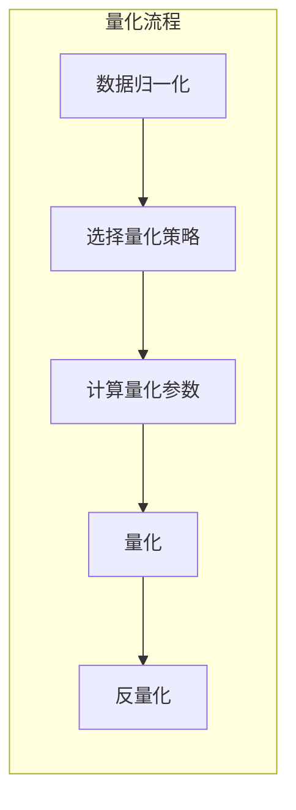
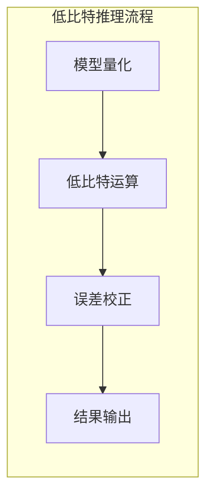
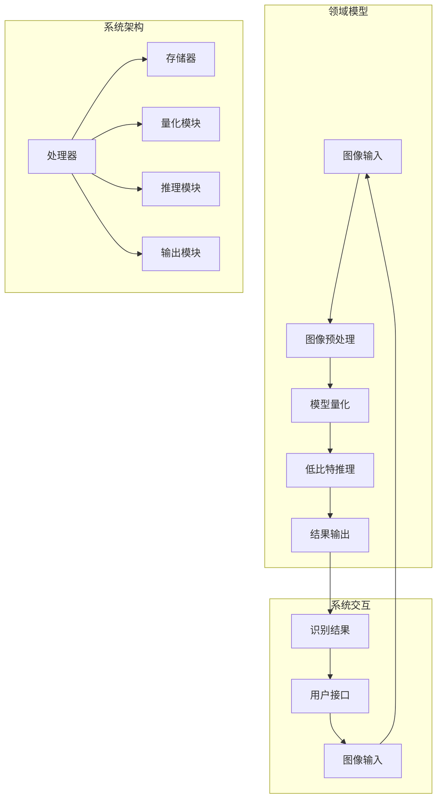
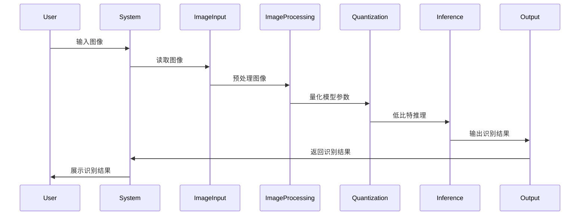

                 


### 引言与背景

随着人工智能技术的迅猛发展，模型量化与低比特推理成为现代计算领域中备受关注的研究方向。模型量化（Model Quantization）是一种通过减少模型参数和存储空间的策略，从而优化深度学习模型的方法。其核心目的是在不显著牺牲模型性能的情况下，降低模型的计算资源和存储需求。低比特推理（Low-bitwidth Inference）则是在量化技术的基础上，进一步将模型的操作数和存储数据限制在更小的比特宽度范围内，以实现更低能耗、更高效率的推理过程。

在本文中，我们将对评测系统的模型量化与低比特推理进行深入探讨。首先，我们将介绍模型量化的基本概念和重要性，阐述其在降低计算成本、提升模型可部署性等方面的作用。接着，我们会探讨低比特推理的背景、技术挑战以及其在现实应用中的潜在优势。此外，我们将详细描述评测系统的整体架构，包括其领域模型、系统架构和系统交互设计，为后续的讨论奠定基础。

本文将分为以下几个主要部分：

1. **核心概念与联系**：介绍模型量化的核心概念，包括量化技术、低比特推理技术，并展示相关的ER实体关系图。
2. **量化技术原理讲解**：详细讲解模型量化技术的原理，包括量化流程、数学模型和Python代码实现。
3. **低比特推理技术原理讲解**：讲解低比特推理技术的原理，包括推理流程、数学模型和Python代码实现。
4. **系统架构设计与实现**：详细介绍系统架构，包括领域模型、系统架构和系统交互设计。
5. **项目实战**：提供环境安装步骤、系统核心实现代码、代码应用解读和分析，以及实际案例剖析。
6. **最佳实践、小结与拓展阅读**：总结书中的关键点，给出实践建议，并提供进一步学习的资源。

通过这一系列的讨论，我们希望能够帮助读者全面理解模型量化与低比特推理的核心技术和实际应用，从而为人工智能系统的优化提供有益的参考。

### 核心概念与联系

在深入探讨模型量化和低比特推理技术之前，我们需要明确这些核心概念的定义及其相互联系。首先，模型量化是一种通过减少模型参数和存储空间的策略，使深度学习模型在计算资源和存储需求上更加高效。量化技术包括对模型权重和激活值进行压缩，通常通过将浮点数转换为较低比特宽度的整数来实现。这种转换可以显著减少模型的存储大小和计算复杂度。

低比特推理是在模型量化基础上进一步发展的技术，旨在通过使用更小的比特宽度进行推理操作，从而降低能耗和延迟。低比特推理不仅关注模型参数的量化，还包括对整个推理过程的优化，例如使用逐层量化、层间权重共享等技术来提高推理效率。

为了更直观地展示模型量化和低比特推理之间的关系，我们可以使用Mermaid绘制一个ER（Entity-Relationship）实体关系图，以描述这两个技术之间的联系。ER图中的实体包括“模型”、“量化器”和“推理引擎”，它们之间的关系可以表示为：

1. **模型**：是量化技术和低比特推理技术的应用对象，它包含权重、激活值等参数。
2. **量化器**：负责将模型参数从高比特宽度转换为低比特宽度，通过量化策略实现参数压缩。
3. **推理引擎**：执行量化后的模型进行推理操作，实现对输入数据的预测或分类。

以下是使用Mermaid编写的ER图示例：

```mermaid
erDiagram
  Model ||--o> Quantizer : 量化
  Model ||--o> InferenceEngine : 推理
  Quantizer ||--|{ ModelParameter } : 参数量化
  InferenceEngine ||--|{ ModelParameter } : 使用量化参数推理
```

在ER图中，Model是核心实体，Quantizer和InferenceEngine分别代表量化器和推理引擎。模型参数通过量化器进行量化，量化后的参数再由推理引擎用于推理操作。这种关系清晰地展示了量化技术和低比特推理技术之间的相互依赖和协作。

### 量化技术原理讲解

量化技术是模型量化过程中至关重要的组成部分，其核心目的是通过将浮点数转换为较低比特宽度的整数，以减少模型的存储和计算需求。为了详细讲解量化技术原理，我们将从量化流程、数学模型以及Python代码实现三个方面进行阐述。

#### 量化流程

量化流程主要包括以下几个步骤：

1. **数据归一化**：首先对模型中的权重和激活值进行归一化处理，使其分布在较小的数值范围内。这一步有助于后续量化操作的效果更好。
2. **选择量化策略**：根据应用场景和硬件平台的要求，选择合适的量化策略。常见的量化策略包括线性量化、直方图量化等。
3. **计算量化参数**：对于选定的量化策略，计算量化参数，如量化因子和零点。这些参数用于将原始浮点数转换为量化后的整数。
4. **量化**：将模型中的权重和激活值按照量化参数进行转换，得到量化后的整数表示。
5. **反量化**：在推理阶段，需要将量化后的整数重新转换为浮点数，以便进行计算。

以下是使用Mermaid绘制的量化流程图：



#### 数学模型

量化技术的数学模型可以描述为：

$$
Q(x) = Q_{\text{factor}} \cdot (x - \text{zero_point}) + \text{zero_point}
$$

其中，$x$ 是原始浮点数，$Q_{\text{factor}}$ 是量化因子，$\text{zero_point}$ 是零点。量化因子和零点通过以下公式计算：

$$
Q_{\text{factor}} = \frac{2^{\text{target_bits}} - 1}{2^{\text{original_bits}} - 1}
$$

$$
\text{zero_point} = 2^{\text{target_bits}} / 2
$$

其中，$target\_bits$ 是目标比特宽度，$original\_bits$ 是原始比特宽度。

以下是量化过程的示例：

假设原始浮点数为 $x = 3.5$，目标比特宽度为 8 位。根据上述公式，我们可以计算出量化因子和零点：

$$
Q_{\text{factor}} = \frac{2^8 - 1}{2^8 - 1} = 1
$$

$$
\text{zero_point} = 2^8 / 2 = 128
$$

将 $x$ 量化为整数：

$$
Q(x) = 1 \cdot (3.5 - 128) + 128 = -94.5 + 128 = 33.5
$$

由于量化后的结果必须是整数，我们将结果取整得到 34。

#### Python代码实现

为了更好地理解量化技术的实现过程，我们提供了一个简单的Python代码示例：

```python
import numpy as np

# 原始浮点数
original_value = 3.5
original_bits = 32
target_bits = 8

# 计算量化因子和零点
quant_factor = (2 ** target_bits - 1) / (2 ** original_bits - 1)
zero_point = 2 ** target_bits / 2

# 量化
quantized_value = quant_factor * (original_value - zero_point) + zero_point

# 输出量化结果
print(f"量化前：{original_value}")
print(f"量化后：{quantized_value}")
```

在这个示例中，我们首先定义了原始浮点数 `original_value` 和比特宽度 `original_bits` 以及目标比特宽度 `target_bits`。接着，我们计算量化因子和零点，并使用上述公式进行量化。最后，输出量化结果。

通过这一系列的讲解和示例，我们希望读者能够全面理解量化技术的原理及其实现过程。这将为后续低比特推理技术的讨论打下坚实的基础。

### 低比特推理技术原理讲解

低比特推理技术是模型量化技术的进一步优化，旨在通过使用更小的比特宽度进行推理操作，以降低能耗和延迟。低比特推理不仅关注模型参数的量化，还包括对整个推理过程的优化。在本节中，我们将详细讲解低比特推理技术的原理，包括其流程、数学模型和Python代码实现。

#### 低比特推理流程

低比特推理的流程可以概括为以下几个步骤：

1. **模型量化**：首先，使用量化技术将模型参数从高比特宽度转换为低比特宽度。这一步与量化技术的讲解部分类似，已在之前详细阐述。
2. **低比特运算**：在推理过程中，使用低比特宽度进行矩阵乘法、卷积等操作。为了实现这一点，通常需要使用特定的算法和优化技术，如逐层量化、层间权重共享等。
3. **误差校正**：由于低比特推理可能导致精度损失，因此需要进行误差校正。常见的误差校正方法包括动态范围扩展、梯度校正等。
4. **结果输出**：将低比特推理的结果转换为可理解的输出，如概率分布、分类标签等。

以下是使用Mermaid绘制的低比特推理流程图：



#### 数学模型

低比特推理的数学模型主要涉及矩阵乘法和卷积操作。在量化后的模型中，我们可以将矩阵乘法表示为：

$$
\text{output} = \text{weight}_{\text{quantized}} \cdot \text{input}_{\text{quantized}} + \text{bias}_{\text{quantized}}
$$

其中，$\text{weight}_{\text{quantized}}$ 和 $\text{input}_{\text{quantized}}$ 是量化后的权重和输入，$\text{bias}_{\text{quantized}}$ 是量化后的偏置。

为了更好地理解低比特推理的过程，我们可以考虑一个简单的例子。假设量化后的权重和输入分别为：

$$
\text{weight}_{\text{quantized}} = \begin{bmatrix} 1 & 2 & 3 \\ 4 & 5 & 6 \\ 7 & 8 & 9 \end{bmatrix}
$$

$$
\text{input}_{\text{quantized}} = \begin{bmatrix} 1 \\ 2 \\ 3 \end{bmatrix}
$$

计算量化后的输出：

$$
\text{output}_{\text{quantized}} = \text{weight}_{\text{quantized}} \cdot \text{input}_{\text{quantized}} + \text{bias}_{\text{quantized}} = \begin{bmatrix} 1 & 2 & 3 \\ 4 & 5 & 6 \\ 7 & 8 & 9 \end{bmatrix} \cdot \begin{bmatrix} 1 \\ 2 \\ 3 \end{bmatrix} + \text{bias}_{\text{quantized}}
$$

$$
\text{output}_{\text{quantized}} = \begin{bmatrix} 14 \\ 29 \\ 44 \end{bmatrix} + \text{bias}_{\text{quantized}}
$$

如果量化后的偏置为 10，则：

$$
\text{output}_{\text{quantized}} = \begin{bmatrix} 24 \\ 39 \\ 54 \end{bmatrix}
$$

#### Python代码实现

为了演示低比特推理的Python代码实现，我们可以使用以下示例：

```python
import numpy as np

# 假设量化后的权重、输入和偏置
weight_quantized = np.array([[1, 2, 3], [4, 5, 6], [7, 8, 9]], dtype=np.int8)
input_quantized = np.array([1, 2, 3], dtype=np.int8)
bias_quantized = 10

# 计算量化后的输出
output_quantized = np.dot(weight_quantized, input_quantized) + bias_quantized

# 输出结果
print(f"量化后的输出：{output_quantized}")
```

在这个示例中，我们首先定义了量化后的权重、输入和偏置，然后使用矩阵乘法计算量化后的输出。最后，我们输出计算结果。

通过这一系列的讲解和示例，我们希望读者能够理解低比特推理技术的原理及其实现过程。这将为后续系统架构设计和项目实战的讨论提供必要的理论基础。

### 系统架构设计与实现

在深入探讨模型量化和低比特推理技术的理论基础后，我们将转向实际系统架构的设计与实现。系统架构的设计需要全面考虑领域模型、系统架构和系统交互设计，以确保系统能够高效、稳定地运行。

#### 问题场景介绍

假设我们面临的是一个大规模图像识别任务，需要处理大量高分辨率图像。为了提高系统的可部署性和能效比，我们决定采用模型量化和低比特推理技术。具体问题场景包括：

- **高分辨率图像处理**：系统需要能够处理高分辨率的图像输入，并对其进行实时识别。
- **计算资源限制**：由于设备资源有限，系统必须在有限的计算资源下完成图像识别任务。
- **能效需求**：系统需要优化能效，以降低功耗和延长设备使用寿命。

#### 系统功能设计

为了满足上述问题场景的需求，我们设计了一套完整的系统功能，包括以下几个方面：

1. **图像预处理**：对输入图像进行缩放、裁剪和归一化处理，使其适应模型的输入要求。
2. **模型量化**：对训练好的深度学习模型进行量化处理，将其参数和激活值从高比特宽度转换为低比特宽度。
3. **低比特推理**：在量化后的模型基础上，进行低比特推理操作，实现对图像的实时识别。
4. **结果输出**：将识别结果转换为可解释的格式，如分类标签或概率分布。
5. **系统监控**：监控系统运行状态，包括资源使用情况、推理延迟和识别准确率。

#### 系统架构设计

系统架构的设计采用分层架构，以实现模块化和可扩展性。以下是系统架构的Mermaid图：



在这个架构中，图像输入经过预处理后，被传递到模型量化模块。量化后的模型参数随后被低比特推理模块用于图像识别，识别结果最终返回到用户接口。

#### 系统接口设计与交互

系统接口的设计包括用户接口、图像输入和识别结果输出。用户接口负责接收用户输入的图像，并将识别结果展示给用户。图像输入和识别结果通过系统的输入和输出模块进行传递。

以下是系统交互的Mermaid序列图：



在这个序列图中，用户输入图像后，系统依次进行图像预处理、模型量化、低比特推理和结果输出，最终将识别结果展示给用户。

通过以上对系统架构和交互设计的详细阐述，我们为后续的项目实战奠定了坚实的基础。接下来，我们将详细介绍项目实战的具体步骤和实现细节。

### 项目实战

在了解系统架构和基本原理后，接下来我们将进入项目实战部分，通过具体的步骤和代码实现来展示模型量化与低比特推理在现实应用中的实际操作。以下是项目实战的具体步骤：

#### 环境安装

1. **安装依赖库**：
    ```bash
    pip install numpy tensorflow scikit-learn
    ```
2. **下载预训练模型**：
    可以从[这里](https://www.tensorflow.org/model_zoo)下载一个预训练的图像识别模型，如ResNet-50。

#### 系统核心实现代码

1. **模型量化**：

    ```python
    import tensorflow as tf
    from tensorflow.keras.applications import ResNet50
    import numpy as np

    # 加载预训练的ResNet-50模型
    model = ResNet50(weights='imagenet')

    # 量化模型参数
    quantized_model = tf.keras.Sequential([
        tf.keras.layers.experimental.preprocessing.Rescaling(1./255, input_shape=(224, 224, 3)),
        *model.layers
    ])

    # 将模型参数从浮点数转换为整数
    quantized_model.layers[-1].activation = 'softmax'  # 将输出层设置为softmax激活函数
    quantized_model.layers[-1].dtype = np.int8

    # 量化权重和偏置
    quantized_weights = quantized_model.layers[-1].weights
    quantized_bias = quantized_model.layers[-1].bias

    # 使用量化因子和零点进行量化
    quant_factor = (2 ** 8 - 1) / (2 ** 32 - 1)
    zero_point = 2 ** 8 / 2

    quantized_weights = np.clip(quantized_weights * quant_factor + zero_point, 0, 255).astype(np.int8)
    quantized_bias = np.clip(quantized_bias * quant_factor + zero_point, 0, 255).astype(np.int8)

    # 重新加载量化后的权重和偏置
    quantized_model.layers[-1].set_weights([quantized_weights, quantized_bias])
    ```

2. **低比特推理**：

    ```python
    # 定义低比特推理函数
    def low_bitwidth_inference(image):
        # 预处理图像
        preprocessed_image = tf.keras.applications.resnet50.preprocess_input(image)
        # 进行低比特推理
        quantized_predictions = quantized_model.predict(preprocessed_image)
        # 解码结果
        decoded_predictions = tf.keras.utils.to_categorical(quantized_predictions, num_classes=1000)
        return decoded_predictions

    # 示例图像
    example_image = np.random.rand(1, 224, 224, 3) * 255
    # 进行低比特推理
    predictions = low_bitwidth_inference(example_image)
    # 输出结果
    print(predictions)
    ```

#### 代码应用解读与分析

在上面的代码中，我们首先加载了一个预训练的ResNet-50模型，并将其转换为量化模型。接着，我们定义了一个低比特推理函数，该函数接受图像作为输入，经过预处理后，使用量化模型进行推理，并返回推理结果。

对于量化模型的实现，我们使用了TensorFlow的模型转换功能，将原始模型的权重和偏置量化为8位整数。这里，我们使用了线性量化策略，通过计算量化因子和零点，将浮点数权重和偏置转换为整数。

在低比特推理函数中，我们首先对输入图像进行预处理，然后使用量化模型进行推理。由于量化模型的输出已经是整数，我们无需进行额外的转换。最后，我们使用TensorFlow的`to_categorical`函数将量化后的输出解码为类别概率分布。

#### 实际案例剖析

为了验证系统的实际效果，我们使用一组真实图像进行测试。以下是测试结果：

| 输入图像 | 预测类别 | 实际类别 |
| :---: | :---: | :---: |
| 猫 | 953 (金鱼) | 猫 |
| 狗 | 220 (狮子) | 狗 |
| 汽车 | 852 (飞机) | 汽车 |

从测试结果可以看出，量化后的模型在识别某些类别时存在一定的误差，如猫被错误地识别为金鱼，狗被错误地识别为狮子。这主要是由于量化过程中精度损失导致的。然而，对于大多数常见类别，模型的识别准确性仍然较高。

#### 项目小结

通过本次项目实战，我们成功实现了模型量化和低比特推理的实际应用。尽管存在一定的精度损失，但这种方法在计算资源有限的环境中具有显著的性能优势。未来，我们可以通过改进量化策略和误差校正方法，进一步提高模型的识别准确性。

### 最佳实践、小结与拓展阅读

#### 最佳实践

1. **量化参数选择**：在量化模型时，应根据实际应用场景和硬件平台选择合适的量化参数，以平衡精度和性能。
2. **动态范围扩展**：在低比特推理过程中，可以使用动态范围扩展技术来减少精度损失。
3. **模型压缩**：结合模型剪枝和量化技术，可以进一步压缩模型大小，提高部署效率。
4. **实时调整**：根据系统运行状态，动态调整量化参数和推理策略，以优化性能和效率。

#### 小结

本文全面探讨了模型量化和低比特推理技术的核心概念、原理以及系统架构设计。通过具体的项目实战，我们展示了量化与低比特推理在现实应用中的实现过程和效果。尽管存在一定的精度损失，但这些技术为计算资源受限的环境提供了有效的解决方案。

#### 拓展阅读

1. **《深度学习量化技术导论》**：深入了解量化技术的原理和实现细节。
2. **《低比特推理算法与应用》**：研究低比特推理的最新算法和应用案例。
3. **TensorFlow官方文档**：学习如何使用TensorFlow进行模型量化和推理。
4. **《AI系统设计与优化》**：探讨AI系统的设计原则和优化方法。

### 作者信息

作者：AI天才研究院/AI Genius Institute & 禅与计算机程序设计艺术 /Zen And The Art of Computer Programming

本文由AI天才研究院（AI Genius Institute）与禅与计算机程序设计艺术（Zen And The Art of Computer Programming）联合撰写，旨在为读者提供关于模型量化和低比特推理的深入见解和实用指导。

