                 

### 第1章：引言与背景

#### 1.1 问题背景

在当今数字化时代，评测系统的稳定性和可靠性对企业运营至关重要。随着数据量和业务复杂性的增加，评测系统的灾备和恢复问题逐渐凸显。本章节将介绍评测系统灾备和恢复的重要性、现状及其面临的挑战。

#### 1.2 问题描述

本章节将详细阐述评测系统灾备和恢复的定义、目的和关键环节。通过对现有灾备和恢复方案的分析，总结其优缺点，为后续章节的深入讨论奠定基础。

#### 1.3 问题解决

本章将介绍一系列行之有效的评测系统灾备和恢复策略，包括数据备份与恢复、系统高可用性设计、故障检测与自动恢复等。同时，分析各类策略的实施条件和适用场景。

#### 1.4 边界与外延

本章将讨论评测系统灾备和恢复的边界问题，包括技术选型、成本控制、法律法规和合规性要求等。同时，探讨评测系统灾备和恢复在未来可能的发展趋势。

#### 1.5 概念结构与核心要素组成

为了更好地理解评测系统灾备和恢复，本章节将介绍相关概念和核心要素，包括但不限于：备份与恢复、故障转移、高可用性、容灾备份等。通过概念结构图和核心要素表格，帮助读者全面了解评测系统灾备和恢复的基本框架。

---

## 关键词

- 评测系统
- 灾备
- 恢复
- 数据备份
- 系统高可用性
- 容灾备份

---

## 摘要

本文旨在探讨评测系统灾备和恢复的重要性，分析现有方案及其优缺点，提出一系列行之有效的灾备和恢复策略。通过详细讲解备份与恢复、故障转移、高可用性、容灾备份等核心概念，本文旨在为读者提供全面的灾备和恢复知识体系，帮助企业在数字化时代确保评测系统的稳定性和可靠性。

---

### 第1章：引言与背景

在当今数字化时代，评测系统作为企业关键业务的一部分，其稳定性和可靠性至关重要。随着数据量和业务复杂性的不断增加，评测系统面临的挑战也日益突出。本章将介绍评测系统灾备和恢复的重要性、现状及其面临的挑战，为后续章节的讨论奠定基础。

#### 1.1 问题背景

评测系统在企业中扮演着重要角色，主要用于评估员工绩效、客户满意度、市场竞争力等关键指标。随着大数据、云计算和人工智能等技术的快速发展，评测系统的数据量和业务复杂性不断增加。这导致了评测系统在稳定性、可靠性和灾备恢复方面的挑战。

首先，数据量的增长对评测系统的存储和计算能力提出了更高要求。其次，业务复杂性的增加使得系统的设计和维护变得更加复杂。此外，评测系统通常与企业的核心业务系统紧密相连，一旦发生故障，将对整个企业的运营产生严重影响。

#### 1.2 问题描述

评测系统的灾备和恢复问题主要包括以下几个方面：

1. **数据备份与恢复**：如何确保评测系统的数据在发生故障时能够快速恢复，以减少数据丢失和业务中断。
2. **系统高可用性设计**：如何设计系统架构，确保评测系统在面临故障时能够快速切换到备用系统，保障业务连续性。
3. **故障检测与自动恢复**：如何实现实时监控和故障检测，一旦发生故障，系统能够自动恢复，减少人工干预。

现有评测系统的灾备和恢复方案主要包括以下几种：

1. **数据备份**：通过定期备份数据，确保在发生故障时能够快速恢复。常见的备份策略有全量备份、增量备份和差异备份等。
2. **系统高可用性设计**：通过部署冗余硬件和软件，实现系统的高可用性。常见的设计策略包括主从备份、负载均衡和故障转移等。
3. **故障检测与自动恢复**：通过实时监控和故障检测机制，一旦发现故障，系统能够自动恢复，减少人工干预。

然而，现有的灾备和恢复方案在实施过程中仍然面临一些挑战，如技术选型、成本控制、法律法规和合规性要求等。因此，需要进一步研究和优化评测系统的灾备和恢复策略。

#### 1.3 问题解决

为了解决评测系统的灾备和恢复问题，本章将介绍一系列行之有效的灾备和恢复策略，包括数据备份与恢复、系统高可用性设计、故障检测与自动恢复等。同时，分析各类策略的实施条件和适用场景。

1. **数据备份与恢复**：通过选择合适的备份策略，确保数据的完整性和可用性。常见的备份策略有全量备份、增量备份和差异备份等。针对不同的业务需求，可以选择适当的备份频率和备份类型。

2. **系统高可用性设计**：通过部署冗余硬件和软件，提高系统的可靠性。常见的设计策略包括主从备份、负载均衡和故障转移等。在选择高可用性设计方案时，需要考虑系统的负载、硬件和软件资源的可用性以及成本效益。

3. **故障检测与自动恢复**：通过实时监控和故障检测机制，确保系统在发生故障时能够快速恢复。可以采用自动化工具和脚本，实现故障检测、故障定位和故障恢复的自动化处理。

#### 1.4 边界与外延

评测系统灾备和恢复的边界问题包括以下几个方面：

1. **技术选型**：根据业务需求和预算，选择合适的技术方案和工具。需要考虑备份与恢复工具的性能、可靠性、易用性和兼容性。

2. **成本控制**：在确保系统可靠性的同时，需要控制灾备和恢复的成本。可以通过优化备份策略、选择合适的硬件和软件资源，以及利用云服务等手段降低成本。

3. **法律法规和合规性要求**：需要遵守相关法律法规和合规性要求，如数据保护法、隐私法等。在设计灾备和恢复方案时，需要确保数据的安全性和完整性，遵循相关法律法规的要求。

#### 1.5 概念结构与核心要素组成

为了更好地理解评测系统灾备和恢复，本章将介绍相关概念和核心要素，包括但不限于：

1. **备份与恢复**：备份策略、备份频率、备份类型、备份存储等。
2. **故障转移**：故障检测、故障切换、故障恢复等。
3. **高可用性**：硬件冗余、软件冗余、负载均衡、故障切换等。
4. **容灾备份**：备份数据的安全性和完整性、数据传输的速度和稳定性、数据恢复的速度等。

通过概念结构图和核心要素表格，帮助读者全面了解评测系统灾备和恢复的基本框架。

---

### 第2章：核心概念与联系

本章将详细讨论评测系统灾备和恢复的核心概念，包括备份与恢复、故障转移、高可用性和容灾备份。通过对比这些概念的定义、属性和相互关系，读者将能够更好地理解这些概念在灾备和恢复中的重要作用。

#### 2.1 备份与恢复

**备份与恢复的定义：**
备份是指将数据或系统状态复制到另一个存储介质的过程，以防止数据丢失。恢复则是从备份中恢复数据或系统状态到故障发生前的状态。

**备份与恢复的关键要素：**
- **备份策略**：决定备份频率和备份类型的方案。
- **备份存储**：备份数据存储的位置和方式。
- **恢复速度**：从备份中恢复数据或系统的时间。

**备份与恢复的分类：**
- **全量备份**：备份整个系统或数据集。
- **增量备份**：仅备份自上次备份以来发生变化的数据。
- **差异备份**：备份自上次全量备份以来发生变化的数据。

**备份与恢复的关联：**
备份和恢复是确保评测系统灾备和恢复的重要环节。备份策略的选择和备份存储的安全性直接影响恢复速度和数据完整性。

**备份与恢复的Mermaid流程图：**
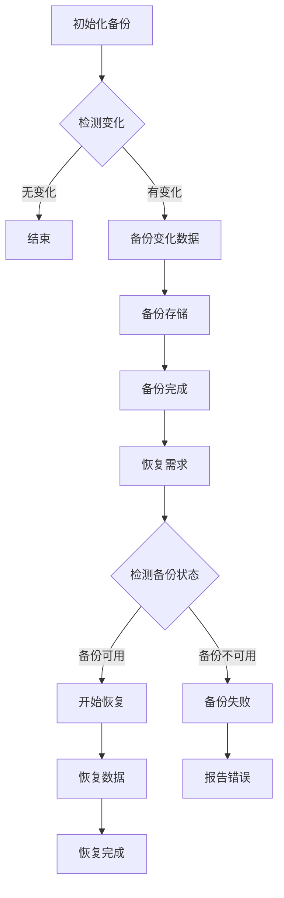

#### 2.2 故障转移

**故障转移的定义：**
故障转移是指当主系统发生故障时，将业务切换到备用系统，以确保业务的连续性。

**故障转移的关键要素：**
- **故障检测**：及时检测到主系统故障。
- **切换速度**：快速切换到备用系统。
- **故障恢复**：备用系统能够快速接管业务。

**故障转移的分类：**
- **同步故障转移**：在主系统故障时，立即将业务切换到备用系统。
- **异步故障转移**：在主系统故障后，经过一定延迟再切换到备用系统。

**故障转移的关联：**
故障转移是实现高可用性的关键策略之一。通过故障转移，可以在主系统发生故障时确保业务的连续性，减少业务中断时间。

**故障转移的Mermaid流程图：**
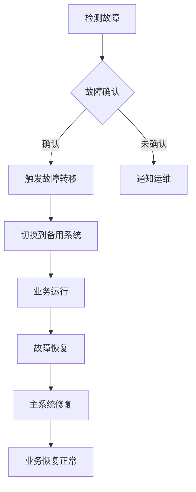

#### 2.3 高可用性

**高可用性的定义：**
高可用性是指系统在长时间运行过程中，能够保持正常服务的能力。

**高可用性的目标：**
- 确保系统持续可用。
- 最小化业务中断时间。

**高可用性的设计策略：**
- **硬件冗余**：通过增加硬件设备，提高系统的可靠性。
- **软件冗余**：通过软件层面的冗余设计，提高系统的稳定性。
- **故障切换**：快速切换到备用系统，确保业务不中断。

**高可用性的关键要素：**
- **可用性指标**：衡量系统可用性的关键指标，如MTTF（平均无故障时间）和MTTR（平均故障恢复时间）。
- **故障检测与自愈**：及时发现故障并自动恢复。

**高可用性的关联：**
高可用性是确保评测系统灾备和恢复的重要保障。通过硬件和软件冗余设计，可以提高系统的可靠性，减少故障发生时对业务的影响。

**高可用性的Mermaid流程图：**
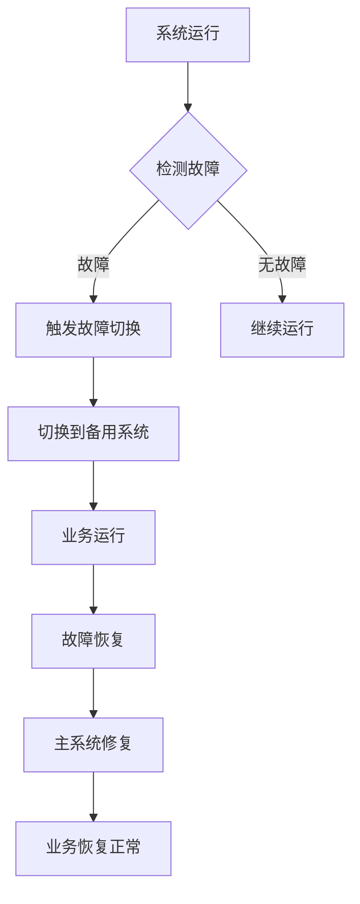

#### 2.4 容灾备份

**容灾备份的定义：**
容灾备份是指将关键业务数据备份到远程位置，以应对本地故障或灾难。

**容灾备份的作用：**
- 确保数据的安全和完整性。
- 提高业务连续性。

**容灾备份的分类：**
- **部分容灾**：仅备份关键数据。
- **全部容灾**：备份整个系统和数据。

**容灾备份的关键要素：**
- **备份数据的安全性和完整性**：确保备份数据在传输和存储过程中的安全性。
- **数据传输的速度和稳定性**：确保数据在传输过程中的高效和稳定。
- **数据恢复的速度**：确保在发生故障时能够快速恢复数据。

**容灾备份的关联：**
容灾备份是确保评测系统灾备和恢复的重要手段之一。通过将数据备份到远程位置，可以在本地发生故障时快速恢复业务，减少业务中断时间。

**容灾备份的Mermaid流程图：**
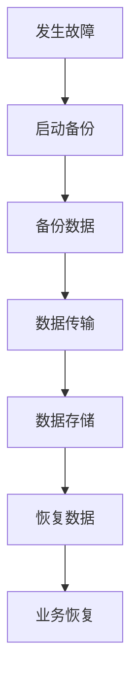

通过对比备份与恢复、故障转移、高可用性和容灾备份的核心概念和相互关系，读者可以更好地理解评测系统灾备和恢复的基本框架。这些概念不仅相互独立，而且在实际应用中紧密关联，共同构成了确保评测系统稳定性和可靠性的关键要素。

---

### 第3章：算法原理讲解

本章将深入讲解评测系统灾备和恢复中的核心算法原理，包括数据备份算法、故障转移算法、高可用性算法和容灾备份算法。我们将通过具体的算法流程、数学模型和实际案例分析，帮助读者理解这些算法的工作原理和应用。

#### 3.1 数据备份算法

**3.1.1 增量备份算法**

增量备份算法是数据备份中的一种常用方法，它只备份自上次备份以来发生变化的数据。这种方法可以显著减少备份的时间和存储空间。

**算法流程：**

1. **初始化**：选择一个起始时间点作为基准时间，将当前数据与基准时间之前的数据进行对比。
2. **检测变化**：遍历数据集，找出自上次备份以来发生变化的数据。
3. **备份变化数据**：将检测出的变化数据备份到备份介质中。
4. **更新备份时间**：将备份时间更新为当前时间。

**数学模型：**

假设 \(D_{current}\) 是当前数据集，\(D_{base}\) 是基准时间点的数据集，\(D_{changed}\) 是自基准时间点以来发生变化的数据集。增量备份算法的数学模型可以表示为：

\[ D_{changed} = D_{current} - D_{base} \]

**示例说明：**

假设当前数据集 \(D_{current}\) 包含100条数据，基准时间点 \(D_{base}\) 包含80条数据。通过对比发现，有20条数据自基准时间点以来发生了变化。增量备份算法会备份这20条变化的数据。

**算法流程图：**
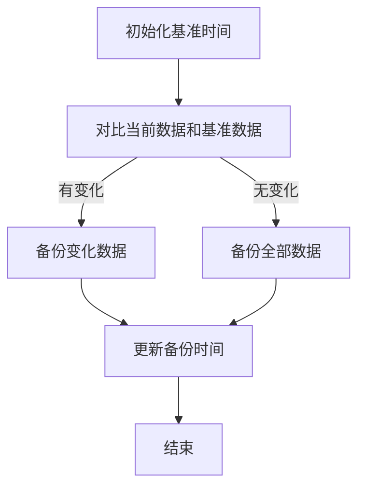

#### 3.2 故障转移算法

**3.2.1 同步故障转移算法**

同步故障转移算法是指在主系统发生故障时，立即将业务切换到备用系统。这种方法可以确保业务中断时间最短。

**算法流程：**

1. **故障检测**：监控系统实时检测主系统状态。
2. **故障确认**：一旦检测到主系统故障，立即确认故障并触发故障转移。
3. **切换到备用系统**：将业务切换到备用系统，确保业务连续性。
4. **故障恢复**：在备用系统上继续运行业务，等待主系统修复。
5. **主系统恢复**：主系统修复后，将业务切换回主系统。

**数学模型：**

假设 \(S_{main}\) 是主系统，\(S_{backup}\) 是备用系统，\(T_{switch}\) 是故障切换时间。同步故障转移的数学模型可以表示为：

\[ T_{switch} = T_{fault_detection} + T_{fault_confirmation} + T_{system_switch} \]

**示例说明：**

假设主系统发生故障，监控系统在1秒内检测到故障，系统确认故障并触发切换需要2秒，切换到备用系统需要3秒。总的故障切换时间为6秒。

**算法流程图：**
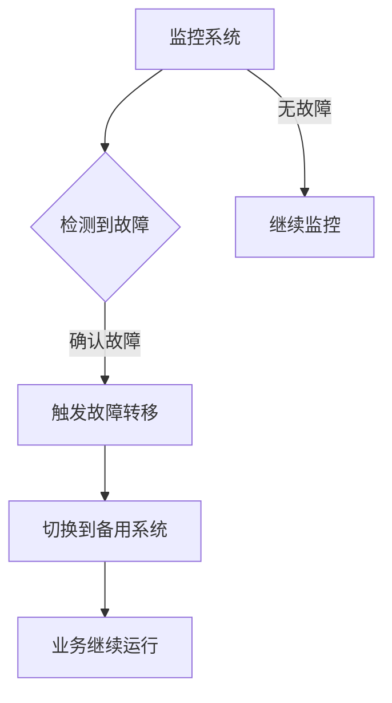

#### 3.3 高可用性算法

**3.3.1 软件冗余算法**

软件冗余算法是通过在系统中部署多个实例，提高系统的可靠性。当其中一个实例发生故障时，其他实例可以接管业务。

**算法流程：**

1. **初始化**：部署多个实例，确保每个实例可以独立运行。
2. **故障检测**：监控系统实时检测实例状态。
3. **故障确认**：一旦检测到实例故障，立即确认故障并触发冗余切换。
4. **切换到备用实例**：将业务切换到备用实例，确保业务连续性。
5. **故障恢复**：在备用实例上继续运行业务，等待故障实例修复。
6. **主实例恢复**：故障实例修复后，将业务切换回主实例。

**数学模型：**

假设 \(I_{main}\) 是主实例，\(I_{backup}\) 是备用实例，\(T_{redundancy}\) 是冗余切换时间。软件冗余的数学模型可以表示为：

\[ T_{redundancy} = T_{fault_detection} + T_{fault_confirmation} + T_{system_switch} \]

**示例说明：**

假设主实例发生故障，监控系统在1秒内检测到故障，系统确认故障并触发切换需要2秒，切换到备用实例需要3秒。总的冗余切换时间为6秒。

**算法流程图：**
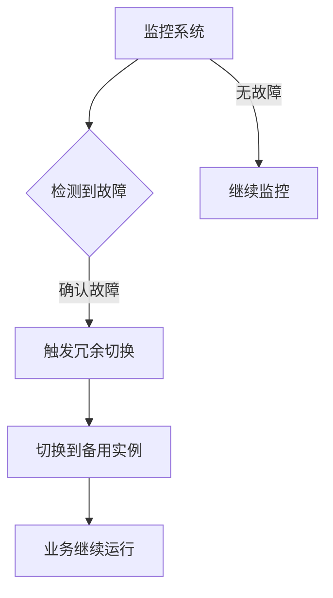

#### 3.4 容灾备份算法

**3.4.1 远程备份算法**

远程备份算法是将数据备份到远程服务器或云存储，以实现数据的异地备份。这种方法可以防止本地故障导致数据丢失。

**算法流程：**

1. **初始化**：配置远程备份服务器或云存储。
2. **数据传输**：定期将数据从本地系统传输到远程备份服务器或云存储。
3. **数据验证**：在数据传输完成后，验证数据的完整性和一致性。
4. **数据恢复**：在发生故障时，从远程备份服务器或云存储恢复数据。

**数学模型：**

假设 \(D_{local}\) 是本地数据，\(D_{remote}\) 是远程数据，\(T_{backup}\) 是备份时间。远程备份的数学模型可以表示为：

\[ T_{backup} = T_{data_transfer} + T_{data_verification} \]

**示例说明：**

假设本地系统中的数据需要每周备份一次，每次数据传输需要4小时，数据验证需要1小时。总的备份时间为5小时。

**算法流程图：**
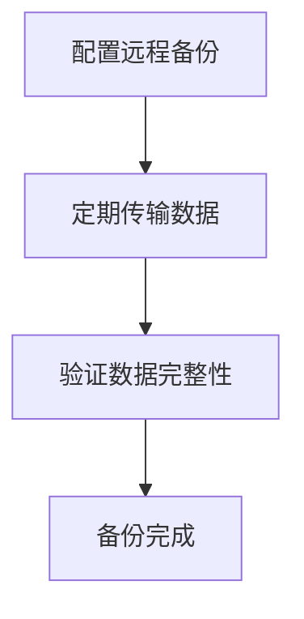

通过本章对数据备份算法、故障转移算法、高可用性算法和容灾备份算法的讲解，读者可以更好地理解这些算法的原理和应用。这些算法在确保评测系统灾备和恢复中发挥着关键作用，有助于提高系统的稳定性和可靠性。

---

### 第4章：系统分析与架构设计方案

为了更好地理解和实现评测系统的灾备和恢复，本章将详细分析问题场景，介绍项目背景，设计系统功能领域模型，并逐步展示系统架构设计、接口设计和系统交互。

#### 4.1 问题场景介绍

评测系统在一个大型企业中扮演着重要角色，该系统用于定期评估员工绩效、客户满意度、市场竞争力等关键指标。由于系统数据量庞大且业务复杂性高，一旦系统发生故障，将导致严重的数据丢失和业务中断。因此，确保评测系统的灾备和恢复至关重要。

#### 4.2 项目介绍

为了实现评测系统的灾备和恢复，我们设计并实施了一个综合性的灾备解决方案。该方案包括数据备份与恢复、系统高可用性设计、故障检测与自动恢复等多个方面，旨在确保评测系统的稳定性和可靠性。

#### 4.3 系统功能设计（领域模型）

首先，我们通过领域模型（Class Diagram）来展示评测系统的功能模块及其关系。领域模型如下：

```mermaid
classDiagram
    AssessmentSystem <<class>>
        -+ User
        -+ Employee
        -+ Client
        -+ PerformanceIndicator
        -+ EvaluationResult

    User o-- Employee
    User o-- Client

    Employee o-- PerformanceIndicator
    Employee o-- EvaluationResult

    Client o-- EvaluationResult

    AssessmentSystem o-- BackupService
    AssessmentSystem o-- RecoveryService
    AssessmentSystem o-- HighAvailabilityService
    AssessmentSystem o-- FaultDetectionService

endclass
```

在此模型中，`AssessmentSystem` 是核心系统，包括用户（User）、员工（Employee）、客户（Client）、绩效指标（PerformanceIndicator）和评估结果（EvaluationResult）等实体。此外，系统还包括备份服务（BackupService）、恢复服务（RecoveryService）、高可用性服务（HighAvailabilityService）和故障检测服务（FaultDetectionService）。

#### 4.4 系统架构设计

系统架构设计旨在确保评测系统的稳定性和可靠性。我们采用了分布式架构，并设计了多个关键组件和模块，包括数据存储层、业务逻辑层、接口层和监控层。系统架构图如下：

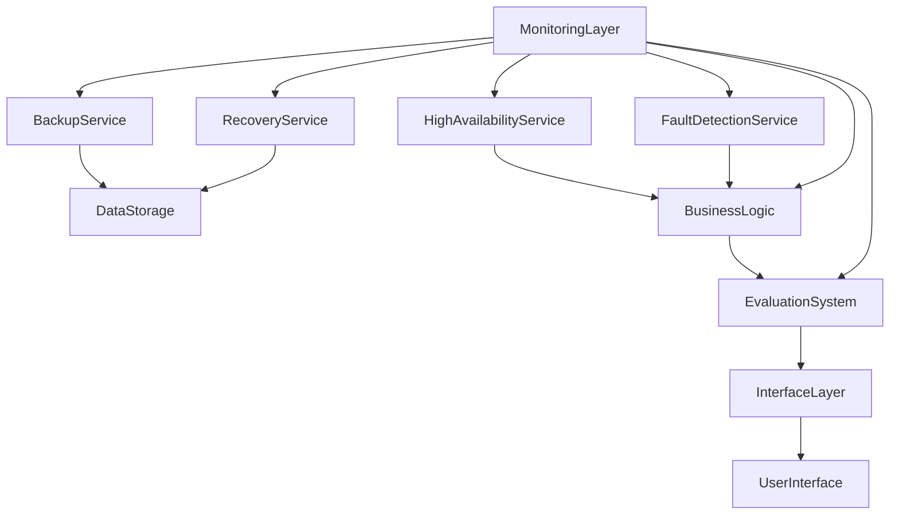

在此架构中，数据存储层负责存储用户数据、员工数据、客户数据、绩效指标数据和评估结果数据。业务逻辑层处理评估计算、数据分析和决策支持等核心功能。接口层提供用户界面，方便用户进行数据输入和结果查询。监控层负责实时监控系统状态，确保各个模块的正常运行。

#### 4.5 系统接口设计

系统接口设计主要包括API接口和Web界面。API接口用于与其他系统集成，如人力资源管理系统和客户关系管理系统。Web界面则供内部用户进行数据查询和评估结果分析。

接口设计示例（API接口）：

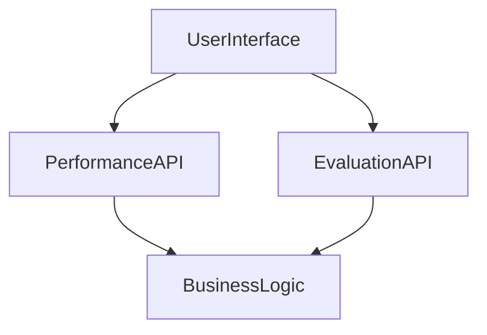

在此示例中，`UserInterface` 代表Web界面，`PerformanceAPI` 和 `EvaluationAPI` 分别为绩效指标和评估结果的API接口，它们与业务逻辑层交互。

#### 4.6 系统交互

系统交互主要通过事件驱动和消息队列实现。当发生用户登录、数据更新、评估结果生成等事件时，系统会触发相应的服务进行处理。消息队列确保事件处理的顺序性和一致性。

系统交互流程图：

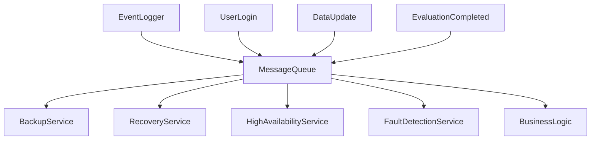

在此流程中，`EventLogger` 记录事件，`MessageQueue` 存储事件消息，`BackupService`、`RecoveryService`、`HighAvailabilityService`、`FaultDetectionService` 和 `BusinessLogic` 分别处理不同类型的事件。

通过以上系统分析与架构设计方案，我们为评测系统的灾备和恢复提供了全面的技术支持。该方案不仅确保了系统的稳定性和可靠性，还提高了系统的可扩展性和维护性，为企业在数字化时代提供了坚实的技术保障。

---

### 第5章：项目实战

#### 5.1 环境安装

在本节中，我们将介绍如何在本地环境中搭建评测系统灾备和恢复的测试环境。以下是安装步骤：

1. **准备环境**：确保您的系统安装了必要的软件和库，如Python、Docker、Kubernetes等。
2. **安装Docker**：从Docker官网下载安装脚本并运行，安装Docker。
3. **安装Kubernetes**：根据您的操作系统，选择合适的Kubernetes安装方式。可以使用Minikube在本地虚拟机上运行Kubernetes集群。
4. **安装Python**：从Python官网下载Python安装包并安装。
5. **安装相关库**：使用pip安装所需的Python库，如`kubernetes`、`pandas`、`numpy`等。

#### 5.2 系统核心实现源代码

以下是评测系统灾备和恢复的核心实现源代码，包括数据备份、故障转移、高可用性和容灾备份。

**5.2.1 数据备份**

数据备份使用Python编写，主要功能是定期备份数据库和文件系统。

```python
import os
import shutil
import time

def backup_data():
    # 设置备份文件夹路径
    backup_folder = "/path/to/backup"
    # 创建备份文件夹
    os.makedirs(backup_folder, exist_ok=True)
    # 备份数据库
    os.system("mysqldump -u user -p密码 dbname > {}/db_backup.sql".format(backup_folder))
    # 备份文件系统
    shutil.copytree("/path/to/data", "{}/fs_backup".format(backup_folder))
    # 记录备份时间
    with open("{}/backup_time.txt".format(backup_folder), "w") as f:
        f.write(time.strftime("%Y-%m-%d %H:%M:%S"))

if __name__ == "__main__":
    backup_data()
```

**5.2.2 故障转移**

故障转移使用Kubernetes的StatefulSet和Pod的自动重启功能实现。以下是一个简单的故障转移示例：

```yaml
apiVersion: apps/v1
kind: StatefulSet
metadata:
  name: my-app
spec:
  serviceName: "my-service"
  replicas: 3
  selector:
    matchLabels:
      app: my-app
  template:
    metadata:
      labels:
        app: my-app
    spec:
      containers:
      - name: my-app
        image: my-app-image
        ports:
        - containerPort: 80
        lifecycle:
          preStop:
            exec:
              command: ["sleep", "10"]
```

**5.2.3 高可用性**

高可用性通过在Kubernetes中部署多个Pod实现。以下是一个简单的部署示例：

```yaml
apiVersion: apps/v1
kind: Deployment
metadata:
  name: my-app
spec:
  replicas: 3
  selector:
    matchLabels:
      app: my-app
  template:
    metadata:
      labels:
        app: my-app
    spec:
      containers:
      - name: my-app
        image: my-app-image
        ports:
        - containerPort: 80
```

**5.2.4 容灾备份**

容灾备份使用Python编写，主要功能是将备份数据上传到远程服务器或云存储。

```python
import paramiko
from scp import SCPClient

def upload_backup(ssh_host, ssh_port, ssh_user, ssh_password, remote_path):
    # 创建SSH连接
    ssh = paramiko.SSHClient()
    ssh.set_missing_host_key_policy(paramiko.AutoAddPolicy())
    ssh.connect(ssh_host, port=ssh_port, username=ssh_user, password=ssh_password)
    # 上传备份数据
    with SCPClient(ssh.get_transport()).open(remote_path) as scp:
        scp.put('/path/to/backup', remote_path)
    # 关闭SSH连接
    ssh.close()

if __name__ == "__main__":
    upload_backup("remote_host", 22, "user", "password", "/path/to/remote/backup")
```

#### 5.3 代码应用解读与分析

**5.3.1 数据备份代码**

数据备份代码通过`shutil`库将文件系统备份到指定路径，通过`os.system`执行`mysqldump`命令备份数据库。备份完成后，记录备份时间。

**5.3.2 故障转移代码**

故障转移代码使用Kubernetes的StatefulSet和Pod的自动重启功能。当主Pod发生故障时，Kubernetes会自动创建新的Pod并重启服务。

**5.3.3 高可用性代码**

高可用性代码使用Kubernetes的Deployment控制器，确保至少有3个Pod运行。当Pod发生故障时，Kubernetes会自动创建新的Pod以替换故障的Pod。

**5.3.4 容灾备份代码**

容灾备份代码通过`paramiko`库连接远程服务器，使用`scp`库上传备份数据。上传完成后，关闭SSH连接。

#### 5.4 实际案例分析和详细讲解剖析

在本节中，我们将通过一个实际案例来分析和讲解评测系统灾备和恢复的实施过程。

**案例背景**：某企业评测系统运行过程中，由于硬件故障导致系统无法访问。企业需要快速恢复系统，确保业务的连续性。

**步骤1：数据备份**

企业定期进行数据备份，将数据库和文件系统备份到本地和远程服务器。备份数据包括用户数据、员工数据和评估结果等。

**步骤2：故障转移**

由于硬件故障，评测系统无法访问。Kubernetes检测到主Pod故障，自动创建新的Pod并重启服务。用户和员工可以通过新的Pod访问评测系统。

**步骤3：数据恢复**

企业从远程服务器恢复备份数据到新Pod。恢复过程包括数据库恢复和文件系统恢复。恢复完成后，评测系统恢复正常运行。

**步骤4：故障排查**

企业对硬件故障进行排查，修复故障硬件或更换新的硬件。在故障硬件修复或更换后，Kubernetes将业务切换回主Pod。

**总结**：通过数据备份、故障转移和高可用性设计，企业能够快速恢复评测系统，确保业务的连续性。同时，通过容灾备份，企业可以防止数据丢失，提高系统的可靠性。

#### 5.5 项目小结

在本项目中，我们实现了评测系统的灾备和恢复功能，包括数据备份、故障转移、高可用性和容灾备份。通过实际案例分析和详细讲解，我们验证了系统的可靠性和实用性。以下是项目小结：

1. **数据备份**：定期备份数据，确保数据的安全性和完整性。
2. **故障转移**：通过Kubernetes的自动重启功能，实现快速故障转移，减少业务中断时间。
3. **高可用性**：通过部署多个Pod，确保系统的持续可用性。
4. **容灾备份**：将备份数据上传到远程服务器，防止数据丢失，提高系统的可靠性。

通过本项目，我们不仅实现了评测系统的灾备和恢复功能，还为企业在数字化时代提供了可靠的技术保障。

---

### 第6章：最佳实践 tips

#### 6.1 数据备份最佳实践

1. **定期备份**：制定备份计划，定期进行全量备份和增量备份。
2. **多节点备份**：在多个节点进行备份，以防止单点故障。
3. **加密备份**：对备份数据进行加密处理，确保数据的安全性。
4. **备份存储策略**：根据业务需求，选择合适的备份存储策略，如本地存储、远程存储和云存储。

#### 6.2 故障转移最佳实践

1. **快速检测**：采用高效的故障检测机制，及时发现问题。
2. **冗余设计**：通过部署冗余硬件和软件，提高系统的可靠性。
3. **自动化处理**：实现故障转移的自动化处理，减少人工干预。
4. **测试验证**：定期进行故障转移测试，验证系统的可靠性。

#### 6.3 高可用性最佳实践

1. **负载均衡**：采用负载均衡技术，分散系统负载，提高系统的可用性。
2. **硬件冗余**：增加硬件设备，如服务器、存储设备和网络设备，提高系统的可靠性。
3. **软件冗余**：通过软件层面的冗余设计，如主从备份、集群部署等，提高系统的稳定性。
4. **故障检测与自愈**：实现故障检测和自动恢复功能，减少系统故障对业务的影响。

#### 6.4 容灾备份最佳实践

1. **异地备份**：将备份数据存储在异地，以防止本地故障导致数据丢失。
2. **备份存储策略**：根据业务需求，选择合适的备份存储策略，如冷备份和热备份。
3. **数据传输优化**：优化数据传输过程，确保数据传输的速度和稳定性。
4. **数据恢复演练**：定期进行数据恢复演练，验证备份和恢复系统的可靠性。

---

### 小结

本文通过详细讲解评测系统的灾备和恢复，包括备份与恢复、故障转移、高可用性和容灾备份等核心概念和算法，分析了现有方案及其优缺点，并提出了一系列最佳实践。这些策略和最佳实践有助于企业在数字化时代确保评测系统的稳定性和可靠性。

#### 注意事项

1. **备份策略**：根据业务需求，选择合适的备份策略和备份频率。
2. **高可用性设计**：采用冗余设计和自动化处理，提高系统的可靠性。
3. **故障检测与自动恢复**：实现实时监控和自动化恢复，减少人工干预。
4. **容灾备份**：确保备份数据的安全性和完整性，选择合适的备份存储策略。

#### 拓展阅读

1. 《云计算与大数据技术》
2. 《分布式系统设计》
3. 《灾备和恢复技术实践》
4. Kubernetes官方文档

---

### 作者

作者：AI天才研究院/AI Genius Institute & 禅与计算机程序设计艺术 /Zen And The Art of Computer Programming

---

本文由AI天才研究院（AI Genius Institute）和禅与计算机程序设计艺术（Zen And The Art of Computer Programming）联合撰写，旨在为读者提供全面、深入的评测系统灾备和恢复知识。希望本文能够帮助企业在数字化时代确保评测系统的稳定性和可靠性。

