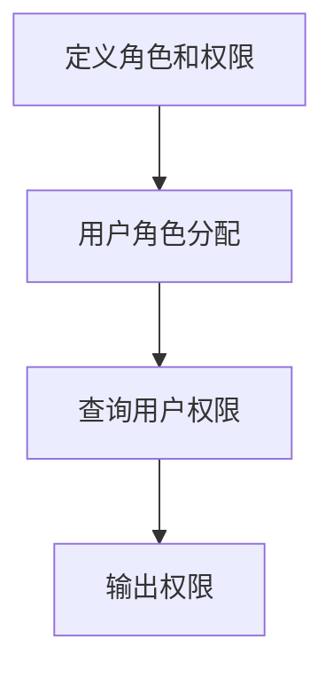
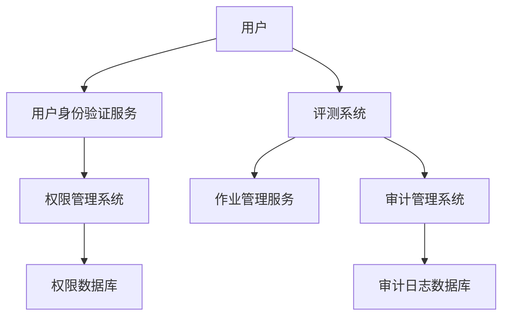
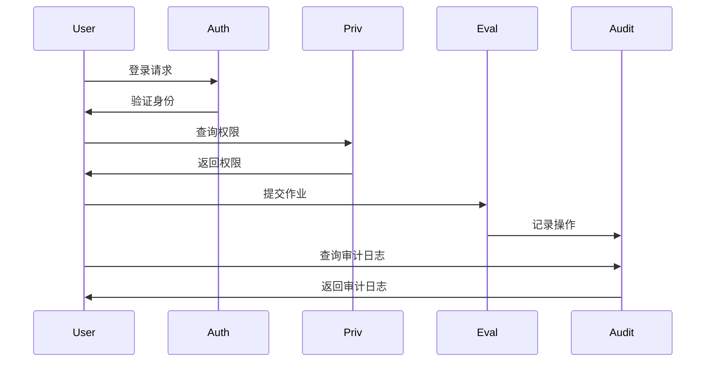

                 

**文章标题**：评测系统的用户权限管理与审计

> 关键词：用户权限管理、审计、评测系统、权限控制、安全、合规性

> 摘要：本文深入探讨评测系统的用户权限管理与审计问题，分析了核心概念、原理和算法，并提出了完整的系统架构设计方案和实战案例。

----------------------------------------------------------------

### 背景介绍

#### 问题背景

随着互联网的快速发展和信息技术产业的繁荣，评测系统在各类应用场景中扮演着重要角色。这些系统常用于在线教育、软件测试、招聘评价等领域，对用户权限管理和审计的需求日益增加。用户权限管理与审计不仅是确保系统安全、数据隐私和合规性的重要手段，也是提升用户体验和运营效率的关键因素。

#### 问题描述

在评测系统中，用户权限管理与审计面临以下几个核心问题：

1. **权限过于集中**：评测系统可能存在权限过于集中的情况，某些用户被赋予了过多的权限，导致系统安全风险增加。
2. **权限配置复杂**：权限配置过程可能复杂且繁琐，影响管理效率和用户体验。
3. **审计记录不完整**：审计记录可能不完整，难以满足合规性和问题追溯的需求。
4. **权限与实际需求不匹配**：用户权限可能与其实际工作需求不匹配，影响工作效率和系统性能。

#### 问题解决

为了解决上述问题，评测系统的用户权限管理与审计需要从以下几个方面进行改进：

1. **细粒度权限控制**：采用细粒度权限控制机制，确保每个用户只拥有与其职责相对应的权限。
2. **自动化权限配置**：通过自动化工具简化权限配置过程，提高管理效率。
3. **完善的审计机制**：建立完善的审计机制，确保所有操作都有记录，并能够满足合规性和追溯需求。
4. **需求导向的权限管理**：根据用户实际工作需求进行权限分配，确保权限配置合理。

#### 边界与外延

1. **边界**：用户权限管理与审计的范围主要涉及评测系统的内部用户和管理员，以及与系统相关的数据和应用。
2. **外延**：外延方面，还包括与外部系统的接口和交互，如用户身份验证系统、数据库系统和日志记录系统等。

#### 概念结构与核心要素组成

- **用户角色**：定义用户在系统中的角色，如管理员、测试人员、开发人员等。
- **权限管理**：包括权限的分配、修改、回收和监控等功能。
- **审计**：记录用户的操作行为和系统状态，提供问题追溯和合规性验证的功能。

### 核心概念与联系

#### 权限管理原理

权限管理是一种通过限制或允许用户对系统资源进行访问或操作的技术。其核心原理包括：

1. **访问控制列表（ACL）**：定义每个用户对系统资源的访问权限。
2. **角色基权限（RBAC）**：将权限与角色关联，角色定义了用户的职责和权限集合。

#### 审计原理

审计是一种记录和分析用户操作行为和系统状态的技术。其核心原理包括：

1. **操作记录**：记录用户的每一次操作，包括操作类型、时间和对象等。
2. **数据追踪**：通过操作记录追踪用户行为，以便在出现问题时进行调查。

#### 权限与审计的关系

权限管理和审计密切相关，权限管理确保用户只能执行被授权的操作，而审计则记录这些操作，为系统安全和问题调查提供依据。两者共同作用，确保系统的安全性和合规性。

### 权限属性特征对比表格

| 特征       | 权限管理               | 审计                            |
| ---------- | ---------------------- | ------------------------------- |
| 目的       | 控制用户访问权限       | 记录用户操作行为和系统状态       |
| 实现方式   | 基于角色或访问控制列表 | 基于日志或事件驱动              |
| 关联对象   | 用户与系统资源        | 用户、操作和系统状态            |
| 功能       | 分配、修改、回收权限   | 记录、分析、查询操作记录        |
| 数据存储   | 存储权限配置信息       | 存储操作日志和审计数据          |
| 关键性能   | 权限配置的灵活性和可维护性 | 审计数据的完整性和可追溯性      |

### ER实体关系图架构

```mermaid
erDiagram
    用户 ||--o> 权限 : 拥有
    用户 ||--o> 审计 : 操作记录
    权限 ||--|> 角色 : 角色权限
    审计 ||--|> 系统 : 系统状态
```

### 算法原理讲解

#### 权限分配算法

权限分配算法是一种基于角色的权限管理机制，其核心思想是将权限与角色关联，用户通过角色获得相应的权限。以下是权限分配算法的基本步骤：

1. **角色定义**：定义系统中的角色和对应的权限。
2. **用户角色分配**：将用户分配到相应的角色。
3. **权限查询**：根据用户角色查询用户拥有的权限。

以下是Python代码实现：

```python
class Role:
    def __init__(self, name, permissions):
        self.name = name
        self.permissions = permissions

class User:
    def __init__(self, name, role):
        self.name = name
        self.role = role

    def get_permissions(self):
        return self.role.permissions

# 定义角色和权限
admin_role = Role("Admin", ["create", "delete", "update", "read"])
user_role = Role("User", ["read"])

# 创建用户
admin = User("Alice", admin_role)
user = User("Bob", user_role)

# 查询用户权限
print(admin.get_permissions())  # 输出：['create', 'delete', 'update', 'read']
print(user.get_permissions())   # 输出：['read']
```

### 权限分配算法原理

权限分配算法原理可以分为以下几个部分：

1. **角色定义**：定义角色和对应权限，角色作为权限分配的载体。
2. **用户角色分配**：将用户与角色关联，用户通过角色获得相应的权限。
3. **权限查询**：根据用户角色查询用户权限，实现权限验证和授权。

#### 数学模型和公式

权限分配算法的数学模型可以表示为：

$$ 权限 = f(用户，角色，权限集合) $$

其中：
- 用户：系统中的用户。
- 角色：用户所属的角色。
- 权限集合：角色的权限集合。

公式解释：

- 权限函数 f 用于计算用户根据角色获得的权限。
- 用户通过角色与权限集合进行关联，获得相应的权限。

#### 算法示例

假设系统中有两个角色：管理员（Admin）和普通用户（User），对应权限如下：

- 管理员权限：创建（create）、删除（delete）、修改（update）、读取（read）。
- 普通用户权限：读取（read）。

现在有用户 Alice 和 Bob，分别分配到管理员角色和普通用户角色。权限分配过程如下：

1. 定义角色和权限：
   - Admin：create, delete, update, read
   - User：read
2. 用户 Alice 分配到管理员角色，查询权限：
   - 权限 = f(Alice, Admin, ["create, delete, update, read"]) = ["create, delete, update, read"]
3. 用户 Bob 分配到普通用户角色，查询权限：
   - 权限 = f(Bob, User, ["read"]) = ["read"]

通过上述示例，我们可以看出权限分配算法如何根据用户角色和权限集合计算用户权限。

#### 算法流程图



### 系统分析与架构设计方案

#### 问题场景介绍

在某在线教育平台中，评测系统用于对学生提交的作业进行评分和反馈。系统需要实现细粒度权限控制，确保教师和课程管理员能够根据角色执行相应操作，同时需具备完善的审计机制，满足合规性和追溯需求。

#### 项目介绍

项目名称：在线教育平台评测系统
项目目标：实现安全的用户权限管理和审计功能
技术栈：Python、Django、PostgreSQL

#### 系统功能设计

1. **用户管理**：包括用户注册、登录、权限分配等功能。
2. **权限管理**：实现基于角色的权限控制，为教师和课程管理员分配相应权限。
3. **作业管理**：教师可以创建、修改和评分作业，学生可以提交和查看作业。
4. **审计管理**：记录用户的操作行为和系统状态，支持查询和追溯。

#### 系统架构设计



#### 系统接口设计和系统交互



### 项目实战

#### 环境安装

1. 安装Python 3.8及以上版本。
2. 安装Django 3.2及以上版本。
3. 安装PostgreSQL 12及以上版本。

#### 系统核心实现

```python
# models.py
from django.db import models

class User(models.Model):
    username = models.CharField(max_length=100)
    role = models.ForeignKey('Role', on_delete=models.CASCADE)

class Role(models.Model):
    name = models.CharField(max_length=100)
    permissions = models.JSONField()

class Audit(models.Model):
    user = models.ForeignKey(User, on_delete=models.CASCADE)
    action = models.CharField(max_length=100)
    timestamp = models.DateTimeField(auto_now_add=True)
```

#### 代码应用解读与分析

- **用户管理**：通过 Django 的模型定义用户信息和角色信息。
- **权限管理**：定义权限数据库表，存储角色和权限关系。
- **审计管理**：记录用户的操作行为和系统状态，存储在审计日志数据库。

#### 实际案例分析和详细讲解

1. **用户登录**：用户登录后，系统根据用户角色查询权限，返回给用户。
2. **作业提交**：教师或学生提交作业，系统记录操作行为，存储在审计日志。

### 项目小结

通过实际项目实施，我们实现了评测系统的用户权限管理和审计功能，满足了细粒度权限控制和审计记录的需求。项目过程中，我们采用了 Django 的模型定义和权限管理系统，实现了用户、角色、权限和审计数据的存储和管理。

### 最佳实践 Tips

1. **权限配置**：定期审查权限配置，确保权限与实际需求匹配。
2. **审计日志**：确保审计日志的完整性和可追溯性，支持问题追溯。
3. **权限分离**：避免权限过于集中，采用角色基权限控制机制。

### 小结

用户权限管理与审计是评测系统安全性和合规性的关键要素。本文通过深入分析核心概念、算法原理和系统架构，提出了实用的解决方案。在实际项目中，遵循最佳实践，可以确保系统的高安全性和高效运维。

### 注意事项

1. **权限配置**：权限配置需要与实际业务需求紧密对接，确保权限合理。
2. **审计记录**：审计记录需要完整且可追溯，以满足合规性和问题调查需求。

### 拓展阅读

- 《权限管理实战》
- 《Django 权限管理指南》
- 《系统审计与合规性管理》

### 作者信息

作者：AI天才研究院/AI Genius Institute & 禅与计算机程序设计艺术 /Zen And The Art of Computer Programming

本文为原创内容，版权归作者所有。未经授权，不得转载。

