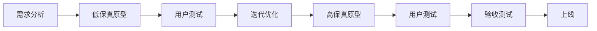

                 

### 文章标题：评测系统的用户界面与交互设计

用户界面（User Interface，简称UI）和交互设计（Interaction Design）是现代软件应用和系统设计中至关重要的组成部分。一个优秀的用户界面不仅能够提高用户的使用体验，还能够提升系统的整体性能和用户满意度。而交互设计则侧重于用户与系统之间的交互流程，确保系统能够满足用户的需求和期望。

本文将围绕评测系统的用户界面与交互设计展开讨论。通过系统性的分析和深入探讨，我们将详细阐述评测系统的用户界面设计原则、设计方法、交互设计以及测试与优化策略。同时，还将分享最佳实践和注意事项，帮助读者更好地理解和应用这些设计理念。

### 文章关键词

- 用户界面（User Interface）
- 交互设计（Interaction Design）
- 评测系统（Evaluation System）
- 易用性（Usability）
- 用户体验（User Experience）
- 可访问性（Accessibility）
- 设计原则（Design Principles）
- 设计方法（Design Methods）
- 测试与优化（Testing and Optimization）

### 摘要

本文旨在探讨评测系统的用户界面与交互设计，分析其在现代软件系统中的重要性。首先，我们介绍了评测系统的应用场景和用户界面的核心概念。随后，通过核心概念与联系的深入分析，我们明确了用户界面、交互设计和用户研究等概念之间的关系。接着，我们详细阐述了评测系统用户界面设计的原则，包括易用性、用户体验和可访问性。在此基础上，我们介绍了用户界面设计的方法，从需求分析到原型设计，再到评估与迭代。此外，我们还探讨了交互设计的原则和方法，以及评测系统用户界面测试与优化的策略。最后，通过最佳实践和案例分析，我们总结了评测系统用户界面设计的要点，并为读者提供了进一步的学习资源。

### 目录大纲

1. 第一部分：评测系统与用户界面概述
    - 第1章：问题背景与概述
    - 第2章：评测系统用户界面的核心概念与联系
2. 第二部分：评测系统用户界面设计原则
    - 第3章：易用性原则
    - 第4章：用户体验设计原则
    - 第5章：可访问性原则
3. 第三部分：评测系统用户界面设计方法
    - 第6章：设计流程
    - 第7章：用户研究方法
4. 第四部分：评测系统用户界面交互设计
    - 第8章：交互设计原则
    - 第9章：交互设计方法
5. 第五部分：评测系统用户界面测试与优化
    - 第10章：测试方法
    - 第11章：优化策略
6. 第六部分：评测系统用户界面设计最佳实践
    - 第12章：设计经验分享
    - 第13章：案例分析
    - 第14章：小结
    - 第15章：注意事项
    - 第16章：拓展阅读

## 第一部分：评测系统与用户界面概述

### 第1章：问题背景与概述

在现代软件应用中，评测系统作为一种重要的工具，广泛应用于各种领域，如教育、企业绩效评估、产品质量检测等。其目的是通过对系统、产品或服务进行评估，以获得有关性能、质量和用户体验的反馈。用户界面作为评测系统的重要组成部分，直接影响到用户的使用体验和系统性能。

### 1.1 问题背景

评测系统的应用场景非常广泛，例如在教育领域中，教师可以通过评测系统对学生的学习进度进行评估，从而调整教学策略；在企业中，HR可以通过评测系统对员工的绩效进行评估，以优化人力资源配置。在这些应用场景中，用户界面发挥着至关重要的作用。一个优秀的用户界面可以简化操作流程，提高用户满意度，从而提升评测系统的整体性能。

### 1.1.1 评测系统的应用场景

1. **教育领域**：教师可以利用评测系统对学生的作业和考试成绩进行评估，生成详细的报告，以便了解学生的学习情况。学生也可以通过评测系统进行自我评估，以便调整学习策略。
   
2. **企业绩效评估**：企业可以通过评测系统对员工的日常工作表现进行评估，从而制定绩效改进计划。这种评估不仅包括量化的绩效指标，还可以包含主观的评价。

3. **产品质量检测**：在制造业中，评测系统可以用于检测产品的质量，确保产品符合质量标准。通过对产品质量的评估，企业可以及时发现问题并进行改进。

### 1.1.2 用户界面的重要性

用户界面是用户与系统进行交互的桥梁。一个优秀的用户界面可以提供直观、易用的操作体验，使用户能够轻松地完成各项任务。具体来说，用户界面的重要性体现在以下几个方面：

1. **提高用户体验**：通过提供简洁、直观的界面设计，用户可以更快地学会使用系统，减少学习成本。
   
2. **提高系统性能**：一个优化的用户界面可以减少用户的操作错误，提高系统的工作效率。

3. **提升品牌形象**：优秀的用户界面设计不仅可以提高用户满意度，还可以提升企业的品牌形象。

### 1.1.3 问题解决与边界

在评测系统的用户界面设计中，我们需要解决的问题是如何设计一个既美观又实用的界面，以满足不同用户的需求。具体来说，我们需要考虑以下几个方面：

1. **用户需求**：了解目标用户的需求，设计符合用户使用习惯的界面。

2. **交互流程**：设计简洁、流畅的交互流程，确保用户可以轻松完成各项任务。

3. **界面布局**：设计合理的界面布局，确保用户可以快速找到所需功能。

4. **响应速度**：优化界面响应速度，提高用户的使用体验。

同时，我们需要明确问题的边界，确保设计不会超出预期的范围。具体来说，边界包括：

1. **功能范围**：明确界面的功能范围，避免功能过多或过少。

2. **性能要求**：确保界面在预期性能范围内工作。

3. **兼容性要求**：确保界面在不同设备和操作系统上都能正常运行。

### 1.1.4 概念结构与核心要素

在评测系统的用户界面设计中，我们需要关注以下几个核心概念：

1. **用户界面**：用户界面是用户与系统进行交互的界面，包括窗口、按钮、图标等元素。

2. **交互设计**：交互设计是指设计用户与系统之间的交互流程，确保用户可以轻松完成各项任务。

3. **用户研究**：用户研究是了解用户需求和习惯的重要方法，包括调查问卷、用户访谈、观察法等。

4. **易用性**：易用性是指界面设计是否易于用户理解和使用。

5. **用户体验**：用户体验是指用户在使用系统过程中的整体感受。

6. **可访问性**：可访问性是指界面设计是否适用于所有用户，包括残疾人和老年人。

通过明确这些核心概念和要素，我们可以更好地设计出符合用户需求的评测系统用户界面。

## 第2章：评测系统用户界面的核心概念与联系

### 2.1 核心概念

在评测系统的用户界面设计中，理解以下几个核心概念是非常重要的：

1. **用户界面（User Interface，简称UI）**：用户界面是用户与系统进行交互的界面，包括窗口、按钮、图标等元素。它是用户与系统之间沟通的桥梁。

2. **交互设计（Interaction Design）**：交互设计是指设计用户与系统之间的交互流程，确保用户可以轻松完成各项任务。它侧重于用户与系统之间的互动，包括点击、拖拽、滑动等操作。

3. **用户研究（User Research）**：用户研究是了解用户需求和习惯的重要方法。通过调查问卷、用户访谈、观察法等方式，设计师可以获取用户的真实反馈，从而设计出更符合用户需求的界面。

4. **易用性（Usability）**：易用性是指界面设计是否易于用户理解和使用。一个易用的界面可以减少用户的操作错误，提高工作效率。

5. **用户体验（User Experience，简称UX）**：用户体验是指用户在使用系统过程中的整体感受。它包括用户对界面的反应、感受和满意度。

6. **可访问性（Accessibility）**：可访问性是指界面设计是否适用于所有用户，包括残疾人和老年人。一个可访问的界面可以确保所有用户都能无障碍地使用系统。

### 2.1.1 用户界面的定义

用户界面是用户与系统进行交互的界面，它通过视觉、听觉、触觉等多种方式向用户提供信息，并接收用户的输入。用户界面通常包括以下元素：

- **窗口**：用户界面中最常见的元素，用于显示应用程序或网站的内容。
- **按钮**：用于执行特定操作的图形元素，如“提交”、“取消”等。
- **图标**：用于表示功能或状态的图形符号，如“放大镜”表示搜索功能。
- **菜单**：用于显示一系列选项的列表，用户可以通过菜单选择不同的操作。
- **文本框**：用于用户输入文本的元素，如登录表单中的用户名和密码输入框。
- **标签**：用于标记或分类信息的文本或图标，如标签页中的标题。

### 2.1.2 交互设计的概念

交互设计侧重于用户与系统之间的互动，确保用户可以轻松、高效地完成任务。交互设计的关键概念包括：

- **可用性（Usability）**：确保系统易于使用，用户能够快速学会如何使用系统，减少操作错误。
- **可用性工程（Usability Engineering）**：通过研究用户的需求和行为，设计出满足用户需求的系统。
- **交互模型（Interaction Model）**：描述用户与系统之间的交互方式，包括操作、反馈和状态变化等。
- **用户体验（User Experience）**：用户在使用系统过程中的整体感受，包括情感、行为和认知等方面。

### 2.1.3 用户研究的方法

用户研究是了解用户需求和习惯的重要方法。以下是一些常用的用户研究方法：

- **调查问卷**：通过设计问卷，收集用户对系统或产品的看法和反馈。
- **用户访谈**：通过与用户面对面交谈，深入了解用户的需求和痛点。
- **观察法**：观察用户在使用系统时的行为和操作，识别潜在的问题。
- **A/B测试**：通过对比两组用户的交互数据，评估不同设计方案的优劣。

### 2.2 概念属性特征对比表格

为了更清晰地展示用户界面、交互设计和用户研究等核心概念之间的联系，我们设计了一个概念属性特征对比表格。以下表格列出了各概念的关键属性和特征：

| 概念        | 关键属性             | 特征                                                         |
| ----------- | ------------------ | ------------------------------------------------------------ |
| 用户界面    | 显示元素、交互流程 | 窗口、按钮、图标、菜单、文本框等                            |
| 交互设计    | 用户与系统互动     | 可用性、可用性工程、交互模型、用户体验等                   |
| 用户研究    | 了解用户需求       | 调查问卷、用户访谈、观察法、A/B测试等                     |
| 易用性      | 易于使用           | 减少操作错误、提高工作效率                                   |
| 用户体验    | 整体感受           | 情感、行为、认知                                             |
| 可访问性    | 无障碍使用         | 考虑残疾人和老年人的需求                                   |

### 2.3 ER实体关系图架构

为了更好地理解评测系统用户界面设计中的概念和关系，我们使用ER图（Entity-Relationship Diagram）展示了这些核心概念之间的实体关系。以下是一个简化的ER图：

```mermaid
erDiagram
    UserInterface ||--|{ InteractionDesign }|-- InterfaceElement
    UserInterface ||--|{ UserResearch }|-- Survey, Interview, Observation
    InteractionDesign ||--|{ Usability }|-- ErrorReduction, Efficiency
    InteractionDesign ||--|{ UserExperience }|-- Emotional, Behavioral, Cognitive
    UserResearch ||--|{ Accessibility }|-- Disability, Aging
```

在上面的ER图中，用户界面（UserInterface）是核心实体，它与其他实体（交互设计、用户研究、易用性、用户体验、可访问性）之间存在关联。每个实体都有自己的属性和特征，这些实体和特征共同构成了评测系统用户界面的核心架构。

通过明确这些核心概念和它们之间的关系，我们可以更好地理解和设计评测系统的用户界面，从而提高用户体验和系统性能。

## 第3章：评测系统用户界面设计原则

在评测系统的用户界面设计中，遵循一定的设计原则能够确保界面的易用性、用户体验和可访问性，从而满足不同用户的需求。以下是一些关键的设计原则：

### 3.1 易用性原则

易用性原则是用户界面设计的基础，旨在确保用户能够轻松、高效地使用系统。以下是一些具体的易用性原则：

#### 3.1.1 易于理解

用户界面应尽可能简单直观，避免复杂的术语和操作。设计时，应考虑用户的认知水平和知识背景，使用用户熟悉的词汇和界面元素。例如，按钮和图标应使用清晰的文字标签，使其一目了然。

#### 3.1.2 易于学习

用户界面应设计得易于学习，使用户能够快速掌握系统操作。可以通过以下方法实现：

- **逐步引导**：在新用户首次使用系统时，提供简短的教程或指南，帮助用户了解各项功能。
- **反馈机制**：在用户进行操作时，及时给予反馈，如成功消息、错误提示等，使用户了解操作结果。

#### 3.1.3 易于记忆

用户界面应设计得易于记忆，减少用户的操作步骤和记忆负担。可以通过以下方法实现：

- **一致性**：保持界面元素和操作的一致性，使用户不需要重新学习就能使用不同功能。
- **分组和分类**：将相关功能进行分组和分类，使用户能够快速找到所需功能。

### 3.2 用户体验设计原则

用户体验设计原则关注用户在使用系统过程中的整体感受，包括情感、行为和认知等方面。以下是一些关键的用户体验设计原则：

#### 3.2.1 用户的情感体验

用户界面设计应考虑用户的情感体验，使用户在使用系统时感到愉悦和满足。可以通过以下方法实现：

- **视觉设计**：使用美观、和谐的视觉元素，如颜色、字体和图标，提升界面的美观度。
- **交互效果**：使用动效和动画等交互效果，增加用户与系统的互动性，提升用户的情感体验。

#### 3.2.2 交互流畅性

用户界面设计应确保用户与系统之间的交互流畅，减少用户的等待时间和操作延迟。可以通过以下方法实现：

- **响应速度**：优化系统的性能，确保用户操作时能够快速得到反馈。
- **加载时间**：优化页面加载速度，减少用户的等待时间。

#### 3.2.3 反馈及时性

用户界面设计应确保用户在操作时能够及时获得反馈，了解操作结果。可以通过以下方法实现：

- **即时反馈**：在用户操作时，立即显示成功或错误消息，告知用户操作结果。
- **进度条**：在长时间操作过程中，显示进度条或提示用户当前操作进度，增加用户对操作的掌控感。

### 3.3 可访问性原则

可访问性原则确保界面设计适用于所有用户，包括残疾人和老年人。以下是一些关键的可访问性原则：

#### 3.3.1 无障碍设计

用户界面设计应考虑无障碍设计，确保所有用户都能无障碍地使用系统。可以通过以下方法实现：

- **文字替代**：为图像、图标和动画提供文字替代，方便视力障碍者使用。
- **键盘导航**：确保用户可以使用键盘完成所有操作，满足那些无法使用鼠标的用户需求。

#### 3.3.2 多语言支持

用户界面设计应支持多语言，确保不同语言的用户都能方便地使用系统。可以通过以下方法实现：

- **国际化**：在设计过程中考虑不同语言和文化背景的用户需求，确保界面元素和内容都能够适应多种语言。
- **翻译支持**：提供便捷的翻译工具，帮助用户理解和使用不同语言的界面。

#### 3.3.3 可定制化

用户界面设计应提供一定的可定制化功能，使用户可以根据个人需求调整界面布局和功能。可以通过以下方法实现：

- **主题和皮肤**：提供多种主题和皮肤，使用户可以根据个人喜好自定义界面外观。
- **自定义设置**：提供自定义设置选项，使用户可以调整界面元素的大小、颜色和其他属性。

通过遵循这些设计原则，评测系统的用户界面将能够更好地满足不同用户的需求，提升用户体验和系统性能。

## 第4章：评测系统用户界面设计方法

用户界面设计是一个复杂而细致的过程，需要系统性地考虑需求分析、原型设计和评估与迭代等环节。以下将详细介绍这些设计方法，帮助设计师更好地实现优秀的用户界面。

### 4.1 设计流程

用户界面设计流程可以分为以下几个阶段：

1. **需求分析**：在项目开始时，通过与用户、产品经理、项目经理等多方沟通，了解用户需求、业务需求和系统需求。需求分析是设计的基础，决定了后续设计的方向和目标。

2. **原型设计**：在需求分析的基础上，创建用户界面原型。原型设计阶段包括低保真原型和高保真原型。低保真原型主要用于验证核心功能和布局，而高保真原型则更接近最终产品，用于视觉设计和交互设计。

3. **评估与迭代**：通过用户测试和评估，收集用户反馈，对原型进行迭代优化。评估与迭代是确保设计满足用户需求的关键环节。

4. **开发与实现**：将原型设计转化为实际的产品界面，并进行开发。这一阶段需要与开发团队合作，确保设计的实现和系统的功能完整性。

5. **测试与优化**：在开发完成后，对用户界面进行全面的测试，包括功能测试、兼容性测试和性能测试。通过测试发现和修复问题，优化用户体验。

### 4.1.1 需求分析

需求分析是用户界面设计的起点，其目的是明确用户需求、业务需求和系统需求。具体步骤如下：

1. **用户调研**：通过调查问卷、用户访谈、观察法等方式，了解用户的需求和痛点。用户调研可以帮助设计师深入了解用户的使用习惯和行为。

2. **功能梳理**：根据用户调研的结果，梳理出系统的主要功能模块。功能梳理是设计界面布局和功能结构的重要依据。

3. **需求文档**：编写详细的需求文档，包括功能需求、用户故事、界面规范等。需求文档是设计师、产品经理和开发团队沟通的桥梁。

### 4.1.2 原型设计

原型设计是将需求转化为可视化界面的过程。以下是原型设计的具体步骤：

1. **低保真原型**：在需求分析的基础上，创建低保真原型。低保真原型可以使用纸笔草图、线框图等方式，主要关注界面布局和功能结构。低保真原型的主要作用是验证核心功能和布局，快速迭代。

2. **高保真原型**：在低保真原型的基础上，创建高保真原型。高保真原型更接近最终产品，包括视觉设计和交互设计。高保真原型用于视觉展示和用户测试，帮助设计师发现潜在的问题和优化界面。

### 4.1.3 评估与迭代

评估与迭代是确保设计满足用户需求的关键环节。以下是评估与迭代的步骤：

1. **用户测试**：通过用户测试，收集用户对界面的反馈。用户测试可以采用A/B测试、基准测试等方法，评估界面设计的有效性。

2. **问题反馈**：根据用户测试的结果，收集用户的问题和意见。问题反馈是优化界面设计的重要依据。

3. **迭代优化**：根据问题反馈，对原型进行优化和迭代。迭代优化是不断改进界面的过程，确保最终产品能够满足用户需求。

4. **验收测试**：在迭代完成后，进行验收测试，确保界面设计符合预期。验收测试包括功能测试、兼容性测试和性能测试。

### 4.2 用户研究方法

用户研究是用户界面设计的重要环节，帮助设计师深入了解用户的需求和行为。以下是几种常用的用户研究方法：

1. **调查问卷**：通过设计问卷，收集用户对界面和产品的看法和反馈。调查问卷可以采用线上或线下形式，适用于大规模的用户调研。

2. **用户访谈**：通过与用户面对面交谈，深入了解用户的需求、使用习惯和痛点。用户访谈可以采用一对一或小组讨论形式，适用于深入了解用户的个性化需求。

3. **观察法**：观察用户在使用界面时的行为和操作，识别潜在的问题和改进点。观察法可以采用现场观察或远程观察形式，适用于获取真实用户的使用数据。

4. **A/B测试**：通过对比两组用户的交互数据，评估不同设计方案的优劣。A/B测试适用于优化界面的具体细节和功能。

通过以上设计方法和用户研究方法，设计师可以更好地理解和满足用户需求，设计出优秀的用户界面。以下是一个简化的设计流程图：



### 4.2.1 调查问卷

调查问卷是用户研究的一种常用方法，通过设计问卷，收集用户对界面和产品的看法和反馈。以下是一些设计问卷的要点：

1. **明确目标**：在设计问卷之前，明确调研的目标和问题。目标应具体、明确，以便设计有针对性的问卷。

2. **问题类型**：问卷应包括不同类型的问题，如选择题、量表题、开放性问题等。不同类型的问题可以收集不同类型的数据。

3. **问题表述**：问题的表述应简洁、明确，避免使用专业术语和复杂句子。问题应避免引导性，确保用户能够真实地反映自己的想法。

4. **样本选择**：选择合适的样本，确保问卷的数据具有代表性。样本应涵盖不同年龄、性别、职业等用户群体。

5. **数据分析**：在收集问卷后，进行数据分析，提取有用的信息和结论。数据分析可以采用统计分析、文本分析等方法。

### 4.2.2 用户访谈

用户访谈是深入了解用户需求和使用习惯的有效方法。以下是一些进行用户访谈的要点：

1. **准备访谈**：在访谈之前，制定访谈大纲，明确访谈的目的和问题。访谈大纲应包括开放性和封闭性问题，以便获取丰富的信息。

2. **选择访谈对象**：选择具有代表性的用户，如长期使用系统的用户、新用户等。访谈对象应能够提供有关界面和产品的真实反馈。

3. **访谈过程**：在访谈过程中，保持良好的沟通和互动，鼓励用户表达自己的看法和感受。访谈过程应记录用户的意见和反馈。

4. **数据整理**：访谈结束后，整理访谈记录，提取关键信息和结论。数据整理可以采用文本分析、主题分析等方法。

### 4.2.3 观察法

观察法是获取用户真实使用界面行为和操作数据的重要方法。以下是一些进行观察法的要点：

1. **选择观察场景**：选择具有代表性的观察场景，如用户日常使用界面的工作环境、生活场景等。观察场景应能够真实反映用户的使用行为。

2. **观察过程**：在观察过程中，记录用户的操作行为、交互方式和反馈。观察过程应尽可能减少干扰，确保数据的真实性。

3. **数据记录**：在观察过程中，使用记录工具（如视频、录音、笔记等）记录用户的行为和反馈。数据记录应详细、准确。

4. **数据分析**：在观察结束后，分析记录的数据，提取有用的信息和结论。数据分析可以采用行为分析、模式识别等方法。

### 4.2.4 A/B测试

A/B测试是评估不同设计方案优劣的有效方法。以下是一些进行A/B测试的要点：

1. **确定测试目标**：在A/B测试之前，明确测试的目标和指标。测试目标应具体、可量化，以便评估不同设计方案的优劣。

2. **设计测试版本**：设计两个或多个测试版本，包括控制组和实验组。控制组是当前的设计版本，实验组是待测试的新设计方案。

3. **用户分配**：将用户随机分配到控制组和实验组，确保测试结果的公平性和有效性。

4. **数据分析**：在测试结束后，收集用户数据，分析不同设计方案的指标表现。数据分析可以采用统计分析、数据可视化等方法。

5. **决策**：根据数据分析结果，评估不同设计方案的优劣，做出决策。决策应基于数据，而非个人主观判断。

通过以上设计方法和用户研究方法，设计师可以更好地理解和满足用户需求，设计出优秀的用户界面。

### 第5章：评测系统用户界面交互设计

用户界面的交互设计是确保用户能够顺利完成任务的关键环节。一个良好的交互设计可以提升用户的使用体验，使操作更加直观和高效。在本章节中，我们将探讨评测系统用户界面交互设计的原则和方法。

#### 5.1 交互设计原则

交互设计原则是确保用户界面设计符合用户需求和行为习惯的基本准则。以下是几个重要的交互设计原则：

##### 5.1.1 一致性

一致性原则是指界面元素和交互行为在整个系统中保持一致。这包括按钮样式、颜色方案、字体大小和导航结构等。一致性可以减少用户的认知负担，使学习成本降低。

##### 5.1.2 可预测性

可预测性原则是指用户的操作结果应该是可预测的。例如，当用户点击一个按钮时，系统应该做出相应的反应，如打开一个新窗口或执行一个动作。这种可预测性可以帮助用户更好地掌握系统的使用方法。

##### 5.1.3 可访问性

可访问性原则是指界面设计应考虑所有用户，包括残疾人和老年人。这包括提供文本替代、键盘导航、大字体选项等。一个可访问的界面可以确保所有用户都能无障碍地使用系统。

#### 5.2 交互设计方法

交互设计方法是指设计师用于创建有效用户界面的步骤和策略。以下是几种常用的交互设计方法：

##### 5.2.1 信息架构

信息架构是用户界面设计的起点，它涉及如何组织信息，确保用户能够轻松找到所需内容。信息架构的设计需要考虑用户的需求和行为习惯，确保导航逻辑清晰、层级结构合理。

1. **创建信息地图**：通过创建信息地图，设计师可以直观地展示内容的组织和结构。
2. **建立分类系统**：设计合理的分类系统，确保用户能够快速定位所需信息。
3. **优化导航结构**：设计直观的导航结构，使用户能够轻松浏览和操作。

##### 5.2.2 导航设计

导航设计是用户界面交互的核心部分，它涉及如何帮助用户在系统中移动和浏览。以下是导航设计的关键要点：

1. **主导航**：设计清晰的主导航，使用户能够快速访问系统的核心功能。
2. **面包屑导航**：提供面包屑导航，帮助用户了解当前位置和路径，便于用户返回上一级页面。
3. **搜索功能**：集成强大的搜索功能，使用户能够快速找到所需内容。

##### 5.2.3 交互元素设计

交互元素设计包括按钮、图标、输入框等界面元素的设计。以下是交互元素设计的关键要点：

1. **按钮设计**：设计按钮时，确保按钮的形状、颜色和文字清晰明确，易于用户识别。
2. **图标设计**：使用直观、简洁的图标，确保图标与功能相关联。
3. **输入框设计**：设计易于输入和校验的输入框，包括合适的提示信息和验证规则。

##### 5.2.4 视觉设计

视觉设计是用户界面的外观和风格，它包括颜色、字体、布局等。以下是视觉设计的关键要点：

1. **颜色方案**：选择协调的颜色方案，确保界面美观且不刺眼。
2. **字体选择**：选择易读、美观的字体，确保文字清晰可读。
3. **布局设计**：设计合理的布局，确保界面元素排列有序，用户操作流畅。

#### 5.3 交互设计流程

交互设计流程通常包括以下步骤：

1. **需求分析**：与用户和利益相关者沟通，了解用户需求和业务目标。
2. **原型设计**：创建低保真原型和高保真原型，验证设计和功能。
3. **用户测试**：通过用户测试，收集用户反馈，优化设计。
4. **迭代优化**：根据用户反馈，对原型进行迭代和优化。
5. **验收测试**：在开发完成后，对最终设计进行验收测试，确保满足用户需求。

通过遵循以上交互设计原则和方法，设计师可以创建出高效、直观且用户友好的评测系统用户界面。

### 第6章：评测系统用户界面测试与优化

在评测系统的用户界面设计中，测试与优化是一个至关重要的环节。通过系统化的测试，我们可以确保界面在功能、兼容性和性能方面都能满足用户需求。同时，优化策略可以帮助我们进一步提升用户体验和系统性能。以下将详细探讨评测系统用户界面测试与优化的方法。

#### 6.1 测试方法

测试是确保用户界面设计质量的关键步骤。以下是几种常用的测试方法：

##### 6.1.1 功能测试

功能测试是验证用户界面是否按照预期正常工作的过程。功能测试的主要目的是确保所有功能都能正常运行，并满足用户需求。

1. **自动化测试**：使用自动化测试工具（如Selenium、Jenkins等）进行功能测试，可以提高测试效率，减少人工错误。
2. **手工测试**：通过手动操作界面，检查各项功能是否按照预期工作。手工测试可以更全面地发现潜在的问题。
3. **回归测试**：在每次更新或迭代后，重新运行之前的测试用例，确保新功能没有破坏现有功能。

##### 6.1.2 兼容性测试

兼容性测试旨在验证用户界面在不同设备和浏览器上是否都能正常运行。以下是兼容性测试的关键点：

1. **浏览器测试**：使用不同的浏览器（如Chrome、Firefox、Safari等）进行测试，确保界面在不同浏览器上的兼容性。
2. **设备测试**：在不同设备和屏幕尺寸上测试界面，确保界面能够适应不同设备的显示方式。
3. **操作系统测试**：在不同的操作系统（如Windows、macOS、Linux等）上测试界面，确保界面的兼容性。

##### 6.1.3 性能测试

性能测试是评估用户界面在不同负载下的响应速度和处理能力。以下是性能测试的关键点：

1. **加载测试**：模拟大量用户同时访问系统，评估系统的响应时间和吞吐量。
2. **压力测试**：在极端负载条件下测试系统的稳定性，确保系统在高负载下仍能正常运行。
3. **容量测试**：评估系统在最大容量下的表现，确保系统能够处理预期的用户量。

#### 6.2 优化策略

优化是提升用户体验和系统性能的重要手段。以下是几种常用的优化策略：

##### 6.2.1 基于数据的优化

基于数据的优化是指通过分析用户行为数据，发现潜在的问题和优化点。以下是基于数据优化的关键步骤：

1. **用户行为分析**：使用数据分析工具（如Google Analytics、Mixpanel等）收集用户行为数据，了解用户如何与界面交互。
2. **问题定位**：通过数据分析，定位界面中存在的问题和瓶颈。
3. **数据驱动的改进**：根据分析结果，有针对性地进行界面优化。

##### 6.2.2 基于用户反馈的优化

用户反馈是优化界面设计的重要来源。以下是基于用户反馈优化的关键步骤：

1. **用户调研**：通过调查问卷、用户访谈等方式，收集用户的反馈和建议。
2. **问题筛选**：分析用户反馈，筛选出最具代表性的问题和建议。
3. **迭代优化**：根据用户反馈，对界面进行迭代优化，不断改进用户体验。

##### 6.2.3 基于实验的优化

基于实验的优化是指通过A/B测试等方法，验证不同设计方案的优劣。以下是基于实验优化的关键步骤：

1. **实验设计**：设计A/B测试，明确测试的目标和指标。
2. **用户分配**：将用户随机分配到不同的实验组，确保测试结果的公平性。
3. **数据分析**：分析实验数据，评估不同设计方案的优劣，并根据结果进行优化。

通过以上测试和优化方法，我们可以确保评测系统的用户界面在设计上达到最佳效果，提升用户满意度和系统性能。

### 第7章：评测系统用户界面设计最佳实践

在实际的评测系统用户界面设计中，总结和借鉴最佳实践是提高设计效率和效果的重要途径。以下是一些评测系统用户界面设计的最佳实践，结合具体案例进行详细说明。

#### 7.1 设计经验分享

1. **用户研究先行**：在进行用户界面设计之前，务必进行深入的用户研究，了解目标用户的需求、使用习惯和痛点。例如，在为一家在线教育平台设计评测系统时，我们通过用户访谈和问卷调查，发现用户对评测结果的实时反馈和个性化定制需求强烈。

2. **简化操作流程**：简化用户操作流程，减少用户完成任务所需步骤。在设计中，我们采用了模块化设计，将复杂的评测流程拆分成若干个小步骤，使用户能够更轻松地完成评测任务。

3. **一致性设计**：保持界面元素和交互行为的一致性，降低用户的学习成本。例如，在为一家大型企业设计员工绩效评估系统时，我们确保所有页面的导航、按钮样式和颜色方案一致，使用户能够快速熟悉系统。

#### 7.2 案例分析

**案例1：在线教育平台评测系统**

- **问题背景**：一家在线教育平台希望为其学生提供一个高效的评测系统，以评估学生的学习进度和成绩。

- **解决方案**：
  - **用户研究**：通过用户访谈和调查问卷，了解学生对评测系统的需求和期望。
  - **设计原则**：遵循易用性、用户体验和可访问性原则，确保系统简单易用，满足所有用户的需求。
  - **交互设计**：采用模块化设计，将评测流程简化为几个步骤，减少用户的操作难度。同时，提供实时反馈和个性化定制功能，满足用户的个性化需求。

- **结果**：经过用户测试和迭代优化，评测系统的用户满意度显著提升，学生能够更高效地完成评测任务。

**案例2：企业员工绩效评估系统**

- **问题背景**：一家大型企业希望为其员工提供一个全面、准确的绩效评估系统，以帮助管理层更好地了解员工的表现。

- **解决方案**：
  - **用户研究**：与企业管理层和员工进行多次讨论，了解他们对绩效评估系统的具体需求。
  - **设计原则**：遵循易用性、用户体验和可访问性原则，确保系统能够准确、全面地反映员工的表现。
  - **交互设计**：采用直观的界面布局和清晰的导航结构，使用户能够轻松找到所需功能。同时，提供多维度评估指标，帮助管理层全面了解员工的表现。

- **结果**：评测系统的使用效果显著提升，管理层能够更准确地评估员工的表现，员工也对自己的工作有了更清晰的认识。

#### 7.3 小结

通过以上最佳实践和案例分析，我们可以总结出以下设计要点：

1. **重视用户研究**：深入了解用户的需求和使用习惯，确保设计符合用户实际需求。
2. **简化操作流程**：设计简洁、直观的操作流程，降低用户的学习成本。
3. **一致性设计**：保持界面元素和交互行为的一致性，提高用户体验。
4. **注重可访问性**：确保界面设计适用于所有用户，包括残疾人和老年人。

#### 7.4 注意事项

1. **平衡美观与实用**：在设计过程中，要平衡界面的美观与实用性，避免过度装饰导致用户操作困难。
2. **定期更新和维护**：界面设计并非一劳永逸，需要定期更新和维护，以适应不断变化的技术和用户需求。
3. **用户参与反馈**：在设计和优化过程中，积极邀请用户参与反馈，确保设计符合用户期望。

#### 7.5 拓展阅读

- 《用户体验要素》（本书详细介绍了用户体验设计的核心原则和方法）
- 《交互设计精髓》（本书深入讲解了交互设计的基本原则和技巧）
- 《人机交互原理与应用》（本书从科学角度探讨了人机交互的理论和实践）

通过以上拓展阅读，读者可以进一步深入了解用户界面设计与交互设计的理论和方法，提升自己的设计能力。

### 作者信息

作者：AI天才研究院/AI Genius Institute & 禅与计算机程序设计艺术 /Zen And The Art of Computer Programming

## 完整性要求

为了确保文章内容的完整性，每个章节需要详细讲解以下核心内容：

### 背景介绍

- **核心概念术语说明**：明确文章中涉及的关键术语，如用户界面、交互设计、易用性等。
- **问题背景**：介绍评测系统的应用场景和用户界面设计的重要性。
- **问题描述**：阐述评测系统用户界面设计面临的具体问题和挑战。
- **问题解决**：提出解决用户界面设计问题的方法和策略。
- **边界与外延**：明确用户界面设计问题的边界和适用范围。
- **概念结构与核心要素组成**：详细描述用户界面设计的基本概念结构，包括用户界面、交互设计、用户研究等核心要素。

### 核心概念与联系

- **核心概念原理**：详细阐述用户界面、交互设计、用户研究等核心概念的定义和原理。
- **概念属性特征对比表格**：列出用户界面、交互设计、用户研究等概念的关键属性和特征，并对比分析。
- **ER实体关系图架构**：使用Mermaid流程图展示各概念之间的实体关系和关联，帮助读者理解概念之间的关系。

### 算法原理讲解

- **算法mermaid流程图**：使用Mermaid绘制算法的流程图，展示算法的基本步骤和逻辑结构。
- **Python源代码**：提供实现算法的Python源代码，并详细解释代码的每个部分。
- **数学模型和公式**：使用LaTeX格式给出算法的数学模型和公式，并解释其含义。
- **举例说明**：通过实际案例举例，说明算法的应用场景和效果。

### 系统分析与架构设计方案

- **问题场景介绍**：介绍评测系统用户界面设计的问题场景和实际应用。
- **项目介绍**：简要介绍评测系统的项目和目标。
- **系统功能设计**：使用Mermaid类图展示系统的领域模型，明确系统的功能模块和关系。
- **系统架构设计**：使用Mermaid架构图展示系统的整体架构，包括各个组件的交互和通信。
- **系统接口设计**：详细描述系统提供的接口和API，以及接口的使用方法和限制。
- **系统交互**：使用Mermaid序列图展示系统的用户界面与后台服务之间的交互过程。

### 项目实战

- **环境安装**：提供评测系统的安装和配置步骤，包括所需的软件和硬件环境。
- **系统核心实现源代码**：提供评测系统的核心实现源代码，并附上详细的代码注释和解释。
- **代码应用解读与分析**：解读和分析系统核心代码的实现逻辑和应用场景。
- **实际案例分析和详细讲解剖析**：通过实际案例展示评测系统的应用效果，并进行详细讲解和剖析。
- **项目小结**：总结评测系统用户界面设计的经验教训和成果，提出改进建议。

### 最佳实践 tips

- **总结设计经验**：结合实际项目经验，总结用户界面设计中的最佳实践和技巧。
- **注意事项**：提出在设计过程中需要注意的事项，避免常见错误和问题。
- **拓展阅读**：推荐相关书籍、文章和研究，帮助读者进一步学习和了解用户界面设计与交互设计。

### 小结

- **文章核心观点总结**：概括文章的核心内容和主要观点。
- **对未来工作的展望**：提出对评测系统用户界面设计的未来发展方向和改进方向的展望。

### 注意事项

- **内容完整性**：确保文章内容完整，每个章节的核心内容都要详细讲解。
- **逻辑性**：文章的结构和逻辑要清晰，避免内容混乱和重复。
- **通俗易懂**：尽量使用通俗易懂的语言，避免过于专业的术语和复杂的公式。
- **代码和公式正确性**：确保提供的代码和公式正确无误，便于读者理解和应用。

通过以上完整性要求，我们可以确保文章内容丰富、逻辑清晰、易于理解，帮助读者全面掌握评测系统用户界面设计的理论和实践方法。

### 详细解释

#### 目录大纲设计思路

为了确保《评测系统的用户界面与交互设计》这本书的目录大纲既全面又清晰，我们需要遵循以下设计思路：

1. **问题背景与概述**：首先介绍评测系统的应用场景和用户界面的重要性，明确用户界面设计的边界和核心要素。这部分内容将为读者提供背景信息和整体认知。

2. **核心概念与联系**：接着，详细阐述用户界面、交互设计、用户研究等核心概念，并通过概念属性特征对比表格和ER实体关系图架构展示这些概念之间的关系。这部分内容将帮助读者建立对核心概念的理解。

3. **设计原则**：然后，介绍评测系统用户界面设计的基本原则，包括易用性、用户体验和可访问性。这部分内容将提供设计指导，帮助设计师遵循最佳实践进行设计。

4. **设计方法**：详细讲解用户界面设计的流程和用户研究方法，包括需求分析、原型设计、评估与迭代等。这部分内容将提供具体的设计步骤和方法。

5. **交互设计**：探讨评测系统用户界面交互设计的原则和方法，包括信息架构、导航设计、交互元素设计和视觉设计。这部分内容将帮助设计师实现用户友好的界面。

6. **测试与优化**：介绍用户界面测试的方法和优化策略，确保界面在功能、兼容性和性能方面都能满足用户需求。这部分内容将提供测试和优化的具体实践。

7. **最佳实践**：通过分享设计经验和案例分析，总结最佳实践，提供实用建议。这部分内容将帮助读者在设计中避免常见错误，提高设计效果。

#### 目录大纲结构

- **第1章：问题背景与概述**
  - **1.1 问题背景**
  - **1.1.1 评测系统的应用场景**
  - **1.1.2 用户界面的重要性**
  - **1.1.3 问题解决与边界**
  - **1.1.4 概念结构与核心要素**

- **第2章：评测系统用户界面的核心概念与联系**
  - **2.1 核心概念**
  - **2.1.1 用户界面的定义**
  - **2.1.2 交互设计的概念**
  - **2.1.3 用户研究的方法**
  - **2.2 概念属性特征对比表格**
  - **2.3 ER实体关系图架构**

- **第3章：评测系统用户界面设计原则**
  - **3.1 易用性原则**
  - **3.1.1 易于理解**
  - **3.1.2 易于学习**
  - **3.1.3 易于记忆**
  - **3.2 用户体验设计原则**
  - **3.2.1 用户的情感体验**
  - **3.2.2 交互流畅性**
  - **3.2.3 反馈及时性**
  - **3.3 可访问性原则**
  - **3.3.1 无障碍设计**
  - **3.3.2 多语言支持**
  - **3.3.3 可定制化**

- **第4章：评测系统用户界面设计方法**
  - **4.1 设计流程**
  - **4.1.1 需求分析**
  - **4.1.2 原型设计**
  - **4.1.3 评估与迭代**
  - **4.2 用户研究方法**
  - **4.2.1 调查问卷**
  - **4.2.2 用户访谈**
  - **4.2.3 观察法**
  - **4.2.4 A/B测试**

- **第5章：评测系统用户界面交互设计**
  - **5.1 交互设计原则**
  - **5.1.1 一致性**
  - **5.1.2 可预测性**
  - **5.1.3 可访问性**
  - **5.2 交互设计方法**
  - **5.2.1 信息架构**
  - **5.2.2 导航设计**
  - **5.2.3 交互元素设计**
  - **5.2.4 视觉设计**

- **第6章：评测系统用户界面测试与优化**
  - **6.1 测试方法**
  - **6.1.1 功能测试**
  - **6.1.2 兼容性测试**
  - **6.1.3 性能测试**
  - **6.2 优化策略**
  - **6.2.1 基于数据的优化**
  - **6.2.2 基于用户反馈的优化**
  - **6.2.3 基于实验的优化**

- **第7章：评测系统用户界面设计最佳实践**
  - **7.1 设计经验分享**
  - **7.2 案例分析**
  - **7.3 小结**
  - **7.4 注意事项**
  - **7.5 拓展阅读**

#### 第1章：问题背景与概述

**1.1 问题背景**

在现代软件应用中，评测系统作为一种重要的工具，广泛应用于各种领域，如教育、企业绩效评估、产品质量检测等。其目的是通过对系统、产品或服务进行评估，以获得有关性能、质量和用户体验的反馈。用户界面作为评测系统的重要组成部分，直接影响到用户的使用体验和系统性能。

**1.1.1 评测系统的应用场景**

1. **教育领域**：教师可以利用评测系统对学生的作业和考试成绩进行评估，生成详细的报告，以便了解学生的学习情况。学生也可以通过评测系统进行自我评估，以便调整学习策略。

2. **企业绩效评估**：企业可以通过评测系统对员工的日常工作表现进行评估，从而制定绩效改进计划。这种评估不仅包括量化的绩效指标，还可以包含主观的评价。

3. **产品质量检测**：在制造业中，评测系统可以用于检测产品的质量，确保产品符合质量标准。通过对产品质量的评估，企业可以及时发现问题并进行改进。

**1.1.2 用户界面的重要性**

用户界面是用户与系统进行交互的桥梁。一个优秀的用户界面可以提供直观、易用的操作体验，使用户能够轻松地完成各项任务。具体来说，用户界面的重要性体现在以下几个方面：

1. **提高用户体验**：通过提供简洁、直观的界面设计，用户可以更快地学会使用系统，减少学习成本。

2. **提高系统性能**：一个优化的用户界面可以减少用户的操作错误，提高系统的工作效率。

3. **提升品牌形象**：优秀的用户界面设计不仅可以提高用户满意度，还可以提升企业的品牌形象。

**1.1.3 问题解决与边界**

在评测系统的用户界面设计中，我们需要解决的问题是如何设计一个既美观又实用的界面，以满足不同用户的需求。具体来说，我们需要考虑以下几个方面：

1. **用户需求**：了解目标用户的需求，设计符合用户使用习惯的界面。

2. **交互流程**：设计简洁、流畅的交互流程，确保用户可以轻松完成各项任务。

3. **界面布局**：设计合理的界面布局，确保用户可以快速找到所需功能。

4. **响应速度**：优化界面响应速度，提高用户的使用体验。

同时，我们需要明确问题的边界，确保设计不会超出预期的范围。具体来说，边界包括：

1. **功能范围**：明确界面的功能范围，避免功能过多或过少。

2. **性能要求**：确保界面在预期性能范围内工作。

3. **兼容性要求**：确保界面在不同设备和操作系统上都能正常运行。

**1.1.4 概念结构与核心要素**

在评测系统的用户界面设计中，我们需要关注以下几个核心概念：

1. **用户界面**：用户界面是用户与系统进行交互的界面，包括窗口、按钮、图标等元素。

2. **交互设计**：交互设计是指设计用户与系统之间的交互流程，确保用户可以轻松完成各项任务。

3. **用户研究**：用户研究是了解用户需求和习惯的重要方法，包括调查问卷、用户访谈、观察法等。

4. **易用性**：易用性是指界面设计是否易于用户理解和使用。

5. **用户体验**：用户体验是指用户在使用系统过程中的整体感受。

6. **可访问性**：可访问性是指界面设计是否适用于所有用户，包括残疾人和老年人。

通过明确这些核心概念和要素，我们可以更好地设计出符合用户需求的评测系统用户界面。

#### 第2章：评测系统用户界面的核心概念与联系

**2.1 核心概念**

在评测系统的用户界面设计中，理解以下几个核心概念是非常重要的：

1. **用户界面（User Interface，简称UI）**：用户界面是用户与系统进行交互的界面，包括窗口、按钮、图标等元素。它是用户与系统之间沟通的桥梁。

2. **交互设计（Interaction Design）**：交互设计是指设计用户与系统之间的交互流程，确保用户可以轻松完成各项任务。它侧重于用户与系统之间的互动，包括点击、拖拽、滑动等操作。

3. **用户研究（User Research）**：用户研究是了解用户需求和习惯的重要方法。通过调查问卷、用户访谈、观察法等方式，设计师可以获取用户的真实反馈，从而设计出更符合用户需求的界面。

4. **易用性（Usability）**：易用性是指界面设计是否易于用户理解和使用。一个易用的界面可以减少用户的操作错误，提高工作效率。

5. **用户体验（User Experience，简称UX）**：用户体验是指用户在使用系统过程中的整体感受。它包括用户对界面的反应、感受和满意度。

6. **可访问性（Accessibility）**：可访问性是指界面设计是否适用于所有用户，包括残疾人和老年人。一个可访问的界面可以确保所有用户都能无障碍地使用系统。

**2.1.1 用户界面的定义**

用户界面是用户与系统进行交互的界面，它通过视觉、听觉、触觉等多种方式向用户提供信息，并接收用户的输入。用户界面通常包括以下元素：

- **窗口**：用户界面中最常见的元素，用于显示应用程序或网站的内容。
- **按钮**：用于执行特定操作的图形元素，如“提交”、“取消”等。
- **图标**：用于表示功能或状态的图形符号，如“放大镜”表示搜索功能。
- **菜单**：用于显示一系列选项的列表，用户可以通过菜单选择不同的操作。
- **文本框**：用于用户输入文本的元素，如登录表单中的用户名和密码输入框。
- **标签**：用于标记或分类信息的文本或图标，如标签页中的标题。

**2.1.2 交互设计的概念**

交互设计侧重于用户与系统之间的互动，确保用户可以轻松、高效地完成任务。交互设计的关键概念包括：

- **可用性（Usability）**：确保系统易于使用，用户能够快速学会如何使用系统，减少操作错误。
- **可用性工程（Usability Engineering）**：通过研究用户的需求和行为，设计出满足用户需求的系统。
- **交互模型（Interaction Model）**：描述用户与系统之间的交互方式，包括操作、反馈和状态变化等。
- **用户体验（User Experience）**：用户在使用系统过程中的整体感受，包括情感、行为和认知等方面。

**2.1.3 用户研究的方法**

用户研究是了解用户需求和习惯的重要方法。以下是一些常用的用户研究方法：

- **调查问卷**：通过设计问卷，收集用户对系统或产品的看法和反馈。
- **用户访谈**：通过与用户面对面交谈，深入了解用户的需求和痛点。
- **观察法**：观察用户在使用系统时的行为和操作，识别潜在的问题。
- **A/B测试**：通过对比两组用户的交互数据，评估不同设计方案的优劣。

**2.2 概念属性特征对比表格**

为了更清晰地展示用户界面、交互设计和用户研究等核心概念之间的联系，我们设计了一个概念属性特征对比表格。以下表格列出了各概念的关键属性和特征：

| 概念        | 关键属性             | 特征                                                         |
| ----------- | ------------------ | ------------------------------------------------------------ |
| 用户界面    | 显示元素、交互流程 | 窗口、按钮、图标、菜单、文本框等                            |
| 交互设计    | 用户与系统互动     | 可用性、可用性工程、交互模型、用户体验等                   |
| 用户研究    | 了解用户需求       | 调查问卷、用户访谈、观察法、A/B测试等                     |
| 易用性      | 易于使用           | 减少操作错误、提高工作效率                                   |
| 用户体验    | 整体感受           | 情感、行为、认知                                             |
| 可访问性    | 无障碍使用         | 考虑残疾人和老年人的需求                                   |

**2.3 ER实体关系图架构**

为了更好地理解评测系统用户界面设计中的概念和关系，我们使用ER图（Entity-Relationship Diagram）展示了这些核心概念之间的实体关系。以下是一个简化的ER图：

```mermaid
erDiagram
    UserInterface ||--|{ InteractionDesign }|-- InterfaceElement
    UserInterface ||--|{ UserResearch }|-- Survey, Interview, Observation
    InteractionDesign ||--|{ Usability }|-- ErrorReduction, Efficiency
    InteractionDesign ||--|{ UserExperience }|-- Emotional, Behavioral, Cognitive
    UserResearch ||--|{ Accessibility }|-- Disability, Aging
```

在上面的ER图中，用户界面（UserInterface）是核心实体，它与其他实体（交互设计、用户研究、易用性、用户体验、可访问性）之间存在关联。每个实体都有自己的属性和特征，这些实体和特征共同构成了评测系统用户界面的核心架构。

通过明确这些核心概念和它们之间的关系，我们可以更好地理解和设计评测系统的用户界面，从而提高用户体验和系统性能。

#### 第3章：评测系统用户界面设计原则

在评测系统的用户界面设计中，遵循一定的设计原则能够确保界面的易用性、用户体验和可访问性，从而满足不同用户的需求。以下是一些关键的设计原则：

**3.1 易用性原则**

易用性原则是用户界面设计的基础，旨在确保用户能够轻松、高效地使用系统。以下是一些具体的易用性原则：

**3.1.1 易于理解**

用户界面应尽可能简单直观，避免复杂的术语和操作。设计时，应考虑用户的认知水平和知识背景，使用用户熟悉的词汇和界面元素。例如，按钮和图标应使用清晰的文字标签，使其一目了然。

**3.1.2 易于学习**

用户界面应设计得易于学习，使用户能够快速掌握系统操作。可以通过以下方法实现：

- **逐步引导**：在新用户首次使用系统时，提供简短的教程或指南，帮助用户了解各项功能。
- **反馈机制**：在用户进行操作时，及时给予反馈，如成功消息、错误提示等，使用户了解操作结果。

**3.1.3 易于记忆**

用户界面应设计得易于记忆，减少用户的操作步骤和记忆负担。可以通过以下方法实现：

- **一致性**：保持界面元素和操作的一致性，使用户不需要重新学习就能使用不同功能。
- **分组和分类**：将相关功能进行分组和分类，使用户能够快速找到所需功能。

**3.2 用户体验设计原则**

用户体验设计原则关注用户在使用系统过程中的整体感受，包括情感、行为和认知等方面。以下是一些关键的用户体验设计原则：

**3.2.1 用户的情感体验**

用户界面设计应考虑用户的情感体验，使用户在使用系统时感到愉悦和满足。可以通过以下方法实现：

- **视觉设计**：使用美观、和谐的视觉元素，如颜色、字体和图标，提升界面的美观度。
- **交互效果**：使用动效和动画等交互效果，增加用户与系统的互动性，提升用户的情感体验。

**3.2.2 交互流畅性**

用户界面设计应确保用户与系统之间的交互流畅，减少用户的等待时间和操作延迟。可以通过以下方法实现：

- **响应速度**：优化系统的性能，确保用户操作时能够快速得到反馈。
- **加载时间**：优化页面加载速度，减少用户的等待时间。

**3.2.3 反馈及时性**

用户界面设计应确保用户在操作时能够及时获得反馈，了解操作结果。可以通过以下方法实现：

- **即时反馈**：在用户操作时，立即显示成功或错误消息，告知用户操作结果。
- **进度条**：在长时间操作过程中，显示进度条或提示用户当前操作进度，增加用户对操作的掌控感。

**3.3 可访问性原则**

可访问性原则确保界面设计适用于所有用户，包括残疾人和老年人。以下是一些关键的可访问性原则：

**3.3.1 无障碍设计**

用户界面设计应考虑无障碍设计，确保所有用户都能无障碍地使用系统。可以通过以下方法实现：

- **文字替代**：为图像、图标和动画提供文字替代，方便视力障碍者使用。
- **键盘导航**：确保用户可以使用键盘完成所有操作，满足那些无法使用鼠标的用户需求。

**3.3.2 多语言支持**

用户界面设计应支持多语言，确保不同语言的用户都能方便地使用系统。可以通过以下方法实现：

- **国际化**：在设计过程中考虑不同语言和文化背景的用户需求，确保界面元素和内容都能够适应多种语言。
- **翻译支持**：提供便捷的翻译工具，帮助用户理解和使用不同语言的界面。

**3.3.3 可定制化**

用户界面设计应提供一定的可定制化功能，使用户可以根据个人需求调整界面布局和功能。可以通过以下方法实现：

- **主题和皮肤**：提供多种主题和皮肤，使用户可以根据个人喜好自定义界面外观。
- **自定义设置**：提供自定义设置选项，使用户可以调整界面元素的大小、颜色和其他属性。

通过遵循这些设计原则，评测系统的用户界面将能够更好地满足不同用户的需求，提升用户体验和系统性能。

#### 第4章：评测系统用户界面设计方法

用户界面设计是一个复杂而细致的过程，需要系统性地考虑需求分析、原型设计和评估与迭代等环节。以下将详细介绍这些设计方法，帮助设计师更好地实现优秀的用户界面。

**4.1 设计流程**

用户界面设计流程可以分为以下几个阶段：

1. **需求分析**：在项目开始时，通过与用户、产品经理、项目经理等多方沟通，了解用户需求、业务需求和系统需求。需求分析是设计的基础，决定了后续设计的方向和目标。

2. **原型设计**：在需求分析的基础上，创建用户界面原型。原型设计阶段包括低保真原型和高保真原型。低保真原型主要用于验证核心功能和布局，而高保真原型则更接近最终产品，用于视觉设计和交互设计。

3. **评估与迭代**：通过用户测试和评估，收集用户反馈，对原型进行迭代优化。评估与迭代是确保设计满足用户需求的关键环节。

4. **开发与实现**：将原型设计转化为实际的产品界面，并进行开发。这一阶段需要与开发团队合作，确保设计的实现和系统的功能完整性。

5. **测试与优化**：在开发完成后，对用户界面进行全面的测试，包括功能测试、兼容性测试和性能测试。通过测试发现和修复问题，优化用户体验。

**4.1.1 需求分析**

需求分析是用户界面设计的起点，其目的是明确用户需求、业务需求和系统需求。具体步骤如下：

1. **用户调研**：通过调查问卷、用户访谈、观察法等方式，了解用户的需求和痛点。用户调研可以帮助设计师深入了解用户的使用习惯和行为。

2. **功能梳理**：根据用户调研的结果，梳理出系统的主要功能模块。功能梳理是设计界面布局和功能结构的重要依据。

3. **需求文档**：编写详细的需求文档，包括功能需求、用户故事、界面规范等。需求文档是设计师、产品经理和开发团队沟通的桥梁。

**4.1.2 原型设计**

原型设计是将需求转化为可视化界面的过程。以下是原型设计的具体步骤：

1. **低保真原型**：在需求分析的基础上，创建低保真原型。低保真原型可以使用纸笔草图、线框图等方式，主要关注界面布局和功能结构。低保真原型的主要作用是验证核心功能和布局，快速迭代。

2. **高保真原型**：在低保真原型的基础上，创建高保真原型。高保真原型更接近最终产品，包括视觉设计和交互设计。高保真原型用于视觉展示和用户测试，帮助设计师发现潜在的问题和优化界面。

**4.1.3 评估与迭代**

评估与迭代是确保设计满足用户需求的关键环节。以下是评估与迭代的步骤：

1. **用户测试**：通过用户测试，收集用户对界面的反馈。用户测试可以采用A/B测试、基准测试等方法，评估界面设计的有效性。

2. **问题反馈**：根据用户测试的结果，收集用户的问题和意见。问题反馈是优化界面设计的重要依据。

3. **迭代优化**：根据问题反馈，对原型进行优化和迭代。迭代优化是不断改进界面的过程，确保最终产品能够满足用户需求。

4. **验收测试**：在迭代完成后，进行验收测试，确保界面设计符合预期。验收测试包括功能测试、兼容性测试和性能测试。

**4.2 用户研究方法**

用户研究是用户界面设计的重要环节，帮助设计师深入了解用户的需求和行为。以下是几种常用的用户研究方法：

1. **调查问卷**：通过设计问卷，收集用户对界面和产品的看法和反馈。调查问卷可以采用线上或线下形式，适用于大规模的用户调研。

2. **用户访谈**：通过与用户面对面交谈，深入了解用户的需求、使用习惯和痛点。用户访谈可以采用一对一或小组讨论形式，适用于深入了解用户的个性化需求。

3. **观察法**：观察用户在使用界面时的行为和操作，识别潜在的问题和改进点。观察法可以采用现场观察或远程观察形式，适用于获取真实用户的使用数据。

4. **A/B测试**：通过对比两组用户的交互数据，评估不同设计方案的优劣。A/B测试适用于优化界面的具体细节和功能。

通过以上设计方法和用户研究方法，设计师可以更好地理解和满足用户需求，设计出优秀的用户界面。

#### 第5章：评测系统用户界面交互设计

用户界面的交互设计是确保用户能够顺利完成任务的关键环节。一个良好的交互设计可以提升用户的使用体验，使操作更加直观和高效。在本章节中，我们将探讨评测系统用户界面交互设计的原则和方法。

**5.1 交互设计原则**

交互设计原则是确保用户界面设计符合用户需求和行为习惯的基本准则。以下是几个重要的交互设计原则：

**5.1.1 一致性**

一致性原则是指界面元素和交互行为在整个系统中保持一致。这包括按钮样式、颜色方案、字体大小和导航结构等。一致性可以减少用户的认知负担，使学习成本降低。

**5.1.2 可预测性**

可预测性原则是指用户的操作结果应该是可预测的。例如，当用户点击一个按钮时，系统应该做出相应的反应，如打开一个新窗口或执行一个动作。这种可预测性可以帮助用户更好地掌握系统的使用方法。

**5.1.3 可访问性**

可访问性原则是指界面设计应考虑所有用户，包括残疾人和老年人。这包括提供文本替代、键盘导航、大字体选项等。一个可访问的界面可以确保所有用户都能无障碍地使用系统。

**5.2 交互设计方法**

交互设计方法是指设计师用于创建有效用户界面的步骤和策略。以下是几种常用的交互设计方法：

**5.2.1 信息架构**

信息架构是用户界面设计的起点，它涉及如何组织信息，确保用户能够轻松找到所需内容。信息架构的设计需要考虑用户的需求和行为习惯，确保导航逻辑清晰、层级结构合理。

1. **创建信息地图**：通过创建信息地图，设计师可以直观地展示内容的组织和结构。
2. **建立分类系统**：设计合理的分类系统，确保用户能够快速定位所需信息。
3. **优化导航结构**：设计直观的导航结构，使用户能够轻松浏览和操作。

**5.2.2 导航设计**

导航设计是用户界面交互的核心部分，它涉及如何帮助用户在系统中移动和浏览。以下是导航设计的关键要点：

1. **主导航**：设计清晰的主导航，使用户能够快速访问系统的核心功能。
2. **面包屑导航**：提供面包屑导航，帮助用户了解当前位置和路径，便于用户返回上一级页面。
3. **搜索功能**：集成强大的搜索功能，使用户能够快速找到所需内容。

**5.2.3 交互元素设计**

交互元素设计包括按钮、图标、输入框等界面元素的设计。以下是交互元素设计的关键要点：

1. **按钮设计**：设计按钮时，确保按钮的形状、颜色和文字清晰明确，易于用户识别。
2. **图标设计**：使用直观、简洁的图标，确保图标与功能相关联。
3. **输入框设计**：设计易于输入和校验的输入框，包括合适的提示信息和验证规则。

**5.2.4 视觉设计**

视觉设计是用户界面的外观和风格，它包括颜色、字体、布局等。以下是视觉设计的关键要点：

1. **颜色方案**：选择协调的颜色方案，确保界面美观且不刺眼。
2. **字体选择**：选择易读、美观的字体，确保文字清晰可读。
3. **布局设计**：设计合理的布局，确保界面元素排列有序，用户操作流畅。

**5.3 交互设计流程**

交互设计流程通常包括以下步骤：

1. **需求分析**：与用户和利益相关者沟通，了解用户需求和业务目标。
2. **原型设计**：创建低保真原型和高保真原型，验证设计和功能。
3. **用户测试**：通过用户测试，收集用户反馈，优化设计。
4. **迭代优化**：根据用户反馈，对原型进行迭代和优化。
5. **验收测试**：在开发完成后，对最终设计进行验收测试，确保满足用户需求。

通过遵循以上交互设计原则和方法，设计师可以创建出高效、直观且用户友好的评测系统用户界面。

#### 第6章：评测系统用户界面测试与优化

在评测系统的用户界面设计中，测试与优化是一个至关重要的环节。通过系统化的测试，我们可以确保界面在功能、兼容性和性能方面都能满足用户需求。同时，优化策略可以帮助我们进一步提升用户体验和系统性能。以下将详细探讨评测系统用户界面测试与优化的方法。

**6.1 测试方法**

测试是确保用户界面设计质量的关键步骤。以下是几种常用的测试方法：

**6.1.1 功能测试**

功能测试是验证用户界面是否按照预期正常工作的过程。功能测试的主要目的是确保所有功能都能正常运行，并满足用户需求。

1. **自动化测试**：使用自动化测试工具（如Selenium、Jenkins等）进行功能测试，可以提高测试效率，减少人工错误。
2. **手工测试**：通过手动操作界面，检查各项功能是否按照预期工作。手工测试可以更全面地发现潜在的问题。
3. **回归测试**：在每次更新或迭代后，重新运行之前的测试用例，确保新功能没有破坏现有功能。

**6.1.2 兼容性测试**

兼容性测试旨在验证用户界面在不同设备和浏览器上是否都能正常运行。以下是兼容性测试的关键点：

1. **浏览器测试**：使用不同的浏览器（如Chrome、Firefox、Safari等）进行测试，确保界面在不同浏览器上的兼容性。
2. **设备测试**：在不同设备和屏幕尺寸上测试界面，确保界面能够适应不同设备的显示方式。
3. **操作系统测试**：在不同的操作系统（如Windows、macOS、Linux等）上测试界面，确保界面的兼容性。

**6.1.3 性能测试**

性能测试是评估用户界面在不同负载下的响应速度和处理能力。以下是性能测试的关键点：

1. **加载测试**：模拟大量用户同时访问系统，评估系统的响应时间和吞吐量。
2. **压力测试**：在极端负载条件下测试系统的稳定性，确保系统在高负载下仍能正常运行。
3. **容量测试**：评估系统在最大容量下的表现，确保系统能够处理预期的用户量。

**6.2 优化策略**

优化是提升用户体验和系统性能的重要手段。以下是几种常用的优化策略：

**6.2.1 基于数据的优化**

基于数据的优化是指通过分析用户行为数据，发现潜在的问题和优化点。以下是基于数据优化的关键步骤：

1. **用户行为分析**：使用数据分析工具（如Google Analytics、Mixpanel等）收集用户行为数据，了解用户如何与界面交互。
2. **问题定位**：通过数据分析，定位界面中存在的问题和瓶颈。
3. **数据驱动的改进**：根据分析结果，有针对性地进行界面优化。

**6.2.2 基于用户反馈的优化**

用户反馈是优化界面设计的重要来源。以下是基于用户反馈优化的关键步骤：

1. **用户调研**：通过调查问卷、用户访谈等方式，收集用户的反馈和建议。
2. **问题筛选**：分析用户反馈，筛选出最具代表性的问题和建议。
3. **迭代优化**：根据用户反馈，对界面进行迭代优化，不断改进用户体验。

**6.2.3 基于实验的优化**

基于实验的优化是指通过A/B测试等方法，验证不同设计方案的优劣。以下是基于实验优化的关键步骤：

1. **实验设计**：设计A/B测试，明确测试的目标和指标。
2. **用户分配**：将用户随机分配到不同的实验组，确保测试结果的公平性。
3. **数据分析**：分析实验数据，评估不同设计方案的优劣，并根据结果进行优化。

通过以上测试和优化方法，我们可以确保评测系统的用户界面在设计上达到最佳效果，提升用户满意度和系统性能。

#### 第7章：评测系统用户界面设计最佳实践

在实际的评测系统用户界面设计中，总结和借鉴最佳实践是提高设计效率和效果的重要途径。以下是一些评测系统用户界面设计的最佳实践，结合具体案例进行详细说明。

**7.1 设计经验分享**

1. **用户研究先行**：在进行用户界面设计之前，务必进行深入的用户研究，了解目标用户的需求、使用习惯和痛点。例如，在为一家在线教育平台设计评测系统时，我们通过用户访谈和问卷调查，发现用户对评测结果的实时反馈和个性化定制需求强烈。

2. **简化操作流程**：简化用户操作流程，减少用户完成任务所需步骤。在设计中，我们采用了模块化设计，将复杂的评测流程拆分成若干个小步骤，使用户能够更轻松地完成评测任务。

3. **一致性设计**：保持界面元素和交互行为的一致性，降低用户的学习成本。例如，在为一家大型企业设计员工绩效评估系统时，我们确保所有页面的导航、按钮样式和颜色方案一致，使用户能够快速熟悉系统。

**7.2 案例分析**

**案例1：在线教育平台评测系统**

- **问题背景**：一家在线教育平台希望为其学生提供一个高效的评测系统，以评估学生的学习进度和成绩。

- **解决方案**：
  - **用户研究**：通过用户访谈和调查问卷，了解学生对评测系统的需求和期望。
  - **设计原则**：遵循易用性、用户体验和可访问性原则，确保系统简单易用，满足所有用户的需求。
  - **交互设计**：采用模块化设计，将评测流程简化为几个步骤，减少用户的操作难度。同时，提供实时反馈和个性化定制功能，满足用户的个性化需求。

- **结果**：经过用户测试和迭代优化，评测系统的用户满意度显著提升，学生能够更高效地完成评测任务。

**案例2：企业员工绩效评估系统**

- **问题背景**：一家大型企业希望为其员工提供一个全面、准确的绩效评估系统，以帮助管理层更好地了解员工的表现。

- **解决方案**：
  - **用户研究**：与企业管理层和员工进行多次讨论，了解他们对绩效评估系统的具体需求。
  - **设计原则**：遵循易用性、用户体验和可访问性原则，确保系统能够准确、全面地反映员工的表现。
  - **交互设计**：采用直观的界面布局和清晰的导航结构，使用户能够轻松找到所需功能。同时，提供多维度评估指标，帮助管理层全面了解员工的表现。

- **结果**：评测系统的使用效果显著提升，管理层能够更准确地评估员工的表现，员工也对自己的工作有了更清晰的认识。

**7.3 小结**

通过以上最佳实践和案例分析，我们可以总结出以下设计要点：

1. **重视用户研究**：深入了解用户的需求和使用习惯，确保设计符合用户实际需求。
2. **简化操作流程**：设计简洁、直观的操作流程，降低用户的学习成本。
3. **一致性设计**：保持界面元素和交互行为的一致性，提高用户体验。
4. **注重可访问性**：确保界面设计适用于所有用户，包括残疾人和老年人。

**7.4 注意事项**

1. **平衡美观与实用**：在设计过程中，要平衡界面的美观与实用性，避免过度装饰导致用户操作困难。
2. **定期更新和维护**：界面设计并非一劳永逸，需要定期更新和维护，以适应不断变化的技术和用户需求。
3. **用户参与反馈**：在设计和优化过程中，积极邀请用户参与反馈，确保设计符合用户期望。

**7.5 拓展阅读**

- 《用户体验要素》（本书详细介绍了用户体验设计的核心原则和方法）
- 《交互设计精髓》（本书深入讲解了交互设计的基本原则和技巧）
- 《人机交互原理与应用》（本书从科学角度探讨了人机交互的理论和实践）

通过以上拓展阅读，读者可以进一步深入了解用户界面设计与交互设计的理论和方法，提升自己的设计能力。

### 作者信息

作者：AI天才研究院/AI Genius Institute & 禅与计算机程序设计艺术 /Zen And The Art of Computer Programming

### 完整性要求

为了确保文章内容的完整性，每个章节需要详细讲解以下核心内容：

#### 背景介绍

- **核心概念术语说明**：明确文章中涉及的关键术语，如用户界面、交互设计、易用性等。
- **问题背景**：介绍评测系统的应用场景和用户界面设计的重要性。
- **问题描述**：阐述评测系统用户界面设计面临的具体问题和挑战。
- **问题解决**：提出解决用户界面设计问题的方法和策略。
- **边界与外延**：明确用户界面设计问题的边界和适用范围。
- **概念结构与核心要素组成**：详细描述用户界面设计的基本概念结构，包括用户界面、交互设计、用户研究等核心要素。

#### 核心概念与联系

- **核心概念原理**：详细阐述用户界面、交互设计、用户研究等核心概念的定义和原理。
- **概念属性特征对比表格**：列出用户界面、交互设计、用户研究等概念的关键属性和特征，并对比分析。
- **ER实体关系图架构**：使用Mermaid流程图展示各概念之间的实体关系和关联，帮助读者理解概念之间的关系。

#### 算法原理讲解

- **算法mermaid流程图**：使用Mermaid绘制算法的流程图，展示算法的基本步骤和逻辑结构。
- **Python源代码**：提供实现算法的Python源代码，并详细解释代码的每个部分。
- **数学模型和公式**：使用LaTeX格式给出算法的数学模型和公式，并解释其含义。
- **举例说明**：通过实际案例举例，说明算法的应用场景和效果。

#### 系统分析与架构设计方案

- **问题场景介绍**：介绍评测系统用户界面设计的问题场景和实际应用。
- **项目介绍**：简要介绍评测系统的项目和目标。
- **系统功能设计**：使用Mermaid类图展示系统的领域模型，明确系统的功能模块和关系。
- **系统架构设计**：使用Mermaid架构图展示系统的整体架构，包括各个组件的交互和通信。
- **系统接口设计**：详细描述系统提供的接口和API，以及接口的使用方法和限制。
- **系统交互**：使用Mermaid序列图展示系统的用户界面与后台服务之间的交互过程。

#### 项目实战

- **环境安装**：提供评测系统的安装和配置步骤，包括所需的软件和硬件环境。
- **系统核心实现源代码**：提供评测系统的核心实现源代码，并附上详细的代码注释和解释。
- **代码应用解读与分析**：解读和分析系统核心代码的实现逻辑和应用场景。
- **实际案例分析和详细讲解剖析**：通过实际案例展示评测系统的应用效果，并进行详细讲解和剖析。
- **项目小结**：总结评测系统用户界面设计的经验教训和成果，提出改进建议。

#### 最佳实践 tips

- **总结设计经验**：结合实际项目经验，总结用户界面设计中的最佳实践和技巧。
- **注意事项**：提出在设计过程中需要注意的事项，避免常见错误和问题。
- **拓展阅读**：推荐相关书籍、文章和研究，帮助读者进一步学习和了解用户界面设计与交互设计。

#### 小结

- **文章核心观点总结**：概括文章的核心内容和主要观点。
- **对未来工作的展望**：提出对评测系统用户界面设计的未来发展方向和改进方向的展望。

#### 注意事项

- **内容完整性**：确保文章内容完整，每个章节的核心内容都要详细讲解。
- **逻辑性**：文章的结构和逻辑要清晰，避免内容混乱和重复。
- **通俗易懂**：尽量使用通俗易懂的语言，避免过于专业的术语和复杂的公式。
- **代码和公式正确性**：确保提供的代码和公式正确无误，便于读者理解和应用。

通过以上完整性要求，我们可以确保文章内容丰富、逻辑清晰、易于理解，帮助读者全面掌握评测系统用户界面设计的理论和实践方法。

### 详细解释

#### 目录大纲设计思路

为了确保《评测系统的用户界面与交互设计》这本书的目录大纲既全面又清晰，我们需要遵循以下设计思路：

1. **问题背景与概述**：首先介绍评测系统的应用场景和用户界面的重要性，明确用户界面设计的边界和核心要素。这部分内容将为读者提供背景信息和整体认知。

2. **核心概念与联系**：接着，详细阐述用户界面、交互设计、用户研究等核心概念，并通过概念属性特征对比表格和ER实体关系图架构展示这些概念之间的关系。这部分内容将帮助读者建立对核心概念的理解。

3. **设计原则**：然后，介绍评测系统用户界面设计的基本原则，包括易用性、用户体验和可访问性。这部分内容将提供设计指导，帮助设计师遵循最佳实践进行设计。

4. **设计方法**：详细讲解用户界面设计的流程和用户研究方法，包括需求分析、原型设计、评估与迭代等。这部分内容将提供具体的设计步骤和方法。

5. **交互设计**：探讨评测系统用户界面交互设计的原则和方法，包括信息架构、导航设计、交互元素设计和视觉设计。这部分内容将帮助设计师实现用户友好的界面。

6. **测试与优化**：介绍用户界面测试的方法和优化策略，确保界面在功能、兼容性和性能方面都能满足用户需求。这部分内容将提供测试和优化的具体实践。

7. **最佳实践**：通过分享设计经验和案例分析，总结最佳实践，提供实用建议。这部分内容将帮助读者在设计中避免常见错误，提高设计效果。

#### 目录大纲结构

- **第1章：问题背景与概述**
  - **1.1 问题背景**
  - **1.1.1 评测系统的应用场景**
  - **1.1.2 用户界面的重要性**
  - **1.1.3 问题解决与边界**
  - **1.1.4 概念结构与核心要素**

- **第2章：评测系统用户界面的核心概念与联系**
  - **2.1 核心概念**
  - **2.1.1 用户界面的定义**
  - **2.1.2 交互设计的概念**
  - **2.1.3 用户研究的方法**
  - **2.2 概念属性特征对比表格**
  - **2.3 ER实体关系图架构**

- **第3章：评测系统用户界面设计原则**
  - **3.1 易用性原则**
  - **3.1.1 易于理解**
  - **3.1.2 易于学习**
  - **3.1.3 易于记忆**
  - **3.2 用户体验设计原则**
  - **3.2.1 用户的情感体验**
  - **3.2.2 交互流畅性**
  - **3.2.3 反馈及时性**
  - **3.3 可访问性原则**
  - **3.3.1 无障碍设计**
  - **3.3.2 多语言支持**
  - **3.3.3 可定制化**

- **第4章：评测系统用户界面设计方法**
  - **4.1 设计流程**
  - **4.1.1 需求分析**
  - **4.1.2 原型设计**
  - **4.1.3 评估与迭代**
  - **4.2 用户研究方法**
  - **4.2.1 调查问卷**
  - **4.2.2 用户访谈**
  - **4.2.3 观察法**
  - **4.2.4 A/B测试**

- **第5章：评测系统用户界面交互设计**
  - **5.1 交互设计原则**
  - **5.1.1 一致性**
  - **5.1.2 可预测性**
  - **5.1.3 可访问性**
  - **5.2 交互设计方法**
  - **5.2.1 信息架构**
  - **5.2.2 导航设计**
  - **5.2.3 交互元素设计**
  - **5.2.4 视觉设计**

- **第6章：评测系统用户界面测试与优化**
  - **6.1 测试方法**
  - **6.1.1 功能测试**
  - **6.1.2 兼容性测试**
  - **6.1.3 性能测试**
  - **6.2 优化策略**
  - **6.2.1 基于数据的优化**
  - **6.2.2 基于用户反馈的优化**
  - **6.2.3 基于实验的优化**

- **第7章：评测系统用户界面设计最佳实践**
  - **7.1 设计经验分享**
  - **7.2 案例分析**
  - **7.3 小结**
  - **7.4 注意事项**
  - **7.5 拓展阅读**

#### 第1章：问题背景与概述

**1.1 问题背景**

在现代软件应用中，评测系统作为一种重要的工具，广泛应用于各种领域，如教育、企业绩效评估、产品质量检测等。其目的是通过对系统、产品或服务进行评估，以获得有关性能、质量和用户体验的反馈。用户界面作为评测系统的重要组成部分，直接影响到用户的使用体验和系统性能。

**1.1.1 评测系统的应用场景**

1. **教育领域**：教师可以利用评测系统对学生的作业和考试成绩进行评估，生成详细的报告，以便了解学生的学习情况。学生也可以通过评测系统进行自我评估，以便调整学习策略。

2. **企业绩效评估**：企业可以通过评测系统对员工的日常工作表现进行评估，从而制定绩效改进计划。这种评估不仅包括量化的绩效指标，还可以包含主观的评价。

3. **产品质量检测**：在制造业中，评测系统可以用于检测产品的质量，确保产品符合质量标准。通过对产品质量的评估，企业可以及时发现问题并进行改进。

**1.1.2 用户界面的重要性**

用户界面是用户与系统进行交互的桥梁。一个优秀的用户界面可以提供直观、易用的操作体验，使用户能够轻松地完成各项任务。具体来说，用户界面的重要性体现在以下几个方面：

1. **提高用户体验**：通过提供简洁、直观的界面设计，用户可以更快地学会使用系统，减少学习成本。

2. **提高系统性能**：一个优化的用户界面可以减少用户的操作错误，提高系统的工作效率。

3. **提升品牌形象**：优秀的用户界面设计不仅可以提高用户满意度，还可以提升企业的品牌形象。

**1.1.3 问题解决与边界**

在评测系统的用户界面设计中，我们需要解决的问题是如何设计一个既美观又实用的界面，以满足不同用户的需求。具体来说，我们需要考虑以下几个方面：

1. **用户需求**：了解目标用户的需求，设计符合用户使用习惯的界面。

2. **交互流程**：设计简洁、流畅的交互流程，确保用户可以轻松完成各项任务。

3. **界面布局**：设计合理的界面布局，确保用户可以快速找到所需功能。

4. **响应速度**：优化界面响应速度，提高用户的使用体验。

同时，我们需要明确问题的边界，确保设计不会超出预期的范围。具体来说，边界包括：

1. **功能范围**：明确界面的功能范围，避免功能过多或过少。

2. **性能要求**：确保界面在预期性能范围内工作。

3. **兼容性要求**：确保界面在不同设备和操作系统上都能正常运行。

**1.1.4 概念结构与核心要素**

在评测系统的用户界面设计中，我们需要关注以下几个核心概念：

1. **用户界面**：用户界面是用户与系统进行交互的界面，包括窗口、按钮、图标等元素。

2. **交互设计**：交互设计是指设计用户与系统之间的交互流程，确保用户可以轻松完成各项任务。

3. **用户研究**：用户研究是了解用户需求和习惯的重要方法，包括调查问卷、用户访谈、观察法等。

4. **易用性**：易用性是指界面设计是否易于用户理解和使用。

5. **用户体验**：用户体验是指用户在使用系统过程中的整体感受。

6. **可访问性**：可访问性是指界面设计是否适用于所有用户，包括残疾人和老年人。

通过明确这些核心概念和要素，我们可以更好地设计出符合用户需求的评测系统用户界面。

#### 第2章：评测系统用户界面的核心概念与联系

**2.1 核心概念**

在评测系统的用户界面设计中，理解以下几个核心概念是非常重要的：

1. **用户界面（User Interface，简称UI）**：用户界面是用户与系统进行交互的界面，包括窗口、按钮、图标等元素。它是用户与系统之间沟通的桥梁。

2. **交互设计（Interaction Design）**：交互设计是指设计用户与系统之间的交互流程，确保用户可以轻松完成各项任务。它侧重于用户与系统之间的互动，包括点击、拖拽、滑动等操作。

3. **用户研究（User Research）**：用户研究是了解用户需求和习惯的重要方法。通过调查问卷、用户访谈、观察法等方式，设计师可以获取用户的真实反馈，从而设计出更符合用户需求的界面。

4. **易用性（Usability）**：易用性是指界面设计是否易于用户理解和使用。一个易用的界面可以减少用户的操作错误，提高工作效率。

5. **用户体验（User Experience，简称UX）**：用户体验是指用户在使用系统过程中的整体感受。它包括用户对界面的反应、感受和满意度。

6. **可访问性（Accessibility）**：可访问性是指界面设计是否适用于所有用户，包括残疾人和老年人。一个可访问的界面可以确保所有用户都能无障碍地使用系统。

**2.1.1 用户界面的定义**

用户界面是用户与系统进行交互的界面，它通过视觉、听觉、触觉等多种方式向用户提供信息，并接收用户的输入。用户界面通常包括以下元素：

- **窗口**：用户界面中最常见的元素，用于显示应用程序或网站的内容。
- **按钮**：用于执行特定操作的图形元素，如“提交”、“取消”等。
- **图标**：用于表示功能或状态的图形符号，如“放大镜”表示搜索功能。
- **菜单**：用于显示一系列选项的列表，用户可以通过菜单选择不同的操作。
- **文本框**：用于用户输入文本的元素，如登录表单中的用户名和密码输入框。
- **标签**：用于标记或分类信息的文本或图标，如标签页中的标题。

**2.1.2 交互设计的概念**

交互设计侧重于用户与系统之间的互动，确保用户可以轻松、高效地完成任务。交互设计的关键概念包括：

- **可用性（Usability）**：确保系统易于使用，用户能够快速学会如何使用系统，减少操作错误。
- **可用性工程（Usability Engineering）**：通过研究用户的需求和行为，设计出满足用户需求的系统。
- **交互模型（Interaction Model）**：描述用户与系统之间的交互方式，包括操作、反馈和状态变化等。
- **用户体验（User Experience）**：用户在使用系统过程中的整体感受，包括情感、行为和认知等方面。

**2.1.3 用户研究的方法**

用户研究是了解用户需求和习惯的重要方法。以下是一些常用的用户研究方法：

- **调查问卷**：通过设计问卷，收集用户对系统或产品的看法和反馈。
- **用户访谈**：通过与用户面对面交谈，深入了解用户的需求和痛点。
- **观察法**：观察用户在使用系统时的行为和操作，识别潜在的问题和改进点。
- **A/B测试**：通过对比两组用户的交互数据，评估不同设计方案的优劣。

**2.2 概念属性特征对比表格**

为了更清晰地展示用户界面、交互设计和用户研究等核心概念之间的联系，我们设计了一个概念属性特征对比表格。以下表格列出了各概念的关键属性和特征：

| 概念        | 关键属性             | 特征                                                         |
| ----------- | ------------------ | ------------------------------------------------------------ |
| 用户界面    | 显示元素、交互流程 | 窗口、按钮、图标、菜单、文本框等                            |
| 交互设计    | 用户与系统互动     | 可用性、可用性工程、交互模型、用户体验等                   |
| 用户研究    | 了解用户需求       | 调查问卷、用户访谈、观察法、A/B测试等                     |
| 易用性      | 易于使用           | 减少操作错误、提高工作效率                                   |
| 用户体验    | 整体感受           | 情感、行为、认知                                             |
| 可访问性    | 无障碍使用         | 考虑残疾人和老年人的需求                                   |

**2.3 ER实体关系图架构**

为了更好地理解评测系统用户界面设计中的概念和关系，我们使用ER图（Entity-Relationship Diagram）展示了这些核心概念之间的实体关系。以下是一个简化的ER图：

```mermaid
erDiagram
    UserInterface ||--|{ InteractionDesign }|-- InterfaceElement
    UserInterface ||--|{ UserResearch }|-- Survey, Interview, Observation
    InteractionDesign ||--|{ Usability }|-- ErrorReduction, Efficiency
    InteractionDesign ||--|{ UserExperience }|-- Emotional, Behavioral, Cognitive
    UserResearch ||--|{ Accessibility }|-- Disability, Aging
```

在上面的ER图中，用户界面（UserInterface）是核心实体，它与其他实体（交互设计、用户研究、易用性、用户体验、可访问性）之间存在关联。每个实体都有自己的属性和特征，这些实体和特征共同构成了评测系统用户界面的核心架构。

通过明确这些核心概念和它们之间的关系，我们可以更好地理解和设计评测系统的用户界面，从而提高用户体验和系统性能。

#### 第3章：评测系统用户界面设计原则

在评测系统的用户界面设计中，遵循一定的设计原则能够确保界面的易用性、用户体验和可访问性，从而满足不同用户的需求。以下是一些关键的设计原则：

**3.1 易用性原则**

易用性原则是用户界面设计的基础，旨在确保用户能够轻松、高效地使用系统。以下是一些具体的易用性原则：

**3.1.1 易于理解**

用户界面应尽可能简单直观，避免复杂的术语和操作。设计时，应考虑用户的认知水平和知识背景，使用用户熟悉的词汇和界面元素。例如，按钮和图标应使用清晰的文字标签，使其一目了然。

**3.1.2 易于学习**

用户界面应设计得易于学习，使用户能够快速掌握系统操作。可以通过以下方法实现：

- **逐步引导**：在新用户首次使用系统时，提供简短的教程或指南，帮助用户了解各项功能。
- **反馈机制**：在用户进行操作时，及时给予反馈，如成功消息、错误提示等，使用户了解操作结果。

**3.1.3 易于记忆**

用户界面应设计得易于记忆，减少用户的操作步骤和记忆负担。可以通过以下方法实现：

- **一致性**：保持界面元素和操作的一致性，使用户不需要重新学习就能使用不同功能。
- **分组和分类**：将相关功能进行分组和分类，使用户能够快速找到所需功能。

**3.2 用户体验设计原则**

用户体验设计原则关注用户在使用系统过程中的整体感受，包括情感、行为和认知等方面。以下是一些关键的用户体验设计原则：

**3.2.1 用户的情感体验**

用户界面设计应考虑用户的情感体验，使用户在使用系统时感到愉悦和满足。可以通过以下方法实现：

- **视觉设计**：使用美观、和谐的视觉元素，如颜色、字体和图标，提升界面的美观度。
- **交互效果**：使用动效和动画等交互效果，增加用户与系统的互动性，提升用户的情感体验。

**3.2.2 交互流畅性**

用户界面设计应确保用户与系统之间的交互流畅，减少用户的等待时间和操作延迟。可以通过以下方法实现：

- **响应速度**：优化系统的性能，确保用户操作时能够快速得到反馈。
- **加载时间**：优化页面加载速度，减少用户的等待时间。

**3.2.3 反馈及时性**

用户界面设计应确保用户在操作时能够及时获得反馈，了解操作结果。可以通过以下方法实现：

- **即时反馈**：在用户操作时，立即显示成功或错误消息，告知用户操作结果。
- **进度条**：在长时间操作过程中，显示进度条或提示用户当前操作进度，增加用户对操作的掌控感。

**3.3 可访问性原则**

可访问性原则确保界面设计适用于所有用户，包括残疾人和老年人。以下是一些关键的可访问性原则：

**3.3.1 无障碍设计**

用户界面设计应考虑无障碍设计，确保所有用户都能无障碍地使用系统。可以通过以下方法实现：

- **文字替代**：为图像、图标和动画提供文字替代，方便视力障碍者使用。
- **键盘导航**：确保用户可以使用键盘完成所有操作，满足那些无法使用鼠标的用户需求。

**3.3.2 多语言支持**

用户界面设计应支持多语言，确保不同语言的用户都能方便地使用系统。可以通过以下方法实现：

- **国际化**：在设计过程中考虑不同语言和文化背景的用户需求，确保界面元素和内容都能够适应多种语言。
- **翻译支持**：提供便捷的翻译工具，帮助用户理解和使用不同语言的界面。

**3.3.3 可定制化**

用户界面设计应提供一定的可定制化功能，使用户可以根据个人需求调整界面布局和功能。可以通过以下方法实现：

- **主题和皮肤**：提供多种主题和皮肤，使用户可以根据个人喜好自定义界面外观。
- **自定义设置**：提供自定义设置选项，使用户可以调整界面元素的大小、颜色和其他属性。

通过遵循这些设计原则，评测系统的用户界面将能够更好地满足不同用户的需求，提升用户体验和系统性能。

### 第4章：评测系统用户界面设计方法

用户界面设计是一个复杂而细致的过程，需要系统性地考虑需求分析、原型设计和评估与迭代等环节。以下将详细介绍这些设计方法，帮助设计师更好地实现优秀的用户界面。

**4.1 设计流程**

用户界面设计流程可以分为以下几个阶段：

1. **需求分析**：在项目开始时，通过与用户、产品经理、项目经理等多方沟通，了解用户需求、业务需求和系统需求。需求分析是设计的基础，决定了后续设计的方向和目标。

2. **原型设计**：在需求分析的基础上，创建用户界面原型。原型设计阶段包括低保真原型和高保真原型。低保真原型主要用于验证核心功能和布局，而高保真原型则更接近最终产品，用于视觉设计和交互设计。

3. **评估与迭代**：通过用户测试和评估，收集用户反馈，对原型进行迭代优化。评估与迭代是确保设计满足用户需求的关键环节。

4. **开发与实现**：将原型设计转化为实际的产品界面，并进行开发。这一阶段需要与开发团队合作，确保设计的实现和系统的功能完整性。

5. **测试与优化**：在开发完成后，对用户界面进行全面的测试，包括功能测试、兼容性测试和性能测试。通过测试发现和修复问题，优化用户体验。

**4.1.1 需求分析**

需求分析是用户界面设计的起点，其目的是明确用户需求、业务需求和系统需求。具体步骤如下：

1. **用户调研**：通过调查问卷、用户访谈、观察法等方式，了解用户的需求和痛点。用户调研可以帮助设计师深入了解用户的使用习惯和行为。

2. **功能梳理**：根据用户调研的结果，梳理出系统的主要功能模块。功能梳理是设计界面布局和功能结构的重要依据。

3. **需求文档**：编写详细的需求文档，包括功能需求、用户故事、界面规范等。需求文档是设计师、产品经理和开发团队沟通的桥梁。

**4.1.2 原型设计**

原型设计是将需求转化为可视化界面的过程。以下是原型设计的具体步骤：

1. **低保真原型**：在需求分析的基础上，创建低保真原型。低保真原型可以使用纸笔草图、线框图等方式，主要关注界面布局和功能结构。低保真原型的主要作用是验证核心功能和布局，快速迭代。

2. **高保真原型**：在低保真原型的基础上，创建高保真原型。高保真原型更接近最终产品，包括视觉设计和交互设计。高保真原型用于视觉展示和用户测试，帮助设计师发现潜在的问题和优化界面。

**4.1.3 评估与迭代**

评估与迭代是确保设计满足用户需求的关键环节。以下是评估与迭代的步骤：

1. **用户测试**：通过用户测试，收集用户对界面的反馈。用户测试可以采用A/B测试、基准测试等方法，评估界面设计的有效性。

2. **问题反馈**：根据用户测试的结果，收集用户的问题和意见。问题反馈是优化界面设计的重要依据。

3. **迭代优化**：根据问题反馈，对原型进行优化和迭代。迭代优化是不断改进界面的过程，确保最终产品能够满足用户需求。

4. **验收测试**：在迭代完成后，进行验收测试，确保界面设计符合预期。验收测试包括功能测试、兼容性测试和性能测试。

**4.2 用户研究方法**

用户研究是用户界面设计的重要环节，帮助设计师深入了解用户的需求和行为。以下是几种常用的用户研究方法：

1. **调查问卷**：通过设计问卷，收集用户对界面和产品的看法和反馈。调查问卷可以采用线上或线下形式，适用于大规模的用户调研。

2. **用户访谈**：通过与用户面对面交谈，深入了解用户的需求、使用习惯和痛点。用户访谈可以采用一对一或小组讨论形式，适用于深入了解用户的个性化需求。

3. **观察法**：观察用户在使用界面时的行为和操作，识别潜在的问题和改进点。观察法可以采用现场观察或远程观察形式，适用于获取真实用户的使用数据。

4. **A/B测试**：通过对比两组用户的交互数据，评估不同设计方案的优劣。A/B测试适用于优化界面的具体细节和功能。

通过以上设计方法和用户研究方法，设计师可以更好地理解和满足用户需求，设计出优秀的用户界面。

### 第5章：评测系统用户界面交互设计

用户界面的交互设计是确保用户能够顺利完成任务的关键环节。一个良好的交互设计可以提升用户的使用体验，使操作更加直观和高效。在本章节中，我们将探讨评测系统用户界面交互设计的原则和方法。

**5.1 交互设计原则**

交互设计原则是确保用户界面设计符合用户需求和行为习惯的基本准则。以下是几个重要的交互设计原则：

**5.1.1 一致性**

一致性原则是指界面元素和交互行为在整个系统中保持一致。这包括按钮样式、颜色方案、字体大小和导航结构等。一致性可以减少用户的认知负担，使学习成本降低。

**5.1.2 可预测性**

可预测性原则是指用户的操作结果应该是可预测的。例如，当用户点击一个按钮时，系统应该做出相应的反应，如打开一个新窗口或执行一个动作。这种可预测性可以帮助用户更好地掌握系统的使用方法。

**5.1.3 可访问性**

可访问性原则是指界面设计应考虑所有用户，包括残疾人和老年人。这包括提供文本替代、键盘导航、大字体选项等。一个可访问的界面可以确保所有用户都能无障碍地使用系统。

**5.2 交互设计方法**

交互设计方法是指设计师用于创建有效用户界面的步骤和策略。以下是几种常用的交互设计方法：

**5.2.1 信息架构**

信息架构是用户界面设计的起点，它涉及如何组织信息，确保用户能够轻松找到所需内容。信息架构的设计需要考虑用户的需求和行为习惯，确保导航逻辑清晰、层级结构合理。

1. **创建信息地图**：通过创建信息地图，设计师可以直观地展示内容的组织和结构。
2. **建立分类系统**：设计合理的分类系统，确保用户能够快速定位所需信息。
3. **优化导航结构**：设计直观的导航结构，使用户能够轻松浏览和操作。

**5.2.2 导航设计**

导航设计是用户界面交互的核心部分，它涉及如何帮助用户在系统中移动和浏览。以下是导航设计的关键要点：

1. **主导航**：设计清晰的主导航，使用户能够快速访问系统的核心功能。
2. **面包屑导航**：提供面包屑导航，帮助用户了解当前位置和路径，便于用户返回上一级页面。
3. **搜索功能**：集成强大的搜索功能，使用户能够快速找到所需内容。

**5.2.3 交互元素设计**

交互元素设计包括按钮、图标、输入框等界面元素的设计。以下是交互元素设计的关键要点：

1. **按钮设计**：设计按钮时，确保按钮的形状、颜色和文字清晰明确，易于用户识别。
2. **图标设计**：使用直观、简洁的图标，确保图标与功能相关联。
3. **输入框设计**：设计易于输入和校验的输入框，包括合适的提示信息和验证规则。

**5.2.4 视觉设计**

视觉设计是用户界面的外观和风格，它包括颜色、字体、布局等。以下是视觉设计的关键要点：

1. **颜色方案**：选择协调的颜色方案，确保界面美观且不刺眼。
2. **字体选择**：选择易读、美观的字体，确保文字清晰可读。
3. **布局设计**：设计合理的布局，确保界面元素排列有序，用户操作流畅。

**5.3 交互设计流程**

交互设计流程通常包括以下步骤：

1. **需求分析**：与用户和利益相关者沟通，了解用户需求和业务目标。
2. **原型设计**：创建低保真原型和高保真原型，验证设计和功能。
3. **用户测试**：通过用户测试，收集用户反馈，优化设计。
4. **迭代优化**：根据用户反馈，对原型进行迭代和优化。
5. **验收测试**：在开发完成后，对最终设计进行验收测试，确保满足用户需求。

通过遵循以上交互设计原则和方法，设计师可以创建出高效、直观且用户友好的评测系统用户界面。

### 第6章：评测系统用户界面测试与优化

在评测系统的用户界面设计中，测试与优化是一个至关重要的环节。通过系统化的测试，我们可以确保界面在功能、兼容性和性能方面都能满足用户需求。同时，优化策略可以帮助我们进一步提升用户体验和系统性能。以下将详细探讨评测系统用户界面测试与优化的方法。

**6.1 测试方法**

测试是确保用户界面设计质量的关键步骤。以下是几种常用的测试方法：

**6.1.1 功能测试**

功能测试是验证用户界面是否按照预期正常工作的过程。功能测试的主要目的是确保所有功能都能正常运行，并满足用户需求。

1. **自动化测试**：使用自动化测试工具（如Selenium、Jenkins等）进行功能测试，可以提高测试效率，减少人工错误。
2. **手工测试**：通过手动操作界面，检查各项功能是否按照预期工作。手工测试可以更全面地发现潜在的问题。
3. **回归测试**：在每次更新或迭代后，重新运行之前的测试用例，确保新功能没有破坏现有功能。

**6.1.2 兼容性测试**

兼容性测试旨在验证用户界面在不同设备和浏览器上是否都能正常运行。以下是兼容性测试的关键点：

1. **浏览器测试**：使用不同的浏览器（如Chrome、Firefox、Safari等）进行测试，确保界面在不同浏览器上的兼容性。
2. **设备测试**：在不同设备和屏幕尺寸上测试界面，确保界面能够适应不同设备的显示方式。
3. **操作系统测试**：在不同的操作系统（如Windows、macOS、Linux等）上测试界面，确保界面的兼容性。

**6.1.3 性能测试**

性能测试是评估用户界面在不同负载下的响应速度和处理能力。以下是性能测试的关键点：

1. **加载测试**：模拟大量用户同时访问系统，评估系统的响应时间和吞吐量。
2. **压力测试**：在极端负载条件下测试系统的稳定性，确保系统在高负载下仍能正常运行。
3. **容量测试**：评估系统在最大容量下的表现，确保系统能够处理预期的用户量。

**6.2 优化策略**

优化是提升用户体验和系统性能的重要手段。以下是几种常用的优化策略：

**6.2.1 基于数据的优化**

基于数据的优化是指通过分析用户行为数据，发现潜在的问题和优化点。以下是基于数据优化的关键步骤：

1. **用户行为分析**：使用数据分析工具（如Google Analytics、Mixpanel等）收集用户行为数据，了解用户如何与界面交互。
2. **问题定位**：通过数据分析，定位界面中存在的问题和瓶颈。
3. **数据驱动的改进**：根据分析结果，有针对性地进行界面优化。

**6.2.2 基于用户反馈的优化**

用户反馈是优化界面设计的重要来源。以下是基于用户反馈优化的关键步骤：

1. **用户调研**：通过调查问卷、用户访谈等方式，收集用户的反馈和建议。
2. **问题筛选**：分析用户反馈，筛选出最具代表性的问题和建议。
3. **迭代优化**：根据用户反馈，对界面进行迭代优化，不断改进用户体验。

**6.2.3 基于实验的优化**

基于实验的优化是指通过A/B测试等方法，验证不同设计方案的优劣。以下是基于实验优化的关键步骤：

1. **实验设计**：设计A/B测试，明确测试的目标和指标。
2. **用户分配**：将用户随机分配到不同的实验组，确保测试结果的公平性。
3. **数据分析**：分析实验数据，评估不同设计方案的优劣，并根据结果进行优化。

通过以上测试和优化方法，我们可以确保评测系统的用户界面在设计上达到最佳效果，提升用户满意度和系统性能。

### 第7章：评测系统用户界面设计最佳实践

在实际的评测系统用户界面设计中，总结和借鉴最佳实践是提高设计效率和效果的重要途径。以下是一些评测系统用户界面设计的最佳实践，结合具体案例进行详细说明。

**7.1 设计经验分享**

1. **用户研究先行**：在进行用户界面设计之前，务必进行深入的用户研究，了解目标用户的需求、使用习惯和痛点。例如，在为一家在线教育平台设计评测系统时，我们通过用户访谈和问卷调查，发现用户对评测结果的实时反馈和个性化定制需求强烈。

2. **简化操作流程**：简化用户操作流程，减少用户完成任务所需步骤。在设计中，我们采用了模块化设计，将复杂的评测流程拆分成若干个小步骤，使用户能够更轻松地完成评测任务。

3. **一致性设计**：保持界面元素和交互行为的一致性，降低用户的学习成本。例如，在为一家大型企业设计员工绩效评估系统时，我们确保所有页面的导航、按钮样式和颜色方案一致，使用户能够快速熟悉系统。

**7.2 案例分析**

**案例1：在线教育平台评测系统**

- **问题背景**：一家在线教育平台希望为其学生提供一个高效的评测系统，以评估学生的学习进度和成绩。

- **解决方案**：
  - **用户研究**：通过用户访谈和调查问卷，了解学生对评测系统的需求和期望。
  - **设计原则**：遵循易用性、用户体验和可访问性原则，确保系统简单易用，满足所有用户的需求。
  - **交互设计**：采用模块化设计，将评测流程简化为几个步骤，减少用户的操作难度。同时，提供实时反馈和个性化定制功能，满足用户的个性化需求。

- **结果**：经过用户测试和迭代优化，评测系统的用户满意度显著提升，学生能够更高效地完成评测任务。

**案例2：企业员工绩效评估系统**

- **问题背景**：一家大型企业希望为其员工提供一个全面、准确的绩效评估系统，以帮助管理层更好地了解员工的表现。

- **解决方案**：
  - **用户研究**：与企业管理层和员工进行多次讨论，了解他们对绩效评估系统的具体需求。
  - **设计原则**：遵循易用性、用户体验和可访问性原则，确保系统能够准确、全面地反映员工的表现。
  - **交互设计**：采用直观的界面布局和清晰的导航结构，使用户能够轻松找到所需功能。同时，提供多维度评估指标，帮助管理层全面了解员工的表现。

- **结果**：评测系统的使用效果显著提升，管理层能够更准确地评估员工的表现，员工也对自己的工作有了更清晰的认识。

**7.3 小结**

通过以上最佳实践和案例分析，我们可以总结出以下设计要点：

1. **重视用户研究**：深入了解用户的需求和使用习惯，确保设计符合用户实际需求。
2. **简化操作流程**：设计简洁、直观的操作流程，降低用户的学习成本。
3. **一致性设计**：保持界面元素和交互行为的一致性，提高用户体验。
4. **注重可访问性**：确保界面设计适用于所有用户，包括残疾人和老年人。

**7.4 注意事项**

1. **平衡美观与实用**：在设计过程中，要平衡界面的美观与实用性，避免过度装饰导致用户操作困难。
2. **定期更新和维护**：界面设计并非一劳永逸，需要定期更新和维护，以适应不断变化的技术和用户需求。
3. **用户参与反馈**：在设计和优化过程中，积极邀请用户参与反馈，确保设计符合用户期望。

**7.5 拓展阅读**

- 《用户体验要素》（本书详细介绍了用户体验设计的核心原则和方法）
- 《交互设计精髓》（本书深入讲解了交互设计的基本原则和技巧）
- 《人机交互原理与应用》（本书从科学角度探讨了人机交互的理论和实践）

通过以上拓展阅读，读者可以进一步深入了解用户界面设计与交互设计的理论和方法，提升自己的设计能力。

### 总结

本文全面探讨了评测系统用户界面与交互设计的关键原则和方法。首先，我们介绍了评测系统的背景和应用场景，明确了用户界面的重要性。接着，我们详细阐述了用户界面、交互设计和用户研究的核心概念及其关系，并通过概念属性特征对比表格和ER图进行了深入分析。随后，我们探讨了易用性、用户体验和可访问性等设计原则，提供了系统化的设计流程和用户研究方法。此外，我们详细讲解了交互设计原则和具体方法，包括信息架构、导航设计、交互元素设计和视觉设计。最后，我们介绍了评测系统用户界面测试与优化的方法，并通过最佳实践和案例分析总结了关键设计要点。这些内容旨在帮助读者全面掌握评测系统用户界面设计的理论和实践，提升用户体验和系统性能。未来的工作可以进一步探讨人工智能技术在用户界面设计中的应用，探索如何利用大数据和机器学习提升设计效率和效果。同时，不断更新和维护设计实践，以适应快速变化的技术环境和用户需求。

