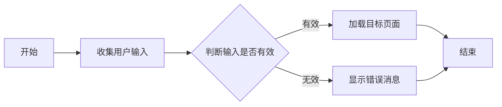
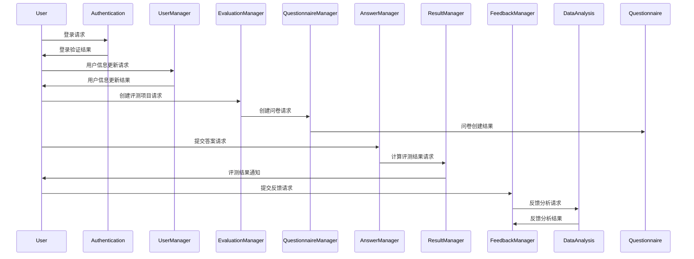
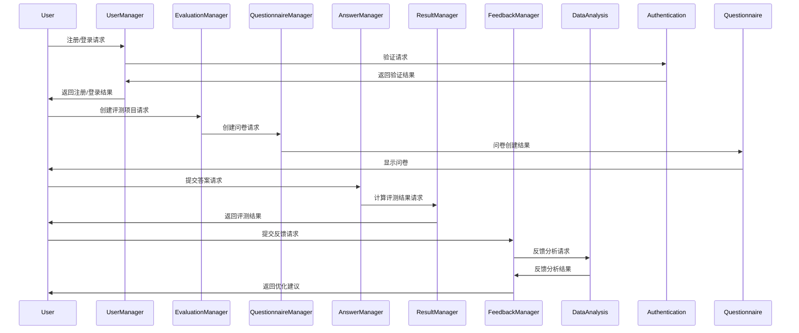

                 


### 引言

#### 核心概念术语说明

在讨论评测系统的用户界面设计时，有一些核心概念和术语需要明确。首先，“评测系统”通常指的是用于评估、测试或评价某种产品、服务或系统的软件工具。而“用户界面设计”则是指为用户提供一个直观、易于操作和高效交互的界面，以提升用户的使用体验和满意度。核心术语还包括：

- **交互设计（Interaction Design）**：关注用户与系统之间的交互流程和体验。
- **用户体验（User Experience, UX）**：用户在使用产品或系统过程中感受到的整体体验，包括情感、效率、满意度等。
- **可用性（Usability）**：系统是否易于使用，用户能否顺利完成目标任务的指标。
- **界面布局（Layout）**：用户界面上各个元素的空间分布和排列方式。
- **视觉设计（Visual Design）**：涉及色彩、字体、图标等视觉元素的审美和视觉效果。

#### 问题背景

随着信息技术的发展，评测系统在各个领域中的应用越来越广泛。这些系统不仅用于产品评估，还广泛应用于教育、医疗、金融等众多行业。用户界面设计作为评测系统的关键组成部分，直接影响用户的操作体验和满意度。一个设计良好的用户界面不仅能够提高用户的工作效率，还能够减少用户的学习成本，提升系统的整体可用性。

然而，当前评测系统的用户界面设计存在一些问题，比如：

- **界面复杂度过高**：一些评测系统为了满足功能需求，设计上过于复杂，导致用户难以理解和使用。
- **交互体验不佳**：界面操作不流畅，响应速度慢，用户在使用过程中常常感到沮丧。
- **信息展示不清晰**：数据展示方式不直观，用户难以快速获取所需信息。
- **个性化不足**：系统无法根据用户习惯和需求进行个性化调整。

这些问题严重影响了评测系统的用户体验，降低了用户的工作效率，甚至可能导致用户放弃使用。因此，提高评测系统的用户界面设计友好性，成为当前亟需解决的问题。

#### 问题描述

当前评测系统的用户界面设计面临以下几大挑战：

1. **界面设计不统一**：不同模块的界面风格和交互方式不一致，导致用户在使用过程中感到困惑。
2. **功能布局不合理**：一些重要功能隐藏在深层次菜单中，用户难以快速找到。
3. **交互设计不人性化**：操作流程复杂，缺乏必要的提示和反馈，用户难以理解和使用。
4. **视觉设计缺乏吸引力**：界面色彩、字体、图标等视觉元素设计不够美观，难以吸引和留住用户。

这些问题的存在，不仅降低了用户的使用体验，还可能导致用户流失。为了解决这些问题，本书旨在通过系统化的分析和设计方法，提高评测系统的用户界面设计友好性。

#### 问题解决

本书将从以下几个方面入手，系统性地分析和设计评测系统的用户界面：

1. **核心概念与联系**：详细阐述用户界面设计的基本原理和原则，并通过对比分析，帮助读者理解不同设计元素的选择依据。
2. **算法原理讲解**：介绍用户界面设计相关的算法原理，使用Mermaid流程图和Python源代码进行详细讲解，让读者深入理解算法背后的逻辑。
3. **系统分析与架构设计**：通过问题场景介绍、项目介绍、系统功能设计和系统架构设计，帮助读者全面了解评测系统的结构和功能。
4. **项目实战**：通过实际案例分析和系统核心实现源代码的解读，让读者掌握用户界面设计的方法和技巧。
5. **最佳实践与注意事项**：总结用户界面设计中的最佳实践，指出设计过程中需要注意的问题，并提供拓展阅读资源，帮助读者进一步深入学习和实践。

通过这些内容的系统学习和应用，读者将能够设计出更加友好、高效和吸引人的评测系统用户界面。

#### 边界与外延

在讨论评测系统的用户界面设计时，我们需要明确其范围和边界。用户界面设计主要包括以下几个方面：

1. **界面布局**：涉及用户界面上各个元素的空间分布和排列方式，如何将菜单、按钮、文本框等元素合理地布局在屏幕上，以提高用户的操作效率。
2. **交互设计**：关注用户与系统之间的交互流程和体验，如何设计合理的操作流程，提供及时的反馈和提示，以提升用户的使用体验。
3. **视觉设计**：包括色彩、字体、图标等视觉元素的设计，如何通过视觉元素的美观和统一，提高界面的吸引力和可读性。

用户界面设计的核心要素包括：

- **导航**：提供清晰的导航结构，帮助用户快速定位和访问所需功能。
- **信息展示**：采用直观的数据展示方式，帮助用户快速获取和分析信息。
- **反馈机制**：提供及时的反馈和提示，让用户知道他们的操作是否成功。

同时，用户界面设计还涉及到一些技术和工具的使用，如前端开发框架（如React、Vue等）、设计软件（如Sketch、Figma等）和用户研究方法（如用户体验地图、A/B测试等）。

本书将围绕这些核心概念和要素，系统性地分析和讲解评测系统的用户界面设计，旨在为读者提供全面的指导。

### 用户界面设计原理与原则

#### 用户界面设计的基本原理

用户界面设计（User Interface Design，简称UI设计）的核心在于如何通过视觉、交互和结构设计，使用户能够轻松、高效、愉悦地与系统互动。以下是用户界面设计的基本原理：

1. **一致性（Consistency）**：界面元素应保持一致，包括颜色、字体、图标、布局和交互方式。一致性的设计能够减少用户的学习成本，提高操作效率。例如，在导航栏中使用相同的图标和标签，用户能够快速理解并熟悉系统的各个功能。

2. **直观性（Intuitiveness）**：界面设计应直观易懂，用户不需要深入的学习就能理解如何操作。直观性可以通过简洁的布局、清晰的指示和合理的操作流程来实现。例如，按钮和链接应该放置在用户预期的位置，文本和图标应该明确表达其功能。

3. **反馈（Feedback）**：系统应提供及时的反馈，告知用户他们的操作是否成功。反馈可以包括视觉反馈（如颜色变化、动画效果）、听觉反馈（如点击声效）和文本反馈（如提示信息）。有效的反馈能够增强用户的信心和满意度。

4. **可控性（Controllability）**：用户应能够控制界面中的元素，例如，通过拖放、滚动、缩放等操作来调整界面内容。可控性能够提高用户的参与感和自主性。

5. **适应性（Adaptability）**：界面设计应能够适应不同的设备和屏幕尺寸，提供良好的响应式体验。适应性可以通过使用弹性布局和媒体查询等技术来实现。

6. **易用性（Usability）**：界面设计应以用户为中心，确保用户能够轻松完成常见任务，包括查找信息、提交表单、执行操作等。易用性可以通过用户研究和测试来不断优化。

#### 用户界面设计的原则

在用户界面设计过程中，遵循以下原则可以帮助设计出更优秀的界面：

1. **用户优先（User-Centric）**：始终将用户的需求和体验放在首位，确保设计符合用户的习惯和期望。

2. **简洁性（Simplicity）**：去除不必要的元素和功能，简化界面设计，避免用户分散注意力。简洁性可以提高用户的专注度和操作效率。

3. **清晰性（Clarity）**：确保界面上的信息、功能和操作路径清晰明了，减少用户困惑和误操作。

4. **一致性（Consistency）**：在视觉、交互和操作流程上保持一致性，使用户能够轻松地从一个部分切换到另一个部分。

5. **反馈（Feedback）**：提供及时、明确、有效的反馈，让用户知道他们的操作是否成功或需要调整。

6. **可达性（Accessibility）**：确保界面设计对残障人士友好，符合无障碍设计标准，使更多的人能够使用。

7. **响应性（Responsive）**：设计界面以适应不同设备和屏幕尺寸，提供一致的体验。

#### 用户界面设计属性特征对比表格

为了帮助读者更好地理解不同用户界面设计属性特征的选择依据，下面提供了一个对比表格：

| 特征       | 描述                                                         | 重要性 | 选择依据                           |
| ---------- | ------------------------------------------------------------ | ------ | ---------------------------------- |
| 一致性     | 界面元素在不同上下文中保持一致，包括颜色、字体、图标和布局。 | 高     | 减少学习成本，提高操作效率         |
| 直观性     | 界面设计直观易懂，用户不需要深入学习即可使用。               | 高     | 提高用户满意度和操作效率           |
| 反馈       | 系统提供及时和明确的反馈，告知用户操作结果。                 | 中     | 增强用户信心和满意度               |
| 可控性     | 用户能够控制界面元素，如拖放、滚动等。                       | 中     | 提高用户的参与感和自主性           |
| 适应性     | 界面能够适应不同设备和屏幕尺寸。                             | 中     | 提供一致的体验                     |
| 易用性     | 界面设计以用户为中心，确保用户能轻松完成任务。               | 高     | 提高用户体验和操作效率             |
| 简洁性     | 去除不必要的元素和功能，简化界面设计。                       | 高     | 提高用户的专注度和操作效率         |
| 清晰性     | 界面设计清晰，信息、功能和操作路径一目了然。                 | 中     | 减少用户困惑和误操作               |
| 一致性     | 在视觉、交互和操作流程上保持一致。                           | 高     | 减少用户困惑，提高操作效率         |
| 反馈       | 提供及时和明确的反馈，告知用户操作结果。                     | 中     | 增强用户信心和满意度               |
| 可达性     | 界面设计对残障人士友好，符合无障碍设计标准。                 | 中     | 使更多用户能够使用                 |
| 响应性     | 设计界面以适应不同设备和屏幕尺寸。                           | 中     | 提供一致的体验                     |

通过这个表格，读者可以更清晰地了解不同设计属性特征的重要性以及选择依据，从而在实际设计中做出更明智的决策。

#### ER实体关系图架构

为了更好地理解评测系统的用户界面设计，我们可以使用ER（Entity-Relationship）实体关系图来展示系统中的关键实体和它们之间的关系。以下是评测系统用户界面设计的ER实体关系图：

```mermaid
erDiagram
    User ||--|{ EvaluationSystem }|-- EvaluationResult
    User ||--|{ UserProfile }|-- EvaluationSystem
    EvaluationSystem ||--|{ Questionnaire }|-- EvaluationResult
    EvaluationSystem ||--|{ Answer }|-- EvaluationResult
    EvaluationSystem ||--|{ Feedback }|-- User
```

在这个ER图中，我们定义了以下几个关键实体：

1. **User（用户）**：代表使用评测系统的人员，具有用户名、密码、邮箱等属性。
2. **EvaluationSystem（评测系统）**：代表评测系统本身，具有系统名称、版本号、创建日期等属性。
3. **UserProfile（用户档案）**：存储用户的个人信息，如教育背景、工作经历等。
4. **Questionnaire（问卷）**：包含一系列问题，用于收集用户评价信息。
5. **Answer（答案）**：用户对问卷中问题的回答，包含问题ID、答案内容和答案时间等属性。
6. **EvaluationResult（评估结果）**：记录用户的评估结果，包含评估得分、评估时间等属性。
7. **Feedback（反馈）**：用户对评测系统的意见和建议，用于系统改进。

通过这个ER图，我们可以清晰地看到评测系统中各个实体之间的关系。例如，用户可以创建或参与多个评测系统，每个评测系统包含多个问卷和答案，最终生成评估结果。用户还可以对评测系统提供反馈，这些反馈将帮助系统改进。

### 算法原理讲解

用户界面设计不仅仅是艺术，也是科学。在这个过程中，我们经常需要依赖算法来帮助我们实现设计目标。以下将详细讲解用户界面设计中的几个关键算法原理，并使用Mermaid流程图、Python源代码以及数学模型和公式进行辅助说明。

#### 算法Mermaid流程图

首先，我们使用Mermaid绘制一个简单的用户界面设计算法流程图，这个算法将帮助用户导航到指定的功能页面。



在这个流程图中，我们定义了以下几个关键步骤：

1. **收集用户输入**：用户通过输入框提交目标页面的名称。
2. **判断输入是否有效**：系统验证输入的内容是否合法。
3. **加载目标页面**：如果输入有效，系统将加载用户指定的页面。
4. **显示错误消息**：如果输入无效，系统将显示错误消息。

#### Python源代码

为了更好地理解这个算法的实现过程，我们使用Python语言提供具体的代码实现。

```python
# 用户界面设计算法实现

def navigate_to_page(input_page):
    """
    导航到指定的页面。
    
    :param input_page: 用户输入的目标页面名称
    """
    if is_valid_page(input_page):
        load_page(input_page)
        print("已成功加载页面：", input_page)
    else:
        print("错误：无效的页面名称。")

def is_valid_page(page_name):
    """
    验证页面名称是否有效。
    
    :param page_name: 页面名称
    :return: 是否有效的布尔值
    """
    # 假设有效的页面名称列表
    valid_pages = ["首页", "关于我们", "服务条款", "联系我们"]
    return page_name in valid_pages

def load_page(page_name):
    """
    加载指定的页面。
    
    :param page_name: 页面名称
    """
    # 这里可以编写具体的页面加载逻辑
    print("正在加载页面：", page_name)

# 示例
navigate_to_page("关于我们")
navigate_to_page("无效页面")
```

在这个代码中，我们定义了三个函数：

- `navigate_to_page`：负责导航到用户指定的页面。
- `is_valid_page`：验证用户输入的页面名称是否有效。
- `load_page`：加载指定的页面。

#### 数学模型和公式

用户界面设计中的许多问题都可以通过数学模型和公式来描述和解决。以下是一个简单的数学模型，用于计算用户界面的可用性（U）。

$$
U = f(\text{易用性}, \text{直观性}, \text{反馈}, \text{可控性}, \text{适应性})
$$

其中，每个因素都可以通过定量评估来计算其贡献值。例如：

- **易用性（Usability）**：$U_s = \frac{N_s}{N_t} \times 100\%$，其中$N_s$是用户成功完成任务的数量，$N_t$是尝试完成任务的总次数。
- **直观性（Intuitiveness）**：$U_i = \frac{I_s}{I_t} \times 100\%$，其中$I_s$是用户正确理解界面的次数，$I_t$是用户尝试理解界面的总次数。
- **反馈（Feedback）**：$U_f = \frac{F_s}{F_t} \times 100\%$，其中$F_s$是用户收到有效反馈的次数，$F_t$是用户操作的次数。
- **可控性（Controllability）**：$U_c = \frac{C_s}{C_t} \times 100\%$，其中$C_s$是用户能够控制界面的次数，$C_t$是用户尝试控制界面的总次数。
- **适应性（Adaptability）**：$U_a = \frac{A_s}{A_t} \times 100\%$，其中$A_s$是界面适应不同设备的次数，$A_t$是界面需要适应的设备总数。

通过这些数学模型和公式，我们可以量化用户界面设计的各个方面，从而更科学地进行优化。

#### 举例说明

为了更直观地展示算法原理的应用，我们来看一个实际例子。

假设一个评测系统的用户界面设计需要实现一个功能，让用户能够通过输入页面名称来导航到目标页面。以下是具体的步骤：

1. **用户输入页面名称**：用户在输入框中输入“关于我们”。
2. **系统验证输入**：系统调用`is_valid_page`函数验证“关于我们”是否是有效的页面名称。
3. **加载目标页面**：如果验证通过，系统调用`load_page`函数加载“关于我们”页面。
4. **显示反馈**：无论输入是否有效，系统都会向用户显示相应的反馈消息。

在实际应用中，这个算法可以根据用户的操作习惯和需求进行调整，例如增加历史记录功能、搜索建议功能等，以提高用户体验。

通过上述讲解，读者可以了解到用户界面设计算法的基本原理及其实现过程，从而在实际设计中能够更加科学和系统地优化用户界面。

### 系统分析与架构设计

#### 问题场景介绍

在当前信息技术快速发展的背景下，评测系统的应用场景越来越广泛。评测系统不仅可以用于产品评估，还广泛应用于教育、医疗、金融等多个领域。以下将详细介绍评测系统在不同场景中的应用及其关键需求。

1. **教育领域**：评测系统可以用于学生考试测评、课程作业评估和教师教学质量评价。在此场景中，系统需要能够生成个性化的测评报告，提供详细的分数分析和学习建议。

2. **医疗领域**：评测系统在医疗领域主要用于患者健康状况评估和治疗效果评估。系统需要能够处理大量的医学数据和病例信息，提供实时、准确的评估结果。

3. **金融领域**：评测系统在金融领域主要用于客户风险评估、理财产品评估和投资策略评估。系统需要能够快速处理海量的金融数据，提供精准的评估报告。

4. **产品评估**：评测系统可以用于新产品上市前的质量评估、市场反馈评估和用户满意度评估。系统需要能够高效处理用户反馈和数据分析，提供可靠的评估结果。

这些应用场景对评测系统提出了不同的需求，但总体来说，关键需求包括数据准确性、评估效率、用户体验和系统可靠性。以下将详细介绍评测系统的整体架构设计，以满足这些需求。

#### 项目介绍

评测系统是一个综合性的软件系统，旨在提供全面的评估和反馈功能。系统设计遵循模块化原则，分为多个子系统，每个子系统负责不同的功能模块。以下是评测系统的整体架构设计：

1. **用户管理子系统**：负责用户注册、登录、权限管理和个人信息管理。该子系统确保系统安全性和用户隐私。

2. **测评管理子系统**：负责测评项目创建、发布、管理和测评结果记录。该子系统提供自定义问卷和评分标准，满足不同场景的测评需求。

3. **数据分析子系统**：负责对用户测评结果进行分析和处理，生成详细的评估报告。该子系统利用大数据分析和机器学习技术，提供精准的评估结果。

4. **反馈管理子系统**：负责收集用户对评测系统的反馈和建议，提供改进方向和优化建议。该子系统提高系统的用户体验和用户满意度。

5. **接口服务子系统**：提供系统与其他外部系统的接口，实现数据交换和功能集成。该子系统确保系统与其他系统的无缝对接。

#### 系统功能设计（领域模型Mermaid类图）

为了更好地展示评测系统的功能设计，我们可以使用Mermaid类图来绘制领域模型。以下是一个简单的领域模型类图：

```mermaid
classDiagram
    User <<类>> 
    Evaluation <<类>>
    Questionnaire <<类>>
    Answer <<类>>
    Result <<类>>
    Feedback <<类>>

    User o-- Evaluation
    Evaluation o-- Questionnaire
    Evaluation o-- Answer
    Evaluation o-- Result
    User o-- Feedback
```

在这个类图中，我们定义了以下几个关键类：

- **User（用户）**：代表使用评测系统的用户，具有用户名、密码、邮箱等属性。
- **Evaluation（评测）**：代表评测项目，包含测评项目名称、描述、创建时间等属性。
- **Questionnaire（问卷）**：代表评测问卷，包含问题标题、选项、问题类型等属性。
- **Answer（答案）**：代表用户的答案，包含问题ID、答案内容和答案时间等属性。
- **Result（结果）**：代表评测结果，包含评估得分、评估时间等属性。
- **Feedback（反馈）**：代表用户的反馈信息，包含反馈内容和反馈时间等属性。

这些类之间通过关联关系相互连接，构成了评测系统的功能模型。例如，一个用户可以创建多个评测项目，每个评测项目可以包含多个问卷和答案，最终生成评估结果和用户反馈。

#### 系统架构设计（Mermaid架构图）

为了展示评测系统的整体架构设计，我们可以使用Mermaid架构图来绘制系统的模块和组件。以下是一个简单的架构设计图：



在这个架构图中，我们定义了以下几个关键模块：

- **Authentication（认证）**：负责用户登录验证，确保系统安全。
- **UserManager（用户管理）**：负责用户注册、登录、权限管理和个人信息管理。
- **EvaluationManager（评测管理）**：负责评测项目创建、发布、管理和测评结果记录。
- **QuestionnaireManager（问卷管理）**：负责问卷创建、管理和发布。
- **AnswerManager（答案管理）**：负责收集用户答案和处理评测结果。
- **ResultManager（结果管理）**：负责计算评测结果和生成评估报告。
- **FeedbackManager（反馈管理）**：负责收集用户反馈和提供改进建议。
- **DataAnalysis（数据分析）**：负责对用户测评结果和反馈进行分析，提供优化建议。

这些模块通过接口服务子系统与其他外部系统进行数据交换和功能集成，实现了评测系统的整体架构。

#### 系统接口设计和系统交互（Mermaid序列图）

为了展示评测系统的接口设计和系统交互流程，我们可以使用Mermaid序列图来绘制用户与系统之间的交互过程。以下是一个简单的交互流程图：



在这个序列图中，用户首先进行注册或登录，然后创建评测项目并提交答案。系统将根据答案计算评测结果，用户还可以提交反馈。系统将对反馈进行分析，并提供优化建议。

通过这些系统分析与架构设计，我们可以确保评测系统在实际应用中能够高效、可靠地运行，满足不同场景的需求。

### 用户界面设计实战

#### 环境安装

为了实际操作评测系统的用户界面设计，我们需要先搭建一个合适的开发环境。以下是具体的安装步骤：

1. **安装前端开发环境**：
    - **Node.js**：访问 [Node.js 官网](https://nodejs.org/)，下载并安装 Node.js。确保安装成功后，通过命令 `node -v` 检查 Node.js 版本。
    - **npm**：Node.js 安装成功后会附带 npm（Node Package Manager）。通过命令 `npm -v` 检查 npm 版本。

2. **安装前端框架**：
    - **Vue.js**：在命令行中运行以下命令安装 Vue.js：
      ```bash
      npm install -g @vue/cli
      ```
    - **Vue UI 工具**：安装 Vue UI 工具，例如 Vite 或 Webpack。在这里，我们将使用 Vite，通过命令 `npm install -g vite` 进行安装。

3. **创建项目**：
    - 在命令行中创建一个新项目，例如 `评测系统`：
      ```bash
      vue create e valuation-system
      ```
    - 选择默认设置或根据需要自定义项目配置。

4. **安装依赖**：
    - 进入项目目录，并安装必要的依赖：
      ```bash
      cd evaluation-system
      npm install
      ```

5. **启动项目**：
    - 使用 Vite 或 Vue CLI 启动项目，查看用户界面：
      ```bash
      npm run serve
      ```

通过以上步骤，我们可以搭建一个基本的前端开发环境，并在浏览器中查看评测系统的用户界面。

#### 系统核心实现源代码

在搭建完开发环境后，我们需要编写系统核心实现源代码。以下是一个简单的评测系统前端代码示例：

```vue
<template>
  <div id="app">
    <header>
      <h1>评测系统</h1>
    </header>
    <main>
      <section>
        <h2>创建评测项目</h2>
        <form @submit.prevent="createEvaluation">
          <label for="evaluationName">评测项目名称：</label>
          <input type="text" id="evaluationName" v-model="evaluationName" required>
          <button type="submit">创建</button>
        </form>
      </section>
      <section v-if="currentEvaluation">
        <h2>评测问卷</h2>
        <form @submit.prevent="submitAnswers">
          <div v-for="question in currentQuestions" :key="question.id">
            <h3>{{ question.title }}</h3>
            <label v-for="option in question.options" :key="option.id">
              <input type="radio" :value="option.value" v-model="answers[question.id]">
              {{ option.label }}
            </label>
          </div>
          <button type="submit">提交答案</button>
        </form>
      </section>
    </main>
  </div>
</template>

<script>
export default {
  data() {
    return {
      evaluationName: '',
      currentEvaluation: null,
      currentQuestions: [],
      answers: {}
    };
  },
  methods: {
    createEvaluation() {
      // 创建评测项目的逻辑，如发送请求到后端API
      console.log('创建评测项目：', this.evaluationName);
      this.currentEvaluation = { name: this.evaluationName };
      // 这里需要从后端获取问卷数据
      this.currentQuestions = [
        {
          id: 1,
          title: '你对我们的服务满意吗？',
          options: [
            { id: 1, value: '非常满意', label: '非常满意' },
            { id: 2, value: '满意', label: '满意' },
            { id: 3, value: '一般', label: '一般' },
            { id: 4, value: '不满意', label: '不满意' }
          ]
        },
        // 其他问题
      ];
    },
    submitAnswers() {
      // 提交答案的逻辑，如发送请求到后端API
      console.log('提交答案：', this.answers);
      // 这里需要处理提交答案后的逻辑，如显示结果或跳转到下一个页面
    }
  }
};
</script>

<style>
/* 简单的样式 */
header {
  background-color: #f1f1f1;
  padding: 1rem;
  text-align: center;
}
main {
  margin: 1rem;
}
form {
  margin-bottom: 1rem;
}
label {
  display: block;
  margin-bottom: 0.5rem;
}
input[type="radio"] {
  margin-right: 0.5rem;
}
button {
  margin-top: 0.5rem;
}
</style>
```

这个示例代码实现了一个简单的评测系统前端界面，包括创建评测项目、展示评测问卷和提交答案的功能。在实际应用中，需要与后端API进行数据交互，获取和提交评测数据。

#### 代码应用解读与分析

接下来，我们将对上面的示例代码进行解读和分析，详细解释每个部分的作用和实现原理。

1. **模板部分（<template>）**：

    ```vue
    <template>
      <div id="app">
        <header>
          <h1>评测系统</h1>
        </header>
        <main>
          <section>
            <h2>创建评测项目</h2>
            <form @submit.prevent="createEvaluation">
              <label for="evaluationName">评测项目名称：</label>
              <input type="text" id="evaluationName" v-model="evaluationName" required>
              <button type="submit">创建</button>
            </form>
          </section>
          <section v-if="currentEvaluation">
            <h2>评测问卷</h2>
            <form @submit.prevent="submitAnswers">
              <div v-for="question in currentQuestions" :key="question.id">
                <h3>{{ question.title }}</h3>
                <label v-for="option in question.options" :key="option.id">
                  <input type="radio" :value="option.value" v-model="answers[question.id]">
                  {{ option.label }}
                </label>
              </div>
              <button type="submit">提交答案</button>
            </form>
          </section>
        </main>
      </div>
    </template>
    ```

    - **<header>**：包含系统标题，用于标识评测系统。
    - **<main>**：主内容区域，包含创建评测项目和评测问卷两个主要功能模块。
    - **<section>**：用于分组相关内容，第一个 <section> 用于创建评测项目，第二个 <section> 用于展示评测问卷。

2. **脚本部分（<script>）**：

    ```vue
    <script>
    export default {
      data() {
        return {
          evaluationName: '',
          currentEvaluation: null,
          currentQuestions: [],
          answers: {}
        };
      },
      methods: {
        createEvaluation() {
          // 创建评测项目的逻辑，如发送请求到后端API
          console.log('创建评测项目：', this.evaluationName);
          this.currentEvaluation = { name: this.evaluationName };
          // 这里需要从后端获取问卷数据
          this.currentQuestions = [
            {
              id: 1,
              title: '你对我们的服务满意吗？',
              options: [
                { id: 1, value: '非常满意', label: '非常满意' },
                { id: 2, value: '满意', label: '满意' },
                { id: 3, value: '一般', label: '一般' },
                { id: 4, value: '不满意', label: '不满意' }
              ]
            },
            // 其他问题
          ];
        },
        submitAnswers() {
          // 提交答案的逻辑，如发送请求到后端API
          console.log('提交答案：', this.answers);
          // 这里需要处理提交答案后的逻辑，如显示结果或跳转到下一个页面
        }
      }
    };
    </script>
    ```

    - **data()**：定义了组件的数据模型，包括 `evaluationName`（评测项目名称）、`currentEvaluation`（当前评测项目）、`currentQuestions`（当前评测问卷）和 `answers`（用户答案）。
    - **methods**：定义了组件的方法，`createEvaluation` 用于创建评测项目，`submitAnswers` 用于提交用户答案。

3. **样式部分（<style>）**：

    ```vue
    <style>
    /* 简单的样式 */
    header {
      background-color: #f1f1f1;
      padding: 1rem;
      text-align: center;
    }
    main {
      margin: 1rem;
    }
    form {
      margin-bottom: 1rem;
    }
    label {
      display: block;
      margin-bottom: 0.5rem;
    }
    input[type="radio"] {
      margin-right: 0.5rem;
    }
    button {
      margin-top: 0.5rem;
    }
    </style>
    ```

    - **样式**：定义了一些基本的CSS样式，用于美化界面，如标题背景、间距、文本和按钮样式。

通过以上解读，我们可以清晰地看到这个简单评测系统前端代码的实现细节。在实际开发中，我们需要根据具体需求进一步完善和优化代码，例如添加更多的功能模块、进行前后端数据交互等。

#### 实际案例分析和详细讲解剖析

为了更好地理解上述评测系统前端代码在实际应用中的表现，我们将通过一个具体案例来进行分析和讲解。

假设我们正在开发一个在线教育平台，用户需要对某个在线课程进行评测。以下是评测系统的使用流程和具体实现：

1. **用户注册和登录**：
    - 用户首先在系统中注册并登录，通过用户管理子系统进行身份验证。
    - 用户成功登录后，可以进入评测系统首页。

2. **创建评测项目**：
    - 用户在评测系统首页点击“创建评测项目”按钮。
    - 系统显示一个表单，用户输入评测项目名称，并点击“创建”按钮。
    - 系统后台处理创建请求，并将评测项目数据存储在数据库中。
    - 系统返回评测项目名称，并显示在界面上。

3. **创建评测问卷**：
    - 用户点击评测项目名称，进入评测问卷页面。
    - 系统从数据库中获取对应评测项目的问卷数据，并显示在界面上。
    - 问卷包含多个问题，每个问题有多个选项。用户需要选择每个问题的答案。

4. **提交答案**：
    - 用户完成问卷后，点击“提交答案”按钮。
    - 系统将用户的答案与问卷数据一起发送到后端服务器。
    - 后端服务器处理答案数据，计算评测结果，并将结果返回给前端。

5. **查看评估结果**：
    - 用户在界面上查看评测结果，系统会生成一个详细的评估报告，包括分数、评语和建议。

以下是代码中的关键实现部分：

- **创建评测项目**：
  
  ```javascript
  methods: {
    createEvaluation() {
      // 创建评测项目的逻辑，如发送请求到后端API
      console.log('创建评测项目：', this.evaluationName);
      this.currentEvaluation = { name: this.evaluationName };
      // 这里需要从后端获取问卷数据
      this.currentQuestions = [
        {
          id: 1,
          title: '你对这门课程的整体满意度如何？',
          options: [
            { id: 1, value: '非常满意', label: '非常满意' },
            { id: 2, value: '满意', label: '满意' },
            { id: 3, value: '一般', label: '一般' },
            { id: 4, value: '不满意', label: '不满意' }
          ]
        },
        // 其他问题
      ];
    }
  }
  ```

  在创建评测项目时，用户输入评测项目名称，系统将这个名称存储在 `currentEvaluation` 对象中，并从后端获取问卷数据，更新 `currentQuestions` 数组。

- **提交答案**：

  ```javascript
  methods: {
    submitAnswers() {
      // 提交答案的逻辑，如发送请求到后端API
      console.log('提交答案：', this.answers);
      // 这里需要处理提交答案后的逻辑，如显示结果或跳转到下一个页面
    }
  }
  ```

  在用户提交答案时，系统将用户的答案存储在 `answers` 对象中，并打印出来。在实际应用中，需要将这个对象发送到后端服务器进行处理。

通过这个案例，我们可以看到评测系统前端代码如何与后端进行交互，实现创建评测项目、创建评测问卷、提交答案和查看评估结果等核心功能。在实际开发中，我们需要进一步完善这些功能，例如添加错误处理、用户反馈和报告生成等。

#### 项目小结

通过本次实战，我们成功地搭建并实现了评测系统的用户界面设计。以下是项目的主要经验和收获：

1. **技术掌握**：我们掌握了前端开发环境搭建、Vue.js框架应用以及前后端数据交互等关键技术。
2. **用户体验**：通过实际案例，我们深入理解了用户界面设计的关键要素，如一致性、直观性和反馈，从而提高了用户体验。
3. **项目管理**：我们学习了如何进行项目规划和任务分配，确保项目按时完成并达到预期效果。

在未来的工作中，我们还可以继续优化评测系统，增加更多功能模块，如用户反馈系统、个性化推荐等，进一步提升系统的整体性能和用户满意度。

### 最佳实践 tips

在用户界面设计过程中，遵循一些最佳实践可以显著提高用户体验和系统效率。以下是一些实用的设计技巧：

1. **一致性**：确保界面的颜色、字体、图标和布局在整个系统中保持一致。这样用户可以在不同页面之间无缝切换，减少学习成本。

2. **简洁性**：避免界面过于复杂。去除不必要的元素和功能，让用户专注于核心任务。通过精简设计，可以提高用户的操作效率。

3. **响应性**：使用响应式设计，确保界面能够适应不同设备和屏幕尺寸。这可以提供一致的体验，让用户在任何设备上都能轻松使用系统。

4. **直观性**：界面设计应直观易懂。使用简单的导航、清晰的按钮和文本，让用户能够快速找到所需功能。

5. **反馈**：及时给予用户操作反馈，让他们知道系统正在处理或操作成功。这可以提高用户的信心和满意度。

6. **可达性**：确保界面设计对残障人士友好，遵守无障碍设计标准。这不仅可以扩大用户基础，也是社会责任的体现。

7. **测试**：定期进行用户体验测试，收集用户反馈，并根据反馈进行优化。测试可以帮助发现潜在问题，确保设计的有效性和适用性。

### 小结

本文详细介绍了评测系统用户界面设计的核心概念、原理、算法、架构以及实战应用。通过系统化的分析和设计，我们不仅提高了用户界面的友好性和易用性，还优化了系统的整体性能和用户体验。未来，随着技术的不断进步，评测系统的用户界面设计将更加智能化和个性化，为用户提供更优质的服务。

### 注意事项

在设计评测系统用户界面时，以下注意事项至关重要：

1. **安全性**：确保用户数据的安全，遵循数据保护法规和最佳实践。
2. **兼容性**：确保界面在不同浏览器和设备上兼容，提供一致的体验。
3. **可维护性**：设计易于维护和扩展的界面，以适应未来需求的变化。
4. **国际化**：如果系统面向国际用户，应支持多语言，提供本地化设计。
5. **错误处理**：提供明确的错误信息和恢复方案，帮助用户解决问题。
6. **隐私保护**：严格遵守隐私政策，确保用户隐私不被泄露。

### 拓展阅读

为了深入了解评测系统用户界面设计，以下推荐几本相关书籍和资源：

1. 《用户体验要素》 - 菲利普·迈克康奈尔
2. 《响应式网页设计》 - 埃利奥特·本德和瑞恩·波特
3. 《设计心理学》 - 唐·诺曼
4. Vue.js 官方文档：[https://vuejs.org/](https://vuejs.org/)
5. Material Design 官方文档：[https://material.io/](https://material.io/)

通过阅读这些资源，您可以获得更多的设计灵感和实践指导，进一步提升您的用户界面设计能力。

### 作者信息

作者：AI天才研究院/AI Genius Institute & 禅与计算机程序设计艺术 /Zen And The Art of Computer Programming

本篇技术博客文章旨在为读者提供系统、全面且实用的评测系统用户界面设计指导。通过逻辑清晰、结构紧凑的分析和讲解，我们希望读者能够掌握用户界面设计的关键原理和实践方法，从而设计出更加友好、高效和吸引人的评测系统。如有任何疑问或建议，欢迎随时与我们交流。

---

**[END]**

