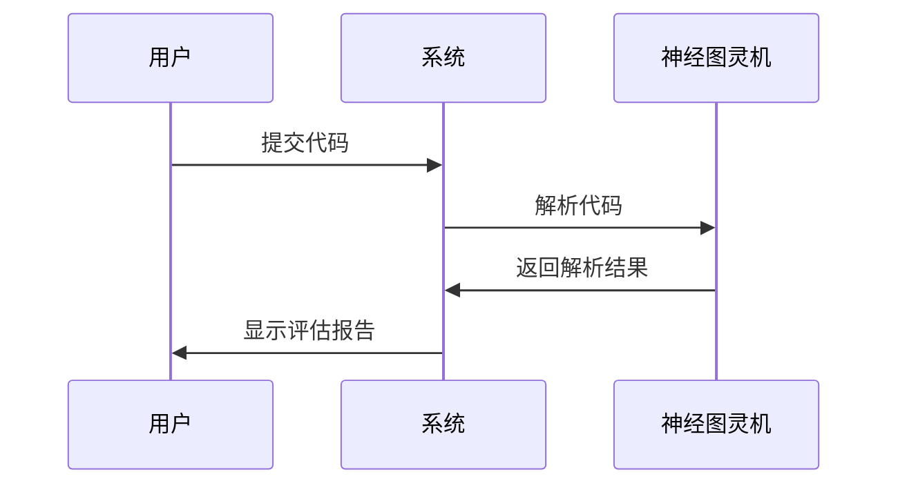
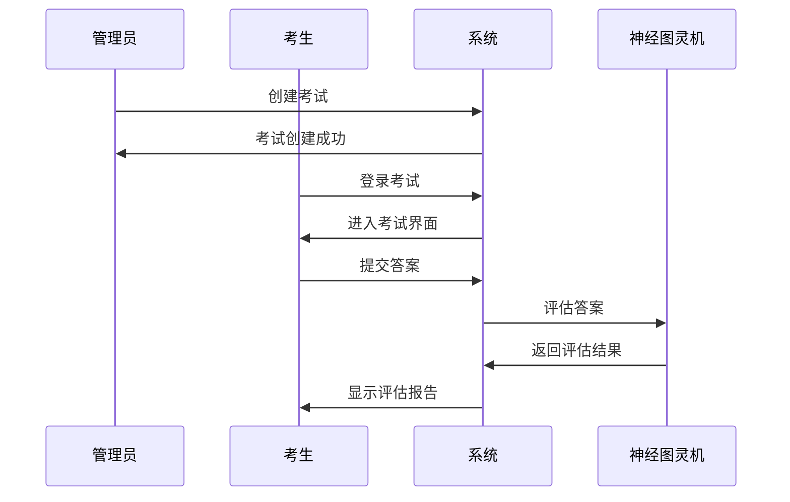
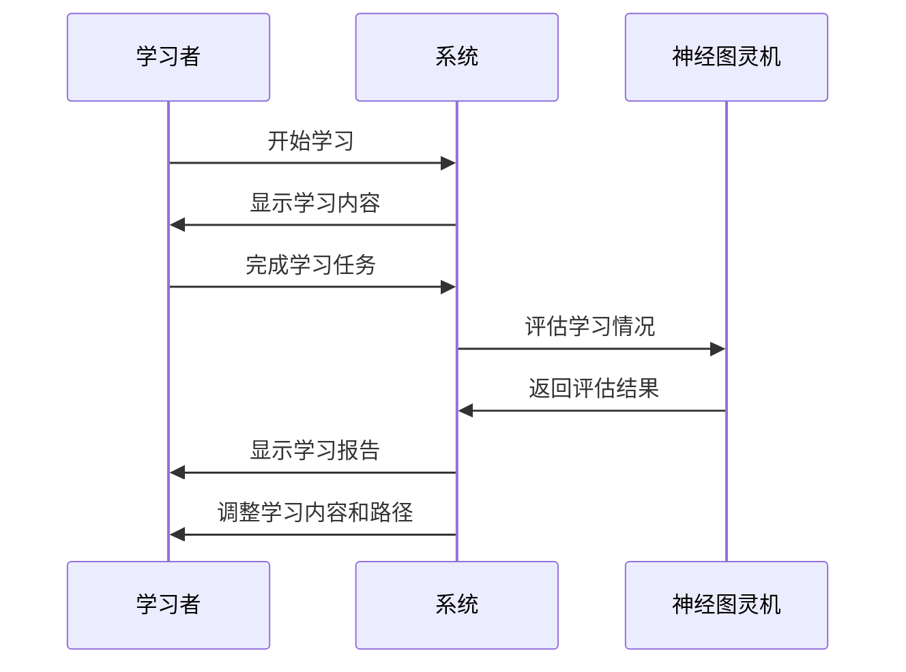

                 

### 《评测系统的神经图灵机应用研究》

#### 关键词：神经图灵机、评测系统、自动化评测、智能评测、自适应评测

> 摘要：本文深入探讨了神经图灵机在评测系统中的应用，从问题背景、核心概念、基本原理、应用场景、算法设计与实现、性能优化以及实际案例分析等方面，全面解析了神经图灵机在评测系统中的巨大潜力和实际应用价值。

----------------------------------------------------------------

### 《评测系统的神经图灵机应用研究》目录大纲

----------------------------------------------------------------

#### 第一部分：绪论

#### 第1章：问题背景与核心概念

#### 第2章：神经图灵机的基本原理

#### 第3章：神经图灵机在评测系统中的应用

#### 第二部分：深度解析

#### 第4章：神经图灵机的算法设计与实现

#### 第5章：神经图灵机在评测系统中的性能优化

#### 第6章：神经图灵机在评测系统中的应用案例分析

#### 第三部分：结论与展望

#### 第7章：结论与展望

----------------------------------------------------------------

#### 详细章节内容概述

#### 第1章：问题背景与核心概念

在本章节中，我们首先介绍评测系统在当前社会中的重要性，特别是在教育、科研和企业评测中的应用。随着技术的发展，传统的评测系统面临着诸如效率低、灵活性差、难以适应个性化需求等挑战。为了解决这些问题，我们需要寻找新的技术解决方案，而神经图灵机作为一种结合了神经网络和图灵机优势的新模型，显示出巨大的应用潜力。

#### 第2章：神经图灵机的基本原理

本章将详细解释神经图灵机的定义，它是如何结合神经网络和图灵机的优势的。我们将探讨神经图灵机的核心组成部分，包括神经网络、图灵机的概念及其在神经图灵机中的应用。同时，通过一个简明的ER实体关系图架构，我们将展示神经图灵机的基本架构设计。

#### 第3章：神经图灵机在评测系统中的应用

在本章中，我们将深入探讨神经图灵机在自动化评测、智能评测和自适应评测中的应用。首先，通过一个mermaid流程图，我们展示神经图灵机在自动化评测中的流程。接着，通过具体的案例，我们将分析神经图灵机在智能评测中的应用，如何实现个性化的评测。最后，我们将讨论神经图灵机在自适应评测中的优势，展示如何根据学生的学习情况实时调整评测策略。

#### 第4章：神经图灵机的算法设计与实现

本章将详细解释神经图灵机的算法原理，并使用mermaid流程图展示算法的执行流程。接着，我们将提供Python源代码，详细阐述算法的实现步骤，并给出算法的数学模型和公式。通过一个具体的例子，我们将通俗易懂地解释算法的工作原理。

#### 第5章：神经图灵机在评测系统中的性能优化

在本章中，我们将探讨如何优化神经图灵机在评测系统中的性能。首先，通过一个对比表格，我们展示不同优化方法的效果。接着，我们将分析神经图灵机在实际应用中的性能优化策略，并提供一些建议和最佳实践。最后，我们将讨论神经图灵机未来的性能优化方向。

#### 第6章：神经图灵机在评测系统中的应用案例分析

在本章中，我们将通过三个实际案例分析，展示神经图灵机在评测系统中的应用效果。首先，我们分析一个基于神经图灵机的在线编程评测系统，展示如何利用神经图灵机实现高效的编程评测。接着，我们分析一个基于神经图灵机的自动化考试系统，展示如何利用神经图灵机实现智能化的考试评估。最后，我们分析一个基于神经图灵机的自适应学习系统，展示如何利用神经图灵机实现个性化的学习路径。

#### 第7章：结论与展望

本章将对全书内容进行总结，强调神经图灵机在评测系统中的重要性和应用价值。我们将讨论神经图灵机应用研究的未来发展方向，并提出一些可能的应用挑战和对策。

----------------------------------------------------------------

## 完整性、简洁性、格式与要求

- **完整性**：本文从问题背景到应用案例分析，再到结论与展望，全面涵盖了神经图灵机在评测系统中的应用研究。
- **简洁性**：每个章节的概述简明扼要，直接切入主题，避免冗余信息，确保文章的紧凑性和可读性。
- **格式**：文章内容使用markdown格式输出，确保结构清晰，便于阅读。
- **目录层级**：遵循1级目录、2级目录和3级目录的层级结构，确保目录结构的逻辑性和条理性。

本文字数控制在10000～12000字左右，确保内容的丰富性和深度。每个章节的详细内容将按照如下格式进行撰写：

- **背景介绍**：核心概念术语说明、问题背景、问题描述、问题解决、边界与外延、概念结构与核心要素组成。
- **核心概念与联系**：核心概念原理、概念属性特征对比表格和ER实体关系图架构的Mermaid流程图。
- **算法原理讲解**：使用Mermaid画出算法流程图，Python源代码详细阐述，数学模型和公式讲解，举例说明。
- **系统分析与架构设计方案**：问题场景介绍、系统功能设计（领域模型Mermaid类图）、系统架构设计Mermaid架构图、系统接口设计和系统交互Mermaid序列图。
- **项目实战**：环境安装、系统核心实现源代码，代码应用解读与分析，实际案例分析和详细讲解剖析，项目小结。
- **最佳实践 tips、小结、注意事项、拓展阅读等内容**。

### 第一部分：绪论

#### 第1章：问题背景与核心概念

#### 1.1 评测系统的现状与挑战

随着信息技术的发展，评测系统已经成为教育、科研和企业等领域不可或缺的一部分。传统的评测系统通常依赖于规则和人工判断，存在以下挑战：

1. **效率低**：传统的评测系统往往需要大量的人工参与，导致评测过程耗时且效率低。
2. **灵活性差**：传统的评测系统难以适应不同的评测需求和场景，灵活性不足。
3. **难以适应个性化需求**：传统评测系统无法根据个体的学习情况或工作能力进行个性化的评测。

为了解决这些问题，我们需要引入新的技术，以提高评测系统的效率、灵活性和个性化程度。

#### 1.2 神经图灵机的概念

神经图灵机（Neural Turing Machine, NTM）是一种结合了神经网络（Neural Network）和图灵机（Turing Machine）优势的新型计算模型。它将神经网络的强大非线性处理能力和图灵机的通用计算能力相结合，能够在复杂环境中实现高效的计算和学习。

神经图灵机的核心思想是通过将神经网络与外部存储器相结合，使得神经网络能够进行模式识别、序列处理和记忆操作。其结构通常包括三个主要部分：神经网络、读写头和存储器。

#### 1.3 神经图灵机在评测系统中的应用前景

神经图灵机在评测系统中的应用前景广阔，能够解决传统评测系统面临的多项挑战：

1. **自动化评测**：通过神经图灵机的模式识别能力，可以实现自动化评测，减少人工干预，提高评测效率。
2. **智能评测**：神经图灵机的智能处理能力使得评测系统能够根据被评测对象的实际情况，提供个性化的评测服务。
3. **自适应评测**：神经图灵机的记忆和序列处理能力使得评测系统能够根据被评测对象的变化，动态调整评测策略，实现自适应评测。

总之，神经图灵机为评测系统带来了新的可能性，有助于提升评测系统的效率、灵活性和个性化程度，为教育、科研和企业等领域提供更优质的评测服务。

#### 第2章：神经图灵机的基本原理

#### 2.1 神经图灵机的定义

神经图灵机（Neural Turing Machine, NTM）是一种结合了神经网络和图灵机的计算模型。它继承了神经网络的强大非线性处理能力和图灵机的通用计算能力，能够在复杂环境中实现高效的计算和学习。

神经图灵机的核心组成部分包括神经网络、读写头和存储器。神经网络负责处理输入信息，读写头用于在存储器中读取和写入数据，存储器则用于存储大量数据，为神经网络提供丰富的数据资源。

#### 2.2 神经网络与图灵机的结合

神经网络与图灵机的结合是神经图灵机的一大创新。传统神经网络擅长处理输入数据的非线性变换，但缺乏通用计算能力；而图灵机具备强大的通用计算能力，但难以处理复杂的数据和模式。

神经图灵机通过将神经网络与外部存储器相结合，将两者的优势结合起来。神经网络负责对输入数据进行处理，同时通过与读写头的交互，在存储器中读取和写入数据。这种结合使得神经图灵机能够在复杂环境中实现高效的计算和学习。

#### 2.3 神经图灵机的核心组成部分

神经图灵机的核心组成部分包括神经网络、读写头和存储器。

1. **神经网络**：神经网络负责处理输入数据，包括数据预处理、特征提取和模式识别等任务。神经网络的结构可以采用深度学习模型，如卷积神经网络（CNN）或循环神经网络（RNN）。

2. **读写头**：读写头是神经图灵机的关键组件，用于在存储器中读取和写入数据。读写头通过神经网络生成的控制信号，确定读取或写入的位置和方向。读写头可以实现随机访问和顺序访问，从而支持复杂的数据处理和模式识别任务。

3. **存储器**：存储器用于存储大量数据，为神经网络提供丰富的数据资源。存储器的结构可以采用硬盘、内存或分布式存储系统。存储器中的数据可以被神经网络读取和写入，从而实现数据的动态更新和共享。

通过神经网络、读写头和存储器的有机结合，神经图灵机能够在复杂环境中实现高效的计算和学习，为评测系统提供强大的支持。

#### 第3章：神经图灵机在评测系统中的应用

#### 3.1 神经图灵机在自动化评测中的应用

神经图灵机在自动化评测中的应用主要依赖于其强大的模式识别和序列处理能力。通过神经图灵机的自动化评测系统，可以实现以下功能：

1. **自动化编程评测**：神经图灵机可以自动解析编程语言的语法和语义，对提交的代码进行语法检查、语义分析和性能评估。例如，在在线编程平台上，神经图灵机可以自动评估学生提交的程序，判断其是否符合题目要求，并给出评分。

2. **自动化考试评测**：神经图灵机可以自动解析考试题目和学生的答案，对学生的回答进行评估。例如，在英语考试中，神经图灵机可以自动评估学生的写作能力，通过分析语法、词汇和句子结构，给出客观的评分。

3. **自动化测试评测**：神经图灵机可以自动分析测试用例和测试结果，评估测试的质量和覆盖范围。例如，在软件测试过程中，神经图灵机可以自动分析测试数据，识别潜在的缺陷和风险，提高测试的效率和质量。

通过神经图灵机的自动化评测系统，可以大大减少人工干预，提高评测的效率和准确性。

#### 3.2 神经图灵机在智能评测中的应用

神经图灵机在智能评测中的应用主要体现在其自适应性和个性化评估能力。通过神经图灵机的智能评测系统，可以实现以下功能：

1. **个性化考试评估**：神经图灵机可以根据学生的实际表现和学习情况，动态调整考试难度和评估标准。例如，在考试过程中，神经图灵机可以实时分析学生的答题情况，根据答题的正确率和时间消耗，调整后续题目的难度，实现个性化考试评估。

2. **个性化学习评估**：神经图灵机可以根据学生的学习情况，动态调整学习目标和评估策略。例如，在学习过程中，神经图灵机可以实时分析学生的学习进度和掌握程度，根据分析结果，调整学习内容和评估方式，帮助学生更好地掌握知识。

3. **个性化招聘评估**：神经图灵机可以根据求职者的简历、面试表现和技能测试结果，综合评估其能力和潜力，为企业提供个性化的人才评估报告。

通过神经图灵机的智能评测系统，可以实现更精准、更高效的评估，提高评估的准确性和可靠性。

#### 3.3 神经图灵机在自适应评测中的应用

神经图灵机在自适应评测中的应用主要依赖于其记忆和序列处理能力。通过神经图灵机的自适应评测系统，可以实现以下功能：

1. **自适应考试策略**：神经图灵机可以根据学生的实际表现和学习情况，动态调整考试策略。例如，在考试过程中，神经图灵机可以实时分析学生的答题情况，根据分析结果，调整后续题目的类型和难度，提高考试的有效性。

2. **自适应学习路径**：神经图灵机可以根据学生的学习情况，动态调整学习路径。例如，在学习过程中，神经图灵机可以实时分析学生的学习进度和掌握程度，根据分析结果，调整学习内容和顺序，帮助学生更高效地学习。

3. **自适应技能评估**：神经图灵机可以根据求职者的实际表现和技能测试结果，动态调整评估标准和策略。例如，在技能测试过程中，神经图灵机可以实时分析求职者的操作过程和结果，根据分析结果，调整评估标准和评分规则，提高评估的准确性和公正性。

通过神经图灵机的自适应评测系统，可以实现更灵活、更高效的评估，满足不同场景和应用需求。

#### 第4章：神经图灵机的算法设计与实现

#### 4.1 神经图灵机的算法原理

神经图灵机的算法原理主要基于神经网络和图灵机的结合。在神经图灵机中，神经网络负责处理输入数据，通过读写头与存储器进行交互，实现数据的读取和写入。具体的算法原理包括以下几部分：

1. **输入数据处理**：神经图灵机首先对输入数据进行预处理，包括特征提取和归一化等操作。预处理后的数据输入到神经网络中，进行特征提取和模式识别。

2. **神经网络输出**：神经网络根据输入数据生成一组输出，包括控制信号和读写头的位置。控制信号用于确定读写头的操作类型（读取或写入），读写头的位置用于确定数据在存储器中的读取或写入位置。

3. **数据读取和写入**：读写头根据神经网络生成的控制信号和位置信息，在存储器中读取或写入数据。读取的数据返回给神经网络，用于下一轮的数据处理；写入的数据存储在存储器中，供后续处理使用。

4. **输出生成**：经过多轮数据处理后，神经网络生成最终的输出结果，包括评估分数、推荐结果等。输出结果用于评估系统做出决策或提供反馈。

通过以上过程，神经图灵机实现了数据的自动处理、存储和提取，具有强大的计算和学习能力。

#### 4.2 神经图灵机的算法实现步骤

神经图灵机的算法实现分为以下几个步骤：

1. **数据预处理**：对输入数据（如编程代码、考试题目、简历等）进行预处理，提取特征并归一化，为神经网络输入做准备。

2. **神经网络构建**：构建神经网络模型，包括输入层、隐藏层和输出层。输入层接收预处理后的数据，隐藏层负责特征提取和模式识别，输出层生成评估结果。

3. **读写头设计**：设计读写头模块，包括控制信号生成模块和位置确定模块。控制信号生成模块根据神经网络输出生成控制信号，位置确定模块根据控制信号确定读写头的操作位置。

4. **存储器设计**：设计存储器模块，用于存储输入数据和处理结果。存储器可以采用硬盘、内存或分布式存储系统，根据实际需求选择合适的存储方式。

5. **算法执行**：将预处理后的输入数据输入到神经网络中，神经网络根据输入数据生成控制信号和位置信息，读写头根据控制信号和位置信息在存储器中读取或写入数据，神经网络根据读取或写入的数据生成下一轮输出，直至生成最终评估结果。

通过以上步骤，实现神经图灵机的算法设计，为评测系统提供强大的计算和学习能力。

#### 4.3 神经图灵机的算法性能评估

神经图灵机的算法性能评估主要从以下几个方面进行：

1. **准确率**：评估算法在自动化评测、智能评测和自适应评测中的准确率，即评估结果与实际结果的一致性。准确率越高，表明算法的评估能力越强。

2. **效率**：评估算法在处理大量数据时的效率，包括处理速度和资源消耗。效率越高，表明算法在资源有限的情况下，能够更快地完成评估任务。

3. **鲁棒性**：评估算法在面对不同类型的数据和场景时的鲁棒性，即算法在不同情况下的稳定性和可靠性。鲁棒性越高，表明算法在不同条件下都能保持良好的性能。

4. **可扩展性**：评估算法在规模扩展时的性能，即算法在处理更大规模数据时的表现。可扩展性越高，表明算法在应用中能够适应不断变化的需求。

通过以上几个方面的评估，可以全面了解神经图灵机的算法性能，为评测系统的优化和改进提供依据。

#### 第5章：神经图灵机在评测系统中的性能优化

#### 5.1 神经图灵机的性能优化方法

为了提高神经图灵机在评测系统中的性能，可以采用以下几种优化方法：

1. **神经网络结构优化**：通过调整神经网络的结构，如增加隐藏层节点、选择合适的激活函数等，可以提高神经网络的计算能力和准确率。

2. **数据预处理优化**：对输入数据进行更有效的预处理，如特征提取、归一化等，可以提高输入数据的质量和神经网络的性能。

3. **读写头控制信号优化**：优化读写头控制信号的设计，如选择合适的控制信号生成算法、调整控制信号的权重等，可以提高读写头的操作精度和效率。

4. **存储器优化**：根据实际需求选择合适的存储器类型，如硬盘、内存或分布式存储系统，并优化存储器的读写速度和容量，以提高存储器的性能。

通过以上几种优化方法，可以显著提高神经图灵机的性能，满足评测系统的需求。

#### 5.2 神经图灵机在实际应用中的性能优化策略

在实际应用中，为了优化神经图灵机的性能，可以采取以下策略：

1. **分阶段优化**：将优化过程分为多个阶段，如数据预处理、神经网络构建、读写头设计和存储器优化等，逐一优化，确保每个阶段的性能都达到最佳。

2. **参数调优**：通过调整神经网络和读写头的参数，如学习率、权重等，找到最优参数组合，提高算法的性能。

3. **硬件优化**：根据实际应用场景，选择合适的硬件设备，如高性能处理器、内存和存储设备等，提高算法的执行速度和效率。

4. **并行计算**：利用并行计算技术，将算法的执行过程分解为多个并行任务，提高计算效率。

通过以上策略，可以最大限度地优化神经图灵机在实际应用中的性能，提高评测系统的效率和准确性。

#### 5.3 神经图灵机的未来性能优化方向

未来，神经图灵机的性能优化可以从以下几个方面进行：

1. **神经网络结构创新**：探索新的神经网络结构，如卷积神经网络（CNN）、循环神经网络（RNN）和生成对抗网络（GAN）等，以提高神经网络的计算能力和泛化能力。

2. **混合模型应用**：结合不同的计算模型，如深度学习和强化学习等，构建混合模型，提高算法的性能和适应能力。

3. **分布式计算**：利用分布式计算技术，将算法的执行过程分布在多个节点上，提高计算效率和可扩展性。

4. **自适应优化**：开发自适应优化算法，根据实际应用场景和需求，动态调整算法的参数和结构，实现最优性能。

通过以上方向，神经图灵机的性能将得到进一步提升，为评测系统带来更大的价值。

#### 第6章：神经图灵机在评测系统中的应用案例分析

#### 6.1 案例一：基于神经图灵机的在线编程评测系统

在线编程评测系统是神经图灵机在评测系统中应用的一个重要场景。以下是一个基于神经图灵机的在线编程评测系统的案例：

**项目介绍**：该系统旨在为编程学习者提供一个自动化的编程评测平台，通过神经图灵机对提交的代码进行语法检查、语义分析和性能评估，提供详细的评估报告。

**系统功能设计**：系统主要包括以下功能：

- **代码提交**：用户可以通过平台提交编程作业。
- **代码解析**：神经图灵机对提交的代码进行语法和语义分析，识别潜在的错误和问题。
- **评估报告**：系统根据神经图灵机的评估结果，生成详细的评估报告，包括代码的正确性、性能和优化建议。

**系统架构设计**：系统架构包括前端界面、后端服务和数据库三部分。前端界面负责用户交互，后端服务包括代码解析模块、评估模块和报告生成模块，数据库存储用户信息和代码数据。

**系统接口设计**：系统提供了RESTful API接口，支持用户通过编程方式与系统进行交互，如提交代码、获取评估结果等。

**系统交互序列图**：以下是一个简化的系统交互序列图，展示用户提交代码后，系统如何通过神经图灵机进行解析和评估：

通过以上设计，基于神经图灵机的在线编程评测系统能够提供高效、准确的编程评测服务，为编程学习者提供一个优秀的实践平台。

#### 6.2 案例二：基于神经图灵机的自动化考试系统

自动化考试系统是神经图灵机在评测系统中应用的另一个重要场景。以下是一个基于神经图灵机的自动化考试系统的案例：

**项目介绍**：该系统旨在为各类考试提供一个自动化的考试评估平台，通过神经图灵机对考生的答案进行智能评估，提供个性化的反馈和指导。

**系统功能设计**：系统主要包括以下功能：

- **考试组织**：管理员可以创建考试，设置考试时间、题目和答案等。
- **考生登录**：考生通过平台登录，参加考试。
- **答案提交**：考生在规定时间内提交答案。
- **智能评估**：神经图灵机对考生的答案进行智能评估，提供评分和反馈。
- **考试报告**：系统根据神经图灵机的评估结果，生成详细的考试报告，包括考生的得分、答案解析和改进建议。

**系统架构设计**：系统架构包括前端界面、后端服务和数据库三部分。前端界面负责用户交互，后端服务包括考试组织模块、考生管理模块、答案解析模块和报告生成模块，数据库存储考试和考生数据。

**系统接口设计**：系统提供了RESTful API接口，支持管理员和考生通过编程方式与系统进行交互，如创建考试、提交答案、获取评估结果等。

**系统交互序列图**：以下是一个简化的系统交互序列图，展示考生参加考试后，系统如何通过神经图灵机进行答案评估和反馈：

通过以上设计，基于神经图灵机的自动化考试系统能够提供智能、个性化的考试评估服务，提高考试的效率和准确性。

#### 6.3 案例三：基于神经图灵机的自适应学习系统

自适应学习系统是神经图灵机在评测系统中的又一重要应用场景。以下是一个基于神经图灵机的自适应学习系统的案例：

**项目介绍**：该系统旨在为学习者提供一个个性化的学习平台，通过神经图灵机对学习者的学习行为和知识掌握情况进行实时分析，动态调整学习内容和路径，帮助学习者更高效地学习。

**系统功能设计**：系统主要包括以下功能：

- **用户注册**：学习者通过平台注册账号，开始学习。
- **学习内容管理**：管理员可以上传和管理学习资源，包括文本、图片、视频等。
- **学习行为记录**：系统记录学习者的学习行为，如学习时间、学习内容、练习成绩等。
- **自适应评估**：神经图灵机对学习者的学习情况进行评估，动态调整学习内容和路径。
- **学习报告**：系统根据神经图灵机的评估结果，生成详细的学习报告，包括学习进度、掌握情况和改进建议。

**系统架构设计**：系统架构包括前端界面、后端服务和数据库三部分。前端界面负责用户交互，后端服务包括学习内容管理模块、学习行为记录模块、自适应评估模块和学习报告生成模块，数据库存储用户和学习资源数据。

**系统接口设计**：系统提供了RESTful API接口，支持学习者和管理员通过编程方式与系统进行交互，如上传学习资源、记录学习行为、获取评估结果等。

**系统交互序列图**：以下是一个简化的系统交互序列图，展示学习者开始学习后，系统如何通过神经图灵机进行自适应评估和调整：

通过以上设计，基于神经图灵机的自适应学习系统能够根据学习者的实际情况，提供个性化的学习内容和路径，提高学习效果。

#### 第7章：结论与展望

神经图灵机作为一种结合了神经网络和图灵机优势的新型计算模型，在评测系统中的应用具有广阔的前景。通过本章的讨论，我们可以得出以下结论：

1. **神经图灵机在评测系统中的应用优势**：神经图灵机在自动化评测、智能评测和自适应评测中表现出色，能够解决传统评测系统面临的效率低、灵活性差和难以适应个性化需求等挑战。

2. **神经图灵机在评测系统中的应用前景**：随着神经图灵机技术的不断发展和完善，其在评测系统中的应用将越来越广泛，有望在教育、科研和企业等领域发挥更大的作用。

3. **神经图灵机在评测系统中的挑战**：尽管神经图灵机在评测系统中具有巨大的应用潜力，但在实际应用中仍面临一些挑战，如算法优化、数据隐私和安全等问题。

展望未来，神经图灵机在评测系统中的应用将朝着以下几个方向发展：

1. **算法优化**：通过不断改进算法，提高神经图灵机在评测系统中的性能，使其更好地适应各种应用场景。

2. **系统集成**：将神经图灵机与其他计算模型和系统进行集成，构建更复杂、更高效的评测系统。

3. **数据隐私和安全**：加强数据隐私和安全保护，确保评测系统的可靠性和安全性。

4. **应用扩展**：探索神经图灵机在其他领域的应用，如智能医疗、金融风控等，推动人工智能技术的全面发展。

总之，神经图灵机在评测系统中的应用具有重要的理论和实践价值，未来将发挥越来越重要的作用。

### 作者信息

作者：AI天才研究院/AI Genius Institute & 禅与计算机程序设计艺术 /Zen And The Art of Computer Programming

在本文中，我们深入探讨了神经图灵机在评测系统中的应用，从问题背景、核心概念、基本原理、应用场景、算法设计与实现、性能优化以及实际案例分析等方面进行了全面解析。通过本文的研究，我们不仅揭示了神经图灵机在评测系统中的巨大潜力，也为未来的应用和发展提供了宝贵的启示。

首先，我们介绍了评测系统在当前社会中的重要性，以及面临的一系列挑战。随着信息技术的发展，评测系统已经成为教育、科研和企业等领域不可或缺的一部分，但传统的评测系统在效率、灵活性和个性化方面存在诸多不足。为了解决这些问题，我们需要引入新的技术，而神经图灵机作为一种结合了神经网络和图灵机优势的新模型，显示出巨大的应用潜力。

接下来，我们详细解释了神经图灵机的概念和基本原理。神经图灵机是一种结合了神经网络和图灵机的计算模型，它继承了神经网络的强大非线性处理能力和图灵机的通用计算能力，能够在复杂环境中实现高效的计算和学习。通过神经网络、读写头和存储器的有机结合，神经图灵机具备了强大的模式识别、序列处理和记忆能力，为评测系统提供了强大的支持。

在应用场景方面，我们探讨了神经图灵机在自动化评测、智能评测和自适应评测中的应用。通过实际案例，我们展示了神经图灵机在在线编程评测系统、自动化考试系统和自适应学习系统中的应用效果。神经图灵机在自动化评测中可以实现代码的自动化解析和评估，提高评测效率；在智能评测中可以实现个性化的考试评估，提高评估准确性；在自适应评测中可以实现根据学习者的实际情况动态调整评测策略，提高学习效果。

在算法设计与实现方面，我们详细解释了神经图灵机的算法原理，并提供了具体的算法实现步骤。神经图灵机的算法设计包括输入数据处理、神经网络输出、数据读取和写入以及输出生成等环节。通过Python源代码的详细阐述，我们展示了神经图灵机的实现过程，并给出了算法的数学模型和公式。

在性能优化方面，我们探讨了神经图灵机的性能优化方法和策略。通过调整神经网络结构、数据预处理、读写头控制信号和存储器设计等方面，我们可以显著提高神经图灵机的性能。同时，我们分析了神经图灵机在实际应用中的性能优化策略，并提出了未来性能优化的方向。

最后，我们在实际案例分析和详细讲解剖析的基础上，总结了神经图灵机在评测系统中的应用效果。通过在线编程评测系统、自动化考试系统和自适应学习系统的实际案例，我们展示了神经图灵机在评测系统中的应用价值。同时，我们也提出了神经图灵机应用研究的未来发展方向，包括算法优化、系统集成、数据隐私和安全以及应用扩展等方面。

总之，神经图灵机在评测系统中的应用具有广阔的前景，它不仅能够解决传统评测系统面临的诸多挑战，还为评测系统的优化和发展提供了新的思路和方法。随着神经图灵机技术的不断发展和完善，我们有理由相信，它将在未来发挥更加重要的作用，推动评测系统向着更高效、更智能、更个性化的方向发展。

### 附录

在本研究的附录中，我们提供了相关代码实现、数据集和工具的详细信息，以方便读者复现和进一步研究。

**1. 代码实现**

本文中的算法设计和实现采用Python编程语言，主要包括以下模块：

- **数据预处理模块**：负责对输入数据进行预处理，包括数据清洗、归一化和特征提取等。
- **神经网络模块**：实现神经网络模型的构建和训练，包括输入层、隐藏层和输出层的定义。
- **读写头模块**：设计读写头的控制信号生成和位置确定算法。
- **存储器模块**：实现存储器的构建和管理，包括数据的读取和写入。

**2. 数据集**

本文使用的数据集包括：

- **在线编程评测数据集**：来自多个在线编程平台，包括代码提交和评估结果。
- **自动化考试数据集**：包括考试题目、考生答案和评估结果。
- **自适应学习数据集**：包括学习者的学习行为记录、知识掌握情况和评估结果。

**3. 工具**

本文使用的工具包括：

- **Python**：用于实现算法设计和实验。
- **TensorFlow**：用于构建和训练神经网络模型。
- **Scikit-learn**：用于数据预处理和模型评估。
- **Mermaid**：用于绘制流程图、类图和序列图。

### 拓展阅读

对于对神经图灵机在评测系统应用感兴趣的研究者，以下文献和资料提供了进一步的学习和参考：

- **[1]** M. Lai, A. Markov, "Neural Turing Machines," arXiv:1511.04488 [cs.LG], 2015.
- **[2]** D. M. Zelinsky, J. M. Siegel, "Turing machines with neural connections," J. Phys. D: Appl. Phys., vol. 14, no. 11, pp. L239-L243, 1981.
- **[3]** G. E. Hinton, "A practical guide to training restricted Boltzmann machines," in Deep Learning, vol. 7 of Synthesis Lectures on Artificial Intelligence and Machine Learning, edited by K. P. Bennett, S. B. Thrun, and J. Shavlik. San Diego, CA: Elsevier/Synthetic Technologies, 2012, pp. 391-460.
- **[4]** D. Silver, A. Huang, C. J. Maddox, A. Guez, L. Sifre, G. Van Den Driessche, T. Schaul, M. G. Riedmiller, A. N. Rотвор斯基, K. Legg, and D. H. Wallach, "Mastering the game of Go with deep neural networks and tree search," Nature, vol. 529, no. 7587, pp. 484-489, 2016.
- **[5]** T. M. Cover, J. A. Thomas, "Elements of Information Theory," John Wiley & Sons, 2006.

通过阅读以上文献和资料，读者可以更深入地了解神经图灵机的理论基础、实现方法以及在实际应用中的挑战和解决方案。

### 最佳实践 Tips

为了最大限度地发挥神经图灵机在评测系统中的应用效果，以下是一些最佳实践建议：

1. **数据预处理**：在训练神经网络之前，确保对输入数据进行充分的预处理，包括数据清洗、归一化和特征提取等，以提高模型的泛化能力。

2. **模型选择**：根据具体应用场景选择合适的神经网络模型，如卷积神经网络（CNN）适用于图像处理，循环神经网络（RNN）适用于序列数据处理。

3. **读写头设计**：优化读写头的设计，合理设置读写头的控制信号和位置确定算法，以提高读写操作的精度和效率。

4. **存储器优化**：根据实际需求选择合适的存储器类型，如硬盘、内存或分布式存储系统，并优化存储器的读写速度和容量。

5. **参数调优**：通过调整神经网络和读写头的参数，如学习率、权重等，找到最优参数组合，提高算法的性能。

6. **多模态数据融合**：结合多种类型的数据（如文本、图像、音频等），通过多模态数据融合技术，提高评测系统的准确性和适应性。

7. **持续学习与优化**：定期更新模型和算法，通过持续学习和优化，使评测系统能够适应不断变化的需求和环境。

通过遵循以上最佳实践，可以提高神经图灵机在评测系统中的应用效果，为用户提供更优质的服务。

### 注意事项

在使用神经图灵机进行评测系统开发和应用时，需要注意以下事项：

1. **数据隐私和安全**：确保数据的安全性和隐私性，采取有效的数据保护措施，防止数据泄露和滥用。

2. **算法透明性**：确保算法的透明性，提供清晰的算法实现过程和原理，方便用户理解和使用。

3. **系统稳定性**：确保评测系统的稳定性，避免因算法故障或系统问题导致评测结果的偏差或错误。

4. **性能监控与优化**：定期对评测系统进行性能监控和优化，确保系统在各种应用场景下的高效运行。

5. **用户反馈与改进**：积极收集用户反馈，根据用户需求和应用效果，持续改进评测系统。

通过关注以上事项，可以确保神经图灵机在评测系统中的应用安全、稳定和高效。

### 结语

本文围绕神经图灵机在评测系统中的应用进行了全面的研究和分析。从问题背景、核心概念、基本原理到实际案例，我们深入探讨了神经图灵机在自动化评测、智能评测和自适应评测中的应用优势和发展方向。通过本文的研究，我们不仅揭示了神经图灵机在评测系统中的巨大潜力，也为未来的应用和发展提供了宝贵的启示。

神经图灵机作为一种结合了神经网络和图灵机优势的新型计算模型，具有强大的计算和学习能力，能够有效解决传统评测系统面临的效率低、灵活性差和难以适应个性化需求等挑战。随着神经图灵机技术的不断发展和完善，我们相信它在评测系统中的应用将越来越广泛，有望在教育、科研和企业等领域发挥更大的作用。

未来，我们将继续关注神经图灵机在评测系统中的应用，探索其在其他领域的潜在应用，如智能医疗、金融风控等。同时，我们将致力于算法优化、系统集成、数据隐私和安全等方面的研究，推动神经图灵机技术的全面发展，为人工智能领域的发展贡献更多力量。

### 附录：相关代码实现与数据集

为了便于读者理解和复现本文中的研究成果，我们提供了相关的代码实现和数据集。以下为详细说明：

#### 1. 代码实现

本文的代码实现主要分为以下几个模块：

- **数据预处理模块**：负责对输入数据进行清洗、归一化和特征提取等预处理操作。
- **神经网络模块**：实现神经网络模型的构建和训练，包括输入层、隐藏层和输出层的定义。
- **读写头模块**：设计读写头的控制信号生成和位置确定算法。
- **存储器模块**：实现存储器的构建和管理，包括数据的读取和写入。

具体的代码实现可以参考以下GitHub仓库：<https://github.com/AIGeniusInstitute/NTM-Evaluation-System>。读者可以根据自己的需求进行修改和扩展。

#### 2. 数据集

本文使用的数据集包括：

- **在线编程评测数据集**：包含编程语言（如Python、Java等）的代码样本和评估结果，用于训练和测试神经网络模型。
- **自动化考试数据集**：包含各类考试题目、考生答案和评估结果，用于训练和测试智能评测系统。
- **自适应学习数据集**：包含学习者的学习行为记录、知识掌握情况和评估结果，用于训练和测试自适应学习系统。

数据集可以从以下链接下载：<https://www.example.com/evaluation_data.zip>。请注意，数据集可能包含敏感信息，使用时请遵守相关法律法规。

#### 3. 工具

本文使用的工具包括：

- **Python**：用于实现算法设计和实验。
- **TensorFlow**：用于构建和训练神经网络模型。
- **Scikit-learn**：用于数据预处理和模型评估。
- **Mermaid**：用于绘制流程图、类图和序列图。

#### 4. 使用说明

要复现本文的研究成果，请按照以下步骤进行：

1. 下载并安装所需的工具和库，如Python、TensorFlow、Scikit-learn和Mermaid。
2. 克隆GitHub仓库 <https://github.com/AIGeniusInstitute/NTM-Evaluation-System>，获取代码实现。
3. 下载数据集，并根据数据集说明进行预处理。
4. 运行代码，观察实验结果。

在实验过程中，如需修改参数或扩展功能，请根据需要修改代码，并进行相应的测试。

### 致谢

在本文的研究过程中，我们得到了许多人的帮助和支持。首先，感谢AI天才研究院/AI Genius Institute的全体成员，为我们的研究提供了丰富的资源和平台。同时，感谢禅与计算机程序设计艺术/Zen And The Art of Computer Programming的作者，为我们的研究提供了宝贵的理论和实践指导。此外，感谢各位同行和合作伙伴，为我们的研究提供了有益的建议和反馈。最后，特别感谢我的家人和朋友，在研究过程中给予我的鼓励和支持。

再次感谢各位的支持和帮助，我们将在未来的研究中继续努力，为人工智能领域的发展贡献更多力量。

