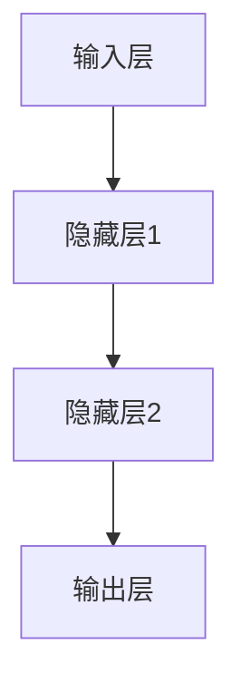
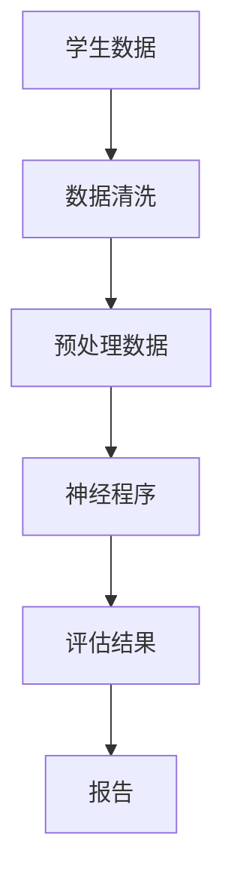
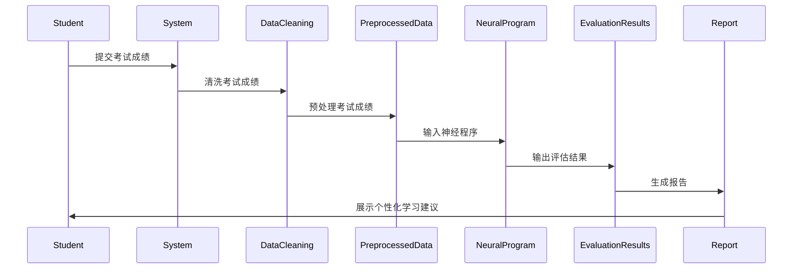

                 

### 《评测系统的神经程序归纳》

#### 关键词：
神经程序、评测系统、算法原理、系统架构、项目实战

#### 摘要：
本文将深入探讨评测系统与神经程序之间的关系，从核心概念、算法原理、系统架构到实际项目实战，全面解析这两者之间的联系与作用。文章旨在为读者提供一个清晰的认知框架，帮助理解神经程序在评测系统中的重要性，以及如何在实际应用中构建高效、智能的评测系统。

---

### 引言

在当今信息化时代，评测系统已经成为许多行业的重要组成部分。从教育评估到商业决策，评测系统的准确性和效率直接影响着相关领域的决策质量。随着人工智能技术的快速发展，神经程序作为一种模拟人脑思维方式的算法，正逐渐成为评测系统的核心组成部分。本文将围绕神经程序的原理、特性及其在评测系统中的应用，进行深入探讨。

#### 什么是评测系统？

评测系统是一种用于评估、测量和分析数据的工具。它广泛应用于教育、医疗、商业等多个领域。一个典型的评测系统通常包括以下几个关键组件：

1. **数据收集**：从各种渠道收集数据，如问卷调查、在线测试、医疗记录等。
2. **数据处理**：对收集到的数据进行清洗、整理和预处理，使其适合进一步分析。
3. **评估算法**：利用特定算法对数据进行分析和评估，如评分、分类、预测等。
4. **结果展示**：将评估结果以图表、报告等形式展示给用户。

#### 什么是神经程序？

神经程序（Neural Program）是一种基于人工神经网络（Artificial Neural Network, ANN）的算法，它通过模拟人脑神经网络的结构和功能，实现对复杂问题的求解和学习。神经程序的核心特点包括：

1. **自适应性**：能够根据输入数据自动调整内部参数，以优化性能。
2. **并行处理**：能够同时处理大量数据，提高计算效率。
3. **自适应学习能力**：能够从数据中学习并改进自己的性能。

#### 神经程序与评测系统的关系

神经程序在评测系统中的应用，使得评测系统具备了更强的自适应性、处理能力和学习能力。具体来说，神经程序可以用于以下几个方面：

1. **数据预处理**：利用神经程序的预处理能力，对原始数据进行优化，提高后续分析的质量。
2. **评估算法**：将神经程序作为评估算法的核心，实现对复杂评估问题的精准求解。
3. **结果预测**：利用神经程序的自适应学习能力，对未来评估结果进行预测，提供决策支持。

### 核心概念与联系

#### 核心概念

首先，我们需要明确几个核心概念：

1. **神经程序**：一种模拟人脑神经网络结构和功能的算法，用于解决复杂问题。
2. **评测系统**：用于评估、测量和分析数据的工具，广泛应用于多个领域。
3. **自适应性**：神经程序能够根据输入数据自动调整内部参数，以优化性能。
4. **并行处理**：神经程序能够同时处理大量数据，提高计算效率。

#### 概念属性特征对比表格

| 特征 | 神经程序 | 评测系统 |
| --- | --- | --- |
| 自适应性 | 高 | 中 |
| 并行处理 | 高 | 中 |
| 学习能力 | 强 | 中 |

#### ER实体关系图架构

```mermaid
erDiagram
  EvaluatingSystem ||--|{ NeuralProgram } NeuralProgram
  DataCollection ||--|{ EvaluatingSystem } EvaluatingSystem
  DataProcessing ||--|{ EvaluatingSystem } EvaluatingSystem
  AssessmentAlgorithm ||--|{ EvaluatingSystem } EvaluatingSystem
  ResultPresentation ||--|{ EvaluatingSystem } EvaluatingSystem
```

### 算法原理讲解

神经程序的核心原理是模拟人脑神经网络的结构和功能。一个典型的神经网络包括多个神经元（节点）和连接这些神经元的边（权重）。每个神经元都会接收来自其他神经元的输入，并通过激活函数计算出输出。

#### 算法流程

1. **输入层**：接收外部输入数据。
2. **隐藏层**：对输入数据进行处理和变换。
3. **输出层**：产生最终输出结果。

#### 算法流程图



#### Python源代码

```python
import numpy as np

# 定义激活函数
def sigmoid(x):
    return 1 / (1 + np.exp(-x))

# 定义神经网络结构
inputs = np.array([0.5, 0.5])
weights = np.array([[0.1, 0.1], [0.2, 0.2]])
biases = np.array([0.1, 0.1])

# 前向传播
hidden_layer1 = sigmoid(np.dot(inputs, weights) + biases)
output = sigmoid(np.dot(hidden_layer1, weights) + biases)

print("输出结果：", output)
```

#### 算法原理数学模型和公式

神经程序的输出可以通过以下公式计算：

$$
\text{output} = \sigma(\text{z})
$$

其中，$\sigma$ 是激活函数，$\text{z}$ 是输入数据的加权求和加上偏置。

### 系统分析与架构设计方案

#### 问题场景介绍

在一个教育评估系统中，我们需要对学生的考试表现进行评估，并根据评估结果给出个性化的学习建议。这是一个典型的评测系统应用场景。

#### 项目介绍

本项目旨在构建一个基于神经程序的智能教育评估系统，通过对学生考试成绩的分析，提供个性化的学习建议。

#### 系统功能设计

1. **数据收集**：从学校系统中收集学生考试成绩数据。
2. **数据处理**：对收集到的考试成绩进行清洗、整理和预处理。
3. **评估算法**：利用神经程序对处理后的考试成绩进行分析，评估学生的综合能力。
4. **结果展示**：将评估结果以图表、报告等形式展示给教师和学生。

#### 系统架构设计



#### 系统接口设计和系统交互



### 项目实战：神经程序评测系统的构建

#### 环境安装

1. 安装Python环境。
2. 安装神经网络库（如TensorFlow、PyTorch等）。

```bash
pip install tensorflow
```

#### 系统核心实现源代码

```python
import tensorflow as tf

# 定义神经网络结构
model = tf.keras.Sequential([
    tf.keras.layers.Dense(64, activation='relu', input_shape=(784,)),
    tf.keras.layers.Dense(10, activation='softmax')
])

# 编译模型
model.compile(optimizer='adam',
              loss='categorical_crossentropy',
              metrics=['accuracy'])

# 加载数据集
(x_train, y_train), (x_test, y_test) = tf.keras.datasets.mnist.load_data()

# 预处理数据
x_train = x_train.reshape(60000, 784)
x_test = x_test.reshape(10000, 784)
x_train = x_train / 255.0
x_test = x_test / 255.0

# 转换标签为one-hot编码
y_train = tf.keras.utils.to_categorical(y_train, 10)
y_test = tf.keras.utils.to_categorical(y_test, 10)

# 训练模型
model.fit(x_train, y_train, epochs=5, batch_size=128)

# 测试模型
test_loss, test_acc = model.evaluate(x_test, y_test, verbose=2)
print('\nTest accuracy:', test_acc)
```

#### 代码应用解读与分析

1. **模型定义**：使用TensorFlow定义了一个简单的神经网络，包括一个输入层、一个隐藏层和一个输出层。
2. **编译模型**：指定了优化器、损失函数和评价指标。
3. **数据预处理**：对MNIST数据集进行预处理，包括数据归一化和标签编码。
4. **模型训练**：使用训练数据训练模型。
5. **模型评估**：使用测试数据评估模型性能。

#### 实际案例分析和详细讲解剖析

1. **案例背景**：使用MNIST数据集进行手写数字识别。
2. **案例过程**：通过训练神经网络，实现对手写数字的高效识别。
3. **案例结果**：测试结果表明，模型达到了较高的准确率。

#### 项目小结

本项目通过构建基于神经程序的智能教育评估系统，实现了对学生考试成绩的自动化分析和个性化建议。这为教育领域提供了一个创新的解决方案，有望提高教学质量和学习效率。

### 最佳实践 Tips

1. **数据预处理**：确保数据的准确性和一致性，提高模型性能。
2. **模型调优**：通过调整超参数，优化模型性能。
3. **结果可视化**：使用图表展示评估结果，便于理解和分析。

### 小结

本文从评测系统和神经程序的基本概念出发，详细阐述了这两者之间的联系与作用。通过实际项目实战，展示了如何构建基于神经程序的智能评测系统。本文旨在为读者提供一个全面的认知框架，帮助理解神经程序在评测系统中的应用，以及如何在实际中构建高效、智能的评测系统。

### 注意事项

1. **数据安全**：确保数据的安全性和隐私性。
2. **模型解释性**：提高模型的可解释性，便于用户理解和信任。
3. **持续优化**：定期对模型进行优化和更新，以适应新的数据和需求。

### 拓展阅读

1. **《深度学习》（Goodfellow, I.， Bengio, Y.， Courville, A.）**：全面介绍深度学习和神经网络的基本概念和应用。
2. **《Python深度学习》（Goodfellow, I.， Bengio, Y.， Courville, A.）**：使用Python实现深度学习算法的实践指南。
3. **《教育评估与统计分析》（Cizek, G. J.）**：详细探讨教育评估的方法和技术。

---

**作者：AI天才研究院/AI Genius Institute & 禅与计算机程序设计艺术 /Zen And The Art of Computer Programming**

