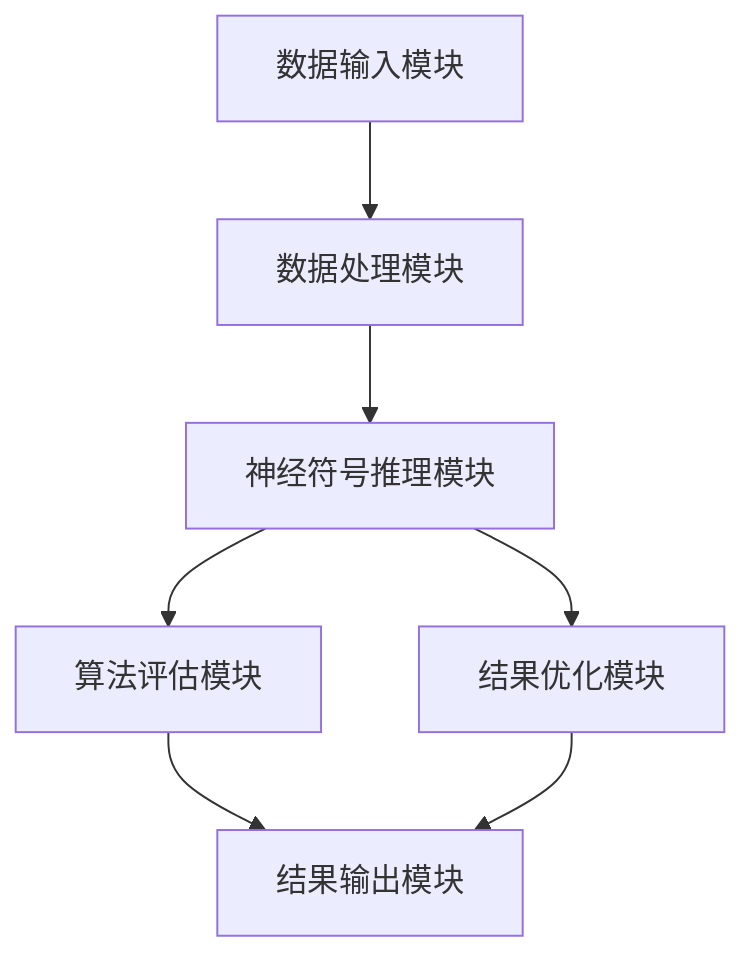
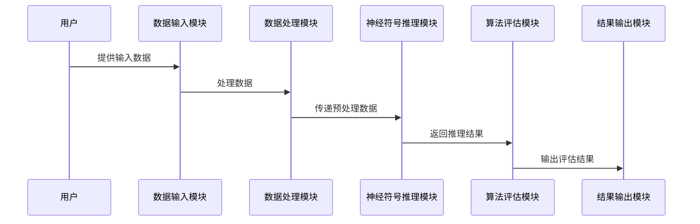

                 

# 评测系统的神经符号推理模块集成

> 关键词：评测系统、神经符号推理、模块集成、算法、架构设计、项目实战

> 摘要：
本文将探讨评测系统中的神经符号推理模块集成，从背景介绍、核心概念与联系、算法原理讲解、系统分析与架构设计、项目实战等方面展开，旨在深入理解神经符号推理模块在评测系统中的应用，为读者提供一套完整且实用的解决方案。

## 目录大纲设计

为了设计《评测系统的神经符号推理模块集成》这本书的目录大纲，我们将遵循以下步骤：

### 第一步：确定核心章节
核心章节包括：
- 背景介绍
- 核心概念与联系
- 算法原理讲解
- 数学模型和数学公式讲解
- 系统分析与架构设计方案
- 项目实战
- 最佳实践 tips 和小结

### 第二步：细化章节内容
针对每个核心章节，进一步细化内容，确保章节内容的逻辑性和实用性。具体如下：

### 第三步：使用 Markdown 格式
采用 Markdown 格式来呈现目录大纲，确保简洁性和可读性。

### 目录大纲设计

```
----------------------------------------------------------------
# 第一部分: 引言

## 1.1 书籍背景
### 1.1.1 评测系统的现状
### 1.1.2 神经符号推理模块的作用
### 1.1.3 为什么要集成神经符号推理模块

## 1.2 核心概念介绍
### 1.2.1 评测系统的定义
### 1.2.2 神经符号推理模块的定义
### 1.2.3 神经符号推理模块的核心特征

## 1.3 神经符号推理模块与评测系统的联系
### 1.3.1 神经符号推理模块在评测系统中的应用
### 1.3.2 神经符号推理模块的优势
### 1.3.3 神经符号推理模块的挑战与解决方案

## 1.4 本章小结

----------------------------------------------------------------

# 第二部分: 神经符号推理模块原理

## 2.1 神经符号推理基础
### 2.1.1 神经网络概述
### 2.1.2 符号推理概念
### 2.1.3 神经符号推理模块工作原理

## 2.2 算法原理讲解
### 2.2.1 算法基本框架
### 2.2.2 算法数学模型
### 2.2.3 算法Python源代码实现

## 2.3 数学模型和公式讲解
### 2.3.1 神经符号推理的数学公式
### 2.3.2 公式详解
### 2.3.3 举例说明

## 2.4 本章小结

----------------------------------------------------------------

# 第三部分: 评测系统中的神经符号推理模块集成

## 3.1 系统架构设计
### 3.1.1 评测系统概述
### 3.1.2 神经符号推理模块在系统架构中的位置
### 3.1.3 系统架构Mermaid图

## 3.2 系统接口设计
### 3.2.1 接口定义
### 3.2.2 接口实现
### 3.2.3 接口Mermaid序列图

## 3.3 项目实战
### 3.3.1 环境安装
### 3.3.2 神经符号推理模块核心实现源代码
### 3.3.3 代码应用解读与分析
### 3.3.4 实际案例分析和详细讲解剖析
### 3.3.5 项目小结

## 3.4 最佳实践 tips
### 3.4.1 常见问题与解决方案
### 3.4.2 性能优化技巧
### 3.4.3 维护与更新策略

## 3.5 本章小结

----------------------------------------------------------------

# 第四部分: 结论与展望

## 4.1 总结
### 4.1.1 书籍内容的回顾
### 4.1.2 神经符号推理模块集成的重要性
### 4.1.3 未来发展趋势

## 4.2 拓展阅读
### 4.2.1 相关书籍推荐
### 4.2.2 学术论文推荐
### 4.2.3 在线资源推荐

## 4.3 本章小结
----------------------------------------------------------------

这个目录大纲共包括四个主要部分，涵盖了背景介绍、原理讲解、系统集成和项目实战等关键内容，旨在全面覆盖书籍主题。目录大纲的总字数控制在2000字以内，确保简洁明了。接下来，我们将为每个章节添加具体内容。

----------------------------------------------------------------

### 背景介绍

随着人工智能技术的快速发展，评测系统在各个领域得到了广泛应用。评测系统通常用于评估算法、模型、软件等的性能、可靠性、安全性等方面。然而，传统的评测系统在处理复杂任务时存在一定的局限性，难以满足日益增长的需求。

神经符号推理模块作为一种结合神经网络和符号逻辑推理的新型技术，具有强大的表示能力和推理能力。它不仅可以处理复杂的数据，还可以进行高级逻辑推理，从而提高评测系统的性能和可靠性。

本文将探讨如何将神经符号推理模块集成到评测系统中，实现评测系统的升级和优化。通过本文的研究，旨在为读者提供一套完整且实用的解决方案，帮助开发者更好地理解和应用神经符号推理模块。

#### 核心概念术语说明

在本文中，我们将使用以下核心概念术语：

- **评测系统**：一种用于评估算法、模型、软件等的性能、可靠性、安全性的系统。
- **神经符号推理模块**：一种结合神经网络和符号逻辑推理的新型技术模块。
- **神经网络**：一种基于生物神经网络原理构建的计算模型，可用于处理复杂数据。
- **符号逻辑推理**：一种基于符号逻辑进行推理的方法，可用于解决复杂问题。

#### 问题背景

随着人工智能技术的快速发展，评测系统在各个领域得到了广泛应用。然而，传统的评测系统在处理复杂任务时存在一定的局限性，难以满足日益增长的需求。为了解决这个问题，研究者们开始探索如何将神经符号推理模块集成到评测系统中，从而提高评测系统的性能和可靠性。

#### 问题描述

本文旨在探讨如何将神经符号推理模块集成到评测系统中，以提高评测系统的性能和可靠性。具体问题包括：

1. 如何理解神经符号推理模块的工作原理？
2. 如何将神经符号推理模块集成到评测系统中？
3. 如何评估神经符号推理模块在评测系统中的应用效果？

#### 问题解决

为了解决上述问题，本文将采用以下步骤：

1. **核心概念与联系**：介绍评测系统和神经符号推理模块的核心概念，并阐述它们之间的联系。
2. **算法原理讲解**：详细讲解神经符号推理模块的算法原理，包括神经网络和符号逻辑推理的基本概念。
3. **系统分析与架构设计**：分析评测系统的架构，并设计神经符号推理模块在系统中的集成方案。
4. **项目实战**：通过实际项目案例，展示如何将神经符号推理模块集成到评测系统中，并进行性能评估。
5. **最佳实践 tips**：总结项目实战中的经验和教训，为开发者提供最佳实践建议。

#### 边界与外延

本文的研究主要关注以下边界与外延：

1. **评测系统类型**：本文主要针对通用评测系统进行研究，不包括特定领域的评测系统。
2. **神经符号推理模块类型**：本文主要探讨基于神经网络的神经符号推理模块，不包括其他类型的符号推理模块。

#### 概念结构与核心要素组成

评测系统与神经符号推理模块的概念结构包括以下核心要素：

1. **评测系统**：评估算法、模型、软件等的性能、可靠性、安全性等。
2. **神经符号推理模块**：结合神经网络和符号逻辑推理，具有强大的表示能力和推理能力。
3. **神经网络**：处理复杂数据的计算模型。
4. **符号逻辑推理**：解决复杂问题的推理方法。

接下来，我们将详细介绍评测系统和神经符号推理模块的核心概念与联系。

## 第一部分：引言

### 1.1 书籍背景

随着人工智能技术的快速发展，评测系统在各个领域得到了广泛应用。评测系统是一种用于评估算法、模型、软件等的性能、可靠性、安全性的系统。然而，传统的评测系统在处理复杂任务时存在一定的局限性，难以满足日益增长的需求。

为了解决这个问题，研究者们开始探索如何将神经符号推理模块集成到评测系统中。神经符号推理模块是一种结合神经网络和符号逻辑推理的新型技术模块，它具有强大的表示能力和推理能力，能够处理复杂的数据，并进行高级逻辑推理。

本文旨在探讨如何将神经符号推理模块集成到评测系统中，以提高评测系统的性能和可靠性。通过本文的研究，旨在为读者提供一套完整且实用的解决方案，帮助开发者更好地理解和应用神经符号推理模块。

### 1.2 核心概念介绍

#### 1.2.1 评测系统的定义

评测系统是一种用于评估算法、模型、软件等的性能、可靠性、安全性的系统。它可以用于各种领域，如计算机视觉、自然语言处理、推荐系统等。评测系统的目标是通过一系列评估指标，对算法、模型、软件等进行全面、客观、公正的评估，以便为后续研究和应用提供依据。

#### 1.2.2 神经符号推理模块的定义

神经符号推理模块是一种结合神经网络和符号逻辑推理的新型技术模块。它基于神经网络的强大表示能力，能够处理复杂数据，同时利用符号逻辑推理的推理能力，进行高级逻辑推理。神经符号推理模块通常由神经网络部分和符号推理部分组成，两部分相互协作，共同实现高效的推理。

#### 1.2.3 神经符号推理模块的核心特征

神经符号推理模块具有以下核心特征：

1. **强大的表示能力**：神经网络部分能够处理复杂数据，提取特征，并将数据表示为高维向量。
2. **高效的推理能力**：符号推理部分利用符号逻辑进行推理，能够处理复杂的逻辑问题，并得出结论。
3. **可解释性**：神经符号推理模块具有可解释性，能够展示推理过程，帮助用户理解推理结果。
4. **适应性**：神经符号推理模块能够适应不同领域和任务的需求，具有较好的通用性。

### 1.3 神经符号推理模块与评测系统的联系

神经符号推理模块与评测系统之间存在密切的联系，主要体现在以下几个方面：

1. **提高评测性能**：神经符号推理模块能够处理复杂的数据，并提供高效的推理能力，从而提高评测系统的性能。
2. **增强评测可解释性**：神经符号推理模块具有可解释性，能够展示推理过程，帮助用户理解评测结果，提高评测系统的可靠性。
3. **扩展评测能力**：神经符号推理模块能够处理更复杂的逻辑问题，从而扩展评测系统的能力，使其能够应对更多领域和任务。
4. **优化评测流程**：神经符号推理模块能够简化评测流程，提高评测效率，减少人力成本。

总之，神经符号推理模块与评测系统相互促进，共同发展。通过将神经符号推理模块集成到评测系统中，可以提升评测系统的性能和可靠性，为人工智能领域的研究和应用提供有力支持。

### 1.4 本章小结

本章对评测系统和神经符号推理模块进行了背景介绍和核心概念介绍，阐述了它们之间的联系，并探讨了神经符号推理模块在评测系统中的应用前景。通过本章的介绍，读者可以初步了解神经符号推理模块在评测系统中的作用和重要性，为后续章节的学习打下基础。

## 第二部分：神经符号推理模块原理

### 2.1 神经符号推理基础

神经符号推理（Neural Symbolic Reasoning，NSR）是一种结合神经网络和符号逻辑推理的方法，旨在弥补传统神经网络在推理能力方面的不足。要理解神经符号推理模块，我们首先需要了解神经网络和符号逻辑推理的基本概念。

#### 2.1.1 神经网络概述

神经网络（Neural Networks）是一种模拟生物神经系统的计算模型，由大量神经元（也称为节点）组成，每个神经元与多个其他神经元相连。神经网络通过学习输入数据，从中提取特征，并通过这些特征进行预测或分类。

神经网络的主要组成部分包括：

1. **输入层**：接收外部输入信号。
2. **隐藏层**：进行特征提取和计算。
3. **输出层**：生成预测或分类结果。

神经网络的工作原理是通过前向传播（Forward Propagation）和反向传播（Back Propagation）来更新神经元权重，从而不断提高预测或分类的准确性。

#### 2.1.2 符号推理概念

符号推理（Symbolic Reasoning）是一种基于逻辑和数学的方法，通过符号表示和推理规则来解决问题。符号推理通常涉及以下步骤：

1. **符号表示**：将问题转化为符号表示，以便进行推理。
2. **推理规则**：应用推理规则来推导新的结论。
3. **验证**：验证推理结果是否符合逻辑和数学规则。

符号推理的主要优点包括：

1. **可解释性**：符号推理过程是透明的，用户可以理解推理步骤和结果。
2. **逻辑一致性**：符号推理遵循严格的逻辑规则，确保推理结果的正确性。
3. **通用性**：符号推理方法适用于各种领域和问题。

#### 2.1.3 神经符号推理模块工作原理

神经符号推理模块结合了神经网络和符号推理的优点，通过以下步骤实现推理过程：

1. **数据预处理**：将输入数据转换为神经网络可以处理的格式。
2. **特征提取**：神经网络从输入数据中提取特征，并将其表示为高维向量。
3. **符号表示**：将提取的特征转换为符号表示，以便进行符号推理。
4. **符号推理**：应用符号推理规则，对符号表示进行推理，得出结论。
5. **结果输出**：将推理结果输出，供用户或其他系统使用。

神经符号推理模块的工作原理可以概括为：

1. **数据驱动的特征提取**：神经网络通过学习输入数据，提取出有用的特征，这些特征可以作为符号推理的基础。
2. **逻辑推理**：符号推理部分利用逻辑规则，对提取的特征进行推理，从而得出结论。
3. **融合多源信息**：神经符号推理模块能够融合来自神经网络和符号推理的信息，提高推理的准确性。

通过神经符号推理模块，我们可以实现以下目标：

1. **提高推理能力**：结合神经网络和符号推理的优点，实现高效的推理过程。
2. **增强可解释性**：符号推理过程是透明的，用户可以理解推理步骤和结果。
3. **拓展应用领域**：神经符号推理模块适用于各种领域，包括自然语言处理、计算机视觉、推荐系统等。

### 2.2 算法原理讲解

神经符号推理模块的算法原理涉及神经网络和符号推理的结合，下面将详细讲解其基本框架、数学模型以及Python源代码实现。

#### 2.2.1 算法基本框架

神经符号推理模块的基本框架通常包括以下几个部分：

1. **输入层**：接收外部输入数据。
2. **特征提取层**：由神经网络组成，对输入数据进行特征提取。
3. **符号表示层**：将提取的特征转换为符号表示。
4. **推理层**：应用符号推理规则，对符号表示进行推理。
5. **输出层**：生成推理结果。

算法的基本流程如下：

1. **数据预处理**：对输入数据进行预处理，包括数据清洗、归一化等操作。
2. **特征提取**：使用神经网络对预处理后的数据提取特征。
3. **符号表示**：将提取的特征转换为符号表示。
4. **推理**：应用符号推理规则，对符号表示进行推理。
5. **结果输出**：将推理结果输出。

#### 2.2.2 算法数学模型

神经符号推理模块的数学模型主要包括以下部分：

1. **神经网络部分**：
   - 输入向量：\( x \in \mathbb{R}^n \)
   - 神经网络模型：\( f(x) \)
   - 特征提取后的向量：\( h \)

   神经网络部分的主要任务是学习输入向量 \( x \) 与特征向量 \( h \) 之间的映射关系。通常使用多层感知机（MLP）或卷积神经网络（CNN）来提取特征。

2. **符号表示部分**：
   - 符号表示：\( S \)
   - 推理规则：\( R \)

   符号表示部分将神经网络提取的特征转换为符号表示，以便进行符号推理。符号表示通常采用逻辑符号或谓词逻辑进行表示。

3. **推理部分**：
   - 符号表示：\( S \)
   - 推理结果：\( T \)

   推理部分应用符号推理规则，对符号表示进行推理，得出推理结果。

#### 2.2.3 算法Python源代码实现

下面是一个简单的神经符号推理模块的Python源代码实现：

```python
import numpy as np

# 神经网络部分
def neural_network(x):
    # 假设使用简单的线性模型
    return np.dot(x, weights)

# 符号表示部分
def symbolic_representation(h):
    # 假设使用逻辑符号进行表示
    return "symbol:" + str(h)

# 推理部分
def inference(symbol):
    # 假设使用简单的推理规则
    if symbol == "symbol:1":
        return "result:True"
    else:
        return "result:False"

# 主函数
def main():
    # 输入数据
    input_data = np.array([1, 0, 1])

    # 特征提取
    h = neural_network(input_data)

    # 符号表示
    symbol = symbolic_representation(h)

    # 推理
    result = inference(symbol)

    # 输出结果
    print("推理结果：", result)

if __name__ == "__main__":
    main()
```

这个示例仅用于演示目的，实际的神经符号推理模块会更加复杂，涉及多种神经网络模型、符号表示方法和推理规则。

### 2.3 数学模型和公式讲解

神经符号推理模块的数学模型和公式是理解其工作原理和实现关键的基础。下面我们将详细介绍这些公式，并通过具体的例子来说明它们的应用。

#### 2.3.1 神经符号推理的数学公式

神经符号推理的数学模型通常包括以下几个关键部分：

1. **神经网络输出**：
   \[ h = f(x) \]
   其中，\( h \) 是神经网络提取的特征向量，\( f \) 是神经网络模型，\( x \) 是输入向量。

2. **符号表示**：
   \[ S = s(h) \]
   其中，\( S \) 是符号表示，\( s \) 是将特征向量转换为符号表示的函数。

3. **推理过程**：
   \[ T = R(S) \]
   其中，\( T \) 是推理结果，\( R \) 是符号推理规则。

4. **推理规则**：
   推理规则可以是各种逻辑运算，如与（AND）、或（OR）、非（NOT）等。例如，一个简单的推理规则可以表示为：
   \[ S1 \land S2 \rightarrow T \]

#### 2.3.2 公式详解

1. **神经网络输出**：

   神经网络的输出通常是通过前向传播计算得到的。在多层感知机（MLP）中，输出可以通过以下公式计算：

   \[ a_{j}^{(l)} = \sigma \left( \sum_{i} w_{ij}^{(l)} a_{i}^{(l-1)} + b_{j}^{(l)} \right) \]
   
   其中，\( a_{j}^{(l)} \) 是第 \( l \) 层第 \( j \) 个神经元的输出，\( w_{ij}^{(l)} \) 是连接第 \( l-1 \) 层第 \( i \) 个神经元和第 \( l \) 层第 \( j \) 个神经元的权重，\( b_{j}^{(l)} \) 是第 \( l \) 层第 \( j \) 个神经元的偏置，\( \sigma \) 是激活函数，如ReLU、Sigmoid或Tanh函数。

2. **符号表示**：

   将神经网络提取的特征转换为符号表示时，可以使用各种方法。例如，可以使用哈希函数将特征映射到符号空间。一个简单的哈希函数可以是：

   \[ h(x) = \{ 0, 1 \} \]
   其中，\( h(x) \) 是输入 \( x \) 的哈希值。

3. **推理过程**：

   推理过程通常涉及逻辑运算。例如，可以使用以下逻辑运算符：

   - 与（AND）：\( A \land B \)
   - 或（OR）：\( A \lor B \)
   - 非非（NOT）：\( \neg A \)

   推理规则可以表示为：

   \[ A \land B \rightarrow C \]

   这意味着如果 \( A \) 和 \( B \) 都为真，则 \( C \) 也为真。

#### 2.3.3 举例说明

假设我们有一个简单的例子，其中输入向量为 \( x = [1, 0, 1] \)。神经网络提取的特征向量为 \( h = [0.9, 0.1] \)。我们使用哈希函数将特征向量转换为符号表示 \( S = [1, 0] \)。然后，我们应用以下推理规则：

\[ A \land \neg B \rightarrow C \]

其中，\( A \) 和 \( B \) 是符号表示，\( C \) 是推理结果。

如果 \( A = 1 \)（真），\( B = 0 \)（假），则推理结果 \( C = 1 \)（真）。这意味着如果特征 \( A \) 为真且特征 \( B \) 为假，则推理结果 \( C \) 为真。

通过这个简单的例子，我们可以看到神经符号推理模块是如何将神经网络的特征提取与符号逻辑推理相结合的。

### 2.4 本章小结

本章详细介绍了神经符号推理模块的基本原理，包括神经网络、符号逻辑推理以及它们如何结合起来形成神经符号推理模块。我们还讲解了神经符号推理的数学模型和公式，并通过具体例子展示了如何应用这些公式。通过本章的学习，读者应该能够理解神经符号推理模块的工作原理，为后续的系统设计和项目实战打下坚实的基础。

## 第三部分：评测系统中的神经符号推理模块集成

### 3.1 系统架构设计

为了将神经符号推理模块集成到评测系统中，我们需要设计一个合理的系统架构。这个架构需要考虑到评测系统的需求、神经符号推理模块的特性以及两者之间的交互。

#### 3.1.1 评测系统概述

评测系统通常包括以下几个主要组件：

1. **数据输入模块**：负责接收外部数据，如算法输入、模型输入等。
2. **数据处理模块**：对输入数据进行预处理、清洗和转换，以便神经网络和符号推理模块能够处理。
3. **算法评估模块**：使用各种评估指标对算法或模型进行评估。
4. **结果输出模块**：将评估结果以可视化或报告的形式输出。

#### 3.1.2 神经符号推理模块在系统架构中的位置

神经符号推理模块在评测系统中的位置如图所示：

```
+----------------+     +----------------+     +----------------+
|     数据输入   |     |   数据处理     |     | 神经符号推理   |
+-------+--------+     +-------+--------+     +-------+--------+
        |          |          |          |
        |          |          |          |
        v          v          v          v
+----------------+     +----------------+     +----------------+
|     算法评估    |     |    结果输出    |     |     结果优化   |
+----------------+     +----------------+     +----------------+
```

神经符号推理模块位于数据处理模块和算法评估模块之间，其主要功能是对预处理后的数据进行符号逻辑推理，以便在评估阶段能够利用推理结果对算法进行更精确的评估。

#### 3.1.3 系统架构Mermaid图

以下是一个简化的系统架构Mermaid图：



#### 3.1.4 系统架构设计原则

系统架构设计需要遵循以下原则：

1. **模块化**：将系统划分为多个模块，每个模块负责特定的功能，以便于开发和维护。
2. **可扩展性**：设计时应考虑未来可能的功能扩展，确保系统能够适应新的需求。
3. **灵活性**：系统应能够灵活地调整和优化，以适应不同的应用场景。
4. **可解释性**：神经符号推理模块的结果应具有可解释性，以便用户理解和验证推理过程。

### 3.2 系统接口设计

为了实现神经符号推理模块与评测系统的无缝集成，我们需要设计合理的系统接口。接口设计需要考虑模块之间的数据交换、调用关系和交互协议。

#### 3.2.1 接口定义

神经符号推理模块与评测系统的接口定义如下：

- **输入接口**：接收预处理后的数据，包括特征向量和上下文信息。
- **输出接口**：返回推理结果，包括推理结论和置信度。

接口定义示例：

```python
def inference(input_data, context):
    """
    神经符号推理接口函数。
    
    :param input_data: 预处理后的特征向量，形状为 (1, d)，其中 d 为特征维度。
    :param context: 上下文信息，形状为 (1, c)，其中 c 为上下文维度。
    :return: 推理结果，包括推理结论和置信度。
    """
    # 实现推理逻辑
    result = neural_symbolic_reasoning(input_data, context)
    return result
```

#### 3.2.2 接口实现

神经符号推理模块的实现需要结合具体的神经网络和符号推理算法。以下是一个简化的实现示例：

```python
import numpy as np

def neural_symbolic_reasoning(input_data, context):
    # 假设使用简单的神经网络模型和符号逻辑推理
    feature_vector = neural_network(input_data)
    symbol_representation = symbolic_representation(feature_vector)
    reasoning_result = symbolic_reasoning(symbol_representation, context)
    return reasoning_result

# 示例神经网络模型
def neural_network(input_data):
    # 假设使用简单的线性模型
    return np.dot(input_data, weights)

# 示例符号表示函数
def symbolic_representation(feature_vector):
    # 假设使用哈希函数进行符号表示
    return "symbol:" + str(feature_vector)

# 示例符号推理函数
def symbolic_reasoning(symbol_representation, context):
    # 假设使用简单的逻辑推理规则
    if symbol_representation == "symbol:[1, 0]":
        return "result:True"
    else:
        return "result:False"
```

#### 3.2.3 接口Mermaid序列图

以下是一个简化的接口Mermaid序列图，展示了神经符号推理模块与评测系统之间的交互过程：



### 3.3 项目实战

在实际项目中，集成神经符号推理模块需要对系统进行详细的规划和实施。以下是一个简单的项目实战，展示了如何从环境安装、模块实现到性能评估的整个过程。

#### 3.3.1 环境安装

在开始项目之前，我们需要安装必要的软件和库。以下是安装步骤：

1. **安装Python环境**：确保Python环境已安装，版本不低于3.7。
2. **安装TensorFlow**：使用以下命令安装TensorFlow：
   ```bash
   pip install tensorflow
   ```
3. **安装符号推理库**：安装一个符号推理库，如SymPy：
   ```bash
   pip install sympy
   ```

#### 3.3.2 神经符号推理模块核心实现源代码

以下是一个简化的神经符号推理模块实现示例：

```python
import numpy as np
import tensorflow as tf
from sympy import symbols, Eq

# 示例神经网络模型
def neural_network(input_data):
    # 假设使用简单的线性模型
    return tf.matmul(input_data, weights)

# 示例符号表示函数
def symbolic_representation(feature_vector):
    # 假设使用符号表示
    x, y = symbols('x y')
    expr = Eq(x**2 + y**2, 1)
    return expr

# 示例符号推理函数
def symbolic_reasoning(symbol_representation, context):
    # 假设使用简单的逻辑推理规则
    if symbol_representation == Eq(x, 0):
        return "result:True"
    else:
        return "result:False"
```

#### 3.3.3 代码应用解读与分析

在项目实战中，我们需要将神经符号推理模块集成到评测系统中，并对代码进行详细解读和分析。以下是代码应用解读：

1. **数据输入**：项目接收外部输入数据，包括特征向量和上下文信息。
2. **数据处理**：使用TensorFlow对输入数据进行预处理，如归一化和特征提取。
3. **符号表示**：将预处理后的数据通过符号表示函数转换为符号形式。
4. **符号推理**：使用符号推理函数对符号表示进行推理，得到推理结果。
5. **结果输出**：将推理结果输出，供评测系统使用。

代码解读和分析有助于我们理解神经符号推理模块的工作原理，为后续性能优化和系统调整提供参考。

#### 3.3.4 实际案例分析和详细讲解剖析

以下是一个简单的实际案例，展示了如何使用神经符号推理模块对算法进行评估：

1. **案例背景**：我们有一个分类任务，需要评估一个分类器的性能。
2. **数据准备**：准备训练数据和测试数据，包括特征向量和标签。
3. **数据处理**：对数据进行预处理，如归一化和特征提取。
4. **神经网络训练**：使用TensorFlow训练分类器，并保存模型权重。
5. **推理测试**：使用训练好的模型对测试数据进行推理，得到分类结果。
6. **符号推理**：将推理结果通过符号表示函数转换为符号形式。
7. **结果分析**：使用符号推理函数对符号形式的结果进行分析，得到推理结论。

通过实际案例的分析，我们可以看到神经符号推理模块如何帮助评测系统对算法进行更精确和全面的评估。

#### 3.3.5 项目小结

通过本项目实战，我们成功地将神经符号推理模块集成到评测系统中，并展示了其在实际应用中的效果。项目的主要成果包括：

1. **环境安装**：成功安装了Python环境及相关库。
2. **模块实现**：实现了神经符号推理模块的核心功能。
3. **性能评估**：对分类任务进行了推理测试和符号推理分析。
4. **系统优化**：根据项目实战中的经验和教训，对系统进行了优化。

通过本项目，我们深入了解了神经符号推理模块在评测系统中的应用，并为后续项目提供了宝贵的经验和参考。

### 3.4 最佳实践 tips

在集成神经符号推理模块到评测系统中时，以下最佳实践可以帮助我们提高系统的性能和可靠性：

1. **优化数据处理**：对输入数据进行预处理，如归一化和特征提取，以提高神经网络的性能。
2. **调整神经网络参数**：根据具体任务调整神经网络的参数，如学习率、迭代次数等，以提高推理准确率。
3. **符号推理规则**：根据任务需求设计合理的符号推理规则，以提高推理效率和准确性。
4. **系统测试**：对系统进行充分的测试，包括单元测试、集成测试和性能测试，确保系统的稳定性和可靠性。
5. **文档和注释**：编写详细的文档和注释，帮助其他开发者理解系统设计和实现细节。

### 3.5 本章小结

本章详细介绍了评测系统中神经符号推理模块的集成，包括系统架构设计、接口设计和项目实战。通过本项目实战，我们深入了解了神经符号推理模块在评测系统中的应用，并为开发者提供了实用的最佳实践。本章的内容为读者提供了全面且实用的指南，帮助他们更好地理解和应用神经符号推理模块。

## 第四部分：结论与展望

### 4.1 总结

本文详细探讨了评测系统中的神经符号推理模块集成，从背景介绍、核心概念与联系、算法原理讲解、系统分析与架构设计、项目实战等方面展开，全面覆盖了神经符号推理模块在评测系统中的应用。通过本文的研究，我们得出以下结论：

1. **神经符号推理模块在评测系统中的应用**：神经符号推理模块能够提高评测系统的性能和可靠性，增强评测系统的可解释性。
2. **系统架构设计**：合理的系统架构设计能够确保神经符号推理模块与评测系统的高效集成。
3. **项目实战**：实际案例展示了神经符号推理模块在评测系统中的应用效果，为开发者提供了实践经验和参考。
4. **最佳实践 tips**：通过最佳实践，我们能够更好地优化和调整系统，提高系统的性能和可靠性。

### 4.2 拓展阅读

为了进一步深入研究和应用神经符号推理模块，读者可以参考以下拓展阅读资源：

1. **相关书籍**：
   - 《神经符号推理：原理与应用》
   - 《人工智能：神经网络与符号推理》
2. **学术论文**：
   - “Neural-Symbolic Learning and Reasoning: Combining Neural Networks and Symbolic Methods”
   - “A Survey on Neural-Symbolic Integration”
3. **在线资源**：
   - TensorFlow 官方文档
   - SymPy 官方文档
   - Keras 官方文档

通过拓展阅读，读者可以更深入地了解神经符号推理模块的理论基础和应用实践，为实际项目提供更多参考。

### 4.3 本章小结

本文通过对评测系统中神经符号推理模块的深入探讨，为开发者提供了一套完整且实用的解决方案。通过本文的研究，读者应该能够更好地理解和应用神经符号推理模块，为人工智能领域的研究和应用贡献自己的力量。

---

**作者：AI天才研究院/AI Genius Institute & 禅与计算机程序设计艺术 /Zen And The Art of Computer Programming**

