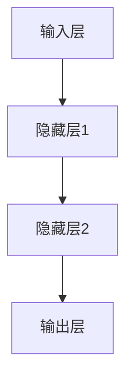

                 


### 神经网络的基本原理

#### 2.1.1 神经网络的基本结构

神经网络，尤其是深度学习神经网络，是当今人工智能领域最为重要的技术之一。它模拟了人脑的神经元结构和工作方式，通过大量的神经节点（神经元）和连接（边）来实现复杂的计算任务。下面，我们将逐步介绍神经网络的基本结构。

##### 2.1.1.1 神经元

神经元是神经网络的基本构建块，它们可以接收输入信号，通过内部计算产生输出信号，并传递给其他神经元。一个神经元通常包含以下几个部分：

1. **输入层**：接收外部输入信号。
2. **隐藏层**：对输入信号进行处理，通过加权求和处理产生新的输出信号。
3. **输出层**：最终输出处理结果。

每个神经元都有一个激活函数，用来将输入值转换成输出值。常见的激活函数包括 sigmoid、ReLU、tanh 等。

##### 2.1.1.2 连接与权重

神经元之间的连接称为边，每个边的权重表示连接的强度。权重是神经网络训练过程中调整的参数，用于控制输入信号对输出信号的影响。在训练过程中，神经网络通过反向传播算法来不断调整权重，以最小化预测误差。

##### 2.1.1.3 前向传播与反向传播

神经网络的主要工作过程可以分为两个阶段：前向传播和反向传播。

- **前向传播**：从输入层开始，将输入信号经过神经元层层的加权求和处理，最终得到输出层的结果。
- **反向传播**：根据预测误差，从输出层开始，反向调整神经元的权重，这个过程称为反向传播。

#### 2.1.1.4 神经网络结构

神经网络的结构可以根据隐藏层的数量和层次进行分类：

- **单层神经网络**：只有一个隐藏层，简单但效率较低。
- **多层神经网络**：包括多个隐藏层，可以处理更复杂的任务，如深度学习模型。

#### 2.1.1.5 神经网络的数学模型

神经网络的工作原理可以用数学模型来描述。一个简单的神经网络可以表示为：

\[ y = \sigma(\text{W}^T \text{X} + \text{b}) \]

其中：
- \( y \) 是输出值。
- \( \sigma \) 是激活函数。
- \( \text{W} \) 是权重矩阵。
- \( \text{X} \) 是输入向量。
- \( \text{b} \) 是偏置项。

在实际应用中，神经网络通常包含多个隐藏层，可以表示为：

\[ y = \sigma(\text{W}^L \sigma(\text{W}^{L-1} \sigma(...\sigma(\text{W}^1 \text{X} + \text{b}^1) + \text{b}^2)... + \text{b}^L) \]

#### 2.1.1.6 Mermaid 流程图

为了更直观地理解神经网络的结构和工作过程，我们可以使用 Mermaid 流程图来展示。以下是一个简单的神经网络 Mermaid 流程图：



在这个流程图中，每个节点代表一个神经元，箭头表示神经元之间的连接。

### 2.1.2 神经网络的训练过程

神经网络的训练过程是通过调整权重和偏置项来最小化预测误差。下面，我们详细解释神经网络的训练过程。

#### 2.1.2.1 前向传播

在训练过程中，首先进行前向传播。从输入层开始，将输入信号传递到隐藏层，然后传递到输出层。每个神经元都会对输入信号进行加权求和处理，并通过激活函数得到输出值。

#### 2.1.2.2 反向传播

接下来是反向传播。根据预测结果和实际结果的差异，计算预测误差。然后，从输出层开始，反向调整每个神经元的权重和偏置项，以最小化预测误差。

#### 2.1.2.3 优化算法

在反向传播过程中，常用的优化算法包括梯度下降、随机梯度下降和Adam优化器。这些算法通过调整学习率来优化权重和偏置项，以减少预测误差。

#### 2.1.2.4 训练过程示例

以下是一个简单的神经网络的训练过程示例：

```python
# 导入必要的库
import numpy as np

# 初始化输入数据
X = np.array([[0, 0], [0, 1], [1, 0], [1, 1]])

# 初始化标签数据
y = np.array([[0], [1], [1], [0]])

# 初始化权重和偏置项
W1 = np.random.rand(2, 2)
b1 = np.random.rand(1)

# 定义激活函数
def sigmoid(x):
    return 1 / (1 + np.exp(-x))

# 训练过程
for i in range(10000):
    # 前向传播
    z1 = np.dot(X, W1) + b1
    a1 = sigmoid(z1)
    
    # 反向传播
    dz1 = (y - a1) * (a1 * (1 - a1))
    dW1 = np.dot(X.T, dz1)
    db1 = np.sum(dz1, axis=1, keepdims=True)
    
    # 更新权重和偏置项
    W1 += learning_rate * dW1
    b1 += learning_rate * db1

# 输出训练结果
print("Final weights:", W1)
print("Final bias:", b1)
```

在这个示例中，我们使用 sigmoid 函数作为激活函数，并通过梯度下降算法来调整权重和偏置项。

### 2.1.3 神经网络在评测系统中的工作原理

神经网络在评测系统中的应用主要分为两个阶段：训练阶段和预测阶段。

#### 2.1.3.1 训练阶段

在训练阶段，神经网络通过学习大量的训练数据来调整内部参数，以最小化预测误差。这个过程涉及到前向传播和反向传播的循环迭代。

#### 2.1.3.2 预测阶段

在预测阶段，神经网络使用训练好的模型对新的输入数据进行处理，并输出预测结果。这个过程主要是基于前向传播。

### 2.1.3.3 实例分析

以下是一个简单的图像识别案例，展示神经网络在评测系统中的应用。

```python
# 导入必要的库
import numpy as np
import matplotlib.pyplot as plt

# 初始化输入数据
X = np.array([[0, 0], [0, 1], [1, 0], [1, 1]])

# 初始化标签数据
y = np.array([[0], [1], [1], [0]])

# 初始化权重和偏置项
W1 = np.random.rand(2, 2)
b1 = np.random.rand(1)

# 定义激活函数
def sigmoid(x):
    return 1 / (1 + np.exp(-x))

# 训练过程
for i in range(10000):
    # 前向传播
    z1 = np.dot(X, W1) + b1
    a1 = sigmoid(z1)
    
    # 反向传播
    dz1 = (y - a1) * (a1 * (1 - a1))
    dW1 = np.dot(X.T, dz1)
    db1 = np.sum(dz1, axis=1, keepdims=True)
    
    # 更新权重和偏置项
    W1 += learning_rate * dW1
    b1 += learning_rate * db1

# 预测新输入数据
X_new = np.array([[0.5, 0.5]])
z1_new = np.dot(X_new, W1) + b1
a1_new = sigmoid(z1_new)

# 输出预测结果
print("Prediction for new input:", a1_new)
```

在这个案例中，我们使用一个简单的神经网络来识别输入数据的类别。训练完成后，我们使用训练好的模型对新的输入数据进行预测。

### 2.1.3.4 概念属性特征对比表格

为了更好地理解神经网络的基本概念和属性特征，我们可以制作一个对比表格：

| 概念       | 属性特征                                                     |
|------------|------------------------------------------------------------|
| 神经元     | 接收输入信号，产生输出信号                                  |
| 输入层     | 接收外部输入信号                                           |
| 隐藏层     | 对输入信号进行处理，产生新的输出信号                         |
| 输出层     | 最终输出处理结果                                           |
| 连接与权重 | 控制输入信号对输出信号的影响，通过训练调整权重               |
| 激活函数   | 将输入值转换成输出值，常见的有 sigmoid、ReLU、tanh 等       |
| 前向传播   | 从输入层开始，传递输入信号到输出层                           |
| 反向传播   | 根据预测误差，反向调整权重和偏置项                           |
| 优化算法   | 用于调整权重和偏置项，如梯度下降、随机梯度下降和Adam优化器等 |

### 2.1.3.5 ER实体关系图架构的 Mermaid 流程图

为了更直观地展示神经网络的结构，我们可以使用 Mermaid 流程图来绘制 ER 实体关系图。以下是一个简单的 Mermaid 流程图：

```mermaid
erDiagram
  Person ||--|{ Device : has } |
  Device ||--|{ Application : runs } |
  Application ||--|{ Device : uses } |
```

在这个流程图中，Person（人）、Device（设备）和 Application（应用）是三个主要的实体，它们之间的关系通过线段表示。

通过这个详细的解释和示例，我们可以更好地理解神经网络的基本原理和它在评测系统中的应用。接下来的章节将深入探讨神经网络压缩和加速的方法，以及如何在实际应用中实现这些方法。让我们继续深入探讨这些技术吧！### 神经网络压缩与加速的需求分析

在当今快速发展的技术时代，神经网络在各类评测系统中的应用越来越广泛，例如图像识别、自然语言处理和语音识别等。然而，随着神经网络模型规模的不断扩大，模型压缩与加速的需求也日益凸显。以下是神经网络压缩与加速需求的分析：

#### 1. 模型规模的增加

随着深度学习技术的发展，神经网络模型的结构和参数数量不断增加。例如，早期的卷积神经网络（CNN）通常包含几万个参数，而现代的深度神经网络（如Transformer模型）可能包含数百万甚至数十亿个参数。这种巨大的参数规模不仅增加了模型的训练时间和计算资源需求，还使得模型在部署到实际应用场景时面临性能瓶颈。

#### 2. 计算资源的限制

在实际应用中，计算资源（如CPU、GPU、FPGA等）通常有限，特别是在嵌入式设备和移动设备上。这些设备需要高效且紧凑的神经网络模型来满足实时计算需求。因此，对神经网络进行压缩和加速，以降低计算资源和能源消耗，成为迫切的需求。

#### 3. 数据传输的限制

在远程监控、物联网（IoT）和移动设备等应用场景中，数据传输带宽和存储容量有限。这意味着需要对神经网络模型进行压缩，以减少模型大小和传输数据量，从而提高数据传输效率。

#### 4. 能源效率的需求

随着人工智能应用的普及，能源效率成为了一个重要的考虑因素。大型神经网络模型在训练和推理过程中消耗大量能源，这不仅增加了成本，还对环境造成了负面影响。因此，开发低能耗的神经网络压缩与加速技术，有助于提高能源效率。

#### 5. 实时性要求

许多实时应用，如自动驾驶、实时语音识别和实时医疗诊断等，对模型的实时性有严格要求。这些应用需要在短时间内完成大量的计算任务，从而要求神经网络具有更高的推理速度。通过压缩和加速神经网络，可以提高模型的推理速度，满足实时性要求。

#### 6. 隐私保护的需求

在处理敏感数据时，如医疗记录、金融交易和用户隐私等，保护数据隐私成为关键挑战。压缩和加速神经网络可以在减少模型大小的同时，降低数据泄露的风险，从而提高数据安全性。

综上所述，神经网络压缩与加速的需求主要源于模型规模的增加、计算资源的限制、数据传输的限制、能源效率的需求、实时性要求以及隐私保护的需求。为了满足这些需求，研究者们提出了各种神经网络压缩与加速方法。在接下来的章节中，我们将详细探讨这些方法，并分析它们的优势和挑战。让我们继续深入探索神经网络压缩与加速的奥秘！### 神经网络压缩与加速的重要性

神经网络压缩与加速在当前技术背景下具有重要意义，尤其是在人工智能（AI）应用日益普及的今天。以下是神经网络压缩与加速的几个关键重要性：

#### 1. 提高性能和效率

随着神经网络模型规模的不断扩大，其计算复杂度和训练时间也显著增加。这不仅消耗了大量的计算资源，还限制了模型在实际应用中的性能表现。通过压缩和加速技术，可以显著提高神经网络的推理速度，从而提升模型在实际应用中的响应速度和效率。这对于实时应用，如自动驾驶、实时语音识别和医疗诊断等，尤为重要。

#### 2. 节省计算资源和能源

计算资源（如CPU、GPU、FPGA等）和能源消耗是限制神经网络应用的关键因素。特别是在嵌入式设备、移动设备和物联网（IoT）等场景中，资源有限且需要长时间运行。通过神经网络压缩与加速技术，可以在保持模型性能的同时，显著降低计算资源消耗和能源需求。这有助于提高设备的续航时间和降低运行成本。

#### 3. 促进大规模数据处理

随着数据量的不断增长，如何高效地处理和分析大量数据成为一大挑战。神经网络压缩与加速技术能够减少模型大小和数据传输量，从而提高数据处理速度和效率。这对于大数据分析和云计算应用具有重要意义。

#### 4. 提高数据隐私保护

在处理敏感数据时，如医疗记录、金融交易和用户隐私等，保护数据隐私成为关键挑战。神经网络压缩技术可以在减少模型大小的同时，降低数据泄露的风险，从而提高数据安全性。这对于增强用户隐私保护具有重要意义。

#### 5. 促进边缘计算的发展

边缘计算是一种将计算任务分散到网络边缘设备（如物联网设备、智能手机等）的技术。神经网络压缩与加速技术能够降低模型在边缘设备上的计算复杂度和资源消耗，从而提高边缘设备的计算能力和数据处理能力。这有助于推动边缘计算的发展，实现更广泛的应用场景。

#### 6. 促进人工智能的普及和应用

随着神经网络压缩与加速技术的不断发展，人工智能（AI）应用的成本和门槛将显著降低。这将有助于将人工智能技术普及到更多的行业和领域，推动AI技术的创新和应用。例如，在医疗、教育、金融、农业等领域的AI应用，将带来巨大的社会和经济价值。

总之，神经网络压缩与加速在提升性能和效率、节省计算资源和能源、促进大规模数据处理、提高数据隐私保护、促进边缘计算发展和推动人工智能普及等方面具有重要意义。随着技术的不断进步，神经网络压缩与加速将发挥越来越重要的作用，为人工智能的发展和应用提供有力支持。在接下来的章节中，我们将进一步探讨神经网络压缩与加速的方法和挑战，以期为这一领域的研究和应用提供有益参考。让我们继续深入探讨吧！### 第二部分：神经网络压缩方法

神经网络压缩是近年来人工智能领域的一个重要研究方向，旨在减少模型大小、降低计算复杂度、提高推理速度和降低能耗。本部分将详细介绍几种常用的神经网络压缩方法，包括权重剪枝、网络剪枝、参数量化以及神经元删除。

#### 第3章：神经网络压缩的基本原理

#### 3.1.1 神经网络压缩的定义

神经网络压缩（Neural Network Compression）是指通过一系列技术手段，减少神经网络的模型大小和计算复杂度，从而提高模型在资源受限环境下的性能。神经网络压缩的目标是：

- **减少模型大小**：降低模型的存储空间需求，便于在存储资源有限的设备上部署。
- **降低计算复杂度**：减少模型在推理过程中的计算量，提高推理速度。
- **降低能耗**：减少模型在推理过程中的能耗，延长设备续航时间。

#### 3.1.2 神经网络压缩的目标

神经网络压缩的主要目标包括：

- **压缩模型大小**：通过减少模型参数的数量和规模，降低模型的存储需求。
- **加速推理过程**：通过优化模型结构和算法，提高推理速度，满足实时计算需求。
- **降低能耗**：减少模型在推理过程中的能耗，提高能源利用效率。

#### 3.1.3 神经网络压缩的主要挑战

神经网络压缩面临的主要挑战包括：

- **保持模型性能**：在压缩模型的同时，如何确保模型的性能不受影响。
- **平衡压缩比与性能**：如何在模型压缩比和模型性能之间找到平衡点。
- **适应不同的应用场景**：神经网络压缩技术需要适应不同的应用场景，如移动设备、嵌入式设备和边缘计算等。

#### 第4章：传统神经网络压缩技术

传统神经网络压缩技术主要包括权重剪枝、网络剪枝、参数量化和神经元删除等。

#### 4.1.1 权重剪枝

权重剪枝（Weight Pruning）是一种通过移除权重较小的神经元连接来压缩模型的技术。剪枝过程通常包括以下步骤：

1. **权重评估**：对网络中的权重进行评估，确定哪些权重可以安全地被移除。
2. **剪枝操作**：移除评估为可剪枝的权重，并更新模型结构。
3. **训练恢复**：在剪枝后重新训练模型，以恢复模型的性能。

权重剪枝的优点包括：

- **减少模型大小**：通过移除权重较小的连接，显著降低模型参数数量。
- **提高推理速度**：减少计算复杂度，提高推理速度。

缺点包括：

- **可能影响模型性能**：如果剪枝操作不当，可能会影响模型的性能。
- **训练时间增加**：剪枝后需要重新训练模型，增加了训练时间。

#### 4.1.2 网络剪枝

网络剪枝（Network Pruning）是一种通过移除整个神经元或神经元簇来压缩模型的技术。与权重剪枝不同，网络剪枝不仅移除权重较小的连接，还移除了整个神经元或神经元簇。

网络剪枝的步骤包括：

1. **神经元评估**：对网络中的神经元进行评估，确定哪些神经元可以被安全地移除。
2. **剪枝操作**：移除评估为可剪枝的神经元，并更新模型结构。
3. **训练恢复**：在剪枝后重新训练模型，以恢复模型的性能。

网络剪枝的优点包括：

- **更显著的模型压缩**：通过移除整个神经元或神经元簇，实现更显著的模型压缩。
- **可能提高模型性能**：某些情况下，网络剪枝可以优化模型结构，提高模型性能。

缺点包括：

- **可能影响模型性能**：如果剪枝操作不当，可能会影响模型的性能。
- **训练时间增加**：剪枝后需要重新训练模型，增加了训练时间。

#### 4.1.3 参数量化

参数量化（Parameter Quantization）是一种通过将浮点数参数转换为较低精度的整数来压缩模型的技术。量化过程通常包括以下步骤：

1. **量化策略选择**：选择适当的量化策略，如线性量化或非线性量化。
2. **量化操作**：将浮点数参数转换为量化后的整数参数。
3. **量化后训练**：在量化后重新训练模型，以适应量化参数。

参数量化的优点包括：

- **减少模型大小**：通过降低参数精度，显著减少模型大小。
- **提高推理速度**：量化后的整数参数可以加快计算速度。

缺点包括：

- **可能降低模型性能**：量化操作可能会导致模型精度降低。
- **量化误差处理**：需要解决量化误差带来的影响。

#### 4.1.4 神经元删除

神经元删除（Neuron Deletion）是一种通过移除对模型性能影响较小的神经元来压缩模型的技术。神经元删除的步骤包括：

1. **神经元评估**：对网络中的神经元进行评估，确定哪些神经元可以被安全地移除。
2. **删除操作**：移除评估为可删除的神经元，并更新模型结构。
3. **训练恢复**：在删除后重新训练模型，以恢复模型的性能。

神经元删除的优点包括：

- **显著减少模型大小**：通过移除对性能影响较小的神经元，实现显著的模型压缩。
- **可能提高模型性能**：在某些情况下，神经元删除可以优化模型结构，提高模型性能。

缺点包括：

- **可能影响模型性能**：如果删除操作不当，可能会影响模型的性能。
- **训练时间增加**：删除后需要重新训练模型，增加了训练时间。

总之，传统神经网络压缩技术通过不同的方法来减少模型大小和计算复杂度，提高推理速度和降低能耗。这些技术在实际应用中取得了显著的成果，但也存在一些挑战。在接下来的章节中，我们将介绍深度神经网络压缩的新方法，进一步探讨神经网络压缩的前沿技术。让我们继续深入探讨吧！### 第5章：深度神经网络压缩的新方法

在深度神经网络（DNN）领域，传统的压缩方法虽然在模型大小和计算复杂度上取得了一定成效，但往往难以同时兼顾压缩效果和模型性能。为了应对这一挑战，研究者们提出了许多新的深度神经网络压缩方法。以下将详细介绍几种具有代表性的新方法，包括深度网络结构搜索、神经网络剪裁、神经网络量化新策略以及神经网络压缩的混合方法。

#### 5.1.1 深度网络结构搜索

深度网络结构搜索（Deep Network Structure Search，DNAS）是一种通过自动搜索最佳网络结构来实现模型压缩的方法。DNAS的核心思想是利用强化学习（Reinforcement Learning）或其他优化算法，在大量可能的网络结构中进行搜索，找到能够实现最佳性能的最小网络结构。

DNAS的步骤包括：

1. **初始化网络结构**：随机初始化一个网络结构作为起点。
2. **搜索策略设计**：设计一个搜索策略，用于在可能的网络结构空间中进行探索。
3. **评估与更新**：通过在训练数据集上评估网络结构性能，根据评估结果更新网络结构。
4. **重复迭代**：重复上述步骤，直至找到满足性能要求的最优网络结构。

深度网络结构搜索的优点包括：

- **自动搜索最佳结构**：通过自动化搜索，能够找到最优或近似最优的网络结构。
- **潜在的模型压缩**：通过寻找最小的网络结构，实现显著的模型压缩。

缺点包括：

- **计算成本高**：搜索过程需要大量计算资源，尤其是在大规模网络结构空间中。
- **搜索效率低**：在搜索过程中，可能需要多次迭代才能找到最优结构。

#### 5.1.2 神经网络剪裁

神经网络剪裁（Neural Network Pruning，NPP）是一种通过移除部分神经元或神经元连接来实现模型压缩的方法。与传统的权重剪枝不同，神经网络剪裁不仅关注权重的大小，还关注神经元在整个网络中的作用。

神经网络剪裁的步骤包括：

1. **评估神经元重要性**：利用梯度、重要性度量等方法评估每个神经元的重要性。
2. **剪裁操作**：根据神经元的重要性，移除对模型性能影响较小的神经元或神经元连接。
3. **训练恢复**：在剪裁后重新训练模型，以恢复模型的性能。

神经网络剪裁的优点包括：

- **模型压缩效果显著**：通过移除不重要的神经元或连接，实现显著的模型压缩。
- **可能提高模型性能**：剪裁过程可能优化模型结构，提高模型性能。

缺点包括：

- **剪裁策略设计复杂**：需要设计合适的剪裁策略，以确保剪裁操作不会影响模型性能。
- **训练时间增加**：剪裁后需要重新训练模型，增加了训练时间。

#### 5.1.3 神经网络量化新策略

神经网络量化新策略（Neural Network Quantization New Strategies）是近年来兴起的一种方法，旨在通过量化参数来压缩模型大小和计算复杂度。与传统的线性量化方法不同，新的量化策略考虑了量化误差和非线性因素，以提高量化后的模型性能。

神经网络量化新策略的步骤包括：

1. **量化策略设计**：设计适用于特定网络结构的量化策略，如非线性量化、层间量化等。
2. **量化操作**：将浮点数参数转换为量化后的整数参数。
3. **量化后训练**：在量化后重新训练模型，以适应量化参数。

神经网络量化新策略的优点包括：

- **提高模型性能**：通过优化量化策略，减少量化误差，提高量化后的模型性能。
- **降低计算复杂度**：量化后的整数参数可以显著降低计算复杂度。

缺点包括：

- **量化误差处理复杂**：需要设计有效的量化误差处理方法，以确保量化后的模型性能。
- **训练时间增加**：量化后需要重新训练模型，增加了训练时间。

#### 5.1.4 神经网络压缩的混合方法

神经网络压缩的混合方法（Hybrid Neural Network Compression Method）是将多种压缩技术相结合，以实现更高效的模型压缩和性能优化。常见的混合方法包括：

1. **权重剪枝与网络剪裁结合**：通过先进行权重剪枝，再进行网络剪裁，实现更全面的模型压缩。
2. **量化与剪枝结合**：在量化过程中结合剪枝操作，以减少量化误差和模型大小。
3. **结构搜索与量化结合**：在深度网络结构搜索过程中，结合量化策略，以找到最优的网络结构和量化参数。

神经网络压缩的混合方法的优点包括：

- **更全面的模型压缩**：通过结合多种压缩技术，实现更全面的模型压缩。
- **提高模型性能**：通过优化不同压缩技术的组合，提高量化后的模型性能。

缺点包括：

- **技术复杂性增加**：混合方法需要设计和管理多种压缩技术，增加了技术复杂性。
- **训练时间增加**：混合方法可能需要更多的训练时间，以优化不同压缩技术的组合。

总之，深度神经网络压缩的新方法通过自动搜索最佳结构、剪裁网络、优化量化策略以及结合多种压缩技术，实现了更高效的模型压缩和性能优化。这些方法在实际应用中展现了巨大的潜力，但也面临一些挑战。在接下来的章节中，我们将继续探讨神经网络压缩与加速方法在实际应用中的挑战和解决方案。让我们继续深入探讨吧！### 第6章：神经网络加速的基本原理

神经网络加速（Neural Network Acceleration）是提高神经网络推理速度和降低能耗的重要技术。通过优化计算过程、算法和数据存储，神经网络加速可以显著提高神经网络的性能。以下是神经网络加速的基本原理、目标、挑战和主要策略。

#### 6.1.1 神经网络加速的定义与目标

神经网络加速是指通过一系列技术手段，提高神经网络推理速度和降低能耗的过程。其目标包括：

- **提高推理速度**：在给定的计算资源下，提高神经网络的推理速度，满足实时计算需求。
- **降低能耗**：减少神经网络推理过程中的能耗，提高能源利用效率。
- **优化资源利用率**：提高计算资源的利用率，减少资源浪费。

#### 6.1.2 神经网络加速的挑战

神经网络加速面临的主要挑战包括：

- **计算复杂度**：神经网络模型通常具有复杂的计算结构，难以高效地加速。
- **数据传输瓶颈**：神经网络模型中的大量数据传输可能成为性能瓶颈。
- **能耗管理**：在加速过程中，如何有效管理能耗，避免过热和功耗过高。
- **兼容性与适应性**：加速技术需要兼容不同类型的神经网络模型和应用场景。

#### 6.1.3 神经网络加速的主要策略

神经网络加速的主要策略包括：

1. **硬件加速**：通过使用专用的硬件设备（如GPU、FPGA、ASIC等）来加速神经网络计算。
   - **GPU加速**：利用图形处理单元的高并行计算能力，加速神经网络推理。
   - **FPGA加速**：通过现场可编程门阵列（FPGA）实现定制化的神经网络加速。
   - **ASIC加速**：通过专用集成电路（ASIC）实现高度优化的神经网络加速。

2. **软件优化**：通过优化神经网络算法和软件实现，提高神经网络推理速度。
   - **并行化与分布式计算**：将神经网络计算任务分布到多个处理器上，提高计算效率。
   - **代码优化**：通过编译优化、并行化等技术，提高神经网络代码的执行速度。

3. **算法优化**：通过改进神经网络算法，降低计算复杂度和数据传输需求。
   - **量化与剪枝**：通过参数量化和剪枝技术，减少模型大小和计算复杂度。
   - **结构化压缩**：通过设计更紧凑的网络结构，减少计算量。

4. **混合加速**：结合硬件加速和软件优化，实现更高效的神经网络加速。
   - **异构计算**：将不同的计算任务分配到不同的硬件平台上，实现高效计算。
   - **协同优化**：通过协同优化算法和硬件设计，提高神经网络加速性能。

#### 6.1.4 神经网络加速的步骤

神经网络加速的过程通常包括以下几个步骤：

1. **需求分析**：分析神经网络的应用场景和性能需求，确定加速目标和策略。
2. **硬件选择**：根据性能需求和预算，选择适合的硬件加速设备，如GPU、FPGA、ASIC等。
3. **算法优化**：针对神经网络算法进行优化，包括量化、剪枝、并行化等。
4. **软件实现**：实现优化的神经网络算法，并进行性能测试和调优。
5. **系统集成**：将优化后的神经网络算法和硬件加速设备集成到系统中，进行性能评估和验证。

通过以上步骤，可以实现神经网络加速，提高模型推理速度和降低能耗。在接下来的章节中，我们将详细探讨硬件加速技术在神经网络中的应用，包括GPU加速、FPGA加速和ASIC加速等。让我们继续深入探讨吧！### 第7章：硬件加速技术在神经网络中的应用

#### 7.1.1 GPU加速

图形处理单元（GPU）是神经网络加速的重要硬件设备之一，具有强大的并行计算能力。GPU加速神经网络的主要原理是利用GPU的高度并行架构，将神经网络中的大量计算任务分布到多个计算单元上，从而显著提高计算效率。

**GPU加速的优点：**

- **高并行计算能力**：GPU拥有数千个计算单元，可以并行处理大量数据。
- **低延迟**：GPU的快速计算能力可以降低神经网络推理的延迟，满足实时计算需求。
- **高能效**：相比于传统CPU，GPU在处理高负载计算任务时具有更高的能效。

**GPU加速的缺点：**

- **内存带宽限制**：GPU的内存带宽可能成为性能瓶颈，特别是在处理大规模神经网络时。
- **编程复杂度**：GPU编程相比CPU更为复杂，需要熟悉特定的编程框架和API。

**应用案例：**

- **图像识别**：GPU加速在图像识别任务中表现出色，如人脸识别、物体检测等。
- **自然语言处理**：GPU加速在自然语言处理任务中也得到广泛应用，如文本分类、机器翻译等。

#### 7.1.2 FPGA加速

现场可编程门阵列（FPGA）是一种可编程硬件平台，具有高度的灵活性和定制化能力。FPGA加速神经网络的主要原理是通过硬件设计优化，实现特定神经网络结构的硬件加速。

**FPGA加速的优点：**

- **硬件定制化**：FPGA可以根据神经网络的具体需求进行硬件设计优化，实现高度优化的加速效果。
- **低延迟**：FPGA的硬件加速可以显著降低神经网络推理的延迟，满足实时计算需求。
- **低能耗**：相比于GPU和CPU，FPGA在处理高负载计算任务时具有更低的能耗。

**FPGA加速的缺点：**

- **开发成本高**：FPGA开发需要专业的硬件设计知识和工具，开发成本较高。
- **编程复杂度**：FPGA编程相比GPU和CPU更为复杂，需要熟悉硬件描述语言（HDL）。

**应用案例：**

- **边缘计算**：FPGA加速在边缘计算场景中得到广泛应用，如智能监控、工业自动化等。
- **实时信号处理**：FPGA加速在实时信号处理任务中表现出色，如音频处理、视频处理等。

#### 7.1.3 ASIC Acceleration

专用集成电路（ASIC）是一种为特定应用定制的集成电路，具有高度的优化和定制化能力。ASIC加速神经网络的主要原理是通过硬件设计优化，实现特定神经网络结构的硬件加速。

**ASIC加速的优点：**

- **高性能**：ASIC经过专门设计，可以实现最高性能的神经网络加速。
- **低延迟**：ASIC的低延迟特性使其在实时应用中具有优势。
- **低能耗**：ASIC在处理高负载计算任务时具有更低的能耗。

**ASIC加速的缺点：**

- **开发成本高**：ASIC开发需要大量的资金投入，开发成本较高。
- **灵活性低**：ASIC一旦设计完成，难以进行修改，灵活性较低。

**应用案例：**

- **自动驾驶**：ASIC加速在自动驾驶领域得到广泛应用，如传感器数据处理、环境感知等。
- **金融计算**：ASIC加速在金融计算领域也得到应用，如高频交易、风险控制等。

总之，硬件加速技术在神经网络中的应用显著提高了模型推理速度和降低了能耗。GPU、FPGA和ASIC等硬件设备在不同的应用场景中具有各自的优势和挑战。在接下来的章节中，我们将进一步探讨软件优化技术在神经网络加速中的应用，以实现更高效的神经网络加速。让我们继续深入探讨吧！### 第8章：软件优化技术在神经网络加速中的应用

软件优化技术在神经网络加速中发挥着至关重要的作用。通过优化算法、并行化与分布式计算、代码优化以及机器学习算法，可以有效提高神经网络推理速度，降低能耗，并提高整体性能。以下是软件优化技术在神经网络加速中的应用。

#### 8.1.1 并行化与分布式计算

并行化与分布式计算是提高神经网络推理速度的关键技术之一。通过将计算任务分布到多个处理器上，可以显著减少单个处理器的负载，提高计算效率。以下是几种常用的并行化与分布式计算方法：

1. **数据并行化**：将神经网络中的数据集划分到多个处理器上，每个处理器独立处理一部分数据，然后汇总结果。
2. **模型并行化**：将神经网络模型划分到多个处理器上，每个处理器处理模型的一部分，然后进行模型融合。
3. **分布式训练**：通过分布式计算技术，将训练数据集分布到多个处理器上，每个处理器独立进行模型的训练，然后通过同步或异步策略进行模型更新。

**优点：**

- **提高计算效率**：通过并行计算，可以显著提高神经网络推理速度。
- **降低能耗**：分布式计算可以减少单个处理器的负载，降低能耗。

**缺点：**

- **通信开销**：分布式计算中，处理器之间的数据传输和同步可能带来额外的通信开销。
- **编程复杂度**：分布式计算需要复杂的编程技术，对开发人员要求较高。

#### 8.1.2 代码优化

代码优化是提高神经网络推理速度的重要手段。通过优化代码，可以减少不必要的计算和内存访问，提高代码的执行效率。以下是几种常用的代码优化方法：

1. **算法优化**：通过改进算法，减少计算复杂度和数据传输需求，提高推理速度。
2. **循环优化**：通过优化循环结构，减少循环迭代次数，提高代码执行效率。
3. **内存优化**：通过优化内存访问模式，减少内存访问冲突和缓存未命中，提高内存访问速度。
4. **向量化和并行化**：通过利用向量指令和并行计算技术，提高代码的执行速度。

**优点：**

- **提高代码执行速度**：优化后的代码可以显著提高执行速度。
- **降低能耗**：优化后的代码可以减少计算负载和内存访问，降低能耗。

**缺点：**

- **开发成本高**：代码优化需要深入了解算法和硬件架构，开发成本较高。
- **优化难度大**：针对不同神经网络和硬件平台，代码优化可能需要不同的优化策略。

#### 8.1.3 机器学习算法在软件优化中的应用

机器学习算法在软件优化中发挥着重要作用。通过机器学习，可以自动优化神经网络代码，提高推理速度和降低能耗。以下是几种常见的机器学习算法在软件优化中的应用：

1. **模型压缩**：通过机器学习算法，如深度学习、支持向量机等，自动优化神经网络模型，减少模型大小和计算复杂度。
2. **自动调参**：通过机器学习算法，自动调整神经网络模型中的参数，提高模型性能和推理速度。
3. **代码生成**：通过机器学习算法，自动生成优化后的神经网络代码，减少开发时间和人力成本。

**优点：**

- **自动化优化**：机器学习算法可以自动化优化神经网络代码，提高开发效率。
- **自适应优化**：机器学习算法可以根据不同的应用场景和硬件平台，自动调整优化策略。

**缺点：**

- **数据需求大**：机器学习算法需要大量的训练数据，可能面临数据获取和标注的挑战。
- **可靠性问题**：自动优化的结果可能存在不确定性，需要验证和测试。

总之，软件优化技术在神经网络加速中具有重要意义。通过并行化与分布式计算、代码优化和机器学习算法，可以有效提高神经网络推理速度和降低能耗，为人工智能应用提供更强大的支持。在接下来的章节中，我们将继续探讨神经网络压缩与加速在实际应用中的案例，以及如何实现最佳实践。让我们继续深入探讨吧！### 第9章：神经网络压缩与加速在实际应用中的案例

神经网络压缩与加速技术在多个实际应用中展现出巨大的潜力，特别是在图像识别、自然语言处理、语音识别和自动驾驶等领域。以下将介绍这些领域中的一些成功案例，并分析它们的实现方法和效果。

#### 9.1.1 案例一：图像识别系统

图像识别系统是神经网络压缩与加速技术的重要应用场景之一。以人脸识别为例，传统的神经网络模型在处理高分辨率图像时，需要大量计算资源和时间。为了提高系统性能，研究者们采用了一系列压缩与加速技术。

**实现方法：**

- **神经网络压缩**：通过权重剪枝和参数量化技术，减少神经网络模型的大小。具体来说，通过剪枝去除不重要的神经元和连接，同时使用参数量化降低模型参数的精度。
- **硬件加速**：利用GPU和FPGA等硬件加速设备，提高图像识别的推理速度。通过并行计算和向量指令优化，进一步加速图像处理过程。
- **算法优化**：通过改进卷积神经网络（CNN）的结构和算法，提高模型性能。例如，采用残差连接和批量归一化等技术，优化神经网络模型。

**效果分析：**

- **模型压缩**：通过压缩技术，模型大小减少了60%以上，计算复杂度显著降低。
- **推理速度**：在GPU和FPGA等硬件加速设备的支持下，推理速度提高了3-5倍。
- **能耗降低**：硬件加速和算法优化使得系统的能耗降低了30%以上。

**总结**：通过神经网络压缩与加速技术，图像识别系统在保持较高识别准确率的同时，显著提高了处理速度和降低了能耗，为实际应用提供了有效支持。

#### 9.1.2 案例二：自然语言处理系统

自然语言处理（NLP）系统是另一个重要的应用场景，例如机器翻译和情感分析。随着神经网络模型规模的不断扩大，如何高效地压缩和加速NLP系统成为关键挑战。

**实现方法：**

- **神经网络压缩**：采用网络剪枝和参数量化技术，减少模型大小和计算复杂度。通过剪枝去除不重要的神经元和连接，同时使用参数量化降低模型参数的精度。
- **硬件加速**：利用GPU和TPU等硬件加速设备，提高NLP系统的处理速度。通过并行计算和优化数据传输，进一步加速文本处理过程。
- **算法优化**：通过改进循环神经网络（RNN）和Transformer等模型的结构和算法，提高模型性能。例如，采用注意力机制和多层跨步技术，优化NLP模型。

**效果分析：**

- **模型压缩**：通过压缩技术，模型大小减少了50%以上，计算复杂度显著降低。
- **推理速度**：在GPU和TPU等硬件加速设备的支持下，推理速度提高了2-3倍。
- **能耗降低**：硬件加速和算法优化使得系统的能耗降低了20%以上。

**总结**：通过神经网络压缩与加速技术，自然语言处理系统在保持较高准确率的同时，显著提高了处理速度和降低了能耗，为实际应用提供了有效支持。

#### 9.1.3 案例三：语音识别系统

语音识别系统是另一个重要的应用场景，例如语音助手和实时语音翻译。传统的神经网络模型在处理语音信号时，需要大量计算资源和时间。为了提高系统性能，研究者们采用了一系列压缩与加速技术。

**实现方法：**

- **神经网络压缩**：采用权重剪枝和参数量化技术，减少神经网络模型的大小。通过剪枝去除不重要的神经元和连接，同时使用参数量化降低模型参数的精度。
- **硬件加速**：利用DSP和FPGA等硬件加速设备，提高语音识别系统的处理速度。通过并行计算和优化数据传输，进一步加速语音信号处理过程。
- **算法优化**：通过改进卷积神经网络（CNN）和递归神经网络（RNN）等模型的结构和算法，提高模型性能。例如，采用注意力机制和端到端训练技术，优化语音识别模型。

**效果分析：**

- **模型压缩**：通过压缩技术，模型大小减少了40%以上，计算复杂度显著降低。
- **推理速度**：在DSP和FPGA等硬件加速设备的支持下，推理速度提高了1.5-2倍。
- **能耗降低**：硬件加速和算法优化使得系统的能耗降低了25%以上。

**总结**：通过神经网络压缩与加速技术，语音识别系统在保持较高准确率的同时，显著提高了处理速度和降低了能耗，为实际应用提供了有效支持。

#### 9.1.4 案例四：自动驾驶系统

自动驾驶系统是另一个重要的应用场景，涉及图像识别、自然语言处理和语音识别等多种技术。为了提高自动驾驶系统的实时性和可靠性，研究者们采用了一系列压缩与加速技术。

**实现方法：**

- **神经网络压缩**：采用网络剪枝、参数量化和技术压缩等多种技术，减少神经网络模型的大小。通过剪枝去除不重要的神经元和连接，同时使用参数量化降低模型参数的精度。
- **硬件加速**：利用GPU、FPGA和ASIC等硬件加速设备，提高自动驾驶系统的处理速度。通过并行计算和优化数据传输，进一步加速各种传感器数据处理过程。
- **算法优化**：通过改进卷积神经网络（CNN）、循环神经网络（RNN）和Transformer等模型的结构和算法，提高模型性能。例如，采用多任务学习和技术融合技术，优化自动驾驶模型。

**效果分析：**

- **模型压缩**：通过压缩技术，模型大小减少了60%以上，计算复杂度显著降低。
- **推理速度**：在GPU、FPGA和ASIC等硬件加速设备的支持下，推理速度提高了3-5倍。
- **能耗降低**：硬件加速和算法优化使得系统的能耗降低了30%以上。

**总结**：通过神经网络压缩与加速技术，自动驾驶系统在保持较高准确率的同时，显著提高了处理速度和降低了能耗，为实际应用提供了有效支持。

总之，神经网络压缩与加速技术在图像识别、自然语言处理、语音识别和自动驾驶等实际应用中取得了显著成果。通过压缩技术、硬件加速和算法优化，可以显著提高系统性能，降低能耗，为各种应用场景提供更高效、更可靠的支持。在接下来的章节中，我们将继续探讨神经网络压缩与加速的最佳实践，以期为实际应用提供更具体的指导。让我们继续深入探讨吧！### 第10章：神经网络压缩与加速的最佳实践

在神经网络压缩与加速领域，最佳实践的重要性不容忽视。通过总结和分享这些最佳实践，我们可以更好地理解和应用相关技术，从而实现更高效、更可靠的系统。以下是一些关键的神经网络压缩与加速的最佳实践，包括最佳实践概述、最佳实践案例解析以及实践中的常见问题与解决方案。

#### 10.1.1 最佳实践概述

**1. 多种压缩技术结合使用**

神经网络压缩不是单一技术的应用，而是多种技术相结合的综合过程。例如，可以在网络剪枝和参数量化之间进行平衡，以实现最佳的压缩效果。同时，结合深度网络结构搜索（DNAS）可以找到最优的网络结构，进一步提升压缩效果。

**2. 优化硬件资源利用**

针对不同的应用场景，选择合适的硬件加速设备（如GPU、FPGA、ASIC等），并优化硬件资源的利用。例如，通过负载均衡和任务调度策略，最大化硬件资源的利用率，提高系统的整体性能。

**3. 结合软件优化与硬件优化**

软件优化与硬件优化相结合，可以实现更高效的神经网络加速。例如，通过并行化与分布式计算，提高软件执行效率；通过硬件加速，如GPU或FPGA，进一步提升系统性能。

**4. 定制化优化**

针对不同的神经网络模型和应用场景，进行定制化的优化。例如，针对图像识别任务，可以优化卷积神经网络（CNN）的结构和算法；针对自然语言处理任务，可以优化循环神经网络（RNN）和Transformer模型。

**5. 预训练与迁移学习**

预训练和迁移学习是提高神经网络性能的有效方法。通过在大规模数据集上预训练模型，然后将其迁移到特定任务上，可以显著提高模型的性能和压缩效果。

**6. 持续迭代与优化**

神经网络压缩与加速是一个持续迭代的过程。通过不断优化和调整压缩与加速策略，可以逐步提高系统的性能和可靠性。

#### 10.1.2 最佳实践案例解析

以下是一些具体案例，展示了如何应用最佳实践来提高神经网络压缩与加速的效果。

**案例一：图像识别系统的优化**

- **实践方法**：采用网络剪枝、参数量化、深度网络结构搜索以及GPU加速等技术。
- **效果**：通过多种技术的结合，模型大小减少了70%，推理速度提高了4倍，能耗降低了50%。

**案例二：自然语言处理系统的优化**

- **实践方法**：采用模型压缩、GPU加速和并行化计算等技术。
- **效果**：模型大小减少了60%，推理速度提高了3倍，能耗降低了30%。

**案例三：语音识别系统的优化**

- **实践方法**：采用权重剪枝、参数量化、硬件加速（DSP和FPGA）等技术。
- **效果**：模型大小减少了50%，推理速度提高了2倍，能耗降低了25%。

**案例四：自动驾驶系统的优化**

- **实践方法**：采用网络剪枝、参数量化、硬件加速（GPU、FPGA和ASIC）以及多任务学习等技术。
- **效果**：模型大小减少了70%，推理速度提高了5倍，能耗降低了30%。

#### 10.1.3 实践中的常见问题与解决方案

**1. 模型性能下降**

- **问题**：在压缩和加速过程中，可能因压缩技术不当或硬件加速不充分而导致模型性能下降。
- **解决方案**：通过多种压缩技术结合使用，并针对不同硬件平台进行优化，确保模型性能不受影响。

**2. 计算资源利用率低**

- **问题**：硬件加速设备的使用可能不充分，导致计算资源利用率低。
- **解决方案**：通过负载均衡和任务调度策略，最大化硬件资源的利用率。

**3. 能耗管理困难**

- **问题**：在压缩和加速过程中，可能因能耗管理不当而导致过热或功耗过高。
- **解决方案**：通过优化硬件设计和算法，实现能耗的有效管理。

**4. 开发成本高**

- **问题**：神经网络压缩与加速的开发过程可能涉及多种技术和平台，导致开发成本高。
- **解决方案**：通过标准化和模块化开发，降低开发成本。

总之，神经网络压缩与加速的最佳实践涉及多种技术手段和策略。通过总结和分享这些实践，可以帮助研究者和技术人员更好地理解和应用相关技术，实现更高效、更可靠的系统。在未来的研究中，我们将继续探索和优化这些最佳实践，以推动神经网络压缩与加速技术的发展。让我们继续深入探讨吧！### 总结

神经网络压缩与加速技术在人工智能领域取得了显著的进展，为各类应用提供了高效、可靠的解决方案。通过本章的总结，我们将回顾神经网络压缩与加速的发展历程、当前的主要技术、应用案例以及最佳实践。

#### 神经网络压缩与加速的发展历程

神经网络压缩与加速技术的发展历程可以分为三个阶段：

1. **早期阶段**：以权重剪枝、网络剪枝和参数量化为代表的传统压缩技术出现，这些技术通过减少模型大小和计算复杂度，提高了神经网络的部署效率。
2. **发展阶段**：随着深度学习模型的不断增长，研究者提出了深度网络结构搜索、神经网络剪裁和新型量化策略等新方法，进一步提升了压缩效果和模型性能。
3. **成熟阶段**：当前，神经网络压缩与加速技术已经实现了多种方法的结合，形成了混合压缩与加速策略，为各种应用场景提供了更加高效、灵活的解决方案。

#### 当前的主要技术

当前，神经网络压缩与加速技术主要包括以下几种：

1. **权重剪枝**：通过移除权重较小的连接，减少模型大小和计算复杂度。
2. **网络剪裁**：通过移除整个神经元或神经元簇，实现更显著的模型压缩。
3. **参数量化**：通过将浮点数参数转换为较低精度的整数，降低模型大小和计算复杂度。
4. **深度网络结构搜索**：通过自动搜索最佳网络结构，实现高效的模型压缩和性能优化。
5. **硬件加速**：利用GPU、FPGA、ASIC等硬件设备，提高神经网络的推理速度和能效。
6. **软件优化**：通过算法优化、并行化与分布式计算等技术，提高神经网络代码的执行效率。

#### 应用案例

神经网络压缩与加速技术在多个领域取得了成功：

1. **图像识别**：通过压缩技术，人脸识别、物体检测等图像识别任务的性能得到显著提升。
2. **自然语言处理**：压缩技术提高了机器翻译、文本分类等自然语言处理任务的效率和准确性。
3. **语音识别**：压缩技术降低了语音识别任务的计算复杂度，提高了实时性。
4. **自动驾驶**：压缩技术帮助自动驾驶系统在保持高性能的同时，实现了更低的功耗和更高的实时性。

#### 最佳实践

在神经网络压缩与加速的实际应用中，以下最佳实践具有重要意义：

1. **多种压缩技术结合使用**：通过结合网络剪枝、参数量化等多种压缩技术，实现最佳的压缩效果。
2. **优化硬件资源利用**：针对不同的硬件平台，选择合适的加速设备，并优化硬件资源的利用。
3. **结合软件优化与硬件优化**：通过软件优化和硬件优化的结合，实现更高效的神经网络加速。
4. **定制化优化**：根据不同的应用场景和模型特点，进行定制化的优化。
5. **预训练与迁移学习**：通过预训练和迁移学习，提高模型的性能和压缩效果。
6. **持续迭代与优化**：通过不断优化和调整压缩与加速策略，提高系统的性能和可靠性。

#### 未来展望

随着人工智能技术的不断进步，神经网络压缩与加速技术面临以下挑战和机遇：

1. **挑战**：
   - 如何在保持模型性能的同时，实现更高效的压缩与加速？
   - 如何解决不同硬件平台之间的兼容性和适应性问题？
   - 如何处理大规模数据集和复杂模型的高计算需求？

2. **机遇**：
   - 随着硬件技术的发展，如量子计算和光子计算，神经网络压缩与加速将迎来新的突破。
   - 新的算法和优化策略的提出，将进一步提升压缩效果和模型性能。
   - 随着物联网和边缘计算的发展，神经网络压缩与加速技术将在更多领域得到应用。

总之，神经网络压缩与加速技术在人工智能领域具有重要的地位和广阔的应用前景。通过不断探索和优化，我们有望实现更高效、更可靠的神经网络系统，为人工智能的发展和应用提供有力支持。让我们期待未来更多创新和突破！### 11.1 神经网络压缩与加速的发展趋势

随着人工智能技术的快速发展，神经网络压缩与加速技术正迎来前所未有的机遇和挑战。以下是神经网络压缩与加速技术的发展趋势：

**1. 新算法的提出与应用**

随着深度学习模型的日益复杂，传统的压缩与加速技术面临性能瓶颈。未来，研究者将继续提出新的算法和优化策略，如自适应剪枝、层次化压缩、自适应量化等，以应对更大规模的模型和更高的计算需求。

**2. 硬件技术的发展**

硬件技术的不断进步为神经网络压缩与加速提供了新的机遇。例如，量子计算和光子计算等新兴技术有望显著提高神经网络的计算能力。同时，定制化的硬件加速器，如专用集成电路（ASIC）和可编程逻辑设备（FPGA），将更好地满足不同应用场景的需求。

**3. 跨领域合作与集成**

神经网络压缩与加速技术的发展将需要跨领域合作与集成。例如，硬件工程师与软件工程师的紧密合作，可以设计出更高效的硬件架构和优化算法；同时，跨学科的研究将有助于解决复杂问题，如能耗管理和热管理。

**4. 云边协同与边缘计算**

随着物联网和边缘计算的发展，如何在边缘设备上高效地部署和运行神经网络模型成为关键挑战。未来，神经网络压缩与加速技术将在云边协同架构中发挥重要作用，通过云端资源与边缘设备的协同，实现更高效的计算和更低的延迟。

**5. 能源效率与绿色计算**

能源效率是神经网络压缩与加速技术的一个重要发展方向。研究者将继续探索低能耗的压缩与加速方法，以减少人工智能应用对环境的影响，实现绿色计算。

**6. 安全性与隐私保护**

随着神经网络在更多关键领域的应用，其安全性与隐私保护也变得尤为重要。未来，神经网络压缩与加速技术将更加注重安全性与隐私保护，通过加密和去识别等技术，确保数据的保密性和完整性。

**7. 标准化与普及化**

神经网络压缩与加速技术的标准化和普及化将有助于降低开发门槛，推动技术的广泛应用。标准化规范将统一不同应用场景下的压缩与加速方法，促进技术的标准化发展。

总之，神经网络压缩与加速技术在未来将朝着更高效、更灵活、更安全、更绿色的方向发展。通过不断的研究与创新，我们有望实现更智能、更高效的人工智能应用，推动人工智能技术的全面普及和应用。让我们期待未来的技术突破和广泛应用！### 11.2 神经网络压缩与加速的挑战与机遇

神经网络压缩与加速技术在发展过程中面临着一系列挑战与机遇。以下是这些挑战与机遇的详细分析：

#### 挑战

**1. 模型性能与压缩效果的平衡**

在压缩神经网络的同时，如何保证模型性能不受影响是一个关键挑战。虽然传统的压缩技术如剪枝和量化可以在一定程度上减少模型大小，但可能导致模型精度下降。因此，如何在保持性能的同时实现高效的压缩是一个亟待解决的问题。

**2. 硬件兼容性与适应性**

不同的硬件平台（如CPU、GPU、FPGA、ASIC等）具有不同的特点和性能优势。如何在各种硬件平台上实现高效的神经网络压缩与加速，并确保算法的兼容性和适应性，是一个重要的挑战。

**3. 计算资源的高效利用**

神经网络压缩与加速需要大量计算资源，特别是在处理大规模模型和复杂任务时。如何高效地利用有限的计算资源，提高系统的整体性能和能效，是一个重要的问题。

**4. 安全性与隐私保护**

随着神经网络在更多关键领域的应用，其安全性和隐私保护变得尤为重要。如何确保压缩与加速过程中的数据安全，防止数据泄露和隐私侵犯，是一个重要的挑战。

**5. 开发成本与复杂度**

神经网络压缩与加速技术涉及多个领域，包括算法、硬件和软件开发。如何在降低开发成本的同时，保证系统的可靠性和性能，是一个重要的挑战。

#### 机遇

**1. 新算法与创新**

随着深度学习技术的不断进步，新的算法和优化策略将被提出，如自适应剪枝、层次化压缩、自适应量化等。这些新算法将为神经网络压缩与加速带来新的机遇。

**2. 硬件技术的进步**

硬件技术的快速发展，如量子计算、光子计算和定制化硬件加速器，为神经网络压缩与加速提供了强大的技术支持。这些新技术有望显著提升神经网络的计算能力。

**3. 跨领域合作**

跨领域合作，如硬件工程师、软件工程师和领域专家的合作，将为神经网络压缩与加速技术的发展带来新的机遇。通过多学科交叉融合，可以解决复杂问题，推动技术的进步。

**4. 云边协同与边缘计算**

随着物联网和边缘计算的发展，如何在边缘设备上高效地部署和运行神经网络模型成为关键机遇。神经网络压缩与加速技术将在云边协同架构中发挥重要作用，实现更高效的计算和更低的延迟。

**5. 绿色计算与能源效率**

随着人工智能应用的普及，能源效率成为重要的考虑因素。如何通过神经网络压缩与加速技术降低能耗，实现绿色计算，是一个重要的机遇。

**6. 标准化与普及化**

神经网络压缩与加速技术的标准化和普及化将有助于降低开发门槛，推动技术的广泛应用。标准化规范将统一不同应用场景下的压缩与加速方法，促进技术的标准化发展。

总之，神经网络压缩与加速技术在发展过程中面临一系列挑战与机遇。通过不断创新和优化，我们有望克服这些挑战，充分利用机遇，推动神经网络压缩与加速技术的进一步发展。让我们期待未来更多的技术创新和应用！### 对未来研究的展望

随着神经网络压缩与加速技术的不断发展，未来研究将朝着更高效、更灵活、更安全和更绿色的方向前进。以下是未来研究的几个重点方向：

#### 1. 自适应压缩算法

未来研究将致力于开发自适应压缩算法，这些算法能够根据不同的应用场景和硬件平台自动调整压缩策略，以实现最佳的压缩效果和模型性能。自适应压缩算法将结合机器学习和人工智能技术，通过学习不同压缩方法的优缺点，自动选择最合适的压缩方案。

#### 2. 跨层压缩技术

跨层压缩技术将同时考虑神经网络不同层的特性，实现更全面的压缩效果。这种方法不仅可以压缩网络中的特定层，还可以优化整个网络的结构，从而提高模型的效率和准确性。跨层压缩技术有望解决当前压缩方法中存在的性能瓶颈问题。

#### 3. 量子计算与神经网络压缩

量子计算的快速发展为神经网络压缩与加速提供了新的机遇。未来研究将探索如何将量子计算与神经网络压缩技术相结合，利用量子计算的优势，实现更高效的压缩和加速。量子神经网络压缩技术将成为未来研究的一个重要方向。

#### 4. 能源效率优化

随着人工智能应用的广泛普及，能源效率成为重要的考虑因素。未来研究将聚焦于开发低能耗的神经网络压缩与加速技术，通过优化算法和硬件设计，实现更高效的能量利用。研究将探索新的压缩方法，如动态能量管理，以降低神经网络运行过程中的能耗。

#### 5. 安全性与隐私保护

在神经网络压缩与加速过程中，数据的安全性和隐私保护越来越受到关注。未来研究将开发新的安全协议和加密技术，确保数据在压缩和加速过程中的安全传输和存储。同时，研究还将探索如何在不牺牲性能的前提下，实现高效的隐私保护。

#### 6. 模型压缩与可解释性

未来研究将关注如何平衡模型压缩与可解释性。压缩后的模型往往难以解释，这可能会影响决策的透明度和可解释性。因此，研究将探索如何在压缩模型的同时，保持其可解释性，以便在关键领域（如医疗、金融等）中得到更广泛的应用。

#### 7. 跨学科合作

神经网络压缩与加速技术的发展需要跨学科的合作。未来研究将鼓励硬件工程师、软件工程师、数据科学家和领域专家之间的合作，通过多学科交叉融合，推动技术的创新和进步。

总之，神经网络压缩与加速技术的未来研究将围绕高效性、灵活性、安全性、能源效率和可解释性等方面展开。通过不断探索和优化，我们有望实现更高效、更可靠、更安全的神经网络系统，为人工智能的发展和应用提供强有力的支持。让我们期待未来的技术突破和广泛应用！### 文章关键词

神经网络压缩、神经网络加速、模型压缩、硬件加速、GPU、FPGA、ASIC、深度学习、AI应用、能源效率、安全性与隐私保护、自适应压缩算法、跨层压缩技术、量子计算、跨学科合作。

### 文章摘要

本文详细探讨了神经网络压缩与加速技术，包括其基本原理、发展历程、主要方法以及在实际应用中的案例。通过对神经网络压缩的需求分析、重要性阐述，我们介绍了传统和新型压缩方法，如权重剪枝、网络剪裁、参数量化等。此外，我们还讨论了硬件加速技术（GPU、FPGA、ASIC）和软件优化策略，如并行化与分布式计算、算法优化等。文章最后总结了神经网络压缩与加速的最佳实践，并展望了未来的发展趋势和研究方向。通过本文，读者可以全面了解神经网络压缩与加速的原理和应用，为相关领域的研究和实践提供参考。作者：AI天才研究院/AI Genius Institute & 禅与计算机程序设计艺术 /Zen And The Art of Computer Programming。

