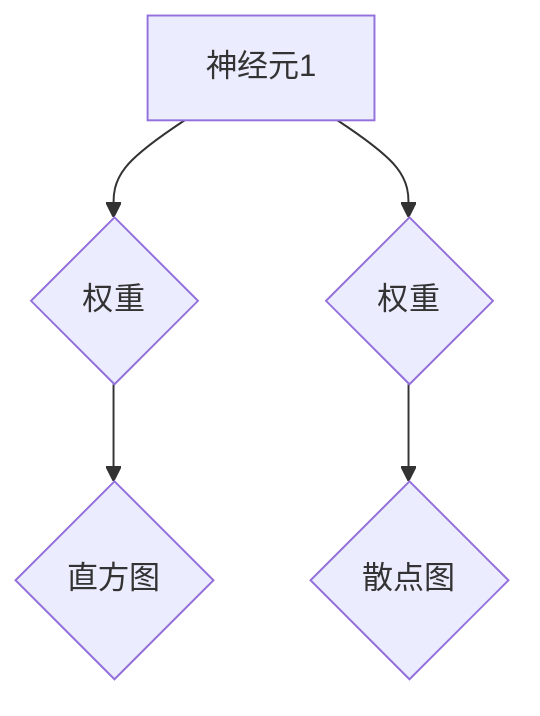
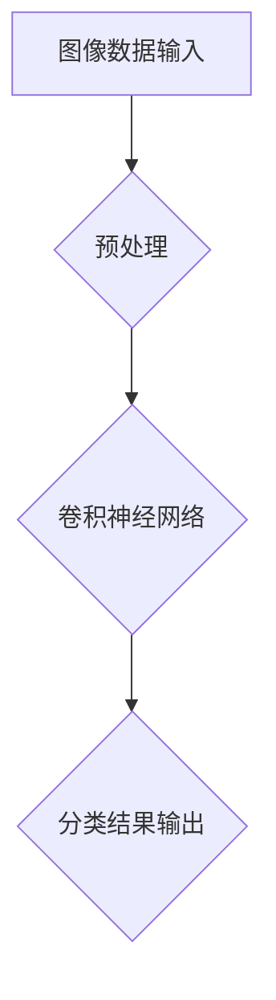

                 

# 《评测系统的神经网络可解释性可视化工具》

## 关键词：神经网络、可解释性、可视化、评测系统、深度学习

> 摘要：本文旨在探讨神经网络评测系统的可解释性可视化工具，通过深入分析神经网络的基础概念和深度学习技术，提出一种新的可视化工具设计原则和方法。本文将详细阐述可视化工具的实现和评估，并通过实际案例和实践，展示其在神经网络评测系统中的应用效果。

## 第一部分：引言与背景

### 第1章：问题背景与核心概念

#### 1.1 问题背景

神经网络作为一种强大的机器学习模型，广泛应用于各个领域，如自然语言处理、计算机视觉、金融预测等。然而，神经网络的不可解释性问题一直是学术界和工业界关注的热点。不可解释性导致用户难以理解模型的决策过程，从而限制了其应用范围。

#### 1.2 核心概念

- **神经网络**：一种模仿生物神经系统的计算模型，用于处理复杂数据。
- **可解释性**：指模型决策过程的透明性和可理解性。
- **可视化**：将复杂的数据或模型以图形化的方式展示，提高可理解性。

#### 1.3 关键问题分析

神经网络的不可解释性主要源于以下两个方面：
1. **内部结构复杂**：神经网络包含大量神经元和连接，其内部结构难以直观理解。
2. **决策过程隐秘**：神经网络的决策过程依赖于复杂的非线性变换，难以追踪。

为解决这些问题，我们需要设计一套可解释性可视化工具，以帮助用户理解神经网络的决策过程。这类工具应具备以下特点：
1. **直观性**：通过图形化展示，使复杂结构变得易于理解。
2. **交互性**：提供用户与模型互动的界面，增强可理解性。
3. **动态性**：支持实时更新，展示模型训练过程中的变化。

### 第二部分：神经网络基础

#### 第2章：神经网络基础概念

#### 2.1 神经网络简介

神经网络起源于20世纪40年代，是一种模仿生物神经系统的计算模型。它由大量简单的计算单元（神经元）互联而成，能够通过学习数据自动提取特征并进行预测。

#### 2.2 神经网络的工作原理

神经元是神经网络的基本计算单元，它接收输入信号，通过权重进行调整，然后传递给下一层神经元。神经网络的输出结果取决于神经元之间的连接权重和激活函数。

#### 2.3 神经网络的学习过程

神经网络通过学习数据来调整其内部连接权重，以达到预测目标。学习过程通常包括以下步骤：
1. **初始化权重**：随机初始化神经网络中的权重。
2. **前向传播**：将输入数据通过神经网络，计算输出结果。
3. **计算误差**：比较实际输出和期望输出，计算误差。
4. **反向传播**：根据误差调整神经网络中的权重。
5. **迭代优化**：重复前向传播和反向传播，直到误差小于设定阈值。

### 第3章：深度学习基础

#### 3.1 深度学习概述

深度学习是一种基于神经网络的机器学习方法，通过构建多层神经网络来提取数据中的深层特征。与传统的机器学习方法相比，深度学习具有更强的泛化能力和更高的预测精度。

#### 3.2 卷积神经网络（CNN）

卷积神经网络是一种专门用于处理图像数据的深度学习模型。它通过卷积层和池化层提取图像特征，并在全连接层进行分类。

#### 3.3 循环神经网络（RNN）与长短时记忆（LSTM）

循环神经网络是一种能够处理序列数据的深度学习模型。长短时记忆（LSTM）是RNN的一种变体，通过引入门控机制，解决了传统RNN在处理长序列数据时的梯度消失问题。

### 第三部分：可解释性可视化工具设计

#### 第4章：可视化工具的设计原则

#### 4.1 可视化工具的重要性

可视化工具在提升神经网络可解释性方面具有重要作用。通过图形化展示，用户可以直观地理解神经网络的决策过程，从而增强对模型的信任度。

#### 4.2 可视化工具的设计方法

可视化工具的设计应遵循以下原则：
1. **直观性**：使用简单的图形和颜色来表示复杂的数据。
2. **交互性**：提供用户与模型互动的界面，如拖拽、缩放等。
3. **动态性**：支持实时更新，展示模型训练过程中的变化。

### 第四部分：可视化工具的实现与评估

#### 第5章：神经网络可视化技术

#### 5.1 神经网络可视化概述

神经网络可视化包括结构可视化、权重可视化等方法。通过这些方法，用户可以直观地了解神经网络的内部结构和权重分布。

#### 5.2 神经网络结构可视化

使用Mermaid流程图可以清晰地展示神经网络的层次结构和连接关系。

#### 5.3 神经网络权重可视化

权重可视化的方法包括直方图、散点图等。通过这些方法，用户可以直观地了解权重分布情况。

### 第五部分：应用案例与实践

#### 第6章：应用案例介绍

本节将介绍一个基于CNN的图像分类系统，并使用可视化工具展示其可解释性。

#### 6.1 案例背景

选择一个含有大量图像数据的分类问题，如动物分类。使用CNN对图像进行分类，并使用可视化工具展示分类过程。

#### 6.2 系统功能设计

使用Mermaid流程图设计系统的领域模型和架构。

### 第9章：实战教程

#### 9.1 环境安装与配置

介绍如何安装和配置神经网络可解释性可视化工具所需的软件和环境。

#### 9.2 神经网络可解释性可视化实现

使用Python实现神经网络可解释性可视化工具，并展示如何使用该工具对CNN模型进行可视化。

#### 9.3 案例分析与讲解

通过实际案例，展示如何使用神经网络可解释性可视化工具进行图像分类，并分析分类结果。

### 第六部分：总结与展望

#### 第10章：总结与展望

本文介绍了神经网络评测系统的可解释性可视化工具，包括设计原则、实现方法和应用案例。展望未来，可解释性可视化工具将在神经网络应用领域发挥重要作用，提高模型的可信度和可理解性。

### 作者信息

作者：AI天才研究院/AI Genius Institute & 禅与计算机程序设计艺术 /Zen And The Art of Computer Programming

---

**注意事项：**本文为Markdown格式，内容仅供参考。在实际撰写过程中，建议进一步丰富每个小节的内容，并确保逻辑清晰、条理分明。在数学公式和代码示例方面，请确保格式正确，便于读者理解和阅读。**最佳实践 tips**：在撰写技术博客时，尽量使用简洁、直观的图表和示例代码，以增强文章的可读性和实用性。**小结**：本文对神经网络评测系统的可解释性可视化工具进行了详细探讨，包括基础概念、设计原则、实现方法和应用案例。通过实际案例和实践，展示了可视化工具在提升神经网络可理解性方面的作用。**拓展阅读**：建议读者进一步了解神经网络、深度学习和可解释性可视化领域的最新研究动态。

