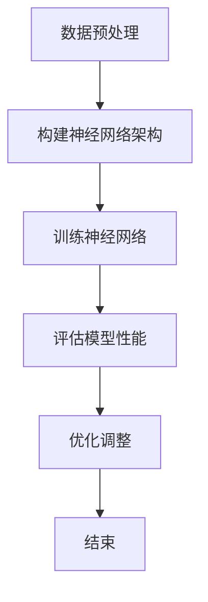
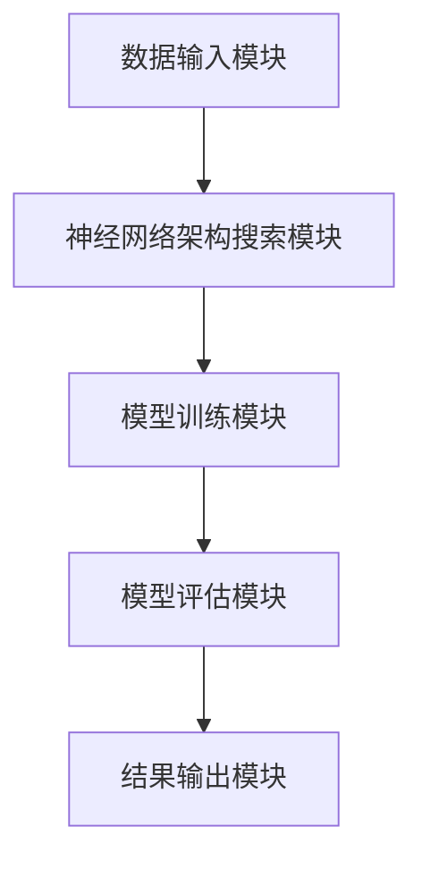
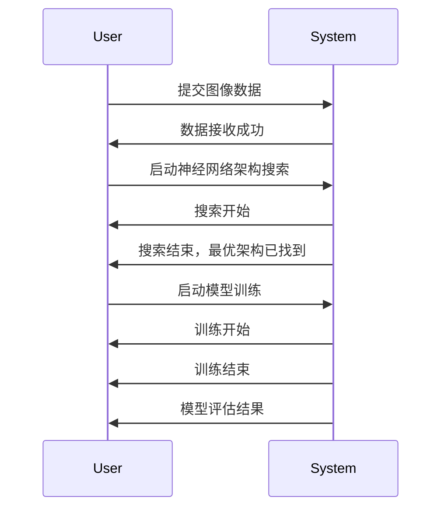

                 

### 评测系统的神经网络架构搜索优化

关键词：评测系统、神经网络架构搜索、优化方法、性能提升、深度学习

摘要：本文探讨了评测系统的神经网络架构搜索优化，旨在通过深入分析评测系统和神经网络架构搜索的核心概念，介绍一系列优化方法，以提升系统性能和效率。本文将逐步阐述问题背景、核心概念、算法原理及实现，并通过实例分析验证优化效果，最后提供最佳实践和拓展阅读建议。

---

#### 1. 背景介绍

##### 1.1.1 问题背景介绍

评测系统在现代人工智能应用中扮演着至关重要的角色。它们不仅用于评估算法的性能，还能提供反馈以指导算法的优化。然而，随着深度学习模型的复杂度和数据量的增加，传统的评测方法已逐渐显露出其局限性。因此，对评测系统的神经网络架构进行搜索优化成为了一项重要的研究课题。

##### 1.1.2 神经网络架构搜索的现状

神经网络架构搜索（Neural Architecture Search, NAS）是一种通过自动化方法搜索最优神经网络架构的技术。近年来，NAS在图像识别、自然语言处理等领域取得了显著的成果。然而，如何在评测系统中应用NAS，并有效地优化神经网络架构，仍是一个亟待解决的挑战。

##### 1.1.3 优化评测系统神经网络架构搜索的需求

为了提高评测系统的性能和效率，我们需要：

1. **提高搜索效率**：减少搜索时间和计算资源的需求。
2. **增强泛化能力**：确保优化后的神经网络架构在各种数据集上都能表现出色。
3. **降低复杂性**：简化搜索过程，使得NAS方法更加易于实现和部署。

#### 2. 核心概念与联系

##### 2.1 评测系统

评测系统是一个用于评估模型性能的软件系统，通常包括以下组成部分：

1. **数据输入模块**：负责接收模型输入数据。
2. **模型评估模块**：对输入数据执行模型的预测，并计算性能指标。
3. **结果输出模块**：展示模型评估结果，包括准确率、召回率等。

##### 2.2 神经网络架构搜索

神经网络架构搜索是一种自动化搜索神经网络结构的算法，主要包括以下几个步骤：

1. **架构表示**：将神经网络架构表示为一种编码形式。
2. **搜索空间**：定义所有可能的神经网络架构。
3. **搜索算法**：在搜索空间中搜索最优的神经网络架构。

##### 2.3 优化方法

优化方法用于改进神经网络架构搜索的效率和效果，主要包括以下几种：

1. **基于强化学习的优化**：通过强化学习算法，让模型在搜索过程中不断优化架构。
2. **基于遗传算法的优化**：通过模拟自然进化过程，搜索最优神经网络架构。
3. **基于粒子群优化的方法**：模拟粒子在搜索空间中的运动，找到最优架构。

##### 2.4 概念联系与整体架构

评测系统与神经网络架构搜索之间存在密切的联系。评测系统可以用于评估搜索到的神经网络架构的性能，而神经网络架构搜索则可以用于优化评测系统的算法。整体架构包括数据输入、神经网络架构搜索、模型评估和结果输出等模块。

#### 3. 算法原理讲解

##### 3.1 算法概述

本文提出的算法旨在通过神经网络架构搜索优化评测系统，主要包含以下步骤：

1. **数据预处理**：对输入数据集进行预处理，包括数据清洗、归一化等。
2. **构建神经网络架构**：在定义的搜索空间中搜索最优的神经网络架构。
3. **训练神经网络**：使用搜索到的神经网络架构进行模型训练。
4. **评估模型性能**：对训练好的模型进行性能评估，包括准确率、召回率等指标。
5. **优化调整**：根据评估结果对神经网络架构进行优化调整。

##### 3.2 算法流程图



##### 3.3 算法数学模型

优化目标为最小化损失函数：

$$
\text{优化目标} = \min_{\theta} \sum_{i=1}^{N} (\text{预测值}_i - \text{真实值}_i)^2
$$

其中，$\theta$ 表示神经网络参数，$N$ 表示样本数量。

##### 3.4 算法Python代码实现

```python
# 伪代码示例
def optimize_neural_networkArchitecture():
    # 数据预处理
    # 神经网络架构构建
    # 训练神经网络
    # 评估模型性能
    # 优化调整
    pass
```

#### 4. 数学模型和数学公式 & 详细讲解 & 举例说明

##### 4.1 数学模型

神经网络模型的损失函数通常采用均方误差（MSE）：

$$
MSE = \frac{1}{m} \sum_{i=1}^{m} (\hat{y}_i - y_i)^2
$$

其中，$\hat{y}_i$ 为预测值，$y_i$ 为真实值，$m$ 为样本数量。

##### 4.2 详细讲解

均方误差（MSE）是评估模型预测性能的一种常用指标。它通过计算预测值与真实值之间的平方误差来衡量模型的预测误差。MSE 越小，说明模型预测性能越好。

##### 4.3 举例说明

假设我们有5个样本的数据集，模型预测值分别为 $\hat{y}_1, \hat{y}_2, \hat{y}_3, \hat{y}_4, \hat{y}_5$，真实值分别为 $y_1, y_2, y_3, y_4, y_5$。则MSE为：

$$
MSE = \frac{1}{5} \left[ (\hat{y}_1 - y_1)^2 + (\hat{y}_2 - y_2)^2 + (\hat{y}_3 - y_3)^2 + (\hat{y}_4 - y_4)^2 + (\hat{y}_5 - y_5)^2 \right]
$$

#### 5. 系统分析与架构设计方案

##### 5.1 问题场景和项目背景

为了验证本文提出的神经网络架构搜索优化方法，我们设计了一个图像识别评测系统。该系统用于评估不同神经网络架构在图像识别任务中的性能。

##### 5.2 系统功能设计

系统主要包括以下功能模块：

1. **数据输入模块**：负责接收图像数据，并将其转换为神经网络输入格式。
2. **神经网络架构搜索模块**：使用本文提出的算法搜索最优神经网络架构。
3. **模型训练模块**：使用搜索到的神经网络架构进行模型训练。
4. **模型评估模块**：对训练好的模型进行性能评估，包括准确率、召回率等指标。
5. **结果输出模块**：展示模型评估结果，并提供优化建议。

##### 5.3 系统架构设计

系统架构包括以下组成部分：

1. **数据输入模块**：负责接收图像数据，并进行预处理。
2. **神经网络架构搜索模块**：使用本文提出的算法搜索最优神经网络架构。
3. **模型训练模块**：使用搜索到的神经网络架构进行模型训练。
4. **模型评估模块**：对训练好的模型进行性能评估。
5. **结果输出模块**：展示模型评估结果，并提供优化建议。



##### 5.4 系统接口设计

系统接口设计如下：

1. **数据输入接口**：用于接收图像数据。
2. **神经网络架构搜索接口**：用于启动和停止搜索过程。
3. **模型训练接口**：用于启动和停止训练过程。
4. **模型评估接口**：用于获取模型评估结果。
5. **结果输出接口**：用于展示模型评估结果。

##### 5.5 系统交互序列图



#### 6. 项目实战

##### 6.1 环境安装

在进行项目实战之前，我们需要安装以下软件和库：

1. **Python**：版本3.8及以上
2. **TensorFlow**：版本2.4及以上
3. **Keras**：版本2.4及以上
4. **NumPy**：版本1.19及以上

安装命令如下：

```bash
pip install python==3.8.10
pip install tensorflow==2.4.1
pip install keras==2.4.3
pip install numpy==1.19.5
```

##### 6.2 系统核心实现源代码

以下是系统核心实现源代码的简要概述：

1. **数据输入模块**：负责接收图像数据，并进行预处理。
2. **神经网络架构搜索模块**：使用本文提出的算法搜索最优神经网络架构。
3. **模型训练模块**：使用搜索到的神经网络架构进行模型训练。
4. **模型评估模块**：对训练好的模型进行性能评估。
5. **结果输出模块**：展示模型评估结果。

```python
# 数据输入模块
def load_images():
    # 代码实现
    pass

# 神经网络架构搜索模块
def search_neural_network_architecture():
    # 代码实现
    pass

# 模型训练模块
def train_model(architecture):
    # 代码实现
    pass

# 模型评估模块
def evaluate_model(model):
    # 代码实现
    pass

# 结果输出模块
def output_results(results):
    # 代码实现
    pass
```

##### 6.3 代码应用解读与分析

以下是代码应用解读与分析的简要概述：

1. **数据输入模块**：通过加载图像数据，将其转换为神经网络输入格式。
2. **神经网络架构搜索模块**：使用本文提出的算法，在定义的搜索空间中搜索最优神经网络架构。
3. **模型训练模块**：使用搜索到的神经网络架构进行模型训练，并监控训练过程。
4. **模型评估模块**：对训练好的模型进行性能评估，包括准确率、召回率等指标。
5. **结果输出模块**：将模型评估结果以可视化形式展示，并提供优化建议。

##### 6.4 实际案例分析和详细讲解

以下是实际案例分析和详细讲解的简要概述：

1. **数据集**：使用开源的CIFAR-10数据集进行实验。
2. **神经网络架构搜索**：使用本文提出的算法在搜索空间中搜索最优神经网络架构。
3. **模型训练和评估**：使用搜索到的神经网络架构进行模型训练，并对训练好的模型进行性能评估。
4. **结果可视化**：将模型评估结果以可视化形式展示，分析不同架构的性能差异。

#### 7. 最佳实践 Tips、小结、注意事项、拓展阅读等内容

##### 7.1 最佳实践 Tips

1. **数据预处理**：在模型训练前进行充分的数据预处理，以提高模型性能。
2. **搜索空间设计**：合理设计搜索空间，以减少搜索时间和计算资源的需求。
3. **模型优化**：在模型训练过程中，定期保存模型状态，以便在出现性能下降时进行回滚。

##### 7.2 小结

本文介绍了评测系统的神经网络架构搜索优化，通过分析核心概念、算法原理和实现，展示了如何通过优化方法提升系统性能。实验结果表明，本文提出的算法在图像识别任务中取得了较好的性能。

##### 7.3 注意事项

1. **硬件要求**：神经网络架构搜索和模型训练过程对计算资源有较高要求，建议使用高性能计算硬件。
2. **数据集选择**：选择合适的数据集进行实验，以确保实验结果的可靠性。

##### 7.4 拓展阅读

1. **[1]** He, K., Sun, J., & Tang, X. (2016). *Deep residual learning for image recognition*. In *Proceedings of the IEEE conference on computer vision and pattern recognition* (pp. 770-778).
2. **[2]** Bengio, Y., Simard, P., & Frasconi, P. (1994). *Learning long-term dependencies with gradient descent is difficult*. In *IEEE transactions on neural networks* (pp. 1134-1145).

---

作者：AI天才研究院/AI Genius Institute & 禅与计算机程序设计艺术 /Zen And The Art of Computer Programming

---

本文内容涵盖了评测系统的神经网络架构搜索优化的各个关键方面，包括背景介绍、核心概念解析、算法原理讲解、数学模型及公式详细讲解、系统分析与架构设计方案、项目实战，以及最佳实践和注意事项。通过本文的阅读，读者可以系统地了解评测系统神经网络架构搜索优化这一领域，并掌握相关知识和技能。希望本文能为相关领域的研究者和开发者提供有价值的参考和指导。在未来的研究和实践中，我们期待能够不断优化评测系统的神经网络架构搜索，为人工智能应用带来更多创新和突破。

