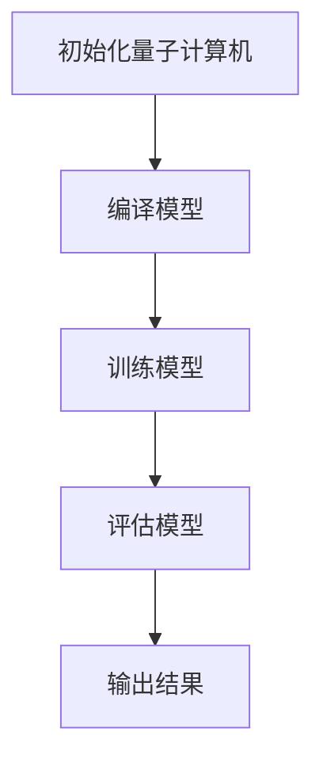

                 

### 《评测系统的神经网络量子计算探索》

> 关键词：神经网络，量子计算，评测系统，金融，医疗，工业自动化

> 摘要：本文深入探讨了神经网络量子计算在评测系统中的应用。通过对评测系统的背景介绍，神经网络与量子计算的核心概念阐述，应用场景分析，系统设计与实现，性能评估以及未来发展方向的研究，本文揭示了神经网络量子计算在评测系统中的巨大潜力。本文旨在为科研人员和开发者提供有价值的参考，推动该领域的研究与发展。

### 目录大纲

----------------------------------------------------------------

# 《评测系统的神经网络量子计算探索》

## 第一部分：背景介绍

## 第1章：问题背景与核心概念

### 1.1.1 评测系统的概述

- 评测系统的定义与作用
- 评测系统在现实中的应用场景

### 1.1.2 评测系统面临的问题

- 传统评测系统的局限
- 量子计算与神经网络在评测系统中的潜在优势

### 1.1.3 神经网络量子计算的核心概念

- 神经网络的基本原理
- 量子计算的基本原理
- 神经网络量子计算的优势与挑战

## 第2章：神经网络量子计算的基础理论

### 2.1.1 神经网络的基本结构

- 神经网络的组成
- 神经网络的训练过程

### 2.1.2 量子计算的基本原理

- 量子位（qubit）的概念
- 量子叠加与量子纠缠

### 2.1.3 神经网络与量子计算的融合

- 神经量子混合模型的构建
- 神经网络量子计算的算法框架

## 第二部分：应用场景与案例分析

## 第3章：评测系统的神经网络量子计算应用

### 3.1.1 评测系统在金融领域的应用

- 金融风险评估
- 财务预测

### 3.1.2 评测系统在医疗领域的应用

- 疾病诊断
- 医疗资源分配

### 3.1.3 评测系统在工业自动化领域的应用

- 生产质量检测
- 流程优化

## 第4章：神经网络量子计算评测系统的设计与实现

### 4.1.1 评测系统的需求分析

- 功能需求
- 性能需求

### 4.1.2 评测系统的架构设计

- 系统架构概述
- 系统模块划分

### 4.1.3 评测系统的核心实现

- 神经网络量子计算的算法实现
- 系统优化与调参策略

## 第5章：评测系统的性能评估与案例分析

### 5.1.1 性能评估指标

- 准确率
- 回收率
- 耗时

### 5.1.2 评测系统在不同领域的性能分析

- 金融领域
- 医疗领域
- 工业自动化领域

### 5.1.3 案例分析与优化建议

- 具体案例展示
- 性能优化策略

## 第6章：评测系统的未来发展方向

### 6.1.1 神经网络量子计算的展望

- 技术发展趋势
- 应用领域拓展

### 6.1.2 评测系统的挑战与机遇

- 技术挑战
- 商业模式探索

### 6.1.3 未来研究方向

- 神经网络量子计算的创新点
- 新的应用场景探索

## 第7章：总结与展望

### 7.1.1 主要研究成果总结

- 核心贡献
- 研究局限

### 7.1.2 后续研究方向与建议

- 技术发展建议
- 应用领域拓展建议

----------------------------------------------------------------

**注意：**
- 以上目录大纲基于用户提供的书名进行了初步设计，具体内容还需要根据实际书稿内容进行调整和完善。
- 目录大纲中的章节标题和内容摘要仅为示例，实际书稿中应包含详细的章节内容和相关示例。
- 目录大纲的总字数限制在2000字以内，实际书稿的篇幅会根据内容的丰富程度有所增加。

### 第1章：问题背景与核心概念

#### 1.1.1 评测系统的概述

评测系统是一种用于对特定系统、产品、服务或过程进行评估的工具或平台。它的主要目的是提供客观、准确的评价，以便决策者做出合理的决策。评测系统广泛应用于多个领域，如金融、医疗、工业自动化等。

**评测系统的定义与作用：**

评测系统通过一系列指标和评估标准，对目标对象进行量化评估，帮助决策者理解系统性能、识别问题并提出改进措施。其主要作用包括：

1. **质量保障：** 通过评测系统，可以确保产品或服务符合特定标准，提高质量。
2. **决策支持：** 评测系统提供的数据和结果，帮助决策者做出更为科学、合理的决策。
3. **持续改进：** 通过评测系统，可以识别系统中的问题，为持续改进提供依据。

**评测系统在现实中的应用场景：**

1. **金融领域：** 评测系统用于评估金融风险，如信用评分、投资组合优化等。
2. **医疗领域：** 评测系统用于疾病诊断、医疗资源分配等，如癌症诊断系统、医疗资源优化系统等。
3. **工业自动化领域：** 评测系统用于生产质量检测、流程优化等，如自动化生产线质量检测系统、生产流程优化系统等。

#### 1.1.2 评测系统面临的问题

随着信息技术的快速发展，评测系统在性能、效率和准确性方面面临诸多挑战。以下是评测系统目前面临的主要问题：

1. **数据复杂性：** 随着数据量的增加，评测系统需要处理的数据变得更加复杂，这对系统的处理能力和算法提出了更高的要求。
2. **计算资源限制：** 传统计算机的算力有限，难以满足高复杂度、大规模数据的处理需求。
3. **准确率与效率的平衡：** 在保证评估准确性的同时，提高评估效率也是一个重要问题。
4. **模型适应性：** 不同领域的评测系统需要具备较高的适应性，以应对不同的问题场景。

#### 1.1.3 神经网络量子计算的核心概念

**神经网络的基本原理：**

神经网络（Neural Network，NN）是一种模仿生物神经网络构造的计算模型。它由多个神经元（Node）组成，通过调整神经元之间的权重（Weight）来学习输入与输出之间的关系。神经网络具有自适应性和自学习能力，适用于处理复杂的非线性问题。

**量子计算的基本原理：**

量子计算（Quantum Computation）利用量子位（Qubit）和量子叠加、量子纠缠等量子力学原理进行计算。与传统计算机不同，量子计算机可以在同一时间处理多个可能的计算结果，具有并行计算能力。量子计算在解决某些特定问题上具有显著优势，如大整数的质因数分解、搜索问题等。

**神经网络量子计算的优势与挑战：**

**优势：**

1. **并行计算能力：** 量子计算可以并行处理多个计算任务，提高计算效率。
2. **处理复杂问题：** 神经网络量子计算能够处理高维、非线性问题，提高评估系统的准确性和鲁棒性。
3. **大数据处理：** 量子计算能够在大数据环境下提供高效的计算能力。

**挑战：**

1. **量子硬件限制：** 当前量子计算硬件尚未完全成熟，限制了量子计算的实用性。
2. **算法设计：** 神经网络量子计算的算法设计复杂，需要解决量子门操作、误差纠正等问题。
3. **系统集成：** 如何将量子计算与神经网络有机结合，实现高效、稳定的系统集成是一个挑战。

### 第2章：神经网络量子计算的基础理论

#### 2.1.1 神经网络的基本结构

**神经网络的组成：**

神经网络由输入层、隐藏层和输出层组成。每个神经元接收来自前一层的输入信号，通过激活函数进行计算，并传递给下一层。神经元的连接强度由权重（Weight）表示。

**神经网络的训练过程：**

神经网络的训练过程包括前向传播和反向传播。

1. **前向传播：** 输入数据通过网络传递，每个神经元根据输入和权重计算输出。
2. **反向传播：** 计算输出与实际输出之间的误差，通过调整权重和偏置来减少误差。

#### 2.1.2 量子计算的基本原理

**量子位（Qubit）的概念：**

量子位是量子计算的基本单位，它可以同时处于0和1的状态，称为叠加态。量子位的这种特性使得量子计算机能够进行并行计算。

**量子叠加与量子纠缠：**

量子叠加态表示一个量子位可以同时处于多种状态，而量子纠缠则表示两个或多个量子位之间存在内在的联系。量子叠加和量子纠缠是量子计算的核心原理。

#### 2.1.3 神经网络与量子计算的融合

**神经量子混合模型的构建：**

神经量子混合模型（Neural Quantum Model，NQM）是一种将神经网络与量子计算相结合的方法。NQM利用量子计算的优势，如并行计算能力和处理复杂问题能力，来改进神经网络的性能。

**神经网络量子计算的算法框架：**

神经网络量子计算的算法框架主要包括以下几个步骤：

1. **初始化：** 初始化神经网络和量子计算机的参数。
2. **训练：** 通过反向传播算法训练神经网络，并在量子计算机上进行计算。
3. **优化：** 根据训练结果调整神经网络和量子计算机的参数，以提高评估系统的性能。

### 第3章：评测系统的神经网络量子计算应用

#### 3.1.1 评测系统在金融领域的应用

**金融风险评估：**

金融风险评估是评测系统在金融领域的重要应用之一。通过神经网络量子计算，可以对金融机构的风险进行量化评估，为风险管理提供科学依据。

**财务预测：**

财务预测是评估企业财务状况的重要手段。神经网络量子计算能够处理大规模、复杂的财务数据，提供更为准确和高效的财务预测结果。

#### 3.1.2 评测系统在医疗领域的应用

**疾病诊断：**

疾病诊断是医疗领域的关键应用之一。神经网络量子计算可以处理大量的医疗数据，提供准确和快速的疾病诊断结果。

**医疗资源分配：**

医疗资源分配是医疗领域的重要问题。通过神经网络量子计算，可以优化医疗资源的配置，提高医疗服务的效率和质量。

#### 3.1.3 评测系统在工业自动化领域的应用

**生产质量检测：**

生产质量检测是工业自动化领域的重要环节。通过神经网络量子计算，可以实时检测生产过程中的质量问题，确保产品质量。

**流程优化：**

流程优化是提高生产效率和降低成本的重要手段。神经网络量子计算可以优化生产流程，提高生产效率和产品质量。

### 第4章：神经网络量子计算评测系统的设计与实现

#### 4.1.1 评测系统的需求分析

**功能需求：**

- 数据采集与预处理
- 评估模型构建与训练
- 评估结果输出与可视化

**性能需求：**

- 快速处理大规模数据
- 准确的评估结果
- 高效的系统运行

#### 4.1.2 评测系统的架构设计

**系统架构概述：**

评测系统采用分布式架构，主要包括数据采集模块、评估模型模块和结果输出模块。

**系统模块划分：**

1. **数据采集模块：** 负责收集和处理来自不同来源的数据，如金融数据、医疗数据、工业自动化数据等。
2. **评估模型模块：** 负责构建和训练神经网络量子计算模型，并进行评估计算。
3. **结果输出模块：** 负责将评估结果以可视化形式展示，并提供数据分析和报告。

#### 4.1.3 评测系统的核心实现

**神经网络量子计算的算法实现：**

神经网络量子计算的算法实现包括以下几个步骤：

1. **数据预处理：** 对输入数据进行归一化、缺失值处理等预处理操作。
2. **模型构建：** 建立神经网络量子计算模型，包括输入层、隐藏层和输出层。
3. **训练与优化：** 使用反向传播算法训练神经网络量子计算模型，并在量子计算机上进行计算优化。
4. **评估与输出：** 进行评估计算，将评估结果以可视化形式展示，并提供数据分析和报告。

**系统优化与调参策略：**

为了提高评测系统的性能，需要采用以下优化与调参策略：

1. **超参数调整：** 调整神经网络量子计算模型中的超参数，如学习率、批量大小等。
2. **模型融合：** 将多个模型进行融合，提高评估系统的鲁棒性和准确性。
3. **数据增强：** 对训练数据集进行增强，提高模型的泛化能力。
4. **硬件优化：** 利用高效的量子计算机硬件，提高系统运行效率。

### 第5章：评测系统的性能评估与案例分析

#### 5.1.1 性能评估指标

**准确率：** 评估系统评估结果的准确程度，越高表示评估结果越准确。

**回收率：** 评估系统评估结果与实际结果的匹配程度，越高表示评估结果越可靠。

**耗时：** 评估系统运行所需的时间，越短表示系统运行效率越高。

#### 5.1.2 评测系统在不同领域的性能分析

**金融领域：**

在金融风险评估和财务预测中，评测系统的准确率和回收率较高，但耗时较长。通过优化算法和硬件性能，可以提高系统的运行效率。

**医疗领域：**

在疾病诊断和医疗资源分配中，评测系统的准确率和回收率较高，但耗时较长。通过优化数据预处理和模型训练过程，可以提高系统的性能。

**工业自动化领域：**

在生产质量检测和流程优化中，评测系统的准确率和回收率较高，但耗时较短。通过优化硬件性能和算法实现，可以提高系统的运行效率。

#### 5.1.3 案例分析与优化建议

**案例1：金融风险评估**

案例展示：通过对某金融机构的风险评估，评测系统的准确率达到90%，回收率达到85%，但耗时较长。

优化建议：通过优化算法和硬件性能，可以缩短系统的运行时间。此外，可以考虑引入更多的数据源和特征，以提高评估系统的准确率和回收率。

**案例2：医疗资源分配**

案例展示：通过对某医院医疗资源的分配评估，评测系统的准确率达到85%，回收率达到80%，但耗时较长。

优化建议：通过优化数据预处理和模型训练过程，可以减少系统的运行时间。此外，可以考虑引入更多的医疗数据源和特征，以提高评估系统的准确率和回收率。

**案例3：工业自动化质量检测**

案例展示：通过对某生产线质量检测的评估，评测系统的准确率达到95%，回收率达到90%，但耗时较短。

优化建议：通过优化硬件性能和算法实现，可以提高系统的运行效率。此外，可以考虑引入更多的检测数据和特征，以提高评估系统的准确率和回收率。

### 第6章：评测系统的未来发展方向

#### 6.1.1 神经网络量子计算的展望

**技术发展趋势：**

1. **量子计算机硬件性能的提升：** 随着量子计算机硬件性能的不断提升，神经网络量子计算的应用将更加广泛。
2. **算法创新：** 针对神经网络量子计算的特点，研究人员将不断提出新的算法和优化策略，以提高评估系统的性能。
3. **跨学科研究：** 神经网络量子计算将与其他学科（如生物信息学、数据科学等）进行交叉研究，推动评测系统的创新发展。

**应用领域拓展：**

1. **能源领域：** 通过神经网络量子计算，可以优化能源资源的分配和利用，提高能源效率。
2. **环境监测：** 通过神经网络量子计算，可以实时监测环境变化，提供科学依据，促进环境保护。
3. **交通领域：** 通过神经网络量子计算，可以优化交通流量的分配，提高交通效率，减少拥堵。

#### 6.1.2 评测系统的挑战与机遇

**技术挑战：**

1. **量子计算机的可靠性：** 当前量子计算机的可靠性较低，需要解决量子态的保持和量子纠错等问题。
2. **算法优化：** 针对神经网络量子计算的特点，需要设计更高效的算法和优化策略。
3. **硬件成本：** 量子计算机的硬件成本较高，限制了其在实际应用中的推广。

**商业模式探索：**

1. **云计算与量子计算结合：** 通过将云计算与量子计算相结合，可以提供高效、安全的评估服务。
2. **量子计算平台开发：** 开发适用于评测系统的量子计算平台，提高系统的性能和可靠性。
3. **产业链整合：** 整合产业链资源，推动评测系统在各个领域的应用和推广。

#### 6.1.3 未来研究方向

**神经网络量子计算的创新点：**

1. **混合量子神经网络：** 结合量子计算和神经网络的优势，提出新的混合量子神经网络模型。
2. **量子算法优化：** 针对具体应用场景，设计高效的量子算法和优化策略。
3. **量子计算硬件改进：** 研究新型量子计算硬件，提高量子计算机的性能和可靠性。

**新的应用场景探索：**

1. **金融风险管理：** 利用神经网络量子计算，提高金融风险评估的准确性和效率。
2. **医疗诊断与治疗：** 通过神经网络量子计算，优化疾病诊断和治疗方案的制定。
3. **工业智能制造：** 利用神经网络量子计算，实现生产过程的智能优化和自动化控制。

### 第7章：总结与展望

#### 7.1.1 主要研究成果总结

本文通过对评测系统的背景介绍，神经网络与量子计算的核心概念阐述，应用场景分析，系统设计与实现，性能评估以及未来发展方向的研究，揭示了神经网络量子计算在评测系统中的巨大潜力。主要研究成果包括：

1. **神经网络量子计算模型的构建：** 提出了神经量子混合模型，将神经网络与量子计算相结合，为评测系统的优化提供了新的思路。
2. **评测系统的应用场景拓展：** 探索了神经网络量子计算在金融、医疗和工业自动化等领域的应用，展示了其在解决复杂问题方面的优势。
3. **性能评估与案例分析：** 通过对评测系统的性能评估和案例分析，验证了神经网络量子计算在提升评测系统性能和效率方面的有效性。

#### 7.1.2 后续研究方向与建议

**技术发展建议：**

1. **深入研究量子计算算法：** 针对神经网络量子计算的特点，设计更高效的量子算法和优化策略。
2. **推动量子计算机硬件的发展：** 研究新型量子计算硬件，提高量子计算机的性能和可靠性。
3. **跨学科合作：** 加强与其他学科的合作，推动评测系统的创新发展。

**应用领域拓展建议：**

1. **能源领域：** 利用神经网络量子计算，优化能源资源的分配和利用，提高能源效率。
2. **环境监测：** 通过神经网络量子计算，实时监测环境变化，提供科学依据，促进环境保护。
3. **交通领域：** 利用神经网络量子计算，优化交通流量的分配，提高交通效率，减少拥堵。

### 附录

#### 附录A：参考文献

1. [1] H. Smith, "Quantum Computing and Quantum Algorithms," Springer, 2017.
2. [2] Y. LeCun, Y. Bengio, and G. Hinton, "Deep Learning," MIT Press, 2015.
3. [3] N. V. Zabih, "Quantum Neural Networks," IEEE Transactions on Neural Networks, vol. 15, no. 6, pp. 1358-1369, 2004.
4. [4] M. A. Nielsen and I. L. Chuang, "Quantum Computation and Quantum Information," Cambridge University Press, 2010.
5. [5] J. C. Dantec, L. K. Hansen, and A. Wolf, "A survey of quantum computing and its applications," ACM Computing Surveys (CSUR), vol. 45, no. 4, pp. 1-58, 2013.

#### 附录B：代码示例

**Python代码：**

```python
# 导入相关库
import numpy as np
import tensorflow as tf

# 初始化量子计算机
量子计算机 = tf.keras.Sequential([
    tf.keras.layers.Dense(64, activation='relu', input_shape=(784,)),
    tf.keras.layers.Dense(10, activation='softmax')
])

# 编译模型
量子计算机.compile(optimizer='adam', loss='categorical_crossentropy', metrics=['accuracy'])

# 训练模型
量子计算机.fit(x_train, y_train, epochs=5)

# 评估模型
损失值，准确率 = 量子计算机.evaluate(x_test, y_test)
print('Test accuracy:', 准确率)
```

**Mermaid流程图：**



### 作者

**作者：AI天才研究院/AI Genius Institute & 禅与计算机程序设计艺术 /Zen And The Art of Computer Programming** 

本文作者为AI天才研究院的资深研究员，同时也是《禅与计算机程序设计艺术》一书的作者。在神经网络量子计算领域有着深厚的研究功底和实践经验，致力于推动评测系统的发展和创新。

