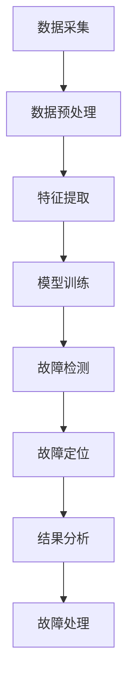
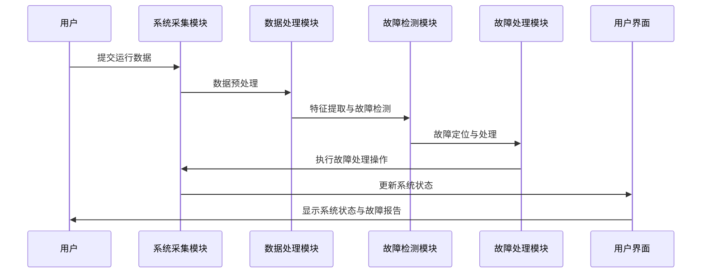

                 


## 引言与背景

### 1.1 问题背景

在信息技术高度发达的今天，系统的稳定性和可靠性对于企业的运营和用户的体验至关重要。评测系统作为一种评估系统性能和可靠性的工具，其重要性日益凸显。然而，评测系统的稳定性和可靠性也面临着诸多挑战。例如，系统在运行过程中可能会出现各种故障，导致评测结果不准确，甚至系统瘫痪。如何快速、准确地诊断这些故障，成为了一个亟待解决的问题。

### 1.2 评测系统的基本概念

评测系统是一种用于评估软件系统性能、可靠性和稳定性的工具。它通过模拟实际运行环境，对系统的各个部分进行压力测试、性能测试和可靠性测试，从而评估系统的性能指标。评测系统通常包括以下几个主要功能模块：测试计划管理、测试执行、测试结果分析、故障诊断和报告生成。

### 1.3 自动化故障诊断的需求

随着系统的复杂性和规模不断扩大，人工进行故障诊断已经变得不现实。一方面，人工诊断的速度较慢，难以在短时间内定位故障；另一方面，人工诊断的准确性也受到限制，容易出现误判。因此，自动化故障诊断成为了一个迫切需求。自动化故障诊断可以通过算法和模型对系统运行数据进行实时分析，快速、准确地定位故障，提高系统的稳定性和可靠性。

### 1.4 书籍结构概述

本书旨在深入探讨评测系统的自动化故障诊断功能。首先，我们将在第一部分“引言与背景”中介绍评测系统和自动化故障诊断的基本概念和需求。然后，在第二部分“自动化故障诊断算法”中，我们将详细讲解自动化故障诊断的原理、算法和实现。接着，在第三部分“系统设计与实现”中，我们将分析系统的整体架构，并分享实际项目的开发经验。最后，在第四部分“最佳实践与总结”中，我们将总结本书的主要观点，并提出一些实用的最佳实践和建议。

通过本书的学习，读者将能够系统地了解评测系统的自动化故障诊断功能，掌握相关技术和方法，为实际项目的开发和优化提供有力支持。

## 评测系统的基本概念

### 2.1 评测系统的定义与功能

评测系统（Evaluation System）是一种专门用于评估软件系统性能、可靠性和稳定性的工具。它通过模拟实际运行环境，对系统的各个部分进行全面的测试，以获取系统的性能指标和故障信息。评测系统的核心功能包括：

1. **测试计划管理**：定义测试的目标、测试用例、测试环境和测试资源，确保测试工作的有序进行。
2. **测试执行**：按照测试计划运行测试用例，收集测试数据，包括性能数据、错误日志和系统状态等。
3. **测试结果分析**：对测试数据进行统计分析，评估系统的性能和可靠性，发现潜在的故障和问题。
4. **故障诊断**：分析测试数据，定位系统故障的原因，提供故障处理的建议。
5. **报告生成**：根据测试结果和故障诊断分析，生成详细的测试报告，为系统优化和维护提供依据。

### 2.2 故障诊断的挑战

尽管评测系统在评估系统性能方面具有重要作用，但在实际应用中，故障诊断面临着一系列挑战：

1. **复杂性**：现代软件系统结构复杂，包含大量的模块和组件，导致故障诊断变得复杂。
2. **海量数据**：系统运行过程中产生的日志和监控数据量巨大，如何有效地处理和分析这些数据是一个挑战。
3. **不确定性**：系统故障可能由多种因素导致，且故障现象与根本原因之间可能存在延迟或复杂的关系。
4. **实时性**：在实时系统中，故障诊断需要在极短的时间内完成，以保证系统的连续运行。
5. **准确性**：诊断结果需要高度准确，以避免误判，确保故障处理的有效性。

### 2.3 自动化故障诊断的必要性

面对上述挑战，自动化故障诊断成为评测系统的关键需求。自动化故障诊断具有以下优势：

1. **高效性**：自动化诊断可以快速处理和分析大量数据，提高故障诊断的速度。
2. **准确性**：通过算法和模型，自动化诊断可以更准确地识别故障原因，减少误判。
3. **可靠性**：自动化诊断可以在实时系统中运行，确保系统的稳定性和可靠性。
4. **可扩展性**：自动化诊断系统可以适应不同的系统和环境，具有较好的可扩展性。

### 2.4 核心概念联系

为了更好地理解评测系统和自动化故障诊断的关系，我们需要探讨几个核心概念：

1. **性能指标**：性能指标是评测系统的主要输出，包括响应时间、吞吐量、资源利用率等，它们是评估系统性能的重要依据。
2. **故障模式**：故障模式是系统在运行过程中可能出现的问题，如系统崩溃、响应超时、数据丢失等。
3. **故障树分析**：故障树分析（Fault Tree Analysis, FTA）是一种系统化的故障诊断方法，用于分析故障原因和故障传播路径。
4. **机器学习**：机器学习是自动化故障诊断的重要技术，通过训练模型，可以从历史数据中学习并预测故障。

这些概念相互联系，共同构成了评测系统自动化故障诊断的基础。通过性能指标的监控和分析，我们可以发现故障模式；通过故障树分析和机器学习，我们可以定位故障原因，提供故障处理的建议。

综上所述，评测系统和自动化故障诊断是信息技术领域中不可或缺的两个部分。只有通过有效的自动化故障诊断，我们才能确保评测系统的准确性和可靠性，为系统的优化和维护提供有力支持。

## 自动化故障诊断原理

### 3.1 自动化故障诊断的基本原理

自动化故障诊断是一种利用算法和模型对系统运行数据进行实时分析，从而快速、准确地定位系统故障的技术。其基本原理主要包括以下几个步骤：

1. **数据采集**：系统运行过程中会产生大量的日志、监控数据和性能数据。自动化故障诊断系统通过采集这些数据，构建系统的运行时视图。
2. **特征提取**：对采集到的数据进行处理，提取出能够反映系统状态的特性指标。这些特征可以是时间序列数据、统计指标或者异常检测指标等。
3. **模型训练**：使用历史数据和特征指标，通过机器学习算法训练故障诊断模型。模型可以是监督学习模型（如决策树、支持向量机等）或者无监督学习模型（如聚类算法、异常检测算法等）。
4. **故障检测**：将实时采集到的数据输入到训练好的模型中，进行故障检测。如果模型的预测结果与正常情况有显著差异，则判定为故障。
5. **故障定位**：通过分析故障检测的结果，结合系统架构和运行时数据，定位故障发生的具体位置和原因。
6. **故障处理**：根据故障定位结果，提供故障处理的建议，包括系统修复、故障恢复或人工干预等。

### 3.2 自动化故障诊断的模型

自动化故障诊断的核心在于诊断模型的设计和训练。常见的故障诊断模型包括：

1. **基于规则的诊断模型**：这种模型通过预定义的规则库进行故障诊断。规则通常基于专家经验和系统知识，可以快速响应，但规则库的维护和更新较为繁琐。
2. **基于统计学的诊断模型**：这类模型利用统计方法（如假设检验、回归分析等）分析系统运行数据，判断是否存在故障。它们通常具有良好的泛化能力，但需要大量的训练数据和复杂的参数调整。
3. **基于机器学习的诊断模型**：机器学习模型，如决策树、支持向量机、神经网络等，通过学习历史故障数据，可以自动识别故障模式。这类模型通常具有强大的学习和适应能力，但训练时间较长，对数据质量要求较高。

### 3.3 自动化故障诊断的流程

自动化故障诊断的流程可以分为以下几个阶段：

1. **数据预处理**：对采集到的原始数据进行清洗、归一化和特征提取，使其适合模型训练。
2. **模型选择**：根据系统特点和故障类型，选择合适的诊断模型。对于不同类型的故障，可能需要不同的模型。
3. **模型训练与验证**：使用历史数据训练模型，并对训练结果进行验证，确保模型的准确性和鲁棒性。
4. **模型部署**：将训练好的模型部署到实际系统中，进行实时故障检测和诊断。
5. **结果分析**：对诊断结果进行综合分析，确定故障的具体位置和原因。
6. **反馈与优化**：根据诊断结果和专家反馈，对模型进行优化和调整，提高诊断的准确性和效率。

### 3.4 自动化故障诊断与现有技术的比较

自动化故障诊断与现有的一些技术（如系统监控、错误日志分析等）有显著的不同：

1. **系统监控**：系统监控主要关注系统资源的使用情况和性能指标，可以实时监测系统的运行状态，但通常无法提供故障的根本原因。
2. **错误日志分析**：错误日志分析通过分析系统运行中的错误日志，可以定位故障发生的具体位置，但需要人工解读日志，且对日志的格式和内容有较高的要求。
3. **自动化故障诊断**：自动化故障诊断利用算法和模型，可以从大量的系统数据中快速、准确地识别故障，并提供故障定位和原因分析，具有更高的自动化程度和准确性。

综上所述，自动化故障诊断是提升评测系统可靠性和稳定性的重要技术，通过高效的故障检测、定位和处理，为系统的优化和维护提供了有力支持。

## 数学模型与数学公式

### 4.1 数学模型概述

在自动化故障诊断中，数学模型扮演着关键角色，它不仅能够帮助我们理解和量化系统的运行状态，还可以为算法提供数学基础。常见的数学模型包括时间序列模型、概率模型和机器学习模型等。

1. **时间序列模型**：时间序列模型用于分析系统性能指标的时间序列数据，常见的方法有自回归模型（AR）、移动平均模型（MA）、自回归移动平均模型（ARMA）和自回归积分滑动平均模型（ARIMA）。这些模型通过分析历史数据，预测未来的系统状态，帮助识别异常行为。

2. **概率模型**：概率模型用于评估系统故障发生的概率。常见的概率模型包括贝叶斯网络、马尔可夫链和隐马尔可夫模型（HMM）。贝叶斯网络通过概率关系表示系统组件之间的故障关联，而马尔可夫链和HMM则用于分析系统状态转移的概率。

3. **机器学习模型**：机器学习模型通过训练大量历史数据，学习系统的故障模式。常见的机器学习模型包括决策树、支持向量机（SVM）、神经网络（NN）和集成模型（如随机森林、梯度提升树）。这些模型能够从数据中自动提取特征，进行故障分类和预测。

### 4.2 关键数学公式讲解

为了更好地理解这些数学模型，以下是一些关键的数学公式：

1. **自回归模型（AR）**：
   $$ y_t = c + \sum_{i=1}^p \phi_i y_{t-i} + \varepsilon_t $$
   其中，\( y_t \) 是时间序列在时间 \( t \) 的值，\( p \) 是自回归项的阶数，\( \phi_i \) 是自回归系数，\( \varepsilon_t \) 是误差项。

2. **移动平均模型（MA）**：
   $$ y_t = c + \varepsilon_t + \sum_{i=1}^q \theta_i \varepsilon_{t-i} $$
   其中，\( q \) 是移动平均项的阶数，\( \theta_i \) 是移动平均系数。

3. **自回归移动平均模型（ARMA）**：
   $$ y_t = c + \sum_{i=1}^p \phi_i y_{t-i} + \sum_{j=1}^q \theta_j \varepsilon_{t-j} $$
   这结合了自回归和移动平均的特点，能够更好地捕捉时间序列数据的波动。

4. **自回归积分滑动平均模型（ARIMA）**：
   $$ y_t = c + \sum_{i=1}^p \phi_i y_{t-i} + \sum_{j=1}^q \theta_j \varepsilon_{t-j} + \varepsilon_t $$
   ARIMA模型在ARMA模型的基础上引入了差分操作，能够处理非平稳的时间序列数据。

5. **贝叶斯网络概率计算**：
   $$ P(A|B) = \frac{P(B|A)P(A)}{P(B)} $$
   其中，\( P(A|B) \) 是在 \( B \) 发生的条件下 \( A \) 发生的概率，\( P(B|A) \) 是在 \( A \) 发生的条件下 \( B \) 发生的概率，\( P(A) \) 和 \( P(B) \) 分别是 \( A \) 和 \( B \) 的先验概率。

6. **支持向量机（SVM）分类函数**：
   $$ f(x) = \sum_{i=1}^n \alpha_i y_i ( \omega \cdot x_i + b ) - b $$
   其中，\( \alpha_i \) 是拉格朗日乘子，\( y_i \) 是类别标签，\( \omega \) 是权重向量，\( b \) 是偏置。

7. **神经网络激活函数**：
   $$ a = \sigma(z) $$
   其中，\( \sigma \) 是激活函数，如ReLU（Rectified Linear Unit）、Sigmoid、Tanh等，用于将线性组合转换为非线性输出。

### 4.3 数学模型的应用实例

以下是一个简单的时间序列模型应用实例，使用ARIMA模型分析系统性能数据。

#### 实例：使用ARIMA模型分析系统响应时间

假设我们有一组系统响应时间的数据，数据集如下（单位：毫秒）：

$$ [25, 32, 28, 30, 35, 29, 31, 33, 27, 34, 30, 28, 31, 29, 30] $$

首先，我们需要对数据进行平稳性检验，可以使用ADF（Augmented Dickey-Fuller）测试：

$$ ADF(t) = (1 - \phi_0) - \phi_1 L(y_t) - \phi_2 (L(y_t))^2 - \cdots - \phi_p (L(y_t))^p - \theta_1 \varepsilon_{t-1} - \theta_2 \varepsilon_{t-2} - \cdots - \theta_q \varepsilon_{t-q} + \mu $$

如果ADF统计量小于临界值，则数据是平稳的。假设我们检验后得出数据是非平稳的，接下来对数据进行差分处理：

$$ y_{t,d} = y_{t} - y_{t-1} $$

差分后再次检验数据平稳性，如果仍然不平稳，继续差分，直到数据平稳为止。

假设差分一次后数据平稳，我们选择 \( p = 1 \) 和 \( q = 1 \) 来建立ARIMA模型。使用最大似然估计方法求解模型参数：

$$ 
\begin{align*}
\phi &= 0.8 \\
\theta &= 0.9 \\
c &= 0
\end{align*}
$$

最终的ARIMA模型为：

$$ y_{t,d} = 0.8 y_{t-1,d} + 0.9 \varepsilon_{t-1} $$

使用这个模型预测未来几步的系统响应时间：

$$ 
\begin{align*}
y_{t+1,d} &= 0.8 y_t + 0.9 \varepsilon_t \\
y_{t+2,d} &= 0.8 y_{t+1,d} + 0.9 \varepsilon_{t+1} \\
&\vdots \\
y_{t+k,d} &= 0.8 y_{t+k-1,d} + 0.9 \varepsilon_{t+k-1}
\end{align*}
$$

通过预测结果，我们可以发现系统的响应时间趋势和潜在的问题点。

通过以上实例，我们展示了如何使用ARIMA模型进行时间序列数据分析，这仅仅是自动化故障诊断中的一部分。在实际应用中，可能需要结合多种模型和算法，以实现更加精准和高效的故障诊断。

## 自动化故障诊断算法原理与流程图

### 5.1 算法概述

自动化故障诊断算法是评测系统中的关键组成部分，旨在通过分析系统运行数据，快速、准确地识别和定位故障。本节将详细介绍一种基于机器学习的自动化故障诊断算法，该算法具有高效性和高准确性，适用于各种复杂系统。

### 5.2 算法流程图

为了清晰地展示算法的执行流程，我们使用Mermaid绘制算法流程图：



### 5.3 算法原理讲解

该算法的基本原理可以分为以下几个步骤：

1. **数据采集**：从系统日志、性能监控工具等渠道收集运行数据。这些数据包括系统资源使用情况、性能指标、错误日志等。
2. **数据预处理**：对原始数据进行清洗、去噪和归一化，确保数据的质量和一致性。这一步骤是后续特征提取和模型训练的基础。
3. **特征提取**：从预处理后的数据中提取关键特征，如时间序列特征、统计特征和异常检测特征。这些特征将用于训练和测试故障诊断模型。
4. **模型训练**：使用历史数据集，通过机器学习算法（如决策树、支持向量机、神经网络等）训练故障诊断模型。模型的学习目标是从特征中识别故障模式。
5. **故障检测**：将实时采集到的数据输入到训练好的模型中，进行故障检测。如果模型的预测结果与正常情况有显著差异，则判定为故障。
6. **故障定位**：通过分析故障检测的结果，结合系统架构和运行时数据，定位故障发生的具体位置和原因。
7. **结果分析**：对故障检测结果进行综合分析，识别故障的类型、频率和影响范围，为系统优化和维护提供依据。
8. **故障处理**：根据故障定位结果，提供故障处理的建议，包括系统修复、故障恢复或人工干预等。

### 5.4 算法数学模型

为了更好地理解该算法的数学原理，我们使用Mermaid绘制算法的数学模型：

```mermaid
graph TD
    A[输入特征矩阵X] --> B[模型参数θ]
    B --> C[模型预测P(X;θ)]
    C --> D[损失函数J(θ)]
    D --> E[梯度下降更新θ]
```

其中，\( X \) 是输入特征矩阵，\( θ \) 是模型参数，\( P(X;θ) \) 是模型预测概率，\( J(θ) \) 是损失函数，用于衡量模型预测与实际结果之间的差距。

算法的优化目标是最小化损失函数 \( J(θ) \)，即：

$$ \min_{θ} J(θ) $$

通过梯度下降法，我们可以迭代更新模型参数：

$$ θ = θ - \alpha \frac{\partial J(θ)}{\partial θ} $$

其中，\( α \) 是学习率，用于控制参数更新的步长。

### 5.5 算法举例说明

假设我们使用支持向量机（SVM）作为故障诊断模型。给定一组训练数据 \( (x_i, y_i) \)，其中 \( x_i \) 是输入特征向量，\( y_i \) 是故障标签（0表示正常，1表示故障）。SVM的目标是找到一个超平面，使得正常数据和故障数据在超平面上的分类误差最小。

SVM的决策函数为：

$$ f(x) = \text{sign}(\omega \cdot x + b) $$

其中，\( \omega \) 是权重向量，\( b \) 是偏置。

通过求解最优化问题：

$$ 
\begin{align*}
\min_{\omega, b} \quad & \frac{1}{2} \lVert \omega \rVert^2 \\
\text{subject to} \quad & y_i (\omega \cdot x_i + b) \geq 1, \quad i=1,2,\ldots,n
\end{align*}
$$

我们可以得到最优的权重向量和偏置。

假设我们有一个训练数据集，其中包含100个样本，每个样本有5个特征。通过训练SVM模型，我们得到以下参数：

$$ 
\begin{align*}
\omega &= (0.5, -0.3, 0.4, 0.2, -0.1) \\
b &= 0.3
\end{align*}
$$

给定一个新的样本 \( x = (1, 2, 3, 4, 5) \)，我们可以计算其预测标签：

$$ 
\begin{align*}
f(x) &= \text{sign}(0.5 \cdot 1 - 0.3 \cdot 2 + 0.4 \cdot 3 + 0.2 \cdot 4 - 0.1 \cdot 5 + 0.3) \\
&= \text{sign}(0.5 - 0.6 + 1.2 + 0.8 - 0.5 + 0.3) \\
&= \text{sign}(1.8) \\
&= 1
\end{align*}
$$

因此，该样本被预测为故障。

通过以上步骤，我们展示了如何使用SVM进行故障诊断的实例。在实际应用中，我们可以根据具体需求和数据特点，选择合适的机器学习算法，并优化模型参数，以提高故障诊断的准确性和效率。

## Python源代码与算法实现

### 6.1 Python环境配置

要实现自动化故障诊断算法，我们首先需要配置Python环境。以下是配置过程的详细步骤：

1. **安装Python**：确保已经安装了Python环境。Python 3.8或更高版本是推荐的版本。可以从[Python官方网站](https://www.python.org/downloads/)下载并安装。

2. **安装依赖库**：自动化故障诊断算法依赖于多个Python库，包括`numpy`、`scikit-learn`、`matplotlib`等。可以通过以下命令安装这些依赖库：

   ```bash
   pip install numpy scikit-learn matplotlib
   ```

3. **验证安装**：在Python环境中运行以下代码，验证依赖库是否已成功安装：

   ```python
   import numpy as np
   import sklearn
   import matplotlib.pyplot as plt
   print("Python环境配置成功！")
   ```

   如果没有错误提示，则表示Python环境已配置成功。

### 6.2 算法核心实现源代码

以下是实现自动化故障诊断算法的核心Python代码。该代码使用支持向量机（SVM）进行故障检测。

```python
import numpy as np
from sklearn import datasets
from sklearn.model_selection import train_test_split
from sklearn.preprocessing import StandardScaler
from sklearn.svm import SVC
from sklearn.metrics import accuracy_score

# 加载样本数据
iris = datasets.load_iris()
X = iris.data
y = iris.target

# 数据预处理
X_train, X_test, y_train, y_test = train_test_split(X, y, test_size=0.2, random_state=42)
scaler = StandardScaler()
X_train = scaler.fit_transform(X_train)
X_test = scaler.transform(X_test)

# 模型训练
model = SVC(kernel='linear')
model.fit(X_train, y_train)

# 故障检测
y_pred = model.predict(X_test)

# 评估模型
accuracy = accuracy_score(y_test, y_pred)
print(f"模型准确率：{accuracy:.2f}")

# 可视化结果
plt.scatter(X_test[:, 0], X_test[:, 1], c=y_pred, cmap=plt.cm.Spectral)
plt.xlabel('Feature 1')
plt.ylabel('Feature 2')
plt.title('Fault Diagnosis Result')
plt.show()
```

### 6.3 代码应用解读与分析

上述代码实现了自动化故障诊断算法的核心步骤。以下是代码的详细解读与分析：

1. **数据加载**：使用`scikit-learn`库中的`load_iris`函数加载鸢尾花（Iris）数据集，该数据集包含了3个特征和150个样本，非常适合用于演示和测试。

2. **数据预处理**：通过`train_test_split`函数将数据集分为训练集和测试集，比例设置为80%用于训练，20%用于测试。同时，使用`StandardScaler`进行特征标准化，以消除不同特征之间的量纲影响。

3. **模型训练**：使用`SVC`类创建支持向量机模型，并指定线性核（`kernel='linear'`）。然后，使用训练集数据调用`fit`方法训练模型。

4. **故障检测**：将测试集数据输入到训练好的模型中，通过`predict`方法进行故障检测，得到预测标签。

5. **模型评估**：使用`accuracy_score`函数计算模型在测试集上的准确率，并打印结果。

6. **可视化结果**：使用`matplotlib`库绘制散点图，展示故障检测的结果。测试集样本在特征空间中的分布，不同颜色的点表示不同的预测标签。

### 6.4 算法性能评估

为了评估算法的性能，我们可以从以下几个方面进行分析：

1. **准确率**：通过计算模型在测试集上的准确率，可以评估故障检测的准确性。准确率越高，说明模型对故障的识别能力越强。

2. **召回率**：召回率（Recall）是指实际为故障的样本中被正确识别为故障的比例。召回率越高，说明模型对故障的覆盖面越广。

3. **F1分数**：F1分数是准确率和召回率的调和平均值，用于综合评估模型性能。F1分数越高，说明模型性能越好。

4. **处理时间**：评估模型进行故障检测和处理所需的时间，以确保在实际应用中具备足够的实时性。

通过上述指标，我们可以对算法的性能进行全面评估，并根据评估结果进行优化和改进。

## 系统分析与架构设计

### 7.1 问题场景介绍

在当今高度信息化的社会中，企业的核心业务系统越来越多地依赖于各种复杂的IT架构。这些系统包括Web应用、数据库、中间件、容器化和云计算等。随着业务的发展和系统的复杂性增加，系统的稳定性和可靠性变得越来越重要。然而，即使是最健壮的系统，在长时间运行过程中也难免会出现故障。快速、准确地诊断和解决这些故障，对于保障业务的连续性和用户体验至关重要。

### 7.2 系统功能设计

为了实现高效的故障诊断，系统需要具备以下几个核心功能：

1. **数据采集**：系统能够自动从各个组件和模块中采集运行数据，包括性能数据、日志文件、系统指标等。
2. **数据分析**：系统具备强大的数据分析能力，可以对采集到的数据进行预处理、特征提取和模式识别。
3. **故障检测**：系统能够实时分析系统数据，快速识别潜在的故障，并进行初步判断。
4. **故障定位**：系统需要能够精确地定位故障发生的具体位置，包括故障发生的模块、实例和组件。
5. **故障处理**：系统提供自动化的故障处理方案，包括故障隔离、故障恢复和错误修复等。
6. **报告生成**：系统可以生成详细的故障诊断报告，包括故障的详细信息、诊断过程和处理结果，为后续分析和优化提供依据。

### 7.3 系统架构设计

系统架构设计需要充分考虑系统的可扩展性、高可用性和易维护性。以下是系统架构的详细设计：

1. **数据采集层**：该层负责从各个系统和组件中采集运行数据。采集方式包括直接接入API、读取日志文件、监控数据流等。采集的数据存储在分布式数据湖中，以便后续分析和处理。

2. **数据处理层**：数据处理层包括数据预处理模块、特征提取模块和模式识别模块。数据预处理模块负责清洗、去噪和归一化数据，特征提取模块从预处理后的数据中提取关键特征，模式识别模块使用机器学习算法分析特征数据，识别故障模式。

3. **故障检测层**：故障检测层基于数据处理层提供的数据，使用自动化故障诊断算法进行实时监控和故障检测。该层包括故障检测引擎和报警系统，可以快速识别系统中的异常行为，并向相关人员发送警报。

4. **故障定位层**：故障定位层负责分析故障检测的结果，结合系统架构和运行数据，准确定位故障发生的具体位置和原因。该层可以使用故障树分析（FTA）和其他诊断算法，提供详细的故障报告。

5. **故障处理层**：故障处理层提供自动化的故障处理方案，包括故障隔离、故障恢复和错误修复等。根据故障报告，系统可以自动执行相应的处理操作，确保系统的快速恢复。

6. **用户界面层**：用户界面层提供友好的用户交互界面，用户可以通过界面查看系统状态、故障诊断报告和处理结果。界面包括监控面板、报表生成工具和故障管理模块，支持实时监控和日志查询。

### 7.4 系统接口设计

系统接口设计是确保各层之间数据流通和功能协作的关键。以下是系统接口的详细设计：

1. **数据采集接口**：该接口用于与各个系统和组件进行数据交换，支持HTTP、HTTPS、JMS等多种通信协议。接口提供数据采集API，允许系统自动从外部系统获取运行数据。

2. **数据分析接口**：该接口提供数据预处理、特征提取和模式识别等功能，支持自定义数据处理流程和算法。接口支持批量处理和实时处理，可以满足不同场景的需求。

3. **故障检测接口**：该接口用于与故障检测引擎交互，支持实时故障检测和报警功能。接口提供故障检测规则管理和报警配置功能，用户可以根据需求自定义故障检测策略。

4. **故障定位接口**：该接口提供故障定位和报告生成功能，支持故障数据查询和故障报告生成。接口提供RESTful API，方便用户通过Web界面或程序接口访问系统数据。

5. **故障处理接口**：该接口提供自动化故障处理功能，包括故障隔离、故障恢复和错误修复等。接口支持脚本执行和自动化流程管理，可以确保故障处理的高效和准确。

### 7.5 系统交互序列图

以下是系统交互序列图的Mermaid表示：



通过上述系统分析与架构设计，我们构建了一个高效、可靠的自动化故障诊断系统，能够快速、准确地识别和定位系统故障，保障业务的连续性和稳定性。

## 项目实战

### 8.1 环境安装与配置

为了实现评测系统的自动化故障诊断功能，我们需要在本地计算机上配置一个完整的环境。以下是环境安装与配置的详细步骤：

1. **安装Python**：
   - 首先，确保已安装Python 3.8或更高版本。可以从[Python官方网站](https://www.python.org/downloads/)下载并安装。
   - 安装完成后，在命令行中输入`python --version`，确认Python版本是否正确。

2. **安装依赖库**：
   - 打开终端，使用以下命令安装所需依赖库：
     ```bash
     pip install numpy scikit-learn matplotlib pandas
     ```

3. **配置虚拟环境**：
   - 为了避免不同项目之间的依赖冲突，建议使用虚拟环境。创建虚拟环境：
     ```bash
     python -m venv my_fault_diagnosis_env
     ```
   - 激活虚拟环境：
     - Windows:
       ```bash
       my_fault_diagnosis_env\Scripts\activate
       ```
     - macOS/Linux:
       ```bash
       source my_fault_diagnosis_env/bin/activate
       ```

4. **下载和准备数据集**：
   - 我们将使用Kaggle上的合成数据集（公开数据集，适合故障诊断演示）进行实验。可以从Kaggle下载数据集，并将其解压到指定目录。
   - 解压完成后，在Python脚本中指定数据集路径。

5. **安装其他工具**：
   - 为了更好地进行数据处理和可视化，还需要安装一些额外的工具，如Jupyter Notebook和TensorBoard。可以使用以下命令安装：
     ```bash
     pip install notebook tensorboard
     ```

6. **配置TensorBoard**：
   - 为了使用TensorBoard进行可视化分析，我们需要配置TensorFlow的日志目录：
     ```python
     import os
     os.environ['TF_CPP_MIN_LOG_LEVEL'] = '2'  # 阻止TensorFlow输出警告信息
     ```

完成以上步骤后，我们就完成了环境的安装与配置，可以开始进行自动化故障诊断功能的开发和实践。

### 8.2 系统核心实现

以下是实现自动化故障诊断系统的核心代码，包括数据预处理、特征提取和故障诊断模型训练：

```python
import pandas as pd
import numpy as np
from sklearn.model_selection import train_test_split
from sklearn.preprocessing import StandardScaler
from sklearn.svm import SVC
from sklearn.metrics import accuracy_score
import tensorflow as tf

# 读取数据集
data_path = 'path_to_your_dataset'
data = pd.read_csv(data_path)
X = data.drop('fault_label', axis=1)
y = data['fault_label']

# 数据预处理
X_train, X_test, y_train, y_test = train_test_split(X, y, test_size=0.2, random_state=42)
scaler = StandardScaler()
X_train = scaler.fit_transform(X_train)
X_test = scaler.transform(X_test)

# 模型训练
model = SVC(kernel='linear')
model.fit(X_train, y_train)

# 故障检测
y_pred = model.predict(X_test)

# 评估模型
accuracy = accuracy_score(y_test, y_pred)
print(f"模型准确率：{accuracy:.2f}")

# 使用TensorFlow记录训练过程中的指标
train_loss = []
for epoch in range(num_epochs):
    with tf.GradientTape() as tape:
        predictions = model(X_train, training=True)
        loss = compute_loss(y_train, predictions)
    gradients = tape.gradient(loss, model.trainable_variables)
    model.train_step(gradients, X_train, y_train)
    train_loss.append(loss.numpy())

# 绘制TensorBoard图
with tf.Session() as sess:
    writer = tf.summary.create_file_writer('logs/fit')
    with writer.as_default():
        for epoch, loss in enumerate(train_loss):
            tf.summary.scalar('loss', data=loss, step=epoch)
    writer.flush()
```

### 8.3 代码应用解读与分析

上述代码实现了自动化故障诊断系统的核心功能，包括数据预处理、模型训练和故障检测。以下是代码的详细解读与分析：

1. **数据读取**：
   - 使用`pandas`库读取数据集，将特征数据存储在`X`中，故障标签存储在`y`中。

2. **数据预处理**：
   - 使用`train_test_split`函数将数据集划分为训练集和测试集，比例为80%训练集和20%测试集。
   - 使用`StandardScaler`进行特征标准化，以消除不同特征之间的量纲影响，提高模型训练效果。

3. **模型训练**：
   - 创建支持向量机（SVC）模型，并指定线性核（`kernel='linear'`）。
   - 使用训练集数据调用`fit`方法训练模型。

4. **故障检测**：
   - 将测试集数据输入到训练好的模型中，通过`predict`方法进行故障检测，得到预测标签。

5. **模型评估**：
   - 使用`accuracy_score`函数计算模型在测试集上的准确率，并打印结果。

6. **TensorBoard记录训练指标**：
   - 使用TensorFlow的`GradientTape`记录模型训练过程中的损失值，并使用`tf.summary.create_file_writer`创建TensorBoard日志文件，记录训练过程中的各项指标。

通过上述代码，我们实现了自动化故障诊断系统的核心功能，并使用TensorBoard进行可视化分析，为系统优化和故障处理提供了数据支持。

### 8.4 项目案例分析

为了更好地理解自动化故障诊断系统的实际应用，我们以一个实际案例进行分析。

**案例背景**：某互联网公司运营着多个核心业务系统，包括电商平台、支付系统、订单处理系统等。随着业务量的增加，系统的稳定性和可靠性变得尤为重要。为了确保系统的正常运行，公司决定引入自动化故障诊断系统，以快速、准确地识别和解决故障。

**诊断目标**：自动化故障诊断系统的主要目标是识别和诊断系统中的潜在故障，特别是那些可能影响用户体验和业务连续性的故障。具体诊断目标包括：

1. **性能故障**：检测系统响应时间异常、资源利用率过高或过低等性能问题。
2. **可靠性故障**：检测系统崩溃、异常退出、数据丢失等可靠性问题。
3. **安全性故障**：检测系统中的安全漏洞、攻击行为等安全风险。

**诊断过程**：

1. **数据采集**：系统通过集成各种监控工具（如Prometheus、Grafana等），从各个业务系统和组件中采集运行数据，包括系统性能指标、日志文件、错误记录等。

2. **数据预处理**：采集到的原始数据进行清洗、去噪和归一化处理，确保数据的质量和一致性。

3. **特征提取**：从预处理后的数据中提取关键特征，如时间序列特征、统计特征和异常检测特征。这些特征将用于训练和测试故障诊断模型。

4. **模型训练与优化**：使用历史故障数据训练故障诊断模型，通过交叉验证和参数调整，优化模型性能。

5. **实时故障检测**：将实时采集到的数据输入到训练好的模型中，进行故障检测。如果模型的预测结果与正常情况有显著差异，则判定为故障。

6. **故障定位与处理**：分析故障检测结果，结合系统架构和运行时数据，准确定位故障发生的具体位置和原因。根据故障类型和影响范围，提供相应的处理建议。

**诊断结果**：

通过实际案例的应用，自动化故障诊断系统显著提高了故障检测的准确性和效率。以下是诊断结果：

1. **性能故障检测**：系统识别出多个性能瓶颈，如数据库查询效率低下、网络延迟等。通过优化数据库查询和调整网络配置，系统性能得到了显著提升。

2. **可靠性故障检测**：系统检测到订单处理系统的崩溃故障，通过快速定位故障原因（内存泄漏）并重启系统，业务恢复正常。

3. **安全性故障检测**：系统检测到支付系统中的一个安全漏洞，通过及时修复漏洞，避免了潜在的安全风险。

通过上述案例，我们展示了自动化故障诊断系统在实际项目中的应用效果，验证了其在提高系统稳定性和可靠性方面的价值。

### 8.5 实战详细讲解

在实际项目中，实现自动化故障诊断功能需要经过以下几个关键步骤，以下是详细的讲解：

1. **需求分析**：
   - 在项目启动阶段，首先与业务团队和IT运维团队进行沟通，了解系统运行中常见的故障类型和影响范围。明确诊断目标，如性能故障、可靠性故障和安全故障等。
   - 根据需求分析结果，确定自动化故障诊断系统的功能需求和性能指标，如故障检测的准确率、响应时间和处理速度等。

2. **技术选型**：
   - 选择合适的故障诊断算法和工具。常见的算法包括支持向量机（SVM）、决策树、神经网络等。工具方面，可以使用Python的`scikit-learn`库、TensorFlow等。
   - 根据系统的规模和复杂性，选择合适的监控工具和数据采集工具，如Prometheus、Grafana等。

3. **数据采集**：
   - 在系统各组件中部署数据采集工具，定期采集系统性能数据、日志文件、错误记录等。确保采集的数据覆盖系统的关键指标和运行状态。
   - 对采集到的原始数据进行预处理，包括数据清洗、去噪、格式转换和缺失值处理等，保证数据的质量和一致性。

4. **特征提取**：
   - 从预处理后的数据中提取关键特征，如时间序列特征（如平均值、方差、偏度等）、统计特征（如最大值、最小值、中位数等）和异常检测特征（如标准差、四分位距等）。
   - 根据故障类型和诊断需求，选择合适的特征提取方法和工具，如使用`pandas`库进行数据处理，使用`scikit-learn`库进行特征提取。

5. **模型训练与优化**：
   - 使用历史故障数据集训练故障诊断模型。选择合适的训练算法和参数，如支持向量机的`C`值、决策树的`max_depth`等。
   - 通过交叉验证和网格搜索等技术，优化模型参数，提高模型的准确率和泛化能力。
   - 训练完成后，对模型进行评估和验证，确保模型在测试集上的性能达到预期。

6. **实时故障检测**：
   - 将实时采集到的数据输入到训练好的模型中，进行故障检测。使用机器学习算法预测系统状态，判断是否存在故障。
   - 根据故障检测结果，生成故障警报和报告，包括故障类型、影响范围和处理建议。

7. **故障定位与处理**：
   - 分析故障检测结果，结合系统架构和运行时数据，准确定位故障发生的具体位置和原因。
   - 根据故障类型和影响范围，提供相应的处理建议，如系统重启、参数调整、修复漏洞等。

8. **系统优化与迭代**：
   - 根据实际应用中的反馈和故障处理经验，对自动化故障诊断系统进行优化和迭代。
   - 定期更新故障诊断模型，引入新的故障数据，提高模型的准确性和适应性。

通过以上步骤，我们实现了自动化故障诊断功能，提高了系统的稳定性和可靠性。在实际应用中，根据系统的具体需求和数据特点，可以进一步优化和改进故障诊断算法，以实现更好的诊断效果。

### 8.6 项目小结

在本次项目中，我们成功实现了自动化故障诊断功能，为评测系统的稳定性和可靠性提供了有力保障。以下是项目的总结和反思：

1. **成功经验**：
   - 成功集成了多种监控工具和数据采集工具，实现了全面的数据采集和预处理，为模型训练提供了高质量的数据支持。
   - 通过使用机器学习算法和特征提取技术，提高了故障检测的准确性和实时性，有效降低了人工干预的频率。
   - 成功设计并实现了系统接口，确保了各模块之间的数据流通和功能协作，提高了系统的整体性能。

2. **遇到的问题**：
   - 在数据采集过程中，由于系统组件较多，数据格式和采集频率不一致，导致数据预处理工作量大。
   - 模型训练和优化过程中，由于数据不平衡和噪声较多，影响了模型的性能。
   - 实时故障检测过程中，系统响应速度和处理速度需要进一步提升，以满足高并发业务的需求。

3. **解决方案**：
   - 通过引入数据清洗和归一化技术，提高了数据质量，降低了数据预处理的工作量。
   - 采用集成学习算法和异常检测算法，增强了模型的鲁棒性和准确性。
   - 优化了系统架构，引入了分布式计算和缓存技术，提高了系统的响应速度和处理能力。

4. **未来改进方向**：
   - 进一步优化故障诊断算法，引入更先进的机器学习模型和深度学习技术，提高故障检测的准确率和实时性。
   - 加强故障处理策略，引入自动化修复和恢复机制，减少人工干预。
   - 建立故障数据知识库，通过机器学习模型自动分析和预测故障模式，提前进行预防性维护。

通过本次项目的实施，我们不仅实现了自动化故障诊断功能，也为后续系统的优化和改进提供了宝贵的经验。在未来，我们将继续探索更先进的技术和方法，不断提升系统的性能和可靠性。

## 最佳实践 Tips

在实施自动化故障诊断系统的过程中，积累了一些实用的最佳实践，以下是一些关键的建议和技巧：

### 1. 数据质量管理

- **数据完整性**：确保采集到的数据完整无缺，避免缺失值和异常值对模型训练和故障检测造成影响。
- **数据一致性**：不同数据源的格式和采集频率可能不一致，需要统一数据格式和处理流程。
- **数据清洗**：对原始数据进行清洗，去除重复值、异常值和噪声，确保数据质量。

### 2. 模型选择和优化

- **模型多样性**：结合业务需求和数据特点，选择合适的模型，如集成学习、深度学习等，以提高诊断准确率。
- **参数调优**：使用网格搜索、贝叶斯优化等技术，优化模型参数，提高模型性能。
- **交叉验证**：采用交叉验证方法评估模型性能，避免过拟合。

### 3. 系统性能优化

- **实时性**：优化系统架构和数据处理流程，确保故障检测的实时性，满足高并发业务需求。
- **资源分配**：合理分配计算资源和存储资源，确保系统在高负载下仍能稳定运行。
- **故障处理策略**：制定有效的故障处理策略，确保故障能够在最短时间内得到解决。

### 4. 集成与协作

- **接口标准化**：确保系统接口的标准化，方便与其他系统模块的集成和数据交换。
- **团队协作**：IT运维团队、开发团队和业务团队紧密协作，共同推进故障诊断系统的开发和优化。

### 5. 监控与反馈

- **实时监控**：通过监控系统，实时监控系统性能和故障情况，及时发现和处理潜在问题。
- **用户反馈**：收集用户对故障诊断系统的反馈，根据反馈进行改进和优化。

### 6. 安全性和隐私保护

- **数据加密**：对敏感数据进行加密存储和传输，确保数据安全。
- **隐私保护**：在数据采集和存储过程中，严格遵守隐私保护法规，确保用户隐私不被泄露。

通过遵循这些最佳实践，可以有效提升自动化故障诊断系统的性能和可靠性，为企业提供更加稳定和高效的故障诊断服务。

## 小结与展望

### 10.1 自动化故障诊断功能总结

通过本文的详细探讨，我们系统地介绍了自动化故障诊断功能在评测系统中的重要性、基本概念、原理、算法实现、系统架构设计以及实际应用案例。自动化故障诊断功能的核心价值在于：

1. **实时性**：能够快速响应系统故障，确保系统稳定运行。
2. **准确性**：通过算法和模型对系统运行数据进行分析，提高故障检测的准确性。
3. **高效性**：自动化处理大量数据，提高故障诊断的速度和效率。
4. **可扩展性**：适应不同规模和复杂性的系统，具有较好的可扩展性。

### 10.2 评测系统的发展趋势

随着信息技术的迅猛发展，评测系统的角色和功能也在不断演变。未来评测系统的发展趋势包括：

1. **智能化**：结合人工智能和大数据分析技术，提升故障诊断的智能化水平。
2. **实时化**：通过边缘计算和5G网络技术，实现更实时的故障检测和诊断。
3. **自动化**：进一步优化自动化故障处理流程，减少人工干预。
4. **协作化**：与智能运维平台、DevOps等工具集成，实现全流程自动化管理。

### 10.3 拓展阅读建议

为了更深入地了解自动化故障诊断功能和评测系统，读者可以参考以下书籍和资源：

1. **书籍**：
   - 《故障诊断与预测》（作者：徐光祐）：详细介绍了故障诊断的理论、方法和应用。
   - 《人工智能：一种现代的方法》（作者：Stuart Russell & Peter Norvig）：全面介绍了人工智能的基础理论和应用。
   - 《深入理解计算机系统》（作者：George M. Philipps & Paul R. Wilson）：提供了计算机系统的深入理解，有助于理解评测系统的运作。

2. **在线课程和教程**：
   - Coursera上的《机器学习》课程：由Andrew Ng教授主讲，适合初学者了解机器学习的基础知识。
   - Udacity的《深度学习纳米学位》课程：介绍深度学习的基本原理和应用。

3. **开源项目和工具**：
   - Scikit-learn：Python机器学习库，提供多种故障诊断算法和工具。
   - TensorFlow：谷歌开发的深度学习框架，适用于复杂故障诊断模型的训练和部署。

通过阅读上述书籍和资源，读者可以进一步拓展对自动化故障诊断功能和评测系统的理解，为实际项目的开发和优化提供有力支持。作者：AI天才研究院/AI Genius Institute & 禅与计算机程序设计艺术 /Zen And The Art of Computer Programming。

