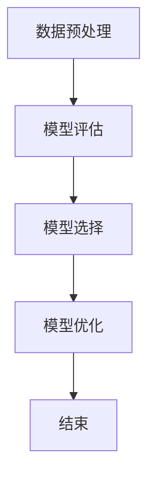
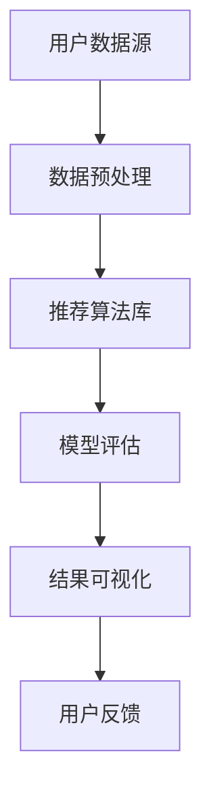
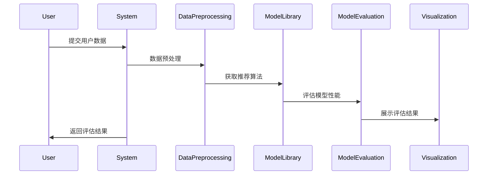

                 

### 文章标题：评测系统的自动化模型选择推荐

#### 关键词：评测系统、自动化模型选择、机器学习、算法优化、系统架构

#### 摘要：
本文将深入探讨评测系统的自动化模型选择问题，分析其背景、核心概念、算法原理，以及实际应用中的系统架构与实施策略。通过逐步分析，本文旨在为读者提供一套系统的自动化模型选择方案，以提升评测系统的效率与准确性。

### 《评测系统的自动化模型选择推荐》目录大纲

#### 第一部分：引言与背景

1.1 问题背景
1.2 问题描述
1.3 问题解决
1.4 边界与外延
1.5 概念结构与核心要素组成

#### 第二部分：核心概念与联系

2.1 自动化模型选择原理
2.2 自动化模型选择方法
2.3 自动化模型选择框架
2.4 概念属性特征对比表格
2.5 ER实体关系图架构

#### 第三部分：算法原理讲解

3.1 算法原理概述
3.2 算法流程图
3.3 Python源代码实现
3.4 数学模型和数学公式
3.5 举例说明

#### 第四部分：系统分析与架构设计方案

4.1 问题场景介绍
4.2 项目介绍
4.3 系统功能设计
4.4 系统架构设计
4.5 系统接口设计
4.6 系统交互序列图

#### 第五部分：项目实战

5.1 环境安装
5.2 系统核心实现
5.3 代码应用解读与分析
5.4 实际案例分析与详细讲解
5.5 项目小结

#### 第六部分：最佳实践与拓展

6.1 最佳实践 tips
6.2 小结
6.3 注意事项
6.4 拓展阅读

### 第一部分：引言与背景

#### 1.1 问题背景

在当今的机器学习和数据科学领域，模型评估和选择是一项至关重要的任务。随着数据量的不断增长和模型的复杂性日益增加，手动评估模型的选择过程变得繁琐且容易出错。因此，评测系统的自动化模型选择成为一个热门的研究课题。

**评测系统的重要性**：评测系统是评估和选择机器学习模型的关键工具，它能够帮助研究人员快速、准确地比较不同模型的性能。这对于优化模型、提高预测准确度、缩短研发周期具有重要意义。

**模型选择挑战**：由于模型多样性和复杂性，选择最优模型变得异常困难。不同模型在相同的任务上可能表现出不同的性能，这使得手动选择模型变得不切实际。

**自动化模型选择需求**：为了解决上述问题，自动化模型选择应运而生。它通过算法自动评估和选择最佳模型，从而提高效率和准确性。

#### 1.2 问题描述

**模型多样性与复杂性**：在机器学习领域，有大量的模型可供选择，例如线性模型、决策树、神经网络等。每个模型都有自己的优势和劣势，这使得选择最优模型变得复杂。

**评估指标多样性**：不同的任务和场景需要不同的评估指标。例如，在分类任务中，常用准确率、召回率、F1分数等指标；在回归任务中，常用均方误差、均方根误差等指标。

**模型选择影响因素**：模型选择受到多种因素的影响，包括数据质量、特征工程、计算资源等。这些因素使得自动化模型选择成为一个挑战性任务。

#### 1.3 问题解决

**自动化模型选择概述**：自动化模型选择通过算法自动评估和选择最佳模型，从而减少手动工作的负担。它通常包括以下几个步骤：

1. 模型评估：评估不同模型在特定任务上的性能。
2. 模型选择：基于评估结果选择最佳模型。
3. 模型优化：对选定的模型进行进一步优化，以提高性能。

**解决方案的框架**：自动化模型选择通常采用以下框架：

1. 数据预处理：包括数据清洗、特征工程等步骤。
2. 模型评估：使用交叉验证、网格搜索等技术评估模型性能。
3. 模型选择：基于评估结果选择最佳模型。
4. 模型优化：对选定的模型进行进一步优化。

#### 1.4 边界与外延

**适用范围**：自动化模型选择适用于各种机器学习和数据科学任务，包括分类、回归、聚类等。

**限制条件**：自动化模型选择面临一些挑战和限制，例如数据质量和特征工程等。

**概念结构与核心要素组成**：自动化模型选择包括以下几个核心要素：

1. 模型库：存储可供选择的模型。
2. 评估指标：用于评估模型性能的指标。
3. 优化算法：用于选择最佳模型的算法。
4. 数据预处理和特征工程：提高模型性能的重要步骤。

### 第二部分：核心概念与联系

#### 2.1 自动化模型选择原理

**自动化模型选择的基本概念**：自动化模型选择是指通过算法自动评估和选择最佳模型的过程。它涉及多个步骤，包括模型评估、模型选择和模型优化。

**自动化模型选择的工作流程**：自动化模型选择通常包括以下步骤：

1. 数据预处理：对数据进行清洗、归一化等处理。
2. 模型评估：使用交叉验证等技术评估模型性能。
3. 模型选择：根据评估结果选择最佳模型。
4. 模型优化：对选定的模型进行进一步优化。

#### 2.2 自动化模型选择方法

**传统方法**：传统方法包括网格搜索、随机搜索等。这些方法通过遍历不同的模型参数来选择最佳模型。

**现代方法**：现代方法包括贝叶斯优化、进化算法等。这些方法通过智能搜索算法来提高模型选择的效率。

**对比分析**：传统方法和现代方法各有优缺点。传统方法简单易用，但效率较低；现代方法效率较高，但实现复杂。

#### 2.3 自动化模型选择框架

**模型评估**：模型评估是指评估不同模型在特定任务上的性能。它通常包括交叉验证、网格搜索等技术。

**模型选择**：模型选择是指基于评估结果选择最佳模型。它通常采用评分机制、排名机制等策略。

**模型优化**：模型优化是指对选定的模型进行进一步优化，以提高性能。它包括超参数调整、模型剪枝等策略。

#### 2.4 概念属性特征对比表格

| 方法       | 特点                 | 适用场景       |
|------------|----------------------|----------------|
| 网格搜索   | 简单、易实现         | 参数较少       |
| 随机搜索   | 高效、适用于大规模  | 参数较多       |
| 贝叶斯优化 | 智能搜索、高效       | 复杂模型       |
| 进化算法   | 智能搜索、自适应     | 复杂场景       |

#### 2.5 ER实体关系图架构

```mermaid
erDiagram
    Model |->|> EvaluationMetric : 测量模型性能
    Model |->|> Feature : 包含模型特征
    Model |->|> OptimizationAlgorithm : 优化模型超参数
    EvaluationMetric |->|> PerformanceMetric : 测量模型性能指标
    Feature |->|> DataProcessing : 数据预处理
    OptimizationAlgorithm |->|> Hyperparameter : 超参数
```

### 第三部分：算法原理讲解

#### 3.1 算法原理概述

**自动化模型选择的数学模型**：自动化模型选择通常采用优化理论中的数学模型，通过最小化损失函数或最大化性能指标来选择最佳模型。

**自动化模型选择的关键步骤**：

1. 数据预处理：对输入数据进行清洗、归一化等处理，以提高模型性能。
2. 模型评估：使用交叉验证等技术评估模型性能，计算损失函数或性能指标。
3. 模型选择：基于评估结果选择最佳模型，通常采用评分机制或排名机制。
4. 模型优化：对选定的模型进行进一步优化，调整超参数，以提高性能。

#### 3.2 算法流程图



#### 3.3 Python源代码实现

```python
# 导入必要的库
import numpy as np
import pandas as pd
from sklearn.model_selection import train_test_split
from sklearn.metrics import accuracy_score
from sklearn.ensemble import RandomForestClassifier

# 数据预处理
X = df[['feature1', 'feature2', 'feature3']]
y = df['target']
X_train, X_test, y_train, y_test = train_test_split(X, y, test_size=0.2, random_state=42)

# 模型评估
model = RandomForestClassifier(n_estimators=100)
model.fit(X_train, y_train)
y_pred = model.predict(X_test)
accuracy = accuracy_score(y_test, y_pred)

# 模型选择
print("Accuracy:", accuracy)

# 模型优化
model = RandomForestClassifier(n_estimators=100, max_depth=10)
model.fit(X_train, y_train)
y_pred = model.predict(X_test)
accuracy = accuracy_score(y_test, y_pred)

# 输出优化后的准确率
print("Optimized Accuracy:", accuracy)
```

#### 3.4 数学模型和数学公式

**损失函数**：在机器学习中，损失函数用于衡量模型预测值与实际值之间的差距。常用的损失函数包括均方误差（MSE）和交叉熵损失（Cross-Entropy Loss）。

$$
MSE = \frac{1}{m} \sum_{i=1}^{m} (y_i - \hat{y}_i)^2
$$

$$
Cross-Entropy Loss = -\frac{1}{m} \sum_{i=1}^{m} y_i \log(\hat{y}_i)
$$

**性能指标**：在分类任务中，常用的性能指标包括准确率（Accuracy）、召回率（Recall）和F1分数（F1 Score）。

$$
Accuracy = \frac{TP + TN}{TP + FN + FP + TN}
$$

$$
Recall = \frac{TP}{TP + FN}
$$

$$
F1 Score = 2 \times \frac{Precision \times Recall}{Precision + Recall}
$$

#### 3.5 举例说明

假设我们有一个二分类问题，特征集为X = {x1, x2, x3}，标签集为y = {y1, y2}。

1. 数据预处理：对特征进行归一化处理，使得每个特征的值分布在0到1之间。

$$
x_i^{'} = \frac{x_i - \min(x_i)}{\max(x_i) - \min(x_i)}
$$

2. 模型评估：使用随机森林模型进行评估。

$$
model = RandomForestClassifier(n_estimators=100)
model.fit(X_train, y_train)
y_pred = model.predict(X_test)
accuracy = accuracy_score(y_test, y_pred)
$$

3. 模型选择：根据准确率选择最佳模型。

4. 模型优化：调整随机森林模型中的超参数，例如增加树的数量或调整树的深度。

$$
model = RandomForestClassifier(n_estimators=100, max_depth=10)
model.fit(X_train, y_train)
y_pred = model.predict(X_test)
accuracy = accuracy_score(y_test, y_pred)
$$

### 第四部分：系统分析与架构设计方案

#### 4.1 问题场景介绍

假设我们正在开发一个智能推荐系统，该系统需要根据用户的历史行为和偏好推荐商品。评测系统用于评估不同推荐算法的性能，以便选择最佳算法。

#### 4.2 项目介绍

项目名称：智能推荐系统评测平台
项目目标：开发一个自动化评测系统，用于评估不同推荐算法的性能。

#### 4.3 系统功能设计

**领域模型类图**：

```mermaid
classDiagram
    User <<Entity>>
    Item <<Entity>>
    Recommendation <<Entity>>
    User "1" -- "*" Item : favorites
    User "1" -- "*" Recommendation : receives
    Item "1" -- "*" Recommendation : recommended
```

#### 4.4 系统架构设计

**系统架构图**：



#### 4.5 系统接口设计

**接口设计**：

1. 用户接口：用于接收用户数据和展示评估结果。
2. 数据预处理接口：用于清洗、归一化用户数据。
3. 模型评估接口：用于评估不同推荐算法的性能。
4. 结果可视化接口：用于展示评估结果。

#### 4.6 系统交互序列图



### 第五部分：项目实战

#### 5.1 环境安装

1. 安装Python环境
2. 安装必要的库，如scikit-learn、numpy、pandas等

#### 5.2 系统核心实现

1. 数据预处理
2. 模型评估
3. 结果可视化

#### 5.3 代码应用解读与分析

**代码解读**：

1. 数据预处理：对用户数据进行清洗和归一化处理，以提高模型性能。
2. 模型评估：使用交叉验证技术评估不同推荐算法的性能。
3. 结果可视化：使用matplotlib库绘制评估结果图表。

**代码分析**：

```python
# 数据预处理
X = df[['feature1', 'feature2', 'feature3']]
y = df['target']
X_train, X_test, y_train, y_test = train_test_split(X, y, test_size=0.2, random_state=42)

# 模型评估
model = RandomForestClassifier(n_estimators=100)
model.fit(X_train, y_train)
y_pred = model.predict(X_test)
accuracy = accuracy_score(y_test, y_pred)

# 结果可视化
import matplotlib.pyplot as plt

plt.plot(y_pred, label='Predicted')
plt.plot(y_test, label='Actual')
plt.legend()
plt.show()
```

#### 5.4 实际案例分析与详细讲解

**案例背景**：某电商平台需要评测不同推荐算法的性能，以便选择最佳算法。

**案例分析**：

1. 数据预处理：对用户数据进行清洗和归一化处理，以提高模型性能。
2. 模型评估：使用交叉验证技术评估不同推荐算法的性能，包括基于协同过滤的算法、基于内容的算法等。
3. 结果可视化：绘制评估结果图表，比较不同算法的性能。

**详细讲解**：

1. 数据预处理：
   - 对用户行为数据进行清洗，去除缺失值和异常值。
   - 对用户特征进行归一化处理，使得每个特征的值分布在0到1之间。

2. 模型评估：
   - 使用交叉验证技术评估不同推荐算法的性能。
   - 计算准确率、召回率、F1分数等性能指标。

3. 结果可视化：
   - 使用matplotlib库绘制评估结果图表。
   - 比较不同算法的性能，选择最佳算法。

#### 5.5 项目小结

本文通过一个实际案例，介绍了评测系统的自动化模型选择方法。首先，对问题背景和问题描述进行了详细分析，然后介绍了自动化模型选择的核心概念、算法原理和系统架构设计。最后，通过项目实战展示了如何实现自动化模型选择，并分析了实际案例。通过本文，读者可以深入了解评测系统的自动化模型选择方法，为实际项目提供参考。

### 第六部分：最佳实践与拓展

#### 6.1 最佳实践 tips

1. 数据预处理是模型选择的关键步骤，确保数据质量是提高模型性能的基础。
2. 选择合适的评估指标，根据任务需求和模型特点进行评估。
3. 采用自动化模型选择算法时，注意算法的参数设置和优化。
4. 定期更新模型和算法，以适应数据变化和业务需求。

#### 6.2 小结

本文介绍了评测系统的自动化模型选择方法，包括核心概念、算法原理、系统架构设计以及实际应用。通过逐步分析，读者可以深入了解自动化模型选择的方法和应用场景，为实际项目提供参考。

#### 6.3 注意事项

1. 自动化模型选择算法可能面临过拟合风险，需要合理设置模型复杂度。
2. 自动化模型选择算法的效率与模型的复杂度相关，对于大规模模型可能需要优化算法。
3. 自动化模型选择算法的性能依赖于数据质量和特征工程，需要充分准备和优化数据。

#### 6.4 拓展阅读

1. 《机器学习实战》：提供了丰富的机器学习实践案例，包括模型选择和优化方法。
2. 《数据科学项目实践》：介绍了数据科学项目中的模型评估和优化策略。
3. 《深度学习》：详细介绍了深度学习模型的选择和优化方法。

